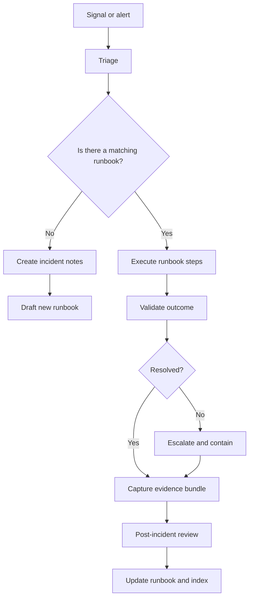

<!-- [KFM_META_BLOCK_V2]
doc_id: kfm://doc/8a1d7fbb-0ee8-4b6e-8e1b-6a0e0b20d6b2
title: Runbooks
type: standard
version: v1
status: draft
owners: TBD
created: 2026-02-24
updated: 2026-02-24
policy_label: restricted
related:
  - docs/README.md
tags: [kfm, runbooks, operations]
notes:
  - Directory-level README for operational runbooks.
  - This file intentionally avoids repo-specific commands until verified.
[/KFM_META_BLOCK_V2] -->

# 🧰 Runbooks
Operational procedures for keeping the Kansas‑Matrix‑System **safe, buildable, auditable, and reversible**.


> **WARNING**
> Runbooks may describe operational steps that can impact data integrity, access controls, or production uptime.
> If a step is unclear or unverified, **fail closed**: stop, capture evidence, and route for governance/owner review.

---

## Quick navigation
- [Purpose](#purpose)
- [When to use a runbook](#when-to-use-a-runbook)
- [Directory structure](#directory-structure)
- [Runbook index](#runbook-index)
- [Runbook authoring standard](#runbook-authoring-standard)
- [Incident workflow](#incident-workflow)
- [Promotion gates and evidence](#promotion-gates-and-evidence)
- [Contributing](#contributing)
- [FAQ](#faq)

---

## Purpose
This directory is the **single home** for repeatable operational procedures (“runbooks”) used to:
- Recover from incidents (data, pipeline, API, UI, infra).
- Execute routine maintenance safely (backfills, re-index, rollouts).
- Perform controlled changes (config updates, migrations, promotions).
- Produce **audit-ready** evidence for governance and traceability.

### Where it fits in the repo
`docs/runbooks/` is the operator-facing layer of documentation:
- **Design docs** explain “why” and “what we built”.
- **Runbooks** explain “how we operate it safely” with **preconditions + steps + rollback + validation + evidence**.

---

## When to use a runbook
Use a runbook when **any** of the following is true:
- You are about to touch **production** (or anything that can reach it).
- You are promoting data across lifecycle zones (Raw → Work/Quarantine → Processed → Published).
- You are changing governance boundaries (permissions, redaction, policy labeling).
- You need to restore service, re-run pipelines, or remediate data quality issues.

> **NOTE**
> A “how-to” that changes system behavior belongs here. A “conceptual explanation” belongs elsewhere.

---

## Directory structure

### Current
- `docs/runbooks/README.md` — this file.

### Recommended (proposed; not confirmed in repo)
Additive structure that keeps runbooks discoverable without forcing a huge taxonomy:

```
docs/runbooks/
  README.md
  templates/
    runbook-template.md
    evidence-bundle-template.md
  incidents/
    rb-incident-triage.md
    rb-incident-sev1.md
  pipelines/
    rb-pipeline-rerun.md
    rb-pipeline-backfill.md
    rb-pipeline-promote-zone.md
  data/
    rb-data-qa-failures.md
    rb-data-redaction-review.md
  indexing/
    rb-index-rebuild.md
    rb-index-backfill.md
  api/
    rb-api-deploy.md
    rb-api-rollback.md
  ui/
    rb-ui-deploy.md
    rb-ui-feature-flag.md
  governance/
    rb-policy-label-change.md
    rb-access-review.md
  _assets/
    diagrams/
```

> **TIP**
> Keep “templates” and “runbooks” separate. Templates change rarely; runbooks evolve frequently.

### Acceptable inputs (what belongs here)
- Runbook markdown files with:
  - purpose + scope + owner + last verified date
  - preconditions + step-by-step actions
  - validation + rollback
  - evidence/audit artifacts checklist
- Small, safe helper scripts *only if* they are:
  - deterministic
  - reviewed
  - clearly scoped to a runbook
  - do not embed secrets

### Exclusions (what must not go here)
- ❌ Secrets, tokens, credentials, private keys, connection strings.
- ❌ Raw sensitive datasets or exports.
- ❌ “Permanent” architecture decisions (put in ADRs / design docs).
- ❌ One-off personal notes not meant for shared operations.
- ❌ Instructions that bypass governance/policy boundaries.

---

## Runbook index

> **NOTE**
> The table below is meant to be **complete** over time. If you add a runbook, add it here.

| Runbook ID | Area | Title | Trigger / Use-case | Blast radius | Owner | Last verified | Status | Link |
|---|---|---|---|---|---|---:|---|---|
| RB-TEMPLATE | templates | Runbook Template | Authoring | none | TBD | n/a | draft | `templates/runbook-template.md` |
| RB-XXX | TBD | TBD | TBD | TBD | TBD | TBD | draft | `TBD` |

**Index rules**
- IDs are stable: `RB-<AREA>-<SHORTNAME>` (example: `RB-PIPELINE-BACKFILL`).
- “Last verified” should be a real date; if unknown, set `UNVERIFIED`.
- “Blast radius” should be conservative: `none`, `dev`, `staging`, `prod`, `multi-env`.

---

## Runbook authoring standard

### Naming
- File name: `rb-<area>-<slug>.md`
- Title should match the file’s purpose, not the implementation detail.
- Keep verbs first for action runbooks: “Rebuild…”, “Rollback…”, “Promote…”, “Re-run…”.

### Required sections
A runbook is not “done” unless it contains:

- **Purpose and scope**
- **Policy label** (public/restricted/…)
- **Preconditions** (permissions, environment, backups, feature flags)
- **Safety / default-deny notes**
- **Step-by-step procedure**
- **Validation** (how you know it worked)
- **Rollback** (how to undo safely)
- **Audit / evidence bundle** (what artifacts to capture)

### Runbook template (copy/paste)
Create `docs/runbooks/<area>/rb-<area>-<slug>.md`:

```md
<!-- [KFM_META_BLOCK_V2]
doc_id: kfm://doc/<uuid>
title: <Runbook title>
type: standard
version: v1
status: draft
owners: <team or name>
created: YYYY-MM-DD
updated: YYYY-MM-DD
policy_label: restricted
related:
  - <design doc / ADR / pipeline spec links>
tags: [kfm, runbook, <area>]
notes:
  - last_verified: YYYY-MM-DD | UNVERIFIED
  - blast_radius: none|dev|staging|prod|multi-env
[/KFM_META_BLOCK_V2] -->

# <Runbook title>

## Purpose
<What this accomplishes.>

## Scope
- Included:
- Excluded:

## Preconditions
- Access:
- Environment:
- Backups / snapshots:
- Change window:

## Safety notes
- Default-deny triggers:
- Known risky steps:

## Procedure
1. Step
2. Step

## Validation
- What to check:
- Expected result:

## Rollback
- How to undo:
- When rollback is mandatory:

## Evidence bundle
Attach/record:
- Commands executed (with timestamps)
- Inputs/outputs checksums where applicable
- Links to logs
- Policy decisions (who/when/why)
```

---

## Incident workflow



**Incident invariants**
- Prefer **small reversible actions** over “big bang” changes.
- Every action must be traceable to an operator + time + reason.
- If evidence can’t be captured, treat as **not completed**.

---

## Promotion gates and evidence
Runbooks that move data or artifacts across lifecycle zones (Raw → Work/Quarantine → Processed → Published) must enforce:

### Minimum evidence bundle checklist
- [ ] Metadata present (identity, schema, extents, license, sensitivity)
- [ ] Validation results attached (checks + thresholds)
- [ ] Provenance links (inputs, transforms, tool versions)
- [ ] Checksums / integrity identifiers
- [ ] Policy decisions recorded (who/what/when/why)
- [ ] Rollback plan documented (or “irreversible” flagged and approved)

### Gate behavior
- Gates **fail closed** by default.
- If a gate requires an artifact you don’t have, stop and record:
  - the missing artifact
  - why it is required
  - the smallest acceptable substitute (if any)

---

## Contributing

### Definition of Done for a new runbook
- [ ] Added to [Runbook index](#runbook-index)
- [ ] Has an owner (not “TBD”)
- [ ] Has a real “last_verified” date or explicitly `UNVERIFIED`
- [ ] Includes rollback and validation
- [ ] Does not contain secrets or sensitive raw extracts
- [ ] Reviewed by someone outside the author (minimum 1 reviewer)

### Review checklist (for reviewers)
- [ ] Steps are deterministic and ordered
- [ ] Preconditions are explicit (permissions, env)
- [ ] Failure modes are described and safe
- [ ] Rollback is realistic
- [ ] Evidence bundle is sufficient for audit/reproduction

---

## FAQ

### Why “restricted” by default?
Runbooks often include operational knowledge that can increase risk if publicly exposed. Start restricted, then downgrade if governance explicitly allows.

### Can a runbook include exact commands?
Yes, **if verified** and **safe**. Prefer:
- “dry run” steps first
- explicit environment scoping
- explicit expected outputs
If commands depend on local tooling, include alternatives or clearly label as “repo-specific”.

### What if I’m unsure whether something belongs here?
If it changes system behavior, touches production, or affects governance/data promotion: it belongs here.

---

<a id="top"></a>
Back to top: [Quick navigation](#quick-navigation)
