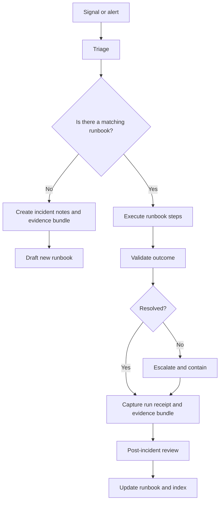

<!-- [KFM_META_BLOCK_V2]
doc_id: kfm://doc/8a1d7fbb-0ee8-4b6e-8e1b-6a0e0b20d6b2
title: Runbooks
type: standard
version: v1
status: draft
owners: TBD
created: 2026-02-24
updated: 2026-03-01
policy_label: restricted
related:
  - docs/README.md
tags: [kfm, runbooks, operations]
notes:
  - Directory-level README for operational runbooks.
  - This file intentionally avoids repo-specific commands until verified.
  - last_verified: UNVERIFIED
[/KFM_META_BLOCK_V2] -->

<a id="top"></a>

# 🧰 Runbooks
Operational procedures for keeping the Kansas‑Matrix‑System **safe, buildable, auditable, and reversible**.


> **WARNING**
> Runbooks may describe operational steps that can impact data integrity, access controls, or production uptime.
> If a step is unclear or unverified, **fail closed**: stop, capture evidence, and route for governance/owner review.

---

## Quick navigation
- [Purpose](#purpose)
- [Normative language and tagging](#normative-language-and-tagging)
- [When to use a runbook](#when-to-use-a-runbook)
- [Directory structure](#directory-structure)
- [Runbook index](#runbook-index)
- [Runbook authoring standard](#runbook-authoring-standard)
- [Incident workflow](#incident-workflow)
- [Promotion gates and evidence](#promotion-gates-and-evidence)
- [Contributing](#contributing)
- [FAQ](#faq)

---

## Purpose
This directory is the **single home** for repeatable operational procedures (“runbooks”) used to:
- Recover from incidents (data, pipeline, API, UI, infra).
- Execute routine maintenance safely (backfills, re-index, rollouts).
- Perform controlled changes (config updates, migrations, promotions).
- Produce **audit-ready** evidence for governance and traceability.

### Where it fits in the repo
`docs/runbooks/` is the operator-facing layer of documentation:
- **Design docs** explain “why” and “what we built”.
- **Runbooks** explain “how we operate it safely” with **preconditions + steps + validation + rollback + evidence**.

### Operational invariants
Runbooks MUST preserve KFM’s two core operational invariants:

1) **Truth path lifecycle (zones + gates)**  
A runbook that moves or republishes artifacts MUST respect the truth path (conceptually):
`Upstream → RAW → WORK/QUARANTINE → PROCESSED → CATALOG/TRIPLET → PUBLISHED`.

2) **Trust membrane / policy boundary**  
If an action touches **PUBLISHED surfaces** (what users/clients can access), it MUST go through the governed policy boundary (PEP/API) or an explicitly approved “breakglass” procedure.
If you believe you need breakglass access and no approved runbook exists: **stop and escalate**.

---

## Normative language and tagging
To avoid accidental overreach, runbooks and runbook docs use:

- **MUST / MUST NOT / SHOULD / MAY** in the RFC sense (requirements vs guidance).
- Tagging for repository posture:
  - **CONFIRMED** — invariant / contract that should not be violated.
  - **PROPOSED** — recommended default pending repo verification.
  - **UNKNOWN** — requires verification in the current repo/environment.

> **NOTE**
> This README intentionally avoids repo-specific commands until verified.

---

## When to use a runbook
Use a runbook when **any** of the following is true:
- You are about to touch **production** (or anything that can reach it).
- You are promoting artifacts across lifecycle zones (RAW/WORK → PROCESSED → CATALOG/TRIPLET → PUBLISHED).
- You are changing governance boundaries (permissions, redaction, policy labeling).
- You need to restore service, re-run pipelines, remediate data quality, or rebuild indexes.
- You are considering any action that could **bypass the trust membrane**.

> **NOTE**
> A “how-to” that changes system behavior belongs here. A “conceptual explanation” belongs elsewhere.

---

## Directory structure

### Current
- `docs/runbooks/README.md` — this file.

### Recommended structure
> **PROPOSED**
> The structure below is an additive starting taxonomy to keep runbooks discoverable.
> Verify against the repo before creating new directories.
>
> **Conventions**
> - Each top-level area folder SHOULD include its own `README.md` index.
> - All runbook files SHOULD follow: `rb-<area>-<slug>.md`.
> - `_prefixed` directories are meta/assets and MUST NOT contain secrets or raw sensitive data.

<details>
<summary><strong>Proposed directory layout (fully expanded)</strong></summary>

```
docs/runbooks/                                          # Operational runbooks (production-grade, step-by-step)
├─ README.md                                            # Index + standards + incident flow + promotion gates
│
├─ _registry/                                           # Machine-checkable registry for completeness (CI-friendly)
│  ├─ runbooks.yml                                      # Canonical index (source of truth for tables below)
│  ├─ runbooks.schema.json                              # JSON Schema to validate runbooks.yml
│  ├─ owners.yml                                        # Canonical owner aliases/teams (avoid "TBD" drift)
│  ├─ areas.yml                                         # Allowed area codes (incident/pipeline/data/...)
│  ├─ severities.yml                                    # SEV definitions + escalation policy (meta)
│  └─ tags.yml                                          # Allowed tags (optional)
│
├─ templates/                                           # Authoring templates (copy/paste starters)
│  ├─ runbook-template.md                               # Standard runbook format (scope → steps → verify → rollback)
│  ├─ evidence-bundle-template.md                       # Packaging evidence during incidents/changes
│  ├─ incident-notes-template.md                        # Live incident notes capture (timeline + hypotheses + actions)
│  ├─ comms-update-template.md                          # Slack/email/statuspage update format
│  ├─ postmortem-template.md                            # PIR template (what/why/fix/guardrail/tests)
│  ├─ change-record-template.md                         # “Change ticket” / decision record (risk + rollback + approvals)
│  ├─ checklist-template.md                             # Generic checklist template (gates, preflight, closeout)
│  ├─ policy-decision-template.json                     # PolicyDecision skeleton (NO real data)
│  ├─ run-receipt-template.json                         # RunReceipt skeleton (NO real data)
│  └─ release-manifest-template.json                    # Promotion/release manifest skeleton (NO real data)
│
├─ _shared/                                             # Shared operator references (no commands; process + definitions)
│  ├─ README.md                                         # What belongs here + boundaries
│  ├─ glossary.md                                       # Shared vocabulary (zones, receipts, bundles, obligations)
│  ├─ roles-and-rotations.md                            # Incident roles (IC/Comms/Scribe) + duty rotation notes
│  ├─ severity-matrix.md                                # Severity rubric + stop-the-line criteria
│  ├─ default-deny-guide.md                             # “Fail closed” patterns + examples
│  ├─ evidence-and-verification.md                      # Evidence bundle rules + what “verified” means
│  └─ rollback-decision-tree.md                         # Rollback triggers + irreversible change flags
│
├─ incidents/                                           # Incident response procedures
│  ├─ README.md                                         # How incidents run; how to choose playbooks
│  ├─ rb-incident-triage.md                             # Triage checklist (identify, contain, communicate)
│  ├─ rb-incident-sev1.md                               # SEV1 playbook (roles, comms, mitigation, postmortem)
│  ├─ rb-incident-comms.md                              # Comms cadence + channels + update templates
│  ├─ rb-incident-evidence-capture.md                   # Evidence bundle capture rules during response
│  ├─ rb-incident-escalation.md                         # Escalation ladder + “stop-the-line” criteria
│  ├─ rb-incident-postmortem.md                         # PIR workflow + follow-up gates
│  │
│  ├─ playbooks/                                        # Symptom-driven, fast lookup (use during triage)
│  │  ├─ README.md
│  │  ├─ rb-incident-api-5xx-spike.md                    # API error spike: contain → verify → rollback
│  │  ├─ rb-incident-auth-failure.md                     # Auth/RBAC failures: contain + policy checks
│  │  ├─ rb-incident-policy-regression.md               # Policy deny/allow regression: bundle rollback
│  │  ├─ rb-incident-pipeline-stuck.md                  # Pipeline stuck: pause scheduler, inspect receipts
│  │  ├─ rb-incident-data-integrity.md                  # Suspected corruption: quarantine + checksums
│  │  ├─ rb-incident-stac-generation-failure.md         # STAC/CatGen failure: contain + rebuild + validate
│  │  ├─ rb-incident-evidence-resolver-failure.md       # Evidence resolver failures: fail closed + restore
│  │  ├─ rb-incident-index-lag.md                       # Search/tiles lag: rebuild/warmup checklist
│  │  ├─ rb-incident-ui-outage.md                       # UI outage: feature-flag disable + rollback
│  │  ├─ rb-incident-storage-quota.md                   # Storage saturation: contain + expand + cleanup
│  │  ├─ rb-incident-focus-citation-break.md            # Focus Mode citations break: contain + revert + verify
│  │  └─ rb-incident-sensitive-leak-suspected.md        # Suspected sensitive leak: contain + deny-all + audit
│  │
│  └─ drills/                                           # Game day / tabletop exercises
│     ├─ README.md
│     ├─ rb-drill-sev1-sim.md                            # SEV1 simulation procedure + scoring
│     ├─ rb-drill-data-promotion-fail.md                 # Promotion gate failure simulation
│     ├─ rb-drill-policy-deny-all.md                     # Breakglass deny-all rehearsal (with approvals)
│     └─ rb-drill-evidence-resolver-outage.md            # Evidence resolver outage simulation
│
├─ change/                                              # Controlled change workflow (non-incident)
│  ├─ README.md
│  ├─ rb-change-intake.md                               # Intake checklist (scope, env, approvals, evidence plan)
│  ├─ rb-change-execute.md                              # Execute safely (dry run → canary → validate)
│  ├─ rb-change-rollback.md                             # Rollback decision + steps + verification
│  ├─ rb-change-closeout.md                             # Closeout (evidence, notes, follow-ups, index update)
│  └─ checklists/
│     ├─ README.md
│     ├─ rb-change-preflight-checklist.md               # Preflight: backups, approvals, blast radius, comms
│     ├─ rb-change-risk-assessment.md                   # Risk matrix usage + mitigation checklist
│     └─ rb-change-rollback-readiness.md                # Rollback readiness verification
│
├─ pipelines/                                           # Pipeline operations (reruns, backfills, promotions)
│  ├─ README.md
│  ├─ rb-pipeline-onboard-dataset.md                    # Step-by-step: onboard a new dataset family/source
│  ├─ rb-pipeline-restart-failed-job.md                 # Restart/recover failed ETL job safely
│  ├─ rb-pipeline-rerun.md                              # Safe rerun procedure (idempotency + receipts)
│  ├─ rb-pipeline-backfill.md                           # Backfill procedure (scope, scheduling, rollback)
│  ├─ rb-pipeline-promote-truth-path.md                 # Promote through truth path (gates + fail-closed)
│  ├─ rb-pipeline-quarantine.md                         # Quarantine workflow (why, duration, unblock criteria)
│  ├─ rb-pipeline-rollback-dataset-version.md           # Roll back a bad dataset version (governed)
│  ├─ rb-pipeline-receipt-verify.md                     # Receipt verification checklist (inputs/outputs/tool versions)
│  ├─ rb-pipeline-reissue-receipts.md                   # Re-issue receipts (ONLY if governed + approved)
│  ├─ rb-pipeline-scheduler-pause.md                    # Pause scheduled runs (containment and safety)
│  ├─ rb-pipeline-scheduler-resume.md                   # Resume + verify no backlog hazards
│  ├─ rb-pipeline-hotfix.md                             # Emergency pipeline patch w/ explicit approvals + rollback
│  └─ zones/                                            # Optional: zone-specific operator checklists
│     ├─ README.md
│     ├─ raw/
│     │  ├─ README.md
│     │  ├─ rb-pipeline-raw-acquisition-manifest.md     # Acquire + record terms snapshot + checksums
│     │  └─ rb-pipeline-raw-integrity-verify.md         # Verify raw immutability + digest map
│     ├─ work/
│     │  ├─ README.md
│     │  ├─ rb-pipeline-work-run-qa.md                  # Run QA suite + capture reports
│     │  └─ rb-pipeline-work-redaction-candidates.md    # Generate/track redaction candidates
│     ├─ quarantine/
│     │  ├─ README.md
│     │  ├─ rb-pipeline-quarantine-enter.md             # Enter quarantine (reasons, evidence)
│     │  └─ rb-pipeline-quarantine-exit.md              # Exit quarantine (criteria, approvals)
│     ├─ processed/
│     │  ├─ README.md
│     │  ├─ rb-pipeline-processed-build-artifacts.md    # Build publishable artifacts + digests
│     │  └─ rb-pipeline-processed-digest-verify.md      # Verify processed digests + deterministic naming
│     ├─ catalog/
│     │  ├─ README.md
│     │  ├─ rb-pipeline-catalog-run-catgen.md           # Run catalog generator step (CatGen)
│     │  └─ rb-pipeline-catalog-linkcheck.md            # Run schema + cross-link validation
│     └─ published/
│        ├─ README.md
│        ├─ rb-pipeline-published-release-manifest.md   # Create/verify release manifest for promotion
│        └─ rb-pipeline-published-smoke-tests.md        # Post-publish smoke tests across API/UI/Focus
│
├─ data/                                                # Data quality + redaction operations
│  ├─ README.md
│  ├─ qa/
│  │  ├─ README.md
│  │  ├─ rb-data-qa-failures.md                         # QA failure triage (thresholds, diffs, quarantine)
│  │  ├─ rb-data-diff-compare.md                        # DatasetVersion diff workflow (what changed + why)
│  │  └─ rb-data-drift-thresholds.md                    # Drift thresholds review + tuning (governed)
│  ├─ sensitivity/
│  │  ├─ README.md
│  │  ├─ rb-data-sensitivity-assess.md                  # Sensitivity classification + policy label recommendation
│  │  └─ rb-data-redaction-review.md                    # Redaction review/approval (obligations, sign-off)
│  ├─ schemas/
│  │  ├─ README.md
│  │  ├─ rb-data-schema-change.md                       # Schema evolution (compat rules, versioning, migrations)
│  │  └─ rb-data-schema-compatibility.md                # Back/forward compat rules + contract tests
│  ├─ restore/
│  │  ├─ README.md
│  │  ├─ rb-data-restore-from-raw.md                    # Restore procedure (RAW as immutable source of truth)
│  │  └─ rb-data-restore-from-processed.md              # Restore from PROCESSED artifacts (when allowed)
│  └─ deprecation/
│     ├─ README.md
│     ├─ rb-data-tombstone.md                           # Tombstone/deprecate dataset artifacts safely
│     └─ rb-data-deprecate-dataset-version.md           # Deprecate version + update catalogs + UI coherence
│
├─ catalog/                                             # DCAT/STAC/PROV catalog operations (often cross-cutting)
│  ├─ README.md
│  ├─ rb-catalog-build.md                               # Build catalogs from processed artifacts
│  ├─ rb-catalog-validate.md                            # Validate catalog integrity (schemas + links)
│  ├─ rb-catalog-publish.md                             # Publish catalog bundle through governed boundary
│  ├─ rb-catalog-rebuild-all.md                         # Full rebuild (when + safety + verification)
│  ├─ rb-catalog-deprecate-dataset.md                   # Deprecation workflow (catalog + UI + API coherence)
│  ├─ catgen/
│  │  ├─ README.md
│  │  ├─ rb-catalog-catgen-rerun.md                     # Re-run CatGen (rebuild catalogs)
│  │  ├─ rb-catalog-catgen-recover.md                   # Recover from CatGen partial failure
│  │  └─ rb-catalog-catgen-version-pin.md               # Pin/roll policy-safe CatGen version (if applicable)
│  └─ linkcheck/
│     ├─ README.md
│     ├─ rb-catalog-linkcheck-run.md                    # Run linkcheck/validators (CI parity)
│     └─ rb-catalog-linkcheck-failures.md               # Diagnose linkcheck failures + safe remediation
│
├─ evidence/                                            # Evidence-first operations (bundles, refs, redaction)
│  ├─ README.md
│  ├─ bundles/
│  │  ├─ README.md
│  │  ├─ rb-evidence-bundle-create.md                   # Bundle creation (what must be captured)
│  │  ├─ rb-evidence-ref-resolve.md                     # EvidenceRef → EvidenceBundle resolution checks
│  │  └─ rb-evidence-bundle-verify.md                   # Verify bundle integrity + policy label consistency
│  ├─ receipts/
│  │  ├─ README.md
│  │  ├─ rb-evidence-run-receipt-generate.md            # Generate run receipts (schema + required fields)
│  │  ├─ rb-evidence-run-receipt-verify.md              # Verify receipt digests + environment capture
│  │  └─ rb-evidence-run-receipt-reissue.md             # Re-issue receipts (governed, approval-required)
│  ├─ redaction/
│  │  ├─ README.md
│  │  ├─ rb-evidence-redaction-apply.md                 # Apply redaction obligations workflow + verification
│  │  └─ rb-evidence-redaction-verify.md                # Verify obligations honored in artifacts + bundles
│  ├─ ledger/
│  │  ├─ README.md
│  │  ├─ rb-evidence-audit-ledger-append.md             # Append audit ledger entries (who/what/when/why)
│  │  └─ rb-evidence-audit-ledger-verify.md             # Verify ledger immutability/append-only invariants
│  └─ retention/
│     ├─ README.md
│     ├─ rb-evidence-retention.md                       # Retention policy + secure disposal process
│     └─ rb-evidence-secure-disposal.md                 # Secure disposal (redacted + approved)
│
├─ indexing/                                            # Index/projection ops (search/graph/tiles)
│  ├─ README.md
│  ├─ rb-index-rebuild.md                               # Full rebuild (prereqs, timing, verification)
│  ├─ rb-index-backfill.md                              # Backfill new projections (scope, safety, rollback)
│  ├─ rb-index-warmup.md                                # Warm caches after rebuild/deploy
│  ├─ rb-index-verify-freshness.md                      # “Is the index stale?” checklist (SLAs, timestamps)
│  ├─ search/
│  │  ├─ README.md
│  │  ├─ rb-index-search-rebuild.md                     # Search index rebuild (freshness + consistency checks)
│  │  ├─ rb-index-search-backfill.md                    # Backfill new fields/mappings
│  │  └─ rb-index-search-zero-downtime.md               # Zero/low-downtime rebuild strategy (if supported)
│  ├─ tiles/
│  │  ├─ README.md
│  │  ├─ rb-index-tiles-rebuild.md                      # Vector/raster tile rebuild (cache + warmup steps)
│  │  ├─ rb-index-tiles-cache-purge.md                  # Cache invalidation (blast radius + verify)
│  │  └─ rb-index-tiles-warmup.md                       # Warm tile caches after rebuild
│  ├─ graph/
│  │  ├─ README.md
│  │  ├─ rb-index-graph-rebuild.md                      # Graph/relationships rebuild (if applicable)
│  │  ├─ rb-index-graph-backfill.md                     # Backfill edges/labels after schema change
│  │  └─ rb-index-graph-integrity-check.md              # Verify graph invariants (counts, edges, constraints)
│  └─ postgis/
│     ├─ README.md
│     ├─ rb-index-postgis-rebuild.md                    # Rebuild derived tables/views from canonical artifacts
│     ├─ rb-index-postgis-vacuum-analyze.md             # Maintenance (when allowed; verify impact)
│     └─ rb-index-postgis-reindex.md                    # Reindex operation (with rollback plan)
│
├─ api/                                                 # API deploy operations
│  ├─ README.md
│  ├─ deploy/
│  │  ├─ README.md
│  │  ├─ rb-api-deploy.md                               # Deploy (health checks, canary, rollback hooks)
│  │  ├─ rb-api-rollback.md                             # Rollback (version pin, migrations, verification)
│  │  └─ rb-api-smoke-tests.md                          # Smoke tests (policy-safe endpoints)
│  ├─ migrations/
│  │  ├─ README.md
│  │  ├─ rb-api-migrations.md                           # DB migrations (safe order, locks, rollback constraints)
│  │  └─ rb-api-migration-rollback.md                   # Migration rollback guidance (when possible)
│  ├─ cache/
│  │  ├─ README.md
│  │  ├─ rb-api-cache-invalidate.md                     # Cache invalidation (blast radius + verification)
│  │  └─ rb-api-cache-incident.md                       # Cache-related incident triage
│  ├─ contracts/
│  │  ├─ README.md
│  │  ├─ rb-api-schema-contract-change.md               # OpenAPI/schema changes (compat + versioning)
│  │  └─ rb-api-versioning.md                           # Versioning policy + deprecation plan
│  └─ emergency/
│     ├─ README.md
│     ├─ rb-api-emergency-readonly.md                   # Read-only mode (containment + recovery)
│     └─ rb-api-emergency-disable-endpoint.md           # Disable endpoint (feature flag / router rule)
│
├─ ui/                                                  # UI deploy + runtime toggles
│  ├─ README.md
│  ├─ deploy/
│  │  ├─ README.md
│  │  ├─ rb-ui-deploy.md                                # UI deploy (smoke tests, monitoring)
│  │  ├─ rb-ui-rollback.md                              # Rollback UI (safe pin/revert)
│  │  └─ rb-ui-smoke-tests.md                           # UI smoke tests (map/story/evidence drawer)
│  ├─ feature-flags/
│  │  ├─ README.md
│  │  ├─ rb-ui-feature-flag.md                          # Feature flag changes (approval + audit + revert)
│  │  └─ rb-ui-feature-flag-audit.md                    # Audit requirements for flag changes
│  ├─ caching/
│  │  ├─ README.md
│  │  ├─ rb-ui-cache-purge.md                           # CDN/browser cache issues (safe busting)
│  │  └─ rb-ui-cdn-incident.md                          # CDN incident containment playbook
│  ├─ story/
│  │  ├─ README.md
│  │  ├─ rb-ui-story-node-publish.md                    # Story content publish (evidence refs + policy label)
│  │  ├─ rb-ui-emergency-banner.md                      # Emergency banner messaging + removal criteria
│  │  └─ rb-ui-story-citations-failure.md               # Publishing blocked due to citation failures
│  └─ map/
│     ├─ README.md
│     ├─ rb-ui-map-style-update.md                      # Map style update workflow (verify legends + scale)
│     ├─ rb-ui-layer-debug.md                           # Layer rendering/debug checklist
│     └─ rb-ui-time-control-debug.md                    # Timeline/time control debug checklist
│
├─ focus/                                               # Focus Mode operations (cite-or-abstain + evaluation)
│  ├─ README.md
│  ├─ ops/
│  │  ├─ README.md
│  │  ├─ rb-focus-run-eval-harness.md                   # Run evaluation harness + store diffs
│  │  ├─ rb-focus-regression-triage.md                  # Regression triage (golden queries + blame)
│  │  └─ rb-focus-model-version-pin.md                  # Pin/rollback model version (if supported)
│  ├─ safety/
│  │  ├─ README.md
│  │  ├─ rb-focus-prompt-injection-incident.md          # Prompt injection response (contain + harden)
│  │  ├─ rb-focus-restricted-leak-investigation.md      # Restricted leak investigation (deny + audit)
│  │  └─ rb-focus-citation-gate-override.md             # Override procedure (breakglass; approval required)
│  └─ evidence/
│     ├─ README.md
│     ├─ rb-focus-evidence-retrieval-failure.md         # Evidence retrieval failures: diagnose + restore
│     └─ rb-focus-citation-broken.md                    # Broken citations: repair + verify resolvability
│
├─ policy/                                              # Policy engine operations (OPA/Rego or equivalent)
│  ├─ README.md
│  ├─ bundles/
│  │  ├─ README.md
│  │  ├─ rb-policy-bundle-build.md                      # Build policy bundles (tests required)
│  │  ├─ rb-policy-bundle-publish.md                    # Publish policy bundles (canary + rollback)
│  │  └─ rb-policy-bundle-rollback.md                   # Rollback policy bundles (explicit criteria)
│  ├─ regression/
│  │  ├─ README.md
│  │  ├─ rb-policy-regression-triage.md                 # Identify deny/allow deltas + root cause workflow
│  │  └─ rb-policy-deny-allow-diff.md                   # Produce allow/deny diff report (evidence)
│  ├─ obligations/
│  │  ├─ README.md
│  │  ├─ rb-policy-obligation-change.md                 # Obligation changes (downstream impact analysis)
│  │  └─ rb-policy-obligation-verify.md                 # Verify obligations applied end-to-end
│  └─ emergency/
│     ├─ README.md
│     ├─ rb-policy-emergency-deny-all.md                # Emergency containment (explicit approval required)
│     └─ rb-policy-emergency-allowlist.md               # Emergency allowlist (timeboxed + audited)
│
├─ governance/                                          # Governance operations (reviews, access, labels, approvals)
│  ├─ README.md
│  ├─ labels/
│  │  ├─ README.md
│  │  ├─ rb-governance-policy-label-change.md           # Policy label change workflow (review, impact)
│  │  └─ rb-governance-policy-label-review.md           # Periodic label review cadence + evidence
│  ├─ access/
│  │  ├─ README.md
│  │  ├─ rb-governance-access-review.md                 # Access review (least privilege, audit evidence)
│  │  ├─ rb-governance-access-grant.md                  # Grant workflow (who approves + evidence)
│  │  └─ rb-governance-access-revoke.md                 # Revoke workflow (timing + verification)
│  ├─ promotions/
│  │  ├─ README.md
│  │  ├─ rb-governance-release-promotion-approve.md     # Promotion approval ceremony (gates + sign-off)
│  │  ├─ rb-governance-release-promotion-block.md       # How to block/rollback promotion safely
│  │  └─ rb-governance-release-promotion-audit.md       # Audit evidence requirements for promotion
│  └─ releases/
│     ├─ README.md
│     ├─ rb-governance-data-release-notes.md            # Release notes (what changed + evidence links)
│     ├─ rb-governance-release-manifest-create.md       # Create release manifest (governed)
│     └─ rb-governance-release-manifest-verify.md       # Verify manifest references match artifacts
│
├─ security/                                            # Security runbooks (incident response + hygiene)
│  ├─ README.md
│  ├─ rb-security-incident-triage.md                    # Security triage (containment + evidence)
│  ├─ rb-security-vulnerability-response.md             # Vulnerability response (patch → verify → closeout)
│  ├─ rb-security-credential-compromise.md              # Credential compromise response (rotate + audit)
│  ├─ rb-security-audit-log-access.md                   # Audit log access rules (restricted, redacted)
│  └─ rb-security-threat-model-review.md                # Threat model review cadence (trust membrane focus)
│
├─ platform/                                            # Infra/cluster/storage runbooks (if you operate your own platform)
│  ├─ README.md
│  ├─ backups/
│  │  ├─ README.md
│  │  ├─ rb-platform-backup.md                          # Backups (scope + schedules + verification)
│  │  ├─ rb-platform-restore.md                         # Restore procedure (tabletop tested)
│  │  └─ rb-platform-backup-verify.md                   # Verify restore integrity (test restore)
│  ├─ dr/
│  │  ├─ README.md
│  │  ├─ rb-platform-dr-failover.md                     # DR failover + fallback plan
│  │  └─ rb-platform-dr-fallback.md                     # Fallback back to primary safely
│  ├─ k8s/
│  │  ├─ README.md
│  │  ├─ rb-platform-k8s-upgrade.md                     # Cluster upgrade (compat checks + rollback)
│  │  ├─ rb-platform-k8s-node-drain.md                  # Node drain/cordon procedure (safe workloads)
│  │  └─ rb-platform-k8s-resource-quota.md              # Quotas: adjust + verify impact
│  ├─ certs/
│  │  ├─ README.md
│  │  ├─ rb-platform-cert-rotate.md                     # TLS cert rotation (avoid downtime)
│  │  └─ rb-platform-cert-expiry-incident.md            # Cert expiry incident response
│  ├─ storage/
│  │  ├─ README.md
│  │  ├─ rb-platform-storage-expand.md                  # Storage expansion (quotas + alarms)
│  │  ├─ rb-platform-storage-cleanup.md                 # Cleanup (safe, policy-aware, audited)
│  │  └─ rb-platform-storage-permissions-audit.md       # Permission audits (least privilege)
│  ├─ secrets/
│  │  ├─ README.md
│  │  ├─ rb-platform-secrets-rotation.md                # Secrets rotation (no secrets in docs; only process)
│  │  └─ rb-platform-secrets-leak-response.md           # Suspected leak response
│  └─ networking/
│     ├─ README.md
│     ├─ rb-platform-network-policy-verify.md           # Trust membrane enforcement checks
│     └─ rb-platform-ingress-incident.md                # Ingress/outbound networking incident playbook
│
├─ observability/                                       # Monitoring/alerting/SLO runbooks
│  ├─ README.md
│  ├─ alerts/
│  │  ├─ README.md
│  │  ├─ rb-observability-alert-triage.md               # Alert triage (ack → scope → mitigate → verify)
│  │  └─ rb-observability-alert-suppression.md          # Temporary suppression (timeboxed + audited)
│  ├─ dashboards/
│  │  ├─ README.md
│  │  ├─ rb-observability-dashboard-create.md           # Dashboard creation standards (what must exist)
│  │  └─ rb-observability-dashboard-review.md           # Review cadence + evidence
│  ├─ logging/
│  │  ├─ README.md
│  │  ├─ rb-observability-log-retention.md              # Log retention (policy + access)
│  │  └─ rb-observability-log-access.md                 # Log access procedure (restricted)
│  ├─ tracing/
│  │  ├─ README.md
│  │  ├─ rb-observability-trace-sampling.md             # Trace sampling changes (impact + rollback)
│  │  └─ rb-observability-trace-gap.md                  # “We’re blind” procedure (restore visibility)
│  ├─ slo/
│  │  ├─ README.md
│  │  ├─ rb-observability-slo-review.md                 # SLO/SLA review cadence + evidence
│  │  └─ rb-observability-slo-breach.md                 # SLO breach: mitigation + comms + follow-ups
│  └─ watchers/
│     ├─ README.md
│     ├─ rb-observability-watchers-registry-update.md   # Update watcher registry (governed)
│     ├─ rb-observability-watchers-schedule-failure.md  # Watcher schedule failure triage
│     └─ rb-observability-watchers-disable.md           # Disable/enable watchers safely (timeboxed)
│
├─ breakglass/                                          # Explicitly approved emergency procedures (timeboxed + audited)
│  ├─ README.md
│  ├─ rb-breakglass-policy-deny-all.md                  # Emergency deny-all (requires approval + closeout)
│  ├─ rb-breakglass-api-readonly.md                     # Emergency API readonly mode
│  ├─ rb-breakglass-emergency-access.md                 # Emergency access (least privilege + logging)
│  └─ rb-breakglass-closeout.md                         # Mandatory closeout (evidence + revocation)
│
└─ _assets/                                             # Shared runbook assets (diagrams, bounded screenshots)
   ├─ README.md
   ├─ diagrams/                                         # Diagram sources (prefer mermaid source over screenshots)
   │  ├─ incident-flow.mmd
   │  ├─ promotion-flow.mmd
   │  ├─ trust-membrane.mmd
   │  ├─ evidence-resolution.mmd
   │  └─ run-receipt-flow.mmd
   ├─ screenshots/                                      # Bounded, redacted screenshots only
   │  └─ README.md
   └─ samples/                                          # Redacted examples only (NEVER real secrets/data)
      ├─ README.md
      ├─ evidence-bundle-example/
      │  └─ README.md
      └─ receipt-example/
         └─ README.md
```

</details>

> **TIP**
> Keep “templates” and “runbooks” separate. Templates change rarely; runbooks evolve frequently.

### Acceptable inputs
- Runbook markdown files with:
  - purpose + scope + owner + last verified date
  - preconditions + step-by-step actions
  - validation + rollback
  - evidence/audit artifacts checklist
- Small, safe helper scripts *only if* they are:
  - deterministic
  - reviewed
  - clearly scoped to a runbook
  - do not embed secrets

### Exclusions
- ❌ Secrets, tokens, credentials, private keys, connection strings.
- ❌ Raw sensitive datasets or exports.
- ❌ “Permanent” architecture decisions (put in ADRs / design docs).
- ❌ One-off personal notes not meant for shared operations.
- ❌ Instructions that bypass governance/policy boundaries.

---

## Runbook index

> **NOTE**
> The index below is split to avoid implying that planned runbooks already exist.

| Runbook ID | Area | Title | Trigger / Use-case | Blast radius | Owner | Last verified | Status | Exists | Link |
|---|---|---|---|---|---|---:|---|:---:|---|
| RB-RUNBOOKS-README | meta | Runbooks Directory README | Standards + index + ops posture | none | TBD | UNVERIFIED | draft | ✅ | `README.md` |
| RB-TEMPLATE | templates | Runbook Template | Authoring | none | TBD | n/a | planned | ⛔ | `templates/runbook-template.md` |
| RB-INCIDENT-TRIAGE | incidents | Incident Triage | Alert triage + containment | multi-env | TBD | n/a | planned | ⛔ | `incidents/rb-incident-triage.md` |
| RB-PIPELINE-RERUN | pipelines | Re-run Pipeline Safely | Rerun after failure | staging/prod | TBD | n/a | planned | ⛔ | `pipelines/rb-pipeline-rerun.md` |
| RB-PROMOTE-TRUTH-PATH | pipelines | Promote Through Truth Path | Promote dataset version | prod | TBD | n/a | planned | ⛔ | `pipelines/rb-pipeline-promote-truth-path.md` |
| RB-CATALOG-VALIDATE | catalog | Validate Catalog Triplet | Triplet validation gate | staging/prod | TBD | n/a | planned | ⛔ | `catalog/rb-catalog-validate.md` |
| RB-EVIDENCE-BUNDLE | evidence | Create Evidence Bundle | Evidence capture + audit | multi-env | TBD | n/a | planned | ⛔ | `evidence/bundles/rb-evidence-bundle-create.md` |
| RB-INDEX-REBUILD | indexing | Rebuild Indexes | Rebuild tiles/search/graph | prod | TBD | n/a | planned | ⛔ | `indexing/rb-index-rebuild.md` |

**Index rules**
- IDs are stable: `RB-<AREA>-<SHORTNAME>` (example: `RB-PIPELINE-BACKFILL`).
- “Last verified” MUST be a real date; if unknown, set `UNVERIFIED`.
- “Blast radius” MUST be conservative: `none`, `dev`, `staging`, `prod`, `multi-env`.
- If a runbook is **planned**, set `Exists = ⛔` until it is added to the repo.

---

## Runbook authoring standard

### Naming
- File name: `rb-<area>-<slug>.md`
- Title should match the file’s purpose, not an implementation detail.
- Keep verbs first for action runbooks: “Rebuild…”, “Rollback…”, “Promote…”, “Re-run…”.

### Required sections
A runbook is not “done” unless it contains:

- **Purpose and scope**
- **Policy label** (public/restricted/…)
- **Preconditions** (permissions, environment, backups, feature flags)
- **Safety / default-deny notes**
- **Step-by-step procedure**
- **Validation** (how you know it worked)
- **Rollback** (how to undo safely)
- **Run receipt / audit record requirements** (what must be captured)
- **Evidence bundle** (what artifacts to capture and where they live)

### Runbook template
Create `docs/runbooks/<area>/rb-<area>-<slug>.md` (or place in `docs/runbooks/` if area folders do not exist yet):

```md
<!-- [KFM_META_BLOCK_V2]
doc_id: kfm://doc/<uuid>
title: <Runbook title>
type: standard
version: v1
status: draft
owners: <team or name>
created: YYYY-MM-DD
updated: YYYY-MM-DD
policy_label: restricted
related:
  - <design doc / ADR / pipeline spec links>
tags: [kfm, runbook, <area>]
notes:
  - last_verified: YYYY-MM-DD | UNVERIFIED
  - next_review_due: YYYY-MM-DD | UNSET
  - blast_radius: none|dev|staging|prod|multi-env
  - touches_truth_path: yes|no
  - touches_published: yes|no
[/KFM_META_BLOCK_V2] -->

# <Runbook title>

## Purpose
<What this accomplishes.>

## Scope
- Included:
- Excluded:

## Preconditions
- Access:
- Environment:
- Backups / snapshots:
- Change window:

## Safety notes
- Default-deny triggers:
- Known risky steps:
- Trust membrane warnings:

## Procedure
1. Step
2. Step

## Validation
- What to check:
- Expected result:

## Rollback
- How to undo:
- When rollback is mandatory:

## Run receipt and audit record
Capture/attach:
- Who executed the run (operator identity)
- When it started/ended (timestamps)
- Inputs and outputs (identifiers + digests/checksums when applicable)
- Policy decisions and approvals (who/when/why)
- Links to logs and monitoring snapshots

## Evidence bundle
Attach/record:
- Commands executed (with timestamps) **OR** a statement that no commands were run
- Input/output identifiers and digests where applicable
- Links to logs
- QA reports (if relevant)
- Catalog validation outputs (if relevant)
- Policy decision record (if relevant)
```

---

## Incident workflow



**Incident invariants**
- Prefer **small reversible actions** over “big bang” changes.
- Every action must be traceable to an operator + time + reason.
- If evidence can’t be captured, treat the action as **not completed**.
- If an action would bypass the trust membrane, treat it as **default-deny** unless a breakglass runbook exists and approvals are recorded.

---

## Promotion gates and evidence
Runbooks that move artifacts across lifecycle zones MUST align to the Promotion Contract and fail closed.

### Truth path reminder
Promotions should conceptually follow:
`Upstream → RAW → WORK/QUARANTINE → PROCESSED → CATALOG/TRIPLET → PUBLISHED`

### Promotion Contract minimum gates
**CONFIRMED intent:** promotion MUST be blocked unless these gates are satisfied.

| Gate | What must be present | Runbook evidence to capture |
|---|---|---|
| A — Identity and versioning | Stable dataset identifiers and versioning | IDs, versions, digests |
| B — Licensing and rights metadata | License/rights fields + terms snapshot | license/rights + snapshot reference |
| C — Sensitivity classification and redaction plan | policy_label + obligations when needed | classification + redaction notes + approvals |
| D — Catalog triplet validation | DCAT + STAC + PROV validate and cross-link | validator outputs + link checks |
| E — QA and thresholds | dataset QA checks + pass/fail thresholds | QA report + threshold results |
| F — Run receipt and audit record | run receipt capturing inputs/tooling/hashes/decisions | receipt + logs + timestamps |
| G — Optional but recommended | release manifest / publication record | manifest reference |

### Minimum evidence bundle checklist
- [ ] **Identity & versioning**: dataset/version identifiers recorded
- [ ] **License/rights**: rights metadata present + upstream terms snapshot referenced
- [ ] **Sensitivity**: policy label assigned; redaction/generalization obligations recorded if needed
- [ ] **Catalogs**: DCAT/STAC/PROV validations recorded (or explicitly N/A)
- [ ] **QA**: validation results attached (checks + thresholds)
- [ ] **Integrity**: checksums / digests recorded for relevant artifacts
- [ ] **Run receipt**: operator + timestamps + inputs/outputs + tooling versions + decisions
- [ ] **Rollback**: rollback plan documented (or “irreversible” flagged and approved)

### Gate behavior
- Gates **fail closed** by default.
- If a gate requires an artifact you don’t have, stop and record:
  - the missing artifact
  - why it is required
  - the smallest acceptable substitute (if any)

---

## Contributing

### Definition of Done for a new runbook
- [ ] Added to [Runbook index](#runbook-index)
- [ ] Has an owner (not “TBD”) **before** being marked “published”
- [ ] Has a real `last_verified` date or explicitly `UNVERIFIED`
- [ ] Includes rollback and validation
- [ ] Includes run receipt / evidence bundle requirements
- [ ] Does not contain secrets or sensitive raw extracts
- [ ] Reviewed by someone outside the author (minimum 1 reviewer)

### Review checklist
- [ ] Steps are deterministic and ordered
- [ ] Preconditions are explicit (permissions, env)
- [ ] Failure modes are described and safe
- [ ] Rollback is realistic
- [ ] Evidence bundle is sufficient for audit/reproduction
- [ ] Does not instruct bypassing the trust membrane or policy boundary

---

## FAQ

### Why “restricted” by default?
Runbooks often include operational knowledge that can increase risk if publicly exposed. Start restricted, then downgrade if governance explicitly allows.

### Can a runbook include exact commands?
Yes, **if verified** and **safe**. Prefer:
- “dry run” steps first
- explicit environment scoping
- explicit expected outputs
If commands depend on local tooling, include alternatives or clearly label as “repo-specific” and pin to a verified version.

### What if I’m unsure whether something belongs here?
If it changes system behavior, touches production, or affects governance/data promotion: it belongs here.

---

Back to top: [Top](#top)