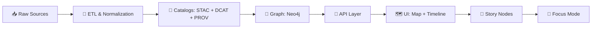
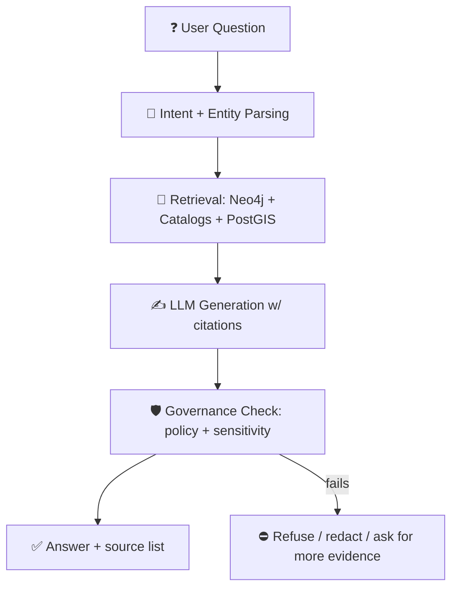

# 🧭 Kansas Frontier Matrix (KFM) — Runbooks


> 🚦 **Purpose:** This folder contains **operational runbooks (SOPs)** for running, maintaining, and evolving KFM safely — with **evidence-first publishing**, **contract-first interfaces**, and **fail-closed policy gates**.

---

## 📌 What belongs in `docs/runbooks/`

Runbooks are **step-by-step** procedures for:
- 🧱 Platform & deployments (API/UI/DB)
- 🗺️ Data ingestion, cataloging (STAC/DCAT), provenance (PROV), and graph builds (Neo4j)
- 🤖 Focus Mode (AI) ops, evaluation, drift monitoring, and prompt security
- 🧾 Governance & policy gates (OPA/Conftest), licensing, sensitivity, and auditability
- 🧯 Incident response, rollbacks, and kill-switch operations
- 📦 Offline packs + field workflows (mobile/AR scenarios)
- ⏱️ Streaming / real-time feeds (append-only patterns)

If it’s a “**we should be able to do this at 2AM with confidence**” procedure → it’s a runbook ✅

---

## 🧠 Operating Philosophy (Non‑Negotiables)

### 1) 🧾 Evidence-first publishing
KFM treats **published data as evidence**, not “just files”:
- Every publishable dataset has a **contract** + **catalogs** + **provenance**.
- The “evidence triplet” expectation is: **STAC + DCAT + PROV** (plus validation & policy gates).

### 2) 🔒 Fail-closed governance
If it doesn’t pass a gate, it **doesn’t ship**:
- Schema validation
- STAC/DCAT/PROV completeness
- License presence
- Sensitivity classification & handling rules
- Provenance completeness
- Focus Mode answers **must cite sources**, or refuse

### 3) 🧱 Contract-first interfaces (“no mystery layers”)
- Data is only “real” inside KFM if it has a **declared schema + provenance**.
- UI never bypasses governance — **all access goes through APIs** that enforce redaction + policy.

### 4) 🔁 Deterministic, reproducible workflows
- Runbooks should lead to **repeatable outputs**.
- If randomness exists (e.g., ML), it must be controlled, logged, and explainable.

---

## 🗺️ KFM at a Glance

### Core layers
- 🧺 **Data pipeline** (raw → work → processed → catalogs)
- 🧾 **Catalog layer** (STAC/DCAT + validation)
- 🧬 **Knowledge graph** (Neo4j) for entities/relationships + semantics
- 🗃️ **Spatial store** (PostGIS) for geospatial queries, raster footprints/metadata, time-series/feeds
- 🧠 **Focus Mode** (AI) for natural language Q&A with citations + governance checks
- 🗺️ **UI** (2D/3D + timeline + Story Nodes) built around “map state” and narrative playback

### Canonical pipeline ordering (don’t skip stages)


> ✅ **Runbook rule:** If a runbook proposes “jumping” stages (e.g., UI reading DB directly, or graph updates without catalogs), it’s an automatic red flag.

---

## 📚 Runbook Index

> 🧱 This README is the **index + standards**. Individual runbooks should live alongside it.

### 🟩 Recommended runbooks to create/maintain
| ID | Runbook | Purpose |
|---:|---|---|
| RBK-010 | `./rbk-010-local-dev.md` | Bring up KFM locally (API/UI/PostGIS/Neo4j) |
| RBK-020 | `./rbk-020-health-checks.md` | Platform health checks & “is it down?” triage |
| RBK-030 | `./rbk-030-data-domain-onboarding.md` | Add a new domain using the “domain expansion” pattern |
| RBK-032 | `./rbk-032-catalog-validate.md` | Validate STAC/DCAT/PROV + policy pack |
| RBK-033 | `./rbk-033-graph-rebuild.md` | Rebuild or backfill Neo4j from governed CSV exports |
| RBK-040 | `./rbk-040-api-ops.md` | API operations: scaling, cache, rate limits, logs |
| RBK-050 | `./rbk-050-ui-ops.md` | UI build/deploy, map layers, Story panel integrity |
| RBK-060 | `./rbk-060-focus-mode-ops.md` | Focus Mode indexing, eval, citations, drift monitoring |
| RBK-070 | `./rbk-070-policy-gates.md` | OPA/Conftest policies: add rules, test, rollout |
| RBK-080 | `./rbk-080-wpe-agents.md` | Watcher–Planner–Executor operations + kill-switch |
| RBK-090 | `./rbk-090-release-attestation.md` | SBOM + Sigstore signing + SLSA-style provenance |
| RBK-100 | `./rbk-100-incident-response.md` | Security + data incidents (PII/sensitive layer exposure) |
| RBK-110 | `./rbk-110-streaming-feeds.md` | Append-only streaming feeds (GTFS-RT/USGS/NWS/etc.) |
| RBK-120 | `./rbk-120-offline-packs.md` | Offline “field packs” packaging + verification |
| RBK-130 | `./rbk-130-simulation-runs.md` | Simulation workflows: model inputs → outputs → PROV |

---

## 🧩 Folder Map (Suggested Layout)

This matches KFM’s “docs + data + code” separation patterns while giving ops a dedicated home.

```text
📁 docs/
  📁 runbooks/
    📄 README.md                         👈 you are here
    📄 rbk-010-local-dev.md
    📄 rbk-020-health-checks.md
    📄 rbk-030-data-domain-onboarding.md
    📄 rbk-032-catalog-validate.md
    📄 rbk-033-graph-rebuild.md
    📄 rbk-060-focus-mode-ops.md
    📄 rbk-070-policy-gates.md
    📄 rbk-080-wpe-agents.md
    📄 rbk-090-release-attestation.md
    📄 rbk-100-incident-response.md
    📄 rbk-110-streaming-feeds.md
    📄 rbk-120-offline-packs.md
    📄 rbk-130-simulation-runs.md

📁 data/
  📁 raw/        📥 source drops (immutable, checksummed)
  📁 work/       🧪 staging + transformations
  📁 processed/  ✅ publishable artifacts (versioned)
  📁 catalogs/   🧾 STAC/DCAT catalogs (versioned)
  📁 prov/       🧬 PROV records (versioned)
  📁 graph/
    📁 csv/      🧾 governed graph import/export CSV
```

> 🔎 If your repo already has an established layout (e.g., `docs/guides/pipelines/` and `docs/architecture/`), keep it — just ensure runbooks **link into those guides** rather than duplicating them.

---

## 🧰 “Golden Paths” (Quick Operations)

### 🥇 Golden Path A — Add a new data domain (safe expansion)
**Goal:** Onboard a dataset/domain without breaking governance.

High-level flow:
1. 📥 Place sources under `data/raw/<domain>/...`
2. 🧪 ETL into `data/work/<domain>/...`
3. ✅ Produce publishable outputs in `data/processed/<domain>/...`
4. 🧾 Generate/update **STAC + DCAT + PROV**
5. 🔍 Run validation + policy pack (fail-closed)
6. 🧬 Export governed CSV → import into Neo4j
7. 🔌 Update API endpoints/contracts
8. 🗺️ Add UI layer config + optional Story Node
9. 🤖 Verify Focus Mode can cite the new evidence

**Runbook:** `RBK-030` + `RBK-032` + `RBK-033`

---

### 🥇 Golden Path B — Publish a Story Node (narrative + evidence)
**Goal:** Publish a narrative without losing traceability.

Minimum standards:
- 📖 Story text is Markdown (readable + versioned)
- 🧩 Story config (JSON) defines map states: layers, time slices, camera, annotations
- 🔗 Every “claim” references evidence artifacts (datasets, items, documents)
- 🤖 Any AI-generated text is explicitly labeled and still must be evidence-backed

**Runbook:** `RBK-050` (UI) + `RBK-060` (Focus Mode citations) + `RBK-070` (policy gates)

---

### 🥇 Golden Path C — Enable a real-time layer (append-only streaming)
**Goal:** Add real-time data (USGS/NWS/GTFS-RT) without bypassing provenance.

Principles:
- Append-only ingestion (“streaming is many small datasets over time”)
- A stub/rolling provenance must exist **before display**
- UI queries API; API queries PostGIS (or time-series store if later added)
- Graph holds station entities + metadata + classification controls

**Runbook:** `RBK-110` + `RBK-070` + `RBK-020`

---

## 🤖 Focus Mode Ops Primer

### Focus Mode must be “evidence-backed Q&A”
At runtime, Focus Mode should:
- Parse user intent (time, geography, domain)
- Retrieve evidence (graph + catalogs + spatial queries)
- Generate an answer that **includes citations**
- Run governance checks (sensitivity rules, content rules)
- Log outputs for audit / drift monitoring



> 🧯 If Focus Mode can’t cite evidence, it should **refuse** rather than invent.

---

## 🧷 W‑P‑E Automation (Watcher → Planner → Executor)

KFM automation is designed to be **auditable and reversible**:

- 👀 **Watcher**: detects changes (new data, broken links, schema drift) → emits immutable event records
- 🧠 **Planner**: drafts a proposed change (often as a PR) with evidence + steps
- 🛠️ **Executor**: applies changes only via version-controlled artifacts (PRs), never silently

**Safety hooks:**
- 🔌 **Kill-switch** (freeze agents instantly)
- ✅ CI policy gates (fail-closed)
- 👤 Human review for merges

> Rule of thumb: **Automation may propose. Humans approve. Policy enforces.**

---

## 🧾 Policy Gates + CI/CD (Baseline)

A minimal “gates-first” CI should validate:
- ✅ Schema correctness
- ✅ STAC/DCAT/PROV completeness
- ✅ License presence
- ✅ Sensitivity labeling + handling
- ✅ Provenance completeness
- ✅ Focus Mode output policies (citations required; offensive/sensitive rules)
- ✅ Secrets scanning + prohibited files
- ✅ “No bypass” constraints (UI cannot talk to DB directly; governed interfaces only)

**Runbook:** `RBK-070`

---

## 🧯 Incident Handling Cheatsheet

### 🚨 1) Sensitive data leaked / exposed
Immediate actions:
- 🧊 Freeze automation (kill-switch)
- 🔒 Lock down access (RBAC / API policy)
- 🧾 Identify offending artifact(s) (catalog + graph nodes + UI layers)
- ⏪ Revert to last known good state
- 🧬 Produce PROV audit trail of the incident response

**Runbook:** `RBK-100` + `RBK-070`

### 🚨 2) Policy gates failing in CI
- Do not merge “fix-forward” without understanding the failing rule
- Identify which gate: schema / license / provenance / sensitivity
- Patch the artifacts (catalog + prov), not just the code

**Runbook:** `RBK-070`

### 🚨 3) Graph corruption / wrong relationships
- Stop ingestion / automation
- Rebuild Neo4j from governed CSV exports
- Verify entity counts + invariants (no mystery nodes; no orphaned required relations)

**Runbook:** `RBK-033`

---

## 🧱 Runbook Template (Copy/Paste)

<details>
<summary><strong>📄 Click to expand runbook template</strong></summary>

```yaml
---
runbook_id: RBK-XXX
title: "Short, action-oriented title"
owners:
  - "@team-or-handle"
severity: low|medium|high|critical
scope: local|staging|production|all
last_reviewed: YYYY-MM-DD
prereqs:
  - access: "postgres read/write"
  - access: "neo4j admin"
  - tools: ["docker", "make", "python", "node"]
safety:
  - "This runbook may impact production availability."
  - "This runbook touches sensitive data: yes/no"
rollback:
  strategy: "revert PR | restore snapshot | disable feature flag"
evidence:
  requires:
    - "STAC/DCAT/PROV updated"
    - "policy gates passed"
---
```

### 🎯 Goal
What success looks like (observable + verifiable).

### 🧩 Preconditions
- Required access
- Required repo state (branch/commit)
- Required services running

### 🪜 Procedure (Step-by-step)
1. …
2. …

### ✅ Verification
- What to check in UI/API/DB/Graph
- Expected output (include sample commands if stable)

### ⏪ Rollback
- Exact reversal steps
- Where rollback artifacts live (snapshots, PRs, tags)

### 🧯 Troubleshooting
- Known failure modes
- Where logs/metrics live
- How to isolate the failure

### 🧾 Governance Checklist
- [ ] License confirmed
- [ ] Sensitivity labeled
- [ ] Provenance updated
- [ ] STAC/DCAT validated
- [ ] Focus Mode citations verified (if applicable)
```

</details>

---

## 🧪 Documentation Quality Bar (Runbooks are “living tests”)

Runbooks should:
- ✅ Be runnable by someone new to the project
- ✅ Avoid “tribal knowledge”
- ✅ Include verification + rollback
- ✅ Point to the exact artifacts they govern (datasets, catalogs, policy rules)
- ✅ Keep security + governance explicit (no hidden assumptions)

---

## 📎 Reference Library (Project Docs Used to Shape These Runbooks)

These runbooks are derived from the project’s architecture + governance docs, plus the supporting reference library:

### 🧭 Core KFM system docs
- **Comprehensive Technical Documentation** (architecture, repo structure, APIs, contracts, scaling)
- **Comprehensive Architecture, Features, and Design** (policy gates, W‑P‑E automation, roadmap)
- **AI System Overview** (Focus Mode, citations, drift monitoring, prompt security)
- **Comprehensive UI System Overview** (Story Nodes, timeline, 2D/3D map experience)
- **Data Intake — Technical & Design Guide** (STAC/DCAT/PROV workflows, graph ingestion, policies)
- **Latest Ideas & Future Proposals** (future ops targets: streaming feeds, supply chain security, bulk doc ingestion)
- **Innovative Concepts to Evolve KFM** (offline packs, AR, digital twins, crowdsourcing + ethics)

### 🧰 Supporting references (training + methods)
- **Scientific Method / Master Coder Protocol** (reproducibility + peer review)
- **Data Mining Concepts & Applications** (privacy-preserving analytics patterns)
- **Geospatial Python Cookbook** (GDAL/OGR/PostGIS recipes + analysis techniques)
- **Mapping/Virtual Worlds/WebGL** (Web mapping + 3D visualization references)
- **AI Concepts** (supporting AI knowledge base)
- **Programming Languages & Resources** (reference library)
- **Data Management / Bayesian Methods** (architectures + modeling references)

---

## ✅ Next Steps (Recommended)
- [ ] Create the runbooks listed in the index (start with RBK‑010, RBK‑020, RBK‑070, RBK‑100)
- [ ] Add a “Runbook CI” that checks runbook front-matter validity + link integrity
- [ ] Add a “Policy Pack Runbook” for updating OPA rules safely
- [ ] Add a “Focus Mode Eval Pack” runbook (golden questions + citation coverage score)
- [ ] Add a “Field Pack” runbook for offline/AR operations

---

> 🧭 If you’re unsure where a procedure belongs:
> - **Architecture decisions** → `docs/architecture/`
> - **Developer guides** → `docs/guides/`
> - **Run it / fix it / ship it** → `docs/runbooks/` ✅
