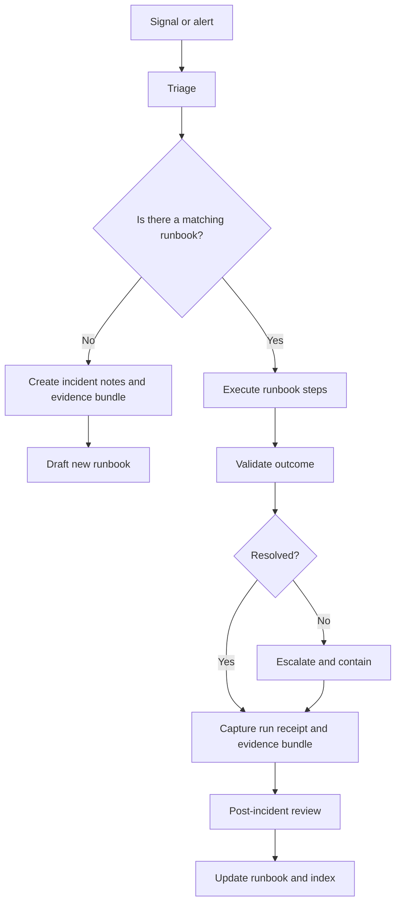

<!-- [KFM_META_BLOCK_V2]
doc_id: kfm://doc/8a1d7fbb-0ee8-4b6e-8e1b-6a0e0b20d6b2
title: Runbooks
type: standard
version: v1
status: draft
owners: TBD
created: 2026-02-24
updated: 2026-02-28
policy_label: restricted
related:
  - docs/README.md
tags: [kfm, runbooks, operations]
notes:
  - Directory-level README for operational runbooks.
  - This file intentionally avoids repo-specific commands until verified.
  - last_verified: UNVERIFIED
[/KFM_META_BLOCK_V2] -->

<a id="top"></a>

# 🧰 Runbooks
Operational procedures for keeping the Kansas‑Matrix‑System **safe, buildable, auditable, and reversible**.


> **WARNING**
> Runbooks may describe operational steps that can impact data integrity, access controls, or production uptime.
> If a step is unclear or unverified, **fail closed**: stop, capture evidence, and route for governance/owner review.

---

## Quick navigation
- [Purpose](#purpose)
- [Normative language and tagging](#normative-language-and-tagging)
- [When to use a runbook](#when-to-use-a-runbook)
- [Directory structure](#directory-structure)
- [Runbook index](#runbook-index)
- [Runbook authoring standard](#runbook-authoring-standard)
- [Incident workflow](#incident-workflow)
- [Promotion gates and evidence](#promotion-gates-and-evidence)
- [Contributing](#contributing)
- [FAQ](#faq)

---

## Purpose
This directory is the **single home** for repeatable operational procedures (“runbooks”) used to:
- Recover from incidents (data, pipeline, API, UI, infra).
- Execute routine maintenance safely (backfills, re-index, rollouts).
- Perform controlled changes (config updates, migrations, promotions).
- Produce **audit-ready** evidence for governance and traceability.

### Where it fits in the repo
`docs/runbooks/` is the operator-facing layer of documentation:
- **Design docs** explain “why” and “what we built”.
- **Runbooks** explain “how we operate it safely” with **preconditions + steps + validation + rollback + evidence**.

### Operational invariants
Runbooks MUST preserve KFM’s two core operational invariants:

1) **Truth path lifecycle (zones + gates)**  
A runbook that moves or republishes artifacts MUST respect the truth path (conceptually):
`Upstream → RAW → WORK/QUARANTINE → PROCESSED → CATALOG/TRIPLET → PUBLISHED`.

2) **Trust membrane / policy boundary**  
If an action touches **PUBLISHED surfaces** (what users/clients can access), it MUST go through the governed policy boundary (PEP/API) or an explicitly approved “breakglass” procedure.
If you believe you need breakglass access and no approved runbook exists: **stop and escalate**.

---

## Normative language and tagging
To avoid accidental overreach, runbooks and runbook docs use:

- **MUST / MUST NOT / SHOULD / MAY** in the RFC sense (requirements vs guidance).
- Tagging for repository posture:
  - **CONFIRMED** — invariant / contract that should not be violated.
  - **PROPOSED** — recommended default pending repo verification.
  - **UNKNOWN** — requires verification in the current repo/environment.

> **NOTE**
> This README intentionally avoids repo-specific commands until verified.

---

## When to use a runbook
Use a runbook when **any** of the following is true:
- You are about to touch **production** (or anything that can reach it).
- You are promoting artifacts across lifecycle zones (RAW/WORK → PROCESSED → CATALOG/TRIPLET → PUBLISHED).
- You are changing governance boundaries (permissions, redaction, policy labeling).
- You need to restore service, re-run pipelines, remediate data quality, or rebuild indexes.
- You are considering any action that could **bypass the trust membrane**.

> **NOTE**
> A “how-to” that changes system behavior belongs here. A “conceptual explanation” belongs elsewhere.

---

## Directory structure

### Current
- `docs/runbooks/README.md` — this file.

### Recommended structure
> **PROPOSED**
> The structure below is an additive starting taxonomy to keep runbooks discoverable.
> Verify against the repo before creating new directories.

<details>
<summary><strong>Proposed directory layout</strong></summary>

```
docs/runbooks/                                          # Operational runbooks (production-grade, step-by-step)
├─ README.md                                            # Index + standards + incident flow + promotion gates
│
├─ _registry/                                           # Machine-checkable registry for completeness (optional but recommended)
│  ├─ runbooks.yml                                      # Single source of truth for runbook index rows
│  ├─ runbooks.schema.json                              # JSON Schema to validate runbooks.yml (CI-friendly)
│  └─ owners.yml                                        # Canonical owner aliases/teams (avoid "TBD" drift)
│
├─ templates/                                           # Authoring templates (copy/paste starters)
│  ├─ runbook-template.md                               # Standard runbook format (scope → steps → verify → rollback)
│  ├─ evidence-bundle-template.md                       # Packaging evidence during incidents/changes
│  ├─ incident-notes-template.md                        # Live incident notes capture (timeline + hypotheses + actions)
│  ├─ comms-update-template.md                          # Slack/email/statuspage update format
│  ├─ postmortem-template.md                            # PIR template (what/why/fix/guardrail/tests)
│  └─ change-record-template.md                         # “Change ticket” / decision record (risk + rollback + approvals)
│
├─ incidents/                                           # Incident response procedures
│  ├─ rb-incident-triage.md                             # Triage checklist (identify, contain, communicate)
│  ├─ rb-incident-sev1.md                               # SEV1 playbook (roles, comms, mitigation, postmortem)
│  ├─ rb-incident-comms.md                              # Comms cadence + channels + update templates
│  ├─ rb-incident-evidence-capture.md                   # Evidence bundle capture rules during response
│  ├─ rb-incident-escalation.md                         # Escalation ladder + “stop-the-line” criteria
│  ├─ rb-incident-postmortem.md                         # PIR workflow + follow-up gates
│  │
│  ├─ playbooks/                                        # Symptom-driven, fast lookup (use during triage)
│  │  ├─ rb-incident-api-5xx-spike.md                    # API error spike: contain → verify → rollback
│  │  ├─ rb-incident-auth-failure.md                     # Auth/RBAC failures: contain + policy checks
│  │  ├─ rb-incident-policy-regression.md               # Policy deny/allow regression: bundle rollback
│  │  ├─ rb-incident-pipeline-stuck.md                  # Pipeline stuck: pause scheduler, inspect receipts
│  │  ├─ rb-incident-data-integrity.md                  # Suspected corruption: quarantine + checksums
│  │  ├─ rb-incident-index-lag.md                       # Search/tiles lag: rebuild/warmup checklist
│  │  ├─ rb-incident-ui-outage.md                       # UI outage: feature-flag disable + rollback
│  │  └─ rb-incident-storage-quota.md                   # Storage saturation: contain + expand + cleanup
│  │
│  └─ drills/                                           # Game day / tabletop exercises
│     ├─ rb-drill-sev1-sim.md                            # SEV1 simulation procedure + scoring
│     └─ rb-drill-data-promotion-fail.md                # Promotion gate failure simulation
│
├─ change/                                              # Controlled change workflow (non-incident)
│  ├─ rb-change-intake.md                               # Intake checklist (scope, env, approvals, evidence plan)
│  ├─ rb-change-execute.md                              # Execute safely (dry run → canary → validate)
│  ├─ rb-change-rollback.md                             # Rollback decision + steps + verification
│  └─ rb-change-closeout.md                             # Closeout (evidence, notes, follow-ups, index update)
│
├─ pipelines/                                           # Pipeline operations (reruns, backfills, promotions)
│  ├─ rb-pipeline-rerun.md                              # Safe rerun procedure (idempotency + receipts)
│  ├─ rb-pipeline-backfill.md                           # Backfill procedure (scope, scheduling, rollback)
│  ├─ rb-pipeline-promote-zone.md                       # Promote through truth path (gates + fail-closed)
│  ├─ rb-pipeline-quarantine.md                         # Quarantine workflow (why, duration, unblock criteria)
│  ├─ rb-pipeline-receipt-verify.md                     # Receipt verification checklist (inputs/outputs/tool versions)
│  ├─ rb-pipeline-scheduler-pause.md                    # Pause scheduled runs (containment and safety)
│  ├─ rb-pipeline-scheduler-resume.md                   # Resume + verify no backlog hazards
│  └─ rb-pipeline-hotfix.md                             # Emergency pipeline patch w/ explicit approvals + rollback
│
├─ data/                                                # Data quality + redaction operations
│  ├─ rb-data-qa-failures.md                            # QA failure triage (thresholds, diffs, quarantine)
│  ├─ rb-data-redaction-review.md                       # Redaction review/approval (obligations, sign-off)
│  ├─ rb-data-sensitivity-assess.md                     # Sensitivity classification + policy label recommendation
│  ├─ rb-data-schema-change.md                          # Schema evolution (compat rules, versioning, migrations)
│  ├─ rb-data-diff-compare.md                           # DatasetVersion diff workflow (what changed + why)
│  ├─ rb-data-restore-from-raw.md                       # Restore procedure (RAW as immutable source of truth)
│  └─ rb-data-tombstone.md                              # Tombstone/deprecate dataset artifacts safely
│
├─ catalog/                                             # DCAT/STAC/PROV catalog operations (often cross-cutting)
│  ├─ rb-catalog-build.md                               # Build catalogs from processed artifacts
│  ├─ rb-catalog-validate.md                            # Validate catalog integrity (schemas + links)
│  ├─ rb-catalog-publish.md                             # Publish catalog bundle through governed boundary
│  ├─ rb-catalog-rebuild-all.md                         # Full rebuild (when + safety + verification)
│  └─ rb-catalog-deprecate-dataset.md                   # Deprecation workflow (catalog + UI + API coherence)
│
├─ evidence/                                            # Evidence-first operations (bundles, refs, redaction)
│  ├─ rb-evidence-bundle-create.md                      # Bundle creation (what must be captured)
│  ├─ rb-evidence-ref-resolve.md                        # EvidenceRef → EvidenceBundle resolution checks
│  ├─ rb-evidence-redaction-apply.md                    # Redaction obligations workflow + verification
│  ├─ rb-evidence-retention.md                          # Retention policy + secure disposal process
│  └─ rb-audit-ledger-append.md                         # Append/verify audit ledger entries (who/what/when/why)
│
├─ indexing/                                            # Index/projection ops (search/graph/tiles)
│  ├─ rb-index-rebuild.md                               # Full rebuild (prereqs, timing, verification)
│  ├─ rb-index-backfill.md                              # Backfill new projections (scope, safety, rollback)
│  ├─ rb-index-search-rebuild.md                        # Search index rebuild (freshness + consistency checks)
│  ├─ rb-index-tiles-rebuild.md                         # Vector/raster tile rebuild (cache + warmup steps)
│  ├─ rb-index-graph-rebuild.md                         # Graph/relationships rebuild (if applicable)
│  ├─ rb-index-warmup.md                                # Warm caches after rebuild/deploy
│  └─ rb-index-verify-freshness.md                      # “Is the index stale?” checklist (SLAs, timestamps)
│
├─ api/                                                 # API deploy operations
│  ├─ rb-api-deploy.md                                  # Deploy (health checks, canary, rollback hooks)
│  ├─ rb-api-rollback.md                                # Rollback (version pin, migrations, verification)
│  ├─ rb-api-migrations.md                              # DB migrations (safe order, locks, rollback constraints)
│  ├─ rb-api-rate-limit-change.md                       # Rate limit/SLA tier changes (audit + revert)
│  ├─ rb-api-cache-invalidate.md                        # Cache invalidation (blast radius + verification)
│  ├─ rb-api-schema-contract-change.md                  # OpenAPI/schema changes (compat + versioning)
│  └─ rb-api-emergency-readonly.md                      # Read-only mode (containment + recovery)
│
├─ ui/                                                  # UI deploy + runtime toggles
│  ├─ rb-ui-deploy.md                                   # UI deploy (smoke tests, monitoring)
│  ├─ rb-ui-feature-flag.md                             # Feature flag changes (approval + audit + revert)
│  ├─ rb-ui-cache-purge.md                              # CDN/browser cache issues (safe busting)
│  ├─ rb-ui-emergency-banner.md                         # Emergency banner messaging + removal criteria
│  ├─ rb-ui-map-style-update.md                         # Map style update workflow (verify legends + scale)
│  └─ rb-ui-story-node-publish.md                       # Story content publish (evidence refs + policy label)
│
├─ policy/                                              # Policy engine operations (OPA/Rego or equivalent)
│  ├─ rb-policy-bundle-build.md                         # Build policy bundles (tests required)
│  ├─ rb-policy-bundle-publish.md                       # Publish policy bundles (canary + rollback)
│  ├─ rb-policy-regression-triage.md                    # Identify deny/allow deltas + root cause workflow
│  ├─ rb-policy-obligation-change.md                    # Obligation changes (downstream impact analysis)
│  └─ rb-policy-emergency-deny-all.md                   # Emergency containment (explicit approval required)
│
├─ governance/                                          # Governance operations (reviews, access, labels, approvals)
│  ├─ rb-policy-label-change.md                         # Policy label change workflow (review, downstream impact)
│  ├─ rb-access-review.md                               # Access review (least privilege, audit evidence)
│  ├─ rb-access-grant.md                                # Grant workflow (who approves + evidence)
│  ├─ rb-access-revoke.md                               # Revoke workflow (timing + verification)
│  ├─ rb-release-promotion-approve.md                   # Promotion approval ceremony (gates + sign-off)
│  └─ rb-data-release-notes.md                          # Release notes (what changed + evidence links)
│
├─ platform/                                            # Infra/cluster/storage runbooks (if you operate your own platform)
│  ├─ rb-platform-backup.md                             # Backups (scope + schedules + verification)
│  ├─ rb-platform-restore.md                            # Restore procedure (tabletop tested)
│  ├─ rb-platform-dr-failover.md                        # DR failover + fallback plan
│  ├─ rb-platform-k8s-upgrade.md                        # Cluster upgrade (compat checks + rollback)
│  ├─ rb-platform-cert-rotate.md                        # TLS cert rotation (avoid downtime)
│  ├─ rb-platform-storage-expand.md                     # Storage expansion (quotas + alarms)
│  └─ rb-platform-secrets-rotation.md                   # Secrets rotation (no secrets in docs; only process)
│
├─ observability/                                       # Monitoring/alerting/SLO runbooks
│  ├─ rb-observability-alert-triage.md                  # Alert triage (ack → scope → mitigate → verify)
│  ├─ rb-observability-dashboard-create.md              # Dashboard creation standards (what must exist)
│  ├─ rb-observability-log-retention.md                 # Log retention (policy + access)
│  ├─ rb-observability-slo-review.md                    # SLO/SLA review cadence + evidence
│  ├─ rb-observability-trace-sampling.md                # Trace sampling changes (impact + rollback)
│  └─ rb-observability-metrics-gap.md                   # “We’re blind” procedure (restore visibility)
│
└─ _assets/                                             # Shared runbook assets (diagrams, bounded screenshots)
   ├─ diagrams/                                         # Diagram sources (prefer mermaid source over screenshots)
   │  ├─ incident-flow.mmd
   │  ├─ promotion-flow.mmd
   │  └─ trust-membrane.mmd
   ├─ screenshots/                                      # Bounded, redacted screenshots only
   └─ samples/                                          # Redacted example bundles/receipts (NEVER real secrets/data)
      ├─ evidence-bundle-example/
      └─ receipt-example/
```

</details>

> **TIP**
> Keep “templates” and “runbooks” separate. Templates change rarely; runbooks evolve frequently.

### Acceptable inputs
- Runbook markdown files with:
  - purpose + scope + owner + last verified date
  - preconditions + step-by-step actions
  - validation + rollback
  - evidence/audit artifacts checklist
- Small, safe helper scripts *only if* they are:
  - deterministic
  - reviewed
  - clearly scoped to a runbook
  - do not embed secrets

### Exclusions
- ❌ Secrets, tokens, credentials, private keys, connection strings.
- ❌ Raw sensitive datasets or exports.
- ❌ “Permanent” architecture decisions (put in ADRs / design docs).
- ❌ One-off personal notes not meant for shared operations.
- ❌ Instructions that bypass governance/policy boundaries.

---

## Runbook index

> **NOTE**
> The index below is split to avoid implying that planned runbooks already exist.

| Runbook ID | Area | Title | Trigger / Use-case | Blast radius | Owner | Last verified | Status | Exists | Link |
|---|---|---|---|---|---|---:|---|:---:|---|
| RB-RUNBOOKS-README | meta | Runbooks Directory README | Standards + index + ops posture | none | TBD | UNVERIFIED | draft | ✅ | `README.md` |
| RB-TEMPLATE | templates | Runbook Template | Authoring | none | TBD | n/a | planned | ⛔ | `templates/runbook-template.md` |
| RB-INCIDENT-TRIAGE | incidents | Incident Triage | Alert triage + containment | multi-env | TBD | n/a | planned | ⛔ | `incidents/rb-incident-triage.md` |
| RB-PIPELINE-RERUN | pipelines | Re-run Pipeline Safely | Rerun after failure | staging/prod | TBD | n/a | planned | ⛔ | `pipelines/rb-pipeline-rerun.md` |
| RB-PROMOTE-TRUTH-PATH | pipelines | Promote Through Truth Path | Promote dataset version | prod | TBD | n/a | planned | ⛔ | `pipelines/rb-pipeline-promote-zone.md` |
| RB-INDEX-REBUILD | indexing | Rebuild Indexes | Rebuild tiles/search/graph | prod | TBD | n/a | planned | ⛔ | `indexing/rb-index-rebuild.md` |

**Index rules**
- IDs are stable: `RB-<AREA>-<SHORTNAME>` (example: `RB-PIPELINE-BACKFILL`).
- “Last verified” MUST be a real date; if unknown, set `UNVERIFIED`.
- “Blast radius” MUST be conservative: `none`, `dev`, `staging`, `prod`, `multi-env`.
- If a runbook is **planned**, set `Exists = ⛔` until it is added to the repo.

---

## Runbook authoring standard

### Naming
- File name: `rb-<area>-<slug>.md`
- Title should match the file’s purpose, not an implementation detail.
- Keep verbs first for action runbooks: “Rebuild…”, “Rollback…”, “Promote…”, “Re-run…”.

### Required sections
A runbook is not “done” unless it contains:

- **Purpose and scope**
- **Policy label** (public/restricted/…)
- **Preconditions** (permissions, environment, backups, feature flags)
- **Safety / default-deny notes**
- **Step-by-step procedure**
- **Validation** (how you know it worked)
- **Rollback** (how to undo safely)
- **Run receipt / audit record requirements** (what must be captured)
- **Evidence bundle** (what artifacts to capture and where they live)

### Runbook template
Create `docs/runbooks/<area>/rb-<area>-<slug>.md` (or place in `docs/runbooks/` if area folders do not exist yet):

```md
<!-- [KFM_META_BLOCK_V2]
doc_id: kfm://doc/<uuid>
title: <Runbook title>
type: standard
version: v1
status: draft
owners: <team or name>
created: YYYY-MM-DD
updated: YYYY-MM-DD
policy_label: restricted
related:
  - <design doc / ADR / pipeline spec links>
tags: [kfm, runbook, <area>]
notes:
  - last_verified: YYYY-MM-DD | UNVERIFIED
  - next_review_due: YYYY-MM-DD | UNSET
  - blast_radius: none|dev|staging|prod|multi-env
  - touches_truth_path: yes|no
  - touches_published: yes|no
[/KFM_META_BLOCK_V2] -->

# <Runbook title>

## Purpose
<What this accomplishes.>

## Scope
- Included:
- Excluded:

## Preconditions
- Access:
- Environment:
- Backups / snapshots:
- Change window:

## Safety notes
- Default-deny triggers:
- Known risky steps:
- Trust membrane warnings:

## Procedure
1. Step
2. Step

## Validation
- What to check:
- Expected result:

## Rollback
- How to undo:
- When rollback is mandatory:

## Run receipt and audit record
Capture/attach:
- Who executed the run (operator identity)
- When it started/ended (timestamps)
- Inputs and outputs (identifiers + digests/checksums when applicable)
- Policy decisions and approvals (who/when/why)
- Links to logs and monitoring snapshots

## Evidence bundle
Attach/record:
- Commands executed (with timestamps) **OR** a statement that no commands were run
- Input/output identifiers and digests where applicable
- Links to logs
- QA reports (if relevant)
- Catalog validation outputs (if relevant)
- Policy decision record (if relevant)
```

---

## Incident workflow



**Incident invariants**
- Prefer **small reversible actions** over “big bang” changes.
- Every action must be traceable to an operator + time + reason.
- If evidence can’t be captured, treat the action as **not completed**.
- If an action would bypass the trust membrane, treat it as **default-deny** unless a breakglass runbook exists and approvals are recorded.

---

## Promotion gates and evidence
Runbooks that move artifacts across lifecycle zones MUST align to the Promotion Contract and fail closed.

### Truth path reminder
Promotions should conceptually follow:
`Upstream → RAW → WORK/QUARANTINE → PROCESSED → CATALOG/TRIPLET → PUBLISHED`

### Promotion Contract minimum gates
**CONFIRMED intent:** promotion MUST be blocked unless these gates are satisfied.

| Gate | What must be present | Runbook evidence to capture |
|---|---|---|
| A — Identity and versioning | Stable dataset identifiers and versioning | IDs, versions, digests |
| B — Licensing and rights metadata | License/rights fields + terms snapshot | license/rights + snapshot reference |
| C — Sensitivity classification and redaction plan | policy_label + obligations when needed | classification + redaction notes + approvals |
| D — Catalog triplet validation | DCAT + STAC + PROV validate and cross-link | validator outputs + link checks |
| E — QA and thresholds | dataset QA checks + pass/fail thresholds | QA report + threshold results |
| F — Run receipt and audit record | run receipt capturing inputs/tooling/hashes/decisions | receipt + logs + timestamps |
| G — Optional but recommended | release manifest / publication record | manifest reference |

### Minimum evidence bundle checklist
- [ ] **Identity & versioning**: dataset/version identifiers recorded
- [ ] **License/rights**: rights metadata present + upstream terms snapshot referenced
- [ ] **Sensitivity**: policy label assigned; redaction/generalization obligations recorded if needed
- [ ] **Catalogs**: DCAT/STAC/PROV validations recorded (or explicitly N/A)
- [ ] **QA**: validation results attached (checks + thresholds)
- [ ] **Integrity**: checksums / digests recorded for relevant artifacts
- [ ] **Run receipt**: operator + timestamps + inputs/outputs + tooling versions + decisions
- [ ] **Rollback**: rollback plan documented (or “irreversible” flagged and approved)

### Gate behavior
- Gates **fail closed** by default.
- If a gate requires an artifact you don’t have, stop and record:
  - the missing artifact
  - why it is required
  - the smallest acceptable substitute (if any)

---

## Contributing

### Definition of Done for a new runbook
- [ ] Added to [Runbook index](#runbook-index)
- [ ] Has an owner (not “TBD”) **before** being marked “published”
- [ ] Has a real `last_verified` date or explicitly `UNVERIFIED`
- [ ] Includes rollback and validation
- [ ] Includes run receipt / evidence bundle requirements
- [ ] Does not contain secrets or sensitive raw extracts
- [ ] Reviewed by someone outside the author (minimum 1 reviewer)

### Review checklist
- [ ] Steps are deterministic and ordered
- [ ] Preconditions are explicit (permissions, env)
- [ ] Failure modes are described and safe
- [ ] Rollback is realistic
- [ ] Evidence bundle is sufficient for audit/reproduction
- [ ] Does not instruct bypassing the trust membrane or policy boundary

---

## FAQ

### Why “restricted” by default?
Runbooks often include operational knowledge that can increase risk if publicly exposed. Start restricted, then downgrade if governance explicitly allows.

### Can a runbook include exact commands?
Yes, **if verified** and **safe**. Prefer:
- “dry run” steps first
- explicit environment scoping
- explicit expected outputs
If commands depend on local tooling, include alternatives or clearly label as “repo-specific” and pin to a verified version.

### What if I’m unsure whether something belongs here?
If it changes system behavior, touches production, or affects governance/data promotion: it belongs here.

---

Back to top: [Top](#top)
