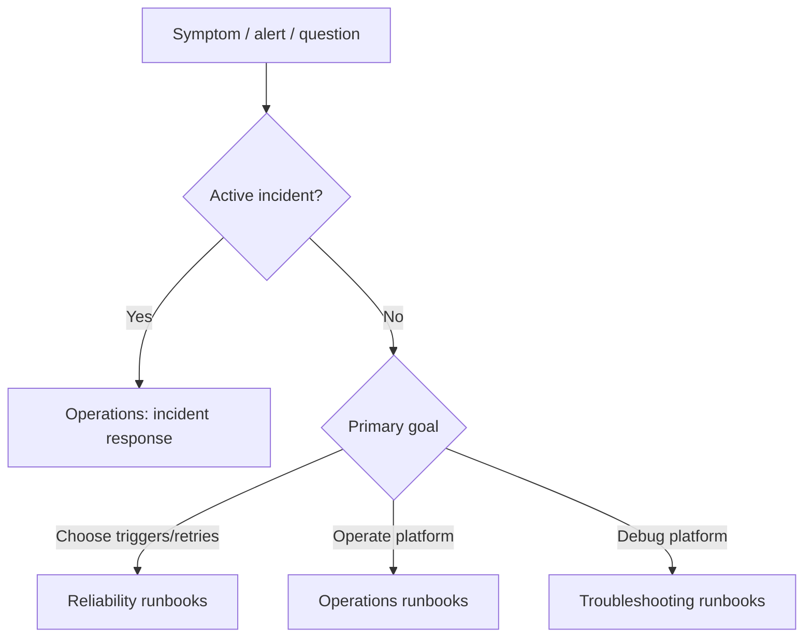

# Runbooks 🧭

<!--
KFM docs/runbooks/README.md
Purpose: Index + writing standard for operational runbooks.
-->


Operational playbooks for running, troubleshooting, and safely evolving the **Kansas Frontier Matrix (KFM)** platform (pipelines, services, catalogs, and policy gates).

> [!NOTE]
> Runbooks here are written as **LLM-answerable checklists**: *inputs → commands → interpretation → next step*.

---

## What belongs in a runbook

A runbook is **procedural** and **actionable**. If it’s primarily explanatory, it likely belongs elsewhere (architecture, pipeline specs, security baseline, etc.).

**Runbooks should answer:**
- What problem is happening / what task are we doing?
- What evidence do we collect first?
- What safe commands/actions do we run?
- How do we interpret results and choose the next step?
- What is the rollback/recovery plan?

> [!IMPORTANT]
> This folder is a governed surface. Do **not** include secrets, credentials, or unredacted sensitive coordinates.

---

## Runbook index

| Area | Runbook | When to use | Path | Status |
|---|---|---|---|---|
| Reliability | Trigger & Retry Decision Matrix | Designing/reviewing scheduled vs event-driven triggers; choosing retry/backoff behavior | [`reliability/trigger-retry-matrix.md`](./reliability/trigger-retry-matrix.md) | active |
| Reliability | Trigger Mechanisms Decision Guide | Selecting webhook vs polling vs object-event patterns; aligning with upstream capabilities | [`reliability/trigger-mechanisms/README.md`](./reliability/trigger-mechanisms/README.md) | active |
| Operations | Start/stop and health checks | Production readiness: dependency order, health verification, smoke tests | `operations/start-stop-health.md` | planned |
| Operations | Backup and restore | Backup schedule, retention, restore rehearsal, integrity checks | `operations/backup-restore.md` | planned |
| Operations | Incident response | Data leak / unsafe output / corruption response, emergency policy switches | `operations/incident-response.md` | planned |
| Troubleshooting | Pod won’t schedule | Kubernetes: pending pods, scheduling failures | `troubleshooting/kubernetes/pod-wont-schedule.md` | planned |
| Troubleshooting | Service reachable inside cluster but not from internet | Kubernetes networking: Service/Ingress/Gateway exposure issues | `troubleshooting/kubernetes/service-not-external.md` | planned |
| Troubleshooting | NetworkPolicy doesn’t work | Kubernetes networking: policy enforcement / CNI support | `troubleshooting/kubernetes/networkpolicy-not-enforcing.md` | planned |
| Troubleshooting | Secrets compromise / compliance audit | Security incident: suspected secret exposure, RBAC blast radius, encryption-at-rest checks | `troubleshooting/security/secrets-compromise.md` | planned |

> [!TIP]
> When you add or deprecate a runbook, update this table in the same PR.

---

## Directory layout

### Current (referenced) layout

```text
docs/runbooks/
├─ README.md
└─ reliability/
   ├─ trigger-retry-matrix.md
   └─ trigger-mechanisms/
      └─ README.md
```

### Recommended (future) expansion

```text
docs/runbooks/
├─ README.md
├─ _templates/
│  └─ runbook.template.md
├─ reliability/
│  └─ ...
├─ operations/
│  ├─ start-stop-health.md
│  ├─ backup-restore.md
│  └─ incident-response.md
└─ troubleshooting/
   ├─ kubernetes/
   └─ security/
```

---

## How to find the right runbook



---

## Operations baseline

The minimum “production readiness” runbook set should cover:

- **Start/stop order** (including policy layer and storage dependencies)
- **Health checks** (API health, store connectivity/readiness, policy loaded)
- **Smoke tests** (UI + provenance + one Focus Mode query)
- **Backup/restore** (schedule, retention, restore verification, integrity checks)
- **Incident response** (data leak, unsafe AI output, corrupted artifacts, emergency deny switch)

> [!WARNING]
> The exact component names, endpoints, and deployment order are implementation-specific. Confirm against the current deployment manifests before executing operational steps.

---

## Runbook writing standard

### Front matter

Every runbook starts with YAML front matter so it can be indexed and validated.

```yaml
---
title: "KFM - <short action-oriented title>"
status: "draft"            # draft | active | deprecated
owner: "<team or role>"    # avoid private individuals if possible
last_reviewed: "YYYY-MM-DD"
severity: "S2"             # S0 (emergency) ... S3 (minor)
systems:
  - "<service/pipeline/component>"
tags: ["kfm", "runbook", "..."]
---
```

### Canonical sections

Use the same headings (in this order) so responders can skim and retrieval is consistent:

1. **Intent**
2. **When to use**
3. **Inputs / prerequisites**
4. **Safety / governance notes**
5. **Checklist**
6. **Verification**
7. **Rollback / recovery**
8. **Post-incident / follow-ups**
9. **References / evidence**
10. **Changelog**

### Checklist style

Each step should fit the pattern:

- **Command / action**
- **Expected outcome**
- **Next step** (including “stop and escalate”)

Example:

```text
1) Inspect scheduler events
   - Command: kubectl describe pod <pod>
   - Expect: Events show Unschedulable reason.
   - Next: If reason is Insufficient CPU/Mem → check node allocatable; else check taints/tolerations.

2) Validate resources and policies
   - Command: kubectl get node -o wide
   - Expect: At least one node matches required selectors and has capacity.
   - Next: If none match → adjust requests/selectors or scale the node pool.
```

### Safety rules for commands

- Prefer **read-only** commands first (`get`, `describe`, read-only API calls).
- If a step is destructive or risky, label it clearly and provide a rollback.
- Never paste secrets into docs. Reference secret identifiers and required roles instead.

---

## Governance & sensitivity

> [!IMPORTANT]
> If a runbook touches **sensitive locations, culturally restricted knowledge, or private individuals**, generalize/redact and flag for governance review.

- Do not include API keys, credentials, tokens, or raw secrets.
- Avoid precise geocoordinates for restricted sites unless an explicit “authority to control” approval exists in the repo.
- Prefer linking to governed catalogs/provenance artifacts over copying raw data into docs.

---

## Contribution checklist

### Definition of Done (DoD) for a runbook PR

- [ ] Includes required front matter and canonical headings
- [ ] Steps are deterministic and use stable primitives
- [ ] Includes verification and rollback/recovery
- [ ] No secrets / credentials / sensitive coordinates included
- [ ] Links are relative and valid
- [ ] `last_reviewed` set (today) and owner assigned
- [ ] Index table updated (this README)

<details>
<summary><strong>Suggested CI checks (optional)</strong></summary>

- Markdown lint + link checker
- Front matter schema validation (YAML keys, allowed values)
- “No secrets” scanner (regex denylist)
- “Sensitive coordinate” detector (flag, not block)

</details>

---

## Deprecation policy

When a runbook is superseded:

1. Change `status: deprecated`
2. Add a banner at the top with the replacement reference
3. Keep for at least one release cycle (or as required by governance)

---

### Escalation

If you’re unsure, treat it as an incident and escalate via the project’s on-call or governance channel (repo-specific; not defined here).
