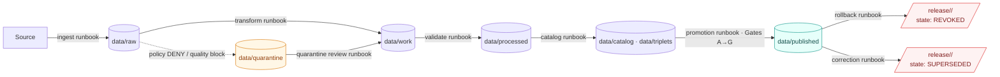

<!-- [KFM_META_BLOCK_V2]
doc_id: kfm://doc/docs-runbooks-readme
title: Runbooks (`docs/runbooks/`)
type: standard
version: v1
status: draft
owners: [Ops steward, Release steward, Docs steward]
created: 2026-05-09
updated: 2026-05-09
policy_label: public
related: [
  "docs/doctrine/directory-rules.md",
  "docs/doctrine/lifecycle-law.md",
  "docs/doctrine/trust-membrane.md",
  "docs/doctrine/truth-posture.md",
  "docs/doctrine/authority-ladder.md",
  "docs/architecture/contract-schema-policy-split.md",
  "docs/registers/VERIFICATION_BACKLOG.md",
  "docs/registers/DRIFT_REGISTER.md"
]
tags: [kfm, runbooks, operations, promotion, rollback, governance]
notes: [
  "README-like landing page for the docs/runbooks/ subtree.",
  "Path home is CONFIRMED per directory-rules.md §6.1.",
  "Sibling file presence is PROPOSED until repo is mounted."
]
[/KFM_META_BLOCK_V2] -->

# Runbooks · `docs/runbooks/`

> **Step-by-step procedures for running, gating, recovering, and reviewing KFM lifecycle work — operational, evidence-bearing, and reversible.**

[](#0-status--authority)
[](#1-purpose)
[](#7-trust-class-discipline)
[](#5-relationship-to-the-lifecycle-invariant)
[](#6-promotion-gates-arrowg)
[](#0-status--authority)

> [!NOTE]
> Badges above are visual indicators of governance posture for this doc. Their target URLs are placeholders until a repo-native badge generator (or static badge service) is wired up. See [§13 Open Questions](#13-open-questions).

**Quick jump:** [Status](#0-status--authority) · [Purpose](#1-purpose) · [Repo fit](#2-repo-fit) · [What belongs](#3-accepted-inputs) · [What does not](#4-exclusions) · [Lifecycle](#5-relationship-to-the-lifecycle-invariant) · [Gates](#6-promotion-gates-arrowg) · [Trust classes](#7-trust-class-discipline) · [Layout](#8-directory-layout) · [Naming](#9-naming-conventions) · [Required minimums](#10-required-minimums-per-runbook) · [Runbook taxonomy](#11-runbook-taxonomy) · [How to add one](#12-how-to-add-or-revise-a-runbook) · [Open Questions](#13-open-questions) · [Authorities](#14-authorities)

---

## 0. Status & Authority

| Field | Value |
|---|---|
| **Document type** | README-like / standard doc (directory landing page) |
| **Authority of this README** | CONFIRMED — landing page for `docs/runbooks/` |
| **Authority of the `docs/runbooks/` path** | CONFIRMED — per [`directory-rules.md` §6.1](../doctrine/directory-rules.md), `docs/runbooks/` is a canonical subtree of `docs/` ("ops procedures, rollback drills, validation runs") |
| **Authority of any specific runbook file referenced below** | PROPOSED until verified against mounted-repo evidence |
| **Owner** | Ops steward (lead) · Release steward · Docs steward |
| **Reviewers required for change** | Ops steward + Docs steward; Release steward additionally for any change touching promotion or rollback runbooks |
| **Supersedes** | None |
| **Related doctrine** | [`docs/doctrine/lifecycle-law.md`](../doctrine/lifecycle-law.md), [`docs/doctrine/trust-membrane.md`](../doctrine/trust-membrane.md), [`docs/doctrine/truth-posture.md`](../doctrine/truth-posture.md), [`docs/doctrine/authority-ladder.md`](../doctrine/authority-ladder.md), [`docs/doctrine/directory-rules.md`](../doctrine/directory-rules.md) |
| **Lifecycle invariant** | RAW → WORK / QUARANTINE → PROCESSED → CATALOG / TRIPLET → PUBLISHED |
| **Truth posture** | Cite-or-abstain. A runbook is a procedure document; it does not authorize bypass of contracts, schemas, or policy. |

---

## 1. Purpose

A KFM **runbook** is a step-by-step operational procedure for performing — or recovering from — a governed lifecycle action. Runbooks turn doctrine into something a human (or a CI job) can execute, observe, and audit. They are the operational counterpart to the schemas that describe shape, the contracts that describe meaning, and the policy that decides allow / deny / restrict / abstain.

Runbooks in KFM exist to:

1. **Make procedures repeatable.** Anyone with the right role and access can run them and produce comparable results.
2. **Make procedures auditable.** Every step that matters emits a receipt, decision, validation report, or other evidence object.
3. **Make procedures reversible.** Every promotion runbook has a paired rollback path; every published change is undoable without erasing history.
4. **Make procedures fail-closed.** A step that cannot prove what it claims is treated as failure, not as soft success.

Runbooks are **operational**: they walk the steward through the *how*. They are not where decisions originate. The decision to allow a release lives in `policy/` and `release/`; the decision to admit a source lives in `data/registry/` and `policy/`; the meaning of objects lives in `contracts/`; their machine shape lives in `schemas/`. Runbooks reference all of these, but do not replace any of them.

> [!IMPORTANT]
> A runbook does not authorize an action. It documents how to perform an action that is already authorized by contracts, schemas, policy, registry records, and review. A runbook step that bypasses a gate is not "shortcut documentation" — it is an **incident**, and should be reported via [`docs/security/`](../security/) and recorded in [`docs/registers/DRIFT_REGISTER.md`](../registers/DRIFT_REGISTER.md).

---

## 2. Repo fit

Runbooks live inside the `docs/` canonical authority root. `docs/` is the **human-facing control plane** — the surface where doctrine, decisions, registers, and procedures are explained, indexed, and made navigable. Adjacent siblings inside `docs/` cover related responsibilities; runbooks reference them but do not duplicate them.

**Upstream sources** (what a runbook is built against):

- [`docs/doctrine/`](../doctrine/) — the rules that runbooks must respect (lifecycle law, trust membrane, truth posture, authority ladder, directory rules).
- [`docs/architecture/`](../architecture/) — system context, the governed API, the trust-membrane diagram, and the contract / schema / policy split.
- [`docs/adr/`](../adr/) — accepted architecture decisions that change *how* a runbook is written (e.g., schema home, public-safe geometry, source role enum).
- [`docs/domains/<domain>/`](../domains/) — per-domain canonical docs (`ARCHITECTURE.md`, `DATA_LIFECYCLE.md`, `SOURCE_REGISTRY.md`, `VALIDATION_AND_GATES.md`) that name the objects, sources, and gates a domain runbook walks.
- [`contracts/`](../../contracts/), [`schemas/`](../../schemas/), [`policy/`](../../policy/) — the machine surfaces a runbook validates against.
- [`tools/validators/`](../../tools/), [`tests/`](../../tests/), [`fixtures/`](../../fixtures/) — the executable surface a runbook calls into.

**Downstream consumers** (what reads or runs a runbook):

- Stewards (source, data, release, ops, governance, docs) executing real or fixture runs.
- CI jobs that exercise the runbook's commands against fixtures (no-network proof).
- Reviewers tracing what was approved, by whom, with what evidence.
- Auditors reconstructing release lineage from receipts, proofs, catalog records, and rollback cards.

> [!TIP]
> If you are looking for the **decisions** that govern a procedure (gate definitions, policy bundles, source roles, signing requirements), follow the runbook's `## Authorities` section — runbooks point to those documents rather than restating them.

---

## 3. Accepted inputs

The following kinds of documents belong under `docs/runbooks/`:

| Runbook kind | Purpose | Typical paired evidence |
|---|---|---|
| **Promotion runbook** | Walks a candidate from PROCESSED through Gates A–G to PUBLISHED. | `PromotionDecision`, gate decision logs, `ReleaseManifest`, `ProofPack`. |
| **Rollback runbook** | Reverses or repoints a published release without deleting history. | `RollbackCard`, rollback receipt, supersession entry, correction lineage. |
| **Source refresh / ingest runbook** | Refreshes a source descriptor and ingests new material into RAW or QUARANTINE. | `IngestReceipt`, source-descriptor update, quarantine reason if blocked. |
| **Correction / supersession drill** | Issues a `CorrectionNotice` and rebuilds derived layers without erasing prior evidence. | `CorrectionNotice`, updated `ReleaseManifest`, derived-rebuild receipts. |
| **Quarantine review runbook** | Steward review of quarantined material with explicit decisions and reasons. | Review record, decision envelope, sensitivity classification. |
| **No-network / fixture runbook** | Runs validators, gates, and a release dry-run with checked-in fixtures only. | `ValidationReport`, dry-run `RunReceipt`, no public artifacts. |
| **Validation commands runbook** | Repo-native commands to run validators, schema checks, and policy fixtures. | Command transcripts, validator receipts, fixture references. |
| **Incident / refresh runbook** | Operational response to source drift, signature failure, policy drift, or runtime failure. | Incident record, drift entry, validator receipt, rollback target if needed. |
| **Local AI runtime runbook** | Hardening, operator controls, and bounded-Focus debug for the local AI surface. | AI run receipt, decision envelope, citation validation result. |
| **Mock adapter / debug runbook** | Deterministic harnesses for testing AI/Focus and connector adapters. | Mock receipts, golden fixtures, regression diffs. |
| **Source-ledger maintenance** | Ledger update, alias resolution, unresolved-reference closure. | Ledger receipt, supersession note, ADR reference if applicable. |

A runbook in this directory **MUST**:

1. Cite at least one **doctrine** doc (lifecycle law, trust membrane, truth posture, authority ladder, or directory rules).
2. Reference at least one **machine surface** (schema, contract, policy bundle, validator, or fixture path) it operates against.
3. Define a **success criterion** that is observable as evidence (receipt, proof, catalog record, validation report, decision log).
4. Define a **failure path** (what is emitted on failure, where the candidate goes, what the reviewer reads).
5. Define a **rollback or recovery path** (or explicitly state that this runbook is non-mutating).

---

## 4. Exclusions

The following do **not** belong under `docs/runbooks/`. If you find one here, treat it as drift and open a [`DRIFT_REGISTER`](../registers/DRIFT_REGISTER.md) entry.

| If the file is… | …it belongs in |
|---|---|
| A doctrinal rule (lifecycle, trust membrane, truth posture, directory rules) | [`docs/doctrine/`](../doctrine/) |
| An accepted or proposed architecture decision | [`docs/adr/`](../adr/) |
| A system / deployment / API architecture explainer | [`docs/architecture/`](../architecture/) |
| A per-domain canonical doc (`ARCHITECTURE.md`, `DATA_LIFECYCLE.md`, `SOURCE_REGISTRY.md`, etc.) | [`docs/domains/<domain>/`](../domains/) |
| Object meaning (`source_descriptor`, `evidence_bundle`, `release_manifest`, …) | [`contracts/`](../../contracts/) |
| Object machine shape (JSON Schema, OpenAPI) | [`schemas/`](../../schemas/) |
| Allow / deny / restrict / abstain rules | [`policy/`](../../policy/) |
| Source identity, rights, sensitivity registries | [`data/registry/`](../../data/registry/) |
| A release decision, manifest, rollback card, or correction notice (the **artifacts**) | [`release/`](../../release/) and [`data/proofs/`](../../data/proofs/), [`data/receipts/`](../../data/receipts/) |
| Generated review or release **reports** | [`docs/reports/`](../reports/) (read-only) or [`data/reports/`](../../data/reports/) |
| Threat model, exposure posture, incident-response **policy** | [`docs/security/`](../security/) |
| Roles, review burden, separation-of-duties policy | [`docs/governance/`](../governance/) |
| Real secrets (any kind) | A secret store. **Never** in the repo. |

> [!CAUTION]
> Runbooks must not contain real secrets, real API tokens, real connection strings, or real personal data. If a real secret lands in a runbook (or anywhere in the repo), treat it as a security incident: rotate the credential, audit access, and record the incident in [`docs/runbooks/`](./) under an incident runbook and in [`docs/registers/DRIFT_REGISTER.md`](../registers/DRIFT_REGISTER.md). This rule is from [`directory-rules.md` §11 (configs)](../doctrine/directory-rules.md) and applies repo-wide.

---

## 5. Relationship to the lifecycle invariant

Every runbook in this subtree operates somewhere on the KFM lifecycle. The lifecycle is the spine; runbooks are the verbs that move objects along it. Promotion is a **governed state transition**, not a file move — every transition emits evidence, and a transition that bypasses validators, policy gates, evidence-bundle creation, catalog closure, or release-decision recording is a violation of the invariant regardless of which directory the bytes ended up in.


```mermaid
flowchart LR
    SRC[Source] -->|ingest runbook| RAW[(data/raw)]
    RAW -->|transform runbook| WORK[(data/work)]
    RAW -.->|policy DENY / quality block| QTN[(data/quarantine)]
    WORK -->|validate runbook| PROC[(data/processed)]
    PROC -->|catalog runbook| CAT[(data/catalog · data/triplets)]
    CAT -->|promotion runbook · Gates A→G| PUB[(data/published)]
    PUB -->|rollback runbook| RVK[/release/<id>/<br/>state: REVOKED/]
    PUB -->|correction runbook| SUP[/release/<id>/<br/>state: SUPERSEDED/]
    QTN -->|quarantine review runbook| WORK
    classDef quarantine fill:#fff7e6,stroke:#d97706,color:#92400e;
    classDef published fill:#e6fffa,stroke:#0d9488,color:#134e4a;
    classDef revoked fill:#fef2f2,stroke:#dc2626,color:#7f1d1d;
    class QTN quarantine
    class PUB published
    class RVK,SUP revoked
```

| Phase | Runbook coverage (PROPOSED) |
|---|---|
| **RAW** | source-refresh, ingest, no-network ingest fixture |
| **WORK / QUARANTINE** | transform, quarantine review, redaction / generalization drill |
| **PROCESSED** | validation commands, fixture-only validation, schema/policy regression |
| **CATALOG / TRIPLET** | catalog closure verification, STAC / DCAT / PROV emission check |
| **PUBLISHED** | promotion (Gates A–G), publish-only no-side-effect drill |
| **Post-publication** | rollback, correction / supersession, incident response, refresh |

> Lifecycle source: [`directory-rules.md` §0 / §9](../doctrine/directory-rules.md). Run-mode breakdown (`fixture`, `dry_run`, `ingest`, `transform`, `validate`, `catalog`, `promote`, `publish`, `correct`) is consistent with KFM's pipeline-mechanics doctrine; per-domain runbook contents are PROPOSED until each domain runbook is authored and verified.

---

## 6. Promotion Gates A→G

KFM's promotion path is structured as a sequence of fail-closed gates. A promotion runbook walks the gate sequence; a rollback runbook walks the reverse, and a correction runbook walks the supersession path. The canonical gate enumeration in the corpus is **A–G**, with a separate Merkle-integrity concern sometimes labeled Gate H.

| Gate | Concern | Common evidence consumed | Common evidence emitted |
|---|---|---|---|
| **A** | Schema valid · structure / metadata | Object payload, JSON Schema, MetaBlock | `decision_gate_A.json`, schema validator receipt |
| **B** | License / rights / source role | License map, source descriptor | `decision_gate_B.json`, license verdict |
| **C** | Provenance complete · evidence bundle resolves | `EvidenceBundle`, `RunReceipt`, supersedes / rollback target | `decision_gate_C.json` |
| **D** | Spatial integrity / policy evaluation | Geometry, OPA / Conftest policy bundle | `decision_gate_D.json`, geometry validator output |
| **E** | Temporal consistency · attestation | Time fields, DSSE envelope, signing key bundle | `decision_gate_E.json`, attestation reference |
| **F** | Deduplication · steward review | Cross-source keys, review record | `decision_gate_F.json`, review handoff event |
| **G** | Reviewability / Evidence Drawer renders · publish | Two-key approval, runtime payload | `decision_gate_G.json`, `PromotionDecision`, `ReleaseManifest` |

> [!NOTE]
> Different KFM dossiers describe the gates with slightly different role labels (e.g., "Identity & Integrity → License & Provenance → Schema + Model QA → Policy → Attestation → Review → Publish" versus "Structure / Schemas / Policy parity / Security & sensitivity / Data quality / Provenance / Reviewability"). The **A–G shape and the fail-closed sequence are CONFIRMED**; the precise per-gate label set is **PROPOSED** and is expected to be pinned by an ADR. Each promotion runbook MUST cite the ADR or doctrine doc whose label set it follows.

---

## 7. Trust class discipline

KFM separates four trust classes and treats their conflation as the single most consequential failure mode of evidence systems. Every runbook MUST be explicit about which class it operates on.

| Class | What it is | What it is NOT |
|---|---|---|
| **Receipt** | A record that a run happened (`RunReceipt`, `IngestReceipt`, `TransformReceipt`, `AIReceipt`, …). | Proof of correctness. Proof of release. Authorization. |
| **Proof** | A signature / attestation bound to a receipt or to an artifact's checksum (DSSE envelope, cosign / Sigstore reference, `EvidenceBundle`, `ProofPack`). | A catalog entry. A publication. A claim. |
| **Catalog** | A discoverable record (STAC, DCAT, PROV) that resolves the artifact and closes the cross-link matrix. | A publication. Authorization to consume. |
| **Publication** | The outward governed surface — `data/published/`, the governed API envelope, the public layer. | A receipt. A proof. A catalog entry. |

> The badge string `truth=receipt≠proof≠catalog≠publication` (the `≠` URL-encoded as `%E2%89%A0`) is a literal rendering of this rule.

> [!IMPORTANT]
> A runbook step that emits a receipt does **not** advance the artifact past the publication gate. A runbook step that closes a catalog matrix does **not** publish the artifact. Each transition is its own gate, and each gate is enforced by `policy/` — not by the runbook's prose.

---

## 8. Directory layout

The structure below is **PROPOSED** beyond `docs/runbooks/` itself; the parent path is CONFIRMED per Directory Rules. Two layout patterns appear in the upstream domain dossiers and are surfaced together below; see [§9 Naming conventions](#9-naming-conventions) for the recommendation and the open ADR question.

```
docs/runbooks/
├── README.md                                 # this file
├── _template/                                # PROPOSED · runbook scaffolds and shared snippets
│   ├── PROMOTION_RUNBOOK.template.md
│   ├── ROLLBACK_RUNBOOK.template.md
│   ├── SOURCE_REFRESH_RUNBOOK.template.md
│   ├── QUARANTINE_REVIEW_RUNBOOK.template.md
│   ├── NO_NETWORK_TEST_RUNBOOK.template.md
│   └── VALIDATION_COMMANDS.template.md
│
├── <domain>/                                 # PROPOSED layout A: per-domain subfolder
│   ├── PROMOTION_RUNBOOK.md
│   ├── ROLLBACK_RUNBOOK.md
│   ├── SOURCE_REFRESH_RUNBOOK.md
│   ├── QUARANTINE_REVIEW_RUNBOOK.md
│   ├── NO_NETWORK_TEST_RUNBOOK.md
│   └── VALIDATION_COMMANDS.md
│
├── <domain>-<purpose>.md                     # PROPOSED layout B: flat per-domain file
│
└── <cross-cutting>.md                        # cross-cutting (no domain) procedures
    ├── local-ai-runtime.md
    ├── focus-mode-debug.md
    ├── mock-adapter.md
    ├── ai-rollback.md
    └── source-ledger-maintenance.md
```

> [!WARNING]
> The above is a **PROPOSED** layout drawn from upstream domain dossiers. The actual `docs/runbooks/` contents are **NEEDS VERIFICATION** until the repo is mounted and inspected. Do not infer that any specific runbook file exists from the tree above; treat the tree as the target shape, not as a manifest of present files.

---

## 9. Naming conventions

Two file-naming patterns appear in upstream KFM domain dossiers. Both are documented in the corpus; the choice between them is an **open ADR question** (see [§13 Open Questions](#13-open-questions)).

| Pattern | Example | Where it appears | Notes |
|---|---|---|---|
| **A. Per-domain subfolder, uppercase file** | `docs/runbooks/hydrology/PROMOTION_RUNBOOK.md` | hydrology, geology, transport, people-dna-land dossiers | Mirrors `docs/domains/<domain>/` style; scales for many runbooks per domain. |
| **B. Flat file, hyphenated** | `docs/runbooks/fauna-promotion.md`, `docs/runbooks/hazards-refresh.md` | fauna, hazards dossiers | Cheaper for domains with one or two runbooks; harder to navigate at scale. |
| **C. Cross-cutting, hyphenated** | `docs/runbooks/local-ai-runtime.md`, `docs/runbooks/ai-rollback.md` | governed-AI source ledger | Used for procedures with no domain owner. |

**Recommendation (PROPOSED):** Standardize on **Pattern A** for domain-scoped runbooks (`docs/runbooks/<domain>/<RUNBOOK_NAME>.md`) and **Pattern C** for cross-cutting runbooks (`docs/runbooks/<purpose>.md`). Pattern B is acceptable as a transition state but should not be created new without justification. **This recommendation requires an ADR before it becomes binding** — see [§13](#13-open-questions).

**File-name shape (PROPOSED):**

- Subfolder name: lowercase domain id (e.g., `hydrology`, `fauna`, `roads-rail-trade`, `people-dna-land`).
- Uppercase file name: `PROMOTION_RUNBOOK.md`, `ROLLBACK_RUNBOOK.md`, `SOURCE_REFRESH_RUNBOOK.md`, `QUARANTINE_REVIEW_RUNBOOK.md`, `NO_NETWORK_TEST_RUNBOOK.md`, `VALIDATION_COMMANDS.md`, `CORRECTION_DRILL.md`, `INCIDENT_RESPONSE.md`.
- Cross-cutting file name: `<lowercase-purpose>.md` (e.g., `local-ai-runtime.md`, `mock-adapter.md`, `source-ledger-maintenance.md`).

---

## 10. Required minimums per runbook

Every runbook in this directory MUST contain the following sections, in this order. Sections may be omitted only if explicitly justified at the top of the file.

1. **KFM Meta Block v2** at the top (`doc_id`, `title`, `type`, `version`, `status`, `owners`, `created`, `updated`, `policy_label`, `related[]`, `tags[]`, `notes[]`).
2. **Title and tagline** — one-line purpose.
3. **Status & Authority** — status, owner(s), reviewers, related doctrine, reversibility note.
4. **Scope and Audience** — which lifecycle phase, which domain(s), which steward role(s).
5. **Preconditions** — environment, role, access, fixtures, ADR references, machine surfaces required (schemas, policy bundles, validators).
6. **Inputs** — explicit list of artifacts and their expected shape (with schema references).
7. **Steps** — numbered, executable, each with:
   - the command or action,
   - the expected emission (receipt / proof / catalog record / decision log),
   - the success criterion (observable as evidence),
   - the failure mode and where the candidate goes on failure.
8. **Gate sequence** (for promotion or rollback runbooks) — explicit Gate A → G mapping.
9. **Outputs and trust class** — what is emitted, and which of the four trust classes (receipt / proof / catalog / publication) it advances.
10. **Failure paths** — DENY / ABSTAIN / ERROR responses, quarantine routing, incident registration.
11. **Rollback / recovery** — the paired procedure, or an explicit "non-mutating" note.
12. **Validation** — commands or harness that exercise the runbook (fixture-first, no-network where possible).
13. **Open Questions** — mandatory; a runbook that claims none is suspect.
14. **Authorities** — links to the doctrine, ADRs, contracts, schemas, and policy this runbook depends on.
15. **Change history** — append-only entries with dates and PR references.

> [!TIP]
> Use the templates under `docs/runbooks/_template/` as the starting point — they include the required minimums, the KFM Meta Block v2, and a default GitHub-Flavored callout pattern (`NOTE`, `TIP`, `IMPORTANT`, `WARNING`, `CAUTION`).

---

## 11. Runbook taxonomy

The taxonomy below summarizes the **kinds** of runbook expected in `docs/runbooks/`, the lifecycle phase they serve, the trust class they primarily emit, and the typical paired evidence. The taxonomy is **PROPOSED** as a planning surface; per-domain ownership is settled in each domain's `docs/domains/<domain>/` README.

| Runbook | Lifecycle phase | Trust class emitted | Typical paired evidence |
|---|---|---|---|
| Source refresh / ingest | RAW | receipt | `IngestReceipt`, source-descriptor update |
| Quarantine review | QUARANTINE → WORK or DENY | receipt | Review record, decision envelope |
| Transform / normalize | WORK → PROCESSED | receipt | `TransformReceipt`, validation report |
| Validation commands | PROCESSED | receipt | `ValidationReport`, schema / policy fixture results |
| Catalog closure | PROCESSED → CATALOG | catalog | STAC item, DCAT distribution, PROV graph, catalog matrix |
| No-network test | (any) | receipt | Dry-run `RunReceipt`, no public artifacts |
| Promotion | CATALOG → PUBLISHED | proof + publication | `PromotionDecision`, gate decision logs A–G, `ReleaseManifest`, `ProofPack` |
| Rollback | PUBLISHED → REVOKED | proof | `RollbackCard`, rollback receipt, repointed alias |
| Correction / supersession | PUBLISHED → SUPERSEDED | proof | `CorrectionNotice`, updated `ReleaseManifest`, derived-rebuild receipts |
| Incident response | (any) | receipt | Incident record, drift entry, rotation evidence |
| Local AI runtime | runtime | receipt | `AIReceipt`, decision envelope, citation validation |
| Mock adapter / debug | runtime | receipt | Mock receipts, golden fixtures, regression diffs |
| Source-ledger maintenance | governance / catalog | catalog | Ledger update receipt, supersession note |

---

## 12. How to add or revise a runbook

A runbook is a path-bearing change. Follow the [Directory Rules placement protocol](../doctrine/directory-rules.md#4-where-does-this-file-go--placement-protocol) and the per-runbook minimums in [§10](#10-required-minimums-per-runbook).

```text
[ ] 1. Identify the responsibility
       - Which lifecycle phase? Which domain (or cross-cutting)?
       - Which trust class does this runbook advance?
       - Which steward role owns it?

[ ] 2. Pick the path
       - Domain-scoped:  docs/runbooks/<domain>/<RUNBOOK_NAME>.md   (Pattern A)
       - Cross-cutting:  docs/runbooks/<purpose>.md                 (Pattern C)
       - Cite directory-rules.md §6.1 in the PR description.

[ ] 3. Start from a template
       - Copy from docs/runbooks/_template/<KIND>.template.md (PROPOSED).
       - Fill the KFM Meta Block v2.

[ ] 4. Fill the required minimums
       - §10 above. Sections 1-15. Open Questions is mandatory.

[ ] 5. Wire to evidence
       - Each step names the receipt / proof / catalog record / decision log it emits.
       - Each gate references the policy bundle it consults.
       - Each input / output references its schema or contract.

[ ] 6. Validate the runbook itself
       - Markdown lint passes.
       - Internal links resolve.
       - Code fences are language-tagged.
       - Commands are repo-native (or marked illustrative).

[ ] 7. Exercise the runbook against fixtures
       - No-network fixture pass.
       - Failure-path fixture pass (DENY / ABSTAIN / quarantine).
       - Receipts emit and validate.

[ ] 8. Definition of done
       - PR cites directory-rules.md §6.1 (and §9 if a new domain folder).
       - Domain README links to the runbook.
       - VERIFICATION_BACKLOG entry closed (or new one opened).
       - Reviewer sign-off: ops steward + docs steward (+ release steward if promotion/rollback).
```

> [!NOTE]
> Adding a **new domain folder** under `docs/runbooks/` does not require an ADR by itself — it is a domain segment inside a canonical root, not a new root. Adding a **new top-level subdirectory** under `docs/` (e.g., a sibling to `docs/runbooks/`) **does** require an ADR per [`directory-rules.md` §2.4](../doctrine/directory-rules.md).

---

## 13. Open Questions

These items are **NEEDS VERIFICATION** or **OPEN**. They should be tracked in [`docs/registers/VERIFICATION_BACKLOG.md`](../registers/VERIFICATION_BACKLOG.md) and resolved by ADR or by direct evidence from the mounted repo.

- **NEEDS VERIFICATION:** Whether `docs/runbooks/` currently exists in the mounted repo, and which child files / subfolders it already contains. The path itself is CONFIRMED as canonical by Directory Rules; **presence and contents are unverified** in this session.
- **OPEN:** Pattern A (per-domain subfolder, uppercase file) vs Pattern B (flat hyphenated) vs Pattern C (cross-cutting hyphenated). Both A and B are in active use across upstream domain dossiers. **Recommendation: ADR pinning Pattern A for domain-scoped runbooks and Pattern C for cross-cutting.**
- **OPEN:** Whether `docs/runbooks/_template/` is the right home for runbook scaffolds, or whether scaffolds belong under `examples/runbooks/`. The corpus does not commit either way.
- **OPEN:** Promotion-gate label set. The **A–G shape and fail-closed sequence are CONFIRMED**; the precise per-gate label set varies between dossiers (e.g., "Identity / License / Schema+QA / Policy / Attestation / Review / Publish" vs "Structure / Schemas / Policy parity / Security / DQ / Provenance / Reviewability"). An ADR should pin the canonical label set and resolve the optional Gate H (Merkle integrity).
- **OPEN:** Whether runbook badges should be SVG-embedded (offline-readable) or IMG-fetched (network-fetched). Corpus convention defaults to IMG via Shields.io; SVG is a valid offline alternative.
- **NEEDS VERIFICATION:** Whether the documentation linter that enforces section-order conventions (mandatory `Open Questions`, fixed top-level section order in lane READMEs) is active in CI. The convention is CONFIRMED; **enforcement is unverified** in this session.
- **NEEDS VERIFICATION:** Whether `docs/runbooks/` currently has a sibling `docs/runbooks/_index.md` or registry. None is referenced in the corpus, but if one exists in the repo it should supersede portions of this README's [§11 taxonomy](#11-runbook-taxonomy).

---

## 14. Authorities

| Authority | Document |
|---|---|
| Path home (`docs/runbooks/`) | [`docs/doctrine/directory-rules.md` §6.1](../doctrine/directory-rules.md) |
| Lifecycle invariant | [`docs/doctrine/lifecycle-law.md`](../doctrine/lifecycle-law.md) · `directory-rules.md` §0 / §9 |
| Trust-class discipline (receipt ≠ proof ≠ catalog ≠ publication) | [`docs/doctrine/trust-membrane.md`](../doctrine/trust-membrane.md) |
| Truth posture (cite-or-abstain) | [`docs/doctrine/truth-posture.md`](../doctrine/truth-posture.md) |
| Authority ladder | [`docs/doctrine/authority-ladder.md`](../doctrine/authority-ladder.md) |
| Contract / schema / policy split | [`docs/architecture/contract-schema-policy-split.md`](../architecture/contract-schema-policy-split.md) |
| Schema home | [`docs/adr/ADR-0001-schema-home.md`](../adr/ADR-0001-schema-home.md) |
| Drift handling | [`docs/registers/DRIFT_REGISTER.md`](../registers/DRIFT_REGISTER.md) |
| Open verification queue | [`docs/registers/VERIFICATION_BACKLOG.md`](../registers/VERIFICATION_BACKLOG.md) |
| Per-domain runbook ownership | [`docs/domains/<domain>/README.md`](../domains/) |

---

<details>
<summary><strong>Appendix A · Conformance language (RFC 2119-style)</strong></summary>

This README and every runbook beneath it use RFC 2119-style conformance language consistent with [`directory-rules.md` §2.2](../doctrine/directory-rules.md):

- **MUST / MUST NOT** — non-negotiable; PRs that violate MUST are not merged absent an approved ADR.
- **SHOULD / SHOULD NOT** — strong default; deviation requires brief justification in the PR body or in the affected runbook.
- **MAY** — permitted; no justification required, but stay consistent within the runbook family.

</details>

<details>
<summary><strong>Appendix B · Runbook self-check (for reviewers)</strong></summary>

A reviewer reading a runbook should be able to tick every applicable box:

- [ ] KFM Meta Block v2 present and accurate.
- [ ] Status, owners, reviewers, related doctrine populated.
- [ ] Scope, audience, lifecycle phase, and trust class are explicit.
- [ ] Preconditions name the role, environment, and machine surfaces required.
- [ ] Each step names its emission (receipt / proof / catalog / decision log).
- [ ] Each step has an observable success criterion and a failure path.
- [ ] Gate sequence (if applicable) maps explicitly to A–G with policy bundle references.
- [ ] Rollback or recovery path is named (or non-mutating is declared).
- [ ] Open Questions section is present and non-empty.
- [ ] Authorities section links to the doctrine, ADRs, contracts, schemas, and policy.
- [ ] Validation has been exercised against fixtures (no-network where possible).
- [ ] No real secrets, real tokens, or real personal data anywhere in the file.

</details>

[Back to top ↑](#runbooks--docsrunbooks)
