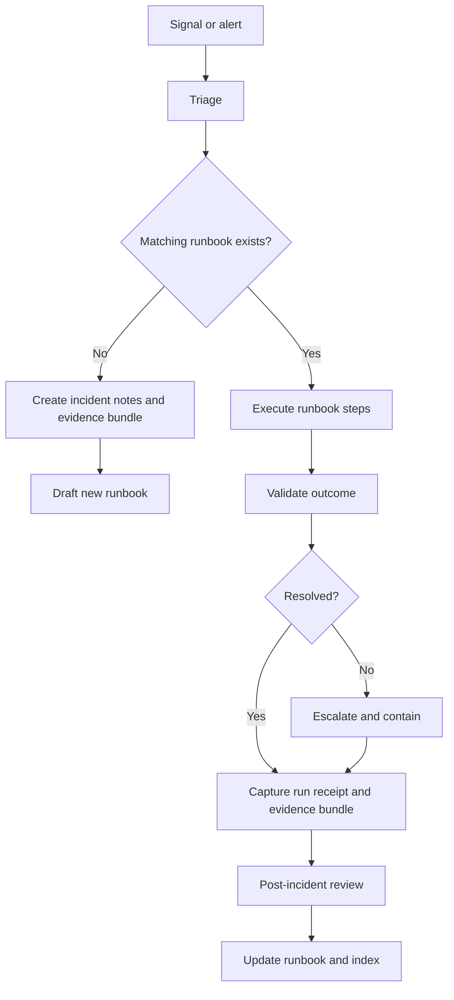

<!-- [KFM_META_BLOCK_V2]
doc_id: kfm://doc/8a1d7fbb-0ee8-4b6e-8e1b-6a0e0b20d6b2
title: Runbooks
type: standard
version: v1
status: draft
owners: TBD
created: 2026-02-24
updated: 2026-03-05
policy_label: restricted
related:
  - docs/README.md
tags: [kfm, runbooks, operations]
notes:
  - Directory-level README for operational runbooks.
  - This file intentionally avoids production-impacting commands until verified.
  - last_verified: UNVERIFIED
[/KFM_META_BLOCK_V2] -->

<a id="top"></a>

# 🧰 Runbooks
Operational procedures for keeping the **Kansas Frontier Matrix (KFM)** safe, buildable, auditable, and reversible.

> **IMPACT**
> - **Status:** draft  
> - **Owners:** TBD  
> - **Policy label:** restricted  
> - **Last verified:** UNVERIFIED  
> - **Applies to:** `docs/runbooks/**`  
> - **Jump to:** [Runbook index](#runbook-index) · [Runbook template](#runbook-template) · [Incident workflow](#incident-workflow) · [Promotion gates](#promotion-gates-and-evidence)


> [!WARNING]
> Runbooks may describe actions that can impact **data integrity**, **access controls**, or **uptime**.  
> If a step is unclear or unverified, **fail closed**: stop, capture evidence, and route for governance/owner review.

---

## Quick navigation
- [Scope](#scope)
- [Where it fits](#where-it-fits)
- [Acceptable inputs](#acceptable-inputs)
- [Exclusions](#exclusions)
- [Normative language and tagging](#normative-language-and-tagging)
- [Quickstart](#quickstart)
- [Directory structure](#directory-structure)
- [Runbook index](#runbook-index)
- [Runbook authoring standard](#runbook-authoring-standard)
- [Incident workflow](#incident-workflow)
- [Promotion gates and evidence](#promotion-gates-and-evidence)
- [Contributing](#contributing)
- [Verification checklist](#verification-checklist)
- [FAQ](#faq)

---

## Scope

### Purpose
This directory is the **home for operational runbooks**: repeatable procedures (“runbooks”) used to:

- Recover from incidents (data, pipeline, API, UI, infra).
- Execute routine maintenance safely (backfills, re-index, rollouts).
- Perform controlled changes (config updates, migrations, promotions).
- Produce **audit-ready** evidence for governance and traceability.

> [!NOTE]
> **Policy intent (CONFIRMED):** this directory is meant to contain “how we operate it safely.”  
> **Repo reality (UNKNOWN):** which runbooks exist today must be verified against the repo tree.

### Operational invariants
Runbooks MUST preserve KFM’s core invariants:

1) **Lifecycle + promotion gates (truth path)**  
Actions that move or republish artifacts MUST respect KFM’s lifecycle:

`Upstream → RAW → WORK (or QUARANTINE) → PROCESSED → PUBLISHED`

Where:
- **RAW** is immutable acquisition (source-of-truth snapshot).
- **WORK** is transformation/QA staging (mutable).
- **QUARANTINE** is an optional WORK sub-zone for containment (if your repo defines it).
- **PROCESSED** is deterministic, validated outputs.
- **PUBLISHED** is what users/clients can access.

2) **Trust membrane / policy boundary**
If an action touches **PUBLISHED surfaces** (anything user/client-facing), it MUST go through the governed policy boundary (API/Policy Enforcement Point), unless an explicitly approved **breakglass** runbook exists.

If you believe you need breakglass access and no approved runbook exists: **stop and escalate**.

---

## Where it fits
`docs/runbooks/` is the operator-facing layer of documentation:

- **Design docs** explain *why* and *what* we built.
- **Runbooks** explain *how we operate it safely* using:
  - preconditions
  - step-by-step actions
  - validation
  - rollback
  - evidence / audit artifacts

**Upstream / downstream connections (conceptual):**
- Upstream: governance standards, pipeline contracts/specs, system architecture docs.
- Downstream: operational execution (on-call, release managers, data operators), audit evidence, post-incident review inputs.

---

## Acceptable inputs
- Runbook Markdown files with:
  - purpose + scope + owner + last verified date
  - preconditions + step-by-step actions
  - validation + rollback
  - evidence/audit artifacts checklist
- Small, safe helper scripts **only if** they are:
  - deterministic
  - reviewed
  - clearly scoped to a runbook
  - **do not embed secrets**
  - **do not bypass the policy boundary**

---

## Exclusions
- ❌ Secrets, tokens, credentials, private keys, connection strings.
- ❌ Raw sensitive datasets or exports.
- ❌ “Permanent” architecture decisions (put in ADRs / design docs).
- ❌ One-off personal notes not meant for shared operations.
- ❌ Instructions that bypass governance/policy boundaries (unless under `breakglass/` and approved).

---

## Normative language and tagging
To reduce ambiguity and accidental overreach, runbooks use:

- **MUST / MUST NOT / SHOULD / MAY** in the RFC sense.
- Tagging to communicate verification posture:
  - **CONFIRMED** — verified invariant / repo contract.
  - **PROPOSED** — recommended default pending verification.
  - **UNKNOWN** — requires verification in the current repo/environment.

> [!IMPORTANT]
> This README is written to be useful even when the repo state is unknown.  
> Anything that implies specific files, commands, or tooling is explicitly labeled **PROPOSED** or **UNKNOWN**.

---

## Quickstart

> [!CAUTION]
> The commands below are **safe, read-only repo introspection**.  
> Do **not** copy production-impacting commands into runbooks unless they are verified and reviewed.

```bash
# 1) Confirm the directory exists
ls -la docs/runbooks

# 2) List runbooks (convention: rb-*.md)
find docs/runbooks -type f -name "rb-*.md" -print

# 3) List templates (if present)
find docs/runbooks -maxdepth 3 -type f -name "*template*.md" -print
```

**To add a new runbook (repo-agnostic steps):**
1. Copy the [Runbook template](#runbook-template) section below.
2. Create a file named `rb-<area>-<slug>.md`.
3. Fill in the meta block and required sections.
4. Add the runbook to the [Runbook index](#runbook-index) (or registry, if adopted).

---

## Directory structure

### Current (CONFIRMED)
- `docs/runbooks/README.md` — this file.

### Recommended structure (PROPOSED)
The structure below is an additive taxonomy to keep runbooks discoverable.

**Conventions (PROPOSED)**
- Each top-level area folder SHOULD include its own `README.md` index.
- Runbook files SHOULD follow: `rb-<area>-<slug>.md`.
- `_prefixed` directories are meta/assets and MUST NOT contain secrets or raw sensitive data.

<details>
<summary><strong>Proposed directory layout (fully expanded)</strong></summary>

```
docs/runbooks/                                          # Operational runbooks (step-by-step)
├─ README.md                                            # Index + standards + incident flow + promotion gates
│
├─ _registry/                                           # (PROPOSED) CI-friendly registry
│  ├─ runbooks.yml                                      # Canonical index (source of truth for tables)
│  ├─ runbooks.schema.json                              # JSON Schema to validate runbooks.yml
│  ├─ owners.yml                                        # Owner aliases/teams
│  ├─ areas.yml                                         # Allowed area codes
│  ├─ severities.yml                                    # SEV definitions + escalation policy
│  └─ tags.yml                                          # Allowed tags (optional)
│
├─ templates/                                           # (PROPOSED) Authoring templates
│  ├─ runbook-template.md                               # Standard runbook format
│  ├─ evidence-bundle-template.md                       # Evidence packaging template
│  ├─ incident-notes-template.md                        # Timeline + hypotheses + actions
│  ├─ comms-update-template.md                          # Status updates format
│  ├─ postmortem-template.md                            # PIR template
│  ├─ change-record-template.md                         # Change record template
│  └─ checklist-template.md                             # Generic checklist template
│
├─ _shared/                                             # (PROPOSED) Shared references (process + definitions)
│  ├─ README.md
│  ├─ glossary.md
│  ├─ roles-and-rotations.md
│  ├─ severity-matrix.md
│  ├─ default-deny-guide.md
│  ├─ evidence-and-verification.md
│  └─ rollback-decision-tree.md
│
├─ incidents/                                           # (PROPOSED) Incident response procedures
│  ├─ README.md
│  ├─ rb-incident-triage.md
│  ├─ rb-incident-sev1.md
│  ├─ rb-incident-comms.md
│  ├─ rb-incident-evidence-capture.md
│  ├─ rb-incident-escalation.md
│  └─ rb-incident-postmortem.md
│
├─ change/                                              # (PROPOSED) Controlled change workflow (non-incident)
│  ├─ README.md
│  ├─ rb-change-intake.md
│  ├─ rb-change-execute.md
│  ├─ rb-change-rollback.md
│  └─ rb-change-closeout.md
│
├─ pipelines/                                           # (PROPOSED) Pipeline operations (reruns, backfills, promotions)
│  ├─ README.md
│  ├─ rb-pipeline-rerun.md
│  ├─ rb-pipeline-backfill.md
│  ├─ rb-pipeline-promote-truth-path.md
│  ├─ rb-pipeline-quarantine.md
│  └─ rb-pipeline-receipt-verify.md
│
├─ catalog/                                             # (PROPOSED) Catalog operations (DCAT/STAC/PROV)
│  ├─ README.md
│  ├─ rb-catalog-build.md
│  ├─ rb-catalog-validate.md
│  └─ rb-catalog-publish.md
│
├─ evidence/                                            # (PROPOSED) Evidence-first operations (bundles, receipts, ledgers)
│  ├─ README.md
│  ├─ rb-evidence-bundle-create.md
│  └─ rb-evidence-run-receipt-verify.md
│
├─ indexing/                                            # (PROPOSED) Index/projection ops (search/tiles/graph)
│  ├─ README.md
│  └─ rb-index-rebuild.md
│
├─ api/                                                 # (PROPOSED) API deploy operations
│  ├─ README.md
│  ├─ rb-api-deploy.md
│  └─ rb-api-rollback.md
│
├─ ui/                                                  # (PROPOSED) UI deploy + runtime toggles
│  ├─ README.md
│  ├─ rb-ui-deploy.md
│  └─ rb-ui-rollback.md
│
├─ policy/                                              # (PROPOSED) Policy engine operations
│  ├─ README.md
│  ├─ rb-policy-bundle-publish.md
│  └─ rb-policy-bundle-rollback.md
│
├─ security/                                            # (PROPOSED) Security runbooks
│  ├─ README.md
│  ├─ rb-security-incident-triage.md
│  └─ rb-security-credential-compromise.md
│
├─ observability/                                       # (PROPOSED) Monitoring/alerting/SLO runbooks
│  ├─ README.md
│  ├─ rb-observability-alert-triage.md
│  └─ rb-observability-slo-breach.md
│
├─ breakglass/                                          # (PROPOSED) Explicitly approved emergency procedures
│  ├─ README.md
│  ├─ rb-breakglass-emergency-access.md
│  └─ rb-breakglass-closeout.md
│
└─ _assets/                                             # (PROPOSED) Redacted assets only
   ├─ README.md
   ├─ diagrams/
   └─ screenshots/
```

</details>

> [!TIP]
> Keep “templates” and “runbooks” separate. Templates change rarely; runbooks evolve frequently.

---

## Runbook index

> [!NOTE]
> To prevent accidental hallucination (“this file exists”), the index is split into **Confirmed present** vs **Planned**.

### Confirmed present (CONFIRMED)
| Runbook ID | Area | Title | Blast radius | Owner | Last verified | Status | Link |
|---|---|---|---|---|---:|---|---|
| RB-RUNBOOKS-README | meta | Runbooks Directory README | none | TBD | UNVERIFIED | draft | `README.md` |

### Planned backlog (PROPOSED)
| Candidate ID | Area | Title | Trigger / Use-case | Proposed blast radius | Proposed owner | Planned path |
|---|---|---|---|---|---|---|
| RB-TEMPLATE | templates | Runbook Template | Authoring | none | TBD | `templates/runbook-template.md` |
| RB-INCIDENT-TRIAGE | incidents | Incident Triage | Alert triage + containment | multi-env | TBD | `incidents/rb-incident-triage.md` |
| RB-PIPELINE-RERUN | pipelines | Re-run Pipeline Safely | Rerun after failure | staging/prod | TBD | `pipelines/rb-pipeline-rerun.md` |
| RB-PROMOTE-TRUTH-PATH | pipelines | Promote Through Truth Path | Promote dataset version | prod | TBD | `pipelines/rb-pipeline-promote-truth-path.md` |
| RB-CATALOG-VALIDATE | catalog | Validate Catalog Triplet | Validation gate | staging/prod | TBD | `catalog/rb-catalog-validate.md` |
| RB-EVIDENCE-BUNDLE | evidence | Create Evidence Bundle | Evidence capture + audit | multi-env | TBD | `evidence/rb-evidence-bundle-create.md` |
| RB-INDEX-REBUILD | indexing | Rebuild Indexes | Rebuild projections | prod | TBD | `indexing/rb-index-rebuild.md` |

**Index rules (PROPOSED)**
- IDs are stable: `RB-<AREA>-<SHORTNAME>` (example: `RB-PIPELINE-BACKFILL`).
- “Last verified” MUST be a real date; if unknown, set `UNVERIFIED`.
- “Blast radius” MUST be conservative: `none`, `dev`, `staging`, `prod`, `multi-env`.

---

## Runbook authoring standard

### Naming
- File name: `rb-<area>-<slug>.md`
- Title should match the runbook’s purpose, not an implementation detail.
- Prefer verbs first for action runbooks: “Rebuild…”, “Rollback…”, “Promote…”, “Re-run…”.

### Required sections
A runbook is not “done” unless it contains:
- **Purpose and scope**
- **Policy label** (public/restricted/…)
- **Preconditions** (permissions, environment, backups, feature flags)
- **Safety / default-deny notes**
- **Step-by-step procedure**
- **Validation** (how you know it worked)
- **Rollback** (how to undo safely)
- **Run receipt / audit record requirements**
- **Evidence bundle** (what artifacts to capture and where they live)

### Runbook template
Create `docs/runbooks/<area>/rb-<area>-<slug>.md` (or place in `docs/runbooks/` until area folders exist):

```md
<!-- [KFM_META_BLOCK_V2]
doc_id: kfm://doc/<uuid>
title: <Runbook title>
type: standard
version: v1
status: draft
owners: <team or name>
created: YYYY-MM-DD
updated: YYYY-MM-DD
policy_label: restricted
related:
  - <design doc / ADR / pipeline spec links>
tags: [kfm, runbook, <area>]
notes:
  - last_verified: YYYY-MM-DD | UNVERIFIED
  - next_review_due: YYYY-MM-DD | UNSET
  - blast_radius: none|dev|staging|prod|multi-env
  - touches_truth_path: yes|no
  - touches_published: yes|no
[/KFM_META_BLOCK_V2] -->

# <Runbook title>

## Purpose
<What this accomplishes.>

## Scope
- Included:
- Excluded:

## Preconditions
- Access:
- Environment:
- Backups / snapshots:
- Change window:

## Safety notes
- Default-deny triggers:
- Known risky steps:
- Trust membrane warnings:

## Procedure
1. Step
2. Step

## Validation
- What to check:
- Expected result:

## Rollback
- How to undo:
- When rollback is mandatory:

## Run receipt and audit record
Capture/attach:
- Who executed the run (operator identity)
- When it started/ended (timestamps)
- Inputs and outputs (identifiers + digests/checksums when applicable)
- Policy decisions and approvals (who/when/why)
- Links to logs and monitoring snapshots

## Evidence bundle
Attach/record:
- Commands executed (with timestamps) OR a statement that no commands were run
- Input/output identifiers and digests where applicable
- Links to logs
- QA reports (if relevant)
- Catalog validation outputs (if relevant)
- Policy decision record (if relevant)
```

---

## Incident workflow


```mermaid
flowchart TD
  A[Signal or alert] --> B[Triage]
  B --> C{Matching runbook exists?}
  C -- Yes --> D[Execute runbook steps]
  C -- No --> E[Create incident notes and evidence bundle]
  E --> F[Draft new runbook]
  D --> G[Validate outcome]
  G --> H{Resolved?}
  H -- Yes --> I[Capture run receipt and evidence bundle]
  H -- No --> J[Escalate and contain]
  J --> I
  I --> K[Post-incident review]
  K --> L[Update runbook and index]
```

**Incident invariants (PROPOSED)**
- Prefer **small reversible actions** over “big bang” changes.
- Every action must be traceable to an operator + time + reason.
- If evidence can’t be captured, treat the action as **not completed**.
- If an action would bypass the trust membrane, treat it as **default-deny** unless a breakglass runbook exists and approvals are recorded.

---

## Promotion gates and evidence
Runbooks that move artifacts across lifecycle zones MUST align to KFM’s promotion expectations and fail closed.

### Truth path reminder
Promotions should follow:
`Upstream → RAW → WORK (or QUARANTINE) → PROCESSED → PUBLISHED`

### Promotion Contract minimum gates (PROPOSED)
> [!NOTE]
> These gates are written as a **policy target** for runbooks and CI checks.  
> If your repo already defines a different promotion contract, treat this table as **UNKNOWN** until aligned.

| Gate | What must be present | Runbook evidence to capture |
|---|---|---|
| A — Identity and versioning | Stable dataset identifiers and versioning | IDs, versions, digests |
| B — Licensing and rights metadata | License/rights fields + terms snapshot | license/rights + snapshot reference |
| C — Sensitivity classification and redaction plan | policy_label + obligations when needed | classification + redaction notes + approvals |
| D — Catalog validation | DCAT + STAC + PROV validate and cross-link | validator outputs + link checks |
| E — QA and thresholds | dataset QA checks + thresholds | QA report + threshold results |
| F — Run receipt and audit record | inputs/tooling/hashes/decisions | receipt + logs + timestamps |
| G — Release manifest (recommended) | publication record for rollback | manifest reference |

### Minimum evidence bundle checklist (PROPOSED)
- [ ] **Identity & versioning**: dataset/version identifiers recorded
- [ ] **License/rights**: rights metadata present + upstream terms snapshot referenced
- [ ] **Sensitivity**: policy label assigned; redaction/generalization obligations recorded if needed
- [ ] **Catalogs**: DCAT/STAC/PROV validations recorded (or explicitly N/A)
- [ ] **QA**: validation results attached (checks + thresholds)
- [ ] **Integrity**: checksums / digests recorded for relevant artifacts
- [ ] **Run receipt**: operator + timestamps + inputs/outputs + tooling versions + decisions
- [ ] **Rollback**: rollback plan documented (or “irreversible” flagged and approved)

### Gate behavior (CONFIRMED policy posture)
- Gates **fail closed** by default.
- If a gate requires an artifact you don’t have, stop and record:
  - the missing artifact
  - why it is required
  - the smallest acceptable substitute (if any)

---

## Contributing

### Definition of Done for a new runbook
- [ ] Added to [Runbook index](#runbook-index) (or `_registry/runbooks.yml` if adopted)
- [ ] Has an owner (not “TBD”) **before** being marked “published”
- [ ] Has a real `last_verified` date or explicitly `UNVERIFIED`
- [ ] Includes rollback and validation
- [ ] Includes run receipt / evidence bundle requirements
- [ ] Does not contain secrets or sensitive raw extracts
- [ ] Reviewed by someone outside the author (minimum 1 reviewer)

### Review checklist
- [ ] Steps are deterministic and ordered
- [ ] Preconditions are explicit (permissions, env)
- [ ] Failure modes are described and safe
- [ ] Rollback is realistic
- [ ] Evidence bundle is sufficient for audit/reproduction
- [ ] Does not instruct bypassing the trust membrane or policy boundary

---

## Verification checklist

Use this checklist to turn UNKNOWN → CONFIRMED and reduce hallucination risk over time:

- [ ] Confirm actual directory contents: `find docs/runbooks -maxdepth 3 -type f`
- [ ] If adopting the proposed taxonomy, create only the **next** folder(s) needed (small, additive change).
- [ ] If you add `_registry/runbooks.yml`, add a CI check that:
  - [ ] validates schema
  - [ ] ensures every file in the registry exists
  - [ ] ensures every `rb-*.md` file is registered
- [ ] Replace `owners: TBD` when an ops owner group exists.
- [ ] Replace `last_verified: UNVERIFIED` only after:
  - [ ] links resolve
  - [ ] procedures include rollback + validation
  - [ ] evidence requirements are clear and feasible
- [ ] Audit the document for implied tooling names (e.g., “CatGen”) and relabel as examples unless verified.

---

## FAQ

### Why “restricted” by default?
Runbooks often include operational knowledge that increases risk if publicly exposed. Start restricted, then downgrade only if governance explicitly allows.

### Can a runbook include exact commands?
Yes, **if verified** and **safe**. Prefer:
- “dry run” steps first
- explicit environment scoping
- explicit expected outputs
- rollback readiness checks before any irreversible step

If commands depend on local tooling, include alternatives or clearly label as **repo-specific** and pin to a verified version.

### What if I’m unsure whether something belongs here?
If it changes system behavior, touches production, or affects governance/data promotion: it belongs here.

---

Back to top: [Top](#top)
