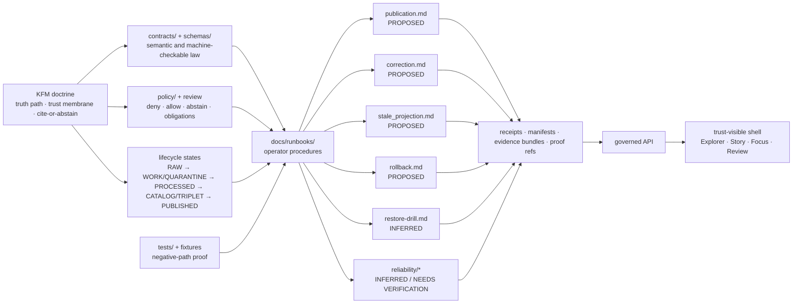

<!-- [KFM_META_BLOCK_V2]
doc_id: kfm://doc/REVIEW_REQUIRED_UUID
title: Runbooks
type: standard
version: v1
status: draft
owners: REVIEW_REQUIRED_OWNER
created: REVIEW_REQUIRED_CREATED_DATE
updated: 2026-04-22
policy_label: REVIEW_REQUIRED_POLICY_LABEL
related: [../../README.md, ../README.md, ../standards/README.md, ../governance/README.md, ../../contracts/README.md, ../../schemas/README.md, ../../policy/README.md, ../../tests/README.md]
tags: [kfm, runbooks, operations, publication, correction, rollback, evidence]
notes: [Public repo and attached corpus show a runbooks README surface, but owners, created date, policy label, and live checkout state require verification before merge.]
[/KFM_META_BLOCK_V2] -->

# Runbooks

_Governed operator procedures for Kansas Frontier Matrix: publication, correction, rollback, stale-state handling, recovery, and other trust-significant operational response._

> [!IMPORTANT]
> **Status:** experimental  
> **Owners:** `REVIEW_REQUIRED_OWNER`  
> **Badges:**  
> 
> 
> 
> 
>   
> **Quick jumps:** [Scope](#scope) · [Repo fit](#repo-fit) · [Accepted inputs](#accepted-inputs) · [Exclusions](#exclusions) · [Directory tree](#directory-tree) · [Quickstart](#quickstart) · [Usage](#usage) · [Diagram](#diagram) · [Operating tables](#operating-tables) · [Definition of done](#definition-of-done) · [FAQ](#faq) · [Appendix](#appendix)

> [!WARNING]
> This README is **doctrine-grounded and checkout-bounded**. KFM doctrine strongly supports runbooks for promotion, correction, rollback, publication, evidence integrity, stale projection handling, and recovery. Exact owners, workflow enforcement, adjacent file maturity, and subordinate runbook existence must still be verified in the live checkout before removing `NEEDS VERIFICATION` labels.

---

## Scope

`docs/runbooks/` is the operator-facing documentation surface for one practical KFM question:

**How does the system act under pressure without weakening the truth path or the trust membrane?**

Runbooks belong here when doctrine turns into action:

- promotion and post-promotion checks
- publication review and release readiness
- correction, supersession, narrowing, withdrawal, and rollback
- stale or mismatched derived-state handling
- reliability-trigger and retry decisions
- evidence-integrity checks and receipt/proof reissue paths
- incident containment, restore drills, and recovery validation

A KFM runbook is not just a step list. It makes a governed procedure inspectable by naming the trigger, prerequisites, authoritative inputs, safety gates, ordered procedure, validation, negative outcomes, output artifacts, rollback or forward-fix path, and follow-up updates.

### Evidence labels used here

| Label | Meaning in this README |
|---|---|
| **CONFIRMED** | Verified from the live checkout or from explicitly cited project evidence. |
| **INFERRED** | Strongly implied by doctrine or adjacent material, but not directly verified in implementation. |
| **PROPOSED** | Recommended addition or target shape; not presented as current repo behavior. |
| **UNKNOWN** | Not supported strongly enough to state as fact. |
| **NEEDS VERIFICATION** | Placeholder, owner, path, or enforcement detail that must be checked before merge. |

### Why this directory matters

KFM treats release, correction, rollback, review, and runtime explanation as parts of one governed system. A stale or missing runbook is therefore not only a documentation gap. It is a trust risk.

KFM’s core lifecycle stays visible here:

```text
RAW -> WORK / QUARANTINE -> PROCESSED -> CATALOG / TRIPLET -> PUBLISHED
```

Runbooks explain how humans operate that lifecycle without turning prose into policy, schemas, runtime code, or canonical truth.

[Back to top](#runbooks)

---

## Repo fit

**Path:** `docs/runbooks/README.md`  
**Role:** directory README for governed operating, correction, recovery, and release procedures.

### Upstream and adjacent anchors

| Direction | Surface | Why it matters | Status here |
|---|---|---|---|
| Upstream | [`../../README.md`][repo-root] | Root identity, doctrine framing, and repo-level trust posture | **NEEDS VERIFICATION** |
| Upstream | [`../README.md`][docs-index] | Local docs boundary and neighboring documentation pattern | **NEEDS VERIFICATION** |
| Adjacent | [`../governance/`][governance] | Review, withholding, escalation, and publication burden | **NEEDS VERIFICATION** |
| Adjacent | [`../standards/`][standards] | Normative profiles, terminology stability, and documented obligations | **NEEDS VERIFICATION** |
| Adjacent | [`../templates/`][templates] | Future runbook authoring templates | **NEEDS VERIFICATION** |
| Adjacent | [`../../contracts/`][contracts] | Semantic contract surfaces that runbook prose must not contradict | **NEEDS VERIFICATION** |
| Adjacent | [`../../schemas/`][schemas] | Machine-checkable structure and drift boundary | **NEEDS VERIFICATION** |
| Adjacent | [`../../policy/`][policy] | Deny-by-default posture, obligations, sensitivity, and review logic | **NEEDS VERIFICATION** |
| Adjacent | [`../../tests/`][tests] | Fixtures, proof expectations, negative-path validation, and non-regression checks | **NEEDS VERIFICATION** |
| Adjacent | [`../../tools/README.md`](../../tools/README.md) | Validator and operator-tool intent surface | **NEEDS VERIFICATION** |
| Adjacent | [`../../scripts/README.md`](../../scripts/README.md) | Script entrypoint intent surface | **NEEDS VERIFICATION** |
| Adjacent | [`../../infra/README.md`][infra-readme] | Runtime/deployment coordination for restore, rollback, and operations behavior | **NEEDS VERIFICATION** |
| Adjacent | [`../../.github/workflows/README.md`](../../.github/workflows/README.md) | Workflow posture and merge-gate reality | **NEEDS VERIFICATION** |
| Downstream | `docs/runbooks/publication.md` | Promotion and publication procedure | **PROPOSED** |
| Downstream | `docs/runbooks/correction.md` | Public-error correction and supersession | **PROPOSED** |
| Downstream | `docs/runbooks/stale_projection.md` | Derived-layer lag and stale-visible handling | **PROPOSED** |
| Downstream | `docs/runbooks/rollback.md` | Return to a known-good promoted state | **PROPOSED** |
| Downstream | `docs/runbooks/reliability/trigger-retry-matrix.md` | Trigger/retry guidance where trigger kind changes operator posture | **INFERRED / NEEDS VERIFICATION** |

> [!NOTE]
> `docs/runbooks/` explains **how governed actions are executed and verified**. It must not quietly become the canonical home of policy rule bodies, schemas, runtime payload law, source registries, generated receipts, proof packs, or implementation code.

[Back to top](#runbooks)

---

## Accepted inputs

Content belongs in `docs/runbooks/` when it is a human-readable governed procedure for a trust-bearing operating moment.

Good inputs include:

- publication, correction, rollback, stale-visible, restore, and incident procedures
- operator checklists tied to release state, evidence state, and review state
- reliability-trigger and retry guidance when trigger kind changes safe action
- validation steps and negative-path checks
- expected output artifacts such as receipts, manifests, correction notices, screenshots, proof refs, and audit joins
- rollback or restore drills that affect release credibility
- compact diagrams, matrices, and examples that clarify action without replacing contracts or policy

### What a good KFM runbook looks like

A good runbook here is:

- specific enough to execute
- explicit about which inputs are authoritative
- clear about hold, deny, quarantine, stale-visible, correction, and withdrawal paths
- paired with validation and rollback or forward-fix
- honest about `UNKNOWN` and `NEEDS VERIFICATION`
- aligned with contracts, schemas, policy, tests, release evidence, and review state

[Back to top](#runbooks)

---

## Exclusions

The following do **not** belong here as the authoritative source of truth:

| Exclusion | Why it stays out | Keep it here instead |
|---|---|---|
| Policy rule bodies, deny logic, and obligation registries | Runbooks explain procedure; policy enforces decisions. | [`../../policy/`][policy] |
| Schemas, OpenAPI, and runtime payload law | Machine-checkable contracts should not be replaced by prose. | [`../../contracts/`][contracts], [`../../schemas/`][schemas] |
| Runtime service code, workers, UI implementation, resolver logic | Runbooks must not become shadow implementation. | code-owning app/package surfaces |
| Canonical data artifacts, receipts, release outputs, proof packs | These are trust objects, not prose procedures. | release-owning / artifact-owning surfaces |
| Secrets, credentials, private endpoints, precise sensitive coordinates | Unsafe for general repository docs. | restricted operator channels |
| Generic architecture essays with no operating action | They belong elsewhere in `docs/`. | architecture / governance / standards |
| Prose that upgrades `UNKNOWN` implementation into present-tense fact | Breaks KFM truth posture. | keep uncertainty visible until verified |

[Back to top](#runbooks)

---

## Directory tree

### Current minimal subtree

`NEEDS VERIFICATION` in the live checkout before merge:

```text
docs/runbooks/
├── .gitkeep          # optional placeholder when no subordinate runbooks exist
└── README.md         # this directory index
```

### Doctrine-backed target shape

This is the smallest useful target map for the next runbook wave. It is a target shape, not a claim that every file already exists.

```text
docs/runbooks/
├── README.md
├── publication.md         # PROPOSED
├── correction.md          # PROPOSED
├── stale_projection.md    # PROPOSED
├── rollback.md            # PROPOSED
├── restore-drill.md       # INFERRED
└── reliability/
    └── trigger-retry-matrix.md   # INFERRED / NEEDS VERIFICATION
```

### Current subtree notes

| Path or lane | Role | Status |
|---|---|---|
| `docs/runbooks/README.md` | Directory contract for governed operator procedures. | **target file** |
| `docs/runbooks/.gitkeep` | Placeholder if no subordinate runbooks exist. | **NEEDS VERIFICATION** |
| `docs/runbooks/publication.md` | Promotion and publication procedure. | **PROPOSED** |
| `docs/runbooks/correction.md` | Published-error correction and supersession. | **PROPOSED** |
| `docs/runbooks/stale_projection.md` | Derived-layer lag and stale-visible handling. | **PROPOSED** |
| `docs/runbooks/rollback.md` | Return to last known-good promoted state. | **PROPOSED** |
| `docs/runbooks/restore-drill.md` | Rehearsed recovery and restore evidence. | **INFERRED** |
| `docs/runbooks/reliability/trigger-retry-matrix.md` | Retry/default-decision matrix. | **INFERRED / NEEDS VERIFICATION** |

> [!WARNING]
> Do not treat the target tree above as implementation proof. Promotion, correction, rollback, stale projection, reliability, and restore procedures become current only when the corresponding files exist, links pass, and reviewers confirm that adjacent contracts, schemas, policy, tests, and workflow surfaces agree.

[Back to top](#runbooks)

---

## Quickstart

Use a verification-first sequence before editing or expanding `docs/runbooks/`.

> [!NOTE]
> The commands below are for a live checkout. They are operator verification steps, not proof of what was mounted during documentation drafting.

```bash
# 1) Confirm and enter the repo root.
git rev-parse --show-toplevel
cd "$(git rev-parse --show-toplevel)"

# 2) Inspect the actual runbooks subtree.
find docs/runbooks -maxdepth 4 -type f 2>/dev/null | sort
find docs/runbooks -maxdepth 4 -type d 2>/dev/null | sort

# 3) Re-open adjacent documentation surfaces that shape runbook wording.
sed -n '1,240p' README.md 2>/dev/null || true
sed -n '1,240p' docs/README.md 2>/dev/null || true
sed -n '1,240p' .github/workflows/README.md 2>/dev/null || true
sed -n '1,240p' contracts/README.md 2>/dev/null || true
sed -n '1,240p' schemas/README.md 2>/dev/null || true
sed -n '1,240p' policy/README.md 2>/dev/null || true
sed -n '1,240p' tests/README.md 2>/dev/null || true

# 4) Check whether proposed subordinate runbooks already exist.
for f in \
  docs/runbooks/publication.md \
  docs/runbooks/correction.md \
  docs/runbooks/stale_projection.md \
  docs/runbooks/rollback.md \
  docs/runbooks/restore-drill.md \
  docs/runbooks/reliability/trigger-retry-matrix.md
do
  test -f "$f" && echo "[FOUND] $f" || echo "[MISSING] $f"
done

# 5) Surface behavior-significant references before writing present-tense claims.
grep -RIn \
  "runbook\|rollback\|correction\|stale\|proof pack\|ReleaseManifest\|EvidenceBundle\|RuntimeResponseEnvelope\|PromotionDecision" \
  docs .github contracts schemas policy tests tools scripts 2>/dev/null || true

# 6) Verify workflow reality before claiming merge gates or drills.
find .github/workflows -maxdepth 2 -type f 2>/dev/null | sort
```

### Minimal review order

1. Confirm the actual `docs/runbooks/` subtree in the live checkout.
2. Confirm which operator moment is being documented: publication, correction, rollback, stale-visible handling, restore, reliability, or incident response.
3. Re-check the neighboring contracts, schemas, policy, and tests the runbook must not contradict.
4. Confirm whether `infra/`, `.github/`, `tools/`, `scripts/`, or another domain lane already owns a narrower procedure.
5. Update the runbook in the same change stream as behavior-significant changes.

[Back to top](#runbooks)

---

## Usage

### Read `docs/runbooks/` by operating moment

1. Start here to understand the directory boundary and current verification posture.
2. Use **publication** runbooks when the question is: _what must be true before visible change is promoted?_
3. Use **correction** runbooks when the question is: _how does an already-visible error become a governed correction, narrowing, supersession, or withdrawal?_
4. Use **rollback** runbooks when the question is: _how do we return to a known-good promoted state and prove it?_
5. Use **stale-projection** runbooks when the question is: _what happens when derived delivery no longer matches released truth?_
6. Use **reliability** runbooks when the question is: _which trigger and retry posture is safe for this lane?_
7. Use **restore** runbooks when the question is: _can recovery claims be rehearsed, evidenced, and audited?_
8. Use **incident** procedures here only when this directory is the chosen owner; otherwise link outward to the narrower authoritative location.

### Boundary rule: `docs/runbooks/` versus `infra/`

Use `docs/runbooks/` for **human-readable governed procedure**.

Use `infra/` for **runtime and delivery assets** such as Compose, systemd, Terraform, Kubernetes, dashboards, and deployment wiring.

A runbook may reference `infra/`, `.github/`, `tools/`, or `scripts/`, but it should not duplicate those surfaces as canonical truth.

### Why runbooks stay inside the trust system

In KFM, public release, correction, denial, rollback, and runtime explanation are not independent concerns. They share contracts, policy, review state, evidence objects, correction lineage, and release memory. Runbooks are where those relationships become executable by humans.

[Back to top](#runbooks)

---

## Diagram


```mermaid
flowchart LR
    D["KFM doctrine<br/>truth path · trust membrane · cite-or-abstain"] --> C["contracts/ + schemas/<br/>semantic and machine-checkable law"]
    D --> P["policy/ + review<br/>deny · allow · abstain · obligations"]
    D --> L["lifecycle states<br/>RAW → WORK/QUARANTINE → PROCESSED → CATALOG/TRIPLET → PUBLISHED"]

    C --> R["docs/runbooks/<br/>operator procedures"]
    P --> R
    L --> R
    T["tests/ + fixtures<br/>negative-path proof"] --> R

    R --> PUB["publication.md<br/>PROPOSED"]
    R --> CORR["correction.md<br/>PROPOSED"]
    R --> STALE["stale_projection.md<br/>PROPOSED"]
    R --> RB["rollback.md<br/>PROPOSED"]
    R --> RESTORE["restore-drill.md<br/>INFERRED"]
    R --> REL["reliability/*<br/>INFERRED / NEEDS VERIFICATION"]

    PUB --> ART["receipts · manifests · evidence bundles · proof refs"]
    CORR --> ART
    STALE --> ART
    RB --> ART
    RESTORE --> ART
    REL --> ART

    ART --> API["governed API"]
    API --> SHELL["trust-visible shell<br/>Explorer · Story · Focus · Review"]
```

The diagram is boundary-heavy on purpose. In KFM, operator prose stays downstream of doctrine, contracts, policy, tests, lifecycle state, and release artifacts.

[Back to top](#runbooks)

---

## Operating tables

### Runbook family matrix

| Runbook family | Primary question | Typical companion surfaces | Status here |
|---|---|---|---|
| `publication.md` | What must be true before visible change is promoted? | contracts, schemas, policy, review, release manifests, accessibility/docs gates | **PROPOSED** |
| `correction.md` | How does a public error become a governed correction or supersession? | correction notices, review records, affected surfaces, rebuild refs | **PROPOSED** |
| `stale_projection.md` | What happens when derived delivery lags promoted truth? | projection receipts, freshness checks, surface-state labels | **PROPOSED** |
| `rollback.md` | How do we return to a known-good promoted state? | rollback notes, manifests, release refs, restoration evidence | **PROPOSED** |
| `restore-drill.md` | How do we rehearse and evidence recovery claims? | backups, restore verification, screenshots, audit joins | **INFERRED** |
| `reliability/trigger-retry-matrix.md` | Which trigger/retry posture is safe for this lane? | idempotency keys, retry budgets, DLQ/quarantine, provenance | **INFERRED / NEEDS VERIFICATION** |
| `incident.md` | How do we contain a fault, preserve evidence, and recover safely? | observability, audit refs, review notes, correction linkage | **INFERRED** |

### Minimum content contract for every runbook

| Must include | Why it matters in KFM | Typical examples |
|---|---|---|
| Trigger | Prevents “run it because it feels right” behavior. | failed gate, staleness threshold, exposure issue, alert, review decision |
| Preconditions | Stops authority-free execution. | release ID, review state, role requirement, source availability |
| Inputs / owning truth surfaces | Keeps prose downstream of evidence. | contracts, policies, manifests, EvidenceBundle refs, logs |
| Safety gates | Preserves fail-closed behavior. | hold if proofs missing, deny if rights unclear, quarantine on validation failure |
| Procedure | Makes execution repeatable. | ordered steps with role-aware clarity |
| Validation | Converts “we ran it” into inspectable evidence. | schema pass, link check, screenshot baseline, post-action query |
| Negative outcomes | Makes failure states first-class. | hold, quarantine, stale-visible, generalized, denied, withdrawn |
| Output artifacts | Keeps operations auditable. | receipt, manifest, correction notice, review note, proof-pack ref |
| Rollback / forward-fix | Prevents dead-end procedures. | revert to prior release, withhold publication, rebuild projection |
| Follow-up updates | Keeps docs in band with behavior. | update tests, dashboards, docs, release notes, correction surfaces |

### Public-trust behavior matrix

| Situation | Preferred runbook behavior |
|---|---|
| A deployment occurred but release proof is incomplete. | Hold publication; deployment is not treated as trusted publication. |
| A derived layer is stale relative to promoted scope. | Mark stale-visible or hold; do not imply freshness. |
| A public interpretation changed after evidence correction. | Issue visible correction or supersession artifacts. |
| A failure path has not been rehearsed. | Keep the gap visible and schedule a drill before expanding trust claims. |
| Retry posture changes because the trigger kind changes. | Update runbooks and validation, not only workflow config. |
| Rights, sovereignty, or exact-location sensitivity is unresolved. | Deny, narrow, generalize, restrict, or quarantine instead of best-effort publication. |
| A model-generated answer cannot resolve cited evidence. | Abstain, deny, or return a bounded error; do not publish fluent unsupported output. |

[Back to top](#runbooks)

---

## Definition of done

Use this checklist before treating this README or any subordinate runbook as ready for commit.

- [ ] The actual `docs/runbooks/` subtree was inspected in the live checkout.
- [ ] Owners were resolved from repo ownership controls or left explicitly `NEEDS VERIFICATION`.
- [ ] Meta block placeholders were resolved or deliberately retained with notes.
- [ ] Any proposed subordinate files remain clearly labeled until they exist.
- [ ] Adjacent surfaces in `contracts/`, `schemas/`, `policy/`, `tests/`, and `.github/workflows/` were re-opened before converting doctrine into present-tense repo claims.
- [ ] Every runbook includes trigger, prerequisites, authoritative inputs, validation, rollback/forward-fix, and output artifacts.
- [ ] Every behavior-significant procedure was cross-checked against contracts, schemas, policy, tests, and release evidence.
- [ ] Relative links render correctly on GitHub from `docs/runbooks/README.md`.
- [ ] The Mermaid diagram still matches the mounted tree and directory contract.
- [ ] `UNKNOWN` and `NEEDS VERIFICATION` markers were removed only when the checkout actually proved the claim.
- [ ] Incident, migration, or runtime changes that alter operator behavior also update the relevant runbook.

[Back to top](#runbooks)

---

## FAQ

### Why keep verification markers visible?

Because this directory sits at the boundary between doctrine and operator action. KFM prefers explicit incompleteness to persuasive overclaiming.

### Why are publication, correction, stale projection, and rollback prominent?

Because they are the seams where public trust is easiest to weaken: release can outrun proof, correction can disappear, derived layers can silently outrank published truth, and rollback can become folklore instead of an auditable procedure.

### Why is the reliability lane weaker here?

Reliability-trigger and retry logic is a plausible operating lane, but it should stay `INFERRED / NEEDS VERIFICATION` until the live repository proves the owning files, workflow hooks, and tests.

### Why separate `docs/runbooks/` from `infra/`?

The two surfaces do different jobs. `infra/` owns runtime wiring. `docs/runbooks/` owns human-readable governed procedures explaining how runtime, release, restore, rollback, correction, and containment are executed and validated.

### When should a runbook change block release?

When stale procedure would mislead publication, correction, rollback, stale-visible handling, restore claims, runtime trust-visible behavior, or reviewer expectations.

### Can a runbook live somewhere else?

Yes. If another directory clearly owns the narrower truth surface, this index should link outward instead of duplicating the authoritative procedure.

[Back to top](#runbooks)

---

## Appendix

### Starter runbook skeleton

Use this as the minimum shape for new runbooks under `docs/runbooks/`.

```md
<!-- [KFM_META_BLOCK_V2]
doc_id: kfm://doc/REVIEW_REQUIRED_UUID
title: <Runbook title>
type: standard
version: v1
status: draft
owners: REVIEW_REQUIRED_OWNER
created: REVIEW_REQUIRED_CREATED_DATE
updated: REVIEW_REQUIRED_UPDATED_DATE
policy_label: REVIEW_REQUIRED_POLICY_LABEL
related: [docs/runbooks/README.md]
tags: [kfm, runbook]
notes: [Replace placeholders before publication or document why they remain.]
[/KFM_META_BLOCK_V2] -->

# <Runbook title>

_One-line purpose._

> [!IMPORTANT]
> **Status:** experimental|active|stable|deprecated  
> **Owners:** REVIEW_REQUIRED_OWNER  
> **Trigger:** <event or condition>  
> **Quick jumps:** [Preconditions](#preconditions) · [Procedure](#procedure) · [Validation](#validation) · [Rollback / forward-fix](#rollback--forward-fix) · [Output artifacts](#output-artifacts)

## Scope

What this runbook covers, and what it does not.

## Preconditions

Required release state, review state, IDs, dashboards, policies, access, and safety checks.

## Inputs / owning truth surfaces

Contracts, schemas, policies, release manifests, correction notices, dashboards, or logs.

## Procedure

Ordered steps only.

## Validation

What proves success, safe hold, or safe failure.

## Negative outcomes

Hold / quarantine / stale-visible / deny / error / escalate — whichever apply.

## Output artifacts

Receipts, notices, manifests, proof-pack references, incident notes, screenshots, or audit joins.

## Rollback / forward-fix

How to recover if the procedure fails or only partially succeeds.

## Follow-up updates

Which docs, tests, dashboards, release notes, or trust-visible surfaces must change next.
```

### Near-term additions worth making visible

| Candidate | Why it belongs here | Status |
|---|---|---|
| `publication.md` | Makes promotion and publication procedure explicit. | **PROPOSED** |
| `correction.md` | Makes public error correction and supersession inspectable. | **PROPOSED** |
| `stale_projection.md` | Prevents derived layers from silently outranking release truth. | **PROPOSED** |
| `rollback.md` | Makes return-to-known-good behavior explicit and reviewable. | **PROPOSED** |
| `restore-drill.md` | Converts recovery claims into rehearsed, evidenced procedure. | **INFERRED** |
| `reliability/trigger-retry-matrix.md` | Explains how trigger kind changes retry posture. | **INFERRED / NEEDS VERIFICATION** |

### Review prompts before adding a new runbook

- What exact trust-bearing seam does this procedure protect?
- Which artifacts prove the procedure completed honestly?
- What must become visibly stale, narrowed, denied, generalized, corrected, or withdrawn if it fails?
- Which contracts, schemas, policy vocabularies, tests, dashboards, or drills must change with the doc?
- Does another directory already own the narrower truth surface?

[Back to top](#runbooks)

[repo-root]: ../../README.md
[docs-index]: ../README.md
[infra-readme]: ../../infra/README.md
[governance]: ../governance/
[standards]: ../standards/
[templates]: ../templates/
[contracts]: ../../contracts/
[schemas]: ../../schemas/
[policy]: ../../policy/
[tests]: ../../tests/
