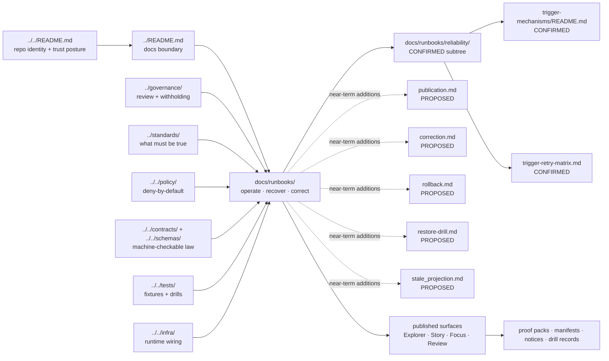

<!-- [KFM_META_BLOCK_V2]
doc_id: kfm://doc/NEEDS_VERIFICATION
title: runbooks
type: standard
version: v1
status: draft
owners: NEEDS_VERIFICATION
created: YYYY-MM-DD
updated: YYYY-MM-DD
policy_label: NEEDS_VERIFICATION
related: [../README.md, ../../README.md, ../../.github/README.md, ../../infra/README.md, ../governance/, ../standards/, ../templates/, ../../contracts/, ../../schemas/, ../../policy/, ../../tests/]
tags: [kfm, runbooks, operations, rollback, correction]
notes: [README-like directory doc; repo-grounded wording used where current repo audit/support inventory exists; placeholders retained where live ownership, dates, and policy label were not directly verified from the current checkout.]
[/KFM_META_BLOCK_V2] -->

# runbooks

Governed operator procedures for Kansas Frontier Matrix: recovery, correction, rollback, restore, incident handling, and reliability-trigger response.

> **Status:** experimental  
> **Owners:** NEEDS VERIFICATION — confirm from live repo ownership controls before merge  
>       
> **Quick jumps:** [Scope](#scope) · [Repo fit](#repo-fit) · [Accepted inputs](#accepted-inputs) · [Exclusions](#exclusions) · [Directory tree](#directory-tree) · [Quickstart](#quickstart) · [Usage](#usage) · [Diagram](#diagram) · [Operating tables](#operating-tables) · [Task list](#task-list--definition-of-done) · [FAQ](#faq) · [Appendix](#appendix)

> [!IMPORTANT]
> This README is **repo-grounded and evidence-bounded**. Current project evidence supports `docs/runbooks/README.md` as a real documentation surface and also supports a `docs/runbooks/reliability/` subtree with at least two runbook files. Broader runbook lanes such as publication, correction, rollback, and restore remain a mix of **PROPOSED**, **INFERRED**, and **NEEDS VERIFICATION** until confirmed in a live checkout.

---

## Scope

`docs/runbooks/` is the documentation surface for one practical KFM question:

**How does the system operate, recover, narrow, correct, or contain change without weakening the trust membrane?**

This directory should hold operator-facing procedures for the moments when doctrine becomes action:

- publication and post-promotion checks
- rollback and restore
- correction, supersession, and withdrawal
- stale or mismatched derived-state handling
- incident containment and recovery
- reliability trigger and retry decisions
- proof-oriented validation before and after change

A KFM runbook is not just a list of steps. It should make the governed procedure inspectable by naming at least:

1. trigger
2. prerequisites
3. authoritative inputs
4. safety gates
5. ordered procedure
6. validation
7. negative outcomes
8. output artifacts
9. rollback or forward-fix path
10. follow-up updates

A stale or incomplete runbook is part of the system’s trust risk. If behavior changes and the procedure surface does not, the repo has drifted out of band with the governed product.

### Evidence labels used in this README

| Label | Meaning here |
|---|---|
| **CONFIRMED** | Directly supported by repo-grounded evidence or repeated March 2026 KFM doctrine |
| **INFERRED** | Strongly suggested by adjacent doctrine or repo inventory, but not re-opened here as live file truth |
| **PROPOSED** | Repo-native addition recommended to make the directory operationally complete |
| **UNKNOWN** | Not supported strongly enough to present as current repo reality |
| **NEEDS VERIFICATION** | Exact owner, date, policy label, or mounted file/detail should be checked before merge |

[Back to top](#runbooks)

## Repo fit

**Path:** `docs/runbooks/README.md`  
**Role:** directory README for governed operating, recovery, containment, and correction procedures.

### Upstream and adjacent anchors

| Direction | Surface | Why it matters | Status here |
|---|---|---|---|
| Upstream | [`../README.md`][docs-index] | `docs/` boundary, local documentation conventions, and placement rules | **NEEDS VERIFICATION** |
| Upstream | [`../../README.md`][repo-root] | Root doctrine, repo identity, and top-level trust posture | **CONFIRMED** |
| Upstream | [`../../.github/README.md`][github-gatehouse] | Review, PR hygiene, and workflow-facing governance context | **NEEDS VERIFICATION** |
| Adjacent | [`../governance/`][governance] | Review, rights, withholding, escalation, and fail-closed interpretation | **NEEDS VERIFICATION** |
| Adjacent | [`../standards/`][standards] | Normative profiles, terminology stability, and documented obligations | **NEEDS VERIFICATION** |
| Adjacent | [`../templates/`][templates] | Authoring patterns for future runbooks and other governed docs | **NEEDS VERIFICATION** |
| Adjacent | [`../../infra/README.md`][infra-readme] | Runtime, deployment, restore, rollback, and observability surfaces that procedures must coordinate with | **NEEDS VERIFICATION** |
| Adjacent | [`../../contracts/`][contracts], [`../../schemas/`][schemas], [`../../policy/`][policy], [`../../tests/`][tests] | Machine-enforced neighbors and test surfaces that runbooks must not contradict | **CONFIRMED** |
| Downstream | `docs/runbooks/reliability/trigger-mechanisms/README.md` | Current trigger-selection guidance lane | **CONFIRMED** |
| Downstream | `docs/runbooks/reliability/trigger-retry-matrix.md` | Current retry/default-decision lane | **CONFIRMED** |
| Candidate downstream | `docs/runbooks/publication.md`, `correction.md`, `rollback.md`, `restore-drill.md`, `stale_projection.md` | Highest-value next operating lanes repeatedly recommended in doctrine | **PROPOSED** |

**Repo-fit rule:** `docs/runbooks/` versions **how KFM is safely operated and recovered**. It should not quietly become the canonical home of policy bodies, contract law, runtime code, or generated release artifacts.

[Back to top](#runbooks)

## Accepted inputs

Content that belongs in `docs/runbooks/` includes:

- human-readable procedures for rollback, restore, correction, supersession, stale-visible handling, and incident response
- publication and post-promotion checklists where operational action matters
- reliability-trigger guidance when cron, webhook, upstream-event, or retry decisions change operator posture
- prerequisites, safety conditions, and hold conditions for governed actions
- validation steps and negative-path checks
- operator-facing output artifact expectations such as manifests, notices, proof packs, logs, screenshots, and audit joins
- smoke-test and drill procedures that must stay aligned with runtime behavior
- diagrams, matrices, and compact examples that clarify governed action without replacing contracts or policy

### Good runbook characteristics in KFM

A good runbook here is:

- **specific enough to execute**
- **clear about what is authoritative**
- **explicit about what can fail closed**
- **paired with validation and rollback**
- **honest about what is still `UNKNOWN`**
- **aligned with contracts, policy, tests, and release evidence**

## Exclusions

The following do **not** belong here as the authoritative source of truth:

| Exclusion | Why it stays out | Keep it here instead |
|---|---|---|
| Policy rule bodies, deny logic, obligation registries | Runbooks explain procedure; policy enforces decisions | [`../../policy/`][policy] |
| Schemas, OpenAPI, shared vocabularies, runtime envelopes | Machine-checkable contracts should not be replaced by prose | [`../../contracts/`][contracts], [`../../schemas/`][schemas] |
| Runtime service code, workers, UI implementation, resolver logic | Runbooks must not become shadow implementation | code-owning surfaces |
| Canonical data artifacts, receipts, release outputs, proof packs | These are trust objects, not prose procedures | truth-path / release-owning surfaces |
| Secrets, credentials, sensitive coordinates, private endpoints | Unsafe to publish in general repo docs | secret-management or restricted operator channels |
| Generic architecture essays with no operational action | Belong elsewhere in `docs/` | architecture / governance / standards |
| Prose that upgrades `UNKNOWN` implementation into “already running” fact | Breaks KFM truth posture | keep uncertainty explicit |

[Back to top](#runbooks)

## Directory tree

### Repo-evidenced current surface

The current repo evidence supports this minimum subtree:

```text
docs/runbooks/
├── README.md
└── reliability/
    ├── trigger-mechanisms/
    │   └── README.md
    └── trigger-retry-matrix.md
```

### Candidate additions with highest practical return

These are strongly aligned with KFM doctrine, but should stay labeled until the live checkout proves they exist:

```text
docs/runbooks/
├── publication.md       # PROPOSED
├── correction.md        # PROPOSED
├── rollback.md          # PROPOSED
├── restore-drill.md     # PROPOSED
└── stale_projection.md  # PROPOSED
```

> [!WARNING]
> Do not treat the candidate set as current tree fact. It is the cleanest next operating expansion shape supported by the doctrine, not a claim that every file already exists on `main`.

### Current subtree notes

| Path | Role | Status |
|---|---|---|
| `docs/runbooks/README.md` | Directory contract for governed operator procedures | **CONFIRMED** |
| `docs/runbooks/reliability/trigger-mechanisms/README.md` | Trigger-selection guidance | **CONFIRMED** |
| `docs/runbooks/reliability/trigger-retry-matrix.md` | Retry/default-decision matrix | **CONFIRMED** |
| `docs/runbooks/publication.md` | Promotion and publication procedure | **PROPOSED** |
| `docs/runbooks/correction.md` | Published-error correction and supersession | **PROPOSED** |
| `docs/runbooks/rollback.md` | Return to known-good promoted state | **PROPOSED** |
| `docs/runbooks/restore-drill.md` | Restore rehearsal and evidence capture | **PROPOSED** |
| `docs/runbooks/stale_projection.md` | Derived-layer lag and stale-visible handling | **PROPOSED** |

[Back to top](#runbooks)

## Quickstart

Use a **verification-first** sequence before editing or expanding `docs/runbooks/`.

```bash
# 1) Confirm the repo root
git rev-parse --show-toplevel

# 2) Inspect the real runbooks subtree
find docs/runbooks -maxdepth 4 -type f | sort
find docs/runbooks -maxdepth 4 -type d | sort

# 3) Re-read the local docs boundary and this README
sed -n '1,220p' docs/README.md 2>/dev/null || true
sed -n '1,260p' docs/runbooks/README.md

# 4) Re-open reliability runbooks that are currently repo-evidenced
sed -n '1,240p' docs/runbooks/reliability/trigger-mechanisms/README.md 2>/dev/null || true
sed -n '1,260p' docs/runbooks/reliability/trigger-retry-matrix.md 2>/dev/null || true

# 5) Surface machine-enforced neighbors before documenting behavior as fact
find contracts schemas policy tests -maxdepth 4 -type f 2>/dev/null | sort

# 6) Check workflow reality before writing about gates or drills
find .github/workflows -maxdepth 2 -type f 2>/dev/null | sort
sed -n '1,220p' .github/workflows/README.md 2>/dev/null || true

# 7) Search for existing procedure-shaped material before adding new runbooks
grep -RIn "runbook\|rollback\|restore\|correction\|incident\|retry\|trigger\|stale" \
  docs .github infra tests policy scripts tools 2>/dev/null || true
```

### Minimal review order

1. Confirm the actual `docs/runbooks/` subtree in the live checkout.
2. Confirm which operating moment you are documenting: reliability trigger, publication, correction, rollback, restore, stale projection, or incident response.
3. Re-check the neighboring contracts, schemas, policy, and tests the runbook must not contradict.
4. Confirm whether `infra/` or another lane already owns a narrower procedure.
5. Update the runbook in the same change stream as behavior-significant changes.

[Back to top](#runbooks)

## Usage

### Read `docs/runbooks/` by operating moment

1. Start here to understand the directory boundary and current verification status.
2. Use the **reliability** subtree when the question is: *what should trigger this job, and how should it retry or escalate?*
3. Use **publication** runbooks when the question is: *what must be true before visible change occurs?*
4. Use **correction** runbooks when the question is: *how does an already-visible error become a governed correction or supersession?*
5. Use **rollback / restore** runbooks when the question is: *how do we return to a known-good state and prove it?*
6. Use **stale-projection** runbooks when the question is: *what should the operator do when derived layers lag release truth?*
7. Use **incident** runbooks when the question is: *how do we contain the fault, preserve evidence, and recover without weakening trust?*

### Every KFM runbook should answer these questions

| Section | Minimum expectation | Why it matters |
|---|---|---|
| Trigger | What event, gate failure, alert, or policy condition activates the procedure? | Prevents “run it because it feels right” behavior |
| Preconditions | What must already exist or be true? | Stops partial or unsafe execution |
| Inputs / owning truth surfaces | Which contracts, policies, releases, IDs, logs, dashboards, or notices are authoritative? | Keeps prose downstream of evidence |
| Safety gates | What must block execution? | Preserves fail-closed behavior |
| Procedure | Ordered steps with role-aware clarity | Makes execution repeatable |
| Validation | What proves success or safe failure? | Prevents “completed” without evidence |
| Negative outcomes | Hold / abstain / deny / generalized / stale-visible / withdrawn / correction-pending as applicable | KFM treats negative outcomes as valid operational states |
| Output artifacts | What manifests, notices, screenshots, proof refs, or logs should exist after the run? | Keeps operations auditable |
| Rollback / forward-fix | How do we recover if the procedure fails or only partially succeeds? | Prevents dead-end procedures |
| Follow-up updates | Which docs, tests, dashboards, or review artifacts must change next? | Keeps docs in band with behavior |

### Boundary rule: `docs/runbooks/` versus `infra/`

Use `docs/runbooks/` for **human-readable governed procedure**.  
Use `infra/` for **runtime and delivery assets** such as Compose, systemd, Terraform, Kubernetes, dashboards, and deployment wiring.

A runbook may reference `infra/` surfaces, but it should not duplicate them as canonical truth.

[Back to top](#runbooks)

## Diagram


```mermaid
flowchart LR
    ROOT["../../README.md<br/>repo identity + trust posture"]
    DOCS["../README.md<br/>docs boundary"]
    RUN["docs/runbooks/<br/>operate · recover · correct"]
    REL["docs/runbooks/reliability/<br/>CONFIRMED subtree"]
    TM["trigger-mechanisms/README.md<br/>CONFIRMED"]
    TR["trigger-retry-matrix.md<br/>CONFIRMED"]

    GOV["../governance/<br/>review + withholding"]
    STD["../standards/<br/>what must be true"]
    POL["../../policy/<br/>deny-by-default"]
    CONTRACTS["../../contracts/ + ../../schemas/<br/>machine-checkable law"]
    TESTS["../../tests/<br/>fixtures + drills"]
    INFRA["../../infra/<br/>runtime wiring"]

    PUB["publication.md<br/>PROPOSED"]
    CORR["correction.md<br/>PROPOSED"]
    RB["rollback.md<br/>PROPOSED"]
    REST["restore-drill.md<br/>PROPOSED"]
    STALE["stale_projection.md<br/>PROPOSED"]

    ROOT --> DOCS --> RUN
    RUN --> REL
    REL --> TM
    REL --> TR

    GOV --> RUN
    STD --> RUN
    POL --> RUN
    CONTRACTS --> RUN
    TESTS --> RUN
    INFRA --> RUN

    RUN -. near-term additions .-> PUB
    RUN -. near-term additions .-> CORR
    RUN -. near-term additions .-> RB
    RUN -. near-term additions .-> REST
    RUN -. near-term additions .-> STALE

    RUN --> SURFACES["published surfaces<br/>Explorer · Story · Focus · Review"]
    SURFACES --> EVIDENCE["proof packs · manifests · notices · drill records"]
```

The diagram is intentionally boundary-heavy. In KFM, prose procedure is downstream of evidence, policy, and release state—not a substitute for them.

[Back to top](#runbooks)

## Operating tables

### Runbook family matrix

| Runbook family | Primary question | Typical companion surfaces | Status here |
|---|---|---|---|
| `reliability/trigger-mechanisms/README.md` | Which trigger style should activate this lane? | schedules, webhooks, upstream events, idempotency rules | **CONFIRMED** |
| `reliability/trigger-retry-matrix.md` | Which failures retry, escalate, hold, or fail closed? | retry budgets, error classes, provenance, workflow posture | **CONFIRMED** |
| `publication.md` | What must be true before visible change? | contracts, policy, tests, release evidence | **PROPOSED** |
| `correction.md` | How does a published error become a governed correction or supersession? | correction notices, review records, runtime states, public surfaces | **PROPOSED** |
| `rollback.md` | How do we return to the most recent good promoted state? | release manifests, infra, known-good digests, rollback drills | **PROPOSED** |
| `restore-drill.md` | How do we rehearse and evidence recovery? | backups, restore verification, screenshots, audit joins | **PROPOSED** |
| `stale_projection.md` | What do we do when derived layers lag release truth? | projections, freshness checks, trust-visible UI states | **PROPOSED** |

### Minimum content contract for every runbook

| Must include | Why it is mandatory in KFM | Typical examples |
|---|---|---|
| Prerequisites | Prevents authority-free execution | release ID, review state, rights check, policy bundle |
| Validation steps | Converts “we ran it” into inspectable evidence | schema pass, evidence resolution check, screenshot baseline, post-restore query |
| Rollback or forward-fix path | Prevents procedures from ending at failure | revert to prior release, hold publication, reissue projection build |
| Output artifacts | Keeps operations auditable | release manifest, correction notice, restore log, drill record, proof-pack ref |
| Trust posture | Prevents prose from quietly overstating reality | `CONFIRMED`, `INFERRED`, `PROPOSED`, `UNKNOWN`, `NEEDS VERIFICATION` markers |
| Cross-links | Keeps runbooks tied to owning truth surfaces | contracts, policy, tests, infra, observability, release evidence |

### Public-trust behavior matrix

| Situation | Preferred runbook behavior |
|---|---|
| A release is deployed but proof objects are incomplete | hold promotion; do not treat deployment as publication |
| A derived layer is stale relative to a promoted release | stale-visible state or hold; do not silently imply freshness |
| A public interpretation changed after correction | issue visible correction/supersession artifacts |
| A failure path is not yet rehearsed | keep the gap visible and schedule a drill before expanding claims |
| A reliability trigger changes retry posture | update the trigger and retry runbooks, not just the workflow |

[Back to top](#runbooks)

## Task list / Definition of done

Use this checklist before treating this README or any subordinate runbook as ready for commit.

- [ ] The actual `docs/runbooks/` subtree was inspected in the live checkout.
- [ ] Owners were resolved from repo ownership controls or left explicitly `NEEDS VERIFICATION`.
- [ ] Any proposed subordinate files remain clearly labeled until they exist.
- [ ] The reliability subtree still matches the current mounted tree.
- [ ] Every runbook includes trigger, prerequisites, validation, rollback/forward-fix, and output artifacts.
- [ ] Every behavior-significant procedure is cross-checked against contracts, schemas, policy, tests, and release evidence.
- [ ] Any stale “PDF-only session” wording in live repo docs was removed or rewritten into repo-grounded truth labels.
- [ ] Relative links render correctly on GitHub.
- [ ] The Mermaid diagram still matches the mounted tree and directory contract.
- [ ] `UNKNOWN` / `NEEDS VERIFICATION` markers were removed only when the checkout actually proved the claim.
- [ ] Incident or migration changes that altered operator behavior also updated the relevant runbook.

[Back to top](#runbooks)

## FAQ

### Why keep so many verification markers visible?

Because this directory sits at the boundary between doctrine and operator action. KFM’s trust posture prefers explicit incompleteness to persuasive overclaiming.

### Why treat the reliability subtree as current repo surface?

Because current repo-grounded inventory evidence supports both `docs/runbooks/reliability/trigger-mechanisms/README.md` and `docs/runbooks/reliability/trigger-retry-matrix.md` as real project files, not just conceptual examples.

### Why are publication, correction, rollback, and restore still marked `PROPOSED`?

Because the doctrine strongly recommends them, but the current evidence in hand does not prove those exact files currently exist in the mounted repo.

### Why separate `docs/runbooks/` from `infra/`?

Because the two surfaces do different jobs. `infra/` owns runtime wiring. `docs/runbooks/` owns human-readable governed procedures explaining when and how those assets are used, validated, rolled back, corrected, or restored.

### When should a runbook change block release?

When stale procedure would mislead publication, correction, rollback, restore, stale-visible handling, trigger selection, retry behavior, or incident containment. In KFM, docs are part of trust evidence when operator behavior changes materially.

### Can a runbook live somewhere else?

Yes, if another directory clearly owns it. This index should then link outward instead of duplicating the authoritative procedure.

[Back to top](#runbooks)

## Appendix

<details>
<summary><strong>Evidence map, starter skeleton, and next runbook set</strong></summary>

### Why this directory exists

This README is shaped by four recurring signals across repo-grounded and doctrinal sources:

| Source lane | What it contributes to `docs/runbooks/` |
|---|---|
| Repo-grounded audit/sprint material | Confirms the repo currently contains a runbooks surface and warns against docs outrunning implementation |
| Support inventory | Confirms the reliability subtree already exists as part of the docs structure |
| KFM master design / expanded manuals | Repeatedly call for rollback, correction, and restore drills plus runbook-backed release discipline |
| KFM geospatial architecture | Makes incident follow-up and runbook updates part of documentation law |

### Starter runbook skeleton

Use this as the minimum shape for new runbooks under `docs/runbooks/`.

```md
# <runbook-name>

One-line purpose.

> **Status:** experimental|active|stable|deprecated
> **Owners:** NEEDS VERIFICATION
> **Trigger:** <what activates this procedure>
> **Quick jumps:** [Preconditions](#preconditions) · [Procedure](#procedure) · [Validation](#validation) · [Rollback](#rollback) · [Outputs](#output-artifacts)

## Scope
What this runbook covers, and what it does not.

## Preconditions
Required release state, review state, IDs, dashboards, policies, access, and safety checks.

## Inputs / owning truth surfaces
Contracts, schemas, policies, release manifests, correction notices, dashboards, or logs.

## Procedure
Ordered steps only.

## Validation
What proves success, safe hold, or safe failure.

## Negative outcomes
Hold / quarantine / stale-visible / deny / error / escalate — whichever apply.

## Output artifacts
Receipts, notices, manifests, proof-pack references, incident notes, screenshots, or audit joins.

## Rollback / forward-fix
How to recover if the procedure fails or only partially succeeds.

## Follow-up updates
Which docs, tests, dashboards, release notes, or trust-visible surfaces must change next.
```

### Suggested next runbooks after the reliability subtree

| Candidate | Why it belongs here | Status |
|---|---|---|
| `publication.md` | Visible change must be governed, validated, and evidence-bearing | **PROPOSED** |
| `correction.md` | Wrong public state must be corrected without narrative drift | **PROPOSED** |
| `rollback.md` | Recovery to last good promoted state must be explicit and rehearsable | **PROPOSED** |
| `restore-drill.md` | Recovery claims are only credible once rehearsed | **PROPOSED** |
| `stale_projection.md` | Derived layers must not silently outrank release truth | **PROPOSED** |

### Review prompts before creating a new runbook

- What exact trust-bearing seam does this runbook protect?
- Which artifacts prove the procedure completed honestly?
- What must become visibly stale, narrowed, denied, or corrected if the procedure fails?
- Which contracts, policy vocabularies, tests, or drills must change with the doc?
- Does another directory already own the narrower truth surface?

</details>

[Back to top](#runbooks)

[repo-root]: ../../README.md
[docs-index]: ../README.md
[github-gatehouse]: ../../.github/README.md
[infra-readme]: ../../infra/README.md
[governance]: ../governance/
[standards]: ../standards/
[templates]: ../templates/
[contracts]: ../../contracts/
[schemas]: ../../schemas/
[policy]: ../../policy/
[tests]: ../../tests/
