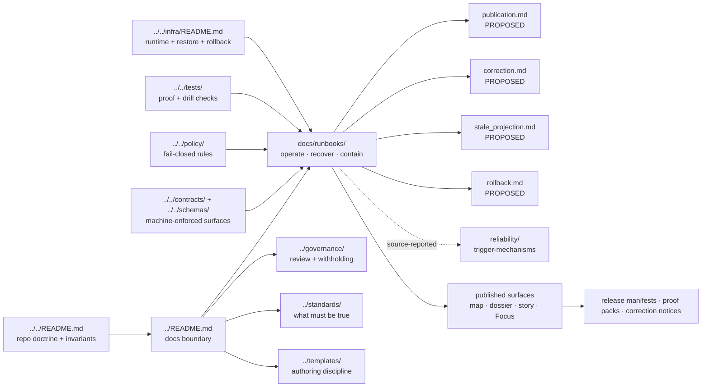

<!-- [KFM_META_BLOCK_V2]
doc_id: kfm://doc/NEEDS_VERIFICATION
title: runbooks
type: standard
version: v1
status: draft
owners: NEEDS_VERIFICATION
created: YYYY-MM-DD
updated: YYYY-MM-DD
policy_label: NEEDS_VERIFICATION
related: [../README.md, ../../README.md, ../../.github/README.md, ../../infra/README.md, ../governance/, ../standards/, ../templates/, ../../contracts/, ../../schemas/, ../../policy/, ../../tests/]
tags: [kfm, runbooks, operations, rollback, correction]
notes: [README-like directory doc; placeholders retained where live ownership, history, and policy label were not directly verified from the current checkout.]
[/KFM_META_BLOCK_V2] -->

# runbooks

Governed operator procedures for Kansas Frontier Matrix: publication, rollback, correction, stale-state handling, restore, and incident response.

> **Status:** experimental  
> **Owners:** NEEDS VERIFICATION — confirm in repo ownership controls before merge  
>       
> **Quick jumps:** [Scope](#scope) · [Repo fit](#repo-fit) · [Accepted inputs](#accepted-inputs) · [Exclusions](#exclusions) · [Directory tree](#directory-tree) · [Quickstart](#quickstart) · [Usage](#usage) · [Diagram](#diagram) · [Operating tables](#operating-tables) · [Task list](#task-list--definition-of-done) · [FAQ](#faq) · [Appendix](#appendix)

> [!IMPORTANT]
> This README is **evidence-bounded**. The current main-branch tree clearly exposes `docs/runbooks/README.md`, but deeper runbook lanes remain a mix of **INFERRED**, **PROPOSED**, and **NEEDS VERIFICATION** until rechecked in a live checkout.

---

## Scope

`docs/runbooks/` is the documentation surface for the question:

**How does KFM operate, recover, or contain this safely without weakening the trust membrane?**

This directory should hold operator-facing procedures for moments when doctrine becomes action:

- visible publication
- stale or drifting derived layers
- correction and supersession
- rollback and restore
- incident containment
- reliability-trigger response
- proof-oriented validation before and after change

A KFM runbook is not just “steps.” It is a governed procedure that should make the following explicit:

1. **trigger**
2. **preconditions**
3. **inputs / owning truth surfaces**
4. **safety gates**
5. **procedure**
6. **validation**
7. **negative outcomes**
8. **output artifacts**
9. **rollback or forward-fix path**
10. **follow-up updates**

A stale or incomplete runbook is not harmless in KFM. If behavior changed and the runbook did not, the docs surface is now misaligned with the governed system.

### Evidence labels used in this README

| Label | Meaning here |
|---|---|
| **CONFIRMED** | Directly supported by the current main-branch GitHub tree or stable KFM doctrine |
| **INFERRED** | Source-reported by adjacent repo docs or corpus overlays, but not directly re-opened as current tree truth here |
| **PROPOSED** | Repo-native structure added to make the directory useful and reviewable |
| **UNKNOWN** | Not supported strongly enough to present as current repo reality |
| **NEEDS VERIFICATION** | Exact owner, path, file presence, or current implementation detail should be checked before merge |

[Back to top](#runbooks)

## Repo fit

**Path:** `docs/runbooks/README.md`  
**Role:** directory README for governed operating, recovery, containment, and correction procedures.

### Upstream and adjacent anchors

| Direction | Surface | Why it matters | Status here |
|---|---|---|---|
| Upstream | [`../README.md`][docs-index] | `docs/` boundary, evidence posture, and docs-wide placement rules | **CONFIRMED** |
| Upstream | [`../../README.md`][repo-root] | Root doctrine, top-level repo contract, and non-negotiable invariants | **CONFIRMED** |
| Upstream | [`../../.github/README.md`][github-gatehouse] | Repo-wide gates, PR-first review, release evidence, and correction discipline | **CONFIRMED** |
| Adjacent | [`../governance/`][governance] | Review, rights, withholding, escalation, and fail-closed rules | **CONFIRMED** |
| Adjacent | [`../standards/`][standards] | Normative profiles and “what must be true” surfaces | **CONFIRMED** |
| Adjacent | [`../templates/`][templates] | Authoring patterns for governed documents and future runbooks | **CONFIRMED** |
| Adjacent | [`../../infra/README.md`][infra-readme] | Runtime, deployment, observability, restore, and rollback surfaces that procedures must coordinate with | **CONFIRMED** |
| Adjacent | [`../../contracts/`][contracts], [`../../schemas/`][schemas], [`../../policy/`][policy], [`../../tests/`][tests] | Machine-enforced neighbors that runbooks must not contradict | **CONFIRMED** |
| Downstream | `docs/runbooks/publication.md`, `correction.md`, `stale_projection.md`, `rollback.md` | Highest-value first runbook set repeatedly proposed in March 2026 overlays | **PROPOSED** |
| Downstream | `docs/runbooks/reliability/trigger-mechanisms/README.md`, `docs/runbooks/reliability/trigger-retry-matrix.md` | Source-reported example lanes from the docs index | **INFERRED** |

**Repo-fit rule:** `docs/runbooks/` should version **how KFM is safely operated and recovered**. It should not quietly become the canonical home of policy bodies, schema truth, runtime code, or generated release artifacts.

[Back to top](#runbooks)

## Accepted inputs

Content that belongs in `docs/runbooks/` includes:

- human-readable procedures for publication, correction, rollback, restore, stale-visible handling, and incident containment
- prerequisites and safety conditions for governed operations
- validation steps and negative-path checks
- operator-facing output artifact expectations such as release manifests, correction notices, proof packs, or audit joins
- reliability-trigger guidance when thresholds, freshness windows, or retries materially change operator posture
- smoke-test and drill procedures that must stay aligned with runtime behavior
- runbook-specific diagrams, tables, and examples that clarify governed action without replacing contracts or policy

### Good runbook characteristics in KFM

A good runbook here is:

- **specific enough to execute**
- **explicit about what is authoritative**
- **clear about what can fail closed**
- **paired with validation and rollback**
- **honest about what is still `UNKNOWN`**
- **aligned with contracts, policy, tests, and release evidence**

## Exclusions

The following do **not** belong here as the authoritative source of truth:

| Exclusion | Why it stays out | Keep it here instead |
|---|---|---|
| Policy rule bodies, obligation registries, deny logic | Runbooks explain procedure; policy enforces decisions | [`../../policy/`][policy] |
| Schemas, OpenAPI, controlled vocabularies, runtime envelopes | Machine-checkable contracts should not be replaced by prose | [`../../contracts/`][contracts], [`../../schemas/`][schemas] |
| Runtime service code, workers, UI logic, model adapters | Runbooks must not become shadow implementation | repo code surfaces |
| Canonical data artifacts, source descriptors, receipts, release outputs | These are evidence objects, not prose procedures | truth-path / release-owning surfaces |
| Secrets, credentials, private endpoints, sensitive coordinates | Unsafe to publish in docs | secret-management or restricted operator channels |
| Generic architecture essays with no procedure | Belong elsewhere in `docs/` | architecture / governance / standards surfaces |
| Prose that upgrades `UNKNOWN` implementation state into “already running” fact | Breaks KFM truth posture | keep the uncertainty visible |

[Back to top](#runbooks)

## Directory tree

### Verified current main-branch surface

The current GitHub tree directly shows only the README inside `docs/runbooks/`.

```text
docs/runbooks/
└── README.md
```

### Source-reported / proposed growth lanes

The corpus and adjacent docs point to a fuller runbooks surface, but that fuller surface was **not** directly verified here as current tree truth.

```text
docs/runbooks/
├── README.md
├── publication.md                  # PROPOSED
├── correction.md                   # PROPOSED
├── stale_projection.md             # PROPOSED
├── rollback.md                     # PROPOSED
└── reliability/                    # INFERRED
    ├── trigger-mechanisms/
    │   └── README.md
    └── trigger-retry-matrix.md
```

> [!WARNING]
> Treat the second tree as the cleanest repo-native contract for this directory, **not** as a claim that every file already exists on the active branch.

[Back to top](#runbooks)

## Quickstart

Use a **verification-first** sequence before editing or expanding `docs/runbooks/`.

```bash
# 1) Confirm you are in the real checkout
git rev-parse --show-toplevel

# 2) Inspect the runbooks subtree before adding any new claims
find docs/runbooks -maxdepth 3 -type f | sort
find docs/runbooks -maxdepth 3 -type d | sort

# 3) Re-read the adjacent boundaries this directory must preserve
sed -n '1,220p' docs/README.md
sed -n '1,220p' docs/runbooks/README.md
sed -n '1,220p' infra/README.md 2>/dev/null || true
sed -n '1,220p' .github/README.md 2>/dev/null || true

# 4) Surface machine-enforced neighbors before documenting behavior as fact
find contracts schemas policy tests -maxdepth 3 -type f 2>/dev/null | sort

# 5) Search for existing procedure-shaped material before inventing new files
grep -RIn "publication\|rollback\|restore\|correction\|stale\|incident\|runbook" \
  docs infra .github tests 2>/dev/null || true
```

### Minimal review order

1. Confirm the actual `docs/runbooks/` subtree in the live checkout.
2. Confirm the specific operating moment: publication, stale projection, correction, rollback, restore, or incident containment.
3. Re-check the neighboring contracts, schemas, policy, and tests the runbook must not contradict.
4. Confirm whether the runtime or deployment side already owns part of the procedure under `infra/`.
5. Update docs in the same change stream as behavior-significant changes.

[Back to top](#runbooks)

## Usage

### Read `docs/runbooks/` by operating moment

1. Start here to understand the runbooks boundary and current verification limits.
2. Use **publication** runbooks when the question is: *what must be true before visible change occurs?*
3. Use **stale-projection** runbooks when the question is: *what should the operator do when derived layers lag release truth?*
4. Use **correction** runbooks when the question is: *how does an already-visible error become a governed correction or supersession?*
5. Use **rollback / restore** runbooks when the question is: *how do we return to a known-good state and prove it?*
6. Use **reliability trigger** runbooks when thresholds, retries, freshness breaches, or repeated failures force an operator decision.

### Every KFM runbook should answer these questions

| Section | Minimum expectation | Why it matters |
|---|---|---|
| Trigger | What event, failure, or gate activates this procedure? | Prevents “run it because it feels right” behavior |
| Preconditions | What must already exist or be true? | Stops partial or unsafe execution |
| Inputs / owning truth surfaces | Which contracts, policies, releases, IDs, or dashboards are authoritative here? | Keeps prose downstream of evidence |
| Safety gates | What must block execution? | Preserves fail-closed behavior |
| Procedure | Ordered steps with role-aware clarity | Makes execution repeatable |
| Validation | What proves success or safe failure? | Prevents “completed” without evidence |
| Negative outcomes | Answer / abstain / deny / error / hold / quarantine / stale-visible as applicable | KFM treats negative outcomes as valid operational states |
| Output artifacts | What receipts, notices, manifests, or logs should exist after the run? | Keeps operations auditable |
| Rollback / forward-fix | How do we recover if the procedure fails or only partially succeeds? | Prevents dead-end procedures |
| Follow-up updates | Which docs, tests, dashboards, or release notes must be updated? | Keeps docs in band with behavior |

### Boundary rule: `docs/runbooks/` versus `infra/`

Use `docs/runbooks/` for **human-readable procedure**.  
Use `infra/` for **runtime/deployment assets** such as unit files, Compose, Terraform, Kubernetes, monitoring configs, and operational wiring.

A runbook may reference `infra/` surfaces, but it should not duplicate them as canonical truth.

[Back to top](#runbooks)

## Diagram


```mermaid
flowchart LR
    ROOT["../../README.md<br/>repo doctrine + invariants"]
    DOCS["../README.md<br/>docs boundary"]
    RUN["docs/runbooks/<br/>operate · recover · contain"]
    GOV["../governance/<br/>review + withholding"]
    STD["../standards/<br/>what must be true"]
    TMP["../templates/<br/>authoring discipline"]
    INFRA["../../infra/README.md<br/>runtime + restore + rollback"]
    CONTRACTS["../../contracts/ + ../../schemas/<br/>machine-enforced surfaces"]
    POLICY["../../policy/<br/>fail-closed rules"]
    TESTS["../../tests/<br/>proof + drill checks"]

    RUN --> PUB["publication.md<br/>PROPOSED"]
    RUN --> CORR["correction.md<br/>PROPOSED"]
    RUN --> STALE["stale_projection.md<br/>PROPOSED"]
    RUN --> RB["rollback.md<br/>PROPOSED"]
    RUN -. source-reported .-> REL["reliability/<br/>trigger-mechanisms"]

    ROOT --> DOCS --> RUN
    DOCS --> GOV
    DOCS --> STD
    DOCS --> TMP

    CONTRACTS --> RUN
    POLICY --> RUN
    TESTS --> RUN
    INFRA --> RUN

    RUN --> SURFACES["published surfaces<br/>map · dossier · story · Focus"]
    SURFACES --> EVIDENCE["release manifests · proof packs · correction notices"]
```

The diagram is intentionally boundary-heavy. `docs/runbooks/` exists to make governed action reproducible without pretending prose is the enforcement layer.

[Back to top](#runbooks)

## Operating tables

### Runbook family matrix

| Runbook family | Primary question | Typical companion surfaces | Status here |
|---|---|---|---|
| `publication.md` | What must be true before visible change? | contracts, policy, tests, release evidence | **PROPOSED** |
| `correction.md` | How does a published error become a governed correction or supersession? | correction notices, observability, review records, public surfaces | **PROPOSED** |
| `stale_projection.md` | What do we do when derived layers lag release truth? | projections, freshness checks, trust-visible UI states | **PROPOSED** |
| `rollback.md` | How do we return to the most recent good promoted state? | infra, release manifests, restore drills, proof objects | **PROPOSED** |
| `reliability/trigger-mechanisms/README.md` | Which trigger conditions force operator action or retry policy changes? | SLOs, monitoring, retry logic, incident notes | **INFERRED** |
| `reliability/trigger-retry-matrix.md` | Which failures retry, escalate, hold, or fail closed? | monitoring, policy posture, runtime safety | **INFERRED** |

### Minimum content contract for every runbook

| Must include | Why it is mandatory in KFM | Typical examples |
|---|---|---|
| Prerequisites | Prevents out-of-order or authority-free execution | required release ID, required review state, expected policy bundle |
| Validation steps | Converts “we ran it” into inspectable evidence | schema pass, evidence resolution check, smoke query, correction propagation check |
| Rollback or forward-fix path | Prevents procedures from ending at failure | revert to previous release, hold publication, re-run projection build |
| Output artifacts | Keeps operations auditable | release manifest, correction notice, restore log, proof-pack reference |
| Trust posture | Prevents prose from quietly overstating reality | `CONFIRMED`, `INFERRED`, `PROPOSED`, `UNKNOWN`, `NEEDS VERIFICATION` markers where needed |
| Cross-links | Keeps docs tied to owning truth surfaces | contracts, policy, infra, tests, observability, release evidence |

[Back to top](#runbooks)

## Task list / Definition of done

Use this checklist before treating `docs/runbooks/README.md` or any new subordinate runbook as ready for commit.

- [ ] The actual `docs/runbooks/` subtree was inspected in the live checkout.
- [ ] Owners were resolved from repo ownership controls or left explicitly `NEEDS VERIFICATION`.
- [ ] Any proposed subordinate runbook files remain clearly labeled until they exist.
- [ ] Every runbook includes trigger, prerequisites, validation, rollback/forward-fix, and output artifacts.
- [ ] Every behavior-significant procedure is cross-checked against contracts, schemas, policy, tests, and release evidence.
- [ ] The doc does not imply direct client bypass of governed APIs, canonical stores, or model runtimes.
- [ ] The doc does not hide sensitive coordinates, secrets, or unapproved operational shortcuts.
- [ ] Relative links render correctly on GitHub.
- [ ] The Mermaid diagram still matches the mounted tree and directory contract.
- [ ] `UNKNOWN` / `NEEDS VERIFICATION` markers were removed only when the checkout really proved the claim.

[Back to top](#runbooks)

## FAQ

### Why does this README keep so many verification markers visible?

Because the current repo state proves the directory exists, but the deeper runbook surface is still only partially visible from directly opened files. KFM’s own truth posture prefers explicit incompleteness to persuasive overclaiming.

### Why separate `docs/runbooks/` from `infra/`?

Because the two surfaces do different jobs. `infra/` owns runtime and deployment assets. `docs/runbooks/` owns the human-readable operating procedures that explain when and how those assets are used, validated, rolled back, or corrected.

### Why not treat the reliability subtree as current fact?

Because the docs index source-reports reliability examples, but the directly opened `docs/runbooks/` tree currently showed only `README.md`. The deeper subtree should stay **INFERRED** until the checkout proves it.

### When should a runbook change block release?

When stale procedure would mislead publication, correction, rollback, restore, stale-visible handling, or incident response. In KFM, docs are part of release evidence when behavior changes materially.

### Can a runbook live somewhere else?

Yes, if another directory clearly owns it. For example, runtime-specific bring-up detail may live beside a local runtime profile or infra surface. This index should then link outward rather than duplicate the authoritative procedure.

[Back to top](#runbooks)

## Appendix

<details>
<summary><strong>Evidence map and starter runbook skeleton</strong></summary>

### Why this directory exists

This README is shaped by four recurring signals across the repo-adjacent docs and March 2026 corpus:

| Source lane | What it contributes to `docs/runbooks/` |
|---|---|
| `docs/README.md` | Defines runbooks as the place to answer how KFM is operated, recovered, or contained safely; makes prerequisites, validation, rollback, and output artifacts the minimum obligation |
| `infra/README.md` | Places runbooks beside restore, rollback, correction, incident, and observability concerns without collapsing docs into infra assets |
| March 2026 delivery / verification overlays | Repeatedly elevate publication, correction, stale-visible behavior, rollback, restore drills, and documentation definition-of-done |
| Phase-one runtime note | Adds the concrete expectation for a human-readable bring-up / smoke-test runbook and validation checklist for a first governed slice |

### Starter runbook skeleton

Use this as the minimum shape for new runbooks in this directory.

```md
# <runbook-name>

One-line purpose.

> **Status:** experimental|active|stable|deprecated
> **Owners:** NEEDS VERIFICATION
> **Trigger:** <what activates this procedure>
> **Quick jumps:** [Prerequisites](#prerequisites) · [Procedure](#procedure) · [Validation](#validation) · [Rollback](#rollback) · [Outputs](#output-artifacts)

## Scope
What this runbook covers, and what it does not.

## Preconditions
Required release state, review state, IDs, dashboards, policies, access, and safety checks.

## Inputs / owning truth surfaces
Contracts, schemas, policies, release manifests, correction notices, dashboards, or logs.

## Procedure
Ordered steps only.

## Validation
What proves success, safe hold, or safe failure.

## Negative outcomes
Hold / quarantine / stale-visible / deny / error / escalate — whichever apply.

## Output artifacts
Receipts, notices, manifests, proof-pack references, incident notes, or audit joins.

## Rollback / forward-fix
How to recover if the procedure fails or only partially succeeds.

## Follow-up updates
Which docs, tests, dashboards, release notes, or trust-visible surfaces must change next.
```

### Candidate first runbooks for this directory

| Candidate | Why it belongs here | Status |
|---|---|---|
| `publication.md` | Visible change must be governed, validated, and evidence-bearing | **PROPOSED** |
| `correction.md` | Wrong public state must be corrected without narrative drift | **PROPOSED** |
| `stale_projection.md` | Derived layers must not silently outrank release truth | **PROPOSED** |
| `rollback.md` | Recovery to last good promoted state must be explicit and rehearsable | **PROPOSED** |
| `reliability/trigger-mechanisms/README.md` | Reliability and retry posture should become operational, not tribal | **INFERRED** |

</details>

[Back to top](#runbooks)

[repo-root]: ../../README.md
[docs-index]: ../README.md
[github-gatehouse]: ../../.github/README.md
[infra-readme]: ../../infra/README.md
[governance]: ../governance/
[standards]: ../standards/
[templates]: ../templates/
[contracts]: ../../contracts/
[schemas]: ../../schemas/
[policy]: ../../policy/
[tests]: ../../tests/# runbooks

Scaffolded from repository README guidance to establish the documented directory contract.
