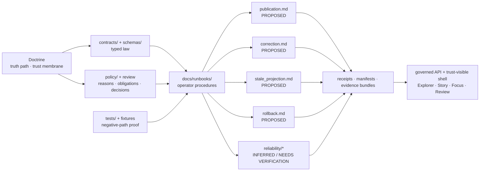

<!-- [KFM_META_BLOCK_V2]
doc_id: kfm://doc/NEEDS_VERIFICATION
title: runbooks
type: standard
version: v1
status: draft
owners: NEEDS_VERIFICATION
created: YYYY-MM-DD
updated: YYYY-MM-DD
policy_label: NEEDS_VERIFICATION
related: [../README.md, ../../README.md, ../../.github/README.md, ../../infra/README.md, ../governance/, ../standards/, ../templates/, ../../contracts/, ../../schemas/, ../../policy/, ../../tests/]
tags: [kfm, runbooks, operations, rollback, correction]
notes: [README-like directory doc; doctrine-first wording grounded in attached March 2026 KFM corpus plus repo-grounded sprint summary; direct repo checkout was not mounted in this session, so path-level claims remain labeled as CONFIRMED, INFERRED, PROPOSED, UNKNOWN, or NEEDS VERIFICATION.]
[/KFM_META_BLOCK_V2] -->

# runbooks

Governed operator procedures for Kansas Frontier Matrix: recovery, correction, rollback, publication, incident handling, and other trust-significant operational response.

> **Status:** experimental  
> **Owners:** NEEDS VERIFICATION — confirm from live repo ownership controls before merge  
>       
> **Quick jumps:** [Scope](#scope) · [Repo fit](#repo-fit) · [Accepted inputs](#accepted-inputs) · [Exclusions](#exclusions) · [Directory tree](#directory-tree) · [Quickstart](#quickstart) · [Usage](#usage) · [Diagram](#diagram) · [Operating tables](#operating-tables) · [Task list](#task-list--definition-of-done) · [FAQ](#faq) · [Appendix](#appendix)

> [!IMPORTANT]
> This README is **doctrine-grounded and evidence-bounded**. The attached March 2026 KFM manuals strongly support a governed runbooks surface, correction visibility, rollback discipline, evidence-linked publication, and first-class negative outcomes. A separate repo-grounded sprint summary supports several adjacent repo documentation surfaces, but a direct repo checkout was not mounted in this session. Because of that, path-level claims inside `docs/runbooks/` remain explicitly labeled rather than smoothed into certainty.

---

## Scope

`docs/runbooks/` is the operator-facing documentation surface for one practical KFM question:

**How does the system act under pressure without weakening the truth path or the trust membrane?**

This directory should hold procedures for moments where doctrine turns into action:

- promotion and post-promotion checks
- correction, supersession, and withdrawal
- rollback and restore
- stale or mismatched derived-state handling
- reliability-trigger and retry decisions
- incident containment and recovery
- operator validation before and after a change

A KFM runbook is not just a step list. It should make the governed procedure inspectable by naming:

1. trigger
2. prerequisites
3. authoritative inputs
4. safety gates
5. ordered procedure
6. validation
7. negative outcomes
8. output artifacts
9. rollback or forward-fix path
10. follow-up updates

### Evidence labels used in this README

| Label | Meaning here |
|---|---|
| **CONFIRMED** | Directly supported in this session by attached KFM doctrine or by the attached repo-grounded sprint summary artifact |
| **INFERRED** | Strongly implied by repeated doctrine or planning material, but not reverified in a live checkout |
| **PROPOSED** | Recommended addition or directory shape supported by doctrine, but not presented as current repo fact |
| **UNKNOWN** | Not supported strongly enough to present as current project reality |
| **NEEDS VERIFICATION** | Placeholder value or path/detail that should be checked in a live checkout before merge |

### Why this directory matters

KFM treats release, correction, rollback, review, and runtime explanation as parts of one governed system. That means stale or missing runbooks are not just a documentation nuisance. They are trust risk.

[Back to top](#runbooks)

## Repo fit

**Path:** `docs/runbooks/README.md`  
**Role:** directory README for governed operating, correction, and recovery procedures.

### Upstream and adjacent anchors

| Direction | Surface | Why it matters | Status here |
|---|---|---|---|
| Upstream | [`../../README.md`][repo-root] | Root identity, doctrine framing, and repo-level trust posture | **CONFIRMED** |
| Upstream | [`../README.md`][docs-index] | Local docs boundary and neighboring documentation pattern | **NEEDS VERIFICATION** |
| Adjacent | [`../../.github/README.md`][github-gatehouse] | Review, PR hygiene, and workflow-facing governance context | **NEEDS VERIFICATION** |
| Adjacent | [`../../.github/workflows/README.md`](../../.github/workflows/README.md) | Workflow posture and merge-gate reality | **CONFIRMED** |
| Adjacent | [`../../contracts/`][contracts] | Machine-checkable law that prose procedures must not contradict | **CONFIRMED** |
| Adjacent | [`../../schemas/`][schemas] | Schema surface and drift boundary | **CONFIRMED** |
| Adjacent | [`../../policy/`][policy] | Deny-by-default posture, reasons, obligations, and review logic | **CONFIRMED** |
| Adjacent | [`../../tests/`][tests] | Fixtures, proof expectations, and negative-path validation | **CONFIRMED** |
| Adjacent | [`../../tools/README.md`](../../tools/README.md) | Validator and operator-tool intent surface | **CONFIRMED** |
| Adjacent | [`../../scripts/README.md`](../../scripts/README.md) | Script entrypoint intent surface | **CONFIRMED** |
| Adjacent | [`../../infra/README.md`][infra-readme] | Runtime/deployment coordination for restore, rollback, and ops behavior | **NEEDS VERIFICATION** |
| Adjacent | [`../governance/`][governance] | Review, withholding, escalation, and publication burden | **NEEDS VERIFICATION** |
| Adjacent | [`../standards/`][standards] | Normative profiles, terminology stability, and documented obligations | **NEEDS VERIFICATION** |
| Adjacent | [`../templates/`][templates] | Future runbook authoring pattern surface | **NEEDS VERIFICATION** |
| Downstream | `docs/runbooks/publication.md` | Promotion and publication procedure | **PROPOSED** |
| Downstream | `docs/runbooks/correction.md` | Public-error correction and supersession | **PROPOSED** |
| Downstream | `docs/runbooks/stale_projection.md` | Derived-layer lag and stale-visible handling | **PROPOSED** |
| Downstream | `docs/runbooks/rollback.md` | Return to a known-good promoted state | **PROPOSED** |
| Downstream | `docs/runbooks/reliability/trigger-retry-matrix.md` | Trigger/retry guidance lane hinted by planning material | **INFERRED / NEEDS VERIFICATION** |

> [!NOTE]
> In the table above, **CONFIRMED** means confirmed by the attached evidence available in this session, not by a direct live checkout of the repository tree.

**Repo-fit rule:** `docs/runbooks/` explains **how governed actions are executed and verified**. It should not quietly become the canonical home of policy bodies, schema law, runtime code, or generated proof objects.

[Back to top](#runbooks)

## Accepted inputs

Content that belongs in `docs/runbooks/` includes:

- human-readable procedures for publication, correction, rollback, stale-visible handling, and incident response
- operator checklists tied to release state, evidence state, and review state
- reliability-trigger and retry guidance when trigger kind changes operator posture
- validation steps and negative-path checks
- output artifact expectations such as manifests, notices, screenshots, proof refs, and audit joins
- restore or rollback drills when those procedures affect release credibility
- diagrams, matrices, and compact examples that clarify action without replacing contracts or policy

### What a good KFM runbook looks like

A good runbook here is:

- specific enough to execute
- explicit about which inputs are authoritative
- clear about hold, deny, quarantine, stale-visible, and correction paths
- paired with validation and rollback or forward-fix
- honest about what remains `UNKNOWN`
- aligned with contracts, policy, tests, and release evidence

[Back to top](#runbooks)

## Exclusions

The following do **not** belong here as the authoritative source of truth:

| Exclusion | Why it stays out | Keep it here instead |
|---|---|---|
| Policy rule bodies, deny logic, obligation registries | Runbooks explain procedure; policy enforces decisions | [`../../policy/`][policy] |
| Schemas, OpenAPI, and runtime payload law | Machine-checkable contracts should not be replaced by prose | [`../../contracts/`][contracts], [`../../schemas/`][schemas] |
| Runtime service code, workers, UI implementation, resolver logic | Runbooks must not become shadow implementation | code-owning surfaces |
| Canonical data artifacts, receipts, release outputs, proof packs | These are trust objects, not prose procedures | release-owning / artifact-owning surfaces |
| Secrets, credentials, precise sensitive coordinates, private endpoints | Unsafe for general repo docs | restricted operator channels |
| Generic architecture essays with no operating action | They belong elsewhere in `docs/` | architecture / governance / standards |
| Prose that upgrades `UNKNOWN` implementation into present-tense fact | Breaks KFM truth posture | keep uncertainty visible |

[Back to top](#runbooks)

## Directory tree

### Repo-grounded neighboring surfaces

The attached repo-grounded sprint summary supports the presence of the following adjacent documentation surfaces:

```text
.github/workflows/README.md
contracts/README.md
schemas/README.md
policy/README.md
tests/README.md
tools/README.md
scripts/README.md
```

### Doctrine-backed target shape for `docs/runbooks/`

This is the smallest directory shape directly supported by the attached doctrine and current task. It is a **target map**, not a live-tree claim.

```text
docs/runbooks/
├── README.md              # target file / this directory index
├── publication.md         # PROPOSED
├── correction.md          # PROPOSED
├── stale_projection.md    # PROPOSED
└── rollback.md            # PROPOSED
```

### Additional lane hinted by planning material

Planning material attached to the session sketches a reliability lane, but live repo presence was not directly reverified here.

```text
docs/runbooks/
└── reliability/
    └── trigger-retry-matrix.md   # INFERRED / NEEDS VERIFICATION
```

> [!WARNING]
> Do not treat the target tree above as proof that every file already exists on `main`. The doctrine supports these as the highest-value operating additions, but current-session evidence does not justify presenting them as mounted repo reality.

### Current subtree notes

| Path or lane | Role | Status |
|---|---|---|
| `docs/runbooks/README.md` | Directory contract for governed operator procedures | **target file / NEEDS VERIFICATION in live checkout** |
| `docs/runbooks/publication.md` | Promotion and publication procedure | **PROPOSED** |
| `docs/runbooks/correction.md` | Published-error correction and supersession | **PROPOSED** |
| `docs/runbooks/stale_projection.md` | Derived-layer lag and stale-visible handling | **PROPOSED** |
| `docs/runbooks/rollback.md` | Return to last known-good promoted state | **PROPOSED** |
| `docs/runbooks/reliability/trigger-retry-matrix.md` | Retry/default-decision matrix | **INFERRED / NEEDS VERIFICATION** |

[Back to top](#runbooks)

## Quickstart

Use a **verification-first** sequence before editing or expanding `docs/runbooks/`.

> [!NOTE]
> The commands below are for use in a live checkout. They are operator verification steps, not proof of what was mounted in this session.

```bash
# 1) Confirm the repo root
git rev-parse --show-toplevel

# 2) Inspect the actual runbooks subtree
find docs/runbooks -maxdepth 4 -type f 2>/dev/null | sort
find docs/runbooks -maxdepth 4 -type d 2>/dev/null | sort

# 3) Re-open adjacent documentation surfaces that shape runbook wording
sed -n '1,240p' ../../README.md 2>/dev/null || true
sed -n '1,240p' docs/README.md 2>/dev/null || true
sed -n '1,240p' .github/workflows/README.md 2>/dev/null || true
sed -n '1,240p' contracts/README.md 2>/dev/null || true
sed -n '1,240p' schemas/README.md 2>/dev/null || true
sed -n '1,240p' policy/README.md 2>/dev/null || true
sed -n '1,240p' tests/README.md 2>/dev/null || true

# 4) Check whether proposed subordinate runbooks already exist
for f in \
  docs/runbooks/publication.md \
  docs/runbooks/correction.md \
  docs/runbooks/stale_projection.md \
  docs/runbooks/rollback.md \
  docs/runbooks/reliability/trigger-retry-matrix.md
do
  test -f "$f" && echo "[FOUND] $f" || echo "[MISSING] $f"
done

# 5) Surface behavior-significant references before describing procedures as current fact
grep -RIn "runbook\|rollback\|correction\|stale\|proof pack\|release manifest\|EvidenceBundle\|RuntimeResponseEnvelope" \
  docs .github contracts schemas policy tests tools scripts 2>/dev/null || true

# 6) Verify workflow reality before claiming merge gates or drills
find .github/workflows -maxdepth 2 -type f 2>/dev/null | sort
```

### Minimal review order

1. Confirm the actual `docs/runbooks/` subtree in the live checkout.
2. Confirm which operator moment you are documenting: publication, correction, rollback, stale-visible handling, reliability, or incident response.
3. Re-check the neighboring contracts, schemas, policy, and tests the runbook must not contradict.
4. Confirm whether `infra/` or another lane already owns a narrower procedure.
5. Update the runbook in the same change stream as behavior-significant changes.

[Back to top](#runbooks)

## Usage

### Read `docs/runbooks/` by operating moment

1. Start here to understand the directory boundary and current verification posture.
2. Use **publication** runbooks when the question is: *what must be true before visible change is promoted?*
3. Use **correction** runbooks when the question is: *how does an already-visible error become a governed correction, narrowing, supersession, or withdrawal?*
4. Use **rollback** runbooks when the question is: *how do we return to a known-good promoted state and prove it?*
5. Use **stale-projection** runbooks when the question is: *what happens when derived delivery no longer matches released truth?*
6. Use **reliability** runbooks when the question is: *which trigger and retry posture is safe for this lane?* Treat that lane as `INFERRED / NEEDS VERIFICATION` until the live repo proves it.
7. Use **incident** or **restore** procedures here only if this directory is the chosen owner; otherwise link outward to the actual authoritative location.

### Boundary rule: `docs/runbooks/` versus `infra/`

Use `docs/runbooks/` for **human-readable governed procedure**.

Use `infra/` for **runtime and delivery assets** such as Compose, systemd, Terraform, Kubernetes, dashboards, and deployment wiring.

A runbook may reference `infra/` surfaces, but it should not duplicate them as canonical truth.

### Why runbooks stay inside the trust system

In KFM, public release, correction, denial, rollback, and runtime explanation are not independent concerns. They share contracts, policy, review state, evidence objects, and correction lineage. Runbooks are where those relationships become executable by humans.

[Back to top](#runbooks)

## Diagram


```mermaid
flowchart LR
    D["Doctrine<br/>truth path · trust membrane"] --> C["contracts/ + schemas/<br/>typed law"]
    D --> P["policy/ + review<br/>reasons · obligations · decisions"]
    C --> R["docs/runbooks/<br/>operator procedures"]
    P --> R
    T["tests/ + fixtures<br/>negative-path proof"] --> R

    R --> PUB["publication.md<br/>PROPOSED"]
    R --> CORR["correction.md<br/>PROPOSED"]
    R --> STALE["stale_projection.md<br/>PROPOSED"]
    R --> RB["rollback.md<br/>PROPOSED"]
    R --> REL["reliability/*<br/>INFERRED / NEEDS VERIFICATION"]

    PUB --> ART["receipts · manifests · evidence bundles"]
    CORR --> ART
    STALE --> ART
    RB --> ART
    REL --> ART

    ART --> SHELL["governed API + trust-visible shell<br/>Explorer · Story · Focus · Review"]
```

The diagram is boundary-heavy on purpose. In KFM, operator prose stays downstream of doctrine, contracts, policy, tests, and release artifacts.

[Back to top](#runbooks)

## Operating tables

### Runbook family matrix

| Runbook family | Primary question | Typical companion surfaces | Status here |
|---|---|---|---|
| `publication.md` | What must be true before visible change is promoted? | contracts, policy, review, release manifests, accessibility/docs gates | **PROPOSED** |
| `correction.md` | How does a public error become a governed correction or supersession? | correction notices, review records, affected surfaces, rebuild refs | **PROPOSED** |
| `stale_projection.md` | What happens when derived delivery lags promoted truth? | projection receipts, freshness checks, surface-state labels | **PROPOSED** |
| `rollback.md` | How do we return to a known-good promoted state? | rollback notes, manifests, release refs, restoration evidence | **PROPOSED** |
| `reliability/trigger-retry-matrix.md` | Which trigger/retry posture is safe for this lane? | idempotency keys, retry budgets, DLQ/quarantine, provenance | **INFERRED / NEEDS VERIFICATION** |
| `restore-drill.md` | How do we rehearse and evidence recovery claims? | backups, restore verification, screenshots, audit joins | **INFERRED** |
| `incident.md` | How do we contain the fault, preserve evidence, and recover safely? | observability, audit refs, review notes, correction linkage | **INFERRED** |

### Minimum content contract for every runbook

| Must include | Why it matters in KFM | Typical examples |
|---|---|---|
| Trigger | Prevents “run it because it feels right” behavior | failed gate, staleness threshold, exposure issue, alert, review decision |
| Preconditions | Stops authority-free execution | release ID, review state, role requirement, source availability |
| Inputs / owning truth surfaces | Keeps prose downstream of evidence | contracts, policies, manifests, EvidenceBundle refs, logs |
| Safety gates | Preserves fail-closed behavior | hold if proofs missing, deny if rights unclear, quarantine on validation failure |
| Procedure | Makes execution repeatable | ordered steps with role-aware clarity |
| Validation | Converts “we ran it” into inspectable evidence | schema pass, link check, screenshot baseline, post-action query |
| Negative outcomes | Makes failure states first-class instead of implicit | hold, quarantine, stale-visible, generalized, denied, withdrawn |
| Output artifacts | Keeps operations auditable | receipt, manifest, correction notice, review note, proof-pack ref |
| Rollback / forward-fix | Prevents dead-end procedures | revert to prior release, withhold publication, rebuild projection |
| Follow-up updates | Keeps docs in band with behavior | update tests, dashboards, docs, release notes, correction surfaces |

### Public-trust behavior matrix

| Situation | Preferred runbook behavior |
|---|---|
| A deployment occurred but release proof is incomplete | Hold publication; deployment is not treated as trusted publication |
| A derived layer is stale relative to promoted scope | Mark stale-visible or hold; do not imply freshness |
| A public interpretation changed after evidence correction | Issue visible correction or supersession artifacts |
| A failure path has not been rehearsed | Keep the gap visible and schedule a drill before expanding trust claims |
| Retry posture changes because the trigger kind changes | Update runbooks and validation, not only workflow config |
| Rights or exact-location sensitivity is unresolved | Deny, narrow, generalize, or quarantine instead of best-effort publication |

[Back to top](#runbooks)

## Task list / Definition of done

Use this checklist before treating this README or any subordinate runbook as ready for commit.

- [ ] The actual `docs/runbooks/` subtree was inspected in the live checkout.
- [ ] Owners were resolved from repo ownership controls or left explicitly `NEEDS VERIFICATION`.
- [ ] Any proposed subordinate files remain clearly labeled until they exist.
- [ ] Adjacent surfaces in `contracts/`, `schemas/`, `policy/`, `tests/`, and `.github/workflows/` were re-opened before converting doctrine into present-tense repo claims.
- [ ] Every runbook includes trigger, prerequisites, authoritative inputs, validation, rollback/forward-fix, and output artifacts.
- [ ] Every behavior-significant procedure was cross-checked against contracts, schemas, policy, tests, and release evidence.
- [ ] Relative links render correctly on GitHub.
- [ ] The Mermaid diagram still matches the mounted tree and directory contract.
- [ ] `UNKNOWN` / `NEEDS VERIFICATION` markers were removed only when the checkout actually proved the claim.
- [ ] Incident or migration changes that altered operator behavior also updated the relevant runbook.
- [ ] This README still distinguishes doctrine-backed target shape from direct repo reality.

[Back to top](#runbooks)

## FAQ

### Why keep so many verification markers visible?

Because this directory sits at the boundary between doctrine and operator action. KFM prefers explicit incompleteness to persuasive overclaiming.

### Why are publication, correction, stale projection, and rollback shown so prominently?

Because attached doctrine explicitly names them as high-value next artifact surfaces for making release, correction, and rollback behavior operational.

### Why is the reliability lane weaker here?

Because current attached planning material sketches it, but the repo-grounded summary did not directly prove that subtree in the mounted repo evidence available for this session.

### Why separate `docs/runbooks/` from `infra/`?

Because the two surfaces do different jobs. `infra/` owns runtime wiring. `docs/runbooks/` owns human-readable governed procedures explaining how those assets are used, validated, rolled back, corrected, or contained.

### When should a runbook change block release?

When stale procedure would mislead publication, correction, rollback, stale-visible handling, restore claims, or runtime trust-visible behavior.

### Can a runbook live somewhere else?

Yes. If another directory clearly owns the narrower truth surface, this index should link outward instead of duplicating the authoritative procedure.

[Back to top](#runbooks)

## Appendix

<details>
<summary><strong>Starter skeleton, naming guide, and next additions</strong></summary>

### Why this directory exists

This README is shaped by four recurring signals in the attached corpus:

| Source lane | What it contributes here |
|---|---|
| Canonical KFM master manuals | Runbooks belong inside the governed system, not outside it |
| Repo-grounded sprint summary | Adjacent contract/policy/test/workflow documentation already exists and must constrain runbook wording |
| Replacement-grade blueprint and pass-8 synthesis | Release, correction, rollback, proof objects, and trust-visible behavior are repeated high-value seams |
| Planning packets | Reliability-trigger and retry logic are worth documenting as operator procedures, but should remain labeled until live tree proof exists |

### Starter runbook skeleton

Use this as the minimum shape for new runbooks under `docs/runbooks/`.

```md
# <runbook-name>

One-line purpose.

> **Status:** experimental|active|stable|deprecated
> **Owners:** NEEDS VERIFICATION
> **Trigger:** <what activates this procedure>
> **Quick jumps:** [Preconditions](#preconditions) · [Procedure](#procedure) · [Validation](#validation) · [Rollback](#rollback--forward-fix) · [Output artifacts](#output-artifacts)

## Scope
What this runbook covers, and what it does not.

## Preconditions
Required release state, review state, IDs, dashboards, policies, access, and safety checks.

## Inputs / owning truth surfaces
Contracts, schemas, policies, release manifests, correction notices, dashboards, or logs.

## Procedure
Ordered steps only.

## Validation
What proves success, safe hold, or safe failure.

## Negative outcomes
Hold / quarantine / stale-visible / deny / error / escalate — whichever apply.

## Output artifacts
Receipts, notices, manifests, proof-pack references, incident notes, screenshots, or audit joins.

## Rollback / forward-fix
How to recover if the procedure fails or only partially succeeds.

## Follow-up updates
Which docs, tests, dashboards, release notes, or trust-visible surfaces must change next.
```

### Near-term additions worth making visible

| Candidate | Why it belongs here | Status |
|---|---|---|
| `publication.md` | Makes promotion and publication procedure explicit | **PROPOSED** |
| `correction.md` | Makes public error correction and supersession inspectable | **PROPOSED** |
| `stale_projection.md` | Prevents derived layers from silently outranking release truth | **PROPOSED** |
| `rollback.md` | Makes return-to-known-good behavior explicit and reviewable | **PROPOSED** |
| `restore-drill.md` | Converts recovery claims into rehearsed, evidenced procedure | **INFERRED** |
| `reliability/trigger-retry-matrix.md` | Explains how trigger kind changes retry posture | **INFERRED / NEEDS VERIFICATION** |

### Review prompts before adding a new runbook

- What exact trust-bearing seam does this procedure protect?
- Which artifacts prove the procedure completed honestly?
- What must become visibly stale, narrowed, denied, generalized, corrected, or withdrawn if it fails?
- Which contracts, policy vocabularies, tests, or drills must change with the doc?
- Does another directory already own the narrower truth surface?

</details>

[Back to top](#runbooks)

[repo-root]: ../../README.md
[docs-index]: ../README.md
[github-gatehouse]: ../../.github/README.md
[infra-readme]: ../../infra/README.md
[governance]: ../governance/
[standards]: ../standards/
[templates]: ../templates/
[contracts]: ../../contracts/
[schemas]: ../../schemas/
[policy]: ../../policy/
[tests]: ../../tests/
