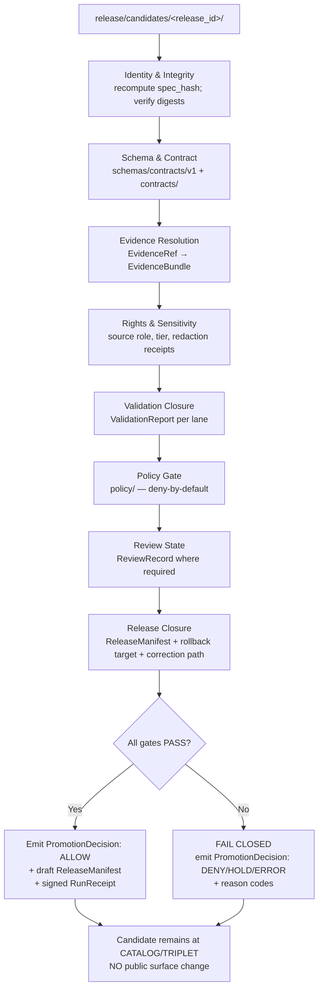
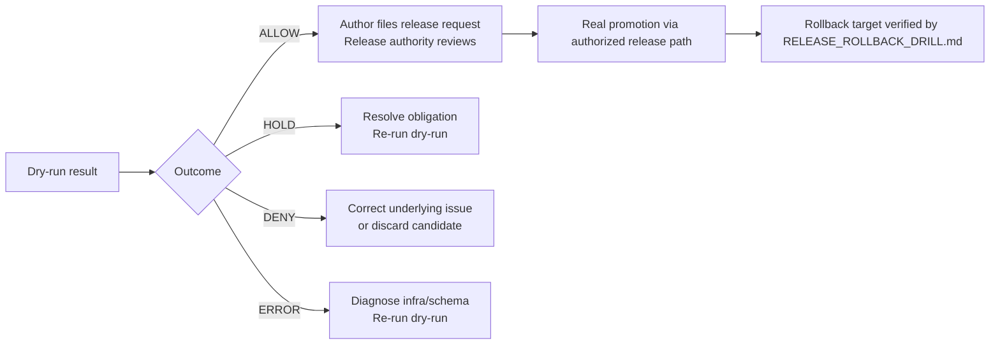

<!-- [KFM_META_BLOCK_V2]
doc_id: kfm://doc/runbooks/release-dry-run
title: Release Dry-Run Runbook
type: standard
version: v1
status: draft
owners: <docs steward + release authority> (NEEDS VERIFICATION)
created: 2026-05-12
updated: 2026-05-12
policy_label: public
related:
  - docs/doctrine/lifecycle-law.md
  - docs/doctrine/trust-membrane.md
  - docs/doctrine/directory-rules.md
  - docs/architecture/governed-api.md
  - docs/runbooks/RELEASE_ROLLBACK_DRILL.md
  - release/README.md
  - apps/cli/README.md
tags: [kfm, runbook, release, dry-run, promotion, governance, fail-closed]
notes:
  - Operational runbook for PR-09 promotion dry-run.
  - Sibling to a rollback-drill runbook (PR-10).
  - No-public-write invariant is non-negotiable.
[/KFM_META_BLOCK_V2] -->

<a id="top"></a>

# Release Dry-Run Runbook

> Governed, no-public-write rehearsal of the **CATALOG/TRIPLET → PUBLISHED** transition. The dry-run produces auditable gate outputs, exercises the release machinery end-to-end, and **MUST NOT** mutate any public surface.

<p align="center">
  
  
  
  
  
  
</p>

| Field | Value |
|---|---|
| **Status** | `draft` — first published runbook draft |
| **Authority** | Operational runbook under `docs/runbooks/` (CONFIRMED canonical home per Directory Rules §6.1) |
| **Owners** | Docs steward + release authority (NEEDS VERIFICATION; populate from `CODEOWNERS`) |
| **Last reviewed** | 2026-05-12 |
| **Applies to** | `release/candidates/*`, `release/manifests/*`, `release/promotion_decisions/*` (PROPOSED paths) |
| **Companion runbooks** | `RELEASE_ROLLBACK_DRILL.md` (PROPOSED), `RELEASE_CORRECTION.md` (PROPOSED) |

---

## Quick jump

- [1. What a release dry-run is — and is not](#1-what-a-release-dry-run-is--and-is-not)
- [2. When to run it](#2-when-to-run-it)
- [3. Roles and separation of duties](#3-roles-and-separation-of-duties)
- [4. Preconditions](#4-preconditions)
- [5. The dry-run flow](#5-the-dry-run-flow)
- [6. Gates exercised](#6-gates-exercised)
- [7. Finite outcomes](#7-finite-outcomes)
- [8. Reason codes](#8-reason-codes)
- [9. Commands (PROPOSED)](#9-commands-proposed)
- [10. After the dry-run](#10-after-the-dry-run)
- [11. Troubleshooting](#11-troubleshooting)
- [12. Definition of Done](#12-definition-of-done)
- [13. Related docs and registers](#13-related-docs-and-registers)
- [14. Open questions](#14-open-questions)

---

## 1. What a release dry-run is — and is not

> [!IMPORTANT]
> **CONFIRMED doctrine:** *Promotion is a governed state transition, not a file move.* A release dry-run rehearses that transition for a candidate dossier and emits gate evidence **without** writing to `data/published/`, the governed API's served catalog, or any user-visible surface.

A **release dry-run** is the rehearsal that proves a `release/candidates/<release_id>/` dossier *could* be promoted to **PUBLISHED** under current rules, evidence, policy, review state, and signatures — without actually flipping the public state. It produces a `PromotionDecision` record, the supporting receipts, and a draft `ReleaseManifest`. Nothing it emits reaches a public client.

**It is:**

- a rehearsal of the **CATALOG/TRIPLET → PUBLISHED** gate (CONFIRMED lifecycle);
- a producer of **auditable gate outputs** (PROPOSED `PromotionDecision`, draft `ReleaseManifest`, `RunReceipt`, validation reports, policy decisions);
- a **no-network**-by-default CI lane (PROPOSED — aligns with `BLD-GREEN §§17, 24`, `IMPL-PIPE §23`);
- the **last** verification step before a real release request is filed.

**It is *not*:**

- a publish step (no `data/published/` writes);
- a substitute for review or signature (the dry-run can produce `HOLD` and that is the correct answer);
- a way to "see how it would look" by relaxing gates — relaxed gates produce a *different* artifact, not a previewable PUBLISHED state;
- a path that bypasses `apps/governed-api/` (the trust membrane is in force even in dry-run).

> [!WARNING]
> If a step in this runbook appears to require writes to `data/published/`, the governed API cache, or any public-facing surface — **stop**. That is a violation of the no-public-write invariant. Open a `DRIFT_REGISTER.md` entry and escalate to the docs steward.

[Back to top](#top)

---

## 2. When to run it

| Trigger | Run? | Why |
|---|---|---|
| PR mutates `release/candidates/<release_id>/` | **Yes** | Validates the candidate against current gates |
| PR mutates `policy/`, `schemas/contracts/v1/`, `contracts/` | **Yes** (per-candidate replay) | Policy/schema drift may flip a prior `PASS` to `FAIL` |
| Source watcher emits a candidate via GitOps PR | **Yes** | Watcher-as-non-publisher invariant — workers MUST NOT publish |
| Steward review concludes for a sensitive lane | **Yes, before** the actual release request | Confirms the `ReviewRecord` resolves and the rollback target exists |
| Scheduled cadence (nightly / weekly) on candidate dossiers | **SHOULD** | Detects upstream drift (stale evidence, expired source cadence) |
| Routine doc-only change | **No** | Not a release-class change |

> [!TIP]
> Treat the dry-run as **cheap** and the real release as **expensive**. Run dry-runs liberally; reserve release authorization for cases the dry-run has already cleared.

[Back to top](#top)

---

## 3. Roles and separation of duties

CONFIRMED doctrine: **release authority MUST be distinct from the original author when materiality applies**, and sensitive lanes require additional reviewers. The dry-run itself can be initiated by any contributor — it produces evidence, not a release.

| Step | Who may execute | Who must approve before *real* release |
|---|---|---|
| Compose `release/candidates/<release_id>/` dossier | Domain steward / author | n/a (dry-run, no public effect) |
| Initiate dry-run (local or CI) | Any contributor with repo access | n/a |
| Read the dry-run `PromotionDecision` | Author + at least one reviewer | n/a |
| File a release request from a passing dry-run | Author | **Release authority ≠ author** (CONFIRMED) |
| File a release request on a **sensitive lane** | Author | Author + sensitivity reviewer + release authority + rights-holder rep where applicable |
| Approve a dry-run that emits `HOLD` and force release | **Not permitted** | `HOLD` MUST be resolved before release; see §11 |

Reference: Directory Rules §6.1 (governance roots); Atlas §24.7 (reviewer roles and separation-of-duties matrix).

[Back to top](#top)

---

## 4. Preconditions

Before invoking the dry-run, the candidate dossier under `release/candidates/<release_id>/` (PROPOSED path) **MUST** assemble the following. Missing any of these is a structured `FAIL` outcome, not a soft warning.

| Precondition | Where it lives (PROPOSED) | Why |
|---|---|---|
| `SourceDescriptor` for every input source | `data/registry/sources/<domain>/` | Identity, rights, sensitivity, cadence (CONFIRMED) |
| Resolved `EvidenceRef` → `EvidenceBundle` for every consequential claim | `data/proofs/` (CONFIRMED §9.1) | Cite-or-abstain invariant |
| Passing `ValidationReport` per validator lane | `data/receipts/` | Schema, geometry, time, identity, evidence, rights, sensitivity |
| `PolicyDecision = allow` from the promotion policy | OPA / Conftest output | Fail-closed default |
| `ReviewRecord` where the lane is sensitivity- or rights-significant | `data/receipts/reviews/` | Separation of duties |
| Draft `ReleaseManifest` listing artifacts, digests, and policy posture | `release/manifests/<release_id>.json` | The release decision artifact |
| **Rollback target** identified | `release/rollback_cards/<release_id>.json` | A release with no rollback target fails closed |
| **Correction path** declared | `release/manifests/<release_id>.json#correction` | A claim with no correction path is not safely publishable |
| Reproducible `spec_hash` over the canonicalized candidate | embedded in `RunReceipt` | Deterministic identity (CONFIRMED) |
| Signed `RunReceipt` for the build that produced the artifacts | `data/receipts/run/<run_id>.json(+.sig)` | Tamper-evident provenance |

> [!NOTE]
> **PROPOSED tool placements:** `tools/validators/`, `tools/attest/`, `apps/cli/release-dry-run`, `apps/governed-api/` for envelope helpers. Real paths require mounted-repo verification. Treat anything path-shaped here as PROPOSED until checked.

[Back to top](#top)

---

## 5. The dry-run flow

The dry-run is a deterministic, fail-closed sequence. It reads from the candidate dossier and emits gate evidence; it never writes to `data/published/`, the governed API's served catalog, or any tile/scene CDN.



*Mermaid diagram: PROPOSED gate sequence. Gate names align with Atlas §24.6.1 lifecycle gates and the PROPOSED CI sequence in IMPL-PIPE §23. Concrete CI job names and step ordering are NEEDS VERIFICATION until checked against a mounted workflow file.*

> [!IMPORTANT]
> Step **M** is non-negotiable. A passing dry-run leaves the candidate at **CATALOG/TRIPLET** with new auditable evidence attached. **Only a separate, authorized release request** transitions the candidate to **PUBLISHED**.

[Back to top](#top)

---

## 6. Gates exercised

The dry-run exercises the same gates the real promotion would, with the **publish step replaced by an emit-and-stop**. Gate definitions trace to Atlas §24.6 ("Master Pipeline Gate Reference") and the Unified Manual §28 (catalog, proof, release, publication).

| Gate | What it checks | Required artifacts (PROPOSED) | Failure-closed outcome |
|---|---|---|---|
| **Identity & Integrity** | `spec_hash` recomputes; artifact digests match; canonical JSON (JCS) parity | `RunReceipt`, recomputed `spec_hash` | Quarantine; `SCHEMA_MISMATCH` or hash mismatch |
| **Schema & Contract** | Every object conforms to its schema under `schemas/contracts/v1/`; contract version is current | Schema validation report | Hold at CATALOG; `CONTRACT_DRIFT` |
| **Evidence Resolution** | Every `EvidenceRef` resolves to an `EvidenceBundle`; closure complete | Resolved bundle list | Hold; `MISSING_EVIDENCE` |
| **Rights & Sensitivity** | Source role fixed; rights posture known; sensitivity tier resolved; redaction receipts exist where required | `SourceDescriptor`, `RedactionReceipt` | Quarantine / hold; `RIGHTS_UNKNOWN`, `SENSITIVITY_UNRESOLVED`, `ROLE_DOWNCAST_FORBIDDEN` |
| **Validation Closure** | All required validators returned `PASS` for fixtures and candidate | `ValidationReport` per lane | Hold; structured `FAIL` |
| **Policy Gate** | `policy/` returns `allow` from a deny-by-default base | `PolicyDecision` | Deny; reason code per `policy/` rule |
| **Review State** | `ReviewRecord` exists for sensitive lanes; reviewer ≠ author when separation required | `ReviewRecord` | Hold; `REVIEW_NEEDED`, `REVIEW_INSUFFICIENT`, `REVIEW_REJECTED` |
| **Release Closure** | Draft `ReleaseManifest` valid; rollback target present; correction path declared | `ReleaseManifest`, `RollbackCard` reference | Hold; `RELEASE_MANIFEST_INVALID`, `ROLLBACK_TARGET_MISSING` |
| **Signature (where applicable)** | Receipts / envelopes signed by approved identity; DSSE valid | DSSE envelope, signature | Quarantine; missing signature |

> [!NOTE]
> Atlas §24.6.3 calls these reason codes **PROPOSED** at this level of consolidation. They are stable enough to plan against; treat the exact wire-level enum as PROPOSED until the policy bundle and CI workflow are inspected.

[Back to top](#top)

---

## 7. Finite outcomes

Every gate and the dry-run as a whole returns a **finite outcome** from KFM's well-known set (CONFIRMED doctrine, Atlas §24.3). The dry-run never returns "looks good" — it returns one of:

| Outcome | Meaning for the dry-run | What it implies |
|---|---|---|
| **ALLOW** *(release-queue class)* | All gates passed; the candidate **could** be promoted under current rules | Author may file an authorized release request; release authority must still approve |
| **HOLD** | Promotion is paused pending review, evidence, or rights resolution | Resolve the named obligation; re-run dry-run; **do not** force release |
| **DENY** | Policy, rights, sensitivity, or release state forbids promotion | Treat as authoritative; do not work around; correct the underlying issue |
| **ERROR** | The dry-run could not evaluate (malformed candidate, infra failure, schema unknown) | Diagnose and re-run; not a green-light substitute |

For validator-class steps inside the dry-run, the finite outcomes are `PASS / FAIL / ERROR`. For governed-API surfaces (when the candidate is fed through `apps/governed-api/` for envelope checks), the outcomes are `ANSWER / ABSTAIN / DENY / ERROR`.

> [!CAUTION]
> A **HOLD** is a *valid, useful* outcome. It is *not* a near-miss to be overridden. Forcing a release after a HOLD bypasses the trust membrane and is an anti-pattern (Atlas §24.9.2).

[Back to top](#top)

---

## 8. Reason codes

When the dry-run emits `HOLD`, `DENY`, or a quarantine-class failure, the `PromotionDecision` carries reason codes. The catalog below is PROPOSED at the consolidation level (Atlas §24.6.3); the exact wire identifiers are NEEDS VERIFICATION until inspected against the policy bundle.

<details>
<summary><b>Reason code catalog (PROPOSED)</b></summary>

| Family | Reason code | Typical gate | Recovery |
|---|---|---|---|
| Missing artifact | `MISSING_RECEIPT` | Normalization / Validation / Catalog / Release | Re-emit receipt |
| Missing artifact | `MISSING_EVIDENCE` | Evidence Resolution | Resolve `EvidenceRef`; supply `EvidenceBundle` |
| Missing artifact | `MISSING_REVIEW` | Review State | Run required review; supply `ReviewRecord` |
| Schema/contract | `SCHEMA_MISMATCH` | Schema & Contract | Fix schema or update validator |
| Schema/contract | `CONTRACT_DRIFT` | Schema & Contract | Reconcile contract version |
| Rights/sensitivity | `RIGHTS_UNKNOWN` | Admission / Validation / Catalog / Release | Steward review; rights resolution |
| Rights/sensitivity | `SENSITIVITY_UNRESOLVED` | Validation / Catalog / Release | Tier reassignment; redaction receipt |
| Source role | `ROLE_COLLAPSE` | Validation / Catalog / Release | Restore source role |
| Source role | `ROLE_DOWNCAST_FORBIDDEN` | Validation / Catalog / Release | Refuse role upcast; correct lineage |
| Review state | `REVIEW_NEEDED` | Catalog / Release | Run required review |
| Review state | `REVIEW_INSUFFICIENT` | Catalog / Release | Add reviewer for sensitive lane |
| Review state | `REVIEW_REJECTED` | Catalog / Release | Address reviewer findings |
| Release infra | `RELEASE_MANIFEST_INVALID` | Release | Fix manifest |
| Release infra | `ROLLBACK_TARGET_MISSING` | Release | Supply rollback target |
| Correction | `CORRECTION_DERIVATIVES_UNRESOLVED` | Correction | Identify and invalidate derivatives |
| Correction | `CORRECTION_PRIOR_RELEASE_MISSING` | Correction | Locate or reconstruct prior release |

</details>

[Back to top](#top)

---

## 9. Commands (PROPOSED)

> [!WARNING]
> The command surfaces below are **PROPOSED** — the existence, names, flags, and exit codes of these tools require mounted-repo verification. Treat this section as a *target shape*, not a current contract.

### 9.1 Compose the candidate dossier

```text
# PROPOSED layout for release/candidates/<release_id>/ — verify against release/README.md
release/candidates/<release_id>/
├── manifest.draft.json         # draft ReleaseManifest (artifacts, digests, policy, rollback ref, correction ref)
├── evidence/                   # resolved EvidenceBundles (or pointers into data/proofs/)
├── receipts/                   # RunReceipts, ValidationReports, PolicyDecisions
├── review/                     # ReviewRecords (sensitive lanes)
├── rollback.target.json        # rollback target reference
└── README.md                   # dossier-level summary
```

### 9.2 Initiate the dry-run

```bash
# PROPOSED CLI surface — actual command names NEEDS VERIFICATION
# Local, no-network, deterministic:
kfm release dry-run \
  --candidate release/candidates/<release_id>/ \
  --policy   policy/ \
  --schemas  schemas/contracts/v1/ \
  --out      release/promotion_decisions/<release_id>.dryrun.json \
  --no-network \
  --fail-closed
```

The command **MUST** exit non-zero on any gate failure. The emitted `PromotionDecision` is the authoritative artifact; stdout is human guidance.

### 9.3 Inspect the result

```bash
# PROPOSED — surfaces the finite outcome and any reason codes
jq '.outcome, .reasons[]' release/promotion_decisions/<release_id>.dryrun.json
```

### 9.4 What you should *not* run

```bash
# Anti-patterns — do NOT do these during a dry-run
cp release/candidates/<release_id>/* data/published/   # bypasses the trust membrane
git tag release-<release_id>                            # premature release authorization
curl -X POST https://<governed-api>/publish ...         # there is no public-side publish path on dry-run
```

[Back to top](#top)

---

## 10. After the dry-run



| Outcome | Next action | Where the action is recorded |
|---|---|---|
| **ALLOW** | Author files release request; release authority reviews and decides | `release/promotion_decisions/<release_id>.json` (real, not `.dryrun.json`) |
| **HOLD** | Resolve the named obligation (e.g., supply `ReviewRecord`); re-run dry-run | `data/receipts/`, `data/proofs/`, `release/candidates/<release_id>/` |
| **DENY** | Correct the underlying issue or **discard the candidate** | `release/withdrawal_notices/` (PROPOSED) |
| **ERROR** | Diagnose; do not treat as informational. Re-run from a clean state | CI logs; consider an ADR if a recurring class of error reveals a doctrine gap |

> [!IMPORTANT]
> A passing dry-run is necessary but **not sufficient**. The real release path requires a separate, authorized request; the release authority MUST be distinct from the author when materiality applies (Atlas §24.7.2).

[Back to top](#top)

---

## 11. Troubleshooting

<details>
<summary><b>Gate says <code>MISSING_EVIDENCE</code> but the bundle exists in <code>data/proofs/</code></b></summary>

The `EvidenceRef → EvidenceBundle` resolver checks that references *resolve*, not just that bundles exist. Verify the `evidence_ref` URI in the candidate manifest matches the bundle's content-addressed identity. A renamed file with the same content can still fail if the reference was not updated. (See `packages/evidence-resolver/` — PROPOSED home per Directory Rules §7.2.)
</details>

<details>
<summary><b>Gate says <code>ROLLBACK_TARGET_MISSING</code> for a first release</b></summary>

CONFIRMED doctrine: every release **MUST** declare a rollback target, even when it is the first release in a lane. For a first release, the rollback target is typically a documented *withdrawal* path — a `WithdrawalNotice` that disables the public surface — not a prior `ReleaseManifest`. Record this in `release/rollback_cards/<release_id>.json` (PROPOSED) and re-run.
</details>

<details>
<summary><b>Dry-run passes locally but fails in CI</b></summary>

Check for environment drift between local and CI: schema versions, policy bundle version, time-sensitive evidence (cadence expiry), and network state (CI is no-network by default; a local run that hit a live source has different inputs). The candidate dossier MUST be self-contained.
</details>

<details>
<summary><b>Outcome is <code>HOLD</code>; the reviewer is unavailable. Can I bypass for a demo?</b></summary>

**No.** A demo is a public-class exposure if it presents the candidate as released. Two safe alternatives:

1. Demo the **candidate as candidate** — show the dossier and the dry-run result, not a fake PUBLISHED state.
2. Spin up a **review-console** session (`apps/review-console/` — PROPOSED) and walk through the held obligation. The review-console is role-gated and audited; it is the legitimate path.
</details>

<details>
<summary><b>Where does a failed dry-run live? Is the candidate deleted?</b></summary>

The candidate stays at **CATALOG/TRIPLET**. The `PromotionDecision` is retained as auditable evidence; the candidate dossier is retained for re-run after correction. If the candidate is abandoned, record a `WithdrawalNotice` (PROPOSED) rather than silently deleting. Silent deletion breaks the audit chain.
</details>

[Back to top](#top)

---

## 12. Definition of Done

A release dry-run is "done" when **all** of the following are true. Anything less is an open dry-run, not a passed dry-run.

- [ ] Candidate dossier present at `release/candidates/<release_id>/` (PROPOSED path) and self-contained
- [ ] `spec_hash` recomputes and matches the signed `RunReceipt`
- [ ] Every `EvidenceRef` resolves to an `EvidenceBundle`
- [ ] All required `ValidationReport`s are `PASS`
- [ ] `PolicyDecision` is `allow` (deny-by-default base)
- [ ] `ReviewRecord` present for any sensitive or rights-significant lane
- [ ] Draft `ReleaseManifest` validates against schema
- [ ] Rollback target is identified and locatable
- [ ] Correction path is declared
- [ ] `PromotionDecision` is written to `release/promotion_decisions/<release_id>.dryrun.json`
- [ ] **No** writes to `data/published/`, governed-API caches, or any public surface
- [ ] CI lane was no-network (or any network access is justified, scoped, and recorded)
- [ ] The companion rollback drill (`RELEASE_ROLLBACK_DRILL.md`, PROPOSED) has been rehearsed for this `release_id` *before* a real release request is filed

> [!TIP]
> A dry-run that produces `HOLD` or `DENY` with clean reason codes is still a **successful run of the runbook** — the runbook's job is to surface truth, not to manufacture `ALLOW`.

[Back to top](#top)

---

## 13. Related docs and registers

| Document | Role | Status (PROPOSED unless verified) |
|---|---|---|
| `docs/doctrine/lifecycle-law.md` | The RAW → … → PUBLISHED invariant | CONFIRMED doctrine; file presence NEEDS VERIFICATION |
| `docs/doctrine/trust-membrane.md` | Why public clients use `apps/governed-api/` | CONFIRMED doctrine; file presence NEEDS VERIFICATION |
| `docs/doctrine/directory-rules.md` | Where files live; why `docs/runbooks/` exists | CONFIRMED home, this file's basis |
| `docs/architecture/governed-api.md` | The trust membrane in executable form | NEEDS VERIFICATION |
| `release/README.md` | What `release/candidates/`, `release/manifests/`, `release/promotion_decisions/`, `release/rollback_cards/` own | NEEDS VERIFICATION |
| `docs/runbooks/RELEASE_ROLLBACK_DRILL.md` | Sibling runbook; rehearses rollback against a dry-run release | PROPOSED (PR-10) |
| `docs/runbooks/RELEASE_CORRECTION.md` | Sibling runbook; correction-path rehearsal | PROPOSED |
| `docs/registers/DRIFT_REGISTER.md` | Where to record any contradiction between this runbook and the mounted repo | PROPOSED |
| `docs/registers/VERIFICATION_BACKLOG.md` | Where to record `NEEDS VERIFICATION` items raised by a dry-run | PROPOSED |
| `apps/cli/README.md` | Maintainer commands, including `release dry-run` | PROPOSED command surface |

**External standards relevant to dry-run evidence** (informational, not authoritative for KFM doctrine):

- STAC, DCAT, W3C PROV — for catalog closure metadata (where applicable).
- RFC 8785 (JCS) — canonical JSON form for stable `spec_hash` (PROPOSED usage per ML-063-053).
- DSSE / Sigstore (cosign) — envelope and signing model for receipts (PROPOSED).

[Back to top](#top)

---

## 14. Open questions

- **NEEDS VERIFICATION:** Does a workflow file (e.g., `.github/workflows/promotion-dry-run.yml`) currently exist? If yes, are its step names and emitted artifacts consistent with §5?
- **NEEDS VERIFICATION:** Is the canonical home for the dry-run `PromotionDecision` `release/promotion_decisions/<release_id>.dryrun.json`, or does it live alongside the real `PromotionDecision` with a `mode: dryrun` field? Either is defensible; an ADR should fix one.
- **NEEDS VERIFICATION:** Which CLI tool actually drives the dry-run — `apps/cli/` (CONFIRMED role per Directory Rules §7.1), a `tools/` script, or a CI-only composite action?
- **PROPOSED:** Should the dry-run runbook block release-class PRs from merging until a `dryrun.json` is committed? (Argues *yes*: prevents stealth release-class changes. Argues *no*: increases PR cycle time.) Needs an ADR.
- **NEEDS VERIFICATION:** Exact reason-code enum values used by the policy bundle. The catalog in §8 is PROPOSED-at-consolidation; the wire format requires inspection.

Record answers in `docs/registers/VERIFICATION_BACKLOG.md` and link this runbook from the entry.

---

### Footer

<sub><b>Related runbooks:</b> <code>RELEASE_ROLLBACK_DRILL.md</code> (PROPOSED) · <code>RELEASE_CORRECTION.md</code> (PROPOSED) · <code>SOURCE_ACTIVATION.md</code> (PROPOSED).<br>
<b>Doctrine basis:</b> Directory Rules §6.1; Atlas §24.6, §24.3, §24.7; Unified Manual §§28–29; PR-09 (promotion dry-run) and PR-10 (rollback drill) from the encyclopedia roadmap.<br>
<b>Last updated:</b> 2026-05-12 · <b>Owner:</b> Docs steward + release authority (NEEDS VERIFICATION) · <a href="#top">Back to top ↑</a></sub>
