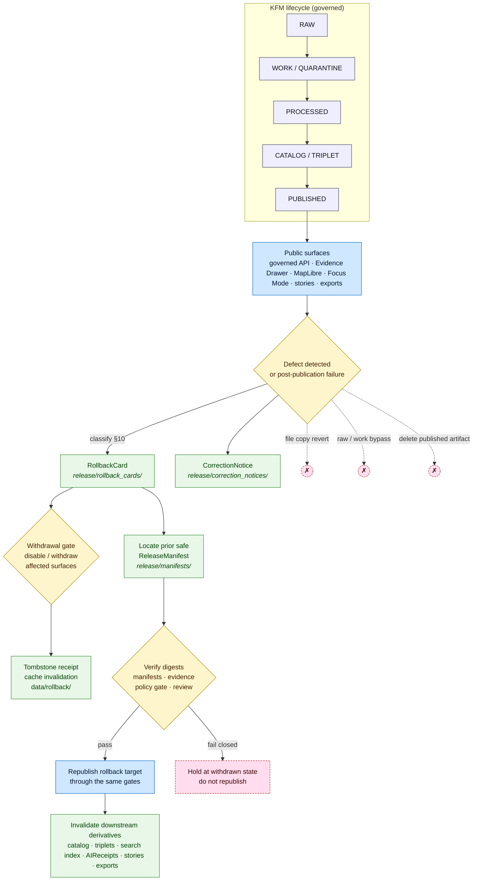

<!-- [KFM_META_BLOCK_V2]
doc_id: kfm://doc/runbook-rollback
title: KFM Rollback Runbook
type: standard
version: v1
status: draft
owners: Release authority · Docs steward · Correction reviewer · AI surface steward (per Atlas v1.1 §24.7)
created: 2026-05-12
updated: 2026-05-12
policy_label: public
related:
  - docs/doctrine/directory-rules.md
  - docs/doctrine/lifecycle-law.md
  - docs/doctrine/trust-membrane.md
  - docs/runbooks/ui_ROLLBACK.md
  - docs/runbooks/governed_ai_ROLLBACK.md
  - docs/adr/README.md
  - release/README.md
tags: [kfm, runbook, rollback, release, correction, governance]
notes:
  - PROPOSED file; not verified against mounted repo evidence in this session.
  - All referenced sibling paths are PROPOSED per Directory Rules §0.
[/KFM_META_BLOCK_V2] -->

# 🔄 KFM Rollback Runbook

> **Master operating procedure for governed rollback of a Kansas Frontier Matrix (KFM) release** — how to identify the affected release, locate the prior safe artifact set, withdraw public surfaces, emit the rollback receipts, invalidate downstream derivatives, and re-establish a safe public state through the same governed release path. Rollback is a publication requirement, not an afterthought, and **never a hidden file copy.**

<!-- Badges: targets unverified; render as TODO placeholders until a CI/policy/release home is confirmed. -->


<!-- TODO: replace with real Shields.io endpoints once CI / release pages exist (NEEDS VERIFICATION). -->

| Status | Owners (roles, per Atlas v1.1 §24.7) | Last updated |
|---|---|---|
| `draft` · doctrine **CONFIRMED** · execution **PROPOSED** | Release authority · Correction reviewer · Docs steward · AI surface steward · (rights-holder representative where applicable) | `2026-05-12` |

---

## Quick jump

- [1. Scope](#1-scope)
- [2. Repo fit](#2-repo-fit)
- [3. Inputs](#3-inputs)
- [4. Exclusions](#4-exclusions)
- [5. Doctrine (CONFIRMED)](#5-doctrine-confirmed)
- [6. Roles and separation of duties](#6-roles-and-separation-of-duties)
- [7. Diagram — rollback as a governed state transition](#7-diagram--rollback-as-a-governed-state-transition)
- [8. Required artifacts before any release](#8-required-artifacts-before-any-release)
- [9. The rollback flow](#9-the-rollback-flow)
- [10. Defect classification matrix](#10-defect-classification-matrix)
- [11. Failure reason codes (PROPOSED catalog)](#11-failure-reason-codes-proposed-catalog)
- [12. Cache invalidation, tombstones, withdrawal](#12-cache-invalidation-tombstones-withdrawal)
- [13. Stale vs. wrong — quick reference](#13-stale-vs-wrong--quick-reference)
- [14. Rollback drill / rehearsal](#14-rollback-drill--rehearsal)
- [15. Governance health indicators](#15-governance-health-indicators)
- [16. Anti-patterns](#16-anti-patterns)
- [17. Related runbooks and docs](#17-related-runbooks-and-docs)
- [18. Open questions and verification items](#18-open-questions-and-verification-items)
- [Appendix A — Artifact field reference](#appendix-a--artifact-field-reference)
- [Appendix B — Pre-rollback readiness checklist](#appendix-b--pre-rollback-readiness-checklist)
- [Appendix C — Pre-publish rollback-target checklist](#appendix-c--pre-publish-rollback-target-checklist)

---

## 1. Scope

**This runbook governs (CONFIRMED doctrine):**

- Rollback of a PUBLISHED release back to a named prior release.
- Authorship and closure of `RollbackCard`, `CorrectionNotice`, and the superseding/reverting `ReleaseManifest`.
- Withdrawal of affected public surfaces (governed API payloads, map layers, Evidence Drawer rendering, Focus Mode answers, story snapshots, exports, AI answers).
- Derivative invalidation across catalog, tile, graph/triplet, story, search-index, and AI receipt projections.
- The rollback drill (rehearsal) required for every release.

**Out of scope:**

- Database/schema/graph migration rollback — handled by `migrations/rollback/` per Directory Rules §5 *(CONFIRMED rule; specific path **PROPOSED** until repo-verified)*.
- New-source admission and source-role corrections — handled by the source admission runbook *(PROPOSED, not in this file)*.
- Hot configuration changes that do not alter a published claim — out of scope here; covered by ops/runtime runbooks.
- Hard deletion for right-to-be-forgotten / erasure — `RollbackCard` + tombstone is **not** erasure; see §12.

> [!IMPORTANT]
> KFM's durable public unit is the **inspectable claim**. A released claim, layer, catalog record, artifact, or answer is treated as safely publishable **only** when a visible correction path and rollback target already exist. Rollback runs through the same governed release path that publication did. (CONFIRMED doctrine, Unified Build Manual §20; Encyclopedia §14; Atlas v1.1 §24.6.)

---

## 2. Repo fit

| Aspect | Value | Status |
|---|---|---|
| Owning root | `docs/` (human-facing control plane) | CONFIRMED rule, [Directory Rules §5–6.1](../doctrine/directory-rules.md) |
| Subtree | `docs/runbooks/` — *ops procedures, rollback drills, validation runs* | CONFIRMED rule |
| File path | `docs/runbooks/ROLLBACK_RUNBOOK.md` | **PROPOSED** (this file; not yet verified in mounted repo) |
| Authority surface | Doctrine — defers to Atlas v1.1, Encyclopedia, Unified Build Manual, Directory Rules | CONFIRMED |
| Enforcement surface | `policy/release/` · `tests/release/` · `tools/validators/release/` · CI workflows | **PROPOSED** (paths follow Directory Rules; mounted-repo presence **UNKNOWN**) |
| Upstream doctrine | `docs/doctrine/lifecycle-law.md`, `docs/doctrine/trust-membrane.md`, `docs/doctrine/directory-rules.md` | PROPOSED paths per Directory Rules §6.1 |
| Downstream / specialized | `docs/runbooks/ui_ROLLBACK.md`, `docs/runbooks/governed_ai_ROLLBACK.md` | **PROPOSED** sibling runbooks (per Whole-UI + Governed AI Expansion Report Appendix B) |
| Decision artifacts home | `release/rollback_cards/`, `release/correction_notices/`, `release/withdrawal_notices/`, `release/manifests/` | CONFIRMED rule per Directory Rules §9.2 |
| Data-plane revert receipts | `data/rollback/<domain>/<release_id>/` | CONFIRMED rule per Directory Rules §9.1 (open ADR question per §18) |

> [!NOTE]
> **Decisions vs. artifacts.** `release/rollback_cards/` owns the **decision** to roll back. `data/rollback/` owns the **alias-revert receipts** in the data plane. `data/published/` owns the released **artifacts** that get withdrawn. Mixing these is one of the four drift patterns called out in Directory Rules §10.

---

## 3. Inputs

A rollback request — initiated by any of the triggers in §9.1 — MUST present:

1. A named **failed or defective release** (`release_id` resolving to a `ReleaseManifest` in `release/manifests/`).
2. A candidate **rollback target** (`prior_release_id` resolving to a previously-published `ReleaseManifest`).
3. A classified **defect class** (see §10) and a short reason narrative.
4. The set of **affected public surfaces** (layers, catalog records, evidence-drawer payloads, story snapshots, Focus Mode answers, exports, API payloads).
5. The set of **downstream derivatives** that must be invalidated (catalog, triplet, search index, AI receipts, story/export receipts).
6. A `ReviewRecord` reference, **if** the defect class triggers required review under §6 separation of duties.

> [!TIP]
> If item (2) is missing, the operative reason code is `ROLLBACK_TARGET_MISSING` (§11). The release that produced the defect should never have reached PUBLISHED without a valid rollback target; treat the absence as a release-time defect in addition to the operational defect.

---

## 4. Exclusions

A `RollbackCard` is **not**:

- **A delete.** Rollback preserves history. Revocations are tombstones with supersession references; lineage and audit remain explorable. (CONFIRMED doctrine — Pass 10 §C5-09.)
- **A silent edit.** Corrections always publish a superseding release or an explicit `CorrectionNotice`. The prior release record is preserved. (CONFIRMED doctrine — Unified Build Manual §20.)
- **A file move.** Promotion is a governed state transition; so is rollback. A path-level revert that bypasses validators, policy gates, evidence-bundle resolution, catalog closure, and release-decision recording is a violation of the lifecycle invariant regardless of where the bytes end up. (CONFIRMED — Directory Rules §9.1.)
- **A bypass of the trust membrane.** Public clients, normal UI surfaces, and released AI surfaces never reach RAW, WORK, QUARANTINE, canonical/internal stores, graph internals, vector indexes, source APIs, or direct model runtimes — including during rollback. (CONFIRMED doctrine — Atlas v1.1 §24.6.2.)
- **An erasure mechanism.** Right-to-be-forgotten / GDPR erasure obligations require additional procedures beyond tombstones. The erasure boundary is an open ADR question (§18).

---

## 5. Doctrine (CONFIRMED)

The following five statements govern every step in §9. They cannot be overridden by convenience, deadline, or local convention.

1. **Correction and rollback are publication requirements.** A claim is not safely publishable until its rollback target and correction path are visible. *(Unified Build Manual §20; Encyclopedia §14; Atlas v1.1 §24.6.)*
2. **Rollback runs the same governed release path as publication.** Identify → locate prior safe set → verify digests/manifests → disable/withdraw → preserve receipts → mark stale/withdrawn → restore or republish the rollback target through the gates. *(Unified Build Manual §20.)*
3. **Promotion is a governed state transition, not a file move.** This applies to rollback equally: a directory-level swap that bypasses gates is not a rollback. *(Directory Rules §9.1.)*
4. **The trust membrane holds during rollback.** RAW / WORK / QUARANTINE / canonical-internal / graph internals / vector indexes / source APIs / direct model runtimes remain unreachable from public surfaces while the rollback is in flight. *(Atlas v1.1 §24.6.2.)*
5. **Closure means resolution, not just reference.** A transition closes only when (i) the required artifacts exist, (ii) every required artifact **resolves** the artifacts it depends on (`EvidenceRef` → `EvidenceBundle`, `source_id` → `SourceDescriptor`, `model_id` → `ModelRunReceipt`), and (iii) the policy gate evaluated and recorded its decision. Missing any of these means the transition fails closed and the prior state is preserved. *(Atlas v1.1 §24.6.2.)*

---

## 6. Roles and separation of duties

Roles are CONFIRMED-doctrinally per Atlas v1.1 §24.7; named individuals and enforcement tooling are **PROPOSED** until mounted-repo evidence (CODEOWNERS, branch protections, OPA bundles, review queues) confirms them.

| Role | Owns in this runbook | Citation |
|---|---|---|
| **Release authority** | Authorizes PUBLISHED transitions and rollbacks; signs `ReleaseManifest` and `RollbackCard`. Distinct from author when materiality applies. | Atlas v1.1 §24.7.1; Encyclopedia §10 |
| **Correction reviewer** | Reviews `CorrectionNotice` / `RollbackCard` before they amend a PUBLISHED claim. | Atlas v1.1 §24.7.1 |
| **Source steward** | Re-confirms source identity / rights / sensitivity if the defect class involves source-role, rights, or sensitivity. | Atlas v1.1 §24.7.1; Encyclopedia §10 |
| **Domain steward** | Owns the meaning, contracts, and validators of the affected domain’s object families; identifies derivatives. | Atlas v1.1 §24.7.1 |
| **Sensitivity reviewer** | Reviews redaction/generalization/withholding when the defect class is sensitivity leak, rights, archaeology, rare-species locations, living-person, or DNA. | Atlas v1.1 §24.7.1 |
| **Rights-holder representative** | Confirms sovereignty / cultural-heritage / consent decisions when applicable (archaeology, sovereign data, living-person, DNA). | Atlas v1.1 §24.7.1 |
| **AI surface steward** | Reviews `AIReceipt` invalidation, Focus Mode template withdrawal, and policy-binding changes when rollback touches an AI surface. | Atlas v1.1 §24.7.1 |
| **Docs steward** | Owns this runbook, the drift register, the ADR index, and post-rollback documentation updates. | Atlas v1.1 §24.7.1; Directory Rules §0 |

### 6.1 Separation requirements

Author MAY also approve **only** for non-sensitive, low-materiality routine. Where the table below requires separation, author ≠ release authority.

| Action | May the author also approve? | Required separation (PROPOSED) | Citation |
|---|---|---|---|
| Release to PUBLISHED | **No** when materiality applies. | Author ≠ release authority; rights-holder rep where applicable. | Atlas v1.1 §24.7.2 |
| Sensitive-lane release | **No.** | Author + sensitivity reviewer + release authority + rights-holder rep. | Atlas v1.1 §24.7.2; Domain dossiers (archaeology, fauna, people) |
| **Correction / rollback** | **No when correction is steward-significant.** | Author / detector + correction reviewer + release authority. | Atlas v1.1 §24.7.2 |
| AI surface change (template / policy binding) during rollback | **No.** | AI surface steward + docs steward (policy binding). | Atlas v1.1 §24.7.2 |

> [!NOTE]
> Atlas v1.1 §24.7 maturity note: as KFM matures and the public trust surface expands, separation of duties is enforced through tooling rather than custom. Early-stage doctrine work may be authored and approved by the same actor when materiality is low. This runbook does not assume the enforcement tooling exists yet.

---

## 7. Diagram — rollback as a governed state transition



> [!CAUTION]
> The three dashed paths to `✗` are **never** rollback. A path-level file copy that does not pass through verification, withdrawal, and the same governed gates as publication is a violation of Directory Rules §9.1 and Atlas v1.1 §24.6.2.

---

## 8. Required artifacts before any release

A release **cannot** be safely published unless these artifacts exist and resolve. They are also the inputs and outputs of rollback.

| Artifact | Purpose | Required fields (PROPOSED minimum, per Atlas v1.1 §24.2) | Home (per Directory Rules §9.2) |
|---|---|---|---|
| **`ReleaseManifest`** | Records release contents, version, digests, signatures, and **`rollback_target`**. | `release_id`, `contents[]`, `digests`, `evidence_refs[]`, `rollback_target`, `time` | `release/manifests/` |
| **`rollback_target`** | Defines the reversible release point. | `release_id`, `prior_release_id`, `artifact_digests`, `cache_keys`, `correction_notice` *(PROPOSED schema; `schemas/contracts/v1/release/rollback_target.schema.json`)* | inline in `ReleaseManifest`; schema under `schemas/contracts/v1/release/` |
| **`RollbackCard`** | Records the rollback decision and the targeted prior release. | `release_id`, `rollback_to`, `reason`, `invalidates[]`, `review_ref`, `time` | `release/rollback_cards/` |
| **`CorrectionNotice`** | Records that a published claim was corrected: what changed, why, and which derivatives are invalidated. | `claim_ref`, `prior_release_ref`, `change_summary`, `invalidates[]`, `review_ref`, `time` | `release/correction_notices/` |
| **`ReviewRecord`** | Captures reviewer action when separation of duties applies. | reviewer identity, role, decision, evidence considered, time | `data/proofs/` (proof side) and referenced from `release/` (decision side) |
| **`PolicyDecision`** | Records the gate evaluation for the rollback transition. | `decision_id`, `input_ref`, `policy_id`, `outcome`, `obligations`, `reasons`, `timestamps`, `reviewer` | `policy/release/`; emitted instances per Directory Rules §9 |
| **`EvidenceBundle`** | Resolves `EvidenceRef`s that any affected claim depends on; must still resolve after rollback. | per §24.2.1 in Atlas v1.1 | `data/proofs/evidence_bundle/` |
| **`RunReceipt`** | Process memory for the rollback action itself (what ran, with what inputs, by whom). | `run_id`, `inputs`, `outputs`, `spec_hash`, `tool_versions`, `actor`, `timestamps`, `signatures` | `data/receipts/release/` |

> [!IMPORTANT]
> Atlas v1.1 §24.2.2 maps these to lifecycle phases. `ReleaseManifest`, `CorrectionNotice`, and `RollbackCard` are normally emitted at **CATALOG / TRIPLET → PUBLISHED** and **PUBLISHED → PUBLISHED′ / prior release** transitions, never silently inside RAW, WORK, QUARANTINE, or PROCESSED.

---

## 9. The rollback flow

This flow is the PROPOSED operational realization of the CONFIRMED rollback doctrine (Unified Build Manual §20; Atlas v1.1 §24.6). Adapt the sub-steps to the affected subsystem(s) by following the linked specialized runbooks in §17.

### 9.1 Triggers

A rollback MAY be initiated by any of:

- **Validation failure post-release** — a smoke test, schema check, contract test, citation validation, or accessibility check reports a regression against a recently-published artifact.
- **Evidence defect** — an `EvidenceRef` no longer resolves, an `EvidenceBundle` is found to be incomplete, or a source role was upgraded incorrectly (`ROLE_COLLAPSE`).
- **Rights / sovereignty defect** — a rights status change, consent revocation, or sovereignty objection makes the artifact non-publishable.
- **Sensitivity leak** — exact geometry, living-person identifiers, DNA fields, archaeology coordinates, rare-species locations, or restricted infrastructure was exposed beyond its intended tier.
- **Policy or review defect** — a `PolicyDecision` is found to have been computed against a superseded policy bundle; a `ReviewRecord` is found insufficient.
- **AI-surface defect** — a Focus Mode answer cites incorrectly, an `AIReceipt` references retired evidence, or uncited generation reached the response envelope.
- **Renderer / artifact defect** — tile checksums fail, COG layout is broken, style references unreleased sources, MapLibre layer references a withdrawn manifest.
- **Operational kill-switch fired** — a fail-closed control engaged for the affected publication path.

### 9.2 Pre-conditions

Before opening a `RollbackCard`:

- Confirm the affected `release_id` and resolve its `ReleaseManifest`.
- Confirm a viable **prior safe** `ReleaseManifest` exists and resolves.
- Verify digests against the manifest; if the prior set is itself unverifiable, escalate to the release authority (do **not** proceed with an unverifiable rollback target).
- Identify the **defect class** (§10) — this determines correction posture, rollback posture, required reviewers, and disablement scope.
- Inventory **downstream derivatives**: catalog records, triplets/graph projections, search-index manifests, AI receipts referencing the artifact, story snapshots, export receipts, tile/style/glyph caches.

### 9.3 Steps (PROPOSED operational sequence)

1. **Classify the defect** per §10 — defect class determines reviewer separation (§6) and reason code(s) (§11).
2. **Open the `RollbackCard`** in `release/rollback_cards/`. Populate `release_id`, candidate `rollback_to`, `reason`, `invalidates[]` (the inventory from §9.2), and `review_ref` placeholder.
3. **Open the `CorrectionNotice`** in `release/correction_notices/` referencing the defective `release_id`, the defect class, and the invalidation list. The notice is the public-facing record; the card is the decision artifact.
4. **Disable / withdraw affected public surfaces.** Honor any fail-closed kill switch first. Withdrawal scope is determined by defect class and §10 rollback posture; never less than the artifacts and routes named in `invalidates[]`.
5. **Verify the prior safe artifact set.** Re-verify digests, manifest signatures, `EvidenceRef` resolution, `PolicyDecision` validity under the **current** policy bundle, and review state.
6. **Run the rollback policy gate.** A failure produces a structured FAIL outcome (see §11) and holds the system in the withdrawn state. Do not republish until the gate passes.
7. **Republish the rollback target** through the same governed release path: emit a new or superseding `ReleaseManifest` whose contents resolve to the prior safe artifact set; record the `RollbackCard` as the predecessor decision.
8. **Emit a rollback `RunReceipt`** capturing what ran, when, by whom, with what tool versions, against which inputs.
9. **Invalidate downstream derivatives** named in `invalidates[]`. Trigger cache invalidation hooks (§12).
10. **Mark UI state.** Evidence Drawer, MapLibre badges, story version strip, Focus Mode answers, and Frontier Matrix cells render the withdrawn / superseded / stale signals appropriate to the affected claims (Atlas v1.1 §24.8).
11. **Close the rollback.** Closure means resolution, not reference: every required artifact resolves its dependencies and the gate has recorded its decision (Atlas v1.1 §24.6.2). The `RollbackCard` references the closing `ReviewRecord`, the closing `PolicyDecision`, the rollback `RunReceipt`, and the new `ReleaseManifest`.
12. **Update docs.** Where doctrine, contracts, schemas, or policy changed as part of the rollback, update the relevant docs in `docs/` (Directory Rules §0; this is the documentation rule, not a substitute for the validators).

### 9.4 Outputs

A closed rollback leaves the following auditable trail:

- `RollbackCard` (decision) · `CorrectionNotice` (public notice) · superseding `ReleaseManifest` (republished safe state) · rollback `RunReceipt` (process memory) · closing `ReviewRecord` (where required) · closing `PolicyDecision` (gate evidence) · derivative-invalidation records · cache-invalidation receipts · withdrawn-surface markers.

### 9.5 Closure rules

- A rollback that cannot resolve a valid rollback target **MUST** fail closed (`ROLLBACK_TARGET_MISSING`).
- A rollback whose derivatives are not fully named **MUST** fail closed (`CORRECTION_DERIVATIVES_UNRESOLVED`).
- A rollback that would silently mutate the prior release record **MUST NOT** proceed. Publish a superseding release; preserve the prior record. (Atlas v1.1 §24.6.1.)

---

## 10. Defect classification matrix

CONFIRMED matrix from Unified Implementation Architecture Build Manual §20. Defect class determines correction posture, rollback posture, and the smallest scope of disablement. **All postures preserve audit history.**

| Defect class | Correction posture | Rollback posture | Notes |
|---|---|---|---|
| **Evidence gap** | ABSTAIN or withdraw unsupported claim. | Restore prior evidence-supported release. | Apply when `EvidenceRef` fails to resolve to a sufficient `EvidenceBundle`. |
| **Rights defect** | DENY public use; quarantine source/artifact. | Withdraw affected artifacts. | Notify source steward and rights-holder representative. |
| **Sensitivity leak** | Redact / generalize and notify stewards. | Immediate public disablement. | Sensitive lanes (archaeology, rare-species locations, infrastructure, living-person, DNA) escalate to the sensitivity reviewer. |
| **Geometry defect** | Rebuild derivative layer and evidence payload. | Restore previous digest-pinned artifact. | Includes invalid topology, false precision, projection drift, restricted-precision exposure. |
| **Temporal defect** | Correct valid / source / retrieval / release time. | Mark stale until rebuilt. | Stale ≠ wrong; see §13. |
| **Policy defect** | Re-run policy and `DecisionEnvelope`. | Disable route / layer if the gate failed. | Often surfaces as a stale `policy_bundle_hash` on receipts. |
| **AI answer defect** | Invalidate `AIReceipt` and response envelope. | Remove answer; **preserve `EvidenceBundle`**. | Per Atlas v1.1 §24.8.2: an `AIReceipt` is never superseded retroactively — the old answer is retained alongside a new receipt. |
| **Catalog defect** | Re-emit catalog closure after proof repair. | Restore previous catalog state. | Includes orphaned artifacts, broken STAC/DCAT/PROV references, unresolved EvidenceRef closure. |

---

## 11. Failure reason codes (PROPOSED catalog)

From Atlas v1.1 §24.6.3. These codes annotate a failed gate evaluation during release **or** rollback and drive the recovery path. Codes are PROPOSED until the OPA bundle and validator package surface them as enforced.

| Failure family | Reason code | Fires at | Recovery path |
|---|---|---|---|
| Missing required artifact | `MISSING_RECEIPT`, `MISSING_EVIDENCE`, `MISSING_REVIEW` | Normalization · Validation · Catalog · Release · **Rollback** | Re-emit missing receipt; re-run review; re-validate. |
| Schema / contract mismatch | `SCHEMA_MISMATCH`, `CONTRACT_DRIFT` | Normalization · Validation | Schema fix and/or ADR; re-run validator. |
| Rights / sensitivity unresolved | `RIGHTS_UNKNOWN`, `SENSITIVITY_UNRESOLVED` | Admission · Validation · Catalog · Release | Steward review; rights resolution; tier reassignment. |
| Source-role collapse risk | `ROLE_COLLAPSE`, `ROLE_DOWNCAST_FORBIDDEN` | Validation · Catalog · Release | Restore source role; refuse upcast. |
| Review state inadequate | `REVIEW_NEEDED`, `REVIEW_INSUFFICIENT`, `REVIEW_REJECTED` | Catalog · Release · **Rollback** | Run required review; supply `ReviewRecord`. |
| Release infrastructure error | `RELEASE_MANIFEST_INVALID`, **`ROLLBACK_TARGET_MISSING`** | Release · **Rollback** | Manifest fix; supply rollback target. |
| Correction lineage broken | `CORRECTION_DERIVATIVES_UNRESOLVED`, `CORRECTION_PRIOR_RELEASE_MISSING` | Correction · **Rollback** | Resolve derivatives; supersession entry. |

---

## 12. Cache invalidation, tombstones, withdrawal

CONFIRMED rule (Pass 10 §C5-09, §C6-08): **revocation that does not invalidate caches is incomplete.** Stale tiles, stale tile index byes, stale CDN entries, stale Focus Mode answers, and stale story exports can leak retracted content.

### 12.1 Hooks the rollback flow MUST trigger

| Hook | What it does | Required for |
|---|---|---|
| **Signed tombstone** | Appends a signed tombstone receipt to the ledger pointing at the retracted `release_id` / `run_id`, with reason and (where applicable) supersession reference. | All defect classes. |
| **PMTiles / tile index bump** | Replaces the released tile index reference so consumers fetch the rollback-target tile set; previously rendered tiles must not survive. | Geometry, sensitivity, catalog, AI-answer (where tiles informed the answer). |
| **Style / glyph / sprite invalidation** | Refreshes `StyleManifest` references; visual-regression baselines re-anchored to the rollback target. | Geometry, sensitivity defects on the map shell. |
| **API payload invalidation** | Governed API response cache invalidation for any payload referencing the withdrawn `release_id` or `evidence_id`. | All defect classes. |
| **AI surface invalidation** | Focus Mode answer cache invalidation; `AIReceipt` retained for audit, new receipt issued. | AI-answer defects; also any defect that retired evidence cited by an AI answer. |
| **Evidence Drawer rendering** | Stale-source / withdrawn / superseded badges propagate on next render. | All defect classes; stale-state model per Atlas v1.1 §24.8. |
| **Story / export invalidation** | `StorySnapshot` / `ExportReceipt` carries `release_refs[]` and `rollback_target`; affected snapshots/exports re-rendered or marked stale. | Any defect class whose `invalidates[]` intersects a snapshot/export. |

### 12.2 Tombstones vs. deletion

Tombstones preserve **explainability** (investigators can ask *why* something disappeared; auditors can trace the decision; downstream consumers can follow the supersession reference). They do **not** satisfy right-to-be-forgotten / erasure obligations that may require true deletion of personal data. The boundary between tombstone and erasure is an open ADR question (§18).

> [!WARNING]
> A cache hook that has never been tested cannot be relied on during rollback. Every release MUST exercise its invalidation hooks before that release is treated as safely publishable (§14).

---

## 13. Stale vs. wrong — quick reference

CONFIRMED distinction (Atlas v1.1 §24.8): a **stale** claim is one whose evidence, source freshness, dependent data, or context has aged past its declared tolerance. A **wrong** claim is one whose substance is incorrect. Both have visible markers and traceable lifecycles, but **the response posture differs.**

| Marker (stale-state) | Triggered by | UI signal | Required action |
|---|---|---|---|
| Source freshness expired | Cadence in `SourceDescriptor` passed without new admission | Stale-source badge in Evidence Drawer | Re-admit or supersede; otherwise mark dependents stale. |
| Schema version drift | Object schema upgraded past the published claim's version | Schema-drift badge; migration ADR if any | Migrate, re-validate, re-release; or mark stale. |
| Geography version drift | `GeographyVersion` replaced; published claim bound to prior | Geography-version banner | Rebind to current `GeographyVersion`; re-release; or mark stale. |
| Time-scope outside support | Claim's temporal scope falls outside current support window | Time-out-of-support indicator | Mark stale; do not refresh silently. |
| Model version superseded | `ModelRunReceipt` references an older model than current | Model-version badge | Re-run; supersede; or mark stale. |
| Review aged out | `ReviewRecord` older than the lane's review-cycle tolerance | Review-aged badge | Trigger steward review; potentially downgrade tier. |
| Rights status changed | Rights change in `SourceDescriptor` | Rights-changed badge | Re-evaluate tier; potentially downgrade; emit `CorrectionNotice`. |
| Policy version changed | Policy referenced by `PolicyDecision` superseded | Policy-version badge | Re-run gate; potentially supersede release. |

**Decision rule:** *stale* uses Atlas §24.8 markers; *wrong* uses this runbook. A stale claim that turns out to be wrong is reclassified to the appropriate defect class in §10 and rolled back from there.

---

## 14. Rollback drill / rehearsal

**CONFIRMED rule (Encyclopedia §14 risk-mitigation row):** `ReleaseManifest` + `RollbackCard` + **rollback drill** for every release. Untested rollback is not reliable rollback.

### 14.1 Drill scope

A drill exercises, against a release candidate or dry-run release:

- Construction of a valid `RollbackCard` referencing a real prior `ReleaseManifest`.
- Verification of `rollback_target` digests against the prior artifact set.
- Withdrawal of the candidate from any non-production public surface or fixture.
- Cache invalidation hooks (§12.1) fire and the previous tile / payload / response renders without leakage of the candidate.
- Derivative-invalidation hooks fire across catalog, triplet, search index, AI receipts, stories, exports.
- A rollback `RunReceipt` is emitted and signed; replay verification (§14.2) produces a deterministic identical receipt hash.

### 14.2 Replay verification

PROPOSED invariant (New Ideas 5-8-26 §3): for AI / receipt-bearing surfaces, *same evidence + same prompt + same model + same seed* MUST produce the same receipt hash. This invariant generalizes to release receipts as well: a re-run of the rollback against the same inputs and same `policy_bundle_hash` MUST yield byte-identical receipts. Drills should include a replay step:

```text
# PROPOSED — actual command path NEEDS VERIFICATION against repo evidence
make rollback-replay-check
sha256sum data/receipts/release/<run_id>.json > current.sha
diff current.sha expected.sha
```

### 14.3 Cadence

Atlas v1.1 §24.11.2 lists **rollback rehearsal rate** (number of rehearsed rollbacks per release window) as a governance health indicator with healthy posture *"non-zero; periodic, scheduled."* The exact cadence is an operational decision recorded in the per-release dossier under `release/candidates/`.

---

## 15. Governance health indicators

CONFIRMED indicators (Atlas v1.1 §24.11.2) directly relevant to this runbook. None of these alone is sufficient for trust; together they describe a healthy posture. Indicators are **reported**, not enforced; enforcement is the validator's job.

| Indicator | What it measures | Healthy posture (PROPOSED) |
|---|---|---|
| Release with rollback target | % of PUBLISHED releases that name a valid `rollback_target` | **100%** |
| Correction lead time | Median time from defect detection to `CorrectionNotice` | Visibly tracked; trend not regressing |
| Derivative-invalidation coverage | % of corrections that name and invalidate downstream derivatives | Approaches 100% as coverage matures |
| Rollback rehearsal rate | Number of rehearsed rollbacks per release window | Non-zero; periodic, scheduled |
| Supersession lineage gap | Number of supersessions without a forward link | **Zero** |

---

## 16. Anti-patterns

> [!CAUTION]
> Each of the following is a documented anti-pattern. Detection should produce a structured FAIL outcome and hold the system in its prior state. References: Atlas v1.1 §24.9.2–§24.9.3; Directory Rules §10.

- **Release without `ReleaseManifest` or rollback target.** Public surface cannot be rolled back; release is not auditable. *(Atlas v1.1 §24.9.2.)*
- **Path-level revert (a "rollback" that is just `git revert` of a build).** Bypasses gates; violates the lifecycle invariant. *(Directory Rules §9.1.)*
- **Silent edit of a published record.** Corrections always publish a superseding release; preserve the prior record. *(Atlas v1.1 §24.9.3.)*
- **Approving one's own rollback on a sensitive lane.** Separation-of-duties violation. *(Atlas v1.1 §24.7.2.)*
- **Documenting a rollback instead of validating it.** Docs do not substitute for validators, fixtures, or schema. *(Atlas v1.1 §24.9.3; Directory Rules §0.)*
- **Republishing a corrected claim without invalidating derivatives.** `CorrectionNotice` must list invalidated derivatives; `RollbackCard` if needed. *(Atlas v1.1 §24.9.3.)*
- **Rollback that re-upgrades a source role** (e.g., modeled → observed). Source role is fixed at admission; never upgraded by promotion or rollback. *(Atlas v1.1 §24.9.3.)*
- **Retroactive supersession of an `AIReceipt`.** Old answers are retained; a new answer is a **new** receipt with cross-reference. *(Atlas v1.1 §24.8.2.)*
- **AI generation routed through an admin shortcut during rollback.** Admin bypass becomes a normal-path public route. *(Atlas v1.1 §24.9.2.)*

---

## 17. Related runbooks and docs

| Document | Relationship | Status |
|---|---|---|
| `docs/doctrine/directory-rules.md` | Authority for paths referenced in this runbook | CONFIRMED rule |
| `docs/doctrine/lifecycle-law.md` | The RAW → … → PUBLISHED invariant | PROPOSED path per Directory Rules §6.1 |
| `docs/doctrine/trust-membrane.md` | Forbids public/UI/AI reads into RAW / WORK / QUARANTINE / canonical-internal during rollback | PROPOSED path per Directory Rules §6.1 |
| `docs/runbooks/ui_ROLLBACK.md` | Subsystem-specific: UI rollback, feature flag, and schema deprecation steps | **PROPOSED** sibling runbook (Whole-UI + Governed AI Expansion Report App. B) |
| `docs/runbooks/governed_ai_ROLLBACK.md` | Subsystem-specific: AI adapter rollback and kill-switch runbook | **PROPOSED** sibling runbook (Whole-UI + Governed AI Expansion Report App. B) |
| `docs/runbooks/ui_VALIDATION.md`, `docs/runbooks/governed_ai_VALIDATION.md` | Validation runbooks that gate releases that this runbook may need to roll back | **PROPOSED** |
| `docs/adr/README.md` and any ADR amending Directory Rules §2.4 | Path / authority changes that affect rollback artifacts | PROPOSED |
| `release/README.md` | Per-root README for `release/`; describes `manifests/`, `rollback_cards/`, `correction_notices/`, `withdrawal_notices/` | **PROPOSED** per-root README |
| `migrations/rollback/` | Database / schema / graph migration rollback (out of scope for this runbook) | CONFIRMED rule per Directory Rules §10 |
| `docs/registers/DRIFT_REGISTER.md`, `docs/registers/VERIFICATION_BACKLOG.md` | Where conflicts between this runbook and mounted-repo evidence get filed | **PROPOSED** per Directory Rules §2.5 |

---

## 18. Open questions and verification items

These items affect the operational realization of this runbook. They are PROPOSED for ADR resolution.

- **NEEDS VERIFICATION:** Mounted-repo presence of `release/` and `data/rollback/` trees, including per-root READMEs.
- **OPEN (per Directory Rules §18):** Whether `data/rollback/` belongs as a sibling to lifecycle phases or under `release/rollback_cards/`. This runbook follows Directory Rules' current treatment: `data/rollback/` for **alias-revert receipts** (data plane), `release/rollback_cards/` for the **decision** (release plane). One-line ADR recommended to freeze.
- **OPEN (ADR-S-08 in Atlas v1.1 §24.12):** 3D admission policy and rollback posture for 3D scenes / tilesets.
- **OPEN (ADR-S-10 in Atlas v1.1 §24.12):** Stale-state propagation across lanes — how does a stale upstream cascade to downstream rollback decisions?
- **OPEN (ADR-S-11 in Atlas v1.1 §24.12):** `StorySnapshot` / `ExportReceipt` scope, retention, and post-publication correction.
- **OPEN (C5-09 in Pass 10):** Boundary between tombstone (preserves audit) and erasure (right-to-be-forgotten); align with GDPR and applicable Tribal data policies.
- **NEEDS VERIFICATION:** Concrete OPA / Conftest rule names that implement the §11 reason codes; concrete CI workflow that executes the §14 rollback drill; concrete check-name surfaced via the Checks API rollup.
- **NEEDS VERIFICATION:** Schema home (`schemas/contracts/v1/release/rollback_target.schema.json` as PROPOSED) — depends on ADR-0001 (schema home) per Directory Rules §7.4.
- **UNKNOWN:** Per-source / per-domain rollback cadence and rehearsal targets — to be set by domain stewards in domain dossiers.

---

## Appendix A — Artifact field reference

<details>
<summary><strong>Field summaries for the artifacts named in §8</strong> (collapsed; expand to read)</summary>

These field lists are CONFIRMED-doctrinally as PROPOSED minimums in Atlas v1.1 §24.2.1 and §24.2.2. Schema authority lives in `schemas/contracts/v1/` per Directory Rules §7.4; the executable shape supersedes any divergence here.

**`ReleaseManifest`** — `release_id`, `contents[]`, `digests`, `evidence_refs[]`, `rollback_target`, `time`.

**`rollback_target`** — `release_id`, `prior_release_id`, `artifact_digests`, `cache_keys`, `correction_notice` *(PROPOSED schema home: `schemas/contracts/v1/release/rollback_target.schema.json`)*.

**`RollbackCard`** — `release_id`, `rollback_to`, `reason`, `invalidates[]`, `review_ref`, `time`.

**`CorrectionNotice`** — `claim_ref`, `prior_release_ref`, `change_summary`, `invalidates[]`, `review_ref`, `time`.

**`ReviewRecord`** — reviewer identity, role, decision, evidence considered, time. (Reviewer action must be auditable.)

**`PolicyDecision`** — `decision_id`, `input_ref`, `policy_id`, `outcome` (`allow` / `deny` / `restrict` / `abstain` / `error`), `obligations`, `reasons`, `timestamps`, `reviewer`.

**`EvidenceBundle`** — resolved evidence package supporting a claim: source, scope, provenance, policy, citation, and review context. Must resolve, not just reference.

**`AIReceipt`** — provider / model adapter, evidence refs, citation validation, policy result, response metadata. **Never superseded retroactively** — old answer retained; new answer is a new receipt with cross-reference.

**`RunReceipt`** — `run_id`, `inputs`, `outputs`, `spec_hash`, `tool_versions`, `actor`, `timestamps`, `signatures`.

**`StorySnapshot` / `ExportReceipt`** — `snapshot_id`, `evidence_refs[]`, `redactions[]`, `release_refs[]`, `rollback_target`, `time`.

</details>

---

## Appendix B — Pre-rollback readiness checklist

Operator-side checklist. Run before opening the `RollbackCard`.

- [ ] Affected `release_id` confirmed and `ReleaseManifest` resolves.
- [ ] Candidate `prior_release_id` confirmed; its `ReleaseManifest` resolves; digests verify against the prior artifact set.
- [ ] Defect class identified (§10) and reason code(s) chosen (§11).
- [ ] Required reviewers identified per §6.1 separation table.
- [ ] Downstream derivatives inventoried (catalog, triplets, search-index, `AIReceipt`s, stories, exports, tile/style caches).
- [ ] Cache-invalidation hooks (§12.1) confirmed reachable.
- [ ] Withdrawal scope determined; kill-switch state checked.
- [ ] Audit ledger / `RunReceipt` capture is operational (rollback action itself must emit a receipt).
- [ ] Public-facing language for `CorrectionNotice` drafted and policy-reviewed.

---

## Appendix C — Pre-publish rollback-target checklist

Reviewer-side checklist applied **before** a release is allowed to PUBLISHED. Failing any line is sufficient to hold the release at CATALOG / TRIPLET.

- [ ] `ReleaseManifest` populated; `rollback_target` non-empty and resolvable.
- [ ] `rollback_target` names a `prior_release_id` whose `ReleaseManifest` is itself rollback-target-valid (transitive validity).
- [ ] `artifact_digests` enumerated for every public-safe artifact in scope; digests verify against `data/published/`.
- [ ] `cache_keys` enumerated for every cache layer that serves the affected artifacts.
- [ ] `correction_notice` template prepared for the most likely defect classes for this lane.
- [ ] Rollback drill (§14) executed against the candidate; drill `RunReceipt` signed and replay-verified.
- [ ] Separation of duties satisfied per §6.1.
- [ ] No anti-pattern from §16 detected by validators.

---

> **Related docs:** [`docs/doctrine/directory-rules.md`](../doctrine/directory-rules.md) · [`docs/doctrine/lifecycle-law.md`](../doctrine/lifecycle-law.md) · [`docs/doctrine/trust-membrane.md`](../doctrine/trust-membrane.md) · [`docs/runbooks/ui_ROLLBACK.md`](./ui_ROLLBACK.md) · [`docs/runbooks/governed_ai_ROLLBACK.md`](./governed_ai_ROLLBACK.md) · [`release/README.md`](../../release/README.md)
>
> **Last updated:** `2026-05-12` · **Doctrine status:** CONFIRMED · **File status:** PROPOSED — not verified against mounted repo evidence in this session.
>
> [↑ Back to top](#-kfm-rollback-runbook)
