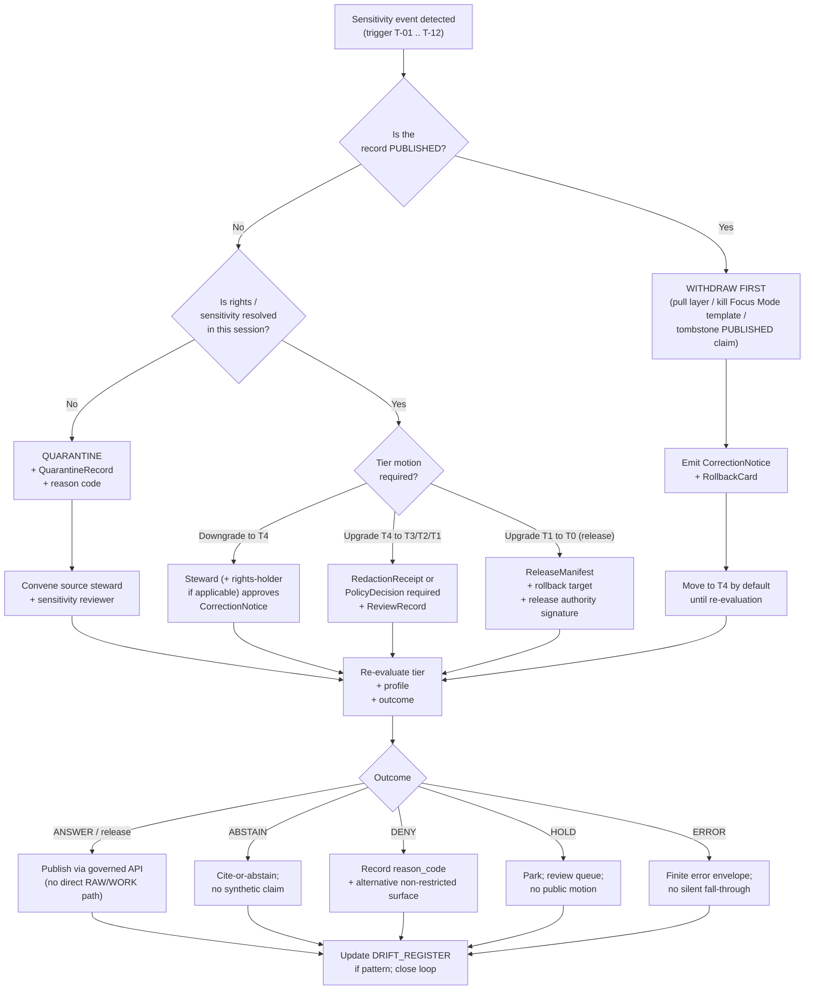

<!-- [KFM_META_BLOCK_V2]
doc_id: kfm://doc/runbook/sensitivity-escalation
title: Sensitivity Escalation Runbook
type: standard
version: v1
status: draft
owners: Sensitivity reviewer · Docs steward · subsystem owners
created: 2026-05-12
updated: 2026-05-12
policy_label: public
related:
  - docs/standards/SENSITIVITY_RUBRIC.md
  - docs/runbooks/REVOCATION.md
  - docs/runbooks/ui_ROLLBACK.md
  - docs/runbooks/governed_ai_ROLLBACK.md
  - docs/registers/DRIFT_REGISTER.md
  - docs/registers/VERIFICATION_BACKLOG.md
  - docs/adr/ADR-S-05-sensitivity-tier-scheme.md
  - policy/sensitivity/README.md
  - policy/redaction/profiles.yaml
tags: [kfm, runbook, sensitivity, redaction, rights, sovereignty, governance, fail-closed]
notes:
  - Path is PROPOSED until verified against mounted repo evidence (Directory Rules §6.1).
  - Sensitivity rubric 0–5 (CONFIRMED, [ENCY] C6-01) and tier scheme T0–T4 (PROPOSED, [ENCY-v1.1] §24.5) coexist; reconciliation is open per ADR-S-05.
  - All reason codes, gate names, and artifact shapes are PROPOSED doctrine pending mounted-repo verification.
[/KFM_META_BLOCK_V2] -->

# 🛡️ Sensitivity Escalation Runbook

> **What to do when a sensitivity, rights, sovereignty, or geoprivacy concern crosses a threshold that the default profile cannot safely handle — at intake, in pipeline, at release, or after publication.**


| Status | Owners | Last updated |
|---|---|---|
| Draft (PROPOSED runbook; doctrine-grounded) | Sensitivity reviewer · Docs steward · subsystem owners | 2026-05-12 |

---

## 🔎 Quick jump

- [1 · Scope and audience](#1--scope-and-audience)
- [2 · Repo fit and adjacent docs](#2--repo-fit-and-adjacent-docs)
- [3 · Doctrinal anchors](#3--doctrinal-anchors)
- [4 · What is an escalation?](#4--what-is-an-escalation)
- [5 · Escalation triggers](#5--escalation-triggers)
- [6 · Decision outcomes and reason codes](#6--decision-outcomes-and-reason-codes)
- [7 · Tier model and allowed motion](#7--tier-model-and-allowed-motion)
- [8 · Reviewer roles and separation of duties](#8--reviewer-roles-and-separation-of-duties)
- [9 · Escalation flow (decision tree)](#9--escalation-flow-decision-tree)
- [10 · Procedures by phase](#10--procedures-by-phase)
- [11 · Required receipts and artifacts](#11--required-receipts-and-artifacts)
- [12 · Communications and disclosure](#12--communications-and-disclosure)
- [13 · Drill cadence and validation](#13--drill-cadence-and-validation)
- [14 · Anti-patterns](#14--anti-patterns)
- [15 · Open questions](#15--open-questions)
- [16 · Appendices](#16--appendices)

> [!IMPORTANT]
> **Default posture: fail-closed.** Where any element of rights, sensitivity tier, sovereignty, consent, source role, or evidence cannot be confirmed *in this session*, the safe motion is **QUARANTINE / DENY / ABSTAIN / HOLD** — never silent promotion, never silent edit, never silent rollback. Reversibility is a publication requirement, not an afterthought. *(CONFIRMED doctrine — [BLD-COMP §§21–23]; [ENCY] §13; [ENCY-v1.1] §24.5.)*

---

## 1 · Scope and audience

### 1.1 What this runbook covers (CONFIRMED scope)

This runbook describes **escalation** — the act of routing a sensitivity-relevant decision *above* the default profile or default reviewer when one or more of the following has occurred:

- A record's required sensitivity treatment exceeds what the named redaction profile can satisfy.
- Rights, sovereignty, or consent posture is unresolved or has changed.
- A pre-RAW admission watcher, pipeline validator, policy gate, AI surface, or external report has flagged a sensitivity issue.
- A **PUBLISHED** claim is suspected of leaking sensitive content (precise sensitive geometry, living-person field, DNA segment, sacred-site coordinate, critical-infrastructure detail, etc.).

It does **not** replace:

- The **Sensitivity Rubric** *(PROPOSED home `docs/standards/SENSITIVITY_RUBRIC.md`)* — that defines the scale and label-to-profile lookups.
- The **named Redaction Profiles** *(PROPOSED home `policy/redaction/profiles.yaml`)* — those define the transforms and parameters.
- The **Revocation Runbook** *(PROPOSED home `docs/runbooks/REVOCATION.md`)* — that defines consent revocation, embargo, and cache invalidation downstream.
- Subsystem rollback runbooks (`ui_ROLLBACK.md`, `governed_ai_ROLLBACK.md`).

This runbook is the **bridge** that activates those primitives when a situation exceeds routine.

### 1.2 Audience

| Audience | Why they read this |
|---|---|
| **Source steward** | Knows when admission must escalate before RAW. |
| **Sensitivity reviewer** | Owns rubric application, tier transitions, RedactionReceipt approval. |
| **Domain steward** | Knows when domain validation finds a sensitivity-bearing record outside its lane's profile. |
| **Rights-holder representative** | Cultural, sovereign, or consent authority is engaged when needed. |
| **Release authority** | Knows when a release must HOLD or be withdrawn. |
| **Correction reviewer** | Owns CorrectionNotice and RollbackCard post-publication. |
| **AI surface steward** | Knows when Focus Mode must move from ANSWER to ABSTAIN / DENY. |
| **Docs steward** | Keeps this runbook, the rubric, the profiles catalog, and ADR-S-05 in sync. |
| **PR reviewers and on-call** | Have a sequenced procedure for the first 30 minutes of a suspected leak. |

[↩ back to top](#-sensitivity-escalation-runbook)

---

## 2 · Repo fit and adjacent docs

### 2.1 Where this runbook lives (PROPOSED)

```text
docs/
└── runbooks/
    └── SENSITIVITY_ESCALATION.md   ← this file (PROPOSED)
```

**Basis (PROPOSED):** Directory Rules §6.1 lists `docs/runbooks/` as the canonical home for *"ops procedures, rollback drills, validation runs."* This file is an ops procedure with rollback and review dimensions. The capitalized filename follows the pattern visible in the Whole-UI + Governed-AI expansion's runbook table (e.g., `ui_LOCAL_DEV.md`, `governed_ai_VALIDATION.md`); a cross-cutting runbook with no subsystem prefix is a **PROPOSED** convention pending Docs-steward review.

> [!NOTE]
> Until the mounted repo is verified, treat the path above as **PROPOSED**. If the repo already uses a different convention for cross-cutting runbooks (e.g., `docs/runbooks/sensitivity_escalation.md`, `docs/security/SENSITIVITY_ESCALATION.md`, or `docs/governance/...`), open a `docs/registers/DRIFT_REGISTER.md` entry rather than silently conforming or silently diverging.

### 2.2 Upstream / downstream

| Direction | Document or artifact | Relationship |
|---|---|---|
| Upstream (defines the rubric and profiles) | `docs/standards/SENSITIVITY_RUBRIC.md` *(PROPOSED)* | Defines the 0–5 / T0–T4 scale and label-to-profile lookups. |
| Upstream (defines transforms) | `policy/redaction/profiles.yaml` *(PROPOSED)* | Named profiles, parameters, seeds, embargo. |
| Upstream (lifecycle law) | `docs/doctrine/lifecycle-law.md` *(PROPOSED)* | RAW → WORK / QUARANTINE → … → PUBLISHED. |
| Upstream (trust membrane) | `docs/doctrine/trust-membrane.md` *(PROPOSED)* | Deny-by-default register; sensitive matrix. |
| Peer (post-publication) | `docs/runbooks/REVOCATION.md` *(PROPOSED)* | Revocation endpoints, tombstones, embargo cache invalidation. |
| Peer (subsystem withdraw) | `docs/runbooks/ui_ROLLBACK.md`; `docs/runbooks/governed_ai_ROLLBACK.md` *(PROPOSED)* | Pull layers, kill switches, AI adapter rollback. |
| Downstream (correction surface) | `release/` decisions; `data/published/`; `data/receipts/` *(PROPOSED)* | CorrectionNotice, RollbackCard, supersession. |
| Cross-cutting (open decision) | `docs/adr/ADR-S-05-sensitivity-tier-scheme.md` *(PROPOSED)* | Adopts T0–T4 (or amends) as canonical. |

### 2.3 What belongs here

- The **sequence** of escalation steps across phases.
- The **decision matrix** for tier transitions under escalation.
- The **artifacts** that must exist before each motion.
- The **reviewer separation** rules during escalation.
- **Drill** cadence and validation.

### 2.4 What does NOT belong here (exclusions)

| Excluded topic | Goes here instead |
|---|---|
| The sensitivity scale itself, label vocabulary, per-domain mapping | `docs/standards/SENSITIVITY_RUBRIC.md` *(PROPOSED)* |
| Named profile parameters (radius, k, ε, jitter seed rules) | `policy/redaction/profiles.yaml` *(PROPOSED)* |
| Per-domain deny-by-default rules | `docs/domains/<domain>/M_*.md` and `policy/domains/<domain>/` *(PROPOSED)* |
| Rego policy text | `policy/` *(PROPOSED)* |
| Schema shape for receipts | `schemas/contracts/v1/...` per ADR-0001 *(PROPOSED)* |
| Consent token / VC / DSSE plumbing | `docs/runbooks/REVOCATION.md` and `tools/consent/` *(PROPOSED)* |
| Subsystem rollback mechanics | `docs/runbooks/<subsystem>_ROLLBACK.md` *(PROPOSED)* |

[↩ back to top](#-sensitivity-escalation-runbook)

---

## 3 · Doctrinal anchors

The behavior in this runbook is grounded in the following CONFIRMED doctrine. Implementation maturity in any mounted repo is **UNKNOWN** this session.

> [!NOTE]
> Citation short-names follow Atlas v1.1 conventions: **[ENCY]** = Domain & Capability Encyclopedia; **[ENCY-v1.1]** = Domains Culmination Atlas v1.1; **[DIRRULES]** = Directory Rules; **[GAI]** = Governed AI; **[BLD-COMP]**, **[BLD-GREEN]**, **[IMPL-PIPE]** = Unified Implementation Architecture / Build Manual sections.

| Doctrine anchor | Substance | Source |
|---|---|---|
| Lifecycle invariant | RAW → WORK / QUARANTINE → PROCESSED → CATALOG / TRIPLET → PUBLISHED. Promotion is a **governed state transition, not a file move.** | [ENCY]; [DIRRULES] §0; [IMPL-PIPE] §7 |
| Fail-closed default for sensitive lanes | Sensitive exact locations, rare species, archaeological sites, sovereign material, living-person data, DNA / genomic material, infrastructure detail require fail-closed handling, generalization, redaction, staged access, delayed publication, or denial unless release support is explicit. | [BLD-COMP] §§21–23; [ENCY] §13 |
| Hazards boundary | KFM **must not** become an emergency-alert authority. This boundary holds at every tier and at every phase. | [DOM-HAZ]; [ENCY-v1.1] §24.5.2 |
| Sensitivity rubric (0–5) — CONFIRMED | `sensitivity_rank` ∈ {0 public, 1 common, 2 watchlist, 3 SINC / locally sensitive, 4 threatened / rare, 5 sacred / critical fail-closed}. Required on every node; persisted in catalog and evidence bundles. | [ENCY] C6-01 |
| Sensitivity tier scheme (T0–T4) — PROPOSED | T0 Open · T1 Generalized · T2 Reviewer · T3 Restricted · T4 Denied. Pending adoption by **ADR-S-05**. | [ENCY-v1.1] §24.5 |
| Finite outcomes | Every governed surface returns from a small, well-known set: **ANSWER · ABSTAIN · DENY · ERROR · HOLD** (plus validator-class **PASS · FAIL**). | [ENCY-v1.1] §24.3 |
| Cite-or-abstain | The default truth posture; AI cannot substitute generated language for an unresolved EvidenceBundle. | [GAI]; [ENCY] |
| Reversibility | Tier downgrades (toward less public) require only a CorrectionNotice + ReviewRecord. Tier upgrades require a transform receipt **and** a review record. | [ENCY-v1.1] §24.5.3 |
| Separation of duties | Release authority is distinct from authorship when materiality applies; correction reviewer is distinct from release authority for post-publication amendments. | [ENCY-v1.1] §24.7; operating-law invariant 9 |

> [!IMPORTANT]
> **Open reconciliation:** The 0–5 rubric (CONFIRMED, [ENCY] C6-01) and the T0–T4 tier scheme (PROPOSED, [ENCY-v1.1] §24.5) coexist in current doctrine. Until **ADR-S-05** settles the canonical form, this runbook uses **T0–T4** for tier motion (because it is uniform across domains) and references the 0–5 rank when reading existing catalog records. Mapping is documented in [§16.2 Appendix B](#162-appendix-b--rank-0-5--tier-t0-t4-mapping-proposed).

[↩ back to top](#-sensitivity-escalation-runbook)

---

## 4 · What is an escalation?

An **escalation** is the act of moving a sensitivity decision out of the routine path because the routine path can no longer guarantee a safe outcome.

The routine path is:

- A source arrives with a known rights / sensitivity tag → the source descriptor sets the default tier → normalization applies the relevant named profile → the validator and policy gate pass → the record is catalogued and (if applicable) published behind the governed API.

An escalation is required when **any** of the following holds:

1. **The default profile does not satisfy the obligation.** E.g., a fauna occurrence record arrives with a sensitivity tag that the public profile cannot generalize enough to be safe (e.g., a roost or nesting site near a small extent of suitable habitat).
2. **Rights or sovereignty posture has changed.** E.g., a community partner withdraws consent; a vendor's terms-of-service or solvency changes (cf. the 23andMe Chapter 11 reference case, [ENCY] C9-07).
3. **Detection in flight.** A pipeline validator returns `SENSITIVITY_UNRESOLVED` or `RIGHTS_UNKNOWN`.
4. **Detection after publication.** A PUBLISHED claim, layer, drawer payload, or AI answer is suspected of leaking sensitive content.
5. **Disagreement between reviewers.** Two stewards reach incompatible tier conclusions on the same record.
6. **AI flagging.** A Focus Mode template returns `DENY` more often than expected (or, more dangerously, returns `ANSWER` for a query that should have been denied) and the AI surface steward requests review.
7. **Boundary breach.** A request is observed that asks KFM to perform a function it is doctrinally prohibited from performing (e.g., act as an emergency-alert authority — [DOM-HAZ]).

In all of these, the escalation is the **named, recorded act** of moving the decision up the reviewer chain and emitting the receipts that prove the move happened.

[↩ back to top](#-sensitivity-escalation-runbook)

---

## 5 · Escalation triggers

The table below names the most common triggers, the phase in which they tend to fire, and the immediate first response.

| # | Trigger | Phase where it fires | Immediate first response |
|---|---|---|---|
| T-01 | Source descriptor missing rights, sensitivity, or source-role | Pre-RAW admission | Hold at admission; emit `event_envelope`/`prefilter_output` (PROPOSED); refuse RAW write. |
| T-02 | Schema validator returns `SENSITIVITY_UNRESOLVED` | Normalization (RAW → WORK / QUARANTINE) | Move to **QUARANTINE** with reason; never silent promote. |
| T-03 | Geometry precision exceeds profile budget for the record's rank | Validation (WORK → PROCESSED) | Stay in WORK; emit `ValidationReport` failure; require steward review. |
| T-04 | Rights-holder representative requests embargo, withdrawal, or sovereignty review | Any phase | Move object **down** the tier ladder (toward T4 / DENY); emit `CorrectionNotice` if PUBLISHED. |
| T-05 | Catalog closure detects a public-layer footprint overlaps a sensitive site | Catalog closure (PROCESSED → CATALOG / TRIPLET) | HOLD at PROCESSED; reshape generalization; re-validate. |
| T-06 | Release authority observes missing rollback target or missing ReviewRecord | Release (CATALOG / TRIPLET → PUBLISHED) | DENY release; supply rollback target; supply ReviewRecord. |
| T-07 | Post-publication detection: suspected leak of sensitive content | Correction (PUBLISHED → PUBLISHED′) | **Immediate withdraw**: see [§10.5](#105-phase-published--suspected-leak). |
| T-08 | Focus Mode answer flagged for citation gap or sensitive content | Governed AI | AI surface steward: switch template to ABSTAIN; preserve `AIReceipt`; convene review. |
| T-09 | Vendor distress signal on upstream consent-relevant data (cf. 23andMe-class event) | Cross-phase | Convene consent-revalidation drill ([ENCY] C9-07); embargo affected records. |
| T-10 | Boundary breach: KFM invoked as life-safety / alert authority | Any phase | DENY at runtime; no exception. ([DOM-HAZ]; [ENCY-v1.1] §24.5.2.) |
| T-11 | Reviewer disagreement on tier | Validation / Catalog / Release | Escalate to next role (sensitivity reviewer → rights-holder representative → release authority); record both opinions in `ReviewRecord`. |
| T-12 | Pre-RAW watcher (STAC / GBIF / external feed) flags sensitive geometry | Pre-RAW admission | Refuse RAW write; create `QuarantineRecord`; notify source steward. |

> [!CAUTION]
> Triggers **T-04**, **T-07**, **T-09**, and **T-10** are time-sensitive. The first response above must run *before* the deeper investigation. **Withdraw first, investigate second** is the safe ordering.

[↩ back to top](#-sensitivity-escalation-runbook)

---

## 6 · Decision outcomes and reason codes

Every escalation step terminates in one of the finite outcomes below. The outcomes are CONFIRMED doctrine; the reason codes are **PROPOSED**.

### 6.1 Outcome set (CONFIRMED — [ENCY-v1.1] §24.3.1)

| Outcome | When it applies | Required receipt |
|---|---|---|
| **ANSWER** | Evidence sufficient; policy permits; review (if required) recorded; release state permits. | `EvidenceBundle` + `PolicyDecision` + `ReleaseManifest`. |
| **ABSTAIN** | Evidence insufficient, citation impossible, or stale; no released alternative found. | `AIReceipt` (for AI) or equivalent non-substantive note. |
| **DENY** | Policy, rights, sensitivity, or release state forbids the answer. Sensitive lanes default here. | `PolicyDecision` with reason code; `AIReceipt` if AI surface. |
| **ERROR** | The governed surface cannot evaluate (missing schema, contract violation, infrastructure failure). | Finite error envelope; never silent fall-through. |
| **HOLD** | Promotion / release / correction is paused pending steward, rights-holder, or policy review. | `ReviewRecord` pending; `PolicyDecision` = hold. |

### 6.2 Reason-code catalog (PROPOSED — [ENCY-v1.1] §24.6.3)

| Reason code (PROPOSED) | Family | Gates where it fires | Recovery path |
|---|---|---|---|
| `SENSITIVITY_UNRESOLVED` | Rights / sensitivity unresolved | Admission · Validation · Catalog · Release | Steward review; rights resolution; tier reassignment. |
| `RIGHTS_UNKNOWN` | Rights / sensitivity unresolved | Admission · Validation · Catalog · Release | Steward review; rights resolution; tier reassignment. |
| `MISSING_REVIEW` | Required artifact missing | Catalog · Release | Run required review; supply `ReviewRecord`. |
| `MISSING_RECEIPT` | Required artifact missing | Normalization · Validation · Catalog · Release | Re-emit missing receipt; re-validate. |
| `REVIEW_NEEDED` / `REVIEW_INSUFFICIENT` / `REVIEW_REJECTED` | Review state inadequate | Catalog · Release | Run required review; supply `ReviewRecord`. |
| `ROLLBACK_TARGET_MISSING` | Release infrastructure error | Release | Supply rollback target. |
| `CORRECTION_DERIVATIVES_UNRESOLVED` | Correction lineage broken | Correction | Resolve derivatives; supersession entry. |
| `ROLE_COLLAPSE` / `ROLE_DOWNCAST_FORBIDDEN` | Source-role collapse risk | Validation · Catalog · Release | Restore source role; refuse upcast. |
| `SOVEREIGNTY_REVIEW_PENDING` *(PROPOSED, escalation-specific)* | Rights-holder process | Catalog · Release · Correction | Convene rights-holder representative; record `ReviewRecord`. |
| `EMBARGO_ACTIVE` *(PROPOSED, escalation-specific)* | Time-bound suppression | Catalog · Release | Wait for embargo expiry; re-evaluate. |
| `HAZARDS_BOUNDARY_VIOLATION` *(PROPOSED, escalation-specific)* | Boundary breach | Any | DENY at runtime; no recovery — boundary holds. |

> [!TIP]
> When in doubt, **emit a `PolicyDecision` with the narrowest applicable reason code** rather than a generic `DENY`. The reason code is what makes drift, abstention rate, and denial distribution legible in dashboards. *(Cf. [ENCY-v1.1] §24.11.4 — AI surface health indicators.)*

[↩ back to top](#-sensitivity-escalation-runbook)

---

## 7 · Tier model and allowed motion

### 7.1 Tier definitions (PROPOSED — [ENCY-v1.1] §24.5.1)

| Tier | Name | Definition | Default audience |
|---|---|---|---|
| **T0** | Open | Public-safe; no transformations required. | Any public client via governed API. |
| **T1** | Generalized | Public-safe only after generalization, fuzzing, aggregation, or redaction; transform reviewed and recorded. | Any public client via governed API. |
| **T2** | Reviewer | Released only to authenticated reviewers or domain stewards; policy-bounded; correction path active. | Stewards, reviewers, named collaborators. |
| **T3** | Restricted | Released only under named agreement (rights, sovereignty, or consent) and recorded. | Named authorized parties only. |
| **T4** | Denied | Not released to any audience; the existence of a record may be released only as steward review permits. | — |

### 7.2 Allowed motion (PROPOSED — [ENCY-v1.1] §24.5.3)

| From → To | Required artifact | Required reviewer | Reversibility |
|---|---|---|---|
| **T4 → T3** | `PolicyDecision` + `ReviewRecord` + named agreement | Steward + rights-holder where applicable | Reversible: agreement revocation returns to T4 with `CorrectionNotice`. |
| **T4 → T2** | `PolicyDecision` + `ReviewRecord` | Steward | Reversible: review revocation returns to T4. |
| **T4 → T1** | `RedactionReceipt` + `ReviewRecord` | Steward | Reversible: correction may demote a published T1 to T4. |
| **T3 → T2** | `PolicyDecision` + `ReviewRecord` | Steward | Reversible. |
| **T2 → T1** | `RedactionReceipt` + `ReviewRecord` | Steward | Reversible. |
| **T1 → T0** | `ReleaseManifest` + `ReviewRecord` | Steward + release authority | Reversible via `RollbackCard`. |
| **Any → T4 (downgrade)** | `CorrectionNotice` + `ReviewRecord` | Steward + rights-holder where applicable | Always permitted; precedes derivative invalidation. |

> [!IMPORTANT]
> **Reading note (CONFIRMED doctrine):** A tier *upgrade* (toward more public) always needs **both** a transform receipt **and** a review record. A tier *downgrade* (toward less public) never needs both — a `CorrectionNotice` alone is sufficient to remove or restrict. Escalation almost always involves a **downgrade first, investigate second** posture.

[↩ back to top](#-sensitivity-escalation-runbook)

---

## 8 · Reviewer roles and separation of duties

Roles below are PROPOSED per [ENCY-v1.1] §24.7. Mounted-repo verification is **NEEDS VERIFICATION**.

| Role | Scope | Owns receipts |
|---|---|---|
| **Source steward** | `SourceDescriptor` lifecycle; admission gate. | `SourceDescriptor`; `QuarantineRecord` (admission-side). |
| **Domain steward** | Domain contracts, schemas, validators. | `ValidationReport` for domain. |
| **Sensitivity reviewer** | Redaction, generalization, withholding, tier decisions. | `RedactionReceipt`; tier-transition `PolicyDecision`. |
| **Rights-holder representative** | Sovereignty, cultural heritage, consent. | `ReviewRecord` (rights-holder leg). |
| **Release authority** | `PUBLISHED` transitions; rollback authorization. Distinct from authorship when materiality applies. | `ReleaseManifest`; `RollbackCard`. |
| **Correction reviewer** | Post-publication amendment review. Distinct from release authority. | `CorrectionNotice` approval. |
| **AI surface steward** | Focus Mode templates, AIReceipts, policy bindings. | `AIReceipt` audit sampling. |
| **Docs steward** | This runbook; rubric; drift register; ADR index. | Document version control; lineage entries. |

### 8.1 Separation rules during escalation

> [!WARNING]
> **No single role may both author and approve a release-significant motion when materiality applies.** Materiality applies whenever the motion crosses **T2 → T1** or **T1 → T0**, whenever the record involves an open ADR-S-05 dimension, and whenever the motion changes any domain default named in the [ENCY-v1.1] §24.5.2 per-domain tier matrix.

| Motion under escalation | Same actor may author + approve? | Required separation |
|---|---|---|
| Quarantine on admission | Yes | Source steward sufficient. |
| Stay-in-WORK on validator failure | Yes | Domain steward sufficient. |
| T4 → T2 / T1 / T0 release motion under escalation | **No** | Author ≠ release authority; sensitivity reviewer must sign `RedactionReceipt`. |
| Sovereign / cultural / consent motion | **No** | Rights-holder representative must be on record. |
| Post-publication CorrectionNotice | **No** | Correction reviewer ≠ original release authority. |
| Rollback authorization | **No** | Release authority + correction reviewer co-sign. |
| Focus Mode template change with policy effect | **No** | AI surface steward + sensitivity reviewer co-review. |

[↩ back to top](#-sensitivity-escalation-runbook)

---

## 9 · Escalation flow (decision tree)

The diagram below shows the **doctrinal** flow. Implementation surfaces (routes, queues, dashboards) are **PROPOSED** and **NEEDS VERIFICATION** against a mounted repo.



> [!NOTE]
> The diagram is doctrinal. Concrete queue names, dashboards, role logins, and notification channels are **NEEDS VERIFICATION** against the mounted repo and (where applicable) deployment topology.

[↩ back to top](#-sensitivity-escalation-runbook)

---

## 10 · Procedures by phase

Each phase below is a self-contained mini-procedure. **Use the one that matches where the trigger fired.** When a trigger spans phases, run the latest applicable procedure first (because the escalation must protect the most-public surface first).

### 10.1 Phase: pre-RAW admission

**When:** A watcher, intake script, or PR proposes admission of a new source, dataset, or record family.

1. **Read the `SourceDescriptor`.** If `rights_status`, `source_role`, `sensitivity`, or `cadence` is `unknown` or missing → **refuse RAW write**.
2. **Emit a `QuarantineRecord`** *(PROPOSED schema home `schemas/contracts/v1/...`)* with reason `RIGHTS_UNKNOWN` or `SENSITIVITY_UNRESOLVED`.
3. **Notify the source steward.** Open an entry in `docs/registers/VERIFICATION_BACKLOG.md` if the question is structural; otherwise route via the steward's queue.
4. **Do not log raw payload contents.** Quarantine carries pointers and minimal metadata only.
5. **Record outcome** as `ERROR` (admission infrastructure could not evaluate) or `DENY` (admission refused).

> [!NOTE]
> **Quarantine is not a publishable staging area.** ([ENCY] Appendix E.) Movement out of QUARANTINE requires the same rubric / receipt discipline as fresh admission.

### 10.2 Phase: pipeline (RAW → WORK → PROCESSED)

**When:** A normalization, validation, or catalog-closure step detects a sensitivity-relevant condition.

1. **Identify the failing gate** (Normalization, Validation, or Catalog closure) and the reason code.
2. **Stay in the prior state.** Never silent-promote.
3. **Emit the failure as a `ValidationReport` failure** with deterministic inputs and the failure list.
4. **If the record is already in WORK and the failure is sensitivity-related:** move to **QUARANTINE** with reason; do not retry transparently.
5. **Convene the sensitivity reviewer + domain steward.** If sovereignty / cultural / consent dimensions apply, also convene the rights-holder representative.
6. **Decide tier motion** (see [§7.2](#72-allowed-motion-proposed--ency-v11-2453)) and required receipts.
7. **Re-run validators** against the chosen tier and profile. Negative-state fixtures must pass.
8. **Outcome:** `PASS` (re-enter WORK / PROCESSED), `FAIL` (stay in WORK / QUARANTINE), or `HOLD` (await review).

### 10.3 Phase: catalog closure (PROCESSED → CATALOG / TRIPLET)

**When:** EvidenceRefs fail to resolve; the catalog matrix detects a public-layer footprint overlap with a sensitive site; or a digest mismatch surfaces.

1. **HOLD at PROCESSED.** No public edge is created.
2. **Verify EvidenceRef resolution.** Every `EvidenceRef` must resolve to an `EvidenceBundle` *in this session* — pointer presence is not resolution.
3. **Inspect the proposed catalog entry's geometry / metadata.** Confirm the entry's tier matches the strictest applicable record.
4. **Apply the strictest applicable profile.** Where multiple profiles apply, use the more restrictive.
5. **If steward review is required for the layer / collection:** convene; record `ReviewRecord`.
6. **Outcome:** `PASS` to CATALOG / TRIPLET, or structured `FAIL` with reason and recovery path.

### 10.4 Phase: release (CATALOG / TRIPLET → PUBLISHED)

**When:** A release queue presents a candidate; or release authority observes a missing artifact during the release rehearsal.

1. **Verify the `ReleaseManifest`.** Contents, digests, `evidence_refs`, signatures, and **rollback target** must be present.
2. **Verify `ReviewRecord` presence** for any tier ≥ T2 motion and for any release that crosses a domain default named in [ENCY-v1.1] §24.5.2.
3. **Verify separation of duties.** Author ≠ release authority for material motions.
4. **If any check fails:** `DENY` with the narrowest applicable reason code. Do **not** publish a partial release.
5. **If all checks pass:** publish via the governed API path. Update `release/` decision records and `data/published/` artifacts in lockstep.
6. **Post-release rehearsal:** within the drill cadence ([§13](#13--drill-cadence-and-validation)), exercise the `RollbackCard` against the release to confirm reversibility.

### 10.5 Phase: PUBLISHED — suspected leak

> [!CAUTION]
> This is the **highest-priority** branch. The default response is **withdraw first, investigate second**. Reversibility is the property KFM guarantees; reversibility is forfeited if a leak is left visible while reviewers debate.

1. **Withdraw the affected public surface.**
   - For a tile / layer: pull from the governed API and the layer manifest. *(See `docs/runbooks/ui_ROLLBACK.md` — PROPOSED.)*
   - For a Focus Mode template: switch to `ABSTAIN`; preserve `AIReceipt`; remove from rotation. *(See `docs/runbooks/governed_ai_ROLLBACK.md` — PROPOSED.)*
   - For an Evidence Drawer payload: mark stale; serve a withdrawn-state placeholder.
   - For a Story snapshot / export: invalidate the snapshot; emit a stale-state announcement.
2. **Emit a `CorrectionNotice`** referencing the prior `ReleaseManifest`, the defect class (evidence, source-role, rights, sensitivity, geometry, temporal, policy, validation, rendering, API, or AI-output related), and the derivative invalidation list.
3. **Emit a `RollbackCard`** identifying the prior safe release (if one exists) or the explicit reason no rollback target applies. **Rollback must not be a hidden file copy.**
4. **Move the record's tier to T4 by default** until re-evaluation.
5. **Convene the full reviewer chain:** sensitivity reviewer + rights-holder representative + release authority + correction reviewer.
6. **Investigate the failure mode:** how did the rubric / profile / gate let this through? Open a `docs/registers/DRIFT_REGISTER.md` entry naming the affected paths and the suspected gate failure.
7. **Add a negative-path fixture** that reproduces the leak shape, so policy / validator regression cannot recur silently. *(PROPOSED home `tests/fixtures/sensitivity/negative/`.)*
8. **Re-release through the governed path** only after re-running every applicable gate (Admission → Validation → Catalog → Release) against the corrected artifact. Re-release is a fresh release, not an edit of the withdrawn one.
9. **Document the incident** in `docs/security/` and `docs/registers/DRIFT_REGISTER.md` *(both PROPOSED)*.

### 10.6 Phase: Focus Mode (governed AI)

**When:** An AI surface answer is flagged for citation gap, over-disclosure, or unexpected denial pattern.

1. **AI surface steward switches the affected template to `ABSTAIN`.** The `AIReceipt` is preserved with `reason_code`.
2. **No browser → model direct path is opened** under any circumstance, even for "diagnostic" or "manual review" reasons. *(See `docs/architecture/governed-ai/BOUNDARIES.md` — PROPOSED.)*
3. **Inspect the prompt scope** in the `AIReceipt`: was the evidence retrieval correct? did the `EvidenceBundle` resolve? did the policy gate run?
4. **If a sensitivity-relevant claim leaked into a Focus Mode answer:** treat as a [§10.5](#105-phase-published--suspected-leak) PUBLISHED leak.
5. **If the issue is a high `DENY` rate without leakage:** open an entry against the relevant template; do not weaken the policy without sensitivity-reviewer co-sign.
6. **Re-enable the template** only after a re-validation round + audit sample passes.

[↩ back to top](#-sensitivity-escalation-runbook)

---

## 11 · Required receipts and artifacts

Every escalation step must leave a paper trail. The matrix below lists what to emit per motion. All shapes are PROPOSED per [ENCY-v1.1] §24.2. Schema home is **PROPOSED** under `schemas/contracts/v1/...` per ADR-0001.

| Motion under escalation | `SourceDescriptor` | `TransformReceipt` | `RedactionReceipt` | `ValidationReport` | `PolicyDecision` | `ReviewRecord` | `ReleaseManifest` | `CorrectionNotice` | `RollbackCard` | `AIReceipt` |
|---|:---:|:---:|:---:|:---:|:---:|:---:|:---:|:---:|:---:|:---:|
| Admission refusal | ● | | | | ● | | | | | |
| Move to QUARANTINE | ● | | | ● | ● | | | | | |
| Stay-in-WORK after sensitivity failure | ● | ● | (○) | ● | ● | | | | | |
| Tier downgrade (any → T4) | ● | | | | ● | ● | | ● *(if PUBLISHED)* | ● *(if PUBLISHED)* | |
| Tier upgrade T4 → T2 / T1 | ● | (●) | ● *(for T1)* | ● | ● | ● | | | | |
| Tier upgrade T1 → T0 (release) | ● | (●) | ● *(if T1 was generalized)* | ● | ● | ● | ● | | | |
| Post-publication correction | ● | (●) | (●) | ● | ● | ● | (●) | ● | (●) | (●) |
| Rollback authorization | ● | | | | ● | ● | | ● | ● | |
| Focus Mode template withdrawal | | | | | ● | ● | | | | ● |
| Sovereign / cultural / consent agreement | ● | | | | ● | ● *(rights-holder leg)* | | | | |

**Legend:** ● = required; (●) = required if the underlying transform / publication / AI step applies; (○) = required if the validator class is `RedactionReceipt`-bearing.

> [!IMPORTANT]
> **EvidenceRef must resolve, not just exist.** A receipt that references an `EvidenceBundle` only by pointer, without the bundle resolving in this session, does not close the gate. *(Cf. [ENCY-v1.1] §24.6.2 universal closure rule.)*

[↩ back to top](#-sensitivity-escalation-runbook)

---

## 12 · Communications and disclosure

Sensitivity escalations frequently involve people outside the immediate engineering team: rights-holders, partner stewards, named consent subjects, and (in serious cases) the broader public.

| Audience | Trigger | Channel (PROPOSED — NEEDS VERIFICATION) | Content |
|---|---|---|---|
| Source steward | T-01, T-02, T-09, T-12 | Internal queue + email | Trigger, affected source(s), required action. |
| Sensitivity reviewer | All | Internal queue | Same + proposed tier / profile change. |
| Rights-holder representative | T-04, sovereign / cultural cases | Direct contact per source dossier | Plain-language statement of the situation; ask, do not assume, the appropriate response. |
| Named consent subject | T-04, T-09 if subject-identifiable | Per consent record's notification rule | Notice of embargo / withdrawal / re-validation. |
| Release authority | T-05, T-06, T-07 | Internal queue | Required to authorize release or withdrawal. |
| Public audience | T-07, only after withdrawal is complete and `CorrectionNotice` is signed | Public correction page; release notes | Plain-language statement: what was withdrawn, why, what the rollback target is, what is next. |
| Press / regulator | Reserve; never first-line | Communications lead | Required if law / sovereignty / press inquiry forces it. |

> [!WARNING]
> **Do not publish a "we are investigating" public statement before the affected surface is withdrawn.** Public attention to an unfixed surface increases the harm the escalation is trying to contain. Withdraw → record → notify → publish corrected → communicate.

> [!CAUTION]
> **Never log or store raw sensitive payloads in incident channels.** Use pointers, hashes, and identifiers — not the underlying data. This is true for chat, email, ticketing, and post-mortem documents alike. *(Cf. [ENCY] §13 — sensitive / deny-by-default register; New Ideas 5-8-26 — DSSE-signed receipts hold *pointers*, not PII.)*

[↩ back to top](#-sensitivity-escalation-runbook)

---

## 13 · Drill cadence and validation

Doctrine is enforceable only when exercised. The cadence below is **PROPOSED**; calibrate against real review-aged-out incidence ([ENCY-v1.1] §24.11) once instrumented.

| Drill | Cadence (PROPOSED) | Pass criterion | Owner |
|---|---|---|---|
| Withdrawal drill: simulated leak | Quarterly | Affected surface pulled and `CorrectionNotice` + `RollbackCard` emitted within target window. | Release authority + correction reviewer. |
| Rollback rehearsal | Per release of material scope | `RollbackCard` exercised end-to-end against a non-production replica. | Release authority. |
| Quarantine-to-publish drill | Quarterly | A QUARANTINE record traverses Validation → Catalog → Release with full receipt chain, no shortcut. | Sensitivity reviewer + domain steward. |
| AI ABSTAIN / DENY audit sampling | Continuous (% of answers) | Sampled `AIReceipt`s confirm cite-or-abstain; synthetic-claim incidence ≈ 0. | AI surface steward. |
| Sovereign / cultural review drill | Per source family with sovereign content; at least annually | Rights-holder representative participates; review-aged-out incidence not regressing. | Rights-holder representative + sensitivity reviewer. |
| Vendor-watchlist tabletop (e.g., 23andMe-class) | Annually + on any watchlist alert | Consent-revalidation drill completes; affected records embargoed. | Source steward + sensitivity reviewer. ([ENCY] C9-07.) |

### 13.1 Validation expectations (PROPOSED)

- Every escalation procedure in [§10](#10--procedures-by-phase) must have at least one fixture under the **PROPOSED** path `tests/fixtures/sensitivity/` that exercises a `DENY`/`ABSTAIN`/`HOLD` outcome.
- Negative-state fixtures are required: `missing_review.json`, `rights_unknown.json`, `restricted_exact_geometry.json`, `stale_evidence.json`, `publication_before_review.json`, `rollback_target_missing.json`, `hazards_boundary_violation.json`.
- CI must run policy parity: same policy bundle gates CI and runtime. *(Cf. [ENCY] C5-03.)*

> [!NOTE]
> Fixture and policy paths above are **PROPOSED**. Verify against `schemas/contracts/v1/`, `policy/`, and `tests/fixtures/` in the mounted repo before treating them as canonical.

[↩ back to top](#-sensitivity-escalation-runbook)

---

## 14 · Anti-patterns

> [!WARNING]
> Each item below is a known failure mode. Treat its appearance in a PR or in an ongoing incident as a stop-condition.

| Anti-pattern | Why it fails | Correct posture |
|---|---|---|
| Silent edit of a PUBLISHED claim | Forfeits reversibility; obscures lineage. | Withdraw → `CorrectionNotice` → re-release. |
| Hidden file copy as "rollback" | Rollback target unverifiable; receipts inconsistent. | `RollbackCard` + governed release path. |
| Bypassing the governed API "just for review" | Trust membrane breach; review surface becomes a public side-channel. | Reviewer surface is governed; no direct RAW / WORK / model path. |
| Routine motion past T2 → T1 with author == release authority | Loses separation of duties; auditability collapses. | Distinct release authority. |
| Treating QUARANTINE as a publishable staging area | Quarantine semantics break; future drift. | QUARANTINE → re-run admission discipline. |
| Asking AI to "summarize what we redacted" with the redacted content in the prompt | Re-introduces the redacted content into a generated artifact; AI output is non-canonical and may be cached. | Stewards summarize; AI does not narrate sensitive removals. |
| Logging the raw sensitive payload in the incident ticket | Recreates the leak in a less-monitored surface. | Pointers, hashes, identifiers only. |
| Lowering a rare-species `sensitivity_rank` to publish a "richer" map | Rank rubric is doctrinally enforced; lowering is a sovereign / steward decision, not a UX decision. | Generalize via profile; preserve rank. |
| Using KFM as an alert authority "just this once" | Doctrinal boundary; no exception, ever. | DENY at runtime; redirect to the legitimate alert authority. ([DOM-HAZ].) |
| Recording an escalation outcome without a reason code | Dashboards lose drift visibility; future audits cannot pattern-match. | Narrowest applicable reason code from [§6.2](#62-reason-code-catalog-proposed--ency-v11-2463). |

[↩ back to top](#-sensitivity-escalation-runbook)

---

## 15 · Open questions

These are tracked here so the runbook does not silently pretend they are settled. Each should eventually resolve via an ADR, a `docs/registers/VERIFICATION_BACKLOG.md` entry, or a sensitivity-reviewer decision.

1. **Tier scheme adoption.** ADR-S-05 *(PROPOSED)* is the canonical home for adopting T0–T4 (or revising). Until accepted, this runbook uses T0–T4 with a 0–5 mapping in [Appendix B](#162-appendix-b--rank-0-5--tier-t0-t4-mapping-proposed).
2. **Domain-specific ranks.** The 0–5 rubric was developed with biodiversity in mind; mapping to people, archaeology, and infrastructure may need additional ranks or richer obligation descriptors. *(Cf. [ENCY] C6-01 — Tensions.)*
3. **Tombstone vs erasure boundary.** Right-to-be-forgotten obligations may require true deletion of personal data; tombstones satisfy explainability but not erasure. *(Cf. [ENCY] C5-09; tracked in `docs/runbooks/REVOCATION.md` — PROPOSED.)*
4. **Notification format.** How are watchlist events transmitted to affected users when KFM is not the consent-collector of record? *(Cf. [ENCY] C9-07.)*
5. **Quantitative thresholds.** Per-domain epsilon (ε) for differential-privacy aggregates; per-class k for k-anonymity; per-class jitter magnitude; debounce windows for revocation cache invalidation. *(Cf. [ENCY] §2.4 — corpus is thin on quantitative thresholds.)*
6. **Drill targets.** The target windows in [§13](#13--drill-cadence-and-validation) are **PROPOSED**; calibrate once review-aged-out incidence is instrumented.

[↩ back to top](#-sensitivity-escalation-runbook)

---

## 16 · Appendices

### 16.1 Appendix A — Glossary

<details>
<summary>Expand glossary (selected terms used in this runbook)</summary>

| Term | Definition | Source |
|---|---|---|
| `sensitivity_rank` | A 0–5 integer required on every node; persisted in catalog records and evidence bundles. | [ENCY] C6-01 |
| Sensitivity tier (T0–T4) | A 5-level uniform tier scheme PROPOSED for adoption across domains. | [ENCY-v1.1] §24.5 |
| Named redaction profile | Versioned, named transform with a stable identifier (e.g., `profile:sinc-obscure-10km`). Each profile ships method docs, a Rego fixture, and a verifier. | [ENCY] C6-02 |
| `RedactionReceipt` | Records a redaction / generalization step: policy reference, method, kept fields, removed fields, geometry transform, reviewer. | [ENCY-v1.1] §24.2 |
| `ReviewRecord` | Records a steward, rights-holder, or policy review: reviewer, role, decision (ALLOW / RESTRICT / DENY / HOLD), evidence refs, policy ref, time. | [ENCY-v1.1] §24.2 |
| `PolicyDecision` | Records a policy evaluation: rule, target object, decision, reason code, time, evidence refs. | [ENCY-v1.1] §24.2 |
| `CorrectionNotice` | Records that a published claim was corrected: prior release ref, change summary, invalidates list, review ref, time. | [ENCY-v1.1] §24.2 |
| `RollbackCard` | Records a rollback decision and the targeted prior release. | [ENCY-v1.1] §24.2 |
| `AIReceipt` | Records a governed AI answer: prompt scope, evidence refs, policy ref, outcome class, reason code, model id, time. | [ENCY-v1.1] §24.2 |
| `EvidenceBundle` / `EvidenceRef` | The bundle is the resolved evidence object; the ref is the pointer. Refs must resolve, not just exist. | [ENCY]; [ENCY-v1.1] §24.6.2 |
| Trust membrane | The doctrinal forbidding of any public client, normal UI surface, or released AI surface reaching RAW / WORK / QUARANTINE / canonical stores / model runtimes. | [ENCY-v1.1] §24.6.2 |
| Cite-or-abstain | KFM's default truth posture: where evidence is insufficient, abstain rather than invent. | [GAI]; [ENCY] |
| Fail-closed | The default posture for sensitive lanes: QUARANTINE / DENY / ABSTAIN / HOLD when in doubt. | [BLD-COMP] §§21–23 |

</details>

### 16.2 Appendix B — Rank 0–5 ↔ tier T0–T4 mapping (PROPOSED)

<details>
<summary>Expand PROPOSED mapping (pending ADR-S-05)</summary>

> [!IMPORTANT]
> This mapping is **PROPOSED**, not CONFIRMED. The 0–5 rubric is CONFIRMED ([ENCY] C6-01) at the record level. The T0–T4 tier is PROPOSED ([ENCY-v1.1] §24.5) at the publication-motion level. They describe related but not identical things — one is a *label on the record*, the other is a *posture toward the audience*. ADR-S-05 should settle whether T0–T4 supersedes 0–5 or whether both persist as orthogonal axes.

| `sensitivity_rank` (CONFIRMED — [ENCY] C6-01) | Indicative tier under default profile (PROPOSED) | Default audience |
|---|---|---|
| **0** Public / open | **T0** Open | Any public client. |
| **1** Common non-sensitive | **T0** Open *(or T1 if domain rules require generalization)* | Any public client. |
| **2** Watchlist | **T1** Generalized | Any public client via generalized layer. |
| **3** SINC / locally sensitive (default profile `profile:sinc-obscure-10km`) | **T1** Generalized | Any public client via generalized layer. |
| **4** Threatened / rare (strict mask or embargo) | **T2** Reviewer or **T4** Denied *(domain-specific)* | Reviewer / steward — generalized public derivative may exist at T1. |
| **5** Sacred / critical (fail-closed; no map / timeline exposure) | **T4** Denied | None by default; T3 only under explicit named authorization. |

The mapping is intentionally not bijective: a rank-4 record may sit at T4 in one domain and at T2-with-T1-derivative in another, because the underlying obligation is rubric-bound but the publication motion is tier-bound. Domain-specific overlays in [ENCY-v1.1] §24.5.2 govern.

</details>

### 16.3 Appendix C — Per-domain reference (PROPOSED snapshot)

<details>
<summary>Expand per-domain default tiers (snapshot from [ENCY-v1.1] §24.5.2)</summary>

Where the table below conflicts with the v1.0 per-domain F. tables, **v1.0 governs** and the conflict should be filed against the v1.1 supplement.

| Domain / object class | Default tier (PROPOSED) | Required gates on tier upgrade |
|---|---|---|
| Archaeology — site location | T4 | `RedactionReceipt` + `ReviewRecord` + `PolicyDecision`. |
| Archaeology — human remains / sacred sites | T4 | Sovereignty review + `ReviewRecord` + `PolicyDecision`. **No transform releases this to T0.** |
| Fauna — sensitive occurrence | T4 | Geoprivacy generalization + `RedactionReceipt` → T1. |
| Fauna — range polygon | T1 | `AggregationReceipt` or `RedactionReceipt`. |
| Flora — rare or culturally sensitive plant location | T4 | Generalized geometry + steward review → T2 or T1. |
| People / DNA — living-person fields | T4 | Aggregation by tract or county + `AggregationReceipt` → T1. |
| People / DNA — raw DNA segment data | T4 | **No transform releases this to a public tier.** T3 only under explicit research agreement. |
| People / Land — private person-parcel join | T4 | Generalized parcel + de-identified person → T2 only. |
| Infrastructure — critical asset detail | T4 | Generalized facility footprint + suppressed dependency → T1. |
| Infrastructure — condition / vulnerability | T4 | T3 to named authorities only; **never** T0 / T1. |
| Hazards — KFM as alert authority | **T4 forever** | **No transform** permits KFM to act as an emergency-alert authority. |
| Governed AI — RAW / WORK access via AI surface | T4 | AI never reads RAW or WORK; only released `EvidenceBundle`. |
| Planetary / 3D — sensitive 3D scene content | T4 | Generalization / clipping / withholding; `RealityBoundaryNote` + `RepresentationReceipt` → T1 or T2. |

</details>

### 16.4 Appendix D — Related docs

- `docs/standards/SENSITIVITY_RUBRIC.md` — the rank scale and label-to-profile lookups *(PROPOSED)*.
- `policy/redaction/profiles.yaml` — named profile catalog with parameters *(PROPOSED)*.
- `policy/sensitivity/README.md` — per-domain sensitivity policy index *(PROPOSED)*.
- `docs/runbooks/REVOCATION.md` — consent revocation, tombstones, embargo cache *(PROPOSED)*.
- `docs/runbooks/ui_ROLLBACK.md` — UI feature flag / schema deprecation rollback *(PROPOSED)*.
- `docs/runbooks/governed_ai_ROLLBACK.md` — AI adapter / kill-switch rollback *(PROPOSED)*.
- `docs/registers/DRIFT_REGISTER.md` — pattern entries and conflict log *(PROPOSED)*.
- `docs/registers/VERIFICATION_BACKLOG.md` — open verification items *(PROPOSED)*.
- `docs/adr/ADR-S-05-sensitivity-tier-scheme.md` — tier scheme adoption / revision *(PROPOSED)*.
- `docs/security/` — threat model, exposure posture, incident response *(PROPOSED)*.
- `directory-rules.md` §6.1 — `docs/` tree authority for `runbooks/`.

[↩ back to top](#-sensitivity-escalation-runbook)

---

<sub>**Doctrine basis (selected):** [ENCY] §13 (Sensitive / Deny-by-Default Register); [ENCY] C6-01 / C6-02 / C5-09 / C9-07; [ENCY-v1.1] §24.2 (receipts), §24.3 (outcomes), §24.5 (tier scheme), §24.6 (lifecycle gates), §24.7 (reviewer roles); [BLD-COMP] §§21–23 (sensitivity posture); [DIRRULES] §6.1 (`docs/runbooks/`).</sub>

---

**Related docs:** see [§16.4 Appendix D](#164-appendix-d--related-docs).

**Last updated:** 2026-05-12 · **Version:** v1 (draft) · **Maintainers:** Sensitivity reviewer · Docs steward · subsystem owners

[↩ Back to top](#-sensitivity-escalation-runbook)
