<!-- [KFM_META_BLOCK_V2]
doc_id: kfm://doc/runbooks/source-refresh
title: Source Refresh Runbook
type: standard
version: v1
status: draft
owners: [Docs steward, Sources steward, Release manager]
created: 2026-05-12
updated: 2026-05-12
policy_label: public
related:
  - docs/doctrine/directory-rules.md
  - docs/doctrine/lifecycle-law.md
  - docs/doctrine/trust-membrane.md
  - docs/doctrine/authority-ladder.md
  - docs/sources/SOURCE_DESCRIPTOR_STANDARD.md
  - docs/standards/SMART_SYNC.md
  - docs/standards/PROVENANCE.md
  - docs/standards/SIGNING.md
  - docs/runbooks/event-driven-ingest.md
  - docs/registers/VERIFICATION_BACKLOG.md
  - schemas/contracts/v1/source/source-descriptor.json
  - schemas/contracts/v1/receipts/run-receipt.json
  - schemas/contracts/v1/watcher/watcher-schema.json
  - policy/promotion/
  - tools/ingest/watchers/
  - tools/validators/attest/
tags: [kfm, sources, ingestion, watcher, refresh, provenance, smart-sync, runbook]
notes:
  - Doctrine basis CONFIRMED from project corpus (lifecycle law, watcher-as-non-publisher, cite-or-abstain, PR-first promotion, conditional fetch + spec_hash + receipt + policy gate).
  - All quoted paths, validator names, route names, schema IDs, and tool names are PROPOSED unless verified against mounted-repo evidence.
  - Implementation maturity UNKNOWN in current session — no mounted repo, tests, workflows, or runtime logs available.
[/KFM_META_BLOCK_V2] -->

<a id="top"></a>

# Source Refresh Runbook

> Governed, fail-closed procedure for detecting upstream source change, fetching only when bytes actually changed, attesting the run, and promoting source-driven updates through the KFM lifecycle without bypassing the trust membrane.


| Field | Value |
|---|---|
| **Status** | Draft · PROPOSED for review |
| **Authority level** | Standard runbook — operationalizes lifecycle law and the watcher-as-non-publisher invariant |
| **Owners** | Docs steward · Sources steward · Release manager |
| **Last reviewed** | 2026-05-12 |
| **Truth posture** | Doctrine CONFIRMED · paths and tool names PROPOSED · implementation maturity UNKNOWN |
| **Supersedes** | None. New runbook. |

---

## Contents

- [1. Purpose](#1-purpose)
- [2. What this runbook IS / IS NOT](#2-what-this-runbook-is--is-not)
- [3. Scope, audience, and roles](#3-scope-audience-and-roles)
- [4. Repo fit](#4-repo-fit)
- [5. Refresh flow at a glance](#5-refresh-flow-at-a-glance)
- [6. Preconditions](#6-preconditions)
- [7. Procedure](#7-procedure)
  - [7.1 Refresh tick](#71-refresh-tick)
  - [7.2 Conditional fetch](#72-conditional-fetch)
  - [7.3 Canonicalize and compute spec_hash](#73-canonicalize-and-compute-spec_hash)
  - [7.4 Emit a RunReceipt](#74-emit-a-runreceipt)
  - [7.5 Policy evaluation](#75-policy-evaluation)
  - [7.6 Open the PR (PR-first promotion)](#76-open-the-pr-pr-first-promotion)
  - [7.7 Promote through the lifecycle](#77-promote-through-the-lifecycle)
  - [7.8 Quarantine handling](#78-quarantine-handling)
  - [7.9 Rollback](#79-rollback)
  - [7.10 Dry-run / no-network CI mode](#710-dry-run--no-network-ci-mode)
- [8. Decision-outcome matrix](#8-decision-outcome-matrix)
- [9. Quarantine conditions](#9-quarantine-conditions)
- [10. Stale vs wrong markers](#10-stale-vs-wrong-markers)
- [11. Validation and tests](#11-validation-and-tests)
- [12. Operational metrics](#12-operational-metrics)
- [13. Anti-patterns](#13-anti-patterns)
- [14. Open verification items](#14-open-verification-items)
- [15. Appendix — illustrative artifacts](#15-appendix--illustrative-artifacts)
- [16. Related docs](#16-related-docs)

---

## 1. Purpose

A **source refresh** is the operational tick that asks an external publisher *“has anything actually changed?”* and, when it has, walks the change through the KFM trust membrane to a released, attested, rollback-capable update — or to **QUARANTINE** when any gate fails.

This runbook standardizes that tick so every refresh produces the same auditable artifacts regardless of source family (`stac`, `gtfs`, `tile`, `file`, `api`), respects the lifecycle invariant `RAW → WORK / QUARANTINE → PROCESSED → CATALOG / TRIPLET → PUBLISHED`, and treats the watcher as a **detector, not a publisher**.

> [!IMPORTANT]
> Promotion is a **governed state transition, not a file move.** Public clients never read `RAW`, `WORK`, or `QUARANTINE`. Watchers never publish, never rewrite the catalog, and never decide policy alone.

## 2. What this runbook IS / IS NOT

| This IS | This is NOT |
|---|---|
| A governed refresh procedure for registered sources | A connector authoring guide (see `connectors/` README) |
| The operational binding of `SourceDescriptor` → `RunReceipt` → policy → PR → promotion | A bypass around review, sensitivity, or release state |
| A standard for **conditional** fetch, canonical hashing, and receipt emission | A polling loop without ETag / `Last-Modified` / manifest checksum discipline |
| A fail-closed pattern usable in **no-network** CI via dry-run fixtures | A live-fetch harness for production runs |
| The runbook that decides **whether to act** on upstream change | The schema home for `SourceDescriptor` or `RunReceipt` (those live under `contracts/` + `schemas/`) |

## 3. Scope, audience, and roles

| Role | Responsibility in a refresh |
|---|---|
| **Sources steward** | Owns the source registry and approves source admission and retirement; resolves rights/sensitivity questions. |
| **Domain steward** | Reviews refresh PRs that touch a domain layer; signs off on validators and fixtures. |
| **Policy admin** | Owns the Rego bundle that gates promotion (provider allowlist, license SPDX, sensitivity rules). |
| **Release manager** | Approves promotion to `PUBLISHED`; owns rollback. |
| **AI surface steward** | Audits any AI-assisted scoring of change candidates (advisory only — never publishes). |
| **Operator / on-call** | Runs the procedure when a watcher alarms; never bypasses gates. |

> [!NOTE]
> **Separation of duties.** When the refresh affects a sensitive lane (rare species, archaeology, living-person fields, infrastructure precision), the author of the change MUST NOT also be the release authority. Routine non-sensitive refreshes MAY be author-approved at low maturity, but a sensitivity reviewer is required for sensitive lanes regardless.

## 4. Repo fit

This runbook lives under `docs/runbooks/`, which Directory Rules §6.1 names as the canonical home for *“ops procedures, rollback drills, validation runs.”* `docs/runbooks/` is a **canonical responsibility root**, not a topic bucket.

```text
docs/
├── doctrine/                           # lifecycle-law.md, trust-membrane.md, directory-rules.md
├── sources/SOURCE_DESCRIPTOR_STANDARD.md
├── standards/SMART_SYNC.md             # PROPOSED — companion standard for conditional fetch
├── standards/PROVENANCE.md             # PROPOSED — SLSA/in-toto predicate conventions
├── standards/SIGNING.md                # PROPOSED — cosign keyless vs KMS posture
├── runbooks/
│   ├── SOURCE_REFRESH_RUNBOOK.md       # ← this file
│   ├── event-driven-ingest.md          # PROPOSED — S3 / GCS bucket-event handler shape
│   ├── ui_VALIDATION.md                # PROPOSED — UI side of layer manifest updates
│   └── ui_ROLLBACK.md                  # PROPOSED — UI rollback drill
└── registers/VERIFICATION_BACKLOG.md
```

**Upstream of this runbook:** `SourceDescriptor`, `SourceAuthorityRegister`, source rights/sensitivity classification, watcher schema.
**Downstream:** `RunReceipt`, candidate `LayerManifest` / `StyleManifest` / `TileArtifactManifest` updates, `PolicyDecision`, `PromotionDecision`, `MapReleaseManifest`, cache-invalidation records, and (on failure) `QuarantineRecord` + steward alert.

[Back to top](#top)

## 5. Refresh flow at a glance

```mermaid
flowchart LR
  A[Watcher tick] --> B{Conditional HEAD<br/>ETag / Last-Modified}
  B -- 304 / no change --> Z[Heartbeat RunReceipt<br/>no catalog/cache side effects]
  B -- changed --> C[Conditional GET]
  C --> D[Verify SHA-256<br/>against manifest if present]
  D --> E[Stage into RAW<br/>content-addressed]
  E --> F[JCS canonicalize<br/>compute spec_hash]
  F --> G[Emit RunReceipt<br/>url, ETag, spec_hash, digests]
  G --> H{Policy gate<br/>Rego: provider, license,<br/>rights, sensitivity, spec_hash}
  H -- DENY / unknown --> Q[QUARANTINE<br/>+ DENY receipt + steward alert]
  H -- ALLOW --> I[Open PR with manifests<br/>+ STAC/DCAT/PROV deltas]
  I --> J{Required checks<br/>schema, signature, fixtures, policy parity}
  J -- fail --> Q
  J -- pass --> K[Steward review<br/>separation of duties when sensitive]
  K -- approve --> L[Post-merge promotion:<br/>PROCESSED → CATALOG/TRIPLET → PUBLISHED]
  L --> M[MapReleaseManifest<br/>+ cache invalidation on materiality only]
  M --> N[Rollback target recorded]
  Q -.steward correction.-> I
```



> [!NOTE]
> The diagram is **doctrinal**, not a snapshot of running code. Boxes correspond to receipts, gates, and state transitions named in project doctrine; implementation status of each box is `NEEDS VERIFICATION` against mounted repo evidence.

[Back to top](#top)

## 6. Preconditions

Every refresh assumes the following are already true. If any item is `UNKNOWN`, the refresh MUST quarantine until resolved.

| Precondition | Where it lives | Failure mode |
|---|---|---|
| `SourceDescriptor` exists for the source, with `source_id`, `source_role`, `authority`, `rights`, `sensitivity`, `cadence` | `data/registry/sources/<domain>/` *(PROPOSED home per Directory Rules §6 / §7)* | Refresh refuses; admission gate before refresh |
| Provider is on the **approved providers list** | `control_plane/source_authority_register.yaml` | Rego `deny` — unknown provider |
| License SPDX ID is recognized | `policy/licenses/` *(PROPOSED)* | `QUARANTINE` — unknown license posture |
| Watcher `type` ∈ `{stac, gtfs, tile, file, api}` | `schemas/contracts/v1/watcher/watcher-schema.json` *(PROPOSED)* | Schema validation fails before fetch |
| Signing keys / OIDC issuer available for `RunReceipt` attestation | `infra/` + secret store (never `configs/`) | Refresh refuses to attest; release path blocked |
| RAW staging path exists, content-addressed, not on a public surface | `data/raw/<domain>/` | Trust-membrane violation |

> [!WARNING]
> Never invent a `source_role`, license, or rights status to make a refresh proceed. The Sensitive / Deny-by-Default register treats unknown rights as **DENY public** by default. AI assistants MUST NOT supply these values; only the sources steward (with rights-holder rep where applicable) may.

## 7. Procedure

### 7.1 Refresh tick

A tick is triggered by one of:

1. A **scheduled** watcher run (cadence from the `SourceDescriptor`).
2. An **object-store event** (`s3:ObjectCreated:*`, GCS Pub/Sub) for sources under KFM-controlled or partner-granted buckets.
3. A **manual** invocation by the sources steward (still produces a `RunReceipt`).

Whatever the trigger, the tick MUST end in exactly one finite outcome: `ANSWER` (changed and attested), `ABSTAIN` (no change — heartbeat only), `DENY` (policy refused), or `ERROR` (operational failure — retry with backoff, eventually `QUARANTINE`).

### 7.2 Conditional fetch

Always conditional. Bandwidth is not the point — **materiality is**. Fetching unchanged bytes invents change events that the rest of the system then has to suppress.

```bash
# HEAD-first conditional check (illustrative)
SRC_URL="https://example.org/data.ext"
PREV_ETAG="$(cat .watcher/last_etag 2>/dev/null || echo '')"
PREV_LM="$(cat .watcher/last_modified 2>/dev/null || echo '')"

curl -sI "$SRC_URL" \
  ${PREV_ETAG:+-H "If-None-Match: $PREV_ETAG"} \
  ${PREV_LM:+-H "If-Modified-Since: $PREV_LM"} \
  -o source_head.txt -w '%{http_code}\n'
```

Outcomes:

| HTTP / signal | Action |
|---|---|
| `304 Not Modified` | Emit **heartbeat** `RunReceipt` only. No `STAC` / `DCAT` / `PROV` entities created. No cache invalidation. |
| `200` with new `ETag` and matching SHA-256 manifest | Proceed to canonicalization. |
| `200` with new `ETag` but **no manifest** | Proceed; flag `has_manifest: false` for the receipt; promotion gate decides whether missing manifest blocks or only downgrades evidence quality. |
| `200` with new `ETag` but **SHA-256 mismatch** vs manifest | `QUARANTINE` — fail closed; do not promote on bytes that disagree with publisher. |
| Object-store event with new `eTag`/`md5Hash`/`crc32c` | Same path as `200`, with the event as the trigger; idempotency key includes object generation/version where available. |
| Burst of events | Route through the **debounce/coalesce** window (5–300 s per source class); materialize only when `spec_hash` actually changes. |

> [!TIP]
> Weak ETags (`W/"…"`) are advisory. When validators are flaky on a particular publisher, fall back to manifest SHA-256 as the source of truth. Record this fallback in the `RunReceipt` so audits can replay the decision.

### 7.3 Canonicalize and compute `spec_hash`

After RAW capture, build a canonicalized source-descriptor record and hash it. Same evidence ⇒ same `spec_hash`.

```python
# Illustrative — paths and function names are PROPOSED, not verified.
import hashlib
import jcs  # RFC 8785 JSON Canonicalization Scheme

def spec_hash(record: dict) -> str:
    canonical = jcs.canonicalize(record)
    return "sha256:" + hashlib.sha256(canonical).hexdigest()
```

Rules:

- Use **RFC 8785 / JCS** canonical form. Stable ordering, no whitespace drift, reproducible across runners.
- Hash the **descriptor**, not the raw bytes alone — the descriptor pins source identity, role, rights, validators, and fetched-at time.
- Treat `spec_hash` as the **materiality oracle**. If `spec_hash` is unchanged from the prior accepted refresh, the run is a no-op regardless of how many events fired.
- Never conflate `spec_hash` with `content_hash` (the artifact-bytes digest) or `run_hash` (the receipt-of-the-run digest).

### 7.4 Emit a `RunReceipt`

Every tick emits a `RunReceipt` — including no-change ticks (lighter shape, but still emitted, because auditors need to see *“we saw events and elected not to act.”*).

Required fields *(PROPOSED shape; canonical home: `schemas/contracts/v1/receipts/run-receipt.json` per Directory Rules §7.4 / ADR-0001)*:

| Field | Purpose |
|---|---|
| `decision_id` | UUID; join key against `PolicyDecision`, `PromotionDecision`, attestation log |
| `source_url`, `fetched_at` | Upstream identity and time of fetch |
| `etag`, `last_modified`, `content_length` | HTTP validators captured at the tick |
| `spec_hash` | JCS-canonicalized descriptor digest |
| `artifacts[]` | Per-artifact `{ uri, sha256, size, media_type }` |
| `provider` | Allowlisted provider identifier (Rego denies if missing) |
| `license` | SPDX ID; `QUARANTINE` on unknown |
| `status` | `change` \| `no_change` \| `quarantine` \| `error` |
| `evidence_refs[]` | Pointers that resolve to `EvidenceBundle` |
| `attestation_ref` | cosign / DSSE / (optional) Rekor index after signing |
| `actor`, `runner_id`, `tool_versions` | Audit metadata |

The receipt MUST be **canonicalized and signed** (DSSE envelope, cosign signature) before any catalog/manifest update is attempted.

### 7.5 Policy evaluation

A signed receipt is necessary, not sufficient. The Rego bundle decides.

```rego
# Illustrative gate — names PROPOSED, not verified.
package kfm.sources.refresh

default allow = false

allow {
  input.run_receipt.provider != ""
  data.providers.approved[input.run_receipt.provider]
  input.run_receipt.spec_hash != ""
  data.licenses.spdx[input.run_receipt.license]
  input.run_receipt.rights_status == "public"
  input.run_receipt.sensitivity != "restricted"
}
```

Outcomes (and they MUST be finite):

- `ALLOW` → proceed to PR.
- `DENY` → `QUARANTINE`; alert sources steward; no public side effects.
- `ABSTAIN` → hold for steward review (e.g., unresolved rights).
- `ERROR` → operational failure; retry with backoff, then `QUARANTINE`.

> [!IMPORTANT]
> Policy parity is required between CI (`conftest`) and runtime (OPA / policy service). A rule that passes in CI but is missing in runtime is a release blocker, not a polish item.

### 7.6 Open the PR (PR-first promotion)

Watchers do not commit to main and do not publish. They open a **draft PR**.

The PR body includes the human-readable `RunReceipt` summary (run ID, status, `spec_hash`, changed assets, centroid shifts where geometry is touched, denial reasons if any). Machine-readable manifests live in the diff: candidate `LayerManifest` / `StyleManifest` / `TileArtifactManifest` updates, draft STAC/DCAT/PROV deltas.

**Required checks** (each MUST be wired in CI and MUST fail closed):

| Check | What it proves |
|---|---|
| Schema validation | `SourceDescriptor`, `RunReceipt`, watcher schema, candidate manifests are valid shapes |
| DSSE structure validation | Envelope well-formed, `payloadType` matches, ≥1 signature |
| Signature verification (cosign) | Receipt was signed by an approved key / OIDC identity |
| Evidence resolution | Every `evidence_refs[].uri` resolves to an `EvidenceBundle` |
| License posture validation | SPDX ID in allowlist |
| Promotion-gate parity | Rego decision matches between CI conftest and runtime policy service |
| Visual / render diff (when tiles or styles change) | Story Node and Focus Mode diffs render without sensitive leakage |

### 7.7 Promote through the lifecycle

On merge, the promotion job — **separate from the watcher** — updates the downstream surfaces in order:

1. `PROCESSED` artifacts (normalized GeoParquet, COG, etc.) attested with `TransformReceipt`.
2. `CATALOG / TRIPLET` entries: STAC item, DCAT distribution, PROV activity, graph deltas.
3. `MapReleaseManifest` assembled with `PromotionDecision`, `rollback target`, and `cache invalidation record`.
4. `PUBLISHED` flip — only released artifacts are loadable by the public UI.
5. Cache invalidation **only when `spec_hash` changed** (no-change ticks never invalidate).

> [!WARNING]
> The promotion job MUST NOT skip phases. Lifecycle skip (e.g., writing directly to `data/published/` from `data/raw/`) is a Directory Rules §13 violation and a release blocker.

### 7.8 Quarantine handling

`QUARANTINE` is a governed holding state, not a publishable staging area. When a refresh quarantines:

1. The `RunReceipt` is preserved with `status: "quarantine"` and a structured `reason_code` (e.g., `unknown_license`, `unapproved_provider`, `sha256_mismatch`, `sensitive_geometry`, `expired_context`).
2. A `QuarantineRecord` is opened against the source.
3. The sources steward (and, where rights/sensitivity applies, the relevant reviewer) is alerted.
4. **No** PR is auto-opened against `PUBLISHED` paths from quarantine. A correction follows the normal review path.
5. Quarantined material never bleeds into derived layers, tiles, graphs, or Focus Mode evidence.

### 7.9 Rollback

Every release records its rollback target — the prior `MapReleaseManifest`, with artifact digests and cache-invalidation steps. Rollback is a **first-class governed action**, not a manual file revert.

Rollback procedure:

1. Identify the failing release and the prior safe release.
2. Issue a `RollbackCard` naming `release_id`, `rollback_to`, `reason`, `invalidates[]`, `review_ref`.
3. Re-point the catalog and CDN to the prior release manifest.
4. Invalidate caches for the affected layers/tiles only (materiality scope).
5. Emit a rollback `RunReceipt` and an attestation; preserve the failing release for lineage.
6. If the rollback is steward-significant (e.g., sensitive-lane release), the **author of the failing release MUST NOT** sign the rollback.

Rollback drills SHOULD run against dry-run releases on a recurring cadence. See [`docs/runbooks/ui_ROLLBACK.md`](../runbooks/ui_ROLLBACK.md) for the UI side. *(PROPOSED neighbor.)*

### 7.10 Dry-run / no-network CI mode

The first implementation of the watcher MUST be a no-network, deterministic dry-run. This is how the receipt schema, the policy bundle, and the PR shape are validated without depending on flaky publishers or leaking credentials in CI.

A dry-run tick:

- Consumes a recorded fixture (`tests/fixtures/sources/<source_id>/` — PROPOSED) instead of a live URL.
- Produces a `RunReceipt` with `mode: "dry_run"` and the same shape as a live receipt.
- Runs the full required-checks suite.
- Emits no signed attestation against production keys; uses a CI-scoped test key.
- Never opens a PR against `PUBLISHED` paths.

> [!TIP]
> If a refresh works end-to-end as a dry-run against a recorded fixture, you have proven the **mechanism**. You have not yet proven the **live source** behaves the same — that is a separate, monitored rollout against a single low-risk source first.

[Back to top](#top)

## 8. Decision-outcome matrix

| Signal | `spec_hash` change | Policy | Public side effects | Receipt status |
|---|---|---|---|---|
| `304` / object-store event with unchanged validator | No | n/a | None | `no_change` (heartbeat) |
| `200` + matching manifest, allowlisted provider, known license, public rights | Yes | `ALLOW` | PR → review → promote | `change` → `published` |
| `200` + matching manifest, unknown provider | Yes | `DENY` | Quarantine; steward alert | `quarantine: unapproved_provider` |
| `200`, missing or unknown SPDX license | Yes | `DENY` | Quarantine | `quarantine: unknown_license` |
| `200`, SHA-256 mismatch vs publisher manifest | Yes | `DENY` | Quarantine | `quarantine: sha256_mismatch` |
| Sensitive lane refresh, rights unresolved | Yes | `ABSTAIN` | Hold for steward review | `abstain: sensitive_rights_unresolved` |
| Operational error (network, signer, evidence resolver) | Unknown | `ERROR` | Retry → eventual quarantine | `error` → `quarantine: error_budget_exhausted` |

## 9. Quarantine conditions

> [!CAUTION]
> Each of the following triggers `QUARANTINE` automatically. None may be silently overridden. Override requires a documented review with separation of duties and is itself an auditable event.

| Condition | Reason code | Recovery path |
|---|---|---|
| Missing receipt signature | `missing_signature` | Re-sign with approved key; re-run checks |
| Invalid DSSE envelope | `invalid_dsse` | Repair envelope; do not strip fields |
| Unknown SPDX license | `unknown_license` | Sources steward resolves rights; updates `SourceDescriptor` |
| Unresolved `evidence_refs` | `missing_evidence` | Resolve or remove the offending reference |
| Policy mismatch between CI and runtime | `policy_parity` | Sync Rego bundles; re-run |
| `spec_hash` mismatch on re-canonicalization | `hash_mismatch` | Reproduce canonicalization; investigate non-determinism |
| Expired source context (cadence missed, validators stripped) | `expired_context` | Refresh against authoritative source; do not invent freshness |
| Sensitive geometry leaked into public surface | `sensitive_geometry` | Redaction reviewer + sensitivity reviewer required |

## 10. Stale vs wrong markers

Doctrine separates **stale** from **wrong**. A refresh can produce either, and they have different UI signals and different recovery paths.

| State | Trigger | UI signal | Recovery |
|---|---|---|---|
| **Stale source** | Cadence in `SourceDescriptor` passed without a new admission | Stale-source badge in Evidence Drawer; possible Focus Mode `ABSTAIN` | Schedule a refresh; do not silently re-publish prior content as fresh |
| **Drift / degraded** | Hydrology-style sanity check fires below blocking threshold | Degraded badge alongside released layer | Reviewer decides warning vs blocker |
| **Wrong (correction)** | Published claim found to be incorrect | Correction notice in Evidence Drawer; affected derivatives invalidated | `CorrectionNotice` + rollback target replay |

A stale claim is **not** a wrong claim, and vice versa. Conflating the two is a Directory Rules §13 drift pattern and a doctrine violation.

[Back to top](#top)

## 11. Validation and tests

The following test families MUST exist before a watcher activates against a live source. Names and paths are PROPOSED.

| Test family | Minimum check | Home (PROPOSED) |
|---|---|---|
| Schema validation | `SourceDescriptor`, `RunReceipt`, watcher schema, candidate manifests | `tests/contracts/` + `tests/schemas/` |
| `304` / no-change regression | Heartbeat only; no STAC/DCAT/PROV entities; no cache invalidation | `tests/pipelines/sources/no_change/` |
| Conditional GET fixture | HEAD-first; correct fallback to `Last-Modified`; manifest SHA-256 path | `tests/pipelines/sources/conditional_fetch/` |
| Canonical hash golden test | Same record → same `spec_hash` across runners | `tests/pipelines/sources/spec_hash/` |
| Unapproved-provider deny | Rego refuses; receipt records `unapproved_provider` | `tests/policy/promotion/` |
| License-deny policy | Unknown SPDX → quarantine | `tests/policy/licenses/` |
| Sensitive-geometry deny | Exact geometry input → redaction/generalization or DENY | `tests/policy/sensitivity/` |
| Signature / DSSE | Envelope and signature verify; tampered envelope fails closed | `tests/runtime_proof/attest/` |
| Evidence resolution | Every `evidence_refs[].uri` resolves to a bundle | `tests/runtime_proof/evidence/` |
| Dry-run / no-network | Full pipeline against fixtures; no live ports | `tests/runtime_proof/dry_run/` |
| Rollback replay | Restore prior `MapReleaseManifest`; cache invalidation receipt emitted | `tests/runtime_proof/rollback/` |
| Visual / render diff (tiles, styles) | Story Node + Focus Mode diffs; sensitive content suppression | `tests/ui/` + `tests/e2e/` |

Validators that gate promotion SHOULD live in `tools/validators/attest/` (PROPOSED) and be called from CI required checks, not embedded in test files only.

## 12. Operational metrics

These are the metrics the watcher SHOULD expose. They are operational signals; none of them are public-facing claims.

- **Poll count and latency** per source, with throttling indicators.
- **No-change ratio** (heartbeats / total ticks) — too high suggests a hyper-active publisher with weak validators; too low suggests stale cadence.
- **Quarantine rate** by reason code.
- **Time to promote** (PR open → merged → published) per source.
- **Bandwidth saved** from conditional `304`s vs unconditional GETs.
- **Receipt completeness** — % of receipts with all required fields present.
- **Rollback drill recency** per source-driven layer.

## 13. Anti-patterns

> [!WARNING]
> Each of these is a doctrine violation, not a style preference.

- Polling without conditional headers or manifest checksums (invents change events, wastes bandwidth, hides materiality).
- Letting the watcher commit to main or publish directly (violates watcher-as-non-publisher).
- Emitting catalog or cache-invalidation events on no-change ticks.
- Treating an `ETag` change as a content change without verifying `spec_hash` (false positives from non-content rebuilds).
- Skipping the `RunReceipt` for “small” updates.
- Using AI assistance to *decide* admission or *invent* `source_role`, license, or rights status. AI may **score** and **explain**; only stewards may decide.
- Routing public clients through `RAW`, `WORK`, `QUARANTINE`, canonical stores, or model runtimes (trust-membrane violation).
- Storing real secrets under `configs/`, fixtures, or anywhere outside an environment-specific secret store.
- Auto-publishing from quarantine on a “quick fix” without re-running gates.
- Single-actor sensitive-lane release.

## 14. Open verification items

| Item | Question | Status |
|---|---|---|
| Watcher home in mounted repo | Is the canonical watcher home `tools/ingest/watchers/`, or does the mounted repo place it elsewhere? | `NEEDS VERIFICATION` |
| `RunReceipt` schema path | Does `schemas/contracts/v1/receipts/run-receipt.json` exist with the fields described above, or does the repo use a different layout? | `NEEDS VERIFICATION` |
| Approved-providers register | Does `control_plane/source_authority_register.yaml` exist and enumerate approved providers? | `NEEDS VERIFICATION` |
| License allowlist | Where does the SPDX allowlist live — `policy/licenses/`, a control-plane register, or both? | `UNKNOWN` |
| Signing posture | Keyless cosign (Sigstore OIDC) vs KMS-managed keys — which is the default per `docs/standards/SIGNING.md`? | `NEEDS VERIFICATION` |
| Debounce window numbers | Per-source-class debounce windows (5–30 s sensors, 30–120 s feeds, 120–300 s batches) — are these calibrated in repo or still PROPOSED in `docs/standards/SMART_SYNC.md`? | `NEEDS VERIFICATION` |
| Object-store event handler shape | Captured in `docs/runbooks/event-driven-ingest.md`? Idempotency key (`eTag+key` vs `eTag+key+generation`)? | `UNKNOWN` |
| ADRs touching this runbook | Are ADRs `ADR-ui-schema-home.md`, `ADR-watcher-policy-parity.md` (PROPOSED) accepted? | `NEEDS VERIFICATION` |

Open items get tracked in [`docs/registers/VERIFICATION_BACKLOG.md`](../registers/VERIFICATION_BACKLOG.md) (PROPOSED neighbor) and resolved as the repo is mounted.

[Back to top](#top)

## 15. Appendix — illustrative artifacts

> The blocks below are **illustrative**, not authoritative. Field names follow project doctrine but the precise schema home is `NEEDS VERIFICATION`. Do not copy-paste into production schemas without reviewing the schema home ADR.

<details>
<summary><strong>Illustrative <code>RunReceipt</code> (change tick)</strong></summary>

```json
{
  "schema_version": "v1",
  "object_type": "RunReceipt",
  "decision_id": "d-2026-05-12-0001",
  "status": "change",
  "source_url": "https://example.org/data.geojson",
  "fetched_at": "2026-05-12T17:00:00Z",
  "etag": "W/\"3b3e-…\"",
  "last_modified": "2026-05-08T00:00:00Z",
  "content_length": 184213,
  "spec_hash": "sha256:abc123…",
  "artifacts": [
    {
      "uri": "data/raw/<domain>/<source_id>/2026-05-12T17-00-00Z.geojson",
      "sha256": "sha256:def456…",
      "size": 184213,
      "media_type": "application/geo+json"
    }
  ],
  "provider": "example.org",
  "license": "CC-BY-4.0",
  "rights_status": "public",
  "sensitivity": "generalize",
  "evidence_refs": [
    { "uri": "kfm://evidence/source/<source_id>/admission" }
  ],
  "attestation_ref": "rekor://…",
  "actor": "watcher:http_stac",
  "runner_id": "ci-runner-7",
  "tool_versions": { "watcher": "0.x", "jcs": "0.x", "cosign": "2.x" }
}
```

</details>

<details>
<summary><strong>Illustrative no-change heartbeat receipt</strong></summary>

```json
{
  "schema_version": "v1",
  "object_type": "RunReceipt",
  "decision_id": "d-2026-05-12-0002",
  "status": "no_change",
  "source_url": "https://example.org/data.geojson",
  "fetched_at": "2026-05-12T18:00:00Z",
  "etag": "W/\"3b3e-…\"",
  "last_modified": "2026-05-08T00:00:00Z",
  "spec_hash": "sha256:abc123…",
  "provider": "example.org",
  "actor": "watcher:http_stac",
  "runner_id": "ci-runner-7"
}
```

No artifacts, no catalog entries, no cache invalidation. Heartbeats prove the system *looked*; they do not promote.

</details>

<details>
<summary><strong>Illustrative GitHub Actions workflow skeleton</strong></summary>

```yaml
# .github/workflows/source-refresh.yml  (PROPOSED — names not verified)
name: source-refresh

on:
  schedule:
    - cron: "*/30 * * * *"          # cadence per SourceDescriptor in practice
  workflow_dispatch:
  repository_dispatch:
    types: [source-event]

permissions:
  contents: write
  pull-requests: write
  id-token: write                   # for cosign keyless

jobs:
  refresh:
    runs-on: ubuntu-latest
    steps:
      - uses: actions/checkout@v4

      - name: Conditional fetch + canonicalize
        run: tools/ingest/watchers/run.sh --source "${{ inputs.source_id }}"

      - name: Build RunReceipt
        run: tools/attest/make_run_receipt.py --out run_receipt.json

      - name: DSSE envelope
        run: tools/attest/dsse_wrap.sh run_receipt.json envelope.json

      - name: Sign receipt (cosign keyless)
        run: cosign sign-blob --yes envelope.json
                  --output-signature run_receipt.sig

      - name: Validate against policy bundle (conftest)
        run: tools/validators/attest/validate_promotion_gate.py
                  --receipt run_receipt.json

      - name: Open PR with manifests
        if: steps.validate.outputs.decision == 'allow'
        run: tools/release/open_refresh_pr.sh
```

</details>

## 16. Related docs

- [`docs/doctrine/directory-rules.md`](../doctrine/directory-rules.md) — placement law for any file this runbook adds.
- [`docs/doctrine/lifecycle-law.md`](../doctrine/lifecycle-law.md) *(PROPOSED neighbor)* — the `RAW → … → PUBLISHED` invariant.
- [`docs/doctrine/trust-membrane.md`](../doctrine/trust-membrane.md) *(PROPOSED neighbor)* — why watchers don’t publish.
- [`docs/sources/SOURCE_DESCRIPTOR_STANDARD.md`](../sources/SOURCE_DESCRIPTOR_STANDARD.md) *(PROPOSED)* — what fields a refresh consumes.
- [`docs/standards/SMART_SYNC.md`](../standards/SMART_SYNC.md) *(PROPOSED)* — conditional fetch, debounce/coalesce, per-source windows.
- [`docs/standards/PROVENANCE.md`](../standards/PROVENANCE.md) *(PROPOSED)* — SLSA / in-toto predicate conventions.
- [`docs/standards/SIGNING.md`](../standards/SIGNING.md) *(PROPOSED)* — cosign keyless vs KMS.
- [`docs/runbooks/event-driven-ingest.md`](./event-driven-ingest.md) *(PROPOSED)* — bucket-event handler shape.
- [`docs/runbooks/ui_ROLLBACK.md`](./ui_ROLLBACK.md) *(PROPOSED)* — UI side of layer rollback.
- [`docs/registers/VERIFICATION_BACKLOG.md`](../registers/VERIFICATION_BACKLOG.md) *(PROPOSED)* — where open items in §14 live.

---

**Last updated:** 2026-05-12
**Authority:** standard runbook · doctrine CONFIRMED · paths PROPOSED · implementation maturity UNKNOWN
[Back to top](#top)
