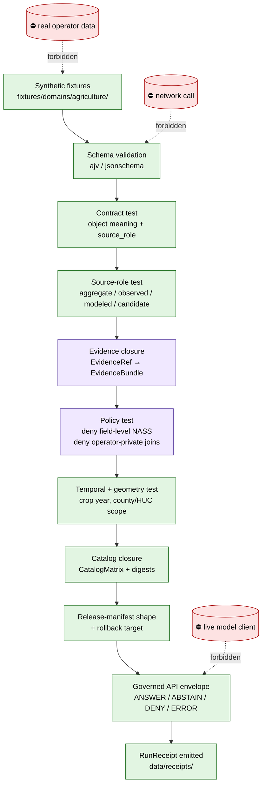

<!-- [KFM_META_BLOCK_V2]
doc_id: kfm://doc/runbooks/agriculture/no-network-test-runbook
title: Agriculture — No-Network Test Runbook
type: standard
version: v0.1
status: draft
owners: <TODO: agriculture domain steward + tests/fixtures owner>
created: 2026-05-13
updated: 2026-05-13
policy_label: public
related:
  - docs/domains/agriculture/README.md
  - docs/doctrine/directory-rules.md
  - docs/doctrine/lifecycle-law.md
  - docs/runbooks/ui_VALIDATION.md
  - schemas/contracts/v1/domains/agriculture/
  - policy/domains/agriculture/
  - tests/domains/agriculture/
  - fixtures/domains/agriculture/
tags: [kfm, agriculture, runbook, tests, no-network, fixtures, governance]
notes:
  - Path location PROPOSED until verified against mounted-repo conventions.
  - All file paths inside this runbook are PROPOSED unless explicitly confirmed.
[/KFM_META_BLOCK_V2] -->

# Agriculture — No-Network Test Runbook

> The deterministic, offline test pass that proves the Agriculture trust spine before any live source, public layer, or AI surface is allowed near it.


<!-- Badges marked TODO are placeholders for repo-specific CI/version endpoints to be wired after verification. -->


| Field | Value |
|---|---|
| **Status** | `draft` |
| **Owners** | `<TODO: agriculture domain steward + tests/fixtures owner>` |
| **Last updated** | `2026-05-13` *(replace with verified update date on first commit)* |
| **Doc kind** | Runbook (standard doc; KFM Meta Block v2 present) |
| **Authority of this runbook** | PROPOSED — pending repo mount and reviewer signoff |
| **Authority of doctrine cited** | CONFIRMED (Directory Rules, lifecycle law, cite-or-abstain, agriculture doctrine) |

---

## Quick jump

- [1. Purpose](#1-purpose)
- [2. Scope & non-goals](#2-scope--non-goals)
- [3. Repo fit & placement](#3-repo-fit--placement)
- [4. Inputs](#4-inputs)
- [5. Exclusions (what must not enter this lane)](#5-exclusions-what-must-not-enter-this-lane)
- [6. Proposed directory tree](#6-proposed-directory-tree)
- [7. No-network test flow](#7-no-network-test-flow)
- [8. Quickstart](#8-quickstart)
- [9. Usage — full test matrix](#9-usage--full-test-matrix)
- [10. Required fixtures (per object family)](#10-required-fixtures-per-object-family)
- [11. Agriculture-specific validators](#11-agriculture-specific-validators)
- [12. Failure modes & reason codes](#12-failure-modes--reason-codes)
- [13. Rollback / disable path](#13-rollback--disable-path)
- [14. Pre-publish checklist](#14-pre-publish-checklist)
- [15. FAQ](#15-faq)
- [16. Related docs](#16-related-docs)
- [17. Appendix — illustrative fixture skeletons](#17-appendix--illustrative-fixture-skeletons)

---

## 1. Purpose

The Agriculture lane handles data with **hard rights and sensitivity edges** — proprietary yield, farm/operator identity, pesticide records, and field-level joins to private parties — that *cannot* be safely exercised against live sources during development or CI. This runbook describes the deterministic, **no-network** test pass that proves the Agriculture trust spine before any live source, public layer, or AI surface is wired in.

> [!IMPORTANT]
> **No-network is the default first lane**, not an optional mode. KFM doctrine requires deterministic no-network fixture tests *before* schema, contract, validator, policy, evidence, lifecycle, receipt, release, governed API, UI trust, or live-source tests. The Agriculture lane inherits that order.

This runbook operationalizes, for Agriculture specifically:

- The PROPOSED **`PR-00 no-network fixture`** entry in the Implementation Roadmap (synthetic fixtures for `SourceDescriptor`, `EvidenceBundle`, `LayerManifest`, `ReleaseManifest` — extended here to Agriculture's object families).
- The CONFIRMED **fixture rule**: every major object family must carry at least one valid, invalid, denied, abstention, and rollback/correction fixture; sensitive lanes must use public-safe transformed fixtures, never real exact locations or private data.
- The CONFIRMED **testing strategy**: deterministic no-network fixture tests come first; live-source tests come last.
- The CONFIRMED **agriculture publication posture**: aggregate statistics and satellite products *must not* become field/operator truth; field-level NASS claims must DENY.

[Back to top ↑](#agriculture--no-network-test-runbook)

---

## 2. Scope & non-goals

### In scope

- Deterministic, offline validation of all Agriculture **schemas**, **contracts**, **policies**, **validators**, **evidence closure**, **catalog closure**, **release-manifest shape**, **rollback target shape**, and **governed-API envelope shape** using synthetic fixtures only.
- Verification that **field-level**, **operator-identifying**, and **rights-restricted** Agriculture content is **denied** at the policy gate before reaching any PUBLISHED edge.
- Verification that aggregate sources (e.g., USDA NASS QuickStats, CDL, Drought Monitor) carry an `AggregationReceipt` and never collapse into per-place truth.
- Production of a `RunReceipt` for the no-network test pass itself.

### Non-goals

- Live fetching from USDA NASS, NRCS, SSURGO/SDA, Kansas Mesonet, NRCS SCAN, NOAA USCRN, NASA SMAP, NASA HLS, or any other source.
- Public publication of any Agriculture layer, EvidenceBundle, or DTO.
- AI provider integration (MockAdapter only; no live model client).
- Front-end integration tests requiring a live governed-API process (those live in `docs/runbooks/ui_VALIDATION.md`).
- Decisions about rights, sensitivity classification, or source-role assignment — those are governance decisions, not test outcomes.

[Back to top ↑](#agriculture--no-network-test-runbook)

---

## 3. Repo fit & placement

> [!NOTE]
> **PROPOSED placement.** The visible KFM runbook pattern in source doctrine uses a *flat* layout (e.g., `docs/runbooks/ui_LOCAL_DEV.md`, `docs/runbooks/governed_ai_VALIDATION.md`). This runbook uses a **domain-segmented sub-folder** (`docs/runbooks/agriculture/`), which is consistent with **Directory Rules §12** (domains live as lanes inside responsibility roots, never as roots) but is not yet ratified by an ADR or per-root README. Mark this path PROPOSED until verified.

| Property | Value |
|---|---|
| **Path** | `docs/runbooks/agriculture/NO_NETWORK_TEST_RUNBOOK.md` |
| **Responsibility root** | `docs/` — human-facing control plane, owns runbooks |
| **Domain segment** | `agriculture` — domain lane inside `docs/runbooks/` |
| **Authority of placement** | PROPOSED |
| **Cited rule** | Directory Rules §4 (placement protocol) + §12 (domain placement law) |
| **Upstream** | `docs/doctrine/directory-rules.md`, `docs/domains/agriculture/README.md` (PROPOSED), agriculture domain doctrine in KFM Encyclopedia and Domains Atlas |
| **Downstream** | `tests/domains/agriculture/`, `fixtures/domains/agriculture/`, `policy/domains/agriculture/`, `schemas/contracts/v1/domains/agriculture/`, `release/candidates/agriculture/` |

[Back to top ↑](#agriculture--no-network-test-runbook)

---

## 4. Inputs

What this runbook consumes when executed:

| Input | Where it lives (PROPOSED) | What it provides |
|---|---|---|
| Agriculture object schemas | `schemas/contracts/v1/domains/agriculture/` | Machine-checkable shape for every object family |
| Agriculture object contracts | `contracts/domains/agriculture/` | Object meaning, source-role rules |
| Agriculture policy bundles | `policy/domains/agriculture/` | Allow / deny / restrict / abstain decisions |
| Synthetic fixtures (valid / invalid / denied / abstention / rollback) | `fixtures/domains/agriculture/` | Inputs for every test class below |
| Cross-cutting schemas (`SourceDescriptor`, `EvidenceBundle`, `LayerManifest`, `ReleaseManifest`, `RunReceipt`, `AggregationReceipt`) | `schemas/contracts/v1/source/`, `schemas/contracts/v1/evidence/`, `schemas/contracts/v1/release/`, `schemas/contracts/v1/proofs/` | Trust spine objects the agriculture fixtures must close against |
| Tools | `tools/validators/` (PROPOSED) | Schema, evidence, rights, sensitivity, temporal, geometry, citation, release-manifest validators |
| Policy runner | `conftest` or repo policy-runner equivalent | Negative policy fixture evaluation |

> [!CAUTION]
> Fixtures must include an **obvious mock marker** (e.g., `"_mock": true` and a non-routable identifier prefix). A fixture that could be confused with released evidence is itself a governance failure.

[Back to top ↑](#agriculture--no-network-test-runbook)

---

## 5. Exclusions (what must not enter this lane)

> [!WARNING]
> The no-network lane is **deny-by-default**. The presence of any of the following items in a fixture, test, or CI step is a stop-the-build event, not a warning.

| Forbidden content | Why it must not appear | Recovery |
|---|---|---|
| Real field-level NASS / CDL identifications tied to a specific operator or parcel | Source-role collapse risk; rights/privacy exposure | Move to QUARANTINE; recreate as public-safe synthetic |
| Live `http://` / `https://` / DNS / socket calls from any test or fixture loader | Defeats determinism; risks credential leak | Move call into a connector test out of this runbook's scope |
| Live model-runtime calls (Ollama / OpenAI / any provider adapter) | Bypasses MockAdapter discipline; AI is interpretive, never root truth | Use `MockAdapter` over fixtures only |
| Real coordinates of sensitive farms, irrigation infrastructure, or operator-identifying joins | Aggregate-cited-as-per-place collapse; privacy harm | Replace with public-safe generalized geometry + `AggregationReceipt` |
| Proprietary yield, pesticide, crop insurance, or operator-specific economic records | Rights / privacy fail-closed | Use synthetic counterpart; record `RIGHTS_UNKNOWN` if rights status itself is being tested |
| Tile artifacts, COGs, PMTiles archives, vector indexes, or graph stores | Not the no-network lane's job; lives in MapLibre / tile runbooks | Move to the MapLibre tile validation runbook |
| Real model-run outputs presented as observations | Modeled-as-observed collapse (DENY at publication; ABSTAIN at AI) | Reaffirm `source_role` in fixture; add Reality Boundary Note where applicable |

[Back to top ↑](#agriculture--no-network-test-runbook)

---

## 6. Proposed directory tree

PROPOSED tree. Specific path presence is **NEEDS VERIFICATION** until checked against a mounted repo; the *shape* is governed by Directory Rules §12.

```text
Kansas-Frontier-Matrix/
├── docs/
│   └── runbooks/
│       └── agriculture/
│           └── NO_NETWORK_TEST_RUNBOOK.md      # ← this file (PROPOSED)
├── schemas/
│   └── contracts/v1/
│       └── domains/agriculture/                # agriculture object shapes
├── contracts/
│   └── domains/agriculture/                    # agriculture object meaning
├── policy/
│   └── domains/agriculture/                    # agriculture allow/deny/restrict/abstain
├── tests/
│   └── domains/agriculture/
│       ├── schema/
│       ├── contract/
│       ├── source_role/
│       ├── evidence/
│       ├── policy/
│       ├── temporal/
│       ├── geometry/
│       ├── catalog_closure/
│       ├── release_manifest/
│       └── rollback/
├── fixtures/
│   └── domains/agriculture/
│       ├── valid/
│       ├── invalid/
│       ├── denied/
│       ├── abstain/
│       └── rollback/
├── tools/
│   └── validators/                             # repo-wide validators consumed here
├── release/
│   └── candidates/agriculture/                 # dry-run release candidates only
└── data/
    └── receipts/                               # RunReceipt for the no-network pass
```

> [!NOTE]
> The tree above is **PROPOSED**. The Domains Atlas labels each home above as `CONFIRMED rule / PROPOSED presence`, meaning the *responsibility roots* are doctrinally fixed but the *presence in the mounted repo* is not asserted here.

[Back to top ↑](#agriculture--no-network-test-runbook)

---

## 7. No-network test flow

The flow below shows how a no-network Agriculture pass closes the trust spine without crossing any forbidden boundary. **PROPOSED** illustration of the doctrine flow; concrete tool names will be wired in after repo verification.



> [!NOTE]
> Diagram is illustrative of **doctrinal flow**, not a verified repo wiring. `NEEDS VERIFICATION` once the agriculture lane is mounted.

[Back to top ↑](#agriculture--no-network-test-runbook)

---

## 8. Quickstart

PROPOSED commands. **Exact tool names depend on repo conventions** (npm / pnpm / yarn / pip / make / task) and will be confirmed after repo mount. Replace `<runner>` with the repo-canonical runner.

```bash
# 1. From repo root, run the agriculture no-network suite end-to-end.
<runner> test:no-network --domain=agriculture

# 2. Or, run each stage explicitly (PROPOSED stage names):
<runner> test:schemas         --domain=agriculture
<runner> test:contracts       --domain=agriculture
<runner> test:source-role     --domain=agriculture
<runner> test:evidence        --domain=agriculture
<runner> test:policy          --domain=agriculture   # negative fixtures must fail closed
<runner> test:temporal        --domain=agriculture
<runner> test:geometry        --domain=agriculture
<runner> test:catalog-closure --domain=agriculture
<runner> test:release-shape   --domain=agriculture
<runner> test:rollback        --domain=agriculture

# 3. Emit a RunReceipt for the no-network pass.
<runner> emit:run-receipt --kind=no-network --domain=agriculture
```

> [!TIP]
> Run the **policy stage with `--strict-fail-closed`** so that a missing DENY on a forbidden input is treated as a stage failure, not a silent pass. This is the only way to detect a fixture that silently slipped past the trust membrane.

[Back to top ↑](#agriculture--no-network-test-runbook)

---

## 9. Usage — full test matrix

The matrix below restates the CONFIRMED KFM test pyramid in agriculture-specific form. Every row is `PROPOSED` for this domain until validators are wired and CI green.

| # | Test class | What it asserts | Required fixtures | Default outcome on miss | Status |
|---|---|---|---|---|---|
| 1 | **Schema** | Required fields, versions, types for each agriculture object | valid + invalid | invalid fixture **must fail** | PROPOSED |
| 2 | **Contract** | Object meaning matches vocabulary + lifecycle role | valid | meaning drift flagged | PROPOSED |
| 3 | **Source-role** | A source is not used outside its authority (e.g., NASS QuickStats stays `aggregate`) | valid + role-collapse invalid | upcast attempt **must fail** | PROPOSED |
| 4 | **Evidence closure** | `EvidenceRef` resolves to an `EvidenceBundle` or the surface **ABSTAINs** | valid + abstain | unresolved → ABSTAIN, not ANSWER | PROPOSED |
| 5 | **Policy — field-level NASS deny** | Field-level NASS attribution **denies** at the gate | denied | ANSWER on field-level **must fail** | PROPOSED |
| 6 | **Policy — operator-private join deny** | Joins to operator-identifying data **deny** at the gate | denied | ANSWER on private join **must fail** | PROPOSED |
| 7 | **Policy — rights-unknown deny** | Source with unresolved rights **denies** promotion | denied | promotion **must fail closed** | PROPOSED |
| 8 | **Crop-progress aggregate-only** | NASS Crop Progress used only as aggregate, never per-field | valid + denied | per-field claim **must fail** | PROPOSED |
| 9 | **Vegetation index mask/time** | HLS / vegetation index respects mask, observation time, and aggregation unit | valid + invalid | unmasked or time-collapsed → fail | PROPOSED |
| 10 | **Soil moisture unit/depth/QC** | Kansas Mesonet / SCAN / USCRN / SMAP units, depths, QC flags preserved | valid + invalid | unit/depth collapse → fail | PROPOSED |
| 11 | **SSURGO / SDA lineage** | SSURGO-derived attributes carry MUKEY lineage and map-unit derivation | valid + invalid | missing lineage → fail | PROPOSED |
| 12 | **Temporal** | `source / observed / valid / retrieval / release / correction` times stay distinct | valid + invalid | time-collapse → fail | PROPOSED |
| 13 | **Geometry** | Public products live at county / HUC / grid scope; field polygons quarantined | valid + denied | exact field on public surface **must fail** | PROPOSED |
| 14 | **Catalog closure** | `CatalogMatrix`, `DatasetVersion`, `ValidationReport`, `EvidenceBundle` close | valid + invalid | incomplete bundle → fail | PROPOSED |
| 15 | **Release-manifest shape** | `ReleaseManifest` carries rollback target + correction path + review state | valid + invalid | missing rollback target → fail | PROPOSED |
| 16 | **Rollback drill** | A `RollbackCard` against a dry-run release reverts cleanly | rollback | rollback failure → block release | PROPOSED |
| 17 | **AI boundary (MockAdapter)** | MockAdapter cannot ANSWER without an admissible `EvidenceBundle` | abstain + denied | uncited ANSWER → fail | PROPOSED |
| 18 | **No forbidden network call** | Static / runtime check: no socket, no DNS, no `fetch`, no model client | n/a | any outbound call → fail | PROPOSED |

[Back to top ↑](#agriculture--no-network-test-runbook)

---

## 10. Required fixtures (per object family)

The **CONFIRMED** KFM fixture rule: every major object family carries valid / invalid / denied / abstention / rollback-or-correction fixtures, and **sensitive lanes use public-safe transformed fixtures only**. Agriculture's families are:

| Object family | Valid | Invalid | Denied | Abstain | Rollback / correction |
|---|---|---|---|---|---|
| `CropObservation` | county-scope, aggregate | bad units | field-scope on public surface | missing `EvidenceRef` | corrected observation supersedes prior |
| `FieldCandidate` | quarantined candidate | malformed geometry | promotion to PUBLISHED denied | unresolved candidate → ABSTAIN | candidate withdrawn |
| `CropRotation` | county aggregate | overlap conflict | operator-identified rotation | unresolved sequence | rotation correction |
| `YieldObservation` | aggregate yield | bad unit | proprietary yield by operator | unsourced yield → ABSTAIN | yield correction |
| `IrrigationLink` | aggregate water-use link | inconsistent join | operator/well-identifying link | unresolved adjacency | link withdrawn |
| `ConservationPractice` | permitted public record | malformed scope | rights-restricted detail | unresolved practice → ABSTAIN | practice correction |
| `SoilCropSuitability` | SSURGO-lineage suitability | missing MUKEY | rights-unknown SSURGO derivative | unresolved suitability → ABSTAIN | suitability correction |
| `AgriculturalEconomyObservation` | permitted aggregate | bad period | proprietary market data | unresolved series → ABSTAIN | series correction |
| `SupplyChainNode` | permitted node | bad classification | operator-identifying node | unresolved link → ABSTAIN | node withdrawn |
| `DroughtStressIndicator` | aggregate indicator | bad scope | indicator claimed as observation | model-only → ABSTAIN at AI | indicator correction |
| `PestStressIndicator` | aggregate indicator | bad scope | indicator claimed as field truth | model-only → ABSTAIN at AI | indicator correction |
| `AggregationReceipt` | valid receipt | missing scope token | aggregate cited as per-place | unresolved aggregation → DENY join | receipt correction |

> [!IMPORTANT]
> **Aggregation discipline is not optional in Agriculture.** Aggregate-cited-as-per-place is a CONFIRMED **DENY** condition in the Atlas anti-collapse table; the `AggregationReceipt` fixture exists precisely to prove the join from an aggregate cell to a single field **fails closed**.

[Back to top ↑](#agriculture--no-network-test-runbook)

---

## 11. Agriculture-specific validators

PROPOSED validator inventory derived from the Domains Atlas. Each validator targets one or more of the test classes in §9. Names are illustrative; real validator file names are NEEDS VERIFICATION.

| Validator | Targets | Notes |
|---|---|---|
| `validate_ssurgo_lineage` | SSURGO / SDA / gSSURGO derivatives | Requires MUKEY + map-unit derivation chain |
| `validate_soil_moisture_qc` | Kansas Mesonet, SCAN, USCRN, SMAP series | Unit + depth + QC flag preservation |
| `validate_crop_progress_aggregate_only` | USDA NASS Crop Progress, QuickStats | Refuses per-field collapse |
| `validate_vegetation_index_mask_time` | NASA HLS / HLS-VI | Mask + observation-time integrity |
| `validate_field_level_nass_deny` | NASS field-level claims | Policy validator; **must DENY** |
| `validate_catalog_closure` | `CatalogMatrix` for agriculture | Closure across `EvidenceBundle` |
| `validate_aggregation_receipt` | Any aggregate observation | Geometry-scope + matrix-cell semantics |
| `validate_no_outbound_network` | Test runner | Static + runtime denial of socket / DNS / fetch |

[Back to top ↑](#agriculture--no-network-test-runbook)

---

## 12. Failure modes & reason codes

PROPOSED reason codes, drawn from the CONFIRMED master pipeline gate-failure catalog, applied to Agriculture.

| Failure family | Reason code | First gate that fires | Agriculture-typical trigger |
|---|---|---|---|
| Missing required artifact | `MISSING_RECEIPT` | Validation / Catalog | `AggregationReceipt` absent on an aggregate observation |
| Missing required artifact | `MISSING_EVIDENCE` | Catalog / Release | `EvidenceRef` does not resolve |
| Missing required artifact | `MISSING_REVIEW` | Release | Promotion to PUBLISHED without `ReviewRecord` for a materially sensitive product |
| Schema / contract mismatch | `SCHEMA_MISMATCH` | Normalization | Crop observation with wrong unit / depth / time field |
| Schema / contract mismatch | `CONTRACT_DRIFT` | Validation | Field added without ADR / schema bump |
| Rights / sensitivity unresolved | `RIGHTS_UNKNOWN` | Admission | Source registered without rights resolution |
| Rights / sensitivity unresolved | `SENSITIVITY_UNRESOLVED` | Validation / Catalog | Operator-identifying join attempted |
| Source-role collapse | `ROLE_COLLAPSE` | Validation / Release | Aggregate cited as per-place |
| Source-role collapse | `ROLE_DOWNCAST_FORBIDDEN` | Validation / Release | Modeled product relabeled as observation |
| Review state inadequate | `REVIEW_NEEDED` | Catalog / Release | Field-level surface needs steward sign-off |
| Release infrastructure error | `RELEASE_MANIFEST_INVALID` | Release | `ReleaseManifest` missing rollback target |
| Release infrastructure error | `ROLLBACK_TARGET_MISSING` | Release | Dry-run release without prior release pointer |

[Back to top ↑](#agriculture--no-network-test-runbook)

---

## 13. Rollback / disable path

If the no-network suite begins to allow forbidden states, treat it as a **release-quality regression**, not a test-quality one. The trust spine is the product.

1. **Disable the offending fixture or validator** by revert PR — do not edit-in-place.
2. **Re-run** the full no-network suite to confirm a clean baseline.
3. **Open a `DRIFT_REGISTER` entry** describing the regression and the affected paths.
4. **Open a `VERIFICATION_BACKLOG` entry** for the validator or policy bundle that should have caught it.
5. **Block release candidate promotion** for the Agriculture lane until the regression is closed.
6. **Emit a `CorrectionNotice`** if any released artifact referenced a now-suspect rule.

> [!CAUTION]
> Never "patch through" a failing no-network test by relaxing the fixture. The fixture **is** the rule's executable form. Relaxing it is doctrinal drift, not a test fix.

[Back to top ↑](#agriculture--no-network-test-runbook)

---

## 14. Pre-publish checklist

Use before marking the no-network Agriculture lane "green."

- [ ] Every Agriculture object family has all five fixture classes (valid / invalid / denied / abstain / rollback-or-correction).
- [ ] All fixtures carry an obvious mock marker.
- [ ] No fixture contains real operator-identifying, rights-restricted, or field-level NASS attribution.
- [ ] All schema-stage tests pass on valid fixtures and fail on invalid fixtures.
- [ ] All policy-stage negative fixtures **fail closed** under `--strict-fail-closed`.
- [ ] `AggregationReceipt` deny test refuses to join an aggregate cell to a single field.
- [ ] Source-role tests reject modeled-as-observed and aggregate-as-per-place.
- [ ] Evidence closure ABSTAINs (does not ANSWER) when `EvidenceRef` is unresolved.
- [ ] Catalog closure rejects an incomplete `EvidenceBundle`.
- [ ] `ReleaseManifest` shape test requires rollback target + correction path + review state.
- [ ] Rollback drill against a dry-run candidate emits a verifiable receipt.
- [ ] MockAdapter cannot ANSWER without an admissible `EvidenceBundle`.
- [ ] Static + runtime checks confirm zero outbound network calls.
- [ ] A `RunReceipt` for the no-network pass is emitted and recorded under `data/receipts/`.
- [ ] Docs propagation: any schema / policy / validator change has its `docs/`, `tests/`, and runbook updates wired.

[Back to top ↑](#agriculture--no-network-test-runbook)

---

## 15. FAQ

<details>
<summary><strong>Q. Why isn't this just "the test suite"? Why a separate no-network lane?</strong></summary>

Because trust is the product. The KFM testing strategy is explicit: deterministic no-network fixture tests come **before** schema, contract, validator, policy, evidence, lifecycle, receipt, release, governed-API, UI, or live-source tests. The no-network lane is the layer that proves the trust spine *without* a live source's behavior obscuring the result. Field-level NASS denial means nothing if your DENY only fires when NASS happens to be up.
</details>

<details>
<summary><strong>Q. Can I use a small slice of real Kansas Mesonet / NASS data "just for development"?</strong></summary>

No. CONFIRMED KFM doctrine: rights, sensitivity, and source role are governance decisions; bringing real data into the no-network lane is a rights and source-role event, not a "dev convenience." If you need real data, you are in a *connector* test or a *live-source* test, both of which are out of this runbook's scope. Build a public-safe synthetic counterpart and route real data through the appropriate governed admission path.
</details>

<details>
<summary><strong>Q. The visible runbook examples are flat (<code>docs/runbooks/ui_LOCAL_DEV.md</code>). Why does this one nest under <code>agriculture/</code>?</strong></summary>

The visible examples come from the UI / governed-AI expansion, where each runbook had a single audience and no domain segment. Agriculture is a *domain lane*, and Directory Rules §12 says domains live as segments inside responsibility roots. `docs/runbooks/agriculture/` is the closest match to the law, but the exact shape is **PROPOSED** until an ADR or a per-root README pins it. If the project later prefers a flat `docs/runbooks/agriculture_NO_NETWORK_TEST.md`, this file can be renamed without changing the doctrine.
</details>

<details>
<summary><strong>Q. What happens when a policy fixture passes when it should fail?</strong></summary>

That's the worst-case outcome the no-network lane exists to catch. It means an `ANSWER` reached a forbidden surface in a controlled fixture environment — exactly the failure mode that, in production, would constitute a publication breach. Stop the build, revert the offending change, open a `DRIFT_REGISTER` entry, and treat it as a **release-quality regression**, not a test bug.
</details>

<details>
<summary><strong>Q. Why does AI MockAdapter live in this runbook at all?</strong></summary>

Because AI is interpretive and *never* root truth. If the MockAdapter can produce an ANSWER over Agriculture content without an admissible `EvidenceBundle`, the AI surface is broken regardless of whether the model provider is mock or live. The no-network lane catches that failure before any provider integration exists to obscure it.
</details>

[Back to top ↑](#agriculture--no-network-test-runbook)

---

## 16. Related docs

- `docs/doctrine/directory-rules.md` — placement law, especially §4 (Placement Protocol), §7.4 (schema-home convention), §12 (Domain Placement Law) — **CONFIRMED**.
- `docs/doctrine/lifecycle-law.md` — RAW → WORK / QUARANTINE → PROCESSED → CATALOG / TRIPLET → PUBLISHED — **CONFIRMED doctrine / PROPOSED presence**.
- `docs/domains/agriculture/README.md` — Agriculture domain index — **PROPOSED**.
- `docs/sources/SOURCE_DESCRIPTOR_STANDARD.md` — Source admission posture — **PROPOSED**.
- `docs/runbooks/ui_VALIDATION.md` — UI validation, accessibility, contract, and e2e smoke — **PROPOSED**.
- `docs/runbooks/governed_ai_VALIDATION.md` — Focus Mode evidence / citation / policy validation — **PROPOSED**.
- `docs/runbooks/agriculture/<TODO: VALIDATION, ROLLBACK>` — sibling runbooks for the same domain — **TODO**.
- `docs/adr/<TODO: ADR-runbook-layout>` — domain-segmented runbook layout decision — **TODO**.

[Back to top ↑](#agriculture--no-network-test-runbook)

---

## 17. Appendix — illustrative fixture skeletons

> [!NOTE]
> The skeletons below are **illustrative**, not authoritative. Real field names follow the canonical schemas under `schemas/contracts/v1/`, which this runbook does not assert the presence of.

<details>
<summary><strong>Valid <code>CropObservation</code> (county-scope aggregate)</strong></summary>

```json
{
  "_mock": true,
  "object_type": "CropObservation",
  "object_id": "kfm-mock://crop_observation/ag-ks-county-001-2024-corn",
  "source_id": "kfm-mock://source/nass-quickstats",
  "source_role": "aggregate",
  "role_aggregation_unit": "county",
  "geometry_scope": { "kind": "county", "fips": "20XXX" },
  "crop_year": 2024,
  "observed_time": "2024-09-01T00:00:00Z",
  "valid_time": { "start": "2024-01-01", "end": "2024-12-31" },
  "retrieval_time": "2026-01-15T00:00:00Z",
  "release_time": null,
  "value": { "indicator": "harvested_acres", "amount": 123456, "unit": "acre" },
  "evidence_ref": "kfm-mock://evidence/ag-county-001-2024-corn",
  "aggregation_receipt_ref": "kfm-mock://receipt/agg/ag-county-001-2024-corn"
}
```
</details>

<details>
<summary><strong>Denied <code>CropObservation</code> (field-level NASS attribution)</strong></summary>

```json
{
  "_mock": true,
  "_expected_outcome": "DENY",
  "_expected_reason": "ROLE_COLLAPSE",
  "object_type": "CropObservation",
  "object_id": "kfm-mock://crop_observation/ag-field-001-2024-corn",
  "source_id": "kfm-mock://source/nass-quickstats",
  "source_role": "aggregate",
  "role_aggregation_unit": "field",
  "geometry_scope": { "kind": "field", "field_id": "MOCK-FIELD-001" },
  "crop_year": 2024
}
```
</details>

<details>
<summary><strong>Abstention fixture (unresolved <code>EvidenceRef</code>)</strong></summary>

```json
{
  "_mock": true,
  "_expected_outcome": "ABSTAIN",
  "_expected_reason": "MISSING_EVIDENCE",
  "object_type": "DroughtStressIndicator",
  "object_id": "kfm-mock://drought/ag-county-001-2024-w34",
  "source_id": "kfm-mock://source/drought-monitor",
  "source_role": "modeled",
  "evidence_ref": "kfm-mock://evidence/does-not-resolve"
}
```
</details>

<details>
<summary><strong>Rollback fixture (<code>RollbackCard</code> against a dry-run release)</strong></summary>

```json
{
  "_mock": true,
  "object_type": "RollbackCard",
  "rollback_id": "kfm-mock://rollback/ag-2024-09-corn-county-aggregate",
  "release_id": "kfm-mock://release/ag-2024-09-corn-county-aggregate@v0.1",
  "prior_release_id": null,
  "reason": "no-network-drill",
  "correction_notice_ref": "kfm-mock://correction/ag-2024-09-corn-county-aggregate-drill"
}
```
</details>

---

### Last updated

`2026-05-13` (placeholder; replace with verified commit date on first merge).

[Back to top ↑](#agriculture--no-network-test-runbook)
