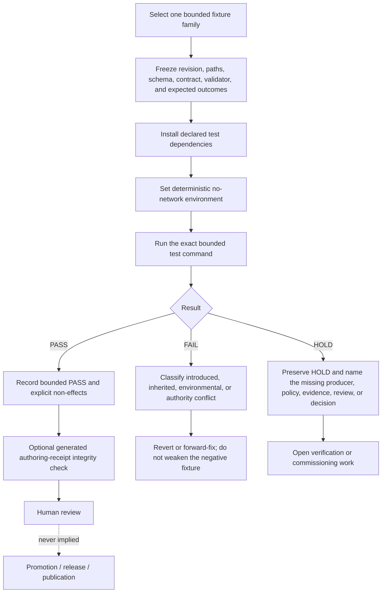

<!-- [KFM_META_BLOCK_V2]
doc_id: kfm://doc/runbooks/agriculture/no-network-test-runbook
title: Agriculture — No-Network Test Runbook
type: runbook; operational-procedure; domain-lane; non-authoritative
version: v0.2
status: draft; repository-grounded; bounded-executable-slices-present; broader-agriculture-validation-held; non-publisher
owners:
  - "@bartytime4life — verified GitHub review route"
  - "NEEDS VERIFICATION — accountable Agriculture, test, fixture, rights/sensitivity, policy, evidence, and release stewards"
created: 2026-05-13
updated: 2026-08-23
policy_label: public-review; agriculture; no-network; synthetic-fixtures; fail-closed; no-publication-authority
current_path: docs/runbooks/agriculture/NO_NETWORK_TEST_RUNBOOK.md
owning_root: docs/
responsibility: >
  Provide the repository-grounded procedure for running and interpreting bounded
  Agriculture no-network checks without granting source admission, evidence,
  policy, lifecycle, release, deployment, or publication authority.
truth_posture: cite-or-abstain
truth_labels: [CONFIRMED, PROPOSED, UNKNOWN, NEEDS VERIFICATION, CONFLICTED, HOLD]
authority_class: explanatory operational documentation
canonical_relationship: same-path update; no new or parallel authority
evidence_snapshot:
  repository: bartytime4life/Kansas-Frontier-Matrix
  base_ref: main
  base_commit: 265b99b81f9526a885caaf799e17c89b5424f9f2
  prior_blob: 15a94c9f7a92f2f258a85200c7d49f01293fd10b
  directory_rules_blob: fd49a0b83e55cef52c1124281f093e263526898d
  inspected_surfaces:
    - docs/runbooks/README.md
    - docs/adr/ADR-0029-adopt-directory-governance-standard-v2.md
    - .github/CODEOWNERS
    - .github/workflows/domain-agriculture.yml
    - .github/workflows/agriculture-ndvi-delta-computation.yml
    - .github/workflows/agriculture-hls-ndvi-zonal-materiality.yml
    - .github/workflows/agriculture-ndvi-readiness.yml
    - .github/workflows/agriculture-vegetation-connectivity-gate.yml
    - tests/ingest/cdl_watch/test_cdl_watch.py
    - tests/domains/agriculture/test_agriculture_smoke.py
    - tests/domains/agriculture/test_ndvi_delta_computation.py
    - tests/domains/agriculture/README.md
    - fixtures/domains/agriculture/README.md
    - fixtures/domains/agriculture/no_network/README.md
    - fixtures/domains/agriculture/no_network/nass/README.md
related:
  - ../README.md
  - ../../doctrine/directory-rules.md
  - ../../adr/ADR-0029-adopt-directory-governance-standard-v2.md
  - ../../domains/agriculture/DOMAIN.md
  - ../../../tests/domains/agriculture/README.md
  - ../../../fixtures/domains/agriculture/README.md
  - ../../../contracts/domains/agriculture/README.md
  - ../../../schemas/contracts/v1/domains/agriculture/README.md
  - ../../../policy/domains/agriculture/README.md
  - ../../../tools/validators/domains/agriculture/README.md
  - ../../../release/agriculture/README.md
tags: [kfm, agriculture, runbook, tests, no-network, fixtures, governance, fail-closed]
notes:
  - "v0.2 replaces no-mounted-repository assumptions and illustrative runner placeholders with current repository evidence and exact bounded commands."
  - "This document changes no test, fixture, contract, schema, policy, validator, workflow, receipt, proof, lifecycle object, release record, deployment, or publication state."
  - "Workflow or test presence proves only the bounded behavior named by that surface; current exact-head pass state remains separate evidence."
[/KFM_META_BLOCK_V2] -->

<a id="top"></a>

# Agriculture — No-Network Test Runbook

> **Run deterministic, fixture-only Agriculture checks while keeping live sources, private or exact farm data, model providers, internal stores, promotion, release, and publication outside the test boundary.**

[](#current-repository-state)
[](#no-network-contract)
[](#current-repository-state)
[](#current-repository-state)
[](#authority-and-non-effects)

> [!IMPORTANT]
> **Current state is bounded, not complete.** The repository contains executable no-network checks for a synthetic CDL material-change watcher, deterministic NDVI delta computation, HLS NDVI zonal materiality, NDVI readiness, and a vegetation-connectivity gate. The broad `domain-agriculture` workflow explicitly keeps wider Agriculture validation, proof production, and release dry-run work on `HOLD`.

> [!CAUTION]
> A passing fixture test, workflow, schema check, generated authoring receipt, or deterministic digest is not an `EvidenceBundle`, `ProofPack`, `PolicyDecision`, promotion decision, release approval, source activation, scientific endorsement, deployment, or publication.

> [!WARNING]
> Exact field-, operator-, farm-, parcel-, well-, or private-party detail fails closed by default. Do not use real sensitive records to make a test convenient.

**Quick navigation:** [Purpose](#1-purpose) · [Scope](#2-scope--non-goals) · [Placement](#3-repo-fit--placement) · [Inputs](#4-inputs) · [Exclusions](#5-exclusions-what-must-not-enter-this-lane) · [State](#current-repository-state) · [Flow](#7-no-network-test-flow) · [Quickstart](#8-quickstart) · [Matrix](#9-usage--full-test-matrix) · [Fixtures](#10-required-fixtures-per-object-family) · [Validators](#11-agriculture-specific-validators) · [Failures](#12-failure-modes--reason-codes) · [Rollback](#13-rollback--disable-path) · [Checklist](#14-pre-publish-checklist) · [FAQ](#15-faq) · [Related](#16-related-docs) · [Evidence](#17-appendix--current-command-and-evidence-map)

---

## 1. Purpose

This runbook defines the **human procedure** for executing, reviewing, and reporting Agriculture checks that must remain deterministic and offline.

It answers four bounded questions:

1. Which Agriculture no-network checks are currently executable?
2. Which exact repository commands reproduce those checks?
3. What does a passing or failing result prove?
4. Which broader claims must remain `HOLD`, `UNKNOWN`, or `NEEDS VERIFICATION`?

The durable rule is:

```text
synthetic or captured fixture
  -> deterministic computation or validator
  -> finite result and bounded receipt check
  -> reviewable PASS / FAIL / HOLD
  -/> source admission, evidence authority, promotion, release, or publication
```

A runbook explains how to operate the checked surfaces. It does not own their semantic meaning, machine shape, policy outcome, evidence, lifecycle state, or release decision.

[Back to top](#top)

---

## 2. Scope & non-goals

### In scope

- Fixture-only execution of the five bounded Agriculture slices listed in [Current repository state](#current-repository-state).
- Python dependency installation through the repository's declared CI helper.
- Deterministic test execution with `KFM_NO_NETWORK=1` and the same strict pytest settings used by the dedicated workflows.
- Verification of paired generated **authoring receipt** integrity where the dedicated workflow requires it.
- Interpretation of `PASS`, `FAIL`, `HOLD`, `ABSTAIN`, `STALE_INPUT`, and `ERROR` without converting them into authority they do not carry.
- Review of changed fixtures, schemas, contracts, validators, tests, workflows, and generated receipts within the selected bounded slice.
- Fail-closed handling of source-role, spatial-support, temporal-support, rights, sensitivity, identity, and network violations.

### Non-goals

- Fetching USDA NASS, Cropland Data Layer, NRCS, SSURGO/SDA, Kansas Mesonet, SCAN, USCRN, SMAP, HLS, STAC, or any other live source.
- Activating or admitting a source, connector, watcher, credential, endpoint, or source schedule.
- Reading from or writing to production databases, object stores, graph stores, vector indexes, model runtimes, or public services.
- Establishing full Agriculture schema, contract, policy, EvidenceRef-to-EvidenceBundle, catalog, proof, promotion, release, or rollback closure.
- Producing a live map layer, API response, Focus Mode answer, alert, export, released artifact, or public publication.
- Treating generated authoring receipts as runtime receipts, proofs, or release authority.
- Resolving ownership, rights, sensitivity, or independent-review assignments through test output.

[Back to top](#top)

---

<a id="authority-and-non-effects"></a>

## 3. Repo fit & placement

**Placement outcome: `PLACE` — CONFIRMED for this same-path update.**

Accepted [ADR-0029](../../adr/ADR-0029-adopt-directory-governance-standard-v2.md) adopts [Directory Rules v2](../../doctrine/directory-rules.md). The parent [`docs/runbooks/` index](../README.md) identifies this subtree as the operational-procedure lane under the human-readable `docs/` responsibility root and confirms Agriculture as one of the tracked domain segments.

| Property | Current result |
|---|---|
| Path | `docs/runbooks/agriculture/NO_NETWORK_TEST_RUNBOOK.md` |
| Authority owner | `docs/` — human-facing operational procedure |
| Scope | Agriculture domain lane |
| Path state | Existing tracked path; same-path modernization |
| Structural effect | None; no create, move, rename, split, mirror, or delete |
| Review route | `@bartytime4life` through the repository default CODEOWNERS rule |
| Independent stewardship | `NEEDS VERIFICATION` |
| Publication effect | None |

This file may cite commands, workflows, contracts, schemas, fixtures, validators, receipts, and release holds. It cannot replace any of them.

[Back to top](#top)

---

## 4. Inputs

### Required local environment

| Input | Requirement |
|---|---|
| Repository revision | The exact commit or feature-branch head under review |
| Python | `3.11`, matching the inspected Agriculture workflows |
| Test dependencies | Installed with `python tools/ci/install_python_ci.py project-test` |
| Working directory | Repository root |
| Network posture | Outbound access denied during repository-code execution |
| Credentials | Repository code receives no ambient credentials or unrelated secrets |
| Time and hashing | `TZ=UTC`, `PYTHONHASHSEED=0`, deterministic local fixture inputs |
| Fixture safety | Synthetic, minimized, public-safe, and free of real operator/private-party detail |

### Current repository inputs

| Surface | Role |
|---|---|
| `tests/ingest/cdl_watch/test_cdl_watch.py` | Synthetic CDL sidecar material-change watcher proof |
| `tests/domains/agriculture/test_ndvi_delta_computation.py` | Deterministic NDVI delta computation tests |
| `tests/validators/domains/agriculture/hls_ndvi_zonal_materiality/` | HLS NDVI zonal materiality validator tests |
| `tests/validators/domains/agriculture/ndvi_readiness/` | Smoke-aware NDVI readiness sidecar tests |
| `tests/validators/domains/agriculture/vegetation_connectivity_gate/` | Vegetation-connectivity gate tests |
| `fixtures/domains/agriculture/` | Canonical Agriculture fixture lane |
| `contracts/domains/agriculture/` | Agriculture semantic contracts |
| `schemas/contracts/v1/domains/agriculture/` | Current canonical Agriculture schema lane |
| `tools/validators/domains/agriculture/` | Domain-scoped validator implementations and recognized placeholders |
| `.github/workflows/domain-agriculture.yml` | Broad readiness and explicit-hold workflow |
| Four dedicated Agriculture workflows | Path-filtered bounded executable checks |

> [!NOTE]
> The tracked `fixtures/domains/agriculture/no_network/nass/` lane currently contains documentation and `.gitkeep`, not an executable NASS fixture payload. Do not report that lane as implemented merely because the directory exists.

[Back to top](#top)

---

## 5. Exclusions (what must not enter this lane)

The following are stop conditions for the no-network procedure.

| Forbidden input or action | Why it fails | Required response |
|---|---|---|
| Live HTTP, DNS, socket, STAC, API, or source requests | Breaks determinism and can expose credentials or source side effects | Stop; move the work to a separately authorized live-source profile |
| Real field, farm, operator, parcel, well, or private-party identifiers | Creates privacy, rights, and harmful-precision risk | Remove the material; create a synthetic public-safe fixture |
| Exact sensitive geometry | Style hiding is not a security control | Generalize or synthesize before fixture admission |
| Proprietary yield, pesticide, insurance, or operator-economic records | Rights and privacy are unresolved | Quarantine outside the fixture lane |
| Live model-provider calls | AI is interpretive and not root truth | Use no provider; test only deterministic local behavior |
| Production database, graph, vector, or object-store access | Crosses the test boundary | Replace with fixed local fixtures |
| Automatic writes to `data/published/` or release endpoints | Test success is not publication authority | Stop and inspect workflow or script side effects |
| Aggregate or modeled support relabeled as field observation | Source-role collapse | Fail closed with a finite finding |
| Relaxing a negative fixture to make CI green | Converts a governance failure into silent drift | Revert or forward-fix the implementation instead |

[Back to top](#top)

---

<a id="6-proposed-directory-tree"></a>
<a id="current-repository-state"></a>

## 6. Current repository state

The old greenfield tree is replaced by observed repository state. Presence, execution, review, proof, release, and publication remain separate axes.

| Slice | Repository evidence | Exact bounded command | Current posture |
|---|---|---|---|
| CDL material-change watcher | Test module plus seven synthetic sidecar case families; network primitives patched to fail | `python -m unittest tests.ingest.cdl_watch.test_cdl_watch --verbose` | `CONFIRMED PRESENT`; fixture-only review signal; no source admission or publication |
| NDVI delta computation | Contract, schema, generator, five-case fixture manifest, substantive pytest module, dedicated workflow | `python -m pytest tests/domains/agriculture/test_ndvi_delta_computation.py -q --strict-config --strict-markers` | `CONFIRMED PRESENT`; local JSON and integer arithmetic only |
| HLS NDVI zonal materiality | Contract, schema, validator, fixtures, tests, dedicated workflow | `python -m pytest tests/validators/domains/agriculture/hls_ndvi_zonal_materiality/test_validate_hls_ndvi_zonal_materiality.py -q --strict-config --strict-markers` | `CONFIRMED PRESENT`; precomputed-grid assessment only |
| NDVI readiness | Contract, schema, validator, fixtures, tests, dedicated workflow | `python -m pytest tests/validators/domains/agriculture/ndvi_readiness/test_validate_ndvi_readiness.py -q --strict-config --strict-markers` | `CONFIRMED PRESENT`; sidecar readiness only |
| Vegetation-connectivity gate | Contract, schema, validator, fixtures, tests, dedicated workflow | `python -m pytest tests/validators/domains/agriculture/vegetation_connectivity_gate/test_validate_connectivity_gate.py -q --strict-config --strict-markers` | `CONFIRMED PRESENT`; finite assessment, no geometry operation |
| Vegetation-connectivity fixture replay | Validator CLI wired by dedicated workflow | `python tools/validators/domains/agriculture/vegetation_connectivity_gate/validate_connectivity_gate.py --fixtures` | `CONFIRMED PRESENT`; exact fixture polarity replay |
| Broad Agriculture validation | `domain-agriculture` inventory checks plus explicit summary | No accepted broad local command | `HOLD`: wider executable validation not established |
| Agriculture proof producer | Readiness job checks for absence of accepted producer/target | None | `HOLD`: no accepted proof producer or deterministic proof command |
| Agriculture release dry-run | Readiness job preserves blocked candidate posture | None | `HOLD`: no release or publication authority |
| NASS no-network fixture packet | README and `.gitkeep` only | None | Documentation scaffold; executable payload `ABSENT` at this snapshot |
| Exact-head pass status | Not executed during this documentation edit before PR delivery | Hosted checks after push | `NEEDS VERIFICATION` |

The domain-wide workflow also recognizes four placeholder validator modules:

- `validate_catalog_matrix.py`
- `validate_evidence_bundle.py`
- `validate_schema.py`
- `validate_source_descriptor.py`

Their presence is intentionally guarded as placeholder inventory. They are **not** full Agriculture validation.

[Back to top](#top)

---

## 7. No-network test flow


```mermaid
flowchart TD
    A["Select one bounded fixture family"] --> B["Freeze revision, paths, schema, contract, validator, and expected outcomes"]
    B --> C["Install declared test dependencies"]
    C --> D["Set deterministic no-network environment"]
    D --> E["Run the exact bounded test command"]
    E --> F{"Result"}
    F -->|PASS| G["Record bounded PASS and explicit non-effects"]
    F -->|FAIL| H["Classify introduced, inherited, environmental, or authority conflict"]
    F -->|HOLD| I["Preserve HOLD and name the missing producer, policy, evidence, review, or decision"]
    G --> J["Optional generated authoring-receipt integrity check"]
    H --> K["Revert or forward-fix; do not weaken the negative fixture"]
    I --> L["Open verification or commissioning work"]
    J --> M["Human review"]
    M -. never implied .-> N["Promotion / release / publication"]
```

The dashed edge is intentionally non-operative. A no-network result never promotes itself.

### No-network contract

Set the deterministic environment before executing repository code:

```bash
export KFM_NO_NETWORK=1
export PYTHONDONTWRITEBYTECODE=1
export PYTHONHASHSEED=0
export PYTHONUNBUFFERED=1
export TZ=UTC
```

`KFM_NO_NETWORK=1` is a contract signal, not sufficient proof by itself. The bounded test or harness must also prevent or detect network primitives. The CDL watcher and NDVI delta tests include explicit socket/DNS denial checks; the other inspected workflows describe fixture-only boundaries and require separate review if their implementations change.

[Back to top](#top)

---

## 8. Quickstart

Run from the repository root at the exact revision under review.

### 8.1 Install declared test dependencies

```bash
python tools/ci/install_python_ci.py project-test
```

This installation step may use the repository's approved package registry path. After installation, execute repository tests with outbound network and ambient credentials denied.

### 8.2 Run the bounded executable suite

```bash
export KFM_NO_NETWORK=1
export PYTHONDONTWRITEBYTECODE=1
export PYTHONHASHSEED=0
export PYTHONUNBUFFERED=1
export TZ=UTC

python -m unittest tests.ingest.cdl_watch.test_cdl_watch --verbose

python -m pytest \
  tests/domains/agriculture/test_ndvi_delta_computation.py \
  -q --strict-config --strict-markers

python -m pytest \
  tests/validators/domains/agriculture/hls_ndvi_zonal_materiality/test_validate_hls_ndvi_zonal_materiality.py \
  -q --strict-config --strict-markers

python -m pytest \
  tests/validators/domains/agriculture/ndvi_readiness/test_validate_ndvi_readiness.py \
  -q --strict-config --strict-markers

python -m pytest \
  tests/validators/domains/agriculture/vegetation_connectivity_gate/test_validate_connectivity_gate.py \
  -q --strict-config --strict-markers

python tools/validators/domains/agriculture/vegetation_connectivity_gate/validate_connectivity_gate.py \
  --fixtures
```

### 8.3 Verify the paired generated authoring receipts

Run only for the bounded slices whose inspected workflows require these exact files:

```bash
python tools/validators/validate_generated_receipt.py \
  data/receipts/generated/genrec-pass32-ndvi-delta-computation-20260810.json \
  --repo-root .

python tools/validators/validate_generated_receipt.py \
  data/receipts/generated/genrec-agriculture-hls-ndvi-zonal-materiality-20260806.json \
  --repo-root .

python tools/validators/validate_generated_receipt.py \
  data/receipts/generated/genrec-agriculture-ndvi-readiness-20260806.json \
  --repo-root .

python tools/validators/validate_generated_receipt.py \
  data/receipts/generated/genrec-pass32-vegetation-connectivity-gate-20260808.json \
  --repo-root .
```

> [!CAUTION]
> These are generated **authoring receipt integrity** checks. They do not create or validate a runtime `RunReceipt`, proof, release decision, or publication record.

### 8.4 Do not invent a broad command

There is no confirmed command such as `test:no-network --domain=agriculture` on the inspected revision. Use the exact bounded commands above. Treat broad domain proof and release-dry-run steps as `HOLD` until an accepted producer and repository-native command exist.

[Back to top](#top)

---

## 9. Usage — full test matrix

| Test surface | Positive behavior | Negative or fail-closed behavior | Passing does not prove |
|---|---|---|---|
| CDL watcher | Stable, metadata-only, and threshold cases produce deterministic finite outcomes | Class-map drift, geometry drift, stale inputs, malformed/oversized JSON, and network attempts block or error | Current CDL source, source admission, materiality authority, work-record creation, or publication |
| NDVI delta | Five fixed cases close schema, arithmetic, ordering, thresholds, cloud filtering, and digests | Zero denominator, duplicate/cross-window IDs, and network primitives fail | Raster processing, HLS validity, crop condition, evidence closure, or policy |
| HLS NDVI zonal materiality | Precomputed equal-area mask counts and source/signal changes validate | Coverage, mask, source-change, or signal-change inconsistency fails | STAC access, raster reads, NDVI computation, COG creation, alerts, or release |
| NDVI readiness | Sidecar shape, mask health, ready area, smoke state, and input-receipt consistency validate | Inconsistent or malformed sidecars fail | Health guidance, source truth, evidence resolution, emission, or publication |
| Vegetation connectivity | Fixture shape, deterministic identity, area/persistence closure, finite findings, and all-false authority posture validate | Fixture polarity or closure drift fails | Connected-pixel labeling, geometry operation, ecological truth, policy, or promotion |
| Authoring receipts | Generated receipt bytes still match declared repository inputs | Digest or path mismatch fails | Runtime execution receipt, ProofPack, release approval, or public fitness |
| Broad `domain-agriculture` readiness | Known substantive and placeholder inventory remains explicit | Unexpected inventory or silent placeholder activation fails | Full Agriculture schema, contract, policy, evidence, catalog, proof, or release maturity |

### Required result vocabulary

Use the smallest accurate state:

| State | Meaning in this runbook |
|---|---|
| `PASS` | The named bounded command completed and its assertions passed at the recorded revision |
| `FAIL` | The named bounded command or safety check failed |
| `HOLD` | A required accepted producer, authority, evidence, review, or release path is absent or intentionally blocked |
| `ABSTAIN` | The executable profile cannot support a claim from available inputs |
| `STALE_INPUT` | Temporal regression or stale fixture condition was detected |
| `ERROR` | The input or execution could not be evaluated safely |
| `PENDING` | A hosted check has not settled |
| `NOT_RUN` | No execution evidence was collected |
| `UNKNOWN` | Available evidence cannot determine the state |

Do not translate `HOLD`, `ABSTAIN`, `STALE_INPUT`, or `ERROR` into a successful answer.

[Back to top](#top)

---

## 10. Required fixtures (per object family)

This runbook no longer claims that every proposed Agriculture object family has complete fixture coverage. Use the current canonical fixture tree and report actual payloads, not planned folder names.

### Fixture admission rules

Every fixture admitted to a bounded no-network slice must be:

- synthetic or a rights-cleared, public-safe captured input explicitly approved for that profile;
- minimized to the fields needed by the assertion;
- deterministic and stable under ordering where order is not semantic;
- marked so it cannot be confused with released evidence;
- free of real operator, farm, parcel, well, private-party, or harmful-precision identifiers;
- paired with an expected finite outcome;
- rejected when duplicate keys, oversized payloads, invalid units, invalid chronology, ambiguous identity, or schema drift could change meaning;
- subordinate to the owning contract and schema;
- kept out of `data/published/`.

### Minimum polarity for a mature fixture family

A fixture family is not complete until directly applicable cases cover:

| Polarity | Required behavior |
|---|---|
| Valid | Expected bounded result passes |
| Invalid | Shape, type, identity, chronology, unit, or invariant error fails |
| Denied or blocked | Prohibited rights, sensitivity, precision, source-role, or authority state fails closed |
| Abstention or stale | Missing support or regressed time produces a finite non-answer |
| Correction or rollback | Supersession, withdrawal, or restoration path is testable where the slice can create reliance |

Not every current bounded slice implements all five polarities. Record that gap rather than fabricating fixture completeness.

### NASS no-network packet

`fixtures/domains/agriculture/no_network/nass/` is currently documentation-backed and contains `.gitkeep`; it is not an executable NASS fixture family. A future payload must be added through its own dependency-closed change with:

- accepted source-role and rights assumptions;
- synthetic or approved captured bytes;
- schema and validator;
- positive and negative tests;
- explicit network denial;
- correction and rollback;
- no source activation or publication effect.

[Back to top](#top)

---

## 11. Agriculture-specific validators

### Confirmed substantive bounded validators

| Validator family | Current scope | Explicit non-effects |
|---|---|---|
| HLS NDVI zonal materiality | Precomputed grid/mask/materiality assessment | No STAC, raster processing, NDVI calculation, alerting, release, or publication |
| NDVI readiness | Fixture-only readiness sidecars | No source access, health guidance, evidence resolution, promotion, or emission |
| Vegetation connectivity gate | Fixture shape, deterministic identity, component summaries, finite findings | No pixel labeling, geometry operation, evidence/policy decision, promotion, or release |
| NDVI delta generator plus tests | Strict local JSON, integer arithmetic, thresholds, cloud filtering, deterministic digests | No raster reads, source truth, evidence closure, policy, promotion, or release |
| CDL watcher helper plus tests | Local sidecar comparison and bounded material-change signaling | No live CDL fetch, source admission, issue creation, promotion, or publication |

### Confirmed placeholders

The following files are recognized placeholders in the broad readiness workflow and must not be described as implemented validators:

```text
tools/validators/domains/agriculture/validate_catalog_matrix.py
tools/validators/domains/agriculture/validate_evidence_bundle.py
tools/validators/domains/agriculture/validate_schema.py
tools/validators/domains/agriculture/validate_source_descriptor.py
```

A change that converts one of these placeholders into executable logic must also close its contract, schema, fixtures, tests, documentation, workflow wiring, failure semantics, compatibility, and rollback within one review boundary.

[Back to top](#top)

---

## 12. Failure modes & reason codes

Prefer reason codes already emitted by the bounded implementation. Do not invent a universal Agriculture code list in this runbook.

### Confirmed CDL watcher outcomes and examples

| Outcome | Example reason or trigger |
|---|---|
| `NO_MATERIAL_CHANGE` | No crop-histogram change or change below the accepted fixture threshold |
| `PROPOSED_WORK_RECORD` | Relative or absolute fixture threshold reached; still non-publishing |
| `CLASSMAP_DRIFT` | `CDL_CLASSMAP_DRIFT_REQUIRES_REMAP_REVIEW` |
| `GEOMETRY_DRIFT` | County geometry or area changed and comparison requires rebase |
| `ABSTAIN` | `MATERIALITY_PROFILE_DRIFT` |
| `STALE_INPUT` | Regressed CDL year, observation time, or source modification time |
| `ERROR` | Invalid JSON, duplicate keys, oversized fixture, profile-hash mismatch, or bounded input failure |

### General triage

When a command fails:

1. Record the exact revision, command, path set, environment, and first deterministic error.
2. Determine whether the failure is:
   - introduced by the proposed change;
   - inherited from the base;
   - environmental;
   - an intentional `HOLD`;
   - a contract/schema/policy conflict;
   - a rights, sensitivity, or harmful-precision stop.
3. Fix introduced deterministic failures within the bounded slice.
4. Do not relax a negative fixture, disable network denial, widen permissions, or relabel a source role to obtain green status.
5. Report inherited or unrelated failures separately.
6. Stop on any secret, rights, sensitivity, policy, destructive, or publication-boundary failure.
7. Preserve the finite non-answer when the profile cannot safely decide.

[Back to top](#top)

---

## 13. Rollback / disable path

### Before merge

- Abandon or close the draft pull request.
- Leave `main` unchanged.
- Do not delete the remote branch unless separately authorized.
- Preserve the PR discussion as review evidence.

### After merge

- Revert the exact documentation commit or submit a transparent forward-fix PR.
- Do not rewrite shared history.
- If the runbook directed maintainers to a wrong command or overstated maturity, correct the text and link the superseding change.

### Executable regression

If a bounded test begins permitting a previously forbidden state:

1. Stop the affected workflow or candidate **through a reviewed code change**, not an undocumented operational shortcut.
2. Reproduce the regression at an immutable revision.
3. Restore the prior fail-closed behavior by revert or forward fix.
4. Run the exact bounded suite.
5. Record drift or verification work in the owning registers.
6. Hold any dependent proof, promotion, release, or public surface.
7. Emit correction or withdrawal objects only through their governing authority if public reliance exists.

Changing this Markdown file does not roll back data, evidence, policy, release, or publication state.

[Back to top](#top)

---

## 14. Pre-publish checklist

This checklist is a **precondition inventory**, not publication authorization.

### For this runbook change

- [ ] The target remained at the existing canonical path.
- [ ] The exact base commit and prior target blob were recorded.
- [ ] No open PR or task branch owned the same target bytes at edit time.
- [ ] One H1, valid heading order, balanced fences, valid GitHub alerts, and a final newline were checked.
- [ ] Repository-relative links resolve at the proposed head.
- [ ] Exact commands match current workflow bytes.
- [ ] Placeholder, bounded-executable, `HOLD`, `UNKNOWN`, and `NEEDS VERIFICATION` states remain distinct.
- [ ] No release, deployment, promotion, publication, or settings effect is claimed.

### Before graduating any bounded Agriculture slice

- [ ] Contract, schema, fixture, validator/generator, test, workflow, and documentation agree.
- [ ] Positive and negative cases pass at the exact revision.
- [ ] Network primitives are denied or demonstrably absent.
- [ ] No ambient credentials reach repository code.
- [ ] Rights, sensitivity, precision, and source role are explicit.
- [ ] Generated authoring receipt integrity passes where required.
- [ ] EvidenceRef-to-EvidenceBundle closure is proven if the slice makes an evidence-dependent claim.
- [ ] Policy and human review are complete where consequence requires them.
- [ ] Correction and rollback are realistic and tested.
- [ ] Release and publication remain separate governed decisions.

[Back to top](#top)

---

## 15. FAQ

<details>
<summary><strong>Why keep a domain runbook when there is a repository-wide no-network runbook?</strong></summary>

The repository-wide runbook defines the shared posture. This file binds that posture to the current Agriculture workflows, commands, fixture families, sensitive-data rules, and explicit holds. It does not create a second testing or policy authority.
</details>

<details>
<summary><strong>Can I run the five commands as one authoritative Agriculture suite?</strong></summary>

You may run them sequentially as a convenience, but report each result by its own bounded contract. The repository does not currently define one accepted broad Agriculture proof command, and the `domain-agriculture` workflow explicitly holds broader validation.
</details>

<details>
<summary><strong>Can a small real NASS or Kansas Mesonet sample be used offline?</strong></summary>

Not merely because it is stored locally. Retrieval, rights, source role, sensitivity, precision, citation, retention, and permitted use must already be governed. The current NASS no-network packet does not contain an executable payload. Prefer synthetic fixtures until an approved captured-input profile exists.
</details>

<details>
<summary><strong>Does <code>KFM_NO_NETWORK=1</code> guarantee no network?</strong></summary>

No. It declares the intended mode. The test harness or execution sandbox must also deny or detect socket, DNS, HTTP, and provider access. Review implementation changes for new network-capable imports and side effects.
</details>

<details>
<summary><strong>What does a green generated-receipt check mean?</strong></summary>

It means the checked authoring receipt still matches its declared repository inputs under the receipt validator. It does not mean the domain output is scientifically true, evidence-closed, policy-approved, released, deployed, or published.
</details>

<details>
<summary><strong>Why not keep the old illustrative JSON fixture skeletons?</strong></summary>

Current contracts, schemas, fixture manifests, and tests are stronger authorities for machine shape. Stale illustrative objects risk creating a parallel vocabulary or being copied as if authoritative. This runbook now links to current repository surfaces and records missing payloads explicitly.
</details>

<details>
<summary><strong>What should happen when a negative fixture unexpectedly passes?</strong></summary>

Treat it as a fail-closed regression. Stop the affected slice, preserve the reproducer, fix the implementation or contract conflict, rerun the exact bounded command, and keep dependent proof/release work on hold. Do not weaken the fixture to make the workflow green.
</details>

[Back to top](#top)

---

## 16. Related docs

### Governing and parent documentation

- [`docs/runbooks/README.md`](../README.md) — runbook responsibility and current subtree inventory.
- [`docs/doctrine/directory-rules.md`](../../doctrine/directory-rules.md) — adopted placement doctrine.
- [`ADR-0029`](../../adr/ADR-0029-adopt-directory-governance-standard-v2.md) — adoption and migration decision.
- [`docs/domains/agriculture/DOMAIN.md`](../../domains/agriculture/DOMAIN.md) — Agriculture bounded-context documentation.

### Owning implementation surfaces

- [`tests/domains/agriculture/README.md`](../../../tests/domains/agriculture/README.md)
- [`fixtures/domains/agriculture/README.md`](../../../fixtures/domains/agriculture/README.md)
- [`fixtures/domains/agriculture/no_network/README.md`](../../../fixtures/domains/agriculture/no_network/README.md)
- [`fixtures/domains/agriculture/no_network/nass/README.md`](../../../fixtures/domains/agriculture/no_network/nass/README.md)
- [`contracts/domains/agriculture/README.md`](../../../contracts/domains/agriculture/README.md)
- [`schemas/contracts/v1/domains/agriculture/README.md`](../../../schemas/contracts/v1/domains/agriculture/README.md)
- [`policy/domains/agriculture/README.md`](../../../policy/domains/agriculture/README.md)
- [`tools/validators/agriculture/README.md`](../../../tools/validators/agriculture/README.md)
- [`tools/validators/domains/agriculture/README.md`](../../../tools/validators/domains/agriculture/README.md)
- [`release/agriculture/README.md`](../../../release/agriculture/README.md)
- [`release/candidates/agriculture/county_year_panel_v0/README.md`](../../../release/candidates/agriculture/county_year_panel_v0/README.md)

### Workflows

- [Broad Agriculture readiness and holds](../../../.github/workflows/domain-agriculture.yml)
- [NDVI delta computation](../../../.github/workflows/agriculture-ndvi-delta-computation.yml)
- [HLS NDVI zonal materiality](../../../.github/workflows/agriculture-hls-ndvi-zonal-materiality.yml)
- [NDVI readiness](../../../.github/workflows/agriculture-ndvi-readiness.yml)
- [Vegetation-connectivity gate](../../../.github/workflows/agriculture-vegetation-connectivity-gate.yml)

[Back to top](#top)

---

<a id="17-appendix--illustrative-fixture-skeletons"></a>

## 17. Appendix — current command and evidence map

### Command-to-workflow map

| Command | Workflow source | Network posture |
|---|---|---|
| `python -m unittest tests.ingest.cdl_watch.test_cdl_watch --verbose` | `domain-agriculture.yml` | `KFM_NO_NETWORK=1`; test patches socket, DNS, and URL access |
| NDVI delta pytest command | `agriculture-ndvi-delta-computation.yml` | `KFM_NO_NETWORK=1`; test patches socket/DNS and checks no output creation |
| HLS materiality pytest command | `agriculture-hls-ndvi-zonal-materiality.yml` | Fixture-only workflow; no STAC or raster operations |
| NDVI readiness pytest command | `agriculture-ndvi-readiness.yml` | Fixture-only workflow; no source access |
| Connectivity pytest plus `--fixtures` replay | `agriculture-vegetation-connectivity-gate.yml` | Fixture-only workflow; no geometry or source operations |

### Material change ledger

| Prior element | v0.2 disposition |
|---|---|
| Stable document ID, path, title, created date, and Agriculture no-network purpose | `KEEP` |
| No-mounted-repository and placement-uncertain language | `REMOVE_WITH_EVIDENCE` — current repo and accepted ADR inspected |
| Generic `<runner>` commands | `REPAIR` — replaced with exact current workflow commands |
| Proposed whole-repository tree | `RELOCATE/REPLACE` — current topology and maturity table now used |
| Broad claim that all Agriculture test classes are merely proposed | `SURFACE_CONFLICT` — bounded executable slices exist; broad closure remains held |
| Illustrative JSON object skeletons | `REMOVE_WITH_EVIDENCE` — current schemas and fixtures own machine shape |
| Sensitive-data, source-role, evidence, correction, and rollback safeguards | `CLARIFY` and retain |
| TODO badges, owner placeholders, proposed links, and placeholder update date | `REPAIR` with current review route and explicit stewardship gaps |
| Promotion/publication language | `CLARIFY` — tests and runbooks are non-publishers |

### Current-session validation status

| Criterion | State |
|---|---|
| Complete prior target read | `PASS` |
| Same-path placement and accepted Directory Rules basis | `PASS` |
| Open PR overlap on target | `PASS` — none found in bounded search |
| Path-scoped `AGENTS.md` at root/docs/docs-runbooks | `PASS` — none found at checked paths |
| Markdown structure checks | `PASS` before commit |
| Repository-relative link checks | `PASS` for cited paths before commit |
| Executable Agriculture tests | `NOT_RUN` locally in this connector-only session |
| Hosted CI at draft-PR creation | `PENDING` until GitHub reports exact-head results |
| Source activation, release, deployment, promotion, publication | `NOT_APPLICABLE`; no transition requested or performed |

### Change history

| Version | Date | Change |
|---|---|---|
| `v0.1` | 2026-05-13 | Initial greenfield/no-mounted-repository Agriculture no-network runbook |
| `v0.2` | 2026-08-23 | Repository-grounded modernization; exact bounded commands; explicit executable, placeholder, and hold states; stale speculative tree and fixture skeletons removed |

[Back to top](#top)
