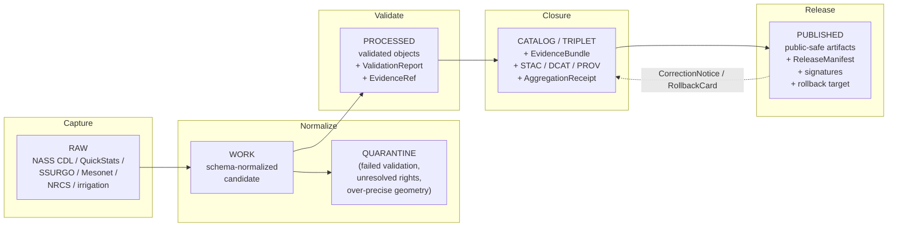
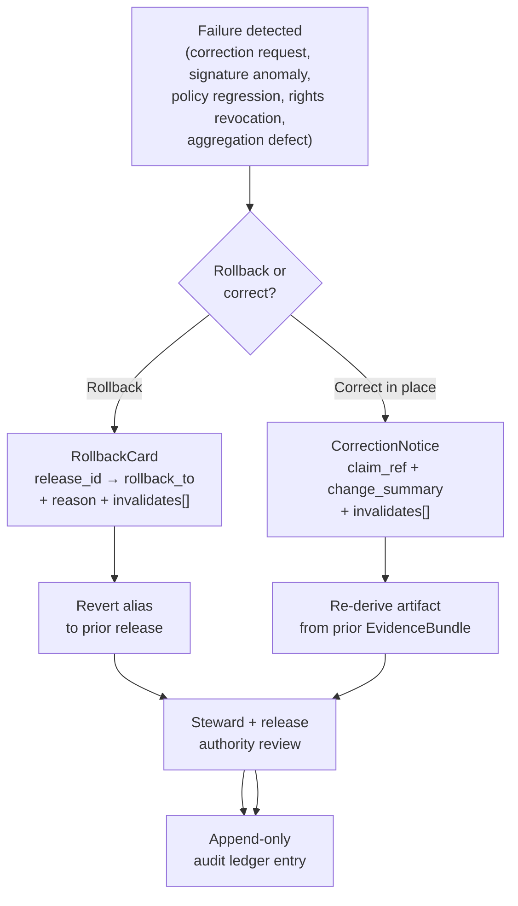

<!-- [KFM_META_BLOCK_V2]
doc_id: kfm://doc/runbook-agriculture-promotion
title: Agriculture — Promotion Runbook
type: standard
version: v0.1
status: draft
owners: <agriculture-domain-steward TBD>, <release-authority TBD>
created: 2026-05-13
updated: 2026-05-13
policy_label: public
related:
  - docs/doctrine/lifecycle-law.md
  - docs/doctrine/directory-rules.md
  - docs/domains/agriculture/README.md
  - docs/runbooks/README.md
  - release/README.md
  - data/registry/sources/agriculture/
tags: [kfm, runbook, agriculture, promotion, governance, lifecycle]
notes:
  - Repo-state items inside this runbook are PROPOSED until verified against a mounted repository.
  - Path home `docs/runbooks/agriculture/PROMOTION_RUNBOOK.md` is PROPOSED; prior proposed runbook
    naming has been flat (e.g. `docs/runbooks/ui_VALIDATION.md`) — adoption of a domain-subfolder
    pattern under `docs/runbooks/` warrants an ADR or directory-rules clarification.
[/KFM_META_BLOCK_V2] -->

<a id="top"></a>

# Agriculture — Promotion Runbook

> Governed, fail-closed procedure for moving Agriculture-domain objects through the KFM lifecycle from `WORK` candidacy to `PUBLISHED` public-safe artifacts, with provenance, policy, evidence, review, correction, and rollback closure.

<p align="center">
  
  
  
  
  
  
</p>

| Status | Owners | Last updated |
|---|---|---|
| `draft` · `NEEDS VERIFICATION` against mounted repo | `<agriculture-domain-steward TBD>`, `<release-authority TBD>` | 2026-05-13 |

> [!IMPORTANT]
> Promotion in KFM is a **governed state transition**, not a file move. A path-level relocation of bytes between `data/work/`, `data/processed/`, `data/catalog/`, or `data/published/` that bypasses validators, policy gates, evidence-bundle creation, catalog closure, signing, and release-decision recording is a violation of the lifecycle invariant regardless of where the bytes end up. *(CONFIRMED doctrine — Directory Rules §9.1; Lifecycle Law.)*

---

## Quick links

- [1. Scope](#1-scope)
- [2. Audience and roles](#2-audience-and-roles)
- [3. Prerequisites](#3-prerequisites)
- [4. Lifecycle context](#4-lifecycle-context)
- [5. Promotion gate matrix](#5-promotion-gate-matrix)
- [6. Stage transitions — step procedures](#6-stage-transitions--step-procedures)
- [7. Agriculture-specific sensitivity rules](#7-agriculture-specific-sensitivity-rules)
- [8. Required receipts and artifacts](#8-required-receipts-and-artifacts)
- [9. Fail-closed conditions](#9-fail-closed-conditions)
- [10. Validation procedures](#10-validation-procedures)
- [11. Rollback path](#11-rollback-path)
- [12. Correction procedure](#12-correction-procedure)
- [13. Decision-log and audit join keys](#13-decision-log-and-audit-join-keys)
- [14. Open verification items](#14-open-verification-items)
- [15. Related docs](#15-related-docs)
- [Appendix A — Illustrative payloads](#appendix-a--illustrative-payloads)

---

## 1. Scope

**This runbook applies to** Agriculture-domain promotion transitions: candidate objects emitted by Agriculture pipelines, normalized in `WORK`, validated and bundled in `PROCESSED`, cataloged with `EvidenceBundle` closure in `CATALOG/TRIPLET`, and released as public-safe artifacts in `PUBLISHED`.

**In scope (CONFIRMED doctrine / PROPOSED implementation):**

- `CropObservation`, `FieldCandidate`, `CropRotation`, `YieldObservation`, `IrrigationLink`, `ConservationPractice`, `SoilCropSuitability`, `AgriculturalEconomyObservation`, `SupplyChainNode`, `DroughtStressIndicator`, `PestStressIndicator`, `AggregationReceipt`. *(Object family list per Domain Atlas.)*
- Public-safe aggregate products (county-year crop panels, HUC-aggregated indicators, suitability surfaces with `ModelRunReceipt`).
- Source families: USDA NASS CDL and QuickStats, NRCS conservation practice data, SSURGO, irrigation/water-use sources, weather/soil-moisture (e.g., Kansas Mesonet), and licensed economy/market sources where rights permit.

**Out of scope — handled elsewhere:**

| Concern | Owning surface |
|---|---|
| Canonical soil map-unit / horizon semantics | Soil domain (`docs/domains/soil/`) |
| Water observations, flood context, NFHL | Hydrology domain (`docs/domains/hydrology/`) |
| Parcel ownership, operator identity, living-person data | People / Land / DNA domain |
| Emergency / advisory alerting | Not a KFM responsibility; deny by policy |
| Field-level NASS or operator-level claims to public clients | **DENY** by default; see §7 |

---

## 2. Audience and roles

Operational separation of duties applies once maturity justifies it (CONFIRMED doctrine).

| Role | Authority in this runbook |
|---|---|
| Agriculture domain steward | Approves source admission, source-role assignments, aggregation thresholds, redaction approach, candidate review, correction lineage. |
| Release authority | Approves `PUBLISHED` transitions; signs `ReleaseManifest`; co-owns rollback. |
| Policy author | Owns OPA bundles for Agriculture (rights, sensitivity, aggregation suppression rules). |
| Rights/sensitivity reviewer | Evaluates source-rights-limited material; required for licensed economy/market sources. |
| CI / runtime operator | Runs pipelines, emits `RunReceipt` and `ValidationReport`; never decides truth. |

> [!NOTE]
> No single actor may produce, validate, and release in one unreviewed path once the domain reaches policy-significant maturity. *(CONFIRMED doctrine — KFM core invariants.)*

---

## 3. Prerequisites

Before running a promotion attempt for an Agriculture candidate, confirm the following exist and resolve:

- A `SourceDescriptor` for each upstream source with `source_role`, `rights`, `sensitivity`, `cadence`, `authority`, ingest hash, and citation (`PROPOSED` schema home: `schemas/contracts/v1/receipts/`; **NEEDS VERIFICATION**).
- A pinned OPA policy bundle for `policy/domains/agriculture/` referenced by **digest** in both CI and any runtime PDP. *(Policy parity — CONFIRMED doctrine; bundle digest **PROPOSED** until verified in repo.)*
- Validators and negative-path fixtures under `tests/domains/agriculture/` and `fixtures/domains/agriculture/` (paths PROPOSED).
- Signing key material reachable to CI (`cosign` keyed or keyless; **NEEDS VERIFICATION**).
- A release-decision home under `release/candidates/agriculture/` and `release/manifests/` (CONFIRMED doctrine; presence in repo **NEEDS VERIFICATION**).

> [!CAUTION]
> If any prerequisite is missing or its identity cannot be resolved, **do not proceed**. The default outcome for promotion with absent governance fields is `DENY` → quarantine. Absence of evidence is not permission to publish.

---

## 4. Lifecycle context



*Diagram reflects CONFIRMED KFM lifecycle invariant (`RAW → WORK/QUARANTINE → PROCESSED → CATALOG/TRIPLET → PUBLISHED`). Quarantine is a destination, not a deletion. Released artifacts retain a defined correction and rollback path back into governed state.*

---

## 5. Promotion gate matrix

The gate matrix below composes the KFM Phase 5 gate families with Agriculture-specific obligations. Each gate emits a finite outcome from `{ ANSWER, ABSTAIN, DENY, ERROR, HOLD, PASS, FAIL }` as appropriate to its class. Default failure mode is the rightmost column.

| # | Gate | Class | Must answer | Outcomes | Default on failure |
|---|---|---|---|---|---|
| A | **Shape gate** | Validator | Does the object match its schema and required version? | `PASS` / `FAIL` | `ERROR` → quarantine |
| B | **Meaning gate** | Validator | Does it conform to contract vocabulary (e.g., `CropObservation`, `FieldCandidate`)? | `PASS` / `FAIL` | `ERROR` → review |
| C | **Source gate** | Policy | Is `source_role`, rights, cadence, and sensitivity known and admissible? | `ANSWER` / `DENY` | `DENY` → quarantine |
| D | **Evidence gate** | Validator + Policy | Do `EvidenceRef` values resolve to `EvidenceBundle`? Is citation closure satisfied? | `ANSWER` / `ABSTAIN` | `ABSTAIN` |
| E | **Sensitivity gate** *(Ag-specific)* | Policy | Has field-level / operator-level / proprietary content been redacted, aggregated, or held? `AggregationReceipt` or `RedactionReceipt` present? | `ANSWER` / `DENY` / `HOLD` | `DENY` → quarantine |
| F | **Lifecycle gate** | Policy | Is the object in the correct `RAW → PUBLISHED` state for this transition? | `ANSWER` / `DENY` | `DENY` |
| G | **Spec-hash gate** | Validator | Does the receipt's `spec_hash` match a freshly recomputed canonical hash of the spec? | `PASS` / `FAIL` | `FAIL` → quarantine |
| H | **Receipt gate** | Validator | Are `RunReceipt`, `ValidationReport`, `PolicyDecision`, and (for aggregates) `AggregationReceipt` present and signed where required? | `PASS` / `FAIL` | `ERROR` |
| I | **Catalog closure gate** | Validator | Are STAC / DCAT / PROV catalog records present and resolvable? | `PASS` / `FAIL` | `FAIL` |
| J | **Release gate** | Policy + Release | Does `ReleaseManifest` include proof, correction path, rollback target, and an explicit review state? | `ANSWER` / `DENY` / `HOLD` | `DENY` |
| K | **Signature gate** | Validator | Are DSSE envelopes signed (cosign), and where keyless, is Rekor inclusion captured? | `PASS` / `FAIL` | `FAIL` → quarantine |

> [!TIP]
> Cheap deterministic gates (A, B, G) run first to fail fast. Evidence resolution (D), policy (C, E, F, J), and cryptographic verification (K) run later. This ordering is **PROPOSED** per the layered-validation pattern in BLD-GREEN.

---

## 6. Stage transitions — step procedures

### 6.1 `WORK → PROCESSED`

**Goal:** convert normalized candidates into validated objects with citation closure and a deterministic identity.

1. **Run shape validation** against `schemas/contracts/v1/domains/agriculture/*.schema.json` *(path **PROPOSED**)*. Emit `ValidationReport`.
2. **Run meaning validation** against `contracts/domains/agriculture/` term definitions for `CropObservation`, `FieldCandidate`, `CropRotation`, `YieldObservation`, etc.
3. **Check source-role admissibility** for each upstream `SourceDescriptor`: NASS QuickStats may be admitted only at admissible aggregation; NASS CDL pixel-level may be admitted as `WORK` but **must not** become public field-truth without aggregation (see §7).
4. **Resolve every `EvidenceRef`** to an `EvidenceBundle` candidate; record digests.
5. **Compute deterministic identity:** `source_id + object_role + temporal_scope + normalized_digest` → `spec_hash` (JCS canonicalization + SHA-256).
6. **Emit `RunReceipt`** capturing source head (ETag / Last-Modified), runner identity, decision-log id, license posture (`spdx_id`), and timestamp. Canonicalize JSON before hashing or signing.

If any step fails: object remains in `WORK` or moves to `QUARANTINE` with a reason. **Never silently retry without a recorded reason.**

### 6.2 `PROCESSED → CATALOG / TRIPLET`

**Goal:** assemble the citation substrate and the catalog presence required for release candidacy.

1. **Bundle evidence** into `EvidenceBundle` with `source_refs`, `policy_label`, `rights_status`, `sensitivity`, and digest.
2. **Emit `AggregationReceipt`** when the object is a roll-up (county-year, HUC, decadal mean, grid threshold): record `geometry_scope`, `time_scope`, `aggregation_method`, `input_source_refs`, `suppression_rule`, `output_unit`. *(Required for Agriculture aggregate products — CONFIRMED doctrine.)*
3. **Emit `RedactionReceipt`** when public-safe transformation has removed, masked, fuzzed, or withheld content (e.g., suppressing low-N county cells, dropping operator identifiers). Record `policy_ref`, `redaction_method`, `kept_fields`, `removed_fields`, `geometry_transform`, `reviewer`.
4. **Emit `ModelRunReceipt`** when the object is a modeled output (e.g., suitability surface, drought-stress index, pest-stress indicator). Record `model_id`, `model_version`, `inputs[]`, `parameters`, `run_time`, `uncertainty_surface_ref`, `validation_ref`.
5. **Emit catalog records:** STAC item(s) with KFM profile, DCAT distribution, PROV activity. STAC asset `properties.datetime` is observed time; release time stays distinct.
6. **Run the catalog-closure validator.** Any unresolved link → `FAIL`.

### 6.3 `CATALOG / TRIPLET → PUBLISHED`

**Goal:** transition from a release candidate to a public-safe artifact under a signed `ReleaseManifest`, with rollback and correction paths intact.

1. **Build the `ReleaseManifest`** under `release/manifests/<release_id>/`: `contents[]`, `digests`, `evidence_refs[]`, `rollback_target`, `review_ref`, `time`.
2. **Run the policy gate** (`conftest test` against the pinned OPA bundle digest). Required passes: `spec_hash present`, `validation_report.outcome == "ANSWER"`, `policy_label != "unknown"`, `rights_status != "unknown"`, `sensitivity != "restricted"` *or* explicit steward review present.
3. **Sign with DSSE + cosign** (preferred: keyless, with Rekor inclusion captured).
4. **Verify** the signature, recompute `spec_hash`, and confirm the manifest digest matches the receipt's recorded `bundle_digest`. Mismatch → quarantine.
5. **Persist a signed `PromotionDecision`** under `release/promotion_decisions/` with `decision_id`, `policy_id` (`gate.J.publish` or equivalent), and result.
6. **Publish artifacts** to `data/published/` (PMTiles, COGs, GeoParquet, layer manifests, API payloads). Decisions live in `release/`; artifacts live in `data/published/`. **These do not mix.**
7. **Emit a public-facing release entry** under `release/changelog/` and an alias update if applicable.

> [!IMPORTANT]
> A passing signature does **not** override missing evidence, unclear rights, unresolved provenance, or sensitivity restrictions. The signature is integrity, not authorization.

---

## 7. Agriculture-specific sensitivity rules

Agriculture publication is governed by both KFM-wide doctrine and domain-specific obligations rooted in source-rights and farm-privacy posture. (CONFIRMED doctrine; specific thresholds below are **PROPOSED** and require steward calibration.)

| Class | Posture | Allowed transform |
|---|---|---|
| NASS CDL pixel-level | Restricted public exposure | Aggregate to county / HUC12 / grid threshold with `AggregationReceipt`; pixel-level may serve internal analysis only |
| NASS QuickStats `D` (disclosure suppressed) cells | **DENY** to public | No transform releases a suppressed cell to public surfaces |
| Operator / farm identity | **DENY** by default | De-identification + `RedactionReceipt`; review record required |
| Proprietary yield / market / insurance | Source-rights gated | Admit only when license permits; rights-reviewer record required |
| Conservation-practice operator detail | Steward-only by default | Aggregate practice counts by county / HUC, never operator-linked |
| Field polygon geometry | Sensitivity-graded | Aggregate or generalize before public release; original geometry stays steward-only |
| Crop rotation derived from field-level CDL chains | Field-level → restricted; aggregate → permissioned | Promotion to public-safe requires `AggregationReceipt` + suppression rule |
| Drought / pest stress indicators (modeled) | Permissioned with reality boundary | Require `ModelRunReceipt` and a `RealityBoundaryNote` distinguishing modeled signal from observed condition |

> [!WARNING]
> Aggregate statistics and satellite-derived products **must not become field/operator truth** in any public surface. A modeled stress index that resembles operator ground-truth is still a model output and must be cited as such. (CONFIRMED doctrine.)

> [!CAUTION]
> KFM is not an emergency-alerting authority. Agriculture surfaces (drought, frost, pest outbreak) provide governed analytical context, never advisory replacement. Direct users to official sources where applicable.

---

## 8. Required receipts and artifacts

Promotion through each Agriculture transition demands the receipts shown below. *(Trigger / phase mapping reflects CONFIRMED doctrine in the Receipt Catalog; field presence in any specific implementation is **NEEDS VERIFICATION**.)*

| Receipt | Triggered by | Phase emitted | Required content (PROPOSED shape) |
|---|---|---|---|
| `SourceDescriptor` | Source admission | RAW | `source_id`, `source_role`, `authority`, `rights`, `sensitivity`, `cadence`, ingest hash, time, citation |
| `RunReceipt` | Every governed run | WORK / PROCESSED | `spec_hash`, `source_head`, `decision_log`, `license`, `evidence_refs[]`, `runner_id`, `timestamp`, `target_zone` |
| `ValidationReport` | Validator pass | WORK / PROCESSED / CATALOG | `validator_id`, `target`, `passes[]`, `failures[]`, `time`, `deterministic_inputs` |
| `EvidenceBundle` | Citation closure | PROCESSED / CATALOG | `bundle_id`, `spec_hash`, `policy_label`, `rights_status`, `sensitivity`, `source_refs[]` |
| `AggregationReceipt` | County / HUC / grid roll-up | PROCESSED / CATALOG | `geometry_scope`, `time_scope`, `aggregation_method`, `input_source_refs`, `suppression_rule`, `output_unit` |
| `RedactionReceipt` | Public-safe transformation | PROCESSED / CATALOG / PUBLISHED | `policy_ref`, `redaction_method`, `kept_fields`, `removed_fields`, `geometry_transform`, `reviewer` |
| `ModelRunReceipt` | Modeled product (suitability, stress) | PROCESSED / CATALOG / PUBLISHED | `model_id`, `model_version`, `inputs[]`, `parameters`, `run_time`, `uncertainty_surface_ref`, `validation_ref` |
| `PolicyDecision` | Every gate | All phases | `policy_id`, `target_object`, `decision`, `reason_code`, `time`, `evidence_refs[]` |
| `ReviewRecord` | Steward / rights / sensitivity review | PROCESSED / CATALOG / PUBLISHED | `reviewer`, `role`, `decision`, `evidence_refs[]`, `policy_ref`, `time` |
| `ReleaseManifest` | PUBLISHED transition | PUBLISHED | `release_id`, `contents[]`, `digests`, `evidence_refs[]`, `rollback_target`, `time` |
| `RollbackCard` | Failed release / correction | PUBLISHED | `release_id`, `rollback_to`, `reason`, `invalidates[]`, `review_ref`, `time` |
| `CorrectionNotice` | Post-publication change | PUBLISHED | `claim_ref`, `prior_release_ref`, `change_summary`, `invalidates[]`, `review_ref`, `time` |

---

## 9. Fail-closed conditions

Default-deny means the **absence of evidence blocks promotion**. The conditions below are non-exhaustive; any condition without a documented remediation path stays in quarantine.

| Condition | Result |
|---|---|
| Missing `spec_hash` or hash mismatch on recomputation | `QUARANTINE` |
| Missing or unverifiable signature; missing Rekor index when keyless | `QUARANTINE` |
| `ValidationReport.outcome != "ANSWER"` | `DENY` / quarantine |
| `policy_label == "unknown"` or `rights_status == "unknown"` | `DENY` |
| `sensitivity == "restricted"` without explicit steward review record | `DENY` |
| Unresolved `EvidenceRef` (cannot resolve to `EvidenceBundle`) | `ABSTAIN` (governed answer); `DENY` (publication) |
| Field-level NASS data attempting promotion as public field-truth | `DENY` |
| Aggregation result violating suppression rule (low-N cell, disclosure suppression) | `DENY` |
| Missing `AggregationReceipt` for an aggregate-claimed object | `FAIL` |
| Missing `RedactionReceipt` for a public-safe derivative of a sensitive input | `FAIL` |
| Modeled product without `ModelRunReceipt` or without `RealityBoundaryNote` on public surface | `FAIL` |
| `ReleaseManifest` missing rollback target or correction path | `DENY` |
| OPA decision `!= "allow"` | `DENY` |

> [!IMPORTANT]
> An OPA `allow` is necessary but not sufficient. All receipt-class evidence must also be present, signed, and resolvable. *(CONFIRMED doctrine — receipt gate is independent of policy gate.)*

---

## 10. Validation procedures

> [!NOTE]
> The commands below are **illustrative**. Exact tool versions, schema paths, OPA bundle digests, and CI workflow filenames are **NEEDS VERIFICATION** against the mounted repository.

### 10.1 Local dry-run

```bash
# 1. Schema validation (illustrative)
python tools/validators/run.py \
  --schema schemas/contracts/v1/domains/agriculture \
  --target data/work/agriculture/<run_id>/

# 2. Resolve EvidenceRefs against candidate bundles
python tools/validators/resolve_evidence.py \
  --target data/processed/agriculture/<dataset_id>/<version>/

# 3. Policy gate (Conftest against pinned bundle)
conftest test \
  release/candidates/agriculture/<release_id>/promotion_input.json \
  --policy policy/domains/agriculture/ \
  --update false
```

### 10.2 Negative-path fixture coverage

Required negative fixtures under `fixtures/domains/agriculture/invalid/` *(paths PROPOSED)*:

```text
fixtures/domains/agriculture/invalid/
├── missing_spec_hash.json
├── unresolved_evidence.json
├── unknown_policy_label.json
├── unknown_rights_status.json
├── field_level_nass_claim.json
├── missing_aggregation_receipt.json
├── disclosure_suppressed_cell.json
├── operator_identity_leak.json
├── stale_source_head.json
├── publication_before_review.json
└── modeled_product_missing_reality_boundary_note.json
```

Each fixture **must** produce a `DENY`, `FAIL`, or `QUARANTINE` outcome with a specific reason code.

### 10.3 Policy parity check

What is enforced in production must equal what was tested in CI: OPA bundle is pinned by digest in both `.github/workflows/promotion-agriculture.yml` *(filename PROPOSED)* and any runtime PDP sidecar. A CI step **should** fail when the deployment digest does not match the workflow digest.

---

## 11. Rollback path



Rollback procedure (high level):

1. **Open a rollback ticket** referencing the affected `release_id` and a specific `rollback_to` target.
2. **Emit a `RollbackCard`** under `release/rollback_cards/` capturing reason, invalidated downstream derivatives, and review reference.
3. **Re-verify** the prior release's `ReleaseManifest` signature and `spec_hash` parity before re-aliasing.
4. **Update layer manifests / API payloads** to point at the prior release. Public surfaces should never serve an unpinned alias mid-rollback.
5. **Persist join keys** (`decision_id`, prior `release_id`, new `RollbackCard.id`) to the audit ledger.
6. **Run a rollback drill** at least quarterly on representative Agriculture artifacts. *(Cadence PROPOSED; verify in mounted repo.)*

---

## 12. Correction procedure

For published Agriculture claims that need a documented change but not a full alias revert:

1. **Open a `CorrectionNotice`** referencing the published `claim_ref` and the prior `release_ref`.
2. **Record what changed and why**, with `evidence_refs[]` to supporting material.
3. **Mark invalidated derivatives** in `invalidates[]` (e.g., downstream Frontier Matrix cells that consumed the corrected input).
4. **Steward and release authority review** the notice before publication.
5. **Public-facing correction surface** displays the notice alongside the corrected artifact; the prior claim is not silently overwritten.

> [!NOTE]
> A correction does not retroactively change earlier `EvidenceBundle` records. Provenance preserves prior states; the correction is a new governed event that links forward and back.

---

## 13. Decision-log and audit join keys

Every governed step in this runbook should emit a record joinable on the keys below. *(Pattern reflects CONFIRMED doctrine; specific persistence layer is **NEEDS VERIFICATION**.)*

| Join key | Joins |
|---|---|
| `decision_id` (UUID) | OPA decision log ↔ `RunReceipt` ↔ `PolicyDecision` ↔ DSSE attestation ↔ `ReleaseManifest` |
| `spec_hash` | Canonical artifact identity ↔ signed envelope ↔ stored receipt |
| `release_id` | `ReleaseManifest` ↔ `data/published/` artifacts ↔ `RollbackCard` ↔ `CorrectionNotice` |
| `source_id` | `SourceDescriptor` ↔ `EvidenceBundle.source_refs[]` ↔ catalog records |
| `dataset_id` + `version` | Processed records ↔ catalog item ↔ layer manifest |

Persist these to an **append-only audit ledger**. Mirroring to a transparency log (Rekor) is recommended for keyless signing.

---

## 14. Open verification items

| Item | Evidence that would settle it | Status |
|---|---|---|
| Path home of this runbook (`docs/runbooks/agriculture/` vs flat `docs/runbooks/agriculture_PROMOTION.md`) | ADR or directory-rules clarification, plus mounted-repo convention | NEEDS VERIFICATION |
| Schema home for Agriculture receipts | Mounted `schemas/contracts/v1/` tree; ADR-0001 status | NEEDS VERIFICATION |
| OPA bundle layout for `policy/domains/agriculture/` | Mounted `policy/` tree | NEEDS VERIFICATION |
| Workflow filename and required-check name | Mounted `.github/workflows/` | NEEDS VERIFICATION |
| CODEOWNERS and steward identity | Mounted `CODEOWNERS` | UNKNOWN |
| Signing posture (keyed vs keyless) and Rekor mirror | Mounted CI workflow + infra docs | NEEDS VERIFICATION |
| Aggregation thresholds (minimum N per county cell, HUC suppression rule) | Steward calibration; PROPOSED in this runbook | PROPOSED |
| Rights status for NASS QuickStats-derived public products | Source registry entry under `data/registry/sources/agriculture/` | NEEDS VERIFICATION |
| Rollback drill cadence | Operational runbook owner decision | PROPOSED |
| Test fixture inventory completeness | Mounted `tests/`, `fixtures/` | NEEDS VERIFICATION |

---

## 15. Related docs

- `docs/doctrine/lifecycle-law.md` — lifecycle invariant *(PROPOSED path; **NEEDS VERIFICATION**)*
- `docs/doctrine/directory-rules.md` — placement protocol and authority roots *(present in project corpus)*
- `docs/domains/agriculture/README.md` — Agriculture domain overview *(PROPOSED)*
- `docs/runbooks/README.md` — runbooks index *(PROPOSED)*
- `release/README.md` — release-decision root *(PROPOSED)*
- `contracts/domains/agriculture/` — object meanings *(PROPOSED)*
- `schemas/contracts/v1/domains/agriculture/` — object shapes *(PROPOSED, per ADR-0001)*
- `policy/domains/agriculture/` — Agriculture policy bundle *(PROPOSED)*
- `data/registry/sources/agriculture/` — source descriptors *(PROPOSED)*

---

<details>
<summary><b>Appendix A — Illustrative payloads</b></summary>

> [!NOTE]
> These payloads are **illustrative** placeholders showing field shape only. They are not committed schemas. Promote to canonical schemas under `schemas/contracts/v1/` only after ADR review.

**A.1 Minimal `promotion_input.json` for Agriculture county-aggregate publish:**

```json
{
  "decision_id": "dec-ag-2026-05-13-0001",
  "policy_id": "gate.J.publish.agriculture",
  "spec_hash": "<sha256>",
  "object_class": "CropObservation.CountyAggregate",
  "policy_label": "public",
  "rights_status": "open",
  "sensitivity": "public",
  "validation_report": {
    "outcome": "ANSWER",
    "validator_id": "agriculture.aggregate.v1"
  },
  "evidence_refs": [
    "kfm://evidence/<bundle_id>"
  ],
  "aggregation_receipt_ref": "kfm://receipt/aggregation/<id>",
  "release_manifest_ref": "release/manifests/<release_id>/manifest.json",
  "rollback_target": "release/manifests/<prior_release_id>/manifest.json",
  "review_ref": "kfm://review/<id>",
  "timestamp": "2026-05-13T00:00:00Z"
}
```

**A.2 Minimal `AggregationReceipt`:**

```json
{
  "object_type": "AggregationReceipt",
  "schema_version": "v1",
  "geometry_scope": { "type": "county", "fips": "20XXX" },
  "time_scope": { "crop_year": 2025 },
  "aggregation_method": "sum_with_disclosure_suppression",
  "input_source_refs": [
    "kfm://source/nass-quickstats/<id>",
    "kfm://source/nass-cdl/<id>"
  ],
  "suppression_rule": "deny_cells_with_n_lt_threshold",
  "output_unit": "acres_planted",
  "evidence_refs": ["kfm://evidence/<bundle_id>"]
}
```

**A.3 Minimal `DecisionEnvelope` for an Agriculture `DENY`:**

```json
{
  "object_type": "DecisionEnvelope",
  "schema_version": "v1",
  "envelope_id": "env-ag-0001",
  "outcome": "DENY",
  "policy_family": "promotion.agriculture",
  "reasons": [
    "field_level_nass_to_public",
    "missing_aggregation_receipt"
  ],
  "obligations": [
    { "type": "hold", "op": "steward_review" }
  ],
  "evaluated_at": "2026-05-13T00:00:00Z"
}
```

</details>

---

[⬆ Back to top](#top)

**Related:** [`directory-rules`](../../doctrine/directory-rules.md) · [`Agriculture domain README`](../../domains/agriculture/README.md) · [`runbooks index`](../README.md) · [`release/`](../../../release/README.md)
*Paths above are **PROPOSED**; verify against mounted repository.*

**Last updated:** 2026-05-13 · **Status:** `draft` · **Doc id:** `kfm://doc/runbook-agriculture-promotion`
