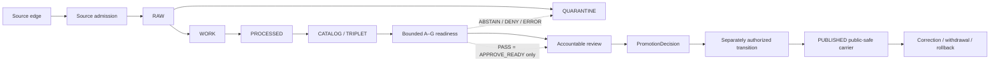

<!-- [KFM_META_BLOCK_V2]
doc_id: kfm://doc/runbook/agriculture/promotion
title: Agriculture Promotion Runbook
type: runbook; operational-procedure; domain-lane; non-authoritative
version: v0.2
status: draft; repository-grounded; bounded-promotion-readiness-validator-present; agriculture-candidate-blocked; policy-inactive; release-dry-run-held; non-publisher
owners:
  - "@bartytime4life — verified GitHub review route"
  - "NEEDS VERIFICATION — accountable Agriculture, source, evidence, policy, rights/sensitivity, validation, release, correction, rollback, and independent-review stewards"
created: 2026-05-13
updated: 2026-08-24
policy_label: public-review; agriculture; promotion-readiness; fail-closed; no-release-authority; no-publication-authority
current_path: docs/runbooks/agriculture/PROMOTION_RUNBOOK.md
owning_root: docs/
responsibility: >
  Provide the repository-grounded human procedure for evaluating Agriculture
  promotion readiness and preparing an accountable review handoff without
  granting source admission, evidence, policy, review, lifecycle-transition,
  release, deployment, or publication authority.
truth_posture: cite-or-abstain
truth_labels: [CONFIRMED, PROPOSED, UNKNOWN, NEEDS VERIFICATION, CONFLICTED, HOLD]
authority_class: explanatory operational documentation
canonical_relationship: same-path update; no new or parallel authority
evidence_snapshot:
  repository: bartytime4life/Kansas-Frontier-Matrix
  base_ref: main
  base_commit: 67e1e2c698dff941b689dba35cfc968ac573a5af
  prior_blob: aa2f3e8edc2928b261dfb57782e167eef94fc98a
  directory_rules_blob: fd49a0b83e55cef52c1124281f093e263526898d
  directory_rules_adr_blob: a4de0d7a96b78da59cfc499d1025e1508afd8dd9
  agriculture_runbook_readme_blob: 1e668f4ccd3cacc9d70f3842752ada77514940e9
  agriculture_source_refresh_blob: 1f79821088075f69e47e674591a48af171a399b7
  agriculture_rollback_blob: d86230acfdad2e6e7bafc04e6b1d3d64cc44d2e4
  promotion_gate_readme_blob: e729df0cc007e8cf0d9811afc25ec1f5ffbdffdd
  promotion_policy_readme_blob: 79287df1d828010d716ed43d2e24d6dbd610305b
  agriculture_policy_readme_blob: 1ba458efb1c456839de0ea73cf592163547ffa66
  source_authority_register_blob: 32729857bc8eb5001acb37b8ee8e60bcb6e0dc50
  agriculture_release_index_blob: fd913433cd1d2ac4a1602aa60bca3089e58f3a27
  county_year_candidate_blob: e0448e2e641b7dee091d26f0850519c34edba052
  agriculture_workflow_blob: d89d5db8861812f7b0a1024ae37a23ed5bd61354
related:
  - ../README.md
  - ../../adr/ADR-0029-adopt-directory-governance-standard-v2.md
  - ../../doctrine/directory-rules.md
  - ../../domains/agriculture/DOMAIN.md
  - ../../domains/agriculture/DATA_LIFECYCLE.md
  - ../../domains/agriculture/SENSITIVITY.md
  - ../../../control_plane/source_authority_register.yaml
  - ../../../contracts/release/promotion_decision.md
  - ../../../contracts/release/promotion_receipt.md
  - ../../../contracts/release/rollback_card.md
  - ../../../policy/promotion/README.md
  - ../../../policy/domains/agriculture/README.md
  - ../../../tools/validators/promotion_gate/README.md
  - ../../../release/agriculture/README.md
  - ../../../release/candidates/agriculture/county_year_panel_v0/README.md
  - ../../../.github/workflows/domain-agriculture.yml
  - ../../../.github/workflows/promotion-gate.yml
  - ./NO_NETWORK_TEST_RUNBOOK.md
  - ./SOURCE_REFRESH_RUNBOOK.md
  - ./ROLLBACK_RUNBOOK.md
tags: [kfm, agriculture, runbook, promotion, readiness, evidence, policy, review, release, aggregation, sensitivity, rollback, fail-closed]
notes:
  - "v0.2 replaces proposal-era no-mounted-repository assumptions, speculative commands, unverified paths, and implied release machinery with current repository evidence and bounded procedures."
  - "The shared A-G promotion-gate validator is executable, deterministic, no-network, read-only, and non-publishing. PASS means APPROVE_READY for accountable review only."
  - "The current Agriculture county-year candidate remains PROPOSED and BLOCKED_FOR_EVIDENCE_AND_VALIDATION; no Agriculture-specific proof producer, release dry-run command, accepted promotion policy, or applied transition is established."
  - "The central source-authority register is projection-only, implementation_status ABSENT, and empty; this runbook cannot admit or activate an Agriculture source."
  - "This document changes no candidate, source, data, contract, schema, policy, fixture, validator, workflow, evidence object, receipt, proof, release record, deployment, lifecycle state, or public surface."
[/KFM_META_BLOCK_V2] -->

<a id="top"></a>

# Agriculture Promotion Runbook

> **Evaluate whether an Agriculture candidate has enough governed support for accountable release review. Do not translate documentation, a green workflow, a schema-valid packet, or an `APPROVE_READY` result into promotion, release, deployment, or publication.**

[](#current-repository-posture)
[](#current-executable-validation)
[](#current-repository-posture)
[](#current-repository-posture)
[](#authority-boundary-and-handoff)

> [!IMPORTANT]
> **Promotion is a governed state transition, not a file move, commit, pull request, merge, workflow result, badge, manifest-shaped document, deployment, alias update, or map-layer toggle.** Lifecycle storage may reflect a transition only after the owning evidence, policy, review, decision, release, correction, and rollback controls close.

> [!CAUTION]
> **Current Agriculture promotion remains held.** The repository has a bounded, fixture-first A–G readiness validator, but the inspected Agriculture candidate lacks a concrete immutable artifact, admitted source set, EvidenceBundle closure, accepted aggregation and suppression policy, candidate-specific proof, accepted release dry run, accountable review assignments, and tested rollback path.

> [!WARNING]
> **Agriculture aggregation does not erase sensitivity.** Exact or reverse-engineerable field, farm, parcel, operator, well, facility, storage, livestock, chemical, insurance, proprietary yield, market, compliance, or private-party detail fails closed. Joins, tiles, labels, search, exports, caches, screenshots, graph edges, logs, and generated language can disclose detail even when a coordinate column is absent.

**Quick navigation:** [Purpose](#purpose) · [Current posture](#current-repository-posture) · [Placement](#directory-rules-basis) · [Scope](#scope-and-non-goals) · [Roles](#roles-and-separation-of-duties) · [Lifecycle](#lifecycle-and-object-family-boundaries) · [Preflight](#preflight-and-stop-conditions) · [Procedure](#promotion-readiness-procedure) · [Agriculture gates](#agriculture-specific-gates) · [Validation](#current-executable-validation) · [Packet](#candidate-review-packet) · [Outcomes](#finite-outcomes-and-current-holds) · [Authority](#authority-boundary-and-handoff) · [Rollback](#correction-withdrawal-and-rollback) · [Audit](#audit-and-join-keys) · [Checklist](#operator-checklist) · [Open work](#open-verification-register) · [Evidence](#evidence-basis) · [Document rollback](#document-change-rollback)

---

<a id="purpose"></a>

## Purpose

Use this runbook to assess a bounded Agriculture candidate against the support required for a possible transition from governed catalog state toward a public-safe released carrier.

The KFM lifecycle remains:

```text
RAW -> WORK / QUARANTINE -> PROCESSED -> CATALOG / TRIPLET -> PUBLISHED
```

The operator's result is an inspectable readiness, hold, abstention, denial, or error packet. The operator does not create missing authority by completing a checklist.

This runbook is subordinate to accepted repository authority. When it conflicts with accepted ADRs, Directory Rules, current contracts, schemas, policy, validators, source-admission records, evidence, review records, release decisions, correction records, rollback records, or runtime evidence, stop and record the conflict rather than selecting the convenient interpretation.

### What this runbook can establish

- which candidate and requested lifecycle boundary are being evaluated;
- which current repository checks apply;
- which support objects are present, absent, stale, conflicted, or unresolved;
- which Agriculture-specific rights, sensitivity, source-role, aggregation, temporal, spatial, and model distinctions must be preserved;
- which finite outcome applies at the current evidence level; and
- which separately accountable authority must receive the handoff.

### What this runbook cannot establish

- that an Agriculture source is admitted or active;
- that evidence is true, complete, or authorized;
- that a policy bundle is accepted or executing;
- that a reviewer is qualified, assigned, independent, or current;
- that a release candidate exists because a directory or README exists;
- that a transition occurred because a receipt or manifest validates;
- that a public carrier is safe because a map style hides detail; or
- that release, deployment, promotion, or publication occurred.

[Back to top](#top)

---

<a id="current-repository-posture"></a>

## Current repository posture

The following conclusions are bounded to `main@67e1e2c698dff941b689dba35cfc968ac573a5af`.

| Surface | Status | Safe conclusion |
|---|---|---|
| This runbook path | **CONFIRMED** | `docs/runbooks/agriculture/PROMOTION_RUNBOOK.md` is tracked. This is a same-path documentation modernization. |
| Directory governance | **CONFIRMED / accepted** | ADR-0029 adopts Directory Rules v2; `docs/runbooks/` owns human operational procedures. |
| Generic promotion readiness | **CONFIRMED / bounded** | `tools/validators/promotion_gate/validate_promotion_gate.py` checks a declared `CATALOG` or `TRIPLET` to `PUBLISHED` packet through A–G gates with no network or writes. |
| Generic readiness result | **CONFIRMED / non-authoritative** | `PASS` maps to `APPROVE_READY` for accountable review only. It is not `APPROVE`, `PROMOTED`, `RELEASED`, or `PUBLISHED`. |
| `PromotionReceipt` profile | **CONFIRMED / PROPOSED fixture-first family** | Contract, schema, validator, fixtures, tests, and read-only workflow exist. Internal consistency is not proof that a transition occurred. |
| `PromotionDecision` family | **CONFIRMED / PROPOSED contract and schema** | The family records `APPROVE`, `DENY`, or `ABSTAIN`; schema validity does not authenticate authority or apply a transition. |
| Promotion policy | **CONFIRMED / inactive** | `policy/promotion/` contains two explicit no-op Rego stubs. No accepted bundle, evaluator binding, gate-register entry, or governed consumer is established. |
| Agriculture policy | **CONFIRMED / mixed scaffold** | Agriculture policy documentation and proposed rule scaffolds exist, but package names, defaults, decision vocabularies, evaluator binding, and production enforcement remain unresolved. |
| Source authority | **CONFIRMED / empty projection** | `control_plane/source_authority_register.yaml` is `PROPOSED`, projection-only, `implementation_status: ABSENT`, and has `entries: []`. |
| Agriculture source records | **CONFIRMED / placeholders** | The inspected NASS QuickStats record is `PROPOSED` placeholder metadata, not an admitted or active source. |
| Agriculture domain CI | **CONFIRMED / bounded** | A no-network synthetic CDL watcher proof and several separately governed fixture-first Agriculture suites exist. Broader validation, proof building, and release dry-run production remain held. |
| Agriculture proof producer | **CONFIRMED / HOLD** | The domain workflow records no accepted Agriculture proof producer or deterministic proof command. |
| Agriculture release dry run | **CONFIRMED / HOLD** | The domain workflow records no accepted Agriculture release dry-run command or manifest-assembly contract. |
| Current candidate | **CONFIRMED file / PROPOSED candidate** | `county_year_panel_v0` remains `BLOCKED_FOR_EVIDENCE_AND_VALIDATION`, not approved for manifest preparation or release. |
| Agriculture promotion decision | **NOT IDENTIFIED in bounded inspection** | No Agriculture-scoped instance was identified in the inspected shared promotion-decision lane. Differently named or external records remain `UNKNOWN`. |
| Release topology | **CONFLICTED / unresolved** | Singular/plural manifest, correction, and rollback lanes and candidate-local versus shared record homes remain unresolved. This runbook does not choose a new authority home. |
| Release, deployment, publication | **UNKNOWN / not established** | No applied Agriculture transition, released artifact, deployment, or publication was verified by this revision. |

### Operational consequence

Until the open controls graduate, the normal terminal result is:

- `HOLD` when candidate, authority, policy, evidence, validation, review, release, correction, or rollback support is incomplete;
- `ABSTAIN` when support is insufficient without asserting an unsafe fact;
- `DENY` when rights, sensitivity, disclosure, contradiction, or an impermissible source-role substitution blocks the operation; or
- `ERROR` when the evaluation cannot complete safely.

A generic A–G `PASS` may be included in a review packet. It does not clear the Agriculture-specific holds above.

[Back to top](#top)

---

<a id="directory-rules-basis"></a>

## Directory Rules basis

Accepted [ADR-0029](../../adr/ADR-0029-adopt-directory-governance-standard-v2.md) adopts [Directory Rules v2](../../doctrine/directory-rules.md) as the placement authority.

| Responsibility | Owning root or lane | Boundary |
|---|---|---|
| Human operator procedure | `docs/runbooks/agriculture/` | This file explains the procedure; it does not own executable policy or release state. |
| Agriculture domain meaning | `docs/domains/agriculture/` and accepted semantic contracts | Domain semantics remain outside this runbook. |
| Object meaning | `contracts/` | Contracts define object semantics; documentation must not create a competing contract. |
| Machine shape | `schemas/` | Schemas define shape; a valid shape does not grant truth or authority. |
| Policy source | `policy/` | Policy may allow, deny, restrict, hold, or abstain only after accepted binding and evaluation. |
| Reusable synthetic inputs | `fixtures/` | Fixtures are test inputs, never release evidence by themselves. |
| Executable validation | `tools/validators/` and `tests/` | Checks bounded behavior; does not decide truth or release. |
| Source admission | governed source descriptors and source-authority controls | A connector, registry placeholder, or URL is not admission. |
| Lifecycle instances | governed `data/` stages | Moving or copying bytes is not promotion. |
| Candidate and release records | `release/` shared lanes and accepted successors | Review, promotion, manifest, correction, withdrawal, and rollback records remain distinct. |
| Published carriers | `data/published/agriculture/` or an accepted public-safe carrier lane | Public carriers are downstream of release, not release authority. |
| Public access | governed APIs and released public-safe artifacts | Public clients do not read canonical or internal stores as their normal path. |

**Placement outcome: `PLACE` — CONFIRMED for this same-path update.** No root, file, schema, contract, policy, source registry, release lane, or data home is created, moved, renamed, mirrored, or retired.

[Back to top](#top)

---

<a id="scope-and-non-goals"></a>

## Scope and non-goals

### In scope

- Agriculture promotion-readiness assessment for a specifically identified candidate;
- the declared `CATALOG` or `TRIPLET` to `PUBLISHED` boundary used by the current generic A–G validator;
- source identity and role, evidence, rights, sensitivity, aggregation, suppression, spatial and temporal support, validation, review, correction, withdrawal, and rollback closure;
- public-carrier inventory across APIs, maps, tiles, downloads, search, graph projections, caches, exports, screenshots, and AI-facing summaries;
- deterministic packet identity and replay where practical;
- candidate-specific hold and review handoff; and
- documentation of current implementation limits.

### Out of scope

This runbook does not:

- admit, activate, credential, fetch, or schedule a live source;
- retrieve NASS, CDL, QuickStats, SSURGO, Mesonet, HLS, SMAP, insurance, market, operator, parcel, or other live payloads;
- move bytes through lifecycle directories;
- define a new Agriculture object, schema, policy input, gate sequence, reason-code vocabulary, or release topology;
- choose disclosure thresholds, grid sizes, minimum counts, precision rules, or allowed joins;
- treat CDL pixels, NDVI, modeled stress, or crop classification as observed field/operator truth;
- authenticate reviewer identity or appoint Agriculture, source, rights, evidence, policy, release, or rollback stewards;
- run production Rego, Cosign, Conftest, transparency-log, deployment, alias, cache-invalidation, or publication machinery;
- generate a real EvidenceBundle, ProofPack, PromotionDecision, ReleaseManifest, CorrectionNotice, WithdrawalNotice, or RollbackCard by describing one;
- apply a lifecycle transition;
- approve, merge, release, deploy, promote, publish, or change repository settings; or
- store real sensitive Agriculture values in documentation, fixtures, logs, or review comments.

[Back to top](#top)

---

<a id="roles-and-separation-of-duties"></a>

## Roles and separation of duties

Functional assignments remain `NEEDS VERIFICATION`. The roles below describe responsibilities, not current appointments.

| Role | Required responsibility | Must not be inferred from |
|---|---|---|
| Agriculture domain steward | Confirms domain meaning, candidate grain, source-role compatibility, units, geography, time, and Agriculture-specific validation scope. | Repository ownership or a domain filename alone. |
| Source steward | Confirms admitted source identity, authority role, rights/terms, source-head or query identity, cadence, and limitations. | A connector, URL, registry placeholder, hash, or citation string. |
| Evidence steward | Confirms EvidenceRef resolution, EvidenceBundle scope, limitations, freshness, contradiction handling, and claim-to-support mapping. | A successful fetch or data file. |
| Rights/sensitivity reviewer | Assesses source terms, private-party exposure, harmful precision, disclosure risk, joined inference, and required transforms. | Aggregation, omitted coordinates, hidden styling, or absence of complaint. |
| Policy steward | Owns the accepted input profile, policy bundle, evaluator binding, normalized outcome, reason codes, and obligations. | Rego file presence or a package name. |
| Validation steward | Confirms candidate-specific validation, negative cases, deterministic execution, and exact tool/profile identity. | Generic fixture success alone. |
| Independent reviewer | Reviews support, unresolved obligations, separation, and public-carrier consequences when materiality requires independence. | Automation, CODEOWNERS, or self-declared identity alone. |
| Release authority | Decides whether an otherwise complete candidate may enter an authorized release transition. | `APPROVE_READY`, a PR approval, merge, or schema-valid object. |
| Correction/rollback steward | Confirms correction lineage, withdrawal behavior, downstream invalidation, safe prior target, and recovery verification. | A path named `rollback` or an unexecuted card. |

> [!IMPORTANT]
> CODEOWNERS routes GitHub review. It does not create source authority, evidence authority, rights clearance, policy acceptance, independent review, release approval, or publication authority.

### Minimum separation

For policy-significant Agriculture promotion, the candidate producer, rights/sensitivity reviewer, and release authority should be distinct when maturity and staffing permit. If the accepted policy or review profile requires independence and it cannot be established, return `HOLD`; do not silently reduce the review burden.

[Back to top](#top)

---

<a id="lifecycle-and-object-family-boundaries"></a>

## Lifecycle and object-family boundaries


```mermaid
flowchart LR
  S["Source edge"] --> A["Source admission"]
  A --> R["RAW"]
  R --> W["WORK"]
  R --> Q["QUARANTINE"]
  W --> P["PROCESSED"]
  P --> C["CATALOG / TRIPLET"]
  C --> G["Bounded A–G readiness"]
  G --> V["Accountable review"]
  V --> D["PromotionDecision"]
  D --> X["Separately authorized transition"]
  X --> PUB["PUBLISHED public-safe carrier"]
  PUB --> CR["Correction / withdrawal / rollback"]

  G -. "PASS = APPROVE_READY only" .-> V
  G -. "ABSTAIN / DENY / ERROR" .-> Q
```

The current executable validator begins at a **declared** `CATALOG` or `TRIPLET` candidate and evaluates readiness toward `PUBLISHED`. It does not implement earlier lifecycle stages or the final transition.

### Object families remain distinct

| Object family | Current bounded role | What it never proves alone |
|---|---|---|
| `SourceDescriptor` | Declares source identity, role, rights, cadence, sensitivity, and use context. | Admission, truth, permission, evidence closure, or release. |
| `RunReceipt` / transform receipt | Records what a process declared it ran over which inputs and outputs. | Correctness, source authority, or approval. |
| `ValidationReport` | Records a named validator/profile result over a pinned subject. | Evidence truth, rights clearance, or release authority. |
| `EvidenceRef` / `EvidenceBundle` | Provides traceable support, scope, citations, and limitations for bounded claims. | Policy permission or publication state. |
| `AggregationReceipt` / redaction or transform record | Declares how detail was aggregated, suppressed, generalized, redacted, or transformed. | That the method is accepted, sufficient, or safely enforced. |
| `PolicyDecision` | Records a pinned policy evaluation and obligations after an accepted evaluator exists. | Reviewer authority, transition application, or release. |
| `ReviewRecord` | Records a governed review under a defined subject, scope, authority, and time window. | Release unless the accepted release profile grants that effect. |
| A–G readiness output | Reports `PASS`, `ABSTAIN`, `DENY`, or `ERROR` over the current bounded declaration profile. | A PromotionDecision, applied transition, release, or publication. |
| `PromotionDecision` | Records an accountable `APPROVE`, `DENY`, or `ABSTAIN` decision about a specific candidate. | Applied mutation, ReleaseManifest, deployment, or public serving. |
| `PromotionReceipt` | Records declared A–G outcomes, digest binding, decision reference, and whether an attempt claims an applied transition. | That referenced objects are authentic or a transition actually occurred. |
| `ReleaseManifest` | Declares release contents, digests, support, correction, and rollback linkage. | Approval or publication unless authorized state and serving are separately verified. |
| `CorrectionNotice`, withdrawal record, `RollbackCard` | Records correction, containment, reversal intent, affected scope, and lineage. | Successful propagation to every public and derived surface. |

Receipts, proofs, reviews, decisions, manifests, catalogs, and published artifacts must not be collapsed into one generic “proof” object.

[Back to top](#top)

---

<a id="preflight-and-stop-conditions"></a>

## Preflight and stop conditions

Do not begin a promotion-readiness evaluation until the request identifies a bounded candidate and requested transition.

### Required preflight record

Record, without copying sensitive payloads:

| Field family | Minimum question |
|---|---|
| Candidate identity | What immutable candidate ID, version, specification hash, and artifact digest set are being evaluated? |
| Lifecycle boundary | What is the current governed state, and is the requested boundary exactly supported by the evaluation profile? |
| Candidate owner | Who produced the candidate, and which distinct accountable reviewers are required? |
| Source set | Which admitted SourceDescriptors and immutable source/query versions support the candidate? |
| Evidence set | Which EvidenceRefs resolve to which EvidenceBundles, with what limitations and freshness? |
| Agriculture grain | What geography, crop/commodity, time grain, unit, revision state, suppression state, and source role apply? |
| Rights/sensitivity | Which source terms, privacy, private-party, harmful-precision, aggregation, redaction, and joined-inference obligations apply? |
| Validation | Which exact schema, domain, unit, time, geography, evidence, policy, sensitivity, and negative checks ran? |
| Policy | Which accepted bundle, evaluator, input profile, outcome, reasons, and obligations apply? |
| Review | Which subject-bound ReviewRecords and authority intervals apply, and is required separation satisfied? |
| Release support | Which candidate dossier, manifest, PromotionDecision, signature/attestation, changelog, and public-carrier inventory apply? |
| Recovery | Which correction, withdrawal, invalidation, rollback target, and tested recovery evidence apply? |

### Immediate stop conditions

Return `HOLD`, `ABSTAIN`, `DENY`, or `ERROR` before running or interpreting readiness when any of these applies:

- no immutable candidate artifact or digest set exists;
- the source-authority record is absent, placeholder-only, unadmitted, revoked, or rights-unclear;
- EvidenceRefs do not resolve or do not support the candidate's actual claim, place, time, unit, or grain;
- CDL classification, satellite index, model output, survey aggregate, administrative record, or contextual source is substituted for a different source role;
- exact or reverse-inference-sensitive Agriculture detail is present without an accepted public-safe policy and reviewed transform;
- disclosure-suppressed or proprietary information is being reconstructed or exposed;
- units, keys, crop year, source publication/revision time, geography version, or missing-value semantics are ambiguous;
- policy is inactive, evaluator identity is missing, or obligations cannot be enforced;
- candidate-specific negative validation is absent;
- accountable reviewer identity, current authority, or required separation is unresolved;
- the release topology, manifest, correction path, or rollback target is unresolved;
- a prior target cannot be revalidated under current rights, evidence, sensitivity, and policy; or
- infrastructure errors prevent a deterministic fail-closed result.

[Back to top](#top)

---

<a id="promotion-readiness-procedure"></a>

## Promotion-readiness procedure

### 1. Classify the request

Distinguish among:

- source discovery;
- source admission;
- source refresh or ingest;
- candidate production;
- evidence/catalog closure;
- promotion readiness;
- release decision;
- lifecycle-transition execution;
- deployment;
- publication;
- correction, withdrawal, or rollback.

Only **promotion readiness** is governed by this runbook. Route other operations to their owning procedure or authority.

### 2. Freeze candidate identity

Record the exact candidate ID, version, specification hash, declared artifact digests, current state, requested state, evaluation time, and candidate producer.

For the currently documented Agriculture example:

```text
candidate_id: county_year_panel_v0
status: PROPOSED
decision: BLOCKED_FOR_EVIDENCE_AND_VALIDATION
release effect: none
```

Do not populate missing artifact, field, source, evidence, policy, reviewer, manifest, or rollback values from expectation.

### 3. Verify source admission and source roles

Resolve every source through the governing source-admission controls.

Current repository posture requires a hold because:

- the central source-authority register is empty and projection-only;
- the inspected NASS QuickStats record is placeholder-only; and
- the synthetic CDL comparator does not admit or activate a source.

A watcher result, connector directory, source catalog page, ETag, checksum, or successful download is not a SourceDescriptor admission decision.

### 4. Verify evidence and catalog closure

For each candidate field or claim, confirm:

- the EvidenceRef resolves to an EvidenceBundle;
- the bundle supports the exact geography, time, unit, source role, and claim;
- limitations, suppression, revisions, and contradictions remain visible;
- catalog and provenance references are consistent;
- derived products point to their inputs and method; and
- no generated summary, tile, index, graph, or model output is treated as source evidence.

If support is unresolved but no unsafe contradiction is asserted, use `ABSTAIN`. If the candidate attempts an unsupported or impermissible public claim, use `DENY`.

### 5. Apply Agriculture-specific review

Evaluate all gates in [Agriculture-specific gates](#agriculture-specific-gates), including public-carrier and reverse-inference review.

The most restrictive applicable source, rights, sensitivity, audience, join, lifecycle, and release posture wins. Aggregation is one possible transform; it is not automatic clearance.

### 6. Run current bounded validation

Only after a complete **synthetic or otherwise governed local packet** exists, run the repository's current generic A–G validator and paired fixture-first checks described in [Current executable validation](#current-executable-validation).

Do not run proposal-era `conftest`, Cosign, Rekor, release-dry-run, or publication commands from this runbook. Current repository evidence does not establish an accepted Agriculture path for those operations.

### 7. Reconcile generic readiness with Agriculture holds

A generic `PASS` / `APPROVE_READY` can coexist with an Agriculture `HOLD`. Reconcile:

- candidate-specific proof;
- admitted source set;
- Agriculture policy and obligations;
- rights and sensitivity review;
- candidate-specific negative tests;
- accountable reviewer assignments;
- release topology;
- correction and rollback readiness; and
- public-carrier verification.

Do not allow a generic shape/readiness result to erase a domain-specific blocker.

### 8. Prepare the accountable review handoff

Assemble references—not copied sensitive content—to the candidate, evidence, validation, policy, review, manifest, correction, and rollback support.

State:

- exact finite outcome;
- unresolved holds;
- what the bounded validator did and did not prove;
- which authority owns the next decision; and
- that no transition, release, deployment, or publication occurred.

### 9. Stop before transition execution

This runbook has no transition executor. An accountable `PromotionDecision`, accepted release machinery, and separately authorized transition would be required before any lifecycle or public state could change.

[Back to top](#top)

---

<a id="agriculture-specific-gates"></a>

## Agriculture-specific gates

These gates supplement the generic A–G declaration profile. They do not amend its executable contract.

| Gate concern | Required question | Fail-closed posture |
|---|---|---|
| Source role | Is each source explicitly classified as observation, survey aggregate, classification, model, forecast, administrative record, contextual support, or synthetic fixture? | `DENY` role substitution; `HOLD` unresolved role. |
| Source admission | Is each source admitted for this operation, audience, geography, time, and use? | `HOLD` when authority is absent; `DENY` when use is impermissible. |
| Rights and terms | Do source terms permit transformation, redistribution, derived claims, caching, and the proposed public carrier? | `DENY` or `HOLD`; never infer permission from accessibility. |
| CDL and remote sensing | Is CDL or another classified raster represented as a classification product rather than observed field/operator truth? | `DENY` false ground-truth claims. |
| Survey suppression | Are disclosure-suppressed, low-count, or protected survey cells preserved as suppressed rather than reconstructed? | `DENY` reconstruction or exposure. |
| Field/operator privacy | Could values, polygons, joins, labels, identifiers, or rare combinations identify a field, farm, operator, owner, facility, or private party? | `DENY`, restrict, generalize, aggregate, redact, or hold for review. |
| Aggregation and suppression | Is the aggregation grain, denominator, missing-value treatment, threshold, suppression rule, and transform receipt accepted and reproducible? | `HOLD` missing policy; `DENY` unsafe output. |
| Joined inference | Could combining soil, water, parcel, well, market, logistics, insurance, chemical, or infrastructure data recreate restricted Agriculture detail? | Apply the most restrictive posture; `DENY` unsafe join. |
| Geography and keys | Are county, HUC, grid, field, crop, commodity, practice, and facility keys versioned and stable for the declared grain? | `HOLD` ambiguity; `DENY` misleading crosswalk. |
| Units and measures | Are acres, hectares, bushels, head, dollars, percentages, indices, rates, and modeled scores typed and non-interchangeable? | `DENY` unit or measure collapse. |
| Time and revision | Are crop year, observation time, source publication time, revision time, KFM transaction time, and release time kept distinct? | `ABSTAIN` or `HOLD` ambiguity; mark stale support visibly. |
| Evidence closure | Does every consequential field or claim resolve to admissible evidence at matching place, time, unit, and source role? | `ABSTAIN` unresolved support; `DENY` unsupported release. |
| Model and derivative boundary | Are NDVI, suitability, drought/pest stress, interpolation, prediction, and AI summaries labeled as derived/modelled with method and uncertainty? | `DENY` representation as direct observation. |
| Public carriers | Have APIs, map tiles, downloads, search, exports, graph edges, screenshots, caches, logs, and AI-facing summaries been reviewed as separate exposure paths? | `HOLD` incomplete inventory; `DENY` unsafe carrier. |
| Advisory boundary | Could drought, frost, pest, fire, or other context be mistaken for an official alert, agronomic prescription, or emergency advice? | Narrow scope, cite official authority, or `DENY` misleading use. |
| Correction and rollback | Can prior claims and all dependent carriers be corrected, withdrawn, invalidated, restored, and audited without silent overwrite? | `HOLD_FOR_ROLLBACK` or deny release readiness. |

### Agriculture distinctions that must not collapse

```text
CDL classification != field observation
NDVI or vegetation index != yield or crop condition
modelled stress != observed damage
survey aggregate != operator record
administrative record != physical observation
county aggregate != field-level truth
map tile != evidence
generic readiness PASS != release approval
```

[Back to top](#top)

---

<a id="current-executable-validation"></a>

## Current executable validation

### Generic promotion readiness

Run the full bounded repository proof:

```bash
make publish-check
```

Run the current fixture matrices directly:

```bash
python tools/validators/validate_promotion_gate.py --fixtures
python tools/validators/validate_review_record.py --fixtures
```

Evaluate an explicit local packet:

```bash
python tools/validators/validate_promotion_gate.py candidate.json
```

The current validator:

- uses no network;
- writes no artifact;
- emits deterministic finite JSON findings and exit codes;
- checks declared A–G closure only;
- does not dereference evidence, catalogs, attestations, review records, or rollback targets;
- does not authenticate actors or authority;
- does not evaluate the inactive promotion Rego stubs;
- does not verify production signatures or transparency logs;
- does not inspect Agriculture public carriers; and
- does not apply a lifecycle transition.

### PromotionReceipt fixture-first family

```bash
python tools/validators/release/validate_promotion_receipt.py --fixtures
python -m unittest -q tests.release.test_promotion_receipt
```

A passing receipt validates declared shape, gate ordering, finite-outcome consistency, transition prerequisites, and receipt-digest integrity. It does not prove referenced support is authentic or that a transition occurred.

### Agriculture-specific bounded checks

The domain workflow currently executes the no-network synthetic CDL watcher proof:

```bash
python -m unittest tests.ingest.cdl_watch.test_cdl_watch --verbose
```

Separate path-filtered workflows own bounded fixture-first suites for:

- Agriculture observations;
- deterministic NDVI delta computation;
- HLS NDVI zonal materiality;
- NDVI readiness; and
- vegetation connectivity.

Those suites prove only their named contracts and fixtures. They do not produce an Agriculture ProofPack, EvidenceBundle, promotion decision, release dry run, or public artifact.

### Explicit current holds

No accepted current command is established for:

- live Agriculture source admission or refresh;
- candidate-specific Agriculture proof production;
- accepted Agriculture promotion-policy evaluation;
- Agriculture release-manifest assembly;
- Agriculture release dry run;
- transition execution;
- deployment;
- alias or cache mutation; or
- publication.

Do not invent a command to fill these gaps.

### Result interpretation

| Result | Safe interpretation |
|---|---|
| `PASS` / `APPROVE_READY` | The bounded generic validator found no declared A–G blocker. Accountable review and Agriculture-specific closure remain required. |
| `ABSTAIN` | Support is insufficient without a contradictory unsafe assertion. No release readiness. |
| `DENY` | A mandatory, unsafe, impermissible, or contradictory condition blocks readiness. |
| `ERROR` | Input or evaluation could not complete safely. No permission may be inferred. |
| Green held workflow job | The expected hold boundary still exists. It is not candidate validation, proof, release, or publication. |

[Back to top](#top)

---

<a id="candidate-review-packet"></a>

## Candidate review packet

Do not invent a new candidate schema in this runbook. Assemble references to the owning objects and include a human-readable completeness table.

### Required packet families

| Packet family | Required support | Current `county_year_panel_v0` posture |
|---|---|---|
| Candidate identity | Immutable artifact pointer, digest set, specification, grain, keys, fields, units, geography version, time/revision semantics | **Absent or not established** |
| Source admission | Accepted SourceDescriptors, roles, rights, source/query identity, permitted uses | **Blocked; source authority register empty and QuickStats placeholder-only** |
| Evidence | Field/claim-to-EvidenceBundle mapping, limitations, freshness, contradiction record where needed | **Not established** |
| Agriculture transforms | Accepted aggregation, suppression, redaction, generalization, and model/derivative method records | **Not established** |
| Validation | Candidate-specific schema, domain, key, unit, geography, time, source-role, evidence, sensitivity, public-boundary, and negative tests | **Not established** |
| Policy | Accepted Agriculture and promotion bundle identities, evaluator, input profile, outcome, reasons, obligations | **Inactive / unresolved** |
| Review | Subject-bound reviewer assignments, authority intervals, separation, rights/sensitivity and independent review where required | **Not established** |
| Generic readiness | A–G deterministic result over the exact candidate packet | **No candidate-specific result established** |
| Promotion record | Accountable PromotionDecision tied to candidate and support set | **No Agriculture instance identified** |
| Release support | Accepted ReleaseManifest topology, contents, digests, attestations, changelog, public-carrier inventory | **Not established** |
| Recovery | Correction, withdrawal, invalidation, prior safe target, RollbackCard, drill/verification evidence | **Not established; Agriculture drill held** |

### Packet handling rules

- Reference sensitive or restricted records through governed identifiers; do not paste their contents into a public PR.
- Pin every mutable reference to a version, digest, or effective interval.
- Keep source, evidence, policy, review, decision, receipt, manifest, correction, rollback, and published carrier identities separate.
- Record unresolved support as unresolved. Do not use `TBD`, a guessed URI, or a fabricated hash in validator input.
- Include the exact validator version or commit and preserve deterministic output.
- State whether the packet is synthetic, fixture-only, candidate-real, or release-real.
- Record every non-effect: no source activation, no lifecycle mutation, no release, no deployment, and no publication.

[Back to top](#top)

---

<a id="finite-outcomes-and-current-holds"></a>

## Finite outcomes and current holds

### Current executable vocabulary

The generic A–G validator uses:

```text
ERROR > DENY > ABSTAIN > PASS
```

`PASS` maps to `APPROVE_READY`; every other result maps to `BLOCKED`.

The proposed `PromotionDecision` contract uses:

```text
APPROVE | DENY | ABSTAIN
```

Runtime policy and governed-answer surfaces may use:

```text
ANSWER | ABSTAIN | DENY | ERROR
```

These vocabularies belong to different object families. Do not translate among them without an accepted mapping.

### Current Agriculture candidate holds

The `county_year_panel_v0` dossier records:

- `BLOCKED_FOR_EVIDENCE_AND_VALIDATION`;
- `HOLD_FOR_EVIDENCE`;
- `HOLD_FOR_VALIDATION`;
- `HOLD_FOR_POLICY`;
- `HOLD_FOR_REVIEW`;
- `HOLD_FOR_RELEASE_TOPOLOGY`; and
- `HOLD_FOR_ROLLBACK`.

`PROMOTE_TO_MANIFEST`, if later used by the dossier, would authorize manifest preparation only. It would not authorize transition, release, deployment, or publication.

### Outcome selection

| Condition | Outcome |
|---|---|
| Complete declared generic packet, but Agriculture-specific support or authority remains unresolved | `HOLD` despite generic `PASS` |
| Evidence cannot resolve, but no unsafe contradictory claim is asserted | `ABSTAIN` |
| Rights prohibit use, suppression would be defeated, private detail would be exposed, or source role would be misrepresented | `DENY` |
| Parser, deterministic validation, policy evaluation, or trust infrastructure cannot complete safely | `ERROR` |
| All accepted support and accountable authority exist | Hand off for a separately governed decision; this runbook still does not promote |

[Back to top](#top)

---

<a id="authority-boundary-and-handoff"></a>

## Authority boundary and handoff

A complete readiness packet goes to the accountable review and release authorities. This runbook stops before any state change.

### Handoff statement

The handoff must state:

1. repository commit and candidate identity;
2. current and requested lifecycle states;
3. source-admission and evidence-closure status;
4. Agriculture rights, sensitivity, aggregation, suppression, temporal, spatial, and model/derivative findings;
5. exact validation commands and results;
6. policy bundle/evaluator status and obligations;
7. reviewer identities by governed reference, authority windows, and separation state;
8. manifest, correction, withdrawal, and rollback support;
9. generic A–G result and all remaining Agriculture holds;
10. public-carrier inventory and exposure review;
11. next accountable decision owner; and
12. explicit non-effects.

### Non-effects statement

Use wording equivalent to:

> This packet records bounded promotion readiness only. It does not admit or activate a source, authenticate evidence or reviewers, accept policy, apply a lifecycle transition, approve release, mutate a public alias, deploy, publish, or change repository settings.

### No normal-path shortcut

Do not:

- write directly to `data/published/agriculture/`;
- treat a release directory as an approval queue;
- use GitHub merge state as release state;
- let an admin or UI shortcut bypass evidence, policy, review, correction, or rollback;
- let a watcher or model become a publisher; or
- allow a public client to read candidate, processed, proof, or internal canonical stores as its normal path.

[Back to top](#top)

---

<a id="correction-withdrawal-and-rollback"></a>

## Correction, withdrawal, and rollback

Promotion readiness is incomplete unless recovery is credible.

Follow the repository-grounded [Agriculture Rollback, Withdrawal, and Recovery Runbook](./ROLLBACK_RUNBOOK.md) for recovery planning. Its shared `RollbackCard` validator proves candidate shape and local consistency only; Agriculture drill execution remains held.

### Pre-release recovery checks

Before a candidate can be considered release-ready:

- identify the exact prior target and every affected public carrier;
- revalidate the prior target under current source, rights, evidence, sensitivity, policy, and consumer assumptions;
- define correction versus withdrawal versus rollback triggers;
- enumerate dependent tiles, catalogs, triplets, search/vector indexes, APIs, caches, CDN objects, exports, screenshots, AI caches, and downstream analytical products;
- define invalidation, restoration, re-derivation, and verification steps;
- preserve prior releases and audit lineage rather than silently overwriting or deleting them;
- identify accountable correction and rollback reviewers; and
- provide drill or verification evidence required by the accepted release profile.

### Agriculture-specific recovery triggers

Examples include:

- corrected or withdrawn source data;
- source-role misclassification;
- changed rights or distribution terms;
- field/operator or joined-inference exposure;
- suppression or aggregation defect;
- unit, geography, crop-year, or revision error;
- stale or contradicted evidence;
- model or reality-boundary misrepresentation;
- policy regression;
- missing public-carrier invalidation; or
- public wording that could be mistaken for official or agronomic advice.

A prior release is not safe merely because it is older.

[Back to top](#top)

---

<a id="audit-and-join-keys"></a>

## Audit and join keys

Preserve exact identifiers needed to reconstruct the assessment. This table specifies a documentation requirement; it does not claim that one append-only audit service currently implements every join.

| Join key | Required relationship |
|---|---|
| repository commit | Runbook evidence snapshot, candidate code/config, validators, workflows, and review packet |
| candidate ID + version | Candidate dossier, artifact set, specification, validation, policy, review, and decision |
| `spec_hash` | Candidate specification, artifact bindings, readiness packet, PromotionReceipt, and PromotionDecision |
| artifact digests | Candidate bytes, ReleaseManifest declarations, validation, and rollback target |
| source ID + version/query identity | SourceDescriptor, source head, EvidenceBundle support, rights, and cadence |
| EvidenceRef / EvidenceBundle ID | Candidate claims, limitations, catalog records, policy, review, and public citations |
| validation run/profile ID | Exact validator, fixture/input, commit, result, and timestamp |
| policy bundle/evaluator/input identity | Policy result, reasons, obligations, effective time, and replay context |
| ReviewRecord and authority refs | Reviewer, subject, scope, authority interval, separation, and obligations |
| PromotionDecision ID | Candidate, support set, decision, reviewer, policy, and transition request |
| PromotionReceipt ID | Declared A–G result, digest binding, decision reference, and applied-state claim |
| release ID | ReleaseManifest, public carriers, changelog, corrections, withdrawals, and rollback |
| rollback/correction IDs | Affected release, prior target, invalidated derivatives, review, and verification |

Never place sensitive candidate values, private reviewer credentials, signing secrets, or restricted source content in public audit prose.

[Back to top](#top)

---

<a id="operator-checklist"></a>

## Operator checklist

### Identity and scope

- [ ] Candidate ID, version, specification hash, and artifact digests are immutable and non-placeholder.
- [ ] Current and requested lifecycle states are explicit and supported by the evaluation profile.
- [ ] Candidate grain, geography, time, units, source roles, and public audience are explicit.
- [ ] The packet is labeled synthetic, fixture-only, candidate-real, or release-real.

### Sources and evidence

- [ ] Every source is admitted for the proposed use and audience.
- [ ] Source roles are explicit and not collapsed.
- [ ] Rights, terms, cadence, source-head/query identity, and limitations are resolved.
- [ ] Every consequential claim or field resolves to an EvidenceBundle at matching place, time, unit, and grain.
- [ ] Contradictions, revisions, suppression, and stale state remain visible.

### Agriculture safety

- [ ] Field/operator/private-party and reverse-inference exposure has been assessed across every carrier.
- [ ] Aggregation, suppression, redaction, generalization, and transform methods are accepted and reproducible.
- [ ] Disclosure-suppressed or proprietary values are not reconstructed.
- [ ] CDL, NDVI, modeled stress, and other derivatives are not presented as direct observation.
- [ ] Units, geography versions, crop years, source release/revision times, and missing-value semantics are validated.
- [ ] Public wording cannot be mistaken for an official alert or agronomic prescription.

### Validation, policy, and review

- [ ] Candidate-specific positive and negative tests exist and pass at an exact commit.
- [ ] Generic A–G output is preserved without overclaiming.
- [ ] Accepted policy bundle, evaluator, input profile, outcome, reasons, and obligations are resolved.
- [ ] Accountable reviewer assignments, authority windows, subject binding, and required separation are verified.
- [ ] Open obligations remain open; they are not converted into approval.

### Release and recovery

- [ ] Candidate dossier, PromotionDecision, ReleaseManifest, and public-carrier inventory are resolved through accepted lanes.
- [ ] Correction, withdrawal, invalidation, rollback target, and recovery verification are complete.
- [ ] The prior target is safe under current rules.
- [ ] No direct public/internal-store path exists.
- [ ] The handoff states that no transition, release, deployment, or publication occurred.

If any required item is unresolved, stop with the corresponding finite outcome.

[Back to top](#top)

---

<a id="open-verification-register"></a>

## Open verification register

| Item | Evidence required to close it | Current state |
|---|---|---|
| Accountable Agriculture stewardship | Accepted assignments for domain, source, evidence, rights/sensitivity, policy, validation, release, correction, rollback, and independent review | `NEEDS VERIFICATION` |
| Source authority | Populated accepted source-authority records and admitted Agriculture SourceDescriptors | `HOLD`; central register empty |
| NASS QuickStats use | Accepted descriptor, query/version identity, rights, suppression, source-role, and evidence profile | `HOLD`; placeholder-only |
| County-year candidate artifact | Immutable artifact, digest set, typed specification, fields, keys, units, geography, time, and missing-value semantics | `ABSENT / UNKNOWN` |
| Candidate evidence closure | Field/claim-to-EvidenceBundle mapping with limitations, freshness, and contradiction handling | `HOLD_FOR_EVIDENCE` |
| Aggregation and suppression | Accepted policy, typed receipt, thresholds, low-count behavior, disclosure controls, joined-inference tests | `HOLD_FOR_POLICY` |
| Candidate validation | Executable schema/domain/unit/key/time/geography/source-role/evidence/sensitivity/public-boundary positive and negative suite | `HOLD_FOR_VALIDATION` |
| Promotion policy | Accepted gate sequence, package namespace, input/output contracts, bundle, evaluator, tests, normalized outcomes, and consumer | `INACTIVE / CONFLICTED` |
| Reviewer authority | Subject-bound current assignments and required separation | `HOLD_FOR_REVIEW` |
| Gate vocabulary mapping | Accepted mapping among generic A–G readiness, promotion decision, policy, and runtime vocabularies | `CONFLICTED` |
| Agriculture proof producer | Deterministic candidate-specific proof command, support closure, tests, and output contract | `HOLD` |
| Release dry run | Accepted manifest assembly contract, deterministic command, negative tests, and non-publishing dry-run evidence | `HOLD` |
| Release topology | Accepted homes for manifest, promotion, correction, withdrawal, and rollback instances; migration plan for conflicts | `HOLD_FOR_RELEASE_TOPOLOGY` |
| Agriculture PromotionDecision | Accountable Agriculture-scoped instance tied to exact candidate and support set | `NOT IDENTIFIED` |
| Public-carrier review | Complete API/map/tile/download/search/export/cache/AI exposure inventory and tests | `UNKNOWN` |
| Rollback readiness | Safe prior target, correction/invalidation plan, executable Agriculture drill, reviewer assignments, and verification | `HOLD_FOR_ROLLBACK` |
| Required-check significance | Exact-head hosted evidence and repository settings proving which checks gate review or merge | `NEEDS VERIFICATION` |
| Deployment and publication | Governed runtime, release, deployment, alias, cache, and public-serving evidence | `UNKNOWN` |

These items are follow-up work. This documentation update does not close them.

[Back to top](#top)

---

<a id="evidence-basis"></a>

## Evidence basis

This revision is grounded in the current repository surfaces below:

### Governing placement and lane boundaries

- [Accepted ADR-0029](../../adr/ADR-0029-adopt-directory-governance-standard-v2.md)
- [Directory Rules v2](../../doctrine/directory-rules.md)
- [Runbooks parent index](../README.md)
- [Agriculture runbook lane index](./README.md)

### Current Agriculture operations and safety

- [Agriculture domain definition](../../domains/agriculture/DOMAIN.md)
- [Agriculture lifecycle](../../domains/agriculture/DATA_LIFECYCLE.md)
- [Agriculture sensitivity](../../domains/agriculture/SENSITIVITY.md)
- [Agriculture source refresh runbook](./SOURCE_REFRESH_RUNBOOK.md)
- [Agriculture no-network runbook](./NO_NETWORK_TEST_RUNBOOK.md)
- [Agriculture rollback runbook](./ROLLBACK_RUNBOOK.md)
- [Agriculture policy boundary](../../../policy/domains/agriculture/README.md)
- [Agriculture domain workflow](../../../.github/workflows/domain-agriculture.yml)

### Promotion, release, and recovery

- [Promotion-gate validator boundary](../../../tools/validators/promotion_gate/README.md)
- [Promotion policy boundary](../../../policy/promotion/README.md)
- [PromotionDecision contract](../../../contracts/release/promotion_decision.md)
- [PromotionReceipt contract](../../../contracts/release/promotion_receipt.md)
- [RollbackCard contract](../../../contracts/release/rollback_card.md)
- [Agriculture release index](../../../release/agriculture/README.md)
- [`county_year_panel_v0` candidate dossier](../../../release/candidates/agriculture/county_year_panel_v0/README.md)
- [Promotion-gate workflow](../../../.github/workflows/promotion-gate.yml)

### Source authority

- [Source-authority register](../../../control_plane/source_authority_register.yaml)
- [Agriculture source registry index](../../../data/registry/sources/agriculture/README.md)
- [NASS QuickStats placeholder](../../../data/registry/sources/agriculture/nass_quickstats.yaml)

Repository bytes prove path and bounded implementation facts at the recorded commit. They do not prove external runtime, source admission, policy enforcement, release, deployment, or publication.

[Back to top](#top)

---

<a id="document-change-rollback"></a>

## Document change rollback

This revision changes documentation only.

Before merge:

- close the draft pull request; and
- delete the scoped feature branch if the change is abandoned.

After merge:

- revert the scoped documentation commit through a reviewed pull request; and
- restore prior blob:

```text
aa2f3e8edc2928b261dfb57782e167eef94fc98a
```

No source, candidate, lifecycle data, contract, schema, policy, validator, fixture, workflow, evidence object, receipt, proof, release record, deployment, promotion, rollback execution, or publication state requires restoration.

[Back to top](#top)
