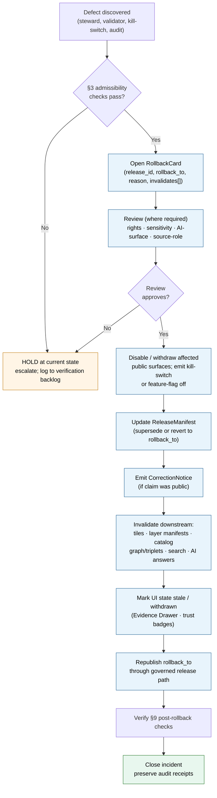

<!-- [KFM_META_BLOCK_V2]
doc_id: kfm://doc/runbook-agriculture-rollback
title: Agriculture Domain — Rollback Runbook
type: standard
version: v0.1
status: draft
owners: Docs steward + Agriculture domain steward + Release authority (TODO confirm)
created: 2026-05-13
updated: 2026-05-13
policy_label: public
related:
  - docs/doctrine/directory-rules.md
  - docs/domains/agriculture/README.md
  - docs/runbooks/README.md
  - release/rollback_cards/
  - release/correction_notices/
  - release/manifests/
tags: [kfm, runbook, agriculture, rollback, release, governance]
notes:
  - Path placement uses docs/runbooks/<domain>/ subdirectory convention.
  - Convention is PROPOSED and not directly attested in mounted-repo evidence.
  - See Section 2 for the placement basis and the related drift note.
[/KFM_META_BLOCK_V2] -->

# 🌾 Agriculture Domain — Rollback Runbook

> Operational procedure for withdrawing, superseding, or reverting a published Agriculture release. Rollback is a **governed state transition**, not a file copy.

<!-- Top-of-file impact block -->

     <!-- TODO: replace with verified Shields.io endpoints once CI badges are wired -->

| Field | Value |
|---|---|
| **Status** | `draft` |
| **Owners** | Docs steward + Agriculture domain steward + Release authority *(TODO confirm assignment)* |
| **Last updated** | 2026-05-13 |
| **Authority** | KFM core invariants + Directory Rules + Encyclopedia §7.7 + Domain Atlas §M (Agriculture) |
| **Schema home (PROPOSED)** | `schemas/contracts/v1/release/rollback_card.schema.json` (per ADR-0001 default) |
| **Artifact home (PROPOSED)** | `release/rollback_cards/` and `release/correction_notices/` |
| **Lifecycle invariant** | RAW → WORK / QUARANTINE → PROCESSED → CATALOG / TRIPLET → PUBLISHED |

---

## Quick jump

- [1. Purpose & scope](#1-purpose--scope)
- [2. When to invoke this runbook](#2-when-to-invoke-this-runbook)
- [3. Pre-rollback admissibility checks](#3-pre-rollback-admissibility-checks)
- [4. Defect-class → posture matrix](#4-defect-class--posture-matrix)
- [5. Rollback flow](#5-rollback-flow)
- [6. Step-by-step procedure](#6-step-by-step-procedure)
- [7. Required artifacts](#7-required-artifacts)
- [8. Agriculture-specific sensitivity rules](#8-agriculture-specific-sensitivity-rules)
- [9. Post-rollback verification](#9-post-rollback-verification)
- [10. Reason codes](#10-reason-codes)
- [11. Drill cadence](#11-drill-cadence)
- [12. Anti-patterns](#12-anti-patterns)
- [13. Related docs](#13-related-docs)
- [14. Appendix](#14-appendix)

---

## 1. Purpose & scope

This runbook governs **rollback of a published Agriculture release** in the Kansas Frontier Matrix (KFM). It applies whenever an already-PUBLISHED Agriculture artifact — a CropObservation derivative, a public-safe county/HUC aggregation, a CDL-derived layer, an irrigation context overlay, a suitability product, a drought / pest / stress indicator, an Evidence Drawer payload, a Focus Mode answer drawing on Agriculture evidence, or any other release-bound Agriculture surface — must be withdrawn, superseded, or reverted to a prior known-safe release.

> [!IMPORTANT]
> Rollback in KFM is a **governed state transition**, not a hidden file copy or silent mutation. Every rollback emits an auditable **RollbackCard**, may emit a **CorrectionNotice**, and re-traverses the same governed release path used by the original publication. A rollback that bypasses gates is treated as a release failure, not a rollback. *(CONFIRMED doctrine, BLD-GREEN §20; UIAI-MASTER §§10-14; BLD-COMP §§21-23, 30-31.)*

**In scope.** Withdrawal, supersession, or reversion of any Agriculture artifact in the **PUBLISHED** lifecycle state. Cascading invalidation of downstream tiles, layer manifests, search indexes, graph projections, and AI-surface answers that depend on the affected release.

**Out of scope.** Pre-publication failures (handled by the validation / promotion gates); silent edits to released artifacts (forbidden); corrections that do not require a public surface change (handled by `CorrectionNotice` alone, see §7); non-Agriculture domains (see their lane runbooks).

---

## 2. When to invoke this runbook

Invoke this runbook when one or more of the following is true for an Agriculture release:

- An **evidence defect** is discovered (broken `EvidenceRef`, missing `EvidenceBundle` closure, source-role collapse, fabricated or unsupported claim).
- A **rights or sensitivity defect** is discovered (source terms changed; field-level or operator-identifying data leaked through aggregation; private farm operation exposed).
- A **policy-gate regression** is discovered after release (`policy_label`, `rights_status`, or sensitivity tier no longer admissible).
- A **schema / contract mismatch** is discovered that invalidates downstream consumers.
- A **temporal or geometry defect** is discovered (wrong crop year, growing-season misalignment, geometry not aggregated to the required county/HUC/grid threshold).
- A **release-manifest defect** is discovered (`ROLLBACK_TARGET_MISSING`, `RELEASE_MANIFEST_INVALID`, digest mismatch).
- A **kill-switch** has fired against an Agriculture release pipeline and the affected public surface must be quarantined.
- A **steward** initiates a rollback drill as part of the cadence in §11.

> [!NOTE]
> If the defect can be addressed without changing the public surface, prefer a `CorrectionNotice` only (§7). Rollback is reserved for cases where the **current public surface itself is unsafe to keep serving**.

---

## 3. Pre-rollback admissibility checks

Before opening a RollbackCard, the on-call steward MUST verify the following. Each line is a **MUST** unless explicitly labeled SHOULD.

- [ ] The affected `release_id` is identified, and its `ReleaseManifest` is retrievable and digest-verified.
- [ ] At least one **prior safe** release of the same artifact family exists, or the decision is to **withdraw** with no replacement (record reason).
- [ ] The `rollback_to` candidate's `ReleaseManifest` is digest-verified and its `EvidenceBundle` references still resolve.
- [ ] The defect class is identified and matches one row of §4.
- [ ] Affected downstream derivatives are enumerated (tiles, layer manifests, catalog records, graph/triplet projections, search indexes, Evidence Drawer payloads, Focus Mode answers).
- [ ] Sensitivity posture of the rollback target is **at least as restrictive** as the failing release (rollback MUST NOT re-expose redacted material).
- [ ] A `ReviewRecord` is open or scheduled where the defect class requires review (rights, sensitivity, source-role, AI-surface).
- [ ] Audit receipts for the failing release are preserved unmodified (rollback never deletes evidence of the failure).

> [!WARNING]
> If **any** check fails, **do not** publish the rollback. Hold at the current state, escalate, and log the gap in `docs/registers/VERIFICATION_BACKLOG.md` (or its equivalent). Publishing an under-supported rollback **creates a second incident on top of the first.**

---

## 4. Defect-class → posture matrix

The correction and rollback postures by defect class are doctrinal. Agriculture inherits the universal matrix; the column **Agriculture-specific note** records the failure modes this domain sees most often.

| Defect class | Correction posture | Rollback posture | Agriculture-specific note |
|---|---|---|---|
| **Evidence gap** | ABSTAIN or withdraw the unsupported claim | Restore prior evidence-supported release | Common after a NASS / QuickStats source-vintage change; verify `EvidenceRef` resolution. |
| **Source-role collapse** | Re-classify source role; refuse upcast | Restore prior role-correct release | Watch for CDL / model / observation conflation; remote-sensing products MUST NOT be promoted to observation. |
| **Rights / sensitivity unresolved** | Steward review; tier reassignment; redact | Restore a release whose rights/sensitivity are current and conformant | Farm-operator, parcel, or proprietary yield exposure → fail closed; aggregate to county/HUC/grid threshold. |
| **Geometry defect** | Re-aggregate or re-mask | Restore prior public-safe geometry | Field polygons MAY be sensitive — public products MUST stay at county / HUC / grid threshold. |
| **Temporal defect** | Re-bind to correct `observed_time` / `valid_time` / `release_time` | Restore release matching the correct crop year / growing season | Crop-year and growing-season fields must remain distinct. |
| **Policy gate regression** | Re-evaluate gate; emit denial reason | Restore release covered by the current policy bundle | OPA / policy bundle changes can invalidate prior release admissibility. |
| **Validation drift** | Re-validate; fix schema or fixture | Restore validator-passing release | Schema drift in `schemas/contracts/v1/domains/agriculture/...` (PROPOSED home). |
| **Rendering / API defect** | Patch the surface; re-derive tiles or layer manifest | Restore prior tile or layer manifest digest | Public-safe CDL / county aggregation tiles must rebuild from the rollback target. |
| **AI-surface defect** | ABSTAIN, re-evaluate citation validation, emit new `AIReceipt` | Disable Focus Mode template until evidence-bounded answer can be re-derived | Focus Mode MUST NOT answer beyond the available `EvidenceBundle` and citation validation. |
| **Release infrastructure** | Manifest fix; supply rollback target | Halt promotion; restore last valid `ReleaseManifest` | `RELEASE_MANIFEST_INVALID` and `ROLLBACK_TARGET_MISSING` both block release. |

*(Matrix consolidates CONFIRMED doctrine from BLD-GREEN §20, BLD-COMP §§21-23, 30-31, IMPL-PIPE §§21, 27, UIAI-MASTER §§10-14, and DOM-AG §M; Agriculture-specific notes derived from Encyclopedia §7.7 and Domains Atlas Ch. 9.)*

---

## 5. Rollback flow

The diagram below shows the **governed** rollback path. It is not a shortcut around release controls; it re-traverses them.



*(Diagram reflects CONFIRMED rollback doctrine; node labels paraphrase the encyclopedia / build manual flow. PROPOSED until verified against mounted-repo workflows.)*

---

## 6. Step-by-step procedure

The procedure is numbered for incident-handler use. **Do not skip steps to save time.** A rollback that skips closure rules is not closed.

1. **Detect & classify.** Confirm the defect class (§4). Record the discovery channel (steward report, validator failure, kill-switch, audit, downstream complaint).
2. **Stop the bleeding.** Where the public surface itself is unsafe, **engage the kill-switch / feature flag** for the affected layer or Focus Mode template *before* opening the RollbackCard. Public exposure of a known-bad release MUST NOT continue while paperwork catches up.
3. **Run admissibility checks (§3).** Each MUST item must be confirmed or the rollback is held.
4. **Open the RollbackCard.** Required fields (PROPOSED schema, per Atlas §24.6 and Encyclopedia §H):
   - `release_id` — the failing release
   - `rollback_to` — the prior safe release (or `null` if withdraw-only)
   - `reason` — defect class + free-text summary
   - `invalidates[]` — list of downstream derivatives requiring invalidation
   - `review_ref` — `ReviewRecord` ID where required
   - `time` — UTC timestamp of decision
5. **Run required review.** Mandatory for: rights / sensitivity defects, source-role defects, AI-surface defects, any defect touching farm-operator or parcel-sensitive joins. SHOULD for: geometry, temporal, validation drift. MAY skip review for release-infrastructure defects when the rollback is purely manifest-level *and* a release authority distinct from the original author signs off.
6. **Withdraw the affected public surfaces.** Disable layer manifests, mark tiles stale, withdraw or stale-flag Evidence Drawer payloads, take Focus Mode templates offline. Trust badges in the UI MUST reflect the withdrawn state.
7. **Update the `ReleaseManifest`.** Either supersede (publish a new release pointing forward) or revert the manifest to the `rollback_to` release. **Manifest mutation in place is forbidden** — emit a new release record that captures the rollback.
8. **Emit a `CorrectionNotice`** if the failing claim was publicly visible. Required fields: `claim_ref`, `prior_release_ref`, `change_summary`, `invalidates[]`, `review_ref`, `time`.
9. **Invalidate downstream derivatives.** Trigger re-derivation or removal of tiles, COGs, PMTiles, layer manifests, catalog records, graph/triplet projections, search indexes, and any AI receipts whose `EvidenceRef` resolved through the failing release.
10. **Republish the rollback target through the governed release path.** A rollback is **not** a backdoor — the rollback target re-enters PUBLISHED only after passing the same validation, policy, review, and release gates as any new release.
11. **Verify (§9).** Run the post-rollback verification checklist.
12. **Preserve audit.** All receipts for the failing release remain in the audit ledger, untouched. The RollbackCard, CorrectionNotice, and superseding ReleaseManifest are added to the ledger alongside them.
13. **Close the incident.** Update `docs/registers/DRIFT_REGISTER.md` (or equivalent) if the rollback exposed a systemic issue; update `docs/registers/VERIFICATION_BACKLOG.md` with any new verification items.

---

## 7. Required artifacts

A closed Agriculture rollback emits or references **all** of the following. Missing any of these fails the universal closure rule and the rollback is not considered complete.

| Artifact | Purpose | Required home (PROPOSED) | Required fields (PROPOSED) |
|---|---|---|---|
| `RollbackCard` | Records the rollback decision and targeted prior release. | `release/rollback_cards/` | `release_id`, `rollback_to`, `reason`, `invalidates[]`, `review_ref`, `time` |
| `CorrectionNotice` | Public notice of the corrected claim. | `release/correction_notices/` | `claim_ref`, `prior_release_ref`, `change_summary`, `invalidates[]`, `review_ref`, `time` |
| `ReleaseManifest` (superseding) | Binds the rollback target's artifacts, validation, policy, review, checksums, and forward rollback target. | `release/manifests/` | `release_id`, `contents[]`, `digests`, `evidence_refs[]`, `rollback_target`, `time` |
| `ReviewRecord` | Auditable reviewer action where required by defect class. | `release/reviews/` *(PROPOSED)* or `policy/governance/` | reviewer identity, decision, reason, `time` |
| `PolicyDecision` | Re-evaluation of the policy gate against the rollback target. | within the release path / OPA decision log | ALLOW / RESTRICT / DENY / ABSTAIN / ERROR + reason code |
| `EvidenceBundle` (re-resolved) | Confirms the rollback target's claims still resolve. | `data/proofs/` | resolved evidence + closure proof |
| Audit-ledger entries | Immutable record of failure, rollback decision, and superseding release. | append-only ledger | run / decision / receipt references |

> [!TIP]
> A rollback is "closed" only when (i) the required artifacts above exist, (ii) every required artifact **resolves** the artifacts it depends on (not just references them — `EvidenceRef` → `EvidenceBundle`, `source_id` → `SourceDescriptor`, `model_id` → `ModelRunReceipt`), and (iii) the policy gate evaluated and recorded its decision. Missing any of these means the transition **fails closed** and the prior state is preserved. *(CONFIRMED doctrine.)*

---

## 8. Agriculture-specific sensitivity rules

Agriculture sits next to private property, livelihoods, and source-rights-limited datasets. Sensitivity rules are **non-negotiable** during rollback.

> [!CAUTION]
> Rolling back **into** a more permissive sensitivity posture is forbidden. The rollback target's exposure surface MUST be **at least as restrictive** as the failing release. A rollback that re-exposes redacted farm-operator joins, field-level NASS detail, or proprietary yield records is **not a rollback — it is a new release failure**, and MUST be denied at the policy gate.

**Field-level and operator-identifying data.** Public products MUST aggregate to **county / HUC / grid thresholds**. Field polygons MAY be sensitive. Private farm operations, field-level sensitive details, and source-rights-limited data are denied by default and MUST NOT appear in any rolled-back public surface.

**Source-role boundaries.** Distinguish CDL / model / observation / regulatory / legal / status contexts. Remote-sensing products (e.g., CDL, HLS-VI, SMAP) are **not** ground truth — rollback MUST preserve the source-role distinction.

**Temporal handling.** Crop year, growing season, observed time, valid time, retrieval time, release time, and correction time stay distinct. A rollback that collapses them is rejected.

**Cross-lane joins.** Soil (MUKEY), Hydrology (irrigation, drought, water-use), Atmosphere/Air (weather, heat, smoke, vegetation stress), and People/Land (parcel/operator) joins MUST preserve ownership, source role, sensitivity tier, and `EvidenceBundle` support after rollback. Parcel-sensitive contexts remain restricted.

---

## 9. Post-rollback verification

After republishing the rollback target, the steward verifies the following before closing the incident:

- [ ] The superseding `ReleaseManifest` resolves; `digests` match emitted artifacts.
- [ ] The `RollbackCard` resolves to both the failing `release_id` and the `rollback_to` release.
- [ ] All entries in `invalidates[]` have been re-derived or removed; **no orphan downstream derivative** points at the failing release.
- [ ] The `CorrectionNotice` is visible on the public surface where the failing claim appeared (Evidence Drawer, Focus Mode answer trail, catalog record).
- [ ] UI trust state for the affected surface is no longer "fresh" — it reflects "withdrawn", "superseded", or "stale" as appropriate.
- [ ] Search index, graph / triplet projection, and any AI receipts that depended on the failing release have been invalidated or re-derived.
- [ ] Policy gate re-evaluation recorded ALLOW (or the documented finite outcome).
- [ ] Replay verification fixture restores prior root hash and manifest *(per the map-release rollback-replay test pattern; CONFIRMED at doctrine level, PROPOSED at implementation level)*.
- [ ] Audit-ledger entries for the failing release remain unmodified.
- [ ] If the defect exposed a systemic issue, a `DRIFT_REGISTER` and/or `VERIFICATION_BACKLOG` entry has been opened.

---

## 10. Reason codes

The reason field of the `RollbackCard` SHOULD use a code from the PROPOSED catalog below, plus free-text detail. Codes are inherited from the universal failure-family list in the Domains Atlas §24.6.3.

| Code | Family | Typical Agriculture trigger |
|---|---|---|
| `MISSING_RECEIPT` | Missing required artifact | `RunReceipt` for a derivative tile / aggregation absent. |
| `MISSING_EVIDENCE` | Missing required artifact | `EvidenceRef` does not resolve to an `EvidenceBundle`. |
| `MISSING_REVIEW` | Missing required artifact | Sensitivity / rights review absent on a release that needed it. |
| `SCHEMA_MISMATCH` | Schema / contract drift | DTO field renamed without ADR; downstream parser breaks. |
| `CONTRACT_DRIFT` | Schema / contract drift | Object-family meaning has shifted relative to `contracts/domains/agriculture/`. |
| `RIGHTS_UNKNOWN` | Rights / sensitivity unresolved | NASS / QuickStats / Mesonet source terms updated; status no longer known. |
| `SENSITIVITY_UNRESOLVED` | Rights / sensitivity unresolved | Farm-operator or parcel-sensitive join slipped through aggregation. |
| `ROLE_COLLAPSE` | Source-role collapse | CDL / model output presented as observation. |
| `ROLE_DOWNCAST_FORBIDDEN` | Source-role collapse | Attempted upcast of an indicator to a regulatory status. |
| `REVIEW_NEEDED` | Review state inadequate | Rollback discovered review was never performed. |
| `REVIEW_INSUFFICIENT` | Review state inadequate | Review record present but does not cover the defect class. |
| `REVIEW_REJECTED` | Review state inadequate | Reviewer rejected the release after public exposure began. |
| `RELEASE_MANIFEST_INVALID` | Release infrastructure error | Manifest digest mismatch; signature failure. |
| `ROLLBACK_TARGET_MISSING` | Release infrastructure error | No prior safe release exists; withdraw-only path required. |

---

## 11. Drill cadence

Rollback that has never been exercised is not reliable. *(CONFIRMED doctrine: "Rollback untested is not reliable" — Encyclopedia §7.7 risk table.)*

| Drill | Cadence (PROPOSED) | Scope | Owner |
|---|---|---|---|
| **Per-release smoke** | Every release | Verify `rollback_target` resolves; replay fixture passes. | Release authority |
| **Domain rollback drill** | Quarterly | End-to-end rollback against a synthetic Agriculture release. | Agriculture domain steward |
| **Cross-lane invalidation** | Semi-annual | Rollback of a release whose `invalidates[]` crosses Soil / Hydrology / Atmosphere lanes. | Release authority + adjacent domain stewards |
| **Withdraw-only rehearsal** | Annual | Withdraw with no replacement (e.g., source-rights revocation). | Agriculture domain steward + rights reviewer |
| **AI-surface rollback** | Per material AI / Focus Mode change | Disable Focus Mode template; verify ABSTAIN path. | Governed-AI subsystem owner |

> [!NOTE]
> Drill outcomes SHOULD be logged in `docs/runbooks/` alongside this file (e.g., `docs/runbooks/agriculture/ROLLBACK_DRILL_LOG.md` — **PROPOSED path**) so a reviewer can see when the procedure was last exercised end-to-end.

---

## 12. Anti-patterns

> [!WARNING]
> The following are not rollbacks. They are release failures dressed as rollbacks, and the policy gate MUST refuse them.

- **Silent mutation of a published artifact.** A release is never "patched in place" — corrections supersede, rollbacks revert through the governed path.
- **`rollback_to` set to a release that does not resolve.** `ROLLBACK_TARGET_MISSING`. Use the withdraw-only path instead.
- **Rolling back into a less restrictive sensitivity posture.** Re-exposing redacted material is a new release failure.
- **Skipping `CorrectionNotice` because "the defect was minor".** If the claim was public, the correction is public.
- **Treating tile re-derivation or cache invalidation as a complete rollback.** Derivatives are downstream; the `ReleaseManifest` and `RollbackCard` are the rollback.
- **Editing the audit ledger.** Audit entries for the failing release stay unmodified — the ledger is append-only.
- **Letting an AI surface keep answering from a withdrawn `EvidenceBundle`.** Focus Mode MUST ABSTAIN until evidence is re-resolved against the rollback target.
- **PR-bypass / "admin shortcut" rollback.** Admin shortcuts MUST be justified, constrained, documented, and kept out of the normal public path.

---

## 13. Related docs

- [`docs/doctrine/directory-rules.md`](../../doctrine/directory-rules.md) — placement authority; defines `release/`, `data/`, and `docs/runbooks/` responsibilities. *(PROPOSED relative link.)*
- [`docs/domains/agriculture/README.md`](../../domains/agriculture/README.md) — Agriculture domain overview, object families, source roles. *(PROPOSED — file may not yet exist.)*
- [`docs/runbooks/README.md`](../README.md) — runbook index and conventions. *(PROPOSED — file may not yet exist.)*
- `release/rollback_cards/` — RollbackCard artifact home.
- `release/correction_notices/` — CorrectionNotice artifact home.
- `release/manifests/` — ReleaseManifest artifact home.
- `policy/domains/agriculture/` — Agriculture admissibility / sensitivity policy *(PROPOSED home)*.
- `schemas/contracts/v1/release/` — RollbackCard / CorrectionNotice / ReleaseManifest schemas *(PROPOSED home per ADR-0001 default)*.
- `docs/registers/DRIFT_REGISTER.md` and `docs/registers/VERIFICATION_BACKLOG.md` — where systemic findings land.

[Back to top](#-agriculture-domain--rollback-runbook)

---

## 14. Appendix

<details>
<summary><strong>A. Illustrative RollbackCard skeleton (PROPOSED schema, not validated)</strong></summary>

The fields below mirror the Domains Atlas §24.2 receipt-table specification for `RollbackCard`. Field names, casing, and the JSON shape are **illustrative only** — the canonical schema lives in `schemas/contracts/v1/release/rollback_card.schema.json` *(PROPOSED home; verify against repo and ADR-0001)*.

```json
{
  "kind": "RollbackCard",
  "release_id": "kfm://release/agriculture/county-crop-year/2024/v3",
  "rollback_to": "kfm://release/agriculture/county-crop-year/2024/v2",
  "reason": {
    "code": "SENSITIVITY_UNRESOLVED",
    "summary": "Operator-identifying join slipped through county aggregation; v3 withdrawn."
  },
  "invalidates": [
    "kfm://layer/agriculture/county-crop-year-2024/v3",
    "kfm://tile/agriculture/county-crop-year-2024/v3",
    "kfm://catalog/agriculture/county-crop-year-2024/v3",
    "kfm://evidence-drawer/agriculture/county-crop-year/v3"
  ],
  "review_ref": "kfm://review/agriculture/sensitivity/2026-05-13-001",
  "time": "2026-05-13T18:42:00Z"
}
```

</details>

<details>
<summary><strong>B. Illustrative CorrectionNotice skeleton (PROPOSED schema)</strong></summary>

```json
{
  "kind": "CorrectionNotice",
  "claim_ref": "kfm://claim/agriculture/county-crop-year-2024-rooks-co",
  "prior_release_ref": "kfm://release/agriculture/county-crop-year/2024/v3",
  "change_summary": "Public-safe aggregation product v3 withdrawn pending sensitivity re-review; superseded by v4 once review closes.",
  "invalidates": [
    "kfm://focus-answer/agriculture/2026-05-12-rooks-co-yield-summary"
  ],
  "review_ref": "kfm://review/agriculture/sensitivity/2026-05-13-001",
  "time": "2026-05-13T18:43:00Z"
}
```

</details>

<details>
<summary><strong>C. Agriculture object families touched by rollback (Encyclopedia §7.7)</strong></summary>

`CropObservation` · `FieldCandidate` · `CropRotation` · `YieldObservation` · `IrrigationLink` · `ConservationPractice` · `SoilCropSuitability` · `AgriculturalEconomyObservation` · `SupplyChainNode` · `DroughtStressIndicator` · `PestStressIndicator` · `AggregationReceipt`

A rollback that touches any of the above SHOULD enumerate the affected family in the RollbackCard's `reason.summary` so reviewers can scope downstream invalidation.

</details>

<details>
<summary><strong>D. Open ADR-class questions surfaced by this runbook</strong></summary>

- The path `docs/runbooks/<domain>/<RUNBOOK>.md` follows the same domain-subdirectory pattern as `docs/domains/<domain>/` but is not directly attested in current Directory Rules text. A short ADR or a per-root README in `docs/runbooks/` SHOULD confirm or amend this convention. Until then this path is **PROPOSED**.
- The exact schema home for `RollbackCard`, `CorrectionNotice`, and `ReleaseManifest` follows ADR-0001's default (`schemas/contracts/v1/release/...`), but mounted-repo verification is required before this runbook's `release/` references can be relied on as canonical.
- Drill cadence in §11 is **PROPOSED**. A governance / release-authority ADR or per-root README in `release/` SHOULD ratify it.

</details>

---

**Related docs:** [Directory Rules](../../doctrine/directory-rules.md) · [Agriculture domain README](../../domains/agriculture/README.md) *(PROPOSED)* · [Runbooks index](../README.md) *(PROPOSED)*

**Last updated:** 2026-05-13 · **Version:** v0.1 · **Status:** draft

[Back to top](#-agriculture-domain--rollback-runbook)
