<!-- [KFM_META_BLOCK_V2]
doc_id: kfm://doc/runbook/agriculture/source-refresh
title: Agriculture Source Refresh Runbook
type: standard
version: v0.1
status: draft
owners: <Agriculture domain steward> + <Source/connector steward> + <Docs steward>
created: 2026-05-13
updated: 2026-05-13
policy_label: public
related:
  - docs/domains/agriculture/README.md
  - docs/sources/SOURCE_DESCRIPTOR_STANDARD.md
  - docs/runbooks/ui_VALIDATION.md
  - docs/runbooks/ui_ROLLBACK.md
  - docs/doctrine/directory-rules.md
  - docs/doctrine/lifecycle-law.md
  - docs/doctrine/trust-membrane.md
  - control_plane/source_authority_register.yaml
tags: [kfm, runbook, agriculture, sources, lifecycle, governance]
notes:
  - "Path PROPOSED: docs/runbooks/ relative to repo root; subdomain segment NEEDS VERIFICATION against current convention (visible neighbours use flat names such as ui_LOCAL_DEV.md). See §10."
  - "All cadence numbers PROPOSED placeholders; per-source values live in control_plane/source_authority_register.yaml once verified."
[/KFM_META_BLOCK_V2] -->

# Agriculture Source Refresh Runbook

> Operational procedure for refreshing Agriculture-domain external sources through the **RAW → WORK / QUARANTINE → PROCESSED → CATALOG / TRIPLET → PUBLISHED** lifecycle, fail-closed, with public-safe aggregation by default.

[](#)
[](#)
[](#)
[](#)
[](#)
[](#)

| Field | Value |
|---|---|
| **Status** | `draft` — first issue; gates not yet wired in mounted repo (NEEDS VERIFICATION) |
| **Owners** | Agriculture domain steward · Source/connector steward · Docs steward *(placeholder; confirm in CODEOWNERS)* |
| **Last updated** | 2026-05-13 |
| **Lifecycle invariant** | RAW → WORK / QUARANTINE → PROCESSED → CATALOG / TRIPLET → PUBLISHED |
| **Truth posture** | Cite-or-abstain; promotion is a governed state transition, not a file move |

---

## 📑 Contents

1. [Purpose & Scope](#1-purpose--scope)
2. [Repo Fit](#2-repo-fit)
3. [Inputs](#3-inputs)
4. [Exclusions](#4-exclusions)
5. [Source Families in Scope](#5-source-families-in-scope)
6. [Lifecycle Flow](#6-lifecycle-flow)
7. [Refresh Cadence & Triggers](#7-refresh-cadence--triggers)
8. [Preconditions](#8-preconditions)
9. [Procedure](#9-procedure)
10. [Fail-Closed Conditions](#10-fail-closed-conditions)
11. [Receipts Emitted](#11-receipts-emitted)
12. [Validation](#12-validation)
13. [Rollback](#13-rollback)
14. [Stale-State Handling](#14-stale-state-handling)
15. [Task Checklist](#15-task-checklist)
16. [FAQ](#16-faq)
17. [Related Docs](#17-related-docs)
18. [Appendix](#18-appendix)

---

## 1. Purpose & Scope

**CONFIRMED doctrine.** Agriculture represents crops, fields, soils, irrigation, yields, conservation practices, and the agricultural economy in **public-safe aggregate or permissioned form**, and **must not** publish private farm operations, field-level sensitive details, or source-rights-limited data without review. This runbook is the operational expression of those rules at the *source refresh* boundary — the recurring step that re-admits external evidence, re-validates it, and either holds or promotes the resulting derivatives.

The runbook covers a single, recurring transaction: **bringing one or more Agriculture source families forward by one cadence step**, with all governance artifacts that a release-quality refresh requires. It is the same loop whether triggered by schedule, watcher, manual operator request, or rollback-and-replay.

> [!IMPORTANT]
> This runbook does **not** decide whether a source *should* be admitted. Admission is decided by `policy/`, `contracts/source/`, and the source authority register. This runbook describes **how** an already-admitted source is refreshed safely.

[↑ Back to top](#agriculture-source-refresh-runbook)

---

## 2. Repo Fit

| Aspect | Value | Truth label |
|---|---|---|
| **This file** | `docs/runbooks/agriculture/SOURCE_REFRESH_RUNBOOK.md` | PROPOSED — see §10 placement note |
| **Responsibility root** | `docs/` (human-facing control plane) | CONFIRMED rule |
| **Owning domain segment** | `agriculture` | CONFIRMED domain |
| **Upstream doctrine** | `docs/doctrine/lifecycle-law.md` · `docs/doctrine/truth-posture.md` · `docs/doctrine/trust-membrane.md` · `docs/doctrine/directory-rules.md` | CONFIRMED rule / PROPOSED presence |
| **Upstream contracts** | `contracts/source/` · `contracts/evidence/` · `contracts/runtime/` · `contracts/release/` · `contracts/domains/agriculture/` | PROPOSED |
| **Upstream schemas** | `schemas/contracts/v1/source/` · `schemas/contracts/v1/receipts/` · `schemas/contracts/v1/release/` · `schemas/contracts/v1/domains/agriculture/` | PROPOSED |
| **Upstream policy** | `policy/domains/agriculture/` · `policy/sensitivity/` · `policy/publication/` | PROPOSED |
| **Upstream pipelines** | `pipelines/domains/agriculture/` · `pipeline_specs/agriculture/` · `connectors/<source>/` | PROPOSED |
| **Source register** | `control_plane/source_authority_register.yaml` · `data/registry/sources/agriculture/` | PROPOSED |
| **Downstream lifecycle data** | `data/raw/agriculture/<source_id>/<run_id>/` → `data/work/agriculture/<run_id>/` → `data/quarantine/agriculture/<reason>/<run_id>/` → `data/processed/agriculture/<dataset_id>/<version>/` → `data/catalog/domain/agriculture/` → `data/published/layers/agriculture/` | PROPOSED — paths match Directory Rules §9.1 |
| **Downstream proofs & receipts** | `data/receipts/ingest/` · `data/receipts/validation/` · `data/receipts/ai/` · `data/receipts/release/` · `data/proofs/evidence_bundle/` · `data/proofs/validation_report/` | PROPOSED |
| **Release artifacts** | `release/candidates/agriculture/` · `release/manifests/` · `data/rollback/agriculture/<release_id>/` | PROPOSED |
| **Sibling runbooks** | `docs/runbooks/ui_LOCAL_DEV.md` · `ui_VALIDATION.md` · `ui_ROLLBACK.md` · `governed_ai_*` | PROPOSED — names visible in domain dossiers; presence NEEDS VERIFICATION |

[↑ Back to top](#agriculture-source-refresh-runbook)

---

## 3. Inputs

A source refresh consumes these inputs. Anything missing from this list is a precondition failure (see §8).

- **Source candidate set.** One or more `source_id` values from `control_plane/source_authority_register.yaml`, scoped to the Agriculture lane.
- **SourceDescriptor (current).** For each source: identity, role, authority, rights, sensitivity, cadence, last admission hash, citation.
- **Conditional-fetch validators (where available).** Stored ETag, Last-Modified, or manifest SHA-256 from the prior admission.
- **Geography version.** The current `GeographyVersion` (county, HUC, grid) used by aggregation receipts.
- **Policy bundle (current).** Sensitivity, rights, aggregation-threshold, public-safe-publication rules.
- **Schema version (current).** The active version of every domain object schema the refresh produces.
- **Fixture set.** Valid and invalid no-network fixtures for the source family. CI must pass these before any live fetch.
- **Operator identity.** The actor running the refresh, recorded in every emitted RunReceipt.

[↑ Back to top](#agriculture-source-refresh-runbook)

---

## 4. Exclusions

> [!WARNING]
> A refresh that produces **any** of the artifacts below **MUST fail closed** rather than publish.

- **Field-level or operator-identifying outputs** for any public surface. Public products aggregate to county / HUC / grid thresholds; field polygons may be sensitive and stay restricted by default.
- **Private farm operations data**, proprietary yields, pesticide records, or owner identities, regardless of source.
- **Source-rights-limited data** for which redistribution class, license terms, or attribution requirements are unknown or unresolved.
- **Emergency-warning or life-safety claims.** Agriculture is not an alert authority; drought, frost, smoke, or pest content stays contextual with redirection to official sources.
- **Automated publish to public surfaces** without governed promotion. No connector, watcher, or refresh job has a direct write path to `data/published/` or `release/manifests/`. Publication is a separate, signed step.
- **Inferences presented as observations.** Modeled, derived, candidate, or AI-summarized values must carry the matching source-role and receipt (`ModelRunReceipt`, `AIReceipt`) and never be relabeled as observed evidence.

Where the refresh genuinely needs to handle excluded categories (e.g. a steward-only restricted view), it is routed through the **restricted lane**, never the public lane.

[↑ Back to top](#agriculture-source-refresh-runbook)

---

## 5. Source Families in Scope

**CONFIRMED source families** for Agriculture (from domain doctrine). **PROPOSED** implementation: connectors, cadence numbers, and rights resolution NEEDS VERIFICATION per source.

| Source family | Typical role | Rights / sensitivity posture | Cadence character | Status |
|---|---|---|---|---|
| USDA NASS CDL | authority / observation | public terms; verify per release | annual (crop-year) | CONFIRMED family · PROPOSED connector |
| USDA NASS QuickStats | authority / observation | public terms; verify rate limits and attribution | scheduled releases | CONFIRMED family · PROPOSED connector |
| NRCS conservation practice data | authority / observation | rights NEEDS VERIFICATION; can carry sensitive joins | source-vintage | CONFIRMED family · PROPOSED connector |
| SSURGO / Soil Data Access | authority / context | public terms; vintage-sensitive | versioned, infrequent | CONFIRMED family · PROPOSED connector |
| gSSURGO (gridded) | authority / context | public terms; vintage-sensitive | versioned | CONFIRMED family · PROPOSED connector |
| Kansas Mesonet (soil moisture / weather) | observation | data-usage policy posted; written consent may be required for ingest | hourly / sub-hourly | CONFIRMED family · PROPOSED connector |
| NRCS SCAN | observation | rights NEEDS VERIFICATION | hourly | CONFIRMED family · PROPOSED connector |
| NOAA USCRN | observation | public terms; verify | hourly | CONFIRMED family · PROPOSED connector |
| NASA SMAP (e.g. SPL4SMGP) | observation / model | public terms; cite product version | ~3-hourly granules | CONFIRMED family · PROPOSED connector |
| NASA HLS / HLS-VI | observation | public terms; cite product version | revisit-cadence specific | CONFIRMED family · PROPOSED connector |
| Crop insurance / market / economy sources | context / observation | rights vary; treat as restricted until cleared | varies | CONFIRMED family · PROPOSED connector |
| Local extension sources | context | rights vary; steward review | varies | CONFIRMED family · PROPOSED connector |

> [!NOTE]
> The authoritative, machine-readable form of this table lives in `control_plane/source_authority_register.yaml`. This Markdown table is a **navigational** view; if the two ever conflict, the register wins and a `docs/registers/DRIFT_REGISTER.md` entry should be opened.

[↑ Back to top](#agriculture-source-refresh-runbook)

---

## 6. Lifecycle Flow

The refresh runs the same lifecycle every cycle. Each gate has required artifacts; missing artifacts **MUST** stall the cycle at the prior phase rather than silently promote.

```mermaid
flowchart LR
    A([Trigger<br/>schedule · watcher · operator]) --> B{Conditional fetch<br/>HEAD / ETag / Last-Modified}
    B -- 304 / no change --> Z[Emit no-change RunReceipt<br/>exit]
    B -- 200 / new bytes --> C[RAW<br/>data/raw/agriculture/.../]
    C --> D[WORK<br/>normalize schema · geometry · time · identity]
    D -->|rights · sensitivity · validation · source-role · evidence defect| Q[QUARANTINE<br/>with reason + receipt]
    D --> E[PROCESSED<br/>validated normalized objects<br/>EvidenceRef · ValidationReport · digest closure]
    E --> F[CATALOG / TRIPLET<br/>EvidenceBundle · CatalogMatrix · graph projection]
    F --> G{Public lane?}
    G -- "Yes (county/HUC aggregate)" --> H[AggregationReceipt + RedactionReceipt as needed]
    G -- "No (steward-only / restricted)" --> I[Restricted surface only]
    H --> J[CATALOG release candidate]
    I --> J
    J --> K{All promotion gates pass?}
    K -- No --> L[HOLD<br/>no public surface change]
    K -- Yes --> M[PUBLISHED<br/>ReleaseManifest · rollback target · correction path]
    M --> N[Emit release-cycle RunReceipt]
```



**Doctrine source:** lifecycle invariant and gate requirements are CONFIRMED in KFM doctrine; **PROPOSED** implementation per Agriculture lane. Specific gate orchestration and CI wiring NEEDS VERIFICATION against a mounted repo.

### 6.1 Gate matrix

| Gate (transition) | Required artifacts | Fail-closed outcome |
|---|---|---|
| Admission (— → RAW) | `SourceDescriptor`; payload hash or reference | Candidate logged; not admitted |
| Normalization (RAW → WORK / QUARANTINE) | `TransformReceipt`; working `ValidationReport`; `PolicyDecision`; QUARANTINE reason for failures | Quarantine with reason; never silently promotes |
| Validation (WORK → PROCESSED) | `ValidationReport` pass; `RedactionReceipt` if sensitivity applies; `AggregationReceipt` if applies | Stays in WORK; structured FAIL |
| Catalog closure (PROCESSED → CATALOG / TRIPLET) | `CatalogMatrix` entry; `EvidenceBundle`; graph/triplet projections where applicable | HOLD at PROCESSED; structured FAIL; no public edge |
| Release (CATALOG / TRIPLET → PUBLISHED) | `ReleaseManifest`; rollback target; correction path; `ReviewRecord` if required | HOLD at CATALOG; no public surface change |
| Correction (PUBLISHED → PUBLISHED′) | `CorrectionNotice`; superseding release; derivative invalidation record | Withdraw or restrict prior surface; never silently mutate |

[↑ Back to top](#agriculture-source-refresh-runbook)

---

## 7. Refresh Cadence & Triggers

Cadence is **per-source**, declared in the `SourceDescriptor.cadence` field, and enforced by the source authority register. The runbook itself does not pick the cadence — it executes against the declared cadence.

| Trigger type | Description | Notes |
|---|---|---|
| **Scheduled** | Cron-style cadence from `SourceDescriptor` (`PROPOSED`: hourly for station data; daily for satellite; per-release for SSURGO / CDL / QuickStats) | Concrete numbers belong in the source register, not here |
| **Watcher** | Conditional HEAD/ETag/Last-Modified or manifest-SHA change detection; a watcher opens a PR or emits a delta, it does **not** publish | Doctrine: watcher-as-non-publisher |
| **Operator** | Manual run requested by a steward (e.g. backfill, smoke test, post-incident replay) | Records actor in every receipt |
| **Rollback replay** | Refresh re-run against a prior release’s rollback target to restore the prior safe state | See §13 |

> [!TIP]
> Use **conditional GETs** by default. Send `If-None-Match` with the stored ETag (or `If-Modified-Since` with Last-Modified); on `304 Not Modified` emit a no-change RunReceipt and exit. This is the cheapest, most auditable form of "no work today" and keeps the receipt ledger honest about cadence.

### 7.1 Debounce and persistence

- Apply a **debounce window** to bursty upstreams so a brief flurry of changes coalesces into one delta.
- Apply **persistence rules** for anomaly-style sources (e.g. a satellite anomaly should require ≥2 independent observations in a rolling window before promoting a status change).
- Concrete window numbers are **PROPOSED** and live in `docs/standards/DEBOUNCE_WINDOWS.md` (PROPOSED) or `control_plane/source_authority_register.yaml`.

[↑ Back to top](#agriculture-source-refresh-runbook)

---

## 8. Preconditions

The cycle **MUST** abort before any live fetch if any of the following is missing or stale:

1. `SourceDescriptor` for every targeted `source_id` is present, current, and not in a superseded state.
2. Rights status is `cleared` (or equivalent) **or** the run is explicitly bound to the restricted lane.
3. Sensitivity class is recorded and consistent with policy; field-level sensitive data is routed to the restricted lane only.
4. Schema versions for source, evidence, receipt, release, and domain object families are pinned.
5. Geography version is pinned and current.
6. Policy bundle version is pinned and current.
7. No-network fixtures pass (valid + invalid) for the source family.
8. Disk, network, and rate-limit budgets are respected (politeness constraints per provider).
9. Operator identity and reason for run are recorded.
10. Rollback target for any currently published Agriculture release is reachable.

> [!CAUTION]
> A precondition failure is not "skip and continue." It is a structured fail-closed: emit an error envelope with `reason_code`, halt the cycle, and require steward review before re-running.

[↑ Back to top](#agriculture-source-refresh-runbook)

---

## 9. Procedure

The procedure below is the **PROPOSED** canonical sequence. Concrete CLI invocations, scripts, and CI job names are intentionally omitted — they belong to the connector and pipeline lanes once verified against a mounted repo. This runbook governs the *order* and the *receipts*, not the keystrokes.

### 9.1 Plan

1. Identify the `source_id` set in scope.
2. Pull the current `SourceDescriptor`, validators, schema versions, policy version, and geography version.
3. Confirm preconditions (§8). Abort on any failure.
4. Record `run_id`, `operator`, `reason`, and the input snapshot in an `event_envelope` (pre-RAW).

### 9.2 Conditional fetch (HEAD probe)

1. For each source, issue a `HEAD` (or equivalent metadata probe) and compare `ETag` / `Last-Modified` / manifest SHA against the prior stored values.
2. On **no change**: emit a `RunReceipt` with `outcome: NO_CHANGE`, do **not** write to RAW, exit.
3. On **change** or missing validators with verified content drift: proceed to admission.

### 9.3 Admission to RAW

1. Fetch the new payload (or reference).
2. Hash the payload and pin it under source identity in `data/raw/agriculture/<source_id>/<run_id>/`.
3. Emit an `ingest` `RunReceipt` recording URL, validators, hash, time, operator, and `spec_hash`.

### 9.4 Normalize to WORK or QUARANTINE

1. Run schema, geometry, time, identity, evidence, rights, and policy normalizers.
2. On any defect (rights ambiguity, sensitivity conflict, geometry invalidity, temporal inconsistency, source-role mismatch, evidence gap), move the working set to `data/quarantine/agriculture/<reason>/<run_id>/` with a quarantine `RunReceipt` carrying the reason code.
3. On clean normalization, retain in `data/work/agriculture/<run_id>/`, emit a `TransformReceipt` and a working `ValidationReport`.

### 9.5 Validate to PROCESSED

1. Run validators (deterministic, fixture-tied).
2. Apply `RedactionReceipt` for any sensitive fields entering a public-eligible derivative.
3. Apply `AggregationReceipt` for any county / HUC / grid roll-up that will appear publicly.
4. On pass, write normalized objects to `data/processed/agriculture/<dataset_id>/<version>/`, emit a `ValidationReport` and update digest closure.
5. On fail, **stay in WORK** with a structured FAIL outcome; do **not** create a PROCESSED entry.

### 9.6 Close to CATALOG / TRIPLET

1. Resolve every `EvidenceRef` to a complete `EvidenceBundle`. Unresolved refs → HOLD.
2. Emit `CatalogMatrix` entry and graph/triplet projections where applicable.
3. Confirm digest closure across catalog, proof, and processed sides.

### 9.7 Promote to PUBLISHED (separate, signed step)

1. Confirm `ReviewRecord` exists where the sensitive lane or policy requires it.
2. Emit a `ReleaseManifest` listing contents, digests, evidence refs, rollback target, and correction path.
3. Sign the manifest per release-signing policy.
4. Activate public surfaces only after the signed manifest exists; the public path consumes governed APIs and released payloads only — never RAW, WORK, QUARANTINE, candidate, or canonical stores directly.
5. Emit a release `RunReceipt`.

### 9.8 Close out

1. Update `data/registry/sources/agriculture/` with the new admission state.
2. Update freshness markers in the source register.
3. Append the cycle’s receipts to the cycle log.
4. Open any drift entries or verification backlog items the cycle surfaced.

[↑ Back to top](#agriculture-source-refresh-runbook)

---

## 10. Fail-Closed Conditions

> [!IMPORTANT]
> Every condition below is a **fail-closed**: cycle halts at the prior phase, structured outcome is emitted, public surfaces are unchanged. Silence is a violation; the absence of a successful receipt does not imply success.

| Condition | Phase | Outcome |
|---|---|---|
| Missing or stale `SourceDescriptor` | Preconditions | `ERROR` |
| Rights unknown / unresolved | Preconditions / WORK | `QUARANTINE` (rights) |
| Sensitivity unresolved | Preconditions / WORK | `QUARANTINE` (sensitivity) |
| Schema or geography version drift | Preconditions | `ERROR` until rebound |
| Conditional-fetch validators absent and content drift unverifiable | Fetch | `ABSTAIN` or `QUARANTINE` |
| Geometry invalid / topology breaks | WORK | `QUARANTINE` (geometry) |
| Temporal logic broken (e.g. observed > release) | WORK | `QUARANTINE` (temporal) |
| Source-role mismatch (e.g. modeled value marked observed) | WORK | `QUARANTINE` (source-role) |
| Evidence gap (`EvidenceRef` unresolved) | PROCESSED → CATALOG | `HOLD` at PROCESSED |
| Aggregation threshold violated (would expose field-level) | PROCESSED / aggregation | `DENY` for public lane |
| Public field-level claim attempted | Any | `DENY` |
| Missing `ReviewRecord` where required | Release | `HOLD` at CATALOG |
| Missing rollback target | Release | `HOLD` at CATALOG |
| Unsigned `ReleaseManifest` | Release | `DENY` |
| KFM presented as alert / life-safety authority | Any | `DENY` |
| Direct browser/public access to RAW/WORK/QUARANTINE/canonical stores | Any | `DENY` (trust-membrane invariant) |

[↑ Back to top](#agriculture-source-refresh-runbook)

---

## 11. Receipts Emitted

A refresh cycle emits **structured receipts** at every consequential step. If a consequential step has no receipt, the step did not happen in the governed sense.

| Receipt | When emitted | Required fields (PROPOSED shape) |
|---|---|---|
| `SourceDescriptor` (refreshed) | Admission | `source_id`, `source_role`, `authority`, `rights`, `sensitivity`, `cadence`, ingest hash, time, citation |
| `RunReceipt` (no-change) | Conditional fetch with 304 | `run_id`, `inputs`, validators, `outcome: NO_CHANGE`, `spec_hash`, time, operator |
| `RunReceipt` (ingest) | RAW admission | `run_id`, source URL, ETag, Last-Modified, payload hash, `spec_hash`, time, operator |
| `TransformReceipt` | Geometry / projection / generalization in WORK | input hash, output hash, transform, parameters, tolerance, time, actor |
| `ValidationReport` | WORK validation; PROCESSED → CATALOG closure | validator id, target, passes, failures, deterministic inputs, time |
| `PolicyDecision` | Every governed gate | policy id, target, decision, reason code, time, evidence refs |
| `RedactionReceipt` | Sensitive fields entering public derivative | policy ref, redaction method, kept / removed fields, geometry transform, reviewer |
| `AggregationReceipt` | County / HUC / grid roll-up for public surface | geometry scope, time scope, method, input source refs, suppression rule, output unit |
| `ModelRunReceipt` | Modeled outputs (suitability, anomaly, etc.) | model id, version, inputs, parameters, run time, uncertainty ref, validation ref |
| `EvidenceBundle` | CATALOG / TRIPLET closure | bundle id, included refs, source roles, time scopes, integrity hashes |
| `CatalogMatrix` entry | CATALOG closure | scope, time, sources, digests, links to evidence bundle |
| `ReviewRecord` | Sensitive lane / policy requires it | reviewer, role, decision, evidence refs, policy ref, time |
| `ReleaseManifest` | PUBLISHED transition | release id, contents, digests, evidence refs, rollback target, time, signature |
| `CorrectionNotice` | Post-publication correction | defect class, affected release, superseding release, derivative invalidation set |
| `RollbackCard` | Rollback execution (see §13) | prior release manifest, artifact digests, cache invalidation, replay steps |
| `AIReceipt` | If any AI-assisted summarization or steward note was produced | prompt scope, evidence refs, policy ref, outcome (`ANSWER` / `ABSTAIN` / `DENY` / `ERROR`), reason code, model id, time |

> [!NOTE]
> Receipt **schema homes** are `schemas/contracts/v1/receipts/` (PROPOSED, per Directory Rules §7.4). **Actual file presence NEEDS VERIFICATION** against a mounted repo.

[↑ Back to top](#agriculture-source-refresh-runbook)

---

## 12. Validation

The cycle is only considered successful when validators pass. The validator set for Agriculture (PROPOSED, doctrine-grounded):

- Schema validation for `SourceDescriptor`, domain object families, receipts, `EvidenceBundle`, `ReleaseManifest`.
- Source descriptor completeness (role, rights, sensitivity, cadence, citation).
- Rights validation (license / redistribution class resolved).
- Sensitivity validation (no public field-level, no private operator data).
- Evidence closure (`EvidenceRef` → `EvidenceBundle` resolves).
- Temporal logic (observed / valid / retrieval / release / correction times distinct where material).
- Geometry validity (no self-intersection; CRS pinned; topology preserved through transforms).
- Public-safe redaction / generalization tests for any public-bound derivative.
- Aggregation-threshold tests (county / HUC / grid suppression rules honored).
- Policy deny tests (e.g. field-level NASS claim → `DENY`).
- Citation validation (AI / summarized output cites valid evidence; no uncited public claim).
- Catalog closure tests.
- Release manifest validation (digests match, rollback target reachable).
- Rollback drill (a periodic restore-to-prior-release dry run).
- No-network fixtures (the cycle’s validators run deterministically without live providers).
- Non-regression for prior lineage (a refreshed source must not silently drop or rewrite prior released claims).

**Fixture homes** (PROPOSED): `fixtures/domains/agriculture/` and `tests/domains/agriculture/`. **Presence NEEDS VERIFICATION.**

[↑ Back to top](#agriculture-source-refresh-runbook)

---

## 13. Rollback

> [!IMPORTANT]
> Rollback is a **publication requirement**, not an emergency exception. Every Agriculture release that this runbook publishes **MUST** have a reachable rollback target before it is treated as safely published.

### 13.1 When to roll back

- A defect class is detected post-publication: evidence gap, source-role drift, rights change, sensitivity exposure, geometry / temporal error, policy or schema drift, validation regression, rendering / API defect, or AI-output defect.
- A correction would not be sufficient on its own (e.g. the wrong derivative was promoted, not merely a fixable claim).

### 13.2 Rollback procedure

1. Identify the affected `release_id` and the prior safe `ReleaseManifest`.
2. Verify the prior release’s digests and manifest signature.
3. Disable or withdraw affected public surfaces through the **same** governed release path that promoted them. **No hidden file copies.**
4. Invalidate derived caches (tile, PMTiles, payload, vector index) per the manifest’s cache-invalidation record.
5. Restore or republish the rollback target through the governed release path.
6. Preserve all original receipts. Emit a `RollbackCard` and a follow-up `CorrectionNotice` that names the defect class and the superseding release.
7. Mark stale or withdrawn UI state with the appropriate badge (see §14).

### 13.3 Rollback-and-replay

When the underlying source itself was the defect (e.g. a poisoned upstream release), re-run the full refresh procedure (§9) against the rollback target inputs, with the operator identity and reason recorded as `rollback_replay`.

[↑ Back to top](#agriculture-source-refresh-runbook)

---

## 14. Stale-State Handling

**CONFIRMED doctrine.** KFM separates *stale* from *wrong*. A stale claim is one whose evidence, source freshness, dependent data, or context has aged past its declared tolerance. The Agriculture refresh runbook must surface staleness rather than silently refresh past it.

| Marker | Trigger | UI signal | Required action |
|---|---|---|---|
| Source freshness expired | `SourceDescriptor.cadence` passed without a new admission | Stale source badge in Evidence Drawer | Re-admit or supersede; otherwise mark dependent claims stale |
| Schema version drift | Object schema upgraded past the published claim’s version | Schema-drift badge; link migration ADR if any | Migrate, re-validate, re-release; or mark stale |
| Geography version drift | `GeographyVersion` replaced; claim still bound to prior | Geography-version banner | Rebind to current `GeographyVersion`; re-release; or mark stale |
| Time-scope outside support | Claim’s temporal scope falls outside current data support | Time-out-of-support indicator | Mark stale; do **not** refresh silently |
| Model version superseded | `ModelRunReceipt` references an older model | Model-version badge | Re-run, supersede, or mark stale |
| Review aged out | `ReviewRecord` older than the sensitive-lane review tolerance | Review-aged badge | Trigger steward review; potentially downgrade tier |
| Rights status changed | `SourceDescriptor` rights field updated | Rights-changed badge | Re-evaluate tier; potentially downgrade; emit `CorrectionNotice` |
| Policy version changed | Referenced policy superseded | Policy-version badge | Re-run gate; potentially supersede release |

[↑ Back to top](#agriculture-source-refresh-runbook)

---

## 15. Task Checklist

A condensed checklist a steward can scan before declaring a cycle complete.

- [ ] All preconditions satisfied (§8)
- [ ] Conditional fetch attempted; validators stored or no-change receipt emitted
- [ ] RAW write hashed and pinned under source identity
- [ ] Normalization receipts emitted (`TransformReceipt`, working `ValidationReport`)
- [ ] Quarantine entries (if any) carry an explicit reason code
- [ ] `PolicyDecision` emitted at each gate
- [ ] `RedactionReceipt` and `AggregationReceipt` applied where required for any public-bound derivative
- [ ] `EvidenceRef` → `EvidenceBundle` resolution verified
- [ ] `CatalogMatrix` entry written; digest closure passes
- [ ] `ReviewRecord` exists where required
- [ ] `ReleaseManifest` exists, is signed, and lists a reachable rollback target
- [ ] Cycle receipts appended to the receipt ledger
- [ ] Stale-state markers refreshed for dependent published claims
- [ ] No public field-level or operator-identifying surface introduced
- [ ] No KFM-as-alert-authority surface introduced
- [ ] Drift / verification backlog updated for anything the cycle could not resolve

[↑ Back to top](#agriculture-source-refresh-runbook)

---

## 16. FAQ

<details>
<summary><strong>Can the connector publish straight to a public surface if the source is "trusted"?</strong></summary>

No. Trust does not bypass the trust membrane. Publication is a governed state transition with its own gates, signatures, rollback target, and correction path. A trusted source produces high-quality inputs; it does **not** earn the right to skip validation, redaction, aggregation, review, or signed release.

</details>

<details>
<summary><strong>What happens to field-level data we admit from a source that publishes it?</strong></summary>

Admission is allowed where rights and sensitivity permit; **publication** of field-level data on a public surface is denied by default. The data may serve restricted, steward-only views, modeled aggregates, or county / HUC / grid roll-ups via an `AggregationReceipt`, but the public lane stays aggregated.

</details>

<details>
<summary><strong>The upstream changed schema mid-cycle. What do we do?</strong></summary>

Treat it as schema version drift. Quarantine the working set with reason `schema_drift`, open an ADR or migration note, re-run with the new schema version pinned. Do not silently coerce shape.

</details>

<details>
<summary><strong>An automated watcher detected a change. Can it merge a refresh by itself?</strong></summary>

No. **Watcher-as-non-publisher** is a doctrine invariant. A watcher opens a PR or emits a delta; merging and publishing remain governed by review and signed release. The watcher’s receipt is part of the trail, not the decision.

</details>

<details>
<summary><strong>Where do receipts live on disk?</strong></summary>

Under `data/receipts/` (PROPOSED), partitioned by family: `ingest/`, `validation/`, `pipeline/`, `ai/`, `release/`. Proofs (evidence bundles, validation reports, citation validation) live under `data/proofs/`. Both are siblings of `data/raw/` and the rest of the lifecycle phases. Per Directory Rules, receipts and proofs **emit alongside** lifecycle directories; they do not replace them.

</details>

<details>
<summary><strong>Is this runbook also the runbook for rollback and validation?</strong></summary>

No. This runbook *invokes* validation and rollback steps. The detailed validation runbook and rollback runbook live separately (see Related Docs §17). When their guidance conflicts with anything here, the dedicated runbook wins for its specialty; this runbook wins for the cycle ordering.

</details>

[↑ Back to top](#agriculture-source-refresh-runbook)

---

## 17. Related Docs

- `docs/domains/agriculture/README.md` — Agriculture domain page *(PROPOSED)*
- `docs/sources/SOURCE_DESCRIPTOR_STANDARD.md` — SourceDescriptor field standard *(PROPOSED)*
- `docs/runbooks/ui_VALIDATION.md` — UI / contract / e2e validation runbook *(PROPOSED)*
- `docs/runbooks/ui_ROLLBACK.md` — UI rollback and feature-flag runbook *(PROPOSED)*
- `docs/runbooks/governed_ai_VALIDATION.md` — Focus Mode evidence / citation / policy validation runbook *(PROPOSED)*
- `docs/doctrine/directory-rules.md` — Canonical placement rules
- `docs/doctrine/lifecycle-law.md` — RAW → PUBLISHED invariant *(PROPOSED)*
- `docs/doctrine/trust-membrane.md` — Trust-membrane boundary *(PROPOSED)*
- `docs/doctrine/truth-posture.md` — Cite-or-abstain posture *(PROPOSED)*
- `docs/standards/SMART_SYNC.md` — Conditional-fetch and watcher pattern *(PROPOSED)*
- `docs/standards/DEBOUNCE_WINDOWS.md` — Debounce / coalesce window numbers *(PROPOSED)*
- `docs/registers/DRIFT_REGISTER.md` — Drift entries *(PROPOSED)*
- `docs/registers/VERIFICATION_BACKLOG.md` — Open verification items *(PROPOSED)*
- `control_plane/source_authority_register.yaml` — Per-source authority and cadence *(PROPOSED)*
- `contracts/source/` · `contracts/evidence/` · `contracts/release/` *(PROPOSED)*
- `schemas/contracts/v1/source/` · `schemas/contracts/v1/receipts/` · `schemas/contracts/v1/release/` *(PROPOSED)*

[↑ Back to top](#agriculture-source-refresh-runbook)

---

## 18. Appendix

<details>
<summary><strong>A. PROPOSED data-path conventions for this runbook</strong></summary>

```text
data/
├── raw/agriculture/<source_id>/<run_id>/
├── work/agriculture/<run_id>/
├── quarantine/agriculture/<reason>/<run_id>/
├── processed/agriculture/<dataset_id>/<version>/
├── catalog/
│   ├── domain/agriculture/
│   ├── stac/                # if applicable
│   ├── dcat/                # if applicable
│   └── prov/                # if applicable
├── triplets/
│   ├── graph_deltas/
│   └── exports/
├── receipts/
│   ├── ingest/
│   ├── validation/
│   ├── pipeline/
│   ├── ai/
│   └── release/
├── proofs/
│   ├── evidence_bundle/
│   ├── proof_pack/
│   ├── validation_report/
│   └── citation_validation/
├── published/
│   └── layers/agriculture/
├── rollback/agriculture/<release_id>/
└── registry/
    └── sources/agriculture/
```

> All paths above are **PROPOSED** and follow Directory Rules §9.1. Presence and exact segment names **NEED VERIFICATION** against a mounted repo.

</details>

<details>
<summary><strong>B. PROPOSED minimal RunReceipt shape (no-change cycle)</strong></summary>

```json
{
  "schema_version": "v1",
  "receipt_kind": "RunReceipt",
  "run_id": "<uuid>",
  "operator": "<actor>",
  "reason": "scheduled_refresh",
  "source_id": "<source_id>",
  "inputs": {
    "source_url": "<url>",
    "prev_etag": "<etag>",
    "prev_last_modified": "<rfc1123>"
  },
  "outcome": "NO_CHANGE",
  "policy_decision": {
    "policy_id": "<id>",
    "decision": "ALLOW"
  },
  "spec_hash": "<sha256 of canonicalized spec>",
  "time": "2026-05-13T00:00:00Z"
}
```

> Shape is **PROPOSED**. Authoritative shape lives in `schemas/contracts/v1/receipts/run_receipt.schema.json` once verified.

</details>

<details>
<summary><strong>C. Public-safe aggregation reminder</strong></summary>

When a cycle emits any public-bound derivative, the `AggregationReceipt` **MUST** record:

- `geometry_scope` — e.g. county FIPS, HUC level, grid cell size
- `time_scope` — crop year, growing season, decadal mean, etc.
- `aggregation_method` — sum, mean, median, count, suppression rule
- `input_source_refs` — every `SourceDescriptor` that contributed
- `suppression_rule` — k-anonymity / cell-suppression rule applied
- `output_unit` — the unit and (where applicable) the unit-conversion receipt

Field polygons and operator identities must not survive aggregation into the public derivative.

</details>

<details>
<summary><strong>D. Doctrine references behind this runbook</strong></summary>

- **Agriculture mission and boundary** — public-safe aggregate or permissioned form; no private operations, field-level sensitive details, or rights-limited data without review. (Agriculture domain doctrine.)
- **Canonical object families** — `CropObservation`, `FieldCandidate`, `CropRotation`, `YieldObservation`, `IrrigationLink`, `ConservationPractice`, `SoilCropSuitability`, `AgriculturalEconomyObservation`, `SupplyChainNode`, `DroughtStressIndicator`, `PestStressIndicator`, `AggregationReceipt`. (Agriculture domain doctrine.)
- **Lifecycle invariant** — RAW → WORK / QUARANTINE → PROCESSED → CATALOG / TRIPLET → PUBLISHED; promotion is a governed state transition, not a file move. (Lifecycle law.)
- **Receipts catalog** — `SourceDescriptor`, `TransformReceipt`, `RedactionReceipt`, `AggregationReceipt`, `ModelRunReceipt`, `AIReceipt`, `ReviewRecord`, `PolicyDecision`, `ValidationReport`, `ReleaseManifest`, `CorrectionNotice`, `RollbackCard`. (Master receipt catalog.)
- **Trust membrane** — public UI and normal clients use governed APIs and released payloads only; no browser path to RAW, WORK, QUARANTINE, canonical stores, graph stores, object stores, vector indexes, model runtimes, unpublished candidates, or credentials.
- **Stale vs wrong** — stale-state markers and supersession lineage govern aged claims. (Stale-state doctrine.)
- **Watcher-as-non-publisher** — watchers detect change and open PRs; they do not publish.

</details>

[↑ Back to top](#agriculture-source-refresh-runbook)

---

**Related docs:** [Agriculture domain README](../../domains/agriculture/README.md) · [SourceDescriptor standard](../../sources/SOURCE_DESCRIPTOR_STANDARD.md) · [UI validation runbook](../ui_VALIDATION.md) · [UI rollback runbook](../ui_ROLLBACK.md) · [Directory Rules](../../doctrine/directory-rules.md)

**Last updated:** 2026-05-13 · **Status:** draft · **Owners:** Agriculture domain steward · Source/connector steward · Docs steward *(placeholder)*

[↑ Back to top](#agriculture-source-refresh-runbook)
