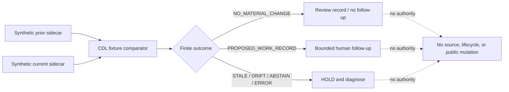
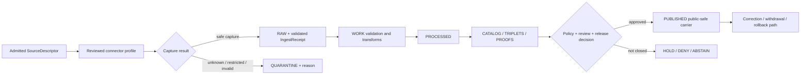

<!-- [KFM_META_BLOCK_V2]
doc_id: kfm://doc/runbook/agriculture/source-refresh
title: Agriculture — Source Refresh Runbook
type: runbook; operational-procedure; domain-lane; non-authoritative
version: v0.2
status: draft; repository-grounded; cdl-fixture-comparator-present; live-source-refresh-held; source-authority-register-empty; non-publisher
owners:
  - "@bartytime4life — verified GitHub review route"
  - "NEEDS VERIFICATION — accountable Agriculture, source, connector, rights/sensitivity, evidence, policy, lifecycle, release, and independent-review stewards"
created: 2026-05-13
updated: 2026-08-23
policy_label: public-review; agriculture; source-refresh; fail-closed; no-live-activation; no-publication-authority
current_path: docs/runbooks/agriculture/SOURCE_REFRESH_RUNBOOK.md
owning_root: docs/
responsibility: >
  Provide the repository-grounded human procedure for evaluating Agriculture
  source-change signals and, only after separate source admission and connector
  commissioning, handing a refresh into the governed lifecycle without granting
  source, evidence, policy, review, release, deployment, or publication authority.
truth_posture: cite-or-abstain
truth_labels: [CONFIRMED, PROPOSED, UNKNOWN, NEEDS VERIFICATION, CONFLICTED, HOLD]
authority_class: explanatory operational documentation
canonical_relationship: same-path update; no new or parallel authority
evidence_snapshot:
  repository: bartytime4life/Kansas-Frontier-Matrix
  base_ref: main
  base_commit: 2c010b36609bf2ceb94e5a2d61fa62493e6f298f
  prior_blob: f213ef17f4880b3850b48e62168c5c959351e055
  directory_rules_blob: fd49a0b83e55cef52c1124281f093e263526898d
  source_authority_register_blob: 32729857bc8eb5001acb37b8ee8e60bcb6e0dc50
  cdl_watcher_blob: d308b8f292eac1a29b47ba69e0f588936f6a8775
  agriculture_workflow_blob: d89d5db8861812f7b0a1024ae37a23ed5bd61354
  inspected_surfaces:
    - docs/runbooks/README.md
    - docs/adr/ADR-0029-adopt-directory-governance-standard-v2.md
    - docs/doctrine/directory-rules.md
    - docs/domains/agriculture/DOMAIN.md
    - docs/domains/agriculture/SOURCE_REGISTRY.md
    - docs/sources/catalog/usda/usda-nass-cdl.md
    - control_plane/source_authority_register.yaml
    - contracts/source/source_descriptor.md
    - contracts/source/ingest_receipt.md
    - schemas/contracts/v1/source/source_descriptor.schema.json
    - data/registry/sources/agriculture/README.md
    - data/registry/sources/agriculture/nass_quickstats.yaml
    - connectors/nass/README.md
    - connectors/usda-nass/README.md
    - tools/ingest/cdl_watch/README.md
    - tools/ingest/cdl_watch/cdl_watch.py
    - tests/ingest/cdl_watch/test_cdl_watch.py
    - .github/workflows/domain-agriculture.yml
    - docs/runbooks/agriculture/NO_NETWORK_TEST_RUNBOOK.md
    - docs/runbooks/agriculture/ROLLBACK_RUNBOOK.md
related:
  - ../README.md
  - ../../adr/ADR-0029-adopt-directory-governance-standard-v2.md
  - ../../doctrine/directory-rules.md
  - ../../domains/agriculture/DOMAIN.md
  - ../../domains/agriculture/DATA_LIFECYCLE.md
  - ../../domains/agriculture/SOURCES.md
  - ../../domains/agriculture/SENSITIVITY.md
  - ../../sources/catalog/usda/usda-nass-cdl.md
  - ../../../control_plane/source_authority_register.yaml
  - ../../../contracts/source/source_descriptor.md
  - ../../../contracts/source/ingest_receipt.md
  - ../../../schemas/contracts/v1/source/source_descriptor.schema.json
  - ../../../data/registry/sources/agriculture/README.md
  - ../../../connectors/nass/README.md
  - ../../../tools/ingest/cdl_watch/README.md
  - ../../../tests/ingest/cdl_watch/test_cdl_watch.py
  - ../../../.github/workflows/domain-agriculture.yml
  - ./NO_NETWORK_TEST_RUNBOOK.md
  - ./PROMOTION_RUNBOOK.md
  - ./ROLLBACK_RUNBOOK.md
tags: [kfm, agriculture, runbook, source-refresh, source-admission, watcher, cdl, lifecycle, governance, fail-closed]
notes:
  - "v0.2 replaces no-mounted-repository assumptions, speculative live-refresh steps, illustrative receipt shapes, and unverified path trees with current repository evidence and a bounded executable procedure."
  - "The central source-authority register is PROPOSED, projection-only, implementation_status ABSENT, and empty; it cannot currently authorize or select a live Agriculture refresh."
  - "The synthetic CDL sidecar comparator is the only confirmed source-refresh-adjacent executable slice inspected for Agriculture; it performs no network access and emits review signals, not receipts, evidence, lifecycle transitions, or publication."
  - "This document changes no source descriptor, registry entry, connector, fixture, test, contract, schema, policy, validator, workflow, receipt, proof, lifecycle object, release record, deployment, or publication state."
[/KFM_META_BLOCK_V2] -->

<a id="top"></a>
<a id="agriculture-source-refresh-runbook"></a>

# Agriculture Source Refresh Runbook

> **Evaluate Agriculture source-change signals through repository-grounded, fail-closed procedures; do not treat a watcher report, source placeholder, successful test, or refreshed upstream file as admission, evidence, promotion, release, or publication.**

[](#current-repository-state)
[](#current-repository-state)
[](#current-repository-state)
[](#current-repository-state)
[](#authority-and-non-effects)

> [!IMPORTANT]
> **Current implementation is bounded.** The repository contains a deterministic, fixture-only USDA NASS Cropland Data Layer sidecar comparator and an all-pull-request Agriculture workflow that runs its no-network proof. The central source-authority register is projection-only and has `entries: []`; the inspected NASS connector and Agriculture registry records remain conflicted or placeholder-only. A live Agriculture source refresh is therefore `HOLD`, not an executable current procedure.

> [!CAUTION]
> `NO_MATERIAL_CHANGE` and `PROPOSED_WORK_RECORD` are watcher outcomes. Neither is an `IngestReceipt`, `EvidenceBundle`, `PolicyDecision`, promotion decision, release approval, source activation, deployment, or publication.

> [!WARNING]
> Exact field, farm, operator, owner, parcel, well, facility, storage, livestock, chemical, insurance, compliance, or other private or harmful-precision detail fails closed by default. Do not use real sensitive records to make a refresh test convenient.

**Quick navigation:** [Purpose](#1-purpose--scope) · [Placement](#2-repo-fit) · [State](#current-repository-state) · [Authority](#authority-and-non-effects) · [Inputs](#3-inputs) · [Exclusions](#4-exclusions) · [Sources](#5-source-families-in-scope) · [Flow](#6-lifecycle-flow) · [Triggers](#7-refresh-cadence--triggers) · [Preconditions](#8-preconditions) · [Procedure](#9-procedure) · [Failures](#10-fail-closed-conditions) · [Records](#11-receipts-emitted) · [Validation](#12-validation) · [Rollback](#13-rollback) · [Stale state](#14-stale-state-handling) · [Checklist](#15-task-checklist) · [FAQ](#16-faq) · [Related](#17-related-docs) · [Evidence](#18-appendix)

---

<a id="1-purpose--scope"></a>

## 1. Purpose & Scope

This runbook defines the **human operating procedure** for Agriculture source-refresh work at the maturity currently proved by the repository.

It answers five bounded questions:

1. Is the request a source-discovery, source-admission, source-change-detection, source-ingest, lifecycle-promotion, or release task?
2. Which Agriculture source-refresh-adjacent behavior is currently executable?
3. Which exact conditions keep live source access on `HOLD`?
4. How should a CDL watcher result be validated and handed off without upgrading its authority?
5. Which separate objects, reviewers, and systems would be required before a live refresh could enter the governed lifecycle?

The current executable path is intentionally narrow:

```text
synthetic prior/current CDL sidecars
  -> no-network validation
  -> deterministic comparator
  -> finite review signal
  -> human review or bounded follow-up
  -/> live source access, RAW admission, evidence, policy, promotion, release, or publication
```

The future governed lifecycle remains:

```text
SOURCE ADMISSION
  -> RAW
  -> WORK / QUARANTINE
  -> PROCESSED
  -> CATALOG / TRIPLETS / PROOFS
  -> RELEASE DECISION
  -> PUBLISHED public-safe carrier
  -> CORRECTION / WITHDRAWAL / ROLLBACK
```

That future path is doctrine and design pressure. It is not established as an operational Agriculture source-refresh path by the evidence inspected for this revision.

### In scope

- Running or reviewing the bounded CDL fixture comparator.
- Interpreting its finite outcomes without treating them as source or release authority.
- Classifying source-refresh requests before any live network access.
- Recording current blockers for a live source profile.
- Preserving Agriculture source-role, rights, sensitivity, time, geography, evidence, lifecycle, correction, and rollback boundaries.
- Handing eligible follow-up work to the owning source, connector, registry, pipeline, policy, evidence, or release authority.

### Non-goals

- Selecting, admitting, activating, credentialing, polling, or scheduling a live source.
- Resolving the NASS connector-path conflict inside this runbook.
- Defining a new `SourceDescriptor`, `IngestReceipt`, `RunReceipt`, watcher-report, policy, evidence, release, correction, or rollback schema.
- Fetching live CDL, NASS QuickStats, Crop Progress, SSURGO, Kansas Mesonet, SCAN, USCRN, SMAP, HLS, or another source.
- Writing source bytes to lifecycle roots or altering a source registry record.
- Treating documentation, fixture tests, generated authoring receipts, or workflow presence as scientific validation or public fitness.
- Promoting, releasing, deploying, publishing, merging, approving, or changing repository settings.

[Back to top](#top)

---

<a id="2-repo-fit"></a>

## 2. Repo Fit

**Placement outcome: `PLACE` — CONFIRMED for this same-path update.**

Accepted [ADR-0029](../../adr/ADR-0029-adopt-directory-governance-standard-v2.md) adopts [Directory Rules v2](../../doctrine/directory-rules.md). The parent [`docs/runbooks/` index](../README.md) identifies this subtree as the operational-procedure lane under the human-readable `docs/` responsibility root. This file remains at its existing Agriculture-domain path.

| Property | Current result |
|---|---|
| Path | `docs/runbooks/agriculture/SOURCE_REFRESH_RUNBOOK.md` |
| Owning root | `docs/` — human-facing operational procedure |
| Domain segment | Agriculture |
| Path state | Existing tracked path; same-path modernization |
| Structural effect | None; no create, move, rename, split, mirror, or delete |
| Review route | `@bartytime4life` through the repository default CODEOWNERS route |
| Accountable source/release stewardship | `NEEDS VERIFICATION` |
| Source activation effect | None |
| Release/publication effect | None |

This file may point to source descriptors, registry records, connectors, watcher tools, tests, workflows, receipts, proofs, policy, release objects, and correction paths. It cannot replace or authorize any of them.

<a id="current-repository-state"></a>

### 2.1 Current repository state

The following observations are pinned to `main@2c010b36609bf2ceb94e5a2d61fa62493e6f298f`.

| Surface | CONFIRMED current evidence | Bounded conclusion |
|---|---|---|
| Central source-authority register | `control_plane/source_authority_register.yaml` is `PROPOSED`, `projection_only`, `implementation_status: ABSENT`, `completeness: empty`, with `entries: []` | It cannot currently select, admit, activate, or authorize a live Agriculture source refresh |
| `SourceDescriptor` contract | Lowercase contract and paired schema exist; both remain draft / `PROPOSED`, and the contract records unresolved singular-versus-plural schema-path lineage | Meaning and shape are documented, but canonical migration and live registry use remain unresolved |
| Agriculture source-registry lane | `data/registry/sources/agriculture/README.md` exists with multiple small source-named YAML files | The lane exists, but file presence is not admission or activation |
| NASS QuickStats registry record | `nass_quickstats.yaml` contains only `status: PROPOSED`, a path, one source-doc pointer, and a placeholder note | Not a complete `SourceDescriptor`; not refresh authority |
| NASS connector placement | `connectors/nass/`, `connectors/usda-nass/`, and `connectors/usda/nass/` coexist in repository documentation | Placement is `CONFLICTED`; do not choose a live implementation path here |
| NASS connector implementation | Inspected coordination README reports placeholder records, placeholder pipeline spec, and documentation-only tests; no executable live connector established | Live NASS refresh remains `HOLD` |
| CDL source product page | Repository page records a bounded synthetic comparator and keeps live access, cadence, rights, descriptor, thresholds, receipts, and publication proposed or unverified | Product documentation does not activate CDL |
| CDL watcher helper | `tools/ingest/cdl_watch/cdl_watch.py` implements the no-network `kfm-cdl-watch-fixture-v1` comparator | One bounded source-change-detection proof is executable |
| CDL watcher tests | `tests/ingest/cdl_watch/test_cdl_watch.py` and synthetic sidecar fixtures are present | Fixture behavior is testable; live source behavior is not proved |
| Agriculture workflow | `.github/workflows/domain-agriculture.yml` runs the CDL watcher proof with `KFM_NO_NETWORK=1` and `contents: read` | The workflow proves the bounded helper only and explicitly holds broader validation, proof, and release work |
| `IngestReceipt` family | Contract, paired schema, no-network validator, fixtures, and connector-gate prerequisite wiring exist | Candidate shape and validation exist; no connector-emitted Agriculture receipt instance was verified |
| Agriculture rollback | Shared `RollbackCard` candidate validation exists; the Agriculture drill remains documentation-only and held | Production recovery readiness is not established |
| Deployment and public operation | No deployment, source activation, public release, or operational cadence is proved by the inspected surfaces | `UNKNOWN` / `NEEDS VERIFICATION` |

### What changed from v0.1

The prior runbook correctly preserved the lifecycle, watcher non-publisher, public-safe aggregation, source-role, evidence, correction, and rollback rules. It also treated the connected repository as unavailable and filled gaps with speculative live-refresh steps, proposed path trees, cadence examples, and an illustrative `RunReceipt` shape.

This revision therefore:

- preserves the strong trust and lifecycle boundaries;
- confirms the existing path instead of calling it proposed;
- replaces no-mounted-repository language with current pinned evidence;
- narrows the executable procedure to the implemented CDL fixture comparator;
- makes the empty central authority register and NASS connector conflict explicit blockers;
- points to current contracts and schemas instead of restating competing machine shapes;
- keeps future live refresh as a graduated, separately commissioned capability;
- separates source detection, admission, ingest, validation, evidence, promotion, release, and publication.

<a id="authority-and-non-effects"></a>

### 2.2 Authority and non-effects

| Concern | Owning authority | This runbook may do | This runbook must not do |
|---|---|---|---|
| Source identity, role, rights, cadence, access, citation | `SourceDescriptor` and governed source registry | Require and inspect references | Invent, approve, or activate a source |
| Connector source access | `connectors/` plus accepted placement and activation | Point to a reviewed entry point | Select a conflicted connector home or use credentials |
| Watcher comparison | `tools/ingest/cdl_watch/` for the bounded CDL profile | Explain exact fixture-only execution and outcomes | Treat a report as ingest, evidence, or release |
| Machine shape | `schemas/` | Link the current schema | Redefine fields or enums in Markdown |
| Object meaning | `contracts/` | Link semantic contracts | Create authority by repeating contract prose |
| Allow, deny, hold, restrict, redact | `policy/` plus required review | Explain fail-closed response | Substitute a checklist for a policy decision |
| Source capture and lifecycle state | Governed connector, pipeline, and `data/` lanes | Describe the required handoff | Write or promote lifecycle state by documentation |
| Evidence and proof | EvidenceRef, EvidenceBundle, receipts, proofs, and validators | Require closure before consequential claims | Manufacture evidence from a watcher report |
| Promotion, release, correction, rollback | `release/` and linked decisions/records | Route to dedicated procedures | Approve, execute, or imply publication |
| This document | `docs/` operational guidance | Record current procedure and limits | Act as source, policy, release, or publication authority |

[Back to top](#top)

---

<a id="3-inputs"></a>

## 3. Inputs

### 3.1 Current bounded CDL comparator inputs

| Input | Current requirement |
|---|---|
| Repository revision | Exact commit or feature-branch head under review |
| Working directory | Repository root |
| Python | `3.11`, matching the inspected Agriculture workflow |
| Network posture | `KFM_NO_NETWORK=1`; repository-code execution receives no live source access |
| Bytecode posture | `PYTHONDONTWRITEBYTECODE=1` for the workflow-equivalent proof |
| Prior/current sidecars | Local synthetic JSON fixtures under `tests/ingest/cdl_watch/fixtures/` |
| Source reference | Fixed fixture reference `fixture://source/usda-nass-cdl` |
| Geography sentinel | Fixed non-real county FIPS `99999` |
| Materiality inputs | Caller-supplied integer thresholds that agree across the compared pair |
| Credentials | None; do not expose ambient provider credentials to the helper |
| Output | Standard output or an explicit create-only path outside repository roots |

The comparator validates a deliberately narrow fixture profile. It does not accept arbitrary source records, real county claims, live URLs, or production payloads.

### 3.2 Inputs required before a future live refresh

A live Agriculture refresh must remain `HOLD` until all of these can be resolved from current owning evidence:

- an admitted, non-placeholder `SourceDescriptor` with stable identity and explicit source role;
- an active entry in the governed source-authority or source-registry surface;
- verified rights, attribution, redistribution, sensitivity, access, cadence, and staleness posture;
- a resolved canonical connector path and substantive connector implementation;
- a bounded endpoint profile and credential strategy outside the repository;
- deterministic positive and negative fixtures plus no-network tests;
- explicit RAW-versus-QUARANTINE output handling;
- validated `IngestReceipt` emission and persistence;
- source-specific schema, temporal, geography, integrity, and source-role checks;
- downstream policy, evidence, catalog, review, release, correction, and rollback closure appropriate to the intended use;
- named accountable stewards and separation of duties where policy-significant.

No Markdown table can satisfy these inputs by assertion.

[Back to top](#top)

---

<a id="4-exclusions"></a>

## 4. Exclusions

The following are stop conditions for the current procedure.

| Forbidden input or action | Why it fails | Required response |
|---|---|---|
| Live HTTP, DNS, socket, STAC, API, or source requests during the bounded comparator proof | Exceeds the fixture-only implementation and breaks deterministic isolation | Stop; classify as a separately commissioned live-source profile |
| Real farm, operator, owner, parcel, field, well, facility, storage, livestock, chemical, insurance, or compliance identifiers | Creates privacy, rights, economic, safety, or harmful-precision risk | Remove; replace with synthetic public-safe fixtures |
| Exact sensitive geometry | Client styling is not a security boundary | Generalize, redact, or synthesize before fixture admission |
| Credentials, tokens, cookies, signed URLs, or private endpoints | Secrets and restricted access do not belong in the repository or runbook output | Stop; use an approved external secret and access control plane only after authorization |
| Source named only by a placeholder YAML file | Placeholder presence is not admission | Return `HOLD` and require a complete reviewed descriptor |
| Connector selected from the current NASS path conflict | Would create parallel or accidental authority | Return `HOLD` pending an accepted placement/migration decision |
| Aggregate, classified, modeled, or inferred support relabeled as direct field observation | Source-role collapse | Fail closed; preserve the actual role and support scale |
| Watcher output written into `data/raw/`, `data/receipts/`, `data/proofs/`, `data/catalog/`, `data/published/`, or `release/` | The bounded helper owns none of those states | Stop; the helper intentionally denies repository-root output |
| Automatic lifecycle promotion or public release | Detection is not admission or publication | Stop and route through separately governed lifecycle/release machinery |
| Deleting or rewriting prior reports to hide a failed comparison | Breaks auditability and correction lineage | Preserve the result and issue a transparent correction or superseding run |
| Emergency-warning or life-safety presentation | KFM is not an alert authority | Deny the use; redirect to the appropriate official source |

[Back to top](#top)

---

<a id="5-source-families-in-scope"></a>

## 5. Source Families in Scope

The Agriculture corpus and repository documentation name several source families. The table below records their **current repository posture**, not an operational activation list.

| Source family | Support role that must remain visible | Current repository posture | Refresh disposition |
|---|---|---|---|
| USDA NASS Cropland Data Layer | Annual classified/model-derived land-cover support; never direct proof of an operator's field activity | Product page plus implemented synthetic sidecar comparator; live descriptor, rights, endpoint, cadence, canonical thresholds, ingest receipts, and release remain unproved | Fixture comparator only; live refresh `HOLD` |
| USDA NASS QuickStats / Crop Progress | Aggregate statistical or administrative support; never parcel, field, or operator truth | Placeholder registry records, placeholder pipeline specification, documentation-only tests, and conflicted connector placement | `HOLD` |
| SSURGO / Soil Data Access | Soil survey support owned by the Soil/source lane; Agriculture consumes it through explicit cross-domain references | Agriculture documentation names it; no Agriculture live refresh profile was verified | Route to owning Soil/source authority; Agriculture refresh `HOLD` |
| gSSURGO | Gridded derivative/aggregate soil support; must not masquerade as direct observation | Small Agriculture registry placeholder observed; no active descriptor or connector proved | `HOLD` |
| Kansas Mesonet / SCAN / USCRN | Station-supported observations at declared locations, depths, variables, and times; aggregation remains derived | Documentation and small registry placeholders exist; no live Agriculture source activation proved | `HOLD` |
| NASA SMAP / HLS | Retrieval, classification, index, or model-derived remote-sensing support with run/version/uncertainty requirements | Registry placeholders and bounded downstream validator/computation slices exist; those slices do not prove source refresh | `HOLD` for source refresh |
| Conservation-practice, crop-insurance, market, economy, and extension sources | Administrative, aggregate, contextual, or restricted support depending on the specific source | Candidate families in documentation; no complete admitted source profile verified | `HOLD` until source-specific review |

> [!IMPORTANT]
> A downstream NDVI, readiness, materiality, or connectivity validator does not activate HLS or another source. A registry filename does not admit a source. A product page does not prove rights or current endpoint behavior.

[Back to top](#top)

---

<a id="6-lifecycle-flow"></a>

## 6. Lifecycle Flow

### 6.1 Current bounded flow


```mermaid
flowchart LR
    A["Synthetic prior sidecar"] --> C["CDL fixture comparator"]
    B["Synthetic current sidecar"] --> C
    C --> D{"Finite outcome"}
    D -->|NO_MATERIAL_CHANGE| E["Review record / no follow-up"]
    D -->|PROPOSED_WORK_RECORD| F["Bounded human follow-up"]
    D -->|STALE / DRIFT / ABSTAIN / ERROR| G["HOLD and diagnose"]
    E -. no authority .-> H["No source, lifecycle, or public mutation"]
    F -. no authority .-> H
    G -. no authority .-> H
```

This flow is `CONFIRMED` for the inspected fixture profile. The comparator performs no source fetch, source admission, lifecycle write, receipt persistence, policy evaluation, evidence assembly, promotion, release, deployment, or publication.

### 6.2 Future governed live-refresh flow


```mermaid
flowchart LR
    A["Admitted SourceDescriptor"] --> B["Reviewed connector profile"]
    B --> C{"Capture result"}
    C -->|safe capture| D["RAW + validated IngestReceipt"]
    C -->|unknown / restricted / invalid| Q["QUARANTINE + reason"]
    D --> E["WORK validation and transforms"]
    E --> F["PROCESSED"]
    F --> G["CATALOG / TRIPLETS / PROOFS"]
    G --> H{"Policy + review + release decision"}
    H -->|approved| I["PUBLISHED public-safe carrier"]
    H -->|not closed| J["HOLD / DENY / ABSTAIN"]
    I --> K["Correction / withdrawal / rollback path"]
```

This future flow is `PROPOSED` for Agriculture source refresh and remains on `HOLD`. Each box belongs to a separate authority surface; no single connector, watcher, workflow, or document owns the whole path.

### 6.3 Gate ownership and current maturity

| Boundary | Owning surface | Current Agriculture evidence | Current result |
|---|---|---|---|
| Candidate source -> admitted source | SourceDescriptor, source registry, rights/sensitivity review | Central register empty; Agriculture records include placeholders | `HOLD` |
| Admitted source -> RAW / QUARANTINE | Resolved connector and source-ingest profile | NASS placement conflicted; no live connector established | `HOLD` |
| RAW / QUARANTINE -> WORK / PROCESSED | Pipeline, contracts, schemas, validators, policy | Broader Agriculture validation explicitly held | `HOLD` |
| PROCESSED -> CATALOG / TRIPLETS / PROOFS | Catalog, evidence, receipt, and proof authorities | No end-to-end Agriculture source-refresh closure verified | `HOLD` |
| Catalog candidate -> release | Review, policy, release, correction, rollback | Agriculture rollback drill held; production release unproved | `HOLD` |
| Source sidecar -> review signal | CDL fixture comparator | Bounded implementation and tests present | `CONFIRMED` |

[Back to top](#top)

---

<a id="7-refresh-cadence--triggers"></a>

## 7. Refresh Cadence & Triggers

### Current cadence

No operationally authoritative Agriculture source-refresh cadence can be derived from the current central register because it is empty. The bounded CDL comparator is invoked manually or by repository CI against local fixtures; that is a test/review cadence, not an upstream source polling schedule.

### Future trigger classes

A commissioned live profile may support a publisher release, scheduled check, read-only watcher signal, or authorized operator replay only after the owning `SourceDescriptor` and connector profile define the trigger and constraints.

| Trigger | Permitted current action | Prohibited inference |
|---|---|---|
| Pull request or push runs `domain-agriculture` | Execute the bounded CDL no-network proof | Source is active or current |
| Human compares approved synthetic CDL sidecars | Produce a deterministic watcher report | Upstream CDL changed |
| Product documentation names an annual/hourly/revisit cadence | Record proposal or verification need | Schedule live access |
| Placeholder registry file exists | Inspect as planning evidence | Treat as an admitted descriptor |
| Future watcher detects publisher-supported metadata or digest change | Propose review work after the profile is commissioned | Fetch, ingest, promote, or publish automatically |

A future connector may use publisher-supported version identifiers, checksums, ETags, `Last-Modified`, manifests, or another source-specific signal. The specific method must be verified for that source and recorded in the admitted descriptor/profile. This runbook does not impose one HTTP pattern on every provider.

[Back to top](#top)

---

<a id="8-preconditions"></a>

## 8. Preconditions

### 8.1 Bounded CDL comparator preconditions

Before executing the current proof, confirm:

1. The exact repository revision is recorded.
2. The target files are the tracked synthetic sidecar fixtures, not copied real data.
3. `profile_id` is the implemented fixture profile.
4. `source_descriptor_ref` is the fixed fixture reference.
5. `county_fips` is the fixed non-real sentinel.
6. Prior and current threshold profiles agree.
7. No ambient credentials or unrelated secrets are exposed.
8. Repository-code execution has no network access.
9. Output is standard output or an approved external temporary path.
10. The reviewer understands that the report is not a receipt, policy decision, or lifecycle transition.

### 8.2 Live source-refresh preconditions

The live path must stop before network access unless all items below are proved from current owning surfaces:

- [ ] Complete admitted `SourceDescriptor`, not a placeholder.
- [ ] Active registry/authority entry for the exact source and use.
- [ ] Resolved connector path and reviewed implementation.
- [ ] Verified rights, attribution, redistribution, access, rate-limit, retention, and sensitivity posture.
- [ ] Stable source role and prohibited-role rules.
- [ ] Source-specific temporal, geography, integrity, freshness, and correction semantics.
- [ ] Positive, negative, stale, malformed, denied, and no-network fixtures.
- [ ] Bounded live profile with credential isolation and no public/release side effects.
- [ ] RAW/QUARANTINE-only connector output and validated `IngestReceipt` handling.
- [ ] Downstream validation, policy, evidence, catalog, review, release, correction, and rollback dependencies identified.
- [ ] Named accountable stewards and required independent review.
- [ ] Rehearsal and rollback evidence at the exact candidate revision.

At the evidence snapshot for this runbook, these preconditions are not closed. The correct live outcome is `HOLD`.

[Back to top](#top)

---

<a id="9-procedure"></a>

## 9. Procedure

### 9.1 Freeze the request and exact revision

Record:

- repository and exact commit or branch head;
- requested source family and intended use;
- whether the request is discovery, admission, detection, ingest, lifecycle, release, correction, or rollback work;
- intended data precision and exposure;
- actor and review route;
- writable paths, if any;
- rollback or abandonment boundary.

Do not begin with a URL or connector name. Begin with the authority question.

### 9.2 Resolve source authority before execution

Inspect the central register and the exact per-source record.

| Observation | Procedure result |
|---|---|
| No central or per-source entry | `HOLD` — source is not operationally selectable |
| Placeholder-only YAML | `HOLD` — create/review a complete descriptor in the owning source-registry task |
| Descriptor exists but rights, sensitivity, role, cadence, or access is unresolved | `HOLD` or `DENY`, according to owning policy/review |
| Connector home is conflicted | `HOLD` pending accepted placement and migration |
| Complete admitted source plus commissioned connector/profile | Continue only within that separately reviewed profile |

For the current repository snapshot, no live Agriculture source passes this step through the central register.

### 9.3 Run the bounded CDL proof

From the repository root:

```bash
PYTHONDONTWRITEBYTECODE=1 KFM_NO_NETWORK=1 \
  python -m unittest tests.ingest.cdl_watch.test_cdl_watch --verbose
```

Run one deterministic no-change example:

```bash
PYTHONDONTWRITEBYTECODE=1 KFM_NO_NETWORK=1 \
  python tools/ingest/cdl_watch/cdl_watch.py \
    --prior tests/ingest/cdl_watch/fixtures/no_material_change/prior_sidecar.json \
    --current tests/ingest/cdl_watch/fixtures/no_material_change/current_sidecar.json \
    --dry-run
```

The CLI prints compact JSON to standard output when `--output` is omitted. Do not redirect it into lifecycle, receipt, proof, catalog, published, or release roots.

### 9.4 Interpret the comparator outcome

| Outcome | Meaning in the implemented fixture profile | Required handoff |
|---|---|---|
| `NO_MATERIAL_CHANGE` | Valid local comparison found no review-worthy histogram change under the supplied profile | Record bounded PASS/no-follow-up; no source or lifecycle mutation |
| `PROPOSED_WORK_RECORD` | Valid local comparison reached a supplied materiality threshold | Open or update bounded review work; confirm source authority and policy separately |
| `STALE_INPUT` | Current year or time metadata regressed | `HOLD`; inspect ordering and fixture provenance |
| `CLASSMAP_DRIFT` | Classification semantics differ or cannot be compared safely | `HOLD`; require semantic review before interpretation |
| `GEOMETRY_DRIFT` | County geometry hash changed | `HOLD`; do not call the difference crop change |
| `ABSTAIN` | Available inputs do not support a safe decision | Preserve uncertainty; narrow scope or improve evidence |
| `ERROR` | The helper could not safely complete | Treat as failure; diagnose without weakening guards |

The report carries `publication: false` and `promotion_required: true`. Those flags are constraints, not suggestions.

### 9.5 Create the reviewer handoff

A useful handoff records:

- exact repository head;
- exact prior/current fixture paths and hashes when available;
- comparator profile and output status;
- reason codes and materiality inputs;
- whether the run wrote any file;
- confirmation that network and credentials were absent;
- what the result proves;
- what remains unproved;
- the smallest separate follow-up, if one is justified.

Do not call the watcher report a receipt unless an accepted owning contract, validator, persistence route, and workflow explicitly adopt it as one.

### 9.6 Graduate a future live profile separately

A future implementation PR must close one source-specific review boundary rather than activating the entire Agriculture roster. The smallest coherent graduation sequence is:

1. resolve source and connector identity;
2. add or repair one complete descriptor and rights/sensitivity review;
3. implement a read-only, bounded connector profile;
4. add synthetic positive/negative/no-network fixtures;
5. prove RAW-or-QUARANTINE-only behavior;
6. emit and validate one `IngestReceipt` candidate;
7. add source-specific drift, stale, error, and replay tests;
8. wire least-privilege CI without release or publication side effects;
9. rehearse and record limitations;
10. leave promotion, release, deployment, and publication for their owning transitions.

Until such a source-specific slice lands and is reviewed, this subsection is `PROPOSED` and non-executable.

### 9.7 Close out

For the current bounded procedure:

- preserve the report or CI evidence needed for review;
- leave source registries and lifecycle roots unchanged;
- create no release or correction object;
- record follow-up only when the finite outcome and current evidence justify it;
- keep the live source-refresh posture on `HOLD`.

[Back to top](#top)

---

<a id="10-fail-closed-conditions"></a>

## 10. Fail-Closed Conditions

| Condition | Finite posture | Reason |
|---|---|---|
| Central source-authority register empty | `HOLD` | No operational source selection or authority projection exists |
| Source record is placeholder-only | `HOLD` | File presence is not admission |
| Source/connector identity is conflicted | `HOLD` | Avoid parallel implementation and accidental authority |
| Rights or attribution unresolved | `DENY` public use or `HOLD` review | Unknown rights fail closed |
| Sensitivity or harmful precision unresolved | `DENY` / `QUARANTINE` | Public safety and privacy outrank convenience |
| Source role would be upgraded or collapsed | `HOLD` / `DENY` | Classified, aggregate, modeled, regulatory, contextual, and observed support are not interchangeable |
| Comparator receives real source data or a non-fixture source reference | `ERROR` | The implemented profile is fixture-only |
| Comparator receives stale current input | `STALE_INPUT` | Time ordering is unsafe |
| Classmap changes | `CLASSMAP_DRIFT` | Histogram comparison cannot preserve meaning |
| Geometry hash changes | `GEOMETRY_DRIFT` | Geometry drift can mimic crop drift |
| Network access occurs in the bounded proof | `ERROR` | Violates the no-network contract |
| Helper attempts repository-root output | `ERROR` | Watcher report cannot write lifecycle or authority state |
| Evidence is insufficient for a consequential claim | `ABSTAIN` / `HOLD` | Cite-or-abstain |
| `PROPOSED_WORK_RECORD` is treated as approval | `DENY` | Detection is not policy, review, or release |
| Direct public access to RAW, WORK, QUARANTINE, internal registry, or model state | `DENY` | Trust-membrane violation |
| Required correction or rollback path is missing for a public candidate | `HOLD` | Public state must remain correctable and reversible |

A failed or held run must remain visible. Do not weaken a fixture, threshold guard, source-role boundary, rights check, or sensitivity rule to produce a green result.

[Back to top](#top)

---

<a id="11-receipts-emitted"></a>

## 11. Records, Receipts, Proofs, and Decisions

The prior runbook listed an illustrative receipt catalog and embedded a proposed `RunReceipt` JSON shape. Current repository evidence is stronger and more precise: several object-family contracts, schemas, validators, and fixtures exist, but Agriculture source-refresh integration remains incomplete. This runbook now links those authorities instead of redefining them.

| Object or record | Current repository evidence | What it proves | What it does not prove |
|---|---|---|---|
| `SourceDescriptor` | Draft semantic contract plus paired proposed schema; canonical path lineage remains partly conflicted | Intended source-admission meaning and machine surface | Active source, truth, rights approval, or release |
| Agriculture registry placeholder | Small YAML files such as `nass_quickstats.yaml` | A named planning slot exists | Complete descriptor, activation, connector readiness, or cadence |
| CDL watcher report | Deterministic fixture-only JSON report from `cdl_watch.py` | Comparator behavior and review signal | Ingest, receipt persistence, evidence, policy, lifecycle, or publication |
| `IngestReceipt` | Draft contract, paired schema, no-network validator, fixtures, and connector-gate prerequisite wiring | Candidate capture-record shape and bounded validation | Connector-emitted Agriculture receipt or governed persistence |
| `ValidationReport` / `PolicyDecision` | Shared object families elsewhere in the repository | Separate validation and policy concepts | That a particular Agriculture source passed them |
| `EvidenceRef` / `EvidenceBundle` | Shared evidence families | Required support path for consequential claims | Closure for a watcher report or live Agriculture refresh |
| Promotion/release objects | Separate release responsibility surfaces | State-transition and release concepts | Approval, signing, deployment, or publication for Agriculture |
| `CorrectionNotice` / `RollbackCard` | Shared correction/rollback families; RollbackCard candidate validator exists | Candidate correction and recovery structure | Executed Agriculture rollback or production readiness |
| Generated authoring receipt | Repository generation record for a source-code or documentation artifact | Bytes/generation lineage named by that receipt | Runtime ingest, source truth, policy, proof, or release authority |

> [!NOTE]
> A receipt records that a process ran or an artifact was produced. A proof supports closure. A policy result constrains use. A review records human disposition. A release object changes release state when authorized. Keep these families distinct.

[Back to top](#top)

---

<a id="12-validation"></a>

## 12. Validation

### 12.1 Current executable validation

The all-pull-request Agriculture workflow executes the fixture-only CDL watcher test with networking denied. The same focused command is shown in [§9.3](#93-run-the-bounded-cdl-proof).

The implemented test surface should continue to cover:

- valid no-change comparison;
- relative and absolute materiality thresholds;
- below-threshold behavior;
- stale input;
- classmap drift;
- geometry drift;
- malformed or missing fields;
- fixture-only identity and geography guards;
- deterministic profile hashing;
- repository-output denial;
- no-network behavior;
- finite reason codes and non-publication flags.

### 12.2 What a passing result proves

A passing focused test proves that the inspected code and synthetic fixtures satisfy the bounded comparator profile at that exact revision.

It does **not** prove:

- a live CDL endpoint, release, checksum, ETag, cadence, rights posture, or descriptor;
- NASS connector placement or activation;
- Agriculture source-registry completeness;
- scientific accuracy or crop truth;
- source ingest, RAW admission, receipt persistence, pipeline processing, evidence closure, policy approval, release, deployment, or publication;
- readiness of other Agriculture source families;
- broad Agriculture validation, which the workflow explicitly holds.

### 12.3 Runbook and pull-request validation

For a change to this runbook, verify:

- one H1 and preserved top/stable anchors;
- ordered headings and working quick-navigation fragments;
- balanced fenced blocks and valid GitHub alerts;
- repository-relative links resolve at the pinned revision;
- commands match the current watcher README, tests, and workflow;
- claims distinguish current executable behavior from proposed live behavior;
- no owner, cadence, endpoint, source status, release state, or operational maturity is invented;
- the full diff changes only the intended path unless a required dependency is proved;
- workflow preflight shows no automatic release, deployment, promotion, publication, secret exposure, or settings mutation from the docs-only change;
- hosted CI is evaluated at the exact pull-request head.

[Back to top](#top)

---

<a id="13-rollback"></a>

## 13. Rollback

### 13.1 Roll back this documentation change

Before merge, close or abandon the draft pull request; `main` remains unchanged. After merge, use a transparent revert or forward-fix pull request against the actual merged commit. Do not rewrite shared history.

### 13.2 Roll back a bounded watcher result

The comparator mutates no repository or lifecycle state when used as documented. A mistaken or obsolete result is corrected by:

1. preserving the original report and exact inputs;
2. identifying the defect in fixtures, comparator code, profile, or interpretation;
3. producing a corrected run at a new exact revision;
4. linking the corrected result to the superseded result in the reviewer handoff;
5. avoiding any claim that deletion makes the prior run disappear.

### 13.3 Roll back a future live refresh

No current Agriculture live-refresh execution path or production rollback readiness is established by this runbook. A future source-specific profile must use the dedicated [Agriculture rollback runbook](./ROLLBACK_RUNBOOK.md) and the owning release/correction machinery. An older source or release is not automatically safe: rights, sensitivity, source role, evidence, policy, consumers, and correction obligations must be re-evaluated.

If public reliance exists, a Git revert alone is not a complete correction. Preserve withdrawal, correction, cache/index invalidation, supersession, and audit history as required by the owning release path.

[Back to top](#top)

---

<a id="14-stale-state-handling"></a>

## 14. Stale-State Handling

KFM separates stale, wrong, changed, unsupported, and unverified states.

| State | Meaning in this runbook | Required response |
|---|---|---|
| `STALE_INPUT` | Current fixture time/year/source metadata regresses behind prior input | Stop comparison and inspect provenance/order |
| Source freshness unknown | No admitted descriptor/register entry provides an enforceable freshness posture | Keep live refresh on `HOLD`; do not invent cadence |
| Product documentation aged | Page or proposal names an old cadence, endpoint, role, or source posture | Verify against current source authority before use |
| Descriptor superseded or conflicted | More than one source/connector/schema home appears authoritative | Resolve through governance/migration; do not choose by convenience |
| Published claim stale | Existing released support has aged beyond its governed tolerance | Surface stale state through owning API/UI and re-evaluate release; do not silently overwrite |
| Source materially changed | A commissioned watcher/source profile proves a change | Propose governed work; do not auto-ingest or publish |
| Source wrong or withdrawn | Authority, rights, or evidence is corrected or revoked | Quarantine/withdraw/correct through owning lifecycle and release authorities |

At the current snapshot, the empty central register means Agriculture source freshness is not operationally enforceable from that projection. That is a blocker, not permission to use document-level cadence guesses.

[Back to top](#top)

---

<a id="15-task-checklist"></a>

## 15. Task Checklist

### Current bounded CDL comparison

- [ ] Record exact repository head.
- [ ] Confirm the request is fixture comparison, not live refresh.
- [ ] Confirm synthetic sidecars and fixed fixture identifiers.
- [ ] Deny network and remove ambient credentials.
- [ ] Run the focused unit test.
- [ ] Run or inspect the dry-run comparison.
- [ ] Record finite outcome and reason codes.
- [ ] Confirm `publication: false` and `promotion_required: true`.
- [ ] Confirm no repository/lifecycle file was written.
- [ ] State what passed and what remains unproved.
- [ ] Create only the smallest evidence-backed follow-up.

### Future live source profile

- [ ] Complete/admit one source descriptor.
- [ ] Populate or resolve the owning source-authority/registry entry.
- [ ] Resolve connector path and implementation ownership.
- [ ] Verify rights, sensitivity, access, cadence, source role, and citation.
- [ ] Add deterministic fixtures and no-network negative tests.
- [ ] Prove RAW/QUARANTINE-only connector output.
- [ ] Emit and validate an `IngestReceipt` candidate.
- [ ] Prove source-specific stale, malformed, denied, and replay behavior.
- [ ] Wire least-privilege CI with no release/publication side effects.
- [ ] Rehearse correction and rollback.
- [ ] Keep promotion, release, deployment, and publication separate.

Unchecked live-profile items mean `HOLD`.

[Back to top](#top)

---

<a id="16-faq"></a>

## 16. FAQ

<details>
<summary><strong>Can this runbook be used to fetch a live Agriculture source today?</strong></summary>

No. The central authority register is empty, the inspected NASS implementation is placeholder-only and placement-conflicted, and no complete admitted live Agriculture source profile was verified. The current executable procedure is the synthetic CDL comparator only.

</details>

<details>
<summary><strong>Does <code>PROPOSED_WORK_RECORD</code> activate a source or approve an ingest?</strong></summary>

No. It means the local fixture comparison reached a caller-supplied materiality threshold and warrants review. Source admission, rights, policy, ingest, evidence, promotion, and release remain separate.

</details>

<details>
<summary><strong>Do the HLS/NDVI Agriculture validators prove HLS source refresh?</strong></summary>

No. They prove their named deterministic downstream contracts or validators at an exact revision. They do not prove live HLS access, source admission, source identity, rights, cadence, connector behavior, or ingest receipts.

</details>

<details>
<summary><strong>Where is the authoritative Agriculture refresh cadence?</strong></summary>

A commissioned cadence belongs in the admitted source descriptor and owning registry/profile. The current central register has no entries, so this runbook must not invent operational intervals from product prose.

</details>

<details>
<summary><strong>Which NASS connector path should new implementation use?</strong></summary>

None should be chosen by this runbook. The repository currently documents three candidates and no accepted placement decision was verified. Resolve that conflict through a governed placement/migration decision before adding implementation.

</details>

<details>
<summary><strong>Is the CDL watcher report an IngestReceipt?</strong></summary>

No. The helper documentation explicitly describes the report as a review signal. `IngestReceipt` has its own contract, schema, validator, fixtures, and lifecycle meaning.

</details>

<details>
<summary><strong>Can public Agriculture products include exact field or operator detail when the upstream source exposes it?</strong></summary>

Not by default. Upstream visibility does not resolve KFM rights, sensitivity, purpose, minimization, aggregation, review, or release obligations. Exact or identifying detail fails closed unless a separate governed restricted/public-safe decision proves otherwise.

</details>

<details>
<summary><strong>Can a green workflow publish the detected change?</strong></summary>

No. The inspected Agriculture workflow is read-only and explicitly denies source admission, proof, release, and publication authority. CI success and publication are different states.

</details>

[Back to top](#top)

---

<a id="17-related-docs"></a>

## 17. Related Docs

### Procedure and governance

- [`docs/runbooks/README.md`](../README.md) — runbook responsibility and authority boundary.
- [`ADR-0029`](../../adr/ADR-0029-adopt-directory-governance-standard-v2.md) — accepted Directory Rules adoption.
- [`Directory Rules v2`](../../doctrine/directory-rules.md) — responsibility-root placement law.
- [`Agriculture no-network runbook`](./NO_NETWORK_TEST_RUNBOOK.md) — exact bounded test procedures and broader validation holds.
- [`Agriculture promotion runbook`](./PROMOTION_RUNBOOK.md) — promotion preparation; documentation is not approval.
- [`Agriculture rollback runbook`](./ROLLBACK_RUNBOOK.md) — correction, withdrawal, and rollback procedure.

### Agriculture and source boundaries

- [`Agriculture domain definition`](../../domains/agriculture/DOMAIN.md) — bounded context and source-role-sensitive domain language.
- [`Agriculture data lifecycle`](../../domains/agriculture/DATA_LIFECYCLE.md) — domain lifecycle guidance.
- [`Agriculture sources`](../../domains/agriculture/SOURCES.md) — source-family planning and anti-collapse guidance.
- [`Agriculture sensitivity`](../../domains/agriculture/SENSITIVITY.md) — private, restricted, and public-safe posture.
- [`USDA NASS CDL product page`](../../sources/catalog/usda/usda-nass-cdl.md) — product documentation and current fixture-only watcher posture.

### Machine and implementation surfaces

- [`control_plane/source_authority_register.yaml`](../../../control_plane/source_authority_register.yaml) — current empty projection-only register.
- [`SourceDescriptor` contract](../../../contracts/source/source_descriptor.md) — source-admission semantics.
- [`IngestReceipt` contract](../../../contracts/source/ingest_receipt.md) — source-capture receipt semantics.
- [`SourceDescriptor` schema](../../../schemas/contracts/v1/source/source_descriptor.schema.json) — inspected paired shape; status remains proposed.
- [`Agriculture source-registry lane`](../../../data/registry/sources/agriculture/README.md) — registry responsibility boundary.
- [`NASS connector coordination lane`](../../../connectors/nass/README.md) — current placement conflict and placeholder maturity.
- [`CDL watcher helper`](../../../tools/ingest/cdl_watch/README.md) — bounded executable profile and commands.
- [`CDL watcher tests`](../../../tests/ingest/cdl_watch/test_cdl_watch.py) — focused fixture-only proof.
- [`Agriculture workflow`](../../../.github/workflows/domain-agriculture.yml) — read-only CI and explicit broader holds.

[Back to top](#top)

---

<a id="18-appendix"></a>

## 18. Appendix

### 18.1 Evidence ledger

| Evidence | Object at pinned base | Supported conclusion |
|---|---|---|
| Target runbook | `f213ef17f4880b3850b48e62168c5c959351e055` | v0.1 contained strong doctrine but stale no-repo and speculative implementation claims |
| Accepted Directory Rules | `fd49a0b83e55cef52c1124281f093e263526898d` | Existing path belongs under the operational `docs/runbooks/` responsibility lane |
| Central authority register | `32729857bc8eb5001acb37b8ee8e60bcb6e0dc50` | Projection-only, implementation absent, empty entries, no source activation effect |
| `SourceDescriptor` contract | `b57ae5ccc042c1423b75c168438800384c9b6713` | Rich proposed source-admission semantics exist; schema path lineage remains unresolved |
| NASS QuickStats placeholder | `7e2d31a23f5a4bc5e5a30b62b5cc814359a05566` | Named source record is a placeholder, not a descriptor or activation decision |
| NASS coordination README | `90409b72098571c5e793959ecd1bea83f115fa21` | Connector placement conflict and placeholder-only maturity are documented |
| CDL watcher implementation | `d308b8f292eac1a29b47ba69e0f588936f6a8775` | Fixture-only, no-network comparator exists and denies authority/publication effects |
| CDL watcher README | `f6899f9a6dd23704fe96502806e7c06691195263` | Finite outcomes, commands, report boundary, and live-watcher hold are documented |
| Agriculture workflow | `d89d5db8861812f7b0a1024ae37a23ed5bd61354` | Focused CDL proof runs read-only; broader validation/proof/release remain held |
| `IngestReceipt` contract | `8e76dc10aa23de967501bd32479f83788339a39b` | Shared candidate contract/validation exists; live Agriculture receipt integration remains unproved |

### 18.2 Material change ledger

| Prior material | Disposition | v0.2 treatment |
|---|---|---|
| Lifecycle invariant | `KEEP / CLARIFY` | Retained; current and future flows separated |
| Watcher-as-non-publisher | `KEEP / ENRICH` | Bound directly to the implemented CDL comparator and workflow |
| Public-safe aggregation and sensitive-detail denial | `KEEP / ENRICH` | Retained with broader Agriculture risk examples and explicit fixture rules |
| Source-family roster | `CLARIFY` | Recast as candidate/current repository posture, not active refresh inventory |
| Cadence examples | `REMOVE_WITH_EVIDENCE` | Removed as operational instructions because the central register is empty |
| Live conditional-fetch procedure | `RELOCATE / HOLD` | Kept as future source-specific profile requirements, not current commands |
| Speculative path tree | `REMOVE_WITH_EVIDENCE` | Replaced by verified responsibility links and current path evidence |
| Illustrative `RunReceipt` JSON | `REMOVE_WITH_EVIDENCE` | Replaced by links to current contract/schema authority surfaces |
| Receipt/proof/release catalog | `CLARIFY / CONSOLIDATE` | Current object-family maturity and non-equivalence made explicit |
| Rollback and stale-state rules | `KEEP / REPAIR` | Bound to current dedicated runbook and held operational maturity |
| No-mounted-repository caveats | `REPAIR` | Replaced by exact repository, commit, blob, workflow, tool, and placeholder evidence |

### 18.3 Open verification backlog

- `NEEDS VERIFICATION`: accountable Agriculture, source, connector, rights, sensitivity, evidence, policy, lifecycle, release, and independent-review stewards.
- `HOLD`: populate or replace the empty central source-authority projection with governed, non-activating records before relying on it operationally.
- `CONFLICTED`: settle `connectors/nass/` versus `connectors/usda-nass/` versus `connectors/usda/nass/` through an accepted placement/migration decision.
- `NEEDS VERIFICATION`: settle singular/plural SourceDescriptor schema-path migration and validator discovery without creating another authority home.
- `HOLD`: replace placeholder Agriculture source files with one complete reviewed descriptor at a time.
- `HOLD`: implement one bounded source-specific connector and `IngestReceipt` integration before calling live refresh executable.
- `NEEDS VERIFICATION`: source-specific rights, endpoint terms, access controls, cadence, stale-state, correction, and replay behavior.
- `HOLD`: prove end-to-end source -> RAW/QUARANTINE -> validation -> evidence/catalog -> release/correction/rollback for one public-safe Agriculture slice.
- `UNKNOWN`: deployment, source activation, operational monitoring, signer custody, public alias behavior, and production rollback readiness.

### 18.4 Last reviewed

| Field | Value |
|---|---|
| Repository | `bartytime4life/Kansas-Frontier-Matrix` |
| Base | `main@2c010b36609bf2ceb94e5a2d61fa62493e6f298f` |
| Prior target blob | `f213ef17f4880b3850b48e62168c5c959351e055` |
| Review date | 2026-08-23 |
| Current executable maturity | CDL fixture comparator only |
| Live source-refresh maturity | `HOLD` |
| Publication effect | None |
| Rollback for this document | Abandon draft PR before merge or transparently revert/forward-fix after merge |

[Back to top](#top)
