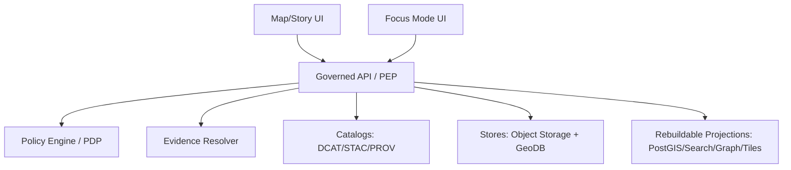

<!-- [KFM_META_BLOCK_V2]
doc_id: kfm://doc/5dff2b60-3f1d-4c52-9b32-1b2a1f5f66d8
title: API Runbooks (Governed API / PEP)
type: guide
version: v1
status: draft
owners: TBD
created: 2026-03-02
updated: 2026-03-02
policy_label: restricted
related:
  - ../../specs/api/
  - ../../../contracts/openapi/
  - ../../../policy/
tags: [kfm, runbook, api, governance, pep]
notes:
  - Keep secrets, internal hostnames, and cluster specifics out of this folder.
  - Replace TODO placeholders with repo-confirmed commands and links.
[/KFM_META_BLOCK_V2] -->

# API Runbooks — Governed API / PEP

**Purpose:** Operations + incident runbooks for the KFM **Governed API** (Policy Enforcement Point / PEP) — the enforced boundary between clients (UI, Focus Mode) and storage/indexes.


> [!WARNING]
> **Do not commit secrets** (tokens, passwords, private URLs, internal IPs, customer data) into this folder.
> Link to your secret store / infra docs instead.

---

## Quick navigation

- [Scope](#scope)
- [System context](#system-context)
- [API surface](#api-surface)
- [Operational invariants](#operational-invariants)
- [Smoke tests](#smoke-tests)
- [Incidents](#incidents)
- [Monitoring & alerting](#monitoring--alerting)
- [Change management](#change-management)
- [Directory layout](#directory-layout)
- [Sources](#sources)

---

## Scope

### What this folder is for

- On-call runbooks to **operate**, **monitor**, and **troubleshoot** the Governed API / PEP.
- Incident response playbooks (5xx spikes, policy-deny regressions, evidence resolver failures, catalog drift).
- Smoke-test recipes and “definition of done” checklists for API changes.

### Where it fits in the repo

This directory is intended to live under `docs/runbooks/api/` in the recommended KFM repo layout (docs separated from code/policy/contracts).[^repo_layout]

### Acceptable inputs (what belongs here)

- Markdown runbooks for incidents and SOPs
- “How to verify” checklists
- Policy-safe examples (using placeholders)

### Exclusions (what must NOT go here)

- Secrets or internal-only endpoint hostnames
- Raw data extracts, PII, restricted coordinates, or policy-sensitive examples
- Copy/pasted logs that may leak restricted metadata (use redacted snippets only)

---

## System context

### Trust membrane rule (non-negotiable)

Clients **never access storage directly**; all access is policy-evaluated at the Governed API (PEP).[^trust_membrane]

### Architecture at a glance



**Operational implication:** Most “API incidents” are actually **dependency or contract incidents**:
- Policy semantics (PDP / policy bundle)
- Catalog triplet validity and cross-links (DCAT/STAC/PROV)
- Evidence resolution (citations)
- Projection freshness (indexes/tiles) vs canonical stores

---

## API surface

KFM’s minimal buildable v1 endpoints (contract-first) include dataset discovery, STAC browsing, evidence resolution, story publishing, governed Focus Mode Q&A, and lineage health feeds.[^gdg_api]

### Endpoint inventory (v1)

| Endpoint | Purpose | Operational notes |
|---|---|---|
| `GET /api/v1/datasets` | List datasets + versions (DCAT-backed) | Must apply policy filter server-side; supports search/facets/filters.[^gdg_api] |
| `GET /api/v1/stac/collections` | Browse STAC collections | Policy filter before returning assets.[^gdg_api] |
| `GET /api/v1/stac/items` | Query STAC items (bbox/time/collection) | Policy filter before returning assets.[^gdg_api] |
| `POST /api/v1/evidence/resolve` | Resolve EvidenceRefs to EvidenceBundles | Fail-closed if unauthorized/unresolvable; returns bundle digest + policy decision.[^gdg_api] |
| `GET/POST /api/v1/story` and `GET/PUT /api/v1/story/{id}` | Read/publish story nodes | Publishing requires citations + review state.[^gdg_api] |
| `POST /api/v1/focus/ask` | Governed Focus Mode Q&A | Must return citations or abstain + `audit_ref`.[^gdg_api] |
| `GET /api/v1/lineage/status` | Pipeline health/freshness feed | Drives UI “healthy/degraded/failing” badges.[^gdg_api] |
| `GET /api/v1/lineage/stream` | Streaming lineage/health events | Also drives health/freshness surfaces.[^gdg_api] |
| `GET /api/v1/tiles/{layer}/{z}/{x}/{y}.pbf` *(optional)* | Dynamic vector tiles | Only if serving tiles dynamically.[^gdg_api] |
| `GET /assets/pmtiles/{dataset_version_id}/{layer}.pmtiles` *(optional)* | Static PMTiles bundles | If PMTiles served as assets; policy gating required or public-only.[^gdg_api] |

> [!NOTE]
> The “Ultimate Blueprint” also illustrates related surfaces like catalog discovery and query-by-dataset-version patterns. Use those as design references, but treat repo reality as source-of-truth.[^blueprint_api]

---

## Operational invariants

These are contract-level “musts” for operating the API safely:

### Response requirements

Every response should include (when applicable): `dataset_version_id`, artifact digests, a public-safe policy label, and `audit_ref` for governed operations (e.g., Focus/story publish).[^gdg_api]

### Error model (stable + policy-safe)

Errors must use a stable model including: `error_code`, a policy-safe `message`, `audit_ref`, and optional remediation hints — **without leaking sensitive existence** (align 403/404 behavior with policy).[^gdg_api]

### Versioning posture

- Freeze `/api/v1` semantics; only backwards-compatible additions.
- `/api/v2` only for breaking changes.[^gdg_api]

### Audit + observability

Every governed operation must emit an audit record covering:
- who / what / when / why
- inputs/outputs by digest
- policy decisions (allow/deny + obligations + reason codes)

Audit logs are sensitive: apply redaction + retention controls.[^gdg_api]

### Abstention is a feature

When the system cannot answer safely or with verified citations, it must **abstain** in policy-safe terms, offer safe alternatives, and include `audit_ref` for steward review — without “ghost metadata.”[^abstention]

---

## Smoke tests

> [!TIP]
> Keep these smoke tests runnable from any environment by using a `BASE_URL` and a valid auth context.

```bash
export BASE_URL="https://REPLACE_ME"
# If needed:
# export TOKEN="REPLACE_ME"
```

### Read-only (public-safe) checks

```bash
curl -fsS "$BASE_URL/api/v1/datasets" | head
curl -fsS "$BASE_URL/api/v1/stac/collections" | head
```

### Evidence resolver sanity

- Pick a **known-good EvidenceRef fixture** (policy-safe) and verify it resolves.
- If resolution fails, story publish and Focus Mode should fail closed too.[^evidence_contract]

```bash
curl -fsS -X POST "$BASE_URL/api/v1/evidence/resolve" \
  -H "content-type: application/json" \
  -d '{"evidence_ref":"REPLACE_WITH_FIXTURE"}' | head
```

### Lineage freshness

```bash
curl -fsS "$BASE_URL/api/v1/lineage/status" | head
```

---

## Incidents

### Runbook index (create these files as you need them)

| Incident / SOP | File | When to use |
|---|---|---|
| API 5xx spike / outage | `./incident-5xx.md` | Sudden elevated 5xx, liveness/readiness failing |
| Policy denies regressions | `./incident-policy-deny.md` | 403/404 changes after deploy/policy update |
| Evidence resolver failures | `./incident-evidence-resolve.md` | citations failing, story publish blocked, Focus abstaining unexpectedly |
| Catalog drift / broken cross-links | `./incident-catalog-drift.md` | STAC/DCAT/PROV mismatch, missing dataset versions |
| Lineage stale / status degraded | `./incident-lineage-stale.md` | “freshness” badges stale, /lineage/status unhealthy |
| Deploy | `./deploy.md` | Standard deployment procedure |
| Rollback | `./rollback.md` | Revert to last known good release |

### Triage flow (generic)

1. **Confirm scope**
   - All endpoints? Specific endpoint? Specific role?
2. **Check `/lineage/status`**
   - If degraded/stale, downstream freshness issues may be upstream pipeline/indexer incidents.[^gdg_api]
3. **Classify symptom**
   - 5xx → runtime/dependency failure
   - 403/404 shift → policy or auth semantics shift (also ensure no sensitive leakage)[^gdg_api]
   - Evidence failures → evidence resolver / catalog cross-linking / policy obligations[^evidence_contract]
4. **Fail closed**
   - Prefer returning abstentions or policy-safe errors vs partial/unsafe data.

---

## Monitoring & alerting

Minimum recommended signals (add concrete thresholds once SLOs exist):

- **Availability / error rate:** request success %, 5xx rate, timeout rate
- **Latency:** P50/P95 per endpoint (especially evidence resolve and focus ask)
- **Policy outcomes:** allow/deny counts, top deny reason codes (aggregated)
- **Evidence resolution:** resolve success rate, resolve latency, “citation verification” failures
- **Lineage freshness:** age of last successful run per dataset/version; `/lineage/status` health[^gdg_api]
- **Catalog integrity:** linkcheck failures, schema validation failures (DCAT/STAC/PROV)

---

## Change management

### Contract-first workflow

1. Update `contracts/openapi/` (and/or schemas) first (PR-gated).
2. Ensure backwards compatibility in `/api/v1` unless intentionally bumping to `/api/v2`.[^gdg_api]
3. Add/update fixtures:
   - success response fixtures (policy-safe)
   - error fixtures (no sensitive leakage)
4. Verify governed invariants:
   - `dataset_version_id` present where applicable
   - `audit_ref` returned for governed operations
   - stable error model and aligned 403/404 semantics[^gdg_api]

---

## Directory layout

> [!NOTE]
> This is the **recommended** layout for this folder. Replace with the actual contents as you add runbooks.

```text
docs/runbooks/api/
  README.md
  deploy.md
  rollback.md
  smoke-tests.md
  incident-5xx.md
  incident-policy-deny.md
  incident-evidence-resolve.md
  incident-catalog-drift.md
  incident-lineage-stale.md
```

---

## Sources

- KFM — Definitive Design & Governance Guide (vNext): Governed API endpoint set, contract requirements, error model, audit/observability, abstention patterns.[^gdg_api][^abstention]
- Tooling the KFM pipeline / Architecture plan: truth path + trust membrane framing (clients never access storage directly).[^trust_membrane]
- KFM blueprint snapshot: EvidenceBundle and illustrative API surface (use as conceptual reference).[^blueprint_api]

---

## Footnotes

[^repo_layout]: Recommended KFM repo layout and key rules (docs/contracts/policy separation).
[^gdg_api]: Governed API minimal endpoint set + contract requirements + versioning + audit requirements.
[^abstention]: Abstention guidance to avoid restricted leakage and “ghost metadata.”
[^trust_membrane]: Trust membrane statement: clients never access storage directly; PEP enforces policy.
[^evidence_contract]: Evidence resolver contract and catalog cross-linking requirements that enable EvidenceRef → EvidenceBundle.
[^blueprint_api]: Blueprint snapshot illustrating EvidenceBundle shape and illustrative endpoints.

<!-- Back to top helper -->
<p align="right"><a href="#api-runbooks--governed-api--pep">Back to top ↑</a></p>
