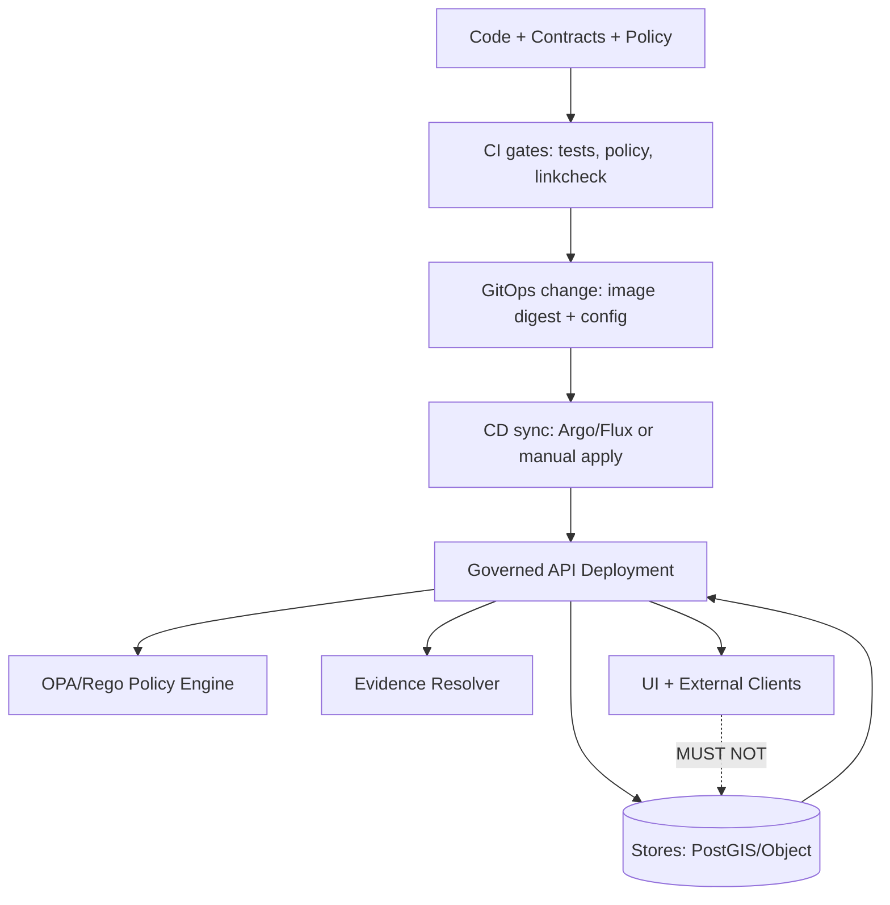

<!-- [KFM_META_BLOCK_V2]
doc_id: kfm://doc/2c8d6f6d-4b49-4fc6-8aa8-5e6f7bcbf2a7
title: "Runbook — Deploy Governed API (PEP)"
type: standard
version: v1
status: draft
owners: KFM Platform Maintainers (TBD)
created: 2026-03-02
updated: 2026-03-02
policy_label: restricted
related:
  - docs/runbooks/api/
  - policy/
  - contracts/
  - infra/
tags: [kfm, runbook, api, deploy, kubernetes, gitops]
notes:
  - "This runbook is intentionally fail-closed: replace TODOs/UNKNOWNs before production use."
[/KFM_META_BLOCK_V2] -->

# Runbook — Deploy Governed API (PEP)

**One-line purpose:** Safely deploy the KFM Governed API (Policy Enforcement Point + evidence-aware endpoints) to a Kubernetes-based environment with verified roll-forward and rollback.


> ⚠️ **Trust membrane rule (non-negotiable):** clients and UIs must *never* read from storage/DB directly. All access must flow through the governed API boundary.

---

## Navigation

- [Scope](#scope)
- [Architecture and invariants](#architecture-and-invariants)
- [Inputs](#inputs)
- [Pre-deploy gates](#pre-deploy-gates)
- [Deploy procedure](#deploy-procedure)
- [Post-deploy verification](#post-deploy-verification)
- [Rollback procedure](#rollback-procedure)
- [Troubleshooting](#troubleshooting)
- [Minimum verification steps](#minimum-verification-steps)
- [Appendix: command snippets](#appendix-command-snippets)

---

## Scope

### What this runbook covers

- Deploying a new **application version** of the Governed API.
- Verifying the API’s **policy enforcement**, **evidence resolution**, and **audit/observability hooks** at a smoke-test level.
- Rolling back quickly and safely.

### What this runbook does **not** cover

- Database migrations (use a dedicated `rb-db-migrate.md`).
- Data promotion (RAW→WORK→PROCESSED→CATALOG→PUBLISHED) (use pipeline runbooks).
- Changes to auth/identity providers (use a security runbook).

---

## Architecture and invariants

KFM is designed so the Governed API is the **enforcement boundary**: it applies policy decisions, redactions, versioning, evidence resolution, and emits auditable records for governed operations.

### Reference flow



### Invariants this deployment MUST preserve

- **Trust membrane:**
  - UI/external clients never access DB/object storage directly.
  - All reads/writes go through governed interfaces.
- **Published-only serving:** runtime services must serve only **promoted** dataset versions (with validated catalogs + receipts).
- **Contract-first behavior:** endpoints must remain compatible within `/api/v1` (additive changes only).
- **Auditability:** governed operations (e.g., Focus Mode, story publishing) must emit an `audit_ref` / receipt reference.

---

## Inputs

> ✅ Treat these as *release artifacts*. If any are missing, **stop** and resolve before proceeding.

| Input | Example | Required | Source of truth |
|---|---:|:---:|---|
| Image digest | `ghcr.io/<org>/kfm-api@sha256:...` | ✅ | Container registry |
| Deployment config ref | `infra/<...>@<git_sha>` | ✅ | Git (IaC / GitOps) |
| Policy bundle version | `policy-bundle@sha256:...` | ✅ | `policy/` build output |
| OpenAPI contract version | `/contracts/...` | ✅ | Git |
| Environment | `staging` or `prod` | ✅ | Operator |
| Rollback target | previous image digest | ✅ | Registry / last release |
| Change record | ticket / PR link | ✅ | Tracker (UNKNOWN) |

---

## Pre-deploy gates

### Gate 0 — Confirm “what is being deployed”

- [ ] Git SHA (application)
- [ ] Image digest exists and is pullable
- [ ] Policy bundle digest exists (if policy changed)

### Gate 1 — CI / policy / contract

**MUST be green before deploy:**

- Unit + integration tests
- Policy tests (OPA/Rego) fail-closed
- Contract checks (OpenAPI compatibility + request/response schema tests)
- Link/checksum checks for catalogs and evidence (if the release touches catalogs)

> TIP: Treat failed gates as **release blockers**, not “warnings.”

---

## Deploy procedure

> Choose **one** path. GitOps is preferred because it is auditable and reversible.

### Path A — GitOps deployment (preferred)

1) **Locate the API deployment definition**

- Search in `infra/` for the API deployment chart/kustomization.
- Confirm how image digests are pinned.

2) **Create a release commit**

- Update the API image reference to the **digest** (not a mutable tag).
- If applicable, update policy bundle digest/configmap version.
- Add/update a release note entry (if your repo uses one).

3) **Promote through environments**

- Merge to the environment branch/repo path for `staging`.
- After verification, repeat for `prod`.

4) **Sync CD controller**

- ArgoCD: sync the application.
- Flux: reconcile the kustomization/helmrelease.

> NOTE: Exact commands are cluster-specific; see [Appendix](#appendix-command-snippets).

### Path B — Break-glass manual deploy (kubectl/helm)

> ⚠️ Use only when GitOps is unavailable. You must still record:
> - the applied manifest revision (copy in the ticket),
> - the image digest,
> - the operator identity,
> - the rollback plan.

1) Set context and namespace

- `kubectl config use-context <CLUSTER_CONTEXT>`
- `kubectl get ns | grep <NAMESPACE>`

2) Apply or upgrade

- If Helm is used: `helm upgrade --install ...`
- Otherwise: `kubectl apply -f ...`

3) Watch rollout

- `kubectl rollout status deploy/<API_DEPLOYMENT> -n <NAMESPACE>`

---

## Post-deploy verification

### Step 1 — Kubernetes health

- [ ] Deployment is Available
- [ ] Pods Ready
- [ ] No CrashLoopBackOff
- [ ] HPA (if used) is stable

### Step 2 — API liveness and readiness

- [ ] `/healthz` returns 200 (or your equivalent)
- [ ] `/readyz` returns 200

### Step 3 — Contract smoke tests

Run against **staging first**, then production.

> Replace `BASE_URL`, auth headers, and example parameters.

- [ ] **Datasets**: `GET /api/v1/datasets`
  - Should be 200
  - Should include dataset versions (and **dataset_version_id** when applicable)
- [ ] **STAC**: `GET /api/v1/stac/collections` and `GET /api/v1/stac/items`
  - Should be 200
  - Should return policy-filtered results
- [ ] **Evidence resolution**: `POST /api/v1/evidence/resolve`
  - Should return an evidence bundle (or a policy-safe denial)
- [ ] **Focus Mode**: `POST /api/v1/focus/ask`
  - MUST return either:
    - citations (EvidenceRefs/EvidenceBundle references), or
    - a policy-safe abstention
  - MUST include an `audit_ref` (or equivalent) for the governed operation
- [ ] **Lineage**: `GET /api/v1/lineage/status`
  - Should return pipeline health/freshness signals (if implemented)

### Step 4 — Trust membrane spot-check

- [ ] Verify network policies / security groups prevent UI pods from directly reaching DB/object storage.
- [ ] Verify API service account permissions are least-privilege.

### Step 5 — Observability spot-check

- [ ] Error rate stable (no new spikes)
- [ ] Latency within SLO (UNKNOWN)
- [ ] Audit logs present for governed endpoints, and do not leak restricted details

---

## Rollback procedure

### Rollback decision triggers

Rollback immediately if any of the following are true:

- API cannot start or is crash-looping.
- Contract smoke tests fail in a way that breaks clients.
- Policy enforcement appears bypassed (e.g., restricted datasets visible to public role).
- Evidence resolution fails due to broken catalogs/links.

### GitOps rollback (preferred)

1) Revert the release commit (or reset image digest to prior known-good).
2) Sync CD controller.
3) Re-run [Post-deploy verification](#post-deploy-verification) against the rolled-back version.

### Manual rollback

- Kubernetes Deployment: `kubectl rollout undo deploy/<API_DEPLOYMENT> -n <NAMESPACE>`
- Helm: `helm rollback <RELEASE> <REVISION>`

> NOTE: Always capture the before/after image digests in the incident record.

---

## Troubleshooting

### Symptom: pods crash-loop

- Check: `kubectl logs deploy/<API_DEPLOYMENT> -n <NAMESPACE> --tail=200`
- Check: missing secrets / configmaps / policy bundle
- Check: DB connection config (timeouts, TLS, DNS)

### Symptom: 403/404 behavior seems inconsistent

- Ensure errors are **policy-safe** and do not reveal restricted existence via different error messages.
- Confirm policy bundle loaded and OPA reachable.

### Symptom: Evidence resolution fails

- Likely causes:
  - broken catalog cross-links (DCAT/STAC/PROV)
  - missing dataset_version_id
  - linkcheck/validator not run
- Action:
  - stop rollout
  - rollback
  - fix catalogs and rerun validators

### Symptom: Focus Mode returns answers without citations

- Treat as a **hard failure**: Focus Mode must cite-or-abstain.
- Disable the feature flag (if available) or rollback.

---

## Minimum verification steps

This runbook intentionally contains TODOs/UNKNOWNs. Before you consider it “production-ready,” capture:

- [ ] Cluster type + CD controller: ArgoCD/Flux/other
- [ ] Namespace, deployment name, and service name for the API
- [ ] Canonical health endpoints (`/healthz`, `/readyz`, etc.)
- [ ] The exact auth method used in non-prod and prod
- [ ] The location + format of audit logs and how to query them
- [ ] SLOs (latency, error budget) and alert routes

---

## Appendix: command snippets

> These are templates. Replace placeholders.

### Find the API deploy config in infra/

```bash
# Look for Helm charts / kustomize overlays / manifests
ls -la infra/

# Ripgrep for likely identifiers
rg -n "kfm-api|apps/api|/api/v1" infra/ -S
```

### GitOps sync examples (UNKNOWN)

```bash
# ArgoCD (example)
argocd app sync <APP_NAME>
argocd app wait <APP_NAME> --health

# Flux (example)
flux reconcile kustomization <KUSTOMIZATION_NAME> --with-source
```

### Rollout watch and rollback

```bash
kubectl -n <NAMESPACE> rollout status deploy/<API_DEPLOYMENT>

# If needed
kubectl -n <NAMESPACE> rollout undo deploy/<API_DEPLOYMENT>
```

### Smoke test skeleton

```bash
BASE_URL="https://<ENV>.example.kfm.gov"
AUTH_HEADER="Authorization: Bearer <TOKEN>"

curl -fsS -H "$AUTH_HEADER" "$BASE_URL/api/v1/datasets" | head
curl -fsS -H "$AUTH_HEADER" "$BASE_URL/api/v1/stac/collections" | head

# Evidence resolve (example payload)
curl -fsS -X POST -H "$AUTH_HEADER" -H "Content-Type: application/json" \
  -d '{"refs":[{"type":"stac_item","id":"<ID>"}]}' \
  "$BASE_URL/api/v1/evidence/resolve" | head

# Focus Mode (example payload)
curl -fsS -X POST -H "$AUTH_HEADER" -H "Content-Type: application/json" \
  -d '{"question":"<QUESTION>","context":{"time":"<ISO8601>"}}' \
  "$BASE_URL/api/v1/focus/ask" | head
```
