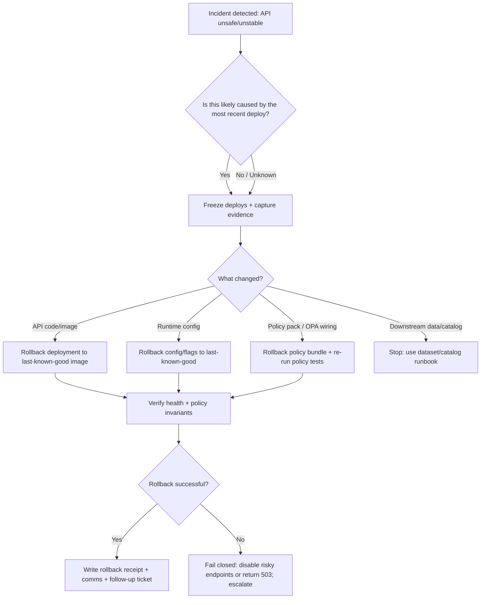

<!-- [KFM_META_BLOCK_V2]
doc_id: kfm://doc/8bfb8d2a-6b7c-4d1d-9d9e-9e8f7a5b4a12
title: API Rollback Runbook
type: standard
version: v1
status: draft
owners: TBD (Platform Ops / API)
created: 2026-03-02
updated: 2026-03-02
policy_label: restricted
related:
  - docs/runbooks/README.md
  - docs/runbooks/api/README.md
  - docs/runbooks/data/rb-dataset-rollback.md
  - docs/runbooks/catalog/rb-catalog-recover.md
  - docs/specs/api/
tags: [kfm, runbook, api, rollback, incident]
notes:
  - Default-deny: if any step is ambiguous, stop and escalate to governance/ops owners.
  - This runbook is "rollback-first": prefer safe reversion over ad-hoc patching during incident response.
[/KFM_META_BLOCK_V2] -->

# API Rollback Runbook

> **Purpose:** Roll back the **KFM Governed API (Policy Enforcement Point / PEP)** to a last-known-good version **without breaking the trust membrane**, auditability, or policy enforcement.

  

**Quick links:**
- [When to use this runbook](#when-to-use-this-runbook)
- [Safety invariants](#safety-invariants)
- [Decision tree](#decision-tree)
- [Rollback procedures](#rollback-procedures)
- [Verification checklist](#verification-checklist)
- [Rollback receipt](#rollback-receipt-required)
- [Post-rollback actions](#post-rollback-actions)

---

## Where this fits

KFM routes all UI and client reads through a governed API boundary. The API is the **Policy Enforcement Point (PEP)** and must be treated as a safety-critical surface.

This runbook covers rollback of:
- **API application code** (container/image revision)
- **API runtime configuration** (env vars, configmaps/secrets, feature flags)
- **API policy pack linkage** (OPA/Rego policy bundles, policy decision wiring)

This runbook does **not** cover:
- Rolling back a **published dataset** (see `docs/runbooks/data/rb-dataset-rollback.md`)
- Rebuilding catalogs (see `docs/runbooks/catalog/rb-catalog-recover.md`)

---

## When to use this runbook

Execute an API rollback when you have evidence that the **current API revision** is causing one or more of the following:

- **Security/policy regression**
  - Policy bypass, redaction failure, or sensitive existence leakage
  - 403/404 behavior changed in a way that can reveal restricted data
- **Availability regression**
  - Sustained 5xx error spikes / crash loops after deploy
- **Correctness regression**
  - API returns mismatched `dataset_version_id`, wrong digests, or wrong policy labels
- **Latency regression**
  - P95/P99 latency jumps tied to a deploy

> ⚠️ If the API is healthy but only one dataset/layer is wrong, you likely need a **data/catalog rollback**, not an API rollback.

---

## Safety invariants

**Hard rules during rollback (fail closed):**

1. **Never bypass the policy boundary.**
   - Do not “temporarily” wire the UI directly to storage or databases.
2. **Prefer reversion over live patching.**
   - If the last-known-good revision is available, roll back first, then analyze.
3. **Maintain auditability.**
   - Rolling back is a governed operation: record `who/what/when/why` and the deployed digests.
4. **Do not leak sensitive information in incident comms.**
   - Assume logs and alerts can contain sensitive context; keep updates policy-safe.

---

## Decision tree



---

## Prerequisites and access

**You must have:**
- Incident ticket (or equivalent) with an owner (IC)
- Access to:
  - Git repo(s) that drive deployment (GitOps preferred)
  - Cluster/namespace credentials (for emergency-only rollback)
  - Observability dashboards (logs, metrics, traces)

**Inputs you must capture before touching prod:**
- Current production **API revision identifier** (git SHA, image digest, or release tag)
- Last-known-good **API revision identifier**
- Start time of incident (UTC + America/Chicago)
- List of impacted endpoints (and if the impact is public/restricted)

---

## Rollback procedures

> ✅ **Preferred rollback method:** GitOps reversion (revert a commit / set release target to previous digest).
>
> 🚨 **Emergency-only method:** manual cluster rollback (e.g., `kubectl rollout undo`) to stop the bleeding.
>
> **Note:** Exact deployment tooling (Argo CD, Flux, Helm, raw manifests) is **TBD** in this repo snapshot. Keep commands templated and update once infra is confirmed.

### 0) Freeze and preserve evidence

1. **Freeze deploys**
   - If a repo kill-switch exists, enable it.
   - Otherwise, pause auto-deploy or set the environment to “manual approval only.”
2. **Snapshot evidence**
   - Dashboards/screenshots for error rate and latency
   - Current image digest / release revision
   - Any relevant `audit_ref` IDs from governed requests

### 1) Identify current and last-known-good versions

Record in the incident ticket:
- `api.current_ref`: (git SHA / image digest)
- `api.last_good_ref`: (git SHA / image digest)

> Tip: Prefer **digests** over mutable tags.

### 2) Roll back via GitOps (preferred)

**Goal:** revert the desired state so the cluster reconciler deploys the prior version.

**Template steps (fill in your repo specifics):**

```bash
# 1) Create a rollback branch
git checkout -b ops/rollback-api-YYYYMMDD-HHMM

# 2) Revert the deploy commit OR set the API image to last-known-good digest
# Example patterns:
# - git revert <bad_commit_sha>
# - edit helm values / kustomization to point to <LAST_GOOD_IMAGE_DIGEST>

# 3) Open PR with:
# - incident/ticket reference
# - last_good_ref
# - reason + blast radius

# 4) Merge with expedited review (per governance rules)
```

**During reconcile:**
- Monitor rollout status
- Monitor error rate and latency

### 3) Roll back via cluster tooling (emergency-only)

> 🚨 Use only if GitOps is unavailable or too slow for an active incident.

**Kubernetes template (confirm names before use):**

```bash
# Example only — replace namespace/deployment
kubectl -n <NAMESPACE> rollout status deploy/<API_DEPLOYMENT>

# Roll back to the previous ReplicaSet
kubectl -n <NAMESPACE> rollout undo deploy/<API_DEPLOYMENT>

# Or roll back to a specific revision (if supported)
kubectl -n <NAMESPACE> rollout history deploy/<API_DEPLOYMENT>
kubectl -n <NAMESPACE> rollout undo deploy/<API_DEPLOYMENT> --to-revision=<REV>
```

**Immediately after emergency rollback:**
- Open a GitOps PR to re-align desired state (don’t leave prod “drifted”).

### 4) Roll back runtime configuration

Use this when:
- API code is fine, but a config change broke behavior (auth, policy wiring, feature flags)

**Template:**
- Revert the config commit (preferred)
- Or revert the config object to previous revision (emergency-only)

```bash
# Example patterns (template):
# - git revert <config_commit>
# - kubectl rollout undo deploy/<API_DEPLOYMENT> (if config triggers new RS)
```

### 5) Roll back policy pack linkage

Use this when:
- A new policy bundle causes widespread denies OR allows something it should deny

**Rules:**
- Roll back the policy bundle AND ensure policy tests still cover allow/deny cases.
- Validate that error behavior stays policy-safe (avoid revealing existence through errors).

---

## Verification checklist

### A) Health and stability

- [ ] Deployment is stable (no crash loop)
- [ ] 5xx rate back to baseline
- [ ] P95 latency back to baseline

### B) Policy and trust membrane invariants

- [ ] No endpoints bypass policy evaluation
- [ ] 403/404 behavior is policy-safe (no existence leaks)
- [ ] Responses include required safety fields where applicable:
  - `policy_label`
  - `audit_ref`
  - `dataset_version_id` (when applicable)
  - artifact digests (when applicable)

### C) Contract sanity

- [ ] `/api/v1` semantics preserved (no breaking change introduced by rollback)
- [ ] Error model stable (`error_code`, policy-safe message, `audit_ref`)

### D) Observability

- [ ] Logs present and not leaking sensitive payloads
- [ ] Traces span policy evaluation / evidence resolution (where implemented)

---

## Rollback receipt required

Rolling back the API is a governed operational action. Create a rollback receipt (store location **TBD**):

**Minimum fields (JSON):**

```json
{
  "run_type": "ops.api.rollback",
  "incident_id": "TBD",
  "requested_by": "TBD",
  "approved_by": "TBD",
  "started_at": "2026-03-02T00:00:00Z",
  "completed_at": "2026-03-02T00:00:00Z",
  "environment": "prod",
  "reason": "TBD",
  "current_ref": "sha256:TBD",
  "rollback_target_ref": "sha256:TBD",
  "changed_surfaces": ["api", "config", "policy"],
  "verification": {
    "health": "pass|fail",
    "policy_invariants": "pass|fail",
    "contract_smoke": "pass|fail"
  },
  "notes": "Policy-safe summary only"
}
```

> ✅ Store this receipt immutably, and link it from the incident ticket.

---

## Post-rollback actions

- [ ] **Create/Update incident timeline** (include exact timestamps)
- [ ] **Open follow-up PR** to:
  - Add/strengthen tests that would have caught the regression
  - Add a canary/preview guardrail if missing
  - Add/repair automated rollback verification
- [ ] **Governance review** if the incident involved:
  - Policy bypass, redaction failure, licensing/sensitivity mislabel

---

## Appendix

<details>
<summary><strong>Suggested incident update template (policy-safe)</strong></summary>

> **Update (UTC):** We identified a regression in the KFM API deployment affecting availability and/or policy enforcement.
> We have initiated a rollback to the last-known-good build and are verifying service health and safety invariants.
> Next update in: (timebox).

</details>

<details>
<summary><strong>TODOs to finalize once infra is confirmed</strong></summary>

- [ ] Confirm deployment mechanism (Argo CD / Flux / Helm / Kustomize) and update command snippets
- [ ] Confirm namespace + deployment names (`<NAMESPACE>`, `<API_DEPLOYMENT>`)
- [ ] Confirm standard path for ops receipts and add it here
- [ ] Link this runbook from a runbook index (`docs/runbooks/api/README.md`)

</details>

---

_Back to top_: [API Rollback Runbook](#api-rollback-runbook)
