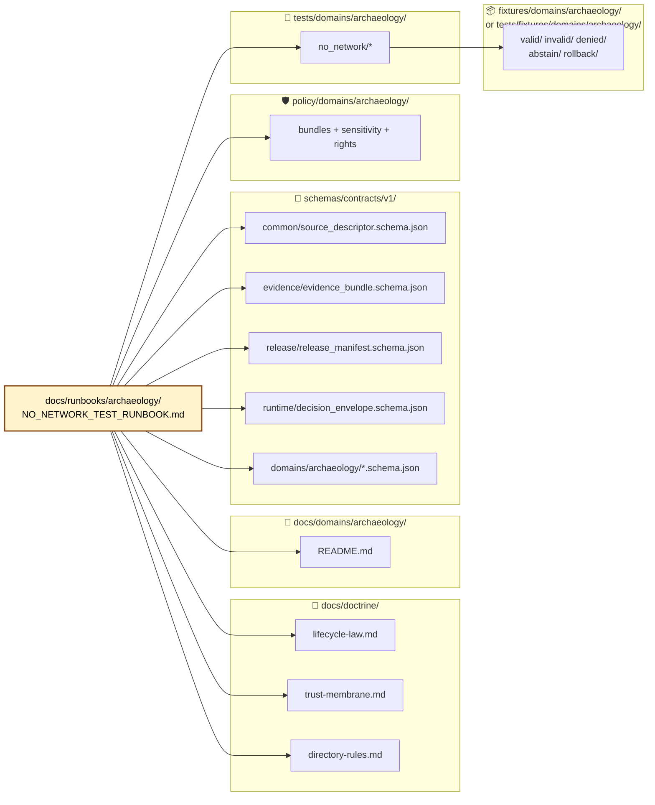
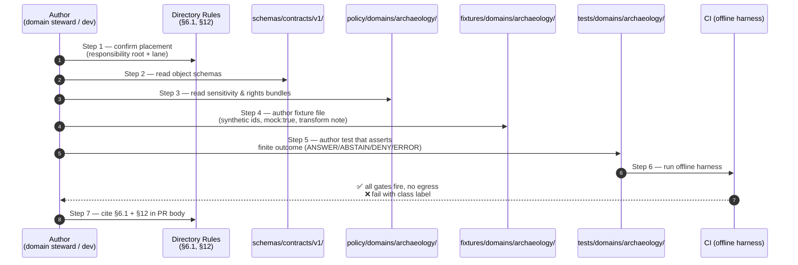

<!-- [KFM_META_BLOCK_V2]
doc_id: kfm://doc/runbook-archaeology-no-network-test
title: Archaeology — No-Network Test Runbook
type: standard
version: v0.1
status: draft
owners: <Archaeology domain steward + Test infra steward> (PROPOSED — confirm in CODEOWNERS)
created: 2026-05-13
updated: 2026-05-13
policy_label: public
related:
  - docs/doctrine/directory-rules.md
  - docs/doctrine/lifecycle-law.md
  - docs/doctrine/trust-membrane.md
  - docs/domains/archaeology/README.md
  - policy/domains/archaeology/README.md
  - tests/domains/archaeology/README.md
  - fixtures/domains/archaeology/README.md
  - docs/runbooks/ui_VALIDATION.md
  - docs/registers/VERIFICATION_BACKLOG.md
tags: [kfm, runbook, archaeology, fixtures, no-network, governance, sensitivity]
notes:
  - Domain-segment runbook under docs/runbooks/<domain>/ per Directory Rules §6.1 + §12.
  - All file paths quoted here are PROPOSED until verified against mounted-repo evidence.
  - This runbook governs synthetic, public-safe fixtures only — no real exact site geometry, no living-person data.
[/KFM_META_BLOCK_V2] -->

# 🏺 Archaeology — No-Network Test Runbook

> **How to author, validate, and exercise synthetic, public-safe no-network fixtures for the Archaeology and Cultural Heritage domain — so the trust spine can be proved without ever touching a live source, sensitive geometry, or a network.**

<!-- BADGES — placeholders until repo evidence confirms targets -->


<!-- TODO: replace with Shields.io endpoints wired to repo CI once docs/runbooks/archaeology/ is mounted -->

| Field | Value |
|---|---|
| **Document type** | Domain-specific operational runbook |
| **Authority of this runbook** | PROPOSED — derives doctrine from `docs/doctrine/` and domain dossier; implementation paths NEEDS VERIFICATION |
| **Scope** | Archaeology and Cultural Heritage domain only |
| **Lifecycle stage governed** | Pre-promotion: `RAW → WORK/QUARANTINE → PROCESSED → CATALOG/TRIPLET` (no `PUBLISHED` writes from this runbook) |
| **Network posture** | **Strictly offline.** Any test that reaches a network fails the gate. |
| **Sensitivity posture** | **Deny-by-default.** Fixtures MUST NOT contain real exact site geometry, real burial locations, real human-remains coordinates, real sacred-site identifiers, real private-landowner data, or real living-person data. |
| **Owners** | `<Archaeology domain steward>` + `<Test infra steward>` *(PROPOSED — confirm via CODEOWNERS)* |
| **Last updated** | 2026-05-13 |

---

## 📑 Quick jump

- [1. Purpose & doctrine basis](#1-purpose--doctrine-basis)
- [2. Repo fit & path placement](#2-repo-fit--path-placement)
- [3. Inputs — what belongs in an archaeology no-network fixture](#3-inputs--what-belongs-in-an-archaeology-no-network-fixture)
- [4. Exclusions — what MUST NOT appear](#4-exclusions--what-must-not-appear)
- [5. Fixture matrix (object family × outcome class)](#5-fixture-matrix-object-family--outcome-class)
- [6. Authoring workflow](#6-authoring-workflow)
- [7. No-network execution & validator order](#7-no-network-execution--validator-order)
- [8. CI integration & gates](#8-ci-integration--gates)
- [9. Acceptance checklist](#9-acceptance-checklist)
- [10. Rollback & quarantine drill](#10-rollback--quarantine-drill)
- [11. Related docs](#11-related-docs)
- [12. Appendix — verification backlog & open questions](#12-appendix--verification-backlog--open-questions)

---

## 1. Purpose & doctrine basis

This runbook describes the **first proof of trust** for the Archaeology domain: a synthetic, schema-valid, policy-aware, offline-only fixture set that exercises every finite outcome of the governed pipeline **without** touching a live source, exposing a sensitive location, or assuming any release state.

**Doctrine basis (CONFIRMED doctrine, PROPOSED implementation):**

- **Lifecycle invariant.** Archaeology follows `RAW → WORK/QUARANTINE → PROCESSED → CATALOG/TRIPLET → PUBLISHED`; promotion is a governed state transition, not a file move. Fixtures here exercise the pre-PUBLISHED span only.
- **Deny-by-default for sensitive geometry.** Exact archaeological locations, burial, human remains, sacred sites, unresolved cultural sensitivity, collection security, private landowner details, and looting-risk exposure fail closed.
- **Cite-or-abstain.** Any "answer" path must resolve `EvidenceRef → EvidenceBundle`. If the bundle is missing, fixtures MUST drive an **ABSTAIN** outcome — not a fabricated value.
- **No-network as the first PR.** The proposed sequence (`PR-00 no-network fixture`) places a synthetic-fixture round-trip *before* any source connector, schema home decision, or validator build. No-network is the trust spine; everything else hangs off it.
- **Watcher-as-non-publisher.** Workers exercised by these fixtures emit receipts and candidate decisions only; they MUST NOT write to `data/catalog/` or `data/published/`.

> [!IMPORTANT]
> **No-network is not "best effort offline."** A test that hits a DNS query, an HTTP probe, or a model endpoint **fails the gate**. The harness MUST refuse network egress; assertions that depend on network reachability are themselves a failure mode for this runbook.

[⬆ Back to top](#-archaeology--no-network-test-runbook)

---

## 2. Repo fit & path placement

**This runbook's home:** `docs/runbooks/archaeology/NO_NETWORK_TEST_RUNBOOK.md` — **PROPOSED**.

**Directory Rules basis:**

- `docs/runbooks/` is the canonical home for *ops procedures, rollback drills, validation runs* (§6.1).
- A domain MUST appear as a **segment** inside a responsibility root, never as a root itself (§12). Therefore `docs/runbooks/archaeology/<RUNBOOK>.md` is the correct shape; `archaeology/` at root or `runbooks/archaeology/` outside `docs/` would violate Domain Placement Law.
- Per-root README contract (§15) applies: `docs/runbooks/README.md` and `docs/runbooks/archaeology/README.md` SHOULD exist and reference this runbook.



> [!NOTE]
> All paths above are **PROPOSED** until verified against mounted-repo evidence. The diagram shows responsibility boundaries, not a guarantee of repo state.

[⬆ Back to top](#-archaeology--no-network-test-runbook)

---

## 3. Inputs — what belongs in an archaeology no-network fixture

An archaeology no-network fixture is a **synthetic, schema-valid, policy-aware JSON or JSON-LD record** that simulates one step of the governed pipeline. It must be human-inspectable, deterministic, and self-contained.

### 3.1 Required object families

Per the project's fixture rule, **every major object family** carries at least one valid, one invalid, one denied, one abstention, and one rollback or correction fixture. For archaeology, the object families to seed first are:

| Object family | Why it is in scope here | Schema home (PROPOSED) |
|---|---|---|
| **SourceDescriptor** | Establishes source role, rights, sensitivity, citation, time, hash. Gates `RAW` capture. | `schemas/contracts/v1/common/source_descriptor.schema.json` |
| **EvidenceBundle** + **EvidenceRef** | Resolves claims to admissible support. No bundle → ABSTAIN. | `schemas/contracts/v1/evidence/` |
| **ValidationReport** | Proves schema/geometry/temporal/rights/sensitivity gates ran. | `schemas/contracts/v1/data/validation_report.schema.json` |
| **DecisionEnvelope** *(ArchaeologyDecisionEnvelope projection)* | Finite outcomes: `ANSWER` / `ABSTAIN` / `DENY` / `ERROR`. | `schemas/contracts/v1/runtime/decision_envelope.schema.json` |
| **LayerManifest** | Public-safe layer descriptor for the map shell. Must reference released artifacts only. | `schemas/contracts/v1/release/layer_manifest.schema.json` |
| **ReleaseManifest** + **PromotionDecision** + **RollbackCard** | Release decision, promotion gate, and reversal path. | `schemas/contracts/v1/release/` |
| **CorrectionNotice** | Public correction path. | `schemas/contracts/v1/correction/correction_notice.schema.json` |
| **RunReceipt** / **AIReceipt** | Process memory; required for receipt closure. | `schemas/contracts/v1/runtime/` |
| **Archaeology-domain projections** | E.g., `ProvenienceContext`, `StratigraphicUnit`, candidate-feature record. Deterministic identity per project doctrine. | `schemas/contracts/v1/domains/archaeology/` |

> [!TIP]
> The point of a no-network fixture is **not** to look real. It is to drive each gate to a defined outcome and prove the gate fires. Use obviously synthetic identifiers (`SRC-ARCH-SYNTH-0001`, `SITE-ARCH-SYNTH-α`, ISO timestamps in a clearly synthetic year window) and an **explicit `mock: true` marker** so a fixture can never be confused with released evidence.

### 3.2 Public-safe transform requirement

The project's **sensitive-lane fixture rule** is non-negotiable: archaeology fixtures use **public-safe transformed** stand-ins, not real exact locations. Practical implications:

- Synthetic geometry SHOULD be **generalized** (centroid offset, county-level polygon, or generic grid cell) and the transform recorded in a fixture-level "transform note."
- Identifiers MUST be synthetic and obviously non-real.
- Time fields use a clearly synthetic year window (e.g., `19xx`/`20xx` synthetic ranges) or are explicitly marked as fixture-only.
- Cultural-affiliation / oral-history fields are stubbed with placeholder enum values; **never** a real community name unless the fixture is denial-class and the value is exactly what should fail closed.

[⬆ Back to top](#-archaeology--no-network-test-runbook)

---

## 4. Exclusions — what MUST NOT appear

> [!CAUTION]
> The following content does **not** belong in any no-network fixture under this runbook. A PR introducing such content MUST be blocked at review.

- Real exact archaeological site coordinates, perimeters, or elevation profiles.
- Real burial, human-remains, or sacred-site locations or identifiers.
- Real living-person data, descendant identifiers, or genealogical identifiers (those belong under `people-dna-land`, with separate controls).
- Real DNA-derived match metadata.
- Real private-landowner names, addresses, parcel IDs, or assessor identifiers.
- Real source credentials, API tokens, signed-URL tokens, or storage handles.
- Pointers to `data/raw/`, `data/work/`, `data/quarantine/`, or any internal canonical store.
- Network URLs that resolve in the harness (loopback or `example.invalid`-class only).
- Anything that depends on a live source registry, live tile service, live model runtime, or live vector index.

A fixture that includes any of the above is a **policy violation**, not a quality issue. Quarantine immediately (see §10).

[⬆ Back to top](#-archaeology--no-network-test-runbook)

---

## 5. Fixture matrix (object family × outcome class)

Each object family carries five fixture classes. Cells marked `—` mean *structurally inapplicable for that family* and SHOULD be left empty rather than padded.

| Object family ↓ / Outcome class → | `valid/` (ANSWER) | `invalid/` (ERROR) | `denied/` (DENY) | `abstain/` (ABSTAIN) | `rollback/` |
|---|---|---|---|---|---|
| SourceDescriptor | rights-clear, source-role labelled | missing required field; rights `unknown` | rights `restricted-no-public`; sensitivity `exact-archaeology` | source role ambiguous; pending review | rights revoked after release; supersession card |
| EvidenceBundle / EvidenceRef | resolves to ≥1 admissible source | unresolvable EvidenceRef | bundle references quarantined source | bundle below sufficiency threshold | bundle superseded by corrected evidence |
| ValidationReport | all gates pass | schema gate fail | sensitivity gate fail | temporal gate inconclusive | report withdrawn after re-validation |
| DecisionEnvelope (archaeology) | `ANSWER` w/ public-safe summary | malformed envelope | `DENY` on exact-location request | `ABSTAIN` on insufficient evidence | envelope tied to rolled-back release |
| LayerManifest | public-safe generalized layer | missing release reference | layer references restricted geometry | layer references stale evidence | layer revoked, manifest preserved |
| ReleaseManifest | full proof closure | missing rollback target | release blocked by policy | release pending review | release rolled back; correction issued |
| PromotionDecision | gate-pass record | gate evidence missing | gate denies promotion | gate defers; review queued | promotion reversed via rollback card |
| RollbackCard | well-formed reversal | missing target release id | rollback denied (no authority) | — | self-referential; the class itself |
| CorrectionNotice | public correction, cites superseded evidence | missing superseded reference | correction denied (would expose sensitive geometry) | correction pending review | correction itself superseded |
| RunReceipt / AIReceipt | clean run with citations | unsigned / hash mismatch | receipt for a denied request | receipt for an abstained request | receipt for a rolled-back run |
| Archaeology projection (`ProvenienceContext`, `StratigraphicUnit`, candidate feature) | public-safe generalized | malformed identity | exact-geometry request | candidate-not-site classification | record superseded by corrected projection |

> [!NOTE]
> The **candidate-not-site** abstention column is a project-specific archaeology test class. A remote-sensing or survey anomaly is a *candidate*, not a confirmed site; the fixture proves the system labels it as such and refuses to promote it to site identity without admissible evidence.

[⬆ Back to top](#-archaeology--no-network-test-runbook)

---

## 6. Authoring workflow



### 6.1 Step-by-step

1. **Identify the responsibility & lane.** Per Directory Rules §4 + §12: the fixture's home is `fixtures/domains/archaeology/` (or `tests/fixtures/domains/archaeology/` if the repo uses test-scoped fixtures — verify which is canonical for this repo before merge; both MUST NOT diverge).
2. **Pick the object family and outcome class.** One file = one outcome class. Do not bundle a `valid` and a `denied` case in one record.
3. **Stub the synthetic payload.** Use obviously synthetic identifiers. Add `"_mock": true` (or repo's canonical mock marker — **NEEDS VERIFICATION**) and a top-level `"transform_note"` describing any generalization applied.
4. **Cross-reference the schema.** The fixture's `$schema` field SHOULD point to the canonical schema path under `schemas/contracts/v1/...`.
5. **Author the assertion.** The test names the expected finite outcome explicitly and the gate it expects to fire.
6. **Run the offline harness locally** (see §7) before opening the PR.
7. **PR description cites:** Directory Rules §6.1 (runbook home) and §12 (domain-lane placement), plus the schema, policy, and fixture paths touched.

<details>
<summary><strong>📋 Example fixture skeleton (illustrative — confirm field shapes against canonical schemas)</strong></summary>

```json
{
  "$schema": "../../../../schemas/contracts/v1/common/source_descriptor.schema.json",
  "_mock": true,
  "_outcome_class": "denied",
  "_transform_note": "Synthetic record. No real coordinates. Generalized to county centroid.",
  "source_id": "SRC-ARCH-SYNTH-0007",
  "source_role": "observation",
  "rights": {
    "status": "restricted",
    "redistribution_class": "no-public",
    "rationale": "exact-archaeology-sensitivity"
  },
  "sensitivity": {
    "class": "exact-archaeology",
    "redaction_required": true
  },
  "temporal": {
    "observed": "20XX-01-15T00:00:00Z",
    "retrieved": "20XX-02-01T00:00:00Z"
  },
  "geometry": {
    "type": "Point",
    "coordinates": [-98.0, 38.5],
    "_transform": "county-centroid"
  },
  "checksum": {
    "algorithm": "sha256",
    "value": "0000000000000000000000000000000000000000000000000000000000000000"
  }
}
```

> Illustrative only — field names and required keys must match the canonical schema once `schemas/contracts/v1/common/source_descriptor.schema.json` is verified in the mounted repo.

</details>

[⬆ Back to top](#-archaeology--no-network-test-runbook)

---

## 7. No-network execution & validator order

### 7.1 Harness contract

The harness MUST:

1. **Refuse outbound network egress.** Implement at the test-runner level (e.g., DNS shim, loopback-only socket policy, `NO_PROXY=*` plus an explicit egress assertion). A test that *could* reach a network is a failure regardless of whether it did.
2. **Reject side-effecting writes** to `data/raw/`, `data/work/`, `data/quarantine/`, `data/catalog/`, `data/published/`, `release/`, or any canonical store. Fixtures MAY drive in-memory state and emit synthetic receipts to a scratch directory only.
3. **Refuse model-runtime calls.** Any AI test path uses a `MockAdapter` whose outputs are recorded fixtures, never a live `runtime/ollama/` or external provider.
4. **Record receipts** to a scratch path that is cleaned per run.

### 7.2 Validator order (fail-fast)

Validators run in the order below. Stop at the first failure for that fixture (unless the test class is "all-gates-fail," which is itself a fixture class).

| # | Validator | What it asserts | If it fails |
|---|---|---|---|
| 1 | **Schema** | JSON Schema validity against canonical `schemas/contracts/v1/...` | `ERROR` outcome |
| 2 | **Identity & determinism** | Deterministic identity basis (source id + role + temporal scope + normalized digest) is stable across runs | `ERROR` outcome |
| 3 | **Source-role** | Source is not used outside its declared authority | `DENY` outcome |
| 4 | **Rights** | Unknown rights or `no-public` redistribution blocks promotion | `DENY` outcome |
| 5 | **Sensitivity** | Exact-archaeology, burial, sacred, human-remains classes fail closed for any public-path test | `DENY` outcome |
| 6 | **Temporal** | Observed / valid / retrieval / release / correction times are distinct where material | `ABSTAIN` or `ERROR` |
| 7 | **Geometry validity** | Public-path fixtures carry only generalized geometry; exact geometry → DENY | `DENY` outcome |
| 8 | **Evidence closure** | `EvidenceRef` resolves to a complete `EvidenceBundle`, or the test expects `ABSTAIN` | `ABSTAIN` |
| 9 | **Citation validation** | Any "answer" cites at least one admissible source | `ABSTAIN` |
| 10 | **Catalog closure** | Catalog record carries proof of closure or is explicitly a release candidate | `ERROR` |
| 11 | **Policy gate (archaeology bundle)** | Domain-specific policy rules fire (exact-location denial, AI exact-location denial, candidate-not-site) | `DENY` |
| 12 | **Release manifest** | Manifest carries proof, correction path, rollback target | `ERROR` |
| 13 | **No-public-write** | No write hit `data/published/` or `release/manifests/` from the test run | **Hard fail** — quarantine the run |
| 14 | **No-network** | Egress monitor confirms zero outbound attempts | **Hard fail** — quarantine the run |

> [!IMPORTANT]
> **Validators 13 and 14 are non-recoverable.** A no-network fixture that causes a public write or a network egress attempt fails the runbook, not just the test. Open a `docs/registers/DRIFT_REGISTER.md` entry and quarantine before the next merge.

[⬆ Back to top](#-archaeology--no-network-test-runbook)

---

## 8. CI integration & gates

> [!NOTE]
> CI workflow file names, runner labels, and branch-protection settings are **NEEDS VERIFICATION** until the mounted repo is inspected. The table below describes the *contract* the CI workflow must satisfy, not a claim about a specific existing workflow file.

| CI gate (contract) | Expected behaviour | Status |
|---|---|---|
| `archaeology-no-network` job exists | Runs only the offline harness; no service containers requiring network; egress monitor active | **PROPOSED** |
| Schema validation step | All `fixtures/domains/archaeology/valid/` pass; all `invalid/` fail with declared reason | **PROPOSED** |
| Policy step | `denied/` fixtures hit policy deny; `abstain/` fixtures hit abstain class | **PROPOSED** |
| Rollback step | Each release-class fixture pairs to a `rollback/` fixture that re-applies cleanly | **PROPOSED** |
| Receipt closure step | Every test run emits `RunReceipt`; no missing or unsigned receipts | **PROPOSED** |
| No-public-write assertion | Static + dynamic check that no test wrote to `data/published/` or `release/manifests/` | **PROPOSED** |
| No-network assertion | Egress monitor reports zero outbound bytes | **PROPOSED** |
| Branch protection | The job is a required check on PRs that touch `*/domains/archaeology/*` | **NEEDS VERIFICATION** |

### 8.1 Local pre-PR run (illustrative)

The exact command names depend on the repo's test runner — confirm via `apps/cli/` or the root `package.json` / `pyproject.toml` once the repo is mounted.

```bash
# Illustrative — verify against repo conventions before relying on these names.

# 1. Run the archaeology no-network harness only.
kfm test --domain archaeology --no-network

# 2. Validate all fixtures against canonical schemas.
kfm validate fixtures --domain archaeology --schema-root schemas/contracts/v1

# 3. Run the policy gate against the archaeology bundle.
kfm policy test --bundle policy/domains/archaeology

# 4. Assert no test produced a public-path write.
kfm assert no-public-write --since HEAD~1

# 5. Assert no test attempted network egress.
kfm assert no-network --since HEAD~1
```

[⬆ Back to top](#-archaeology--no-network-test-runbook)

---

## 9. Acceptance checklist

A no-network fixture PR for archaeology is mergeable when **every** applicable box is ticked.

**Placement & governance**

- [ ] Fixture lives under the correct domain-lane path (`fixtures/domains/archaeology/<class>/...` or `tests/fixtures/domains/archaeology/<class>/...`).
- [ ] PR description cites Directory Rules §6.1 and §12.
- [ ] No new schema, contract, policy, or registry home was introduced without an ADR (§2.4).
- [ ] Per-root READMEs touched are still consistent with §15.

**Content**

- [ ] `_mock: true` (or repo's canonical mock marker) is present.
- [ ] `_transform_note` describes any geometry/identity generalization.
- [ ] No real exact site geometry, burial, sacred, human-remains, living-person, DNA, or private-landowner data is present.
- [ ] Identifiers are obviously synthetic.
- [ ] Time fields are clearly synthetic or explicitly marked fixture-only.

**Outcome class**

- [ ] The fixture targets exactly one outcome class (`valid`, `invalid`, `denied`, `abstain`, `rollback`).
- [ ] The test asserts the expected finite outcome (`ANSWER` / `ABSTAIN` / `DENY` / `ERROR`).
- [ ] The expected validator (§7.2) that fires is named in the test or a comment.

**Validation**

- [ ] Schema validates against `schemas/contracts/v1/...`.
- [ ] Policy gate behaves as declared.
- [ ] Receipts emit and resolve cleanly.
- [ ] No-public-write assertion passes.
- [ ] No-network assertion passes.

**Rollback**

- [ ] If the fixture is in a release class (`ReleaseManifest`, `PromotionDecision`, `CorrectionNotice`), a matching `rollback/` fixture exists.

[⬆ Back to top](#-archaeology--no-network-test-runbook)

---

## 10. Rollback & quarantine drill

> [!WARNING]
> If a no-network fixture is found to contain real exact site geometry, real living-person data, real DNA data, real source credentials, or any other forbidden content listed in §4, treat it as a **sensitivity incident**, not a code defect.

### 10.1 Immediate steps

1. **Quarantine the fixture file.** Move (or copy with deletion of the original via `git rm`) to a quarantine path under `data/quarantine/archaeology/<reason>/<run_id>/` — **PROPOSED** path; confirm against repo evidence.
2. **Open a `DRIFT_REGISTER.md` entry** describing the leak class, source, and affected paths.
3. **Force-push is NOT a remediation.** Git history is preserved; the leak is treated as a release-class event and a `CorrectionNotice` may be required if anything downstream consumed the fixture.
4. **Revoke any references** from `LayerManifest` or `ReleaseManifest` fixtures that referenced the offending record.
5. **Author the rollback card** under `release/rollback_cards/` (PROPOSED) naming the affected fixture(s) and the supersession path.

### 10.2 Re-merge gate

A quarantined fixture re-enters the test suite only after:

- [ ] Public-safe transform applied and recorded.
- [ ] Domain steward + sensitivity reviewer signoff.
- [ ] Rollback card closed.
- [ ] Drift entry resolved.

### 10.3 Rollback discipline at the runbook level

If this runbook itself is rolled back or superseded (e.g., by a unified `docs/runbooks/no-network/` cross-domain runbook), the old document MUST be retained as lineage under `docs/archive/lineage/` per Directory Rules §14.

[⬆ Back to top](#-archaeology--no-network-test-runbook)

---

## 11. Related docs

> Placeholders marked `TODO` until verified against mounted-repo evidence.

- [Directory Rules](../../doctrine/directory-rules.md) — placement authority.
- [Lifecycle Law](../../doctrine/lifecycle-law.md) — `RAW → PUBLISHED` invariant.
- [Trust Membrane](../../doctrine/trust-membrane.md) — why no-network fixtures land before any source connector.
- [Truth Posture](../../doctrine/truth-posture.md) — cite-or-abstain default.
- [Archaeology domain README](../../domains/archaeology/README.md) — domain scope, ownership, source-role burden.
- [Archaeology policy bundle README](../../../policy/domains/archaeology/README.md) — `TODO` confirm path.
- [Archaeology tests README](../../../tests/domains/archaeology/README.md) — `TODO` confirm path.
- [UI Validation Runbook](../ui_VALIDATION.md) — `TODO` confirm path.
- [Governed AI Validation Runbook](../governed_ai_VALIDATION.md) — `TODO` confirm path.
- [Verification Backlog](../../registers/VERIFICATION_BACKLOG.md) — open items.
- [Drift Register](../../registers/DRIFT_REGISTER.md) — placement / sensitivity conflicts.

[⬆ Back to top](#-archaeology--no-network-test-runbook)

---

## 12. Appendix — verification backlog & open questions

<details>
<summary><strong>📌 NEEDS VERIFICATION — items this runbook depends on but does not resolve</strong></summary>

- **NEEDS VERIFICATION:** Canonical mock-marker field name (`_mock`, `mock`, `is_mock`, `kfm_mock`). This runbook uses `_mock: true` as a placeholder.
- **NEEDS VERIFICATION:** Whether `fixtures/domains/archaeology/` (root `fixtures/`) or `tests/fixtures/domains/archaeology/` is the canonical fixture home for this repo. Both MUST NOT diverge per Directory Rules §6.6.
- **NEEDS VERIFICATION:** Exact CI workflow name and runner label for the offline harness job.
- **NEEDS VERIFICATION:** CLI command names quoted in §8.1 — current placeholders (`kfm test ...`) are illustrative.
- **NEEDS VERIFICATION:** Whether `release/rollback_cards/` is the canonical home in this repo, or whether `data/rollback/` is being used (Directory Rules §18 lists this as OPEN).
- **NEEDS VERIFICATION:** Steward authority for archaeology sensitivity review (oral history / cultural knowledge protocol; emergency public-layer disablement).
- **NEEDS VERIFICATION:** Public geometry thresholds and transform profiles for archaeology generalization (centroid offset radius, grid cell size, county-level fallback rule).
- **NEEDS VERIFICATION:** AI exact-location denial rule wiring in `runtime/model_adapters/` and `policy/domains/archaeology/`.

</details>

<details>
<summary><strong>📚 Doctrinal anchors (no external research used)</strong></summary>

This runbook draws exclusively from in-project documents:

- KFM domain encyclopedia — archaeology pipeline, sensitivity rules, validator/test list, no-network fixture as first PR.
- KFM Domains Culmination Atlas — archaeology stage handling, sensitivity, rights, publication posture, governed-AI behaviour, publication/correction/rollback.
- KFM Unified Implementation Architecture Build Manual — fixture rule (`valid / invalid / denied / abstain / rollback`), public-safe transform rule for sensitive lanes, watcher-as-non-publisher, no-public-write posture.
- KFM Whole-UI + Governed AI Expansion Report — runbook family conventions, CI fixture/test posture, no-network rationale, sensitivity exposure rules.
- Directory Rules — §4 placement protocol, §6.1 docs subtree, §12 Domain Placement Law, §13 anti-patterns, §15 README contract, §18 open questions.

No external (web) research was consulted for this runbook; project knowledge was sufficient for every doctrinal claim above. Truth labels (`CONFIRMED doctrine / PROPOSED implementation / NEEDS VERIFICATION`) are applied per project convention.

</details>

---

**Related docs:** see §11.
**Last updated:** 2026-05-13.
**Status:** draft — PROPOSED implementation; CONFIRMED doctrinal basis.

[⬆ Back to top](#-archaeology--no-network-test-runbook)
