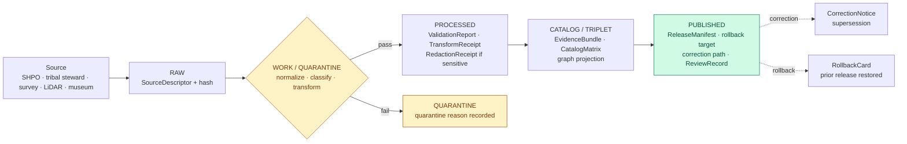
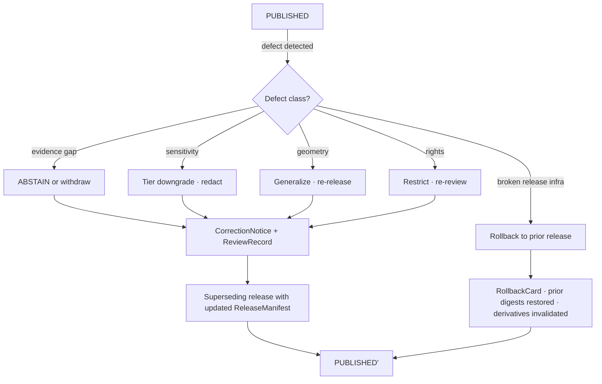

<!-- [KFM_META_BLOCK_V2]
doc_id: kfm://doc/runbook-archaeology-promotion
title: Archaeology Promotion Runbook
type: standard
version: v1
status: draft
owners: Archaeology domain steward · Sensitivity reviewer · Rights-holder representative · Release authority · Correction reviewer
created: 2026-05-13
updated: 2026-05-13
policy_label: public
related:
  - docs/doctrine/directory-rules.md
  - docs/doctrine/lifecycle-law.md
  - docs/doctrine/trust-membrane.md
  - docs/architecture/governed-ai/README.md
  - docs/domains/archaeology/README.md
  - contracts/release/release_manifest.md
  - contracts/release/promotion_decision.md
  - contracts/release/rollback_card.md
  - contracts/correction/correction_notice.md
  - contracts/governance/review_record.md
  - contracts/evidence/evidence_bundle.md
  - schemas/contracts/v1/release/release_manifest.schema.json
  - policy/sensitivity/archaeology/
  - policy/promotion/
tags: [kfm, archaeology, runbook, promotion, governance, sensitivity]
notes:
  - Path is PROPOSED extension of the docs/runbooks/ pattern; segment-by-domain follows Directory Rules §3.
  - Implementation maturity of every linked target is UNKNOWN until verified against mounted repo evidence.
[/KFM_META_BLOCK_V2] -->

# Archaeology Promotion Runbook

Operational procedure for moving Archaeology-lane content through the governed lifecycle — `RAW → WORK / QUARANTINE → PROCESSED → CATALOG / TRIPLET → PUBLISHED` — with **fail-closed defaults** for exact site locations, burials, sacred sites, and culturally sensitive material.


| Field         | Value |
|---|---|
| **Status**    | `draft` — doctrine-grounded; implementation references are PROPOSED |
| **Owners**    | Archaeology domain steward · Sensitivity reviewer · Rights-holder representative · Release authority |
| **Updated**   | 2026-05-13 |
| **Authority** | KFM lifecycle invariant + Directory Rules + DOM-ARCH + ENCY |
| **Scope**     | Archaeology lane only — settlements, hazards, roads/rail, geology lanes have their own runbooks |

> [!IMPORTANT]
> Promotion in KFM is a **governed state transition, not a file move.** This runbook describes the gates, artifacts, and approvals required to cross each transition; it does not authorize bypass under any condition. When in doubt, **HOLD**.

---

## Quick jump

- [1 · Scope and audience](#1--scope-and-audience)
- [2 · Lifecycle at a glance](#2--lifecycle-at-a-glance)
- [3 · Required artifacts](#3--required-artifacts)
- [4 · Pre-promotion checklist](#4--pre-promotion-checklist)
- [5 · Procedure A — Admission (→ RAW)](#5--procedure-a--admission---raw)
- [6 · Procedure B — Normalization (RAW → WORK / QUARANTINE)](#6--procedure-b--normalization-raw--work--quarantine)
- [7 · Procedure C — Validation (WORK → PROCESSED)](#7--procedure-c--validation-work--processed)
- [8 · Procedure D — Catalog closure (PROCESSED → CATALOG / TRIPLET)](#8--procedure-d--catalog-closure-processed--catalog--triplet)
- [9 · Procedure E — Release (CATALOG / TRIPLET → PUBLISHED)](#9--procedure-e--release-catalog--triplet--published)
- [10 · Sensitivity, rights, and CARE checks](#10--sensitivity-rights-and-care-checks)
- [11 · Separation of duties](#11--separation-of-duties)
- [12 · Failure handling and reason codes](#12--failure-handling-and-reason-codes)
- [13 · Correction and rollback](#13--correction-and-rollback)
- [14 · Verification backlog](#14--verification-backlog)
- [15 · Related docs](#15--related-docs)
- [Appendix · Promotion gate matrix A–G](#appendix--promotion-gate-matrix-ag)

---

## 1 · Scope and audience

**CONFIRMED doctrine.** This runbook governs promotion of objects produced by the Archaeology lane: `ArchaeologicalSite`, `SiteComponent`, `Survey`, `SurveyProject`, `SurveyTransect`, `ShovelTest`, `TestUnit`, `ExcavationUnit`, `ProvenienceContext`, `StratigraphicUnit`, `ArtifactRecord`, `Feature`, `Context`, `RemoteSensingAnomaly`, `LiDARCandidate`, `GeophysicsObservation`, `ThreeDDocumentation`, `CulturalReview`, `StewardReview`, `CollectionAccession`, `ChronologyAssertion`, `SensitivityTransform`, `CandidateFeature`, and `CulturalTemporalPeriod`. [DOM-ARCH] [ENCY]

**Out of scope.** Adjacent context supplied by other lanes (roads/rail, settlements, geology, hazards, spatial foundation) **may not confirm sites or bypass archaeological sensitivity.** [DOM-ARCH §§2-6]

**Audience.** Archaeology domain stewards, sensitivity reviewers, rights-holder representatives, release authorities, correction reviewers, and any contributor preparing a promotion PR. Read this before opening a PR that touches `data/processed/archaeology/`, `data/catalog/domain/archaeology/`, `data/published/layers/archaeology/`, `release/candidates/archaeology/`, or any sensitivity-relevant manifest. *(All paths PROPOSED — see Directory Rules §3.)*

> [!CAUTION]
> **Exact archaeological site locations are denied by default.** Burial, human remains, sacred sites, unresolved cultural sensitivity, collection security, private-landowner details, and looting-risk exposure **fail closed** at every gate. No public surface emits raw site coordinates. [DOM-ARCH §§2-6] [ENCY]

---

## 2 · Lifecycle at a glance

The KFM lifecycle invariant applies to Archaeology unchanged. What differs is the **default sensitivity posture**: every transition must demonstrate that exact geometry, cultural sovereignty, and rights have been resolved before the object may advance.



> [!NOTE]
> The diagram reflects KFM **doctrine** as documented in the Domains Atlas (§24.6.1 lifecycle gates) and the Encyclopedia (Appendix E). Specific implementation paths (workflows, validator entry points, runtime routes) are **UNKNOWN** until verified against mounted repo evidence.

A transition is **closed** only when:

1. The required artifacts (see §3) exist for that gate.
2. Every artifact resolves the artifacts it depends on (`EvidenceRef → EvidenceBundle`, `source_id → SourceDescriptor`, `model_id → ModelRunReceipt`) — references alone are insufficient.
3. The policy gate has evaluated and recorded its decision (`ANSWER` / `ABSTAIN` / `DENY` / `ERROR`).

Missing any of these means the transition **fails closed**; the prior state is preserved. [ENCY] [DIRRULES]

---

## 3 · Required artifacts

Artifact homes are PROPOSED per the Atlas crosswalk; verify against current repo evidence before authoring paths.

| Object family | Used at gate | Schema home (PROPOSED) | Contract home (PROPOSED) | Truth label |
|---|---|---|---|---|
| `SourceDescriptor` | Admission | `schemas/contracts/v1/source/` | `contracts/source/` | CONFIRMED doctrine |
| `TransformReceipt` | Normalization | `schemas/contracts/v1/data/` | `contracts/data/` | CONFIRMED doctrine |
| `ValidationReport` | Validation | `schemas/contracts/v1/data/` | `contracts/data/` | CONFIRMED doctrine |
| `RedactionReceipt` (`SensitivityTransform` for Archaeology) | Validation / Catalog | `schemas/contracts/v1/domains/archaeology/` | `contracts/domains/archaeology/` | CONFIRMED doctrine |
| `EvidenceRef` → `EvidenceBundle` | Validation onward | `schemas/contracts/v1/evidence/` | `contracts/evidence/` | CONFIRMED doctrine |
| `CatalogMatrix` entry | Catalog closure | `schemas/contracts/v1/data/` | `contracts/data/` | CONFIRMED doctrine |
| `ReviewRecord` (cultural / steward) | Catalog / Release | `schemas/contracts/v1/governance/` | `contracts/governance/` | CONFIRMED doctrine |
| `PromotionDecision` | Release | `schemas/contracts/v1/release/` | `contracts/release/` | CONFIRMED doctrine |
| `ReleaseManifest` | Release | `schemas/contracts/v1/release/` | `contracts/release/` | CONFIRMED doctrine |
| `RollbackCard` | Release / Rollback | `schemas/contracts/v1/release/` | `contracts/release/` | CONFIRMED doctrine |
| `CorrectionNotice` | Correction | `schemas/contracts/v1/correction/` | `contracts/correction/` | CONFIRMED doctrine |
| `RunReceipt` | Every CI-run gate | `schemas/contracts/v1/runtime/` | `contracts/runtime/` | CONFIRMED doctrine |
| `DecisionEnvelope` / `ArchaeologyDecisionEnvelope` | Runtime / API | `schemas/contracts/v1/runtime/` | `contracts/runtime/` | PROPOSED route — exact endpoint UNKNOWN |

> [!TIP]
> If a required artifact is **missing**, emit it and re-run the gate — do not waive the requirement. Default-deny is structural: the absence of evidence blocks promotion.

---

## 4 · Pre-promotion checklist

Run this checklist **before** opening or approving a promotion PR. Each item must resolve to **YES / N/A** with linked evidence; a missing or unknown item is a `HOLD`.

```text
[ ] Source identity and role are recorded in a SourceDescriptor.
[ ] Source rights are resolved or explicitly RIGHTS_UNKNOWN with steward action queued.
[ ] Sovereignty / cultural authority is identified (steward_org, authority_to_control, consent).
[ ] Object distinguishes CandidateFeature from confirmed ArchaeologicalSite.
[ ] No exact site coordinates appear in any public-bound artifact (geometry generalized below threshold).
[ ] Below-H3-r7 geometry is absent from products marked public-safe.    (See §10.)
[ ] SensitivityTransform / RedactionReceipt is present and lineage-logged.
[ ] EvidenceRef resolves to a closed EvidenceBundle.
[ ] ValidationReport status is "pass" for all required validators.
[ ] CatalogMatrix entry closes (digest, EvidenceBundle, graph projection).
[ ] ReviewRecord exists where required (cultural / steward review for sensitive content).
[ ] Release authority is distinct from the author for material releases.
[ ] ReleaseManifest names a rollback target and a correction path.
[ ] RunReceipt is signed (DSSE / cosign) and discoverable via lineage.
[ ] PromotionDecision records spec_hash, attestation_ref, and decision_id.
[ ] No raw model output, raw stores, or canonical internals are reachable from the public surface.
```

---

## 5 · Procedure A — Admission (`— → RAW`)

**Pre-condition.** Source identity and rights are minimally established at discovery; source-role intent is set. [ENCY] [DIRRULES]

**Steps.**

1. Open a `SourceDescriptor` entry. Record source role (steward / tribal / survey / SHPO / museum / remote-sensing / geophysics / historical-map / 3D), authority, rights statement, sensitivity classification, cadence, and the immutable payload hash. *(Connector output goes to `data/raw/archaeology/<source_id>/<run_id>/` — PROPOSED per Directory Rules §7.3.)*
2. **Do not normalize, transform, or publish** at this step. Connectors do not promote. [DIRRULES §7.3]
3. If source role is unclear, mark the SourceDescriptor `ROLE_UNRESOLVED` and queue steward triage. Promotion does not advance.
4. If rights or sovereignty cannot be confirmed, set `RIGHTS_UNKNOWN` and route to the rights-holder representative.

**Exit criteria.** A `SourceDescriptor` exists with hash, source-role, and sensitivity classification recorded.

**Fail-closed outcome.** Source is not admitted; the candidate is logged as awaiting steward action.

---

## 6 · Procedure B — Normalization (`RAW → WORK / QUARANTINE`)

**Pre-condition.** Schema, geometry, time, identity, evidence, rights, and policy rules are runnable. [ENCY] [DIRRULES]

**Steps.**

1. Run domain normalizers: schema validators (`schemas/contracts/v1/domains/archaeology/`), geometry validators, temporal normalizers, identity resolvers. *(PROPOSED schema home.)*
2. Emit a `TransformReceipt` for every transform, including coordinate generalization, raster downsampling, and CRS reprojection.
3. Classify object as `CandidateFeature` vs. assertion of `ArchaeologicalSite`. **Remote-sensing anomalies, LiDAR candidates, geophysics observations, and model outputs remain candidates until confirmed by source evidence and review.** [REF-3DGIS Chs. 2-4]
4. Apply `SensitivityTransform`: generalize geometry, redact sacred / burial context, suppress exact survey extents per policy. Log the transform to enable audit.
5. Quarantine any object that fails validation, rights, sensitivity, source-role, or policy checks. Record `quarantine_reason` and the failing rule.

> [!WARNING]
> A candidate-to-confirmed upgrade is **not** a normalization step. It requires a `ReviewRecord` and may require a `RIGHTS_HOLDER_REVIEW` for sovereign or culturally sensitive material. Do not collapse candidate-vs-confirmed at the validator layer.

**Exit criteria.** Object holds a `TransformReceipt`, a working `ValidationReport`, a `PolicyDecision`, and — for sensitive content — a `RedactionReceipt`. Failures land in QUARANTINE with reason.

**Fail-closed outcome.** Quarantine with reason; never silent promotion.

---

## 7 · Procedure C — Validation (`WORK → PROCESSED`)

**Pre-condition.** Validators are deterministic, tied to fixtures, and the required receipts are present.

**Required Archaeology validators (PROPOSED).** [DOM-ARCH]

| Validator | Purpose |
|---|---|
| `evidence_bundle_required` | Refuse promotion of objects without a resolvable `EvidenceBundle`. |
| `candidate_not_site` | Refuse to label a remote-sensing / LiDAR / geophysics record as a confirmed site without source + review. |
| `exact_geometry_denial` | Block any public-bound product carrying below-threshold geometry for sensitive classes. |
| `public_no_leak` | End-to-end test that public artifacts do not surface exact coordinates, burial, sacred-site, or human-remains content. |
| `rights_and_cultural_review` | Refuse promotion when rights or cultural review is unresolved. |
| `catalog_closure` | Verify EvidenceRefs resolve, digests close, and catalog matrix passes. |
| `ai_exact_location_denial` | AI surface (Focus Mode) must DENY any exact-location query for Archaeology. |

> [!IMPORTANT]
> Validators **do not decide truth.** They prove rules are enforceable. Truth lives in `contracts/` (meaning) + `schemas/` (shape) + `policy/` (admissibility) + `EvidenceBundle` (substantiation). [DIRRULES §§6.3-6.5]

**Exit criteria.** All required validators emit `pass`; `RedactionReceipt` is present where sensitivity applies; `RunReceipt` is recorded for the validation run.

**Fail-closed outcome.** Stay in WORK; emit structured `FAIL` outcome with reason codes (see §12).

---

## 8 · Procedure D — Catalog closure (`PROCESSED → CATALOG / TRIPLET`)

**Pre-condition.** EvidenceRefs resolve; catalog matrix and digests close.

**Steps.**

1. Compose the `EvidenceBundle` from the validated PROCESSED objects and their EvidenceRefs. Bundles **are** the substantiation surface; downstream graphs, vector indexes, and search projections are derivative.
2. Emit the `CatalogMatrix` entry: source role, identity, temporal scope, sensitivity tier, evidence-bundle digest, related-lane relations (see §1).
3. Build graph / triplet projections from released or review-authorized evidence — never from RAW or quarantined material. [GAI] [ENCY]
4. Validate catalog closure: every EvidenceRef resolves; every digest closes; every relation preserves source role, sensitivity, and rights.

**Exit criteria.** `CatalogMatrix` entry valid; `EvidenceBundle` closed; graph projections (where applicable) link only to released-or-authorized evidence.

**Fail-closed outcome.** HOLD at PROCESSED; emit structured FAIL; **no public edge is created**.

---

## 9 · Procedure E — Release (`CATALOG / TRIPLET → PUBLISHED`)

**Pre-condition.** Review state is satisfied where required; release authority is distinct from the original author when materiality applies. [ENCY §24.7]

**Steps.**

1. Confirm review coverage:
   - Steward review for any object claiming `ArchaeologicalSite` status.
   - **Rights-holder representative** sign-off for sovereign, tribal, or culturally sensitive content.
   - Sensitivity reviewer sign-off for any tier transition toward more public exposure.
2. Compose the `ReleaseManifest`:
   - Released artifact set with digests
   - Policy posture (gate decisions, sensitivity tier)
   - Review state references (`ReviewRecord` IDs)
   - **Rollback target** (prior valid release or explicit "first release")
   - **Correction path** (channel + reviewer + supersession rule)
   - Attestation references (DSSE / cosign / Rekor where applicable)
3. Run the **Promotion Gate Matrix A–G** (see Appendix). Promotion is denied unless every required gate evaluates `allow` with verified receipts.
4. Emit a signed `PromotionDecision` with `decision_id`, `spec_hash`, `attestation_ref`, and outcome.
5. Publish through the governed API path **only**. Public clients consume `apps/governed-api/` endpoints, not canonical or internal stores. [DIRRULES §7] [Trust membrane]

> [!CAUTION]
> The Archaeology layer manifest resolver returns **public-safe release only**. A `LayerManifest` referencing un-generalized geometry, missing `SensitivityTransform` provenance, or missing `ReviewRecord` must return `DENY` — not a degraded `ANSWER`.

**Exit criteria.** `ReleaseManifest`, rollback target, correction path, and (where required) `ReviewRecord` all present; PromotionDecision is `ANSWER`/`allow`; `RunReceipt` and attestation are stored immutably.

**Fail-closed outcome.** HOLD at CATALOG; no public surface change.

---

## 10 · Sensitivity, rights, and CARE checks

These rules **fail closed** at every gate. They are not waivable.

| Concern | Default | Required artifact to advance |
|---|---|---|
| Exact site coordinates | DENY | Generalization receipt + sensitivity reviewer sign-off |
| Burial / human remains | DENY (no public path) | Rights-holder review + no public layer at any tier |
| Sacred sites | DENY | Rights-holder representative consent + steward review |
| Unresolved cultural sensitivity | DENY | `CulturalReview` resolved |
| Below H3 r7 geometry on sensitive products | DENY | Generalization above threshold + reviewer sign-off |
| Private-landowner detail | DENY | Redaction or steward-only access |
| Collection security | DENY public | Steward-only / staged access only |
| Looting-risk exposure | DENY | Risk assessment + steward + release authority |
| Indigenous data sovereignty | CARE-gated default-deny | Consent grant present, valid, unrevoked; `authority_to_control` recorded; `obligations` and `benefit_commitments` declared |

**CARE alignment (CONFIRMED doctrine).** Any Archaeology object whose `MetaBlock v2` declares a non-empty `authority_to_control` is gated by an OPA rule that defaults to deny on publication, with an explicit allow path requiring the named authority's consent grant to be present, valid, and unrevoked. The rule runs at PR-time (Conftest) and at runtime (admission webhook / PDP), giving CI-equals-runtime parity. [C15-03] [C5-03]

**Generalization log.** Every public geometry must carry a generalization receipt that records the input precision, the transform applied (H3 resolution, buffer, suppression), and the policy clause that justified it. The receipt is validation evidence; the badge in the UI is not. [SRC-061 pp.228-229]

> [!NOTE]
> Public geometry thresholds and specific transform profiles for Archaeology are **NEEDS VERIFICATION** in this session. Treat any specific numeric threshold here (e.g., H3 r7) as the floor named in source evidence, not as a verified repo configuration.

---

## 11 · Separation of duties

CONFIRMED doctrine, **PROPOSED enforcement maturity.** Archaeology is a sensitive lane; the author of a promotion **may not** approve it. [ENCY §24.7.2]

| Action | Author may approve? | Required separation |
|---|---|---|
| Source admission (`— → RAW`) | Routine: yes. Unresolved rights / sovereignty: **no.** | Source steward + rights-holder representative where applicable |
| Normalization receipts | Routine: yes. Sensitivity-relevant transforms: **no.** | Domain steward; sensitivity reviewer when transforms touch sensitive content |
| Validator authorship / run | Yes (deterministic) | Domain steward; periodic docs-steward audit |
| Promotion to PROCESSED / CATALOG (Archaeology) | **No — sensitive lane** | Domain steward + sensitivity reviewer |
| Release to PUBLISHED | **No when materiality applies** | Author ≠ release authority; rights-holder representative where applicable |
| Sensitive-lane release (Archaeology) | **No** | Author + sensitivity reviewer + release authority + rights-holder representative |
| Correction / rollback | **No when steward-significant** | Author / detector + correction reviewer + release authority |
| AI surface change (Focus Mode templates) | **No** | AI surface steward + docs steward |

> [!IMPORTANT]
> Maturity note: tooling-enforced separation is the target. Until enforcement is verified in repo, separation is enforced by **custom and review discipline**, and this fact must be visible in every promotion PR description.

---

## 12 · Failure handling and reason codes

A failed gate must emit a structured outcome. Below are the doctrine-level reason codes; lane-specific reason codes may be added per ADR.

| Failure family | Reason code (PROPOSED catalog) | Gate(s) where it fires | Recovery |
|---|---|---|---|
| Missing required artifact | `MISSING_RECEIPT`, `MISSING_EVIDENCE`, `MISSING_REVIEW` | Normalization / Validation / Catalog / Release | Re-emit; re-run review or validator |
| Schema / contract mismatch | `SCHEMA_MISMATCH`, `CONTRACT_DRIFT` | Normalization / Validation | Fix schema and/or ADR; re-run |
| Rights / sensitivity unresolved | `RIGHTS_UNKNOWN`, `SENSITIVITY_UNRESOLVED` | Admission / Validation / Catalog / Release | Steward review; rights resolution; tier reassignment |
| Source-role collapse | `ROLE_COLLAPSE`, `ROLE_DOWNCAST_FORBIDDEN` | Validation / Catalog / Release | Restore source role; refuse upcast |
| Review state inadequate | `REVIEW_NEEDED`, `REVIEW_INSUFFICIENT`, `REVIEW_REJECTED` | Catalog / Release | Run required review; supply `ReviewRecord` |
| Release infrastructure error | `RELEASE_MANIFEST_INVALID`, `ROLLBACK_TARGET_MISSING` | Release | Manifest fix; supply rollback target |
| Correction lineage broken | `CORRECTION_DERIVATIVES_UNRESOLVED`, `CORRECTION_PRIOR_RELEASE_MISSING` | Correction | Resolve derivatives; supersession entry |
| Archaeology-specific | `EXACT_GEOMETRY_DENIED`, `CULTURAL_REVIEW_REQUIRED`, `LOOTING_RISK_ESCALATION` | Validation / Catalog / Release | Generalize geometry; route to rights-holder; risk assessment |

**Where the reason goes.** Every reason code is recorded on the `DecisionEnvelope` and joined to the `PromotionDecision`, the `RunReceipt`, and (where applicable) the `AIReceipt` via a shared `decision_id`. Append-only audit ledgers and DSSE/cosign attestations are the canonical place to retrieve them.

---

## 13 · Correction and rollback

Correction and rollback are **publication requirements, not afterthoughts.** A released Archaeology claim must already carry a visible correction path and rollback target before it is treated as safely publishable.



**Correction posture by defect class** (CONFIRMED doctrine):

| Defect class | Correction posture | Rollback posture |
|---|---|---|
| Evidence gap | ABSTAIN or withdraw unsupported claim | Restore prior evidence-supported release |
| Rights / sensitivity | Tier downgrade; redact; re-review | Restore prior compliant release |
| Geometry over-precision | Generalize; re-release | Restore prior generalized release |
| Source-role collapse | Restore role; re-validate | Restore prior release |
| Review state regression | Hold; require fresh review | Restore prior reviewed release |

**Rollback requirements.** Identify affected release, locate prior safe artifact set, verify digests and manifests, **disable or withdraw affected public surfaces** (governed API path), preserve audit receipts, mark stale or withdrawn UI state, and restore through the same governed release path. Rollback is **not a hidden file copy**. [BLD-GREEN §20] [UIAI-MASTER §§10-14]

**Stale vs. wrong.** A stale claim is one whose evidence, source freshness, dependent data, or context has aged past its declared tolerance; a wrong claim is one whose substance is incorrect. Both states have visible markers and traceable lifecycles. Stale-state markers appear in the Evidence Drawer alongside `ReleaseManifest` references; they are not silent. [Atlas §24.8]

---

## 14 · Verification backlog

These items are **NEEDS VERIFICATION** until evidence from a mounted repo, schemas, registry entries, tests, logs, emitted artifacts, review records, or release manifests resolves them. Carry them on the verification backlog and link any PR that closes one.

<details>
<summary><strong>Open verification items — Archaeology promotion</strong></summary>

| Item | Evidence that would settle it | Status |
|---|---|---|
| Verify Archaeology schema home (`schemas/contracts/v1/archaeology/` vs. `schemas/contracts/v1/domains/archaeology/`) | Mounted repo + ADR-0001 conformance check | NEEDS VERIFICATION |
| Verify policy bundle home for Archaeology sensitivity (`policy/sensitivity/archaeology/` vs. `policy/domains/archaeology/`) | Mounted repo + ADR | NEEDS VERIFICATION |
| Confirm runbook path convention (`docs/runbooks/archaeology/PROMOTION_RUNBOOK.md` nested vs. flat `docs/runbooks/archaeology_PROMOTION.md`) | Existing repo convention or docs-steward decision | PROPOSED |
| Verify steward authority register and confidentiality scopes | `control_plane/source_authority_register.yaml`; review records | NEEDS VERIFICATION |
| Define public geometry thresholds and transform profiles (H3 resolution, buffer radius, suppression rules) | Policy fixtures + sensitivity reviewer ADR | NEEDS VERIFICATION |
| Verify oral history / cultural-knowledge handling protocol | Domain dossier + rights-holder agreement record | NEEDS VERIFICATION |
| Verify emergency public-layer disablement and rollback drill | Rollback playbook + drill log | NEEDS VERIFICATION |
| Verify Archaeology feature/detail resolver route and `ArchaeologyDecisionEnvelope` schema | `apps/governed-api/` route map + schema | UNKNOWN |
| Verify CI workflow names align to Promotion Gate Matrix A–G | `.github/workflows/` + branch protection rules | NEEDS VERIFICATION |
| Verify attestation flow (DSSE / cosign / Rekor) for Archaeology releases | `tools/attest/` + verify-attestation gate | NEEDS VERIFICATION |
| Verify CARE consent-grant store and revocation channel | `policy/consent/` + steward feedback channel | NEEDS VERIFICATION |
| Verify AI exact-location denial test coverage in `tests/domains/archaeology/` | Negative fixtures + test report | NEEDS VERIFICATION |

</details>

---

## 15 · Related docs

- `docs/doctrine/directory-rules.md` — placement rules; responsibility roots; lifecycle invariant
- `docs/doctrine/lifecycle-law.md` — RAW → PUBLISHED invariant *(PROPOSED)*
- `docs/doctrine/trust-membrane.md` — public/UI/AI surfaces and governed APIs *(PROPOSED)*
- `docs/domains/archaeology/README.md` — domain landing *(PROPOSED — see DOM-ARCH dossier for content basis)*
- `docs/architecture/governed-ai/README.md` — Focus Mode evidence binding; ABSTAIN / DENY semantics *(PROPOSED)*
- `docs/runbooks/governed_ai_VALIDATION.md` — Focus Mode validation runbook *(PROPOSED)*
- `docs/runbooks/governed_ai_ROLLBACK.md` — AI adapter rollback runbook *(PROPOSED)*
- `contracts/release/release_manifest.md` — release object meaning
- `contracts/release/promotion_decision.md` — promotion outcome record
- `contracts/release/rollback_card.md` — rollback record
- `contracts/correction/correction_notice.md` — correction record
- `contracts/governance/review_record.md` — review-state object
- `contracts/evidence/evidence_bundle.md` — substantiation surface
- `policy/sensitivity/archaeology/` — admissibility rules for sensitive Archaeology content
- `policy/promotion/` — promotion-gate policy bundle (Gates A–G)
- `release/candidates/archaeology/` — release candidate manifests

> [!NOTE]
> Every link above is **PROPOSED** until verified against current repo evidence. Use these as targets for placement under Directory Rules, not as proof of existence.

---

## Appendix · Promotion Gate Matrix A–G

CONFIRMED doctrine. KFM enforces seven gates between authoring and publication. Auto-merge fires only when all seven pass; any failure blocks the merge until remediation. [C5-01] [C5-02]

| Gate | Intent | Machine check (PROPOSED tooling) | Required evidence |
|---|---|---|---|
| **A — Structure & Metadata** | MetaBlock present; zones correct | `check_structure` | KFM Meta Block v2; CARE fields where applicable |
| **B — Schemas & Contracts** | Schema + OpenAPI validation | JSON Schema validators; OpenAPI validator | Object validates against `schemas/contracts/v1/...` |
| **C — Policy Parity** | CI = runtime; same bundle, pinned digest | Conftest / OPA in CI; PDP or Gatekeeper at runtime | Bundle digest match; same decisions both sides |
| **D — Security & Sensitivity** | Sensitivity + license scans; CARE rules | Sensitivity scanner; license scanner; CARE OPA rules | No exact-geometry leak; consent-grant valid; rights status `allow` |
| **E — Data Quality** | Profilers / assertions with thresholds | DQ runner | All required validators `pass` |
| **F — Provenance & Lineage** | Receipt and lineage validation | OpenLineage emit + verify | `RunReceipt` cosign-verified; lineage `run_id` discoverable |
| **G — Reviewability** | CODEOWNERS + policy two-key approval | CODEOWNERS enforcement; required reviews | `ReviewRecord`(s); release-authority sign-off |

**Default-deny posture (CONFIRMED).** Promotion is denied unless: `spec_hash` is present and matches a recomputation; the `RunReceipt` is cosign-signed and verifiable; SPDX rights are in the allowlist; at least one attestation bundle is published; and every dataset-quality check has status `pass`. Only then is `input.valid = true` and `allow` permitted. [C5-02]

**Archaeology-specific overlays:**

- **Gate D** additionally requires `SensitivityTransform` lineage and absence of below-threshold geometry on public products.
- **Gate G** requires rights-holder representative sign-off for sovereign or culturally sensitive content; author ≠ release authority.
- **Gate F** ties Archaeology releases to `EvidenceBundle` resolution and `ReviewRecord` references — not just to a lineage event.

---

<sub>**Last updated:** 2026-05-13 · **Status:** draft · **Authority:** KFM doctrine (CONFIRMED) + Archaeology lane (PROPOSED implementation) · [Back to top](#archaeology-promotion-runbook)</sub>
