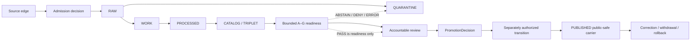

<!-- [KFM_META_BLOCK_V2]
doc_id: kfm://doc/runbook-archaeology-promotion
title: Archaeology Promotion Runbook
type: standard
version: v2.0
status: draft; repository-grounded; fail-closed; non-publisher
owners:
  - "@bartytime4life — verified CODEOWNERS review route"
  - "NEEDS VERIFICATION — Archaeology domain steward"
  - "NEEDS VERIFICATION — cultural, sovereignty, rights-holder, and sensitivity reviewers"
  - "NEEDS VERIFICATION — policy, evidence, release, correction, and rollback authorities"
created: 2026-05-13
updated: 2026-08-24
policy_label: public
truth_posture: cite-or-abstain
owning_root: docs/
responsibility: "Document the fail-closed operator procedure for evaluating an Archaeology candidate from governed lifecycle staging through final promotion readiness without creating source, evidence, policy, review, release, deployment, or publication authority."
repository_snapshot:
  repository: bartytime4life/Kansas-Frontier-Matrix
  base_ref: main
  base_commit: 2c010b36609bf2ceb94e5a2d61fa62493e6f298f
  target_prior_blob: 1be7cf86cf928116435c775ad9b1815f9b199af0
related:
  - docs/doctrine/directory-rules.md
  - docs/adr/ADR-0010-deny-by-default-for-dna-rare-species-archaeology-infrastructure.md
  - docs/adr/ADR-0018-promotion-gate-sequence.md
  - docs/adr/ADR-0024-steward-separation-of-duties-for-release.md
  - docs/adr/ADR-0025-public-client-never-reads-canonical-internal-stores.md
  - docs/adr/ADR-0029-adopt-directory-governance-standard-v2.md
  - docs/adr/ADR-archaeology-exact-location-policy.md
  - docs/domains/archaeology/README.md
  - policy/domains/archaeology/README.md
  - release/candidates/archaeology/README.md
  - tools/validators/promotion_gate/README.md
  - .github/workflows/domain-archaeology.yml
  - docs/runbooks/archaeology/NO_NETWORK_TEST_RUNBOOK.md
  - docs/runbooks/archaeology/ROLLBACK_RUNBOOK.md
tags: [kfm, runbook, archaeology, promotion, release-readiness, sensitivity, cultural-review, fail-closed, rollback]
notes:
  - "Same-path documentation modernization under accepted ADR-0029; no root, path, schema, policy, release, or authority migration."
  - "Current executable evidence is bounded and synthetic. It does not establish an accepted Archaeology policy bundle, live evaluator, authenticated review authority, candidate dossier, proof producer, release dry-run, transition executor, deployment, or publication."
  - "No exact or reverse-engineerable protected Archaeology location, cultural-review substance, consent secret, or restricted payload belongs in this public runbook or its public review packet."
[/KFM_META_BLOCK_V2] -->

<a id="top"></a>

# Archaeology Promotion Runbook

> Fail-closed operating procedure for assessing whether an Archaeology and Cultural Heritage candidate is ready for accountable release review. This runbook does **not** itself promote, release, deploy, publish, or authorize public access.

[](#current-repository-posture)
[](#directory-rules-basis)
[](#current-repository-posture)
[](#current-repository-posture)
[](#authority-boundary)

> [!IMPORTANT]
> **Promotion is a governed state transition, not a file move, commit, pull request, merge, workflow result, badge, manifest-shaped JSON document, or map-layer toggle.** Storage paths reflect lifecycle state only after the owning gates and authorities have closed.

> [!CAUTION]
> **Archaeology remains deny-by-default for exact or reverse-engineerable protected locations.** Coordinates are not the only exposure path: tiles, identifiers, joins, labels, screenshots, search, exports, graph edges, caches, logs, errors, and generated language can reveal or narrow a protected place.

> [!WARNING]
> **Current repository automation stops at bounded readiness evidence.** A green `make publish-check` or `domain-archaeology` workflow run is not a `PromotionDecision`, release approval, lifecycle transition, deployment, publication, or public permission.

**Quick navigation:** [Purpose](#purpose) · [Current posture](#current-repository-posture) · [Directory Rules](#directory-rules-basis) · [Scope](#scope-and-non-goals) · [Roles](#roles-and-separation-of-duties) · [Lifecycle](#lifecycle-and-object-family-boundaries) · [Preflight](#preflight-and-stop-conditions) · [Procedures](#stage-procedures) · [Archaeology gates](#archaeology-specific-gates) · [Validation](#current-executable-validation) · [Packet](#candidate-packet) · [Outcomes](#finite-outcomes-and-reason-codes) · [Authority](#authority-boundary) · [Rollback](#correction-withdrawal-and-rollback) · [Audit](#audit-and-join-keys) · [Checklist](#operator-checklist) · [Open work](#open-verification-register) · [References](#references)

---

<a id="purpose"></a>

## Purpose

Use this runbook to evaluate a bounded Archaeology candidate as it advances through the KFM lifecycle:

```text
RAW -> WORK / QUARANTINE -> PROCESSED -> CATALOG / TRIPLET -> PUBLISHED
```

The operator's job is to assemble and evaluate support, preserve the most restrictive applicable posture, and stop safely when evidence or authority is incomplete. The durable result of a run is an inspectable readiness or hold packet—not an implied public release.

This runbook is subordinate to accepted repository authority. When it conflicts with accepted ADRs, Directory Rules, current contracts, schemas, policy, validators, release records, or runtime evidence, stop and record the conflict rather than selecting the convenient interpretation.

[Back to top](#top)

---

<a id="current-repository-posture"></a>

## Current repository posture

The following statements are bounded to `main@2c010b36609bf2ceb94e5a2d61fa62493e6f298f`.

| Surface | Status | Safe conclusion |
|---|---|---|
| This runbook path | **CONFIRMED** | `docs/runbooks/archaeology/PROMOTION_RUNBOOK.md` is tracked. This is a same-path documentation update. |
| Directory governance | **CONFIRMED / accepted** | ADR-0029 adopts Directory Rules v2 at `docs/doctrine/directory-rules.md`; `docs/runbooks/` owns human operational procedures. |
| Final-readiness validator | **CONFIRMED / bounded** | `tools/validators/promotion_gate/validate_promotion_gate.py` evaluates declared A–G packets with no network or writes. `PASS` means `APPROVE_READY` for accountable review only. |
| ReviewRecord checks | **CONFIRMED / fixture-only** | The validator checks supplied synthetic identity, authority interval, separation, scope, and binding declarations; it does not authenticate live actors or authority. |
| PromotionReceipt family | **CONFIRMED / proposed fixture profile** | Contract, schema, validator, tests, and workflow exist as a separate non-publishing family. Shape validity is not transition proof. |
| Promotion policy | **CONFIRMED / inactive** | Current promotion Rego modules are proposed no-op stubs; no active policy-gate register entry, accepted evaluator, or governed consumer is established. |
| Archaeology policy lane | **CONFIRMED / mixed scaffold** | Domain policy documentation and Rego scaffolds exist, but no accepted Archaeology bundle, evaluator binding, obligation handler, or production consumer is established. |
| Archaeology domain CI | **CONFIRMED / one substantive slice plus holds** | The workflow validates one synthetic, no-network `ThreeDDocumentation` paradata profile. Proof construction and release dry-run jobs intentionally hold. |
| Archaeology candidate lane | **CONFIRMED / empty at bounded inspection** | `release/candidates/archaeology/` contains its parent README but no child candidate dossier was established. |
| Exact-location decision | **PROPOSED / unassigned** | The archaeology exact-location ADR candidate is non-binding and selects no public precision or transform profile. |
| Release, deployment, publication | **UNKNOWN / not established** | No authenticated review packet, accepted Archaeology release dry-run, applied transition, deployment, or published Archaeology release was verified. |

### What this changes operationally

Until the open controls graduate, the normal terminal result for an Archaeology promotion attempt is one of:

- `HOLD` for missing authority, review, policy, proof, release, or rollback support;
- `ABSTAIN` when evidence is insufficient without asserting unsafe facts;
- `DENY` when exposure, rights, sensitivity, or contradiction makes the operation impermissible; or
- `ERROR` when trust infrastructure cannot complete safely.

A bounded readiness `PASS` may be handed to accountable reviewers. It must not be translated into `PROMOTED`, `RELEASED`, or `PUBLISHED` by this runbook.

[Back to top](#top)

---

<a id="directory-rules-basis"></a>

## Directory Rules basis

Accepted [ADR-0029](../../adr/ADR-0029-adopt-directory-governance-standard-v2.md) makes [Directory Rules v2](../../doctrine/directory-rules.md) the placement authority.

| Responsibility | Owning root or lane | Boundary |
|---|---|---|
| Human operator procedure | `docs/runbooks/archaeology/` | This file explains the procedure; it does not own executable policy or release state. |
| Archaeology meaning | `contracts/domains/archaeology/` | Semantic authority after acceptance. |
| Machine shape | `schemas/contracts/v1/domains/archaeology/` and `schemas/contracts/v1/release/` | Shape authority after acceptance. |
| Policy source and bundles | `policy/` | Admissibility and obligations; file presence does not activate policy. |
| Reusable synthetic inputs | `fixtures/` | Test inputs only; never release evidence by themselves. |
| Enforcement proof | `tests/` and `tools/validators/` | Verifies bounded behavior; does not decide truth or publication. |
| Lifecycle stores | `data/raw`, `data/work`, `data/quarantine`, `data/processed`, `data/catalog`, `data/triplets`, `data/published` | Stores reflect governed state; moving bytes is not the transition. |
| Candidate and release decisions | `release/` | Owns review, promotion, manifest, correction, withdrawal, and rollback records. |
| Public delivery | governed APIs and released public-safe artifacts | Public clients do not read canonical or internal stores as their normal path. |

No new path is proposed here. The existing same-path placement is retained.

[Back to top](#top)

---

<a id="scope-and-non-goals"></a>

## Scope and non-goals

### In scope

- promotion readiness for public-safe Archaeology derivatives and metadata;
- source-role, evidence, rights, sensitivity, cultural, sovereignty, consent, validation, review, release, correction, and rollback closure;
- candidate-versus-confirmed distinctions;
- public-safe geometry, attribute, search, export, graph, map, cache, and AI-output review;
- deterministic packet identity and replay where practical;
- finite fail-closed outcomes and public-safe reason codes; and
- handoff to the owning release authority when—and only when—the packet is complete.

### Out of scope

This runbook does not:

- admit a live source or retrieve protected payloads;
- confirm a site, feature, burial, affiliation, chronology, ownership, or cultural authority;
- choose a universal buffer, grid, jitter, rounding, aggregation, or suppression threshold;
- store exact coordinates, cultural-review substance, consent secrets, or rights-holder deliberations;
- appoint reviewers or infer Tribal, cultural, sovereignty, legal, or rights-holder authority from CODEOWNERS;
- accept an ADR, policy bundle, contract, schema, or release profile;
- generate an EvidenceBundle, ProofPack, review record, release manifest, promotion decision, or rollback record merely by describing one;
- apply a lifecycle transition;
- merge, release, deploy, publish, activate a source, or alter repository settings; or
- treat map styling, model refusal, generalized appearance, schema validity, or green CI as safety or release authority.

[Back to top](#top)

---

<a id="roles-and-separation-of-duties"></a>

## Roles and separation of duties

Functional assignments remain `NEEDS VERIFICATION`. The roles below describe responsibilities, not current appointments.

| Role | Required responsibility | Must not be inferred from |
|---|---|---|
| Archaeology domain steward | Confirms domain meaning, candidate status, source-role compatibility, and domain-specific validation scope. | Repository ownership alone. |
| Evidence/source steward | Confirms admitted source identity, authority role, EvidenceRef closure, limitations, and freshness. | A URL, connector, citation string, or file hash alone. |
| Cultural/sovereignty/rights-holder reviewer | Supplies or verifies the governed review state required for the exact operation and audience. | CODEOWNERS, a generic consent flag, or absence of objection. |
| Sensitivity and reverse-inference reviewer | Assesses direct and joined exposure across every public carrier and derivative. | A hidden layer, coarse zoom, or missing coordinate field. |
| Policy steward | Owns the accepted input profile, bundle, evaluator binding, normalized outcomes, and obligations. | Rego file presence or a README. |
| Independent reviewer | Reviews packet scope, support, obligations, and separation from the author where materiality requires it. | Automated checks or self-declared identity alone. |
| Release authority | Decides whether an otherwise complete packet may enter an authorized transition. | A readiness `PASS`, merge, or manifest-shaped file. |
| Correction/rollback steward | Confirms correction lineage, withdrawal behavior, cache/derivative invalidation, and a tested rollback target. | A path named `rollback` or an unexecuted card. |

> [!IMPORTANT]
> CODEOWNERS routes review. It does not create cultural authority, rights-holder representation, independent approval, policy authority, or release authority.

### Minimum separation for policy-significant Archaeology promotion

The candidate author, the specialist cultural/sensitivity reviewer, and the release authority should be distinct when maturity and staffing permit. If required independence cannot be established, the result is `HOLD`; do not silently downgrade the review burden.

[Back to top](#top)

---

<a id="lifecycle-and-object-family-boundaries"></a>

## Lifecycle and object-family boundaries


```mermaid
flowchart LR
  S["Source edge"] --> A["Admission decision"]
  A --> R["RAW"]
  R --> W["WORK"]
  R --> Q["QUARANTINE"]
  W --> P["PROCESSED"]
  P --> C["CATALOG / TRIPLET"]
  C --> G["Bounded A–G readiness"]
  G --> V["Accountable review"]
  V --> D["PromotionDecision"]
  D --> X["Separately authorized transition"]
  X --> PUB["PUBLISHED public-safe carrier"]
  PUB --> CR["Correction / withdrawal / rollback"]

  G -. "PASS is readiness only" .-> V
  G -. "ABSTAIN / DENY / ERROR" .-> Q
```

### Object families remain distinct

| Object family | What it may prove | What it never proves alone |
|---|---|---|
| `SourceDescriptor` | Declared source identity, role, rights, cadence, and sensitivity context. | Truth, permission, or release. |
| `RunReceipt` / transform receipt | What process ran over which declared inputs and outputs. | Correctness, evidence closure, or approval. |
| `ValidationReport` | A named validator/profile produced a finite result over a pinned subject. | Source authority, cultural permission, or release. |
| `EvidenceRef` / `EvidenceBundle` | Traceable support and limitations for a bounded claim. | Policy permission or publication state. |
| `PolicyDecision` | A pinned policy profile/evaluator produced a decision and obligations. | Reviewer authority, transition application, or release. |
| `ReviewRecord` | A governed review occurred under a defined scope and authority record. | Release unless the release profile explicitly grants that effect. |
| `PromotionDecision` | Accountable decision on a specific candidate and support set. | Applied lifecycle mutation unless separately recorded. |
| `PromotionReceipt` | Process memory for an evaluated or applied transition profile. | Authority or truth merely because the shape validates. |
| `ReleaseManifest` | Declared release contents, digests, support, correction, and rollback linkage. | Publication unless an authorized release state is recorded and served. |
| `CorrectionNotice`, withdrawal record, `RollbackCard` | Visible reversal or correction intent and lineage. | Successful propagation unless derivatives and public surfaces are verified. |

Receipts, proofs, reviews, decisions, manifests, catalogs, and published artifacts must not be collapsed into one generic “proof” file.

[Back to top](#top)

---

<a id="preflight-and-stop-conditions"></a>

## Preflight and stop conditions

Before evaluating any stage transition, record a bounded packet header:

```yaml
candidate_id: <stable candidate identifier>
candidate_version: <immutable version or digest>
domain: archaeology
current_lifecycle_state: <RAW|WORK|QUARANTINE|PROCESSED|CATALOG|TRIPLET>
requested_transition: <exact boundary>
operation: <map|api|search|export|graph|ai|aggregate|other>
audience: <public|restricted|internal-review>
source_refs: []
evidence_refs: []
policy_profile_ref: null
review_refs: []
release_ref: null
rollback_target: null
correction_ref: null
```

### Hard stop conditions

Stop with `HOLD`, `ABSTAIN`, `DENY`, or `ERROR` when any of the following applies:

- candidate identity or requested transition is ambiguous;
- source role is unknown, conflicted, or being upcast from candidate/model/context to confirmed observation;
- rights, consent, cultural, sovereignty, or sensitivity state is missing, stale, conflicted, or untrusted;
- exact or reverse-engineerable protected information would reach a public or semi-public carrier;
- EvidenceRef cannot resolve to admissible support for a consequential claim;
- a referenced schema, policy profile, bundle, evaluator, review authority, release profile, correction path, or rollback target is not accepted for the operation;
- obligations cannot be enforced by every downstream consumer;
- candidate artifacts, digests, receipts, and manifest declarations disagree;
- self-review or unverified authority would substitute for required independent review;
- current public derivatives and caches cannot be inventoried for correction or rollback;
- the system encounters an internal error and would otherwise fall back to allow; or
- an overlapping branch or pull request owns the same candidate or release surface.

Quarantine is a governed hold with reason and exit criteria. It is not deletion and not a private route around release controls.

[Back to top](#top)

---

<a id="stage-procedures"></a>

## Stage procedures

Each procedure produces a finite decision and preserves the candidate in its prior governed state unless the owning transition is authorized.

### 1. Source edge to `RAW`

**Goal:** admit an immutable source capture or stable source-native reference without granting downstream authority.

1. Resolve a governed `SourceDescriptor` and exact source role.
2. Confirm rights, access terms, sensitivity, cultural/sovereignty posture, citation obligation, and intended operations.
3. Record retrieval/source time separately from observed, valid, publication, effective, correction, and transaction time.
4. Bind the capture or stable reference to a digest and deterministic run identity where practical.
5. Route unresolved rights, authority, source role, or sensitivity to `QUARANTINE` or pre-RAW hold.
6. Do not place protected payloads, exact locations, credentials, signed URLs, or restricted review material in public Git history.

**Required result:** admission record plus process receipt. Admission is not validation, evidence closure, or publication permission.

### 2. `RAW` to `WORK / QUARANTINE`

**Goal:** normalize without changing source role or exposing protected material.

1. Run deterministic parsing and normalization in an isolated, no-network profile when possible.
2. Preserve original identity, source role, provenance, temporal fields, and transform parameters.
3. Emit a transform/run receipt and working validation findings.
4. Route malformed, ambiguous, rights-unclear, over-precise, culturally blocked, or unsupported records to `QUARANTINE` with stable reason codes and exit criteria.
5. Never silently retry into a different semantic role.

**Required result:** normalized candidate or structured quarantine record. A clean parse is not a confirmed archaeological claim.

### 3. `WORK` to `PROCESSED`

**Goal:** establish machine and semantic conformance for the exact object profile.

1. Validate schema shape, bounded semantic rules, deterministic identity, geometry declaration, time semantics, and required references.
2. Execute negative fixtures for exact-location requests, candidate-as-confirmed misuse, missing evidence, unknown rights, absent cultural review, unsupported generalization, and reverse-inference paths.
3. Record a `ValidationReport` tied to the exact candidate digest and validator/profile versions.
4. If a public-safe transform is proposed, emit a transform/redaction receipt and preserve the protected source outside public review surfaces.
5. Route any unresolved or unsafe condition to `QUARANTINE`; do not accept a positive-looking visualization as validation.

**Required result:** processed candidate with deterministic validation evidence. No public delivery is authorized.

### 4. `PROCESSED` to `CATALOG / TRIPLET`

**Goal:** close evidence and catalog references without turning derivatives into sovereign truth.

1. Resolve every consequential `EvidenceRef` to an `EvidenceBundle` appropriate to the claim and audience.
2. Preserve source-role, limitations, uncertainty, temporal scope, spatial scope, sensitivity, rights, and correction lineage.
3. Generate catalog/graph projections only from governed processed records.
4. Verify STAC, DCAT, PROV, layer, graph, and search projections agree on identity and release state where those projections are in scope.
5. Mark public-safe derivatives as derived, generalized, modeled, aggregate, or interpretive; never overwrite canonical support.
6. Keep catalog records, evidence bundles, receipts, and proofs in their owning families.

**Required result:** catalog/triplet candidate with resolvable declared support. Catalog presence is not publication.

### 5. `CATALOG / TRIPLET` to final promotion readiness

**Goal:** evaluate the bounded A–G packet currently implemented by the repository.

Run:

```bash
make publish-check
```

Or evaluate explicit packets without writes or network access:

```bash
python tools/validators/validate_promotion_gate.py candidate.json
python tools/validators/validate_review_record.py --fixtures
```

The bounded gates are:

| Gate | Current bounded name | Archaeology interpretation |
|:---:|---|---|
| A | Identity and closure | Candidate, author, lifecycle boundary, spec hash, and manifest identity agree. |
| B | Asset integrity | Candidate, manifest, and receipt digest sets agree. |
| C | Geometry and CRS | Declared geometry is valid and deterministic; this gate does **not** establish public safety or cultural permission. |
| D | Temporal semantics | Required UTC-second intervals are valid and ordered. |
| E | Rights/sensitivity policy context | Declared profile, labels, result, and bundle reference are internally coherent; actual policy evaluation remains external and unproved. |
| F | Proof and catalog support | Required evidence, attestation, catalog, receipt, and conditional AI references are declared; authenticity and authority are not resolved. |
| G | Review and rollback | Fixture-only review identity/authority declarations, separation, binding, correction, and rollback links are coherent. |

Result precedence is `ERROR > DENY > ABSTAIN > PASS`.

> [!IMPORTANT]
> `PASS` means `APPROVE_READY` under the bounded declared packet. It does not prove source authority, rights, sensitivity clearance, evidence truth, cryptographic verification, live reviewer authority, rollback execution, release, deployment, publication, or required-check coupling.

### 6. Accountable review and release handoff

Only after bounded readiness passes may the packet be handed to the separately governed review and release process.

The handoff must identify:

- exact candidate and artifact digests;
- accepted source, evidence, policy, sensitivity, cultural/sovereignty, consent, and review authority records;
- all policy obligations and the consumers that enforce them;
- correction, withdrawal, expiry, and rollback targets;
- remaining `UNKNOWN`, `CONFLICTED`, or `NEEDS VERIFICATION` items;
- the requested decision, without pre-writing the answer; and
- an explicit statement that the handoff has no release or publication effect.

At the current repository checkpoint, no Archaeology child candidate dossier or accepted Archaeology release dry-run is established. Stop at `HOLD` after preparing the review handoff unless new, independently verified authority closes that gap.

[Back to top](#top)

---

<a id="archaeology-specific-gates"></a>

## Archaeology-specific gates

These gates are non-compensable. Product value, deadlines, model confidence, map quality, or generalization effort cannot offset a failure.

| Gate | Required question | Fail-closed posture |
|---|---|---|
| Candidate status | Is the object a candidate, observation, interpretation, confirmed assertion, derivative, or collection record—and is that role preserved? | `DENY` role collapse; `ABSTAIN` when evidence cannot resolve status. |
| Harmful precision | Could any direct field, tile, join, identifier, search result, graph edge, cache, screenshot, log, or generated answer reveal or narrow a protected place? | `DENY` exact/reconstructive exposure; `HOLD` generalized candidate pending accepted profile and inference review. |
| Burial/human remains/sacred or restricted material | Is the operation authorized for the exact audience and purpose by the relevant governed authority? | `DENY` or `HOLD`; do not expose the existence or location while explaining the result. |
| Cultural and sovereignty review | Does a current, operation-specific review record exist under an accepted authority model? | `HOLD`; CODEOWNERS or generic stewardship metadata is insufficient. |
| Rights, consent, embargo, and revocation | Are permissions current, scoped, auditable, and revocable—and do derivatives inherit the restrictions? | `DENY` or `HOLD` on missing, expired, conflicted, or revoked state. |
| Public-safe transform | Is the transform accepted, reproducible, irreversible enough for the threat model, and recorded without disclosing protective parameters? | `HOLD` or `DENY`; visual coarseness alone is not proof. |
| Reverse inference | Have cross-layer joins, time, labels, narratives, terrain, parcels, roads, collections, and external public sources been assessed together? | `DENY` or narrow scope until the composite risk is reviewed. |
| Collection and 3D security | Do media, models, point clouds, textures, metadata, camera paths, and downloadable assets preserve the same restrictions as 2D outputs? | `DENY` when parity or asset-level controls fail. |
| AI mediation | Does any model receive only governed public-safe context, cite released evidence, preserve denial/withholding context, and emit a bounded receipt? | `ABSTAIN`, `DENY`, or `ERROR`; never send raw protected context to a public model path. |
| Correction and rollback | Can the system stop serving, invalidate derivatives/caches, preserve public-safe audit history, and restore a prior safe state? | `HOLD` without a realistic correction and rollback path. |

No universal public precision threshold is adopted by this runbook. Some candidates require suppression or no geometry rather than generalization.

[Back to top](#top)

---

<a id="current-executable-validation"></a>

## Current executable validation

### Bounded Archaeology profile

The current `domain-archaeology` workflow executes one substantive synthetic, no-network `ThreeDDocumentation` paradata slice. The same focused proof can be run locally:

```bash
python -m unittest \
  tests.validators.domains.archaeology.test_validate_three_d_documentation \
  --verbose

python tools/validators/domains/archaeology/validate_three_d_documentation.py \
  --fixtures
```

A pass proves fixture-profile conformance for acquisition, processing, scale, georeference, interpretation, asset roles, and governance-reference coherence. It does not inspect a real asset, validate an archaeological site, resolve evidence/rights/cultural authority, apply policy, construct proof, approve review, or release.

### Explicit workflow holds

The same workflow intentionally holds:

- `build-proof-archaeology` because no accepted Archaeology proof producer or deterministic proof command is established; and
- `publish-dry-run-archaeology` because no accepted Archaeology release dry-run command or reviewed candidate dossier is established.

A green held job proves the repository still recognizes the hold. It is not proof that the missing capability exists.

### Documentation-only validation for this runbook

For a same-path Markdown update, validate at minimum:

1. metadata block remains parseable and truth labels are explicit;
2. headings and internal anchors are unique;
3. all repository-relative links resolve at the exact branch head;
4. Mermaid fences are balanced and contain no protected data;
5. commands match current repository files and do not imply writes or network access;
6. terminology preserves object-family and lifecycle boundaries;
7. no exact location, sensitive review substance, credential, or real candidate payload appears; and
8. the PR changes no release, policy, schema, workflow, data, settings, or publication state.

[Back to top](#top)

---

<a id="candidate-packet"></a>

## Candidate packet

A future Archaeology candidate dossier should be public-safe and pointer-oriented. It must not duplicate restricted source bytes, exact geometry, consent secrets, or cultural-review substance.

### Minimum public-review index

| Field | Requirement |
|---|---|
| Candidate identity | Stable ID, immutable version/digest, object role, lifecycle state, requested operation, and audience. |
| Scope | Spatial and temporal scope described at a safe level; no protective transform parameters. |
| Artifact set | Content digests and roles for proposed public-safe carriers. |
| Source support | SourceDescriptor references and source-role summary. |
| Evidence support | EvidenceRef/EvidenceBundle references, limitations, uncertainty, and freshness. |
| Policy | Accepted profile, bundle/evaluator identity, finite result, reasons, obligations, and expiry. |
| Review | Governed review references and authority state; sensitive substance remains outside the public dossier. |
| Validation | Exact validator/profile versions, reports, negative tests, and known gaps. |
| Representation | Transform/representation receipt and reality-boundary note where material. |
| Release | Proposed manifest reference and explicit current release state. |
| Correction and rollback | Correction path, withdrawal behavior, prior safe target, derivative/cache inventory, and drill evidence. |
| Open state | Every `UNKNOWN`, `CONFLICTED`, `NEEDS VERIFICATION`, `HOLD`, `ABSTAIN`, `DENY`, or `ERROR` item. |

### Packet review rule

A reviewer must be able to reconstruct why each public claim and representation is supported, permitted, scoped, reviewed, releasable, correctable, and reversible without gaining access to protected details that the review surface is not authorized to carry.

[Back to top](#top)

---

<a id="finite-outcomes-and-reason-codes"></a>

## Finite outcomes and reason codes

Use one finite result per evaluated operation. Do not encode a denial as an empty success payload.

| Result | Meaning | Next action |
|---|---|---|
| `PASS` / `APPROVE_READY` | The bounded readiness validator found no issue in the declared packet. | Hand off for accountable review; do not transition. |
| `HOLD` | A required authority, review, accepted profile, proof, candidate dossier, release path, or rollback capability is not yet established. | Record owner, evidence needed, and re-entry condition. |
| `ABSTAIN` | Evidence is insufficient to support the requested claim without asserting an unsafe contradiction. | Narrow the claim or resolve evidence. |
| `DENY` | A mandatory, unsafe, prohibited, revoked, expired, or contradictory condition blocks the operation. | Quarantine or withdraw; do not expose protected context in the reason. |
| `ERROR` | The evaluator, parser, resolver, or other trust infrastructure could not complete safely. | Fail closed and repair infrastructure; never fall back to allow. |

Recommended stable reason-code families:

- `IDENTITY_MISSING`, `IDENTITY_CONFLICT`, `LIFECYCLE_BOUNDARY_INVALID`;
- `SOURCE_ROLE_UNKNOWN`, `SOURCE_ROLE_CONFLICT`, `ROLE_COLLAPSE`;
- `RIGHTS_UNKNOWN`, `CONSENT_MISSING`, `CONSENT_REVOKED`, `CULTURAL_REVIEW_MISSING`;
- `SENSITIVITY_UNRESOLVED`, `EXACT_LOCATION_DENIED`, `REVERSE_INFERENCE_RISK`;
- `EVIDENCE_UNRESOLVED`, `EVIDENCE_INSUFFICIENT`, `CITATION_CLOSURE_FAILED`;
- `POLICY_PROFILE_UNACCEPTED`, `POLICY_EVALUATOR_UNBOUND`, `POLICY_DENIED`, `POLICY_ERROR`;
- `REVIEW_AUTHORITY_UNVERIFIED`, `SELF_REVIEW_FORBIDDEN`, `REVIEW_EXPIRED`;
- `ASSET_DIGEST_MISMATCH`, `CATALOG_CLOSURE_FAILED`, `ATTESTATION_UNVERIFIED`;
- `CANDIDATE_DOSSIER_MISSING`, `RELEASE_DRY_RUN_UNAVAILABLE`, `RELEASE_AUTHORITY_MISSING`;
- `CORRECTION_PATH_MISSING`, `DERIVATIVE_INVENTORY_INCOMPLETE`, `ROLLBACK_TARGET_MISSING`; and
- `INTERNAL_ERROR`.

Public messages should disclose the safe reason category and next step without confirming protected locations, cultural content, consent details, security posture, or reconstruction parameters.

[Back to top](#top)

---

<a id="authority-boundary"></a>

## Authority boundary

This runbook may guide evaluation and produce a review handoff. It may not:

- create or amend source authority;
- accept a contract, schema, policy bundle, evaluator, ADR, or reviewer assignment;
- authenticate cultural, sovereignty, rights-holder, or release authority;
- create an EvidenceBundle or ProofPack by assertion;
- apply a lifecycle transition;
- write to `data/published/` as a substitute for release;
- mark a pull request ready, approve, merge, auto-merge, release, deploy, promote, publish, or bypass a required review; or
- expose a protected candidate through an API, map, tile, search, export, graph, log, or AI surface.

The release authority must act through the accepted release process after independent evidence confirms that every non-compensable gate is closed. CI, review, merge, release, deployment, promotion, and publication remain distinct events.

[Back to top](#top)

---

<a id="correction-withdrawal-and-rollback"></a>

## Correction, withdrawal, and rollback

Use the sibling [Archaeology Rollback Runbook](./ROLLBACK_RUNBOOK.md) for an authorized released artifact. This section defines the promotion-time requirement.

Before a candidate can leave review hold, confirm that a material defect can trigger all of the following:

1. stop serving or deny the affected public operation;
2. identify the exact release and every derivative/cache affected;
3. issue a correction, withdrawal, supersession, or rollback record in the owning release lane;
4. preserve public-safe audit history without preserving harmful payloads;
5. invalidate or replace tiles, exports, search indexes, graph projections, AI caches, and other carriers;
6. restore a verified prior safe release or remain withdrawn;
7. show corrected, withdrawn, stale, or superseded state in governed clients; and
8. require full re-evaluation before any re-release.

A style change, hidden layer, deleted Git file, or new model prompt is not an adequate rollback for already delivered bytes.

For this documentation change, rollback before merge is closing the draft PR and deleting the scoped branch. After merge, use a transparent revert or bounded forward-correction PR. Neither action changes archaeology release state.

[Back to top](#top)

---

<a id="audit-and-join-keys"></a>

## Audit and join keys

Every promotion-readiness packet should preserve enough stable identity to join the evaluation without copying protected content.

| Key | Purpose |
|---|---|
| `candidate_id` and immutable version/digest | Identifies the exact subject. |
| `spec_hash` | Binds the evaluated profile/specification. |
| `source_ref` / `source_version` | Resolves source identity, role, and terms. |
| `evidence_ref` / `evidence_bundle_id` | Resolves claim support and limitations. |
| `run_id` / `validation_report_id` | Links process and validation memory. |
| `policy_profile_ref` / bundle digest / evaluator identity | Identifies the decision logic actually used. |
| `review_record_id` / authority reference | Links accountable review without exposing restricted substance. |
| `promotion_decision_id` / `promotion_receipt_id` | Keeps decision and process memory distinct. |
| `release_id` / manifest digest | Identifies the declared release contents and state. |
| `correction_id`, withdrawal/supersession ref, `rollback_target` | Preserves reversal lineage. |
| `artifact_digest` / representation receipt | Binds each public carrier and material transform. |

Avoid join keys derived from protected coordinates, names, parcel identifiers, collection-security details, or sensitive cultural terms.

[Back to top](#top)

---

<a id="operator-checklist"></a>

## Operator checklist

### Before evaluation

- [ ] Exact candidate, version, lifecycle state, operation, audience, and requested transition are recorded.
- [ ] No protected payload or exact/reconstructive location is present in the public packet, branch, logs, fixtures, or screenshots.
- [ ] Source roles, rights, consent, cultural/sovereignty posture, and limitations resolve to governed records.
- [ ] EvidenceRefs resolve to admissible EvidenceBundles for each consequential claim.
- [ ] Accepted contracts, schemas, policy profile/bundle/evaluator, and validator versions are pinned.
- [ ] Negative tests cover candidate/site confusion, harmful precision, reverse inference, missing evidence, missing review, and policy/runtime failure.
- [ ] Required reviewers and authorities are verified independently of CODEOWNERS.
- [ ] Correction, withdrawal, expiry, derivative invalidation, and rollback targets are realistic and reviewable.

### During bounded validation

- [ ] Run `make publish-check` and record exact commit, command, environment, result, and limitations.
- [ ] Run the focused Archaeology `ThreeDDocumentation` fixture tests when the candidate touches that profile.
- [ ] Treat `PASS` as readiness only.
- [ ] Preserve `ABSTAIN`, `DENY`, `ERROR`, and explicit workflow holds without relabeling them as success.
- [ ] Distinguish introduced failures from inherited repository failures.

### Before review handoff

- [ ] Candidate packet contains only public-safe pointers and summaries.
- [ ] Every support object is bound to the same candidate/spec/artifact identities.
- [ ] Policy obligations name the consumers responsible for enforcement.
- [ ] Cultural, rights, consent, sensitivity, and specialist review are current and operation-specific.
- [ ] Candidate lane, proof lane, and release dry-run no longer carry unresolved holds—or the handoff remains `HOLD`.
- [ ] Remaining unknowns and conflicts are visible.
- [ ] Handoff states that no transition, release, deployment, or publication has occurred.

### After a separately authorized transition

- [ ] Verify the authoritative release record and exact served artifact digests.
- [ ] Verify governed API, map, search, export, graph, cache, and AI consumers preserve policy obligations.
- [ ] Exercise correction and rollback monitoring.
- [ ] Do not infer deployment or publication from merge or release-record presence; verify the actual governed state.

[Back to top](#top)

---

<a id="open-verification-register"></a>

## Open verification register

| Item | Status | Required evidence before relying on it |
|---|---|---|
| Functional Archaeology, cultural/sovereignty, rights-holder, policy, evidence, independent-review, and release owners | `NEEDS VERIFICATION` | Accepted assignments, authority scopes, expiry/revocation, and separation rules. |
| Archaeology exact-location policy | `PROPOSED / not assigned` | Accepted decision or operation-specific successor without publishing protective parameters. |
| Accepted Archaeology policy bundle and evaluator | `UNKNOWN / not established` | Exact input contract, bundle digest, selector, evaluator, normalization, obligations, tests, activation record, and rollback. |
| Broad Archaeology validator orchestration | `PARTIAL` | Executable non-placeholder validators and negative fixtures beyond the bounded 3D paradata slice. |
| EvidenceRef-to-EvidenceBundle resolver for Archaeology | `UNKNOWN` | Deterministic resolution, authority checks, policy integration, tests, and governed consumers. |
| Proof producer | `HOLD` | Accepted proof schema, producer, validator, fixtures, support resolution, and non-publication boundary. |
| Child release-candidate dossier | `HOLD / none established` | Public-safe dossier with complete support and independent review. |
| Archaeology release dry-run | `HOLD` | Accepted no-write command, representative synthetic candidate, policy/review integration, correction, and rollback evidence. |
| Cryptographic verification and signer trust | `NEEDS VERIFICATION` | Accepted profile, trust root/custody, verification command, failure behavior, and audit evidence. |
| Public-safe transform and reverse-inference thresholds | `UNKNOWN` | Accepted protected profile and specialist review; do not place parameters in public docs. |
| Governed consumer enforcement | `UNKNOWN` | Exact API/map/search/export/graph/AI tests proving obligations and denial behavior. |
| Required-check coupling | `NEEDS VERIFICATION` | Repository ruleset evidence showing the exact checks are required for the relevant transition. |
| Deployment and publication state | `UNKNOWN` | Runtime, release, serving, monitoring, correction, and rollback evidence—not documentation or merge state. |

Do not convert these items into implied facts. Close them only with current, pinned evidence.

[Back to top](#top)

---

<a id="references"></a>

## References

### Governing and cross-cutting

- [Directory Rules v2](../../doctrine/directory-rules.md)
- [ADR-0029 — Adopt Directory Governance Standard v2](../../adr/ADR-0029-adopt-directory-governance-standard-v2.md)
- [ADR-0018 — Promotion Gate Sequence](../../adr/ADR-0018-promotion-gate-sequence.md)
- [ADR-0024 — Steward Separation of Duties for Release](../../adr/ADR-0024-steward-separation-of-duties-for-release.md)
- [ADR-0025 — Public Client Never Reads Canonical/Internal Stores](../../adr/ADR-0025-public-client-never-reads-canonical-internal-stores.md)
- [Promotion-gate readiness validator](../../../tools/validators/promotion_gate/README.md)

### Archaeology

- [Archaeology domain documentation](../../domains/archaeology/README.md)
- [Archaeology domain policy](../../../policy/domains/archaeology/README.md)
- [ADR-0010 — Sensitive Domains Deny by Default](../../adr/ADR-0010-deny-by-default-for-dna-rare-species-archaeology-infrastructure.md)
- [Archaeology exact-location ADR candidate](../../adr/ADR-archaeology-exact-location-policy.md)
- [Archaeology release-candidate lane](../../../release/candidates/archaeology/README.md)
- [Archaeology CI workflow](../../../.github/workflows/domain-archaeology.yml)
- [No-network test runbook](./NO_NETWORK_TEST_RUNBOOK.md)
- [Rollback runbook](./ROLLBACK_RUNBOOK.md)

---

## Change history

| Date | Version | Change | Effect |
|---|---|---|---|
| 2026-05-13 | v1 | Initial doctrine-led promotion runbook. | Draft guidance; implementation claims largely unverified. |
| 2026-08-24 | v2.0 | Same-path repository-grounded modernization; reconciled Directory Rules, bounded A–G validator, Archaeology CI holds, policy/candidate maturity, exact-location posture, and explicit review/release boundaries. | Documentation only; no policy, data, transition, release, deployment, or publication effect. |

[Back to top](#top)
