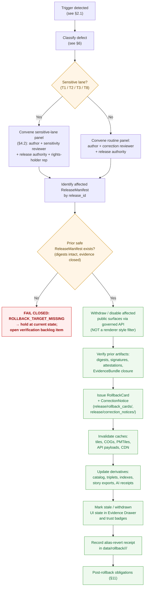

<!-- [KFM_META_BLOCK_V2]
doc_id: kfm://doc/runbook-archaeology-rollback
title: Archaeology Rollback Runbook
type: standard
version: v0.1
status: draft
owners: TODO — docs steward + domain steward (archaeology) + release authority
created: 2026-05-13
updated: 2026-05-13
policy_label: public
related:
  - docs/runbooks/README.md
  - docs/runbooks/revocation.md
  - docs/domains/archaeology/README.md
  - docs/governance/separation-of-duties.md
  - release/rollback_cards/README.md
  - release/manifests/README.md
  - release/correction_notices/README.md
  - data/rollback/README.md
  - docs/doctrine/lifecycle-law.md
  - docs/doctrine/trust-membrane.md
  - schemas/contracts/v1/release/RollbackCard.schema.json
  - schemas/contracts/v1/release/CorrectionNotice.schema.json
tags: [kfm, runbook, archaeology, rollback, governance, sensitive-lane]
notes:
  - "Path is PROPOSED placement under docs/runbooks/<domain>/ per Directory Rules §4 Step 3 (domain as segment)."
  - "Visible KFM examples use flat docs/runbooks/<topic>_ROLLBACK.md; ADR may resolve which form is canonical."
  - "Implementation maturity is UNKNOWN; doctrine is CONFIRMED."
[/KFM_META_BLOCK_V2] -->

# Archaeology Rollback Runbook

Governed procedure for withdrawing, restoring, or superseding a **PUBLISHED** Archaeology release when evidence, rights, sovereignty, sensitivity, validation, policy, or rendering fails after publication.

> **Status:** draft · **Owners:** _TODO_ — docs steward · archaeology domain steward · release authority · **Last updated:** 2026-05-13

> [!IMPORTANT]
> Archaeology is a **deny-by-default** lane. Exact sites, burial, human remains, sacred sites, and looting-risk detail fail closed by default. A rollback that touches sensitive geometry, cultural material, sovereign records, or rights-restricted source data **requires a rights-holder representative** alongside the release authority. Do not run this procedure unattended.

---

## Quick jump

- [1. Purpose & scope](#1-purpose--scope)
- [2. When to use this runbook](#2-when-to-use-this-runbook)
- [3. Pre-conditions](#3-pre-conditions)
- [4. Roles & separation of duties](#4-roles--separation-of-duties)
- [5. Rollback procedure](#5-rollback-procedure)
- [6. Defect class → correction & rollback posture](#6-defect-class--correction--rollback-posture)
- [7. Reason codes & recovery paths](#7-reason-codes--recovery-paths)
- [8. Sensitive-lane gotchas](#8-sensitive-lane-gotchas)
- [9. Correction vs. rollback vs. tombstone](#9-correction-vs-rollback-vs-tombstone)
- [10. Drills & validation](#10-drills--validation)
- [11. Post-rollback obligations](#11-post-rollback-obligations)
- [12. Anti-patterns](#12-anti-patterns)
- [13. Related docs](#13-related-docs)
- [Appendix A — Artifact inventory](#appendix-a--artifact-inventory)
- [Appendix B — Glossary](#appendix-b--glossary)

---

## 1. Purpose & scope

**Purpose.** Translate KFM rollback doctrine into a repeatable, auditable procedure for the **Archaeology and Cultural Heritage** domain — the lane that owns archaeological sites, surveys, artifacts, features, contexts, excavation units, remote-sensing and LiDAR candidates, geophysics, 3D documentation, collections, chronology, and cultural review records. (CONFIRMED doctrine; PROPOSED implementation.)

**Scope (in).** Anything PUBLISHED under the Archaeology lane: public-safe generalized site summaries, survey-coverage layers, candidate-anomaly surfaces, chronology timelines, 3D documentation surfaces, Evidence Drawer payloads, Focus Mode answers that cite Archaeology evidence, and the catalog and release decisions that authorize them.

**Scope (out).**

- **Migrations** — `migrations/<kind>/rollback/` is the home for database/schema/graph migration reversals; this runbook does not duplicate that procedure.
- **UI-only rollbacks** — feature-flag flips and schema deprecations in the explorer shell live in `docs/runbooks/ui_ROLLBACK.md`. (CONFIRMED rule; PROPOSED presence.)
- **AI adapter kill switches** — provider-adapter rollbacks live in `docs/runbooks/governed_ai_ROLLBACK.md`. (CONFIRMED rule; PROPOSED presence.)
- **True deletion (erasure)** — covered by `docs/runbooks/revocation.md`; tombstoning preserves explainability, erasure does not. See §9.

**Truth posture.** The doctrine in this runbook is **CONFIRMED**. Specific paths, schema names, validator names, and CLI invocations referenced here are **PROPOSED** until verified against a mounted repository. Treat every `release/...`, `data/...`, `schemas/...`, `policy/...`, and `tools/...` path as a placement target consistent with Directory Rules, not as proof of presence.

[⬆ Back to top](#archaeology-rollback-runbook)

---

## 2. When to use this runbook

Run this procedure when an Archaeology PUBLISHED claim has failed, or is at risk of failing, in a way that requires returning to a prior safe release rather than (or in addition to) issuing a forward correction.

### 2.1 Trigger classes

| # | Trigger class | Typical signal | Reason code family | Severity |
|---|---|---|---|---|
| T1 | **Sensitive geometry leak** | Exact site, burial, sacred-place, or looting-risk coordinate appears in a public payload, tile, popup, export, or AI answer | `SENSITIVITY_UNRESOLVED`, `RIGHTS_UNKNOWN` | **Critical** |
| T2 | **Cultural sovereignty revocation** | Rights-holder representative withdraws consent or steward review is rescinded | `RIGHTS_UNKNOWN`, `REVIEW_REJECTED` | **Critical** |
| T3 | **Evidence gap discovered** | `EvidenceRef` fails to resolve, `EvidenceBundle` is missing or invalidated, citation validation regresses | `MISSING_EVIDENCE` | **High** |
| T4 | **Source-role collapse** | A source family was promoted (e.g., candidate anomaly used as confirmed site) past its authorized role | `ROLE_COLLAPSE`, `ROLE_DOWNCAST_FORBIDDEN` | **High** |
| T5 | **Validation regression** | `ValidationReport` for the released artifact set has degraded (schema, geometry, temporal, identity) | `SCHEMA_MISMATCH`, `CONTRACT_DRIFT` | **High** |
| T6 | **Release infrastructure failure** | `ReleaseManifest` is invalid, signatures fail, attestation lookup fails, rollback target is missing | `RELEASE_MANIFEST_INVALID`, `ROLLBACK_TARGET_MISSING` | **High** |
| T7 | **Correction-lineage break** | A prior correction left derivatives unresolved or supersession entry missing | `CORRECTION_DERIVATIVES_UNRESOLVED`, `CORRECTION_PRIOR_RELEASE_MISSING` | **Medium** |
| T8 | **AI surface violation** | Focus Mode produced an uncited or sovereignty-unaware Archaeology answer, or referenced unreleased context | `AI_UNCITED`, `AI_POLICY_BREACH` _(PROPOSED reason codes)_ | **High** |
| T9 | **Stale-state past tolerance** | Source freshness expired and a published claim no longer satisfies its declared cadence | `STALE_PAST_TOLERANCE` _(PROPOSED)_ | **Low–Medium** (correction usually sufficient; rollback for material drift) |

> [!WARNING]
> Triggers T1, T2, and T8 are **always sensitive-lane** and require the full separation-of-duties matrix in §4.2. Do not treat them as routine.

[⬆ Back to top](#archaeology-rollback-runbook)

---

## 3. Pre-conditions

Before issuing a `RollbackCard`, the on-call release authority confirms each of the following. If any item is **No**, the rollback **fails closed** at that step and the prior PUBLISHED state is preserved until the gap is filled.

| # | Pre-condition | Required artifact | Status if missing |
|---|---|---|---|
| P1 | Affected release is identified by `release_id` | `ReleaseManifest` (current) | `ROLLBACK_TARGET_MISSING` — block |
| P2 | A prior safe `ReleaseManifest` exists with intact digests | Prior `ReleaseManifest` + `EvidenceBundle` closure | `ROLLBACK_TARGET_MISSING` — block |
| P3 | Defect is classified (see §6) | Defect record / triage note | `MISSING_RECEIPT` — block |
| P4 | Sensitivity / rights status of the affected payload is re-checked | `PolicyDecision`, `RedactionReceipt` where applicable | `SENSITIVITY_UNRESOLVED` — block; raise to T4 holdout |
| P5 | Downstream derivatives are inventoried | Catalog / triplet derivative list | `CORRECTION_DERIVATIVES_UNRESOLVED` — hold until enumerated |
| P6 | Cache and CDN keys for the affected release are known | Tile / COG / API payload cache index | Proceed with explicit cache-flush plan recorded |
| P7 | Required reviewers are reachable (see §4) | Reviewer roster | Hold until the materiality-appropriate set is convened |
| P8 | Kill-switch path is documented and reachable | Fail-closed kill-switch _(PROPOSED tool)_ | Block; do not "soft-disable" via style filter |

> [!CAUTION]
> Hiding sensitive geometry behind a renderer style filter is **not** a rollback. Public bytes already in tiles, COGs, GeoParquet, PMTiles, payload caches, or third-party caches can still expose the underlying coordinates. The only correct posture is to **withdraw at the manifest layer** and invalidate caches.

[⬆ Back to top](#archaeology-rollback-runbook)

---

## 4. Roles & separation of duties

### 4.1 Role definitions (PROPOSED)

| Role | What they own in rollback | Notes |
|---|---|---|
| **Source steward** | Re-confirms source rights, sensitivity tag, cadence for the affected source family | Owns `SourceDescriptor` lifecycle |
| **Domain steward (archaeology)** | Owns Archaeology object families and validators; co-authors defect classification | One of the two minimum signatures on the RollbackCard |
| **Sensitivity reviewer** | Reviews redaction, generalization, withholding, and tier decisions for the affected payload | Required when the trigger touches T1/T2/T3 sensitivity |
| **Rights-holder representative** | Confirms sovereignty, cultural-heritage, or consent decisions | **Required** for archaeology sovereign / cultural / tribal sources |
| **Release authority** | Issues the `RollbackCard`; authorizes the PUBLISHED → prior-release transition; **must be distinct from the original release author when materiality applies** | Single accountable signer for the rollback decision |
| **Correction reviewer** | Reviews the `CorrectionNotice` that accompanies the rollback | Often the docs steward or domain steward not otherwise involved |
| **AI surface steward** | Audits Focus Mode templates, `AIReceipt` samples, and citation validation downstream of the rollback | Required for trigger T8 |
| **Docs steward** | Updates this runbook, the drift register, and the verification backlog after the rollback | Captures lessons-learned without amending PUBLISHED history silently |

### 4.2 Separation-of-duties matrix (PROPOSED)

| Action | Author may self-approve? | Required separation |
|---|---|---|
| **Routine, non-sensitive Archaeology rollback** (e.g., chronology metadata defect) | No when materiality applies | Author / detector + correction reviewer + release authority |
| **Sensitive-lane Archaeology rollback** (T1 / T2 / T3 / T8) | **No** | Author + sensitivity reviewer + release authority + **rights-holder rep** |
| **Sovereign / cultural-material rollback** (sacred sites, burial, human remains) | **No** | All of the above + explicit sovereignty review note |
| **Tombstone-only revocation** | No | Correction reviewer + release authority (rights-holder rep where applicable) |

> [!NOTE]
> Maturity caveat — separation of duties is **maturity-dependent**. Early-stage doctrine work may be authored and approved by the same actor when materiality is low. For Archaeology rollbacks, materiality is **never low**: assume the full matrix until an ADR documents an exception.

[⬆ Back to top](#archaeology-rollback-runbook)

---

## 5. Rollback procedure

### 5.1 Flow

> [!NOTE]
> Diagram reflects KFM doctrine consolidated from the Encyclopedia, the Domain Atlas, and Directory Rules. Specific tool names, CLI commands, and step automations are **PROPOSED** and require verification against a mounted repository.

### 5.2 Numbered steps

The flowchart above is the source of truth for the sequence. The steps below expand each node.

1. **Detect and triage.** Capture the inbound signal (alert, report, validation regression, sovereignty notice, CARE concern). Open an incident record with a timestamp, signal source, and observed surface.
2. **Classify the defect** against the matrix in §6. The class drives both the correction posture and the rollback posture.
3. **Gate on sensitivity.** If the defect is in trigger classes T1/T2/T3/T8, convene the sensitive-lane panel in §4.2 _before_ touching public surfaces. For routine, non-sensitive defects, convene the routine panel.
4. **Identify the affected release.** Resolve the `release_id` from the surfaced artifact (ReleaseManifest reference, RunReceipt, AIReceipt, EvidenceDrawerPayload, or LayerManifest). Record the resolution in the incident note.
5. **Locate the rollback target.** Find the prior `ReleaseManifest` whose `EvidenceBundle` closure, signatures, and policy decisions are intact. If none exists with all closures intact, **fail closed** with `ROLLBACK_TARGET_MISSING`; do not improvise a target.
6. **Withdraw at the manifest layer.** Disable the affected public surfaces via the governed API and registry — not via renderer style filters, popup hiding, or layer toggles. The trust membrane permits only manifest-mediated withdrawals.
7. **Verify the prior artifact set.** Re-check digests, signatures (DSSE / cosign where applicable), in-toto / SLSA attestations where present, and `EvidenceBundle → EvidenceRef` resolution. Anything that does not verify is not a valid rollback target.
8. **Issue the `RollbackCard`.** File the decision artifact under `release/rollback_cards/<release_id>/` _(PROPOSED path, per Directory Rules)_. Co-file a `CorrectionNotice` under `release/correction_notices/` describing the defect class, supersession reference (if any), and the rollback target.
9. **Invalidate caches.** Record cache-invalidation receipts for tiles (PMTiles, vector tiles), COGs, GeoParquet, API payload caches, and any CDN keys that surfaced the affected payload. The receipt names the cache layer, key set, and timestamp.
10. **Update derivatives.** Catalog entries (`data/catalog/`), triplet / graph projections (`data/triplets/`), search indexes, Story exports, and `AIReceipt` lineage are all derivative; mark them as superseded, regenerate, or withhold per the defect class.
11. **Mark stale / withdrawn UI state.** Trust badges, the Evidence Drawer, and Focus Mode answers must visibly reflect the withdrawn or superseded state. Silent reversion is a failure mode.
12. **Record the alias-revert receipt.** Under `data/rollback/<domain>/<release_id>/` _(PROPOSED path)_, record the data-plane receipt that pairs with the release-plane `RollbackCard`.
13. **Discharge post-rollback obligations** per §11.

> [!IMPORTANT]
> Rollback **must not** be a hidden file copy. Every artifact moved or replaced must travel through the same governed release path that produced it — validators, policy gate, evidence closure, signatures, release decision — or the rollback is itself a publication violation.

[⬆ Back to top](#archaeology-rollback-runbook)

---

## 6. Defect class → correction & rollback posture

CONFIRMED doctrine; PROPOSED for Archaeology-specific application. The table is the operator's first decision aid: classify, then act.

| Defect class | Correction posture | Rollback posture | Archaeology amplifier |
|---|---|---|---|
| **Evidence gap** | ABSTAIN or withdraw the unsupported claim | Restore prior evidence-supported release | Re-check `EvidenceBundle` against steward / cultural review records before re-publishing |
| **Source-role collapse** (candidate treated as confirmed; observation treated as authority) | Restore source role; refuse upcast | Restore prior release where source role was correctly bounded | Candidate anomalies (LiDAR / remote sensing) **must not** become "confirmed sites" without survey + review evidence |
| **Rights / sensitivity unresolved** | Withdraw or move to T2/T3/T4 tier with `RedactionReceipt` | Restore prior release that was within rights / sensitivity | Sovereign and cultural rights are **rights-holder representative** decisions, not docs-steward decisions |
| **Geometry over-precision** | Generalize / aggregate; emit `RedactionReceipt` | Restore prior generalized release | "Generalized cultural activity zones" — never publish as precise sites; H3 / cell granularity per declared transform profile |
| **Temporal misalignment** | Republish with corrected observed / valid / release times | Restore prior temporally-correct release | Chronology assertions are uncertainty-bearing; do not collapse interval evidence into point claims |
| **Policy / review state inadequate** | Run required review; supply `ReviewRecord` | Restore prior release that had complete review state | Sensitive-lane release requires the full matrix (§4.2) |
| **Validation regression** | Re-validate; fix schema or contract drift; re-issue receipts | Restore prior release with intact `ValidationReport` | Re-run candidate-not-site, public no-leak, exact-sensitive-geometry-denial fixtures _(PROPOSED test families)_ |
| **Rendering / UI defect** | Patch renderer; revalidate visual regression | Restore prior `LayerManifest` and style if the defect is style-borne | A trust badge that misrepresents review state is a release-significant defect, not cosmetic |
| **API / governed-API defect** | Roll forward the API; ABSTAIN on affected routes | Restore prior `ReleaseManifest` and route binding | The governed API is the only public emitter; bypasses do not exist |
| **AI-output defect** (uncited, sovereignty-unaware, restricted exposure) | Disable adapter / template; require `AIReceipt` correction | Restore prior `AIReceipt`-validated answer set; tombstone the offending exchanges | Focus Mode for archaeology must remain sovereignty-aware and citation-validated |

[⬆ Back to top](#archaeology-rollback-runbook)

---

## 7. Reason codes & recovery paths

Reason codes are surfaced by the policy / promotion / release gates and propagate into the `RollbackCard`. The catalog below is **PROPOSED** and tracks the reason codes recorded in the Domain Atlas.

| Reason code | Family | Typical Archaeology trigger | Recovery path |
|---|---|---|---|
| `MISSING_RECEIPT` | Missing required artifact | RunReceipt / AIReceipt / ReviewRecord absent | Re-emit the missing receipt; re-run review |
| `MISSING_EVIDENCE` | Missing required artifact | `EvidenceRef` does not resolve to `EvidenceBundle` | Resolve evidence; re-publish or ABSTAIN |
| `MISSING_REVIEW` | Missing required artifact | StewardReview / CulturalReview absent | Convene review; supply `ReviewRecord` |
| `SCHEMA_MISMATCH` | Schema / contract drift | Object family deviates from `schemas/contracts/v1/...` | Schema fix and/or ADR; re-run validator |
| `CONTRACT_DRIFT` | Schema / contract drift | Semantic contract changed without ADR | Restore contract; ADR-driven supersession |
| `RIGHTS_UNKNOWN` | Rights / sensitivity unresolved | Source rights or sovereignty not resolved at admission | Steward review; rights resolution; tier reassignment |
| `SENSITIVITY_UNRESOLVED` | Rights / sensitivity unresolved | Sensitivity class unsettled for the released payload | Sensitivity reviewer + rights-holder rep; re-tier |
| `ROLE_COLLAPSE` | Source-role collapse | Candidate / observation / model / regulatory roles mixed | Restore source role; refuse upcast |
| `ROLE_DOWNCAST_FORBIDDEN` | Source-role collapse | Authority source downgraded to candidate | Restore source role |
| `REVIEW_NEEDED` | Review state inadequate | Required review never ran | Run review; supply `ReviewRecord` |
| `REVIEW_INSUFFICIENT` | Review state inadequate | Review missing rights-holder rep for a sovereign lane | Re-run with the full matrix |
| `REVIEW_REJECTED` | Review state inadequate | Review explicitly rejected; release should never have proceeded | Withdraw; tombstone if needed |
| `RELEASE_MANIFEST_INVALID` | Release infrastructure error | ReleaseManifest fails schema or signature checks | Manifest fix; supply rollback target |
| `ROLLBACK_TARGET_MISSING` | Release infrastructure error | No prior safe release identified | **Fail closed**; open verification backlog item; do not improvise |
| `CORRECTION_DERIVATIVES_UNRESOLVED` | Correction lineage broken | Downstream derivatives not invalidated by a prior correction | Resolve derivatives; supersession entry |
| `CORRECTION_PRIOR_RELEASE_MISSING` | Correction lineage broken | Correction does not reference a valid prior release | Locate prior release or escalate to docs steward |

[⬆ Back to top](#archaeology-rollback-runbook)

---

## 8. Sensitive-lane gotchas

Archaeology is the canonical example of a sensitive lane in KFM. The Encyclopedia, the Domain Atlas, and the deny-by-default register all converge on the same posture: **exact archaeological locations, burial, human remains, sacred sites, looting-risk detail, and unresolved cultural sensitivity fail closed**.

> [!CAUTION]
> **Style filters are not rollbacks.** A MapLibre style that hides a layer does not remove the bytes from PMTiles, COGs, GeoParquet, or the API payload cache. The only correct withdrawal is at the manifest layer, with cache invalidation receipts.

> [!CAUTION]
> **Tiles are not proof.** Tiled / generalized layers carry selected attributes, not full source authority. A rollback that touches a tile must also touch the `TileArtifactManifest`, the source / evidence / proof links, and the cache keys derived from them.

> [!CAUTION]
> **AI answers can re-expose withdrawn geometry.** Focus Mode for archaeology must remain sovereignty-aware and citation-validated. After a rollback that touches T1 / T2 / T8 triggers, the AI surface steward audits `AIReceipt` samples for the affected period and tombstones the implicated exchanges.

> [!WARNING]
> **Default tier matters more than the payload's apparent specificity.** Per the per-domain tier matrix: Archaeology — site location defaults to **T4**; Archaeology — human remains / sacred sites defaults to **T4** with no T0 transform path. A rollback may need to raise a payload's effective tier, not merely restore an earlier one.

### 8.1 Cultural symbol & UI considerations

- Archaeological / cultural symbols must avoid sacred symbols and tribal insignia, remain WCAG accessible, use generalized geometry, and carry CARE metadata.
- Sovereignty notice chips and generalization logs are part of the release-significant evidence surface, not decoration. A rollback that removes them silently is itself a defect.

[⬆ Back to top](#archaeology-rollback-runbook)

---

## 9. Correction vs. rollback vs. tombstone

These three are distinct governed actions. Use the table to pick the right one.

| Action | When to use | Primary artifact | What it preserves | What it changes |
|---|---|---|---|---|
| **Correction** (PUBLISHED → PUBLISHED′) | Detected error or new evidence; the claim is fixable | `CorrectionNotice` + (updated or superseding) `ReleaseManifest` + `ReviewRecord` | Original release record; full lineage; downstream invalidation list | Public claim now points at the corrected / superseding release |
| **Rollback** (PUBLISHED → prior release) | Failed release or post-publication failure; targeted prior release is identified | `RollbackCard` + `CorrectionNotice` + `ReleaseManifest` revert to prior | Audit receipts; downstream-derivative-invalidation chain; explainability | Public surface returns to a prior, evidence-supported state |
| **Tombstone** (revocation) | The release should not be replaced; only the public surface should be removed while explainability is preserved | Signed tombstone receipt appended to the audit ledger; supersession reference where applicable | Lineage and audit remain explorable; investigators can trace why | Public views (UI, governed API) hide tombstoned items |

> [!NOTE]
> **Tombstone vs. erasure.** Tombstones satisfy explainability; they do not satisfy right-to-be-forgotten obligations that require actual deletion of personal data. The Archaeology lane occasionally intersects living-person data (e.g., collector identities, landowner detail). For erasure boundaries, defer to `docs/runbooks/revocation.md` (PROPOSED) and the People / DNA / Land domain runbooks.

[⬆ Back to top](#archaeology-rollback-runbook)

---

## 10. Drills & validation

Rollback that has never been exercised is not reliable. The drill schedule below mirrors the rollback-drill pattern in the Encyclopedia's reversibility doctrine.

| Drill | What it exercises | Required artifacts | Cadence (PROPOSED) |
|---|---|---|---|
| **Dry-run release → rollback** | End-to-end rollback against a synthetic Archaeology candidate fixture (exact-geometry denied; generalized public-safe tile; steward review record; correction / rollback path) | RollbackCard receipt; restored prior `LayerManifest` | Each release cycle that touches Archaeology |
| **Sensitive-geometry deny replay** | Confirms that a hypothetical leak of exact site / burial / sacred geometry is detected, withdrawn at the manifest layer, and cache-invalidated | Sensitive-geometry deny fixture; cache-invalidation receipt | Quarterly minimum |
| **Sovereignty revocation drill** | Rights-holder representative withdraws consent; the lane fails closed; tombstones are issued where needed | Tombstone receipt; supersession reference where applicable | At least annually; on rights-holder rotation |
| **Correction-lineage replay** | After a correction, all downstream derivatives (catalog, triplets, indexes, story exports, AIReceipts) reflect the supersession | Derivative invalidation list; replay validation report | Each release cycle |
| **AI surface audit** | Sample `AIReceipt`s for the affected period; verify no uncited / sovereignty-unaware Archaeology answer survives the rollback window | AIReceipt sample; citation validation report | After any T8 trigger |

### 10.1 Minimum acceptance for a passing drill

- A `RollbackCard` exists for the simulated release, signed by the materiality-appropriate role set in §4.2.
- The prior `ReleaseManifest` is verified by digest, signature (where applicable), and `EvidenceBundle` closure.
- Cache-invalidation receipts cover every public byte source for the affected payload.
- The Evidence Drawer, trust badges, and Focus Mode visibly reflect the restored state.
- The drift register or verification backlog records any item that did not pass.

[⬆ Back to top](#archaeology-rollback-runbook)

---

## 11. Post-rollback obligations

Within one working cycle of the rollback decision, the on-call release authority and docs steward jointly:

1. **Update the audit ledger.** Append the `RollbackCard`, `CorrectionNotice`, and any tombstone receipts. The ledger is append-only; do not edit prior entries.
2. **Update the verification backlog.** Open or update entries in `docs/registers/VERIFICATION_BACKLOG.md` (PROPOSED) for any item that the rollback exposed as untested or unverified — including any path, schema, or contract referenced as PROPOSED in this runbook.
3. **Update the drift register.** Open or update entries in `docs/registers/DRIFT_REGISTER.md` (PROPOSED) for any drift the rollback revealed (e.g., parallel authority, compatibility-root divergence, missing README on an authority root).
4. **Notify rights-holders.** For sovereignty- or cultural-material rollbacks, formal notification follows the rights-holder communication protocol agreed at admission. (Protocol is **NEEDS VERIFICATION** until the steward authority and confidentiality record exists.)
5. **Refresh AI surfaces.** Focus Mode templates, AIReceipts, and citation validation reports for the affected period are audited by the AI surface steward and tombstoned where they referenced the withdrawn release.
6. **Refresh stale-state markers.** Any UI surface, badge, or Evidence Drawer entry that referenced the withdrawn release shows the restored or stale-state marker. Silent reversion is a defect.
7. **Schedule the next drill.** A failed real rollback resets the drill cadence — schedule the next dry-run within the next cycle, not at the next routine interval.

[⬆ Back to top](#archaeology-rollback-runbook)

---

## 12. Anti-patterns

Patterns observed in the corpus as failure modes. None are acceptable in this lane.

- **Style-filter "rollback".** Hiding a sensitive layer via renderer style does not remove the bytes. Public clients, exports, and AI surfaces can still resolve them.
- **Hidden file copy.** Replacing a published artifact in place without traveling the governed release path destroys auditability and may violate the lifecycle invariant regardless of which directory the bytes ended up in.
- **Treating MapLibre, tiles, the graph projection, or AI text as truth.** All of these are downstream carriers. A rollback that only touches a carrier without touching the manifest layer is incomplete.
- **Renaming a candidate as a confirmed site.** LiDAR candidates, remote-sensing anomalies, and geophysics observations are candidate evidence, not confirmed locations. A rollback that re-elevates them is a source-role collapse.
- **Single-signer rollback on a sensitive-lane release.** Sensitive lanes require the full separation-of-duties matrix.
- **Silently reverting UI state.** Trust badges, Evidence Drawer entries, and Focus Mode answers must visibly reflect the rollback.
- **Tombstone instead of erasure where erasure is required.** Tombstones preserve explainability, not erasure.

[⬆ Back to top](#archaeology-rollback-runbook)

---

## 13. Related docs

| Doc | Why it matters here | Status |
|---|---|---|
| `docs/doctrine/lifecycle-law.md` | The lifecycle invariant rollback must travel | PROPOSED presence |
| `docs/doctrine/trust-membrane.md` | Why public surfaces cannot be reverted via internal stores | PROPOSED presence |
| `docs/domains/archaeology/README.md` | Domain identity, scope, object families | PROPOSED presence |
| `docs/runbooks/README.md` | Runbook index and conventions | PROPOSED presence |
| `docs/runbooks/revocation.md` | Tombstone vs. erasure boundary | PROPOSED presence |
| `docs/runbooks/ui_ROLLBACK.md` | UI feature-flag rollback (not domain rollback) | PROPOSED presence |
| `docs/runbooks/governed_ai_ROLLBACK.md` | AI adapter kill-switch (not domain rollback) | PROPOSED presence |
| `docs/governance/separation-of-duties.md` | Role definitions and matrix | PROPOSED presence |
| `release/rollback_cards/README.md` | Decision-artifact home (release plane) | PROPOSED presence |
| `release/correction_notices/README.md` | Correction-notice home (release plane) | PROPOSED presence |
| `release/manifests/README.md` | ReleaseManifest home | PROPOSED presence |
| `data/rollback/README.md` | Alias-revert receipts (data plane) | PROPOSED presence |
| `schemas/contracts/v1/release/RollbackCard.schema.json` | RollbackCard schema | PROPOSED presence |
| `schemas/contracts/v1/release/CorrectionNotice.schema.json` | CorrectionNotice schema | PROPOSED presence |
| `docs/registers/VERIFICATION_BACKLOG.md` | Where post-rollback verification items are tracked | PROPOSED presence |
| `docs/registers/DRIFT_REGISTER.md` | Where post-rollback drift is tracked | PROPOSED presence |

[⬆ Back to top](#archaeology-rollback-runbook)

---

## Appendix A — Artifact inventory

<b>Required and supporting artifacts referenced by this runbook</b>

| Artifact | Owning root (PROPOSED per Directory Rules) | Role in rollback |
|---|---|---|
| `SourceDescriptor` | `data/registry/sources/` | Re-confirmed during rollback for rights / sensitivity / cadence |
| `EvidenceRef` | `contracts/` (meaning) / `schemas/contracts/v1/...` (shape) | Must resolve to `EvidenceBundle` for the rollback target |
| `EvidenceBundle` | `data/proofs/evidence_bundle/` | Closure required on the rollback target |
| `ValidationReport` | `data/receipts/validation/` | Required for both current and prior releases |
| `RunReceipt` | `data/receipts/pipeline/` | Process memory; re-emitted on any re-publish |
| `PolicyDecision` | `policy/` outputs into `data/receipts/` | Recorded for the rollback action itself |
| `RedactionReceipt` | `data/proofs/` (transform receipts) | Required when sensitivity tier changes |
| `ReviewRecord` | `data/receipts/` (review) | Required for sensitive-lane rollback |
| `ReleaseManifest` (current) | `release/manifests/` | Identifies the affected release by `release_id` |
| `ReleaseManifest` (prior) | `release/manifests/` | The rollback target |
| `RollbackCard` | `release/rollback_cards/` | The rollback decision artifact |
| `CorrectionNotice` | `release/correction_notices/` | Public notice of the corrected / withdrawn claim |
| `LayerManifest` | `data/published/layers/<domain>/` | Declares the public-safe layer; restored during rollback |
| `TileArtifactManifest` | `data/published/` (per layer) | Linked to source / evidence / proof; touched by cache invalidation |
| `MapReleaseManifest` | `release/manifests/` (where map-specific) | Map release decision; rollback restores prior |
| `AIReceipt` | `data/receipts/ai/` | Audited for Focus Mode answers affected by the rollback |
| `CitationValidationReport` | `data/proofs/citation_validation/` | Verified during AI-surface audit |
| `EvidenceDrawerPayload` | governed-API payload | Updated to reflect the restored state |
| Tombstone receipt | `data/receipts/release/` (signed, appended) | Used when revocation is reversible without replacement |
| Alias-revert receipt | `data/rollback/<domain>/<release_id>/` | Data-plane pair to the release-plane `RollbackCard` |

> Path placements above follow Directory Rules §4 (responsibility-root mapping) and the `release/` vs. `data/published/` distinction. Each is **CONFIRMED rule / PROPOSED presence** until verified against a mounted repository.

---

## Appendix B — Glossary

<b>Terms used in this runbook</b>

| Term | Definition (placement-relevant short form) |
|---|---|
| **Authority root** | A repo-root folder that carries one of the §3 (Directory Rules) responsibilities. |
| **Compatibility root** | A root that exists for legacy, mirror, deprecated, external-export, or transitional reasons. |
| **Lane** | A domain or topic segment inside a responsibility root (e.g., `data/processed/archaeology/`). |
| **Lifecycle invariant** | RAW → WORK / QUARANTINE → PROCESSED → CATALOG / TRIPLET → PUBLISHED. |
| **Promotion** | A governed state transition between lifecycle phases. Not a file move. |
| **Trust membrane** | The boundary that prevents raw / unreviewed / model-generated / internal state from becoming public truth. Operational form: `apps/governed-api/`. |
| **EvidenceBundle / EvidenceRef** | Resolved support package for claims; lives in `data/proofs/`. References resolve via `packages/evidence-resolver/`. |
| **ReleaseManifest** | The release decision artifact; lives in `release/manifests/`. |
| **CorrectionNotice** | Public notice of a corrected claim; lives in `release/correction_notices/`. |
| **RollbackCard** | Rollback decision artifact; lives in `release/rollback_cards/`. |
| **RuntimeResponseEnvelope** | Finite-outcome wrapper (ANSWER, ABSTAIN, DENY, ERROR) returned by the governed API; schema in `schemas/contracts/v1/runtime/`. |
| **Watcher-as-non-publisher** | The invariant that workers emit receipts and candidates only — they do not publish, mutate canonical records, or bypass review. |
| **Sensitive lane** | A lane (Archaeology is the canonical example) where deny-by-default applies and the full separation-of-duties matrix is required for release-significant actions. |
| **CARE** | Collective Benefit, Authority to Control, Responsibility, Ethics — principles applicable to sovereign and cultural data. |
| **Tier (T0–T4)** | Sensitivity / rights tier from Open (T0) through Denied (T4); per-domain tier matrix governs which transforms move payloads between tiers. |

---

> **Last reviewed:** 2026-05-13 · **Last updated:** 2026-05-13 · **Next review:** TODO
>
> **Related docs:** [Archaeology domain README](../../domains/archaeology/README.md) · [Runbooks index](../README.md) · [Lifecycle law](../../doctrine/lifecycle-law.md) · [Trust membrane](../../doctrine/trust-membrane.md) · [Release / rollback_cards](../../../release/rollback_cards/README.md)
>
> [⬆ Back to top](#archaeology-rollback-runbook)
