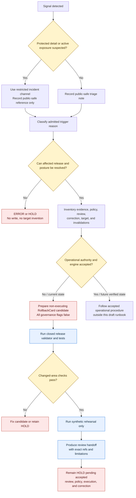

<!-- [KFM_META_BLOCK_V2]
doc_id: kfm://doc/runbook-archaeology-rollback
title: Archaeology Rollback Runbook
type: standard
profile: candidate-preparation-and-synthetic-rehearsal
version: v0.2
prior_version: v0.1
status: draft; repository-grounded; fixture-first; operational-rollback-hold; non-authoritative; non-publisher
owners:
  - "@bartytime4life — verified GitHub review route only"
owner_status: "Accountable archaeology, sensitivity, cultural/rights-holder, correction, rollback, and release assignments remain NEEDS VERIFICATION; CODEOWNERS routing does not establish those authorities."
created: 2026-05-13
updated: 2026-08-24
policy_label: public
sensitivity_posture: archaeology-sensitive; deny-by-default; no-public-sensitive-detail
current_path: docs/runbooks/archaeology/ROLLBACK_RUNBOOK.md
owning_root: docs/
responsibility: "Explain how to classify an Archaeology release defect, prepare a non-executing RollbackCard candidate, run the bounded synthetic rehearsal, and hand off unresolved operational action without authorizing rollback or mutating public state."
truth_posture: >-
  CONFIRMED same-path repository placement, accepted Directory Rules basis,
  current generic RollbackCard contract/schema/validator/fixtures, marker-protected
  synthetic rehearsal helper and tests, read-only rollback-drill workflow, one
  verified CODEOWNERS route, and current operational holds / PROPOSED future
  actor assignments, review quorum, live policy, rollback execution, invalidation,
  public correction, and release authority / CONFLICTED generic release profile
  versus permissive Archaeology-domain schema stub / UNKNOWN production aliases,
  deployed public surfaces, external caches, signer custody, and operator capacity;
  cite-or-abstain
prepared_under_prompt: KFM Repository Build-Out & Markdown Modernization Implementation Agent v6.0.0
evidence_snapshot:
  repository: bartytime4life/Kansas-Frontier-Matrix
  base_ref: main
  base_commit: 6b0f0f5353754553e0ff3800206f5479b069921a
  target_prior_blob: c485d242d70201de592470801e7881baafa4e9ba
  directory_rules_blob: fd49a0b83e55cef52c1124281f093e263526898d
  release_root_readme_blob: 60b6a656f8f2b765616bba7223f51c25863c7172
  rollback_contract_blob: c6d3c35c56b064e04c3a2532f4709d938d7b0c1a
  release_rollback_schema_blob: e0a9edf02dd5d6997eda60a054a5bf19636c3dd4
  archaeology_rollback_schema_blob: 17430260592ee7c735937d3041d67edb40022bc9
  release_rollback_validator_blob: 9e9ed5a92851935b41a36698e4bead13ef4edf57
  generic_rollback_validator_stub_blob: b80dd40e93733c7fa76f8f9a78e9ec55b6090b4b
  rollback_pipeline_placeholder_blob: 2afd3a3d859318e05dcb3e1b2763e4e375b790b6
  synthetic_rehearsal_helper_blob: a8f6bff350e79b453f425ebce9a9ded6801f8944
  synthetic_rehearsal_test_blob: b644ca6c4185b3f81bc339c077eae85299833261
  separation_of_duties_blob: 00f68beeeec7d57cce806e6cdbd710a837bd4f0c
  codeowners_blob: dd2a84aa514d8ecd9208bc347f90f9a2ed37dd61
inspection_boundary: >-
  Current-session GitHub reads of the target, accepted Directory Rules evidence,
  runbook and release-root guidance, RollbackCard contract and both schema lanes,
  validators, rollback pipeline placeholder, synthetic rehearsal helper/tests,
  rollback-drill workflow, CODEOWNERS, separation-of-duties guidance, and
  Archaeology rollback/sensitivity support docs. No workflow was executed, no
  actor was authenticated, no RollbackCard instance was issued, and no policy,
  review, correction, withdrawal, rollback, release, deployment, or publication
  transition was performed.
related:
  - docs/runbooks/README.md
  - docs/runbooks/ROLLBACK_RUNBOOK.md
  - docs/runbooks/revocation.md
  - docs/runbooks/ui_ROLLBACK.md
  - docs/runbooks/archaeology/README.md
  - docs/runbooks/archaeology/PROMOTION_RUNBOOK.md
  - docs/runbooks/archaeology/NO_NETWORK_TEST_RUNBOOK.md
  - docs/runbooks/archaeology/SOURCE_REFRESH_RUNBOOK.md
  - docs/doctrine/directory-rules.md
  - docs/adr/ADR-0029-adopt-directory-governance-standard-v2.md
  - docs/governance/SEPARATION_OF_DUTIES.md
  - docs/governance/REVIEW_DUTIES.md
  - docs/registers/DRIFT_REGISTER.md
  - docs/registers/VERIFICATION_BACKLOG.md
  - docs/domains/archaeology/SENSITIVITY.md
  - docs/domains/archaeology/PUBLICATION_AND_POLICY.md
  - release/README.md
  - release/rollback_cards/README.md
  - contracts/release/rollback_card.md
  - schemas/contracts/v1/release/rollback_card.schema.json
  - schemas/contracts/v1/domains/archaeology/rollback_card.schema.json
  - tools/validators/release/validate_rollback_card.py
  - tools/release/rollback_apply.py
  - tests/release/test_synthetic_rollback_rehearsal.py
  - .github/workflows/rollback-drill.yml
  - .github/CODEOWNERS
  - data/rollback/archaeology/README.md
tags: [kfm, runbook, archaeology, rollback, withdrawal, correction, synthetic-rehearsal, sensitivity, governance, operational-hold]
notes:
  - "Same-path modernization under the docs/ responsibility root; no path, authority root, contract, schema, policy, release object, or public state is created or moved."
  - "The generic release RollbackCard 1.0.0 profile is the current bounded validator target. The Archaeology-domain rollback-card schema remains a permissive greenfield stub and is not an equivalent authority surface."
  - "Operational rollback remains HOLD: the production pipeline and generic validator entrypoint are placeholders, while the available apply helper is synthetic-workspace-only."
  - "This runbook is an instruction and handoff surface. It is not a RollbackCard, ReviewRecord, PolicyDecision, CorrectionNotice, release approval, or rollback execution record."
[/KFM_META_BLOCK_V2] -->

<a id="top"></a>

# Archaeology Rollback Runbook

> **Repository-grounded procedure for classifying an Archaeology release defect, preparing a non-executing `RollbackCard` candidate, exercising the deterministic synthetic rollback/withdrawal rehearsal, and handing unresolved operational action to the appropriate governed authorities.**

<p>
  
  
  
  
  
  
</p>

> [!IMPORTANT]
> **This runbook does not authorize or execute rollback.** The current repository proves a closed, fixture-first `RollbackCard` candidate profile and a synthetic-workspace rehearsal. It does not prove authenticated rollback authority, live policy evaluation, independent review, production alias mutation, external cache invalidation, release, deployment, or publication.

> [!WARNING]
> **Never place exact archaeological coordinates, burial or human-remains detail, sacred-site information, culturally restricted knowledge, collection-security detail, looting-risk detail, or private landowner information in a public issue, pull request, workflow log, fixture, report, or rehearsal workspace.** Use a restricted incident channel and public-safe references only.

> [!CAUTION]
> `tools/release/rollback_apply.py` is guarded for synthetic roots only. Do not weaken, bypass, rename around, or copy around its `.kfm-synthetic-rollback-rehearsal` marker and `synthetic: true` checks. Do not point it at the repository's real `data/`, `release/`, cache, storage, or deployment paths.

**Quick navigation:** [Purpose](#1-purpose-scope-and-non-goals) · [Authority](#2-authority-and-current-repository-evidence) · [Invariants](#3-archaeology-fail-closed-invariants) · [Triggers](#4-trigger-classification-and-finite-candidate-outcomes) · [Preconditions](#5-preconditions-and-stop-conditions) · [Procedure](#6-candidate-preparation-and-synthetic-rehearsal-procedure) · [Contract](#7-current-rollbackcard-profile-and-schema-conflict) · [Rehearsal](#8-synthetic-rehearsal-and-safe-entry-points) · [Review](#9-rights-sovereignty-sensitivity-and-review) · [Actions](#10-correction-withdrawal-rollback-tombstone-and-erasure) · [Invalidation](#11-carrier-and-derivative-invalidation-plan) · [Validation](#12-validation-and-claim-boundaries) · [Handoff](#13-review-handoff-packet) · [Anti-patterns](#14-anti-patterns) · [Open work](#15-current-holds-and-open-verification) · [Related](#16-related-authorities-and-operational-surfaces) · [Maintenance](#17-maintenance-correction-and-document-rollback)

---

## 1. Purpose, scope, and non-goals

### Purpose

This runbook converts the current repository's rollback evidence into a bounded Archaeology procedure. It helps a maintainer or steward:

1. classify a suspected defect without exposing sensitive detail;
2. select a finite candidate posture;
3. prepare a schema-paired `RollbackCard` candidate without claiming authority;
4. inventory evidence, policy, review, correction, target, and invalidation dependencies;
5. run the repository's deterministic no-network rehearsal;
6. produce a truthful review handoff that leaves operational work on `HOLD` when authority or implementation is absent.

### In scope

- Archaeology and Cultural Heritage public-safe release carriers and claims, including generalized map layers, survey-coverage summaries, chronology views, candidate-anomaly surfaces, 3D representations, catalog projections, governed API payloads, Evidence Drawer content, Focus Mode answers, exports, and downstream indexes.
- Candidate rollback, withdrawal, hold, and error planning using the generic release `RollbackCard` profile.
- Synthetic, no-network rehearsal in isolated temporary roots.
- Sensitive-lane escalation and public-safe incident documentation.
- Correction, withdrawal, invalidation, lineage, and rollback-target handoff requirements.

### Out of scope

- **Production rollback execution.** The tracked production pipeline is still a placeholder.
- **Release approval or public mutation.** A document, candidate card, passing validator, workflow result, commit, or pull request cannot approve a release transition.
- **Database, schema, or graph migrations.** Those require their owning migration procedures and reversible migration records.
- **UI-only implementation rollback.** Use [`../ui_ROLLBACK.md`](../ui_ROLLBACK.md) for renderer or feature-flag concerns that do not change a governed release claim.
- **Erasure.** Rollback, withdrawal, correction, and tombstoning do not satisfy a lawful deletion or right-to-erasure requirement by themselves; use [`../revocation.md`](../revocation.md) and the relevant privacy/rights process.
- **Live source activation, live model calls, or external cache operations.** No such action is authorized by this runbook.

### State separation

| State | What it proves | What it does **not** prove |
|---|---|---|
| Tracked runbook | Human procedure exists at a reviewed commit | Operator authority or runtime readiness |
| Schema-valid candidate | Shape and local cross-field consistency | Reference resolution, policy approval, review, or execution |
| Synthetic rehearsal `PASS` | Deterministic behavior inside a marked temporary root | Production alias mutation or external invalidation |
| Hosted workflow success | The workflow's exact bounded assertions passed at one revision | Human review, release, deployment, or publication |
| Merge | Repository bytes entered `main` | A `PUBLISHED` lifecycle transition |
| Operational rollback | **UNKNOWN / HOLD** in current evidence | Must not be inferred from any state above |

[Back to top](#top)

---

## 2. Authority and current repository evidence

### 2.1 Directory Rules basis

The target is a tracked human-facing runbook under `docs/runbooks/archaeology/`. Accepted Directory Rules place operational procedures under `docs/runbooks/` and domains as nested segments rather than root-level authority folders. This update stays at the same path and does not create, move, rename, split, or retire an authority surface.

| Responsibility | Owning surface | Relationship to this runbook |
|---|---|---|
| Human operating guidance | `docs/runbooks/archaeology/` | **Owned here** |
| Rollback semantic meaning | [`contracts/release/rollback_card.md`](../../../contracts/release/rollback_card.md) | Referenced; not redefined |
| Rollback candidate machine shape | [`schemas/contracts/v1/release/rollback_card.schema.json`](../../../schemas/contracts/v1/release/rollback_card.schema.json) | Referenced; passing is not approval |
| Archaeology-domain schema stub | [`schemas/contracts/v1/domains/archaeology/rollback_card.schema.json`](../../../schemas/contracts/v1/domains/archaeology/rollback_card.schema.json) | Disclosed as conflicting/incomplete; not selected as operational authority |
| Candidate validation | [`tools/validators/release/validate_rollback_card.py`](../../../tools/validators/release/validate_rollback_card.py) | Bounded no-network validation only |
| Synthetic rehearsal | [`tools/release/rollback_apply.py`](../../../tools/release/rollback_apply.py) and tests | Temporary synthetic roots only |
| Release decisions and correction records | [`release/`](../../../release/README.md) | Separate append-only decision plane |
| Data-plane rollback support | [`data/rollback/archaeology/`](../../../data/rollback/archaeology/README.md) | Support and receipts; not release authority |
| Reviewer routing | [`.github/CODEOWNERS`](../../../.github/CODEOWNERS) | GitHub routing only; not independent actor authority |
| Policy, rights, sensitivity, and release approval | Accepted policy/review/release authorities | **UNKNOWN / HOLD** for operational use |

### 2.2 Current bounded status at the evidence snapshot

| Surface | Current evidence | Safe conclusion |
|---|---|---|
| Target path | Existing tracked Markdown, prior blob `c485d242...` | Same-path modernization is supported |
| Generic `RollbackCard` contract | Draft v1.0 semantic contract paired to a closed 1.0.0 schema | Candidate meaning and bounded invariants are inspectable |
| Generic release schema | Draft 2020-12 JSON Schema, `additionalProperties: false` | Candidate shape is closed; authority flags must remain false |
| Release validator | Implemented, no-network, file-size bounded, duplicate-key aware, schema + semantic checks | Candidate shape/local consistency can be tested |
| Release fixtures | Three valid and six invalid candidates with expected findings | Fixture polarity is testable |
| Archaeology-domain rollback schema | Permissive id-only greenfield stub; `additionalProperties: true` | **CONFLICTED / HOLD**; do not treat as equivalent to the generic release profile |
| Generic validator entrypoint | `tools/validators/validate_rollback_card.py` raises `NotImplementedError` | Do not use this entrypoint |
| Production rollback pipeline | `pipelines/rollback/main.py` is a one-line greenfield placeholder | No production rollback engine is established |
| Synthetic helper | Marker-protected, no-network, deterministic; PLAN by default; APPLY only inside marked synthetic root | Safe for rehearsal only |
| Synthetic tests | Eight non-vacuous tests cover plan/no-write, rollback, withdrawal, marker, synthetic flag, invalidations, target, and digest failures | Rehearsal behavior has bounded deterministic proof |
| `rollback-drill` workflow | Read-only, no release/signing secret, asserts holds and fixture behavior | Readiness inspection, not operational rollback |
| CODEOWNERS | One verified route, `@bartytime4life` | Review routing exists; independence and release authority do not |
| Separation of duties | Current guidance says ADR-0024 remains proposed and ReviewRecord machine surfaces conflict | Operational SoD is `UNKNOWN / HOLD` |
| Operational release/rollback | Release root records fixture-first profiles and explicit workflow holds | No production rollback, invalidation, alias mutation, or publication is proved |

> [!NOTE]
> **Repository evidence outranks the prior May 2026 no-mounted-repo wording.** Paths and implementations named as `CONFIRMED` above were read at the pinned commit. Anything not verified from an owning surface remains `PROPOSED`, `UNKNOWN`, `NEEDS VERIFICATION`, or `HOLD`.

[Back to top](#top)

---

## 3. Archaeology fail-closed invariants

The following rules are non-compensable for this lane:

1. **Exact archaeology remains denied by default.** Exact site geometry, burial, human remains, sacred sites, culturally restricted knowledge, collection-security detail, and looting-risk detail do not become public because a rollback, correction, style, export, or model answer is convenient.
2. **A candidate is not a site.** LiDAR, remote-sensing, geophysics, and survey anomalies keep their candidate role through rollback and correction. Reverting bytes must not upcast source role.
3. **Style hiding is not withdrawal.** A MapLibre filter or hidden control does not remove coordinates from PMTiles, vector tiles, COGs, GeoParquet, API responses, caches, exports, or model context.
4. **Evidence remains upstream of language.** An `EvidenceRef` must resolve to an admissible `EvidenceBundle` before a consequential claim is restored. Missing support produces hold, abstention, or withdrawal—not a plausible rewrite.
5. **Public clients stay behind the trust membrane.** No rollback path may make RAW, WORK, QUARANTINE, canonical stores, direct source APIs, vector indexes, graph internals, or direct model output the normal public path.
6. **Rollback preserves lineage.** Affected releases, cards, receipts, proofs, corrections, and supersession links remain inspectable unless a separate lawful erasure process applies.
7. **Receipts, proofs, decisions, and carriers remain distinct.** A rehearsal report is not a `RollbackCard`; a `RollbackCard` is not a `PolicyDecision`; a `CorrectionNotice` is not a release; a tile is not evidence.
8. **Watchers and CI do not publish.** Detection and validation may propose or hold work; neither may mutate public state through this runbook.
9. **Unknown authority fails closed.** When eligible actors, rights, sovereignty, review, policy, target safety, invalidation, or public notification are unresolved, use `HOLD` or `ERROR` and escalate.
10. **No public sensitive detail in the handoff.** Use opaque references and restricted channels. Public repository prose records the reason class and scope, not protected content.

[Back to top](#top)

---

## 4. Trigger classification and finite candidate outcomes

### 4.1 Trigger-to-reason-code crosswalk

Use only reason codes admitted by the current generic release schema. Domain-specific symptoms may refine the narrative, but they must not invent a second machine vocabulary in this runbook.

| Archaeology symptom | `trigger.reason_code` | Candidate posture | Notes |
|---|---|---|---|
| Exact site, burial, sacred-site, human-remains, collection-security, or looting-risk detail may have escaped | `SENSITIVITY_DISCOVERY` | `HOLD` immediately; then withdrawal or rollback candidate after authorized review | Do not reproduce the detail in GitHub |
| Rights, consent, cultural authority, or sovereignty posture changed | `RIGHTS_CHANGE` | Usually `HOLD` or `WITHDRAWAL_CANDIDATE` | Rights-holder authority and communication protocol remain operationally unverified |
| Upstream source was withdrawn or access terms changed | `SOURCE_WITHDRAWAL` | Withdrawal or rollback candidate | Re-check all derived carriers and citations |
| Evidence now contradicts a released interpretation or source role | `EVIDENCE_CONTRADICTION` | Rollback, withdrawal, or hold | Includes candidate-as-site and observation-as-authority errors |
| Evidence is missing or insufficient to support the public claim | `INSUFFICIENT_EVIDENCE` | `HOLD` or `WITHDRAWAL_CANDIDATE` | Restore only after EvidenceBundle closure |
| Schema, geometry, time, digest, manifest, or validator failure | `VALIDATION_FAILURE` | Rollback or hold | A green unrelated check does not compensate |
| Policy or review support is absent, rejected, conflicted, or no longer applicable | `POLICY_FAILURE` | `HOLD` or withdrawal candidate | Do not claim the current proposed SoD model is accepted |
| Credential, exploit, integrity, isolation, or malicious-input concern | `SECURITY_ISSUE` | `EMERGENCY_HOLD` reason; disposition `HOLD` | Coordinate through the security/incident procedure |
| API, cache, tile, index, storage, or other delivery failure | `OPERATIONAL_FAILURE` | Rollback, withdrawal, or hold | External invalidation remains operationally unproved |
| Immediate containment is needed before classification closes | `EMERGENCY_HOLD` | `HOLD` | This is a reason code, not authority to mutate state |
| Candidate input is malformed, unsafe, or cannot be resolved | `INPUT_INVALID` | `ERROR` | Preserve no-write behavior |
| General release defect not better classified above | `RELEASE_DEFECT` | Any finite candidate posture justified by evidence | Prefer a more specific code when supported |

Examples such as uncited AI output, stale state, correction-lineage drift, or a misleading trust badge are **symptoms**, not additional schema reason codes. Map them to the closest current code and explain the symptom in a public-safe incident note.

### 4.2 Finite candidate dispositions

| `disposition` | `target.mode` | Meaning | Operational effect |
|---|---|---|---|
| `ROLLBACK_CANDIDATE` | `PRIOR_RELEASE` | Proposes restoring a distinct prior release | None; requires separate review, policy, and execution |
| `WITHDRAWAL_CANDIDATE` | `WITHDRAWAL` | Proposes withdrawal without selecting a replacement | None |
| `HOLD` | `HOLD` | Stops the candidate path pending evidence, authority, or implementation | None |
| `ERROR` | `HOLD` | Records an invalid or failed recovery evaluation | None |

> [!IMPORTANT]
> The words `ROLLBACK_CANDIDATE` and `WITHDRAWAL_CANDIDATE` are deliberate. The current profile requires `governance.authority_created`, `policy_evaluated`, `review_completed`, `rollback_executed`, and `public_state_mutated` to remain `false`, with `governance.release_ref: null`.

[Back to top](#top)

---

## 5. Preconditions and stop conditions

### 5.1 Preconditions for candidate preparation

A maintainer may prepare a candidate only when each required input is available or explicitly marked unresolved:

| Check | Minimum evidence | Missing-result posture |
|---|---|---|
| Affected release | Stable `affected_release_ref` | `ERROR` / `INPUT_INVALID` |
| Reason | One admitted trigger reason code plus public-safe summary | `ERROR` |
| Candidate target | Distinct prior release, withdrawal, or hold mode | `HOLD`; never improvise a prior release |
| Evidence support | Canonical, sorted, unique EvidenceBundle references | `HOLD` or withdrawal when insufficient |
| Policy support | Canonical, sorted, unique PolicyDecision references for rollback candidate | `HOLD` |
| Review support | Canonical review references when available; explicit unresolved review otherwise | Sensitive Archaeology remains `HOLD` without accepted review authority |
| Correction/public notice | `correction_notice_ref` when `public_notice_required: true` | Validator failure |
| Invalidation scope | At least one admitted invalidation class; complete carrier inventory for rehearsal | `HOLD` if material carriers are unknown |
| Restoration | Restore ref matches prior-release target; validation remains required | Validator failure |
| Time | Detection ≤ decision ≤ effective time when effective time exists | Validator failure |
| Lineage | No self-supersession; prior/superseding card refs are explicit or null | Validator failure |
| Governance boundary | Every authority/execution/public-mutation flag remains false | Validator failure |
| Sensitive detail | No protected content in candidate, logs, branch, or PR | Stop and move to restricted incident handling |

### 5.2 Mandatory stop conditions

Stop candidate preparation and record `HOLD` or `ERROR` when any of these is true:

- the affected release cannot be resolved;
- the proposed target is the affected release or is not a verified prior candidate;
- a protected location or culturally restricted fact would have to be disclosed in the repository to continue;
- rights, sovereignty, consent, policy, review eligibility, or reviewer independence is unresolved;
- required EvidenceBundle or PolicyDecision references are missing for a rollback candidate;
- the public-notice requirement is known but no correction reference exists;
- the invalidation inventory omits a carrier that may retain the affected bytes;
- the only proposed containment is a renderer style/filter change;
- the workflow or helper would need production credentials, network access, a real alias, or a real public store;
- someone proposes changing a governance flag to `true` merely to make the candidate validate;
- someone proposes using the permissive Archaeology-domain schema to bypass the closed generic release profile;
- operational action would rely on a proposed role, proposed ADR, or one-account CODEOWNERS route as if it were accepted authority.

[Back to top](#top)

---

## 6. Candidate-preparation and synthetic-rehearsal procedure

### 6.1 Governed flow


```mermaid
flowchart TD
  A[Signal detected] --> B{Protected detail or active exposure suspected?}
  B -- Yes --> C[Use restricted incident channel\nRecord public-safe reference only]
  B -- No --> D[Record public-safe triage note]
  C --> E[Classify admitted trigger reason]
  D --> E
  E --> F{Can affected release and posture be resolved?}
  F -- No --> G[ERROR or HOLD\nNo write, no target invention]
  F -- Yes --> H[Inventory evidence, policy, review,\ncorrection, target, and invalidations]
  H --> I{Operational authority and engine accepted?}
  I -- No / current state --> J[Prepare non-executing RollbackCard candidate\nAll governance flags false]
  I -- Yes / future verified state --> K[Follow accepted operational procedure\noutside this draft runbook]
  J --> L[Run closed release validator and tests]
  L --> M{Changed-area checks pass?}
  M -- No --> N[Fix candidate or retain HOLD]
  M -- Yes --> O[Run synthetic rehearsal only]
  O --> P[Produce review handoff\nwith exact refs and limitations]
  P --> Q[Remain HOLD pending accepted\nreview, policy, execution, and correction]

  classDef hold fill:#fde7e7,stroke:#b42318,color:#5c1111;
  classDef proof fill:#e7f1ff,stroke:#0969da,color:#102a43;
  classDef gate fill:#fff4cc,stroke:#9a6700,color:#4a3000;
  class G,J,N,Q hold;
  class L,O,P proof;
  class B,F,I,M gate;
```

### 6.2 Phase 1 — contain and triage without leaking detail

1. Record the detection time, observed public surface, and a public-safe opaque reference.
2. Do not quote, screenshot, attach, or encode the protected content in GitHub.
3. When exposure may be active, use the authorized security/sensitivity incident channel. This repository runbook cannot substitute for platform containment.
4. Do not call a style filter, hidden panel, removed popup, or client-side denial a rollback.
5. Assign one current schema reason code from §4.1. When classification is incomplete, use `EMERGENCY_HOLD` and disposition `HOLD`.

### 6.3 Phase 2 — resolve the candidate boundary read-only

1. Resolve the affected release reference without mutating an alias or carrier.
2. Choose one candidate posture:
   - distinct prior release;
   - withdrawal with no replacement;
   - hold;
   - error.
3. Resolve or enumerate:
   - EvidenceBundle references;
   - PolicyDecision references;
   - ReviewRecord references or the explicit review gap;
   - correction/public-notice requirement;
   - every affected carrier and derivative;
   - timing and lineage.
4. Preserve source role. A candidate anomaly does not become a confirmed site because an older release used different wording.
5. Do not select a target solely because its bytes exist. A future operational target must also satisfy evidence, policy, review, validation, rights, sensitivity, correction, and release requirements.

### 6.4 Phase 3 — prepare a non-executing candidate

1. Use [`contracts/release/rollback_card.md`](../../../contracts/release/rollback_card.md) for meaning and the closed generic release schema for shape.
2. Keep arrays sorted and unique.
3. Use a non-placeholder `sha256:` digest for `spec_hash`.
4. Match `disposition`, `target.mode`, target release, and restoration release.
5. Set `restoration.validation_required: true`.
6. Set a correction reference when public notice is required.
7. Keep every governance flag `false` and `release_ref` null.
8. Do not commit an operational-looking Archaeology card to `release/rollback_cards/` unless an accepted instance-placement and review procedure authorizes it. A temporary candidate or fixture is sufficient for draft review.

### 6.5 Phase 4 — validate and rehearse

1. Run the release-level fixture profile and focused validator tests in §12.
2. Run the synthetic rehearsal test module in §12.
3. Prefer the test module over manual helper invocation; it creates isolated temporary roots and exercises both positive and negative cases.
4. When manual inspection of the helper is necessary, use a disposable root outside the repository and preserve both guards:
   - `.kfm-synthetic-rollback-rehearsal` containing exactly `synthetic-only\n`;
   - scenario field `synthetic: true`.
5. Use PLAN mode unless the purpose is specifically to test synthetic APPLY behavior inside the disposable root.
6. Treat a rehearsal `PASS` as synthetic evidence only. Do not convert its report into a release, correction, or rollback receipt.

### 6.6 Phase 5 — hand off and hold

1. Assemble the packet in §13.
2. Separate current evidence from proposals and unknowns.
3. Name every unverified actor, policy, target, cache, external carrier, correction, and execution dependency.
4. Record `HOLD` when the accepted operational path is absent—which is the current repository state.
5. Do not merge, release, deploy, promote, publish, or mutate public state from this runbook.

[Back to top](#top)

---

## 7. Current `RollbackCard` profile and schema conflict

### 7.1 Generic release profile — current bounded validator target

The generic release profile is the only repository-present RollbackCard surface currently paired with a closed schema, dedicated validator, fixtures, tests, and workflow inspection.

| Field | Current requirement |
|---|---|
| `object_type` | `RollbackCard` |
| `schema_version` | `1.0.0` |
| `id` | Stable `rollback:<scope>:...` identifier |
| `version` | Semantic version |
| `spec_hash` | Non-placeholder `sha256:` digest |
| `disposition` | `ROLLBACK_CANDIDATE`, `WITHDRAWAL_CANDIDATE`, `HOLD`, or `ERROR` |
| `trigger` | Admitted reason code plus timezone-aware `detected_at` |
| `affected_release_ref` | Release under review |
| `target` | `PRIOR_RELEASE`, `WITHDRAWAL`, or `HOLD` mode and release ref/null as required |
| `evidence_bundle_refs` | Sorted, unique support references; non-empty for rollback candidate |
| `policy_decision_refs` | Sorted, unique policy references; non-empty for rollback candidate |
| `review_record_refs` | Sorted, unique review references; presence is not proof of eligible review |
| `correction_notice_ref` | Reference or null; required when public notice is required |
| `invalidations` | One or more admitted invalidation classes, sorted and unique |
| `restoration` | Restore ref/null, public-notice flag, and `validation_required: true` |
| `timing` | Timezone-aware decision and optional effective time |
| `lineage` | Supersedes/superseded-by refs or null, never self-reference |
| `governance` | All authority/execution/public-mutation flags false; release ref null |

### 7.2 Current invalidation vocabulary

Use the exact schema vocabulary:

- `API_CACHE`
- `CDN`
- `TILES`
- `CATALOG`
- `TRIPLETS`
- `SEARCH_INDEX`
- `VECTOR_INDEX`
- `AI_CACHE`
- `DOWNSTREAM_DERIVATIVES`

The synthetic rehearsal requires the complete set. A future operational candidate may need a narrower schema-valid set, but the handoff must still inventory every real carrier that could retain or reconstruct affected content.

### 7.3 Archaeology-domain schema conflict

The repository also contains [`schemas/contracts/v1/domains/archaeology/rollback_card.schema.json`](../../../schemas/contracts/v1/domains/archaeology/rollback_card.schema.json). At the pinned revision it:

- describes itself as a greenfield placeholder;
- requires only `id`;
- allows additional properties;
- points to an Archaeology contract, fixtures root, and validator that are not established as the current closed profile.

**Disposition: `CONFLICTED / HOLD`.** This runbook does not delete the stub, silently alias it, declare it superseded, or use it to bypass the generic release profile. Resolving the domain-versus-generic schema relationship requires separate contract/schema/ADR work with migration and consumer analysis.

### 7.4 Candidate example

The example is illustrative and non-authoritative. It contains no real release, source, person, place, or cultural detail.

```json
{
  "object_type": "RollbackCard",
  "schema_version": "1.0.0",
  "id": "rollback:archaeology:synthetic:001",
  "version": "0.1.0",
  "spec_hash": "sha256:1111111111111111111111111111111111111111111111111111111111111111",
  "disposition": "HOLD",
  "trigger": {
    "reason_code": "SENSITIVITY_DISCOVERY",
    "detected_at": "2026-08-23T00:00:00Z"
  },
  "affected_release_ref": "release:archaeology:synthetic:v2",
  "target": {
    "mode": "HOLD",
    "release_ref": null
  },
  "evidence_bundle_refs": [],
  "policy_decision_refs": [],
  "review_record_refs": [],
  "correction_notice_ref": null,
  "invalidations": [
    "AI_CACHE",
    "API_CACHE",
    "CATALOG",
    "CDN",
    "DOWNSTREAM_DERIVATIVES",
    "SEARCH_INDEX",
    "TILES",
    "TRIPLETS",
    "VECTOR_INDEX"
  ],
  "restoration": {
    "restore_release_ref": null,
    "public_notice_required": false,
    "validation_required": true
  },
  "timing": {
    "decided_at": "2026-08-23T00:05:00Z",
    "effective_at": null
  },
  "lineage": {
    "supersedes": null,
    "superseded_by": null
  },
  "governance": {
    "authority_created": false,
    "policy_evaluated": false,
    "review_completed": false,
    "rollback_executed": false,
    "public_state_mutated": false,
    "release_ref": null
  }
}
```

The digest above is syntactically non-placeholder but is still illustrative; do not copy it into a real candidate. Compute a deterministic digest from the actual candidate profile used by the accepted tooling.

[Back to top](#top)

---

## 8. Synthetic rehearsal and safe entry points

### 8.1 What is implemented

[`tools/release/rollback_apply.py`](../../../tools/release/rollback_apply.py) implements a deterministic, no-network rehearsal for an isolated synthetic root. It can:

- verify the synthetic marker and scenario flag;
- validate rollback or withdrawal scenario shape;
- verify the current synthetic alias and release-manifest/artifact digests;
- produce deterministic PLAN reports without writes;
- apply a rollback or withdrawal only within the marked synthetic root;
- preserve affected manifest and artifact bytes;
- emit synthetic correction and invalidation files;
- retain governance fields showing that no authority, policy, review, release, publication, or public mutation occurred.

### 8.2 What is not implemented

- production target discovery;
- authenticated actor or signer verification;
- accepted review or policy evaluation;
- production alias mutation;
- external object-storage, CDN, tile, API, search, vector, graph, or model-cache invalidation;
- public correction delivery;
- production rollback receipt/proof issuance;
- deployment or publication transitions.

### 8.3 Safe test entry point

Use the tests that construct temporary roots automatically:

```bash
python -m unittest -q tests.release.test_synthetic_rollback_rehearsal
```

The current test module covers:

1. deterministic PLAN mode and no writes;
2. synthetic rollback alias switch with history preservation and invalidation output;
3. synthetic withdrawal with release retention;
4. denial of `synthetic: false`;
5. denial of incomplete invalidations;
6. denial of missing target material;
7. denial of artifact digest mismatch;
8. denial of a missing synthetic marker.

### 8.4 Helper refusal and hold codes

The helper's error codes are rehearsal outcomes, not `RollbackCard.trigger.reason_code` values. Useful examples include:

| Rehearsal code | Meaning |
|---|---|
| `SYNTHETIC_MARKER_MISSING` / `SYNTHETIC_MARKER_INVALID` | Workspace is not an admitted synthetic root |
| `NON_SYNTHETIC_INPUT_DENIED` | Scenario did not assert `synthetic: true` |
| `UNSAFE_PATH` / `UNSAFE_SYMLINK` | Candidate tried to escape the synthetic root |
| `TARGET_REQUIRED` / `WITHDRAWAL_TARGET_FORBIDDEN` | Operation and target disagree |
| `INVALIDATION_SET_INCOMPLETE` | Rehearsal omitted a required carrier class |
| `AFFECTED_RELEASE_NOT_CURRENT` | Synthetic alias does not name the affected release |
| `ARTIFACT_DIGEST_MISMATCH` | Synthetic carrier bytes differ from the manifest |
| `HISTORY_MUTATED` | Affected synthetic release history changed unexpectedly |

A helper error returns `HOLD` and preserves no-write/public-mutation boundaries. Do not translate a helper refusal into permission to weaken the guard.

[Back to top](#top)

---

## 9. Rights, sovereignty, sensitivity, and review

### 9.1 Current authority boundary

Current repository evidence confirms one GitHub review route and proposed fixture-first review profiles. It does **not** confirm:

- authenticated KFM actor identities;
- accepted archaeology, sensitivity, cultural/rights-holder, correction, or release assignments;
- an independent reviewer pool;
- accepted reviewer quorum or conflict/recusal policy;
- an accepted release-separation ADR;
- canonical ReviewRecord machine shape;
- live policy/release integration.

Therefore this runbook names future review duties as **PROPOSED** and treats operational review as `UNKNOWN / HOLD`.

### 9.2 Proposed review burden by consequence

| Candidate scope | Proposed participants | Current operational status |
|---|---|---|
| Non-sensitive chronology or presentation defect | Detector/author, Archaeology steward, correction reviewer, release authority | Assignments and authority `NEEDS VERIFICATION` |
| Exact geometry or looting-risk exposure | Detector, Archaeology steward, sensitivity reviewer, release authority, applicable cultural/rights-holder representative | `HOLD` until accepted identities/assignments and restricted handling exist |
| Burial, human remains, sacred site, or culturally restricted knowledge | All above plus explicit sovereignty/cultural review evidence | `HOLD`; no public detail and no T0 transform assumption |
| Rights/consent withdrawal | Source/rights steward, applicable rights-holder representative, sensitivity reviewer, correction/release authority | `HOLD`; communication protocol `NEEDS VERIFICATION` |
| AI or Focus Mode re-exposure | Archaeology steward, AI surface steward, sensitivity reviewer, correction/release authority | `HOLD`; AI cache and citation lineage must be inventoried |

### 9.3 Public-safe incident notation

A public repository record may include:

- opaque incident ID;
- affected release reference;
- reason code;
- consequence class;
- public carrier families;
- `HOLD`/candidate disposition;
- check results and unresolved authority;
- links to restricted records only when access semantics are safe.

It must not include:

- exact coordinates or reversible geometry;
- source excerpts revealing restricted cultural knowledge;
- names or contact details of private individuals or protected representatives;
- credentials, signed URLs, storage locations, exploit details, or cache keys;
- screenshots or rendered tiles that reveal the protected location;
- model prompts or output containing withheld context.

[Back to top](#top)

---

## 10. Correction, withdrawal, rollback, tombstone, and erasure

These actions remain distinct even when the same defect motivates more than one.

| Action | Use when | Candidate/record surface | Preserves | Current effect from this runbook |
|---|---|---|---|---|
| **Correction** | A released claim can be transparently superseded or repaired | `CorrectionNotice` plus linked release/review records | Original release and correction lineage | None |
| **Withdrawal candidate** | No safe replacement is currently selected | `RollbackCard.disposition = WITHDRAWAL_CANDIDATE` | Affected release history and reason | None |
| **Rollback candidate** | A distinct prior release is proposed for restoration | `ROLLBACK_CANDIDATE` with `PRIOR_RELEASE` target | Both affected and prior release histories | None |
| **Hold** | Evidence, rights, target, review, policy, invalidation, or execution is unresolved | `HOLD` | Current audit context; no mutation | None |
| **Error** | Candidate evaluation itself is invalid or unsafe | `ERROR` | Failure evidence and no-write posture | None |
| **Tombstone** | Public discovery must cease while lineage remains inspectable | Separate governed revocation/tombstone record | Audit and supersession history | None |
| **Erasure** | Lawful deletion or consent/rights process requires actual removal | Separate privacy/rights procedure | Only what governing law/policy permits | Out of scope |

> [!CAUTION]
> A Git revert is not automatically a KFM release rollback. It may reverse repository bytes, but it does not by itself correct public carriers, invalidate external caches, issue notices, preserve release lineage, or establish an authorized rollback decision.

[Back to top](#top)

---

## 11. Carrier and derivative invalidation plan

A candidate handoff must enumerate every place the affected content can remain visible, searchable, reconstructable, or model-accessible.

| Schema class | Archaeology examples | Handoff question |
|---|---|---|
| `API_CACHE` | Governed API response caches, Evidence Drawer payload caches | Which route/profile/version keys may retain the claim? |
| `CDN` | Public-safe static carriers and edge caches | Which immutable or mutable cache keys are affected? |
| `TILES` | PMTiles, MVT, raster/COG, terrain, 3D tile carriers | Can hidden attributes or geometry still be extracted? |
| `CATALOG` | Dataset, layer, item, release, and discovery records | Which records must show withdrawn, stale, corrected, or superseded state? |
| `TRIPLETS` | Graph/triplet projections and relation edges | Which edges can still imply the withdrawn claim? |
| `SEARCH_INDEX` | Text, place, layer, and archival discovery indexes | Which documents or snippets need invalidation or reindexing? |
| `VECTOR_INDEX` | Embedding/retrieval indexes | Can withheld text or geometry still be retrieved by AI? |
| `AI_CACHE` | Focus Mode responses, summaries, citations, prompt/result caches | Which answers, receipts, or templates reference the affected release? |
| `DOWNSTREAM_DERIVATIVES` | Stories, exports, screenshots, reports, generalized surfaces, 3D scenes | Which derivatives must be corrected, withheld, or regenerated? |

### Carrier rules

- Inventory by immutable identifier and digest where possible.
- Do not publish cache keys or paths that reveal protected content.
- A carrier invalidation plan is not proof that invalidation occurred.
- A future execution must emit bounded receipts from the owning systems and preserve failures.
- If any material carrier is unknown, retain `HOLD` and record the gap in the verification backlog.
- Derived layers, graphs, indexes, scenes, and AI responses never replace canonical evidence or release records.

[Back to top](#top)

---

## 12. Validation and claim boundaries

### 12.1 Repository-native focused checks

Run from the repository root at the exact branch head:

```bash
python tools/validators/release/validate_rollback_card.py --fixtures
python -m unittest discover \
  --start-directory tests/validators \
  --pattern 'test_validate_rollback_card.py' \
  --verbose
python -m unittest -q tests.release.test_synthetic_rollback_rehearsal
```

The hosted [`rollback-drill`](../../../.github/workflows/rollback-drill.yml) workflow should also run on the pull request according to its path/event configuration. It is read-only and intentionally reports the operational holds.

### 12.2 What each check proves

| Check | Passing evidence | Explicit non-proof |
|---|---|---|
| Release fixture validator | Valid fixtures pass; invalid fixtures produce exact expected findings | No reference resolution, actor authentication, policy evaluation, or execution |
| Validator unit tests | The validator's changed behavior remains covered | No release authority |
| Synthetic rehearsal tests | Deterministic temporary-root rollback/withdrawal behavior and negative guards | No real alias, public state, cache, deployment, or carrier mutation |
| `rollback-drill` workflow | Current repository readiness assertions and holds pass at the exact head | No production rollback or publication |
| Markdown/GFM checks | One H1, balanced fences, valid internal anchors, readable tables/alerts, and resolvable changed links | No operational correctness beyond documentation |
| PR read-back | Remote bytes and diff match the intended branch | No review, merge, release, deployment, promotion, or publication |

### 12.3 Required interpretation

Use these result labels precisely:

- `PASS` — the named bounded check passed.
- `FAIL` — the named check failed and requires repair or a disclosed inherited classification.
- `PENDING` — hosted check has not settled.
- `NOT_RUN` — a check was not executed; never imply success.
- `NOT_APPLICABLE` — check does not bear on this documentation-only change.
- `HOLD` — operational transition remains blocked by missing accepted authority or implementation.

A documentation-only pull request may be reviewable while hosted CI is pending. It must not be marked ready for operational use merely because Markdown checks pass.

[Back to top](#top)

---

## 13. Review handoff packet

A truthful handoff is compact enough to review but complete enough to reconstruct the candidate.

### 13.1 Required handoff fields

| Field | Required content |
|---|---|
| Repository checkpoint | Exact `main` base and candidate branch head |
| Incident reference | Public-safe opaque ID; restricted record pointer where permitted |
| Affected release | Stable reference and known public carriers |
| Trigger | Current schema reason code and public-safe narrative |
| Candidate disposition | Rollback, withdrawal, hold, or error |
| Target | Distinct prior release or null according to mode |
| Evidence | EvidenceBundle refs and resolution status |
| Policy | PolicyDecision refs and applicability status |
| Review | Review refs, required duties, conflicts/recusals, and unresolved assignments |
| Sensitivity/rights | Tier/rank posture, cultural/rights-holder need, and public-safe transform status |
| Correction | Public-notice requirement and CorrectionNotice ref/status |
| Invalidations | All schema classes plus carrier-specific inventory |
| Validation | Exact commands, outputs, branch head, and limitations |
| Execution | `HOLD` unless accepted production engine and authority are separately proved |
| Rollback of the repository change | Close/abandon unmerged PR; after merge use transparent revert or forward fix |

### 13.2 Handoff template

```yaml
repository_base: <full commit SHA>
branch_head: <full commit SHA>
incident_ref: <public-safe opaque reference>
affected_release_ref: <release ref>
trigger:
  reason_code: <admitted schema code>
  summary: <public-safe summary>
candidate:
  disposition: <ROLLBACK_CANDIDATE | WITHDRAWAL_CANDIDATE | HOLD | ERROR>
  target_mode: <PRIOR_RELEASE | WITHDRAWAL | HOLD>
  target_release_ref: <ref or null>
evidence_bundle_refs: []
policy_decision_refs: []
review_record_refs: []
correction_notice_ref: null
invalidations: []
validation:
  local: <PASS | FAIL | NOT_RUN>
  hosted: <PASS | FAIL | PENDING | NOT_RUN>
operational_state: HOLD
unknowns: []
next_authorized_decision: <named decision, not a person invented by this runbook>
```

### 13.3 Handoff acceptance

The packet is ready for human review when:

- it contains no protected content;
- every claim is traceable to current repository evidence or labeled otherwise;
- the candidate validates against the generic release profile when candidate JSON is supplied;
- all synthetic checks are reported with exact revision and scope;
- operational authority, policy, review, execution, correction, and publication remain distinct;
- unresolved items are explicit rather than converted into optimistic prose.

[Back to top](#top)

---

## 14. Anti-patterns

Never use this runbook to justify any of the following:

- **Style-only rollback.** Hidden rendering is not byte withdrawal.
- **Silent file replacement.** Replacing a carrier in place destroys or obscures release lineage.
- **Real-data rehearsal.** The helper is synthetic-only; no production root, alias, cache, or source belongs in its workspace.
- **Guard bypass.** Removing the marker, synthetic flag, path, symlink, or digest checks to make a rehearsal pass.
- **Schema shopping.** Using the permissive Archaeology stub because the closed release profile rejects a candidate.
- **Authority by JSON.** Treating a schema-valid card as an approved or executed rollback.
- **Authority by GitHub.** Treating CODEOWNERS, a reviewer request, green CI, a PR, a merge, or a GitHub release as KFM release authority.
- **Single-account independence.** Different labels, comments, or automation under one verified account do not establish separated duties.
- **Candidate-as-site restoration.** Reverting to an older release must not restore a source-role collapse.
- **Uncited AI restoration.** Cached model output does not become safe because it existed in a prior release.
- **Incomplete invalidation.** Leaving tiles, search, vector, graph, story, export, or AI carriers untouched.
- **Tombstone-as-erasure.** An audit-preserving tombstone does not satisfy every deletion obligation.
- **Public incident leakage.** Issues and PRs must not become secondary disclosure channels.
- **Documentation-as-operations.** This runbook explains; it does not mutate state.

[Back to top](#top)

---

## 15. Current holds and open verification

The following items remain outside this documentation-only slice:

| Item | Current state | Required next evidence |
|---|---|---|
| Production rollback pipeline | Placeholder | Accepted interface, target selection, no-write/negative tests, execution receipts, invalidation adapters, and rollback of the operator itself |
| Generic validator entrypoint | Placeholder | Reconcile or retire without breaking consumers; keep release validator canonical for current profile |
| Archaeology-domain RollbackCard schema | Permissive greenfield stub | Contract/schema/fixture/validator decision, consumer inventory, migration/alias plan, and ADR if authority changes |
| Reviewer identity and assignments | One GitHub route only | Accepted actor identity, StewardshipAssignment, interval, scope, conflict/recusal, and independent capacity |
| ReviewRecord shape | Conflicted candidates | Canonical machine profile and migration decision |
| Release separation | ADR-0024 proposed | Accepted decision plus live enforcement and review records |
| Policy evaluation | Fixture/scaffold evidence only | Accepted policy source, evaluator, inputs, outputs, and fail-closed integration |
| Production alias semantics | Proposed/held | Accepted pointer profile, atomic mutation, read-back, receipts, and rollback target binding |
| External invalidation | Unknown | Per-carrier adapter contracts, authenticated execution, receipts, retries, and failure recovery |
| Public correction/notification | Needs verification | Consequence classes, communication duties, accessibility, timing, and evidence-preserving notices |
| Rights-holder communication | Needs verification | Accepted restricted protocol, identities, confidentiality, consent/revocation semantics, and audit boundary |
| First operational Archaeology rollback drill | Not established | Approved non-public environment, synthetic/public-safe fixture, independent review, exact-head evidence, and no public mutation |
| Domain runbook index | `docs/runbooks/archaeology/README.md` is effectively blank at the inspected revision | Separate bounded index update; not required to make this same-path file truthful |

Do not resolve these items by adding more prose to this file. Each requires its owning contract, schema, policy, test, workflow, governance decision, or operator implementation.

[Back to top](#top)

---

## 16. Related authorities and operational surfaces

| Surface | Role | Current relationship |
|---|---|---|
| [`../README.md`](../README.md) | Runbook root boundary and index | Repository-grounded; runbooks are instruction surfaces only |
| [`../ROLLBACK_RUNBOOK.md`](../ROLLBACK_RUNBOOK.md) | Cross-domain rollback guidance | Older broad draft; this file narrows Archaeology behavior to current evidence |
| [`../revocation.md`](../revocation.md) | Revocation/tombstone/erasure boundary | Separate procedure |
| [`../../doctrine/directory-rules.md`](../../doctrine/directory-rules.md) | Placement authority adopted by ADR-0029 | Governs this same-path docs update |
| [`../../governance/SEPARATION_OF_DUTIES.md`](../../governance/SEPARATION_OF_DUTIES.md) | Current review-independence evidence and holds | Operational separation remains `HOLD` |
| [`../../governance/REVIEW_DUTIES.md`](../../governance/REVIEW_DUTIES.md) | Review responsibilities and handoff | Guidance only |
| [`../../domains/archaeology/SENSITIVITY.md`](../../domains/archaeology/SENSITIVITY.md) | Archaeology sensitivity doctrine | Draft; machine policy/review still outrank it |
| [`../../domains/archaeology/PUBLICATION_AND_POLICY.md`](../../domains/archaeology/PUBLICATION_AND_POLICY.md) | Domain publication boundary | Use for domain-specific release posture |
| [`../../../release/README.md`](../../../release/README.md) | Canonical append-only release decision root | Operational release/rollback held |
| [`../../../release/rollback_cards/README.md`](../../../release/rollback_cards/README.md) | Current lane index and card guidance | Does not create approval |
| [`../../../contracts/release/rollback_card.md`](../../../contracts/release/rollback_card.md) | Generic RollbackCard semantic contract | Current bounded meaning source |
| [`../../../schemas/contracts/v1/release/rollback_card.schema.json`](../../../schemas/contracts/v1/release/rollback_card.schema.json) | Closed generic candidate shape | Current validator target |
| [`../../../schemas/contracts/v1/domains/archaeology/rollback_card.schema.json`](../../../schemas/contracts/v1/domains/archaeology/rollback_card.schema.json) | Domain stub | `CONFLICTED / HOLD` |
| [`../../../tools/validators/release/validate_rollback_card.py`](../../../tools/validators/release/validate_rollback_card.py) | No-network candidate validator | Shape/local consistency only |
| [`../../../tools/release/rollback_apply.py`](../../../tools/release/rollback_apply.py) | Synthetic rehearsal helper | Never production |
| [`../../../tests/release/test_synthetic_rollback_rehearsal.py`](../../../tests/release/test_synthetic_rollback_rehearsal.py) | Non-vacuous rehearsal proof | Temporary roots only |
| [`../../../.github/workflows/rollback-drill.yml`](../../../.github/workflows/rollback-drill.yml) | Read-only readiness inspection | Preserves explicit operational holds |
| [`../../../data/rollback/archaeology/README.md`](../../../data/rollback/archaeology/README.md) | Data-plane support and alias-revert receipt guidance | Not release authority |
| [`../../registers/DRIFT_REGISTER.md`](../../registers/DRIFT_REGISTER.md) | Authority/path drift tracking | Record, do not silently normalize |
| [`../../registers/VERIFICATION_BACKLOG.md`](../../registers/VERIFICATION_BACKLOG.md) | Checkable unresolved work | Track concrete verification gaps |

[Back to top](#top)

---

## 17. Maintenance, correction, and document rollback

### Change discipline

Update this runbook when any of these changes materially:

- accepted Directory Rules or the owning path;
- RollbackCard contract/schema version or finite vocabularies;
- canonical validator or fixture root;
- synthetic helper guards or test entry point;
- rollback-drill workflow semantics;
- accepted actor/review/SoD model;
- production rollback engine or alias/invalidation implementation;
- Archaeology sensitivity, rights, sovereignty, or public-notice policy;
- correction, withdrawal, tombstone, or erasure boundary.

A behavior change belongs in its owning code, contract, schema, policy, test, workflow, or release surface first. Update this runbook in the same coherent slice or explain why not.

### Rollback of this documentation change

Before merge, abandon or close the draft pull request and retain the prior blob. After merge, use a transparent revert or forward-fix pull request against the actual merged commit. Do not rewrite shared history.

Reverting this file:

- restores documentation bytes only;
- does not execute or reverse a RollbackCard;
- does not mutate an alias, cache, carrier, release, deployment, or public surface;
- does not resolve the generic/domain schema conflict;
- does not change reviewer, rights-holder, policy, or release authority.

### Last reviewed

| Field | Value |
|---|---|
| Evidence checkpoint | `main@6b0f0f5353754553e0ff3800206f5479b069921a` |
| Prior target blob | `c485d242d70201de592470801e7881baafa4e9ba` |
| Reviewed | 2026-08-24 |
| Operational posture | `HOLD` |
| Release / deployment / publication effect | None |
| Next review trigger | Any material change listed under Change discipline |

[Back to top](#top)

---

## Appendix A — Glossary

<details>
<summary>Open glossary</summary>

| Term | Bounded meaning in this runbook |
|---|---|
| `RollbackCard` | Immutable non-executing candidate plan and target binding under the current profile |
| Rollback candidate | Proposal to restore a distinct prior release; no authority or mutation implied |
| Withdrawal candidate | Proposal to remove current public use without selecting a prior release |
| Hold | Fail-closed work state pending evidence, rights, review, policy, target, or implementation |
| CorrectionNotice | Separate public correction/withdrawal explanation; not a RollbackCard or release |
| EvidenceBundle | Resolved admissible support that outranks generated language |
| Public carrier | Released tile, raster, vector, document, API payload, story, scene, export, or other delivery artifact |
| Derivative | Rebuildable downstream catalog, graph, index, summary, visualization, or AI output |
| Synthetic rehearsal | Deterministic no-network exercise inside a marked temporary root; never production authority |
| Trust membrane | Boundary keeping public clients on governed interfaces and released public-safe carriers |
| Source-role anti-collapse | Observation, candidate, model, regulatory, aggregate, and authority roles remain explicit |
| Tombstone | Audit-preserving revocation marker; not equivalent to erasure |

</details>

---

## Appendix B — Candidate review checklist

- [ ] Exact base and candidate head are recorded.
- [ ] No protected Archaeology detail appears in the branch, PR, logs, or fixtures.
- [ ] Affected release reference is stable and resolvable in the permitted review context.
- [ ] Trigger uses one admitted generic release schema reason code.
- [ ] Disposition and target mode agree.
- [ ] Prior target is distinct, or withdrawal/hold uses null target as required.
- [ ] Evidence and policy references are sorted, unique, and sufficient for a rollback candidate.
- [ ] Review references and unresolved assignment/independence gaps are explicit.
- [ ] Correction/public-notice requirement is explicit.
- [ ] Invalidation classes and real carrier inventory are complete.
- [ ] Timing and lineage are coherent.
- [ ] All governance flags remain false and release ref is null.
- [ ] Generic release validator profile passes when candidate JSON is supplied.
- [ ] Synthetic rehearsal tests pass at the exact branch head.
- [ ] Hosted checks are classified as `PASS`, `FAIL`, `PENDING`, or `NOT_RUN` without overclaim.
- [ ] Operational state remains `HOLD` unless accepted authority and production implementation are independently proved.
- [ ] Rollback/correction path for the repository change is recorded.

[Back to top](#top)
