<!-- [KFM_META_BLOCK_V2]
doc_id: kfm://doc/runbook-archaeology-source-refresh
title: Archaeology Source Refresh Runbook
type: standard
version: v0.1
status: draft
owners: Docs steward + Archaeology domain steward + Source connector owner
created: 2026-05-13
updated: 2026-05-13
policy_label: restricted-by-default; public-safe sections only
related:
  - docs/doctrine/directory-rules.md
  - docs/doctrine/lifecycle-law.md
  - docs/doctrine/truth-posture.md
  - docs/doctrine/trust-membrane.md
  - docs/domains/archaeology/README.md
  - docs/sources/SOURCE_DESCRIPTOR_STANDARD.md
  - docs/runbooks/ui_VALIDATION.md
  - docs/runbooks/ui_ROLLBACK.md
  - docs/adr/ADR-0001-schema-home.md
tags: [kfm, runbook, archaeology, source-refresh, lifecycle, sensitivity]
notes:
  - Domain owns the most sensitive lane in KFM; fail-closed defaults dominate.
  - All path-bearing instructions are PROPOSED until verified against the mounted repo.
[/KFM_META_BLOCK_V2] -->

# Archaeology Source Refresh Runbook

> Operator procedure for refreshing Archaeology and Cultural Heritage sources through the governed `RAW → WORK / QUARANTINE → PROCESSED → CATALOG / TRIPLET → PUBLISHED` lifecycle, with sensitivity, rights, and steward review enforced at every gate.


<!-- TODO: replace placeholder badges with verified Shields.io endpoints (CI build, last-updated, license, ADR-0001 status) once repo evidence is mounted. -->

| Field | Value |
|---|---|
| **Status** | `draft` |
| **Owners** | Docs steward · Archaeology domain steward · Source connector owner |
| **Last updated** | 2026-05-13 |
| **Authority of these procedures** | CONFIRMED doctrine · PROPOSED implementation |
| **Authority of any specific path quoted here** | PROPOSED until verified against mounted-repo evidence |

> [!CAUTION]
> **Archaeology is a fail-closed domain.** Exact site locations, burials, human remains, sacred sites, unresolved cultural sensitivity, collection security, private landowner details, and looting-risk exposure are denied by default. Unclear rights, unresolved source role, missing evidence, unresolved sensitivity, or absent release state **blocks public promotion**. When in doubt, **quarantine, redact, generalize, delay, or deny** — record the transform and the reason.

---

## Contents

- [1. Scope](#1-scope)
- [2. Repo fit](#2-repo-fit)
- [3. Accepted inputs](#3-accepted-inputs)
- [4. Exclusions](#4-exclusions)
- [5. Operator roles & separation of duties](#5-operator-roles--separation-of-duties)
- [6. Preconditions](#6-preconditions)
- [7. Source families & sensitivity posture](#7-source-families--sensitivity-posture)
- [8. Lifecycle diagram](#8-lifecycle-diagram)
- [9. Refresh procedure](#9-refresh-procedure)
- [10. Required artifacts per gate](#10-required-artifacts-per-gate)
- [11. Validators & negative fixtures](#11-validators--negative-fixtures)
- [12. Sensitivity transforms & redaction posture](#12-sensitivity-transforms--redaction-posture)
- [13. Rollback path](#13-rollback-path)
- [14. Correction path](#14-correction-path)
- [15. Failure modes & quarantine reasons](#15-failure-modes--quarantine-reasons)
- [16. Verification backlog](#16-verification-backlog)
- [17. Related docs](#17-related-docs)
- [Appendix A — Worked refresh skeleton (illustrative)](#appendix-a--worked-refresh-skeleton-illustrative)
- [Appendix B — Operator pre-flight checklist](#appendix-b--operator-pre-flight-checklist)

---

## 1. Scope

This runbook governs **how an operator refreshes Archaeology and Cultural Heritage source material** in the Kansas Frontier Matrix (KFM) — from the moment a new payload (or a new vintage of an existing payload) is admitted to RAW, to the moment a public-safe derivative is published, corrected, or rolled back.

It is **operational governance**: it does not redefine the lifecycle, the truth posture, the trust membrane, or the per-source rights. It binds the operator to those rules and provides the gate-by-gate procedure for executing a refresh inside them.

**CONFIRMED doctrine** for this runbook:

- Archaeology follows the universal lifecycle `RAW → WORK / QUARANTINE → PROCESSED → CATALOG / TRIPLET → PUBLISHED`, with **promotion as a governed state transition, not a file move**.
- AI is interpretive and never the root truth source. `EvidenceBundle` outranks generated language.
- Public clients consume governed APIs and released artifacts only; they MUST NOT read `RAW`, `WORK`, `QUARANTINE`, candidate stores, or model runtimes directly.
- Exact archaeological geometry, burials, human remains, sacred sites, and looting-risk exposure fail closed.

**PROPOSED** for this runbook: every path, command, tool name, route, and CI job named below. None has been verified against a mounted repository in this session.

---

## 2. Repo fit

| Aspect | Value |
|---|---|
| **Responsibility root** | `docs/` (human-facing control plane) |
| **Sub-area** | `docs/runbooks/` (ops procedures, rollback drills, validation runs) |
| **Domain segment** | `archaeology/` (domain as a segment inside a responsibility root — Directory Rules §12) |
| **Authority order** | Directory Rules §2.1: doctrine → ADRs → Directory Rules → per-root README → dossiers → repo convention |
| **Schema home referenced** | `schemas/contracts/v1/<…>` per **ADR-0001 (schema home)** — PROPOSED until verified |
| **Upstream doctrine** | `docs/doctrine/directory-rules.md`, `docs/doctrine/lifecycle-law.md`, `docs/doctrine/truth-posture.md`, `docs/doctrine/trust-membrane.md` |
| **Downstream consumers** | Source connector operators · Archaeology domain stewards · Release manager · Review queue · CI gate authors |

> [!NOTE]
> The path `docs/runbooks/archaeology/SOURCE_REFRESH_RUNBOOK.md` is **PROPOSED**. Two layouts are admissible under Directory Rules §6.1 and §12: a domain-segmented folder (`archaeology/SOURCE_REFRESH_RUNBOOK.md`, used here) or a flat subsystem-prefixed file (`archaeology_SOURCE_REFRESH.md`, matching prior `ui_*` and `governed_ai_*` naming). The segmented form scales when Archaeology accumulates multiple runbooks (refresh, rollback, sensitivity drill). Confirm the local convention against the mounted `docs/runbooks/` tree and any existing ADR before adopting either form as canon.

---

## 3. Accepted inputs

This runbook applies when **any** of the following arrives at the connector boundary:

- A new vintage of an existing Archaeology source (e.g., a fresh export from a state historic preservation inventory, an updated NRHP-like listing, a refreshed field-survey batch).
- A previously admitted source whose **rights, terms, sensitivity class, cadence, or steward** have materially changed.
- A new candidate source family (e.g., a partner LiDAR run, a remote-sensing anomaly batch, a museum/collection accession refresh) that has cleared minimum admission criteria.
- A correction-driven re-pull triggered by `CorrectionNotice` against a previously published Archaeology artifact.

Every accepted input MUST arrive with — or be wrapped into — a `SourceDescriptor` carrying **role, authority, rights, sensitivity, citation, time fields, and a payload hash**. Inputs missing any of these go to QUARANTINE on admission, not to RAW.

---

## 4. Exclusions

This runbook does **not** cover:

| Excluded topic | Belongs under |
|---|---|
| Defining or revising the Archaeology object families (`ArchaeologicalSite`, `Survey`, `Feature`, `Context`, `ExcavationUnit`, `RemoteSensingAnomaly`, `LiDARCandidate`, `ProvenienceContext`, `StratigraphicUnit`, `CollectionAccession`, `ChronologyAssertion`, `CulturalReview`, `StewardReview`, `SensitivityTransform`, `CandidateFeature`, `PublicationTransformReceipt`) | `contracts/domains/archaeology/` and `schemas/contracts/v1/domains/archaeology/` |
| Policy bundle authoring (allow / deny / restrict / abstain rules for sensitive geometry, sacred sites, living-person joins) | `policy/domains/archaeology/` |
| Source identity, rights register, sensitivity classification | `data/registry/sources/archaeology/` and `policy/sensitivity/` |
| UI rendering of public-safe Archaeology layers and Evidence Drawer payload | `docs/architecture/ui/` and `docs/runbooks/ui_VALIDATION.md` |
| Governed AI behavior for Archaeology answers (ABSTAIN/DENY rules, exact-location denial) | `docs/architecture/governed-ai/` and `docs/runbooks/governed_ai_VALIDATION.md` |
| Rollback drill for the publication surface | `docs/runbooks/ui_ROLLBACK.md` plus this runbook §13 |
| 3D site documentation admission and access control | A separate Archaeology 3D runbook (PROPOSED; not present in this session) |

If a request crosses the line into any of the above, **stop, hand off, and link the appropriate doc**. Do not extend this runbook past its responsibility.

---

## 5. Operator roles & separation of duties

> [!IMPORTANT]
> **Release authority MUST be distinct from the original author when materiality applies.** A connector operator who admitted the payload is not the same person who promotes it to PUBLISHED.

| Role | What they may do | What they MUST NOT do |
|---|---|---|
| **Source connector operator** | Fetch source under approved descriptor; emit `RawCaptureReceipt` and `RunReceipt`; quarantine on failure | Fetch unknown-rights data to a public path; bypass rights or sensitivity checks; self-promote |
| **Archaeology domain steward** | Annotate uncertainty; approve redaction; classify sensitivity; sign `ReviewRecord`; resolve source conflicts; initiate rollback drill | Publish without release manager or recorded review; weaken sensitivity defaults without ADR |
| **Cultural / tribal reviewer** *(where applicable)* | Review oral history and culturally sensitive material; approve, restrict, or deny release | Be substituted by a generic reviewer; have their decision overwritten by AI output |
| **Policy admin** | Manage policy gates and role classes; review deny reasons | Bypass audit; grant unlimited access |
| **Release manager** | Assemble `ReleaseManifest`; promote; rollback; withdrawal | Release without proof, review state, or rollback target |
| **Developer / pipeline owner** | Implement schemas, APIs, validators, tests, no-network fixtures | Claim production behavior without tests or logs |
| **AI assistant** | Summarize **released** Archaeology `EvidenceBundle`s; compare evidence; draft steward-review notes | Produce uncited claims; receive direct browser calls; override policy; disclose exact sensitive locations |

---

## 6. Preconditions

Before starting a refresh, confirm **all** of the following. Any miss returns the source to a candidate state under steward.

- [ ] A current `SourceDescriptor` exists with verified `role`, `authority`, `rights`, `sensitivity`, `citation`, `time`, and `payload hash`. **NEEDS VERIFICATION** for every Archaeology source until the rights register is mounted.
- [ ] The source's `rights` and `terms` are currently valid (license window, attribution, use class). Re-verify on every refresh; rights drift is treated as a refresh-blocking event.
- [ ] The source's `cadence` is recorded; the refresh interval does not violate the upstream's terms (rate limits, snapshot-only restrictions).
- [ ] A steward is named for this source family. For oral history, cultural knowledge, sacred sites, burials, and human remains, a **cultural / tribal reviewer is named and reachable**.
- [ ] The Archaeology policy bundle (`policy/domains/archaeology/`) is at a known version and its negative fixtures pass in CI.
- [ ] The kill switch and rollback target for the **currently published** Archaeology release are known.
- [ ] No active `CorrectionNotice` against this source is unresolved — or, if one exists, this refresh is the correction action.

---

## 7. Source families & sensitivity posture

The following source families are governed by this runbook. **Source role**, **rights/sensitivity**, and **freshness** must be verified per family on every refresh — these are not static attributes.

| Source family | Typical role | Rights / sensitivity | Freshness | Status |
|---|---|---|---|---|
| State site inventory / SHPO or equivalent | authority / observation | rights and current terms **NEEDS VERIFICATION**; sensitive joins fail closed | source-vintage or cadence specific | PROPOSED |
| Public NRHP-like listings | authority / observation / context | rights **NEEDS VERIFICATION**; public listings still need rights review | source-vintage specific | PROPOSED |
| Field survey forms | observation / context | restricted; rights and consent **NEEDS VERIFICATION** | per-project cadence | PROPOSED |
| Excavation records & provenience packets | observation / context | restricted; sensitive joins fail closed | project-cycle specific | PROPOSED |
| Artifact / collection / repository records | authority / observation | rights and donor terms **NEEDS VERIFICATION** | accession-cadence specific | PROPOSED |
| Lab reports (radiometric, geophysics, etc.) | observation / model | rights and embargo terms **NEEDS VERIFICATION** | report-cycle specific | PROPOSED |
| Historic maps / plats / land records / newspapers | context | rights and attribution **NEEDS VERIFICATION** | source-vintage specific | PROPOSED |
| Oral history & cultural knowledge | authority *(community)* / context | restricted; **cultural/tribal review required**; consent and steward protocol **NEEDS VERIFICATION** | per-protocol | PROPOSED |
| Remote sensing / LiDAR / aerial / geophysics anomalies | observation / model | **candidates, not sites**; exact geometry restricted by default | per-survey cadence | PROPOSED |
| 3D site documentation | observation | access controls and transform receipts required | per-project | PROPOSED |

> [!WARNING]
> A LiDAR, aerial, satellite, geophysical, model, or 3D anomaly is a **candidate**, not a confirmed site, until source evidence and review support promotion. This runbook MUST NOT collapse candidate detection into confirmed-site publication. The `CandidateFeature` / `ArchaeologicalSite` distinction is enforced at validation and again at catalog closure.

---

## 8. Lifecycle diagram

```mermaid
flowchart LR
    A[Upstream source] -->|fetch under SourceDescriptor| ADM{{Admission gate}}
    ADM -->|admit| RAW[(RAW)]
    ADM -->|missing rights / sensitivity / hash| Q1[(QUARANTINE — admission)]
    RAW -->|normalize schema, geometry, time, identity| NORM{{Normalization gate}}
    NORM -->|fail policy or schema| Q2[(QUARANTINE — normalization)]
    NORM -->|pass| WORK[(WORK)]
    WORK -->|validators + receipts| VAL{{Validation gate}}
    VAL -->|fail| WORK
    VAL -->|pass| PROC[(PROCESSED)]
    PROC -->|EvidenceRef resolves, digests close| CAT{{Catalog-closure gate}}
    CAT -->|hold — no public edge| PROC
    CAT -->|pass| CATR[(CATALOG / TRIPLET)]
    CATR -->|ReviewRecord + release authority distinct from author| REL{{Release gate}}
    REL -->|hold| CATR
    REL -->|pass| PUB[(PUBLISHED — public-safe only)]
    PUB -->|defect detected| CORR{{Correction}}
    CORR --> PUB2[(PUBLISHED')]
    PUB -.->|emergency| RBK{{Rollback}}
    RBK -.-> PUBprev[(Prior PUBLISHED restored)]

    classDef quarantine fill:#fde2e2,stroke:#b00020,color:#5a0010;
    classDef public fill:#e6f4ea,stroke:#1e7a32,color:#0c3c1a;
    classDef governed fill:#eef2ff,stroke:#3949ab,color:#1a237e;
    class Q1,Q2 quarantine;
    class PUB,PUB2,PUBprev public;
    class ADM,NORM,VAL,CAT,REL,CORR,RBK governed;
```



*Diagram reflects the universal KFM lifecycle invariant applied to Archaeology. Gate names mirror the Master Pipeline Gate Reference; named artifacts are PROPOSED until verified against the mounted repo.*

---

## 9. Refresh procedure

Each step ends in a **gate** with a binary outcome: pass and emit the named artifact(s), or hold and emit a structured failure with reason. **No silent promotion.** No step may write to a public surface.

### Step 0 — Preflight

Run before any fetch.

1. Re-read this runbook's §6 preconditions. Any miss aborts the refresh.
2. Read the current `SourceDescriptor` for the target source family. If `rights`, `sensitivity`, `cadence`, `steward`, or `cultural_reviewer` is `UNKNOWN` / `NEEDS VERIFICATION`, **do not fetch** — open a steward task and stop.
3. Confirm the **prior published release**'s rollback target is known and reachable.
4. Confirm CI is green on the Archaeology policy bundle's negative fixtures (sensitive-geometry deny, candidate-not-site, public no-leak, AI exact-location denial).

### Step 1 — Admission (`— → RAW`)

**Pre-condition:** source identity and rights minimally established; source-role intent set.

**Operator actions:**

- Fetch under the approved `SourceDescriptor`. Use conditional GETs / ETag / If-None-Match where the upstream supports them.
- Persist the immutable payload (or reference) plus a payload hash.
- Emit `RawCaptureReceipt` and `RunReceipt`.

**Required artifacts:** `SourceDescriptor` (role, authority, rights, sensitivity, cadence) · payload-or-reference hash · `RawCaptureReceipt` · `RunReceipt`.

**Failure-closed outcome:** source not admitted; logged as a candidate awaiting steward. Do **not** retry without steward input.

> [!TIP]
> A no-change refresh (conditional GET returns 304, or `spec_hash` is unchanged) MUST still emit a heartbeat receipt and MUST NOT create new catalog entries. This preserves audit continuity without churning the publication surface.

### Step 2 — Normalization (`RAW → WORK / QUARANTINE`)

**Pre-condition:** schema, geometry, time, identity, evidence, rights, and policy rules are runnable for this source family.

**Operator actions:**

- Normalize schema, geometry (preserving CRS), time fields (source/observed/valid/retrieval — keep them distinct), identity (deterministic basis: source id + object role + temporal scope + normalized digest), evidence, rights, and policy.
- Apply sensitivity classification. Sensitive joins (e.g., site coordinates × landowner records, or anomaly geometry × tribal review state) fail closed and route to QUARANTINE with a reason code.
- Emit `TransformReceipt`, working-set `ValidationReport`, and `PolicyDecision`.

**Required artifacts:** `TransformReceipt` · `ValidationReport` (working) · `PolicyDecision` · `QUARANTINE` record on failure.

**Failure-closed outcome:** QUARANTINE with a structured reason — never silent promotion to WORK.

### Step 3 — Validation (`WORK → PROCESSED`)

**Pre-condition:** validators are deterministic and tied to fixtures; required receipts present.

**Operator actions:**

- Run all Archaeology validators (§11). All MUST pass; partial passes hold in WORK.
- Apply `SensitivityTransform`s where required (generalization, suppression, redaction) and emit `RedactionReceipt`.
- If aggregations are produced (e.g., survey-coverage summaries, candidate-anomaly surfaces), emit `AggregationReceipt`.

**Required artifacts:** `ValidationReport` (pass) · `RedactionReceipt` (when sensitivity applies) · `AggregationReceipt` (when applies).

**Failure-closed outcome:** stay in WORK; emit a structured `FAIL` outcome with the validator IDs that did not pass.

### Step 4 — Catalog closure (`PROCESSED → CATALOG / TRIPLET`)

**Pre-condition:** every `EvidenceRef` resolves; catalog matrix and digests close.

**Operator actions:**

- Verify every `EvidenceRef` resolves to an `EvidenceBundle`. Unresolved references hold the gate.
- Emit `CatalogMatrix` entry, `EvidenceBundle`, and graph/triplet projections where applicable.
- Confirm digests close (artifact digest ↔ run receipt ↔ catalog record).

**Required artifacts:** `CatalogMatrix` entry · `EvidenceBundle` · graph / triplet projection (where applicable).

**Failure-closed outcome:** HOLD at PROCESSED; structured `FAIL`; **no public edge** is offered.

### Step 5 — Release (`CATALOG / TRIPLET → PUBLISHED`)

**Pre-condition:** review state present where required; release authority distinct from the original author when materiality applies; the change is **public-safe**.

> [!IMPORTANT]
> For Archaeology, **`ReviewRecord` is required**. For oral history, cultural knowledge, sacred sites, burials, or human remains, a **cultural / tribal reviewer's `ReviewRecord` is required in addition to the domain steward's**. The release manager does not substitute for these reviewers.

**Operator actions:**

- Assemble `ReleaseManifest` with: artifact digests, source provenance, rights, sensitivity class, applied transforms, validator pass set, review records, **rollback target**, and **correction path**.
- Confirm separation of duties: the release manager is not the connector operator who admitted the payload.
- Promote through the governed release path (state transition; **not** a file move).
- Surface trust badges and stale-state indicators in the public UI per the Cross-cutting viewing products doctrine.

**Required artifacts:** `ReleaseManifest` · `rollback target` · `correction path` · `ReviewRecord` (one or more).

**Failure-closed outcome:** HOLD at CATALOG; no public surface change.

### Step 6 — Post-release smoke

1. Verify the new Archaeology layer/Evidence Drawer surface resolves end-to-end through governed APIs only.
2. Run no-public-`RAW` / no-public-`WORK` / no-public-`QUARANTINE` route checks.
3. Confirm Focus Mode answers for this refresh's claims either **ANSWER with citations**, **ABSTAIN** when evidence is insufficient, or **DENY** where sensitivity/policy/release state forbids — exact-location denial fixtures pass.
4. Confirm the rollback target restores the prior `ReleaseManifest` in a dry-run.
5. Update the verification backlog (§16) for any remaining `NEEDS VERIFICATION` items.

---

## 10. Required artifacts per gate

| Gate | Required artifacts (PROPOSED minimum) | Failure-closed outcome |
|---|---|---|
| Admission (`— → RAW`) | `SourceDescriptor`; payload-or-reference hash; `RawCaptureReceipt`; `RunReceipt` | Source not admitted; candidate awaiting steward |
| Normalization (`RAW → WORK / QUARANTINE`) | `TransformReceipt`; `ValidationReport` (working); `PolicyDecision`; QUARANTINE on failure | Quarantine with reason; never silent |
| Validation (`WORK → PROCESSED`) | `ValidationReport` (pass); `RedactionReceipt` if sensitivity applies; `AggregationReceipt` if applies | Stay in WORK; structured `FAIL` |
| Catalog closure (`PROCESSED → CATALOG / TRIPLET`) | `CatalogMatrix` entry; `EvidenceBundle`; graph / triplet projection if applicable | Hold at PROCESSED; no public edge |
| Release (`CATALOG → PUBLISHED`) | `ReleaseManifest`; rollback target; correction path; `ReviewRecord` (steward + cultural where required) | Hold at CATALOG; no public surface change |
| Correction (`PUBLISHED → PUBLISHED'`) | `CorrectionNotice`; updated `EvidenceBundle`; superseding `ReleaseManifest` | The old release is **superseded**, not silently mutated |

---

## 11. Validators & negative fixtures

The validators below are the **minimum** set the Archaeology lane is expected to enforce. All are PROPOSED in implementation; their existence in the mounted repo is **NEEDS VERIFICATION**.

| Validator (PROPOSED) | What it proves | Negative fixture (must FAIL when policy is violated) |
|---|---|---|
| `EvidenceBundle-required` | No claim can publish without a resolved `EvidenceBundle` | Claim with missing or unresolved `EvidenceRef` |
| `candidate-not-site` | LiDAR / RS / model anomalies are not promoted to confirmed sites without source evidence and review | Candidate object promoted to `ArchaeologicalSite` without review |
| `public-no-leak` | RAW / WORK / QUARANTINE / candidate / unreleased data never appears on a public surface | Public route resolves to a non-PUBLISHED artifact |
| `rights-and-cultural-review` | Sources with cultural / oral-history content carry a cultural reviewer's record | Release with missing cultural `ReviewRecord` |
| `exact-sensitive-geometry-denial` | Exact archaeological geometry, burials, sacred sites, human remains are not exposed publicly | Public response returns exact geometry for a flagged feature |
| `catalog-closure` | Every published artifact resolves to a closed catalog record with digest closure | Published artifact with unresolved `CatalogMatrix` entry |
| `AI-exact-location-denial` | Governed AI denies exact-location queries for restricted sites; ABSTAIN or DENY only | AI returns exact coordinates for a restricted feature |
| `stale-source` | Stale or late telemetry / vintage produces a visible stale state, not silent serve | Source past freshness window returns ANSWER without stale flag |
| `no-change-no-churn` | A 304 / unchanged `spec_hash` refresh emits a heartbeat receipt and does not create new catalog entries | Unchanged source produces a new `ReleaseManifest` |

> [!NOTE]
> Negative fixtures are the load-bearing part of this list. A validator that has no failing case is doctrine, not enforcement.

---

## 12. Sensitivity transforms & redaction posture

Archaeology publishes **public-safe derivatives only**. Exact-geometry products live behind steward-only review surfaces; they are never the default public release.

| Posture | When it applies | Required record |
|---|---|---|
| **Generalize** | Point geometry would expose looting-risk or sacred site | `SensitivityTransform` + `RedactionReceipt` documenting buffer / aggregation rule |
| **Suppress** | Feature class is denied for public release entirely (burials, human remains, sacred sites) | `PolicyDecision` (DENY) + `SensitivityTransform` recording the suppression |
| **Stage access** | Researcher-class access permitted under access policy | Access role decision + `PolicyDecision` (RESTRICT) + audit log |
| **Delay** | Active investigation, looting risk window, embargo | `PolicyDecision` (DEFER) + release-after date + steward note |
| **Deny** | Rights / sensitivity / review state unresolved | `PolicyDecision` (DENY) + reason code |

> [!CAUTION]
> The redaction posture is **deny-by-default**. A missing decision is not "allow." When `rights`, `sensitivity`, or `review` is `UNKNOWN`, the only admissible release decision is to **hold or deny** — never to ship.

---

## 13. Rollback path

A rollback is a **governed state transition**, not a file copy.

```mermaid
sequenceDiagram
    autonumber
    participant Op as Operator (steward + release mgr)
    participant Rel as Release surface
    participant Cat as Catalog / TRIPLET
    participant UI as Public UI
    participant Audit as Audit log

    Op->>Rel: Identify affected ReleaseManifest
    Op->>Cat: Locate prior safe artifact set + verify digests
    Op->>Rel: Disable / withdraw affected public surfaces
    Rel->>UI: Mark withdrawn / stale; remove from active layers
    Op->>Rel: Restore prior ReleaseManifest via governed release path
    Rel->>UI: Restore prior layers / Evidence Drawer payloads
    Op->>Audit: Emit RollbackCard + receipts (no hidden copy)
```

**Required artifacts for rollback:** prior `ReleaseManifest`; artifact digests; cache invalidation record; `RollbackCard`; audit entries.

**Anti-pattern:** "swap the file." Rollback that is not a governed transition with receipts is treated as a hidden mutation — and a release that cannot be rolled back through the governed path is, by KFM doctrine, not safely publishable.

---

## 14. Correction path

A correction does **not** silently mutate the prior release; it publishes a superseding release.

1. Detect or receive the defect (evidence gap, source-role error, rights drift, sensitivity miss, geometry error, temporal error, policy miss, validation miss, rendering error, API error, AI-output error).
2. Classify the defect class. Pair it with a correction posture (e.g., **evidence gap → ABSTAIN / withdraw**; **sensitivity miss → suppress / regeneralize**).
3. Preserve the original `ReleaseManifest`.
4. Emit `CorrectionNotice` with: defect class, affected artifact digests, affected `EvidenceBundle`(s), proposed superseding state.
5. Update the `EvidenceBundle` and re-run §9 steps 3–5 for the corrected refresh.
6. Publish the **superseding `ReleaseManifest`**. Mark the prior release `superseded`, not deleted.
7. Where downstream derivatives (tiles, graph projections, AI receipts) reference the old release, mark them stale or invalidate them per their own correction path.

---

## 15. Failure modes & quarantine reasons

| Reason (PROPOSED reason codes) | Trigger | Disposition |
|---|---|---|
| `rights_unknown` | Rights / terms not verified at refresh time | Hold; open steward task; do not fetch |
| `rights_expired` | License window passed | Hold; do not publish derivatives until renewed |
| `sensitivity_unresolved` | Cultural / tribal review missing for an oral history / sacred site / burial source | Hold for reviewer; deny public derivatives |
| `hash_mismatch` | Payload digest does not match `RunReceipt` | Quarantine; treat as integrity event |
| `schema_invalid` | Source payload fails normalization schema | Quarantine with validator IDs |
| `geometry_invalid` | Geometry repair would change site identity | Hold for steward; record `GeometryRepairReport` |
| `candidate_promoted_without_review` | Anomaly attempted promotion to confirmed site | Quarantine; route to review queue |
| `evidence_unresolved` | One or more `EvidenceRef` does not resolve | Hold at PROCESSED |
| `review_missing` | `ReviewRecord` missing where required | Hold at CATALOG |
| `cultural_review_missing` | Cultural / tribal `ReviewRecord` missing where required | Hold at CATALOG; escalate |
| `rollback_target_unknown` | Cannot identify a safe prior release | Hold at CATALOG; **never release** until resolved |
| `stale_source` | Source past freshness window | Allow with stale state surfaced, or hold per policy |
| `kill_switch_engaged` | Operational kill switch is active for Archaeology releases | Block all publication paths |

> [!WARNING]
> Quarantine is a **safe state**, not a failure to fix later. Material in QUARANTINE is preserved with its reason; it is not silently retried. Re-entry to WORK requires steward action.

---

## 16. Verification backlog

Carried forward from project doctrine; these items must be resolved against the mounted repo before the corresponding section of this runbook can be promoted from PROPOSED to CONFIRMED.

| Item to verify | Evidence that would settle it | Status |
|---|---|---|
| Steward authority and confidentiality protocol for Archaeology | Repo files, schemas, registry entries, tests, review records, release manifests | NEEDS VERIFICATION |
| Public geometry thresholds and transform profiles | Sensitivity policy bundle + generalization recipes + negative fixtures | NEEDS VERIFICATION |
| Oral history / cultural knowledge protocol | Cultural reviewer registry + consent records + access policy | NEEDS VERIFICATION |
| Emergency public-layer disablement and rollback drill | Rollback runbook + drill record + `RollbackCard` fixtures | NEEDS VERIFICATION |
| Source-rights register entries for every accepted Archaeology source family | `data/registry/sources/archaeology/` populated | NEEDS VERIFICATION |
| Policy tooling actually wired (OPA / Conftest / cosign / DSSE) | CI workflow + signed manifest example | NEEDS VERIFICATION |
| `schemas/contracts/v1/domains/archaeology/` schema home | ADR-0001 acceptance + mounted directory | NEEDS VERIFICATION |
| Public no-leak route guard for `RAW` / `WORK` / `QUARANTINE` / candidate stores | Negative integration test in CI | NEEDS VERIFICATION |
| AI exact-location denial covered by Focus Mode tests | Adapter fixtures + citation validation + DENY outcome | NEEDS VERIFICATION |

[Back to top ↑](#archaeology-source-refresh-runbook)

---

## 17. Related docs

- `docs/doctrine/directory-rules.md` — placement law and authority order
- `docs/doctrine/lifecycle-law.md` — universal `RAW → PUBLISHED` invariant
- `docs/doctrine/truth-posture.md` — cite-or-abstain default
- `docs/doctrine/trust-membrane.md` — public clients use governed APIs only
- `docs/domains/archaeology/README.md` — domain identity, scope, ubiquitous language *(PROPOSED)*
- `docs/sources/SOURCE_DESCRIPTOR_STANDARD.md` — standard `SourceDescriptor` fields *(PROPOSED)*
- `docs/runbooks/ui_VALIDATION.md` — UI validation, contract, e2e smoke *(PROPOSED)*
- `docs/runbooks/ui_ROLLBACK.md` — rollback and feature-flag steps *(PROPOSED)*
- `docs/runbooks/governed_ai_VALIDATION.md` — Focus Mode evidence/citation/policy validation *(PROPOSED)*
- `docs/adr/ADR-0001-schema-home.md` — schema home decision *(PROPOSED)*
- `docs/registers/VERIFICATION_BACKLOG.md` — repo-wide verification register *(PROPOSED)*
- `docs/registers/DRIFT_REGISTER.md` — placement and convention drift *(PROPOSED)*

<!-- TODO: replace each PROPOSED link with a verified path once the mounted repo is inspected. Stable anchors here intentionally match the runbook section IDs (`#1-scope`, `#9-refresh-procedure`, etc.) so cross-doc references survive minor edits. -->

---

## Appendix A — Worked refresh skeleton (illustrative)

> [!NOTE]
> The block below is **illustrative**. Commands, file paths, and tool names are PROPOSED. Replace with verified pipelines and CI jobs from the mounted repo before treating any of this as executable.

<details>
<summary><b>Click to expand: illustrative refresh skeleton for a State Site Inventory vintage</b></summary>

```text
# Step 0 — Preflight (illustrative)
kfm preflight \
    --domain archaeology \
    --source state-site-inventory \
    --check rights,sensitivity,steward,cultural_reviewer,rollback_target

# Step 1 — Admission (illustrative)
kfm source fetch \
    --descriptor data/registry/sources/archaeology/state-site-inventory.descriptor.yaml \
    --conditional-get \
    --emit-receipts raw_capture,run

# Step 2 — Normalization (illustrative)
kfm pipeline run \
    --spec pipeline_specs/archaeology/state-site-inventory.normalize.yaml \
    --quarantine-on policy_fail,schema_fail,geometry_invalid

# Step 3 — Validation (illustrative)
kfm validate \
    --validators evidence_bundle_required,candidate_not_site,public_no_leak,\
                 rights_and_cultural_review,exact_sensitive_geometry_denial,\
                 stale_source,no_change_no_churn \
    --negative-fixtures fixtures/domains/archaeology/

# Step 4 — Catalog closure (illustrative)
kfm catalog close \
    --domain archaeology \
    --require evidence_bundle,catalog_matrix,digest_closure

# Step 5 — Release (illustrative — requires distinct release authority)
kfm release promote \
    --domain archaeology \
    --review-records steward,cultural \
    --rollback-target release/last_safe/archaeology \
    --correction-path docs/runbooks/archaeology/SOURCE_REFRESH_RUNBOOK.md#14-correction-path

# Step 6 — Post-release smoke (illustrative)
kfm smoke \
    --no-public-raw \
    --focus-mode exact-location-denial \
    --rollback-dry-run
```

This skeleton is **PROPOSED**. The KFM CLI name, subcommands, and flags shown here have not been verified against any mounted repository in this session. They exist to illustrate the gate sequence, not to prescribe an interface.

</details>

---

## Appendix B — Operator pre-flight checklist

<details>
<summary><b>Click to expand: copy-into-PR pre-flight checklist</b></summary>

```text
[ ] SourceDescriptor read; role, authority, rights, sensitivity, cadence, steward verified
[ ] Cultural / tribal reviewer named and reachable (where applicable)
[ ] Rights window currently valid
[ ] Prior PUBLISHED rollback target known and reachable
[ ] Archaeology policy bundle version recorded; negative fixtures green in CI
[ ] Kill switch state checked
[ ] No unresolved CorrectionNotice against this source (or this refresh is the correction)
[ ] Refresh interval respects upstream terms (rate, snapshot-only, etc.)
[ ] Separation of duties confirmed: release manager != connector operator
[ ] Verification backlog re-read; any item that would block this refresh raised before fetch
```

</details>

[Back to top ↑](#archaeology-source-refresh-runbook)

---

### Footer

- **Related docs:** see [§17](#17-related-docs)
- **Last updated:** 2026-05-13
- **Status:** `draft` — PROPOSED implementation; CONFIRMED doctrine for lifecycle, sensitivity posture, and trust membrane.
- [Back to top ↑](#archaeology-source-refresh-runbook)
