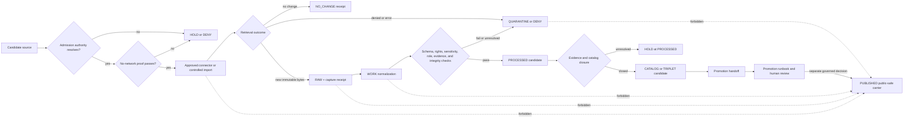

<!-- [KFM_META_BLOCK_V2]
doc_id: kfm://doc/runbook-archaeology-source-refresh
title: Archaeology Source Refresh Runbook
type: standard
subtype: operational-runbook
version: v1.0.0
prior_version: v0.1
status: draft; repository-grounded; documentation-only; live-source-execution-hold
owners:
  - "@bartytime4life — verified GitHub review route"
  - "NEEDS VERIFICATION — accountable archaeology, source, connector, rights, sensitivity, cultural-review, evidence, release, and correction stewards"
created: 2026-05-13
updated: 2026-08-24
policy_label: repository-facing; restricted-by-default; public-safe-procedure-only
current_path: docs/runbooks/archaeology/SOURCE_REFRESH_RUNBOOK.md
owning_root: docs/
responsibility: "Describe the governed operator procedure for refreshing an already-admitted archaeology source without granting source authority, activating a connector, exposing sensitive material, promoting a release, or publishing data."
truth_posture: cite-or-abstain
truth_labels: [CONFIRMED, PROPOSED, UNKNOWN, NEEDS_VERIFICATION, CONFLICTED, HOLD]
authority_class: explanatory operational procedure
authority_rank: subordinate to accepted doctrine and ADRs, source authority, contracts, schemas, policy, evidence, review, lifecycle, release, correction, and rollback records
canonical_relationship: same-path update; no sibling authority created
path_posture: PLACE
evidence_snapshot:
  repository: bartytime4life/Kansas-Frontier-Matrix
  base_ref: main
  base_commit: 6b0f0f5353754553e0ff3800206f5479b069921a
  target_prior_blob: c50bcf2f484d670f2c91745550304445852f0ffa
  source_authority_register_blob: 32729857bc8eb5001acb37b8ee8e60bcb6e0dc50
  archaeology_source_registry_readme_blob: 40f859e7b61cec8fb6e27268f2f5b38bcd57bb4f
  archaeology_connector_readme_blob: eb4b0064ba27c208473cd1fa550ab6de187ec4d9
  ingest_spec_blob: 4e41ac4f913d01ee38a18a1cf192c6be463388c4
  exact_location_policy_blob: 37e9d0a624be86ba22a9f1dfa94d99df77b953a8
  exact_location_test_blob: 302014e8f1042412a21326bfc17c413d9306a981
  archaeological_site_schema_blob: 5a1371a2fb4dc6d1a5c7b13f7c5198823ae89b40
  release_candidate_readme_blob: bc5edc7a44ea77a6b8ed25b95569646d8df72754
  promotion_runbook_blob: 6c746a4fc2977f0081025c55f6ddc08feba820f7
related:
  - ../README.md
  - ../../doctrine/directory-rules.md
  - ../../adr/ADR-0029-adopt-directory-governance-standard-v2.md
  - ../../adr/ADR-0001-schema-home--schemas-contracts-v1-is-canonical.md
  - ../../domains/archaeology/README.md
  - ../../domains/archaeology/DATA_LIFECYCLE.md
  - ../../domains/archaeology/CULTURAL_REVIEW.md
  - ../../sources/SOURCE_DESCRIPTOR_STANDARD.md
  - ../../../control_plane/source_authority_register.yaml
  - ../../../data/registry/sources/archaeology/README.md
  - ../../../connectors/archaeology/README.md
  - ../../../pipeline_specs/archaeology/README.md
  - ../../../policy/domains/archaeology/README.md
  - ../../../tests/domains/archaeology/README.md
  - ../../../release/candidates/archaeology/README.md
  - ./NO_NETWORK_TEST_RUNBOOK.md
  - ./PROMOTION_RUNBOOK.md
  - ./ROLLBACK_RUNBOOK.md
tags:
  - kfm
  - runbook
  - archaeology
  - cultural-heritage
  - source-refresh
  - source-admission
  - lifecycle
  - rights
  - sensitivity
  - exact-location-denial
  - cultural-review
  - evidence
  - quarantine
  - rollback
notes:
  - "This revision replaces no-repository assumptions with current, commit-pinned repository evidence."
  - "Tracked archaeology source YAML files are proposal placeholders, not admitted SourceDescriptor records."
  - "The source authority register is an empty projection with implementation_status ABSENT at the pinned snapshot."
  - "No executable archaeology connector, non-vacuous source-admission fixture, or live refresh entry point was verified."
  - "This runbook therefore defaults live source execution to HOLD."
  - "A source refresh may prepare a promotion candidate; only the promotion runbook and owning release authorities govern release state."
non_effects:
  - does_not_activate_sources
  - does_not_admit_source_descriptors
  - does_not_fetch_live_data
  - does_not_authorize_sensitive_access
  - does_not_approve_rights_or_cultural_use
  - does_not_create_evidence_or_proof
  - does_not_promote_release
  - does_not_deploy
  - does_not_publish
[/KFM_META_BLOCK_V2] -->

<a id="top"></a>

# Archaeology Source Refresh Runbook

> **Purpose.** Provide a fail-closed, evidence-bearing procedure for refreshing an **already-admitted** Archaeology and Cultural Heritage source through KFM's governed lifecycle, while keeping source admission, connector execution, evidence closure, human review, promotion, release, deployment, and publication separate.

> [!CAUTION]
> **Live archaeology source refresh is `HOLD` at the pinned repository snapshot.** The source-authority register has no entries, the tracked archaeology source YAML files are proposal placeholders, the connector lane has no executable connector module, the pipeline specifications are placeholders, and representative archaeology tests are non-executable docstring scaffolds. This document does not convert any of those surfaces into authority or readiness.

| Field | Current value |
|---|---|
| Document state | `draft` · repository-grounded · documentation-only |
| Repository evidence | `main@6b0f0f5353754553e0ff3800206f5479b069921a` |
| Path decision | `PLACE` — same-path modernization under the accepted `docs/runbooks/<domain>/` pattern |
| Default operational result | `HOLD` until source admission, rights, sensitivity, review routing, connector, fixtures, and rollback prerequisites are proved |
| Safe autonomous work | No-network inspection, proposal review, fixture work, validator work, and candidate packet preparation on a feature branch |
| Terminal boundary | This runbook may produce a refresh record and a promotion candidate; it does not release, deploy, promote, or publish |

**Quick navigation:** [Authority](#1-authority-scope-and-boundary) · [Current state](#2-current-repository-state) · [Outcomes](#3-outcomes-and-truth-vocabulary) · [Roles](#4-roles-and-separation-of-duties) · [Inputs](#5-inputs-and-exclusions) · [Preflight](#6-authority-freeze-and-preflight) · [Sources](#7-current-source-family-inventory) · [Lifecycle](#8-lifecycle-and-trust-boundary) · [Procedure](#9-refresh-procedure) · [Artifacts](#10-required-artifacts-and-gates) · [Validation](#11-validation-and-proof) · [Sensitivity](#12-rights-sensitivity-cultural-authority-and-log-hygiene) · [Operations](#13-no-change-retry-rate-limit-and-error-handling) · [Correction](#14-correction-withdrawal-and-rollback) · [Reasons](#15-reason-codes) · [Packet](#16-operator-record-template) · [Checklist](#17-review-and-handoff-checklist) · [Backlog](#18-verification-backlog) · [Related](#19-related-documents)

---

## 1. Authority, scope, and boundary

### 1.1 What this runbook governs

This runbook governs the recurring operational sequence for one source family and one refresh attempt:

```text
authority freeze
  -> source-admission resolution
  -> no-network proof
  -> conditional retrieval or controlled import
  -> immutable RAW capture or QUARANTINE
  -> normalization in WORK
  -> validation and policy evaluation
  -> PROCESSED candidate
  -> catalog/evidence closure candidate
  -> promotion handoff
```

It applies to source material such as inventory exports, survey records, collection records, laboratory reports, historic maps, oral-history or community-governed knowledge, remote-sensing candidates, and 3D documentation **only after** a valid source-admission decision exists.

### 1.2 What this runbook does not govern

This document does not:

- decide that a source should be admitted;
- create or amend a `SourceDescriptor`;
- populate the source-authority register;
- activate a live connector or watcher;
- grant access to exact archaeological geometry or culturally restricted knowledge;
- decide cultural authority, affiliation, ownership, significance, or consent;
- substitute a model, anomaly, map, OCR result, or generated summary for evidence;
- approve a `ReviewRecord`, `PromotionDecision`, `ReleaseManifest`, correction, or rollback;
- write directly to `data/published/`;
- authorize release, deployment, promotion, publication, or an administrative bypass.

Use [the promotion runbook](./PROMOTION_RUNBOOK.md) to evaluate bounded promotion readiness and [the rollback runbook](./ROLLBACK_RUNBOOK.md) to prepare or execute only an authorized reversal. Owning release authorities remain separate. This source-refresh runbook ends at a reviewable candidate or a recorded fail-closed outcome.

### 1.3 Directory Rules basis

The target is an existing tracked file under `docs/runbooks/archaeology/`. Accepted [ADR-0029](../../adr/ADR-0029-adopt-directory-governance-standard-v2.md) adopts the Directory Rules responsibility-root model: `docs/` owns human-facing documentation, `docs/runbooks/` owns operational procedures, and `archaeology/` is a domain segment rather than a new authority root.

**Decision:** update this file in place. Do not create a flat sibling, move the runbook, or create a parallel source, schema, policy, proof, or release home.

[Back to top](#top)

---

## 2. Current repository state

The table below distinguishes tracked structure from operational proof.

| Surface | Current evidence at the pinned commit | Bounded conclusion |
|---|---|---|
| This runbook | Existing tracked blob `c50bcf2f484d670f2c91745550304445852f0ffa` | Same-path modernization is supported. |
| Source-authority register | `control_plane/source_authority_register.yaml` declares `implementation_status: ABSENT`, `completeness: empty`, and `entries: []` | No archaeology source admission is proved by the register. |
| Archaeology source registry | Ten `*.source.yaml` files plus a README are tracked under `data/registry/sources/archaeology/` | The lane exists, but the YAML files are proposal placeholders, not complete admitted descriptors. |
| Representative descriptor | `nrhp_listings.source.yaml` contains only `status: PROPOSED`, a source-document pointer, its path, and a placeholder note | File presence does not establish source identity, rights, sensitivity, cadence, steward, activation, or admissibility. |
| Connector lane | `connectors/archaeology/` contains `.gitkeep` and `README.md` | The boundary is documented; no executable archaeology connector was verified. |
| Pipeline specifications | `ingest`, `normalize`, `validate`, `catalog`, and `publish` spec files are tracked | Representative `ingest.spec.yaml` is a proposal placeholder; executable orchestration is not proved. |
| Policy lane | Named archaeology Rego files are tracked | Representative `exact_location_deny.rego` is explicitly a `PROPOSED scaffold`; default-deny text does not prove complete policy wiring or enforcement. |
| Tests | Named archaeology test modules are tracked | Representative `test_exact_sensitive_geometry_denial.py` contains only a proposal docstring; the named test is not non-vacuous proof. |
| Source-admission fixtures | `tests/domains/archaeology/fixtures/source_admission/` contains a README and `.gitkeep` | No executable source-admission fixture was verified in that lane. |
| Schema lane | Archaeology schemas are tracked under `schemas/contracts/v1/domains/archaeology/` | Maturity is mixed; representative `archaeological_site.schema.json` is a permissive proposal scaffold with no defined properties. |
| Release-candidate lane | `release/candidates/archaeology/` contains only a README | No archaeology release candidate, release decision, or rollback target was verified there. |
| Hosted CI | Repository workflows will evaluate a pull-request head | A future green check would validate only its defined checks; it would not admit a source or authorize a refresh. |

> [!IMPORTANT]
> **Operational determination:** repository structure is materially deeper than the prior version of this runbook claimed, but source-refresh closure is not proved. The correct current action for a live source is `HOLD`, not optimistic execution.

### 2.1 Confirmed retained doctrine

The current evidence does not weaken these governing rules:

- `RAW -> WORK / QUARANTINE -> PROCESSED -> CATALOG / TRIPLETS -> PUBLISHED`;
- promotion is a governed state transition, not a file move;
- `EvidenceRef` must resolve to `EvidenceBundle` before a consequential claim is treated as supported;
- public clients use governed interfaces and released public-safe carriers, never RAW, WORK, QUARANTINE, or direct connector output;
- candidate and modeled results remain candidate or modeled until separately reviewed and promoted;
- unknown rights, sensitivity, cultural authority, review state, or location risk fail closed;
- watchers and connectors may detect, retrieve, package, and propose; they do not publish;
- receipts record execution; they do not alone prove evidence closure, review, release, or publication.

[Back to top](#top)

---

## 3. Outcomes and truth vocabulary

### 3.1 Truth labels

| Label | Meaning in this runbook |
|---|---|
| `CONFIRMED` | Verified from the pinned repository bytes or an accepted governing decision |
| `PROPOSED` | A design, future state, or requested procedure not proved as current behavior |
| `UNKNOWN` | Available evidence cannot support a stronger statement |
| `NEEDS VERIFICATION` | A concrete check is known but not closed |
| `CONFLICTED` | Two relevant surfaces disagree or imply incompatible authority |
| `HOLD` | A governed work-state block; no transition may continue |

### 3.2 Source-refresh outcomes

A connector or operator record should use a finite outcome. Do not infer success from process completion.

| Outcome | Meaning | Allowed next action |
|---|---|---|
| `ADMIT` | All source-admission and retrieval prerequisites passed for RAW capture | Write only to the approved RAW target and emit receipts |
| `QUARANTINE` | Material was preserved but one or more gates are unresolved or failed | Route to the approved quarantine target with reason codes |
| `DENY` | Policy, rights, sensitivity, cultural authority, or access rules forbid the action | Stop; emit a bounded denial record without sensitive detail |
| `NO_CHANGE` | Conditional retrieval or digest comparison proves no material source change | Emit a heartbeat/no-change receipt; do not create a new catalog or release object |
| `SKIP` | The source was intentionally not processed under a recorded rule | Record the rule and next eligible evaluation point |
| `RATE_LIMITED` | Upstream terms or response require delay | Record safe retry metadata; do not bypass controls |
| `ERROR` | The attempt could not complete reliably | Stop; preserve safe diagnostics and retry only under policy |
| `HOLD` | Required authority, ownership, evidence, review, rollback, or implementation proof is absent | Open or update a bounded follow-up; do not fetch or promote |

`ANSWER`, `ABSTAIN`, `DENY`, and `ERROR` are downstream governed-response outcomes. They are not substitutes for the source-refresh outcomes above. A successful fetch does not imply an `ANSWER`; unresolved evidence still requires `ABSTAIN`.

[Back to top](#top)

---

## 4. Roles and separation of duties

Only the GitHub review route is verified in this document. Accountable role assignments remain `NEEDS VERIFICATION`; do not replace them with invented names.

| Role | Permitted responsibilities | Prohibited responsibilities |
|---|---|---|
| Source steward | Confirm source identity, source role, cadence, authority, and supersession posture | Self-authorize missing rights or sensitivity decisions |
| Connector operator | Execute an approved retrieval/import, preserve source-native context, emit receipts, route to RAW or QUARANTINE | Activate an unadmitted source, approve release, or expose restricted content |
| Archaeology domain steward | Review domain meaning, candidate-versus-site classification, temporal and spatial interpretation | Treat contextual or modeled material as confirmed evidence without support |
| Rights steward | Resolve license, access, redistribution, attribution, embargo, and terms drift | Infer permission from public availability |
| Sensitivity steward | Classify precision and exploitation risk; require redaction, generalization, restriction, delay, or denial | Approve public exposure through styling alone |
| Authorized cultural, community, or Tribal reviewer | Apply source-specific consent, sovereignty, representation, and access obligations where required | Be substituted by a generic reviewer or an AI system |
| Evidence/proof steward | Verify reference resolution, digest closure, limitations, and proof-family separation | Treat a receipt, map, summary, or model output as root evidence |
| Release authority | Decide promotion using the promotion runbook and owning release controls | Be the sole author, connector operator, policy author, and approver for a material release |
| Correction reviewer | Classify defects, supersession, withdrawal, derivative invalidation, and rollback need | Silently mutate a released object |
| AI assistant | Summarize released public-safe evidence and draft review notes | Decide truth, rights, sensitivity, cultural authority, review, release, or exact-location disclosure |

### 4.1 Minimum separation before promotion handoff

For a material archaeology refresh:

1. the retrieval/import actor must be identifiable;
2. source, rights, sensitivity, and cultural-review responsibilities must be resolved;
3. the promotion decision must not be an automatic consequence of connector success;
4. release authority must be separate from the original source-refresh author where the owning governance requires independent review;
5. human review, CI, merge, release, deployment, promotion, and publication must remain separately recorded states.

[Back to top](#top)

---

## 5. Inputs and exclusions

### 5.1 Required inputs

A refresh attempt requires all applicable items below:

- an admitted, immutable `SourceDescriptor` reference;
- a source-authority or equivalent admission decision that resolves the descriptor;
- source-native identity and a stable source-family identifier;
- source role and authority class;
- current rights and terms review;
- sensitivity class and precision limits;
- cultural/community/Tribal review routing where source terms or subject matter require it;
- expected cadence, staleness threshold, and retry/rate-limit posture;
- approved retrieval or import method;
- previous source version, ETag, Last-Modified value, manifest digest, or content digest where available;
- an approved RAW or QUARANTINE target;
- an executable connector/importer version or an explicitly reviewed manual-import procedure;
- no-network fixtures and non-vacuous validation for the source boundary;
- a named operator and run identity;
- a correction path;
- the last known safe public release and rollback target when a downstream released surface may be affected.

Missing a required item yields `HOLD`, `QUARANTINE`, or `DENY` according to the owning policy. It never yields implicit permission.

### 5.2 Excluded material and actions

Do not place any of the following in this runbook, a public PR, logs, screenshots, branch names, commit messages, fixtures, or public artifacts:

- real exact archaeological coordinates, site perimeters, reversible location clues, or protected identifiers;
- burial, cemetery, human-remains, funerary, sacred, ceremonial, traditional-use, or culturally restricted location detail;
- confidential consultation records or restricted community knowledge;
- private-land access instructions, owner details, parcel joins, or unpublished survey locations;
- collection-security or artifact-storage detail;
- credentials, tokens, signed URLs, private endpoints, or secret-bearing headers;
- raw source payloads or restricted samples;
- a fabricated command, route, validator, schema, or receipt presented as executable fact;
- a direct connector-to-CATALOG, connector-to-PUBLISHED, or watcher-to-public path;
- an anomaly, model, OCR extraction, geocode, or AI summary relabeled as a confirmed archaeological site.

[Back to top](#top)

---

## 6. Authority freeze and preflight

Perform the authority freeze before any network access or source import. Record each result in the operator packet in [Section 16](#16-operator-record-template).

### 6.1 Repository and concurrency freeze

- [ ] Record the exact `main` commit and target runbook blob.
- [ ] Confirm the task branch starts from that exact commit or document a later rebase.
- [ ] Search open pull requests and active branches for overlapping changes to this runbook, source descriptors, connector code, policy, tests, pipeline specifications, or release candidates.
- [ ] Read path-scoped instructions and the current [runbook index](../README.md).
- [ ] Confirm the same-path `PLACE` decision remains valid under accepted Directory Rules.
- [ ] Identify changed-area workflows and required checks.
- [ ] Stop on overlapping ownership or migration unless the work is deliberately reconciled.

### 6.2 Source-admission freeze

- [ ] Resolve the proposed `SourceDescriptor` to a complete machine-readable record.
- [ ] Resolve the descriptor through the source-authority register or other accepted admission authority.
- [ ] Confirm `source_role`; do not infer it from file name or source reputation.
- [ ] Confirm rights, terms, redistribution, attribution, access, and embargo posture.
- [ ] Confirm sensitivity, precision, exploitation risk, and public-safe transform obligations.
- [ ] Confirm cultural/community/Tribal authority and reviewer routing where applicable.
- [ ] Confirm cadence, staleness threshold, upstream rate limits, and permitted retrieval method.
- [ ] Confirm correction, supersession, and withdrawal routes.
- [ ] Confirm the source is not currently suspended, denied, or under unresolved correction.

### 6.3 Implementation freeze

- [ ] Identify the exact connector or controlled import entry point and its immutable version.
- [ ] Confirm the connector can emit finite outcomes and route only to RAW, QUARANTINE, and receipt homes.
- [ ] Confirm no-network fixtures are populated and exercise success plus negative outcomes.
- [ ] Confirm policy and schema checks are non-vacuous and tied to the candidate source shape.
- [ ] Confirm receipt, digest, and diagnostic handling cannot leak restricted values.
- [ ] Confirm all output paths are responsibility-correct and non-public.
- [ ] Confirm a safe rollback target exists for any released derivative that may later be superseded.

### 6.4 Current snapshot result

At the pinned snapshot, these preflight items are not closed:

- source-authority entry;
- complete admitted descriptor;
- executable archaeology connector;
- non-placeholder pipeline specification;
- non-vacuous source-admission fixture;
- non-vacuous representative archaeology policy test;
- verified accountable stewards;
- concrete release candidate and rollback target.

**Result: `HOLD`.**

[Back to top](#top)

---

## 7. Current source-family inventory

The tracked source registry contains ten proposal placeholders. Their presence supports routing and planning only.

| Tracked placeholder | Intended source family | Current disposition |
|---|---|---|
| `artifact_collection_repository.source.yaml` | Artifact, accession, museum, repository, or collection records | `PROPOSED` · not admitted |
| `excavation_records.source.yaml` | Excavation, provenience, context, and stratigraphic records | `PROPOSED` · not admitted |
| `field_survey_forms.source.yaml` | Field survey forms and project observations | `PROPOSED` · not admitted |
| `historic_maps_plats.source.yaml` | Historic maps, plats, land records, and contextual cartography | `PROPOSED` · not admitted |
| `lab_reports.source.yaml` | Laboratory, dating, geophysics, or analytical reports | `PROPOSED` · not admitted |
| `lidar_remote_sensing.source.yaml` | LiDAR, aerial, satellite, geophysics, and anomaly candidates | `PROPOSED` · not admitted |
| `nrhp_listings.source.yaml` | Public historic-resource or listing context | `PROPOSED` · not admitted |
| `oral_history_cultural_knowledge.source.yaml` | Oral history and community-governed cultural knowledge | `PROPOSED` · not admitted |
| `state_site_inventory.source.yaml` | State inventory or historic-preservation source family | `PROPOSED` · not admitted |
| `three_d_documentation.source.yaml` | 3D documentation, photogrammetry, scan, or model source family | `PROPOSED` · not admitted |

> [!WARNING]
> **Candidate is not site.** LiDAR, remote sensing, geophysics, predictive surfaces, OCR extractions, geocodes, and 3D interpretations remain `candidate`, `modeled`, `synthetic`, or `context` according to their admitted source role. A refresh must not promote them to `ArchaeologicalSite` by renaming a type or writing a catalog record.

### 7.1 Source-role preservation

Use the accepted source-role vocabulary from the actual admitted descriptor. The following examples describe boundaries, not a new canonical enum:

| Role concept | Archaeology example | Anti-collapse rule |
|---|---|---|
| Observation | Field-recorded finding within a bounded survey method | Does not imply unrestricted precision or public release |
| Regulatory/administrative | Eligibility, inventory, compliance, accession, or repository status | Does not prove field condition, significance, affiliation, or release permission |
| Modeled/candidate | LiDAR anomaly, geophysics interpretation, predictive surface | Requires method, inputs, uncertainty, model/run references, and review |
| Aggregate | County, region, survey-area, or generalized public-safe summary | Must resist re-identification and reverse engineering |
| Context | Historic map, local history, route, land-use, or interpretive background | Cannot confirm a site alone |
| Synthetic | Demonstration, test, reconstruction, or generated representation | Requires a reality-boundary note and must never mix with evidence claims |
| Restricted | Exact site, sacred, burial, human-remains, landowner, or collection-security material | Defaults to quarantine, restriction, delay, generalization, or denial |

[Back to top](#top)

---

## 8. Lifecycle and trust boundary


```mermaid
flowchart LR
    S[Candidate source] --> A{Admission authority resolves?}
    A -- no --> H[HOLD or DENY]
    A -- yes --> N{No-network proof passes?}
    N -- no --> H
    N -- yes --> C[Approved connector or controlled import]
    C --> D{Retrieval outcome}
    D -- no change --> NC[NO_CHANGE receipt]
    D -- denied or error --> Q[QUARANTINE or DENY]
    D -- new immutable bytes --> R[RAW + capture receipt]
    R --> W[WORK normalization]
    W --> V{Schema, rights, sensitivity, role, evidence, and integrity checks}
    V -- fail or unresolved --> Q
    V -- pass --> P[PROCESSED candidate]
    P --> E{Evidence and catalog closure}
    E -- unresolved --> H2[HOLD at PROCESSED]
    E -- closed --> G[CATALOG or TRIPLET candidate]
    G --> PH[Promotion handoff]
    PH --> PR[Promotion runbook and human review]
    PR -->|separate governed decision| PUB[PUBLISHED public-safe carrier]

    C -. forbidden .-> PUB
    R -. forbidden .-> PUB
    W -. forbidden .-> PUB
    Q -. forbidden .-> PUB
```

The dotted forbidden paths are non-negotiable. Neither the browser, map, AI surface, connector, watcher, nor refresh operator reads or writes around the trust membrane.

### 8.1 Stage ownership

| Stage | Owning responsibility | This runbook's role |
|---|---|---|
| Source admission | Source registry, rights, sensitivity, policy, and authorized review | Verify closure; never create authority |
| Retrieval/import | `connectors/` or accepted controlled-import implementation | Describe operator sequence and required outputs |
| RAW/WORK/QUARANTINE/PROCESSED | `data/` lifecycle roots plus pipelines and validators | Require correct handoffs and reasoned failures |
| Catalog/evidence closure | Catalog, evidence, proof, and graph/triplet owners | Verify references and digest closure before handoff |
| Promotion/release | `release/`, promotion policy, review records, and release authority | Hand off only |
| Public UI/API/AI | Governed runtime and released public-safe artifacts | Post-handoff smoke only; no direct source access |

[Back to top](#top)

---

## 9. Refresh procedure

Each step ends with an explicit result and artifacts. A missing prerequisite stops the run.

### Step 0 — Freeze authority and record the attempt

**Precondition:** none.

**Actions:**

1. Complete [Section 6](#6-authority-freeze-and-preflight).
2. Allocate a unique refresh-run identifier.
3. Record repository commit, descriptor reference and digest, connector/importer version, policy version, schema version, operator, and intended source version.
4. Record the previously known source version and any currently released derivative that may be affected.
5. Stop if the descriptor or admission decision cannot be resolved.

**Output:** operator packet with `HOLD` or `READY_FOR_NO_NETWORK_PROOF`.

### Step 1 — Prove the source boundary without network access

**Precondition:** a complete admitted descriptor and an identified connector or controlled importer.

**Actions:**

1. Run the source-boundary fixture suite with network egress denied.
2. Exercise at least:
   - valid admission;
   - unknown-rights hold;
   - exact-location quarantine or denial;
   - candidate-not-site rejection;
   - digest mismatch;
   - no-change;
   - rate-limit or retry;
   - safe error logging.
3. Confirm fixtures are synthetic or rights-cleared and contain no real protected location or identity.
4. Confirm each negative fixture fails for the expected reason, not any arbitrary process failure.
5. Record commands, versions, fixture digests, and results.

**Output:** bounded no-network validation evidence or `HOLD`.

> [!NOTE]
> The tracked source-admission fixture lane is not populated with executable fixtures at the pinned snapshot. A README and `.gitkeep` do not satisfy this step.

### Step 2 — Resolve current rights, sensitivity, and source state

**Precondition:** Step 1 passes.

**Actions:**

1. Recheck terms and rights at refresh time; do not rely only on the prior admission date.
2. Recheck sensitivity and precision posture against the incoming version and intended use.
3. Recheck cultural/community/Tribal authority, consent, embargo, confidentiality, and representation obligations where applicable.
4. Check active correction, withdrawal, supersession, or source suspension.
5. Confirm the retrieval interval and request method comply with upstream terms.

**Output:** `READY_TO_FETCH`, `HOLD`, or `DENY`.

### Step 3 — Retrieve or import conditionally

**Precondition:** `READY_TO_FETCH`.

**Actions:**

1. Use the approved connector or controlled-import procedure.
2. Prefer conditional retrieval using ETag, Last-Modified, source manifest, object version, or prior digest when supported.
3. Apply bounded timeout, retry, rate-limit, redirect, size, content-type, and authentication controls defined by the owning implementation and source terms.
4. Never place credentials, restricted locators, protected identifiers, or geometry in logs.
5. Preserve source-native identifiers, timestamps, caveats, and headers required for provenance.
6. Produce one finite outcome.

**Outputs:**

- `NO_CHANGE` — emit heartbeat/no-change receipt and stop;
- `RATE_LIMITED`, `SKIP`, `DENY`, or `ERROR` — record safe diagnostics and stop;
- `ADMIT` — continue to immutable capture;
- `QUARANTINE` — preserve only in the approved quarantine path.

### Step 4 — Capture immutable RAW or QUARANTINE material

**Precondition:** new material was retrieved or imported.

**Actions:**

1. Compute the configured content digest over the preserved source bytes or immutable source reference.
2. Record byte length, media type, source-native version, retrieval/import time, connector/importer version, and descriptor reference.
3. Write only to the approved RAW or QUARANTINE target.
4. Emit a capture/run receipt that distinguishes source bytes from metadata and derived transformations.
5. Verify the write and digest before downstream processing.

**Fail-closed triggers:** digest mismatch, unexpected type or size, unresolved rights, missing source identity, sensitive value in an unsafe channel, or unauthorized location.

### Step 5 — Normalize in WORK

**Precondition:** verified RAW capture.

**Actions:**

1. Preserve source, observation, valid, publication, retrieval, effective, correction, and transaction times as distinct fields where present.
2. Preserve source role and authority; do not upgrade or rewrite role during normalization.
3. Normalize identity deterministically where the owning contract allows.
4. Preserve CRS, coordinate uncertainty, scale, georeferencing method, and source precision without exposing protected values.
5. Normalize references, rights, sensitivity, and review-routing metadata.
6. Route unresolved or invalid records to QUARANTINE with reason codes.
7. Emit transform and working validation records under their owning object families.

**Output:** WORK candidate, QUARANTINE record, or `ERROR`.

### Step 6 — Validate and apply policy

**Precondition:** normalized WORK candidate.

**Actions:**

1. Validate schema shape using the actual active schema, not a permissive scaffold.
2. Validate source-role anti-collapse and candidate-versus-site boundaries.
3. Validate geometry, time, identity, evidence references, rights, sensitivity, review routing, and integrity.
4. Evaluate policy with the exact policy version and input digest recorded.
5. Apply only authorized sensitivity transforms.
6. Record transform parameters and reasons so the public-safe derivative is reproducible and auditable.
7. Keep original restricted material in its authorized controlled lane; public-safe derivatives do not replace source truth.
8. Require all negative checks to be non-vacuous.

**Output:** `PROCESSED_CANDIDATE`, QUARANTINE, `DENY`, `HOLD`, or `ERROR`.

### Step 7 — Close evidence and catalog candidate

**Precondition:** validated PROCESSED candidate.

**Actions:**

1. Resolve every consequential `EvidenceRef` to an admissible `EvidenceBundle`.
2. Confirm source, run, transform, validation, policy, and artifact digests close.
3. Record limitations, uncertainty, spatial/temporal scope, source role, sensitivity transform, and stale-state behavior.
4. Build catalog or triplet projections only from the validated candidate.
5. Verify graph, index, tile, map, search, and summary derivatives remain downstream carriers.
6. Hold at PROCESSED if any reference, digest, right, review obligation, or rollback prerequisite is unresolved.

**Output:** `PROMOTION_CANDIDATE` or `HOLD_AT_PROCESSED`.

### Step 8 — Hand off; do not self-promote

**Precondition:** complete promotion candidate.

**Actions:**

1. Prepare the promotion packet required by [the promotion runbook](./PROMOTION_RUNBOOK.md).
2. Identify the required domain, rights, sensitivity, cultural/community/Tribal, evidence, and release reviewers.
3. Record the prior release and rollback target.
4. Record correction, withdrawal, supersession, cache/index invalidation, and derivative recompile obligations.
5. Stop. Do not write to PUBLISHED from this procedure.

**Output:** reviewable promotion candidate. Human review, CI, merge, release, deployment, promotion, and publication remain pending unless separately recorded.

### Step 9 — Post-run record

For every terminal outcome:

1. record start/end times and the finite outcome;
2. record exact inputs, versions, digests, commands or entry points, and safe diagnostics;
3. record objects created, changed, quarantined, or intentionally not created;
4. record unresolved items and the next authorized actor;
5. verify no restricted values entered logs, PR text, reports, or public artifacts;
6. link any correction, follow-up, or rollback work;
7. preserve the prior safe state.

[Back to top](#top)

---

## 10. Required artifacts and gates

Names below are object-family concepts. The operator must use the actual accepted contract/schema names and paths resolved from the repository; this table does not create them.

| Gate | Minimum evidence | Pass result | Fail-closed result |
|---|---|---|---|
| Authority freeze | Commit, descriptor digest, admission decision, ownership, overlap check, implementation version | Proceed to no-network proof | `HOLD` |
| Source admission | Complete descriptor, role, rights, sensitivity, cadence, access, review routing | `ADMITTED_SOURCE_RESOLVED` | `HOLD` or `DENY` |
| No-network proof | Non-vacuous positive and negative fixtures, deterministic results, no egress | `SOURCE_BOUNDARY_PROVED` | `HOLD` |
| Retrieval/import | Approved entry point, safe request/import metadata, finite outcome | `ADMIT` or `NO_CHANGE` | `QUARANTINE`, `DENY`, `RATE_LIMITED`, or `ERROR` |
| RAW capture | Immutable bytes/reference, digest, source identity, capture/run receipt | `RAW_CAPTURED` | QUARANTINE |
| Normalization | Transform record, working validation, preserved role/time/CRS/rights/sensitivity | `WORK_NORMALIZED` | QUARANTINE or `ERROR` |
| Validation/policy | Schema, geometry, time, identity, role, evidence, rights, sensitivity, integrity, negative fixtures | `PROCESSED_CANDIDATE` | WORK/QUARANTINE, `DENY`, or `HOLD` |
| Evidence/catalog closure | Resolved evidence, catalog record, digest closure, limitations, uncertainty | `PROMOTION_CANDIDATE` | `HOLD_AT_PROCESSED` |
| Promotion handoff | Review packet, prior release, rollback and correction routes | Hand off to promotion authority | `HOLD_AT_CATALOG` |
| Correction/rollback | Defect record, affected objects, prior safe state, invalidation scope | Superseding candidate or rollback request | Withdraw/restrict and escalate |

### 10.1 Object-family separation

Keep these families distinct:

- source descriptor and admission decision;
- source bytes or immutable reference;
- capture/run/transform/validation/redaction/aggregation receipts;
- validation report;
- policy decision;
- evidence reference and evidence bundle;
- catalog record and graph/triplet projection;
- review record;
- promotion decision;
- release manifest;
- correction or withdrawal notice;
- rollback card;
- published artifact.

A receipt is not a proof. A proof is not a policy decision. A policy decision is not human review. Review is not release. A commit or passing check is not promotion or publication.

[Back to top](#top)

---

## 11. Validation and proof

### 11.1 Documentation-change validation

For changes to this runbook, use repository-native checks where available:

```bash
python tools/validators/docs/link-check/check_links.py \
  --repo-root . \
  --format text \
  docs/runbooks/archaeology/SOURCE_REFRESH_RUNBOOK.md

python -m unittest discover \
  --start-directory tests/validators/docs/link-check \
  --pattern 'test_*.py' \
  --verbose

make repository-topology
```

The pull-request head is also subject to repository workflows such as `link-check` and `validator-suite`. Report exact-head results separately from review or merge state.

A green documentation or topology check proves only the bounded check. It does not prove a source is admitted, a connector is operational, rights are clear, sensitive handling is safe, evidence is closed, or release is authorized.

### 11.2 Refresh-execution validation

Before any live source refresh, the owning implementation must prove all applicable checks below with real executable fixtures:

| Required check | Positive proof | Negative proof |
|---|---|---|
| Descriptor resolution | Complete admitted descriptor resolves by immutable identity | Placeholder, missing, stale, or unregistered descriptor yields `HOLD` |
| Rights and terms | Reviewed rights permit the intended operation | Unknown, expired, incompatible, or embargoed terms deny or hold |
| Exact-location protection | Protected values remain in controlled storage and logs stay clean | Exact or reversible protected location in public output or logs fails |
| Candidate-not-site | Candidate remains candidate until reviewed evidence supports a transition | Type rename or unreviewed candidate-to-site promotion fails |
| Cultural authority | Required consent/reviewer/representation obligations resolve | Missing or conflicting authority holds or denies |
| Digest integrity | Source bytes, receipts, transforms, and candidate artifacts close | Digest mismatch quarantines |
| No-change | Unchanged source emits a no-change record only | Unchanged source creates new catalog/release churn and fails |
| Public no-leak | Public clients can resolve only released public-safe carriers | RAW, WORK, QUARANTINE, candidate, or restricted store access fails |
| Evidence closure | Every consequential claim resolves to an admissible evidence bundle | Unresolved reference produces `ABSTAIN` or `HOLD` |
| Rollback/correction | Prior safe state and derivative invalidation can be demonstrated | Unknown rollback target blocks promotion handoff |
| Log hygiene | Diagnostics retain reason and correlation without sensitive values | Sensitive identifiers, geometry, secrets, or access details in logs fail |
| Network posture | No-network tests cannot reach DNS, HTTP, storage, or model endpoints | Any unexpected egress fails the test |

### 11.3 Current proof gaps

At the pinned snapshot:

- representative archaeology test modules are placeholders;
- the source-admission fixture directory has no executable fixture payload;
- representative policy and pipeline files are scaffolds;
- source descriptors are placeholders;
- no executable connector was verified.

Therefore a file name, importable test module, parsable Rego file, or schema meta-validation must not be reported as source-refresh proof.

[Back to top](#top)

---

## 12. Rights, sensitivity, cultural authority, and log hygiene

### 12.1 Fail-closed posture

| Risk | Required default |
|---|---|
| Unknown or changed rights/terms | `HOLD` or `DENY` |
| Exact site or protected identifier | Restrict, quarantine, generalize only under approved transform, or deny |
| Burial, human remains, funerary object, sacred or ceremonial place | Fail closed; require the owning cultural/community/Tribal and legal/governance process |
| Looting, vandalism, trespass, theft, disturbance, or collection-security risk | Restrict and minimize; public release requires explicit review |
| Private landowner or access detail | Fail closed unless purpose, rights, minimization, and release posture are recorded |
| Oral history or community-governed knowledge | Preserve consent, authority, access, allowed use, and representation obligations |
| Candidate anomaly or predictive surface | Keep candidate/modeled with method and uncertainty |
| Historic/georeferenced map | Preserve source vintage and georeferencing uncertainty; proximity is not confirmation |
| Cross-domain join | Review re-identification, harmful inference, and authority before release |
| Unknown review or rollback state | `HOLD` |

A missing decision is not `ALLOW`. Client-side hiding, style filters, obscured labels, and undocumented coordinate jitter are not sufficient controls.

### 12.2 Transform records

An authorized public-safe transform must record:

- input object and version;
- policy and reviewer references;
- reason and risk class;
- transform method and parameters;
- spatial and temporal precision before and after;
- information removed or generalized;
- reproducibility limits;
- output digest;
- allowed audience and use;
- correction and rollback references.

The transformed derivative remains downstream of the controlled evidence. It does not replace or silently mutate the source record.

### 12.3 Safe diagnostics

Logs and reports may include:

- run ID;
- source-family ID;
- descriptor reference or opaque identifier;
- stage;
- finite outcome;
- non-sensitive reason code;
- safe retry time;
- tool version;
- truncated digest prefix where policy permits;
- correlation ID.

They must not include:

- protected coordinates or reversible geometry clues;
- confidential source locators;
- site, burial, sacred-place, collection-security, landowner, or private-person identifiers;
- credentials, cookies, tokens, signed URLs, or authorization headers;
- raw response bodies;
- restricted filenames where the name itself discloses protected information.

[Back to top](#top)

---

## 13. No-change, retry, rate-limit, and error handling

### 13.1 No-change

A conditional response, immutable version match, or digest match may yield `NO_CHANGE` only when the comparison basis is recorded.

A `NO_CHANGE` outcome must:

- emit a heartbeat/no-change record;
- preserve the prior source and release state;
- create no new catalog entry solely for identical bytes;
- create no new release manifest solely for identical bytes;
- update operational freshness only where the owning contract allows;
- remain distinguishable from `SKIP`, `ERROR`, and `RATE_LIMITED`.

### 13.2 Retry

Retry only when:

- source terms permit it;
- the error class is retryable;
- the retry limit and delay are bounded;
- the same run or a linked retry identity is preserved;
- idempotency is understood;
- the retry cannot duplicate RAW or downstream objects silently.

Do not retry rights, sensitivity, cultural-authority, descriptor, schema, evidence, review, or rollback failures without an authorized state change.

### 13.3 Rate limits

On `RATE_LIMITED`:

1. record a safe retry time or backoff class;
2. preserve upstream terms and response metadata without secrets;
3. do not rotate identities, bypass controls, distribute requests to evade limits, or scrape around an approved interface;
4. do not downgrade the result to `ERROR` or pretend freshness was achieved;
5. surface staleness according to the owning policy.

### 13.4 Errors

An error record must distinguish:

- request/import failure;
- authentication/authorization failure;
- integrity failure;
- parser/format failure;
- schema failure;
- geometry/time/identity failure;
- policy denial;
- review hold;
- evidence/catalog closure failure;
- storage/write failure;
- post-write verification failure.

Unexpected errors stop the transition. “Fail closed” means the prior safe state remains; it does not mean every arbitrary crash is accepted as proof that the intended control worked.

[Back to top](#top)

---

## 14. Correction, withdrawal, and rollback

### 14.1 Before promotion

For an unpromoted refresh candidate:

1. stop downstream work;
2. preserve the candidate and reason in WORK or QUARANTINE as policy permits;
3. invalidate incomplete derived candidates;
4. retain the prior catalog and published state unchanged;
5. open or update the bounded correction task;
6. rerun from the earliest affected gate after authority changes.

### 14.2 After a released derivative is affected

Do not silently overwrite the release.

1. Identify the affected source version, evidence bundles, catalog records, public carriers, caches, indexes, graph projections, summaries, and AI receipts.
2. Classify the defect: rights drift, sensitivity miss, cultural-authority conflict, evidence gap, source-role error, integrity mismatch, geometry/time error, transform defect, stale source, or runtime exposure.
3. Apply the safest immediate posture: restrict, withdraw, mark stale, deny, or restore the prior safe release.
4. Preserve the original release record.
5. Emit the owning correction or withdrawal record.
6. Prepare a superseding refresh candidate through this runbook.
7. Use [the rollback runbook](./ROLLBACK_RUNBOOK.md) for the governed reversal and [the promotion runbook](./PROMOTION_RUNBOOK.md) for any superseding release.
8. Record derivative invalidation and recompile obligations.

### 14.3 Rollback boundary

Rollback is a governed state transition, not “copy the old file back.” It requires:

- an identified prior safe release;
- verified artifact digests;
- an authorized rollback decision;
- public-surface disablement or state change;
- cache/index/tile/graph/summary invalidation as applicable;
- audit records;
- a correction path;
- post-rollback verification.

If the prior safe state or rollback authority cannot be identified, the promotion handoff remains `HOLD`.

[Back to top](#top)

---

## 15. Reason codes

Use the owning canonical reason-code vocabulary when one exists. Until then, the codes below are **PROPOSED interoperability labels** for operator records; they do not amend policy.

| Reason code | Trigger | Required disposition |
|---|---|---|
| `source_not_admitted` | No accepted admission decision resolves | `HOLD`; do not fetch |
| `descriptor_placeholder` | Tracked file is proposal metadata rather than a complete descriptor | `HOLD` |
| `descriptor_unresolved` | Descriptor identity or version cannot be resolved | `HOLD` |
| `owner_unresolved` | Accountable steward/reviewer route is absent | `HOLD` |
| `rights_unknown` | Rights or intended use not verified | `HOLD` or `DENY` |
| `rights_expired_or_changed` | Terms changed or validity window ended | Stop; reassess admission and derivatives |
| `cultural_authority_unresolved` | Required consent, authority, or reviewer is missing/conflicted | `HOLD` or `DENY` |
| `sensitivity_unresolved` | Precision, exploitation risk, or transform obligation unresolved | QUARANTINE or `DENY` |
| `connector_absent` | No approved executable connector/import path | `HOLD` |
| `fixture_absent_or_vacuous` | Required no-network proof is missing or non-executable | `HOLD` |
| `policy_scaffold_only` | Policy file presence does not prove enforcement | `HOLD` |
| `schema_scaffold_only` | Candidate depends on permissive/undefined schema shape | `HOLD` |
| `rate_limited` | Upstream requests delay | `RATE_LIMITED` |
| `no_change` | Conditional/version/digest comparison is unchanged | `NO_CHANGE`; no churn |
| `hash_mismatch` | Bytes and declared digest disagree | QUARANTINE; integrity event |
| `unexpected_content` | Type, size, encoding, or package differs from admission | QUARANTINE |
| `schema_invalid` | Candidate fails active schema | WORK or QUARANTINE |
| `geometry_invalid` | Geometry invalid or repair would change identity/meaning | `HOLD` for steward review |
| `candidate_promoted_without_review` | Candidate/model is relabeled as site | QUARANTINE or `DENY` |
| `evidence_unresolved` | Evidence reference cannot resolve | `HOLD_AT_PROCESSED`; downstream `ABSTAIN` |
| `review_missing` | Required human review absent | `HOLD_AT_CATALOG` |
| `rollback_target_unknown` | No prior safe state or reversal path | `HOLD_AT_CATALOG` |
| `sensitive_log_leak` | Restricted values enter logs or public review surfaces | Stop, contain, rotate secrets if applicable, and open incident/correction work |
| `public_boundary_violation` | RAW/WORK/QUARANTINE/restricted data reaches public path | Disable exposure, initiate correction/rollback, investigate |
| `kill_switch_engaged` | Owning operational control blocks the lane | Stop all affected transitions |

[Back to top](#top)

---

## 16. Operator record template

This YAML is a **documentation template**, not a canonical schema and not an executable configuration. Store the completed record only in the accepted owning artifact family.

```yaml
source_refresh_run:
  run_id: "<stable-run-id>"
  domain: archaeology
  repository:
    base_commit: "<40-character-commit-sha>"
    branch_or_work_ref: "<ref>"
  source:
    family_id: "<non-sensitive-family-id>"
    descriptor_ref: "<immutable-descriptor-ref>"
    descriptor_digest: "sha256:<digest>"
    admission_decision_ref: "<accepted-authority-ref>"
    admitted: false
    source_role: "<resolved-role>"
    prior_version_ref: "<prior-version-or-null>"
    expected_version_ref: "<expected-version-or-null>"
  authority:
    source_steward_ref: "<role-or-review-ref>"
    rights_review_ref: "<review-ref>"
    sensitivity_review_ref: "<review-ref>"
    cultural_review_ref: "<review-ref-or-not-applicable-with-reason>"
    connector_or_importer_ref: "<immutable-version-ref>"
    policy_ref: "<immutable-policy-ref>"
    schema_ref: "<immutable-schema-ref>"
  preflight:
    overlap_check: "<pass|hold>"
    no_network_proof_ref: "<proof-ref>"
    rollback_target_ref: "<prior-safe-release-or-not-applicable>"
    correction_path_ref: "<ref>"
  retrieval:
    method: "<conditional-http|package-import|other-approved-method>"
    started_at: "<RFC3339>"
    completed_at: "<RFC3339>"
    prior_etag_or_digest: "<safe-value-or-null>"
    outcome: "<ADMIT|QUARANTINE|DENY|NO_CHANGE|SKIP|RATE_LIMITED|ERROR|HOLD>"
    reason_codes: []
  outputs:
    raw_capture_ref: "<ref-or-null>"
    quarantine_ref: "<ref-or-null>"
    run_receipt_ref: "<ref-or-null>"
    transform_receipt_refs: []
    validation_report_refs: []
    policy_decision_refs: []
    evidence_bundle_refs: []
    catalog_candidate_refs: []
    promotion_candidate_ref: "<ref-or-null>"
  safety:
    sensitive_values_logged: false
    network_scope_as_approved: false
    public_surface_changed: false
  follow_up:
    next_actor_role: "<role>"
    open_items: []
    release_state: "unchanged"
    deployment_state: "unchanged"
    publication_state: "unchanged"
```

The `admitted`, `network_scope_as_approved`, and output fields must reflect evidence, not desired state. At the pinned repository snapshot, a truthful initial packet would set `admitted: false`, `outcome: HOLD`, and `public_surface_changed: false`.

[Back to top](#top)

---

## 17. Review and handoff checklist

### 17.1 Before retrieval

- [ ] Exact repository commit and target bytes recorded.
- [ ] No overlapping PR or active migration owns the same surface.
- [ ] Complete admitted descriptor resolved.
- [ ] Source-authority entry or accepted equivalent resolved.
- [ ] Source role and authority class fixed.
- [ ] Rights, terms, access, attribution, redistribution, and embargo current.
- [ ] Sensitivity and precision posture current.
- [ ] Cultural/community/Tribal authority and review routing resolved where applicable.
- [ ] Approved connector/importer version identified.
- [ ] No-network positive and negative fixtures pass non-vacuously.
- [ ] Approved RAW/QUARANTINE targets identified.
- [ ] Correction and rollback routes recorded.
- [ ] Logs and diagnostics reviewed for sensitive-data minimization.

### 17.2 Before catalog/promotion handoff

- [ ] Capture and transform lineage closes.
- [ ] Source role remains unchanged.
- [ ] Candidate-versus-site rule passes.
- [ ] Active schema and policy versions recorded.
- [ ] Geometry, time, identity, rights, sensitivity, and integrity checks pass.
- [ ] Every consequential evidence reference resolves.
- [ ] Limitations and uncertainty are visible.
- [ ] Public-safe transform is documented and reproducible where used.
- [ ] No RAW, WORK, QUARANTINE, restricted, or candidate path is public.
- [ ] Prior safe release and rollback target resolve.
- [ ] Required reviewers are identified and independent where required.
- [ ] Promotion packet is complete.
- [ ] Source refresh stops before release-state mutation.

### 17.3 PR handoff

- [ ] Changed files match the stated scope.
- [ ] Exact-head validation is reported separately from human review.
- [ ] Introduced failures are distinguished from inherited baseline failures.
- [ ] No claim of source activation, release, deployment, promotion, or publication is made.
- [ ] Rollback is “close/revert the focused PR or commit,” not an undocumented file swap.
- [ ] Remaining `UNKNOWN`, `NEEDS VERIFICATION`, and `HOLD` items are visible.

[Back to top](#top)

---

## 18. Verification backlog

| ID | Verification item | Evidence required to close | Current state |
|---|---|---|---|
| `ARCH-SR-001` | Populate and govern source-authority entries | Accepted register entries with owner, rights, sensitivity, role, and non-effects | `HOLD` |
| `ARCH-SR-002` | Replace proposal YAMLs with complete descriptors | Schema-valid descriptor records plus review and admission decisions | `HOLD` |
| `ARCH-SR-003` | Identify accountable stewards and reviewers | CODEOWNERS or accepted governance records plus current role assignments | `NEEDS VERIFICATION` |
| `ARCH-SR-004` | Implement or identify one controlled source connector/importer | Executable code, pinned dependencies, source terms, tests, safe finite outcomes | `HOLD` |
| `ARCH-SR-005` | Replace placeholder pipeline specs | Executable specs tied to implementation, schemas, policy, outputs, and tests | `HOLD` |
| `ARCH-SR-006` | Prove policy enforcement | Non-vacuous policy tests and exact-head CI evidence for expected deny/hold reasons | `HOLD` |
| `ARCH-SR-007` | Prove active schema fitness | Non-permissive schema, semantic contract, valid/invalid fixtures, consumer evidence | `HOLD` |
| `ARCH-SR-008` | Populate source-admission fixtures | Synthetic public-safe positive and negative fixture payloads | `HOLD` |
| `ARCH-SR-009` | Prove no-public-leak boundary | Integration tests showing public clients cannot resolve internal lifecycle stores | `NEEDS VERIFICATION` |
| `ARCH-SR-010` | Prove cultural-authority routing | Accepted reviewer/consent/access protocol and synthetic denial/hold tests | `NEEDS VERIFICATION` |
| `ARCH-SR-011` | Define public-safe geometry profiles | Accepted sensitivity policy, transform recipes, receipts, and re-identification tests | `NEEDS VERIFICATION` |
| `ARCH-SR-012` | Establish one promotion candidate and rollback target | Complete candidate packet, prior safe state, correction and rollback drill evidence | `HOLD` |
| `ARCH-SR-013` | Verify source-refresh observability | Safe structured outcomes, metrics, logs, redaction, retention, and incident routing | `NEEDS VERIFICATION` |
| `ARCH-SR-014` | Reconcile stale sibling runbooks and empty lane README | Same-path repository-grounded updates without authority collision | `PROPOSED follow-up` |
| `ARCH-SR-015` | Confirm required hosted checks and ruleset coupling | Exact-head workflow results and current ruleset evidence | `NEEDS VERIFICATION` |

The backlog is not permission to execute around missing controls. Each `HOLD` remains blocking for the affected transition.

[Back to top](#top)

---

## 19. Related documents

### Governing placement and architecture

- [Directory Rules](../../doctrine/directory-rules.md)
- [ADR-0029 — adopted Directory Rules v2](../../adr/ADR-0029-adopt-directory-governance-standard-v2.md)
- [ADR-0001 — schema-home decision package](../../adr/ADR-0001-schema-home--schemas-contracts-v1-is-canonical.md) — still proposed as a dedicated ADR; the Directory Rules placement default is separately adopted
- [Runbook index](../README.md)

### Archaeology domain and source boundaries

- [Archaeology domain README](../../domains/archaeology/README.md)
- [Archaeology data lifecycle](../../domains/archaeology/DATA_LIFECYCLE.md)
- [Archaeology cultural review](../../domains/archaeology/CULTURAL_REVIEW.md)
- [Source Descriptor Standard](../../sources/SOURCE_DESCRIPTOR_STANDARD.md)
- [Source-authority register](../../../control_plane/source_authority_register.yaml)
- [Archaeology source registry](../../../data/registry/sources/archaeology/README.md)
- [Archaeology connector boundary](../../../connectors/archaeology/README.md)
- [Archaeology pipeline-spec lane](../../../pipeline_specs/archaeology/README.md)
- [Archaeology policy lane](../../../policy/domains/archaeology/README.md)
- [Archaeology test lane](../../../tests/domains/archaeology/README.md)
- [Archaeology release-candidate lane](../../../release/candidates/archaeology/README.md)

### Sibling procedures

- [No-network test runbook](./NO_NETWORK_TEST_RUNBOOK.md)
- [Promotion runbook](./PROMOTION_RUNBOOK.md)
- [Rollback runbook](./ROLLBACK_RUNBOOK.md)

[Back to top](#top)

---

## Appendix A — Current execution-readiness worksheet

| Readiness question | Pinned-snapshot answer | Operator action |
|---|---|---|
| Is the target path valid? | `CONFIRMED` | Update in place |
| Is an archaeology source admitted in the authority register? | No entry is present | `HOLD` |
| Are the tracked source YAMLs complete descriptors? | No; they are proposal placeholders | `HOLD` |
| Is an executable archaeology connector present? | Not verified; lane contains README and `.gitkeep` | `HOLD` |
| Are the pipeline specs executable? | Representative file is a proposal placeholder | `HOLD` |
| Are source-admission fixtures populated? | No executable payload verified | `HOLD` |
| Are representative archaeology tests non-vacuous? | Representative named test is only a proposal docstring | `HOLD` |
| Is exact-location policy fully wired and proved? | Rego scaffold exists; enforcement not proved | `HOLD` |
| Is schema fitness proved? | Mixed maturity; representative core schema is permissive scaffold | `HOLD` |
| Is a release candidate and rollback target present? | Only release-candidate README verified | `HOLD` |
| Can documentation modernization proceed? | Yes, on a feature branch with changed-area validation | Proceed to draft PR |
| Can live source refresh proceed? | No | Remain `HOLD` |

---

## Appendix B — Material preserved and corrected from v0.1

### Preserved

- archaeology's restricted-by-default posture;
- exact-location, burial, human-remains, sacred-site, collection-security, private-land, and looting-risk controls;
- candidate-versus-confirmed distinction;
- source-family inventory;
- role separation and cultural-review requirement where applicable;
- lifecycle gates;
- no-change heartbeat behavior;
- EvidenceRef-to-EvidenceBundle closure;
- distinct receipts, proofs, reviews, release, correction, and rollback objects;
- sensitivity transforms;
- correction and rollback procedures;
- structured failure reasons;
- operator preflight checklist.

### Corrected

- replaced the “no mounted repository” premise with commit-pinned current evidence;
- changed the target path from `PROPOSED` to `CONFIRMED PLACE`;
- corrected the ADR-0001 filename and separated its proposed lifecycle state from the adopted Directory Rules schema-route default;
- distinguished tracked scaffolds from executable implementation;
- recorded the empty source-authority register;
- recorded placeholder descriptors, connector absence, placeholder pipeline specs, vacuous tests, and absent release candidate;
- removed the fabricated `kfm ...` command skeleton;
- narrowed this runbook to source refresh and promotion handoff instead of duplicating release authority;
- made `HOLD` the truthful default for live refresh;
- separated exact-head CI, human review, merge, release, deployment, promotion, and publication.

---

### Document status

- **Path:** `docs/runbooks/archaeology/SOURCE_REFRESH_RUNBOOK.md`
- **Version:** `v1.0.0`
- **Evidence snapshot:** `main@6b0f0f5353754553e0ff3800206f5479b069921a`
- **Operational state:** documentation modernized; live-source execution remains `HOLD`
- **Release, deployment, promotion, publication:** unchanged

[Back to top](#top)
