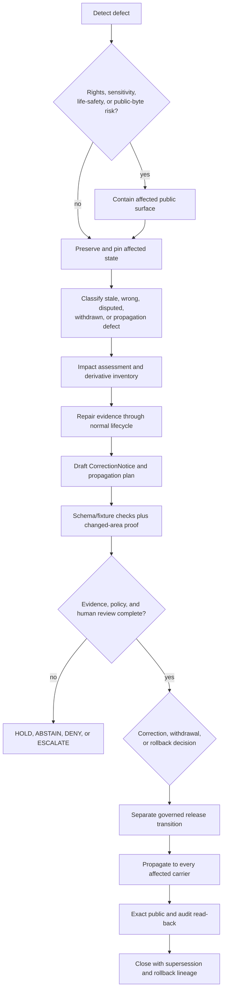

<!-- [KFM_META_BLOCK_V2]
doc_id: kfm://doc/runbooks/atmosphere/correction
title: Atmosphere / Air Correction Runbook
type: runbook
version: v1.0
status: draft; repository-grounded; documentation-only
owners:
  - "@bartytime4life — verified GitHub review route"
  - "NEEDS VERIFICATION — Atmosphere steward, correction reviewer, release authority, and independent reviewer assignments"
created: "UNKNOWN — the prior scaffold carried no creation date"
updated: 2026-08-23
policy_label: public
current_path: docs/runbooks/atmosphere/CORRECTION_RUNBOOK.md
owning_root: docs/
responsibility: "Guide evidence-backed correction of already released Atmosphere / Air material without silently mutating history or granting release authority."
truth_posture: cite-or-abstain
truth_labels: [CONFIRMED, PROPOSED, UNKNOWN, "NEEDS VERIFICATION", CONFLICTED, HOLD]
evidence_snapshot:
  repository: bartytime4life/Kansas-Frontier-Matrix
  base_ref: main
  base_commit: b48dcaeec00058cc7dbcf3b33444ee3ace6d4b20
  prior_blob: f1bd1edfe7574fcd6a047088e66ed28c5ff80f61
  directory_rules_adoption: ADR-0029
  correction_schema_status: PROPOSED_PLACEHOLDER
  correction_validator_scope: BOUNDED_SCHEMA_AND_JSON_SAFETY_ONLY
related:
  - docs/runbooks/README.md
  - docs/domains/atmosphere/README.md
  - docs/domains/atmosphere/MISSING_OR_PLANNED_FILES.md
  - docs/doctrine/directory-rules.md
  - docs/adr/ADR-0029-adopt-directory-governance-standard-v2.md
  - docs/doctrine/lifecycle-law.md
  - docs/doctrine/trust-membrane.md
  - docs/doctrine/corrections-are-first-class.md
  - docs/architecture/publication/CORRECTION.md
  - contracts/correction/correction_notice.md
  - schemas/contracts/v1/correction/correction_notice.schema.json
  - schemas/contracts/v1/domains/atmosphere/correction_notice.schema.json
  - fixtures/correction/correction_notice/
  - tools/validators/correction/validate_correction_notice.py
  - tools/validators/correction/validate_correction_impact_assessment.py
  - tools/validators/correction/validate_correction_propagation_plan.py
  - tests/domains/atmosphere/
  - apps/workers/src/correction_worker/
  - apps/review-console/src/features/correction/
  - policy/rights/correction/
  - release/
tags: [kfm, runbook, atmosphere, air, correction, supersession, withdrawal, rollback, evidence, release]
notes:
  - "Replaces the short PROPOSED scaffold at the same tracked path."
  - "This document changes no contract, schema, policy, fixture, validator, release record, public route, deployment, promotion, or publication state."
  - "The generic CorrectionNotice validator is executable, but it enforces only the current placeholder schema and bounded JSON-input safety."
  - "The Atmosphere-specific CorrectionNotice schema is also a placeholder and points to a domain contract, fixture lane, and validator that were not present at the evidence snapshot."
  - "Singular and plural release correction lanes coexist; this runbook does not resolve their canonical relationship."
[/KFM_META_BLOCK_V2] -->

<a id="top"></a>

# Correction Runbook

> Repository-grounded procedure for containing, documenting, reviewing, and superseding defective **Atmosphere / Air** material after it has crossed the `PUBLISHED` boundary—without silently editing the prior record, collapsing evidence into prose, or treating a pull request as release authority.

> [!IMPORTANT]
> A correction is a **named, evidence-backed, reviewable state transition**. It is not a file overwrite, Git revert, cache purge, corrected map style, merged pull request, or newly generated artifact by itself. The original release and its evidence lineage remain inspectable unless an applicable rights, privacy, sensitivity, or security control requires restricted access.

> [!WARNING]
> KFM Atmosphere is **not** an emergency-alert or life-safety authority. Atmosphere may carry observations, forecasts, smoke context, and official advisory context, but it must not originate public safety instructions. A correction involving advisory or emergency language must contain the KFM-authored surface and route users to the Hazards lane and the official issuing authority.

## Status and evidence boundary

| Surface | Current evidence at `main@b48dcae…` | Operational meaning |
|---|---|---|
| This path | Tracked short `PROPOSED scaffold`, prior blob `f1bd1edf…` | This v1.0 update supplies a substantive same-path procedure; it does not make the procedure operationally admitted |
| Placement | Accepted ADR-0029 adopts Directory Rules v2; `docs/runbooks/` owns human operational procedures | `PLACE` for a same-path documentation update; no new authority root or migration |
| GitHub review route | `.github/CODEOWNERS` routes unmatched paths to `@bartytime4life` | Review routing is CONFIRMED; independent review and stewardship assignments remain NEEDS VERIFICATION |
| Generic correction semantics | `contracts/correction/correction_notice.md` is a draft semantic contract | Useful meaning and invariants exist; the contract records unresolved placement and implementation questions |
| Generic machine shape | `schemas/contracts/v1/correction/correction_notice.schema.json` requires only `id`, allows additional properties, and is marked `PROPOSED` | Schema PASS proves only the present minimal shape |
| Generic notice validator and fixtures | Canonical no-network validator plus one minimal valid and one invalid fixture are present | Bounded schema and JSON-input safety are executable; correction completion is not |
| Impact-assessment proof | A proposed-inactive semantic contract, schema, validator, fixtures, and tests enforce a fixed ten-carrier inventory with `COMPLETE`, `HOLD`, or `ERROR` | Fixture-only closure proof; no carrier is changed |
| Propagation-plan proof | A proposed fixture-only contract, schema, validator, fixtures, tests, and workflow model finite `PASS`, `ABSTAIN`, `DENY`, and `ERROR` outcomes | Plan coherence only; no alias, cache, release, history, or public route is mutated |
| Atmosphere machine shape | `schemas/contracts/v1/domains/atmosphere/correction_notice.schema.json` is a second `id`-only placeholder | Domain-specific correction semantics are not machine-enforced |
| Atmosphere contract / validator / fixture targets | The domain placeholder names paths that were not present at the snapshot | Domain-specific correction validation is NEEDS VERIFICATION |
| Correction policy | `policy/correction/` was not present; `policy/rights/correction/` exists as README + `.gitkeep` only | Generic correction policy is absent and rights-correction policy is inactive placeholder guidance |
| Correction worker | `apps/workers/src/correction_worker/` is a README plus comment-only Python placeholder with no runtime binding | No detector, queue, writer, invalidator, or publisher is implemented there |
| Review Console correction feature | The bounded feature lane is README-only and the package has no correction route, component, API client, recorder, or tests | Review support remains proposed; no correction or release decision can be issued there |
| Release correction storage | `release/correction/`, `release/corrections/`, and `release/correction_notices/` coexist; `release/corrections/atmosphere/` contains only its README and `.gitkeep` | Storage and canonical-lane identity are CONFLICTED; follow `release/README.md` and a current release-authority decision rather than guessing |
| Atmosphere proof | Four bounded synthetic fixture profiles are documented as executable | They prove selected anti-collapse and no-network behavior, not a correction workflow, live-source validity, review, release, or publication |
| Runtime / public propagation | No exact Atmosphere correction execution, governed route, cache invalidation, or published notice was established by this documentation update | UNKNOWN until verified from the owning implementation and exact release evidence |

**Document authority:** explanatory operational guidance only. Contracts own meaning; schemas own machine shape; policy and review own admissibility; evidence objects own support; release objects own release state; applications and pipelines own behavior. This runbook owns none of those transitions.

**Quick navigation:** [Purpose](#1-purpose-and-scope) · [Authority](#2-authority-and-repository-fit) · [Maturity](#3-current-maturity-and-conflicts) · [Triggers](#4-when-to-open-a-correction) · [Defects](#5-atmosphere-defect-matrix) · [Roles](#6-roles-and-separation-of-duties) · [Inputs](#7-required-inputs-and-preconditions) · [Procedure](#8-correction-procedure) · [Artifacts](#9-correction-ledger-and-object-family-separation) · [Disposition](#10-correction-stale-state-withdrawal-and-rollback) · [Validation](#11-validation-and-proof) · [Failures](#12-fail-closed-states-and-escalation) · [Examples](#13-illustrative-atmosphere-cases) · [Security](#14-rights-sensitivity-privacy-and-public-notices) · [Completion](#15-definition-of-done) · [Maintenance](#16-maintenance-correction-and-rollback-of-this-runbook) · [References](#17-related-current-surfaces)

---

## 1. Purpose and scope

Use this runbook when a defect, dispute, source revision, rights change, sensitivity change, validator finding, rendering problem, or evidence failure affects Atmosphere material that is already represented as released or publicly served.

The procedure is designed to preserve five boundaries:

1. **History remains inspectable.** Do not silently replace the prior release, evidence bundle, manifest, notice, review, or receipt.
2. **Evidence remains sovereign.** A correction narrative may explain the change but cannot substitute for the corrected evidence, validation, policy, review, or release objects.
3. **Publication remains governed.** A corrected candidate follows the normal lifecycle and release gates. A correction lane is not a shortcut from source or WORK material to a public surface.
4. **Atmosphere meanings remain distinct.** AQI is not concentration; AOD is not PM2.5; modeled fields are not observations; low-cost sensor output is not regulatory evidence merely because it is calibrated or visually plausible.
5. **Public delivery remains bounded.** Public clients receive released public-safe material through governed delivery. They do not gain direct access to RAW, WORK, QUARANTINE, restricted evidence, source credentials, or direct model runtimes during a correction.

### In scope

- Triage and containment of a released Atmosphere defect.
- Classification of stale, wrong, disputed, withdrawn, or superseded material.
- Evidence preservation and impact analysis.
- Drafting and bounded validation of a `CorrectionNotice`.
- Review, policy, release, propagation, read-back, and closure handoffs.
- Atmosphere-specific checks for source role, knowledge character, units, time, caveats, rights, sensitivity, and life-safety boundaries.
- Selection between correction, temporary stale-state handling, withdrawal, or rollback review.

### Out of scope

- Correcting pre-publication candidates that never reached a governed release state.
- Inventing a release identifier, source authority, rights grant, reviewer, policy result, or public route.
- Implementing schemas, policy, validators, pipelines, cache invalidation, UI behavior, or release machinery in Markdown.
- Approving, merging, releasing, deploying, promoting, or publishing the corrected candidate.
- Issuing emergency instructions or replacing official air-quality, weather, smoke, or hazard authorities.
- Resolving the singular/plural correction-lane conflict under `release/`.
- Reclassifying a domain, object family, or authority owner without the required governance decision.

[Back to top](#top)

---

## 2. Authority and repository fit

This file stays at `docs/runbooks/atmosphere/CORRECTION_RUNBOOK.md`. It explains a domain-bounded operational procedure and therefore belongs under the human-readable `docs/` responsibility root, with `runbooks/` as the procedure lane and `atmosphere/` as the domain segment.

| Concern | Owning surface | This runbook may |
|---|---|---|
| Placement | Accepted Directory Rules and ADR-0029 | Explain why this same-path document belongs here |
| Atmosphere scope and denials | Atmosphere domain documentation, contracts, schemas, and adopted policy | Apply verified boundaries without redefining them |
| Correction meaning | `contracts/correction/` and any later adopted domain contract | Point to semantic requirements and disclose gaps |
| Machine shape | `schemas/contracts/v1/correction/` and governed successors | Name the current schema and its proof limit |
| Admissibility | Applicable policy plus authorized review | Describe required handoffs and fail closed when unresolved |
| Evidence | EvidenceRef, EvidenceBundle, source, receipt, proof, and validation authorities | Require references and preserve lineage |
| Release state | `release/` and its governed decision objects | Request or document a decision; never grant it |
| Executable behavior | Validators, tests, packages, pipelines, apps, runtime, workflows, and infrastructure | Invoke verified bounded checks; never claim unverified effects |
| Public communication | Governed public-safe release and application surfaces | Require a safe notice and read-back evidence |

> [!CAUTION]
> Documentation cannot promote an object by calling it “corrected,” “approved,” “released,” or “published.” Those words describe separate states that require evidence from their owning authorities.

### Source lineage of this path

The prior scaffold cited `docs/domains/atmosphere/MISSING_OR_PLANNED_FILES.md`. That register is useful lineage, not operational authority. Its older “not mounted” and proposed-path assumptions must yield to current repository evidence. This runbook retains the register as origin context while grounding all implementation claims in the pinned repository snapshot.

[Back to top](#top)

---

## 3. Current maturity and conflicts

### 3.1 What is implemented

The repository currently has:

- A detailed draft semantic contract for `CorrectionNotice`.
- A generic Draft 2020-12 placeholder schema requiring `id`.
- A canonical validator at `tools/validators/correction/validate_correction_notice.py`.
- A compatibility entry point at `tools/validators/validate_correction_notice.py`.
- Deterministic valid and invalid fixtures under `fixtures/correction/correction_notice/`.
- Fixture-only `CorrectionImpactAssessment` semantics, schema, validator, fixtures, and tests for the fixed carrier inventory `CATALOG`, `API`, `MAP`, `TILE`, `SEARCH`, `GRAPH`, `EXPORT`, `AI`, `CACHE`, and `DOCUMENTATION`.
- Fixture-only `CorrectionPropagationPlan` semantics, schema, validator, fixtures, tests, and workflow wiring for deterministic plan validation.
- A parallel Atmosphere-specific placeholder schema.
- Bounded Atmosphere fixture/test profiles for precipitation, knowledge character, low-cost sensor qualification, and observed-versus-modeled separation.
- Draft release correction, correction-notice, and Atmosphere correction README surfaces.

### 3.2 What remains unproved

The current repository evidence does **not** establish:

- A complete, adopted `CorrectionNotice` field contract in machine shape.
- A domain-specific Atmosphere correction contract, validator, or fixture profile at the paths declared by the domain placeholder schema.
- Correction-specific policy implementation under `policy/correction/`; the existing rights-correction lane is placeholder-only.
- An executable Correction Worker or Review Console correction feature.
- Independent correction-review capacity or enforced author/reviewer separation.
- One canonical release correction storage lane.
- A complete propagation engine covering governed API state, maps, tiles, caches, search, exports, graph projections, indexes, AI receipts, and public notices.
- An executed Atmosphere correction drill tied to an immutable release.
- Release, deployment, promotion, or publication of any correction.

### 3.3 Conflict posture

Treat these as explicit constraints, not invitations to choose by convenience:

| Conflict | Required posture |
|---|---|
| Generic versus Atmosphere placeholder schemas | Do not merge their meanings in prose. Validate against the schema explicitly selected by the owning contract and release process |
| `release/correction/` versus `release/corrections/` versus `release/correction_notices/` | Record candidate paths in the case ledger; obtain a current release-authority placement decision before writing a new trust-bearing record |
| Draft semantic richness versus minimal schema enforcement | Satisfy the semantic review checklist, but report schema PASS only as minimal shape proof |
| CODEOWNERS route versus independent review | Use the verified route for GitHub review; do not describe it as independent approval |
| Older doctrine examples versus current repository objects | Prefer current bytes and current schemas; preserve older material only as lineage or clearly labeled proposal |

[Back to top](#top)

---

## 4. When to open a correction

Open a correction case when material has already crossed, or is represented as having crossed, the governed publication boundary and one of the following is true:

- The evidence no longer resolves or no longer supports the public claim.
- The source role, knowledge character, unit, averaging period, time facet, geometry, or uncertainty was misstated.
- Rights, consent, redistribution, sensitivity, or access posture changed.
- A released artifact was built from the wrong source version, model run, correction method, station identity, or geography version.
- A validator, policy check, review record, release manifest, proof, or digest is missing, contradicted, or later found invalid.
- The governed API, map, Evidence Drawer, export, search result, or generated answer presents a materially different meaning from the released evidence.
- Public advisory context crosses into KFM-authored life-safety instruction.
- A public correction, supersession, withdrawal, or rollback was applied without complete lineage.

### Stale versus wrong

| State | Meaning | Immediate action | Full correction? |
|---|---|---|---|
| **Stale** | The material was supportable for its declared window, but freshness or validity has expired | Surface a stale/abstaining posture through the owning runtime and open refresh review | Only when review finds a substantive defect or prior freshness claim was wrong |
| **Wrong** | The material is incorrect, unsupported, misleading, impermissible, or policy-inadmissible | Contain the affected public surface; preserve evidence; open this procedure | Yes |
| **Disputed** | Admissible reviewers or evidence sources disagree materially | Preserve the dispute, narrow or abstain where consequence warrants, and route review | Usually; final disposition may be correction, caveat, no action, or withdrawal |
| **Unavailable** | A source or service is temporarily unreachable but the released record is not disproved | Preserve the last supportable release and expose availability/freshness state | No, unless evidence closure or rights can no longer be defended |
| **Withdrawn** | Public use is no longer allowed or supportable | Remove public routing through governed release action while preserving restricted audit | Yes, with public-safe notice when permitted |

The sibling `STALE_STATE_RUNBOOK.md` is still a scaffold at the evidence snapshot. Use it only as a placeholder reference; do not defer a material correction merely because the stale-state procedure is incomplete.

[Back to top](#top)

---

## 5. Atmosphere defect matrix

Choose one primary defect class for the correction ledger and record all material secondary classes. The labels below are operator classifications for this procedure; they are not asserted as current schema enums.

| Defect | Atmosphere example | First containment | Evidence needed before supersession |
|---|---|---|---|
| Evidence gap | A public PM2.5 claim cites an unresolved EvidenceRef or a removed source capture | ABSTAIN or withdraw only the affected claim | Resolvable evidence lineage, validation, review, and release references |
| Source-role collapse | Preliminary report, modeled field, remote-sensing product, or low-cost sensor is presented as regulatory observation | Deny the upcast and contain dependent derivatives | Correct SourceDescriptor/source role and downstream impact inventory |
| AQI/concentration collapse | AQI category or index is labeled as µg/m³ or ppb concentration | Remove the false equivalence | Correct parameter, unit, averaging period, and evidence |
| AOD/PM2.5 collapse | Aerosol optical depth raster is presented as measured surface PM2.5 | Withdraw or relabel the affected layer/claim | Product identity, retrieval/model method, uncertainty, and public-safe caveat |
| Modeled/observed collapse | ForecastContext is displayed as an AirObservation | Contain the claim and any generated summary | Model-run identity, generated/valid times, lineage, uncertainty, and role |
| Low-cost sensor qualification | Corrected sensor value lacks correction identity, caveat, confidence, limitations, or environmental inputs | Hold public qualification; preserve raw/corrected distinction | Pinned correction method, inputs, evaluation, transferability/drift posture, and review |
| Unit or averaging defect | PM2.5, ozone, precipitation, temperature, or wind uses the wrong unit or averaging window | Mark affected values unavailable or wrong | Source unit, target unit, conversion method, averaging period, validation receipt |
| Temporal defect | Observed, generated, valid, retrieval, processing, or release time is collapsed or incorrect | Mark stale or withdraw according to consequence | Correct time facets, source version, validity window, and impacted releases |
| Geometry or precision defect | Station, smoke, raster, or derived geometry is mislocated or exposed more precisely than allowed | Disable or generalize the public geometry | Correct CRS/geometry, sensitivity decision, redaction/generalization evidence |
| Rights or terms defect | Redistribution rights narrow or a source credential/terms assumption was wrong | Deny affected public use and preserve restricted audit | Current rights evidence and policy/reviewer decision |
| Advisory boundary defect | KFM-generated text converts official context into life-safety instruction | Disable the KFM-authored instruction immediately | Official-source reference, Hazards handoff, corrected public-safe context |
| Validation or policy defect | A released item would fail the governing validator or policy decision | Hold/withdraw affected route | Re-run result at exact candidate bytes and authorized disposition |
| Release/manifest defect | Public bytes do not match the release manifest, digest, or selected rollback target | Freeze pointer movement and contain uncertain public state | Immutable byte/digest comparison, manifest lineage, release-authority decision |
| Rendering/API defect | Map legend, popup, API field, export, or Evidence Drawer changes the evidence meaning | Disable or revert the affected presentation | Corrected implementation, exact-head tests, release linkage, public read-back |
| Generated-answer defect | Focus Mode or another generated surface emits an uncited, stale, or source-role-collapsed claim | Invalidate/withhold the answer; preserve underlying evidence | EvidenceBundle resolution, policy result, generated receipt where applicable, corrected runtime proof |
| Propagation defect | A correction is recorded but stale tiles, indexes, caches, exports, or summaries remain reachable | Mark correction incomplete and contain inconsistent surfaces | Complete derivative inventory and exact read-back for every affected carrier |

> [!IMPORTANT]
> Containment should be as narrow as safety permits, but rights, sensitivity, harmful precision, life-safety overreach, or uncertain public bytes fail closed. Do not keep a risky surface live merely to avoid a temporary gap.

[Back to top](#top)

---

## 6. Roles and separation of duties

Named accountable roles for Atmosphere correction remain NEEDS VERIFICATION. Use role descriptions in the ledger and the verified CODEOWNERS route for repository review without pretending routing proves authorization.

| Role | Responsibility | Boundary |
|---|---|---|
| Detector | Report the defect and preserve the first observable evidence | Does not decide release disposition |
| Atmosphere steward | Confirm object meaning, source role, units, time, caveats, and domain scope | Does not invent rights or release authority |
| Evidence/source steward | Resolve source identity, provenance, rights evidence, and affected EvidenceBundles | Does not approve its own policy-significant repair when separation is required |
| Correction author | Assemble impact assessment, proposed notice, corrected candidate, and propagation plan | Must not silently apply public state |
| Correction reviewer | Challenge classification, evidence support, scope, and no-loss lineage | CODEOWNERS assignment alone is not independent review |
| Policy/sensitivity reviewer | Decide rights, sensitivity, access, redaction, generalization, or denial where applicable | Policy result remains separate from release approval |
| Release authority | Decide supersession, withdrawal, rollback, pointer movement, and public notice state | A runbook, commit, or PR cannot substitute |
| Runtime/application owner | Implement and verify API, map, cache, index, export, or generated-surface propagation | Cannot reinterpret evidence meaning |
| Docs/public-notice reviewer | Ensure the public explanation is accurate, bounded, and safe | Notice prose is not evidence |
| Incident/Hazards handoff | Own life-safety or official-advisory escalation | Atmosphere remains context-only |

For a material correction, record who authored, who reviewed, who made the policy decision, and who made the release decision. When one person fills multiple roles, disclose that fact and any accepted exception rather than labeling the result independent.

[Back to top](#top)

---

## 7. Required inputs and preconditions

Do not begin public-state mutation until the correction ledger can identify the affected state precisely.

### Required identification

- Stable correction case identifier. The current schemas do not mandate a format; do not invent a canonical one.
- Exact repository, release, manifest, artifact, layer, route, claim, answer, or export identifiers.
- Immutable digests or object IDs for affected bytes when available.
- Original public URL or governed route and the observation time of the defect.
- SourceDescriptor/source version, EvidenceRef/EvidenceBundle, validation, policy, review, and release references that supported the original state.
- Atmosphere object family, source role, knowledge character, parameter, unit, averaging period, time facets, geometry, and sensitivity posture.
- The last known safe release or an explicit statement that no verified rollback target exists.
- Initial list of downstream carriers: API, UI, map layer, tile set, index, search result, export, cache, graph projection, catalog entry, documentation, and generated answer.

### Required safety preflight

- Do not paste credentials, API keys, private endpoints, signed URLs, restricted payloads, or sensitive exact locations into issues, PRs, public notices, or this runbook.
- Separate the public-safe summary from restricted evidence and remediation detail.
- Preserve the original record before changing aliases, manifests, or public routes.
- Confirm the correction does not rely on an unaccepted governance proposal.
- Confirm the proposed work has a rollback or forward-fix path.
- Inspect triggered automation before pushing implementation that could release, deploy, promote, publish, expose secrets, or mutate administration.

### Stop before mutation when

- The affected release or public bytes cannot be identified.
- The canonical evidence or writable release authority cannot be resolved.
- Rights, sensitivity, privacy, harmful precision, or life-safety risk cannot be bounded.
- A concurrent actor is changing the same release, alias, or trust-bearing record.
- The correction would create a second writable authority.
- The candidate cannot be validated proportionately to its consequence.
- The only proposed route depends on untrusted code with credentials or unrestricted network access.

[Back to top](#top)

---

## 8. Correction procedure

The procedure separates containment, evidence repair, review, release, and publication. Completing an earlier step does not imply a later state.



### Step 0 — Contain urgent exposure

For rights, sensitivity, harmful precision, life-safety overreach, credential exposure, or uncertain public-byte integrity, contain the affected route, layer, field, answer, export, or cache through the authorized operational owner before completing a polished diagnosis.

Record:

- who authorized containment;
- exact scope and time;
- public behavior after containment;
- whether unaffected surfaces remain available;
- how restoration will be verified.

Containment is not the final correction and does not erase the original record.

### Step 1 — Preserve and pin the affected state

Capture immutable evidence of what was served:

- release and manifest identity;
- artifact and carrier digests;
- source and evidence references;
- policy/review/validation references;
- public response, map state, export, or answer as safely reproducible;
- first-known and last-known affected times;
- exact repository and runtime revisions where available.

Do not overwrite the defective object to make later comparison easier.

### Step 2 — Classify the defect

Decide:

1. stale, wrong, disputed, unavailable, or withdrawn;
2. primary and secondary defect classes from §5;
3. scope: one field, claim, object, layer, release, source family, route, or cross-domain derivative;
4. consequence: informational, bounded, material, rights/sensitivity, or integrity-significant;
5. initial public posture: continue with caveat, stale/abstain, deny, withdraw, or immediate rollback review.

When evidence is insufficient, record `UNKNOWN` or `NEEDS VERIFICATION`; do not force a confident class.

### Step 3 — Build the impact assessment

Use the proposed-inactive semantic contract at `contracts/correction/correction_impact_assessment.md`. Its fixture-only profile requires exactly one canonical row for each of these carriers:

1. `CATALOG`
2. `API`
3. `MAP`
4. `TILE`
5. `SEARCH`
6. `GRAPH`
7. `EXPORT`
8. `AI`
9. `CACHE`
10. `DOCUMENTATION`

For each carrier, declare whether it is affected, the required action, stable reason codes, and affected artifact references. Also identify:

- affected releases, manifests, claims, artifacts, and evidence bundles;
- source and dataset versions;
- temporal and geographic extent;
- rights/sensitivity implications;
- whether the defect existed at release time or emerged later;
- whether prior releases share the same defect;
- the narrowest safe containment and the safest known rollback target.

`COMPLETE`, `HOLD`, and `ERROR` are fixture-profile outcomes. `COMPLETE` requires approved review state, a policy-decision reference, and a rollback-target reference, but it still proves only declared inventory closure. The assessment does not mutate any carrier or grant authority.

### Step 4 — Freeze the propagation plan

Use the proposed, fixture-only `contracts/correction/correction_propagation_plan.md` to make the dependency inventory deterministic. Its finite validator outcomes are `PASS`, `ABSTAIN`, `DENY`, and `ERROR`; even `PASS` does not prove a downstream system consumed or executed the plan. For each affected carrier, record:

| Carrier | Current identifier/digest | Intended action | Owner | Verification evidence |
|---|---|---|---|---|
| Governed API response | Exact route/version | Replace, withdraw, narrow, or abstain | Runtime owner | Exact response read-back |
| Map layer / style / popup | Layer and style revision | Rebuild, relabel, remove, or generalize | Explorer/map owner | Visual + contract/runtime check |
| Tiles / raster / PMTiles / COG | Immutable carrier digest | Rebuild or withdraw | Data/map owner | Digest and manifest comparison |
| Catalog / search / graph / index | Record/index revision | Reindex, mark superseded, or remove public pointer | Owning service | Query/read-back |
| Cache / mirror / export | Cache key or export ID | Invalidate or supersede | Delivery owner | Expiry/purge/read-back evidence |
| Generated answer / AI receipt | Answer and receipt ID | Invalidate, abstain, or regenerate from released evidence | Governed-AI owner | Runtime envelope and evidence links |
| Documentation / notice | Stable public reference | Add correction/supersession explanation | Docs owner | Link and rendered-content review |

Include only carriers that actually exist and are affected. An exhaustive-looking speculative list is not closure.

### Step 5 — Repair evidence through the normal lifecycle

New or corrected source material enters through the ordinary governed path:

```text
RAW -> WORK / QUARANTINE -> PROCESSED -> CATALOG / TRIPLET -> PUBLISHED
```

Do not:

- edit a published artifact in place;
- promote a connector response directly;
- reuse a stale validation or policy decision for materially changed bytes;
- relabel modeled data as observed;
- infer a rights grant from public accessibility;
- publish a generated explanation before its supporting release exists.

If no admissible replacement evidence exists, the correct outcome may remain ABSTAIN, DENY, WITHDRAW, or HOLD.

### Step 6 — Draft the `CorrectionNotice`

Use `contracts/correction/correction_notice.md` for semantic review. At minimum, the draft should make these facts inspectable even though the current schema does not enforce them all:

- stable notice identity;
- affected release, claims, assets, routes, or answers;
- primary reason and defect class;
- evidence/source references supporting the correction;
- correction author and required review state;
- public-safe summary;
- supersession, withdrawal, or rollback relationship;
- propagation-plan reference;
- policy and release-decision references when they exist;
- restricted-detail handling.

> [!CAUTION]
> The generic current schema requires only `id`. A JSON file that passes schema validation with only that field is not a complete correction notice under the semantic contract.

Do not target the Atmosphere-specific placeholder schema merely because the file exists. Its declared domain contract, fixture lane, and validator were absent at the evidence snapshot.

### Step 7 — Validate the candidate and notice

Run the bounded generic fixture profile and the checks appropriate to the changed Atmosphere behavior. See §11.

Record each check as `PASS`, `FAIL`, `PENDING`, `NOT_RUN`, `NOT_APPLICABLE`, or `UNKNOWN`, and distinguish:

- failures introduced by the correction;
- defects the correction repairs;
- inherited baseline failures;
- unrelated failures;
- unobserved behavior.

A schema PASS, fixture PASS, build PASS, or green hosted workflow does not prove review, release, propagation, or publication.

### Step 8 — Obtain evidence, policy, and human review

The review packet should include:

- pinned affected and corrected bytes;
- defect classification;
- impact assessment;
- propagation plan;
- notice draft;
- validation results;
- unresolved unknowns;
- rollback target and restoration criteria;
- rights/sensitivity disposition where applicable.

GitHub review routing is only routing. Record the actual reviewer, decision scope, conflicts, and any lack of independence.

### Step 9 — Choose the governed disposition

The release authority—not this runbook—chooses among:

- superseding correction;
- withdrawal;
- rollback to a prior safe release;
- continued stale/abstaining state while evidence is repaired;
- no action after evidence-backed review;
- escalation for unresolved authority, rights, sensitivity, or integrity risk.

Keep the CorrectionNotice, ReviewRecord, PolicyDecision, ReleaseManifest, RollbackCard, ValidationReport, receipts, proofs, and published carriers distinct.

### Step 10 — Execute a separate release transition

A reviewed correction candidate must traverse the applicable promotion/release procedure. Verify:

- corrected artifacts and evidence are immutable and digest-pinned;
- manifest and evidence references resolve;
- required policy and human decisions apply to the exact bytes;
- the prior record remains inspectable;
- the rollback target is credible;
- no public route reads candidate or internal stores directly.

A branch, commit, pull request, merge, GitHub release, artifact upload, or successful workflow is not this transition.

### Step 11 — Propagate without partial truth

Apply the approved propagation plan across every affected carrier. If some carriers cannot be updated safely, keep the correction open and expose a consistent fail-closed posture rather than serving a mix of corrected and defective meanings.

Do not delete stale audit history merely because a public alias moved.

### Step 12 — Verify exact read-back

Verify both trust-bearing records and public behavior:

- new release/manifest/correction identities and digests;
- old-to-new and new-to-old lineage;
- public-safe notice;
- governed API response;
- map/Evidence Drawer state where affected;
- tile, export, search, cache, graph, index, and generated-answer state where affected;
- no direct access to restricted or unreleased stores;
- rollback target still resolves;
- restricted evidence remains restricted.

Record the exact revision and time of each read-back.

### Step 13 — Close and monitor

Close only after the definition of done in §15 is met. Preserve residual risks and follow-up items. Watchers may detect recurrence or drift, but they do not approve, release, or publish.

[Back to top](#top)

---

## 9. Correction ledger and object-family separation

Maintain one case ledger that links—not collapses—the required object families.

| Family | What it proves or records | What it does not prove |
|---|---|---|
| Defect report | A problem was observed | That the report is correct |
| CorrectionImpactAssessment | Scope and consequence analysis | Release approval |
| CorrectionPropagationPlan | Intended downstream repair and verification | That propagation occurred |
| SourceDescriptor / DatasetVersion | Source identity, role, version, and source-side posture | Public admissibility by itself |
| EvidenceRef / EvidenceBundle | Support and lineage for consequential claims | Policy or release approval |
| ValidationReport / receipts / proofs | Executed checks at identified bytes | Human review, release, or publication |
| CorrectionNotice | Named correction, affected scope, reason, public-safe explanation, and lineage links | Corrected artifact, policy decision, or release decision |
| SupersessionNotice | Old/new relationship where applicable | Public pointer movement by itself |
| ReviewRecord | Human review outcome and scope | Policy or release authority beyond its contract |
| PolicyDecision | Allow, deny, restrict, hold, or abstain disposition | Shape validation or release completion |
| ReleaseManifest / release decision | Governed release state for immutable objects | Deployment or public reachability unless separately verified |
| RollbackCard / rollback record | Authorized reversal target and execution lineage | Correction of downstream public reliance by itself |
| Redaction/generalization receipt | Sensitive-field transformation | Authority to reveal restricted original content |
| Published carrier | Public-safe materialization | Sovereign truth without its evidence and release closure |
| Public notice | Human-readable correction visibility | Evidence or approval |

### Storage-path rule

Do not create a new correction record merely by selecting whichever current `release/` lane looks most specific. The snapshot contains singular, plural, and notice lanes with acknowledged overlap. Before writing a trust-bearing record:

1. inspect `release/README.md`;
2. inspect the relevant lane README;
3. check current Directory Rules and drift registers;
4. obtain a current placement decision when the lane relationship remains unresolved;
5. avoid writing the same authority object to more than one lane.

A compatibility copy, if ever required, must be generated or explicitly one-way and must not become independently writable.

[Back to top](#top)

---

## 10. Correction, stale state, withdrawal, and rollback

| Situation | Preferred action | Public posture | Separate authority required |
|---|---|---|---|
| Freshness window expired; prior claim was valid | Stale-state handling and source refresh | Visible stale/ABSTAIN posture as governed | Runtime/policy/source-refresh owners |
| Substantive defect with admissible replacement | Superseding correction | Prior record marked superseded; corrected release served | Review, policy as applicable, release authority |
| Rights or sensitivity no longer permits public use | Withdrawal, redaction/generalization, or denial | Public-safe notice without restricted detail | Rights/sensitivity review and release authority |
| Defect is severe and prior release is safer | Rollback plus correction lineage | Prior safe release or fail-closed state | Rollback/release authority |
| No safe prior release exists | Withdraw or abstain while rebuilding | No unsupported fallback | Release authority and affected policy owners |
| Rendering-only defect with unchanged evidence | Correct implementation and release the corrected carrier as required | Accurate rendering tied to same or successor release according to governing contract | Application/release owner |
| User report is not substantiated | Preserve review result; no public mutation | No action or bounded clarification | Correction reviewer |
| Public bytes differ from manifest and state is uncertain | Contain, investigate integrity, and escalate | Fail closed until bytes and authority are reconciled | Release/integrity authority |

### Correction is not rollback

A correction produces a reviewed successor or withdrawal posture. A rollback changes the active release target to a prior safe state. A severe incident may require both:

1. rollback or withdrawal for immediate safety;
2. evidence repair and a superseding correction for durable recovery.

Use `ROLLBACK_RUNBOOK.md` for rollback mechanics, but verify its current commands and paths before execution; it remains a draft document and contains older proposal-era assumptions.

### Correction is not source refresh

A source refresh may produce new evidence. It does not automatically establish that a published claim was wrong, issue a notice, invalidate derivatives, or authorize a successor release. Use `SOURCE_REFRESH_RUNBOOK.md` for the source-side procedure and this runbook for post-publication correction lineage.

### Correction is not promotion

The correction packet may become a promotion candidate. It is not promoted merely because the packet is complete. Use `PROMOTION_RUNBOOK.md` and current release authority for the separate transition.

[Back to top](#top)

---

## 11. Validation and proof

### 11.1 Bounded `CorrectionNotice` validation

When repository dependencies are installed in an isolated environment, the current canonical fixture command is:

```bash
PYTHONDONTWRITEBYTECODE=1 KFM_NO_NETWORK=1 \
  python tools/validators/correction/validate_correction_notice.py --fixtures
```

To validate a specific candidate against the current generic placeholder schema:

```bash
PYTHONDONTWRITEBYTECODE=1 KFM_NO_NETWORK=1 \
  python tools/validators/correction/validate_correction_notice.py \
  path/to/correction-notice.json
```

The compatibility entry point is:

```bash
PYTHONDONTWRITEBYTECODE=1 KFM_NO_NETWORK=1 \
  python tools/validators/validate_correction_notice.py --fixtures
```

A PASS proves only:

- bounded, readable JSON object input;
- no duplicate keys or non-finite JSON numbers;
- size within the validator limit;
- conformance to the current generic placeholder schema;
- correct polarity of the current minimal fixture pair.

It does **not** prove semantic completeness, evidence closure, policy approval, human review, supersession, withdrawal, propagation, rollback, release, deployment, promotion, or publication.

### 11.2 Fixture-only impact and propagation validation

The current impact-assessment profile can be validated with:

```bash
PYTHONDONTWRITEBYTECODE=1 KFM_NO_NETWORK=1 \
  python -m pytest -q \
  tests/validators/correction/test_correction_impact_assessment.py
```

```bash
PYTHONDONTWRITEBYTECODE=1 KFM_NO_NETWORK=1 \
  python tools/validators/correction/validate_correction_impact_assessment.py \
  fixtures/contracts/v1/correction/correction_impact_assessment/valid/*.json
```

The current propagation-plan profile can be validated with:

```bash
PYTHONDONTWRITEBYTECODE=1 KFM_NO_NETWORK=1 \
  python -m unittest \
  tests.validators.test_validate_correction_propagation_plan -v
```

```bash
PYTHONDONTWRITEBYTECODE=1 KFM_NO_NETWORK=1 \
  python tools/validators/correction/validate_correction_propagation_plan.py \
  --fixtures
```

These profiles are deterministic planning proof. They create no correction authority and perform no cache invalidation, alias repoint, release, publication, or history deletion.

### 11.3 Atmosphere bounded checks

Run only the profiles affected by the correction. The current Atmosphere test README documents these exact no-network commands:

```bash
PYTHONDONTWRITEBYTECODE=1 KFM_NO_NETWORK=1 \
  python tests/domains/atmosphere/test_atmosphere_smoke.py --verbose
```

```bash
PYTHONDONTWRITEBYTECODE=1 KFM_NO_NETWORK=1 \
  python tests/domains/atmosphere/test_knowledge_character_registry.py --verbose
```

```bash
PYTHONDONTWRITEBYTECODE=1 KFM_NO_NETWORK=1 \
  python tests/domains/atmosphere/test_low_cost_sensor_caveat_required.py --verbose
```

```bash
PYTHONDONTWRITEBYTECODE=1 PYTHONHASHSEED=0 KFM_NO_NETWORK=1 \
  python tests/domains/atmosphere/test_observed_modeled_separation.py --verbose
```

These profiles are bounded synthetic proof. They do not establish current atmospheric conditions, scientific accuracy, source admission, production policy, EvidenceBundle resolution, release state, or public fitness.

### 11.4 Changed-area proof matrix

| Changed concern | Minimum evidence |
|---|---|
| Notice only | Generic schema/fixture result, semantic review checklist, link and restricted-detail review |
| Source-role or knowledge-character meaning | Relevant Atmosphere anti-collapse test plus evidence/contract review |
| Units, averaging, or time | Positive and negative deterministic tests plus corrected evidence and validation receipt |
| Low-cost sensor qualification | Calibration/caveat profile, pinned method and inputs, review of uncertainty and limitations |
| Geometry or sensitivity | Geometry validation, generalization/redaction proof, policy/reviewer decision, public-safe read-back |
| API/map/rendering | Exact-head contract/build/runtime tests, negative-state behavior, evidence-link resolution, public read-back |
| Generated answer | RuntimeResponseEnvelope/evidence proof, cite-or-abstain behavior, invalidation and regeneration evidence |
| Release pointer or manifest | Immutable digest comparison, release decision, rollback target, old/new lineage, exact public read-back |
| Propagation | Per-carrier completion evidence from the frozen propagation plan |

### 11.5 Documentation checks

For this runbook and future revisions, verify:

- exactly one H1;
- logical heading order;
- closed code fences and valid Mermaid syntax;
- repository-relative links and path case;
- no secrets, private endpoints, or sensitive exact locations;
- no invented owners, commands, schemas, statuses, or release claims;
- explicit distinction among implementation, validation, review, merge, release, deployment, promotion, and publication;
- final newline and no unrelated formatting churn.

[Back to top](#top)

---

## 12. Fail-closed states and escalation

Use one clear case disposition at every handoff. These are procedure labels, not asserted machine-schema enums.

| Disposition | Use when | Required next action |
|---|---|---|
| `CONTINUE` | Evidence and authority are sufficient for the next bounded step | Record next owner and expected proof |
| `HOLD` | A resolvable prerequisite such as identity, evidence, review, placement, or rollback target is missing | Name the exact missing fact or decision |
| `ABSTAIN` | Evidence cannot support the public claim at the required consequence level | Serve no unsupported answer; pursue evidence repair |
| `DENY` | Rights, sensitivity, policy, source-role, or public-boundary rules prohibit the use | Keep the material out of the affected public path |
| `WITHDRAW` | Previously public material can no longer remain available | Preserve audit and issue a public-safe governed notice |
| `ROLLBACK_REVIEW` | A prior safe release may reduce current harm | Route to rollback authority; do not move pointers from prose |
| `ESCALATE` | Authority, cross-domain ownership, integrity, or consequence exceeds the current role | Identify the correct reviewer/owner and preserve containment |
| `ERROR` | The procedure or implementation cannot produce a trustworthy finite result | Stop mutation, preserve evidence, and report exact failure |
| `NO_ACTION` | Review finds no correction is required | Preserve the evidence-backed conclusion and close transparently |

### Escalate immediately for

- exposed credentials, private endpoints, or signed URLs;
- rights revocation or unclear redistribution affecting public use;
- sensitive or harmful-precision geometry;
- KFM-authored life-safety instructions;
- public bytes that cannot be matched to a manifest;
- missing or contradictory release authority;
- disputed source role that changes public meaning;
- failed containment or evidence that defective material remains reachable;
- correction-lane placement that would create parallel authority;
- concurrent mutation of the same release or public alias.

[Back to top](#top)

---

## 13. Illustrative Atmosphere cases

The cases below are synthetic operating examples. They do not describe current conditions, live sources, released KFM assets, or approved reason-code enums.

### 13.1 AOD presented as measured PM2.5

**Observation:** A public layer and generated summary label a satellite AOD product as measured surface PM2.5.

**Classification:** Wrong; source-role and knowledge-character collapse; possible generated-answer and rendering defects.

**Procedure:**

1. Contain the mislabeled layer field and generated summary.
2. Preserve the AOD artifact, source identity, release manifest, affected response, and answer receipt.
3. Inventory every derivative that repeats the false equivalence.
4. Correct product identity and caveats; do not manufacture surface concentration.
5. Run the relevant knowledge-character/observed-modeled checks and implementation tests.
6. Obtain review and release disposition for a successor or withdrawal.
7. Verify the public layer, Evidence Drawer, API, and generated answer no longer collapse AOD into PM2.5.

### 13.2 Low-cost sensor caveat omitted

**Observation:** A released low-cost PM2.5 value is shown without its correction identity, confidence, limitations, or environmental-input context.

**Classification:** Wrong or materially incomplete; low-cost sensor qualification defect.

**Procedure:**

1. Hold the qualified public claim while preserving raw and corrected identities.
2. Pin the correction method, inputs, evaluation metadata, transferability/drift posture, and release evidence.
3. Run the bounded low-cost sensor profile and any changed implementation tests.
4. If qualification cannot be supported, ABSTAIN or present only the admissible lower-tier context.
5. Issue a reviewed successor or withdrawal; do not silently add a caveat to the old record.

### 13.3 Forecast context ages beyond validity

**Observation:** A ForecastContext remains visible after its declared valid window, but the original release accurately recorded that window.

**Classification:** Stale, not necessarily wrong.

**Procedure:**

1. Surface stale/abstaining behavior through the owning runtime.
2. Trigger source refresh through the ordinary source procedure.
3. Open a full correction only if the prior validity, labeling, or release behavior was itself wrong or the stale state was hidden.
4. Preserve the old model-run identity and do not relabel a new run as the same observation.

### 13.4 Advisory context becomes KFM-authored instruction

**Observation:** Generated or UI text turns an official advisory reference into a KFM instruction telling the public what action to take.

**Classification:** Wrong; advisory/life-safety boundary and generated-answer defect.

**Procedure:**

1. Disable the KFM-authored instruction immediately.
2. Preserve the official source reference and affected generated/runtime record.
3. Route life-safety ownership to Hazards and the official issuing authority.
4. Correct the Atmosphere surface to bounded context and official-source redirection.
5. Review the template/policy/runtime path that allowed the overreach.
6. Release and verify the corrected public-safe behavior separately.

[Back to top](#top)

---

## 14. Rights, sensitivity, privacy, and public notices

### Public-safe notice requirements

A public notice should explain:

- that a correction, supersession, withdrawal, or review hold occurred;
- the affected public scope in non-sensitive terms;
- the reason category at a safe level;
- the effective time;
- where the corrected or superseding public record can be inspected;
- what remains uncertain.

A public notice must not expose:

- API keys, credentials, signed URLs, internal endpoints, or security controls;
- restricted evidence or source payloads;
- precise locations withheld by policy;
- private reviewer notes or personal data;
- redacted values through diffs, examples, filenames, screenshots, or cache links;
- unsupported legal, scientific, health, or life-safety conclusions.

### Internal record requirements

Keep restricted evidence, exact affected identifiers, technical remediation, and reviewer details only in the authorized surfaces. Link public and restricted records through stable identifiers without copying restricted content into the notice.

### Rights and sensitivity changes

When rights or sensitivity changes after publication:

1. contain public exposure;
2. preserve the prior decision and evidence under appropriate access;
3. obtain current policy and authorized review;
4. issue withdrawal, redaction/generalization, or successor release as decided;
5. verify caches, exports, mirrors, tiles, indexes, and generated surfaces;
6. publish only the public-safe correction fact and permitted context.

A Git revert may remove repository bytes but does not prove downstream withdrawal, cache invalidation, or correction of public reliance.

[Back to top](#top)

---

## 15. Definition of done

A correction case is complete only when every applicable item below has an evidence-backed state.

### Identification and containment

- [ ] Affected release, claims, artifacts, routes, answers, and time window are identified.
- [ ] Original bytes, evidence, decisions, and public behavior are preserved or access-restricted without silent loss.
- [ ] Urgent rights, sensitivity, harmful-precision, integrity, or life-safety exposure is contained.
- [ ] Unaffected scope is distinguished from affected scope.

### Evidence and semantics

- [ ] Primary and secondary defect classes are recorded.
- [ ] Corrected EvidenceRefs/EvidenceBundles and source identities resolve.
- [ ] Atmosphere source role, knowledge character, units, averaging period, time facets, uncertainty, caveats, geometry, rights, and sensitivity are correct for the affected claim.
- [ ] The correction does not convert model, AOD, AQI, preliminary, or low-cost context into a stronger authority class.

### Correction objects and review

- [ ] Impact assessment and propagation plan are complete for actual affected carriers.
- [ ] `CorrectionNotice` is schema-checked and semantically reviewed, with the placeholder-schema limitation disclosed.
- [ ] Review, policy, and release decisions are linked and apply to exact immutable bytes.
- [ ] Author/reviewer overlap and any lack of independence are disclosed.
- [ ] Correction, review, policy, release, rollback, receipts, proofs, and public notices remain separate object families.

### Release and propagation

- [ ] The prior release remains inspectable or appropriately access-restricted.
- [ ] A governed successor, withdrawal, or rollback disposition exists.
- [ ] Every affected API, map, tile, cache, index, export, catalog, graph, search, documentation, and generated surface has a verified disposition.
- [ ] Old/new lineage and rollback target resolve.
- [ ] Public-safe correction visibility is present where required.
- [ ] Exact public read-back matches the approved state.

### Truthful closure

- [ ] Validation results distinguish introduced, repaired, inherited, unrelated, pending, not-run, not-applicable, and unknown states.
- [ ] No open risk is hidden behind “fixed,” “green,” “merged,” or “published.”
- [ ] Residual follow-up has an owner or remains explicitly `HOLD` / `NEEDS VERIFICATION`.
- [ ] Release, deployment, promotion, and publication are claimed only from their owning evidence.

[Back to top](#top)

---

## 16. Maintenance, correction, and rollback of this runbook

### Review triggers

Review this runbook when:

- the generic or Atmosphere-specific correction schema changes;
- a canonical correction contract or policy is adopted;
- a validator, fixture profile, workflow, or end-to-end correction drill changes;
- the `release/` correction-lane conflict is resolved;
- CODEOWNERS or accountable stewardship changes;
- a real Atmosphere correction exposes a missing step;
- public API, map, cache, index, export, or generated-surface propagation changes;
- lifecycle, trust-membrane, release, correction, or rollback doctrine changes.

### Documentation correction

For a factual defect in this runbook:

1. pin the incorrect revision and affected claim;
2. correct it on a feature branch;
3. preserve stable headings and links where practical;
4. update the evidence snapshot and material-change notes;
5. run documentation checks;
6. open a reviewable pull request.

This documentation correction does not issue an operational `CorrectionNotice` unless the governing correction contract requires one for the affected reliance.

### Rollback of this file change

Before merge, abandon or close the draft pull request and preserve its review history. After merge, use a transparent revert or forward-fix pull request against the actual merged commit. Do not force-push shared history or restore the short scaffold as a second writable authority.

Reverting this Markdown file does not reverse any release, deployment, promotion, publication, public notice, or correction state.

[Back to top](#top)

---

## 17. Related current surfaces

### Governing and orientation documents

- [`docs/runbooks/README.md`](../README.md) — runbook authority and negative-authority boundary.
- [`docs/domains/atmosphere/README.md`](../../domains/atmosphere/README.md) — Atmosphere scope, object families, denials, and maturity.
- [`docs/domains/atmosphere/MISSING_OR_PLANNED_FILES.md`](../../domains/atmosphere/MISSING_OR_PLANNED_FILES.md) — origin register for the prior scaffold; planning lineage only.
- [`docs/doctrine/directory-rules.md`](../../doctrine/directory-rules.md) — adopted placement bytes via ADR-0029.
- [`ADR-0029`](../../adr/ADR-0029-adopt-directory-governance-standard-v2.md) — accepted Directory Rules adoption decision.
- [`docs/doctrine/lifecycle-law.md`](../../doctrine/lifecycle-law.md) — lifecycle and publication-transition doctrine.
- [`docs/doctrine/trust-membrane.md`](../../doctrine/trust-membrane.md) — public trust boundary and finite outcomes.
- [`docs/doctrine/corrections-are-first-class.md`](../../doctrine/corrections-are-first-class.md) — correction doctrine lineage; verify proposed examples against current implementation.
- [`docs/architecture/publication/CORRECTION.md`](../../architecture/publication/CORRECTION.md) — publication correction architecture; older proposed paths must not override current bytes.

### Correction semantics and bounded proof

- [`contracts/correction/correction_notice.md`](../../../contracts/correction/correction_notice.md) — current draft semantic contract.
- [`contracts/correction/correction_impact_assessment.md`](../../../contracts/correction/correction_impact_assessment.md) — impact-assessment semantics.
- [`contracts/correction/correction_propagation_plan.md`](../../../contracts/correction/correction_propagation_plan.md) — propagation-plan semantics.
- [`contracts/correction/supersession_notice.md`](../../../contracts/correction/supersession_notice.md) — supersession semantics.
- [Generic `CorrectionNotice` schema](../../../schemas/contracts/v1/correction/correction_notice.schema.json) — implemented placeholder shape.
- [Atmosphere `CorrectionNotice` schema](../../../schemas/contracts/v1/domains/atmosphere/correction_notice.schema.json) — domain placeholder; declared companions unverified.
- [Generic fixtures](../../../fixtures/correction/correction_notice/README.md) — bounded fixture contract.
- [Canonical notice validator](../../../tools/validators/correction/validate_correction_notice.py) — bounded no-network schema/JSON validator.
- [Compatibility notice validator entry point](../../../tools/validators/validate_correction_notice.py) — forwards to the canonical validator.
- [Impact-assessment validator](../../../tools/validators/correction/validate_correction_impact_assessment.py) — deterministic ten-carrier fixture-only closure.
- [Propagation-plan validator](../../../tools/validators/correction/validate_correction_propagation_plan.py) — deterministic fixture-only plan coherence.
- [Atmosphere tests](../../../tests/domains/atmosphere/README.md) — current bounded fixture profiles and proof limits.
- [Atmosphere fixtures](../../../fixtures/domains/atmosphere/README.md) — synthetic fixture boundary.

### Release and sibling procedures

- [`release/README.md`](../../../release/README.md) — release-root boundary; inspect before selecting a record lane.
- [`release/correction/README.md`](../../../release/correction/README.md) — singular correction review lane.
- [`release/corrections/README.md`](../../../release/corrections/README.md) — plural corrections lane.
- [`release/corrections/atmosphere/README.md`](../../../release/corrections/atmosphere/README.md) — draft Atmosphere correction record lane.
- [`release/correction_notices/README.md`](../../../release/correction_notices/README.md) — notice communication lane.
- [CODEOWNERS](../../../.github/CODEOWNERS) — verified GitHub review route and its stated limitations.
- [Correction Worker boundary](../../../apps/workers/src/correction_worker/README.md) — confirmed inert placeholder-only worker lane.
- [Review Console correction boundary](../../../apps/review-console/src/features/correction/README.md) — confirmed README-only review-support proposal.
- [Rights-correction policy boundary](../../../policy/rights/correction/README.md) — confirmed inactive placeholder with no executable rule.
- [`STALE_STATE_RUNBOOK.md`](./STALE_STATE_RUNBOOK.md) — sibling scaffold; not yet an authoritative procedure.
- [`SOURCE_REFRESH_RUNBOOK.md`](./SOURCE_REFRESH_RUNBOOK.md) — source-side refresh procedure; verify proposal-era paths before use.
- [`PROMOTION_RUNBOOK.md`](./PROMOTION_RUNBOOK.md) — separate promotion procedure; draft and partially proposal-era.
- [`ROLLBACK_RUNBOOK.md`](./ROLLBACK_RUNBOOK.md) — separate rollback procedure; draft and partially proposal-era.

## Material change record

| Prior element | Disposition | Result |
|---|---|---|
| H1 `Correction Runbook` | KEEP | Stable document identity retained |
| `PROPOSED scaffold` status | REPLACE WITH GROUNDED DRAFT | Current repository evidence and implementation limits now explicit |
| Source register reference | KEEP AS LINEAGE | Planning register no longer treated as current implementation proof |
| Responsibility-root note | KEEP AND ENRICH | Meaning, shape, policy, fixtures, release, evidence, and runtime boundaries made operational |
| Missing procedure | ENRICH | Triggers, defect classes, roles, preconditions, steps, validation, failure states, examples, completion, and rollback added |
| Authority ambiguity | SURFACE CONFLICT | Release lane, schema, policy, domain validator, and independent-review gaps remain visible |

**Last repository review:** `main@b48dcaeec00058cc7dbcf3b33444ee3ace6d4b20` on 2026-08-23.

**Document state:** substantive repository-grounded draft.

**Non-effects:** no correction executed; no source activated; no evidence, policy, review, release, deployment, promotion, or publication state changed.

[Back to top](#top)
