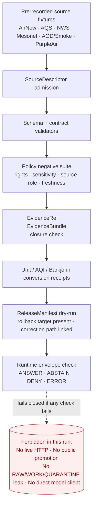

<!-- [KFM_META_BLOCK_V2]
doc_id: kfm://doc/NEEDS_VERIFICATION
title: Atmosphere — No-Network Test Runbook
type: standard
version: v1
status: draft
owners: [NEEDS_VERIFICATION — atmosphere subsystem owner, QA/test steward, docs steward]
created: 2026-05-13
updated: 2026-05-13
policy_label: public
related:
  - docs/domains/atmosphere/README.md
  - docs/runbooks/README.md
  - docs/doctrine/lifecycle-law.md
  - docs/doctrine/trust-membrane.md
  - contracts/OBJECT_MAP.md
  - schemas/contracts/v1/domains/atmosphere/
  - policy/domains/atmosphere/
  - tests/domains/atmosphere/
  - fixtures/domains/atmosphere/
  - pipeline_specs/atmosphere/
  - docs/registers/VERIFICATION_BACKLOG.md
tags: [kfm, atmosphere, runbook, no-network, testing, validation, governance]
notes:
  - Path follows Domain Placement Law (Directory Rules §12); per-root README and ADR confirmation pending.
  - All repo paths PROPOSED until verified against mounted-repo evidence.
  - Atmosphere first-PR scope is docs / registry / schema / fixture / validator / policy / dry-run only.
[/KFM_META_BLOCK_V2] -->

<a id="top"></a>

# Atmosphere — No-Network Test Runbook

> Deterministic, fixture-driven validation of the Atmosphere / Air / Climate lane with **no live source fetch, no public promotion, and no UI or API binding beyond typed contract notes** — the first proof slice before any connector turns on.


<!-- TODO: replace placeholders once owners, CI job names, and repo paths are verified. -->

| Field | Value |
|---|---|
| **Document type** | Domain runbook (testing / validation) |
| **Lane** | `atmosphere` (Atmosphere, Air, and Climate) |
| **Status** | `draft` · PROPOSED for first-PR scope |
| **Owners** | NEEDS VERIFICATION — atmosphere subsystem owner + QA/test steward + docs steward |
| **Last updated** | 2026-05-13 |
| **Related runbooks** | `docs/runbooks/atmosphere/VALIDATION.md` (PROPOSED), `docs/runbooks/atmosphere/ROLLBACK.md` (PROPOSED) |

---

## Quick jump

1. [Purpose and scope](#1-purpose-and-scope)
2. [Repo fit and placement](#2-repo-fit-and-placement)
3. [Doctrine this runbook enforces](#3-doctrine-this-runbook-enforces)
4. [What "no-network" means here](#4-what-no-network-means-here)
5. [Prerequisites](#5-prerequisites)
6. [Atmosphere objects under test](#6-atmosphere-objects-under-test)
7. [Atmosphere sources to mock](#7-atmosphere-sources-to-mock)
8. [Test flow diagram](#8-test-flow-diagram)
9. [Procedure](#9-procedure)
10. [Required test classes](#10-required-test-classes)
11. [Required fixture matrix](#11-required-fixture-matrix)
12. [Expected outcomes](#12-expected-outcomes)
13. [Sensitivity, rights, and non-emergency posture](#13-sensitivity-rights-and-non-emergency-posture)
14. [Troubleshooting](#14-troubleshooting)
15. [Failure modes, rollback, and non-regression](#15-failure-modes-rollback-and-non-regression)
16. [CI integration (proposed)](#16-ci-integration-proposed)
17. [Related docs](#17-related-docs)
18. [Open verification items](#18-open-verification-items)
19. [Appendix — fixture skeletons](#19-appendix--fixture-skeletons)

---

## 1. Purpose and scope

The Atmosphere lane's **first implementation PR is fixture-driven and offline**. It exists to prove that schemas, contracts, source descriptors, policy gates, evidence closure, release dry-runs, and finite-outcome envelopes work end-to-end *before* any live connector to EPA AirNow, EPA AQS, NOAA/NWS, Kansas Mesonet, satellite AOD/smoke products, or any other upstream is admitted into the pipeline.

This runbook tells a developer or reviewer how to run that fixture-only suite, what it must prove, and what it must refuse to do.

**In scope** (CONFIRMED doctrine / PROPOSED implementation):

- Deterministic no-network fixture tests for atmosphere objects (AirStation, AirObservation, PM2.5 / Ozone, SmokeContext, AODRaster, WeatherStation / Observation, WindField, Precipitation / Temperature Observation, Climate Normal / Anomaly, Forecast Context, Advisory Context).
- Schema, contract, source-role, evidence-closure, policy, release-dry-run, envelope, and citation-validation assertions.
- Negative / deny / abstain fixtures, including stale source state, missing rights, sensitive joins, and uncited claims.

**Out of scope:**

- Any live HTTP fetch to a real upstream.
- Any public promotion to `data/published/layers/atmosphere/`.
- Any UI route binding beyond typed contract notes.
- Any direct browser-to-model client path.
- Any real advisory emission (KFM is *not* an emergency alerting system).

> [!IMPORTANT]
> The Atmosphere lane explicitly **does not own life-safety advisories**. The runbook never simulates pushing an alert; it only simulates *contextual* advisory records pointing to the official issuer.

[Back to top](#top)

---

## 2. Repo fit and placement

**Proposed path:** `docs/runbooks/atmosphere/NO_NETWORK_TEST_RUNBOOK.md` — PROPOSED.

**Placement basis (Directory Rules):**

| Step | Rule | Resolution |
|---|---|---|
| Step 1 — Responsibility | "Explains something to humans" → `docs/` | CONFIRMED |
| Step 2 — Sub-responsibility | Operational procedure → `docs/runbooks/` | CONFIRMED |
| Step 3 — Domain segment | Domain MUST appear as a *segment*, never a root → `docs/runbooks/atmosphere/` | PROPOSED (uniform application of §12 Domain Placement Law) |
| Step 4 — Authority | `docs/runbooks/` is canonical under §6.1 | CONFIRMED for `docs/runbooks/`; the `atmosphere/` segment is PROPOSED until a per-root README or ADR confirms domain subfolders |

> [!NOTE]
> The KFM Whole-UI / Governed-AI expansion report shows subsystem-prefix runbooks such as `docs/runbooks/ui_LOCAL_DEV.md`. Those refer to *subsystems* (UI, governed-AI), not *domains*. For *domain* runbooks, the domain-segment pattern from §12 is the more consistent home. An ADR or `docs/runbooks/README.md` should freeze the convention.

**Upstream (this runbook depends on):**

- `docs/domains/atmosphere/README.md` — domain identity and boundary (PROPOSED).
- `schemas/contracts/v1/domains/atmosphere/*.schema.json` — object shapes (PROPOSED).
- `contracts/domains/atmosphere/` — object meaning (PROPOSED).
- `policy/domains/atmosphere/` — admissibility and release policy (PROPOSED).
- `fixtures/domains/atmosphere/` — golden / invalid / deny / abstain fixtures (PROPOSED).
- `tests/domains/atmosphere/` — runnable test cases (PROPOSED).
- `pipeline_specs/atmosphere/` — declarative pipeline configuration (PROPOSED).
- `docs/sources/SOURCE_DESCRIPTOR_STANDARD.md` — source descriptor fields (PROPOSED).

**Downstream (this runbook supports):**

- `docs/runbooks/atmosphere/VALIDATION.md` — full validation runbook (PROPOSED).
- `docs/runbooks/atmosphere/ROLLBACK.md` — rollback drill runbook (PROPOSED).
- `docs/registers/VERIFICATION_BACKLOG.md` — feeds open items from this run.
- `docs/registers/DRIFT_REGISTER.md` — receives any conflicts found during the run.

[Back to top](#top)

---

## 3. Doctrine this runbook enforces

CONFIRMED KFM invariants reflected here:

- **Lifecycle law.** Source data must move `RAW → WORK / QUARANTINE → PROCESSED → CATALOG / TRIPLET → PUBLISHED`. The no-network suite exercises the early phases without crossing into public promotion.
- **Truth membrane.** Public clients consume governed-API payloads, EvidenceBundles, released artifacts, and finite envelopes — *not* raw, work, quarantine, candidate, or model output.
- **Cite-or-abstain.** Every claim depending on evidence resolves through `EvidenceRef → EvidenceBundle`, or returns `ABSTAIN`.
- **Policy-aware fail-safe defaults.** Unknown rights, sensitivity, or source-role mismatch → `DENY`. Unresolved evidence → `ABSTAIN`. Tool / dependency / signing error → `ERROR`.
- **Promotion is a governed state transition, not a file move.** The release-manifest dry-run validates the transition shape; it does *not* publish anything.
- **No parallel authority homes.** The runbook references canonical `schemas/contracts/v1/domains/atmosphere/`, `policy/domains/atmosphere/`, and `release/candidates/atmosphere/`; it does not invent siblings.

[Back to top](#top)

---

## 4. What "no-network" means here

"No-network" is a CI and local-dev posture, not an abstract goal. In this lane it means:

| Constraint | Concrete enforcement |
|---|---|
| **No outbound HTTP / HTTPS / DNS** during the test run | CI job runs with network access disabled, or with an egress allowlist that excludes all upstream source domains. |
| **No live source authentication** | No API keys or tokens are read from secret stores during the run; absence of a key is itself a passing condition for "no live fetch was attempted." |
| **All upstream payloads come from `fixtures/domains/atmosphere/`** | Every connector mock returns a pre-recorded, hashed fixture; recording date and source vintage are part of the fixture metadata. |
| **No public promotion** | `release/candidates/atmosphere/` may receive a candidate manifest for dry-run; `data/published/layers/atmosphere/` MUST remain untouched. |
| **No direct model client** | Any AI-related assertion uses `runtime/mock/` (MockAdapter); Ollama or any provider runtime is off. |
| **No browser / app boot against live tiles or APIs** | Map shell and Evidence Drawer assertions use Playwright-style or component tests against canned payloads. |

> [!WARNING]
> A passing no-network suite is **necessary but not sufficient** for source admission. Fixture pass does *not* prove the upstream still behaves the way the fixture recorded. Source rights, cadence, and schema must be re-verified before any live connector is activated.

[Back to top](#top)

---

## 5. Prerequisites

Before running the suite, confirm the following are present in the repo. Each item is PROPOSED until the mounted repo confirms its location.

- [ ] Per-root READMEs for `docs/runbooks/`, `fixtures/domains/atmosphere/`, `tests/domains/atmosphere/`, `policy/domains/atmosphere/`, and `schemas/contracts/v1/domains/atmosphere/` exist and match the §15 README contract.
- [ ] Schema set for atmosphere object families is present under `schemas/contracts/v1/domains/atmosphere/`.
- [ ] Validator commands are documented under `tools/validators/` (PROPOSED) and runnable without network.
- [ ] Policy bundle for atmosphere is present under `policy/domains/atmosphere/` with negative fixtures and reason codes.
- [ ] `fixtures/domains/atmosphere/` includes at minimum one *valid*, one *invalid*, one *denied*, one *abstain*, and one *rollback / correction* fixture per object family (see §11).
- [ ] `runtime/mock/` MockAdapter is wired and returns deterministic envelopes.
- [ ] A `pipeline_specs/atmosphere/dry_run.yaml` (or repo equivalent) declares the dry-run pipeline. PROPOSED.
- [ ] CI workflow named (PROPOSED) `atmosphere-no-network` exists under `.github/workflows/` and runs with egress denied.

> [!TIP]
> If any prerequisite is missing, the correct action is to **open a `VERIFICATION_BACKLOG` entry**, not to invent the path silently. Directory Rules §2.5 applies.

[Back to top](#top)

---

## 6. Atmosphere objects under test

PROPOSED object families derived from the canonical Atmosphere lane definition. All identity rules use the lane default: `source id + object role + temporal scope + normalized digest`.

| Object family | Purpose in lane | Fixture must demonstrate |
|---|---|---|
| `AirStation` | Air-quality monitoring station identity | station_id round-trip, network/site context, freshness |
| `AirObservation` | Generic air parameter observation | parameter registry id, unit, observed_at, source role |
| `PM25Observation` | PM2.5 reading | µg/m³ unit, AQI context, source role separation (AirNow vs AQS) |
| `OzoneObservation` | Ozone reading | ppb unit, 8-hour vs 1-hour context |
| `SmokeContext` | Smoke / plume context | issue / expiry time, model-vs-observation tag |
| `AODRaster` | Aerosol optical depth raster | grid CRS, run time, valid time, MAIAC / GOES source role |
| `WeatherStation` | Mesonet / NWS station identity | network membership, elevation, anchor coordinates |
| `WeatherObservation` | Generic weather reading | observed_at, valid_at, parameter, unit, source role |
| `WindField` | Wind vector field | u/v components, grid metadata, model run time |
| `PrecipitationObservation` | Liquid / frozen precip | accumulation interval, gauge / radar / model role |
| `TemperatureObservation` | Air / soil / dew-point temperature | unit (C/F), conversion receipt |
| `ClimateNormal` | Long-period statistic | normal period (e.g., 1991-2020), parameter, statistic type |
| `ClimateAnomaly` | Departure from normal | baseline reference, departure unit |
| `ForecastContext` | Model / forecast field | model name, run time, valid time, ensemble member |
| `AdvisoryContext` | Pointer to official advisory | issuer, advisory_id, issue / expiry, redirection URL — **never** a KFM-issued alert |

> [!CAUTION]
> `AdvisoryContext` is a *context* object only. Fixtures MUST NOT shape it as if KFM were the issuer. The expected envelope behavior for any "is there a current advisory" prompt is `ANSWER` with a redirect citation, or `ABSTAIN` if stale, or `DENY` if rights are unclear.

[Back to top](#top)

---

## 7. Atmosphere sources to mock

Source roles are per the lane source-role registry (PROPOSED). Every fixture MUST tag its source-role; using a source outside its declared role is a `DENY` condition.

| Source family | Role (PROPOSED) | Fixture vintage rule | Rights status |
|---|---|---|---|
| EPA AirNow | observation / public AQI report | record retrieval time and issue cadence | NEEDS VERIFICATION |
| EPA AQS / AirData | regulatory archive | record QA/QC version | NEEDS VERIFICATION |
| NOAA / NWS API | observation + advisory context | distinguish observation vs warning context | NEEDS VERIFICATION |
| Kansas Mesonet | observation (state network) | record station network + cadence | NEEDS VERIFICATION |
| PurpleAir (community) | observation (low-cost sensor) | record Barkjohn correction version; preserve corrected + uncorrected pair | NEEDS VERIFICATION |
| HRRR-Smoke / BlueSky | model field (smoke forecast) | model run time + valid time | NEEDS VERIFICATION |
| HMS smoke / GOES-ABI AOD / VIIRS hotspots | observation / model context | sensor + product version | NEEDS VERIFICATION |
| CAMS / ECMWF-family | model field | tag clearly as model, not observation | NEEDS VERIFICATION |
| KDHE bulletins / official advisories | advisory context (pointer only) | redirect URL preserved; KFM never republishes as authority | NEEDS VERIFICATION |

> [!IMPORTANT]
> PurpleAir specifically: the Barkjohn correction version MUST be recorded in every published derivative. The no-network suite asserts that an uncorrected PurpleAir reading never reaches a release candidate without the correction receipt attached.

[Back to top](#top)

---

## 8. Test flow diagram



> [!NOTE]
> The diagram reflects PROPOSED stage names. Actual function / route / job names depend on mounted-repo evidence; treat each box as a *responsibility* rather than a fixed identifier.

[Back to top](#top)

---

## 9. Procedure

The following steps are PROPOSED until repo evidence pins down exact commands. Substitute the repo's actual package manager, test runner, and policy engine. Mark `NEEDS VERIFICATION` next to any line that resolves differently in the mounted repo.

### 9.1 Prepare the workspace

```text
# 1. Confirm clean checkout and no stale fixtures
git status --short
git -C fixtures/domains/atmosphere clean -nfd

# 2. Confirm network policy
# (PROPOSED — replace with repo's actual offline harness)
echo "Egress should be denied in this shell. If a curl/wget succeeds, abort."
```

### 9.2 Run the no-network suite

```text
# Schema and contract validation
# (PROPOSED commands — confirm against repo conventions)
tools/validators/run --root schemas/contracts/v1/domains/atmosphere/ \
                     --fixtures fixtures/domains/atmosphere/ \
                     --offline

# Policy negative suite
tools/validators/policy --policy policy/domains/atmosphere/ \
                        --fixtures fixtures/domains/atmosphere/invalid/ \
                        --expect deny abstain error

# Evidence closure dry-run
tools/validators/evidence --bundles fixtures/domains/atmosphere/bundles/ \
                          --refs    fixtures/domains/atmosphere/refs/ \
                          --offline

# Release manifest dry-run (no public promotion)
tools/validators/release --candidate release/candidates/atmosphere/dry_run/ \
                         --no-publish

# Runtime envelope check via MockAdapter
runtime/mock/run --scenarios tests/domains/atmosphere/scenarios/
```

### 9.3 Inspect outputs

The run SHOULD emit (PROPOSED targets):

- A `RunReceipt` per validator stage, written to `data/receipts/atmosphere/dry_run/` (PROPOSED).
- A `ValidationReport` per object family, summarizing pass / fail counts and reason codes.
- A reviewer summary printed to the job log: schemas validated, fixtures touched, negative outcomes proven, remaining `UNKNOWN`s.

> [!TIP]
> The reviewer summary is the artifact a steward reads. If it is missing or empty, treat the run as failed even if all individual steps "passed."

[Back to top](#top)

---

## 10. Required test classes

Test-class coverage applies to *every* atmosphere object family, per the KFM fixture rule.

| Test class | Atmosphere-specific assertion | Default status |
|---|---|---|
| Schema test | All required fields present; `schema_version` set; unit annotations valid | PROPOSED |
| Contract test | Object meaning matches the lane vocabulary (e.g., `PM25Observation` is an observation, not a forecast) | PROPOSED |
| Source-role test | AirNow used as public AQI report; AQS used as regulatory archive; HRRR-Smoke tagged as model — using a source outside its role triggers `DENY` | PROPOSED |
| Unit / conversion test | µg/m³ ↔ AQI, ppb ↔ ppm, °C ↔ °F all leave a `ConversionReceipt`; PurpleAir leaves a Barkjohn-version-tagged receipt | PROPOSED |
| Evidence test | Every claim resolves `EvidenceRef → EvidenceBundle`, or the envelope is `ABSTAIN` with reason `evidence_unresolved` | PROPOSED |
| Policy test | Unknown rights, missing sensitivity label, stale source, or sensitive-join attempt → `DENY` with reason code | PROPOSED |
| Freshness / staleness test | Source past its cadence + grace window → degraded badge or `ABSTAIN` | PROPOSED |
| Temporal-logic test | `observed_at ≤ retrieval_at ≤ release_at`; `valid_at` for forecasts within model-run window | PROPOSED |
| Release test | Candidate manifest has proof refs, correction path, and rollback target — none can be empty | PROPOSED |
| Envelope test | MockAdapter returns finite outcome (`ANSWER` / `ABSTAIN` / `DENY` / `ERROR`); citations validate against the `EvidenceBundle` | PROPOSED |
| Non-emergency test | Fixture attempting to publish an `AdvisoryContext` *as* an alert (not as a redirect) is rejected | PROPOSED |
| Non-regression test | Prior atmosphere lineage / scaffold semantics retained where applicable | PROPOSED |

[Back to top](#top)

---

## 11. Required fixture matrix

KFM fixture rule: every major object family has at least one valid, invalid, denied, abstention, and rollback/correction fixture. For atmosphere, sensitive joins and non-emergency posture earn additional negative fixtures.

| Fixture id (PROPOSED) | Object | Expected outcome | What it proves |
|---|---|---|---|
| `airnow_pm25_valid.json` | `PM25Observation` | `ANSWER` | Happy path: AQI/µg/m³ conversion receipt present |
| `aqs_pm25_quarterly_valid.json` | `PM25Observation` | `ANSWER` | Regulatory archive role distinct from AirNow public report |
| `purpleair_uncorrected_deny.json` | `PM25Observation` | `DENY` (reason: `missing_barkjohn_correction`) | Correction receipt is mandatory |
| `mesonet_temp_unit_missing_invalid.json` | `TemperatureObservation` | schema fail | Unit must be present |
| `hrrr_smoke_as_observation_deny.json` | `SmokeContext` | `DENY` (reason: `source_role_mismatch`) | Model field tagged as observation is rejected |
| `nws_advisory_republished_deny.json` | `AdvisoryContext` | `DENY` (reason: `kfm_not_issuer`) | KFM never re-issues advisories |
| `stale_aqs_source_abstain.json` | `AirObservation` | `ABSTAIN` (reason: `stale_source`) | Past-cadence sources do not silently publish |
| `aod_unresolved_evidence_abstain.json` | `AODRaster` | `ABSTAIN` (reason: `evidence_unresolved`) | Missing EvidenceBundle → abstain |
| `sensitive_join_deny.json` | mixed | `DENY` (reason: `sensitive_join_blocked`) | Atmosphere × hazards join attempting precise sensitive location is rejected |
| `release_missing_rollback_invalid.json` | candidate manifest | release dry-run fail | Rollback target must be non-empty |
| `correction_notice_valid.json` | correction | `ANSWER` | Correction path linked back to prior release |

[Back to top](#top)

---

## 12. Expected outcomes

A passing run prints a reviewer summary equivalent to:

```text
ATMOSPHERE NO-NETWORK RUN — DRY
================================
schemas validated:        15 / 15
contract assertions:      n / n   (PROPOSED)
source-role checks:        n / n
unit / conversion checks:  n / n   (incl. Barkjohn)
policy negative cases:     deny=k  abstain=k  error=k
evidence closure:          n bundles resolved, k abstain
release dry-run:           candidate manifest valid; no publish performed
envelope distribution:     ANSWER / ABSTAIN / DENY / ERROR proven
non-emergency posture:     advisory-as-alert rejected
forbidden-action probes:   no live HTTP attempted
                           no public-path mutation
                           no model runtime invocation
remaining UNKNOWNs:        listed in VERIFICATION_BACKLOG
```

> [!IMPORTANT]
> A run that produces *zero* negative outcomes is a failed run. The suite must exercise `DENY`, `ABSTAIN`, and `ERROR` paths, not just `ANSWER`.

[Back to top](#top)

---

## 13. Sensitivity, rights, and non-emergency posture

CONFIRMED doctrine for the Atmosphere lane:

- **Non-emergency.** KFM atmosphere output is contextual. Life-safety advisories belong to the official issuer (NWS, KDHE, county EM). Every released `AdvisoryContext` MUST carry a redirect to the issuer and a non-emergency disclaimer.
- **Source-role separation.** Observation, model, regulatory archive, public report, and advisory context are *not* interchangeable. The no-network suite asserts that mixing them triggers `DENY`.
- **Sensitive joins fail closed.** Joining atmosphere data against precise locations from hazards, archaeology, people/DNA/land, or rare-species lanes requires steward review and generalization receipts. Any unreviewed join in a fixture → `DENY`.
- **Stale data is not silent.** Past-cadence sources are badged or trigger `ABSTAIN`; they are never republished without a freshness annotation.
- **PurpleAir correction discipline.** The Barkjohn correction version is part of the receipt. Removing it (even from a "test" payload) fails the fixture.

> [!CAUTION]
> A fixture intentionally containing real or realistic sensitive-location data is a security incident, not a test asset. Use synthetic geometry and clearly fictitious station identifiers in fixtures.

[Back to top](#top)

---

## 14. Troubleshooting

| Symptom | Likely cause | Action |
|---|---|---|
| All policy tests pass; none deny | Policy bundle is `default-allow` (drift) | Rebuild policy package with `default-deny`; open a `DRIFT_REGISTER` entry |
| Schema test fails with "unknown unit" | Parameter registry not loaded, or unit alias missing | Confirm parameter registry fixture loaded; do not silently add aliases |
| Run hangs or times out at the connector stage | A connector tried a real HTTP fetch | Verify connector is reading from `fixtures/domains/atmosphere/`; fail closed on any DNS resolution attempt |
| Envelope is `ANSWER` for an unresolved citation | Citation validator not wired, or `EvidenceBundle` index stale | Re-run `tools/validators/evidence` standalone; expect `ABSTAIN` with reason `evidence_unresolved` |
| Release dry-run "succeeds" but no `RollbackCard` reference | Manifest schema accepted empty rollback target | Tighten schema; this is a `MUST`, not a `SHOULD` |
| Reviewer summary missing | Validator emits per-stage receipts but no aggregator runs | Add the aggregator step; treat the run as failed until the summary is produced |
| MockAdapter returns generic text | Adapter not pinned to deterministic mode, or scenario fixture missing | Pin MockAdapter to fixture-only mode; do not promote to live adapter during this run |

[Back to top](#top)

---

## 15. Failure modes, rollback, and non-regression

This is a no-network *test* run, so rollback is local rather than release-level. The escalation ladder:

1. **Per-stage fixture regeneration.** If a single fixture is wrong (not a doctrine violation), correct the fixture, regenerate hashes, and re-run.
2. **Schema or contract change.** Any schema change in this lane requires updating the docs / object map / fixtures together; see the Update-propagation matrix in the Whole-UI / Governed-AI report.
3. **Policy bundle change.** Add a negative fixture *first*, watch it deny, then ship the policy. Never ship a policy change without proof of the new deny path.
4. **Release dry-run failure caused by an upstream lane change** (e.g., a new `ReleaseManifest` field). Pin the candidate manifest version; coordinate via ADR before adopting the new shape.
5. **Drift discovered.** Open `docs/registers/DRIFT_REGISTER.md` entry; do not patch the runbook to match the drift.

> [!NOTE]
> Non-regression: prior atmosphere planning artifacts (architecture report, encyclopedia entry) remain lineage. This runbook does not silently overwrite them — it operationalizes them.

[Back to top](#top)

---

## 16. CI integration (proposed)

PROPOSED CI shape — adapt to the repo's actual workflow system.

| Element | Proposed value | Status |
|---|---|---|
| Workflow file | `.github/workflows/atmosphere-no-network.yml` | PROPOSED |
| Trigger | PR touching `**/domains/atmosphere/**`, `schemas/contracts/v1/domains/atmosphere/**`, `policy/domains/atmosphere/**`, `fixtures/domains/atmosphere/**`, `pipeline_specs/atmosphere/**`, `docs/runbooks/atmosphere/**` | PROPOSED |
| Network posture | Egress denied (or allowlist excludes upstream source domains) | PROPOSED |
| Secrets | None loaded; absence is itself an assertion | PROPOSED |
| Required checks | schema, contract, source-role, unit, evidence, policy, release-dry-run, envelope, non-emergency, forbidden-action probe | PROPOSED |
| Artifact | Reviewer summary + run receipts under `data/receipts/atmosphere/dry_run/<run_id>/` | PROPOSED |
| Failure behavior | Fail-closed; never auto-merge on partial pass | PROPOSED |

[Back to top](#top)

---

## 17. Related docs

- `docs/domains/atmosphere/README.md` — domain identity, scope, non-ownership.
- `docs/runbooks/README.md` — runbook conventions (PROPOSED).
- `docs/runbooks/atmosphere/VALIDATION.md` — broader validation runbook (PROPOSED).
- `docs/runbooks/atmosphere/ROLLBACK.md` — rollback drill runbook (PROPOSED).
- `docs/doctrine/lifecycle-law.md` — `RAW → … → PUBLISHED` invariant.
- `docs/doctrine/trust-membrane.md` — public-path discipline.
- `docs/doctrine/truth-posture.md` — cite-or-abstain.
- `docs/architecture/governed-api.md` — envelope and route boundaries.
- `docs/sources/SOURCE_DESCRIPTOR_STANDARD.md` — source descriptor fields.
- `contracts/OBJECT_MAP.md` — object meaning crosswalk.
- `docs/adr/` — file-home and trust-boundary ADRs.
- `docs/registers/VERIFICATION_BACKLOG.md`, `docs/registers/DRIFT_REGISTER.md` — open items feed.

[Back to top](#top)

---

## 18. Open verification items

These items are NEEDS VERIFICATION until mounted-repo evidence resolves them. Track in `docs/registers/VERIFICATION_BACKLOG.md`.

- [ ] Confirm `docs/runbooks/<domain>/` (domain-segment) vs `docs/runbooks/<subsystem>_<role>.md` (prefix-style) convention via per-root README or ADR.
- [ ] Confirm canonical schema home for atmosphere (`schemas/contracts/v1/domains/atmosphere/` is the default per ADR-0001; verify against repo).
- [ ] Confirm policy engine (OPA / Conftest / other) and pin versions used in this lane.
- [ ] Confirm validator command paths (`tools/validators/*`) and offline behavior.
- [ ] Confirm `release/candidates/atmosphere/` path is honored by the release dry-run step.
- [ ] Confirm receipt storage location (`data/receipts/atmosphere/dry_run/`).
- [ ] Confirm CI workflow name and required-check identifiers.
- [ ] Confirm source-rights status for each Atmosphere source family before any future live-fetch PR.
- [ ] Confirm Barkjohn-correction version pinning home (policy bundle or source descriptor).
- [ ] Confirm MockAdapter deterministic-mode flag and scenario directory.

[Back to top](#top)

---

## 19. Appendix — fixture skeletons

<details>
<summary><strong>Sample valid <code>PM25Observation</code> fixture (PROPOSED, illustrative)</strong></summary>

```json
{
  "schema_version": "v1",
  "object_type": "PM25Observation",
  "object_id": "PROPOSED-deterministic-from(source_id, station_id, observed_at)",
  "source_descriptor_ref": "src://airnow/v1/station/PROPOSED-station-id",
  "source_role": "public_aqi_report",
  "station_ref": "AirStation://PROPOSED",
  "observed_at": "2026-05-13T14:00:00Z",
  "retrieval_at": "2026-05-13T14:05:00Z",
  "parameter": "pm25",
  "value": 12.4,
  "unit": "ug_m3",
  "aqi_context": {
    "aqi": 52,
    "category": "moderate",
    "scale_version": "EPA-2024"
  },
  "conversion_receipt_ref": "receipt://units/pm25-to-aqi/PROPOSED",
  "evidence_ref": "EvidenceRef://airnow/PROPOSED",
  "freshness": { "cadence_minutes": 60, "state": "fresh" },
  "policy_label": "public",
  "rights_status": "open_per_source_terms (NEEDS VERIFICATION)",
  "sensitivity": "public",
  "non_emergency_disclaimer": true
}
```

</details>

<details>
<summary><strong>Sample <code>DENY</code> fixture — uncorrected PurpleAir (PROPOSED, illustrative)</strong></summary>

```json
{
  "schema_version": "v1",
  "object_type": "PM25Observation",
  "source_descriptor_ref": "src://purpleair/v1/sensor/PROPOSED",
  "source_role": "low_cost_sensor_observation",
  "station_ref": "AirStation://PROPOSED",
  "observed_at": "2026-05-13T14:00:00Z",
  "parameter": "pm25",
  "value": 21.7,
  "unit": "ug_m3",
  "barkjohn_correction": null,
  "expected_outcome": "DENY",
  "expected_reason_code": "missing_barkjohn_correction",
  "notes": "Fixture proves uncorrected PurpleAir never reaches a release candidate."
}
```

</details>

<details>
<summary><strong>Sample <code>ABSTAIN</code> fixture — stale AQS source (PROPOSED, illustrative)</strong></summary>

```json
{
  "schema_version": "v1",
  "object_type": "AirObservation",
  "source_descriptor_ref": "src://aqs/v1/site/PROPOSED",
  "source_role": "regulatory_archive",
  "retrieval_at": "2026-05-13T14:00:00Z",
  "source_head_age_days": 540,
  "freshness": { "cadence_days": 365, "state": "stale" },
  "expected_outcome": "ABSTAIN",
  "expected_reason_code": "stale_source",
  "notes": "AQS regulatory archive past cadence + grace window. Envelope must abstain, not answer."
}
```

</details>

<details>
<summary><strong>Sample reviewer-summary skeleton</strong></summary>

```text
run_id:              <run-id>
lane:                atmosphere
mode:                no-network
schemas_validated:   <count>
fixtures_touched:    <count>
deny_cases:          <count>
abstain_cases:       <count>
error_cases:         <count>
release_dry_run:     candidate manifest valid; no publish performed
non_emergency:       advisory-as-alert rejected
forbidden_probes:    live_http=0  raw_access=0  model_client=0
unknowns:            see docs/registers/VERIFICATION_BACKLOG.md
```

</details>

---

**Related runbooks:** `VALIDATION.md` (PROPOSED) · `ROLLBACK.md` (PROPOSED) · `LOCAL_DEV.md` (PROPOSED).
**Last updated:** 2026-05-13.
[Back to top](#top)
