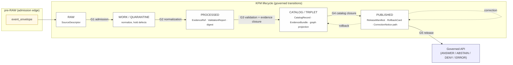

<!-- [KFM_META_BLOCK_V2]
doc_id: kfm://doc/runbook/atmosphere/promotion
title: Atmosphere / Air — Promotion Runbook
type: standard
version: v1
status: draft
owners: [Atmosphere domain steward (PROPOSED), Release steward (PROPOSED)]
created: 2026-05-13
updated: 2026-05-13
policy_label: public
related:
  - docs/doctrine/directory-rules.md
  - docs/doctrine/lifecycle-law.md
  - docs/doctrine/trust-membrane.md
  - docs/doctrine/truth-posture.md
  - docs/domains/atmosphere/README.md
  - docs/architecture/governed-api.md
  - docs/runbooks/governed_ai_VALIDATION.md
  - control_plane/release_state_register.yaml
  - control_plane/policy_gate_register.yaml
  - release/
  - policy/domains/atmosphere/
  - schemas/contracts/v1/domains/atmosphere/
tags: [kfm, runbook, atmosphere, air, promotion, governance, release]
notes:
  - Placement, owners, and adjacent paths marked PROPOSED until verified against mounted-repo evidence.
  - Aligns to seven-gate matrix (A–G) from C5-01 and to lifecycle law in directory-rules.md §0.
[/KFM_META_BLOCK_V2] -->

<a id="top"></a>

# Atmosphere / Air — Promotion Runbook

> **Operating procedure for moving Atmosphere / Air evidence through `RAW → WORK / QUARANTINE → PROCESSED → CATALOG / TRIPLET → PUBLISHED` as a governed state transition — not a file move.**

<!-- Badge row: placeholders are intentional; targets to be wired after CI/branch verification. -->


**Status:** `draft` · **Owners:** Atmosphere domain steward + Release steward *(PROPOSED — confirm in `CODEOWNERS`)* · **Last updated:** 2026-05-13

> [!IMPORTANT]
> This is a **doctrinal runbook**. The procedure below is CONFIRMED as KFM doctrine. Specific paths, tool invocations, route names, CI job names, and branch protection labels are **PROPOSED** until verified against mounted-repo evidence. Do not treat tree fragments here as implementation proof.

---

## 📑 Contents

- [1. Purpose & scope](#1-purpose--scope)
- [2. Repo fit](#2-repo-fit)
- [3. When to use this runbook](#3-when-to-use-this-runbook)
- [4. Roles & separation of duties](#4-roles--separation-of-duties)
- [5. Pre-flight checks](#5-pre-flight-checks)
- [6. The promotion model](#6-the-promotion-model)
- [7. Atmosphere-specific guardrails](#7-atmosphere-specific-guardrails)
- [8. Promotion procedure, stage by stage](#8-promotion-procedure-stage-by-stage)
- [9. Seven-gate matrix application (A–G)](#9-seven-gate-matrix-application-ag)
- [10. Failure handling — reason codes & remediation](#10-failure-handling--reason-codes--remediation)
- [11. Correction `PUBLISHED → PUBLISHED′`](#11-correction-published--published)
- [12. Rollback `PUBLISHED → prior release`](#12-rollback-published--prior-release)
- [13. Post-promotion validation](#13-post-promotion-validation)
- [14. Verification backlog](#14-verification-backlog)
- [15. Related docs](#15-related-docs)
- [16. Appendix](#16-appendix)

---

## 1. Purpose & scope

This runbook tells an Atmosphere / Air **promoter** (the steward driving a release) and a **reviewer** (the steward signing it off) exactly what must hold before each lifecycle boundary is crossed, what artifacts must exist on the other side, and how to recover when a gate fails closed.

**In scope.** Domain-bounded objects owned by Atmosphere / Air: `AirStation`, `AirObservation`, `PM2.5 Observation`, `Ozone Observation`, `SmokeContext`, `AODRaster`, `Weather Station`, `Weather Observation`, `WindField`, `Precipitation Observation`, `Temperature Observation`, `Climate Normal`, `Climate Anomaly`, `Forecast Context`, `Advisory Context`. (CONFIRMED domain ownership; PROPOSED field realization.)

**Out of scope.** Emergency / hazard-event truth and life-safety instructions — those are owned by **Hazards**. Hydrology, Agriculture, Settlements, Roads, and Biodiversity domains own their own canonical claims; this runbook only governs Atmosphere / Air promotion. If an artifact is multi-domain, the **owning lane** drives promotion; this runbook supplies cross-lane constraints, not cross-lane authority.

> [!NOTE]
> KFM Atmosphere / Air is **not** an emergency alerting system. Advisory and alert context may be carried through this pipeline as `ALERT_AND_ADVISORY_CONTEXT` or `ADVISORY_CONTEXT`, but life-safety instruction generation is **DENIED by policy**.

---

## 2. Repo fit

PROPOSED placement; consult [`docs/doctrine/directory-rules.md`](../../doctrine/directory-rules.md) before moving or renaming.

| Question | Answer |
|---|---|
| **This file lives at** | `docs/runbooks/atmosphere/PROMOTION_RUNBOOK.md` *(PROPOSED — `docs/runbooks/` is CONFIRMED canonical; the `atmosphere/` segment follows §4 Step 3 of Directory Rules)* |
| **Responsibility root** | `docs/` (human-facing control plane) |
| **Adjacent governance** | `docs/doctrine/lifecycle-law.md`, `docs/doctrine/trust-membrane.md`, `docs/doctrine/truth-posture.md` *(PROPOSED paths)* |
| **Upstream evidence sources** | `data/raw/atmosphere/…`, `data/registry/sources/atmosphere/…`, `data/work/atmosphere/…`, `data/quarantine/atmosphere/…` *(PROPOSED)* |
| **Downstream emitters** | `data/processed/atmosphere/…`, `data/catalog/domain/atmosphere/…`, `data/triplets/atmosphere/…`, `data/published/layers/atmosphere/…`, `release/candidates/atmosphere/…`, `release/manifests/atmosphere/…` *(PROPOSED)* |
| **Companion policy** | `policy/domains/atmosphere/` and the seven-gate matrix in `policy/gates/` *(PROPOSED)* |
| **Companion schemas** | `schemas/contracts/v1/domains/atmosphere/` *(PROPOSED per ADR-0001 schema-home convention)* |
| **Sister runbooks** | `docs/runbooks/atmosphere/CORRECTION_RUNBOOK.md`, `docs/runbooks/atmosphere/ROLLBACK_RUNBOOK.md` *(PROPOSED; create alongside if absent)* |

### What belongs here

- Atmosphere / Air–specific procedure for the **five governed state transitions** (admission, normalization, validation, catalog, release).
- Atmosphere / Air–specific **gate interpretations** (AQI ≠ concentration, AOD ≠ PM2.5, model ≠ observed, low-cost sensor caveats).
- The **reason-code map** a reviewer reaches for when a gate fires closed.

### What does **not** belong here

- Domain definitions, ubiquitous language, or object-family tables → `docs/domains/atmosphere/README.md`.
- Generic policy / OPA rules → `policy/` (Atmosphere lane: `policy/domains/atmosphere/`).
- Generic release machinery, signing, attestation → `tools/attest/` and `release/`.
- Schemas, contracts, or DTOs → `schemas/` and `contracts/`.
- Correction and rollback procedures → their own sibling runbooks (see §§11–12 for the cross-references).

[⬆ Back to top](#top)

---

## 3. When to use this runbook

| Trigger | Use this runbook? | Notes |
|---|---|---|
| New Atmosphere / Air dataset moving past `RAW` for the first time | ✅ | Start at §8.1. |
| Refresh / new vintage of an already-published Atmosphere layer | ✅ | Re-enter at §8.1 with the new `SourceDescriptor` digest; previous release becomes the rollback target. |
| Schema or contract change for an Atmosphere object family | ✅ + ADR | Run with an accepted ADR (see directory-rules.md §2.4) before crossing the **Meaning gate**. |
| Sensitivity reclassification of an already-released layer | ✅ via correction | Use [§11 Correction](#11-correction-published--published); withdraw and supersede. |
| Mis-rendered tile or styling change with no evidence delta | ❌ (UI-only) | Use the MapLibre runbook; tile re-render alone is not a promotion event. |
| Emergency alert content | ❌ (DENY by doctrine) | Atmosphere does not own life-safety instructions; reject at admission. |

[⬆ Back to top](#top)

---

## 4. Roles & separation of duties

CONFIRMED doctrine: when materiality justifies it, the **author** of a promotion candidate and the **release approver** must be different people. The roles below are the minimum reviewable set; concrete persons should be encoded in `CODEOWNERS` for the Atmosphere lane.

| Role | Owns | Cannot also be |
|---|---|---|
| **Source steward (Atmosphere)** | `SourceDescriptor`, rights, cadence, sensitivity, source-role assignment | The release approver for the same release |
| **Domain steward (Atmosphere)** | Ubiquitous language fidelity, knowledge-character labels, parameter/unit normalization, AQ↔model↔low-cost discipline | The release approver when domain materiality applies |
| **Validation steward** | `ValidationReport`, `RunReceipt`, `PromotionReceipt` integrity, schema/contract conformance | n/a |
| **Policy reviewer** | `PolicyDecision` records for rights, sensitivity, release class | The release approver for the same release |
| **Release approver** | `ReviewRecord`, `ReleaseManifest`, `RollbackCard`, correction path linkage | The author of the candidate |
| **AI assistant** *(governed)* | May summarize, compare, explain, draft correction notes from **released** `EvidenceBundle`s only | Never the root truth source; never an approver |

> [!CAUTION]
> Single-person promotion of a policy-significant Atmosphere release violates **separation-of-duties doctrine**. The governed API must refuse to surface a release whose `ReviewRecord.reviewer` equals the `RunReceipt.author` when materiality applies.

[⬆ Back to top](#top)

---

## 5. Pre-flight checks

Run this checklist before opening a promotion PR. Each item maps to a downstream gate; if any fails, do not start the promotion — fix the upstream defect first.

- [ ] `SourceDescriptor` for each input source exists in `data/registry/sources/atmosphere/…` and resolves. *(Source gate)*
- [ ] **Rights** status is declared and current; SPDX or equivalent identifier is in the allowlist. *(Rights gate)*
- [ ] **Source role** is assigned: `OBSERVED_SENSOR`, `PUBLIC_AQI_REPORT`, `REGULATORY_ARCHIVE`, `LOW_COST_SENSOR`, `ATMOSPHERIC_MODEL_FIELD`, `REMOTE_SENSING_MASK`, `CLIMATE_ANOMALY_CONTEXT`, `DERIVED_FUSION`, `METEOROLOGICAL_CONTEXT`, `ALERT_AND_ADVISORY_CONTEXT`, or `NETWORK_AND_SITE_CONTEXT`. *(Source-role gate)*
- [ ] **Parameter and unit** entries exist in the Atmosphere knowledge-character registry (e.g., AQI vs µg/m³ vs ppb vs AOD vs reflectance). *(Meaning gate)*
- [ ] **Temporal fields** are distinct and populated: `source_time`, `observed_time`, `valid_time`, `retrieval_time`, `release_time`, `correction_time` where material. *(Temporal gate)*
- [ ] **Sensitivity** is evaluated; no sensitive joins (e.g., living-person, infrastructure precision) are exposed. *(Sensitivity gate)*
- [ ] A **dry-run** of the no-live-fetch validation pipeline produces a `RunReceipt` and a `ValidationReport` against fixtures. *(Receipt gate)*
- [ ] A **rollback target** exists — either a prior published release or, for first-release datasets, a documented "no prior release" entry. *(Rollback gate)*
- [ ] Atmosphere-specific anti-collapse fixtures exist (see [§7](#7-atmosphere-specific-guardrails)) and currently **deny** as expected.

> [!TIP]
> Failing pre-flight is cheap. Failing a downstream gate after a long promotion run wastes reviewer time, signing budget, and policy-eval cycles. Fix at the lowest level that closes the defect.

[⬆ Back to top](#top)

---

## 6. The promotion model

CONFIRMED lifecycle, CONFIRMED transition mechanics, PROPOSED concrete tooling.



> [!NOTE]
> **Promotion is a state transition, not a file move.** Copying or symlinking an artifact from `data/processed/…` to `data/published/…` without the required receipts, reviews, and manifests does **not** promote it. The governed API treats unauthorized siblings as PROPOSED, not PUBLISHED.

### Universal closure rule

A transition is **closed** only when **all three** hold:

1. Every required artifact for the transition exists.
2. Every required artifact **resolves** what it depends on (`EvidenceRef` → `EvidenceBundle`, `source_id` → `SourceDescriptor`, `model_id` → `ModelRunReceipt`).
3. The policy gate evaluated and **recorded** its decision (`PolicyDecision`).

Missing any one fails closed and preserves the prior state.

[⬆ Back to top](#top)

---

## 7. Atmosphere-specific guardrails

CONFIRMED doctrine. These four invariants are why a generic promotion runbook is **not** sufficient for Atmosphere. Each must be enforced by a denying fixture in `policy/domains/atmosphere/` and `tests/domains/atmosphere/`.

| Guardrail | Plain-language rule | Doctrinal denial |
|---|---|---|
| **AQI is not concentration** | An AQI category (`Good`, `Moderate`, `Unhealthy for Sensitive Groups`, etc.) MUST NOT be used as, joined to, or rendered as a µg/m³, ppb, or ppm value. | DENY at Meaning gate. Reason: `AQI_AS_CONCENTRATION` *(PROPOSED reason code)*. |
| **AOD is not PM2.5** | Aerosol Optical Depth (a satellite-derived column property) MUST NOT be presented as a surface PM2.5 concentration without an explicit calibrated derivation receipt and a clearly labeled `DERIVED_FUSION` source role. | DENY at Meaning gate. Reason: `AOD_AS_PM25` *(PROPOSED reason code)*. |
| **Model fields are not observations** | `ATMOSPHERIC_MODEL_FIELD` outputs (HRRR-Smoke, CAMS, ECMWF-family) MUST NOT be promoted as `OBSERVED_SENSOR` evidence — even when they coincide with station locations. | DENY at Source-role gate. Reason: `ROLE_COLLAPSE` / `MODEL_AS_OBSERVED`. |
| **Low-cost sensors require caveats** | `LOW_COST_SENSOR` (PurpleAir-class) public release requires correction context, confidence bounds, calibration receipt, and a visible trust badge. | DENY at Sensitivity / Release gate without correction receipt. Reason: `LOW_COST_CAVEAT_MISSING` *(PROPOSED reason code)*. |

> [!WARNING]
> **Source-role downcasting is forbidden.** A `LOW_COST_SENSOR` reading cannot be promoted into an `OBSERVED_SENSOR` claim by re-tagging; a `REGULATORY_ARCHIVE` cannot be quietly upgraded to a real-time `PUBLIC_AQI_REPORT`. The source role assigned at admission persists through all downstream layers — including derived fusion products, which carry **both** the original roles and the fusion receipt.

### Required denying fixtures (CONFIRMED need; PROPOSED placement under `fixtures/domains/atmosphere/`)

- `aqi_as_concentration_should_deny.json`
- `aod_as_pm25_should_deny.json`
- `model_as_observed_should_deny.json`
- `low_cost_sensor_no_caveat_should_deny.json`
- `live_fetch_in_dryrun_should_deny.json` *(no-network fixture for the dryrun gate)*

[⬆ Back to top](#top)

---

## 8. Promotion procedure, stage by stage

Each subsection covers: **purpose · inputs · the gate that closes it · required emitted artifacts · what to do on failure**.

### 8.1 Admission `RAW → WORK / QUARANTINE`

**Purpose.** Accept admitted source material under source identity; normalize schema, geometry, time, identity, evidence, rights, and policy; hold any defect rather than letting it propagate.

**Inputs.**

- An immutable `RAW` payload (or reference) with citation, time, and content hash.
- A valid `SourceDescriptor` (rights, role, cadence, sensitivity).

**Gate.** **G1 — Admission.** `SourceDescriptor` exists and resolves; rights are declared; source role is assigned; sensitivity is evaluated; no live-fetch occurred during dryrun.

**Emits.**

- A normalized `WORK` candidate, or
- A `QUARANTINE` entry with a recorded reason code.
- An `event_run_receipt` for the admission attempt.

**On failure.** Hold in `QUARANTINE` with `quarantine_reason`. Common reasons: `RIGHTS_UNKNOWN`, `SENSITIVITY_UNRESOLVED`, `SCHEMA_MISMATCH`, `ROLE_COLLAPSE`. Do not retry without a steward note.

---

### 8.2 Normalization `WORK → PROCESSED`

**Purpose.** Emit validated normalized objects, receipts, and public-safe candidates. This is where parameter/unit normalization happens and where the Atmosphere knowledge-character registry is enforced.

**Inputs.** Items resident in `WORK`.

**Gate.** **G2 — Normalization & Validation.**

- Structural schema validation passes (against `schemas/contracts/v1/domains/atmosphere/…`).
- Parameter and unit normalization passes; AQI / concentration / AOD / reflectance are not confused.
- `EvidenceRef` is constructible.
- Source-role discipline holds (no downcasting).

**Emits.**

- Validated normalized objects in `PROCESSED`.
- A `ValidationReport`.
- A `RunReceipt` for the normalization step.
- A digest closure for the candidate set.

**On failure.** Re-enter `QUARANTINE` with reason. Common reasons: `SCHEMA_MISMATCH`, `CONTRACT_DRIFT`, `MISSING_EVIDENCE`, `AQI_AS_CONCENTRATION`, `AOD_AS_PM25`.

---

### 8.3 Catalog `PROCESSED → CATALOG / TRIPLET`

**Purpose.** Emit catalog records, `EvidenceBundle`s, graph/triplet projections, and release candidates. This is where `EvidenceRef → EvidenceBundle` resolution must close.

**Inputs.** PROCESSED candidates.

**Gate.** **G3 — Catalog closure.**

- Every `EvidenceRef` resolves to a real `EvidenceBundle`.
- Every `source_id` resolves to a `SourceDescriptor`.
- Every `model_id` resolves to a `ModelRunReceipt` (where applicable).
- Catalog record (e.g., KFM STAC / DCAT / PROV closure) is present and integral.
- No orphan artifacts.

**Emits.**

- `CatalogRecord` + `CatalogMatrix` entry.
- `EvidenceBundle`.
- Graph/triplet projection (downstream / derivative).
- A release candidate landing in `release/candidates/atmosphere/…`.

**On failure.** **HOLD at `PROCESSED`** with a structured FAIL outcome. Do not surface a public edge. Common reasons: `MISSING_EVIDENCE`, `MISSING_RECEIPT`, `ROLE_DOWNCAST_FORBIDDEN`.

---

### 8.4 Release `CATALOG / TRIPLET → PUBLISHED`

**Purpose.** Serve released, public-safe artifacts through governed APIs and manifests. This is the trust-membrane boundary: from here on, public clients and standard UI surfaces consume governed output **only**.

**Inputs.** A release candidate in `release/candidates/atmosphere/…`.

**Gate.** **G4 — Release.**

- `ReleaseManifest` exists and binds: contents, digests, evidence refs, signing evidence (DSSE / cosign), correction path, and rollback target.
- `ReviewRecord` exists where required and is signed by a release approver who is **not** the author.
- `RollbackCard` exists and identifies a tested prior release (or a documented "no prior release" state).
- Policy gate decision (`PolicyDecision`) is recorded with `outcome = ANSWER` for the release action.
- Atmosphere-specific guardrails (§7) are enforced by passing fixtures.

**Emits.**

- A `ReleaseManifest` in `release/manifests/atmosphere/…`.
- A `PromotionReceipt` covering all seven gates A–G.
- A `RollbackCard`.
- Public-safe artifacts under `data/published/layers/atmosphere/…` and `data/published/…` siblings.

**On failure.** **HOLD at `CATALOG`** — no public surface change. Common reasons: `RELEASE_MANIFEST_INVALID`, `ROLLBACK_TARGET_MISSING`, `REVIEW_NEEDED`, `REVIEW_REJECTED`, `RIGHTS_UNKNOWN`.

> [!IMPORTANT]
> The published surface is consumed via the **governed API** only. There is no path from the public UI to `RAW`, `WORK`, `QUARANTINE`, canonical stores, graph internals, vector indexes, source APIs, or model runtimes. The governed API emits one of `ANSWER`, `ABSTAIN`, `DENY`, or `ERROR`.

[⬆ Back to top](#top)

---

## 9. Seven-gate matrix application (A–G)

CONFIRMED doctrine (C5-01). The seven-gate matrix maps human intent → machine check → required evidence. For Atmosphere / Air, the matrix specializes as follows:

| Gate | Name | Atmosphere-specific check | Required evidence | Default failure |
|---|---|---|---|---|
| **A** | Structure & metadata | KFM meta block present in human docs; structural completeness of `SourceDescriptor`, `EvidenceBundle`, manifests. | `MetaBlock`, structural validators pass. | `SCHEMA_MISMATCH` / quarantine |
| **B** | Schemas & contracts | `schemas/contracts/v1/domains/atmosphere/…` validation; parameter/unit normalization; AQI / AOD / model field labels match contract. | `ValidationReport`, schema digest pinned. | `CONTRACT_DRIFT` / review |
| **C** | Policy parity (CI = runtime) | Same OPA / Conftest bundle that gates the PR also gates promotion (e.g., `policy/gates/promotion`, `policy/domains/atmosphere/…`). | Policy bundle digest match across CI and runtime. | `POLICY_PARITY_BREACH` *(PROPOSED)* / hold |
| **D** | Security & sensitivity | No exposure of sensitive locations; living-person, infrastructure-precision, and rare-event joins are denied; SPDX / rights allowlisted. | `PolicyDecision` records for rights and sensitivity. | `RIGHTS_UNKNOWN`, `SENSITIVITY_UNRESOLVED` / quarantine |
| **E** | Data quality | AQI ≠ concentration; AOD ≠ PM2.5; sensor channel-divergence and impossible PM values caught; low-cost calibration / correction context attached. | DQ fixtures pass; negative tests for the four guardrails fail-closed. | `AQI_AS_CONCENTRATION`, `AOD_AS_PM25`, `MODEL_AS_OBSERVED`, `LOW_COST_CAVEAT_MISSING` |
| **F** | Provenance & lineage | `RunReceipt`, `PromotionReceipt`, OpenLineage / PROV trail back to admission; `spec_hash` recomputes. | Signed `RunReceipt`s, lineage chain, cosign / DSSE verification. | `MISSING_RECEIPT`, `SPEC_HASH_MISMATCH` *(PROPOSED)* / error |
| **G** | Reviewability & approval | `ReviewRecord` with reviewer ≠ author; `CODEOWNERS`-anchored approval where materiality justifies it. | `ReviewRecord` and policy approval present. | `REVIEW_NEEDED`, `REVIEW_INSUFFICIENT`, `REVIEW_REJECTED` / hold |

> [!NOTE]
> **Auto-merge fires only when all seven gates pass.** Any single failure blocks promotion until remediation. The promotion gate is **fail-closed by default**: absence of evidence is treated as denial, not permission.

[⬆ Back to top](#top)

---

## 10. Failure handling — reason codes & remediation

PROPOSED catalog of reason codes used by Atmosphere promotion. Names are aligned to the doctrine; project-wide harmonization is a follow-up in `policy/gates/`.

| Reason code | Where it fires | What it means | Recovery path |
|---|---|---|---|
| `MISSING_RECEIPT` | Normalization / Validation / Catalog / Release | A required `RunReceipt`, `PromotionReceipt`, or `ValidationReport` is absent. | Re-emit the missing receipt; re-run the validator. |
| `MISSING_EVIDENCE` | Validation / Catalog / Release | An `EvidenceRef` did not resolve to an `EvidenceBundle`. | Restore the bundle or withdraw the dependent claim. |
| `MISSING_REVIEW` | Catalog / Release | A required `ReviewRecord` is absent. | Trigger steward review; attach `ReviewRecord`. |
| `SCHEMA_MISMATCH` | Normalization / Validation | Object does not match its schema or required version. | Schema fix or migration; re-run validator. |
| `CONTRACT_DRIFT` | Normalization / Validation | Object conforms to schema but not to contract / ubiquitous language. | ADR + contract update; re-run. |
| `RIGHTS_UNKNOWN` | Admission / Validation / Catalog / Release | Source rights, redistribution, or attribution unresolved. | Steward review; resolve rights; possibly downgrade tier. |
| `SENSITIVITY_UNRESOLVED` | Admission / Validation / Catalog / Release | Sensitivity class not decided, or sensitive join exposed. | Steward review; redaction / generalization; tier reassignment. |
| `ROLE_COLLAPSE` / `MODEL_AS_OBSERVED` | Validation / Catalog / Release | Source role downcasted or confused (e.g., model → observation). | Restore the original source role; refuse the upcast. |
| `AQI_AS_CONCENTRATION` *(PROPOSED)* | Validation / Catalog | AQI used as, or rendered as, a concentration. | Separate parameters; relabel; re-validate. |
| `AOD_AS_PM25` *(PROPOSED)* | Validation / Catalog | AOD presented as surface PM2.5 without a calibrated derivation receipt. | Add `DERIVED_FUSION` receipt or withdraw the claim. |
| `LOW_COST_CAVEAT_MISSING` *(PROPOSED)* | Validation / Catalog / Release | Low-cost sensor data lacks calibration / correction context for public release. | Attach correction context, confidence bounds, trust badge. |
| `REVIEW_NEEDED` / `REVIEW_INSUFFICIENT` / `REVIEW_REJECTED` | Catalog / Release | Review state inadequate or rejected. | Run required review; supply complete `ReviewRecord`. |
| `RELEASE_MANIFEST_INVALID` | Release | Manifest missing required fields or signing. | Fix manifest; re-sign; re-attest. |
| `ROLLBACK_TARGET_MISSING` | Release | No tested rollback target identified. | Identify and document prior release, or declare "no prior release" with reviewer sign-off. |

> [!CAUTION]
> Reason codes prefixed with `AQI_AS_…`, `AOD_AS_…`, and `LOW_COST_…` are **PROPOSED** names for Atmosphere-lane specializations. Harmonize with the project-wide reason-code catalog before pinning in `policy/gates/promotion.rego`.

[⬆ Back to top](#top)

---

## 11. Correction `PUBLISHED → PUBLISHED′`

A correction is **not** a silent mutation. It is a governed transition that emits a `CorrectionNotice` and publishes a **superseding** release.

**When to correct.** Defect detected (evidence gap, source-role drift, geometry / temporal error, policy / sensitivity change, rendering bug carrying false precision, AI-output retraction) after publication.

**Procedure.**

1. **Classify the defect.** Pick the narrowest class: evidence, source-role, rights, sensitivity, geometry, temporal, policy, validation, rendering, API, AI-output.
2. **Preserve the original release record.** Do not delete or mutate the prior `ReleaseManifest`.
3. **Emit a `CorrectionNotice`** describing what changed, why, and what derivatives are invalidated.
4. **Update the affected `EvidenceBundle`** and produce a superseding release through the normal §8 gates.
5. **Announce stale state.** Trigger the stale-state badge in the Evidence Drawer for any dependent claim that has not yet been re-released.
6. **Cross-link.** `CorrectionNotice` → old `EvidenceBundle` → new `EvidenceBundle` → new `ReleaseManifest`.

> [!NOTE]
> KFM separates **stale** from **wrong**: stale = aged past tolerance; wrong = substantively incorrect. Both have visible UI markers and a traceable lifecycle. See `docs/doctrine/lifecycle-law.md` *(PROPOSED path)* and the supersession lineage in the Domains Atlas.

[⬆ Back to top](#top)

---

## 12. Rollback `PUBLISHED → prior release`

A rollback is a **pointer move with audit, not a file deletion.** The prior release artifact set is retained; the catalog and manifests repoint to it.

**Procedure.**

1. **Identify the affected release.** Pin its `release_id` and digests.
2. **Locate the rollback target.** This is the `prior_release` recorded in the failed release's `RollbackCard`.
3. **Verify digests and manifests** of the rollback target before pointing to it.
4. **Disable or withdraw** the affected public surfaces (governed API, layer manifest, search index).
5. **Preserve audit receipts** for the failed release. No history deletion.
6. **Mark stale or withdrawn UI state** with the appropriate badge.
7. **Republish the rollback target** through the governed release path. A rollback that does not pass G4 is not a rollback.
8. **Open a correction lineage** if the failure also requires a `CorrectionNotice`.

> [!WARNING]
> Rollback drills must be **tested** before they are trusted. An untested `RollbackCard` is not a rollback target; treat its release as not safely publishable until the drill passes.

[⬆ Back to top](#top)

---

## 13. Post-promotion validation

After a successful release, the following must be true. Treat any failure as a candidate correction or rollback event.

- [ ] The governed API for Atmosphere returns `ANSWER` (not `ABSTAIN` / `DENY` / `ERROR`) for a known-good fixture query against the new release.
- [ ] The **Evidence Drawer** payload resolves `EvidenceRef → EvidenceBundle` for at least one representative feature in the new release.
- [ ] **Focus Mode** does not produce uncited claims about the new release (it answers from the released `EvidenceBundle` or `ABSTAIN`s).
- [ ] Trust badges (source role, freshness, calibration, correction-state) render correctly in the map shell.
- [ ] No public surface reaches `RAW`, `WORK`, `QUARANTINE`, canonical stores, graph internals, vector indexes, source APIs, or model runtimes (the **trust membrane** holds).
- [ ] CI verifies the `ReleaseManifest` signature and the cosign / DSSE attestation against the recorded `spec_hash`.

[⬆ Back to top](#top)

---

## 14. Verification backlog

Open items that this runbook depends on. Each is **NEEDS VERIFICATION** until proven by mounted-repo evidence.

| Item | Evidence that would settle it | Status |
|---|---|---|
| Atmosphere `SourceDescriptor`s for OpenAQ, EPA AQS, AirNow, CAMS / ECMWF, HRRR-Smoke, HMS, GOES/ABI AOD, VIIRS hotspot | Source registry entries with current rights, terms, quotas, cadence | NEEDS VERIFICATION |
| Atmosphere knowledge-character registry (parameter / unit / role) | Registry file + tests under `tests/domains/atmosphere/` | NEEDS VERIFICATION |
| Seven-gate fixtures (positive + negative) for Atmosphere | Passing CI workflow exercising A–G on Atmosphere fixtures | NEEDS VERIFICATION |
| Catalog / proof / release closure for Atmosphere | Emitted `CatalogRecord` + `EvidenceBundle` + `ReleaseManifest` for a thin slice | NEEDS VERIFICATION |
| MapLibre / Evidence Drawer / Focus Mode integration | Layer manifest + drawer payload + Focus Mode receipt verified against released Atmosphere bundle | NEEDS VERIFICATION |
| Atmosphere policy bundle (`policy/domains/atmosphere/`) | OPA bundle digest + Conftest run logs + parity check vs runtime | NEEDS VERIFICATION |
| Atmosphere CODEOWNERS for separation of duties | `CODEOWNERS` file showing distinct author / approver entries | NEEDS VERIFICATION |
| `CORRECTION_RUNBOOK.md` and `ROLLBACK_RUNBOOK.md` siblings | Files exist under `docs/runbooks/atmosphere/` | NEEDS VERIFICATION |

[⬆ Back to top](#top)

---

## 15. Related docs

> Most paths below are **PROPOSED** until confirmed against the mounted repo. Cite directly to `docs/doctrine/directory-rules.md` and the Domains Atlas when in doubt about where authority lives.

- [`docs/doctrine/directory-rules.md`](../../doctrine/directory-rules.md) — placement and lifecycle authority
- [`docs/doctrine/lifecycle-law.md`](../../doctrine/lifecycle-law.md) — `RAW → PUBLISHED` invariant *(PROPOSED)*
- [`docs/doctrine/trust-membrane.md`](../../doctrine/trust-membrane.md) — public-surface boundary *(PROPOSED)*
- [`docs/doctrine/truth-posture.md`](../../doctrine/truth-posture.md) — cite-or-abstain default *(PROPOSED)*
- [`docs/domains/atmosphere/README.md`](../../domains/atmosphere/README.md) — domain identity, ubiquitous language, objects *(PROPOSED)*
- [`docs/architecture/governed-api.md`](../../architecture/governed-api.md) — `ANSWER / ABSTAIN / DENY / ERROR` envelope *(PROPOSED)*
- [`docs/runbooks/atmosphere/CORRECTION_RUNBOOK.md`](./CORRECTION_RUNBOOK.md) — sibling runbook *(PROPOSED, TODO)*
- [`docs/runbooks/atmosphere/ROLLBACK_RUNBOOK.md`](./ROLLBACK_RUNBOOK.md) — sibling runbook *(PROPOSED, TODO)*
- `control_plane/policy_gate_register.yaml` — machine-readable gate map *(PROPOSED)*
- `control_plane/release_state_register.yaml` — release-state map *(PROPOSED)*
- `policy/gates/promotion.rego` — promotion gate rules *(PROPOSED)*
- `policy/domains/atmosphere/` — Atmosphere-lane policy *(PROPOSED)*
- `schemas/contracts/v1/domains/atmosphere/` — Atmosphere schemas *(PROPOSED, per ADR-0001 schema-home)*
- `tools/attest/` — `RunReceipt` / DSSE / cosign tooling *(PROPOSED)*

[⬆ Back to top](#top)

---

## 16. Appendix

<details>
<summary><strong>A. Atmosphere knowledge-character labels (CONFIRMED terms, PROPOSED field realization)</strong></summary>

Knowledge character is the doctrinal label that says **what kind of claim** an Atmosphere object carries. It must travel with the object end-to-end.

- `OBSERVED_SENSOR` — measurement from a sensor with known authority and calibration class.
- `PUBLIC_AQI_REPORT` — agency-emitted AQI category (not a concentration).
- `REGULATORY_ARCHIVE` — official archive (e.g., EPA AQS-like); cadence-bound.
- `LOW_COST_SENSOR` — PurpleAir-class; requires correction / calibration context.
- `ATMOSPHERIC_MODEL_FIELD` — modeled output (HRRR-Smoke, CAMS, ECMWF-family).
- `REMOTE_SENSING_MASK` — satellite-derived mask (HMS smoke, GOES AOD, VIIRS hotspot).
- `CLIMATE_ANOMALY_CONTEXT` — normal / anomaly context, not an observation.
- `DERIVED_FUSION` — combined product; carries upstream roles plus a fusion receipt.
- `METEOROLOGICAL_CONTEXT` — supporting weather context.
- `ALERT_AND_ADVISORY_CONTEXT` — advisory carrier; never life-safety instruction.
- `NETWORK_AND_SITE_CONTEXT` — station / network metadata, not a measurement.

</details>

<details>
<summary><strong>B. Required receipts at a glance</strong></summary>

| Receipt | Purpose | Triggered by |
|---|---|---|
| `SourceDescriptor` | Source identity, rights, role, cadence, sensitivity | Admission |
| `event_run_receipt` | Admission attempt record | Pre-RAW edge |
| `RunReceipt` | Lifecycle-step record (normalization, validation, catalog) | Each stage |
| `ValidationReport` | Validator outcome | `WORK → PROCESSED` and `PROCESSED → CATALOG` |
| `EvidenceRef` / `EvidenceBundle` | Evidence resolution | Catalog & release |
| `PolicyDecision` | Recorded policy gate decision | Every governed gate |
| `ReviewRecord` | Steward / approver decision | Catalog & release where materiality applies |
| `ReleaseManifest` | Release contents, digests, rollback target | Release |
| `PromotionReceipt` | Seven-gate (A–G) summary | Release |
| `CorrectionNotice` | Post-publication correction record | Correction |
| `RollbackCard` | Tested rollback target + drill | Release & rollback |
| `AIReceipt` | Governed AI answer (Focus Mode, drafts) | AI surfaces |

</details>

<details>
<summary><strong>C. Pre-merge command sketch (PROPOSED — verify before pinning)</strong></summary>

The exact commands depend on the mounted-repo state. Treat this as **pseudocode** until verified.

```bash
# 1. Recompute spec hash for the candidate.
python tools/attest/make_spec_hash.py --domain atmosphere --candidate "$CANDIDATE_DIR" \
  > receipts/spec_hash.json

# 2. Run structural + contract validation.
python tools/validators/validate_bundle.py \
  --schema schemas/contracts/v1/domains/atmosphere/ \
  --bundle "$CANDIDATE_DIR" \
  > receipts/validation_report.json

# 3. Run Atmosphere-lane denying fixtures (must fail-closed).
conftest test fixtures/domains/atmosphere/ \
  --policy policy/domains/atmosphere/ \
  --policy policy/gates/promotion/

# 4. Build and sign the RunReceipt.
python tools/attest/make_run_receipt.py \
  --inputs receipts/*.json \
  --output receipts/run_receipt.json
cosign sign-blob --key "$COSIGN_KEY" \
  --output-signature receipts/run_receipt.sig \
  receipts/run_receipt.json

# 5. Build the DecisionEnvelope for the promotion action.
python tools/policy/decision_envelope.py \
  --policy gate.promotion \
  --target "$CANDIDATE_DIR" \
  > receipts/decision_envelope.json
```

> [!NOTE]
> These commands are illustrative. Validate paths, flags, and tool presence in the mounted repo before using.

</details>

<details>
<summary><strong>D. Glossary (compact)</strong></summary>

- **EvidenceRef** — pointer that MUST resolve to an `EvidenceBundle` before any public claim authority.
- **EvidenceBundle** — resolved evidence package backing a claim.
- **Governed API** — interface enforcing evidence, policy, release, finite outcomes, and audit; emits one of `ANSWER`, `ABSTAIN`, `DENY`, `ERROR`.
- **Trust membrane** — boundary preventing raw / unreviewed / restricted / generated state from becoming public truth.
- **Promotion** — governed release transition, **not** a file movement.
- **Stale** — claim whose evidence / freshness / context has aged past declared tolerance (different from **wrong**).

</details>

[⬆ Back to top](#top)

---

**Related docs:** [Directory Rules](../../doctrine/directory-rules.md) · [Atmosphere domain README](../../domains/atmosphere/README.md) *(PROPOSED)* · [Governed API](../../architecture/governed-api.md) *(PROPOSED)* · [Correction runbook](./CORRECTION_RUNBOOK.md) *(PROPOSED, TODO)* · [Rollback runbook](./ROLLBACK_RUNBOOK.md) *(PROPOSED, TODO)*

**Last updated:** 2026-05-13 · **Version:** v1 (draft) · [⬆ Back to top](#top)
