<!-- [KFM_META_BLOCK_V2]
doc_id: kfm://doc/runbook-atmosphere-release-rollback
title: Atmosphere Release / Rollback Coordination Runbook
type: standard
profile: release-readiness-plus-rollback-assurance-orchestration
version: v1.0
prior_version: proposed-scaffold
status: draft; repository-grounded; composition-only; fixture-first; operational-release-and-rollback-hold; documentation-only; non-authoritative; non-publisher; not-for-life-safety
owners:
  - "@bartytime4life — verified GitHub review route only"
owner_status: "Atmosphere, source, evidence, policy, rights, sensitivity, validation, review, release, correction, rollback, deployment, public-surface, operations, Hazards-seam, and independent-review assignments remain NEEDS VERIFICATION; CODEOWNERS routing does not establish those authorities."
created: 2026-08-24
updated: 2026-08-24
last_reviewed: 2026-08-24
policy_label: public; atmosphere; release-rollback-coordination; no-public-write; fail-closed; non-release; not-for-life-safety
current_path: docs/runbooks/atmosphere/RELEASE_ROLLBACK_RUNBOOK.md
owning_root: docs/
responsibility: "Compose the current Atmosphere release-readiness and rollback-assurance procedures into one traceable handoff without duplicating their contracts, inventing a candidate or prior release, or authorizing release, deployment, publication, withdrawal, correction, or rollback execution."
truth_posture: >-
  CONFIRMED same-path repository placement, accepted Directory Rules basis,
  substantive separate Atmosphere release and rollback runbooks, current empty
  Atmosphere candidate lane, absence of an Atmosphere ReleaseManifest and
  published payload in the inspected repository inventory, fixture-only
  ReleaseManifest and RollbackCard profiles, read-only release-dry-run and
  rollback-drill controls, synthetic-only rollback rehearsal, and one verified
  GitHub review route / PROPOSED future immutable Atmosphere candidate,
  EvidenceBundle closure, accepted policy evaluator, authenticated independent
  review, release authority, rollback authority, operational transition
  executor, public read-back, correction propagation, and monitoring /
  CONFLICTED legacy versus strict ReleaseManifest profiles, generic versus
  Atmosphere RollbackCard schema lanes, and older rollback-path guidance versus
  accepted responsibility-root placement / UNKNOWN live source admission,
  production aliases, deployed consumers, external caches, signer custody,
  public endpoint state, and operational official-source parity; cite-or-abstain
prepared_under_prompt: KFM Repository Build-Out & Markdown Modernization Implementation Agent v6.0.0
evidence_snapshot:
  repository: bartytime4life/Kansas-Frontier-Matrix
  base_ref: main
  base_commit: df6c3f5dadd2800fdc2356ceb540ca4e448f6c7a
  target_prior_blob: 9b16935b218a215f55f00d992488cebb3dc213af
  atmosphere_runbook_index_blob: bb25864bf893ae1700ac4dc4ce40bbaa85154696
  release_runbook_blob: 5d730d218094fb9fc7f89ddc20480b3ad63783e6
  rollback_runbook_blob: dba2c81dd83858749a41e660231a43b72ce8cfcc
  correction_runbook_blob: f04b6a5904be2b060f70637af8caddaf4511a227
  candidate_lane_readme_blob: 2cff863a65c035cc167583ecae481c03580fc24a
  published_lane_readme_blob: 25f26ea54c3c298175c510191427e5cef8eaa4cd
inspection_boundary: >-
  Current-session GitHub reads of current main, this target scaffold, accepted
  Directory Rules evidence, the Atmosphere runbook index, separate release,
  rollback, and correction procedures, candidate and published inventories,
  release-manifest and rollback-card fixture surfaces, the Makefile, and
  release/Atmosphere workflow definitions. Repository-native commands were not
  run in a mounted checkout while authoring. No live source was contacted; no
  candidate, EvidenceBundle, PolicyDecision, ReviewRecord, PromotionDecision,
  ReleaseManifest, RollbackCard, CorrectionNotice, WithdrawalNotice, signature,
  receipt, proof, deployment, release, promotion, publication, alert, health
  determination, regulatory determination, or public-state transition was
  created or performed.
related:
  - docs/runbooks/README.md
  - docs/runbooks/atmosphere/README.md
  - docs/runbooks/atmosphere/RELEASE_RUNBOOK.md
  - docs/runbooks/atmosphere/ROLLBACK_RUNBOOK.md
  - docs/runbooks/atmosphere/CORRECTION_RUNBOOK.md
  - docs/runbooks/atmosphere/STALE_STATE_RUNBOOK.md
  - docs/runbooks/atmosphere/VALIDATION_RUNBOOK.md
  - docs/runbooks/atmosphere/NO_NETWORK_TEST_RUNBOOK.md
  - docs/runbooks/atmosphere/PROMOTION_RUNBOOK.md
  - docs/doctrine/directory-rules.md
  - docs/adr/ADR-0029-adopt-directory-governance-standard-v2.md
  - docs/domains/atmosphere/README.md
  - docs/domains/atmosphere/PUBLICATION_POSTURE.md
  - docs/domains/atmosphere/RELEASE_INDEX.md
  - release/README.md
  - release/candidates/atmosphere/README.md
  - release/manifests/README.md
  - release/reviews/atmosphere/README.md
  - release/rollback_cards/README.md
  - release/correction_notices/README.md
  - release/withdrawal_notices/README.md
  - contracts/release/release_manifest.md
  - contracts/release/rollback_card.md
  - schemas/contracts/v1/release/release_manifest.schema.json
  - schemas/contracts/v1/release/rollback_card.schema.json
  - fixtures/release/release_manifest/
  - fixtures/release/rollback_card/
  - tools/validators/release/validate_release_manifest.py
  - tools/validators/release/validate_rollback_card.py
  - tools/release/rollback_apply.py
  - tests/validators/test_validate_release_manifest.py
  - tests/validators/test_validate_rollback_card.py
  - tests/release/test_synthetic_rollback_rehearsal.py
  - data/published/atmosphere/README.md
  - policy/domains/atmosphere/README.md
  - pipelines/domains/atmosphere/publish/README.md
  - pipelines/rollback/main.py
  - .github/workflows/release-manifest.yml
  - .github/workflows/release-dry-run.yml
  - .github/workflows/rollback-card.yml
  - .github/workflows/rollback-drill.yml
  - .github/workflows/domain-atmosphere.yml
tags: [kfm, runbook, atmosphere, air, release, rollback, correction, withdrawal, release-readiness, rollback-assurance, no-public-write, not-for-life-safety]
notes:
  - "Replaces the prior 785-byte scaffold with a composition contract; the separate release and rollback runbooks remain the detailed procedures."
  - "The current inspected candidate lane contains only its README; no Atmosphere ReleaseManifest or published Atmosphere payload is established."
  - "A first release cannot name an invented prior release. Its recovery posture must use an accepted withdrawal or hold path until a distinct prior public-safe release exists."
  - "This document changes no contract, schema, policy, fixture, validator, workflow, evidence object, release object, alias, deployment, promotion, rollback execution, or publication state."
[/KFM_META_BLOCK_V2] -->

<a id="top"></a>

# Atmosphere Release / Rollback Coordination Runbook

> **Compose Atmosphere release readiness with rollback assurance, preserve every trust and lifecycle boundary, and stop at a reviewable joint handoff.**

<p>
  
  
  
  
  
  
</p>

> [!IMPORTANT]
> **This is an orchestration document, not a release or rollback executor.** Follow [`RELEASE_RUNBOOK.md`](RELEASE_RUNBOOK.md) for release-readiness detail and [`ROLLBACK_RUNBOOK.md`](ROLLBACK_RUNBOOK.md) for rollback-candidate and synthetic-rehearsal detail. This document binds their handoff requirements; it does not supersede either child, create authority, or mutate state.

> [!WARNING]
> **KFM Atmosphere is not an official AQI, medical, regulatory, emergency-alerting, or life-safety authority.** Do not use this procedure to declare conditions safe or unsafe, issue health guidance, certify a sensor or concentration, originate an advisory, or replace an official issuer. Route life-safety interpretation through the Hazards seam and the official source.

> [!CAUTION]
> **Current operational result: `HOLD`.** At the inspected revision, the Atmosphere candidate lane contains only its README, the shared manifest inventory establishes no Atmosphere ReleaseManifest, and the published Atmosphere lane contains only its README and `.gitkeep`. The current release and rollback controls are fixture-first, read-only, or synthetic-workspace-only.

**Quick navigation:** [Purpose](#1-purpose-scope-and-terminal-boundary) · [Authority](#2-authority-placement-and-current-evidence) · [Determination](#3-current-joint-determination) · [Separation](#4-state-and-object-family-separation) · [Modes](#5-supported-coordination-modes) · [Roles](#6-roles-and-separation-of-duties) · [Preconditions](#7-entry-criteria-and-stop-conditions) · [Pre-release](#8-pre-release-readiness-plus-rollback-assurance) · [Incident](#9-post-release-defect-correction-withdrawal-and-rollback) · [Commands](#10-current-executable-and-held-surfaces) · [Packet](#11-joint-review-handoff-packet) · [Outcomes](#12-finite-coordination-outcomes) · [Atmosphere](#13-atmosphere-specific-invariants) · [CI](#14-hosted-ci-and-exact-head-evidence) · [Open work](#15-current-holds-and-graduation-criteria) · [Anti-patterns](#16-anti-patterns) · [Maintenance](#17-maintenance-correction-and-document-rollback) · [Checklist](#appendix-a-operator-checklist) · [Template](#appendix-b-public-safe-handoff-template)

---

## 1. Purpose, scope, and terminal boundary

### 1.1 Purpose

Use this runbook when one bounded Atmosphere change needs both:

1. a truthful release-readiness assessment; and
2. explicit proof that correction, withdrawal, or rollback has been considered before accountable review.

The coordination goal is not “make release and rollback pass.” It is to prove that the candidate, support, decision, recovery, and public-read-back responsibilities remain distinct and that every unresolved transition is visible.

### 1.2 In scope

- Confirming whether an Atmosphere release candidate actually exists.
- Pairing the release-readiness packet with an appropriate recovery posture.
- Distinguishing first-release withdrawal/hold assurance from successor-release rollback.
- Reusing the current fixture-only ReleaseManifest and RollbackCard checks without broadening their claim.
- Reusing the marker-protected synthetic rollback rehearsal in a disposable workspace.
- Coordinating correction, withdrawal, stale-state, invalidation, and public read-back requirements.
- Preparing one public-safe joint handoff for accountable human review.
- Interpreting exact-head hosted checks without confusing CI with authority.

### 1.3 Out of scope

This runbook does not:

- admit or activate a source;
- contact EPA, KDHE, NOAA/NWS, Kansas Mesonet, community-sensor, satellite, model, or other live services;
- create a candidate merely to satisfy a workflow;
- resolve EvidenceRefs when an accepted EvidenceBundle producer or resolver is absent;
- activate Atmosphere policy scaffolds;
- authenticate a steward, reviewer, signer, release authority, rollback authority, or operator;
- invent a prior release, artifact digest, rights grant, freshness threshold, correction notice, or rollback target;
- write into `release/`, `data/published/`, production storage, aliases, caches, search indexes, graph projections, APIs, maps, dashboards, exports, or AI stores;
- sign, approve, release, deploy, promote, publish, correct, withdraw, or roll back;
- use rollback as erasure or silently rewrite immutable history;
- originate medical, regulatory, emergency, or life-safety instructions.

### 1.4 Terminal boundary

The maximum result is a **joint review handoff** that states one of the finite coordination outcomes in [§12](#12-finite-coordination-outcomes).

Even the strongest permitted result—

```text
READY_FOR_ACCOUNTABLE_RELEASE_REVIEW_WITH_ROLLBACK_ASSURANCE
```

—means only that a bounded packet is ready for the next accountable review. It is not a `PromotionDecision`, release approval, applied transition, deployment, publication, rollback authorization, or public read-back.

[Back to top](#top)

---

## 2. Authority, placement, and current evidence

### 2.1 Directory Rules basis

Accepted [ADR-0029](../../adr/ADR-0029-adopt-directory-governance-standard-v2.md) adopts the repository's Directory Rules. This is an already tracked human procedure at:

```text
docs/runbooks/atmosphere/RELEASE_ROLLBACK_RUNBOOK.md
```

The placement outcome is `PLACE`: replace the scaffold in place under the `docs/` responsibility root. Do not create a second combined authority under `release/`, `data/`, `policy/`, `pipelines/`, or the Atmosphere domain dossier.

| Responsibility | Owning surface | Relationship to this document |
|---|---|---|
| Combined human coordination procedure | `docs/runbooks/atmosphere/` | **Owned here** |
| Release-readiness detail | [`RELEASE_RUNBOOK.md`](RELEASE_RUNBOOK.md) | Normative child procedure for this handoff |
| Rollback-candidate and rehearsal detail | [`ROLLBACK_RUNBOOK.md`](ROLLBACK_RUNBOOK.md) | Normative child procedure for this handoff |
| Correction detail | [`CORRECTION_RUNBOOK.md`](CORRECTION_RUNBOOK.md) | Required when public correction or supersession is implicated |
| Release and rollback meaning | [`contracts/release/`](../../../contracts/release/) | Referenced; not redefined |
| Machine shape | [`schemas/contracts/v1/release/`](../../../schemas/contracts/v1/release/) | Referenced; schema PASS is not authority |
| Candidate, review, manifest, correction, withdrawal, and rollback records | [`release/`](../../../release/README.md) | Separate release-governance object families |
| Evidence and proof | [`data/proofs/`](../../../../data/proofs/) | Separate from receipts and release decisions |
| Published public-safe carriers | [`data/published/atmosphere/`](../../../../data/published/atmosphere/README.md) | Downstream carriers only |
| Atmosphere policy | [`policy/domains/atmosphere/`](../../../policy/domains/atmosphere/README.md) | Current scaffolds remain unbound |
| Artifact assembly and transition execution | `pipelines/` and authorized operations surfaces | Not established by this runbook |

### 2.2 Current repository evidence

The observations below are pinned to `main@df6c3f5dadd2800fdc2356ceb540ca4e448f6c7a`.

| Surface | CONFIRMED current evidence | Safe conclusion |
|---|---|---|
| Combined target | 785-byte `PROPOSED scaffold`, prior blob `9b16935b...` | The prior file is not a usable procedure |
| Atmosphere release procedure | Substantive repository-grounded draft | Release readiness can be inspected; operational release remains held |
| Atmosphere rollback procedure | Substantive repository-grounded draft | Candidate validation and synthetic rehearsal can be prepared; operational rollback remains held |
| Candidate lane | `release/candidates/atmosphere/` contains only `README.md` | `NO_ACTIVE_CANDIDATE_VERIFIED` |
| Manifest inventory | No Atmosphere ReleaseManifest is established in the inspected shared manifest inventory | No current Atmosphere release decision is established |
| Published lane | `data/published/atmosphere/` contains `README.md` and `.gitkeep` only | No published Atmosphere payload is established |
| Release dry run | Read-only workflow over synthetic denial/readiness fixtures | No candidate, decision, manifest, signature, or publication is emitted |
| Rollback drill | Read-only candidate and synthetic-workspace checks | No production alias, cache, release, or public state is changed |
| Domain workflow | Bounded Atmosphere fixtures plus explicit broader proof/release holds | A green domain job does not graduate release or rollback |
| Policy | Atmosphere policy material is scaffolded; accepted runtime binding was not established | Policy-dependent release and rollback decisions remain `HOLD` |
| Accountable actors | `@bartytime4life` is the verified GitHub review route | Routing is not domain, policy, review, release, rollback, or operations authority |
| Deployment/public state | No current runtime or endpoint evidence was established in this inspection | `UNKNOWN / HOLD` |

### 2.3 Evidence limits

Repository structure and documentation can prove current bytes, declared boundaries, and fixture-oriented controls. They do not prove:

- source admission or current rights;
- scientific correctness;
- live policy execution;
- reviewer eligibility;
- signer custody;
- operational release or rollback;
- deployed public state;
- cache and derivative invalidation;
- official-source parity.

[Back to top](#top)

---

## 3. Current joint determination

The current combined determination is:

```text
NO_ACTIVE_CANDIDATE_VERIFIED
OPERATIONAL_RELEASE_HOLD
OPERATIONAL_ROLLBACK_HOLD
```

The useful current operation is therefore **preparation and bounded proof**, not execution.

### 3.1 Joint trust path

```mermaid
flowchart LR
  C["Immutable Atmosphere candidate"] --> R["Release readiness<br/>RELEASE_RUNBOOK"]
  R --> A["Recovery assurance<br/>withdrawal / hold / prior-release rollback"]
  A --> V["Fixture validation and<br/>synthetic rehearsal"]
  V --> H["Joint public-safe handoff"]
  H --> P["Accountable policy and review"]
  P --> D["Separate release decision"]
  D --> X["Separate authorized transition"]
  X --> B["Independent public read-back"]
  B -. defect .-> I["Correction / withdrawal / rollback incident path"]

  classDef held fill:#fff4e5,stroke:#b26a00,color:#5f3700;
  classDef separate fill:#eef2ff,stroke:#3b5bdb,color:#1c2d70;
  class C,R,A,V,H held;
  class P,D,X,B,I separate;
```



The diagram is a responsibility sequence, not proof that the later nodes exist operationally.

### 3.2 Why release and rollback are paired

A release packet without recovery support is incomplete for public-state review. A rollback packet without a pinned release, evidence, policy, correction, and read-back context is unsafe. Pairing them makes these questions explicit:

- What exact immutable package is under review?
- What happens if it is wrong, stale, impermissible, unavailable, or misleading?
- Is this the first release, a successor release, or an incident involving an already released package?
- Can the system withdraw safely when no prior release exists?
- Is a distinct prior release current, rights-cleared, evidence-supported, and safer than the affected release?
- Which public carriers and derivatives require invalidation?
- Who is authorized to decide and execute each transition?
- How will public read-back prove the intended state?

[Back to top](#top)

---

## 4. State and object-family separation

### 4.1 Lifecycle remains one-way until a governed transition changes public state

```text
SOURCE EDGE
  -> RAW
  -> WORK / QUARANTINE
  -> PROCESSED
  -> CATALOG / TRIPLET
  -> release candidate and review
  -> separately authorized release transition
  -> PUBLISHED public-safe carrier
  -> correction / withdrawal / rollback / recompile
```

Rollback does not move a file backward through the lifecycle. It is a governed public-state transition with preserved history, correction lineage, invalidation, and read-back.

### 4.2 Do not collapse these states

| State | What it may establish | What it does not establish |
|---|---|---|
| Candidate exists | A bounded dossier is present | Evidence closure, approval, release, or publication |
| ReleaseManifest fixture `PASS` | Selected local fixture shape and semantics | Reference resolution, authority, or applied release |
| Release dry-run success | Declared synthetic denial/readiness checks passed | A real Atmosphere candidate or release |
| RollbackCard fixture `PASS` | Candidate shape and local consistency | Safe target, review, authorization, or execution |
| Synthetic PLAN/APPLY success | Marker-protected temporary-workspace behavior | Production rollback or external invalidation |
| Review handoff complete | Accountable reviewers have a bounded packet | Review completion or approval |
| Release decision | One authority decided over one immutable package | Deployment or public read-back |
| Applied release | Authorized environment transition occurred | Correctness outside declared evidence and scope |
| Rollback decision | One recovery action is authorized | Applied rollback or corrected downstream state |
| Applied rollback | Intended target/withdrawal was applied | Complete invalidation or public parity without read-back |
| Correction | Public lineage explains the defect/supersession | Erasure of prior history |
| Merge or green CI | Repository change or checks completed | Any lifecycle, release, deployment, or publication state |

### 4.3 Keep object families distinct

A joint packet may reference these objects; it must not merge them into one document:

- `SourceDescriptor`
- `EvidenceRef` and `EvidenceBundle`
- `ValidationReport`
- `PolicyDecision`
- `ReviewRecord`
- `PromotionDecision`
- `ReleaseManifest`
- `RollbackCard`
- `CorrectionNotice`
- `WithdrawalNotice`
- receipts and proofs
- published carriers
- applied-transition and read-back records

A receipt records what ran. A proof supports a bounded proposition. A decision authorizes within its scope. A carrier delivers released content. None substitutes for the others.

[Back to top](#top)

---

## 5. Supported coordination modes

### Mode A — No active candidate

**Use when:** the candidate lane has no child dossier.

**Action:** perform repository inventory only and stop.

**Current expected result:**

```text
NO_ACTIVE_CANDIDATE_VERIFIED
```

Do not create a candidate from a roadmap row, proof placeholder, manifest example, or published-path name.

### Mode B — First Atmosphere release candidate

**Use when:** a real candidate exists but no distinct prior Atmosphere release exists.

**Recovery posture:** withdrawal or hold, not fabricated rollback.

A first release cannot truthfully point to an invented prior release. Its joint packet must define:

- safe withdrawal behavior;
- public notice expectations;
- alias/cache behavior if exposure occurs;
- history retention;
- derivative invalidation;
- fail-closed public behavior;
- re-release requirements.

### Mode C — Successor Atmosphere release candidate

**Use when:** a real candidate and a distinct prior public-safe release both exist.

**Recovery posture:** a rollback candidate may be considered only after the prior target is independently revalidated for current rights, sensitivity, evidence, time, source role, official-source posture, and public safety.

“Previously published” is not proof that the target is still safe.

### Mode D — Defect in an already released Atmosphere carrier

**Use when:** a released claim or carrier is suspected to be wrong, stale, unsupported, impermissible, unsafe, or release-inconsistent.

Follow:

1. [`CORRECTION_RUNBOOK.md`](CORRECTION_RUNBOOK.md) for correction and public-lineage preparation;
2. [`ROLLBACK_RUNBOOK.md`](ROLLBACK_RUNBOOK.md) for rollback/withdrawal candidate and synthetic rehearsal;
3. this document for the combined decision and handoff boundary.

Containment and operational mutation remain separate authorized actions.

### Mode E — Forward corrected replacement

After correction, withdrawal, or rollback, any replacement is a **new immutable release candidate**. Return to [`RELEASE_RUNBOOK.md`](RELEASE_RUNBOOK.md). Do not patch a released artifact in place or treat rollback as the replacement release.

[Back to top](#top)

---

## 6. Roles and separation of duties

Only the GitHub review route is verified. The roles below are required responsibility classes, not established appointments.

| Role | Joint responsibility | Must not be inferred from |
|---|---|---|
| Atmosphere domain steward | Meaning, source role, units, time, freshness, caveats, and candidate scope | File authorship or CODEOWNERS |
| Source/rights steward | Admission, terms, attribution, redistribution, cadence, and source authority | Public URL or successful fetch |
| Evidence steward | EvidenceRef closure, support scope, limitations, and contradictions | Citation text or digest alone |
| Sensitivity/public-safety reviewer | Precision, joins, audience, advisory, and reverse-inference risk | Hidden fields or client styling |
| Validation steward | Exact profiles, fixtures, findings, and proof limits | Green workflow name |
| Policy steward | Accepted input profile, bundle, evaluator, result, and obligations | Rego file presence |
| Independent reviewer | Consequential support and required separation from author | Automated checks or self-attestation |
| Release authority | Decision over one immutable release package | PR approval, merge, or `APPROVE_READY` |
| Correction/rollback steward | Correction, withdrawal, target safety, invalidation, and read-back | Placeholder card or prior publication |
| Deployment/operator role | Apply an authorized transition in a named environment | Repository write access |
| AI assistant | Draft bounded summaries from governed evidence | Truth, policy, review, release, or rollback authority |

Where maturity requires separation, the same actor must not silently author the candidate, approve the evidence, decide release, execute the transition, and certify read-back.

[Back to top](#top)

---

## 7. Entry criteria and stop conditions

### 7.1 Authority freeze

Before joint work, record:

- repository, base SHA, head SHA, and changed paths;
- candidate or affected-release identity;
- requested audience and environment;
- immutable artifact list and digests;
- source, evidence, policy, validation, review, correction, withdrawal, rollback, and predecessor references;
- first-release versus successor-release posture;
- current public carrier, aliases, caches, indexes, maps, APIs, exports, and AI derivatives in scope;
- required actors and their authority intervals;
- overlapping branches and pull requests;
- explicit non-goals and terminal boundary.

Re-freeze before handoff. Candidate, base, policy, evidence, or target drift invalidates prior conclusions until reconciled.

### 7.2 Minimum entry criteria

A real joint packet cannot reach accountable review unless all applicable items resolve:

- [ ] One actual candidate or affected release exists.
- [ ] Stable identity and immutable bytes are known.
- [ ] Sources are admitted for the exact use and audience.
- [ ] Rights, attribution, sensitivity, and precision posture are current.
- [ ] Observation, model, forecast, index, advisory, and regulatory roles remain distinct.
- [ ] Units, averaging periods, CRS, spatial scope, and material time kinds are coherent.
- [ ] EvidenceRefs resolve to admissible EvidenceBundles.
- [ ] Candidate-specific validation and negative cases are complete.
- [ ] Accepted policy evaluation and obligations exist.
- [ ] Required review identities, scope, independence, and authority intervals are authenticated.
- [ ] Correction, withdrawal, supersession, invalidation, and read-back behavior is defined.
- [ ] Recovery mode matches first-release or successor-release reality.
- [ ] A named prior target, when used, is distinct and independently safe.
- [ ] Authorized release and rollback executors are defined outside untrusted pull-request code.
- [ ] No overlapping change owns the same candidate, target, alias, or public carrier.

These criteria are not closed for an Atmosphere release at the inspected revision.

### 7.3 Hard stop conditions

Stop with a named hold or `ERROR` when:

1. no real candidate or affected release exists;
2. a placeholder proof, manifest, rollback card, policy, review, or receipt is being upgraded through prose;
3. a first release is assigned a fictional prior target;
4. a prior release is treated as safe solely because it was once published;
5. EvidenceRefs do not resolve;
6. rights, sensitivity, precision, source role, currentness, or official-source status is unknown;
7. AQI, concentration, AOD, PM2.5, observation, model, forecast, advisory, or regulatory roles collapse;
8. accepted policy evaluation or reviewer authority is absent;
9. immutable digests or time windows are missing;
10. correction, withdrawal, invalidation, or read-back support is absent;
11. a command would write release or public state from pull-request code;
12. the synthetic rollback marker or `synthetic: true` guard would be weakened or bypassed;
13. a public client would read RAW, WORK, QUARANTINE, candidate, restricted, direct-source, or direct-model state;
14. a queued, skipped, canceled, stale, or other-head workflow is presented as success;
15. the operation would position KFM as medical, regulatory, emergency, or life-safety authority;
16. the operator cannot state exactly what each result proves and leaves unproved.

[Back to top](#top)

---

## 8. Pre-release readiness plus rollback assurance

### Step 1 — Prove the candidate and release posture

Use [`RELEASE_RUNBOOK.md`](RELEASE_RUNBOOK.md) to:

- freeze exact identity;
- inspect `release/candidates/atmosphere/`;
- classify placeholders, fixtures, current records, conflicts, and unknowns;
- verify source, evidence, Atmosphere meaning, time, freshness, rights, sensitivity, validation, policy, review, correction, and public-client boundaries.

At the current snapshot, stop with `NO_ACTIVE_CANDIDATE_VERIFIED`.

### Step 2 — Select the recovery mode without inventing state

Determine whether the candidate is:

- the first Atmosphere release;
- a successor to a distinct prior release;
- a correction of a prior release;
- a withdrawal-only candidate;
- held because recovery support is incomplete.

Use:

| Release posture | Permitted recovery candidate |
|---|---|
| First release; no prior safe release | `WITHDRAWAL_CANDIDATE` or `HOLD` |
| Successor release with independently safe prior target | `ROLLBACK_CANDIDATE` |
| Rights or safety issue with no safe target | `WITHDRAWAL_CANDIDATE` or `HOLD` |
| Malformed/unsafe evaluation input | `ERROR` |
| Pre-publication defect | Repair or withdraw candidate; do not create public correction history for a state that was never public |

### Step 3 — Run bounded release checks

When the changed area or review scope warrants them, run the current fixture-only profiles in [§10](#10-current-executable-and-held-surfaces).

Record command, exact SHA, input/fixture identity, expected polarity, outcome, findings, and proof limit. Do not substitute generic fixture success for candidate-specific evidence.

### Step 4 — Prepare recovery assurance

Use [`ROLLBACK_RUNBOOK.md`](ROLLBACK_RUNBOOK.md) to prepare a **non-executing** candidate or explicit hold.

The recovery packet must identify:

- affected candidate/release;
- recovery disposition;
- prior target or withdrawal/hold posture;
- evidence, policy, and review references as separate object families;
- correction/public-notice requirement;
- invalidation classes;
- restoration/revalidation requirements;
- timing and lineage;
- governance flags that remain false.

Do not convert `release/rollback_cards/rel-atmosphere-pm25-2026-001.card.json` or another placeholder into an operational record by filling it with plausible values.

### Step 5 — Run rollback validation and synthetic rehearsal

Validate only against the current generic release profile. Run PLAN before APPLY. APPLY is permitted only inside a disposable root with the exact marker and `synthetic: true`.

Capture deterministic report digests and preserve the proof limit:

```text
synthetic workspace behavior only
```

No synthetic result authorizes a production transition.

### Step 6 — Close correction, withdrawal, invalidation, and read-back design

Before joint handoff, enumerate all applicable downstream surfaces:

- release manifest and current alias;
- governed API and catalog pointers;
- map layers, PMTiles, COGs, GeoJSON, Parquet, or other carriers;
- search and graph projections;
- Evidence Drawer and Focus Mode;
- exports, dashboards, caches, CDN/object-store paths;
- generated summaries and AI caches;
- correction and withdrawal notices;
- receipts, proofs, and audit history.

For each, record the intended invalidation, preservation, revalidation, and read-back evidence. Unknown inventory returns `HOLD_FOR_ROLLBACK` or a narrower named hold.

### Step 7 — Obtain policy and accountable review

Submit one immutable joint packet to the accepted evaluator and required humans. Preserve:

- policy input hash, evaluator, bundle, outcome, reason codes, and obligations;
- reviewer identity, scope, authority interval, and independence;
- release decision scope;
- rollback/correction decision scope;
- unresolved dissent or conflict.

The current repository inspection does not establish these authorities. Therefore this step remains `HOLD`.

### Step 8 — Produce the joint handoff and stop

Use [§11](#11-joint-review-handoff-packet). State release readiness and rollback assurance separately. Do not compress the packet to “green.”

No operational release, rollback, correction, withdrawal, deployment, publication, alias mutation, or cache invalidation follows automatically.

[Back to top](#top)

---

## 9. Post-release defect, correction, withdrawal, and rollback

### Step 1 — Freeze and classify the incident

Record the exact released identity, affected carrier, first detection time, reporter, public-safe defect summary, and potential downstream scope.

Classify the issue without overclaiming:

- validation defect;
- evidence contradiction or loss;
- rights/source withdrawal;
- sensitivity discovery;
- stale or expired support;
- source-role or knowledge-character collapse;
- unit/time/geometry defect;
- security issue;
- operational unavailability;
- advisory/Hazards-boundary defect.

### Step 2 — Separate containment from final disposition

Containment may be urgent, but it is still an authorized operational action. This runbook may document the need; it does not perform it.

Do not use a documentation edit, pull request, feature toggle, or client-side hide as proof that a public carrier was contained.

### Step 3 — Choose correction, withdrawal, or rollback

| Disposition | Use when | Required companion |
|---|---|---|
| Correction/supersession | Public meaning needs an explicit corrected successor | `CorrectionNotice`, new immutable release candidate, lineage |
| Withdrawal | No safe public target exists or continued exposure is impermissible | `WithdrawalNotice`, invalidation, fail-closed public behavior |
| Rollback | A distinct prior release is independently verified safe and authorized | `RollbackCard`, target validation, invalidation, read-back |
| Stale-state transition | Material remains historically valid but no longer current | Stale-state procedure and visible currentness behavior |
| Hold | Evidence or authority is insufficient | Named blocker and protected review |
| Error | Input or evaluation is unsafe/malformed | Deterministic finding; no state change |

Rollback and correction may both be required. Restoring prior bytes does not explain the defect to users or repair every derivative.

### Step 4 — Prepare and rehearse without production mutation

Follow [`ROLLBACK_RUNBOOK.md`](ROLLBACK_RUNBOOK.md). Validate candidate shape and run only the marker-protected synthetic rehearsal.

Follow [`CORRECTION_RUNBOOK.md`](CORRECTION_RUNBOOK.md) for public correction lineage and replacement-release preparation.

### Step 5 — Require separate decisions and executors

Operational correction, withdrawal, rollback, release, deployment, and publication are distinct transitions. Each requires:

- exact immutable input;
- accepted policy;
- authenticated authority;
- obligations;
- environment-scoped executor;
- auditable result;
- failure and rollback behavior;
- independent read-back.

### Step 6 — Verify public read-back

After separately authorized execution, verify all named carriers and derivatives independently. Record:

- served release/withdrawal/correction identity;
- artifact digests;
- alias and cache state;
- governed API envelope;
- map and Evidence Drawer behavior;
- time/freshness/source-role labels;
- official-source redirects;
- search, graph, export, dashboard, and AI parity;
- retained history and correction/rollback links.

Without read-back, execution success is not public-state proof.

### Step 7 — Treat any replacement as a new release

A corrected forward package returns to [`RELEASE_RUNBOOK.md`](RELEASE_RUNBOOK.md). It must not reuse mutable bytes or inherit approval from the rolled-back release.

[Back to top](#top)

---

## 10. Current executable and held surfaces

Run commands only in a trusted local checkout or the repository's read-only hosted workflows. Pin the exact revision and preserve no-network expectations.

### 10.1 ReleaseManifest fixture profile

```bash
python -m unittest tests.validators.test_validate_release_manifest -v
python tools/validators/release/validate_release_manifest.py --fixtures
```

**PASS proves:** selected fixture polarity, closed strict-candidate shape, bounded deterministic semantics, and no-network behavior at the tested revision.

**PASS does not prove:** reference resolution, artifact bytes, signatures, policy, review, manifest persistence, release, deployment, publication, or public use.

### 10.2 Generic release readiness

```bash
make release-dry-run
make publish-check
make validator-release-profile
```

These targets exercise repository-owned synthetic denial/readiness or release-adjacent profiles. Their success has **no release effect**.

### 10.3 RollbackCard fixture and test profile

```bash
python tools/validators/release/validate_rollback_card.py --fixtures

python -m unittest discover \
  --start-directory tests/validators \
  --pattern 'test_validate_rollback_card.py' \
  --verbose

python -m unittest -q \
  tests.release.test_synthetic_rollback_rehearsal
```

Do not use `python tools/validators/validate_rollback_card.py`; the compatibility-looking entry point remains a placeholder in the current bounded evidence.

### 10.4 Candidate-specific RollbackCard validation

```bash
python tools/validators/release/validate_rollback_card.py \
  <candidate-card.json>
```

A candidate `PASS` proves shape and local consistency only.

### 10.5 Synthetic PLAN and APPLY

The disposable workspace must contain:

```text
.kfm-synthetic-rollback-rehearsal
```

with exact content:

```text
synthetic-only
```

The scenario must declare `synthetic: true`.

Run PLAN first:

```bash
python tools/release/rollback_apply.py \
  --workspace <marked-synthetic-workspace> \
  --scenario <synthetic-scenario.json> \
  --report <plan-report.json>
```

Synthetic APPLY is allowed only inside that marked disposable root:

```bash
python tools/release/rollback_apply.py \
  --workspace <marked-synthetic-workspace> \
  --scenario <synthetic-scenario.json> \
  --report <apply-report.json> \
  --apply
```

Never point the helper at repository `data/`, `release/`, production storage, aliases, caches, deployments, or public-delivery paths.

### 10.6 Explicitly held or absent surfaces

No accepted current command was verified for:

- domain-specific Atmosphere release execution;
- production Atmosphere rollback;
- production alias mutation;
- external cache/CDN invalidation;
- correction or withdrawal publication;
- public endpoint read-back;
- accountable signing;
- live policy evaluation.

The `domain-atmosphere` workflow's explicit release hold is a guard, not a requirement to bypass.

[Back to top](#top)

---

## 11. Joint review handoff packet

One packet should make both sides inspectable without collapsing them.

### 11.1 Identity and scope

- repository and exact head SHA;
- candidate or affected-release ID;
- first-release, successor-release, correction, or incident mode;
- audience, environment, spatial scope, time scope, source role, and knowledge character;
- artifact list and immutable digests;
- predecessor and target identity, when applicable.

### 11.2 Release-readiness section

- source admission and rights refs;
- EvidenceRefs and EvidenceBundle closure;
- validation commands, outcomes, findings, and proof limits;
- policy decision and obligations;
- review requirements and current state;
- candidate/manifest state;
- correction, withdrawal, stale-state, and public-client boundaries;
- explicit release blockers.

### 11.3 Rollback-assurance section

- disposition: rollback, withdrawal, hold, or error;
- trigger and detection time;
- target or null target with rationale;
- independent target-safety review;
- RollbackCard profile and validator result;
- synthetic PLAN/APPLY results and report digests;
- invalidation inventory;
- correction/public-notice requirement;
- restoration, revalidation, lineage, and read-back plan;
- explicit operational blockers.

### 11.4 State table

| State | Result | Evidence | Authority/effect |
|---|---|---|---|
| Candidate existence |  |  | None |
| Release validation |  |  | None |
| Policy |  |  | As declared only |
| Review |  |  | As declared only |
| Release decision |  |  | Separate |
| Release execution |  |  | Separate |
| Deployment/publication |  |  | Separate |
| Rollback candidate |  |  | None |
| Synthetic rehearsal |  |  | Synthetic only |
| Rollback decision |  |  | Separate |
| Rollback execution |  |  | Separate |
| Correction/withdrawal |  |  | Separate |
| Public read-back |  |  | Separate |

### 11.5 Failure classification

Separate:

- introduced by the current change;
- inherited from the base;
- expected negative-fixture rejection;
- held by design;
- pending or skipped;
- unrelated;
- unknown because no comparable evidence exists.

### 11.6 Required closing sentence

Every packet should end with a sentence equivalent to:

> This packet creates no source admission, EvidenceBundle, policy approval, human review, release decision, deployment, promotion, publication, correction, withdrawal, rollback authorization, rollback execution, or public-state mutation.

[Back to top](#top)

---

## 12. Finite coordination outcomes

These are human coordination labels for this runbook, not new contract enums.

| Outcome | Meaning | Next step |
|---|---|---|
| `NO_ACTIVE_CANDIDATE_VERIFIED` | No child Atmosphere candidate dossier exists | Stop; do not invent one |
| `HOLD_FOR_RELEASE_PREREQUISITES` | Candidate exists but release support is incomplete | Return to named owning lanes |
| `HOLD_FOR_ROLLBACK_ASSURANCE` | Release side may be reviewable but recovery support is incomplete | Complete withdrawal/rollback/invalidation/read-back design |
| `HOLD_FOR_ACCOUNTABLE_AUTHORITY` | Policy, reviewer, release, rollback, or operator authority is unverified | Obtain authenticated records |
| `READY_FOR_ACCOUNTABLE_RELEASE_REVIEW_WITH_ROLLBACK_ASSURANCE` | Joint packet is complete enough for accountable review | Review only; no automatic transition |
| `ROLLBACK_OR_WITHDRAWAL_CANDIDATE_PREPARED` | Non-executing recovery candidate is prepared | Policy and review |
| `SYNTHETIC_REHEARSAL_PASS` | Marked disposable-workspace behavior passed | No production effect |
| `OPERATIONAL_ACTION_HOLD` | Production execution is absent or unauthorized | Keep public state unchanged unless separately authorized |
| `ERROR` | Input or evaluation failed safely | Correct and rerun; no state change |

Use child-runbook hold names when they are more precise, including `HOLD_FOR_EVIDENCE`, `HOLD_FOR_RIGHTS`, `HOLD_FOR_POLICY`, `HOLD_FOR_REVIEW`, `HOLD_FOR_CORRECTION_PATH`, and `HOLD_FOR_ROLLBACK`.

Outward governed API outcomes remain:

```text
ANSWER | ABSTAIN | DENY | ERROR
```

Do not substitute coordination labels for public-response policy.

[Back to top](#top)

---

## 13. Atmosphere-specific invariants

### 13.1 Knowledge character

- AQI is not concentration.
- AOD is not surface PM2.5.
- A forecast or modeled field is not an observation.
- Low-cost sensor output is not regulatory evidence merely because it is corrected or visually plausible.
- Advisory context is not an instruction issued by KFM.
- A derived fusion product retains input roles, methods, uncertainty, and limitations.

### 13.2 Time and freshness

Keep source, observed, valid, model-run, retrieval, release/effective, correction, and transaction times distinct where material.

Rollback to older bytes is unsafe when the target is stale, expired, superseded, rights-withdrawn, or no longer aligned with the official issuer. Revalidate the target at decision time.

### 13.3 Rights and sensitivity

Public accessibility does not prove redistribution, derivative display, attribution, caching, model use, or commercial-use permission.

Exact stations, sensors, facilities, infrastructure, or cross-domain joins may require redaction, generalization, staged access, or denial. Client-side styling is not a security transform.

### 13.4 Evidence and official authority

Every consequential claim requires resolvable support appropriate to its scope. A URL, dashboard, map tile, model output, source name, or generated summary is not an EvidenceBundle.

For advisories and current-sensitive use:

- identify the official issuer;
- preserve issue, valid, expiry, and status times;
- redirect rather than paraphrase imperative instructions;
- abstain or deny when current official context cannot be verified;
- coordinate life-safety meaning with the Hazards lane.

### 13.5 Public-client boundary

Normal public clients use governed APIs and released public-safe carriers. They do not read RAW, WORK, QUARANTINE, candidate, restricted evidence, proof internals, source credentials, or direct model/provider output.

[Back to top](#top)

---

## 14. Hosted CI and exact-head evidence

### 14.1 Record exact head

For every pull request or handoff, record:

- base SHA;
- exact head SHA;
- changed paths;
- workflow name, job, run ID, conclusion, and tested SHA;
- whether the job actually executed the relevant profile;
- whether any job is pending, skipped, canceled, stale, or superseded.

### 14.2 Interpret successful holds correctly

A successful job may intentionally prove that a broader capability remains held. In particular:

- `release-dry-run` proves synthetic denial/readiness behavior only;
- rollback jobs prove candidate or synthetic-workspace behavior only;
- `domain-atmosphere` can pass while explicitly holding broader evidence, proof, and release.

Do not rename or bypass an honest hold to make a dashboard look greener.

### 14.3 Introduced versus inherited failures

A failing exact-head job is **introduced** only when evidence ties it to the changed paths or behavior. When a docs-only branch exposes a failure outside its scope:

1. compare with current base or another exact comparable run;
2. inspect the failing path and assertion;
3. classify the result as introduced, inherited, concurrent, expected, unrelated, or unknown;
4. repair only when the current slice owns the cause.

A draft pull request may be delivered with pending or inherited CI when the status is stated truthfully. It is not ready for review merely because it is mergeable.

### 14.4 CI non-effects

No workflow conclusion establishes:

- source authority;
- evidence truth;
- rights or sensitivity clearance;
- human review;
- release or rollback authority;
- deployment;
- publication;
- current official Atmosphere conditions.

[Back to top](#top)

---

## 15. Current holds and graduation criteria

### 15.1 Current holds

| Item | Current posture | Required evidence |
|---|---|---|
| Atmosphere candidate | `ABSENT / HOLD` | One immutable child dossier under the accepted lane |
| Atmosphere ReleaseManifest | `ABSENT / HOLD` | Accepted profile and candidate-bound manifest |
| Published Atmosphere carrier | `ABSENT / HOLD` | Separately authorized release plus read-back |
| Evidence closure | `NEEDS VERIFICATION` | Resolvable candidate-bound EvidenceBundles |
| Policy | `PROPOSED / UNBOUND` | Accepted profile, bundle, evaluator, reasons, and obligations |
| Human authority | `NEEDS VERIFICATION` | Authenticated scoped assignments and separation |
| First-release recovery posture | `HOLD` | Accepted withdrawal/fail-closed plan without fictional prior release |
| Successor rollback target | `UNKNOWN` | Distinct prior release independently revalidated |
| Operational release executor | `UNKNOWN / HOLD` | Least-privilege, digest-bound, auditable executor |
| Operational rollback executor | `UNKNOWN / HOLD` | Accepted alias/storage/invalidation implementation and authority |
| Correction/withdrawal propagation | `UNKNOWN / HOLD` | Applied notices, invalidation, and public read-back |
| Deployed consumers/caches | `UNKNOWN` | Current environment and dependency inventory |
| Official-source parity | `UNKNOWN` | Current issuer-bound verification appropriate to the use |

### 15.2 Graduation criteria for this coordination surface

This document can be revised from fixture-first coordination toward operational guidance only after repository evidence establishes, for at least one bounded Atmosphere release:

1. an admitted immutable candidate;
2. accepted ReleaseManifest and RollbackCard compatibility decisions;
3. candidate-specific positive and negative validation;
4. EvidenceBundle closure;
5. accepted policy evaluation;
6. authenticated review, release, correction, rollback, and operator authority;
7. first-release withdrawal or successor-release target support;
8. a staging rehearsal that preserves production safeguards;
9. authorized release and recovery executors;
10. correction, withdrawal, invalidation, and rollback receipts;
11. independent public read-back across governed consumers;
12. documented failure, retry, correction, and rollback behavior.

Graduating this documentation does not itself graduate the runtime.

[Back to top](#top)

---

## 16. Anti-patterns

Do not:

- treat this combined runbook as a third release or rollback authority;
- duplicate child-runbook contract or schema definitions and let them drift;
- create a candidate, prior release, digest, or actor assignment because the packet needs one;
- call a first-release withdrawal plan a rollback to an imaginary predecessor;
- assume an older release is safe because it was previously public;
- treat a fixture PASS, green workflow, PR approval, merge, signature, or path as publication;
- weaken the synthetic rehearsal marker or point it at real stores;
- mutate PMTiles, COG, GeoJSON, Parquet, manifests, aliases, or catalog records in place;
- correct public meaning without a visible correction/supersession path;
- use rollback as erasure;
- hide restricted or precise data only through client styling;
- originate AQI, medical, regulatory, emergency, or life-safety instruction;
- let generated language decide evidence, policy, review, release, or rollback;
- report “all green” without separate validation, policy, review, release, execution, deployment, publication, correction, and read-back states.

[Back to top](#top)

---

## 17. Maintenance, correction, and document rollback

Update this runbook when:

- either child runbook changes responsibility or command surface;
- a real Atmosphere candidate, manifest, published carrier, correction, withdrawal, or rollback record appears;
- ReleaseManifest or RollbackCard profiles converge or migrate;
- policy becomes accepted and bound;
- accountable roles are assigned or revoked;
- release or rollback executors become operational;
- alias, cache, invalidation, or public read-back behavior changes;
- the Atmosphere/Hazards seam changes;
- a correction or rollback drill reveals missing steps.

### Documentation correction

A factual error in this file should be corrected through a reviewable documentation change that identifies:

- the incorrect claim;
- the repository evidence that supersedes it;
- affected links or procedures;
- whether any operational reader could have been misled.

A document correction does not change public release state.

### Rollback of this documentation change

Before merge, close the draft pull request and abandon the feature branch. After merge, revert the documentation commit or submit a smaller reviewed forward correction.

Prior blob:

```text
9b16935b218a215f55f00d992488cebb3dc213af
```

restores the 785-byte scaffold. Reverting this file would not release, withdraw, correct, deploy, publish, or roll back Atmosphere data because this change creates no operational authority or state.

[Back to top](#top)

---

## Appendix A — Operator checklist

### Identity and authority

- [ ] Exact base and head SHAs recorded.
- [ ] Candidate or affected release exists and is immutable.
- [ ] First-release or successor-release posture is explicit.
- [ ] Required actors and authority intervals are verified.
- [ ] Overlapping work is reconciled.

### Release side

- [ ] Sources admitted for exact use.
- [ ] Rights and sensitivity current.
- [ ] EvidenceRefs resolve.
- [ ] Atmosphere meaning, units, time, freshness, and official-source boundaries pass.
- [ ] Candidate-specific validation and negatives complete.
- [ ] Accepted policy and review complete.
- [ ] Correction, withdrawal, and public-client boundaries defined.

### Recovery side

- [ ] Recovery mode matches actual release history.
- [ ] Prior target is distinct and independently revalidated, or withdrawal/hold is used.
- [ ] RollbackCard candidate validates locally.
- [ ] Synthetic PLAN ran before APPLY.
- [ ] Synthetic marker and `synthetic: true` guards preserved.
- [ ] Invalidation inventory complete.
- [ ] Correction/public notice and read-back plan complete.

### Handoff

- [ ] Release and rollback findings reported separately.
- [ ] Introduced, inherited, expected, pending, skipped, unrelated, and unknown failures separated.
- [ ] No secret or sensitive detail exposed.
- [ ] Non-effects statement included.
- [ ] No operational transition implied.

[Back to top](#top)

---

## Appendix B — Public-safe handoff template

```markdown
## Atmosphere release / rollback coordination handoff

Repository: <owner/repo>
Base SHA: <sha>
Head SHA: <sha>
Changed paths: <paths>
Mode: <no-candidate | first-release | successor-release | incident | corrected-forward-release>

### Identity and scope
Candidate or affected release: <immutable ref or NO_ACTIVE_CANDIDATE_VERIFIED>
Audience/environment: <scope>
Spatial/time scope: <scope>
Knowledge character/source role: <roles>
Artifact digests: <public-safe refs>

### Release-readiness result
Outcome: <finite child/runbook result>
Validation: <commands, exact-head results, proof limits>
Evidence: <resolved refs or named hold>
Policy: <result or named hold>
Review: <state or named hold>
Release effect: NONE

### Rollback-assurance result
Disposition: <ROLLBACK_CANDIDATE | WITHDRAWAL_CANDIDATE | HOLD | ERROR>
Target: <distinct prior release | null>
Target-safety review: <result or hold>
RollbackCard validation: <result and proof limit>
Synthetic rehearsal: <PLAN/APPLY result or not run>
Invalidation/read-back: <inventory and blockers>
Operational effect: NONE

### CI classification
Introduced:
Inherited/concurrent:
Expected negative cases:
Pending/skipped:
Unknown:

### Open blockers
- <named blocker>

### Terminal statement
This packet creates no source admission, EvidenceBundle, policy approval,
human review, release decision, deployment, promotion, publication,
correction, withdrawal, rollback authorization, rollback execution, or
public-state mutation.
```

[Back to top](#top)
