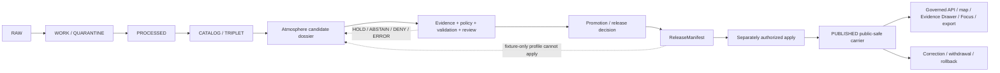

<!-- [KFM_META_BLOCK_V2]
doc_id: kfm://doc/runbook-atmosphere-release
title: Atmosphere Release Runbook
type: standard
subtype: operational-runbook
version: v1.0.0
prior_version: proposed-scaffold
status: draft; repository-grounded; fixture-first; operational-release-hold; not-for-life-safety; non-authoritative; non-publisher
owners:
  - "@bartytime4life — verified GitHub review route only"
  - "NEEDS VERIFICATION — accountable Atmosphere, evidence, source-rights, sensitivity, Hazards-seam, validation, policy, review, release, correction, rollback, operations, and independent-review assignments"
created: "NEEDS VERIFICATION — the prior scaffold carried no creation date"
updated: 2026-08-24
policy_label: repository-facing; atmosphere; release; fixture-first; no-network; operational-hold; non-publication; not-for-life-safety
current_path: docs/runbooks/atmosphere/RELEASE_RUNBOOK.md
owning_root: docs/
responsibility: "Describe the bounded operator procedure for assembling and reviewing an Atmosphere release candidate, exercising current fixture-first release controls, and handing a complete packet to separately authorized release actors without creating release, deployment, promotion, publication, regulatory, medical, emergency, or life-safety authority."
truth_posture: >-
  CONFIRMED same-path repository placement, accepted Directory Rules basis,
  canonical release-decision root, empty Atmosphere candidate lane, dual-profile
  generic ReleaseManifest contract/schema, deterministic strict fixture validator,
  read-only release-manifest and release-dry-run workflows, bounded Atmosphere
  no-network profiles, and current operational holds / PROPOSED future accepted
  Atmosphere release profile, authenticated reference resolver, artifact/signature
  verification, policy evaluator, independent review, release executor, public
  carrier binding, and operational read-back / CONFLICTED generic strict release
  candidate profile versus permissive Atmosphere-domain schema stub, current
  release-index prose versus machine profile states, and placeholder Atmosphere
  rollback card versus generic RollbackCard profile / UNKNOWN production release
  registry, signer custody, deployed consumers, external caches, public endpoints,
  and operator capacity / NEEDS VERIFICATION accountable human assignments,
  accepted policy and release profiles, required-check coupling, exact-head hosted
  results, public parity, and first governed Atmosphere release; cite-or-abstain
prepared_under_prompt: KFM Repository Build-Out & Markdown Modernization Implementation Agent v6.0.0
evidence_snapshot:
  repository: bartytime4life/Kansas-Frontier-Matrix
  base_ref: main
  base_commit: b2c6022cb0fa12269403aebe49698a141eeb8586
  target_prior_blob: 1a3ac56d5108197f57716f84a6db45370320a0f4
  directory_rules_blob: fd49a0b83e55cef52c1124281f093e263526898d
  directory_rules_decision: ADR-0029 accepted
  release_root_readme_blob: 60b6a656f8f2b765616bba7223f51c25863c7172
  atmosphere_candidate_readme_blob: 2cff863a65c035cc167583ecae481c03580fc24a
  generic_release_manifest_contract_status: PROPOSED dual-profile; strict profile fixture-only
  generic_release_manifest_schema_blob: c76cd9bdddb34cf33c8eb62801269553726c5923
  generic_release_manifest_validator_blob: 00307dc0d5e2c3867a229076e3702f8111455425
  release_manifest_workflow_blob: 2895266e202bf1f0a1d24c54e14f3b64f8a1c1c4
  publication_denial_dry_run_blob: 5fed3a16aa0915b9233861048fc6a1e676e0ed8f
  atmosphere_release_manifest_schema_blob: fd0242f2a7aaa7c8d179e88fcd0c4059f0a6998a
  atmosphere_placeholder_rollback_card_blob: ba00c2191e8b190059e729d6c70bf8c69d4fc2da
  atmosphere_published_lane_readme_blob: 25f26ea54c3c298175c510191427e5cef8eaa4cd
inspection_boundary: >-
  Current-session GitHub reads of the target scaffold, accepted Directory Rules
  evidence, release root, Atmosphere candidate and published lanes, generic and
  domain ReleaseManifest surfaces, validators, fixtures, release-manifest and
  release-dry-run workflows, Atmosphere domain workflow, publication posture,
  release index, and sibling source-refresh, validation, correction, stale-state,
  promotion, and rollback runbooks. Repository-native commands were not run in a
  mounted checkout during authoring. No source was contacted, no actor was
  authenticated, no candidate or manifest instance was created, and no policy,
  review, release, correction, withdrawal, rollback, deployment, promotion,
  publication, alert, health determination, or regulatory action was performed.
related:
  - docs/runbooks/README.md
  - docs/runbooks/atmosphere/README.md
  - docs/runbooks/atmosphere/SOURCE_REFRESH_RUNBOOK.md
  - docs/runbooks/atmosphere/NO_NETWORK_TEST_RUNBOOK.md
  - docs/runbooks/atmosphere/VALIDATION_RUNBOOK.md
  - docs/runbooks/atmosphere/PROMOTION_RUNBOOK.md
  - docs/runbooks/atmosphere/CORRECTION_RUNBOOK.md
  - docs/runbooks/atmosphere/STALE_STATE_RUNBOOK.md
  - docs/runbooks/atmosphere/ROLLBACK_RUNBOOK.md
  - docs/doctrine/directory-rules.md
  - docs/adr/ADR-0029-adopt-directory-governance-standard-v2.md
  - docs/domains/atmosphere/README.md
  - docs/domains/atmosphere/OBSERVED_MODELED_SEPARATION.md
  - docs/domains/atmosphere/PUBLICATION_POSTURE.md
  - docs/domains/atmosphere/RELEASE_INDEX.md
  - release/README.md
  - release/candidates/atmosphere/README.md
  - release/manifests/README.md
  - release/promotion_decisions/README.md
  - release/reviews/atmosphere/README.md
  - release/correction_notices/README.md
  - release/withdrawal_notices/README.md
  - release/rollback_cards/README.md
  - contracts/release/release_manifest.md
  - schemas/contracts/v1/release/release_manifest.schema.json
  - fixtures/release/release_manifest/
  - tools/validators/release/validate_release_manifest.py
  - tests/validators/test_validate_release_manifest.py
  - tools/release/release_dry_run.py
  - .github/workflows/release-manifest.yml
  - .github/workflows/release-dry-run.yml
  - .github/workflows/domain-atmosphere.yml
  - schemas/contracts/v1/domains/atmosphere/release_manifest.schema.json
  - data/published/atmosphere/README.md
tags: [kfm, runbook, atmosphere, air, release, release-manifest, candidate, evidence, policy, review, correction, rollback, fixture-first, operational-hold, not-for-life-safety]
notes:
  - "Same-path modernization under accepted ADR-0029; no root, lane, contract, schema, policy, fixture, validator, test, workflow, receipt, proof, release record, published carrier, deployment, or public state is created or moved."
  - "The generic ReleaseManifest strict profile is the current bounded validator target; it is PROPOSED_INACTIVE, FIXTURE_ONLY, and fixes every authority-bearing governance flag to false."
  - "The Atmosphere-domain release-manifest schema remains a permissive greenfield stub whose declared contract, validator, and fixture lane are absent; it is not an equivalent release authority."
  - "Operational Atmosphere release remains HOLD because no child candidate dossier, authenticated review, accepted live policy/evaluator, reference resolver, artifact/signature verifier, release executor, or public parity proof is established."
  - "This runbook is an instruction and handoff surface. It is not a ReleaseManifest, PromotionDecision, ReviewRecord, PolicyDecision, release approval, publication record, regulatory determination, or alert."
[/KFM_META_BLOCK_V2] -->

<a id="top"></a>

# Atmosphere Release Runbook

> **Repository-grounded procedure for assembling, validating, reviewing, and handing off an Atmosphere / Air release candidate while keeping evidence, policy, review, release, deployment, promotion, publication, regulation, medical interpretation, emergency communication, and life-safety authority separate.**

<p>
  
  
  
  
  
  
</p>

> [!IMPORTANT]
> **A release is a governed decision and state transition, not a file move, candidate folder, manifest-shaped JSON file, passing validator, green workflow, pull request, merge, GitHub release, map-layer toggle, cache change, or public URL.** This runbook prepares and checks a packet; it never grants the packet release authority.

> [!WARNING]
> **KFM is not an official AQI, medical, regulatory, emergency-alerting, or life-safety authority.** Atmosphere may carry public-safe observations, forecasts, smoke context, model context, and official advisory context with source attribution and explicit caveats. It must not declare conditions safe or unsafe, certify exposure, issue health guidance, originate an alert, or replace an official issuer.

> [!CAUTION]
> **Operational Atmosphere release is `HOLD` at the pinned repository state.** The Atmosphere candidate lane contains no child candidate dossier. The current strict `ReleaseManifest` profile is inactive and fixture-only, all of its governance flags are false, the Atmosphere-specific schema is an id-only placeholder, and no authenticated reviewer, accepted live policy evaluator, reference resolver, artifact/signature verifier, production release executor, or public read-back proof was established.

**Quick navigation:** [Purpose](#1-purpose-scope-and-non-goals) · [Authority](#2-authority-placement-and-current-evidence) · [States](#3-state-separation-truth-labels-and-finite-outcomes) · [Invariants](#4-atmosphere-release-invariants) · [Roles](#5-roles-and-separation-of-duties) · [Preflight](#6-required-inputs-preconditions-and-stop-conditions) · [Objects](#7-release-object-family-and-lifecycle-map) · [Procedure](#8-bounded-release-procedure) · [Manifest](#9-releasemanifest-profile-and-domain-schema-conflict) · [Validation](#10-current-executable-validation-and-dry-run-boundaries) · [Carriers](#11-public-carrier-disclosure-and-read-back-contract) · [Failures](#12-failure-classification-and-escalation) · [Correction](#13-correction-withdrawal-rollback-and-stale-state) · [Handoff](#14-review-handoff-packet) · [Open work](#15-current-holds-and-open-verification) · [Maintenance](#16-maintenance-correction-and-document-rollback) · [Checklist](#appendix-a-operator-checklist) · [Template](#appendix-b-non-executing-candidate-template) · [Commands](#appendix-c-command-and-path-matrix) · [Anti-patterns](#appendix-d-anti-patterns)

---

## 1. Purpose, scope, and non-goals

### Purpose

Use this runbook after a bounded Atmosphere candidate has completed its approved pre-release processing and before any actor claims that the candidate is released, deployed, published, current, authoritative, medically meaningful, regulatory, or safe for public use.

The operator's responsibilities are to:

1. freeze the exact candidate, repository revision, artifact set, source set, evidence set, policy profile, review scope, and rollback target;
2. confirm that the candidate has a real dossier rather than a path, placeholder, or planning row;
3. preserve source role, knowledge character, units, averaging windows, spatial support, time kinds, freshness, uncertainty, caveats, rights, and sensitivity;
4. verify deterministic artifact identity and bounded release-manifest shape with the repository's current fixture-first controls;
5. prove that known missing-evidence, denied-policy, integrity, public-safety, and missing-review conditions remain publication-denying;
6. assemble a pointer-based review handoff without duplicating payloads or authority-bearing records;
7. stop before release authority acts;
8. verify public read-back only after a separately authorized release is proven to exist.

### In scope

- public-safe Atmosphere observations, regulatory archives, forecast or model context, remote-sensing context, climate products, low-cost-sensor products, derived products, and official advisory context that already have explicit source-role and knowledge-character treatment;
- candidate dossier completeness;
- immutable artifact identity, digests, references, time, lineage, correction, withdrawal, and rollback pointers;
- fixture-only `ReleaseManifest` validation;
- bounded publication-denial dry runs;
- human and policy review handoff;
- public carrier disclosure and post-release read-back requirements;
- correction, stale-state, withdrawal, and rollback readiness.

### Out of scope

This runbook does not:

- admit or activate a source;
- contact live EPA, KDHE, NOAA/NWS, Kansas Mesonet, community-sensor, satellite, model, or other upstream services;
- create or redefine contracts, schemas, policy rules, fixtures, validators, workflows, receipts, proofs, review records, or release records in Markdown;
- decide whether an observation, model, forecast, advisory, sensor, or product is scientifically or operationally correct;
- certify calibration, regulatory equivalence, source authority, model skill, exposure, health effect, or emergency significance;
- create a real `ReleaseManifest`, `PromotionDecision`, `PolicyDecision`, `ReviewRecord`, `CorrectionNotice`, `WithdrawalNotice`, or `RollbackCard`;
- mutate `data/published/`, aliases, storage, caches, APIs, search, graphs, tiles, maps, exports, deployments, or public endpoints;
- authorize release, deployment, promotion, publication, or public use;
- issue, paraphrase as KFM instruction, or replace official warnings and life-safety guidance;
- treat generated language, a rendered map, a tile, a dashboard, a model output, or a badge as evidence.

Use the [Source Refresh Runbook](./SOURCE_REFRESH_RUNBOOK.md) for an already-admitted source refresh, the [Validation Runbook](./VALIDATION_RUNBOOK.md) for current fixture profiles, the [Correction Runbook](./CORRECTION_RUNBOOK.md) for already released defects, the [Stale-State Runbook](./STALE_STATE_RUNBOOK.md) for freshness failures, and the [Rollback Runbook](./ROLLBACK_RUNBOOK.md) for non-executing rollback preparation and synthetic rehearsal.

[Back to top](#top)

---

## 2. Authority, placement, and current evidence

### 2.1 Directory Rules basis

Accepted [ADR-0029](../../adr/ADR-0029-adopt-directory-governance-standard-v2.md) adopts [Directory Rules v2](../../doctrine/directory-rules.md). The target is an existing human operational procedure:

```text
docs/runbooks/atmosphere/RELEASE_RUNBOOK.md
```

This same-path update is a `PLACE` under the `docs/` responsibility root. It does not create a second release root, schema home, policy home, evidence store, receipt store, proof store, published-data home, or public-delivery path.

| Responsibility | Owning surface | Relationship to this runbook |
|---|---|---|
| Human Atmosphere release procedure | `docs/runbooks/atmosphere/` | **Owned here** |
| Domain meaning and denials | [`docs/domains/atmosphere/`](../../domains/atmosphere/README.md) and `contracts/domains/atmosphere/` | Referenced; not redefined |
| Machine shape | `schemas/contracts/v1/` | Referenced; a shape pass is bounded |
| Policy and obligations | `policy/` | Required; never inferred from prose |
| Evidence and proof | `EvidenceRef`, `EvidenceBundle`, `data/proofs/`, validation authorities | Required; never manufactured here |
| Candidate dossier | [`release/candidates/atmosphere/`](../../../release/candidates/atmosphere/README.md) | Input and blocker state |
| Release decision records | [`release/`](../../../release/README.md) | Separately governed authority plane |
| Public-safe carriers | [`data/published/atmosphere/`](../../../data/published/atmosphere/README.md) | Output only after a real release transition |
| Executable checks | `tools/validators/`, `tests/`, workflows | Bounded behavior proof |
| Public access | governed APIs and released public-safe carriers | Never RAW, WORK, QUARANTINE, candidate, or direct-model access |

### 2.2 Current repository evidence

The prior target is a six-line `PROPOSED scaffold` sourced from `docs/domains/atmosphere/MISSING_OR_PLANNED_FILES.md`. That planning register explains why the path was expected; it is not current release authority.

| Surface | CONFIRMED current evidence | Safe conclusion |
|---|---|---|
| Target path | Tracked scaffold, prior blob `1a3ac56d…` | A substantive same-path procedure is needed |
| Release root | Canonical append-only decision plane with mixed fixture-first maturity | Release records belong there; the root itself does not publish |
| Atmosphere candidate lane | Parent README only; no child candidate dossier | No active or manifest-ready Atmosphere candidate is established |
| Generic `ReleaseManifest` contract | Draft, PROPOSED, dual-profile | Useful semantic target; not accepted production release authority |
| Generic strict schema profile | Closed, deterministic, `PROPOSED_INACTIVE`, `FIXTURE_ONLY`, lifecycle `CANDIDATE` | Bounded candidate validation only |
| Generic manifest validator | Executable no-network shape and local semantic checks | PASS does not resolve refs, verify bytes/signatures, execute policy, authenticate review, or release |
| Manifest fixture matrix | Four valid and seventeen invalid cases | Exact fixture polarity exists |
| `release-manifest` workflow | Read-only; runs focused tests and fixture validator | Hosted fixture proof only |
| Publication-denial dry run | Five deterministic negative mutations over a synthetic promotion packet | Proves selected deny/abstain paths; assembles no release |
| `release-dry-run` workflow | Read-only; checks no candidate payload, runs denial proof, promotion readiness, and rollback readiness | Operational release remains held |
| Atmosphere domain workflow | Multiple bounded synthetic profiles; broader semantics, evidence, proof, and release held | Useful domain checks; no live truth or release proof |
| Atmosphere manifest schema | Permissive id-only greenfield stub; declared contract, validator, and fixture lane absent | Not equivalent to the generic bounded strict profile |
| Atmosphere rollback-card file | Documentation placeholder rather than a schema-valid generic card | No operational rollback target is established by that file |
| Published Atmosphere lane | README-level boundary exists | Public carrier existence and parity remain separately verifiable |
| Human authority | CODEOWNERS route to `@bartytime4life` | Review routing only; no independent release authority or duty separation proved |

### 2.3 Current bounded determination

- **CONFIRMED:** the repository has fixture-first `ReleaseManifest`, promotion-readiness, publication-denial, and rollback-readiness controls.
- **CONFIRMED:** the Atmosphere lane has bounded synthetic validation profiles and explicit source-role/knowledge-character safeguards.
- **HOLD:** operational Atmosphere candidate assembly, live reference resolution, artifact and signature verification, policy execution, authenticated review, release persistence, public carrier activation, deployment, publication, and public read-back.
- **CONFLICTED:** generic release-manifest maturity versus the Atmosphere id-only schema stub; machine fixture states versus older domain release-index prose; generic RollbackCard profile versus the Atmosphere placeholder card.
- **UNKNOWN:** production release registry, signer custody, deployed consumers, external caches, public endpoint state, operational staffing, and first governed Atmosphere release.
- **NEEDS VERIFICATION:** accountable stewards, independent reviewers, accepted policy/release profiles, required-check coupling, exact-head hosted results, public parity, correction propagation, and rollback capacity.

[Back to top](#top)

---

## 3. State separation, truth labels, and finite outcomes

### 3.1 Do not collapse these states

| Axis | Example | What it does not imply |
|---|---|---|
| File presence | Runbook, candidate README, manifest-shaped file | Correctness or authority |
| Documentation maturity | Scaffold, draft, repository-grounded | Operational admission |
| Candidate maturity | Proposed, assembling, ready for review, held | Release |
| Validator outcome | PASS, FAIL, ERROR | Evidence resolution or approval |
| Policy outcome | Allow, deny, restrict, abstain, hold under an accepted profile | Release execution |
| Human review | Authenticated review for an exact scope | Publication unless the release process grants that effect |
| Promotion decision | Approval or denial for a specific transition | Artifact serving or deployment |
| Release record | Immutable decision object | Public bytes are live and correct |
| Deployment | Runtime or storage changed | Governed release or public parity |
| Publication | Public-safe carrier is exposed | Scientific, regulatory, medical, or emergency authority |
| Correction or rollback | A governed transition was recorded and applied | Erasure or silent history replacement |

### 3.2 Truth labels

| Label | Meaning |
|---|---|
| `CONFIRMED` | Verified from pinned repository evidence, executable code, fixtures, workflows, or generated artifacts inspected in this session |
| `PROPOSED` | Future design, actor assignment, profile, or operation not verified as accepted implementation |
| `UNKNOWN` | Evidence is insufficient |
| `NEEDS VERIFICATION` | A concrete check remains |
| `CONFLICTED` | Current authority, naming, schema, or lifecycle surfaces disagree |
| `HOLD` | Do not advance; preserve the prior safe state |

### 3.3 Operator outcomes

The following are human procedure classifications. Do not serialize them as machine enums unless an accepted contract owns the exact value.

| Outcome | Meaning | Maximum effect |
|---|---|---|
| `READY_FOR_REVIEW` | Candidate packet appears complete enough for accountable review | Submit handoff only |
| `HOLD` | Authority, evidence, rights, sensitivity, time, review, policy, rollback, or implementation is unresolved | No release action |
| `ABSTAIN` | Evidence is insufficient for a consequential claim or interpretation | Preserve uncertainty; no public claim |
| `DENY` | Policy, rights, sensitivity, source-role, life-safety, or trust-boundary rule blocks the operation | No release or exposure |
| `ERROR` | Tooling, integrity, environment, or validation could not complete safely | No permissive fallback |
| `NO_ACTION` | Candidate is unchanged, superseded, withdrawn, or not eligible | Record reason where material |
| `REPAIR_REQUIRED` | Candidate or support object is defective | Return to the owning upstream lane |
| `RELEASE_DECISION_PENDING` | Packet was handed to authorized actors | No release claim |
| `RELEASED` | A separately authorized immutable release and applied public-safe transition are verified | May begin read-back verification |
| `ROLLED_BACK` | A separately authorized rollback was applied and verified | Prior-safe state plus audit lineage |

Current repository evidence supports fixture `PASS` and deny-path testing. It does not support using `RELEASED` or `ROLLED_BACK` for a real Atmosphere operation.

[Back to top](#top)

---

## 4. Atmosphere release invariants

These invariants are non-compensable. Feature value, urgency, visual quality, workflow success, or stakeholder pressure cannot override them.

| Invariant | Required release posture | Failure posture |
|---|---|---|
| **AQI is not concentration** | AQI remains a source-defined index with averaging and category context; do not present it as µg/m³, ppb, or ppm | `DENY` |
| **AOD is not ground-level PM2.5** | Remote-sensing aerosol context remains a distinct observation/model support type with uncertainty | `DENY` or `ABSTAIN` |
| **Model and forecast fields are not observations** | Preserve model/run identity, lead/valid time, initialization, uncertainty, and observation distinction | `DENY` |
| **Low-cost sensors are not regulatory monitors** | Correction method, calibration/collocation support, humidity regime, caveats, confidence, and limitations remain visible | `HOLD` or `DENY` |
| **Preliminary is not certified** | Preserve provisional, preliminary, certified, corrected, and archived status | `HOLD` or `DENY` |
| **Context is not exposure or causality** | Smoke, fire, transport, weather, demographic, and infrastructure joins remain contextual unless evidence and policy support a narrower claim | `ABSTAIN` or `DENY` |
| **Advisory context is not KFM instruction** | Show issuer, issue/effective/expiry state, and redirect; do not originate imperatives | `DENY` |
| **Station, grid, polygon, county, and model-cell support differ** | Preserve spatial support, aggregation, generalization, and transform receipts | `HOLD` |
| **Time kinds remain distinct** | Preserve observed, valid, model-run, retrieval, source-publication, release, effective, correction, and expiry time where material | `HOLD` or `ABSTAIN` |
| **Freshness is source/product specific** | Use the accepted source/product cadence and stale rule; do not invent a universal threshold | `HOLD` |
| **Rights and sensitivity travel with derivatives** | Attribution, redistribution, embargo, access, precision, and transform obligations remain attached | `DENY` |
| **EvidenceRef resolves before consequential release claims** | EvidenceBundle support must be resolvable and bounded to the actual claim | `ABSTAIN` or `DENY` |
| **Public clients cross the trust membrane** | Governed APIs and released public-safe carriers only | `DENY` |
| **AI is interpretive** | Model language cites released evidence, honors finite outcomes, and never creates release state | `DENY` |
| **Correction and rollback are first-class** | Prior release, affected carriers, correction path, invalidation plan, and rollback target remain inspectable | `HOLD` |

### Required public disclosure families

A release packet must preserve the disclosure fields appropriate to its product:

- knowledge character and source role;
- observation, forecast, model, advisory, or derived status;
- parameter, unit, statistic, averaging or accumulation window;
- spatial support and any generalization;
- observed/valid/run/retrieval/release/effective/expiry times;
- freshness or stale state;
- uncertainty, confidence, quality flags, limitations, and caveats;
- source and issuing authority;
- EvidenceBundle link;
- rights, attribution, sensitivity, and transform state;
- correction, supersession, withdrawal, and rollback lineage;
- explicit not-for-life-safety and official-source redirect where advisory context appears.

[Back to top](#top)

---

## 5. Roles and separation of duties

CODEOWNERS currently verifies one GitHub review route. It does not appoint source, scientific, regulatory, medical, policy, review, release, security, correction, or independent authority.

| Role class | Required responsibility | Must not be inferred from |
|---|---|---|
| Candidate author or release preparer | Assembles exact pointer-based packet and records limitations | File authorship alone |
| Atmosphere domain steward | Confirms terminology, units, knowledge character, source-role distinctions, time, uncertainty, and domain scope | Repository ownership |
| Source/evidence steward | Confirms admitted source identity, authority role, EvidenceRef closure, caveats, and freshness | A URL, citation string, or hash alone |
| Rights and sensitivity reviewer | Confirms permitted use, attribution, redistribution, access, precision, joins, and required transforms | Public availability |
| Hazards liaison | Confirms advisory/event/life-safety boundary and official-source redirection | Presence of alert text |
| Validation steward | Confirms exact validator/profile, fixture polarity, revision, and proof limits | Green badge alone |
| Policy steward | Owns accepted input profile, bundle, evaluator, normalization, obligations, and reason codes | Rego file presence |
| Independent reviewer | Reviews packet completeness and material risks independently where required | Self-declared identity |
| Release authority | Makes the separately governed release decision for an immutable packet | Candidate readiness or PR merge |
| Correction and rollback steward | Confirms correction propagation, withdrawal, invalidation, prior-safe target, and recovery | Placeholder card |
| Operations/public-delivery owner | Applies an authorized release and proves public read-back, cache state, and observability | Release record alone |

### Minimum duty separation

For a policy-significant Atmosphere release, the candidate author, specialized domain/rights/sensitivity reviewer, and release authority should be distinct when the accepted profile requires independence. If required separation cannot be established, the result is `HOLD`. Do not silently reduce review burden because the repository has one CODEOWNERS route.

### AI and automation role

Automation may:

- validate exact fixture profiles;
- calculate deterministic hashes;
- compare artifact inventories;
- detect missing references;
- prepare a candidate report;
- propose a correction or rollback handoff;
- summarize already released evidence with citations.

Automation must not:

- appoint reviewers;
- infer rights or cultural/sensitivity authority;
- self-approve its output;
- turn a `PASS` into release;
- write or expose public state without a separately authorized operator;
- originate life-safety guidance;
- treat generated language as evidence.

[Back to top](#top)

---

## 6. Required inputs, preconditions, and stop conditions

### 6.1 Authority freeze

Before beginning, record:

- exact `main` and candidate revision;
- target candidate ID and immutable candidate path;
- candidate artifact identities and digests;
- current source-descriptor refs;
- evidence, validation, policy, review, proof, receipt, and attestation refs;
- intended audience and public/restricted scope;
- current accepted contract/schema/profile;
- prior release, correction, withdrawal, and rollback target;
- current public carrier and cache inventory, if any;
- overlapping branches or pull requests;
- accountable actors and required independence;
- explicit non-goals and maximum authorized effect.

Any unresolved identity, owner, policy profile, or overlapping authority is a stop condition.

### 6.2 Minimum candidate packet

| Input | Required evidence | Stop condition |
|---|---|---|
| Candidate dossier | Child dossier under the accepted candidate lane with stable identity | Parent README or planning row only |
| Artifact inventory | Sorted immutable refs, media types, roles, and exact digests | Mutable path, unknown bytes, missing role |
| Source support | Admitted `SourceDescriptor` refs with role, terms, citation, cadence, and sensitivity | Placeholder, inactive, unresolved, or rights-unknown source |
| Evidence support | Claim-bounded EvidenceRefs resolving to EvidenceBundles | Missing, stale, contradicted, or overbroad support |
| Validation | Exact profile, revision, positive and negative results, limitations | Placeholder validator, vacuous suite, unclassified failure |
| Policy | Accepted profile and normalized decision with obligations | Unbound or default-only policy scaffold |
| Review | Authenticated scoped review record and authority interval where required | Self-review, expired authority, absent scope |
| Promotion | Exact separately governed promotion decision where required | Readiness prose only |
| Rights/sensitivity | Approved audience, attribution, precision, transform, and access posture | Unknown or inconsistent posture |
| Time/freshness | Coherent time fields and accepted stale-state rule | Expired or ambiguous currentness |
| Correction | Applicable correction path and affected-carrier method | No propagation or public notice path |
| Rollback | Prior-safe target or explicit first-release withdrawal/null posture; tested bounded plan | Placeholder card or unknown invalidation |
| Attestation/signature | Accepted mechanism, signer identity/custody, and digest binding where required | Unverified or detached signature |
| Public delivery plan | Governed API/carrier target, cache policy, observability, read-back, and rollback link | Direct canonical-store path |

### 6.3 Immediate stop conditions

Stop with `HOLD`, `ABSTAIN`, `DENY`, or `ERROR` when any of these applies:

- no child Atmosphere candidate dossier exists;
- the selected machine profile is not accepted for the intended operation;
- a legacy id-only manifest is being treated as complete;
- the Atmosphere id-only schema stub is being treated as release-grade;
- evidence does not resolve or does not support the exact public claim;
- source role, knowledge character, units, time, spatial support, or uncertainty is collapsed;
- rights, redistribution, attribution, sensitivity, access, or harmful precision is unresolved;
- the requested content would make KFM an alert, medical, regulatory, or life-safety authority;
- policy is not accepted, selected, executed, and normalized;
- review is unauthenticated, out of scope, expired, or not independent where required;
- artifact bytes or signatures cannot be verified;
- correction, withdrawal, cache invalidation, or rollback is missing;
- a production write surface cannot be distinguished from synthetic rehearsal;
- release executor, public target, or read-back method is unknown;
- a tool fails, times out, or returns ambiguous output;
- an existing release, correction, or rollback operation is active over the same subject.

[Back to top](#top)

---

## 7. Release object family and lifecycle map

### 7.1 Object families remain distinct

| Object family | What it may establish | What it never establishes alone |
|---|---|---|
| `SourceDescriptor` | Source identity, role, terms, cadence, citation, sensitivity context | Truth, evidence closure, release |
| `RunReceipt` | What process ran over which declared inputs and outputs | Correctness, approval |
| `ValidationReport` | A named check produced a bounded result | Source authority, policy, release |
| `EvidenceRef` / `EvidenceBundle` | Traceable support and limitations for bounded claims | Permission or release state |
| `PolicyDecision` | A selected policy/evaluator produced a decision and obligations | Review authority or public mutation |
| `ReviewRecord` | A governed review occurred for a scope and authority interval | Release unless the release profile grants that effect |
| `PromotionDecision` | Accountable decision on a lifecycle transition | Applied transition or serving |
| `ReleaseManifest` | Binding for a specific release artifact set and support refs | Publication by file presence |
| `CorrectionNotice` | Supersession/correction statement and affected scope | Propagation completion |
| `WithdrawalNotice` | Decision to withdraw a release or carrier | Erasure |
| `RollbackCard` | Candidate/approved recovery target and plan according to its profile | Applied rollback |
| Signature/attestation | Digest-bound statement by an identified mechanism | Truth, rights, policy, review, or release by itself |
| Published carrier | Bytes exposed through governed delivery | Sovereign truth or correct currentness |
| Public read-back record | Observed parity for exact carrier/endpoints after authorized action | Upstream evidence sufficiency |

### 7.2 Lifecycle and decision flow



The lifecycle shorthand remains:

```text
RAW -> WORK / QUARANTINE -> PROCESSED -> CATALOG / TRIPLET -> PUBLISHED
```

Promotion and release are governed state transitions. `release/` stores decision records; `data/published/` stores released public-safe carriers. Neither a path move nor a repository merge performs the transition.

### 7.3 Atmosphere-specific release joins

A public Atmosphere release should be reconstructable across stable refs without putting every object into one file:

```text
candidate_id
  -> artifact refs + digests
  -> source descriptor refs
  -> EvidenceBundle refs
  -> validation refs
  -> policy decision refs
  -> review record refs
  -> promotion decision refs
  -> ReleaseManifest ref
  -> published carrier refs
  -> correction / withdrawal / rollback refs
  -> public read-back evidence
```

A missing join does not become permission to copy the missing object's content into Markdown. It becomes a hold.

[Back to top](#top)

---

## 8. Bounded release procedure

### Step 0 — Freeze the exact scope

Record the authority-freeze fields from §6.1. Re-read current `main`, the target candidate, the governing contract/schema, release root, open pull requests, and active operations.

**Outcome:** `HOLD` if any authority or overlap is unresolved.

### Step 1 — Confirm a real candidate dossier exists

Inspect [`release/candidates/atmosphere/`](../../../release/candidates/atmosphere/README.md).

A valid start requires a child candidate dossier with:

- stable candidate ID;
- object/product and artifact scope;
- source roles and knowledge characters;
- spatial and temporal scope;
- current candidate state;
- blockers and limitations;
- immutable support refs;
- intended audience;
- correction and rollback posture.

At the pinned evidence snapshot, the lane has no child candidate dossier. Therefore a real Atmosphere release procedure currently stops here with `HOLD_FOR_ARTIFACT` or `HOLD_FOR_CANDIDATE`.

Do not convert the parent README, `RELEASE_INDEX.md` template, proof README, placeholder rollback card, generated artifact, or roadmap idea into a candidate.

### Step 2 — Verify source, evidence, and claim closure

For each release-visible claim:

1. resolve its source descriptors;
2. preserve source role and knowledge character;
3. resolve EvidenceRefs to EvidenceBundles;
4. verify support covers the exact parameter, unit, statistic, time, spatial support, and interpretation;
5. record limitations, conflicts, stale state, and uncertainty;
6. abstain from claims that exceed support.

Examples of forbidden evidence substitution:

- AQI category supporting a concentration claim;
- AOD supporting a ground PM2.5 measurement claim;
- forecast or model field supporting an observed event claim;
- low-cost sensor context supporting a regulatory monitor claim;
- advisory context supporting KFM-authored life-safety instructions;
- a map color, screenshot, dashboard, summary, or AI answer supporting itself.

**Outcome:** `ABSTAIN`, `DENY`, or `HOLD` when closure fails.

### Step 3 — Verify Atmosphere validation at the exact revision

Use the [Validation Runbook](./VALIDATION_RUNBOOK.md) to select only substantive, wired profiles. Record:

- commit SHA;
- command or workflow;
- fixture/profile version;
- positive and negative case counts;
- exact result;
- introduced, inherited, pending, expected, and not-run findings;
- validator scope and non-effects.

Current Atmosphere workflows prove bounded synthetic behaviors only. They do not create an accepted aggregate `DomainValidationReport`, live-source truth, EvidenceBundle, policy result, review, or release.

**Outcome:** `REPAIR_REQUIRED` or `HOLD` for missing, placeholder, vacuous, failed, or unclassified checks.

### Step 4 — Evaluate rights, sensitivity, policy, and life-safety boundaries

Require the exact accepted policy input and evaluator profile. Confirm:

- rights and redistribution;
- citation/attribution;
- audience and access class;
- sensitivity and precision;
- cross-domain joins;
- generalization/redaction obligations;
- advisory redirect and not-for-life-safety obligations;
- correction/withdrawal obligations;
- finite decision and public-safe reason codes.

Do not infer policy from a README, default-only Rego scaffold, filename, license guess, source popularity, or absence of objection.

**Outcome:** `DENY` for prohibited exposure; `HOLD` for unbound evaluator or unresolved obligations.

### Step 5 — Verify time, freshness, and product semantics

Build a time/meaning table for each artifact:

| Concern | Required check |
|---|---|
| Observation | observed time, retrieval time, source publication/correction status |
| Forecast/model | initialization/run time, valid time, lead, expiry, model/version |
| Advisory context | issuer, issue, effective, expiry, cancellation/supersession |
| Climate/aggregate | baseline period, aggregation window, source vintage |
| Low-cost sensor | correction/calibration version and applicable period |
| Release | assembled, reviewed, decided, effective, public-read-back time |
| Correction | discovered, contained, issued, propagated, superseded time |

Apply the accepted stale-state rule. A product may be valid historically but stale for a "current" request. Do not substitute a universal freshness threshold.

**Outcome:** `HOLD`, `ABSTAIN`, or explicit stale/degraded candidate state.

### Step 6 — Freeze artifact inventory and integrity

For every candidate artifact:

- use immutable refs;
- record exact digest and media type;
- assign one bounded role;
- sort and deduplicate;
- deny floating `latest` references;
- bind EvidenceBundle refs to matching evidence artifacts when the selected profile requires it;
- record how bytes were independently verified;
- record build/transform receipts without treating them as proof;
- inventory downstream carriers and caches.

The current fixture validator checks declared shape and local relationships. It does not fetch or verify the real bytes.

**Outcome:** `DENY` for integrity mismatch; `ERROR` for unverifiable bytes; `HOLD` for missing artifact inventory.

### Step 7 — Close correction, withdrawal, and rollback paths

Before release review:

- identify the predecessor or explicit first-release posture;
- identify a prior-safe target or safe withdrawal/null state;
- validate the applicable generic `RollbackCard` profile;
- distinguish placeholder cards from schema-valid candidates;
- inventory API, map, tile, search, graph, export, AI, cache, documentation, and other carriers;
- define cache/alias invalidation and read-back;
- define correction notice and public notification requirements;
- preserve audit lineage and no-silent-mutation rules.

The tracked Atmosphere rollback card is a documentation placeholder. It does not satisfy this gate.

**Outcome:** `HOLD_FOR_ROLLBACK` until a real governed target and plan exist.

### Step 8 — Establish accountable review

Confirm:

- reviewer identity and authority record;
- scope and audience;
- authority-validity interval covering the decision;
- required independence;
- conflict-of-interest handling;
- explicit obligations;
- evidence, policy, validation, artifact, time, correction, and rollback refs;
- finite approval, denial, abstention, or hold result.

A candidate author cannot self-create missing independent authority. CODEOWNERS review does not by itself prove release review.

**Outcome:** `HOLD_FOR_REVIEW` or `DENY`.

### Step 9 — Exercise the strict fixture-only ReleaseManifest profile

When the packet is being modeled against the repository's current strict profile, use the generic release contract/schema/validator, not the incomplete Atmosphere stub.

The strict fixture candidate must remain:

- `profile_status: PROPOSED_INACTIVE`;
- `execution_mode: FIXTURE_ONLY`;
- `lifecycle_state: CANDIDATE`;
- `release_state` limited to the current candidate states;
- all governance authority flags `false`.

A fixture `PASS` means local deterministic shape and selected semantic relationships passed. It does not mean the candidate is releasable.

**Outcome:** fixture `PASS`, `FAIL`, or `ERROR`; maximum human state remains `READY_FOR_REVIEW` only if all non-machine dependencies separately close.

### Step 10 — Run the bounded publication-denial dry run

The current dry run must continue to block publication when:

- evidence is missing;
- policy denies;
- artifact integrity mismatches;
- rights/sensitivity is not public-safe;
- review is absent.

Record the exact revision and output. The dry run creates no candidate, decision, receipt, proof, manifest, release, or public state.

**Outcome:** `PASS` means selected negative paths stayed blocked. Any permissive regression is `ERROR` or `DENY` until corrected.

### Step 11 — Prepare the release-authority handoff

Assemble a compact pointer-based handoff containing:

- candidate identity and digest;
- intended release ID/version and audience;
- artifact inventory;
- source/evidence/validation/policy/review/promotion refs;
- rights/sensitivity/time/freshness/disclosure summary;
- correction, withdrawal, rollback, and invalidation plan;
- exact fixture-validation and dry-run results;
- unresolved items;
- explicit requested decision;
- statement that no release, deployment, or publication has occurred.

Stop. Do not create a release record on behalf of an unverified authority.

**Outcome:** `RELEASE_DECISION_PENDING`.

### Step 12 — Apply and public read-back only under separate authority

This step is currently `HOLD`.

A future accepted operational procedure must separately prove:

1. exact authorized decision and immutable manifest;
2. authenticated operator and environment;
3. precondition/readiness recheck;
4. atomic or otherwise safe application;
5. public-safe carrier binding;
6. cache and alias behavior;
7. API/map/search/export/AI/documentation parity;
8. evidence and correction links;
9. stale-state visibility;
10. rollback readiness;
11. public read-back at the exact release;
12. durable execution, release, and read-back records.

Failure after application triggers containment, correction, withdrawal, or rollback—not silent retry to a broader public surface.

[Back to top](#top)

---

## 9. `ReleaseManifest` profile and domain schema conflict

### 9.1 Generic dual profile

The current generic schema has two branches:

| Branch | Current shape | Correct interpretation |
|---|---|---|
| Legacy minimal | Requires `id`; optional `spec_hash` and `version`; permits additional properties | Compatibility only; an id-only PASS is not release completeness |
| Strict fixture candidate | Closed deterministic object with artifacts, refs, scope, time, lineage, provenance, and false governance flags | Bounded inactive candidate proof only |

The strict profile checks, among other things:

- deterministic RFC 8785 JCS plus SHA-256 identity;
- canonical artifact/reference arrays;
- artifact count;
- EvidenceBundle artifact binding;
- denial of floating `latest`;
- denial of reference-role collapse;
- temporal-window coherence;
- predecessor requirement for corrections;
- public-intended candidate rights/evidence/policy/promotion/review declarations;
- transform evidence for transform-required sensitivity;
- false authority-bearing governance flags.

### 9.2 What the generic validator does not do

It does not:

- resolve references;
- authenticate source, evidence, policy, review, promotion, or rollback objects;
- verify artifact bytes, signatures, attestations, or signer custody;
- execute policy;
- prove independent review;
- persist a release record;
- mutate lifecycle state, aliases, caches, storage, deployment, or public carriers;
- authorize release, publication, or public use.

### 9.3 Atmosphere-specific stub conflict

The Atmosphere schema at `schemas/contracts/v1/domains/atmosphere/release_manifest.schema.json`:

- requires only `id`;
- permits additional properties;
- declares `status: PROPOSED`;
- points to a missing domain contract;
- points to a missing domain validator;
- points to a missing domain fixture lane.

Treat it as a greenfield placeholder and a verification signal, not as the operational target. Do not combine the generic contract's semantics with the stub and then claim a domain profile exists.

### 9.4 Required resolution path

A future Atmosphere release profile should be one of:

1. an accepted specialization/composition of the generic `ReleaseManifest`; or
2. an accepted domain-specific contract/schema/profile with an explicit relationship to the generic object.

It must include:

- one semantic owner;
- one machine shape;
- explicit compatibility/migration rules;
- source-role and knowledge-character fields or resolvable refs;
- Atmosphere time/freshness and disclosure obligations;
- valid, invalid, denied, abstain, stale, correction, and rollback fixtures;
- validator and tests;
- accepted policy binding;
- review and release authority;
- correction/rollback path;
- public consumer contract.

Until then, use the generic strict profile only for fixture modeling and retain `HOLD` for operational release.

[Back to top](#top)

---

## 10. Current executable validation and dry-run boundaries

### 10.1 Focused ReleaseManifest fixture validation

From repository root in an isolated, dependency-complete checkout:

```bash
python -m unittest tests.validators.test_validate_release_manifest -v
python tools/validators/release/validate_release_manifest.py --fixtures
```

Expected bounded result:

- four valid and seventeen invalid cases retain exact polarity;
- valid strict candidates produce `PASS`;
- invalid candidates produce reviewed `FAIL`/`ERROR` findings;
- no network, release write, or public mutation occurs.

These commands are documented from current repository entry points. They were **not run in this connector-only authoring session**.

### 10.2 Bounded publication-denial dry run

```bash
make release-dry-run
```

The current target exercises five publication-denial cases and their tests. It does not assemble a real release.

Expected boundary:

```text
evidence missing -> blocked
policy denied -> blocked
integrity mismatch -> blocked
rights/sensitivity not public-safe -> blocked
review absent -> blocked
```

### 10.3 Hosted workflows

| Workflow | Current bounded purpose | Non-effects |
|---|---|---|
| `release-manifest` | Strict fixture profile tests and validator replay | No ref/byte/signature authentication or release |
| `release-dry-run` | Publication-denial, promotion-readiness, and rollback-readiness proof | No candidate assembly, decision, release, or publication |
| `domain-atmosphere` | Bounded synthetic Atmosphere profiles and placeholder inventory | No live source, evidence closure, policy, proof, or release |

A green hosted check is evidence for its exact head and scope. It is not independent human review, accepted policy, release approval, deployment, promotion, or publication.

### 10.4 Documentation validation for this runbook

A review of this file should check:

- exactly one `KFM_META_BLOCK_V2`;
- exactly one H1;
- balanced fences and valid tables;
- repository-relative links and exact path casing;
- final newline and no trailing whitespace;
- no secret, private endpoint, protected coordinate, operational token, or harmful denial detail;
- current target blob/base revision;
- no false execution claims;
- one-file changed-area scope;
- exact hosted-check status after the draft PR head exists.

### 10.5 Evidence record for a future real run

Record:

- runbook ID/version/content digest;
- repository revision and candidate revision;
- environment and actor class without credentials;
- exact inputs and outputs;
- tool/schema/profile versions;
- start/end time;
- result and reason codes;
- introduced/inherited/pending/not-run findings;
- EvidenceBundle, policy, review, promotion, release, correction, and rollback refs;
- affected carriers;
- reviewer disposition;
- unresolved residue.

[Back to top](#top)

---

## 11. Public carrier disclosure and read-back contract

### 11.1 Public carriers are downstream

Potential carriers include:

- governed API responses;
- map/layer manifests;
- PMTiles, MVT, COG, GeoParquet, GeoJSON, or other released artifacts;
- catalog and triplet/graph projections;
- Evidence Drawer payloads;
- search results;
- exports and reports;
- Focus Mode or other governed AI answers;
- screenshots, stories, and documentation.

None is sovereign truth. Every consequential public claim must remain traceable to the release and evidence appropriate to its consequence.

### 11.2 Required read-back checks

After a separately authorized future release, verify:

| Surface | Read-back requirement |
|---|---|
| Release record | Immutable manifest and decision resolve |
| Artifact bytes | Served bytes match declared digest |
| Governed API | Exact release/version, finite outcome, evidence/policy/correction refs |
| Map/layer | Only released public-safe source; no internal/candidate URL |
| Evidence Drawer | EvidenceBundle resolves with limitations and time |
| Search/graph | Release and source role preserved; no stale or unreleased projection |
| Export | Same rights, sensitivity, time, caveats, and citation requirements |
| AI/Focus Mode | Released evidence only; cites or abstains; no life-safety instruction |
| Cache/CDN | Correct release, invalidation posture, no prior unsafe bytes |
| Documentation/index | Reflects release without becoming authority |
| Stale state | Freshness/expiry visible and enforced |
| Correction/rollback | Public-safe correction and rollback links resolve |

### 11.3 Atmosphere public disclosure matrix

| Product | Minimum visible disclosure |
|---|---|
| Observed sensor | monitor/source identity, parameter, unit, averaging window, observed/retrieval time, quality/certification state |
| AQI report | AQI label, category/index basis, time, issuer, explicit non-concentration treatment |
| Forecast/model | model/version, run/init time, valid/lead time, uncertainty, "not observation" |
| Remote-sensing aerosol context | product/sensor, retrieval time, uncertainty, "not ground PM2.5" |
| Low-cost sensor | correction/calibration version, collocation applicability, humidity/caveats, confidence/limitations, "not regulatory" |
| Climate/aggregate | baseline and aggregation windows, statistic, source vintage, uncertainty |
| Derived/fusion | input roles, method/version, uncertainty, no role promotion |
| Advisory context | official issuer, issue/effective/expiry state, redirect, "KFM is not alert authority" |

### 11.4 Fail-closed public outcomes

A governed surface should use its accepted finite vocabulary. At a conceptual level:

- `ANSWER` only for released, cited, policy-cleared, current-enough content;
- `ABSTAIN` when evidence or interpretation is insufficient;
- `DENY` when rights, sensitivity, audience, release, or life-safety boundaries block exposure;
- `ERROR` when trust infrastructure cannot complete safely.

Do not expose restricted reason details when doing so would leak source existence, protected locations, credentials, infrastructure, or sensitive review substance.

[Back to top](#top)

---

## 12. Failure classification and escalation

### 12.1 Failure matrix

| Finding | Classification | Required action |
|---|---|---|
| No child candidate dossier | `HOLD` | Stop before manifest work |
| Legacy id-only manifest passes | `HOLD` | Do not treat as complete; use accepted profile |
| Atmosphere stub selected as release-grade | `CONFLICTED / HOLD` | Obtain contract/schema decision |
| Missing EvidenceBundle | `ABSTAIN` or `DENY` | Return to evidence lane |
| Policy denied | `DENY` | Preserve decision and obligations |
| Policy evaluator unbound | `HOLD` | Do not infer allow |
| Integrity mismatch | `DENY` or `ERROR` | Quarantine candidate; investigate |
| Rights/sensitivity unresolved | `DENY` or `HOLD` | Restrict, generalize, redact, quarantine, or withdraw |
| Review absent/ineligible | `HOLD` or `DENY` | Obtain accountable review |
| Source role/knowledge character collapsed | `DENY` | Repair candidate and negative tests |
| Time/freshness ambiguous | `HOLD` or `ABSTAIN` | Clarify valid/current scope |
| Advisory becomes KFM instruction | `DENY` | Remove imperative; redirect to issuer |
| Rollback target is placeholder | `HOLD` | Prepare governed target/profile |
| Fixture validation fails | `REPAIR_REQUIRED` | Correct introduced defect; classify inherited findings |
| Tool/environment failure | `ERROR` | Preserve prior state; do not bypass |
| Public read-back differs from manifest | `ERROR / CONTAIN` | Stop exposure; correction/withdrawal/rollback review |
| Sensitive data in logs/PR | `DENY / CONTAIN` | Remove exposure through governed incident path |

### 12.2 Introduced versus inherited findings

For every check, state:

- exact head and base;
- whether the finding occurs on the changed head;
- whether a matching base result exists;
- whether the changed file can cause the failure;
- whether the result is expected rejection;
- whether the check was pending or not run.

Do not assign causality merely because a workflow ran on the pull request.

### 12.3 Escalation

Escalate to the appropriate qualified authority for:

- source admission or source role;
- rights, redistribution, attribution, embargo, or access;
- sensitivity, harmful precision, or cross-domain joins;
- scientific/measurement semantics;
- regulatory or official-issuer status;
- Hazards/life-safety boundary;
- policy profile and obligations;
- independent review and duty separation;
- release, correction, withdrawal, rollback, deployment, or public serving;
- security incident or public leakage.

A runbook cannot resolve missing authority by listing a role.

[Back to top](#top)

---

## 13. Correction, withdrawal, rollback, and stale state

### 13.1 Choose the right action

| Condition | Preferred bounded posture |
|---|---|
| Candidate never released | Repair, hold, deny, or withdraw candidate |
| Released claim wrong but safe replacement available | Correction and superseding release |
| Currentness expired without evidence defect | Stale/degraded state, refresh, or withdrawal |
| Rights/sensitivity changed | Contain, restrict, withdraw, correct, and review rollback |
| Public bytes unsafe or integrity broken | Immediate containment plus withdrawal/rollback review |
| Prior-safe release exists | Rollback candidate and invalidation plan |
| No prior-safe release | Withdrawal/null carrier or service denial according to accepted policy |
| Erasure/privacy requirement | Separate rights/privacy process; rollback alone is insufficient |

### 13.2 Correction requirements

Use the [Correction Runbook](./CORRECTION_RUNBOOK.md). Preserve:

- original release and support;
- defect discovery and containment;
- corrected evidence/candidate;
- affected carrier inventory;
- correction notice and predecessor/successor links;
- policy and review;
- propagation/read-back;
- cache invalidation;
- rollback target.

### 13.3 Stale-state requirements

Use the [Stale-State Runbook](./STALE_STATE_RUNBOOK.md). Do not silently relabel stale data as current or treat a stale-state badge as enforcement.

### 13.4 Rollback requirements

Use the [Rollback Runbook](./ROLLBACK_RUNBOOK.md). Current supported scope is generic `RollbackCard` candidate validation plus marker-protected synthetic rehearsal. Production rollback remains `HOLD`.

### 13.5 Documentation rollback is not operational rollback

Reverting this Markdown file restores documentation only. It does not:

- delete a candidate;
- withdraw a release;
- restore prior public bytes;
- invalidate a cache;
- reverse a deployment;
- correct evidence;
- roll back lifecycle state;
- erase data;
- change public behavior.

[Back to top](#top)

---

## 14. Review handoff packet

Prepare a public-safe handoff with this structure:

```yaml
runbook:
  id: kfm://doc/runbook-atmosphere-release
  version: v1.0.0
  digest: "<content digest>"
repository:
  base: "<immutable base SHA>"
  candidate_head: "<immutable candidate SHA>"
candidate:
  id: "<candidate ID>"
  dossier_ref: "<immutable dossier ref>"
  intended_release_id: "<proposed release ID>"
  intended_audience: "<PUBLIC|RESTRICTED|INTERNAL>"
artifacts:
  count: "<count>"
  inventory_ref: "<immutable inventory ref>"
  byte_verification: "<CONFIRMED|HOLD|ERROR>"
support:
  source_descriptor_refs: []
  evidence_bundle_refs: []
  validation_refs: []
  policy_decision_refs: []
  review_record_refs: []
  promotion_decision_refs: []
  proof_refs: []
  receipt_refs: []
  attestation_refs: []
atmosphere:
  source_roles: []
  knowledge_characters: []
  parameter_unit_windows: []
  spatial_support: []
  time_and_freshness: []
  caveats_and_uncertainty: []
  advisory_redirect: "<required or not applicable>"
rights_and_sensitivity:
  status: "<resolved status>"
  obligations: []
lineage:
  prior_release_ref: null
  correction_refs: []
  withdrawal_ref: null
  rollback_ref: "<governed target or HOLD>"
validation:
  release_manifest_fixture_profile: "<PASS|FAIL|ERROR|NOT_RUN>"
  publication_denial_dry_run: "<PASS|ERROR|NOT_RUN>"
  hosted_exact_head: "<pending or settled summary>"
requested_decision:
  outcome: "<REVIEW|HOLD|DENY|ABSTAIN>"
  scope: "<exact immutable scope>"
non_effects:
  - "No release, deployment, promotion, publication, alert, medical, or regulatory action has occurred."
```

Do not put real secrets, private endpoints, restricted station coordinates, sensitive joins, exploit details, or protected review substance in a public handoff.

### Reviewer questions

1. Does the candidate exist as an immutable dossier?
2. Does every public claim resolve to appropriate evidence?
3. Are source roles and knowledge characters preserved?
4. Are units, averaging windows, spatial support, and all material time kinds explicit?
5. Are rights, sensitivity, audience, and transforms resolved?
6. Does accepted policy permit the exact operation and can downstream systems enforce every obligation?
7. Are validation results exact, non-vacuous, and bounded?
8. Is review authenticated, scoped, current, and independent where required?
9. Are artifact bytes and signatures verified?
10. Are correction, withdrawal, stale-state, invalidation, and rollback paths real?
11. Does public delivery cross only governed interfaces?
12. Does any text, map, model, or AI output imply AQI/medical/regulatory/alert/life-safety authority?
13. Is the requested decision narrower than release, deployment, or publication unless separately authorized?

[Back to top](#top)

---

## 15. Current holds and open verification

### P0 — release authority and public safety

1. **HOLD — no active Atmosphere candidate.** Create and review a real child dossier only from admitted public-safe inputs.
2. **NEEDS VERIFICATION — accountable actors.** Assign Atmosphere, evidence, rights, sensitivity, Hazards, validation, policy, independent-review, release, correction, rollback, operations, and security roles.
3. **HOLD — accepted release profile.** Resolve generic specialization versus Atmosphere domain schema.
4. **HOLD — live policy.** Bind an accepted policy input, bundle, evaluator, normalized decision, and obligation handlers.
5. **HOLD — reference and artifact verification.** Implement trusted ref resolution and real byte/signature verification without broadening exposure.
6. **HOLD — rollback and correction.** Replace the Atmosphere placeholder rollback card with a governed profile and prove correction/invalidation paths.
7. **HOLD — life-safety boundary.** Prove advisory redirects and denial of KFM-originated health/emergency instructions across API, map, export, and AI surfaces.

### P1 — implementation and conformance

8. **CONFLICTED — domain release schema.** Reconcile the id-only Atmosphere stub and missing declared companions.
9. **NEEDS VERIFICATION — candidate assembly.** Define the accepted producer, write boundary, deterministic identity, and no-public-effect dry run.
10. **NEEDS VERIFICATION — review enforcement.** Verify rulesets, CODEOWNERS, reviewer eligibility, authority intervals, and duty separation.
11. **NEEDS VERIFICATION — release executor.** Establish a least-privilege, audited operator with explicit preflight, apply, receipt, and rollback behavior.
12. **NEEDS VERIFICATION — carrier registry.** Inventory API, map, tile, search, graph, export, AI, cache, and documentation consumers.
13. **NEEDS VERIFICATION — public read-back.** Define exact parity, stale-state, evidence, correction, cache, and rollback checks.
14. **CONFLICTED — release index maturity.** Modernize older domain release-state prose against current machine profiles without turning the index into authority.

### P2 — operational evidence

15. **UNKNOWN — first governed Atmosphere release.** No immutable release, applied public carrier, or operational record was verified.
16. **UNKNOWN — signer custody and attestations.** Identify accepted signing mechanism, custody, identity, rotation, verification, and recovery.
17. **UNKNOWN — deployment and external caches.** Inventory hosting, aliases, CDN/cache layers, observability, and incident response.
18. **NEEDS VERIFICATION — hosted exact-head checks.** Observe the draft PR's checks and classify failures as introduced, inherited, expected, pending, or unresolved.
19. **PROPOSED — rehearsal cadence.** Define periodic no-network release, correction, withdrawal, and rollback drills after ownership and profiles are accepted.
20. **PROPOSED — expiration/review triggers.** Revalidate this runbook when contracts, schemas, policy, candidate topology, workflows, public consumers, or actor assignments change.

[Back to top](#top)

---

## 16. Maintenance, correction, and document rollback

### Re-review triggers

Re-run repository grounding when any of these changes:

- accepted Directory Rules or release ADRs;
- generic or Atmosphere `ReleaseManifest` contract/schema/profile;
- release validator, fixture matrix, dry-run helper, workflows, or Make targets;
- Atmosphere candidate inventory;
- source-role or knowledge-character vocabulary;
- rights, sensitivity, stale-state, or life-safety policy;
- reviewer/release authority or duty separation;
- correction, withdrawal, or rollback profiles;
- public carriers, APIs, map runtime, search, graph, export, AI, caches, or deployment;
- a real Atmosphere candidate, release, incident, correction, or rollback occurs.

### Correcting this runbook

When guidance is wrong or stale:

1. stop relying on the affected step;
2. pin the current file, consumers, and exact implementation evidence;
3. classify whether the error affected documentation only or an operational action;
4. issue a focused reviewed correction or revert;
5. update related navigation and drift/backlog records where required;
6. preserve prior bytes and the correction reason;
7. separately correct or roll back any operational state affected by the guidance.

### Document rollback

Before merge, close the draft pull request and delete the unneeded task branch through normal repository process. After an authorized merge, revert the focused commit or make a reviewed forward fix. Do not force-push or rewrite shared history.

The prior target blob is:

```text
path: docs/runbooks/atmosphere/RELEASE_RUNBOOK.md
prior_blob: 1a3ac56d5108197f57716f84a6db45370320a0f4
base_commit: b2c6022cb0fa12269403aebe49698a141eeb8586
```

Restoring that scaffold would remove this guidance. It would not withdraw a release or reverse any public state because this documentation change creates none.

[Back to top](#top)

---

<a id="appendix-a-operator-checklist"></a>

## Appendix A — Operator checklist

### Authority and identity

- [ ] Exact repository base/head recorded.
- [ ] No overlapping branch, PR, migration, release, correction, or rollback owns the same subject.
- [ ] Child candidate dossier exists and has stable identity.
- [ ] Candidate author, reviewers, release authority, and operations owner are identified.
- [ ] Required duty separation is satisfied.
- [ ] Accepted contracts, schemas, policy profiles, and workflows are pinned.

### Atmosphere meaning

- [ ] Source role and knowledge character are explicit.
- [ ] AQI is not presented as concentration.
- [ ] AOD is not presented as ground PM2.5.
- [ ] Model/forecast is not presented as observation.
- [ ] Low-cost sensor is not presented as regulatory evidence.
- [ ] Preliminary/certified/corrected states remain distinct.
- [ ] Units, statistics, and averaging/accumulation windows are explicit.
- [ ] Spatial support and any generalization are explicit.
- [ ] Observed, valid, run, retrieval, release, effective, expiry, and correction time are distinct where material.
- [ ] Freshness/stale rule is accepted and applied.
- [ ] Uncertainty, confidence, quality flags, limitations, and caveats are present.
- [ ] Advisory context redirects to the official issuer and contains no KFM life-safety instruction.

### Trust closure

- [ ] SourceDescriptor refs resolve.
- [ ] EvidenceRefs resolve to claim-bounded EvidenceBundles.
- [ ] Artifact inventory is immutable, sorted, role-separated, and digest-bound.
- [ ] Real bytes are independently verified by an accepted mechanism.
- [ ] Validation is exact, non-vacuous, positive/negative, and revision-pinned.
- [ ] Policy is accepted, selected, executed, normalized, and obligation-complete.
- [ ] Review is authenticated, scoped, current, and eligible.
- [ ] Promotion/release decision scope matches the candidate.
- [ ] Signatures/attestations are digest-bound and verified when required.
- [ ] Correction, withdrawal, stale-state, invalidation, and rollback are real.

### Fixture-first controls

- [ ] Generic strict `ReleaseManifest` profile used only for fixture modeling.
- [ ] All strict governance flags remain false.
- [ ] Legacy id-only profile is not treated as complete.
- [ ] Atmosphere id-only stub is not treated as release-grade.
- [ ] `release-manifest` focused tests/fixtures pass at the exact head.
- [ ] Publication-denial dry run keeps all five negative cases blocked.
- [ ] Atmosphere bounded profiles pass and known-invalid fixtures remain rejected.
- [ ] Hosted checks are reported separately from human review and release state.

### Public delivery

- [ ] Public client uses governed API or released carrier only.
- [ ] Release/version and evidence links are visible.
- [ ] Time/freshness and correction state are visible.
- [ ] Rights, sensitivity, transform, and caveat obligations are preserved.
- [ ] API, map, tile, search, graph, export, AI, cache, and docs read-back plan exists.
- [ ] No restricted reason detail, credential, private endpoint, or harmful precision leaks.
- [ ] Release, deployment, promotion, and publication remain separate records.

[Back to top](#top)

---

<a id="appendix-b-non-executing-candidate-template"></a>

## Appendix B — Non-executing candidate template

This template is a review aid. It is not a machine contract or release record.

```yaml
candidate:
  candidate_id: "<stable candidate ID>"
  dossier_ref: "<immutable candidate dossier ref>"
  candidate_digest: "sha256:<64 lowercase hex>"
  intended_release_id: "<proposed release ID>"
  intended_release_version: "<version>"
  intended_audience: "<PUBLIC|RESTRICTED|INTERNAL>"
  current_state: "<ASSEMBLING|READY_FOR_REVIEW|HELD|REPAIR_REQUIRED>"
  authority_created: false

artifacts:
  inventory_ref: "<immutable inventory>"
  count: 0
  bytes_verified: false
  signatures_verified: false

atmosphere_semantics:
  source_roles: []
  knowledge_characters: []
  parameters_units_statistics_windows: []
  spatial_support_and_transforms: []
  time_and_freshness: []
  uncertainty_caveats_quality: []
  official_issuer_redirects: []
  not_for_life_safety: true

support_refs:
  source_descriptors: []
  evidence_bundles: []
  validation_reports: []
  policy_decisions: []
  review_records: []
  promotion_decisions: []
  proofs: []
  receipts: []
  attestations: []

lineage:
  previous_release_manifest_ref: null
  correction_refs: []
  withdrawal_ref: null
  rollback_ref: "<governed ref or HOLD>"
  invalidation_plan_ref: "<governed ref or HOLD>"

fixture_validation:
  release_manifest_profile: "PROPOSED_INACTIVE / FIXTURE_ONLY"
  result: "<PASS|FAIL|ERROR|NOT_RUN>"
  publication_denial_dry_run: "<PASS|ERROR|NOT_RUN>"
  authority_created: false

review_handoff:
  requested_outcome: "<REVIEW|HOLD|DENY|ABSTAIN>"
  unresolved: []
  release_authorized: false
  publication_authorized: false
  public_use_allowed: false
```

[Back to top](#top)

---

<a id="appendix-c-command-and-path-matrix"></a>

## Appendix C — Command and path matrix

| Purpose | Current entry point | Bounded claim |
|---|---|---|
| ReleaseManifest unit proof | `python -m unittest tests.validators.test_validate_release_manifest -v` | Focused fixture behavior |
| ReleaseManifest fixture matrix | `python tools/validators/release/validate_release_manifest.py --fixtures` | Deterministic inactive-candidate polarity |
| Publication-denial dry run | `make release-dry-run` | Five selected failure conditions remain blocked |
| Generic contract | `contracts/release/release_manifest.md` | Proposed semantic meaning |
| Generic schema | `schemas/contracts/v1/release/release_manifest.schema.json` | Dual-profile machine shape |
| Generic validator | `tools/validators/release/validate_release_manifest.py` | Local no-network validation |
| Generic fixtures | `fixtures/release/release_manifest/` | Synthetic cases |
| Manifest workflow | `.github/workflows/release-manifest.yml` | Read-only hosted fixture check |
| Release dry-run workflow | `.github/workflows/release-dry-run.yml` | Read-only denial/readiness proof |
| Atmosphere candidate lane | `release/candidates/atmosphere/` | Candidate index; currently no child dossier |
| Atmosphere domain workflow | `.github/workflows/domain-atmosphere.yml` | Bounded synthetic domain profiles |
| Atmosphere schema stub | `schemas/contracts/v1/domains/atmosphere/release_manifest.schema.json` | Greenfield placeholder only |
| Published Atmosphere lane | `data/published/atmosphere/` | Public-safe lifecycle boundary; not release proof |
| Correction procedure | `docs/runbooks/atmosphere/CORRECTION_RUNBOOK.md` | Human correction guidance |
| Stale-state procedure | `docs/runbooks/atmosphere/STALE_STATE_RUNBOOK.md` | Human stale-state guidance |
| Rollback procedure | `docs/runbooks/atmosphere/ROLLBACK_RUNBOOK.md` | Candidate preparation and synthetic rehearsal |

Do not copy a command into an operational environment without rechecking the exact repository revision, dependencies, working directory, network posture, write surfaces, permissions, and accepted authority.

[Back to top](#top)

---

<a id="appendix-d-anti-patterns"></a>

## Appendix D — Anti-patterns

Reject these patterns:

- calling a candidate, manifest-shaped file, PR, merge, GitHub release, workflow, or badge "released";
- using the legacy id-only manifest branch as completeness proof;
- using the Atmosphere id-only schema stub as an operational release profile;
- setting fixture governance booleans to true to simulate authority;
- resolving missing references by copying source or evidence content into the manifest;
- treating receipts as proof, proofs as decisions, or decisions as public carriers;
- using mutable `latest` refs as release identity;
- loading public map/API/search/AI surfaces from candidate, RAW, WORK, QUARANTINE, or direct-model stores;
- treating AQI as concentration, AOD as ground PM2.5, model as observation, or low-cost sensor as regulatory evidence;
- suppressing time, uncertainty, freshness, caveats, or source role to make a layer appear simpler;
- issuing KFM-authored health, emergency, evacuation, or life-safety instructions;
- relying on style filters to hide restricted or sensitive bytes;
- using CODEOWNERS as source, policy, scientific, independent-review, or release authority;
- self-approving policy-significant release work;
- treating green CI as human review or release approval;
- running fixture or synthetic tools against production roots;
- exposing secrets, private endpoints, protected coordinates, sensitive joins, or harmful denial reasons in logs or pull requests;
- silently overwriting release history instead of correction, supersession, withdrawal, or rollback;
- reverting documentation and claiming operational rollback;
- retrying an `ERROR` as an implicit allow;
- broadening scope because a candidate is urgent or visually compelling.

[Back to top](#top)
