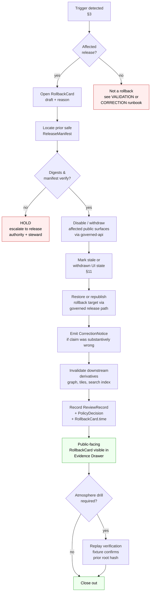

<!-- [KFM_META_BLOCK_V2]
doc_id: kfm://doc/runbook-atmosphere-rollback
title: Atmosphere Rollback Runbook
type: standard
version: v0.1
status: draft
owners: Atmosphere/Air domain steward + Release authority + Docs steward
created: 2026-05-13
updated: 2026-05-13
policy_label: public
related:
  - docs/doctrine/directory-rules.md
  - docs/doctrine/lifecycle-law.md
  - docs/doctrine/trust-membrane.md
  - docs/domains/atmosphere/README.md            # PROPOSED — NEEDS VERIFICATION
  - docs/runbooks/atmosphere/VALIDATION_RUNBOOK.md  # PROPOSED — sibling
  - docs/runbooks/atmosphere/CORRECTION_RUNBOOK.md  # PROPOSED — sibling
  - release/rollback_cards/                      # PROPOSED home for RollbackCard objects
  - release/manifests/                           # PROPOSED home for ReleaseManifest objects
  - contracts/release/rollback_card.md           # PROPOSED — meaning
  - schemas/contracts/v1/release/rollback_card.schema.json  # PROPOSED — shape
tags: [kfm, runbook, atmosphere, air, release, rollback, governance]
notes:
  - Path is PROPOSED; deviates from the flat docs/runbooks/<subsystem>_ROLLBACK.md pattern visible in KFM_Whole_UI_Governed_AI_Expansion_Report. ADR required if domain-nested runbooks become the convention.
  - Atmosphere domain itself is PROPOSED (Phase 5). This runbook is doctrine-aligned but not yet exercised against mounted-repo evidence.
[/KFM_META_BLOCK_V2] -->

# 🌫️ Atmosphere Rollback Runbook

> Governed reversal of a PUBLISHED **Atmosphere/Air** release back to a prior safe release — a **state transition**, not a hidden file copy. Doctrine first, evidence-preserving, audit-visible.


| Field | Value |
|---|---|
| **Status** | `draft` — doctrine-aligned, implementation PROPOSED |
| **Owners (placeholder)** | Atmosphere/Air domain steward · Release authority · Docs steward |
| **Last updated** | 2026-05-13 |
| **Authority of this runbook** | Doctrine = **CONFIRMED**; Atmosphere-specific application = **PROPOSED** |
| **Drill cadence** | Required for every Atmosphere release (PROPOSED policy) |

> [!IMPORTANT]
> **Repository not mounted in this session.** Every path, owner name, route, and CI command in this file is **PROPOSED** or **NEEDS VERIFICATION** until checked against mounted-repo evidence. Do not treat this tree as the current tree.

---

## Contents

1. [Purpose & scope](#1-purpose--scope)
2. [Repo fit](#2-repo-fit)
3. [Inputs — what triggers a rollback](#3-inputs--what-triggers-a-rollback)
4. [Exclusions — what this runbook does *not* cover](#4-exclusions--what-this-runbook-does-not-cover)
5. [Directory layout (PROPOSED)](#5-directory-layout-proposed)
6. [Rollback decision flow](#6-rollback-decision-flow)
7. [Preflight checklist](#7-preflight-checklist)
8. [Defect class → rollback posture](#8-defect-class--rollback-posture)
9. [Step-by-step procedure](#9-step-by-step-procedure)
10. [Atmosphere-specific risks](#10-atmosphere-specific-risks)
11. [Stale-state markers and UI signals](#11-stale-state-markers-and-ui-signals)
12. [RollbackCard fields and finite outcomes](#12-rollbackcard-fields-and-finite-outcomes)
13. [Drill cadence and acceptance](#13-drill-cadence-and-acceptance)
14. [Reason codes](#14-reason-codes-proposed-catalog)
15. [Related docs](#15-related-docs)
16. [Verification backlog](#16-verification-backlog)
17. [Appendix A — Worked example](#appendix-a--worked-example-illustrative)

---

## 1. Purpose & scope

**CONFIRMED doctrine.** A rollback in KFM is a **governed state transition** from a current `PUBLISHED` release back to a prior safe `PUBLISHED'` release, recorded as a `RollbackCard`, paired with a `CorrectionNotice` where appropriate, and reflected in updated `ReleaseManifest` lineage. Rollback **MUST NOT** be a hidden file copy. Rollback **MUST NOT** bypass the trust membrane: the public path is still the governed API serving released artifacts only.

**PROPOSED application.** This runbook adapts that doctrine to the **Atmosphere/Air** domain — which owns `AirStation`, `AirObservation`, `PM2.5 Observation`, `Ozone Observation`, `SmokeContext`, `AODRaster`, `WeatherStation`, `WeatherObservation`, `WindField`, `PrecipitationObservation`, `TemperatureObservation`, `ClimateNormal`, `ClimateAnomaly`, `ForecastContext`, and `AdvisoryContext`. The domain itself is currently PROPOSED (Phase 5 expansion); this runbook is the rollback half of its publication contract.

> [!CAUTION]
> **KFM Atmosphere is not an alert authority.** Even during rollback, this domain **MUST NOT** issue, replace, or imply life-safety instructions. If the defect involves emergency context, escalate via the **Hazards** domain runbooks and the agency-source redirect path. Hazards owns operational/life-safety truth; Atmosphere is observation/context only.

[Back to top](#contents)

---

## 2. Repo fit

This runbook is one of three Atmosphere domain runbooks (PROPOSED set):

```text
docs/runbooks/atmosphere/
├── LOCAL_DEV_RUNBOOK.md      # PROPOSED — sibling, not in scope here
├── VALIDATION_RUNBOOK.md     # PROPOSED — upstream of release
└── ROLLBACK_RUNBOOK.md       # THIS FILE — reverses a release decision
```

It depends on and is referenced by:

| Upstream / sibling | Role | Status |
|---|---|---|
| `docs/doctrine/lifecycle-law.md` | RAW → WORK/QUARANTINE → PROCESSED → CATALOG/TRIPLET → PUBLISHED | **CONFIRMED doctrine** |
| `docs/doctrine/trust-membrane.md` | Public clients use governed APIs only | **CONFIRMED doctrine** |
| `docs/domains/atmosphere/README.md` | Domain identity, scope, source families | PROPOSED |
| `contracts/release/rollback_card.md` | Meaning of `RollbackCard` | PROPOSED — semantic home |
| `schemas/contracts/v1/release/rollback_card.schema.json` | Machine shape of `RollbackCard` | PROPOSED — shape home (ADR-0001) |
| `policy/release/` and `policy/domains/atmosphere/` | Admissibility, rights, sensitivity gates | PROPOSED |
| `release/manifests/` · `release/rollback_cards/` · `release/correction_notices/` | Where the **decision** artifacts live | **CONFIRMED canonical homes** per Directory Rules §19 |
| `data/published/layers/atmosphere/` | Where the **artifacts** themselves are served from | PROPOSED lane |

> [!NOTE]
> **Decision vs artifact split.** `release/` holds the **decision** (manifest, rollback card, correction notice). `data/published/` holds the **artifact** (tiles, GeoJSON, layer manifests). Both move in a rollback, but they live in different responsibility roots and are governed by different schemas. Do not collapse them.

[Back to top](#contents)

---

## 3. Inputs — what triggers a rollback

A rollback is initiated when at least one trigger applies to a `PUBLISHED` Atmosphere artifact, layer, catalog record, or governed-API answer. Each trigger maps to a defect class (§8).

| Trigger | Example (Atmosphere) | Defect class | Status |
|---|---|---|---|
| Evidence gap | `EvidenceBundle` references a `SourceDescriptor` that no longer resolves; PM2.5 layer cites a withdrawn sensor stream | Evidence | **CONFIRMED doctrine** |
| Source-role collapse | A `LOW_COST_SENSOR` reading promoted into a layer labeled `REGULATORY_ARCHIVE`; `AODRaster` rendered as `PM25Observation` | Source-role | **CONFIRMED doctrine** |
| Rights change | Upstream provider (e.g. an AQS-like archive or AirNow-like agency feed) revokes or narrows redistribution terms | Rights | **CONFIRMED doctrine**; specific providers **NEEDS VERIFICATION** |
| Sensitivity error | A station location revealed at a precision beyond its allowed publication tier | Sensitivity | **CONFIRMED doctrine** |
| Knowledge-character mislabel | `PUBLIC_AQI_REPORT` served without "AQI ≠ concentration" caveat; `ATMOSPHERIC_MODEL_FIELD` rendered without "model ≠ observation" caveat | Validation / labeling | **CONFIRMED doctrine** |
| Temporal defect | `observed_time` and `valid_time` collapsed; release crosses a `GeographyVersion` boundary | Temporal | **CONFIRMED doctrine** |
| Geometry / unit defect | Wrong CRS in a smoke polygon; PM2.5 served in µg/m³ but labeled ppb | Geometry / unit | **CONFIRMED doctrine** |
| Policy/release-state failure | `ReleaseManifest` admitted with unknown `rights_status` or missing `evidence_refs` | Policy | **CONFIRMED doctrine** |
| Rendering / API defect | MapLibre layer descriptor points at a withdrawn tile set; Evidence Drawer fails to resolve the bundle | Rendering / API | **CONFIRMED doctrine** |
| AI-output defect | Focus Mode emitted an uncited or mis-cited Atmosphere claim | AI-output | **CONFIRMED doctrine** |

[Back to top](#contents)

---

## 4. Exclusions — what this runbook does *not* cover

This runbook does **not** cover:

- **Pre-publication failures.** Validation or promotion failures at `PROCESSED → CATALOG` or `CATALOG → PUBLISHED` are handled by `VALIDATION_RUNBOOK.md` (PROPOSED) and by the promotion gate. A candidate that never reached `PUBLISHED` is discarded, not rolled back.
- **Silent edits to a prior release.** A correction that supersedes a published claim emits a `CorrectionNotice` and a new release; the prior `ReleaseManifest` is preserved. Use `CORRECTION_RUNBOOK.md` (PROPOSED).
- **Source-side outages.** An upstream provider being offline is a stale-state event (see §11), not a rollback trigger by itself. Rollback only fires when the **released** artifact or its evidence is wrong, unsupported, or no longer permissible.
- **Emergency/life-safety messaging.** Hazards domain owns that surface. KFM Atmosphere **MUST NOT** substitute for an alert authority during or after a rollback.
- **Schema or policy bundle rollbacks.** Reverting a Rego policy bundle or a `schemas/contracts/v1/` schema is a separate operational rollback; this runbook only consumes those artifacts as upstream context.

[Back to top](#contents)

---

## 5. Directory layout (PROPOSED)

The lanes touched by an Atmosphere rollback. **Domain appears as a segment, never as a root** (Directory Rules §12 — Domain Placement Law). Every path below is **PROPOSED** until verified against mounted-repo evidence.

```text
docs/
└── runbooks/
    └── atmosphere/
        ├── LOCAL_DEV_RUNBOOK.md           # PROPOSED
        ├── VALIDATION_RUNBOOK.md          # PROPOSED
        └── ROLLBACK_RUNBOOK.md            # THIS FILE — PROPOSED

contracts/
├── release/
│   ├── release_manifest.md                # CONFIRMED meaning, PROPOSED path
│   ├── rollback_card.md                   # CONFIRMED meaning, PROPOSED path
│   └── promotion_decision.md              # CONFIRMED meaning, PROPOSED path
└── correction/
    └── correction_notice.md               # CONFIRMED meaning, PROPOSED path

schemas/contracts/v1/
├── release/
│   ├── release_manifest.schema.json       # PROPOSED — per ADR-0001
│   └── rollback_card.schema.json          # PROPOSED — per ADR-0001
└── domains/
    └── atmosphere/                        # PROPOSED — domain segment

policy/
├── release/                               # CONFIRMED responsibility root
└── domains/
    └── atmosphere/                        # PROPOSED — domain segment

release/
├── manifests/<release_id>.json            # CONFIRMED home for ReleaseManifest
├── rollback_cards/<rollback_id>.json      # CONFIRMED home for RollbackCard
└── correction_notices/<correction_id>.json # CONFIRMED home for CorrectionNotice

data/
├── published/
│   └── layers/atmosphere/                 # PROPOSED — served artifacts
├── proofs/                                # CONFIRMED home for EvidenceBundle resolution
├── receipts/                              # CONFIRMED home for emitted receipts
└── rollback/                              # PROPOSED — alias-revert receipts (see Directory Rules open question)

apps/
└── governed-api/                          # CONFIRMED — the only public trust path
```

> [!WARNING]
> **The visible path of this file** — `docs/runbooks/atmosphere/ROLLBACK_RUNBOOK.md` — uses **domain-nested runbooks**, which deviates from the flat `docs/runbooks/<subsystem>_ROLLBACK.md` pattern (e.g., `ui_ROLLBACK.md`, `governed_ai_ROLLBACK.md`) visible in the Whole-UI + Governed AI Expansion report. Both layouts are defensible — domain as a segment is consistent with Domain Placement Law — but the chosen convention should be frozen by an ADR (e.g., `docs/adr/ADR-runbook-layout.md`) before more domain runbooks land. See §16.

[Back to top](#contents)

---

## 6. Rollback decision flow



**CONFIRMED doctrine references:** the flow follows the rollback model in the KFM Unified Implementation Architecture Build Manual (correction-and-rollback section): *identify affected release → locate prior safe artifact set → verify digests and manifests → disable or withdraw affected public surfaces → preserve audit receipts → mark stale or withdrawn UI state → restore or republish via the same governed release path*. Drill replay verification after a delta tile publish is also CONFIRMED in MapLibre master idea `ML-058-043`.

[Back to top](#contents)

---

## 7. Preflight checklist

Before issuing a `RollbackCard`, the **release authority** (separate from the original release author, per separation-of-duties doctrine) confirms each item. **CONFIRMED doctrine; PROPOSED Atmosphere-specific application.**

- [ ] **Affected release identified.** `release_id` of the failing `ReleaseManifest` is recorded.
- [ ] **Prior safe target identified.** A previous `ReleaseManifest` with passing validation, policy, and review state exists and resolves.
- [ ] **Digests verified.** Every artifact in the rollback target verifies its checksum against the manifest (per `ML-058-044` — `pmtiles`, `stac`, `geojson`, `parquet`, `model`, `manifest`, `receipt` kinds all in scope).
- [ ] **EvidenceBundle resolves.** `EvidenceRef → EvidenceBundle` resolution closure passes for every claim in the rollback target.
- [ ] **Rights still valid for the prior target.** Upstream `SourceDescriptor` rights have not also lapsed. Rolling back to an artifact whose rights are now stale is a `HOLD`, not a clean revert.
- [ ] **Sensitivity gate re-evaluated.** Generalization, redaction, and tier assignment for the prior target still pass the current policy bundle.
- [ ] **Source-role anti-collapse re-checked.** `OBSERVED_SENSOR`, `PUBLIC_AQI_REPORT`, `REGULATORY_ARCHIVE`, `LOW_COST_SENSOR`, `ATMOSPHERIC_MODEL_FIELD`, `REMOTE_SENSING_MASK`, `CLIMATE_ANOMALY_CONTEXT`, `DERIVED_FUSION`, `METEOROLOGICAL_CONTEXT`, `ALERT_AND_ADVISORY_CONTEXT`, `NETWORK_AND_SITE_CONTEXT` — each role in the prior target is still correctly labeled and not silently upcast.
- [ ] **Knowledge-character caveats present.** "AQI is not concentration", "AOD is not PM2.5", "model fields are not observations", and low-cost sensor caveats are intact on every Atmosphere claim in the target.
- [ ] **Downstream derivatives enumerated.** Graph/triplet projections, search index entries, story snapshots, and AI-receipts that depend on the failing release are listed in `invalidates[]`.
- [ ] **ReviewRecord linked.** A reviewer distinct from the original author has signed off.
- [ ] **Public surfaces drained.** Tile cache, CDN, search index, and Focus Mode candidate pool no longer serve the failing release.
- [ ] **Replay drill prepared.** Verification fixture is ready to confirm prior root hash and manifest after publish.

[Back to top](#contents)

---

## 8. Defect class → rollback posture

Mapping derived directly from the **CONFIRMED** correction-and-rollback model. Posture columns are **CONFIRMED doctrine**; the Atmosphere examples are illustrative (PROPOSED).

| Defect class | Atmosphere example (illustrative) | Correction posture | Rollback posture |
|---|---|---|---|
| **Evidence** | PM2.5 layer cites a withdrawn AQS-like archive snapshot | ABSTAIN or withdraw unsupported claim | Restore prior evidence-supported release |
| **Source-role** | An `AODRaster` rendered as a `PM25Observation` in a layer | Re-label; emit `CorrectionNotice` | Restore prior role-correct release |
| **Rights** | AirNow-like agency redistribution terms revoked | Withdraw claim; record rights change | Restore prior release if still rights-compliant; otherwise **HOLD** until re-licensed or generalized |
| **Sensitivity** | A station's precise location revealed beyond its tier | Generalize and re-release; emit `RedactionReceipt` | Restore prior generalized release |
| **Geometry** | Smoke polygon in wrong CRS, or PM2.5 in inconsistent units | Re-project / re-unit; emit `TransformReceipt` | Restore prior geometry-valid release |
| **Temporal** | `observed_time` and `valid_time` collapsed; release crosses a `GeographyVersion` | Re-key on distinct time fields; rebind to current `GeographyVersion` | Restore prior temporally-correct release |
| **Policy** | `ReleaseManifest` admitted with `rights_status: unknown` or missing `evidence_refs` | Re-run policy gate fail-closed | Restore prior policy-compliant release |
| **Validation** | Knowledge-character caveat missing on a `PUBLIC_AQI_REPORT` layer | Re-render with caveat band; emit corrected layer | Restore prior caveat-bearing release |
| **Rendering** | MapLibre `LayerManifest` points at a withdrawn `pmtiles` artifact | Rebuild manifest against valid artifact | Restore prior manifest pointing at valid artifacts |
| **API** | Atmosphere feature/detail resolver returns `ANSWER` for an unreleased candidate | Mark candidate; re-route through governed path | Restore prior route binding |
| **AI-output** | Focus Mode emits an uncited PM2.5 claim or treats a low-cost sensor as regulatory truth | ABSTAIN on retry; emit new `AIReceipt`; never silently rewrite the prior one | Restore prior evidence-bounded answer envelope |

> [!NOTE]
> **AI receipts are never retroactively superseded.** A new `AIReceipt` is a new record. The original answer remains in the audit chain. This applies in full to Atmosphere Focus Mode rollbacks.

[Back to top](#contents)

---

## 9. Step-by-step procedure

Each step is **CONFIRMED doctrine** unless marked otherwise. Commands and route names are **PROPOSED / NEEDS VERIFICATION** because no repo is mounted in this session.

### Step 1 — Open the RollbackCard (draft)

Draft a `RollbackCard` with at minimum: `release_id`, `rollback_to`, `reason`, `invalidates[]`, `review_ref`, `time`. **(CONFIRMED schema fields.)**

```text
# PROPOSED command — verify after repo mount
kfm release rollback open \
  --release-id <failing_release_id> \
  --rollback-to <prior_safe_release_id> \
  --reason <REASON_CODE>            # see §14
```

### Step 2 — Locate and verify the prior safe target

```text
# PROPOSED command
kfm release manifest verify <prior_safe_release_id>
# Verifies checksums for every artifact kind in the manifest:
# pmtiles, stac, geojson, parquet, model, manifest, receipt
```

If verification fails, **HOLD** the rollback and escalate. Do not paper over a checksum mismatch.

### Step 3 — Disable affected public surfaces

The governed API stops serving the failing release. Tiles, layer manifests, evidence drawer payloads, and Focus Mode answers tied to the failing release return `DENY` with a `WITHDRAWN_RELEASE` reason code while the rollback is in flight.

> [!WARNING]
> **Do not delete the failing release.** It must remain inspectable in the audit chain. "Withdrawn" is a release state, not a file deletion.

### Step 4 — Mark stale or withdrawn UI state

Atmosphere layers carry visible state — see §11. The Evidence Drawer, layer badges, and Focus Mode panels reflect `withdrawn` immediately; CDN-fronted tiles flip via the layer manifest, not by mutating tile bytes.

### Step 5 — Restore or republish the rollback target

Republish via the **same governed release path** used for the original publication:

1. `PromotionDecision` for the rollback target (record, even if it's a re-promotion of an existing target).
2. New `ReleaseManifest` whose `rollback_target` chains back through the prior manifest history.
3. Layer manifests in `data/published/layers/atmosphere/` updated to reference restored artifacts only.

### Step 6 — Emit the CorrectionNotice (if applicable)

If the failing release made a substantively wrong claim (not just a transient outage), emit a `CorrectionNotice` with: `claim_ref`, `prior_release_ref`, `change_summary`, `invalidates[]`, `review_ref`, `time`. **(CONFIRMED schema fields.)** The notice is public-facing and visible in the Evidence Drawer alongside the corrected claim.

### Step 7 — Invalidate downstream derivatives

| Derivative | What to invalidate | Status |
|---|---|---|
| Graph / triplet projection | Triples sourced from the failing release | CONFIRMED doctrine |
| Search index | Atmosphere search documents tied to the failing `release_id` | CONFIRMED doctrine |
| Story snapshots / exports | `StorySnapshot` / `ExportReceipt` referencing the failing release | CONFIRMED doctrine |
| Focus Mode | Cached AI answers referencing the failing release (new `AIReceipt` on retry) | CONFIRMED doctrine |
| MapLibre tile caches | Layer manifest revision invalidates by manifest reference, not by tile-byte mutation | CONFIRMED via `ML-058-043` |

### Step 8 — Finalize the RollbackCard

```text
# PROPOSED command
kfm release rollback finalize <rollback_id> \
  --review-ref <review_record_id> \
  --policy-decision <policy_decision_id>
```

The finalized card lands in `release/rollback_cards/`. Public Evidence Drawer surfaces it on every claim that lived inside the failing release.

### Step 9 — Run the replay verification drill

Replay the verification fixture against the restored release. Expected: prior root hash and manifest reproduce byte-for-byte. **CONFIRMED build doctrine** (`SOURCE_DATE_EPOCH`, pinned tools, embedded fonts, neutralized locale) applies here too — a rollback is only as durable as its reproducibility.

[Back to top](#contents)

---

## 10. Atmosphere-specific risks

These are the failure modes most likely to drive a rollback for this domain. All entries are **CONFIRMED doctrine** about the risk; remediation status is **PROPOSED** until the domain's implementation lands.

| Risk | Why it bites Atmosphere specifically | Rollback consequence |
|---|---|---|
| **AQI ≠ concentration** | Public AQI reports use breakpoints, not direct µg/m³ values. A layer that labels AQI as concentration misleads decisively. | Withdraw layer; restore prior caveat-bearing release; emit `CorrectionNotice`. |
| **AOD ≠ PM2.5** | Aerosol Optical Depth (e.g., GOES/ABI AOD, VIIRS) is a column property, not surface PM2.5. Conflation is a published-truth defect. | Withdraw fusion layer; restore prior `AODRaster`-labeled release. |
| **Model field ≠ observation** | HRRR-Smoke, CAMS/ECMWF-family, and similar `ATMOSPHERIC_MODEL_FIELD` outputs are not observations and cannot be labeled as `OBSERVED_SENSOR`. | Restore prior role-correct release; re-run source-role anti-collapse tests. |
| **Low-cost sensor without caveat** | PurpleAir-style sensors require calibration status, humidity transferability caveats, and uncertainty visibility. A public layer missing these mislabels confidence. | Withdraw; restore prior caveat-bearing release. |
| **Stale source served as fresh** | Source freshness expiry on AirNow-like or AQS-like feeds; offline/decommissioned stations rendered as live. | Stale-state markers + withdrawal; restore prior fresh release if available. |
| **Rights drift** | Upstream rights for OpenAQ-like aggregators, EPA AQS-like archives, AirNow-like agency feeds, CAMS/ECMWF-family fields, HMS smoke, etc., are **NEEDS VERIFICATION** at the moment of release. | If rights lapsed *after* publish, withdraw; restore prior release only if its rights remain valid. |
| **Sensitive join** | Atmosphere joined to a sensitive locator (e.g., archaeology, sensitive fauna nests) producing a precise public point. | Withdraw; restore generalized prior release; record `RedactionReceipt`. |
| **Hazards boundary creep** | Atmosphere advisory layer drifts toward life-safety instruction. | Withdraw; restore prior context-only release; coordinate with Hazards. |
| **Tile-byte mutation** | Editing tile bytes in place instead of revising the layer manifest. | Treat as an audit incident; force-republish via governed path; emit `RollbackCard` with rendering-defect reason. |

[Back to top](#contents)

---

## 11. Stale-state markers and UI signals

Per CONFIRMED doctrine (Atlas §24.8.1), KFM separates **stale** from **wrong**. Rollback handles **wrong**; the UI handles **stale** with visible markers. During an Atmosphere rollback, every affected UI surface must reflect the transition immediately.

| Marker | Trigger | UI signal | Rollback action |
|---|---|---|---|
| Source freshness expired | `SourceDescriptor` cadence passed | Stale-source badge in Evidence Drawer | Re-admit or supersede; mark dependents stale |
| Schema version drift | Object schema upgraded past published claim | Schema-drift badge + ADR link | Migrate, re-validate, re-release, or mark stale |
| Geography version drift | `GeographyVersion` replaced | Geography-version banner with prior-version cite | Rebind, re-release, or mark stale |
| Time-scope outside support | Claim's temporal scope outside current support | Time-out-of-support indicator | Mark stale; do not refresh silently |
| Model version superseded | `ModelRunReceipt` references older model | Model-version badge | Re-run, supersede, or mark stale |
| Review aged out | `ReviewRecord` older than tolerance | Review-aged badge | Trigger steward review; downgrade tier if needed |
| Rights status changed | Rights change in `SourceDescriptor` | Rights-changed badge | Re-evaluate tier; emit `CorrectionNotice` if needed |
| Policy version changed | Policy referenced by `PolicyDecision` superseded | Policy-version badge | Re-run gate; supersede release if needed |
| **Withdrawn release** | This rollback | **Withdrawn-release banner** on every claim from the failing release; link to the `RollbackCard` and (if applicable) `CorrectionNotice` | (this runbook) |

> [!IMPORTANT]
> **Badges are not release authority.** A trust-visible badge in the UI is a *signal* backed by a receipt (`ML-061-090`, `ML-059-063`); it is not itself the policy decision. The `RollbackCard` is the decision.

[Back to top](#contents)

---

## 12. RollbackCard fields and finite outcomes

**CONFIRMED `RollbackCard` field list** (Atlas §24.2):

| Field | Required | Meaning |
|---|---|---|
| `release_id` | ✅ | The failing release being rolled back from |
| `rollback_to` | ✅ | The prior safe release being restored |
| `reason` | ✅ | Reason code (see §14) |
| `invalidates[]` | ✅ | Downstream derivatives that must be invalidated |
| `review_ref` | ✅ | `ReviewRecord` ID — signed by a reviewer distinct from the original author |
| `time` | ✅ | Decision timestamp |

A rollback as an operation returns a finite outcome envelope. **CONFIRMED outcome semantics** (Atlas §24.3):

| Outcome | When | Effect |
|---|---|---|
| **ANSWER** | Verification passes, prior target restored cleanly, derivatives invalidated, review and policy recorded. | `RollbackCard` finalized; restored release is live. |
| **ABSTAIN** | Doctrine doesn't apply (e.g., a non-released artifact was reported as needing rollback). | No rollback; route to validation or correction runbook. |
| **DENY** | Rollback target itself fails policy (rights now stale, sensitivity tier no longer valid). | Block; record reason; escalate to release authority + steward. |
| **ERROR** | Manifest malformed, digest mismatch, infrastructure failure mid-rollback. | Finite, actionable error; never silently fall through. |
| **HOLD** | Steward, rights-holder, or policy review pending. | Failing release remains withdrawn; restored target is **not** activated until release. |

[Back to top](#contents)

---

## 13. Drill cadence and acceptance

**CONFIRMED doctrine:** *Every release of Atmosphere artifacts requires a rollback drill paired with a `ReleaseManifest` and `RollbackCard`.* The drill is not optional — "rollback untested is not reliable" (Atlas §M).

**PROPOSED cadence and acceptance** for Atmosphere:

- **Per-release drill.** Each Atmosphere `ReleaseManifest` is accompanied by a drill record proving the immediate-prior release can be restored in a controlled environment.
- **Quarterly full-domain drill.** A scheduled drill exercises rollback across the full Atmosphere lane: stations, observations, model fields, AOD/smoke products, advisory context.
- **Replay verification.** After publish, a fixture reproduces the prior root hash and manifest (per `ML-058-043`).
- **Acceptance signals:**
  - Rollback completes through `apps/governed-api/` only — no direct artifact mutation.
  - All affected public surfaces register `withdrawn` state within the agreed window (PROPOSED SLA — NEEDS VERIFICATION).
  - Replay verification reproduces the prior root hash and manifest byte-for-byte.
  - `RollbackCard` resolves in the Evidence Drawer for every claim that lived inside the failing release.
  - No public client touched RAW / WORK / QUARANTINE / canonical stores at any point.

[Back to top](#contents)

---

## 14. Reason codes (PROPOSED catalog)

Reason codes are drawn from the **CONFIRMED** gate-failure family in Atlas §24.6.3, plus Atmosphere-specific entries. All Atmosphere-specific codes are **PROPOSED** until adopted by an ADR.

| Family | Code | When it fires |
|---|---|---|
| Missing artifact | `MISSING_RECEIPT` · `MISSING_EVIDENCE` · `MISSING_REVIEW` | Receipt, evidence, or review not resolvable for the failing release |
| Schema / contract | `SCHEMA_MISMATCH` · `CONTRACT_DRIFT` | Atmosphere object schema mismatch in published artifact |
| Rights / sensitivity | `RIGHTS_UNKNOWN` · `SENSITIVITY_UNRESOLVED` | Upstream rights or sensitivity tier no longer holds |
| Source-role | `ROLE_COLLAPSE` · `ROLE_DOWNCAST_FORBIDDEN` | E.g., low-cost sensor served as regulatory archive |
| Review state | `REVIEW_NEEDED` · `REVIEW_INSUFFICIENT` · `REVIEW_REJECTED` | Review gate inadequate for the failing release |
| Release infrastructure | `RELEASE_MANIFEST_INVALID` · `ROLLBACK_TARGET_MISSING` | Manifest broken or no prior safe target |
| **Atmosphere (PROPOSED)** | `AQI_AS_CONCENTRATION` | A `PUBLIC_AQI_REPORT` was served as concentration |
| **Atmosphere (PROPOSED)** | `AOD_AS_PM25` | An `AODRaster` was served as PM2.5 |
| **Atmosphere (PROPOSED)** | `MODEL_AS_OBSERVED` | An `ATMOSPHERIC_MODEL_FIELD` was rendered as observation |
| **Atmosphere (PROPOSED)** | `LOWCOST_WITHOUT_CAVEAT` | Low-cost sensor data published without calibration/uncertainty caveat |
| **Atmosphere (PROPOSED)** | `STALE_SOURCE_PUBLISHED` | Source freshness expired before withdrawal |

[Back to top](#contents)

---

## 15. Related docs

All links are **PROPOSED** — verify against mounted repo before trusting any anchor.

- [`docs/doctrine/lifecycle-law.md`](../../doctrine/lifecycle-law.md) — RAW → … → PUBLISHED, and why promotion is not a file move
- [`docs/doctrine/trust-membrane.md`](../../doctrine/trust-membrane.md) — Why rollback must run through the governed API
- [`docs/doctrine/directory-rules.md`](../../doctrine/directory-rules.md) — Domain Placement Law (§12), `release/` vs `data/published/` split
- [`docs/runbooks/atmosphere/VALIDATION_RUNBOOK.md`](VALIDATION_RUNBOOK.md) — Upstream gate that catches most defects before they reach `PUBLISHED` *(PROPOSED — sibling)*
- [`docs/runbooks/atmosphere/CORRECTION_RUNBOOK.md`](CORRECTION_RUNBOOK.md) — Correction without full rollback *(PROPOSED — sibling)*
- [`docs/runbooks/governed_ai_ROLLBACK.md`](../governed_ai_ROLLBACK.md) — Focus Mode rollbacks that may co-occur with Atmosphere rollbacks *(PROPOSED — convention TBD; see §16)*
- [`docs/runbooks/ui_ROLLBACK.md`](../ui_ROLLBACK.md) — UI/feature-flag rollbacks downstream of an Atmosphere rollback *(PROPOSED — convention TBD)*
- [`docs/domains/atmosphere/README.md`](../../domains/atmosphere/README.md) — Atmosphere domain scope, object families, source families *(PROPOSED)*
- [`contracts/release/rollback_card.md`](../../../contracts/release/rollback_card.md) — `RollbackCard` semantic definition *(PROPOSED)*
- [`schemas/contracts/v1/release/rollback_card.schema.json`](../../../schemas/contracts/v1/release/rollback_card.schema.json) — `RollbackCard` JSON Schema *(PROPOSED — per ADR-0001)*

[Back to top](#contents)

---

## 16. Verification backlog

| Item | Why it matters | Status |
|---|---|---|
| **Mount the KFM repository** | Cannot confirm any path, route, owner, or CI command in this runbook without repo evidence | **UNKNOWN** |
| **Runbook-layout ADR** | Decide between flat (`docs/runbooks/<subsystem>_ROLLBACK.md`) and domain-nested (`docs/runbooks/<domain>/ROLLBACK_RUNBOOK.md`) — this file uses the latter | **NEEDS VERIFICATION** (open) |
| **Filename convention** | This file uses `ROLLBACK_RUNBOOK.md`; expansion-report pattern uses `_ROLLBACK.md` suffix. Pick one and freeze | **NEEDS VERIFICATION** |
| **`docs/domains/atmosphere/` README** | Anchor for this runbook's domain-scope claims | **PROPOSED** |
| **Source rights & terms** | EPA AQS-like, AirNow-like, OpenAQ-like, CAMS/ECMWF-family, HRRR-Smoke, HMS, GOES/ABI AOD, VIIRS — each rights status | **NEEDS VERIFICATION** per Atlas §11.D |
| **`RollbackCard` schema home** | Confirm `schemas/contracts/v1/release/rollback_card.schema.json` per ADR-0001 | **PROPOSED** |
| **`release/rollback_cards/` filesystem layout** | Confirm canonical path is `release/rollback_cards/<rollback_id>.json` per Directory Rules §19 | **CONFIRMED** by Directory Rules glossary; physical existence in repo **NEEDS VERIFICATION** |
| **Governed API rollback route** | The exact route name and DTO for `kfm release rollback` style operations | **UNKNOWN** |
| **Replay verification fixture** | Build a no-network fixture that reproduces prior root hash and manifest for an Atmosphere release | **PROPOSED** (per `ML-058-043`) |
| **Drill cadence SLA** | Per-release drill is doctrine; window/timing for "withdrawn within X minutes" is PROPOSED | **NEEDS VERIFICATION** |
| **Separation-of-duties owners** | Named release authority distinct from original author | **PROPOSED — owners placeholders only** |

[Back to top](#contents)

---

## Appendix A — Worked example (illustrative)

> **Illustrative only.** Not directly sourced from repo evidence. Fields conform to **CONFIRMED** schemas; the scenario is constructed to exercise the flow.

<details>
<summary><strong>Scenario: AOD-as-PM2.5 mislabel on a smoke-event layer</strong> — click to expand</summary>

**Defect.** Layer `atmosphere/smoke-2026-04-fusion-v3` was promoted to `PUBLISHED`. The layer fuses GOES/ABI AOD and HRRR-Smoke model fields and exposes a public choropleth labeled "PM2.5 (µg/m³)". A reviewer notices the labeling collapses two distinct source roles: an `AODRaster` (column property, satellite) and an `ATMOSPHERIC_MODEL_FIELD` (forecast model), rendered as `PM25Observation` (ground-level concentration). This is an **AOD-as-PM2.5** and **MODEL-as-OBSERVED** collapse.

**Trigger.** §3 — Source-role collapse + Validation/labeling defect.

**Reason codes.** `AOD_AS_PM25`, `MODEL_AS_OBSERVED`.

**Prior safe target.** `atmosphere/smoke-2026-04-fusion-v2` — same fusion source, but layer labeled "Smoke index (qualitative)" with knowledge-character caveat band intact.

**Illustrative RollbackCard.**

```json
{
  "object_type": "RollbackCard",
  "schema_version": "v1",
  "rollback_id": "kfm://rollback/atmo-2026-05-13-001",
  "release_id": "kfm://release/atmosphere/smoke-2026-04-fusion-v3",
  "rollback_to": "kfm://release/atmosphere/smoke-2026-04-fusion-v2",
  "reason": ["AOD_AS_PM25", "MODEL_AS_OBSERVED"],
  "invalidates": [
    "kfm://search-index/atmosphere/2026-04/*",
    "kfm://graph/triplet/atmosphere/smoke-2026-04/*",
    "kfm://ai-receipt/focus/atmosphere/smoke-2026-04/*"
  ],
  "review_ref": "kfm://review/atmo-steward-2026-05-13-007",
  "time": "2026-05-13T14:02:11Z"
}
```

**Illustrative CorrectionNotice (paired).**

```json
{
  "object_type": "CorrectionNotice",
  "schema_version": "v1",
  "correction_id": "kfm://correction/atmo-2026-05-13-001",
  "claim_ref": "kfm://claim/atmosphere/smoke-2026-04-fusion-v3#pm25-choropleth",
  "prior_release_ref": "kfm://release/atmosphere/smoke-2026-04-fusion-v3",
  "change_summary": "Layer mislabeled an AOD + model fusion as PM2.5 concentration. Withdrawn and restored to v2 (qualitative smoke index with caveat band).",
  "invalidates": [
    "kfm://claim/atmosphere/smoke-2026-04-fusion-v3#pm25-choropleth"
  ],
  "review_ref": "kfm://review/atmo-steward-2026-05-13-007",
  "time": "2026-05-13T14:02:11Z"
}
```

**Outcome.** `ANSWER` — rollback completes; replay verification reproduces v2's manifest digest; Evidence Drawer surfaces both the `RollbackCard` and the `CorrectionNotice` on every claim that lived inside v3; Focus Mode answers referencing v3 return `ABSTAIN` until the user re-queries against the restored release.

</details>

<details>
<summary><strong>Negative case: rights of the rollback target also lapsed</strong> — click to expand</summary>

If, when attempting rollback to v2, the steward discovers that the upstream HRRR-Smoke license terms have since changed in a way that v2 no longer satisfies, the operation returns **HOLD**, not **ANSWER**. The failing release stays withdrawn; v2 is not activated. The release authority must either:

- republish v2 with the now-required attribution / generalization, *or*
- escalate to the source-rights review queue and (in the worst case) accept that no historical Atmosphere fusion layer is currently rights-compliant for public release, leaving a doctrinal gap until rights are resolved.

This is the case where rollback cannot quietly succeed and **must** surface the unresolved policy state.

</details>

[Back to top](#contents)

---

<sub><sup>**Last updated:** 2026-05-13 · **Doc id:** `kfm://doc/runbook-atmosphere-rollback` · **Status:** draft · See [§16 Verification backlog](#16-verification-backlog) for what still needs repo evidence. · [Back to top](#contents)</sup></sub>
