<!-- [KFM_META_BLOCK_V2]
doc_id: kfm://doc/runbooks/atmosphere/source-refresh
title: Atmosphere & Air — Source Refresh Runbook
type: standard
version: v0.1
status: draft
owners: [NEEDS_VERIFICATION — Atmosphere/Air domain steward + Docs steward]
created: 2026-05-13
updated: 2026-05-13
policy_label: restricted
related:
  - docs/domains/atmosphere/README.md
  - docs/runbooks/README.md
  - data/registry/sources/atmosphere/
  - connectors/README.md
  - pipelines/ingest/
  - policy/domains/atmosphere/
  - release/candidates/atmosphere/
tags: [kfm, runbook, atmosphere, air, ingest, refresh, governance]
notes:
  - Path is PROPOSED until verified against mounted repo evidence.
  - All source-specific paths, route names, and tool names are PROPOSED / NEEDS VERIFICATION
    unless visible in the repo.
[/KFM_META_BLOCK_V2] -->

<a id="top"></a>

# Atmosphere & Air — Source Refresh Runbook

> Governed, evidence-first refresh procedure for the KFM Atmosphere & Air source families
> — RAW capture through release candidate, with policy, sensitivity, and rollback gates.


| Field | Value |
|---|---|
| **Document type** | Domain runbook (Atmosphere & Air) |
| **Status** | `draft` |
| **Owners** | NEEDS VERIFICATION — Atmosphere/Air steward + Docs steward |
| **Last updated** | 2026-05-13 |
| **Authority of this doc** | PROPOSED — pending mounted-repo verification |
| **Lifecycle invariant** | RAW → WORK / QUARANTINE → PROCESSED → CATALOG / TRIPLET → PUBLISHED |
| **Cite-or-abstain** | Default truth posture; AI may never substitute for `EvidenceBundle` |

> [!IMPORTANT]
> This runbook is **doctrine-grounded but implementation-PROPOSED**. Every connector
> name, command, validator, route, and path quoted below is PROPOSED or NEEDS
> VERIFICATION until reconciled against mounted repository evidence. Doctrine
> (the lifecycle, the gates, the source roles, the sensitivity posture) is CONFIRMED
> and must not be bent without an ADR.

---

## Quick Jump

- [1. Purpose & Scope](#1-purpose--scope)
- [2. Repo Fit](#2-repo-fit)
- [3. Source Inventory](#3-source-inventory)
- [4. Refresh Cadence Matrix](#4-refresh-cadence-matrix)
- [5. Lifecycle Diagram](#5-lifecycle-diagram)
- [6. Pre-flight Checks](#6-pre-flight-checks)
- [7. Refresh Procedure](#7-refresh-procedure)
- [8. Source-Family Specifics](#8-source-family-specifics)
- [9. Sensitivity, Rights & Public-Safe Rules](#9-sensitivity-rights--public-safe-rules)
- [10. Validators & Tests](#10-validators--tests)
- [11. Failure Modes & Quarantine Reasons](#11-failure-modes--quarantine-reasons)
- [12. Rollback & Correction](#12-rollback--correction)
- [13. Operator Task List](#13-operator-task-list)
- [14. FAQ](#14-faq)
- [15. Related Docs](#15-related-docs)
- [Appendix A — Receipt & Manifest Skeletons](#appendix-a--receipt--manifest-skeletons)

---

## 1. Purpose & Scope

This runbook describes **how an operator refreshes Atmosphere & Air source material**
into KFM in a way that preserves the lifecycle invariant, evidence closure, source-role
discipline, sensitivity posture, and release-state governance.

It covers:

- Capture of source-native payloads or references into `data/raw/atmosphere/<source_id>/<run_id>/`.
- Normalization and validation in `data/work/atmosphere/` and `data/quarantine/atmosphere/`.
- Emission of `RunReceipt`, `ValidationReport`, `EvidenceRef`, and `DatasetVersion`
  objects through `PROCESSED` into `CATALOG / TRIPLET`.
- Promotion of release candidates to `PUBLISHED` under explicit policy review.

It does **not** cover:

- Public emergency alerting or official advisory issuance (Hazards owns advisory truth;
  Atmosphere/Air owns `AdvisoryContext` only, with official-source redirection).
- Renderer-side concerns (map style, MapLibre layer wiring) — see the MapLibre runbook.
- AI / Focus Mode generation flows — see the governed-AI runbook family.

### What this is / is not

| This **is** | This is **not** |
|---|---|
| A governed refresh procedure with finite outcomes | A bypass around policy or review |
| Evidence-aware ingest of observations, model fields, and remote-sensing context | A direct path from upstream API to public map |
| A source-role-preserving pipeline (observation / model / authority / context) | A fusion that flattens AQI, AOD, and PM2.5 into one number |
| A fail-closed sensor and rights workflow | A guarantee that any specific connector or route exists in the repo today |

[Back to top](#top)

---

## 2. Repo Fit

**PROPOSED path:** `docs/runbooks/atmosphere/SOURCE_REFRESH_RUNBOOK.md`

### Directory Rules basis

- **Responsibility root:** `docs/` — this file *explains something to humans* (per
  Directory Rules §4 Step 1, the "explains something to humans → `docs/`" mapping).
- **Sub-segment:** `runbooks/` — operational, human-facing procedure for stewards
  and operators. Sibling subsystem runbooks (e.g. UI, governed-AI families) are
  PROPOSED in project documentation.
- **Domain segment:** `atmosphere/` — applied as a segment inside the responsibility
  root, per Domain Placement Law (Directory Rules §12). Atmosphere MUST NOT become
  a root folder; here it appears only as a `docs/runbooks/<domain>/` segment.
- **Authority needed:** none beyond an existing `docs/runbooks/` parent and its
  README. No new canonical or compatibility root is introduced.

> [!NOTE]
> A flat naming pattern (e.g. `docs/runbooks/atmosphere_SOURCE_REFRESH.md`) is also
> compatible with Directory Rules. If the repo already uses the flat pattern for
> sibling subsystem runbooks, rename this file to match — **the responsibility, lifecycle
> phase, and domain segment, not the filename casing, are the governance load-bearing
> elements.**

### Upstream / downstream

```text
upstream (read)         this runbook                  downstream (drives)
─────────────────       ───────────────────           ───────────────────────────
docs/doctrine/...   →   docs/runbooks/             →  connectors/<source>/...
docs/domains/           atmosphere/                    pipelines/ingest/...
  atmosphere/...        SOURCE_REFRESH_RUNBOOK.md      pipeline_specs/atmosphere/...
data/registry/                                         data/raw/atmosphere/...
  sources/atmosphere/                                  data/quarantine/atmosphere/...
policy/domains/                                        data/processed/atmosphere/...
  atmosphere/                                          data/catalog/domain/atmosphere/
schemas/contracts/                                     release/candidates/atmosphere/
  v1/domains/atmosphere/
```

### Accepted inputs

- Operator-triggered refresh requests for a registered Atmosphere/Air source.
- Scheduled watcher events (`event_envelope` / `prefilter_output`) that propose a
  refresh; *the watcher does not publish* — it emits a candidate decision only.
- Steward-initiated targeted refreshes (e.g. a single station, a single tile window,
  a single product version pin).

### Exclusions

- Direct writes from connectors to `data/processed/`, `data/catalog/`, or
  `data/published/` (Directory Rules §13 — connector-publishes anti-pattern).
- Auto-publication from a refresh run (promotion is a governed state transition).
- Use of unvalidated PurpleAir readings (Barkjohn correction is required before
  publication; uncorrected readings stay in WORK or QUARANTINE).
- Treating AQI as a concentration, AOD as PM2.5, or model fields as observations.

[Back to top](#top)

---

## 3. Source Inventory

> [!IMPORTANT]
> Rights, redistribution terms, API keys, and bulk-fetch limits **MUST be verified**
> for each source before any refresh that touches the public path. Rights/source-role
> ambiguity is a fail-closed quarantine reason.

| Source family | Source role | Object families produced | Rights / sensitivity | Status |
|---|---|---|---|---|
| **EPA AQS / AirData** | regulatory authority / validated observation | `AirObservation`, `PM25Observation`, `OzoneObservation`, `AirStation` | API key required; validated data may lag months; redistribution NEEDS VERIFICATION | PROPOSED |
| **EPA AirNow** | preliminary observation / public AQI report | `AirObservation`, `AdvisoryContext` | API key required; rate limits NEEDS VERIFICATION; preliminary, not regulatory | PROPOSED |
| **NOAA / NWS** | authority / observation / forecast context | `WeatherObservation`, `ForecastContext`, `AdvisoryContext` | Generally public-domain; redistribution terms NEEDS VERIFICATION per product | PROPOSED |
| **Kansas Mesonet** | observation (in-situ) | `WeatherStation`, `WeatherObservation`, `PrecipitationObservation`, `TemperatureObservation`, `WindField` | Written consent or attribution may be required; contact `kansas-wdl@k-state.edu` | PROPOSED |
| **PurpleAir** | low-cost sensor / community observation | `PM25Observation` (variant- and channel-tagged) | API keys MUST stay out of `STAC` / `DCAT` / catalog metadata; ToS NEEDS VERIFICATION; Barkjohn correction REQUIRED before publication | PROPOSED |
| **OpenAQ-like aggregators** | aggregator (source role depends on upstream) | `AirObservation` | Rights and source-role NEEDS VERIFICATION; sensitive joins fail closed | PROPOSED |
| **HRRR-Smoke / BlueSky** | model field / smoke forecast | `SmokeContext`, `ForecastContext` | Model output — NEVER published as observation | PROPOSED |
| **NOAA HMS smoke** | analyst-derived context / context | `SmokeContext` | Analyst product, not observation; redistribution NEEDS VERIFICATION | PROPOSED |
| **GOES / ABI AOD** | remote-sensing observation | `AODRaster` | AOD is NOT PM2.5; publication MUST preserve that distinction | PROPOSED |
| **VIIRS / MODIS fire (FIRMS)** | NRT remote-sensing observation | `SmokeContext` (fire-context join only) | NRT typically within ~3 hours; FRP units must be preserved | PROPOSED |
| **MAIAC (MCD19A2 / VNP19A2)** | remote-sensing observation | `AODRaster` | L2 gridded; AOD-as-PM2.5 denial required | PROPOSED |
| **CAMS / ECMWF-family** | model field | `ForecastContext`, `AODRaster` (model variant) | Rights and redistribution NEEDS VERIFICATION | PROPOSED |
| **Climate normals (NCEI / NOAA)** | authority / climate context | `ClimateNormal`, `ClimateAnomaly` | Public; cite product version | PROPOSED |
| **KDHE bulletins** | state authority / advisory | `AdvisoryContext` | Official source redirection required on the public surface | PROPOSED |

[Back to top](#top)

---

## 4. Refresh Cadence Matrix

Cadence is **policy, not science**. The numbers below are recommended defaults; the
binding cadence is whichever value is recorded in the relevant `SourceDescriptor`.

| Source family | Recommended cadence | Stale threshold (default) | Probe type |
|---|---|---|---|
| AirNow | hourly | > 3 h since last observation → degraded badge | API call + conditional GET |
| EPA AQS | weekly batch (validated data lags months) | > 60 d for daily summary refresh | scheduled batch |
| NOAA / NWS observations | hourly (METAR-class) | > 3 h → degraded | API + conditional GET |
| NOAA / NWS forecast | every 6 h (model-run aligned) | > 12 h since last run → degraded | scheduled aligned |
| Kansas Mesonet | 5-min / hourly (per endpoint) | > 2 h hourly, > 30 min 5-min | REST CSV pull |
| PurpleAir | 10-min (subject to ToS / rate limits) | > 1 h → degraded | API with key header |
| HRRR-Smoke | hourly model cycle | > 12 h since last run → degraded | NOMADS / model archive |
| NOAA HMS | daily | > 48 h → degraded | scheduled fetch |
| GOES / ABI AOD | sub-hourly (during daylight) | > 6 h or night-gap aware | tile fetch |
| VIIRS / MODIS FIRMS | NRT (~3 h) | > 12 h → degraded | NRT API |
| MAIAC AOD | daily L2 product | > 7 d → degraded | Earthdata / LAADS |
| CAMS / ECMWF | per model cycle | per product | scheduled cycle |
| Climate normals | per release (multi-year) | per product | scheduled |
| KDHE bulletins | as issued | per issuance | redirect to official |

> [!TIP]
> Use **conditional GETs** (`If-None-Match` / `If-Modified-Since`) and **debounce /
> coalesce** for high-frequency sources (Mesonet, PurpleAir, AirNow). A no-op refresh
> still emits a `RunReceipt`; it does not emit a new `DatasetVersion`.

[Back to top](#top)

---

## 5. Lifecycle Diagram

```mermaid
flowchart LR
    classDef raw       fill:#fff2cc,stroke:#bf9000,color:#000
    classDef gate      fill:#f4cccc,stroke:#990000,color:#000
    classDef work      fill:#cfe2f3,stroke:#0b5394,color:#000
    classDef quar      fill:#e6b8af,stroke:#990000,color:#000
    classDef proc      fill:#d9ead3,stroke:#38761d,color:#000
    classDef cat       fill:#c9daf8,stroke:#3c78d8,color:#000
    classDef pub       fill:#b6d7a8,stroke:#274e13,color:#000

    SD[SourceDescriptor<br/>+ rights + role + cadence]:::gate
    WATCH[Watcher / Operator<br/>refresh request]:::gate
    RAW[(data/raw/atmosphere/<br/>source_id/run_id/)]:::raw

    SD --> WATCH --> RAW

    RAW --> NORM[Normalize: schema · units ·<br/>geometry · time · identity]:::work
    NORM --> VAL[Validators:<br/>rights · sensitivity · evidence ·<br/>temporal · geometry · policy]:::gate

    VAL -- pass --> PROC[(data/processed/atmosphere/<br/>DatasetVersion +<br/>RunReceipt + ValidationReport)]:::proc
    VAL -- defect --> QUAR[(data/quarantine/atmosphere/<br/>QuarantineRecord + reason)]:::quar

    PROC --> CAT[(data/catalog/domain/atmosphere/<br/>CatalogRecord · EvidenceBundle ·<br/>Triplet · LayerManifest)]:::cat

    CAT --> POL[Policy gate:<br/>ALLOW · RESTRICT · DENY · ABSTAIN]:::gate
    POL -- ALLOW --> REL[(release/candidates/atmosphere/<br/>ReleaseManifest +<br/>review · correction · rollback)]:::cat
    POL -- DENY / RESTRICT --> QUAR

    REL --> PUB[(data/published/layers/atmosphere/<br/>governed APIs · public-safe artifacts)]:::pub

    PUB -. CorrectionNotice / RollbackCard .-> CAT
```



> [!NOTE]
> Promotion across any arrow in this diagram is a **governed state transition, not a
> file move.** A pipeline that writes directly to `PUBLISHED` is an anti-pattern.

[Back to top](#top)

---

## 6. Pre-flight Checks

Before initiating any refresh, the operator MUST satisfy every check in this list.
Any unchecked item is grounds to abort or quarantine.

- [ ] **SourceDescriptor exists** for the source under `data/registry/sources/atmosphere/`
      and carries `source_id`, `role`, `rights`, `sensitivity`, `cadence`, `retrieval plan`.
- [ ] **Source role is unambiguous** — observation, model, authority, context, or
      aggregator. AI may not invent a role.
- [ ] **Rights and redistribution terms** are current (re-check at least quarterly for
      version-sensitive sources; immediately for PurpleAir / AirNow / Mesonet).
- [ ] **API key / credential** is loaded from secrets, never inline. Keys MUST NOT
      appear in `STAC`, `DCAT`, catalog metadata, receipts, or fixtures.
- [ ] **No-network fixture path** is available for dry-run validation.
- [ ] **Quarantine has free capacity** and a steward is reachable for any expected
      fail-closed events.
- [ ] **Rollback target** is identified — prior `ReleaseManifest` digest is recorded
      if the refresh feeds a release candidate.
- [ ] **Sensitivity review** has occurred if the source crosses domains that own
      sensitive geometry (e.g. atmosphere × biodiversity rare-species joins, atmosphere ×
      hazards life-safety overlays).

> [!WARNING]
> Unknown rights, unresolved source role, missing `SourceDescriptor`, or absent
> rollback target are each independently a **block on public promotion**. They do
> not block a quarantined refresh, but they MUST NOT silently advance.

[Back to top](#top)

---

## 7. Refresh Procedure

The numbered steps below are the **governed sequence**. Skipping a step is a
lifecycle violation; combining steps is acceptable only when each gate is still
recorded.

### Step 1 — Resolve the SourceDescriptor

```bash
# PROPOSED command shape; verify actual tool name against tools/ before use.
kfm-sources resolve \
    --domain atmosphere \
    --source-id <source_id> \
    --emit work/<run_id>/source_descriptor.json
```

Captured fields (CONFIRMED doctrine, PROPOSED schema home):
`source_id`, `role`, `rights`, `sensitivity`, `cadence`, `retrieval plan`,
`spec_hash`, `last_seen`, `retrieved_at`, `license_text_or_contact`, `policy_id`.

### Step 2 — Capture into RAW

Connector output MUST land in `data/raw/atmosphere/<source_id>/<run_id>/` together
with checksums and a `RawCaptureReceipt`. RAW is immutable and never publicly
accessible.

```bash
# PROPOSED
connectors/<source>/refresh.py \
    --descriptor work/<run_id>/source_descriptor.json \
    --out data/raw/atmosphere/<source_id>/<run_id>/
```

Required emissions:

| Artifact | Purpose |
|---|---|
| `<payload>` | Source-native bytes or reference |
| `source_head.json` | `ETag`, `Last-Modified`, `Content-Length` |
| `checksum.txt` | BLAKE3 / SHA-256 of the payload |
| `raw_capture_receipt.json` | Source identity + run identity + operator |

### Step 3 — Normalize in WORK

Transform to canonical or domain-normalized candidates with **unit conversion
receipts**, geometry validity, and time-field separation (`observed_time`,
`valid_time`, `source_time`, `retrieval_time`, `release_time`, `correction_time`).
A `TransformReceipt` records the transform applied and any loss.

### Step 4 — Validate

Run the validator family. Any failure routes to QUARANTINE with a recorded reason.

| Validator | Outcome on failure |
|---|---|
| Schema validation | QUARANTINE: schema defect |
| Rights / source-role | QUARANTINE: rights/role ambiguity |
| Sensitivity (location, joins) | QUARANTINE or redaction transform |
| Evidence closure | QUARANTINE: evidence missing |
| Temporal logic | QUARANTINE: temporal scope ambiguous |
| Geometry validity | QUARANTINE: geometry defect |
| AQI-as-concentration denial | QUARANTINE: source-role collapse |
| AOD-as-PM2.5 denial | QUARANTINE: source-role collapse |
| Model-as-observation denial | QUARANTINE: source-role collapse |
| PurpleAir-pre-Barkjohn denial | QUARANTINE: uncorrected sensor data |
| Low-cost sensor caveat presence | QUARANTINE if caveat fields absent |

### Step 5 — Emit PROCESSED

On full validator pass, emit:

- `DatasetVersion` under `data/processed/atmosphere/<source_id>/<run_id>/`.
- `ValidationReport` recording all checks and pass states.
- `RunReceipt` with `spec_hash`, `source_head`, `policy_id`, `decision_id`,
  operator, runner, timestamps, evidence references.
- `EvidenceRef` entries that resolve to an `EvidenceBundle` projection.

### Step 6 — Catalog closure

Emit `CatalogRecord` and the associated `EvidenceBundle` projection into
`data/catalog/domain/atmosphere/`. Build or refresh the `LayerManifest` and (when
relevant) the `Triplet` / graph delta. **No orphan artifacts** — every published
dataset/layer MUST have source, schema, validation, policy, and release metadata.

### Step 7 — Policy gate and release candidate

Run the policy gate on the candidate. Outcomes are finite: `ALLOW`, `RESTRICT`,
`DENY`, `ABSTAIN`. `ALLOW` advances the candidate to
`release/candidates/atmosphere/<candidate_id>/` with a draft `ReleaseManifest`,
review state, correction path, and rollback target.

### Step 8 — Promotion to PUBLISHED

Promotion is a **governed state transition**. It requires: validation pass, policy
ALLOW, review state where required, signed receipt, rollback target identified, and
correction path declared. The published artifact is served only through the
governed API and the public-safe layer manifest.

> [!CAUTION]
> Do not move files between `data/raw/`, `data/processed/`, `data/catalog/`, and
> `data/published/` with `mv`. Each state transition emits a receipt and a decision
> envelope. A filesystem move bypasses the trust membrane.

[Back to top](#top)

---

## 8. Source-Family Specifics

### 8.1 EPA AQS

- **Source role:** regulatory authority / validated observation.
- **Latency:** validated data lags months; do **not** treat AQS rows as real-time.
- **Identifiers:** AQS Site ID and Monitor POC must be preserved in
  `AirStation` / `AirObservation` identity.
- **Publication:** historical trend layers and station detail panels.

### 8.2 EPA AirNow

- **Source role:** preliminary observation / public AQI report.
- **Latency:** near-real-time, with preliminary QA. Badge as **preliminary**.
- **Key rule:** AQI is **not** a concentration. Publish AQI and concentration as
  separate fields; the AQI-as-concentration validator must pass before promotion.
- **API key:** required; never embedded in fixtures or catalog metadata.

### 8.3 NOAA / NWS

- **Source role:** authority / observation / forecast context.
- **Object families:** `WeatherObservation`, `WindField`, `PrecipitationObservation`,
  `TemperatureObservation`, `ForecastContext`, `AdvisoryContext`.
- **Public-surface rule:** advisory layers redirect to the official NWS source;
  KFM never replaces emergency alerting.

### 8.4 Kansas Mesonet

- **Source role:** observation.
- **Endpoints:** station metadata, intervals at 5-min / hourly / daily, soil moisture
  at standardized depths (5, 10, 20, 50 cm), surface meteorology.
- **Rights:** verify written-consent posture; fail-closed if consent is missing.
  Failure messages MUST include `kansas-wdl@k-state.edu` for steward follow-up.

### 8.5 PurpleAir + Barkjohn correction

<details>
<summary><b>Click to expand — PurpleAir governed handling</b></summary>

PurpleAir is a low-cost sensor network whose raw readings systematically overstate
particulate concentration. KFM requires the **EPA Barkjohn correction** to be
applied before any PurpleAir reading is published, and requires both corrected and
uncorrected pairs to be preserved so the correction is reversible and auditable.

| Requirement | Detail |
|---|---|
| Barkjohn version | Pinned in the policy bundle; **recorded in every receipt** |
| Channel handling | PurpleAir exposes multiple PM2.5 variants and channels; store which field and algorithm variant was used |
| Sanity checks | Channel-consistency and impossible-PM range checks before corrected values are emitted |
| Caveat fields | Low-cost sensor caveat must be present on the public layer |
| API keys | Header-only; never in `STAC`, `DCAT`, catalog metadata, fixtures, or logs |
| Chunking | Historical pulls use deterministic chunking with checkpoint state keyed by sensor, average, fields hash, and chunk end time |

</details>

### 8.6 HRRR-Smoke / BlueSky / HMS

- **Source role:** model field (HRRR-Smoke, BlueSky) or analyst-derived context (HMS).
- **Object family:** `SmokeContext` (never published as an observation).
- **Public-surface rule:** the model-as-observation validator must pass before any
  smoke layer is shown alongside station observations.

### 8.7 GOES / ABI AOD, MAIAC, VIIRS / MODIS FIRMS

- **Source role:** remote-sensing observation.
- **Object families:** `AODRaster`, `SmokeContext` (fire-context join only).
- **Critical rule:** AOD is **not** PM2.5. Fusion products that bridge AOD and PM2.5
  require an explicit fusion receipt, an uncertainty channel, and steward review.
- **Operational thresholds (PROPOSED):**
  - AOD > 0.5 → `TILE_DEGRADED`
  - AOD > 0.8 → `TILE_QUARANTINE`
  - FIRMS FRP > 0 within 5 km of tile centroid → `ESCALATE`
  - FRP ≥ 10 MW within 5 km → immediate `QUARANTINE`
  - Persistence rule: only trigger state change if the breach persists for ≥ 2
    independent observations within a 4-day window.

### 8.8 Climate normals & anomalies

- **Source role:** authority / climate context.
- **Object families:** `ClimateNormal`, `ClimateAnomaly`.
- **Versioning:** every refresh records the climate-normal product version.

### 8.9 KDHE bulletins & AdvisoryContext

- **Source role:** state authority / advisory.
- **Public-surface rule:** official-source redirection; KFM presents context, not
  emergency instructions.

[Back to top](#top)

---

## 9. Sensitivity, Rights & Public-Safe Rules

> [!WARNING]
> Unknown rights, unresolved source role, missing evidence, unresolved sensitivity,
> or absent release state **block public promotion**. These are not soft warnings —
> they are gating conditions.

| Rule | Why | Enforcement |
|---|---|---|
| AQI ≠ concentration | AQI is an index, not a measurement | `aqi-as-concentration` validator must pass |
| AOD ≠ PM2.5 | AOD is column-integrated optical depth | `aod-as-pm25` validator must pass |
| Model ≠ observation | Model fields are not measurements | `model-as-observed` validator must pass |
| PurpleAir pre-Barkjohn → no publish | Sensor overstates concentration | `purpleair-pre-barkjohn` validator must pass; Barkjohn version pinned in receipt |
| Low-cost sensor caveats required | Public read of caveat-less sensor layers is misleading | `low-cost-caveat` validator must pass |
| Advisory layers redirect | KFM does not replace emergency alerting | `advisory-redirect` rule in layer manifest |
| API keys never in metadata | Catalog leakage risk | Dependency / SBOM / metadata scrubber |
| Sensitive cross-domain joins fail closed | Atmosphere × biodiversity / hazards / archaeology can expose sensitive geometry | Sensitivity policy DENY |
| Stale source → degraded badge | Stale state must be visible | Stale-state policy + freshness badge |

[Back to top](#top)

---

## 10. Validators & Tests

The following validators and tests are **PROPOSED** and follow the doctrine in the
Atmosphere/Air domain dossier; verify exact names and paths against the mounted
repo before relying on them.

| Validator / test | Purpose | Expected pass state |
|---|---|---|
| `schema-validation` | SourceDescriptor, LayerManifest, ReleaseManifest, RunReceipt | shape valid |
| `source-descriptor-rights` | rights / source-role / sensitivity present | fields present and non-ambiguous |
| `knowledge-character-registry` | domain terms used with constrained meaning | term in registry |
| `unit-normalization` | unit conversions recorded as receipts | conversion receipt present |
| `aqi-as-concentration` | AQI cannot be treated as concentration | DENY on collapse |
| `aod-as-pm25` | AOD cannot be treated as PM2.5 | DENY on collapse |
| `model-as-observed` | Model fields cannot be observations | DENY on collapse |
| `purpleair-pre-barkjohn` | Uncorrected PurpleAir cannot be published | DENY on uncorrected |
| `low-cost-caveat` | Low-cost sensor layers carry caveats | caveat fields present |
| `temporal-logic` | observed / valid / retrieval / release / correction distinct where material | times distinct |
| `dryrun-no-live-fetch` | No-network fixtures cannot reach the network | network calls = 0 |
| `evidence-closure` | EvidenceRef resolves to EvidenceBundle | closure passes |
| `policy-deny-sensitive-geometry` | Sensitive joins fail closed | DENY |
| `citation-validation` | Public claims cite resolved evidence | every claim cited |
| `release-manifest-validation` | ReleaseManifest fields present | fields present |
| `rollback-drill` | Rollback target restorable | replay succeeds |
| `no-public-raw` | Public surface cannot reach RAW / WORK / QUARANTINE | grep / import-boundary pass |

[Back to top](#top)

---

## 11. Failure Modes & Quarantine Reasons

| Failure mode | Quarantine reason | Recovery |
|---|---|---|
| Source 4xx / auth failure | `auth_or_rights_failure` | Re-verify key, scope, and rights; re-run pre-flight |
| Source 5xx / outage | `upstream_unavailable` | Wait, retry with backoff, log a `RunReceipt` with `ERROR` |
| Stale source | `stale_threshold_exceeded` | Surface freshness badge; consider manual steward push |
| Schema drift | `schema_defect` | Open ADR / drift entry; pin upstream version; update schema |
| AQI / AOD / model collapse | `source_role_collapse` | Reject candidate; fix source-role mapping |
| Sensitive geometry exposure | `sensitive_geometry` | Apply redaction / generalization transform; emit transform receipt |
| PurpleAir pre-Barkjohn | `uncorrected_low_cost_sensor` | Apply pinned Barkjohn correction; preserve uncorrected pair |
| Missing evidence | `evidence_closure_missing` | ABSTAIN on the affected claim; re-run after evidence resolves |
| Unknown rights | `unknown_rights` | Block publication; route to rights-review steward |
| Time-field collision | `temporal_ambiguity` | Re-emit with distinct observed / valid / source / retrieval times |

> [!CAUTION]
> Quarantine is **not** a publishable staging area. Material in QUARANTINE is never
> readable by public clients. Promote only via a deliberate steward action that
> records the disposition.

[Back to top](#top)

---

## 12. Rollback & Correction

Every release candidate carries a **rollback target** — the digest and reference of
the prior `ReleaseManifest`. Every published release carries a **correction path**.

### Rollback drill (per release)

```text
1. Identify the prior ReleaseManifest digest from the RollbackCard.
2. Verify the prior artifact digests resolve and pass integrity check.
3. Repoint the public layer manifest alias to the prior release.
4. Emit a RollbackReceipt recording: operator, reason, timestamps,
   superseded release id, and the affected catalog records.
5. Invalidate derivative caches (tiles, layer styles, focus payloads).
6. Issue a CorrectionNotice if the rolled-back release was already public.
```

### Correction (without rollback)

When the data is right but the framing was wrong (e.g. an advisory layer mis-routed
to context), emit a `CorrectionNotice` against the affected `CatalogRecord` and
update the `ReviewRecord`. Public clients see a correction badge until the notice
clears review.

> [!IMPORTANT]
> Rollback does **not** silently delete history. The superseded release is retained
> with status `superseded`, and its `CorrectionNotice` chain is preserved.

[Back to top](#top)

---

## 13. Operator Task List

A copy-paste checklist for the on-shift operator running a refresh.

- [ ] Confirm `SourceDescriptor` is current (rights / role / cadence verified).
- [ ] Load credentials from secrets; verify no plaintext leakage.
- [ ] Allocate a fresh `run_id`; record operator and runner identity.
- [ ] Run pre-flight checks (§6).
- [ ] Execute connector refresh; verify `RawCaptureReceipt` and checksum.
- [ ] Run normalization; verify unit and time-field receipts.
- [ ] Run the validator family (§10); route failures to QUARANTINE with a reason.
- [ ] Emit `DatasetVersion`, `RunReceipt`, `ValidationReport`, `EvidenceRef`.
- [ ] Update `CatalogRecord` / `EvidenceBundle` / `LayerManifest`.
- [ ] Run policy gate; record finite outcome.
- [ ] If ALLOW: prepare release candidate with review, correction, rollback fields.
- [ ] Notify steward for promotion decision.
- [ ] On steward ALLOW: promote; invalidate caches; verify public surface.
- [ ] Update the freshness badge and the catalog "last refreshed" timestamp.
- [ ] Close the run; archive run logs alongside the receipt.

[Back to top](#top)

---

## 14. FAQ

> [!NOTE]
> **Q: Can I publish a PurpleAir map without the Barkjohn correction "just for
> previewing"?**
> **A:** No. The `purpleair-pre-barkjohn` validator is a fail-closed gate. Preview
> belongs in `PROCESSED` or a non-public review surface, not on the public map.

> [!NOTE]
> **Q: The AirNow API was down. The release candidate is otherwise clean. Can I
> promote anyway?**
> **A:** Yes, with explicit stale labeling on AirNow-derived layers, an active
> `CorrectionNotice` describing the gap, and an `ERROR` outcome recorded against
> the affected `RunReceipt`. Other sources are unaffected.

> [!NOTE]
> **Q: A connector wrote to `data/processed/` directly because the pipeline failed
> mid-run. What do I do?**
> **A:** Treat the artifact as untrusted. Quarantine it, run a drift register entry
> (Directory Rules §13 — connector-publishes anti-pattern), and re-run from RAW.

> [!NOTE]
> **Q: Can AI summarize the refresh outcome on the public site?**
> **A:** AI may summarize the released `EvidenceBundle`, compare evidence, explain
> limitations, and draft steward-review notes. AI must `ABSTAIN` when evidence is
> insufficient and `DENY` when policy, rights, sensitivity, or release state blocks
> the request. AI is never the root truth source.

[Back to top](#top)

---

## 15. Related Docs

> [!NOTE]
> The links below are PROPOSED targets. Verify the actual paths exist in the
> mounted repo before linking from neighboring docs.

- `docs/doctrine/directory-rules.md` — placement protocol and lifecycle invariant.
- `docs/doctrine/lifecycle-law.md` — `RAW → … → PUBLISHED` law.
- `docs/doctrine/truth-posture.md` — cite-or-abstain default.
- `docs/domains/atmosphere/README.md` — Atmosphere & Air domain index.
- `docs/architecture/governed-ai/FOCUS_FLOW.md` — Focus Mode boundary.
- `docs/architecture/publication/GEO_MANIFEST.md` — release manifests for spatial
  artifacts.
- `docs/runbooks/governed_ai_VALIDATION.md` — evidence / citation / policy
  validation for AI output that touches atmosphere claims.
- `docs/runbooks/ui_ROLLBACK.md` — UI / layer rollback procedure.
- `data/registry/sources/atmosphere/` — `SourceDescriptor` set.
- `policy/domains/atmosphere/` — policy bundle (incl. Barkjohn-version pin).
- `connectors/<source>/README.md` — per-source connector docs.

[Back to top](#top)

---

## Appendix A — Receipt & Manifest Skeletons

<details>
<summary><b>RunReceipt skeleton (PROPOSED)</b></summary>

```json
{
  "kfm:spec_hash": "<blake3-of-canonicalized-source-descriptor>",
  "run_id": "<uuid>",
  "domain": "atmosphere",
  "source_id": "<source_id>",
  "source_role": "observation|model|authority|context|aggregator",
  "operator": "<steward-id>",
  "runner": "<ci-or-host-id>",
  "source_head": {
    "etag": "<etag>",
    "last_modified": "<rfc1123-or-iso-8601>",
    "content_length": "<bytes>"
  },
  "license": { "spdx_id": "<spdx-or-NEEDS_VERIFICATION>" },
  "policy_id": "<policy-id>",
  "decision_id": "<decision-uuid>",
  "evidence_refs": [{ "uri": "<evidence-uri>" }],
  "timestamps": {
    "observed": "<iso-8601>",
    "valid":    "<iso-8601>",
    "source":   "<iso-8601>",
    "retrieval":"<iso-8601>",
    "release":  null,
    "correction": null
  },
  "outcome": "ANSWER|ABSTAIN|DENY|ERROR"
}
```
</details>

<details>
<summary><b>QuarantineRecord skeleton (PROPOSED)</b></summary>

```json
{
  "run_id": "<uuid>",
  "domain": "atmosphere",
  "source_id": "<source_id>",
  "reason": "auth_or_rights_failure | upstream_unavailable | stale_threshold_exceeded | schema_defect | source_role_collapse | sensitive_geometry | uncorrected_low_cost_sensor | evidence_closure_missing | unknown_rights | temporal_ambiguity",
  "validator": "<validator-id>",
  "detail": "<short human-readable description>",
  "disposition": "hold|redact|generalize|return_to_source",
  "steward": "<steward-id>",
  "opened_at": "<iso-8601>",
  "expected_resolution": "<iso-8601-or-null>"
}
```
</details>

<details>
<summary><b>ReleaseManifest skeleton (PROPOSED — atmosphere candidate)</b></summary>

```json
{
  "candidate_id": "<uuid>",
  "domain": "atmosphere",
  "layers": ["<layer-id>"],
  "evidence_bundle": "<bundle-uri>",
  "validation_report": "<report-uri>",
  "policy_decision": "ALLOW|RESTRICT|DENY|ABSTAIN",
  "review_state": "<reviewer + state>",
  "correction_path": "<correction-uri>",
  "rollback_target": "<prior-release-manifest-digest>",
  "freshness": { "last_refreshed": "<iso-8601>", "stale_threshold": "<iso-8601-duration>" },
  "badges": ["preliminary?", "model?", "low-cost-sensor?", "advisory-redirect?"],
  "signatures": { "dsse": "<NEEDS_VERIFICATION>", "cosign": "<NEEDS_VERIFICATION>" }
}
```
</details>

---

### Footer

**Related docs:** see [§15](#15-related-docs) ·
**Owners:** NEEDS VERIFICATION — Atmosphere/Air steward + Docs steward ·
**Last updated:** 2026-05-13 ·
[Back to top](#top)
