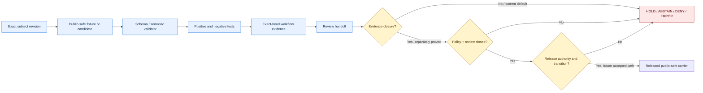

<!-- [KFM_META_BLOCK_V2]
doc_id: kfm://doc/runbook-atmosphere-validation
title: Atmosphere Validation Runbook
type: standard
profile: repository-grounded-bounded-fixture-validation
version: v1.0
prior_version: proposed-scaffold
status: draft; repository-grounded; fixture-first; broader-validation-hold; non-authoritative; non-publisher; not-for-life-safety
owners:
  - "@bartytime4life — verified GitHub review route only"
owner_status: "Atmosphere, validation, evidence, policy, source-rights, sensitivity, Hazards-seam, review, release, and operations assignments remain NEEDS VERIFICATION; CODEOWNERS routing does not create those authorities."
created: NEEDS VERIFICATION — scaffold predates this repository-grounded replacement
updated: 2026-08-24
policy_label: public; atmosphere; validation; fixture-first; no-network; non-release; not-for-life-safety
current_path: docs/runbooks/atmosphere/VALIDATION_RUNBOOK.md
owning_root: docs/
responsibility: "Document the exact bounded Atmosphere validation procedures currently supported by repository fixtures, validators, tests, and read-only workflows; preserve fail-closed Atmosphere and Hazards boundaries; and produce a truthful review handoff without creating source, evidence, policy, review, release, deployment, or publication authority."
truth_posture: >-
  CONFIRMED same-path repository placement, accepted Directory Rules basis,
  executable no-network Atmosphere fixture profiles, exact workflow entry points,
  dedicated specialty-profile workflows, mixed substantive/placeholder inventory,
  draft ValidationReport semantics, permissive DomainValidationReport schema stub,
  absent schema-declared domain validator, default-only unbound policy scaffolds,
  read-only workflow permissions, and explicit broader proof/release holds /
  PROPOSED future canonical validation-report profile, aggregate runner, accepted
  policy evaluator, live-source validation, operational proof producer, review
  authority, and release integration / CONFLICTED generic versus domain validation
  report maturity, air versus atmosphere naming, and machine decision/report
  surfaces / UNKNOWN production source admission, deployed consumers, external
  carrier state, runtime policy enforcement, release operations, and public behavior;
  cite-or-abstain
prepared_under_prompt: KFM Repository Build-Out & Markdown Modernization Implementation Agent v6.0.0
evidence_snapshot:
  repository: bartytime4life/Kansas-Frontier-Matrix
  base_ref: main
  base_commit: 1012d9f6b605656d3e994801581ff3ccbe212556
  target_prior_blob: 902dcbcaaa5d2ef4fed1793e59067b4066760cbe
  directory_rules_blob: fd49a0b83e55cef52c1124281f093e263526898d
  domain_atmosphere_workflow_blob: fccba4b6e2cdae561ec8a4904446ed5dbe6ec8ce
  atmosphere_tests_readme_blob: 29204b56a1e35ff74ba8a2e33bd8a424175e9dab
  domain_validation_report_schema_blob: 3c4d3c36367b2f9bb84c9539edc210fc9d7b6d5e
  airnow_aqs_workflow_blob: 5c2a7195d4727e066e8730d158f0a66e6486e553
  correctable_event_workflow_blob: bb2b27eec05f7248ef9c61bac784dce38679dee3
  pm_sensor_trust_workflow_blob: 16ee6ba2dcaf0f4b2e0907c4a1368507b58c2f1c
  pm25_colocation_workflow_blob: c9b42a2221c7e092c723c7e4c58ed9512a380b83
  pm25_trigger_workflow_blob: 4d172bb7fef9e1c0f57b04881d06c19e29d9e866
inspection_boundary: >-
  Current-session GitHub reads of the target scaffold, accepted Directory Rules
  evidence, Atmosphere domain workflow, dedicated Atmosphere workflows, test and
  validator indexes, generic and domain validation-report contracts/schemas,
  Atmosphere policy boundary, related runbooks, and selected contracts, tests,
  fixtures, validators, receipts, proof placeholders, and release boundaries.
  Initial source reads preceded concurrent main advances; the merged target was
  re-read at main@1012d9f6b605656d3e994801581ff3ccbe212556, intervening changes
  were inspected as non-overlapping, and the direct-dependency blobs remain pinned
  above. Repository-native commands were not executed in a mounted checkout during
  authoring. No live source was contacted; no validation report, EvidenceBundle,
  PolicyDecision, ReviewRecord, release decision, correction, rollback, deployment,
  promotion, publication, alert, health determination, or regulatory action was
  created or performed.
related:
  - docs/runbooks/README.md
  - docs/runbooks/atmosphere/README.md
  - docs/runbooks/atmosphere/NO_NETWORK_TEST_RUNBOOK.md
  - docs/runbooks/atmosphere/PROMOTION_RUNBOOK.md
  - docs/runbooks/atmosphere/CORRECTION_RUNBOOK.md
  - docs/runbooks/atmosphere/ROLLBACK_RUNBOOK.md
  - docs/doctrine/directory-rules.md
  - docs/adr/ADR-0029-adopt-directory-governance-standard-v2.md
  - docs/domains/atmosphere/README.md
  - docs/domains/atmosphere/OBSERVED_MODELED_SEPARATION.md
  - docs/domains/atmosphere/POLICY.md
  - docs/domains/atmosphere/PUBLICATION_POSTURE.md
  - contracts/data/validation_report.md
  - contracts/domains/atmosphere/domain_validation_report.md
  - schemas/contracts/v1/data/validation_report.schema.json
  - schemas/contracts/v1/domains/atmosphere/domain_validation_report.schema.json
  - policy/domains/atmosphere/README.md
  - fixtures/domains/atmosphere/README.md
  - tests/domains/atmosphere/README.md
  - tools/validators/domains/atmosphere/README.md
  - .github/workflows/domain-atmosphere.yml
  - .github/workflows/atmosphere-airnow-aqs-reconciliation.yml
  - .github/workflows/correctable-environmental-event-assessment.yml
  - .github/workflows/pm-sensor-trust-profile.yml
  - .github/workflows/pm25-sensor-colocation-manifest.yml
  - .github/workflows/pm25-trigger-candidate-assessment.yml
tags: [kfm, runbook, atmosphere, validation, no-network, fixtures, source-role, knowledge-character, observed-modeled, air-quality, weather, climate, smoke, evidence, policy, release-hold]
notes:
  - "Same-path documentation modernization under accepted ADR-0029; no root, lane, contract, schema, policy, fixture, validator, test, workflow, receipt, proof, release object, or public state is created or moved."
  - "The current repository supports multiple bounded synthetic Atmosphere profiles, but it does not yet expose one accepted aggregate validation command or a release-grade DomainValidationReport producer."
  - "The schema-declared tools/validators/domains/atmosphere/validate_domain_validation_report.py path is absent at the evidence snapshot; this runbook must not imply otherwise."
  - "KFM is not an AQI, medical, regulatory, emergency-alerting, or life-safety issuing authority."
  - "Post-merge correction replaces the stale pre-merge checkpoint that failed docs-stale-scan; the operating procedure is otherwise unchanged."
[/KFM_META_BLOCK_V2] -->

<a id="top"></a>

# Atmosphere Validation Runbook

> **Repository-grounded procedure for running the Atmosphere / Air lane's current deterministic, no-network validation profiles, classifying exact outcomes, and handing bounded evidence to reviewers without converting tests into source truth, policy approval, release authority, or public advice.**

<p>
  
  
  
  
  
  
</p>

> [!IMPORTANT]
> **Validation is not truth or release authority.** A schema-valid object, passing fixture, green workflow, generated receipt, pull request, or merge proves only the bounded claim declared by that check. It does not certify a live observation, resolve an EvidenceBundle, activate policy, complete human review, approve a release, deploy a service, publish a carrier, or authorize public use.

> [!WARNING]
> **KFM is not an official AQI, medical, regulatory, emergency-alerting, or life-safety authority.** Do not use this runbook to issue health guidance, certify a concentration, declare an event, replace an agency alert, or infer safety from a passing synthetic profile. Atmosphere may carry observation and advisory context; Hazards and official issuers retain their own authority.

> [!CAUTION]
> **Default execution is no-network and fixture-only.** Do not add credentials, contact live EPA, KDHE, NOAA/NWS, Kansas Mesonet, community-sensor, satellite, model, or other upstream services, or point a test at production data merely to make this procedure feel realistic. Live-source admission and operational validation are separate governed work.

**Quick navigation:** [Purpose](#1-purpose-scope-and-non-goals) · [Authority](#2-authority-placement-and-current-evidence) · [Model](#3-validation-model-and-state-separation) · [Guardrails](#4-atmosphere-validation-invariants) · [Preflight](#5-preflight-and-mandatory-stop-conditions) · [Modes](#6-supported-validation-modes) · [Profiles](#7-current-executable-profile-inventory) · [Core procedure](#8-core-domain-validation-procedure) · [Specialty procedure](#9-specialty-profile-procedures) · [Reports](#10-validationreport-and-domainvalidationreport-boundary) · [Outcomes](#11-outcome-and-evidence-labels) · [CI](#12-hosted-ci-and-exact-head-evidence) · [Handoff](#13-review-handoff-packet) · [Troubleshooting](#14-troubleshooting-and-failure-classification) · [Sensitive boundaries](#15-rights-sensitivity-security-and-life-safety) · [Release boundary](#16-proof-policy-review-and-release-boundary) · [Open work](#17-current-holds-and-open-verification) · [Maintenance](#18-maintenance-correction-and-document-rollback) · [Checklist](#appendix-a-operator-checklist) · [Command matrix](#appendix-b-command-and-path-matrix) · [Anti-patterns](#appendix-c-anti-patterns)

---

## 1. Purpose, scope, and non-goals

### Purpose

Use this runbook to validate the repository's current Atmosphere fixture profiles at an exact revision and to produce a truthful, reproducible handoff. The operator's responsibilities are to:

1. freeze the subject revision and changed-area scope;
2. preserve no-network, no-credential, and public-safe fixture boundaries;
3. run the repository-native entry point appropriate to each affected profile;
4. prove both positive acceptance and negative rejection where the profile defines polarity;
5. distinguish validator/test success from evidence, policy, review, proof, release, deployment, and publication;
6. record failures without hiding whether they were introduced, inherited, expected, pending, or not run;
7. retain `HOLD` when broader validation or operational authority is absent.

### In scope

- bounded synthetic Atmosphere observations, contexts, candidates, manifests, assessments, and reconciliation reports;
- shape, deterministic identity, source-role, knowledge-character, unit, time, lineage, caveat, evidence-reference, and non-release checks implemented by current validators/tests;
- exact fixture polarity and expected rejection;
- active no-network guards;
- cross-domain ownership isolation;
- generated-authoring-receipt integrity where a dedicated workflow requires it;
- changed-area and hosted exact-head evidence;
- public-safe review handoff.

### Out of scope

This runbook does not:

- contact live sources or validate current air quality, weather, smoke, climate, or sensor conditions;
- certify scientific validity, sensor equivalence, calibration fitness, model skill, regulatory status, AQI, or health impact;
- define machine shape in Markdown;
- create a `ValidationReport` or `DomainValidationReport` when the accepted producer/profile does not exist;
- resolve EvidenceRefs or manufacture EvidenceBundles;
- execute Rego policy or activate an Atmosphere policy bundle;
- authenticate reviewers or establish separation of duties;
- approve a release, mutate lifecycle state, write `data/published/`, deploy, promote, or publish;
- issue, repeat, or replace official warnings or life-safety instructions;
- treat a map, tile, graph, index, dashboard, model output, or AI answer as validation evidence by itself.

### Validation subject classes

A bounded run may inspect one or more of these subjects:

| Subject | Example | Current support |
|---|---|---|
| Fixture object | Synthetic precipitation or knowledge-character case | **CONFIRMED bounded profiles** |
| Contract candidate | PM sensor trust or colocation candidate | **CONFIRMED fixture-only profiles** |
| Reconciliation candidate/report | AirNow-to-AQS synthetic work record | **CONFIRMED fixture-only profile** |
| Environmental-event assessment | Synthetic observation/candidate/review/event/correction chain | **CONFIRMED fixture-only profile** |
| Cross-domain seam | Atmosphere versus Soil/Hydrology/Hazards ownership | **CONFIRMED bounded tests** |
| Generic validation report | Cross-KFM `ValidationReport` | **Draft semantics; machine producer held** |
| Atmosphere domain validation report | `DomainValidationReport` | **Draft semantics; permissive schema stub; declared validator absent** |
| Live source or public release | Operational Atmosphere records/carriers | **UNKNOWN / HOLD** |

[Back to top](#top)

---

## 2. Authority, placement, and current evidence

### 2.1 Directory Rules basis

Accepted [ADR-0029](../../adr/ADR-0029-adopt-directory-governance-standard-v2.md) adopts [Directory Rules v2](../../doctrine/directory-rules.md). The current file is a human operational procedure and remains at the existing path:

```text
docs/runbooks/atmosphere/VALIDATION_RUNBOOK.md
```

This is a same-path `PLACE` update under the `docs/` responsibility root. It creates no new schema, contract, policy, test, fixture, validator, receipt, proof, release, or runtime authority.

| Responsibility | Owning surface | Relationship to this runbook |
|---|---|---|
| Human validation procedure | `docs/runbooks/atmosphere/` | **Owned here** |
| Atmosphere meaning | `docs/domains/atmosphere/`, `contracts/domains/atmosphere/` | Referenced; not redefined |
| Generic validation meaning | [`contracts/data/validation_report.md`](../../../contracts/data/validation_report.md) | Referenced; draft semantic authority |
| Machine shape | `schemas/contracts/v1/` | Referenced; passing proves shape only |
| Atmosphere admissibility rules | [`policy/domains/atmosphere/`](../../../policy/domains/atmosphere/README.md) | Proposed source lane; currently unbound |
| Executable validation | `tools/validators/`, `tests/`, workflows | Bounded behavior only |
| Reusable inputs | `fixtures/` | Synthetic/public-safe test material |
| Process memory | `data/receipts/` | Separate from findings and proof |
| Evidence and proof | `data/proofs/` | Separate from validation execution |
| Review and release | `release/`, governance records | Separate authority and state |
| Public delivery | Governed APIs and released public-safe carriers | Not exercised here |

### 2.2 Current repository status at the evidence snapshot

| Surface | CONFIRMED repository evidence | Safe conclusion |
|---|---|---|
| Target file | Six-line `PROPOSED scaffold`, blob `902dcbca...` | Replacement is needed; scaffold is not a procedure |
| Directory governance | ADR-0029 accepted; Directory Rules bytes pinned | Same path is valid for human runbook content |
| Domain workflow | [`.github/workflows/domain-atmosphere.yml`](../../../.github/workflows/domain-atmosphere.yml) is read-only and no-network for fixture execution | Core bounded profiles have an executable hosted entry point |
| Core tests/validators | Multiple substantive Python modules coexist with explicit placeholders | Run only admitted profiles; file presence alone is insufficient |
| Dedicated workflows | AirNow/AQS, correctable event, PM trust, PM2.5 colocation, and PM2.5 trigger workflows exist | Specialty profiles have separate exact entry points and path filters |
| Generic `ValidationReport` | Draft semantic contract; permissive id-only schema; schema-declared validator absent | No release-grade generic report producer is established |
| Atmosphere `DomainValidationReport` | Draft semantic contract; permissive id-only schema; schema-declared validator absent | Do not fabricate or claim a canonical domain report |
| Atmosphere policy lane | Thirteen default-only Rego scaffolds; no accepted bundle, entry point, evaluator, or native Rego suite established | Policy is **unbound / inactive** |
| Aggregate Make target | Domain workflow asserts that `atmosphere-validate` and `validate-atmosphere` do not yet exist | No canonical aggregate local target is admitted |
| Proof path | Domain workflow recognizes an exact placeholder proof inventory and reports a hold | Placeholder presence is not proof validation |
| Release path | Candidate/release surfaces exist, but broader release dry-run and operational transition remain held | Validation must stop before release |
| CODEOWNERS | One verified route, `@bartytime4life` | Routing exists; functional or independent review authority does not |
| Live sources and deployed consumers | Not established by inspected validation surfaces | `UNKNOWN / HOLD` |

### 2.3 Stale or partial companion documentation

Several companion Atmosphere runbooks and indexes still contain May 2026 no-mounted-repository or proposal-only language. They remain useful lineage but must not override current code, tests, workflows, contracts, schemas, or policy evidence. This file narrows its claims to the inspected repository snapshot and does not silently modernize sibling documents.

### 2.4 Authority order during a run

When instructions or artifacts disagree, stop and apply this order:

1. safety, rights, sensitivity, trust-membrane, evidence, lifecycle, correction, and rollback invariants;
2. accepted ADRs and Directory Rules;
3. accepted contracts, schemas, policy profiles, source descriptors, and review/release records;
4. exact-revision validators, tests, workflows, fixtures, and generated outputs;
5. current repository-grounded runbooks;
6. older proposal/scaffold documentation.

A lower-ranked passing fixture cannot weaken a higher-ranked denial or missing authority.

[Back to top](#top)

---

## 3. Validation model and state separation

Validation is a chain of bounded claims, not one universal green check.



### 3.1 Independent state axes

| Axis | Examples | Must not be collapsed into |
|---|---|---|
| File state | tracked, missing, scaffold, substantive | correctness |
| Fixture state | valid, invalid, abstaining, denied | live-source truth |
| Validator state | pass, fail, expected rejection, error | policy decision |
| Test state | pass, fail, not collected | proof closure |
| Workflow state | queued, in progress, success, failure, skipped | human review |
| Evidence state | resolved, unresolved, stale, conflicted | release approval |
| Policy state | allowed, denied, held, abstained, error | lifecycle mutation |
| Review state | pending, approved, rejected, conflicted | deployment |
| Release state | candidate, held, released, withdrawn, corrected | publication carrier health |
| Public state | exposed, stale, corrected, withdrawn | repository merge |

### 3.2 What a green result means

A green result means only that the declared executable checks passed over the exact subject revision and fixtures. It does not mean:

- a current observation is accurate;
- a source is admitted or rights-cleared;
- a model or correction is scientifically valid;
- an EvidenceBundle resolves;
- a policy bundle evaluated;
- an eligible human reviewed the subject;
- a release transition occurred;
- public carriers were updated;
- KFM may issue official advice.

[Back to top](#top)

---

## 4. Atmosphere validation invariants

Every current or future Atmosphere validation profile must preserve these rules.

### 4.1 Knowledge and source-role anti-collapse

1. **AQI is not concentration.** A public AQI/report category must not masquerade as a measured concentration.
2. **AOD is not ground-level PM2.5.** A remote-sensing proxy or mask requires explicit product and inference boundaries.
3. **A model field is not an observation.** Forecast/model run identity, generated time, valid time, lineage, and uncertainty remain explicit.
4. **Provisional context is not a certified regulatory archive.** AirNow-like provisional reporting and AQS-like QA/certification state remain distinct.
5. **Low-cost output is not reference-grade by default.** Caveats, correction identity, training/evaluation context, transferability, drift, confidence, and limitations remain visible.
6. **Candidate detection is not a real-world event.** A trigger candidate or environmental-event assessment cannot declare an event or mutate a detector.
7. **Smoke context is not causal attribution.** Burn, plume, hotspot, model, and air-quality observations may support review without proving causation.
8. **Climate anomaly is baseline-relative.** The baseline period, statistic, unit, and time scope cannot be omitted.
9. **Advisory context is not KFM-issued instruction.** Official issuer, status, time, and redirect context remain distinct from KFM presentation.

### 4.2 Identity, time, unit, and support scope

- stable identity inputs and deterministic hashes are required where the profile defines them;
- observation/station identity must not be replaced by model-run identity;
- observed, generated, valid, retrieval, review, release, and correction times remain distinct;
- units and averaging/accumulation windows must be explicit and compatible;
- station, county/generalized support, grid, mask, or model domain must match the claimed use;
- exact or reverse-engineerable sensitive locations must not enter public fixtures or logs;
- lineage links are append-only and cannot silently rewrite the raw/corrected distinction.

### 4.3 Governance and public boundary

- fixtures remain synthetic and public-safe;
- no test grants `released`, `regulatory`, `reference-grade`, `health-safe`, or `official` status;
- evidence references remain references unless the profile explicitly resolves them;
- every current profile denies or preserves false release claims;
- public clients remain behind governed APIs and released carriers;
- validator output is not a PolicyDecision, ReviewRecord, ReleaseManifest, CorrectionNotice, or RollbackCard.

### 4.4 Cross-domain ownership

Atmosphere owns observations and context within its accepted scope. It must not absorb:

- Hazards emergency/life-safety authority;
- Hydrology canonical water observations or flood truth;
- Soil canonical soil-moisture records;
- Agriculture canonical crop/field claims;
- Habitat/fauna/flora canonical ecological claims;
- Settlements/infrastructure protected asset truth;
- Archaeology or people/land sensitive location/person records.

Cross-domain tests may verify seams. They do not transfer authority.

[Back to top](#top)

---

## 5. Preflight and mandatory stop conditions

### 5.1 Preflight checklist

Before running any command:

| Check | Required action | Stop result |
|---|---|---|
| Exact revision | Record full commit SHA and branch/PR head | `ERROR` if unknown |
| Changed-area scope | List changed paths and mapped profiles | `HOLD` if ambiguous |
| Overlap | Check open PRs/branches touching the same files | `HOLD` on unresolved overlap |
| Clean input | Use repository bytes at the exact head | `ERROR` on mixed revisions |
| Python profile | Use repository-declared installer and Python 3.11 where workflows do | `ERROR` if dependencies cannot be reproduced |
| No-network | Set `KFM_NO_NETWORK=1`; use no credentials | `DENY` on attempted live access |
| Fixture sensitivity | Confirm all inputs are synthetic/public-safe | `DENY` on protected content |
| Authority | Identify whether work is validation-only or a separate policy/release task | `HOLD` if conflated |
| Expected polarity | Identify valid and invalid fixture expectations | `ERROR` if unspecified |
| Output destination | Keep reports/logs outside canonical truth/release homes unless an accepted producer owns them | `HOLD` on ambiguous write |

### 5.2 Mandatory stop conditions

Stop immediately when:

- any command tries to contact a live upstream or requires a source credential;
- a fixture contains a real precise station, private person, protected asset, or sensitive location not explicitly authorized for testing;
- a known-invalid fixture is accepted;
- an admitted valid fixture is rejected without an understood profile change;
- a test collects zero cases or a validator becomes a no-op;
- a substantive validator/test appears outside the workflow's admitted inventory;
- a placeholder becomes substantive without being deliberately wired and reviewed;
- the permissive `DomainValidationReport` schema is proposed as a shortcut around missing semantics;
- a passing test is described as evidence closure, policy approval, review, release, or publication;
- a source role, knowledge character, time axis, unit, or support geometry is silently inferred;
- KFM is presented as an alert, medical, AQI, regulatory, or life-safety authority;
- exact-head hosted checks cannot be distinguished from older workflow runs;
- the only proposed fix is to weaken negative fixtures, no-network guards, authority flags, or lifecycle boundaries.

### 5.3 Environment preparation

The core domain workflow uses:

```bash
export KFM_NO_NETWORK=1
export PYTHONDONTWRITEBYTECODE=1
export PYTHONHASHSEED=0
export PYTHONUNBUFFERED=1
export TZ=UTC

python tools/ci/install_python_ci.py project-test
```

Dedicated PM trust and colocation workflows install the repository's `project-runtime` profile instead. Follow the exact workflow for the subject profile; do not assume the two dependency profiles are interchangeable.

[Back to top](#top)

---

## 6. Supported validation modes

| Mode | Entry point | Current status | Permitted conclusion |
|---|---|---|---|
| `CORE_DOMAIN_FIXTURE_SUITE` | `.github/workflows/domain-atmosphere.yml` or its exact local commands | **CONFIRMED bounded** | Named core synthetic profiles passed/failed |
| `SPECIALTY_PROFILE` | Dedicated path-filtered workflow and focused tests | **CONFIRMED bounded** | Named specialty candidate profile passed/failed |
| `CROSS_DOMAIN_SEAM` | `tests/cross_domain/test_environmental_observation_boundaries.py` and profile-specific tests | **CONFIRMED bounded** | Declared ownership seam passed/failed |
| `GENERATED_RECEIPT_INTEGRITY` | `tools/validators/validate_generated_receipt.py` where workflow requires | **CONFIRMED bounded** | Authoring receipt bytes/binding passed/failed |
| `DOMAIN_VALIDATION_REPORT` | Declared contract/schema path | **HOLD** | No canonical producer/validator established |
| `GENERIC_VALIDATION_REPORT` | Generic contract/schema path | **HOLD** | No canonical producer/validator established |
| `LIVE_SOURCE_VALIDATION` | No accepted entry point verified | **UNKNOWN / HOLD** | Do not run from this procedure |
| `PROOF_BUILD` | Domain workflow readiness job | **HOLD** | Placeholder inventory only |
| `RELEASE_DRY_RUN` | Broader release machinery | **HOLD** | No Atmosphere release approval or mutation |

### 6.1 Profile selection rule

Run the smallest profile set that covers the changed behavior:

- documentation-only change: Markdown/link/meta checks plus hosted workflows;
- validator/test/fixture change: affected profile plus exact negative polarity;
- contract/schema change: affected profile, schema checks, contract/schema alignment, consumer search, and migration analysis;
- workflow change: every job/path filter affected plus workflow-security checks;
- shared hashing or validator plumbing: all Atmosphere specialty profiles that consume it;
- policy change: native policy tests and evaluator integration are required; current Atmosphere policy scaffolds are not ready for activation;
- release or public-surface change: this runbook is insufficient—invoke the owning review/release/correction/rollback procedures.

[Back to top](#top)

---

## 7. Current executable profile inventory

### 7.1 Core domain workflow profiles

| Profile | Validator/test surface | Bounded claim |
|---|---|---|
| Public-safe precipitation | `validate_public_safe_precipitation_fixture.py`; `test_atmosphere_smoke.py` | Synthetic observed-sensor character, generalized support, time ordering, millimetre units, accumulation bounds, fixture-only governance, no alert/life-safety claim |
| Knowledge character | `validate_knowledge_character.py`; `test_knowledge_character_registry.py` | Six synthetic characters and exact denials for missing/unknown/multiple or collapsed roles |
| Low-cost sensor caveats | `validate_low_cost_sensor_caveats.py`; `test_low_cost_sensor_caveat_required.py` | Synthetic context-only/corrected-with-lineage qualification, caveat, confidence, limitations, collocation/evaluation metadata, transferability/drift and false-authority denials |
| Observed versus modeled | `validate_observed_modeled_separation.py`; `test_observed_modeled_separation.py` | Closed AirObservation/ForecastContext distinction, identity, time, units, lineage, uncertainty, exact abstention/denial and false-release rejection |
| Cross-domain environmental boundary | `tests/cross_domain/test_environmental_observation_boundaries.py` | Soil/Atmosphere/Hydrology ownership isolation |
| AirNow-to-AQS reconciliation | Dedicated validator and tests; also run in the domain workflow | Synthetic monitor key, source role, QA/certification, deterministic reconciliation, lineage and finite work-record/abstain/deny decisions |
| Prescribed-burn quality flag | `validate_prescribed_burn_quality_flag.py`; `test_prescribed_burn_quality_flag.py` | Observed air quality remains measurement; burn/smoke support remains context; no causal attribution, configuration mutation, health or event declaration |
| PM2.5 trigger candidate | `validate_pm25_trigger_candidate_assessment.py`; `test_pm25_trigger_candidate_assessment.py` | Synthetic categorical candidate/hold assessment; no numeric threshold, AQI, health, detector, policy, or release action |
| Correctable environmental event | Dedicated validator/test pair recognized by the domain inventory | Synthetic observation/candidate/review/event/correction reference coherence; execution remains in its dedicated workflow |

### 7.2 Dedicated specialty profiles

| Profile | Dedicated workflow | Bounded claim |
|---|---|---|
| PM sensor trust candidate | `pm-sensor-trust-profile.yml` | Synthetic trust-dimension shape, evidence-reference closure declared by profile, posture consistency, deterministic identity |
| PM2.5 sensor colocation manifest candidate | `pm25-sensor-colocation-manifest.yml` | Synthetic manifest shape, arithmetic, split consistency, evidence-reference closure declared by profile, deterministic identity |
| AirNow-to-AQS reconciliation | `atmosphere-airnow-aqs-reconciliation.yml` | Fixture-only provisional/regulatory authority reconciliation and generated-receipt binding |
| PM2.5 trigger candidate | `pm25-trigger-candidate-assessment.yml` | Fixture-only categorical candidate/hold assessment and receipt binding |
| Correctable environmental event | `correctable-environmental-event-assessment.yml` | Fixture-only lifecycle/reference coherence and receipt binding |

### 7.3 Explicit non-effects for every current profile

None of the profiles above:

- fetches or validates a live source;
- proves measurement accuracy or scientific validity;
- certifies sensor/reference equivalence;
- selects a correction model or threshold;
- resolves production evidence;
- evaluates an accepted Atmosphere Rego bundle;
- authenticates a reviewer;
- changes a detector or source registry;
- declares a real-world event;
- issues health, regulatory, emergency, or life-safety guidance;
- promotes, releases, deploys, publishes, corrects, withdraws, or rolls back public state.

[Back to top](#top)

---

## 8. Core domain validation procedure

### 8.1 Step 1 — freeze and inventory

Record:

```text
repository: bartytime4life/Kansas-Frontier-Matrix
base_commit: <full SHA>
candidate_head: <full SHA>
changed_paths:
  - <path>
profiles_selected:
  - <profile>
network_posture: denied
```

Inspect the exact branch, not a moving `main` alias. Confirm no open pull request owns the same target or direct dependency.

### 8.2 Step 2 — install declared test dependencies

```bash
python tools/ci/install_python_ci.py project-test
```

Do not install undeclared packages to make a check pass. A dependency gap is a finding.

### 8.3 Step 3 — run core tests

```bash
export KFM_NO_NETWORK=1
export PYTHONDONTWRITEBYTECODE=1
export PYTHONHASHSEED=0
export PYTHONUNBUFFERED=1
export TZ=UTC

python tests/domains/atmosphere/test_atmosphere_smoke.py --verbose
python tests/domains/atmosphere/test_knowledge_character_registry.py --verbose
python tests/domains/atmosphere/test_low_cost_sensor_caveat_required.py --verbose
python tests/domains/atmosphere/test_observed_modeled_separation.py --verbose
python tests/cross_domain/test_environmental_observation_boundaries.py --verbose

python -m pytest \
  tests/validators/domains/atmosphere/airnow_aqs_reconciliation/test_validate_reconciliation.py \
  tests/domains/atmosphere/test_prescribed_burn_quality_flag.py \
  tests/domains/atmosphere/test_pm25_trigger_candidate_assessment.py \
  -q --strict-config --strict-markers
```

A test command that reports zero collected tests is a failure, not a pass.

### 8.4 Step 4 — replay core fixture polarity

#### Public-safe precipitation

```bash
python tools/validators/domains/atmosphere/validate_public_safe_precipitation_fixture.py \
  fixtures/domains/atmosphere/public_safe_precipitation/valid/public_safe_precipitation.json

if python tools/validators/domains/atmosphere/validate_public_safe_precipitation_fixture.py \
  fixtures/domains/atmosphere/public_safe_precipitation/invalid/role_location_time_governance_collapse.json
then
  echo "Known-invalid precipitation fixture was accepted" >&2
  exit 1
fi
```

#### Knowledge character

```bash
python tools/validators/domains/atmosphere/validate_knowledge_character.py \
  fixtures/domains/atmosphere/knowledge_character/valid/*.json

if python tools/validators/domains/atmosphere/validate_knowledge_character.py \
  fixtures/domains/atmosphere/knowledge_character/invalid/*.json
then
  echo "Known-invalid knowledge-character fixtures were accepted" >&2
  exit 1
fi
```

#### Low-cost sensor caveats

```bash
python tools/validators/domains/atmosphere/validate_low_cost_sensor_caveats.py \
  fixtures/domains/atmosphere/low_cost_sensor_calibration/valid/*.json

if python tools/validators/domains/atmosphere/validate_low_cost_sensor_caveats.py \
  fixtures/domains/atmosphere/low_cost_sensor_calibration/invalid/*.json
then
  echo "Known-invalid low-cost-sensor fixtures were accepted" >&2
  exit 1
fi
```

#### Observed versus modeled

```bash
python tools/validators/domains/atmosphere/validate_observed_modeled_separation.py \
  fixtures/domains/atmosphere/observed_modeled_separation/valid/air_observation_bound.json \
  fixtures/domains/atmosphere/observed_modeled_separation/valid/forecast_context_bound.json \
  fixtures/domains/atmosphere/observed_modeled_separation/valid/air_observation_unresolved.json

if python tools/validators/domains/atmosphere/validate_observed_modeled_separation.py \
  fixtures/domains/atmosphere/observed_modeled_separation/invalid/air_observation_model_run_ref.json \
  fixtures/domains/atmosphere/observed_modeled_separation/invalid/forecast_context_missing_lineage.json
then
  echo "Known-invalid observed-versus-modeled fixtures were accepted" >&2
  exit 1
fi
```

### 8.5 Step 5 — classify results

For each command record:

- exact command;
- exact revision;
- start/end time or workflow run;
- exit code;
- cases collected;
- valid cases accepted;
- invalid cases rejected;
- finite domain outcomes observed;
- whether network denial was actively exercised;
- limitations;
- failure ownership.

Do not reduce a profile to “green” without its negative polarity and non-effects.

### 8.6 Step 6 — preserve the broader hold

Even when every core command passes, record:

```text
WORKFLOW_HOLD:
broader Atmosphere semantics, live evidence resolution, policy evaluation,
proof production, accountable review, release dry-run, deployment, and
publication remain unestablished.
```

### 8.7 Step 7 — hand off

Assemble the packet in [§13](#13-review-handoff-packet). Do not create a release-grade validation report merely because the run completed.

[Back to top](#top)

---

## 9. Specialty profile procedures

Run a specialty profile when its contract, schema, validator, fixture, test, workflow, shared hashing, or generated receipt changes.

### 9.1 PM sensor trust profile

The dedicated workflow installs `project-runtime`.

```bash
export KFM_NO_NETWORK=1
export PYTHONDONTWRITEBYTECODE=1
export PYTHONHASHSEED=0
export PYTHONUNBUFFERED=1
export TZ=UTC

python tools/ci/install_python_ci.py project-runtime

python -m unittest discover \
  --start-directory tests/validators/domains/atmosphere \
  --pattern 'test_pm_sensor_trust_profile.py' \
  --verbose

python tools/validators/domains/atmosphere/validate_pm_sensor_trust_profile.py --fixtures

python tools/validators/validate_generated_receipt.py \
  data/receipts/generated/genrec-pass30-pm-sensor-trust-profile-20260809.json
```

**Claim boundary:** synthetic trust dimensions, posture consistency, deterministic identity, and profile-declared evidence references only. No live sensor, scientific validity, reference equivalence, policy, review, release, publication, or health authority.

### 9.2 PM2.5 sensor colocation manifest

```bash
export KFM_NO_NETWORK=1
export PYTHONDONTWRITEBYTECODE=1
export PYTHONHASHSEED=0
export PYTHONUNBUFFERED=1
export TZ=UTC

python tools/ci/install_python_ci.py project-runtime

python -m unittest discover \
  --start-directory tests/validators/domains/atmosphere \
  --pattern 'test_pm25_sensor_colocation_manifest.py' \
  --verbose

python tools/validators/domains/atmosphere/validate_pm25_sensor_colocation_manifest.py --fixtures

python tools/validators/validate_generated_receipt.py \
  data/receipts/generated/genrec-pass30-pm25-sensor-colocation-manifest-20260809.json
```

**Claim boundary:** synthetic shape, arithmetic, split consistency, deterministic identity, and profile-declared evidence references. No live data, scientific validity, reference equivalence, source admission, policy, review, release, publication, or health authority.

### 9.3 AirNow-to-AQS reconciliation

```bash
export KFM_NO_NETWORK=1
export PYTHONDONTWRITEBYTECODE=1
export PYTHONHASHSEED=0
export TZ=UTC

python tools/ci/install_python_ci.py project-test

python -m pytest \
  tests/validators/domains/atmosphere/airnow_aqs_reconciliation/test_validate_reconciliation.py \
  -q --strict-config --strict-markers

python tools/validators/validate_generated_receipt.py \
  data/receipts/generated/genrec-atmosphere-airnow-aqs-reconciliation-20260806.json \
  --repo-root .
```

**Claim boundary:** fixture-only monitor-key, source-role, QA/certification, supersession, and deterministic reconciliation consistency. No live EPA/KDHE access, concentration certification, source admission, alerting, lifecycle write, promotion, release, or publication.

### 9.4 PM2.5 trigger candidate assessment

```bash
export KFM_NO_NETWORK=1
export PYTHONDONTWRITEBYTECODE=1
export PYTHONHASHSEED=0
export TZ=UTC

python tools/ci/install_python_ci.py project-test

python -m pytest -q \
  tests/domains/atmosphere/test_pm25_trigger_candidate_assessment.py

python tools/validators/validate_generated_receipt.py \
  data/receipts/generated/genrec-pass32-pm25-trigger-candidate-20260810.json \
  --repo-root .
```

**Claim boundary:** synthetic categorical candidate/hold validation. No live source, numeric threshold, AQI, health advice, regulatory decision, detector mutation, policy, release, deployment, or publication.

### 9.5 Correctable environmental-event assessment

```bash
export KFM_NO_NETWORK=1
export PYTHONDONTWRITEBYTECODE=1
export PYTHONHASHSEED=0
export TZ=UTC

python tools/ci/install_python_ci.py project-test

python -m pytest -q \
  tests/domains/atmosphere/test_correctable_environmental_event_assessment.py

python tools/validators/validate_generated_receipt.py \
  data/receipts/generated/genrec-correctable-environmental-event-assessment-20260810.json \
  --repo-root .
```

**Claim boundary:** synthetic observation, candidate, review, event, and correction-reference coherence. No live feed, threshold, promotion, real-world event declaration, applied correction, withdrawal, alert, health/regulatory decision, policy, release, deployment, or publication.

### 9.6 Prescribed-burn quality flag

The profile is currently executed through the domain workflow:

```bash
export KFM_NO_NETWORK=1
export PYTHONDONTWRITEBYTECODE=1
export PYTHONHASHSEED=0

python tools/ci/install_python_ci.py project-test

python -m pytest -q --strict-config --strict-markers \
  tests/domains/atmosphere/test_prescribed_burn_quality_flag.py
```

**Claim boundary:** finite `ANSWER`, `ABSTAIN`, `DENY`, and `ERROR` review outcomes over synthetic context; no causal attribution, plume/dispersion modeling, source attribution, health determination, event declaration, configuration mutation, or release action.

### 9.7 Generated receipt rule

A generated authoring receipt proves only its declared source/output binding and integrity profile. It is not:

- the runtime validation result;
- a ValidationReport;
- an EvidenceBundle;
- a PolicyDecision;
- a ReviewRecord;
- a release or publication receipt.

When a profile workflow does not require a generated receipt, do not invent one to make the packet look complete.

[Back to top](#top)

---

## 10. `ValidationReport` and `DomainValidationReport` boundary

### 10.1 Generic `ValidationReport`

The generic contract at [`contracts/data/validation_report.md`](../../../contracts/data/validation_report.md) defines validation-result meaning across KFM. Its paired schema is a permissive greenfield placeholder that requires only `id` and allows additional properties. The schema-declared generic validator path is absent.

**Safe conclusion:** generic semantics are documented, but a canonical release-grade machine producer/validator is not established.

### 10.2 Atmosphere `DomainValidationReport`

The Atmosphere contract at [`contracts/domains/atmosphere/domain_validation_report.md`](../../../contracts/domains/atmosphere/domain_validation_report.md) documents Atmosphere-specific semantic expectations. Its paired schema:

- requires only `id`;
- exposes `id`, `version`, and `spec_hash`;
- allows additional properties;
- declares status `PROPOSED`;
- points to `tools/validators/domains/atmosphere/validate_domain_validation_report.py`.

That declared validator path is absent at the evidence snapshot.

**Disposition: `PROPOSED / HOLD`.** Current focused validators and tests produce bounded CLI/test evidence. They do not collectively emit or validate a canonical `DomainValidationReport`.

### 10.3 Conflict and convergence rule

Do not:

- treat the domain schema as stronger than it is;
- use `additionalProperties: true` to accept an arbitrary operational report;
- create a parallel report schema under another root;
- infer that each focused validator already conforms to one aggregate report vocabulary;
- collapse a test log, generated receipt, proof placeholder, or workflow summary into a domain report.

Future convergence requires, at minimum:

1. accepted generic/domain relationship;
2. closed schema with finite outcomes and findings;
3. deterministic report identity and input/rule hashes;
4. fixtures with positive and exact-negative polarity;
5. dedicated validator and focused tests;
6. process receipt separation;
7. evidence/policy/review/release reference semantics;
8. migration/consumer inventory;
9. correction and rollback behavior.

### 10.4 Interim handoff format

Until convergence, use the review packet in §13. Label it `validation_handoff`, not `DomainValidationReport`.

[Back to top](#top)

---

## 11. Outcome and evidence labels

### 11.1 Test and validator evidence labels

| Label | Meaning |
|---|---|
| `PASS` | The named check passed at the exact revision |
| `FAIL` | The named check failed |
| `EXPECTED_REJECTION` | A known-invalid fixture returned the expected non-success result |
| `UNEXPECTED_ACCEPTANCE` | A known-invalid fixture passed; fail the run |
| `UNEXPECTED_REJECTION` | A declared valid fixture failed; fail or explicitly reclassify the profile |
| `ERROR` | The check could not execute or its infrastructure failed |
| `NOT_RUN` | No execution occurred |
| `PENDING` | Hosted check has not settled |
| `SKIPPED` | Workflow intentionally did not execute; reason required |
| `NOT_APPLICABLE` | Check is outside the changed-area contract |
| `HOLD` | Work cannot advance because accepted authority or implementation is missing |

### 11.2 Domain/runtime finite outcomes

Some Atmosphere profiles use:

- `ANSWER`;
- `ABSTAIN`;
- `DENY`;
- `ERROR`.

Those are candidate/profile outcomes, not the same as a test runner's `PASS` or `FAIL`.

A test may **pass because** a fixture correctly produced `ABSTAIN` or `DENY`.

### 11.3 Work-state versus runtime outcome

`HOLD` is a governed work state. It is appropriate when:

- review or source rights are unresolved;
- broader validation is absent;
- a report producer is missing;
- policy is unbound;
- proof/release integration is unproved;
- hosted checks are pending and required for handoff.

Do not add `HOLD` to an accepted runtime enum unless the owning contract defines it.

### 11.4 Truth labels

Use:

- `CONFIRMED` for current-session repository or exact-head execution evidence;
- `PROPOSED` for future design or inactive profiles;
- `UNKNOWN` when evidence is inaccessible or absent;
- `NEEDS VERIFICATION` for a concrete unperformed check;
- `CONFLICTED` or `STALE` only as qualifiers.

[Back to top](#top)

---

## 12. Hosted CI and exact-head evidence

### 12.1 Relevant workflows

| Workflow | Role |
|---|---|
| [`domain-atmosphere.yml`](../../../.github/workflows/domain-atmosphere.yml) | Core inventory, fixture validation, proof/release readiness holds |
| [`atmosphere-airnow-aqs-reconciliation.yml`](../../../.github/workflows/atmosphere-airnow-aqs-reconciliation.yml) | Dedicated reconciliation profile |
| [`correctable-environmental-event-assessment.yml`](../../../.github/workflows/correctable-environmental-event-assessment.yml) | Dedicated event/correction coherence profile |
| [`pm-sensor-trust-profile.yml`](../../../.github/workflows/pm-sensor-trust-profile.yml) | Dedicated PM trust profile |
| [`pm25-sensor-colocation-manifest.yml`](../../../.github/workflows/pm25-sensor-colocation-manifest.yml) | Dedicated colocation manifest |
| [`pm25-trigger-candidate-assessment.yml`](../../../.github/workflows/pm25-trigger-candidate-assessment.yml) | Dedicated trigger candidate profile |

### 12.2 Exact-head rule

For pull-request evidence, bind every status to the current PR head SHA. A passing run from an older head is stale after any branch update.

Record:

```yaml
head_sha: <full SHA>
workflow: <workflow name>
run_id: <run id>
status: <queued | in_progress | completed>
conclusion: <success | failure | cancelled | skipped | null>
observed_at: <timestamp>
```

### 12.3 Introduced versus inherited failures

A failing workflow is not automatically caused by the changed file. Classify:

1. **Introduced** — failure reproduces only with the candidate change or in changed paths.
2. **Inherited** — matching failure exists on the base or unrelated docs-only PRs.
3. **Unresolved** — insufficient comparison evidence.
4. **Expected hold** — workflow intentionally verifies a placeholder/absence boundary and reports hold without failing.
5. **Infrastructure** — runner, dependency service, or platform failure outside repository behavior.

Do not call a failure inherited without a matching base/head comparison or equivalent evidence.

### 12.4 Workflow success boundary

A successful Atmosphere workflow proves only its job summaries and commands. It does not prove:

- required-check/ruleset significance;
- independent human review;
- source admission;
- active policy;
- proof closure;
- release or deployment;
- public-state parity.

[Back to top](#top)

---

## 13. Review handoff packet

### 13.1 Required fields

| Field | Requirement |
|---|---|
| Repository checkpoint | Base and exact candidate head |
| Changed paths | Complete list |
| Selected profiles | Why each profile applies |
| Commands | Exact command text |
| Environment | Python/dependency profile and no-network variables |
| Inputs | Fixture/candidate paths and digests where practical |
| Polarity | Valid acceptance and invalid rejection counts |
| Outcomes | Test labels plus domain finite outcomes |
| Network | Evidence that no-network guard was active |
| Generated receipts | Exact paths and integrity result where required |
| Findings | Introduced, inherited, unresolved, expected hold |
| Evidence boundary | What was and was not resolved |
| Policy/review/release state | Explicitly separate |
| Sensitivity | Confirmation that no protected detail entered logs/fixtures |
| Rollback | How to revert the repository change, not public state |
| Open items | Concrete `NEEDS VERIFICATION` list |

### 13.2 Handoff template

```yaml
validation_handoff:
  repository: bartytime4life/Kansas-Frontier-Matrix
  base_sha: <full SHA>
  head_sha: <full SHA>
  changed_paths: []
  profiles:
    - id: <profile>
      reason: <why selected>
      commands: []
      fixtures:
        valid: []
        invalid: []
      local:
        status: <PASS | FAIL | NOT_RUN>
      hosted:
        workflow: <name>
        run_id: <id or null>
        status: <PENDING | PASS | FAIL | SKIPPED | NOT_RUN>
      polarity:
        valid_accepted: <count or unknown>
        invalid_rejected: <count or unknown>
      claim_boundary: <bounded conclusion>
  network:
    posture: denied
    live_sources_contacted: false
    credentials_used: false
  generated_receipts: []
  findings:
    introduced: []
    inherited: []
    unresolved: []
    expected_holds: []
  evidence_state: <bounded statement>
  policy_state: UNBOUND
  review_state: PENDING
  release_state: NO_CHANGE
  deployment_state: NO_CHANGE
  publication_state: NO_CHANGE
  operational_state: HOLD
  rollback: <branch close or transparent revert/forward fix>
```

### 13.3 Acceptance for review

The packet is reviewable when:

- every result is exact-head or explicitly stale/pending;
- no real protected or health-sensitive payload is included;
- negative fixture polarity is recorded;
- claim boundaries match validator/workflow scope;
- no missing run is called a pass;
- policy, review, proof, release, deployment, and publication remain separate;
- unresolved items are visible.

[Back to top](#top)

---

## 14. Troubleshooting and failure classification

### Missing required path

**Symptom:** domain workflow reports a required boundary missing.

**Action:**

1. confirm the exact branch/head;
2. determine whether the path was renamed, deleted, or absent on base;
3. consult Directory Rules before creating or moving anything;
4. repair only if it is a direct dependency of the current slice;
5. otherwise record `HOLD` or a separate follow-up.

Do not create a placeholder merely to satisfy the inventory.

### A known-invalid fixture passes

**Severity:** blocking.

This means negative polarity regressed, fixture selection is wrong, or validator behavior weakened. Preserve the fixture, inspect changed logic, and fail the run. Do not relabel the fixture valid to restore green CI without an independently justified contract change.

### A valid fixture fails

Check:

- contract/schema version;
- fixture digest and expected sidecar;
- unit/time/source-role changes;
- shared hashing changes;
- parser limits;
- exact test dependencies.

A legitimate contract change requires synchronized schema, fixtures, validators, tests, docs, consumers, and migration notes.

### Network-denial failure

Any attempted network access is a blocking boundary failure. Remove the live call or isolate it in a separately authorized non-default profile. Do not add an allowlist to the default suite for convenience.

### Placeholder inventory failure

The domain workflow deliberately distinguishes admitted substantive modules from placeholders. When a placeholder becomes substantive:

- add its contract, fixture, negative tests, workflow entry point, and claim boundary deliberately;
- update the accepted inventory;
- do not hide the new behavior from CI discovery.

### Schema passes but semantic test fails

Shape and meaning differ. Preserve the semantic failure. The permissive domain-report schema is especially unsuitable as a correctness shortcut.

### Generated receipt fails

Treat the receipt binding as stale or inconsistent. Regenerate only through its owning procedure, review the changed source/output set, and preserve the old receipt's history. Receipt validity is still not proof or release authority.

### Hosted checks are pending

Report `PENDING`. A draft PR may remain a successful delivery with pending CI, but the validation claim is not settled.

### Unrelated workflow fails

Do not rewrite the Atmosphere change to mask an unrelated baseline defect. Gather base comparison evidence, classify it accurately, and keep introduced versus inherited failures separate.

[Back to top](#top)

---

## 15. Rights, sensitivity, security, and life-safety

### 15.1 Public-safe fixture rule

Fixtures and logs must not contain:

- real precise private or protected station coordinates;
- personal identifiers or private landowner details;
- credentials, tokens, signed URLs, internal hostnames, or cache keys;
- exploitable infrastructure detail;
- restricted source payloads;
- copyrighted or licensed material beyond permitted fixture use;
- official-looking fabricated alerts;
- real-time health or emergency instructions.

Use fictional identifiers and clearly synthetic geography.

### 15.2 Source rights and cadence

A fixture derived from a source does not prove continuing rights, terms, endpoint shape, cadence, or freshness. Before live activation, verify the current SourceDescriptor and source-specific terms through the source-admission process.

### 15.3 Advisory and Hazards handoff

When a subject touches warnings, prescribed fire, smoke, severe weather, or emergency context:

- preserve Atmosphere observation/context scope;
- preserve official issuer and time state;
- route emergency/life-safety authority to Hazards and official sources;
- deny KFM-authored instructions;
- do not infer causal attribution from co-occurrence.

### 15.4 Security posture

Current workflows use:

- read-only repository permissions;
- checkout without persisted credentials;
- no release/signing secret;
- no-network environment variables;
- deterministic Python/hash/time settings.

A workflow change that adds write permission, secrets, external calls, artifact publication, or mutable public state is a separate security- and authority-significant change.

[Back to top](#top)

---

## 16. Proof, policy, review, and release boundary

### 16.1 Receipts versus findings versus proof

| Object/surface | Records | Does not establish alone |
|---|---|---|
| Test log | What test runner observed | semantic authority |
| Validator output | Findings over declared input/profile | source truth or policy |
| Generated authoring receipt | Source/output binding for a repository change | runtime validation or proof |
| Run/process receipt | What executable ran | correctness |
| ValidationReport | Governed findings, when accepted | proof closure |
| EvidenceBundle/ProofPack | Evidence support and limitations | policy or release |
| PolicyDecision | Admissibility result and obligations | human review or mutation |
| ReviewRecord | Accountable review | release unless profile grants it |
| ReleaseManifest/decision | Authorized release state | deployed/public carrier health |
| Published carrier | Public bytes | sovereign truth |

### 16.2 Current policy hold

The Atmosphere policy directory contains proposed default-only Rego scaffolds with mixed packages/result relations and no accepted aggregate entry point, immutable bundle, evaluator, or native Rego test suite. Current Python validation does not activate or substitute for that policy system.

### 16.3 Current proof hold

The domain workflow recognizes an exact placeholder proof inventory and intentionally states that it is not proof validation. Do not cite the placeholder PM2.5 evidence-bundle JSON as an EvidenceBundle.

### 16.4 Current release hold

A passing Atmosphere profile may support a candidate review. It cannot:

- create a PromotionDecision;
- write or approve a ReleaseManifest;
- move data into `PUBLISHED`;
- mutate a public alias;
- invalidate a cache;
- deploy or publish;
- establish public parity.

Use the promotion, correction, and rollback runbooks only after their owning controls and current evidence are independently verified.

[Back to top](#top)

---

## 17. Current holds and open verification

> [!NOTE]
> **Reserved documentation-control token — `PROPOSED / HOLD`; not executable at this snapshot.**
>
> ```text
> atmosphere-validate: python tools/validators/domains/atmosphere/validate_domain_validation_report.py
> ```
>
> The documentation-control scan requires this exact token for cross-document discoverability. The named validator path and aggregate Make target are absent at the evidence snapshot. This is a reserved convergence contract, not a runnable command, implementation claim, policy gate, release step, or authority grant.

| Item | Current state | Required next evidence |
|---|---|---|
| Aggregate Atmosphere validation command | No admitted Make target; workflow guards the absence | Accepted runner contract, profile selection, tests, docs, and CI |
| Generic ValidationReport machine profile | Permissive schema; declared validator absent | Closed schema, fixtures, validator, tests, consumers, migration |
| Atmosphere DomainValidationReport machine profile | Permissive schema; declared validator absent | Generic/domain relationship decision and complete profile |
| Focused-profile result normalization | Multiple CLI/test vocabularies | Accepted finding/outcome adapter without information loss |
| Test/validator index currency | Mixed substantive and placeholder inventory; README predates some later specialty profiles | Current inventory regeneration and review |
| `air` versus `atmosphere` naming | Cross-root namespace/path drift | Alias/migration decision and consumer inventory |
| Atmosphere policy | Default-only unbound scaffolds | Accepted package, entry point, bundle, evaluator, negative tests, obligations |
| Source admission | Live source authority/rights/freshness not proved by fixtures | Accepted SourceDescriptors and admission records |
| Evidence resolution | Focused fixtures use synthetic references or bounded checks | Operational EvidenceRef-to-EvidenceBundle resolver and proof |
| Independent review | One CODEOWNERS route only | Authenticated identities, assignments, scope, interval, conflict/recusal |
| Proof producer | Domain workflow holds | Accepted producer, schema, evidence inputs, negative tests, receipts |
| Release dry-run | Held | Immutable candidate/manifest, policy/review closure, rollback target, no-write proof |
| Public API/UI validation | Not established here | Governed consumer tests, finite states, citation/evidence display, stale/correction state |
| Live-source validation | No accepted default entry point | Isolated, rights-aware, rate-limited, receipt-emitting non-public profile |
| External invalidation/correction | Unknown | Carrier inventory, adapters, receipts, retry/failure recovery |
| Life-safety redirect behavior | Doctrine exists; runtime behavior unproved | Governed API/UI tests against official-source redirection and denials |
| Required-check significance | Hosted runs exist; ruleset coupling separate | Current platform/ruleset evidence |

These are not resolved by adding optimistic prose. Each belongs to its owning contract, schema, policy, validator, fixture, workflow, source, evidence, review, release, runtime, or governance surface.

[Back to top](#top)

---

## 18. Maintenance, correction, and document rollback

### 18.1 Update triggers

Review this runbook when any of these changes:

- accepted Directory Rules or this file's path;
- Atmosphere object-family or knowledge-character semantics;
- generic or domain ValidationReport contract/schema;
- admitted validator/test/fixture inventory;
- no-network guard or dependency installation profile;
- dedicated workflow commands or path filters;
- policy package, entry point, bundle, evaluator, or decision vocabulary;
- source-admission or EvidenceBundle resolver behavior;
- review/separation-of-duties model;
- proof, release-dry-run, correction, rollback, API, UI, or public-carrier behavior.

### 18.2 Documentation correction

When this runbook becomes stale:

1. pin the stale statement and current repository evidence;
2. apply the smallest same-path correction;
3. update affected commands, claim boundaries, and open holds together;
4. preserve historical commit/PR lineage;
5. do not silently convert a proposal to `CONFIRMED`.

### 18.3 Rollback of this documentation change

Before merge, close or abandon the draft pull request. After an authorized merge, use a transparent revert or bounded forward-fix pull request against the actual merged commit. Do not rewrite shared history.

Reverting this file:

- restores Markdown bytes only;
- does not reverse validator/test/workflow behavior;
- does not withdraw a source, proof, policy, review, release, deployment, or publication;
- does not change public air-quality, weather, smoke, climate, or advisory state.

### 18.4 Last reviewed

| Field | Value |
|---|---|
| Evidence checkpoint | `main@1012d9f6b605656d3e994801581ff3ccbe212556` |
| Prior target blob | `902dcbcaaa5d2ef4fed1793e59067b4066760cbe` |
| Reviewed | 2026-08-24 |
| Operational validation posture | Bounded synthetic profiles; broader validation `HOLD` |
| Release/deployment/publication effect | None |
| Next review trigger | Any material change in §18.1 |

[Back to top](#top)

---

## Appendix A — Operator checklist

### Scope and authority

- [ ] Exact base and head SHAs recorded.
- [ ] Open PR/branch overlap checked.
- [ ] Changed paths mapped to explicit profiles.
- [ ] Directory Rules consulted before any structural change.
- [ ] Validation-only scope separated from policy/release work.

### Input safety

- [ ] `KFM_NO_NETWORK=1` set.
- [ ] No live credentials or source calls.
- [ ] Fixtures are synthetic and public-safe.
- [ ] No precise protected location, person, asset, or official-looking alert in logs.
- [ ] Source rights/cadence are not inferred from fixture presence.

### Execution

- [ ] Repository-declared dependency profile installed.
- [ ] Exact valid cases accepted.
- [ ] Exact invalid cases rejected.
- [ ] No zero-test/vacuous pass.
- [ ] Active network-denial tests pass.
- [ ] Generated receipts validated only where the owning workflow requires them.
- [ ] Exact commands and exit codes captured.

### Interpretation

- [ ] Test `PASS` kept distinct from domain `ANSWER/ABSTAIN/DENY/ERROR`.
- [ ] `HOLD`, `PENDING`, `NOT_RUN`, and `SKIPPED` used truthfully.
- [ ] Introduced and inherited failures separated.
- [ ] Claim boundaries and non-effects recorded.
- [ ] No ValidationReport/DomainValidationReport fabricated.

### Handoff

- [ ] Exact-head hosted status recorded.
- [ ] Evidence, policy, review, proof, release, deployment, and publication states separate.
- [ ] Broader operational posture remains `HOLD` unless independently proved.
- [ ] Repository rollback path recorded.
- [ ] Open verification items listed.

[Back to top](#top)

---

## Appendix B — Command and path matrix

| Profile | Primary test | Validator/secondary command | Workflow |
|---|---|---|---|
| Public-safe precipitation | `tests/domains/atmosphere/test_atmosphere_smoke.py` | `validate_public_safe_precipitation_fixture.py` | `domain-atmosphere` |
| Knowledge character | `test_knowledge_character_registry.py` | `validate_knowledge_character.py` | `domain-atmosphere` |
| Low-cost sensor caveats | `test_low_cost_sensor_caveat_required.py` | `validate_low_cost_sensor_caveats.py` | `domain-atmosphere` |
| Observed/modeled | `test_observed_modeled_separation.py` | `validate_observed_modeled_separation.py` | `domain-atmosphere` |
| Environmental seam | `tests/cross_domain/test_environmental_observation_boundaries.py` | — | `domain-atmosphere` |
| AirNow/AQS | `tests/validators/domains/atmosphere/airnow_aqs_reconciliation/test_validate_reconciliation.py` | dedicated reconciliation validator through tests; generated receipt check | dedicated + domain |
| Prescribed burn flag | `test_prescribed_burn_quality_flag.py` | profile validator through tests | `domain-atmosphere` |
| PM2.5 trigger | `test_pm25_trigger_candidate_assessment.py` | generated receipt check | dedicated + domain |
| Correctable event | `test_correctable_environmental_event_assessment.py` | generated receipt check | dedicated; recognized by domain |
| PM trust | `tests/validators/domains/atmosphere/test_pm_sensor_trust_profile.py` | `validate_pm_sensor_trust_profile.py --fixtures` | dedicated |
| PM2.5 colocation | `test_pm25_sensor_colocation_manifest.py` | `validate_pm25_sensor_colocation_manifest.py --fixtures` | dedicated |

[Back to top](#top)

---

## Appendix C — Anti-patterns

Never use this runbook to justify:

- **fixture-to-production equivalence** — synthetic pass is not live-source truth;
- **schema-only acceptance** — permissive shape is not semantic correctness;
- **green-check authority** — CI is not review, release, deployment, or publication;
- **AQI/concentration collapse**;
- **AOD/ground-PM2.5 collapse**;
- **model/observation collapse**;
- **provisional/regulatory collapse**;
- **low-cost/reference-grade collapse**;
- **candidate/event collapse**;
- **context/causation collapse**;
- **advisory/life-safety collapse**;
- **test log as ValidationReport**;
- **generated receipt as proof**;
- **validation finding as PolicyDecision**;
- **one GitHub account as independent review**;
- **live calls in the default suite**;
- **weakening a negative fixture to restore green CI**;
- **creating a parallel schema, policy, proof, receipt, or release home**;
- **publishing precise or sensitive locations in fixtures, logs, issues, or PRs**;
- **treating MapLibre, tiles, dashboards, graph edges, indexes, or AI prose as validation authority**;
- **describing KFM as an official air-quality, medical, regulatory, emergency, or life-safety issuer**.

[Back to top](#top)
