<!-- [KFM_META_BLOCK_V2]
doc_id: kfm://doc/TODO-correction-runbook-uuid
title: Correction Runbook
type: standard
version: v1
status: draft
owners: @bartytime4life
created: TODO: confirm original creation date from repo history
updated: 2026-04-28
policy_label: TODO: confirm policy label
related: [./publication.md, ./rollback.md, ../architecture/system_overview.md, ../../schemas/contracts/v1/correction/README.md, ../../tests/e2e/correction/README.md, ../../data/proofs/README.md, ../../data/receipts/README.md]
tags: [kfm, runbook, correction, lineage, release, rollback]
notes: [doc_id, created, and policy_label remain reviewable placeholders; owner is current broad fallback and should be rechecked against active CODEOWNERS before publication]
[/KFM_META_BLOCK_V2] -->

# Correction Runbook

Use this runbook to correct a published or release-backed KFM error **without hiding lineage, weakening evidence, or silently rewriting trust surfaces**.

> **Status:** `draft` · **Owners:** `@bartytime4life` · **Path:** `docs/runbooks/correction.md` · **Primary seam:** `CorrectionNotice`
>
> 
> 
> 
> 
> 
>
> **Quick jumps:** [Scope](#scope) · [Repo fit](#repo-fit) · [Accepted inputs](#accepted-inputs) · [Exclusions](#exclusions) · [Trigger](#trigger) · [Severity](#severity) · [Correction lifecycle](#correction-lifecycle) · [Procedure](#procedure) · [Artifacts](#artifacts) · [Validation](#validation) · [Roll-forward vs rollback](#roll-forward-vs-rollback) · [Definition of done](#definition-of-done) · [Open verification backlog](#open-verification-backlog)

> [!IMPORTANT]
> A correction is a governed state transition. It is not a quiet edit, hidden alias swap, deleted artifact, rewritten proof pack, or polished UI banner without supporting evidence.

## At a glance

| Question | Working rule |
|---|---|
| What is being corrected? | A published, promoted, release-backed, or outward trust-bearing claim, artifact, payload, layer, story, export, or runtime answer. |
| What must be emitted or linked? | A `CorrectionNotice` or equivalent lineage object, plus affected release or artifact refs and replacement refs when a replacement exists. |
| What must stay visible? | `superseded`, `withdrawn`, `narrowed`, `reissued`, `stale-visible`, `correction-pending`, or equivalent trust state. |
| What must never happen? | Silent overwrite of release-backed trust surfaces. |
| What is the runtime posture? | `ANSWER`, `ABSTAIN`, `DENY`, or `ERROR` must remain explicit while correction state is unresolved or unsafe. |
| What is the safe default? | Fail closed, preserve evidence, preserve receipts, preserve proof, and do not widen publication scope. |

## Scope

This runbook applies when a KFM output that has crossed into public, semi-public, steward-facing, or release-backed trust state must be corrected.

Use it for:

- superseding a release-backed artifact with a corrected release;
- withdrawing an unsafe, invalid, unsupported, rights-conflicted, or no-longer-publishable output;
- narrowing precision, access, geometry, attribution, or language after sensitivity or rights review;
- reissuing a corrected release while preserving the earlier release as audit-visible;
- marking derived delivery as `stale-visible` or `correction-pending` until rebuild or repoint completes;
- ensuring maps, dossiers, stories, exports, Evidence Drawer payloads, Focus Mode, and governed API responses do not continue to present corrected material as current truth.

This runbook does **not** decide the authoritative schema shape, policy rule body, release proof format, or UI implementation. It coordinates those surfaces during correction.

## Repo fit

| Direction | Surface | Why it matters |
|---|---|---|
| Upstream architecture | [`../architecture/system_overview.md`](../architecture/system_overview.md) | Defines KFM’s truth path, trust membrane, finite outcomes, and correction-visible runtime posture. |
| Adjacent runbook | [`./publication.md`](./publication.md) | Correction is downstream of governed publication, not a substitute for release readiness. |
| Adjacent runbook | [`./rollback.md`](./rollback.md) | Rollback is the fallback when a safe correction cannot be validated quickly enough. |
| Schema lane | [`../../schemas/contracts/v1/correction/README.md`](../../schemas/contracts/v1/correction/README.md) | Defines the correction-family machine-schema boundary. |
| Whole-path proof lane | [`../../tests/e2e/correction/README.md`](../../tests/e2e/correction/README.md) | Owns end-to-end correction lineage drills once executable depth exists. |
| Proof lane | [`../../data/proofs/README.md`](../../data/proofs/README.md) | Stores release-significant proof, correction notices, supersession records, rollback records, and withdrawal records. |
| Receipt lane | [`../../data/receipts/README.md`](../../data/receipts/README.md) | Stores process memory for validation, rebuild, review, correction, and replay. |
| Ownership | [`../../.github/CODEOWNERS`](../../.github/CODEOWNERS) | Broad fallback ownership currently covers `docs/runbooks/`; verify active branch before merge. |

## Accepted inputs

| Accepted input | Required handling |
|---|---|
| Error report against a released artifact or outward claim | Triage severity, identify affected release/artifact/claim refs, and preserve the report as process memory. |
| Failed validation after publication | Contain affected surfaces, emit correction lineage, and preserve failed validation output where policy allows. |
| Rights, license, sensitivity, or source-status change | Fail closed for public scope until policy/review state is resolved. |
| Replacement release candidate | Validate as a normal release candidate, then link from the affected release through correction lineage. |
| Projection rebuild or repoint result | Link to correction state and freshness basis; never imply old derived output is current while rebuild is pending. |
| Steward or reviewer decision | Store or reference the decision through `DecisionEnvelope`, `ReviewRecord`, proof, receipt, or policy surfaces as appropriate. |

## Exclusions

| Do not use this runbook for | Use instead |
|---|---|
| First-time publication with no correction burden | [`./publication.md`](./publication.md) |
| Pure rollback with no corrected replacement path | [`./rollback.md`](./rollback.md) plus a visible correction or withdrawal record |
| Local schema edits only | [`../../schemas/contracts/v1/correction/README.md`](../../schemas/contracts/v1/correction/README.md) and contract tests |
| Policy grammar, reason-code, or obligation edits only | `../../policy/` and policy tests |
| Runtime answer behavior without correction lineage | `../../tests/e2e/runtime_proof/` when present |
| Accessibility-only cue testing | `../../tests/accessibility/` |
| Deleting or hiding embarrassing artifacts | Not allowed; create lineage, withdrawal, rollback, or supersession records instead |

## Trigger

Start this runbook when any of the following is true:

- a published claim, payload, map layer, story, export, API response, or artifact is inaccurate, incomplete, unsupported, unsafe, rights-conflicted, stale in a misleading way, or policy-invalid;
- a release-backed output depends on evidence that has been corrected, withdrawn, narrowed, reclassified, or superseded;
- a derived artifact no longer matches the corrected release state;
- a public or steward surface could continue to display old meaning unless correction state is made visible;
- a reviewer, steward, maintainer, source owner, or policy gate requires correction, supersession, withdrawal, narrowing, reissue, or rollback.

## Severity

| Severity | Use when | Immediate posture |
|---|---|---|
| `SEV-1` | Trust, safety, rights, sovereignty, cultural sensitivity, protected location, living-person, DNA, critical infrastructure, or public harm risk is plausible. | Contain immediately. Freeze promotion or disable affected outward access where safe. Prefer `DENY` or `ABSTAIN` for runtime surfaces until proof is restored. |
| `SEV-2` | Material error affects public meaning, evidence interpretation, release scope, freshness, attribution, or downstream derived products. | Mark affected surfaces `correction-pending` or `stale-visible`; validate replacement before normal release resumes. |
| `SEV-3` | Minor issue does not materially change public meaning or policy posture. | Queue in next release cycle, but still preserve correction lineage if release-backed meaning changes. |

> [!CAUTION]
> Never expose sensitive details in a public correction note merely to explain the correction. Public notes should be accurate, bounded, and policy-safe.

## Correction lifecycle

```mermaid
flowchart LR
    A[Released or outward trust-bearing output] --> B[Correction trigger]
    B --> C[Triage severity and scope]
    C --> D{Immediate containment needed?}
    D -- Yes --> E[Freeze, hide, banner, deny, abstain, or mark pending]
    D -- No --> F[Prepare correction package]
    E --> F
    F --> G[Emit or link CorrectionNotice]
    G --> H{Replacement release ready?}
    H -- Yes --> I[Validate replacement release]
    H -- No --> J[Withdraw, narrow, or remain stale-visible]
    I --> K[Link affected and replacement refs]
    J --> L[Publish visible unavailable or correction-pending state]
    K --> M[Rebuild or repoint derived delivery]
    L --> N[Update runtime and trust surfaces]
    M --> N
    N --> O[Archive proof, receipts, review notes, and lessons]
    B -. forbidden .-> X[Silent overwrite]
```



## Procedure

### 0. Confirm authority and current state

Before changing anything, inspect the branch and adjacent authority surfaces.

```bash
# Safe inspection only. Run from repo root.
git status --short
git branch --show-current

sed -n '1,220p' docs/runbooks/correction.md
sed -n '1,220p' docs/runbooks/publication.md 2>/dev/null || true
sed -n '1,220p' docs/runbooks/rollback.md 2>/dev/null || true
sed -n '1,260p' docs/architecture/system_overview.md 2>/dev/null || true

sed -n '1,260p' schemas/contracts/v1/correction/README.md 2>/dev/null || true
cat schemas/contracts/v1/correction/correction_notice.schema.json 2>/dev/null || true

sed -n '1,220p' data/proofs/README.md 2>/dev/null || true
sed -n '1,220p' data/receipts/README.md 2>/dev/null || true
sed -n '1,220p' tests/e2e/correction/README.md 2>/dev/null || true
sed -n '1,160p' .github/CODEOWNERS 2>/dev/null || true
```

Do not upgrade any workflow, schema, policy, runner, or emitted-artifact claim to `CONFIRMED` until the active checkout proves it.

### 1. Triage and assign severity

Record:

- reporter and timestamp;
- affected release, artifact, claim, layer, story, export, or runtime surface;
- suspected cause;
- public or steward-facing impact;
- rights, sensitivity, sovereignty, privacy, cultural, location, or safety concern;
- whether an immediate containment action is required;
- whether a replacement release is available or only withdrawal/narrowing is safe.

### 2. Contain affected surfaces

Choose the smallest safe containment action.

| Situation | Containment action |
|---|---|
| Sensitive or unsafe public exposure | Disable public route, public alias, layer, export, or story node where policy allows; preserve evidence and incident receipt. |
| Incorrect public meaning but no immediate safety risk | Add correction banner, `correction-pending`, or `stale-visible` state. |
| Runtime cannot resolve corrected evidence | Return `ABSTAIN`, `DENY`, or `ERROR` with visible reason instead of answering from stale state. |
| Derived delivery is stale | Mark stale and queue rebuild/repoint; do not pretend derived output is current. |
| Source rights or sensitivity changed | Hold publication and route to policy/steward review. |

### 3. Prepare the correction package

The correction package should be small, reviewable, and complete enough to reconstruct.

Minimum content:

- affected target refs;
- correction type;
- severity;
- public-safe explanation;
- evidence, policy, review, receipt, and proof refs;
- replacement refs, or explicit statement that no replacement exists;
- affected surface classes;
- rebuild or repoint refs for derived delivery;
- rollback plan if replacement validation fails.

Working correction types:

| Type | Meaning | Replacement required? |
|---|---|---|
| `SUPERSEDE` | Old output is replaced by a newer release or artifact. | Yes. |
| `WITHDRAW` | Old output is no longer valid or publishable. | No. |
| `NARROW` | Scope, precision, access, or wording is reduced. | Sometimes. |
| `REISSUE` | Corrected release is issued for the same intended scope. | Yes. |
| `STALE_VISIBLE` | Corrected source/release state exists, but derived delivery is waiting. | No, but rebuild/repoint state is required. |
| `CORRECTION_PENDING` | Triage confirms correction need, but final path is not complete. | No, but outward state must remain explicit. |

> [!NOTE]
> Treat these as working vocabulary until the active schema or shared vocabulary makes enum law explicit.

### 4. Emit or link `CorrectionNotice`

Use the active schema and contract names when verified. A mature `CorrectionNotice` should identify:

| Concept | Why it matters |
|---|---|
| affected targets | Prevents orphan correction records. |
| correction type | Tells consumers how to display, block, rebuild, or link. |
| issued and effective times | Separates discovery time from consumer-facing effect. |
| reason or cause | Keeps the correction reviewable without relying on memory. |
| public note | Gives users a safe explanation. |
| review or policy basis | Keeps rights, safety, and steward decisions visible. |
| replacement refs | Makes supersession or reissue traversable. |
| affected surface classes | Prevents map, dossier, story, export, Focus, or Evidence Drawer drift. |
| rebuild or repoint refs | Keeps derived artifacts release-linked. |
| audit or receipt refs | Makes the process inspectable. |

### 5. Validate replacement, withdrawal, or narrowing

Do not publish corrected state until these gates pass or are explicitly held:

- schema and contract checks for correction objects;
- policy decision and reason/obligation checks;
- rights and sensitivity review where applicable;
- EvidenceBundle resolution for corrected consequential claims;
- catalog closure and release manifest consistency;
- proof/receipt separation;
- derived rebuild or repoint plan;
- runtime response behavior for affected claims;
- public-safe correction note;
- reviewer or steward signoff for high-burden lanes.

### 6. Rebuild, repoint, or mark derived delivery

Derived outputs include tiles, search indexes, graph projections, summaries, static exports, scene packages, cache entries, story payloads, and Focus context packs.

| Derived state | Required action |
|---|---|
| Replacement ready | Rebuild or repoint from corrected release scope and store receipt/proof refs. |
| Replacement not ready | Keep old output visible only with `stale-visible` or `correction-pending` state where safe. |
| Output no longer publishable | Withdraw or disable outward access while preserving proof and correction lineage. |
| Precision narrowed | Publish generalized or redacted derivative only with transform reason and review linkage. |

### 7. Update outward trust surfaces

Every affected public or steward-facing surface must either show the correction state or fail closed.

| Surface | Correction cue required |
|---|---|
| Map / layer | stale, superseded, withdrawn, narrowed, or correction-pending cue; replacement link when available. |
| Evidence Drawer | affected target, correction type, evidence/proof refs, review/policy basis, replacement or withdrawal state. |
| Focus Mode | finite outcome and citation behavior must reflect corrected state; no stale answer should bluff. |
| Dossier / detail view | corrected status and replacement/withdrawal lineage. |
| Story / narrative | visible note if historical or interpretive meaning changed. |
| Export / report | corrected release ref or warning that prior export is superseded/withdrawn. |
| API response | explicit correction state, replacement refs, or finite negative outcome. |

### 8. Publish the correction notice

When validation and review pass:

1. store release-significant correction proof under the active proof lane;
2. store process receipts under the active receipt lane;
3. update release manifest or release-facing correction state where applicable;
4. update catalog and provenance closure where applicable;
5. publish user-facing correction note or state cue;
6. update adjacent docs when behavior-significant;
7. archive review notes, screenshots, diffs, or snapshots needed for audit.

### 9. Review and close

Close only after:

- affected targets are explicit;
- corrected or withdrawn state is visible;
- old release evidence remains discoverable for audit;
- replacement lineage is traversable when replacement exists;
- derived delivery is rebuilt, repointed, withdrawn, or marked visibly stale;
- runtime and UI surfaces no longer present stale claims as current truth;
- proof and receipt refs resolve;
- follow-up tests or fixtures are queued.

## Artifacts

| Artifact family | Role in correction | Typical home |
|---|---|---|
| `CorrectionNotice` | Primary lineage object for supersession, withdrawal, narrowing, reissue, or pending correction. | `data/proofs/` for emitted release-significant records; `schemas/contracts/v1/correction/` for shape. |
| `ReleaseManifest` | Identifies affected and replacement release scope. | release/proof surfaces. |
| `ReleaseProofPack` / `PromotionProofBundle` | Proves corrected release is publishable and reviewable. | `data/proofs/` or repo-approved release proof path. |
| `EvidenceBundle` | Resolves support for corrected consequential claims. | proof/evidence surfaces. |
| `DecisionEnvelope` | Carries finite policy or runtime decision outcome and basis. | policy/proof/runtime surfaces. |
| `ReviewRecord` | Captures human approval, denial, escalation, or steward note. | review/proof/receipt surfaces. |
| `run_receipt` / validation receipt | Process memory for validation, rebuild, correction, or publish run. | `data/receipts/`. |
| `ProjectionBuildReceipt` | Proves derived delivery rebuilt or repointed from corrected release state. | receipts/proofs depending on release significance. |
| `RollbackRecord` / rollback card | Governs withdrawal, disablement, or recovery when correction cannot safely roll forward. | proof/runbook/release surfaces. |

## Validation

### Required checks

- [ ] Affected release, artifact, claim, layer, story, export, or runtime surface is identified.
- [ ] Correction type is explicit.
- [ ] Public-safe note exists where outward users will see a changed state.
- [ ] Old artifact remains audit-discoverable unless policy requires restricted access.
- [ ] Replacement release refs resolve when replacement exists.
- [ ] Withdrawal does not invent a replacement.
- [ ] Derived outputs are rebuilt, repointed, withdrawn, or marked visibly stale.
- [ ] EvidenceBundle coverage remains one hop away from corrected consequential claims.
- [ ] Decision/review/policy basis is recorded or linked.
- [ ] Receipts and proof objects stay distinct.
- [ ] Runtime behavior is finite and explicit: `ANSWER`, `ABSTAIN`, `DENY`, or `ERROR`.
- [ ] No raw, work, quarantine, sensitive, or rights-unclear material leaks into public correction notes.
- [ ] Adjacent docs are updated when the correction changes user-facing behavior.

### Safe vocabulary search

```bash
grep -RIn \
  -e 'CorrectionNotice' \
  -e 'correction_notice' \
  -e 'ReleaseManifest' \
  -e 'ReleaseProofPack' \
  -e 'EvidenceBundle' \
  -e 'DecisionEnvelope' \
  -e 'RuntimeResponseEnvelope' \
  -e 'ProjectionBuildReceipt' \
  -e 'superseded' \
  -e 'withdrawn' \
  -e 'stale-visible' \
  -e 'correction-pending' \
  -e 'rollback' \
  docs contracts schemas policy data tests apps packages .github 2>/dev/null || true
```

### Runner posture

The exact validator, e2e, UI, and workflow commands are **NEEDS VERIFICATION** until active branch tooling is inspected. Prefer repo-native runners over new ad hoc commands.

If no executable correction drill exists yet, the first drill should be synthetic, public-safe, and narrow:

```text
release.supersession.visible_state.test.*
correction_notice.replacement_lineage.test.*
projection.stale_visible.after_correction.test.*
focus.corrected_claim.lineage_visible.test.*
export.withdrawal.visible_denial.test.*
```

## Roll-forward vs rollback

| Path | Choose when | Required result |
|---|---|---|
| Roll-forward | A validated corrected release can be produced quickly and safely. | Old output links to replacement; replacement links or carries lineage; public state is updated. |
| Rollback | Corrected release cannot be validated quickly enough, or public exposure is unsafe. | Affected output is withdrawn, disabled, repointed, or held with visible state; proof and correction lineage remain inspectable. |
| Narrow | The old output is partly valid but too precise, too broad, or no longer policy-safe. | Public output is generalized, redacted, or access-controlled with visible reason and transform linkage. |
| Hold | Evidence, rights, sensitivity, policy, or review state is unresolved. | Publication does not proceed; runtime and UI fail closed or show pending state. |

## Definition of done

A correction is not complete until all applicable gates pass:

- [ ] The correction is anchored to explicit affected targets.
- [ ] The correction type and severity are recorded.
- [ ] `CorrectionNotice` or equivalent lineage is emitted or linked.
- [ ] Old release evidence remains audit-visible.
- [ ] Replacement, withdrawal, narrowing, reissue, stale-visible, or pending state is visible to affected users or reviewers.
- [ ] Derived delivery is rebuilt, repointed, withdrawn, or marked visibly stale.
- [ ] Runtime surfaces do not answer from invalidated state.
- [ ] Evidence, policy, review, proof, and receipt refs resolve or block completion.
- [ ] Rights, sensitivity, sovereignty, privacy, cultural, and protected-location concerns are resolved or fail closed.
- [ ] Public note is accurate and does not leak protected details.
- [ ] Tests or validation evidence cover at least one positive path and one negative path.
- [ ] Adjacent docs, release notes, catalog/provenance, and proof records are updated when applicable.
- [ ] Post-incident lessons are captured without rewriting the history of the corrected release.

## Open verification backlog

<details>
<summary>Items to verify before promoting this runbook from draft</summary>

### Metadata and ownership

- Confirm `doc_id` from the KFM documentation registry or assign a UUID.
- Confirm original `created` date from Git history.
- Confirm final `policy_label`.
- Confirm whether `@bartytime4life` remains the active owner for `docs/runbooks/` on the merge branch.

### Schema and contract authority

- Confirm whether `schemas/contracts/v1/correction/correction_notice.schema.json` has a substantive body or is still skeletal.
- Confirm schema-home authority between `contracts/` and `schemas/contracts/v1/`.
- Confirm correction type enum names and shared reason/obligation vocabulary.
- Confirm valid and invalid fixture locations.

### Runtime and proof wiring

- Confirm where emitted `CorrectionNotice`, supersession, withdrawal, and rollback records live.
- Confirm whether `ReleaseManifest` or a release-correction sidecar carries correction posture.
- Confirm whether runtime envelopes expose correction refs without hidden joins.
- Confirm whether Evidence Drawer and Focus Mode render correction state.

### Testing and CI

- Confirm validator command and package manager.
- Confirm whether `tests/e2e/correction/` contains executable drills or README-only guidance.
- Confirm whether correction propagation tests are advisory, merge-blocking, or not yet wired.
- Confirm workflow artifact upload paths for correction lineage evidence.

### Public-surface safety

- Confirm public note redaction rules.
- Confirm high-burden lane steward signoff paths.
- Confirm exact-location, cultural, living-person, DNA, and critical-infrastructure correction handling.
- Confirm retention policy for withdrawn or superseded public artifacts.

</details>

## Appendix: illustrative `CorrectionNotice`

> [!NOTE]
> This payload is illustrative only. Use the active schema, field names, vocabulary, and validator once verified.

<details>
<summary>Expand illustrative JSON</summary>

```json
{
  "kind": "CorrectionNotice",
  "schema_version": "v1",
  "correction_id": "cn.example.2026-04-28.001",
  "correction_type": "SUPERSEDE",
  "severity": "SEV-2",
  "targets": [
    {
      "target_type": "release",
      "target_ref": "release:example:2026-04-01:v1"
    }
  ],
  "replacement_releases": [
    "release:example:2026-04-28:v2"
  ],
  "reason_code": "validation.corrected_after_publication",
  "issued_at": "2026-04-28T00:00:00Z",
  "effective_at": "2026-04-28T00:00:00Z",
  "audit_ref": "audit:correction:example:001",
  "review_ref": "review:example:correction:001",
  "decision_ref": "decision:example:correction:001",
  "evidence_bundle_refs": [
    "evidence-bundle:example:corrected-release"
  ],
  "affected_surface_classes": [
    "map",
    "dossier",
    "story",
    "export",
    "focus",
    "evidence_drawer"
  ],
  "rebuild_refs": [
    "projection-build-receipt:example:001"
  ],
  "public_note": "This release has been superseded by a corrected release.",
  "replaces": [
    "release:example:2026-04-01:v1"
  ],
  "replaced_by": [
    "release:example:2026-04-28:v2"
  ]
}
```

</details>

[Back to top](#correction-runbook)
