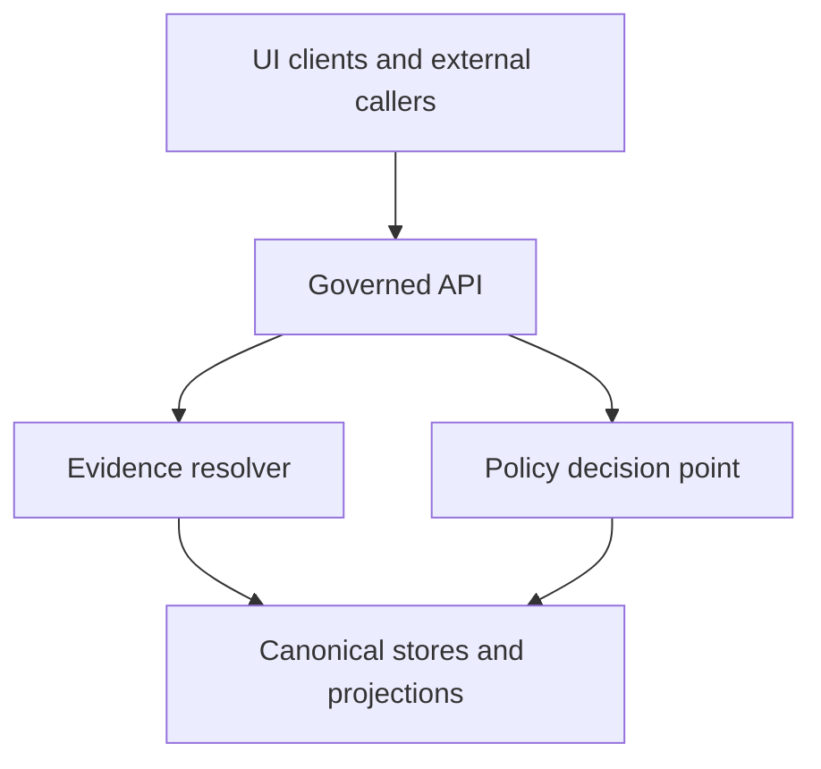

<!-- [KFM_META_BLOCK_V2]
doc_id: kfm://doc/6f7e4d2b-2c0a-4c12-8a51-6b74f2cc4e5d
title: Data Runbooks
type: standard
version: v1
status: draft
owners: TODO
created: 2026-03-02
updated: 2026-03-02
policy_label: public
related:
  - kfm://doc/TODO-kfm-governance-guide
  - kfm://doc/TODO-kfm-tooling-pipeline
tags: [kfm, runbooks, data, ops]
notes:
  - Runbooks are operational procedures for moving datasets through the KFM truth path, verifying policy compliance, and recovering from failures.
[/KFM_META_BLOCK_V2] -->

# Data Runbooks
Operational runbooks for KFM **data lifecycle** tasks (ingest → validate → promote → publish), written to be **auditable**, **fail-closed**, and **repeatable**.


---

## Quick navigation
- [What belongs here](#what-belongs-here)
- [How KFM data ops works](#how-kfm-data-ops-works)
- [Runbook catalog](#runbook-catalog)
- [Runbook format](#runbook-format)
- [Promotion Contract checklist](#promotion-contract-checklist)
- [Suggested directory layout](#suggested-directory-layout)
- [Templates](#templates)

---

## What belongs here
**This directory is for operator-facing procedures**, not architecture essays.

### ✅ Acceptable inputs
- Step-by-step runbooks for:
  - onboarding a new upstream dataset
  - re-running / backfilling a pipeline
  - diagnosing validation failures
  - promoting a dataset version (RAW/WORK → PROCESSED/CATALOG → PUBLISHED)
  - rolling back a bad release (fail closed)
  - recovering catalog generation / index rebuilds
  - handling policy denials and required redactions/generalizations
- Checklists (pre-flight, post-flight) with explicit pass/fail verification
- Templates for receipts/manifests/log bundles referenced by runbooks

### ❌ Exclusions
- One-off notes or brainstorming (put those in issues/PRs or a working doc)
- Dataset registry entries, dataset specs, catalogs, or derived artifacts (those live under `data/` or the canonical stores)
- Design docs / ADRs (those live under `docs/architecture/` or `docs/adr/`)
- Secrets, tokens, private URLs, or restricted coordinates (runbooks must be safe to share with the intended audience)

---

## How KFM data ops works
KFM treats the data lifecycle as an **enforceable truth path**, not a metaphor. Promotion is gated by validation, policy, and audit artifacts.

### Truth path (conceptual)


### Trust membrane (conceptual)
**Operators and clients do not “just read from storage.”** All runtime access is policy-evaluated, and evidence must resolve.



---

## Runbook catalog
> **NOTE:** Links are intentionally added as the runbooks are created. Keep this table up to date.

| ID | Runbook | When to use | Outputs (must be attachable to a PR / ticket) |
|---:|---|---|---|
| RB-DATA-001 | Onboard a new dataset (golden path) | New upstream source or first ingestion | acquisition manifest, spec hash, first run receipt, initial catalogs |
| RB-DATA-010 | Diagnose ingest failure | Connector/pipeline failed | failure notes, rerun receipt, quarantined artifacts list |
| RB-DATA-020 | Diagnose validation failure | Schema/STAC/DCAT/PROV validators failed | validator output, linkcheck output, remediation diff |
| RB-DATA-030 | Promote a dataset version | Promoting RAW/WORK → PROCESSED/CATALOG/PUBLISHED | promotion manifest, run receipt, approvals evidence |
| RB-DATA-040 | Apply redaction/generalization obligations | Policy returns obligations or sensitivity concerns arise | transform log, updated PROV, policy decision record |
| RB-DATA-050 | Recover catalog generation | Catalog build (DCAT/STAC/PROV) failed or drifted | rebuild logs, new catalogs, link integrity report |
| RB-DATA-060 | Rebuild indexes / projections | Reindex search/tiles/graph from canonical artifacts | rebuild receipt, performance notes |
| RB-DATA-070 | Roll back a bad dataset release | A published version is wrong or unsafe | rollback PR, deprecation note, incident summary |

---

## Runbook format
Every runbook in this directory should use a consistent, audit-friendly structure.

### Minimum sections
1. **Purpose**
2. **Triggers / Symptoms**
3. **Prerequisites & access**
4. **Inputs**
5. **Procedure**
6. **Verification (fail-closed checks)**
7. **Outputs to attach** (PR links, digests, receipts, validator reports)
8. **Rollback plan**
9. **Audit notes** (what to record, where)
10. **Escalation** (who to page / when to stop)

### File naming
Use a stable prefix so humans and tools can sort and link them.

Examples:
- `RB-DATA-030-promote-dataset-version.md`
- `RB-DATA-020-diagnose-validation-failure.md`

---

## Promotion Contract checklist
Promotion **must be blocked** unless minimum gates are satisfied (automate in CI where possible).

- **Gate A — Identity & versioning**
  - dataset_id + dataset_version_id are present and deterministic
  - spec_hash is computed and stable
- **Gate B — Licensing & rights metadata**
  - license/rights fields present
  - upstream terms snapshot captured
- **Gate C — Sensitivity classification & redaction plan**
  - policy_label assigned
  - obligations (generalize geometry / remove attributes / etc.) applied and verified
- **Gate D — Catalog triplet validation**
  - DCAT + STAC + PROV validate under profile
  - cross-links resolve (no broken links)
  - EvidenceRefs resolve without guessing
- **Gate E — QA & thresholds**
  - QA report present
  - thresholds met; failures quarantined
- **Gate F — Run receipt & audit record**
  - run receipt emitted with inputs/outputs/environment/validation/policy decision refs
  - audit ledger append recorded (where applicable)
- **Gate G — Release manifest**
  - promotion recorded as a manifest referencing artifacts and digests

> **TIP:** Make “Verification” in each runbook map 1:1 to these gates so promotion logic stays consistent across datasets.

---

## Suggested directory layout
> **PROPOSED** (adjust to match the repo as it evolves). Keep this README accurate.

```text
docs/runbooks/data/
  README.md
  templates/
    runbook-template.md
    receipt-template.json
    promotion-manifest-template.json
  onboarding/
    RB-DATA-001-onboard-new-dataset.md
  operations/
    RB-DATA-010-diagnose-ingest-failure.md
    RB-DATA-030-promote-dataset-version.md
  incidents/
    RB-DATA-050-recover-catalog-generation.md
    RB-DATA-070-rollback-bad-release.md
```

---

## Templates
If the repo contains canonical schemas/templates elsewhere, link them here.

### Runbook template (copy/paste)
```markdown
# RB-DATA-XXX — <Title>

## Purpose

## Triggers / Symptoms

## Prerequisites & access

## Inputs

## Procedure

## Verification (fail-closed)

## Outputs to attach

## Rollback plan

## Audit notes

## Escalation
```

### Minimal receipt and promotion manifest (illustrative)
Store these as JSON fixtures and validate them in CI.

```json
{
  "run_id": "kfm://run/<timestamp>.<nonce>",
  "operation": "<ingest|validate|promote>",
  "dataset_version_id": "<id>",
  "inputs": [{"uri": "<path>", "digest": "sha256:<...>"}],
  "outputs": [{"uri": "<path>", "digest": "sha256:<...>"}],
  "environment": {"container_digest": "sha256:<...>", "git_commit": "<sha>"},
  "validation": {"status": "pass|fail", "report_digest": "sha256:<...>"},
  "policy": {"decision_id": "kfm://policy_decision/<id>"},
  "created_at": "<iso8601>"
}
```

```json
{
  "kfm_promotion_manifest_version": "v1",
  "dataset_slug": "<slug>",
  "dataset_version_id": "<id>",
  "spec_hash": "sha256:<...>",
  "released_at": "<iso8601>",
  "artifacts": [{"path": "<file>", "digest": "sha256:<...>", "media_type": "<mime>"}],
  "catalogs": [{"path": "<file>", "digest": "sha256:<...>"}],
  "qa": {"status": "pass|fail", "report_digest": "sha256:<...>"},
  "policy": {"policy_label": "<label>", "decision_id": "kfm://policy_decision/<id>"},
  "approvals": [{"role": "<steward|reviewer>", "principal": "<id>", "approved_at": "<iso8601>"}]
}
```

---

## Back to top
[↑ Back to top](#data-runbooks)
