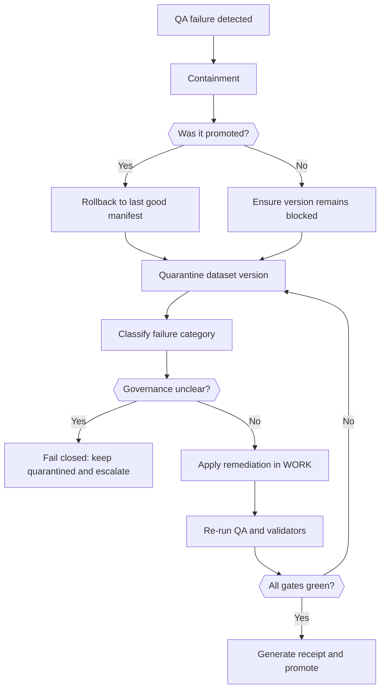

<!-- [KFM_META_BLOCK_V2]
doc_id: kfm://doc/98ccb5f3-6ac1-4632-9ba1-c5040ab53fcd
title: Data QA Failures Runbook
type: standard
version: v1
status: draft
owners: KFM Data Ops (TODO: set CODEOWNERS-backed team)
created: 2026-03-02
updated: 2026-03-02
policy_label: restricted
related:
  - docs/runbooks/data/
  - docs/runbooks/data/rb-data-onboarding.md  # TODO: confirm file exists
  - docs/runbooks/data/rb-data-promotion.md   # TODO: confirm file exists
tags: [kfm, runbook, data, qa, promotion-contract, quarantine]
notes:
  - This runbook is evidence-first; do not promote around QA.
  - Replace placeholder commands/paths with repo-verified commands before publishing.
[/KFM_META_BLOCK_V2] -->

# RB Data QA Failures
A step-by-step operational runbook for diagnosing, containing, and remediating data QA failures **without breaking the KFM truth path**.

   

---

## Quick navigation
- [When to use this runbook](#when-to-use-this-runbook)
- [Non-negotiable guardrails](#non-negotiable-guardrails)
- [Fast triage checklist](#fast-triage-checklist)
- [Failure classification matrix](#failure-classification-matrix)
- [Remediation playbooks](#remediation-playbooks)
- [Rerun and re-validate](#rerun-and-re-validate)
- [Promotion readiness checklist](#promotion-readiness-checklist)
- [Post-incident hardening](#post-incident-hardening)
- [Templates](#templates)
- [Appendix: Minimum verification steps](#appendix-minimum-verification-steps)

---

## When to use this runbook
Use this runbook when **any** of the following occurs:
- CI fails a dataset validation gate (schema, links, policy, catalogs, receipts, thresholds).
- A pipeline run produces a QA report with failing checks.
- A dataset version is blocked from promotion due to missing artifacts, uncertain licensing, or sensitivity concerns.
- A regression causes previously “green” datasets to fail.

**Not for:** production outages of the API/UI with *no* data promotion involved. Use the platform incident runbook instead.

[⬆️ Back to top](#rb-data-qa-failures)

---

## Non-negotiable guardrails

> **WARNING**
> QA failures must be handled **inside WORK/QUARANTINE**. Do **not** patch around failures by directly editing publishable artifacts or bypassing policy checks. If you can’t reproduce or you can’t cite, you can’t promote.

### Truth path constraints (operationally)
- **RAW is immutable / append-only.** If acquisition was wrong, you supersede it with a new acquisition; you do not “fix” RAW.
- **WORK/QUARANTINE is where fixes happen.** It may be rewritten; failures are isolated here.
- **PROCESSED must be publishable.** Stable IDs, checksums, and final QA results must exist.
- **CATALOG/TRIPLET must validate + cross-link.** DCAT/STAC/PROV must be consistent and resolvable.
- **PUBLISHED is governed runtime only.** Only promoted dataset versions should surface via API/UI.

### “Fail closed” rules
If any of these are unclear, treat as a hard stop:
- licensing/rights cannot be proven
- sensitivity classification is missing or obligations unclear
- QA thresholds are undefined
- receipts/hashes do not verify
- citations/links don’t resolve

[⬆️ Back to top](#rb-data-qa-failures)

---

## Fast triage checklist
Complete this checklist **in order**. The goal is containment first, then diagnosis.

### 0) Capture the incident context (5 minutes)
- [ ] Dataset ID / version ID (or best available identifier)
- [ ] Which stage failed: acquire, normalize, QA, package, catalog, publish
- [ ] Failure signal: CI job name, pipeline run ID, or validator output
- [ ] Time window and upstream source version/date
- [ ] Links to logs + artifacts (object store paths, build logs, etc.)

### 1) Contain the blast radius
- [ ] Confirm the dataset version is **not** promoted to PUBLISHED.
- [ ] If it was promoted, trigger the **rollback path** (see your promotion runbook) and record the rollback manifest.
- [ ] Mark the dataset version as **QUARANTINED** (or equivalent status) so it cannot be re-promoted accidentally.

### 2) Identify which *gate category* failed
Map the failure to a gate category (names may differ by implementation):
- Identity/versioning + spec hash
- Licensing/rights snapshot
- Sensitivity label + redaction obligations
- Catalog triplet validation (DCAT/STAC/PROV + cross-links)
- QA thresholds (domain checks)
- Receipts/hashes/audit record
- Policy tests + contract tests
- Release manifest integrity

### 3) Decide: Fix upstream, fix transform, or tighten governance
- If **upstream changed** (schema drift, missing fields, changed projections): fix the connector and bump dataset version.
- If **transform bug** (parser, reproject, tiler): fix pipeline code/config and rerun in WORK.
- If **governance gap** (license unclear, sensitivity unclear): block promotion and escalate for governance review.

[⬆️ Back to top](#rb-data-qa-failures)

---

## Failure classification matrix

| Failure signature | Typical root cause | Containment action | Primary remediation | Owner(s) |
|---|---|---|---|---|
| Schema validation fails (JSON/YAML/Geo schema) | Upstream column rename, type change, missing required fields | Quarantine dataset version | Update parser/normalizer; update schema + spec; add regression fixture | Data Eng + Data Steward |
| Link-check/cross-link fails (DCAT/STAC/PROV) | Broken URLs, missing item/asset IDs, stale EvidenceRefs | Block promotion | Regenerate catalog outputs; add linkcheck CI; ensure identifiers are deterministic | Catalog/Metadata |
| Spec hash drift | Canonical spec changed but registry hash not updated (or non-canonical serialization) | Block promotion | Fix canonicalization; recompute + commit spec hash; add golden test | Platform Eng |
| QA threshold failure | Completeness drop, geometry invalid, spatial extent unexpected, time range gaps | Quarantine | Investigate QA report; adjust transformation; update thresholds only with steward sign-off | Data Steward + Domain SME |
| License/rights missing/unknown | Upstream ToS changed, missing attribution, unclear redistribution | Quarantine | Acquire license snapshot; update rights metadata; if still unclear, keep quarantined | Governance + Legal liaison |
| Sensitivity obligations not met | Restricted locations, PII-like fields, unsafe precision | Quarantine | Apply redaction/generalization transform; document obligations; add policy tests | Governance + Data Steward |
| Artifact digests/receipt mismatch | Partial rebuild, wrong artifact referenced, tampering, nondeterministic output | Block promotion | Rebuild from canonical inputs; verify checksums; regenerate receipt | Platform Eng |
| Policy tests failing (default-deny) | Missing policy label, missing license snapshot, prohibited content present | Block promotion | Fix metadata/obligations; update policies only via governance process | Policy/OPA owner |

> **TIP**
> If you can’t confidently classify the failure within 15 minutes, assume it’s a governance/receipt issue and **fail closed** (quarantine + escalate).

[⬆️ Back to top](#rb-data-qa-failures)

---

## Remediation playbooks

### Playbook A — Schema drift (upstream columns/types changed)
**Symptoms**
- Validator error: missing required property, invalid type, unexpected enum/value.

**Steps**
1. **Confirm drift** by comparing the failing raw payload to the last known-good raw payload.
2. Update the normalizer/parser to tolerate drift:
   - prefer explicit mapping (rename columns)
   - coerce types safely (string→number only when lossless)
   - fill required fields only from evidence-backed defaults
3. Update dataset spec:
   - document new schema + any migrations
   - update QA rules if the change affects metrics
4. Add a **regression fixture** (minimal upstream sample) and make CI validate it.
5. Rerun in WORK and re-validate.

**Do not**
- “Hotfix” by editing PROCESSED artifacts manually without a receipt.

---

### Playbook B — Geometry failures (invalid geoms, unexpected CRS, topology issues)
**Symptoms**
- Invalid polygons/lines, self-intersections, empty geometries, CRS mismatch, out-of-bounds extents.

**Steps**
1. Determine if the issue originates in upstream geometry or in reprojection/tiling.
2. Apply geometry sanitation in WORK:
   - validate geometry
   - repair if safe and deterministic (document the method)
   - reproject with explicit CRS definitions
3. Recompute derived metadata (bbox, centroid, counts).
4. Rerun spatial QA checks and verify thresholds.

**Escalate**
- If repair changes meaning (e.g., snapping boundaries), require steward approval and provenance notes.

---

### Playbook C — Completeness / temporal gaps
**Symptoms**
- Missing days/months, sparse time series, gaps beyond allowed threshold.

**Steps**
1. Verify if missingness is due to upstream outage vs. ingestion bug.
2. If upstream outage: quarantine this version; optionally create a **partial** processed artifact only if your spec permits partial publication and the UI will label it clearly.
3. If ingestion bug: fix connector and rerun acquisition (new RAW acquisition; do not edit existing RAW).
4. Update QA thresholds only with documented rationale and steward sign-off.

---

### Playbook D — Catalog triplet validation failures (DCAT/STAC/PROV)
**Symptoms**
- Missing collection/item, invalid STAC item, PROV entity references missing, cross-links broken.

**Steps**
1. Regenerate catalog outputs from the current PROCESSED artifact set.
2. Validate:
   - DCAT dataset/distribution
   - STAC root/collection/item/assets
   - PROV activity/agent/entity graph
3. Run link-check across the triplet (no broken internal references).
4. Ensure EvidenceRefs resolve without guessing.
5. Only then re-attempt promotion.

---

### Playbook E — License/rights uncertainty
**Symptoms**
- Missing license fields, “unknown”, broken attribution chain, upstream terms changed.

**Steps**
1. Capture a license/terms snapshot artifact (PDF/HTML/text) with fetch date and checksums.
2. Populate rights metadata (license identifier, attribution requirements, redistribution constraints).
3. If terms are unclear or prohibit redistribution:
   - keep quarantined
   - consider publishing only derived/aggregated outputs if allowed and policy-approved
4. Add a policy test so this failure cannot recur silently.

---

### Playbook F — Sensitivity / redaction obligations not met
**Symptoms**
- Policy engine denies, sensitive fields present, geometry too precise, protected sites.

**Steps**
1. Identify the policy label and obligations that apply.
2. Apply redaction/generalization in WORK:
   - remove/transform prohibited fields
   - coarsen geometry (tile/area aggregation) if needed
   - suppress rare categories that enable re-identification
3. Produce new PROCESSED artifacts + checksums.
4. Update catalogs to reflect redaction (and avoid leaking removed fields in metadata).
5. Validate policy tests and rerun QA thresholds (redaction can affect stats).

[⬆️ Back to top](#rb-data-qa-failures)

---

## Rerun and re-validate

> **NOTE**
> Exact commands vary by repo implementation. Use the “Minimum verification steps” section to find the real CLI/scripts.

### Standard rerun sequence (conceptual)
1. Rerun pipeline stage(s) in WORK (normalize → QA → package).
2. Regenerate derived metadata and catalogs (DCAT/STAC/PROV).
3. Re-run CI validators locally (schema, linkcheck, policy tests).
4. Generate/verify run receipt:
   - inputs (artifact digests + license snapshot digest)
   - tool versions
   - spec hash
   - policy decisions
   - outputs (artifact digests)
5. Attach/commit updated artifacts + reports (as appropriate for your GitOps model).

### Quick “did we regress?” check
- [ ] Compare bbox/temporal range/counts to previous version
- [ ] Ensure all IDs are deterministic and stable for identical inputs
- [ ] Ensure no new sensitive fields appear in PROCESSED or catalogs

[⬆️ Back to top](#rb-data-qa-failures)

---

## Promotion readiness checklist
Do not request promotion (or merge the promotion PR) unless everything below is true.

- [ ] **Identity/versioning:** dataset_id + dataset_version_id are correct; spec hash matches canonical spec.
- [ ] **Licensing/rights:** license is present; rights snapshot artifact exists and is checksummed.
- [ ] **Sensitivity:** policy_label is set; obligations are implemented and tested.
- [ ] **QA thresholds:** QA report exists; thresholds are met; exceptions are documented and approved.
- [ ] **Catalog triplet:** DCAT/STAC/PROV validate and cross-link; links resolve.
- [ ] **Receipts/audit:** run receipt exists; artifact digests verify; audit record is append-only.
- [ ] **Policy/contract tests:** all required CI checks pass (default-deny posture).
- [ ] **Release manifest:** promotion is recorded in a manifest referencing exact artifact digests (if your implementation includes this gate).

[⬆️ Back to top](#rb-data-qa-failures)

---

## Post-incident hardening
Once the immediate failure is resolved, invest a small amount of time to prevent recurrence.

### Required follow-ups
- [ ] Add or strengthen a CI gate so this class of failure fails earlier.
- [ ] Add a fixture dataset that reproduces the issue.
- [ ] Update the dataset spec with:
  - QA rules + thresholds
  - license snapshot instructions
  - sensitivity label + obligations
- [ ] If drift was upstream-driven, add an “upstream change detector” (schema fingerprint, checksum diff, or cadence monitor).

### Optional but recommended
- [ ] Add a dashboard metric for “quarantined dataset versions”
- [ ] Add an alert for repeated failures of the same dataset/version

[⬆️ Back to top](#rb-data-qa-failures)

---

## Templates

### Template 1 — QA failure ticket
**Title:** `[DATA-QA] <dataset_id> <dataset_version_id> — <failure class>`

**Summary**
- What failed:
- Where it failed (stage/gate):
- Impact (blocked promotion? already published?):
- First observed:
- Links (CI run, logs, receipts, QA report):

**Containment**
- Quarantined? (Y/N)
- Rollback performed? (Y/N + manifest link)

**Diagnosis**
- Suspected root cause:
- Evidence (artifact digests, diff pointers):

**Fix**
- Changes made (code/spec/policy):
- Rerun details:

**Validation**
- Checks re-run and outcomes:
- Steward approval (if thresholds/policy changed):

---

### Template 2 — QA report summary (human-readable)
- Dataset/version:
- Inputs:
- Key checks run:
- Failed checks:
- Thresholds:
- Notes on repairs/redaction:
- Output artifacts:
- Catalog artifacts:
- Receipt/audit pointer:

---

### Template 3 — “Stop-the-line” escalation message
> Quarantined `<dataset_id>/<dataset_version_id>` due to `<failure class>`. Promotion blocked pending `<missing artifact/decision>`. Evidence: `<link to run receipt + QA report>`. Owner: `<team>`. Next action: `<specific step>`.

[⬆️ Back to top](#rb-data-qa-failures)

---

## Appendix: Minimum verification steps
This runbook intentionally avoids assuming exact repo commands. Before you operationalize it, do these minimal checks in the repo:

1. **Find the QA/promotion entrypoints**
   - Locate any CLI that mentions `promote`, `validate`, `qa`, `receipt`, `catalog`, `stac`, `dcat`, or `prov`.
2. **Identify validators**
   - Confirm what validates JSON/YAML schemas and STAC/DCAT/PROV (and where configs live).
3. **Locate run receipt schema + storage**
   - Confirm receipt format and where receipts are written (object store path, catalog link, DB table, etc.).
4. **Confirm quarantine mechanism**
   - Determine how a dataset version is marked “quarantined” (registry field, manifest, status endpoint, etc.).
5. **Confirm rollback**
   - Identify how to roll back a bad promotion (manifest revert, pointer update, or release rollback flow).

> **NOTE**
> Until these steps are done, treat all command snippets in this runbook as **pseudocode**.

---

## Appendix: Triage flow diagram (conceptual)

[⬆️ Back to top](#rb-data-qa-failures)
