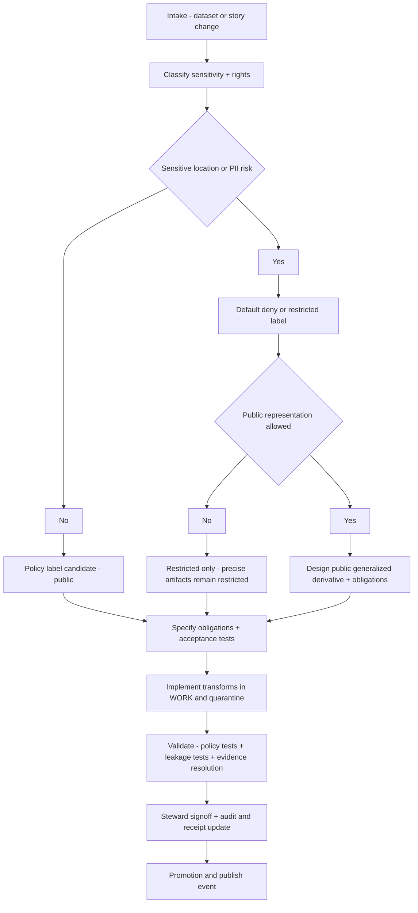

<!-- [KFM_META_BLOCK_V2]
doc_id: kfm://doc/1b9f42ad-3d5a-4d7a-9b8f-88f2e915c3c9
title: Data Redaction Review Runbook
type: standard
version: v1
status: draft
owners: [Data Stewardship, Policy Engineering]
created: 2026-03-02
updated: 2026-03-02
policy_label: restricted
related:
  - docs/runbooks/data/
  - docs/runbooks/data/rb-data-promotion.md
  - docs/runbooks/policy/
tags: [kfm, runbook, data, redaction, governance]
notes:
  - This runbook operationalizes Promotion Gate C (sensitivity classification + redaction plan) and the evidence-resolver obligation model.
  - Paths listed under related are best-effort placeholders and MUST be updated to match the repo.
[/KFM_META_BLOCK_V2] -->

# Data Redaction Review Runbook
Evidence-first workflow to classify sensitivity, define redaction/generalization obligations, and verify policy-safe publication.


**Applies to:** dataset onboarding & promotion, Story Node publishing, Focus Mode evidence resolution  
**Primary gates:** Promotion Contract **Gate C** (sensitivity classification + redaction plan) and “cite-or-abstain” evidence resolution.

---

## Quick navigation
- [When to use this runbook](#when-to-use-this-runbook)
- [Roles and responsibilities](#roles-and-responsibilities)
- [Definitions](#definitions)
- [Inputs and required artifacts](#inputs-and-required-artifacts)
- [Redaction review workflow](#redaction-review-workflow)
- [Checklist](#checklist)
- [Decision record template](#decision-record-template)
- [Validation and testing requirements](#validation-and-testing-requirements)
- [Failure modes and rollback](#failure-modes-and-rollback)
- [Minimum verification steps](#minimum-verification-steps)

---

## When to use this runbook

Run this review whenever **any** of the following occur:

1. **A dataset_version is proposed for promotion** to a more exposed zone (especially anything that will become discoverable via the governed API / UI).
2. **A public representation is proposed** for a sensitive dataset (e.g., public tiles, public exports, or “public_generalized” derivatives).
3. **A Story Node is proposed for publishing** that includes geospatial features or claims that might embed sensitive locations, precise coordinates, PII, or rights-restricted media.
4. **Focus Mode retrieval is enabled/expanded** for a dataset or collection.

> **Principle:** redaction/generalization is not a one-off manual edit; it is a first-class transform whose obligations must be enforced consistently in CI and at runtime.

---

## Roles and responsibilities

Baseline roles and a minimal RACI are defined in the KFM governance guide (some items are explicitly marked “PROPOSED” there). Use these roles as defaults unless superseded by repo policy.  

| Role | What they do in this runbook | Can they approve? |
|---|---|---|
| **Contributor** | Proposes dataset/story; drafts specs; suggests policy label + redaction plan | ❌ |
| **Reviewer / Steward** | Owns policy labels and redaction rules; approves promotions and story publishing | ✅ |
| **Operator** | Runs pipelines and deployments; cannot override policy gates | ❌ |
| **Governance council / community stewards** | Decides rules for culturally sensitive materials and public representations | ✅ (for those scopes) |

---

## Definitions

- **policy_label**: classification controlling access and downstream obligations (e.g., public vs restricted).
- **obligation**: a required transformation or constraint enforced by policy (examples: “generalize geometry”, “remove fields”, “minimum count threshold”).
- **Redaction vs generalization**
  - **Redaction**: remove or suppress sensitive content.
  - **Generalization**: reduce precision/granularity (e.g., geometry snap-to-grid, aggregation to admin units).
- **Sensitive location**: any place where precise coordinates increase risk (archaeological sites, endangered species, culturally restricted knowledge, etc.).
- **EvidenceRef / EvidenceBundle**: KFM “citations” are structured references that resolve through the evidence resolver into inspectable bundles. Evidence resolution is policy checked and obligation aware.

---

## Inputs and required artifacts

This runbook is **fail-closed**: if an artifact is missing, the review outcome is “deny / quarantine” until artifacts exist.

### Required inputs (minimum)
- **Dataset identity**: dataset_id + dataset_version_id (or equivalent stable identifier).
- **Rights snapshot**: license + rights metadata and (when applicable) a snapshot of upstream terms.
- **Sensitivity assessment**: proposed policy_label and rationale.
- **Redaction/generalization plan**: explicit obligations to be enforced (not just “we’ll be careful”).
- **Candidate artifacts**: the publishable outputs that would be served or cited (tiles, GeoParquet, COG, documents, etc.).
- **Catalog triplet**: DCAT + STAC + PROV links sufficient for EvidenceRefs to resolve.
- **Run receipt / audit record**: record of the run and policy decision(s) used for promotion.

### Required outputs
- A **decision record** (see template) capturing:
  - policy_label decision
  - obligations (what must be applied)
  - scope (who can access what)
  - “public representation” decision (if any)
- A **testable enforcement plan**:
  - policy tests (fixtures) for allow/deny + obligations
  - automated checks for “no leakage” conditions
- Updated catalogs / receipts reflecting the decision.

---

## Redaction review workflow



### Step 1 — Intake and triage (Contributor → Steward)
Capture:
- Dataset/story identifier and intended exposure surface(s): API query, tiles, export, Story, Focus Mode.
- Primary risk class:
  - **Sensitive location**
  - **PII / reidentification risk**
  - **Rights / licensing restrictions**
  - **Operational leakage risk** (logs/receipts/errors exposing restricted metadata)

> **Default:** if any sensitive-location risk exists, **default deny** unless policy explicitly allows a safe public representation.

### Step 2 — Choose policy label & exposure surfaces (Steward)
Decide:
- policy_label for precise artifacts
- whether any public representation exists, and if yes, whether it is a **separate dataset version** (recommended) or a filtered view (higher risk)

**Recommended posture**
- Store precise geometries only in restricted datasets.
- If any public representation is allowed, produce a separate `public_generalized` dataset version.
- Never leak restricted metadata in 403/404 responses.
- Do not embed precise coordinates in Story Nodes or Focus Mode outputs unless policy explicitly allows.
- Treat redaction/generalization as a first-class transform recorded in provenance.

### Step 3 — Define obligations (Steward + domain experts)
Obligations MUST be:
- **machine-enforceable** (CI and runtime)
- **auditable** (captured in receipts/provenance)
- **scoped** (what they apply to: exports, tiles, evidence bundles, story rendering)

Common obligation patterns (PROPOSED — adapt per dataset):
- **Geometry precision reduction**: snap to grid; centroid-only; aggregate to admin units; bbox rounding.
- **Attribute suppression**: drop coordinate columns; remove unique identifiers; suppress free-text fields that leak location.
- **Temporal coarsening**: coarsen timestamps to day/week/month where needed.
- **PII safety thresholds**: aggregate to safe geographies and apply minimum count thresholds.
- **Evidence surface restrictions**: EvidenceBundle cards must not include restricted artifacts for unauthorized roles.

### Step 4 — Implement redaction/generalization transforms (Operator)
Implementation guidance:
- Apply transforms in **WORK / Quarantine** so failures are isolated.
- Produce publishable artifacts in **PROCESSED** with stable IDs/digests.
- Record:
  - the transform method (e.g., grid size / admin unit)
  - any loss-of-precision fields (e.g., spatial uncertainty meters)
  - any suppression applied (e.g., minimum cell count)

### Step 5 — Validate (Policy Engineering + CI + Steward)
This step is mandatory: governance invariants must be encoded as tests that fail closed.

Validation MUST include:
- **Policy fixture tests** for allow/deny + obligations.
- **Evidence resolver checks**:
  - citations resolve to EvidenceBundles
  - EvidenceBundles include policy decision + obligations
  - resolver returns policy-safe errors (no restricted metadata leakage)
- **Leakage tests** (at least):
  - “no restricted bbox leakage” tests for public tiles
  - “no coordinate fields” tests for public exports
- **Story publishing gate** checks:
  - syntax check for EvidenceRefs
  - resolver check in test env
  - policy check for story’s intended label
  - rights check for included media

### Step 6 — Sign-off and recordkeeping (Steward)
The decision is not “approved” until:
- the decision record is stored as an auditable artifact (linked from receipts/catalogs)
- the pipeline run receipt captures the policy decision inputs/outputs
- the public surfaces (if any) are tested and verified

---

## Checklist

### A. Triage checklist (Steward)
- [ ] Sensitivity class decided (policy_label)
- [ ] Sensitive-location risk assessed (and default deny applied if applicable)
- [ ] PII/reidentification risk assessed
- [ ] Rights/licensing checked; “metadata-only” option considered if reuse rights unclear
- [ ] Decide if a separate `public_generalized` dataset version is required

### B. Obligations checklist (Steward + Policy Engineering)
- [ ] Obligations enumerated as machine-checkable rules
- [ ] Obligations include: geometry/attribute/time + evidence/UX requirements when relevant
- [ ] Obligations documented in PROV/run receipt (transform recorded)

### C. Enforcement checklist (CI / Operator)
- [ ] Policy tests added/updated (fixtures)
- [ ] Evidence resolver tests cover allow/deny and obligations
- [ ] Tile/export leakage tests exist and pass
- [ ] Story citation verification gate passes

### D. Publication checklist (Steward)
- [ ] Decision record linked from catalogs/receipt
- [ ] Any public derivative is clearly labeled and discoverable without exposing restricted artifacts
- [ ] Error responses are policy-safe (no restricted metadata leakage)

---

## Decision record template

> This is a **suggested** template for a PR-attached artifact (YAML/JSON). Adjust to match the repo’s actual schema once confirmed.

```yaml
kind: kfm.redaction_review
version: v1
dataset_version_id: "<dataset_version_id>"
review_id: "kfm://review/<uuid>"
requested_by: "<contributor>"
reviewed_by: "<steward>"
reviewed_at: "YYYY-MM-DD"

decision:
  policy_label_precise: "restricted|confidential|internal|public"
  public_representation:
    allowed: true|false
    strategy: "public_generalized_version|filtered_view|metadata_only"
    public_dataset_version_id: "<optional>"

obligations:
  - id: "geometry.generalize"
    params:
      method: "snap_to_grid|admin_unit|centroid_only"
      grid_size_m: 1000
  - id: "attributes.drop"
    params:
      fields: ["lat", "lon", "address", "owner_name"]
  - id: "pii.minimum_count_threshold"
    params:
      min_count: 11

evidence:
  rationale_refs:
    - "<EvidenceRef: doc://...>"
  validation_refs:
    - "<EvidenceRef: prov://...>"
    - "<EvidenceRef: dcat://...>"

notes:
  - "If obligations fail, dataset_version remains quarantined."
```

---

## Validation and testing requirements

### Non-negotiable requirements
- Policy semantics used in CI MUST match runtime policy semantics (or at least share fixtures/outcomes).
- The evidence resolver is a central enforcement point: it MUST apply policy and redaction obligations, and MUST fail closed when unauthorized or unresolvable.
- Story publishing MUST block if citations cannot be resolved and policy-allowed.
- Audit logs / receipts MUST be treated as sensitive when they can contain restricted details; logs should be append-only and redacted for PII/restricted info.

### Suggested test suites (minimum)
- **OPA fixture suite**: allow/deny + obligations for representative users/roles.
- **Golden leakage tests**:
  - tiles: public tiles do not encode restricted bboxes or precise points
  - exports: public exports do not include coordinate fields or unique identifiers
- **Evidence resolver integration tests**:
  - returns bundle with policy decision + obligations
  - excludes restricted artifacts when role is unauthorized
- **Story publish contract tests**:
  - EvidenceRefs parseable and resolvable in test env
  - rights metadata exists for media

---

## Failure modes and rollback

### If leakage is detected after publication
1. **Fail closed immediately** (deny access to affected surfaces via policy update).
2. **Invalidate caches** that may contain restricted tiles/exports (mechanism TBD).
3. **Promote a patched dataset_version** with corrected obligations and updated receipts/provenance.
4. **Create an incident/audit entry** linking what was leaked, why it occurred, and what tests were missing.

> Do not “hotfix” redaction by editing published artifacts without recording a new dataset version and provenance.

---

## Minimum verification steps

This runbook intentionally avoids claiming specific repo modules exist without verification.

Before using this runbook operationally, confirm (and link here) the actual repo locations for:
- policy bundle + fixture tests
- evidence resolver endpoint / service implementation
- promotion tooling and receipt schemas
- CI workflows that enforce policy gates

A minimal verification pass should also confirm:
- the UI cannot bypass the PEP/governed API
- evidence resolution and story publishing gates are merge-blocking in CI
