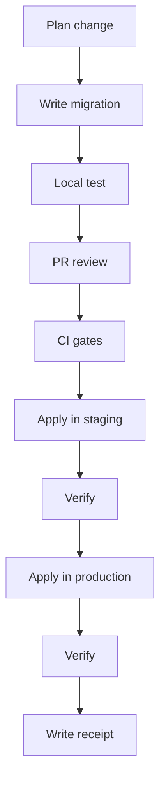

<!-- [KFM_META_BLOCK_V2]
doc_id: kfm://doc/1b0b0ea1-3e57-4e6b-9e74-208dbd4b4e20
title: DB Migrations Runbook
type: standard
version: v1
status: draft
owners: TODO(platform-data)
created: 2026-03-02
updated: 2026-03-02
policy_label: restricted
related:
  - docs/governance/README.md
  - docs/runbooks/README.md
  - migrations/
tags:
  - kfm
  - runbook
  - database
  - postgres
  - postgis
notes:
  - Safe-by-default procedure for schema + projection DB migrations.
  - Separates “migrate” (schema evolution) vs “rebuild” (rebuildable projections).
[/KFM_META_BLOCK_V2] -->

# DB Migrations Runbook
Safe, reversible database migrations for KFM services and projections.


-lightgrey)
-lightgrey)

---

## Quick navigation
- [Scope](#scope)
- [Principles](#principles)
- [Glossary](#glossary)
- [Runbook workflow](#runbook-workflow)
- [Rollback strategy](#rollback-strategy)
- [Rebuildable projections and rebuild pipeline](#rebuildable-projections-and-rebuild-pipeline)
- [Disaster recovery](#disaster-recovery)
- [Troubleshooting](#troubleshooting)
- [Appendices](#appendices)

---

## Scope
This runbook covers:
- **Schema migrations** for Postgres/PostGIS databases used by KFM services (API, UI, workers) and/or projections.
- **Operational DB changes**: extensions, roles/permissions, indexes, constraints, partitioning.
- **Projection schema changes** (e.g., PostGIS projection schemas, search index tables) **when a rebuild is not the safer option**.

This runbook does **not** cover:
- Dataset corrections that should be shipped as **new dataset versions** (see: “Do not fix data in place” rule below).
- Incident response for security events (separate runbook).
- Large-scale backfills that require dedicated batch infrastructure (this runbook links patterns, but the execution plan belongs in an ADR / change ticket).

> **WARNING**
> This runbook is intentionally “fail-closed.” If a required fact is unknown (tooling, commands, owners, environments), stop and follow the **Minimum verification steps** in each section before proceeding.

---

## Principles
### Safety + reversibility first
- Prefer **expand/contract** (backwards compatible) changes over breaking changes.
- Prefer **forward fixes** over “rollback by hand.”
- Minimize lock time and blast radius (timeouts, concurrent operations, batch backfills).

### Evidence-first operations
Every migration run must produce:
- an auditable **migration receipt** (what ran, by whom, with which inputs/tooling, and the outcome),
- links to the PR/commit, and
- a verification record (what checks passed).

### Migrate vs rebuild (KFM-specific)
KFM explicitly treats some stores as **rebuildable projections**. If the target schema is rebuildable, the safest change is often:
1) apply minimal schema evolution, then  
2) **rebuild the projection from catalogs + processed artifacts**, and  
3) record a rebuild receipt.

---

## Glossary
- **Migration**: a controlled change to DB schema/state (tables, columns, constraints, extensions, etc.).
- **Rebuild**: a deterministic re-materialization of a projection DB from canonical catalogs + processed artifacts.
- **Canonical data**: the authoritative, versioned artifacts + catalogs (not “fixed in place”).
- **Projection**: a derived DB optimized for querying/serving (PostGIS, search index, tiles cache tables, etc.).
- **Receipt**: an append-only audit record of a run (migration or rebuild).

---

## Runbook workflow



### 0) Classify the change
Choose one:

**A. Schema-only** (safe): adding tables/columns/indexes, adding constraints as NOT VALID, etc.  
**B. Schema + data backfill** (moderate risk): requires batching and dual-write/dual-read.  
**C. Breaking change** (high risk): requires explicit compatibility plan + API versioning plan.  
**D. Projection rebuild** (preferred when possible): rebuild PostGIS/search/graph projections from catalogs.

> **Rule of thumb**
> If you’re changing something that can be deterministically reconstructed from catalogs + processed artifacts, treat it as a **projection** and prefer **rebuild**.

### 1) Create a migration plan (ticket/ADR required for B/C/D)
Minimum contents:
- What changes, why, and what success looks like.
- Whether it’s **expand/contract**, **breaking**, or **rebuild**.
- Expected lock/impact profile (tables touched, estimated size, index strategy).
- Rollback/mitigation plan.
- Verification checklist (queries, endpoints, monitors).

### 2) Author the migration
**Location (expected):**
- `migrations/` directory for PostGIS/PostgreSQL SQL migrations.
- `scripts/` or `tools/` may contain helper CLIs/validators.

> **NOTE**
> Naming/versioning conventions are repo-specific. If unknown, adopt a deterministic convention (timestamp + short slug) and document it in this runbook once verified.

**Recommended structure for SQL migrations:**
- Wrap in a transaction **only if safe** for your statements.
- Set safety timeouts:
  - `lock_timeout` (avoid waiting forever on locks)
  - `statement_timeout` (avoid runaway queries)

```sql
-- Example safety settings (tune per environment)
SET lock_timeout = '5s';
SET statement_timeout = '5min';
```

### 3) Local test (must pass before PR)
Minimum:
- Apply migration on a fresh local DB.
- Apply migration on a DB seeded with representative data (or a sampled dump).
- Run application integration tests that touch impacted queries.

If the migration is **B/C**:
- Validate the app supports **dual-read or dual-write** if needed.
- Validate the migration is safe under concurrency (multiple app instances).

### 4) Pull request + review gates
Required reviewers (fill in real owners once known):
- [ ] App/service owner
- [ ] Data/platform owner
- [ ] Security/policy owner (if schema affects governed surfaces)

PR must include:
- Migration file(s)
- Updated docs (this runbook or a linked ADR) describing rollout + verification
- “Down”/rollback strategy (or explicit statement: forward-fix only)

### 5) CI gates (fail closed)
Minimum recommended CI checks:
- [ ] Lint/format for SQL (if you have a linter)
- [ ] Migration applies cleanly to an ephemeral DB
- [ ] App test suite passes against migrated schema
- [ ] If profile/schema contracts changed: contract tests + fixtures updated
- [ ] Receipt schema validation (if receipts are validated)

### 6) Apply in staging
Pre-flight checklist:
- [ ] Confirm you’re targeting **staging** (not production).
- [ ] Confirm current migration version matches expected baseline.
- [ ] Confirm you have DB backup/restore path (snapshot or PITR).
- [ ] Confirm app deploy order (expand/contract) is documented.

Execution:
- Apply migration using the repo’s standard migration tool/command.

> **TODO: fill in real command once verified**
> Examples you might replace with real commands:
> - `./scripts/db/migrate up`
> - `make db-migrate`
> - `apps/cli kfm db migrate --env=staging`

Verification (staging):
- [ ] Schema version updated as expected
- [ ] Key queries return expected results
- [ ] API endpoints / UI flows function
- [ ] No elevated error rate
- [ ] Locks/long transactions are normal

### 7) Apply in production
**Production pre-flight must be stricter:**
- [ ] Maintenance window / comms posted (if required)
- [ ] On-call assigned for app + DB
- [ ] Rollback/mitigation plan ready
- [ ] Backups verified + restore drill status known
- [ ] Monitoring dashboards open

Execution principles:
- Prefer **online operations**:
  - `CREATE INDEX CONCURRENTLY` (where applicable)
  - add constraints as `NOT VALID`, validate later
- Avoid long exclusive locks on hot tables.
- Batch backfills; don’t run “one giant UPDATE” on production.

Post-apply verification:
- [ ] Same checks as staging
- [ ] Compare counts/extents/critical aggregates if relevant
- [ ] Confirm governance surfaces still enforce policy

### 8) Write the migration receipt (required)
Record a receipt for:
- Every **migration run** (staging and production),
- Every **rebuild run** (if projections rebuilt).

**Minimal receipt fields (proposed):**
```json
{
  "run_kind": "db_migration",
  "run_id": "uuid",
  "started_at": "2026-03-02T00:00:00Z",
  "ended_at": "2026-03-02T00:10:00Z",
  "actor": {
    "type": "human",
    "id": "github:USERNAME"
  },
  "repo": {
    "commit_sha": "GIT_SHA",
    "pr": "PR_URL_OR_ID"
  },
  "target": {
    "environment": "staging|prod",
    "db": "DB_NAME",
    "schema": "SCHEMA_NAME"
  },
  "migrations": [
    { "id": "20260302_001_add_feature_flags.sql", "sha256": "..." }
  ],
  "result": "success|failed",
  "notes": "what was verified and by whom",
  "links": {
    "logs": "LOG_URL",
    "dashboard": "DASHBOARD_URL"
  }
}
```

> **NOTE**
> If your repo already has a receipt schema (PROV/JSON-LD), map these fields to that schema rather than inventing a parallel format.

---

## Rollback strategy

### Preferred: forward fix
In production systems, rollbacks are often riskier than a forward fix. Prefer:
- revert application deploys (feature flags),
- apply a new migration to restore compatibility,
- rebuild projections rather than trying to reverse partial state.

### When rollback is acceptable
Rollback may be acceptable when:
- migration is small and reversible,
- it only adds new tables/columns and can be safely dropped,
- it does not include data loss, and
- it has been tested.

### Expand/contract pattern (recommended)
1) **Expand**: add new columns/tables (nullable), keep old schema working  
2) Deploy app that **writes both** (or writes new while reading old)  
3) Backfill in batches  
4) Switch reads to new (dual-read window if needed)  
5) **Contract**: add constraints, drop old columns after safe window

---

## Rebuildable projections and rebuild pipeline

### Why rebuild is often safer
KFM’s disaster recovery and projection approach favors rebuilding from authoritative catalogs and processed artifacts rather than restoring bespoke DB states.

### Rebuild pipeline (high-level)
A rebuild pipeline should:
1) read catalogs for a `dataset_version_id`  
2) locate processed artifacts by digest/path  
3) load into projections (PostGIS, search, graph, tile caches)  
4) validate counts and extents against catalog metadata  
5) record a rebuild receipt in the audit ledger

### “Do not fix data in place”
If you discovered incorrect data:
- **Do not** “fix data in place” in a way that changes canonical truth without producing a new dataset version and receipts.
- Prefer producing a new dataset version and rebuilding projections.

---

## Disaster recovery
If the DB/projection is corrupted or lost:
1) Restore object storage + catalogs
2) Replay rebuild pipeline to reconstruct projections
3) Record rebuild receipt(s)

This is intentionally simpler than attempting to restore multiple bespoke DB states.

---

## Troubleshooting

### Migration fails mid-run
- Stop automated deploys.
- Determine whether the migration tool ran in a single transaction.
- If partially applied:
  - prefer forward fix migration to return to a consistent state,
  - avoid manual edits unless explicitly documented and receipted.

### Lock contention / timeouts
- Identify blocking sessions (`pg_stat_activity`, `pg_locks`).
- Reduce lock scope (split migrations, use concurrent operations).
- Re-schedule for lower-traffic window if needed.

### Drift between environments
- Compare schema versions and migration history.
- Never “patch prod by hand” without:
  - recording exactly what was done,
  - ensuring it is reproducible, and
  - filing follow-up to bring migrations back into sync.

---

## Appendices

### Appendix A — Pre-flight checklist (copy/paste)
- [ ] Change classified (A/B/C/D)
- [ ] Plan/ADR exists (required for B/C/D)
- [ ] Local test passed
- [ ] Migration applies cleanly on fresh DB
- [ ] Staging apply + verification complete
- [ ] Production plan + comms complete (if required)
- [ ] Backup/restore path confirmed
- [ ] Monitoring ready
- [ ] Receipt recorded (staging + prod)

### Appendix B — Minimum verification steps (convert Unknown → Confirmed)
Run these repo checks before using this runbook operationally:
1) Confirm `migrations/` exists and determine naming/versioning conventions.
2) Identify the migration runner tool (script/CLI) and document exact commands.
3) Identify environments (staging/prod) and how DB credentials are managed.
4) Confirm receipt format + storage location (audit ledger / receipt store).
5) Confirm CI gates that run on migration PRs (or add them).

### Appendix C — References
- KFM governance guide: trust membrane, rebuild strategy, migration/backwards compatibility, EvidenceRefs.
- KFM pipeline tooling guide: lifecycle/promotion contract and run receipts concept.
- Repo docs: link to any existing runbook templates and DB ownership docs once verified.

---

<p align="right"><a href="#db-migrations-runbook">Back to top ↑</a></p>
