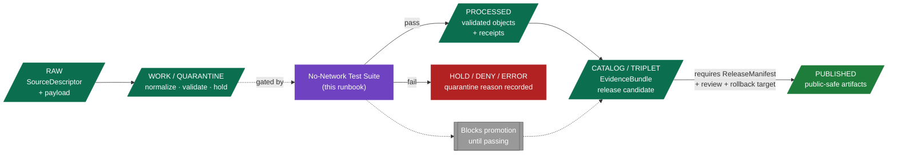

<!-- [KFM_META_BLOCK_V2]
doc_id: kfm://doc/runbook/fauna/no-network-test
title: Fauna — No-Network Test Runbook
type: standard
version: v0.1
status: draft
owners: <fauna-steward> + <docs-steward>  [PLACEHOLDER]
created: 2026-05-13
updated: 2026-05-13
policy_label: public
related:
  - docs/doctrine/directory-rules.md
  - docs/domains/fauna/README.md            # PROPOSED
  - docs/runbooks/fauna/PUBLICATION_RUNBOOK.md  # PROPOSED
  - docs/runbooks/fauna/ROLLBACK_RUNBOOK.md     # PROPOSED
  - docs/registers/VERIFICATION_BACKLOG.md  # PROPOSED
  - schemas/contracts/v1/domains/fauna/      # PROPOSED schema home
  - fixtures/domains/fauna/no_network/       # PROPOSED fixture home
  - tests/domains/fauna/no_network/          # PROPOSED test home
tags: [kfm, runbook, fauna, no-network, fixtures, governance, trust-spine]
notes:
  - This runbook describes a PROPOSED operational procedure derived from KFM doctrine.
  - Repository implementation of fauna fixtures, validators, and runners is NEEDS VERIFICATION.
  - All paths inside this runbook are PROPOSED until checked against a mounted repo.
[/KFM_META_BLOCK_V2] -->

# 🦌 Fauna — No-Network Test Runbook

> Deterministic, offline validation of the fauna **trust spine** — schema → contract → source role → evidence → policy → sensitivity → envelope — using controlled fixtures, no live sources, and no public exact-location exposure.

<!-- BADGES — placeholders. Replace targets after CI workflow names and badge endpoints are confirmed in the mounted repo. -->


| Field | Value |
|---|---|
| **Status** | `PROPOSED` — runbook drafted from doctrine; implementation `NEEDS VERIFICATION`. |
| **Owners** | Fauna steward · Docs steward · QA (`PLACEHOLDER`) |
| **Lifecycle gate** | Primary: `WORK / QUARANTINE → PROCESSED`. Secondary: `PROCESSED → CATALOG / TRIPLET` (pre-release). |
| **Promotion authority** | None. This runbook MUST NOT publish or alter `PUBLISHED` artifacts. |
| **Network posture** | **Offline-only.** No live source connectors, no model providers, no remote registries. |
| **Last updated** | 2026-05-13 |

---

## Contents

- [1. Scope](#1-scope)
- [2. What this proves](#2-what-this-proves)
- [3. Repo fit and placement basis](#3-repo-fit-and-placement-basis)
- [4. Inputs accepted](#4-inputs-accepted)
- [5. Exclusions](#5-exclusions)
- [6. Proposed directory tree](#6-proposed-directory-tree)
- [7. Pipeline placement diagram](#7-pipeline-placement-diagram)
- [8. Prerequisites](#8-prerequisites)
- [9. Fixture matrix](#9-fixture-matrix)
- [10. Run procedure](#10-run-procedure)
- [11. Expected envelope outcomes](#11-expected-envelope-outcomes)
- [12. Required negative cases](#12-required-negative-cases)
- [13. Acceptance gates](#13-acceptance-gates)
- [14. Failure triage](#14-failure-triage)
- [15. Rollback / hold posture on failure](#15-rollback--hold-posture-on-failure)
- [16. Sensitivity guarantees](#16-sensitivity-guarantees)
- [17. Verification backlog](#17-verification-backlog)
- [18. FAQ](#18-faq)
- [19. Related docs](#19-related-docs)
- [Appendix A — Worked envelope examples](#appendix-a--worked-envelope-examples)

---

## 1. Scope

**`CONFIRMED` doctrine / `PROPOSED` implementation.** This runbook covers the **first feature** scheduled for the Fauna domain per the KFM Encyclopedia feature backlog: a *fauna source registry plus no-network fixture* validated end-to-end through KFM's trust spine **without any network access**.

The no-network test exists to prove that controlled fauna inputs move through:

1. Source admission (`SourceDescriptor`),
2. Lifecycle state transitions,
3. Schema and contract validation,
4. Evidence resolution (`EvidenceRef → EvidenceBundle`),
5. Policy decision (sensitivity, rights, source-role),
6. Catalog / proof closure (where applicable),
7. Finite envelope output (`FaunaDecisionEnvelope`: `ANSWER` / `ABSTAIN` / `DENY` / `ERROR`),

…**without** crossing forbidden boundaries (no raw public exposure, no model-to-public path, no exact sensitive geometry leaks, no uncited claims).

> [!IMPORTANT]
> A passing no-network suite is a **necessary but not sufficient** condition for promoting fauna candidates toward `PUBLISHED`. It does not authorize release. Release still requires a `ReleaseManifest`, review state, correction path, and rollback target.

---

## 2. What this proves

`CONFIRMED` doctrine — derived from the KFM testing strategy: "start with deterministic no-network fixture tests, then schema and contract tests, validator unit tests, policy negative tests, evidence-resolution tests, lifecycle-state tests, receipt/proof tests, release-manifest tests, governed API envelope tests, UI trust-state tests, and only later live-source or runtime tests."

The fauna no-network suite is the **bottom layer** of that pyramid for this domain. It must prove the following:

| Proof class | What a passing run demonstrates |
|---|---|
| **Schema** | Every fixture conforms to its `schemas/contracts/v1/domains/fauna/…` schema (`PROPOSED` home). |
| **Contract / vocabulary** | Object meaning matches the fauna ubiquitous language (Taxon, OccurrenceEvidence, RangePolygon, SeasonalRange, MigrationRoute, SensitiveSite, MortalityObservation, DiseaseObservation, InvasiveSpeciesRecord, ConservationStatus, RedactionReceipt). |
| **Source role** | A source is not used outside its declared authority (legal status ≠ aggregator ≠ observation ≠ model). |
| **Evidence resolution** | Each `EvidenceRef` resolves to an `EvidenceBundle`, or the answer `ABSTAIN`s. No fluent text stands in for evidence. |
| **Sensitivity / policy** | Exact occurrence, nest, den, roost, hibernacula, spawning, and steward-controlled records fail closed; transforms produce a valid `RedactionReceipt`. |
| **Taxonomy resolution** | Crosswalk + ambiguity tests behave as specified (e.g., synonym → accepted taxon; ambiguous match → `ABSTAIN`). |
| **Restricted ↔ public split** | A restricted occurrence cannot leak into a public layer or popup. |
| **Tile field allowlist** | Public tile candidates carry only allowlisted fields. |
| **Finite envelope** | Every outcome is one of `ANSWER` / `ABSTAIN` / `DENY` / `ERROR` with a reason code. |
| **Non-regression** | Prior fixtures keep passing across fauna changes. |
| **No-network discipline** | The run completes with no outbound network calls. |

> [!NOTE]
> The list above is `CONFIRMED` as the doctrinal validator set for fauna. The *implementation* of each validator (runner name, language, CI job) is `NEEDS VERIFICATION` until the repository is inspected.

---

## 3. Repo fit and placement basis

`CONFIRMED` placement basis. Per **Directory Rules §12 — Domain Placement Law**, a domain MUST appear as a segment inside a responsibility root and MUST NOT become a root folder. This runbook therefore lives at:

```
docs/runbooks/fauna/NO_NETWORK_TEST_RUNBOOK.md
```

- `docs/` is the canonical responsibility root for human-facing doctrine, ADRs, runbooks, and registers.
- `runbooks/` is the operational subdirectory inside `docs/`.
- `fauna/` is a **domain segment** (not a root).

`NEEDS VERIFICATION`: prior attached planning packets show flat runbook names (e.g., `docs/runbooks/ui_LOCAL_DEV.md`). For a *domain* runbook, Directory Rules §12 favors a segmented form (`docs/runbooks/fauna/…`). If the mounted repo establishes a different convention, raise the conflict via `docs/registers/DRIFT_REGISTER.md` rather than silently conforming.

---

## 4. Inputs accepted

What belongs **inside** this runbook's scope:

- **Synthetic fauna fixtures** — public-safe, generalized, or fully synthetic geometry.
- **Steward-released SourceDescriptors** — declaring source role, rights class, sensitivity, and citation.
- **Crosswalk fixtures** — taxonomic synonyms, ambiguous matches, accepted taxa.
- **Negative fixtures** — designed to fail in a specific, reason-coded way.
- **Redaction transform receipts** — paired with sensitive-record fixtures.
- **Envelope expectation files** — declaring the expected `ANSWER` / `ABSTAIN` / `DENY` / `ERROR` outcome and reason code.

---

## 5. Exclusions

What does **not** belong here, and where it goes instead:

| Out of scope | Belongs in |
|---|---|
| Live source connector calls | `connectors/domains/fauna/…` (`PROPOSED`), not exercised by no-network tests. |
| Real exact occurrence coordinates for sensitive taxa | Never in fixtures. Steward-only stores; covered by the sensitivity matrix. |
| Release decisions | `release/candidates/fauna/…` and the publication runbook (`PROPOSED`). |
| Rollback execution | `docs/runbooks/fauna/ROLLBACK_RUNBOOK.md` (`PROPOSED`). |
| Live AI provider validation | `docs/runbooks/governed_ai_VALIDATION.md` (`PROPOSED`). |
| UI / a11y / e2e smoke | `docs/runbooks/ui_VALIDATION.md` (`PROPOSED`). |

> [!CAUTION]
> Real exact sensitive geometry — nests, dens, roosts, hibernacula, spawning sites, steward-controlled coordinates — MUST NOT appear in any fixture, even an "invalid" one. Use synthetic coordinates or public-safe generalized polygons.

---

## 6. Proposed directory tree

`PROPOSED` — all paths below are inferred from Directory Rules and require repository verification. Mark each path `NEEDS VERIFICATION` until inspected.

```text
docs/
└── runbooks/
    └── fauna/
        ├── NO_NETWORK_TEST_RUNBOOK.md          ← this file
        ├── PUBLICATION_RUNBOOK.md              # PROPOSED
        └── ROLLBACK_RUNBOOK.md                 # PROPOSED

schemas/contracts/v1/domains/fauna/             # PROPOSED schema home (per ADR-0001 default)
├── taxon.schema.json
├── occurrence_evidence.schema.json
├── occurrence_restricted.schema.json
├── occurrence_public.schema.json
├── range_polygon.schema.json
├── seasonal_range.schema.json
├── migration_route.schema.json
├── sensitive_site.schema.json
├── mortality_observation.schema.json
├── disease_observation.schema.json
├── invasive_species_record.schema.json
├── conservation_status.schema.json
└── redaction_receipt.schema.json

fixtures/domains/fauna/no_network/              # PROPOSED fixture home
├── README.md
├── valid/
├── invalid/
├── denied/
├── abstain/
├── rollback_correction/
└── envelopes/

tests/domains/fauna/no_network/                 # PROPOSED test home
├── README.md
├── test_schema_conformance.*
├── test_contract_vocabulary.*
├── test_source_role_authority.*
├── test_taxonomy_resolution.*
├── test_occurrence_split_public_restricted.*
├── test_sensitivity_redaction_receipt.*
├── test_tile_field_allowlist.*
├── test_envelope_finite_outcomes.*
├── test_non_regression_prior_fixtures.*
└── test_no_network_discipline.*

policy/domains/fauna/                           # PROPOSED policy home
└── (deny rules, sensitivity matrix, source-role enums)
```

> [!NOTE]
> The file extension on test files (`.py`, `.ts`, `.go`, etc.) and the runner (`pytest`, `vitest`, `node --test`, etc.) are `UNKNOWN` until the repository is inspected. The runbook uses `.*` placeholders.

---

## 7. Pipeline placement diagram



> [!NOTE]
> The no-network suite primarily gates `WORK / QUARANTINE → PROCESSED`. It is **also** executed (as non-regression) before promotion from `CATALOG / TRIPLET → PUBLISHED`. It does not itself perform promotion; promotion remains a governed state transition, not a file move.

---

## 8. Prerequisites

`PROPOSED` — verify each prerequisite against the mounted repo before relying on it.

**Environment**

- A working KFM repo checkout.
- Whichever language runtime the validators are implemented in (`UNKNOWN` — `NEEDS VERIFICATION`).
- **Network egress disabled** for the run. Disable via container, runner sandbox, or env flag. The suite must include a self-check (`test_no_network_discipline.*`) that asserts no socket calls reached the network.

**Repo contents**

- Fauna schemas present under `schemas/contracts/v1/domains/fauna/` (or the schema home the mounted repo confirms).
- Fauna policy rules present under `policy/domains/fauna/`.
- Fixtures present under `fixtures/domains/fauna/no_network/`.
- Source-role enum + sensitivity matrix loadable from the policy root.

**Steward authorization**

- A current `SourceDescriptor` exists for each fixture's claimed source. Synthetic fixtures use a synthetic `SourceDescriptor` with `source_role = "synthetic"` (`PROPOSED` enum value — confirm against ADR-S-04).
- No fixture contains real exact sensitive geometry.

**Reviewer sign-off (PR-time only)**

- A reviewer ticks the Directory Rules **Reviewer's one-line check** for any path added in the same PR: *"Does the path encode the right responsibility, the right lifecycle phase (if data), and the right domain segment — and does this PR cite a rule for it?"*

---

## 9. Fixture matrix

`PROPOSED` fixture rule (from the Unified Build Manual): every major object family in fauna SHOULD have at least one **valid**, one **invalid**, one **denied**, one **abstention**, and one **rollback / correction** fixture. Sensitive lanes use public-safe transformed fixtures rather than real exact locations.

| Object family | valid | invalid | denied | abstain | rollback/correction |
|---|:---:|:---:|:---:|:---:|:---:|
| `Taxon` | ✓ | ✓ (malformed scientific name) | ✓ (uncited claim) | ✓ (ambiguous synonym) | ✓ (corrected misidentification) |
| `OccurrenceEvidence` | ✓ | ✓ (missing source role) | ✓ (restricted leaking public) | ✓ (uncertainty too high) | ✓ (corrected coordinate) |
| `OccurrenceRestricted` → `OccurrencePublic` transform | ✓ | ✓ (missing `RedactionReceipt`) | ✓ (exact geometry attempted) | n/a | ✓ |
| `RangePolygon` | ✓ | ✓ (invalid geometry) | ✓ (rights-blocked source) | ✓ | ✓ |
| `SeasonalRange` | ✓ | ✓ (overlapping season conflict) | ✓ | ✓ | ✓ |
| `MigrationRoute` | ✓ | ✓ | ✓ (sensitive corridor) | ✓ | ✓ |
| `SensitiveSite` (nest / den / roost / hibernacula / spawning) | n/a public | ✓ (sensitivity tier missing) | ✓ **always denied as public** | ✓ | ✓ |
| `MortalityObservation` | ✓ | ✓ | ✓ | ✓ | ✓ |
| `DiseaseObservation` | ✓ | ✓ | ✓ (steward review pending) | ✓ | ✓ |
| `InvasiveSpeciesRecord` | ✓ | ✓ | ✓ | ✓ | ✓ |
| `ConservationStatus` | ✓ | ✓ (source-role mismatch: aggregator claiming legal) | ✓ | ✓ | ✓ |
| `RedactionReceipt` | ✓ | ✓ (transform not described) | ✓ | n/a | ✓ |

<details>
<summary><strong>Why each negative class matters (click to expand)</strong></summary>

- **Missing source role** — collapses the source-role registry into a single bucket; lets aggregators claim legal authority.
- **Restricted leaking public** — directly violates the deny-by-default sensitivity register for fauna.
- **Missing `RedactionReceipt`** — would publish a "public-safe" transform without auditable proof that the transform happened.
- **Ambiguous synonym** — proves taxonomy resolution returns `ABSTAIN`, not a guess.
- **Source-role mismatch** — guards against aggregator-as-authority drift.
- **Sensitivity tier missing on a `SensitiveSite`** — must fail closed; absence of a tier is not "default public."
- **Tile field allowlist violation** — keeps internal attributes off public layers.
- **Envelope reason-code missing** — `DENY` without a reason is indistinguishable from a bug.

</details>

---

## 10. Run procedure

`PROPOSED` procedure. The commands below are illustrative; replace with verified runner commands after the test runner is confirmed.

### Step 1 — Confirm network egress is disabled

```text
# Illustrative — concrete command depends on runner / container.
# Examples (one of these, NOT all):
#   unshare --net <runner-command>           # Linux
#   docker run --network=none <image>
#   KFM_NO_NETWORK=1 <runner-command>
```

### Step 2 — Load schemas, policy, and source-role enum

```text
# Illustrative
<runner> --load-schemas schemas/contracts/v1/domains/fauna \
         --load-policy   policy/domains/fauna \
         --load-enums    policy/source_roles
```

### Step 3 — Execute the suite in dependency order

```text
1. test_no_network_discipline          # asserts no outbound sockets used
2. test_schema_conformance
3. test_contract_vocabulary
4. test_source_role_authority
5. test_taxonomy_resolution
6. test_occurrence_split_public_restricted
7. test_sensitivity_redaction_receipt
8. test_tile_field_allowlist
9. test_envelope_finite_outcomes
10. test_non_regression_prior_fixtures
```

### Step 4 — Inspect the run output

A passing run emits:

- A run summary with pass/fail counts per proof class.
- A `RunReceipt` (or equivalent receipt artifact) recording fixture inputs, validator versions, schema digests, policy snapshot id, and runner environment.
- Zero outbound network events.

`PROPOSED` — the exact run-receipt artifact path is `NEEDS VERIFICATION`. Directory Rules locate emitted run receipts under `data/receipts/` (lifecycle data) — not under `artifacts/`.

[⬆ Back to top](#contents)

---

## 11. Expected envelope outcomes

`CONFIRMED` doctrine. Every fauna API surface returns a finite outcome from the `FaunaDecisionEnvelope`:

| Outcome | Meaning | Triggered by (example) |
|---|---|---|
| `ANSWER` | Evidence-backed response, public-safe. | Valid fixture, evidence resolves, policy allows. |
| `ABSTAIN` | Evidence insufficient or ambiguous. | Ambiguous taxonomy match; uncertainty above threshold. |
| `DENY` | Policy / rights / sensitivity / release-state blocks. | Restricted occurrence requested as public; missing `RedactionReceipt`; rights unresolved. |
| `ERROR` | System / contract failure. | Schema invalid; source-role enum unknown; receipt malformed. |

Each non-`ANSWER` outcome MUST carry a **reason code**. Reason codes are checked by `test_envelope_finite_outcomes`.

> [!WARNING]
> A `DENY` with no reason code is treated as a test failure, not a successful denial. Reason codes are how stewards, reviewers, and AI receipts trace the cause.

---

## 12. Required negative cases

`PROPOSED` — every fauna change SHOULD preserve or extend the following negative fixtures. Removal of a negative fixture requires an ADR or a drift-register entry.

| Fixture (illustrative) | Expected outcome | Reason code (illustrative) |
|---|---|---|
| `taxon__missing_citation.invalid.json` | `ERROR` or `ABSTAIN` | `evidence/missing_citation` |
| `taxon__ambiguous_synonym.abstain.json` | `ABSTAIN` | `taxonomy/ambiguous_match` |
| `occurrence__restricted_as_public.denied.json` | `DENY` | `sensitivity/restricted_to_public` |
| `occurrence__missing_source_role.invalid.json` | `ERROR` | `source/role_missing` |
| `occurrence__rights_unresolved.denied.json` | `DENY` | `rights/unresolved` |
| `sensitive_site__nest_exact_geometry.denied.json` | `DENY` | `sensitivity/exact_geometry` |
| `redaction_receipt__transform_missing.invalid.json` | `ERROR` | `redaction/transform_missing` |
| `conservation_status__aggregator_as_legal.denied.json` | `DENY` | `source/role_mismatch` |
| `tile__disallowed_field_present.denied.json` | `DENY` | `tile/field_not_allowlisted` |
| `envelope__answer_without_evidence.invalid.json` | `ERROR` | `envelope/uncited_answer` |
| `range_polygon__invalid_geometry.invalid.json` | `ERROR` | `geometry/invalid` |
| `migration_route__sensitive_corridor.denied.json` | `DENY` | `sensitivity/corridor_exposure` |

Reason-code namespaces are `PROPOSED` and SHOULD be frozen by an ADR before they are referenced by other domains.

---

## 13. Acceptance gates

A no-network run is **green** only when **all** of the following hold:

- [ ] Every fixture in `fixtures/domains/fauna/no_network/valid/` produces the declared `ANSWER`.
- [ ] Every fixture in `invalid/`, `denied/`, and `abstain/` produces the declared outcome **and** reason code.
- [ ] `test_no_network_discipline` records zero outbound network events.
- [ ] Every produced envelope carries a finite outcome (`ANSWER` / `ABSTAIN` / `DENY` / `ERROR`).
- [ ] Every non-`ANSWER` envelope carries a reason code.
- [ ] No fixture contains real exact sensitive coordinates.
- [ ] Non-regression fixtures from prior fauna releases still pass.
- [ ] The run emits a `RunReceipt`-equivalent artifact recording schema digests, policy snapshot, validator versions, and inputs.

Any unchecked box = **HOLD**. The run does not certify promotion until every box is checked.

---

## 14. Failure triage

| Symptom | Likely cause | First action |
|---|---|---|
| `test_no_network_discipline` records a socket call | A validator imported a live registry, telemetry client, or model adapter. | Identify and stub. The no-network suite MUST run hermetically. |
| Valid fixture returns `ABSTAIN` | Evidence resolver cannot find the `EvidenceBundle` for the fixture's `EvidenceRef`. | Confirm the bundle is in-fixture; confirm the resolver is loaded from the fixture index, not a remote endpoint. |
| Restricted-to-public fixture returns `ANSWER` | Sensitivity matrix or deny rule not loaded. | Re-load policy; verify `policy/domains/fauna/` is on the policy path. |
| `RedactionReceipt` fixture returns `ANSWER` despite missing transform | Receipt validator not wired or receipt schema permissive. | Check schema for required `transform` block; tighten if missing. |
| Tile fixture returns `ANSWER` with disallowed field | Tile field allowlist not loaded or stale. | Reload allowlist; check for drift between schema and allowlist. |
| Source-role mismatch fixture returns `ANSWER` | Source-role authority test missing or source-role enum collapsed. | Verify enum + role authority matrix per ADR-S-04 (`PROPOSED`). |
| Non-regression fixture flips | A schema or policy change altered prior meaning. | Treat as breaking change — open ADR, add migration note, restore or migrate fixtures. |

---

## 15. Rollback / hold posture on failure

The no-network suite does not perform rollback; it **prevents promotion** when it fails:

- **At `WORK / QUARANTINE → PROCESSED`** — failing fixtures stay quarantined with a recorded quarantine reason. No catalog or release candidate is created.
- **At `PROCESSED → CATALOG / TRIPLET` (non-regression)** — a failing non-regression check holds the candidate. The runbook **MUST NOT** alter `PUBLISHED` state.
- **At `CATALOG / TRIPLET → PUBLISHED` (non-regression before promotion)** — promotion is blocked; the release decision is not issued.

If a fauna release that previously passed must be reversed, follow `docs/runbooks/fauna/ROLLBACK_RUNBOOK.md` (`PROPOSED`) using the release's `RollbackCard`. This runbook does not execute that rollback.

> [!TIP]
> If a failure is caused by a schema or policy change you intend to keep, treat it as a **breaking change**: write the ADR, add a migration note under `migrations/`, and update or migrate the affected fixtures rather than disabling the validator.

---

## 16. Sensitivity guarantees

`CONFIRMED` doctrine for fauna:

- **Exact** occurrence, nest, den, roost, hibernacula, spawning, and steward-controlled records **fail closed** as public output.
- Public exact occurrence tiles for sensitive taxa are **denied**.
- Unclear rights, unresolved source role, missing evidence, unresolved sensitivity, or absent release state **blocks** public promotion.

Operational consequences for the no-network suite:

1. Fixtures NEVER carry real exact sensitive geometry. Use synthetic coordinates or generalized polygons.
2. Every public-safe transform MUST be paired with a `RedactionReceipt` describing the transform.
3. A `SensitiveSite` fixture without a sensitivity tier MUST be treated as the highest tier, not "public."
4. Tile candidates pass only the allowlisted public-safe field set.

> [!CAUTION]
> Hiding exact sensitive geometry with **renderer-side** style filters is an explicit anti-pattern. Geometry still ships to the client. Redaction and generalization MUST happen **before** tile generation and MUST emit a `RedactionReceipt`.

[⬆ Back to top](#contents)

---

## 17. Verification backlog

These items are explicitly **not resolved** by this runbook and SHOULD be tracked in `docs/registers/VERIFICATION_BACKLOG.md`:

| Item to verify | Evidence that would settle it | Status |
|---|---|---|
| Fauna schema home actually under `schemas/contracts/v1/domains/fauna/`. | Mounted repo + ADR-0001 confirmation. | `NEEDS VERIFICATION` |
| Fauna policy home actually under `policy/domains/fauna/`. | Mounted repo. | `NEEDS VERIFICATION` |
| Test runner identity and language. | Mounted repo + CI workflow. | `UNKNOWN` |
| `FaunaDecisionEnvelope` route / DTO surface and exact field set. | Mounted contracts + governed-API route map. | `PROPOSED` — route `UNKNOWN`. |
| Source-role enum frozen (per `ADR-S-04`). | Accepted ADR. | `PROPOSED` |
| Reason-code namespaces frozen. | Accepted ADR. | `PROPOSED` |
| Fauna fixtures actually exist under `fixtures/domains/fauna/no_network/`. | Mounted repo. | `UNKNOWN` |
| `RunReceipt` artifact location (under `data/receipts/`, not `artifacts/`). | Mounted repo + Directory Rules §13.2. | `NEEDS VERIFICATION` |
| Source rights and steward roles for fauna sources. | Source ledger + steward registry. | `NEEDS VERIFICATION` |
| Taxonomy resolution implementation present. | Mounted code + tests. | `NEEDS VERIFICATION` |
| Restricted / public occurrence split implementation present. | Mounted code + tests. | `NEEDS VERIFICATION` |
| Public layer safety and AI no-leak behavior. | Mounted tests + AI receipts. | `NEEDS VERIFICATION` |

---

## 18. FAQ

<details>
<summary><strong>Why is this the first fauna feature?</strong></summary>

The KFM Encyclopedia feature backlog explicitly lists "Fauna source registry + no-network fixture" as the **first** fauna feature to build, with the validation path running through schema / source / rights validators. Building the trust spine before any public surface is doctrinal: source ledger, schemas, fixtures, validators, policy gates, `EvidenceBundle` closure, finite envelopes, release manifests, correction path, and rollback targets come **before** public features.

</details>

<details>
<summary><strong>Why not start with a live source connector?</strong></summary>

A live connector cannot prove the trust spine deterministically: results vary, rights may change, network failures mask real failures, and live sensitive data risks public exposure. The no-network suite is the **deterministic** baseline. Live-source tests come later, on top of it.

</details>

<details>
<summary><strong>Can I add a fauna fixture without a negative counterpart?</strong></summary>

Discouraged. The `PROPOSED` fixture rule asks for valid, invalid, denied, abstain, and rollback / correction coverage per major object family. Adding a valid-only fixture weakens negative coverage and silently shifts the test pyramid toward false positives.

</details>

<details>
<summary><strong>What if a fixture passes locally but the CI run shows a network event?</strong></summary>

Treat the CI signal as authoritative. A local socket lookup can resolve from cache; a CI sandbox often does not. Use the CI environment to confirm `test_no_network_discipline`.

</details>

<details>
<summary><strong>How does this runbook relate to the habitat-fauna thin slice?</strong></summary>

The habitat-fauna thin slice (`SRC-HF`) is the **first cross-domain** proof — one controlled occurrence fixture joined to a habitat patch, with a public-safe derivative proven by a `RedactionReceipt`. The fauna no-network suite is a **prerequisite** for that thin slice: the cross-domain proof cannot be trusted if fauna's own trust spine has not passed.

</details>

---

## 19. Related docs

- `docs/doctrine/directory-rules.md` — placement authority for this file.
- `docs/domains/fauna/README.md` — fauna domain overview (`PROPOSED`).
- `docs/runbooks/fauna/PUBLICATION_RUNBOOK.md` — fauna publication procedure (`PROPOSED`).
- `docs/runbooks/fauna/ROLLBACK_RUNBOOK.md` — fauna rollback procedure (`PROPOSED`).
- `docs/runbooks/governed_ai_VALIDATION.md` — Focus Mode evidence / citation / policy validation (`PROPOSED`).
- `docs/runbooks/ui_VALIDATION.md` — UI validation, a11y, contract, e2e smoke (`PROPOSED`).
- `docs/adr/ADR-0001-schema-home.md` — schema home decision (`PROPOSED`).
- `docs/registers/DRIFT_REGISTER.md` — drift entries (`PROPOSED`).
- `docs/registers/VERIFICATION_BACKLOG.md` — open verification items (`PROPOSED`).
- KFM Encyclopedia — Fauna chapter (§7.5) (in-project source).
- KFM Domains Culmination Atlas v1.1 — Fauna chapter (§7) (in-project source).
- KFM Unified Implementation Architecture Build Manual — §26 testing strategy, §30.4 fauna lane (in-project source).

[⬆ Back to top](#contents)

---

## Appendix A — Worked envelope examples

`PROPOSED` — illustrative only. Actual field names depend on `FaunaDecisionEnvelope` once the contract is verified.

<details>
<summary><strong>Example 1 — <code>ANSWER</code> for a public-safe range polygon</strong></summary>

```json
{
  "outcome": "ANSWER",
  "domain": "fauna",
  "object_kind": "RangePolygon",
  "evidence_ref": "kfm://evidence/fauna/example/range-1234",
  "evidence_bundle_resolved": true,
  "policy_decision": "allow",
  "sensitivity_tier": "public",
  "redaction_receipt": null,
  "reason_code": null,
  "run_receipt": "kfm://receipt/run/<digest>"
}
```

</details>

<details>
<summary><strong>Example 2 — <code>DENY</code> for a restricted occurrence requested as public</strong></summary>

```json
{
  "outcome": "DENY",
  "domain": "fauna",
  "object_kind": "OccurrenceEvidence",
  "evidence_ref": "kfm://evidence/fauna/example/occ-5678",
  "evidence_bundle_resolved": true,
  "policy_decision": "deny",
  "sensitivity_tier": "restricted",
  "redaction_receipt": null,
  "reason_code": "sensitivity/restricted_to_public",
  "run_receipt": "kfm://receipt/run/<digest>"
}
```

</details>

<details>
<summary><strong>Example 3 — <code>ABSTAIN</code> for an ambiguous taxonomy match</strong></summary>

```json
{
  "outcome": "ABSTAIN",
  "domain": "fauna",
  "object_kind": "Taxon",
  "evidence_ref": "kfm://evidence/fauna/example/taxon-syn-9012",
  "evidence_bundle_resolved": false,
  "policy_decision": "abstain",
  "sensitivity_tier": "public",
  "redaction_receipt": null,
  "reason_code": "taxonomy/ambiguous_match",
  "run_receipt": "kfm://receipt/run/<digest>"
}
```

</details>

<details>
<summary><strong>Example 4 — <code>ERROR</code> for a missing redaction transform</strong></summary>

```json
{
  "outcome": "ERROR",
  "domain": "fauna",
  "object_kind": "RedactionReceipt",
  "evidence_ref": "kfm://evidence/fauna/example/receipt-3456",
  "evidence_bundle_resolved": false,
  "policy_decision": "error",
  "sensitivity_tier": "unknown",
  "redaction_receipt": null,
  "reason_code": "redaction/transform_missing",
  "run_receipt": "kfm://receipt/run/<digest>"
}
```

</details>

---

> **Related** · [Directory Rules](../../doctrine/directory-rules.md) · [Fauna domain README](../../domains/fauna/README.md) *(PROPOSED)* · [Publication runbook](./PUBLICATION_RUNBOOK.md) *(PROPOSED)* · [Rollback runbook](./ROLLBACK_RUNBOOK.md) *(PROPOSED)*
> **Last updated** · 2026-05-13
> [⬆ Back to top](#-fauna--no-network-test-runbook)
