<!-- [KFM_META_BLOCK_V2]
doc_id: kfm://doc/runbook/fauna/promotion
title: Fauna Promotion Runbook
type: standard
version: v0.1
status: draft
owners: Fauna lane steward + Release authority + Docs steward [PLACEHOLDER — confirm in CODEOWNERS]
created: 2026-05-13
updated: 2026-05-13
policy_label: public
related:
  - kfm://doctrine/directory-rules
  - kfm://doctrine/lifecycle-law
  - kfm://doctrine/trust-membrane
  - kfm://domain/fauna
  - kfm://atlas/lifecycle-gates
  - kfm://runbook/governed_ai_VALIDATION  [PLACEHOLDER]
  - kfm://runbook/governed_ai_ROLLBACK    [PLACEHOLDER]
tags: [kfm, runbook, fauna, promotion, governance, lifecycle, sensitivity]
notes:
  - Path is PROPOSED — confirm `docs/runbooks/<domain>/` segment convention vs flat `<subsystem>_ACTION.md` pattern.
  - All repo-shaped claims (routes, validators, schema paths, CI jobs) are PROPOSED pending mounted-repo verification.
[/KFM_META_BLOCK_V2] -->

# Fauna Promotion Runbook

> Governed, evidence-first, fail-closed procedure for moving Fauna lane candidates from `CATALOG / TRIPLET` to `PUBLISHED` — and only when every gate closes.


| Field | Value |
|---|---|
| **Status** | `draft` |
| **Owners** | Fauna lane steward · Release authority · Docs steward — `PLACEHOLDER`, confirm in CODEOWNERS |
| **Last updated** | 2026-05-13 |
| **Doctrinal basis** | `CONFIRMED` |
| **Implementation maturity** | `PROPOSED` / `NEEDS VERIFICATION` |
| **Policy posture** | Deny-by-default for sensitive Fauna classes |

---

## Table of contents

1. [Purpose & scope](#1-purpose--scope)
2. [Audience & roles](#2-audience--roles)
3. [Doctrinal anchors](#3-doctrinal-anchors)
4. [Promotion at a glance](#4-promotion-at-a-glance)
5. [Pre-flight checklist](#5-pre-flight-checklist)
6. [Gate-by-gate procedure](#6-gate-by-gate-procedure)
7. [Fauna sensitivity overlay](#7-fauna-sensitivity-overlay)
8. [Required artifacts & where they live](#8-required-artifacts--where-they-live)
9. [Failure reason codes & recovery](#9-failure-reason-codes--recovery)
10. [Correction & rollback path](#10-correction--rollback-path)
11. [Validation, dry-run, and CI](#11-validation-dry-run-and-ci)
12. [Anti-patterns](#12-anti-patterns)
13. [Open verification items](#13-open-verification-items)
14. [Related docs](#14-related-docs)
15. [Appendix A — Reason-code reference (PROPOSED)](#appendix-a--reason-code-reference-proposed)
16. [Appendix B — Worked dry-run sketch (illustrative)](#appendix-b--worked-dry-run-sketch-illustrative)

---

## 1. Purpose & scope

This runbook describes the **governed state transition** that moves a Fauna lane candidate from `CATALOG / TRIPLET` to `PUBLISHED`. Promotion is **a governed decision, not a file move**: nothing reaches `data/published/` without resolved evidence, validated artifacts, a recorded policy decision, an appropriate review state, a rollback target, and a correction path.

**In scope**

- The Release gate (`CATALOG / TRIPLET → PUBLISHED`) for Fauna domain objects.
- Pre-conditions inherited from the preceding lifecycle gates (Admission → Normalization → Validation → Catalog closure).
- Fauna-specific sensitivity, geoprivacy, and source-role obligations.
- Correction (`PUBLISHED → PUBLISHED'`) and rollback (`PUBLISHED → prior release`) entry points.

**Out of scope**

- Source admission and connector configuration (lives in source-registry runbooks).
- Pipeline implementation details (lives in `pipelines/` and `pipeline_specs/`).
- Generic AI/UI runbooks — see Related docs.
- Cross-lane joins beyond what governs Fauna release closure.

> [!IMPORTANT]
> **Promotion is fail-closed.** If any required artifact is missing, unresolved, or unvalidated, the candidate stays at its current state. There is no "best-effort" release for Fauna. `CONFIRMED` doctrine — see [Atlas §24.6](#3-doctrinal-anchors).

[Back to top](#table-of-contents)

---

## 2. Audience & roles

| Role | Responsibility in this runbook | Separation-of-duties note |
|---|---|---|
| **Fauna lane steward** | Owns source-role correctness, taxonomic resolution, sensitivity classification, redaction receipts, review decisions for sensitive records. | Should not also act as release authority when materiality is high. `PROPOSED` |
| **Release authority** | Issues `ReleaseManifest`; validates rollback target; signs the promotion decision. | Distinct from the original author when materiality applies. `CONFIRMED` doctrine |
| **Policy reviewer** | Confirms `PolicyDecision` for the candidate; validates deny-by-default coverage for sensitive Fauna classes. | May be the same as steward for low-sensitivity public range/seasonal data; **must** be distinct for sensitive sites, exact occurrences, rare-species records. `PROPOSED` |
| **Reviewer of record** | Produces `ReviewRecord` where required. | `CONFIRMED` doctrine — required for sensitive-lane publication, redaction approval, and promotion. |
| **Docs steward** | Updates this runbook, related architecture docs, and the verification backlog after material change. | — |

> [!NOTE]
> Names, GitHub handles, and CODEOWNERS lines are intentionally not listed here. Owners belong in the repo's CODEOWNERS and not duplicated in runbooks. `NEEDS VERIFICATION` — confirm CODEOWNERS once the repo is mounted.

[Back to top](#table-of-contents)

---

## 3. Doctrinal anchors

These doctrinal sources govern everything below. If this runbook ever conflicts with them, **the doctrine wins** and this runbook is the bug.

| Anchor | What it governs | Status |
|---|---|---|
| **Directory Rules** — Domain Placement Law (§12), Required README contract (§15), Path-Validation Checklist (§16) | File homes for runbooks, schemas, policy, fixtures, receipts. | `CONFIRMED` |
| **Atlas §24.6 — Master Pipeline Gate Reference** | Lifecycle gates, required artifacts per gate, fail-closed outcomes, reason codes. | `CONFIRMED` doctrine |
| **Atlas §7 (Fauna)** — sections A–N | Fauna scope, object families, sensitivity posture, viewing products, AI behavior, verification backlog. | `CONFIRMED` doctrine / `PROPOSED` implementation |
| **Encyclopedia §13 — Sensitive / Deny-by-Default Register** | Rare species, exact sensitive locations, source-rights-limited records. | `CONFIRMED` |
| **Trust membrane doctrine** | Public clients use governed APIs only; no `RAW`/`WORK`/`QUARANTINE` exposure. | `CONFIRMED` |
| **Governed AI dossier (GAI)** | AI surfaces require resolved `EvidenceBundle`, finite outcomes, `AIReceipt`. | `CONFIRMED` doctrine |

> [!TIP]
> When in doubt: **evidence outranks language**, **doctrine outranks runbook**, **release authority outranks pipeline output**.

[Back to top](#table-of-contents)

---

## 4. Promotion at a glance

`CONFIRMED` doctrine — the lifecycle invariant for all KFM domains:

```text
RAW  →  WORK / QUARANTINE  →  PROCESSED  →  CATALOG / TRIPLET  →  PUBLISHED
```

Fauna applies this invariant unchanged. Each arrow is a **governed gate**, not a file move. This runbook focuses on the final arrow plus the pre-conditions it inherits.

```mermaid
flowchart LR
    A["RAW<br/><sub>SourceDescriptor</sub>"] -- "Admission" --> B["WORK / QUARANTINE<br/><sub>TransformReceipt<br/>ValidationReport (working)<br/>PolicyDecision</sub>"]
    B -- "Normalization" --> C["PROCESSED<br/><sub>ValidationReport pass<br/>RedactionReceipt (if sensitive)<br/>AggregationReceipt (if applies)</sub>"]
    C -- "Validation" --> D["CATALOG / TRIPLET<br/><sub>CatalogMatrix entry<br/>EvidenceBundle<br/>Graph/triplet projection</sub>"]
    D -- "Catalog closure" --> E{{"Release gate<br/>(this runbook)"}}
    E -- "All gates close" --> F["PUBLISHED<br/><sub>ReleaseManifest<br/>RollbackCard<br/>CorrectionNotice path<br/>ReviewRecord (if required)</sub>"]
    F -- "Detected error" --> G["PUBLISHED'<br/><sub>CorrectionNotice<br/>derivative invalidation</sub>"]
    F -- "Failed release" --> H["Prior release<br/><sub>RollbackCard<br/>ReleaseManifest revert</sub>"]

    E -. "Any gate fails closed" .-> D
    classDef gate fill:#fff3cd,stroke:#b58900,stroke-width:1px,color:#000
    classDef pub fill:#d4edda,stroke:#155724,stroke-width:1px,color:#000
    classDef warn fill:#f8d7da,stroke:#721c24,stroke-width:1px,color:#000
    class E gate
    class F pub
    class G,H warn
```



> [!NOTE]
> Diagram reflects `CONFIRMED` lifecycle doctrine from Atlas §24.6. Exact validator names, route names, and CI job names referenced elsewhere in this doc are `PROPOSED` pending mounted-repo verification.

[Back to top](#table-of-contents)

---

## 5. Pre-flight checklist

Before opening a promotion attempt, confirm every box. If any box is unchecked, **stop**: fix the upstream gate instead of forcing the release gate.

### 5.1 Upstream-gate pre-conditions (`CONFIRMED` doctrine)

- [ ] `SourceDescriptor` exists for every source feeding the candidate (role, authority, rights, sensitivity, cadence, hash).
- [ ] `TransformReceipt` recorded for every normalization step.
- [ ] `ValidationReport` pass for the candidate (deterministic, fixture-bound).
- [ ] `PolicyDecision` recorded at Normalization and Validation, with reason codes.
- [ ] `RedactionReceipt` present where Fauna sensitivity applied (see §7).
- [ ] `AggregationReceipt` present if the candidate is an aggregate (density grid, richness grid, county roll-up).
- [ ] `EvidenceRef` references all resolve to a real `EvidenceBundle` — not just exist as strings.
- [ ] `CatalogMatrix` entry and digest closure pass.
- [ ] Graph/triplet projection (if applicable) is built from released-or-review-authorized evidence only — never from RAW/WORK/QUARANTINE.

### 5.2 Fauna-specific pre-conditions (`CONFIRMED` doctrine / `PROPOSED` implementation)

- [ ] Source role is correct and not upcast (e.g., aggregator never promoted to authority). `ROLE_DOWNCAST_FORBIDDEN`.
- [ ] Taxonomic resolution complete; ambiguity classes recorded.
- [ ] Restricted/public occurrence split correctly applied (see §7.2).
- [ ] Sensitive-site, nest, den, roost, hibernacula, spawning, and steward-controlled records confirmed **excluded** from public products unless geoprivacy transform receipt + steward review record exist.
- [ ] Tile field allowlist applied; no sensitive fields leak into public tiles or popup payloads.
- [ ] Public-safe derivative produced (generalized density, range polygon, public popup) where the candidate is intended for a public layer.

### 5.3 Release-gate readiness (`CONFIRMED` doctrine)

- [ ] `ReviewRecord` produced where required (sensitive lane publication, redaction approval, promotion of materially significant data).
- [ ] Release authority is **distinct from** the original author when materiality applies.
- [ ] Rollback target identified and named.
- [ ] Correction path identified (where will a `CorrectionNotice` land; which derivatives would need invalidation).
- [ ] Stale-state announcement plan exists if this release supersedes a prior published artifact.

> [!CAUTION]
> If sensitive Fauna records (sites, nests, dens, roosts, hibernacula, spawning, exact occurrences for rare species) are present in the candidate **without** a documented geoprivacy transform and review record, the candidate is **already** failing closed. Do not advance.

[Back to top](#table-of-contents)

---

## 6. Gate-by-gate procedure

The Release gate (`CATALOG / TRIPLET → PUBLISHED`) consumes the artifacts produced by every prior gate. Treat the table below as the **promotion contract**: every required artifact must exist, resolve, and validate.

### 6.1 Lifecycle gate summary (`CONFIRMED` doctrine)

| Gate | Pre-condition | Required artifacts | Fail-closed outcome |
|---|---|---|---|
| Admission (— → RAW) | Source identity and rights minimally established; source-role intent set. | `SourceDescriptor`; payload/reference hash. | Source not admitted; candidate awaiting steward. |
| Normalization (RAW → WORK/QUARANTINE) | Schema, geometry, time, identity, evidence, rights, policy rules runnable. | `TransformReceipt`; working `ValidationReport`; `PolicyDecision`; `QUARANTINE` for failures. | Quarantine with reason; no silent promotion. |
| Validation (WORK → PROCESSED) | Deterministic validators bound to fixtures; required receipts present. | `ValidationReport` pass; `RedactionReceipt` if sensitive; `AggregationReceipt` if aggregate. | Stay in `WORK`; structured `FAIL`. |
| Catalog closure (PROCESSED → CATALOG/TRIPLET) | `EvidenceRef`s resolve; catalog matrix and digests close. | `CatalogMatrix` entry; `EvidenceBundle`; graph/triplet projection. | Hold at `PROCESSED`; structured `FAIL`; **no public edge**. |
| **Release (CATALOG/TRIPLET → PUBLISHED)** | Review state where required; release authority distinct from author when material. | `ReleaseManifest`; rollback target; correction path; `ReviewRecord` (if required). | Hold at `CATALOG`; **no public surface change**. |

### 6.2 Release-gate procedure (this runbook's focus)

1. **Resolve evidence end-to-end.** Walk every `EvidenceRef` on the candidate and confirm it resolves to a real `EvidenceBundle`. Resolution is not satisfied by reference existence alone — the bundle must close. `CONFIRMED` doctrine.

2. **Confirm policy gate output.** The `PolicyDecision` for the candidate must be one of `ALLOW`, `RESTRICT`, `DENY`, `ABSTAIN`, `ERROR`, with a reason code. For public Fauna layers, only `ALLOW` (with obligations satisfied) advances. Any other outcome holds the release. `CONFIRMED` doctrine.

3. **Confirm review state.** For sensitive Fauna lanes — exact sensitive occurrences, nests, dens, roosts, hibernacula, spawning, steward-controlled records — a `ReviewRecord` is required. Verify reviewer role, decision, and timestamp.

4. **Build the `ReleaseManifest`.** Bind:
   - contents (object ids, digests)
   - `EvidenceRef[]` that resolve to bundles
   - `PolicyDecision` reference
   - `ReviewRecord` reference (if required)
   - rollback target (a prior `release_id` or "first release" with rationale)
   - correction path (where corrections land; which derivatives are invalidated on correction)
   - DSSE-style signature scope `NEEDS VERIFICATION` (signing tooling depends on repo state)

5. **Confirm separation of duties.** When the candidate is materially significant (e.g., a new public range polygon for a regulated species, a public density layer), the **release authority is not the original author**. `CONFIRMED` doctrine.

6. **Dry-run the release.** Validate the manifest against schema, run the promotion-gate policy check (see §11), confirm rollback target resolves, and verify downstream derivative manifests (`LayerManifest`, tile manifests) link only to released bundles.

7. **Promote.** The promotion is a recorded state transition. The artifact appears under `data/published/layers/fauna/<...>` `PROPOSED path` — actual published-artifact directory `NEEDS VERIFICATION` against mounted repo.

8. **Announce.** Update layer registries and any subsystem READMEs that materially depend on this release. Add to the verification backlog any open items deferred at release time.

> [!IMPORTANT]
> **Pipeline output does not equal release decision.** A worker, watcher, or pipeline step **never** publishes. Workers emit receipts and candidate decisions; the Release gate is the only path to `PUBLISHED`. `CONFIRMED` doctrine — Watcher-as-non-publisher invariant (Directory Rules §7.1).

[Back to top](#table-of-contents)

---

## 7. Fauna sensitivity overlay

Fauna has the strongest geoprivacy posture in KFM after People/DNA and Archaeology. This section is **not optional** for any candidate that touches sensitive classes.

### 7.1 Deny-by-default register — Fauna entries (`CONFIRMED`)

| Class | Examples | Default outcome | Required controls |
|---|---|---|---|
| Rare species | Exact taxa occurrence; nest, den, roost, hibernacula, spawning sites | `DENY` public exact location | Geoprivacy transform receipt; steward review; generalized public products only |
| Exact sensitive locations | Any exact point that increases harm risk | `DENY` by default | Redaction/generalization; audit |
| Source-rights-limited records | Licensed, restricted, no-redistribution, uncertain terms | `DENY` public release until terms resolved | Rights register; attribution; no public derivative if barred |

### 7.2 Restricted vs public occurrence split

Fauna explicitly owns two distinct objects:

- **`Occurrence Restricted`** — exact, steward-visible, never on a public surface without explicit transform + review.
- **`Occurrence Public`** — derived, public-safe, produced through a documented geoprivacy transform and recorded in a `RedactionReceipt`.

The split **must** be applied **before** Catalog closure. If a candidate reaches the Release gate without the split applied, the gate fails closed with reason `SENSITIVITY_UNRESOLVED`.

> [!WARNING]
> Public exact-occurrence tiles for sensitive taxa are **denied** by doctrine. No layer manifest may bind a public tile to an `Occurrence Restricted` bundle. `CONFIRMED` — Atlas §7.I, Encyclopedia §13.

### 7.3 Geoprivacy transform checklist

For every sensitive record reaching a public derivative:

- [ ] `RedactionReceipt` exists with: `policy_ref`, `redaction_method`, `kept_fields`, `removed_fields`, `geometry_transform`, `reviewer`.
- [ ] `kept_fields` does **not** include exact coordinates, exact site descriptors, or any field that re-identifies the location.
- [ ] `geometry_transform` is documented (e.g., grid generalization, coordinate fuzzing within an uncertainty radius, polygon hull) and reproducible.
- [ ] `reviewer` is a steward distinct from the data author.
- [ ] Tile field allowlist applied; popup payload schema validated against the public-safe DTO `NEEDS VERIFICATION` — confirm DTO name once mounted.

### 7.4 AI-surface containment

`CONFIRMED` doctrine: a governed AI surface (e.g., Focus Mode) may **summarize** released Fauna `EvidenceBundle`s, **compare** evidence, **explain** limitations, and **draft** steward-review notes. It must:

- **ABSTAIN** when evidence is insufficient.
- **DENY** where policy, rights, sensitivity, or release state blocks the request.
- Emit an `AIReceipt` for every answer.
- Never reach `RAW`, `WORK`, `QUARANTINE`, canonical stores, or source APIs directly.

[Back to top](#table-of-contents)

---

## 8. Required artifacts & where they live

`PROPOSED` paths — confirm against mounted repo before treating as canonical. Path-home decisions follow Directory Rules §4 (responsibility-root wins over topic name).

| Artifact | Purpose | Proposed home | Status |
|---|---|---|---|
| `SourceDescriptor` | Source role, authority, rights, sensitivity, cadence, payload hash. | `data/registry/sources/fauna/` or `data/registry/fauna/` | `PROPOSED` |
| `TransformReceipt` | Records a normalization step. | `data/receipts/fauna/` | `PROPOSED` |
| `ValidationReport` | Records validator outcomes (deterministic, fixture-bound). | `data/receipts/fauna/` | `PROPOSED` |
| `PolicyDecision` | Records `ALLOW`/`RESTRICT`/`DENY`/`ABSTAIN`/`ERROR` with reason. | `data/receipts/fauna/` | `PROPOSED` |
| `RedactionReceipt` | Records public-safe field/geometry transformation. | `data/receipts/fauna/redaction/` | `PROPOSED` |
| `AggregationReceipt` | Records aggregation method, scope, suppression rule. | `data/receipts/fauna/aggregation/` | `PROPOSED` |
| `EvidenceBundle` | Resolved evidence package for a claim. | `data/proofs/fauna/` | `PROPOSED` |
| `CatalogMatrix` entry | Catalog closure record. | `data/catalog/domain/fauna/` | `PROPOSED` |
| `ReviewRecord` | Steward/rights-holder/policy review record. | `data/receipts/fauna/review/` | `PROPOSED` |
| `ReleaseManifest` | Binds contents, validation, policy, review, checksums, rollback. | `release/candidates/fauna/` → `release/published/fauna/` | `PROPOSED` |
| `RollbackCard` | Reversible rollback target and drill. | `release/rollback/fauna/` | `PROPOSED` |
| `CorrectionNotice` | Records error/correction/withdrawal/supersession. | `release/corrections/fauna/` | `PROPOSED` |
| `LayerManifest` | Public-safe map layer declaration (fields, styles, evidence hooks, policy badges). | `data/published/layers/fauna/` | `PROPOSED` |
| `AIReceipt` | Records governed AI answer (prompt scope, evidence used, policy decision, outcome). | `data/receipts/ai/fauna/` | `PROPOSED` |

> [!NOTE]
> Directory Rules forbid trust-bearing receipts/proofs/manifests in `artifacts/`. Path proposals above respect that boundary. `CONFIRMED` — Directory Rules §5, §13.2.

[Back to top](#table-of-contents)

---

## 9. Failure reason codes & recovery

`PROPOSED` reason-code catalog from Atlas §24.6.3. Fauna inherits the universal catalog and adds no exotic codes at this time — sensitivity failures use `SENSITIVITY_UNRESOLVED` and `RIGHTS_UNKNOWN` from the general register.

| Failure family | Reason code | Fires at | Recovery path |
|---|---|---|---|
| Missing required artifact | `MISSING_RECEIPT`, `MISSING_EVIDENCE`, `MISSING_REVIEW` | Normalization / Validation / Catalog / Release | Re-emit missing receipt; re-run review; re-validate. |
| Schema / contract mismatch | `SCHEMA_MISMATCH`, `CONTRACT_DRIFT` | Normalization / Validation | Schema fix and/or ADR; re-run validator. |
| Rights / sensitivity unresolved | `RIGHTS_UNKNOWN`, `SENSITIVITY_UNRESOLVED` | Admission / Validation / Catalog / Release | Steward review; rights resolution; tier reassignment; geoprivacy transform. |
| Source-role collapse risk | `ROLE_COLLAPSE`, `ROLE_DOWNCAST_FORBIDDEN` | Validation / Catalog / Release | Restore source role; refuse upcast. |
| Review state inadequate | `REVIEW_NEEDED`, `REVIEW_INSUFFICIENT`, `REVIEW_REJECTED` | Catalog / Release | Run required review; supply `ReviewRecord`. |
| Release infrastructure error | `RELEASE_MANIFEST_INVALID`, `ROLLBACK_TARGET_MISSING` | Release | Manifest fix; supply rollback target. |

See Appendix A for a Fauna-flavored reading of each code.

[Back to top](#table-of-contents)

---

## 10. Correction & rollback path

### 10.1 Correction (`PUBLISHED → PUBLISHED'`)

Triggered by a detected error or new evidence affecting a released Fauna artifact.

1. Open a `CorrectionNotice` with: error description, evidence base for the correction, downstream derivatives potentially affected (tiles, density grids, layer manifests, indexes), and stale-state announcement plan.
2. Produce a `ReviewRecord` for the correction decision.
3. Update or supersede the `ReleaseManifest`.
4. Invalidate affected derivatives (`LayerManifest`, tile manifests, search/graph projections).
5. Publish the corrected artifact through the same Release-gate procedure (§6.2).

> [!CAUTION]
> Never silently edit a published Fauna artifact. `CONFIRMED` doctrine — correction must be visible on public claims via stale-state announcement. (Atlas §24.6.1.)

### 10.2 Rollback (`PUBLISHED → prior release`)

Triggered by a failed release or post-publication failure where forward-fix is not the right answer.

1. Identify the targeted prior `release_id` from the `RollbackCard`.
2. Confirm `RollbackCard` is current and **has been drilled**. "Rollback untested is not reliable." `CONFIRMED` doctrine.
3. Update `ReleaseManifest` to revert to the prior release.
4. Invalidate downstream derivatives that depended on the rolled-back release.
5. File a `CorrectionNotice` describing the failure mode and the rollback decision.
6. Hold the current state until rollback is validated end-to-end (manifest, layer manifest, tile integrity, AI surface containment).

[Back to top](#table-of-contents)

---

## 11. Validation, dry-run, and CI

`PROPOSED` — exact validator names, CI workflow names, and OPA/Rego module paths must be verified once the repo is mounted. Doctrinal shape below is `CONFIRMED`.

### 11.1 Local dry-run sequence

```bash
# PROPOSED — names illustrative; verify in tools/validators/ and policy/ before use.

# 1. Validate the candidate release manifest against schema.
python tools/validators/release/validate_release_manifest.py \
  release/candidates/fauna/<release_id>.json

# 2. Resolve every EvidenceRef in the manifest to a real EvidenceBundle.
python tools/validators/evidence_bundle/resolve_refs.py \
  release/candidates/fauna/<release_id>.json

# 3. Run the promotion-gate policy check (deny-by-default).
conftest test release/candidates/fauna/<release_id>.json \
  --policy policy/promotion/

# 4. Build the DecisionEnvelope.
python tools/release/build_decision_envelope.py \
  release/candidates/fauna/<release_id>.json \
  > release/candidates/fauna/<release_id>.decision.json
```

### 11.2 CI workflow shape (`PROPOSED`)

A GitHub Actions promotion gate for Fauna should, at minimum:

- Run schema validation against `release_manifest.schema.json` `PROPOSED`.
- Resolve `EvidenceRef` → `EvidenceBundle` end-to-end.
- Run `opa fmt --fail .` and `opa check .` over the promotion policy bundle.
- Run `conftest test` against the candidate manifest with negative fixtures.
- Verify the rollback target exists and resolves.
- Emit a normalized `DecisionEnvelope` artifact for the run.

> [!TIP]
> Add negative fixtures (`missing_spec_hash.json`, `unresolved_evidence.json`, `restricted_exact_geometry.json`, `stale_evidence.json`, `unknown_policy_label.json`, `publication_before_review.json`) as **required** CI gates. A promotion gate without negative tests is decorative. (Aligned with idea-index v1.5 hardening notes, `PROPOSED`.)

[Back to top](#table-of-contents)

---

## 12. Anti-patterns

| Anti-pattern | Why it's a problem | Correct path |
|---|---|---|
| Watcher or worker writing directly to `data/published/layers/fauna/` | Bypasses the trust membrane; collapses generation and approval. | Watcher-as-non-publisher: workers emit receipts and candidate decisions only. Release authority publishes. |
| Public layer manifest binding to `Occurrence Restricted` bundles | Public exact-occurrence exposure for sensitive taxa. | Bind only to public-safe `Occurrence Public` bundles with `RedactionReceipt`. |
| Promoting on the strength of `EvidenceRef` existence (string match) | Reference without resolution is not evidence. | Resolve every ref to a real `EvidenceBundle` at the gate. |
| Author acting as release authority on a materially significant Fauna release | Defeats separation of duties. | Distinct release authority. |
| Adding sensitive fields to a public popup "just for steward preview" | Public surfaces are public; "just for…" is how leaks happen. | Steward surfaces are role-gated and run separately (`apps/review-console/`). |
| Treating a generated map tile, graph, vector index, or AI summary as sovereign truth | Derived layers are not root truth. | Truth lives in `EvidenceBundle`; derivatives are rebuildable. |
| Promoting without a drilled `RollbackCard` | Untested rollback is not a rollback. | Drill the rollback before declaring it ready. |
| Documentation-as-truth (citing this runbook as the source of a policy decision) | Docs explain; they don't decide. | Promote material decisions to ADR or `control_plane/`. |

> [!WARNING]
> A clever shortcut on a sensitive Fauna release is almost always a child of one of the rows above. When tempted, re-read §7.

[Back to top](#table-of-contents)

---

## 13. Open verification items

`NEEDS VERIFICATION` against mounted repo, source-rights records, and current implementation.

| Item | What would settle it | Status |
|---|---|---|
| Fauna source rights and steward roles | Mounted source-registry entries; rights records; `CODEOWNERS` | `NEEDS VERIFICATION` |
| Taxonomy resolution implementation | Code in `packages/`, validators in `tools/validators/`, fixtures in `tests/fixtures/` | `NEEDS VERIFICATION` |
| Restricted/public occurrence split implementation | Schema files; validator; negative fixtures | `NEEDS VERIFICATION` |
| Public layer safety and AI no-leak behavior | Layer manifests; AI receipt review; e2e tests | `NEEDS VERIFICATION` |
| Exact path for `data/published/layers/fauna/...` | Mounted-repo listing; `data/` README | `PROPOSED` |
| Release-manifest schema home | ADR (e.g., ADR-0001 family) | `NEEDS VERIFICATION` |
| Promotion-gate CI workflow name and location | `.github/workflows/` listing | `PROPOSED` |
| Negative-fixture coverage for the reason codes in §9 | `tests/fixtures/policy/promotion/` or equivalent | `PROPOSED` |
| Runbook path convention (`docs/runbooks/<domain>/<ACTION>.md` vs `docs/runbooks/<subsystem>_<ACTION>.md`) | Existing docs; ADR | `PROPOSED` |

[Back to top](#table-of-contents)

---

## 14. Related docs

- `docs/doctrine/directory-rules.md` — Directory Rules (Domain Placement Law §12; README contract §15; checklist §16). `CONFIRMED`
- `docs/doctrine/lifecycle-law.md` — RAW → PUBLISHED invariant. `PROPOSED path`
- `docs/doctrine/trust-membrane.md` — Public-path discipline. `PROPOSED path`
- `docs/domains/fauna/` — Fauna domain dossier. `PROPOSED path`
- `docs/architecture/governed-ai/` — Governed AI subsystem (AI-surface containment). `PROPOSED path`
- `docs/runbooks/governed_ai_VALIDATION.md` — AI validation runbook. `PROPOSED`
- `docs/runbooks/governed_ai_ROLLBACK.md` — AI rollback runbook. `PROPOSED`
- `docs/adr/` — Index of architecture decisions affecting promotion (schema home, schema-policy split, release-authority separation). `NEEDS VERIFICATION` for specific ADR ids.

[Back to top](#table-of-contents)

---

## Appendix A — Reason-code reference (PROPOSED)

<details>
<summary><b>Open Fauna-flavored reading of the universal reason-code catalog</b></summary>

| Code | Fauna reading |
|---|---|
| `MISSING_RECEIPT` | A `TransformReceipt`, `RedactionReceipt`, or `AggregationReceipt` is referenced but absent. Re-emit before retrying the gate. |
| `MISSING_EVIDENCE` | An `EvidenceRef` does not resolve to an `EvidenceBundle`. Repair the bundle or remove the reference. |
| `MISSING_REVIEW` | A `ReviewRecord` is required (sensitive lane, redaction approval, material promotion) but absent. |
| `SCHEMA_MISMATCH` | Candidate object fails its contract/schema. Fix and re-validate; consider ADR if schema is wrong. |
| `CONTRACT_DRIFT` | Schema and contract semantics diverge. Resolve via ADR; do **not** silently widen the contract. |
| `RIGHTS_UNKNOWN` | Source rights unresolved (license, redistribution, attribution). Steward review required. |
| `SENSITIVITY_UNRESOLVED` | Sensitive class not classified or transform not applied. Apply restricted/public split (§7.2). |
| `ROLE_COLLAPSE` | Source role flattened (e.g., aggregator and authority merged). Restore the source-role distinction. |
| `ROLE_DOWNCAST_FORBIDDEN` | An aggregator was treated as authority. Refuse the upcast. |
| `REVIEW_NEEDED` | Review queue entry exists but not yet decided. |
| `REVIEW_INSUFFICIENT` | Review present but lacks evidence linkage or reviewer authority. |
| `REVIEW_REJECTED` | Review rejected the candidate. Address the rejection reason before retrying. |
| `RELEASE_MANIFEST_INVALID` | `ReleaseManifest` fails schema or has unresolved references. |
| `ROLLBACK_TARGET_MISSING` | No rollback target exists or it does not resolve. **First release** is acceptable only with explicit rationale recorded. |

</details>

[Back to top](#table-of-contents)

---

## Appendix B — Worked dry-run sketch (illustrative)

<details>
<summary><b>Open illustrative — not a real release</b></summary>

> The release id, dataset, and digests below are **illustrative**. They do not correspond to a real Fauna release in this repo and must not be cited as evidence.

**Scenario.** Steward proposes promotion of a public **generalized occurrence density grid** (10 km cells, statewide) for a non-sensitive taxon, derived from steward-validated and aggregator-sourced occurrence evidence. Goal: release as a public MapLibre layer.

**Inputs (illustrative).**

```json
{
  "candidate_release_id": "fauna-density-10km-<taxon>-2026Q2",
  "evidence_refs": [
    "evidence://fauna/occurrence/<bundle-id-1>",
    "evidence://fauna/occurrence/<bundle-id-2>"
  ],
  "receipts": [
    "receipts://fauna/aggregation/<aggr-id>",
    "receipts://fauna/policy/<policy-id>"
  ],
  "review_record": "reviews://fauna/<review-id>",
  "rollback_target": "fauna-density-10km-<taxon>-2026Q1",
  "policy_label": "public"
}
```

**Walk-through.**

1. `validate_release_manifest.py` passes schema.
2. `resolve_refs.py` resolves both `evidence_refs` to real bundles; both bundles close digest.
3. `AggregationReceipt` documents 10 km grid, suppression rule (cells with < N records suppressed), no exact-coordinate retention.
4. `PolicyDecision` is `ALLOW` with no blocking obligations (`policy_label: public`, sensitivity class non-sensitive).
5. `conftest test` returns `outcome: ANSWER`, `allow: true`.
6. `ReviewRecord` is present (sensitive lane not triggered, but material public release → reviewer distinct from author).
7. `RollbackCard` resolves to the prior Q1 release; drill within the last 90 days `PROPOSED policy`.
8. `DecisionEnvelope` emitted; release authority signs; manifest moves to `release/published/fauna/`.
9. `LayerManifest` for the new tile set binds **only** to the new bundles and the new manifest.
10. Verification backlog updated to track the next correction window and the next drill date.

**Counter-scenario.** If the same release attempted to include an `Occurrence Restricted` bundle for a sensitive raptor nest site, the policy gate would return `outcome: DENY`, reason `SENSITIVITY_UNRESOLVED`, and the gate would hold the candidate at `CATALOG`. No partial publish.

</details>

[Back to top](#table-of-contents)

---

<sub>Last updated: 2026-05-13 · Doctrinal basis: `CONFIRMED` · Implementation: `PROPOSED` / `NEEDS VERIFICATION` · See [§13 Open verification items](#13-open-verification-items).</sub>

[Back to top](#table-of-contents)
