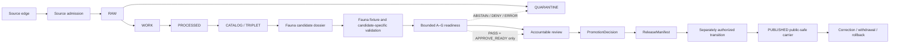

<!-- [KFM_META_BLOCK_V2]
doc_id: kfm://doc/runbook/fauna/promotion
title: Fauna Promotion Runbook
type: runbook; operational-procedure; domain-lane; non-authoritative
version: v1.0.0
prior_version: v0.1
status: draft; repository-grounded; bounded-promotion-readiness-validator-present; fauna-candidate-absent; policy-inactive; fauna-release-dry-run-held; sensitive-location-deny-by-default; non-publisher
owners:
  - "@bartytime4life — verified GitHub review route only"
  - "NEEDS VERIFICATION — accountable Fauna, taxonomy, source, rights/stewardship, sensitivity/geoprivacy, evidence, policy, validation, public-surface, release, correction, rollback, operations, and independent-review assignments"
created: 2026-05-13
updated: 2026-08-24
policy_label: restricted-review; fauna; promotion-readiness; geoprivacy; fail-closed; no-release-authority; no-publication-authority
current_path: docs/runbooks/fauna/PROMOTION_RUNBOOK.md
owning_root: docs/
responsibility: >-
  Provide the repository-grounded human procedure for evaluating Fauna
  promotion readiness and preparing an accountable review handoff without
  granting source admission, taxonomic authority, evidence, rights,
  sensitivity, policy, review, lifecycle-transition, release, deployment, or
  publication authority.
truth_posture: cite-or-abstain
truth_labels: [CONFIRMED, PROPOSED, UNKNOWN, NEEDS VERIFICATION, CONFLICTED, HOLD]
authority_class: explanatory operational documentation
canonical_relationship: same-path update; no new or parallel authority
path_posture: PLACE
evidence_snapshot:
  repository: bartytime4life/Kansas-Frontier-Matrix
  base_ref: main
  content_inspection_commit: de753ae672699bce64866a36ed9f025dc90d8bdc
  branch_base_commit: 4a6c06fb3ab1f7e6e29c99ae07000aa94ad4cc38
  prior_blob: 41053af77a00dee3e280eeb1f550e05b6393ee84
  directory_rules_blob: fd49a0b83e55cef52c1124281f093e263526898d
  directory_rules_adr_blob: a4de0d7a96b78da59cfc499d1025e1508afd8dd9
  promotion_sequence_adr_blob: 51cedfdf98b92f1a9af492ce3a1cde231eed9308
  fauna_candidate_readme_blob: 653277efe3a44a96c29af481a73d7d90c41443ce
  fauna_workflow_blob: 0edc73a77ee0ddb3193db2c0386ed6ac685b139a
  fauna_fixture_validator_blob: fe96d8c4cc78f44679ddf617b2b1251fe621928c
  fauna_fixture_test_blob: 8154761e55c01db9133f125f7cf268c2fbb8589e
  promotion_gate_readme_blob: e729df0cc007e8cf0d9811afc25ec1f5ffbdffdd
  promotion_policy_readme_blob: 79287df1d828010d716ed43d2e24d6dbd610305b
  promotion_decision_contract_blob: 42295bfc83a621cf125d33aa821912b426f70bd2
  promotion_decision_schema_blob: a2d087a46772cf60e4b9dfb394892690e8a88b31
  promotion_decision_validator_blob: ead33d6c5c073f319627ee42d99c5933c0e370d1
  release_manifest_contract_blob: ce7dc89ff447d76d974afdd802b85a38538d8f48
  release_manifest_validator_blob: 00307dc0d5e2c3867a229076e3702f8111455425
  release_review_readme_blob: bf3058a5af8fc85aa04a25a36ed03541cd9eb657
  published_fauna_readme_blob: 24a276f0e9b31ab5e7abc7dfe0b554c9dcba4029
  codeowners_blob: dd2a84aa514d8ecd9208bc347f90f9a2ed37dd61
inspection_boundary: >-
  Current-session GitHub reads of the target, accepted Directory Rules
  decision, proposed promotion-sequence ADR, Fauna domain and release
  boundaries, candidate lane, source and sensitivity registries, shared release
  contracts and schemas, bounded validators, fixtures, tests, workflows,
  policy, proof, review, manifest, published-carrier, correction, and rollback
  surfaces. Repository-native commands were not executed in a mounted checkout
  during authoring. No protected Fauna payload, live source, credential,
  production policy evaluator, release service, deployed public surface, or
  lifecycle transition was exercised.
related:
  - ../README.md
  - ../../adr/ADR-0029-adopt-directory-governance-standard-v2.md
  - ../../adr/ADR-0018-promotion-gate-sequence.md
  - ../../doctrine/directory-rules.md
  - ../../domains/fauna/README.md
  - ../../domains/fauna/RELEASE_INDEX.md
  - ../../../control_plane/source_authority_register.yaml
  - ../../../data/registry/sources/fauna/README.md
  - ../../../data/registry/sensitivity/fauna/README.md
  - ../../../data/proofs/fauna/README.md
  - ../../../data/published/fauna/README.md
  - ../../../contracts/release/promotion_decision.md
  - ../../../contracts/release/promotion_receipt.md
  - ../../../contracts/release/release_manifest.md
  - ../../../contracts/release/rollback_card.md
  - ../../../policy/promotion/README.md
  - ../../../policy/domains/fauna/README.md
  - ../../../policy/sensitivity/fauna/README.md
  - ../../../tools/validators/promotion_gate/README.md
  - ../../../tools/validators/domains/fauna/validate_public_safe_fixture.py
  - ../../../tests/domains/fauna/test_fauna_smoke.py
  - ../../../release/candidates/fauna/README.md
  - ../../../release/manifests/README.md
  - ../../../release/reviews/README.md
  - ../../../.github/workflows/domain-fauna.yml
  - ../../../.github/workflows/promotion-gate.yml
  - ../../../.github/workflows/release-dry-run.yml
  - ./NO_NETWORK_TEST_RUNBOOK.md
  - ./SOURCE_REFRESH_RUNBOOK.md
  - ./ROLLBACK_RUNBOOK.md
tags: [kfm, fauna, runbook, promotion, readiness, taxonomy, occurrence, geoprivacy, evidence, policy, review, release, correction, rollback, fail-closed]
notes:
  - "v1.0.0 replaces proposal-era no-mounted-repository assumptions, speculative commands, guessed paths, and implied release machinery with current repository evidence and bounded procedures."
  - "The shared A-G promotion-gate validator is executable, deterministic, no-network, read-only, and non-publishing. PASS means APPROVE_READY for accountable review only."
  - "The accepted Fauna executable slice validates only synthetic, fixture-only public-safe candidates that are explicitly ineligible for promotion and publication."
  - "No child Fauna candidate dossier, Fauna PromotionDecision, Fauna ReleaseManifest, accountable Fauna ReviewRecord, accepted Fauna release-dry-run command, or released public carrier was established by the bounded inspection."
  - "Promotion policy is proposed and inactive; its two local Rego files are no-op stubs and are not executed by the promotion workflow."
  - "This document changes no candidate, source, data, contract, schema, policy, fixture, validator, workflow, evidence object, receipt, proof, review, release record, deployment, lifecycle state, or public surface."
[/KFM_META_BLOCK_V2] -->

<a id="top"></a>

# Fauna Promotion Runbook

> **Evaluate whether a specifically identified Fauna candidate has enough governed, public-safe support for accountable release review. Never translate documentation, a synthetic fixture pass, a green workflow, a schema-valid packet, or an `APPROVE_READY` result into promotion, release, deployment, or publication.**

[](#current-repository-posture)
[](#current-executable-validation)
[](#current-repository-posture)
[](#current-repository-posture)
[](#fauna-specific-gates)
[](#authority-boundary-and-handoff)

> [!IMPORTANT]
> **Promotion is a governed state transition, not a file move, commit, pull request, merge, workflow result, badge, fixture, candidate dossier, manifest-shaped file, deployment, alias update, map-layer toggle, or generated summary.** Lifecycle or public state may change only after the owning source, evidence, policy, review, decision, release, correction, and rollback controls close.

> [!CAUTION]
> **Current Fauna promotion is `HOLD`.** The repository has a bounded generic A–G readiness validator and one deterministic Fauna fixture-safety suite. The Fauna candidate lane has no verified child dossier; the Fauna proof producer and domain release dry run remain explicit workflow holds; promotion policy is inactive; and no accountable Fauna review, promotion decision, manifest, applied transition, or released carrier was established.

> [!WARNING]
> **Exact or reverse-engineerable animal locations fail closed.** Do not expose sensitive taxa, nests, dens, roosts, hibernacula, spawning or breeding sites, aggregation sites, telemetry paths, private-land joins, access clues, steward-controlled records, or geoprivacy transform parameters in a candidate packet, pull request, log, screenshot, map, export, graph, cache, or AI answer.

**Quick navigation:** [Purpose](#purpose) · [Current posture](#current-repository-posture) · [Placement](#directory-rules-basis) · [Scope](#scope-and-non-goals) · [Roles](#roles-and-separation-of-duties) · [Lifecycle](#lifecycle-and-object-family-boundaries) · [Preflight](#preflight-and-stop-conditions) · [Procedure](#promotion-readiness-procedure) · [Fauna gates](#fauna-specific-gates) · [Validation](#current-executable-validation) · [Packet](#candidate-review-packet) · [Outcomes](#finite-outcomes-and-current-holds) · [Authority](#authority-boundary-and-handoff) · [Recovery](#correction-withdrawal-and-rollback) · [Audit](#audit-and-join-keys) · [Checklist](#operator-checklist) · [Open work](#open-verification-register) · [Evidence](#evidence-basis) · [Document rollback](#document-change-rollback)

---

<a id="purpose"></a>

## Purpose

Use this runbook to assess one bounded Fauna candidate against the support required for a possible transition from governed catalog state toward a public-safe released carrier.

The KFM lifecycle remains:

```text
RAW -> WORK / QUARANTINE -> PROCESSED -> CATALOG / TRIPLET -> PUBLISHED
```

The operator's result is an inspectable readiness, hold, abstention, denial, or error packet. Completing a checklist cannot create missing authority.

This runbook is subordinate to accepted repository authority. When it conflicts with accepted ADRs, Directory Rules, current contracts, schemas, policy, validators, source-admission records, EvidenceBundles, review records, release decisions, correction records, rollback records, or runtime evidence, stop and record the conflict rather than selecting the convenient interpretation.

### What this runbook can establish

- which candidate and requested lifecycle boundary are being evaluated;
- which current repository checks apply;
- which support objects are present, absent, stale, conflicted, or unresolved;
- which Fauna-specific taxonomy, occurrence, source-role, rights, stewardship, sensitivity, geoprivacy, temporal, spatial, and uncertainty distinctions must remain visible;
- which finite outcome applies at the current evidence level; and
- which separately accountable authority must receive the handoff.

### What this runbook cannot establish

- that a Fauna source is admitted, active, authoritative, or rights-cleared;
- that a taxonomic identification, occurrence, range, migration route, mortality cause, disease condition, or population claim is true;
- that a public-safe transform is scientifically, ethically, legally, or operationally sufficient;
- that evidence is complete or an EvidenceRef is authentic merely because it is present;
- that policy is accepted or executing;
- that a reviewer is qualified, assigned, independent, or current;
- that a release candidate exists because a directory or README exists;
- that a transition occurred because a receipt, decision, or manifest validates;
- that a map or export is safe because a style hides detail; or
- that release, deployment, promotion, or publication occurred.

[Back to top](#top)

---

<a id="current-repository-posture"></a>

## Current repository posture

The following conclusions are bounded to `main@de753ae672699bce64866a36ed9f025dc90d8bdc`.

| Surface | Status | Safe conclusion |
|---|---|---|
| This runbook path | **CONFIRMED** | `docs/runbooks/fauna/PROMOTION_RUNBOOK.md` is tracked. This revision is a same-path documentation modernization. |
| Directory governance | **CONFIRMED / accepted** | ADR-0029 adopts Directory Rules v2; `docs/runbooks/` owns human operational procedures. |
| Fauna candidate lane | **CONFIRMED guidance / no child candidate** | `release/candidates/fauna/` contains the parent README and no verified child candidate dossier. “A candidate is not a release.” |
| Fauna fixture validation | **CONFIRMED / bounded** | The domain workflow runs one deterministic, no-network synthetic public-safe fixture suite. Its accepted candidates are fixture-only and explicitly ineligible for promotion and publication. |
| Fauna fixture matrix | **CONFIRMED / synthetic** | Two valid fixtures and five invalid fixtures exercise withholding, missing source identity, unresolved taxonomy/governance, over-precision, and encoded location clues. |
| Fauna proof producer | **CONFIRMED / HOLD** | The domain workflow records no accepted Fauna proof producer or deterministic proof command. |
| Fauna release dry run | **CONFIRMED / HOLD** | The domain workflow records no accepted Fauna release dry-run command or candidate-manifest contract. |
| Generic promotion readiness | **CONFIRMED / bounded** | `tools/validators/promotion_gate/validate_promotion_gate.py` evaluates a declared `CATALOG` or `TRIPLET` to `PUBLISHED` packet through A–G gates with no network or writes. |
| Generic readiness result | **CONFIRMED / non-authoritative** | `PASS` maps to `APPROVE_READY` for accountable review only. It is not `APPROVE`, `PROMOTED`, `RELEASED`, or `PUBLISHED`. |
| Global release dry run | **CONFIRMED / synthetic and no-write** | The shared workflow exercises five deterministic publication-denial paths, bounded promotion readiness, and rollback-card candidate checks without assembling a real candidate or writing release state. |
| `PromotionDecision` family | **CONFIRMED / PROPOSED contract and shape** | The contract and closed schema define `APPROVE`, `DENY`, or `ABSTAIN`; current reusable fixtures are hydrology-scoped and shape-only. No Fauna instance was established. |
| `PromotionReceipt` family | **CONFIRMED / PROPOSED fixture-first** | Contract, schema, validator, fixtures, tests, and read-only workflow exist. Internal consistency is not proof that a transition occurred. |
| `ReleaseManifest` family | **CONFIRMED / dual-profile candidate validation** | The contract and validator preserve a permissive legacy branch and a closed fixture-only strict branch. A strict `PASS` is not production release authority. |
| Promotion policy | **CONFIRMED / inactive** | `policy/promotion/` contains two no-op Rego stubs. No accepted bundle, evaluator binding, active gate-register entry, or governed consumer is established. |
| Fauna policy and geoprivacy | **CONFIRMED / scaffold or guidance** | Domain and sensitivity guidance exists, but accepted executable Fauna release policy and candidate-specific geoprivacy enforcement were not established. |
| Source authority | **CONFIRMED / empty projection** | The central source-authority register is `PROPOSED`, projection-only, `implementation_status: ABSENT`, and has `entries: []`. |
| Fauna proof support | **CONFIRMED draft / production hold** | Shared EvidenceBundle surfaces exist, but no accepted Fauna proof packet, producer, resolver binding, or release linkage was established. |
| Release review lane | **CONFIRMED guidance only** | The fixture-only Gate G validator checks declarations. No parent-level or Fauna-scoped governed ReviewRecord is established. |
| Fauna release index | **CONFIRMED draft / illustrative** | Its release identifiers are templates, not verified releases; its state vocabulary and several paths remain proposed or conflicted. |
| Fauna published lane | **CONFIRMED README / emitted carrier unverified** | The lane documents released public-safe carriers but does not establish that a release-linked Fauna artifact was emitted or served. |
| Release topology | **CONFLICTED / unresolved** | Singular/plural manifest and several correction/rollback lanes coexist. This runbook does not choose a new authority home. |
| Release, deployment, publication | **UNKNOWN / not established** | No applied Fauna transition, release, deployment, public alias change, or publication was verified by this revision. |

### Operational consequence

Until the open controls graduate, the normal terminal result is:

- `HOLD` when candidate, source, taxonomy, evidence, rights, sensitivity, policy, validation, review, release, correction, or rollback support is incomplete;
- `ABSTAIN` when support is insufficient without asserting an unsafe fact;
- `DENY` when rights, sensitivity, disclosure, contradiction, or an impermissible source-role substitution blocks the operation; or
- `ERROR` when the evaluation cannot complete safely.

A generic A–G `PASS` may be included in a review packet. It does not clear the Fauna-specific holds above.

[Back to top](#top)

---

<a id="directory-rules-basis"></a>

## Directory Rules basis

Accepted [ADR-0029](../../adr/ADR-0029-adopt-directory-governance-standard-v2.md) adopts [Directory Rules v2](../../doctrine/directory-rules.md) as the placement authority.

| Responsibility | Owning root or lane | Boundary |
|---|---|---|
| Human operator procedure | `docs/runbooks/fauna/` | This file explains the procedure; it does not own policy, review, release, or lifecycle state. |
| Fauna domain meaning | `docs/domains/fauna/` and accepted semantic contracts | Taxonomy, occurrence, range, source-role, and sensitivity semantics remain outside this runbook. |
| Object meaning | `contracts/` | Contracts define object semantics; this document must not create a competing contract. |
| Machine shape | `schemas/` | Schemas define shape; a valid shape grants no truth or authority. |
| Policy source | `policy/` | Policy may allow, deny, restrict, hold, or abstain only after accepted binding and evaluation. |
| Reusable synthetic inputs | `fixtures/` | Fixtures are test inputs, never release evidence by themselves. |
| Executable validation | `tools/validators/` and `tests/` | Checks bounded behavior; it does not decide taxonomic truth, rights, or release. |
| Source admission | governed source descriptors and source-authority controls | A connector, registry README, accessible endpoint, or source citation is not admission. |
| Lifecycle instances | governed `data/` stages | Moving or copying bytes is not promotion. |
| Candidate and release records | `release/` shared lanes and accepted successors | Candidate, review, promotion, manifest, correction, withdrawal, and rollback records remain distinct. |
| Published carriers | `data/published/fauna/` or an accepted public-safe carrier lane | Public carriers are downstream of release, not release authority. |
| Public access | governed APIs and released public-safe artifacts | Public clients do not read RAW, WORK, QUARANTINE, candidate, proof, or restricted stores as their normal path. |

**Placement outcome: `PLACE` — CONFIRMED for this same-path update.** No root, file, schema, contract, policy, source registry, release lane, data home, or public surface is created, moved, renamed, mirrored, or retired.

[Back to top](#top)

---

<a id="scope-and-non-goals"></a>

## Scope and non-goals

### In scope

- promotion-readiness assessment for a specifically identified Fauna candidate;
- the declared `CATALOG` or `TRIPLET` to `PUBLISHED` boundary used by the current generic A–G validator;
- candidate identity, taxonomy, object family, source identity and role, evidence, rights, stewardship, sensitivity, geoprivacy, validation, policy, review, release, correction, and rollback completeness;
- public-surface review for maps, APIs, tiles, downloads, search, graphs, exports, screenshots, caches, logs, and AI-facing summaries; and
- a bounded handoff to accountable review and release authorities.

### Out of scope

- source discovery, admission, activation, refresh, ingest, or live retrieval;
- changing taxonomic authority or silently resolving a taxonomic conflict;
- producing or executing a geoprivacy transform;
- storing exact or restricted animal locations in a public review packet;
- building an EvidenceBundle, proof pack, ReviewRecord, PolicyDecision, PromotionDecision, PromotionReceipt, ReleaseManifest, CorrectionNotice, WithdrawalNotice, or RollbackCard;
- changing lifecycle state, writing to a published lane, updating an alias or cache, deploying, or publishing;
- hunting, fishing, collecting, land-access, enforcement, rehabilitation, veterinary, disease-response, legal, emergency, or life-safety guidance; and
- treating maps, models, tiles, classifications, summaries, or AI output as sovereign truth.

[Back to top](#top)

---

<a id="roles-and-separation-of-duties"></a>

## Roles and separation of duties

Only the GitHub review route `@bartytime4life` is verified. Every stewardship or release assignment below is `NEEDS VERIFICATION` until an accepted assignment proves identity, scope, authority, effective time, and separation requirements.

| Role | Required responsibility | Must not be substituted by |
|---|---|---|
| Candidate producer | Pins candidate identity, artifact digests, method, source set, time, geography, object family, and limitations. | A directory name, generated summary, or workflow run. |
| Fauna/taxonomy steward | Reviews taxon concept, rank, synonym/crosswalk conflicts, object-family meaning, and ecological claim scope. | An aggregator's accepted name or AI normalization. |
| Source steward | Confirms source identity, origin role, cadence, version, access, and admitted operation. | Endpoint availability, connector presence, or registry prose. |
| Rights/stewardship reviewer | Reviews license, agreement, attribution, redistribution, landowner, Tribal/community, agency, embargo, and allowed-use obligations. | Public accessibility or a generic open-data assumption. |
| Sensitivity/geoprivacy reviewer | Reviews vulnerable taxa/sites, withholding, aggregation, redaction/generalization, reverse inference, and public audiences. | Client-side hiding or an undocumented coordinate transform. |
| Evidence/proof steward | Confirms EvidenceRef resolution, bundle scope, limitations, contradictions, freshness, and invalidation. | A citation string, receipt, map, or graph edge alone. |
| Policy steward | Owns the accepted input profile, bundle, evaluator binding, normalized result, reasons, and obligations. | Rego file presence, package name, or generic readiness result. |
| Validation steward | Confirms candidate-specific positive and negative checks, deterministic execution, exact profile identity, and public no-leak behavior. | Synthetic Fauna fixture success alone. |
| Public-surface reviewer | Confirms every released carrier preserves source role, uncertainty, sensitivity, caveats, correction, and withdrawal behavior. | A safe-looking map style or hidden popup fields. |
| Independent reviewer | Reviews support, obligations, separation, and consequences where materiality requires independence. | Automation, CODEOWNERS, or self-declared identity alone. |
| Release authority | Decides whether an otherwise complete candidate may enter a separately governed transition. | `APPROVE_READY`, PR approval, merge, or schema-valid object. |
| Correction/rollback steward | Confirms correction lineage, withdrawal, downstream invalidation, safe prior target, and recovery verification. | A path named `rollback` or an unexecuted card. |

> [!IMPORTANT]
> CODEOWNERS routes GitHub review. It is not a StewardshipAssignment, taxonomic determination, rights-holder approval, sensitivity decision, ReviewRecord, PolicyDecision, independent review, release approval, or proof that review occurred.

### Minimum separation

For sensitive or policy-significant Fauna promotion, candidate production, taxonomy/domain review, rights/stewardship review, sensitivity/geoprivacy review, and release authority should be separated as required by an accepted policy. If required independence cannot be established, return `HOLD`; never reduce the review burden silently.

[Back to top](#top)

---

<a id="lifecycle-and-object-family-boundaries"></a>

## Lifecycle and object-family boundaries


```mermaid
flowchart LR
  S["Source edge"] --> A["Source admission"]
  A --> R["RAW"]
  R --> W["WORK"]
  R --> Q["QUARANTINE"]
  W --> P["PROCESSED"]
  P --> C["CATALOG / TRIPLET"]
  C --> F["Fauna candidate dossier"]
  F --> V["Fauna fixture and candidate-specific validation"]
  V --> G["Bounded A–G readiness"]
  G --> H["Accountable review"]
  H --> D["PromotionDecision"]
  D --> M["ReleaseManifest"]
  M --> X["Separately authorized transition"]
  X --> PUB["PUBLISHED public-safe carrier"]
  PUB --> CR["Correction / withdrawal / rollback"]

  G -. "PASS = APPROVE_READY only" .-> H
  G -. "ABSTAIN / DENY / ERROR" .-> Q
```

The current generic executable begins at a **declared** `CATALOG` or `TRIPLET` candidate. It does not implement earlier lifecycle stages, authenticate support, create a Fauna candidate, or apply the final transition.

### Object families remain distinct

| Object family | Current bounded role | What it never proves alone |
|---|---|---|
| `SourceDescriptor` | Declares source identity, origin role, rights, cadence, sensitivity, access, and use context. | Admission, truth, permission, evidence closure, or release. |
| Fauna candidate dossier | Indexes public-safe candidate identity, artifact pointers, support status, blockers, and handoff. | That a candidate artifact exists, is safe, or is released. |
| Synthetic public-safe Fauna fixture | Exercises a deliberately narrow, no-network fixture profile. | Taxon identity, source admission, real geoprivacy, candidate readiness, or publication. |
| `RunReceipt` / transform receipt | Records what a process declared it ran over which inputs and outputs. | Correctness, source authority, or approval. |
| `ValidationReport` | Records a named validator/profile result over a pinned subject. | Evidence truth, rights clearance, or release authority. |
| `EvidenceRef` / `EvidenceBundle` | Provides traceable support, scope, citations, and limitations for bounded claims. | Policy permission or publication state. |
| `RedactionReceipt` / `AggregationReceipt` / transform record | Declares how detail was withheld, aggregated, generalized, redacted, or transformed. | That the method is accepted, sufficient, irreversible, or safely enforced. |
| `PolicyDecision` | Records a pinned policy evaluation and obligations after an accepted evaluator exists. | Reviewer authority, transition application, or release. |
| `ReviewRecord` | Records a governed review under a defined subject, scope, authority, and time window. | Release unless the accepted release profile grants that effect. |
| A–G readiness output | Reports `PASS`, `ABSTAIN`, `DENY`, or `ERROR` over the bounded declaration profile. | A PromotionDecision, applied transition, release, or publication. |
| `PromotionDecision` | Records an accountable `APPROVE`, `DENY`, or `ABSTAIN` decision about a specific candidate. | Applied mutation, ReleaseManifest, deployment, or public serving. |
| `PromotionReceipt` | Records declared A–G outcomes, digest binding, decision reference, and an attempted transition claim. | That referenced support is authentic or a transition occurred. |
| `ReleaseManifest` | Declares release contents, digests, support, correction, and rollback linkage. | Approval or publication unless authorized state and serving are separately verified. |
| `CorrectionNotice`, withdrawal record, `RollbackCard` | Records correction, containment, reversal intent, affected scope, and lineage. | Successful propagation to every public and derived surface. |
| Published Fauna carrier | Serves already released, public-safe material through an approved delivery path. | Source truth, policy authority, or release authority. |

Receipts, proofs, reviews, decisions, manifests, catalogs, and published artifacts must not be collapsed into one generic “proof” object.

[Back to top](#top)

---

<a id="preflight-and-stop-conditions"></a>

## Preflight and stop conditions

Do not begin a promotion-readiness evaluation until the request identifies a bounded candidate and requested transition.

### Required preflight record

Record only public-safe metadata and governed references.

| Field family | Minimum question |
|---|---|
| Candidate identity | What immutable candidate ID, version, specification hash, and artifact digest set are being evaluated? |
| Lifecycle boundary | What is the current governed state, and is the requested boundary exactly supported by the evaluation profile? |
| Candidate owner | Who produced the candidate, and which distinct accountable reviewers are required? |
| Object and taxon scope | Which object family, taxon concept, authority, rank, synonym/crosswalk state, identification confidence, and unresolved conflicts apply? |
| Source set | Which admitted SourceDescriptors and immutable source versions support the candidate? |
| Evidence set | Which EvidenceRefs resolve to which EvidenceBundles, with what limitations, contradictions, and freshness? |
| Spatial support | Is the release about an occurrence, range, seasonal range, aggregate, modeled surface, context, or withheld site—and at what public-safe precision? |
| Time support | Which observation, event, validity, season, source, retrieval, processing, review, correction, and release times apply? |
| Rights/stewardship | Which license, agreement, attribution, embargo, agency, landowner, Tribal/community, and allowed-use obligations apply? |
| Sensitivity/geoprivacy | Which vulnerable taxon/site, audience, withholding, aggregation, redaction/generalization, reverse-inference, and transform obligations apply? |
| Validation | Which exact schema, domain, taxonomy, source-role, time, spatial, evidence, policy, sensitivity, public-boundary, and negative checks ran? |
| Policy | Which accepted bundle, evaluator, input profile, result, reasons, and obligations apply? |
| Review | Which subject-bound ReviewRecords and authority intervals apply, and is required separation satisfied? |
| Release support | Which candidate dossier, PromotionDecision, ReleaseManifest, signature/attestation, changelog, and public-carrier inventory apply? |
| Recovery | Which correction, withdrawal, invalidation, rollback target, and tested recovery evidence apply? |

### Immediate stop conditions

Return `HOLD`, `ABSTAIN`, `DENY`, or `ERROR` before running or interpreting readiness when any of these applies:

- no verified child candidate dossier or immutable candidate artifact exists;
- the source authority is absent, placeholder-only, unadmitted, revoked, rights-unclear, or out of scope for the proposed audience/use;
- taxonomy is unresolved or an identification confidence is silently upgraded;
- an occurrence, range, modeled surface, aggregate, status record, administrative record, or context source is substituted for another source role;
- EvidenceRefs do not resolve or do not support the actual taxon, object family, geography, time, method, unit, or claim;
- exact or reverse-engineerable sensitive detail is present outside an authorized restricted review environment;
- public-safe transform support, geoprivacy review, or cross-carrier no-leak testing is missing;
- a public derivative permits triangulation through joins, repeated observations, telemetry, labels, or private-land/access details;
- observation, event, seasonal, source, retrieval, review, correction, and release times are collapsed or ambiguous;
- uncertainty, absence, non-detection, effort, detection method, modeled probability, or evidence limitations are hidden;
- policy is inactive, evaluator identity is missing, or obligations cannot be enforced;
- candidate-specific positive and negative validation is absent;
- accountable reviewer identity, current authority, or required separation is unresolved;
- release topology, manifest, correction path, withdrawal route, or rollback target is unresolved;
- a prior target cannot be revalidated under current rights, taxonomy, evidence, sensitivity, and policy; or
- infrastructure errors prevent a deterministic fail-closed result.

[Back to top](#top)

---

<a id="promotion-readiness-procedure"></a>

## Promotion-readiness procedure

### 1. Classify the request

Distinguish among:

- source discovery;
- source admission or activation;
- source refresh or ingest;
- candidate production;
- evidence/catalog closure;
- promotion readiness;
- release decision;
- lifecycle-transition execution;
- deployment;
- publication;
- correction, withdrawal, or rollback.

Only **promotion readiness** is governed by this runbook. Route every other operation to its owning procedure or authority.

### 2. Freeze authority and candidate identity

Record:

- exact repository commit;
- candidate ID and version;
- artifact and specification digests;
- current and requested lifecycle states;
- evaluation time;
- candidate producer;
- applicable contracts, schemas, policy profiles, and reviewers;
- open overlapping branches or pull requests; and
- correction and rollback targets.

Current repository evidence supplies no Fauna child candidate. Do not populate a packet with guessed IDs, fake hashes, illustrative release IDs, or placeholder authority.

### 3. Confirm a real candidate dossier exists

Verify the child dossier under the accepted candidate lane and confirm:

- stable identity and immutable artifact pointer;
- public-safe contents;
- explicit non-release state;
- source, taxonomy, evidence, rights, sensitivity, validation, policy, review, release, correction, and rollback status; and
- no protected geometry, transform parameters, private correspondence, credentials, or restricted payloads.

At the pinned snapshot, this step returns `HOLD`: no child Fauna candidate dossier was verified.

### 4. Verify source admission, taxonomy, and source roles

For every source and claim:

1. resolve the governing source descriptor and admitted operation;
2. preserve original source role and authority;
3. identify the taxon concept and unresolved mappings;
4. preserve method, effort, detection/non-detection, quality, uncertainty, and time;
5. prevent aggregator access paths from becoming source authority; and
6. record rights, stewardship, access, and allowed-use obligations.

A watcher result, connector directory, source catalog page, API response, checksum, or successful download is not source admission.

### 5. Verify evidence and catalog closure

For each candidate field or claim, confirm:

- the EvidenceRef resolves to an admissible EvidenceBundle;
- the bundle supports the exact taxon concept, object family, geography, time, method, and claim;
- source roles and limitations remain visible;
- contradictions, uncertainty, non-detection, effort, quality, and stale state remain visible;
- catalog and provenance references are consistent;
- derived products point to inputs and method; and
- no generated summary, tile, graph, index, model, or range polygon is treated as source evidence.

If support is unresolved but no unsafe contradiction is asserted, use `ABSTAIN`. If the candidate attempts an unsupported or impermissible public claim, use `DENY`.

### 6. Apply Fauna-specific safety review

Evaluate all gates in [Fauna-specific gates](#fauna-specific-gates), including:

- exact-location and reverse-inference exposure;
- public-safe transformation;
- taxonomy and source-role preservation;
- range/occurrence/model separation;
- sensitive cross-domain joins;
- public wording and authority boundaries; and
- correction, withdrawal, and rollback propagation.

The most restrictive applicable source, rights, stewardship, sensitivity, audience, join, lifecycle, and release posture wins.

### 7. Run current bounded validation

Run only the repository-owned, no-network checks described in [Current executable validation](#current-executable-validation).

Interpret them narrowly:

- the Fauna suite validates synthetic fixture safety only;
- the generic A–G validator checks declared readiness only;
- global release dry-run checks deterministic synthetic denial and candidate-shape boundaries only; and
- shared release-object validators do not create Fauna records or authenticate refs.

### 8. Reconcile generic readiness with Fauna holds

A generic `PASS` / `APPROVE_READY` can coexist with a Fauna `HOLD`. Reconcile:

- candidate existence and immutable artifact identity;
- admitted source set;
- taxonomy and object-family closure;
- EvidenceBundle and proof closure;
- rights, stewardship, sensitivity, and geoprivacy;
- candidate-specific positive and negative validation;
- accepted policy and enforceable obligations;
- accountable reviewer assignments and separation;
- release topology and manifest completeness;
- public-carrier no-leak verification; and
- correction, withdrawal, and rollback readiness.

Never allow a generic shape/readiness result to erase a domain-specific blocker.

### 9. Prepare the accountable review handoff

Assemble public-safe references—not copied restricted content—to candidate, source, evidence, validation, policy, review, decision, manifest, correction, withdrawal, and rollback support.

State:

- exact finite outcome;
- unresolved holds;
- what each bounded validator did and did not prove;
- which authority owns the next decision; and
- that no transition, release, deployment, or publication occurred.

### 10. Stop before transition execution

This runbook has no transition executor. An accountable `PromotionDecision`, accepted release machinery, and separately authorized transition would be required before any lifecycle or public state could change.

[Back to top](#top)

---

<a id="fauna-specific-gates"></a>

## Fauna-specific gates

These gates supplement the generic A–G declaration profile. They do not amend its executable contract or create policy.

| Gate concern | Required question | Fail-closed posture |
|---|---|---|
| Candidate identity | Is one immutable candidate, version, artifact digest set, method, audience, and requested boundary explicit? | `HOLD` when absent or mutable; `DENY` contradictory identity. |
| Taxonomy | Are taxon concept, authority, rank, synonyms/crosswalks, identification confidence, and unresolved conflicts explicit? | `HOLD` or `ABSTAIN`; never silently normalize to certainty. |
| Object family | Is the candidate explicitly occurrence evidence, public occurrence, restricted occurrence, sensitive site, range, seasonal range, migration context, mortality, disease, invasive-species context, aggregate, model, or another accepted family? | `DENY` family collapse; `HOLD` unknown meaning. |
| Source role | Is each source observed, modeled, aggregate, regulatory, administrative, contextual, candidate, synthetic, or restricted as applicable? | `DENY` substitution; `HOLD` unresolved role. |
| Source admission | Is each source admitted for this exact operation, audience, geography, time, and use? | `HOLD` absent authority; `DENY` impermissible use. |
| Rights and stewardship | Do license, terms, attribution, agreement, agency, landowner, Tribal/community, embargo, and redistribution obligations permit the proposed derivative and audience? | `DENY` or `HOLD`; accessibility is not permission. |
| Sensitive taxa/sites | Could the output reveal or target a vulnerable taxon, nest, den, roost, hibernaculum, spawning/breeding/aggregation site, private land, access route, or steward-controlled record? | Restrict, withhold, aggregate, generalize, delay, redact, or `DENY`. |
| Geoprivacy transform | Is a named, versioned, reviewed transform reproducible, receipt-bound, audience-specific, and resistant to reversal? | `HOLD` without accepted policy/review; `DENY` unsafe output. |
| Reverse inference | Could joins, repeated dates, telemetry, labels, IDs, habitat context, roads, parcels, screenshots, or search responses reconstruct protected locations? | Most restrictive posture; `DENY` unsafe join. |
| Occurrence versus range | Is a range polygon kept distinct from observed presence at every location, and is seasonal range distinct from year-round occurrence? | `DENY` misleading presence claim. |
| Migration and movement | Is modeled or generalized movement kept distinct from a verified exact path or current animal presence? | `DENY` exact-path/current-presence overclaim. |
| Aggregate versus individual | Are density, richness, count, occupancy, or grid products kept distinct from an individual occurrence? | `DENY` individual inference. |
| Model versus observation | Are suitability, occupancy, interpolation, classification, forecast, and AI summaries labeled as derived/modelled with method and uncertainty? | `DENY` representation as direct observation. |
| Time and seasonality | Are observation, event, validity, season, source, retrieval, processing, review, correction, and release times distinct? | `ABSTAIN` or `HOLD` ambiguity; mark stale state. |
| Evidence and uncertainty | Does every consequential claim resolve to evidence at matching taxon, place, time, method, and role, with non-detection, effort, quality, and uncertainty visible? | `ABSTAIN` unresolved support; `DENY` unsupported release. |
| Mortality and disease | Is an observation kept distinct from population trend, causal attribution, diagnosis, outbreak authority, veterinary/public-health guidance, or emergency instruction? | Narrow scope, cite official authority, or `DENY`. |
| Regulatory/administrative status | Is legal, conservation, listing, management, or administrative status kept distinct from current local occurrence? | `DENY` status-to-presence substitution. |
| Cross-domain context | Do Habitat, Flora, Hydrology, Soil, Agriculture, Hazards, Roads, People/Land, and Settlements retain their own truth and sensitivity authority? | `HOLD` unclear ownership; `DENY` unsafe authority collapse. |
| Public carriers | Have API, map, tile, download, search, export, graph, screenshot, cache, log, and AI surfaces been separately reviewed for leakage and caveat preservation? | `HOLD` incomplete inventory; `DENY` unsafe carrier. |
| Operational guidance | Could output be mistaken for hunting, fishing, collecting, access, legal, enforcement, disease-response, veterinary, emergency, or life-safety guidance? | Narrow scope, redirect to official authority, or `DENY`. |
| Correction and rollback | Can claims and all dependent carriers be corrected, withdrawn, invalidated, restored, and audited without silent overwrite or exposing the restricted original? | `HOLD` or deny release readiness. |

### Fauna distinctions that must not collapse

```text
OccurrenceEvidence != confirmed public occurrence
OccurrenceRestricted != public occurrence derivative
OccurrencePublic != restricted source record
SensitiveSite != ordinary occurrence or public point
RangePolygon != observed presence at every location
SeasonalRange != year-round range
MigrationRoute != verified exact path or current presence
modeled suitability != observation
aggregate count or density != individual location
regulatory or administrative status != current local occurrence
MortalityObservation != population trend or causal determination
DiseaseObservation != diagnosis, outbreak authority, or health guidance
map tile, graph edge, screenshot, or AI summary != evidence
synthetic fixture PASS != candidate approval or release
```

[Back to top](#top)

---

<a id="current-executable-validation"></a>

## Current executable validation

### Fauna synthetic public-safe fixture suite

Run the exact domain command used by the Fauna workflow:

```bash
python -m unittest discover \
  --start-directory tests/domains/fauna \
  --pattern 'test_fauna_smoke.py' \
  --verbose
```

The accepted fixture inventory contains:

- two valid synthetic fixtures:
  - a non-sensitive, withheld-location scenario; and
  - a sensitive-withheld scenario requiring a synthetic redaction-receipt reference and caveat;
- five invalid synthetic fixtures covering:
  - missing source descriptor;
  - over-precise sensitive fields;
  - unresolved taxonomy;
  - unresolved evidence, rights, sensitivity, policy, geoprivacy, review, correction, and rollback; and
  - encoded location or live-URL clues.

The validator is standard-library-only, no-network, deterministic, bounded, and non-emitting. A pass does **not** establish real taxonomic identity, source admission, rights clearance, geoprivacy review, evidence closure, policy approval, stewardship approval, candidate readiness, safe public use, release, or publication.

### Generic promotion readiness

Run the complete bounded repository proof:

```bash
make publish-check
```

Run the current fixture matrices directly:

```bash
python tools/validators/validate_promotion_gate.py --fixtures
python tools/validators/validate_review_record.py --fixtures
```

Evaluate an explicit local packet:

```bash
python tools/validators/validate_promotion_gate.py candidate.json
```

The current A–G validator:

- uses no network;
- writes no artifact;
- emits deterministic finite JSON findings and exit codes;
- checks declared identity, integrity, geometry/CRS, time, policy context, proof/catalog support, review, correction, and rollback;
- does not dereference EvidenceBundles, catalogs, attestations, ReviewRecords, or rollback targets;
- does not authenticate actors or authority assignments;
- does not execute the inactive promotion Rego stubs;
- does not verify production signatures;
- does not inspect a Fauna public carrier; and
- does not apply a lifecycle transition.

### Shared release-object fixture profiles

```bash
python tools/validators/release/validate_promotion_decision.py --fixtures
python tools/validators/release/validate_promotion_receipt.py --fixtures
python tools/validators/release/validate_release_manifest.py --fixtures
```

These checks validate bounded candidate shape and local consistency. They do not create a Fauna decision or manifest, authenticate refs, execute policy, approve review, persist release state, deploy, or publish.

Current `PromotionDecision` fixtures are hydrology-scoped; their success is not Fauna promotion proof.

### Global release dry run

```bash
make release-dry-run
```

The current shared dry run exercises synthetic publication-denial paths and release-object readiness without candidate assembly or writes. It does not replace the still-held `publish-dry-run-fauna` job, and it does not prove that a Fauna candidate, manifest, rollback path, or public carrier is ready.

### Documentation-change validation

For this runbook change, execute from a mounted checkout:

```bash
python tools/validators/docs/link-check/check_links.py \
  --repo-root . \
  --format text \
  docs/runbooks/fauna/PROMOTION_RUNBOOK.md

python -m unittest discover \
  --start-directory tests/validators/docs/link-check \
  --pattern 'test_*.py' \
  --verbose

make repository-topology
```

Repository-native commands were **not run locally during connector-only authoring**. Hosted checks must be evaluated at the exact pull-request head. A green documentation, topology, or workflow result proves only its bounded scope.

[Back to top](#top)

---

<a id="candidate-review-packet"></a>

## Candidate review packet

Do not invent a new candidate schema in this runbook. Assemble references to the owning objects and include a human-readable completeness table.

### Required packet families

| Packet family | Required support | Current Fauna posture |
|---|---|---|
| Candidate identity | Child dossier, immutable artifact pointer, digest set, specification, object family, taxon scope, geography, time, audience, and intended carrier | **Not established; no child candidate dossier verified** |
| Source admission | Accepted SourceDescriptors, origin roles, rights, source version, access, permitted uses, and cadence | **Candidate-specific set not established; central authority projection empty** |
| Taxonomy | Taxon concepts, authorities, rank, crosswalks, conflicts, confidence, and temporal version | **Not established for a candidate** |
| Evidence | Claim-to-EvidenceBundle mapping, limitations, effort/detection, uncertainty, freshness, and contradiction handling | **Not established; Fauna proof producer held** |
| Fauna transforms | Accepted withholding, aggregation, redaction/generalization, delay/embargo, and transform records | **Not established for a candidate** |
| Validation | Candidate-specific schema, taxonomy, source-role, time, spatial, evidence, sensitivity, public-boundary, and negative tests | **Only synthetic fixture profile established** |
| Policy | Accepted Fauna and promotion bundle identities, evaluator, input profile, result, reasons, and obligations | **Inactive / unresolved** |
| Review | Subject-bound reviewer assignments, authority intervals, separation, rights/stewardship, sensitivity/geoprivacy, and independent review where required | **No Fauna governed ReviewRecord established** |
| Generic readiness | A–G deterministic result over the exact candidate packet | **No Fauna candidate-specific result established** |
| Promotion record | Accountable PromotionDecision tied to exact candidate and support set | **No Fauna instance established** |
| Release support | Accepted ReleaseManifest topology, contents, digests, attestations, changelog, and public-carrier inventory | **No Fauna manifest established; production profile unresolved** |
| Published carrier | Exact released API/map/tile/export/report carrier, digest, governed route, evidence/caveat display, and correction state | **Emitted release-linked carrier not verified** |
| Recovery | Correction, withdrawal, invalidation, prior safe target, RollbackCard, rehearsal, and verification evidence | **Not established; domain release dry run held** |

### Packet handling rules

- Reference sensitive or restricted records through governed identifiers; never paste their contents into a public PR.
- Do not expose exact geometry, access clues, private-land joins, or transform parameters.
- Pin every mutable reference to a version, digest, or effective interval.
- Keep source, evidence, policy, review, decision, receipt, manifest, correction, rollback, and published carrier identities separate.
- Record unresolved support as unresolved. Do not use guessed URIs, fabricated hashes, or placeholder authority in validator input.
- Include the exact validator version or commit and preserve deterministic output.
- State whether the packet is synthetic, fixture-only, candidate-real, or release-real.
- Record every non-effect: no source activation, no lifecycle mutation, no release, no deployment, and no publication.

[Back to top](#top)

---

<a id="finite-outcomes-and-current-holds"></a>

## Finite outcomes and current holds

### Current executable vocabulary

The generic A–G validator uses:

```text
ERROR > DENY > ABSTAIN > PASS
```

`PASS` maps to `APPROVE_READY`; every other result maps to `BLOCKED`.

The proposed `PromotionDecision` contract uses:

```text
APPROVE | DENY | ABSTAIN
```

Runtime policy and governed-answer surfaces may use:

```text
ANSWER | ABSTAIN | DENY | ERROR
```

The Fauna candidate README documents work-state terms such as `HOLD_FOR_TAXONOMY`, `HOLD_FOR_EVIDENCE`, `HOLD_FOR_SENSITIVITY`, and `HOLD_FOR_ROLLBACK`. Those terms are useful human routing labels, not an accepted universal machine enum.

These vocabularies belong to different object families. Do not translate among them without an accepted mapping.

### Current Fauna holds

At the pinned snapshot, the bounded result is:

- `HOLD_FOR_ARTIFACT` — no child candidate dossier or immutable candidate artifact;
- `HOLD_FOR_SOURCE_ADMISSION` — no candidate-specific admitted source set;
- `HOLD_FOR_TAXONOMY` — no candidate taxonomic packet;
- `HOLD_FOR_EVIDENCE` — no candidate EvidenceBundle closure or Fauna proof producer;
- `HOLD_FOR_RIGHTS` / `HOLD_FOR_STEWARDSHIP` — no candidate-specific reviewed posture;
- `HOLD_FOR_SENSITIVITY` / `HOLD_FOR_GEOPRIVACY` — no accepted candidate transform and review;
- `HOLD_FOR_VALIDATION` — no candidate-specific promotion/no-leak suite;
- `HOLD_FOR_POLICY` — promotion policy inactive and Fauna release policy unestablished;
- `HOLD_FOR_REVIEW` — no governed Fauna review record or verified assignments;
- `HOLD_FOR_RELEASE_TOPOLOGY` — manifest and related release homes remain conflicted;
- `HOLD_FOR_CORRECTION_PATH`; and
- `HOLD_FOR_ROLLBACK`.

`APPROVED_FOR_MANIFEST` or `PROMOTE_TO_MANIFEST`, if later used by an accepted candidate profile, would authorize manifest preparation only. It would not authorize transition, release, deployment, or publication.

### Outcome selection

| Condition | Outcome |
|---|---|
| Complete declared generic packet, but Fauna-specific support or authority remains unresolved | `HOLD` despite generic `PASS` |
| Evidence cannot resolve, but no unsafe contradictory claim is asserted | `ABSTAIN` |
| Rights prohibit use, a sensitive site could be reconstructed, source role would be misrepresented, or harmful precision would be exposed | `DENY` |
| Parser, deterministic validation, policy evaluation, or trust infrastructure cannot complete safely | `ERROR` |
| All accepted support and accountable authority exist | Hand off for a separately governed decision; this runbook still does not promote |

[Back to top](#top)

---

<a id="authority-boundary-and-handoff"></a>

## Authority boundary and handoff

A complete readiness packet goes to accountable review and release authorities. This runbook stops before any state change.

### Handoff statement

The handoff must state:

1. repository commit and candidate identity;
2. current and requested lifecycle states;
3. object family, taxon concept, source-role, geography, time, method, uncertainty, and limitations;
4. source-admission and EvidenceBundle closure status;
5. rights, stewardship, sensitivity, geoprivacy, reverse-inference, and public-carrier findings;
6. exact validation commands and results;
7. policy bundle/evaluator status, reasons, and obligations;
8. reviewer identities by governed reference, authority windows, and separation state;
9. manifest, correction, withdrawal, and rollback support;
10. generic A–G result and every remaining Fauna hold;
11. next accountable decision owner; and
12. explicit non-effects.

### Non-effects statement

Use wording equivalent to:

> This packet records bounded Fauna promotion readiness only. It does not admit or activate a source, establish taxonomy or occurrence truth, authenticate evidence or reviewers, approve geoprivacy, accept policy, apply a lifecycle transition, approve release, mutate a public alias, deploy, publish, or change repository settings.

### No normal-path shortcut

Do not:

- write directly to `data/published/fauna/`;
- treat a candidate or manifest directory as an approval queue;
- use GitHub merge state as release state;
- expose protected detail through map styling, screenshots, cache keys, error messages, or generated text;
- let an admin or UI shortcut bypass evidence, policy, review, correction, or rollback;
- let a watcher, aggregator, model, map, or AI become a publisher; or
- allow a public client to read candidate, processed, proof, restricted, registry, or internal canonical stores as its normal path.

[Back to top](#top)

---

<a id="correction-withdrawal-and-rollback"></a>

## Correction, withdrawal, and rollback

Promotion readiness is incomplete unless recovery is credible.

Use the [Fauna Rollback Runbook](./ROLLBACK_RUNBOOK.md) for domain recovery planning and the accepted shared correction, withdrawal, and rollback lanes for governed records. Current rollback-card validation proves candidate shape and local consistency only; a Fauna rollback execution or complete propagation drill was not established.

### Pre-release recovery checks

Before a candidate can be considered release-ready:

- identify the exact prior target and every affected public and derived carrier;
- revalidate the prior target under current source, taxonomy, rights, evidence, sensitivity, policy, and consumer assumptions;
- define correction versus withdrawal versus rollback triggers;
- enumerate dependent tiles, catalogs, triplets, search/vector indexes, APIs, caches, CDN objects, exports, screenshots, AI caches, generated summaries, and downstream analytical products;
- define invalidation, restoration, re-derivation, and verification steps;
- preserve prior releases and audit lineage rather than silently overwriting or deleting them;
- confirm that removing the public derivative cannot expose the restricted original;
- identify accountable correction and rollback reviewers; and
- provide rehearsal or verification evidence required by the accepted release profile.

### Fauna-specific recovery triggers

Examples include:

- corrected or withdrawn source records;
- taxonomic concept or identification correction;
- source-role misclassification;
- changed rights, agreement, consent, stewardship, embargo, or redistribution terms;
- sensitive location, private-land, access, or reverse-inference exposure;
- geoprivacy transform defect;
- range/occurrence, model/observation, aggregate/individual, or status/presence collapse;
- time, seasonality, effort, non-detection, uncertainty, or method defect;
- stale, contradicted, invalidated, or revoked evidence;
- policy regression;
- incomplete carrier invalidation; or
- public wording mistaken for official wildlife, hunting, fishing, disease, legal, or emergency guidance.

A prior release is not safe merely because it is older.

[Back to top](#top)

---

<a id="audit-and-join-keys"></a>

## Audit and join keys

Preserve the identifiers needed to reconstruct the assessment. This table is a documentation requirement; it does not claim one append-only service currently implements every join.

| Join key | Required relationship |
|---|---|
| repository commit | Runbook evidence snapshot, candidate code/config, validators, workflows, and review packet |
| candidate ID + version | Candidate dossier, artifact set, specification, validation, policy, review, and decision |
| `spec_hash` | Candidate specification, artifact bindings, readiness packet, PromotionReceipt, and PromotionDecision |
| artifact digests | Candidate bytes, ReleaseManifest declarations, validation, and rollback target |
| taxon concept ID + authority/version | Candidate claims, source mappings, taxonomy review, public labels, corrections, and supersession |
| source ID + version | SourceDescriptor, source head, EvidenceBundle support, rights, stewardship, and cadence |
| EvidenceRef / EvidenceBundle ID | Candidate claims, limitations, catalog records, policy, review, and public citations |
| validation run/profile ID | Exact validator, fixture/input, commit, result, and time |
| policy bundle/evaluator/input identity | Policy result, reasons, obligations, effective time, and replay context |
| ReviewRecord and authority refs | Reviewer, subject, scope, authority interval, separation, and obligations |
| transform/receipt ID | Restricted input, public-safe derivative, method/profile, output digest, reviewer, and correction lineage |
| PromotionDecision ID | Candidate, support set, decision, reviewer, policy, and transition request |
| PromotionReceipt ID | Declared A–G result, digest binding, decision ref, and applied-state claim |
| release ID | ReleaseManifest, public carriers, changelog, corrections, withdrawals, and rollback |
| rollback/correction IDs | Affected release, prior target, invalidated derivatives, review, and verification |

Never place sensitive candidate values, exact locations, transform parameters, private reviewer credentials, signing secrets, or restricted source content in public audit prose.

[Back to top](#top)

---

<a id="operator-checklist"></a>

## Operator checklist

### Identity and scope

- [ ] Candidate child dossier, version, specification hash, artifact digests, and non-release state are verified.
- [ ] Current and requested lifecycle states are explicit and supported by the evaluation profile.
- [ ] Object family, taxon concept, source roles, geography, time, method, uncertainty, audience, and intended carriers are explicit.
- [ ] The packet is labeled synthetic, fixture-only, candidate-real, or release-real.

### Sources, taxonomy, and evidence

- [ ] Every source is admitted for the proposed operation, use, and audience.
- [ ] Source roles and origin authority are explicit and not collapsed.
- [ ] Taxon concept, authority, rank, crosswalks, conflicts, and identification confidence are resolved or visibly held.
- [ ] Rights, stewardship, access, cadence, source version, and limitations are resolved.
- [ ] Every consequential claim resolves to an EvidenceBundle at matching taxon, place, time, method, and role.
- [ ] Contradictions, revisions, effort, non-detection, uncertainty, and stale state remain visible.

### Fauna safety

- [ ] Sensitive-taxon/site and reverse-inference exposure has been assessed across every carrier.
- [ ] Exact geometry, access clues, private-land joins, and transform parameters are absent from public packets and logs.
- [ ] Withholding, aggregation, redaction/generalization, delay/embargo, and transform methods are accepted, reproducible, receipt-bound, and reviewed.
- [ ] Range, seasonal range, migration, aggregate, model, regulatory/administrative status, mortality, and disease claims are not presented as direct occurrence or operational authority.
- [ ] Cross-domain joins preserve the most restrictive applicable posture.
- [ ] Public wording cannot be mistaken for hunting, fishing, access, legal, disease-response, veterinary, emergency, or life-safety instruction.

### Validation, policy, and review

- [ ] Candidate-specific positive and negative tests exist and pass at an exact commit.
- [ ] Synthetic Fauna and generic A–G outputs are preserved without overclaiming.
- [ ] Accepted policy bundle, evaluator, input profile, result, reasons, and obligations are resolved.
- [ ] Accountable reviewer assignments, authority windows, subject binding, and required separation are verified.
- [ ] Open obligations remain open; they are not converted into approval.

### Release and recovery

- [ ] Candidate dossier, PromotionDecision, ReleaseManifest, and public-carrier inventory resolve through accepted lanes.
- [ ] Correction, withdrawal, invalidation, rollback target, and recovery verification are complete.
- [ ] The prior target is safe under current rules.
- [ ] No direct public/internal-store path exists.
- [ ] The handoff states that no transition, release, deployment, or publication occurred.

If any required item is unresolved, stop with the corresponding finite outcome.

[Back to top](#top)

---

<a id="open-verification-register"></a>

## Open verification register

| Item | Evidence required to close it | Current state |
|---|---|---|
| Accountable Fauna stewardship | Accepted assignments for domain/taxonomy, source, evidence, rights/stewardship, sensitivity/geoprivacy, policy, validation, public surfaces, release, correction, rollback, and independent review | `NEEDS VERIFICATION` |
| Fauna candidate dossier | Verified child dossier, immutable artifact, digest set, public-safe scope, and explicit non-release state | `HOLD_FOR_ARTIFACT` |
| Source authority | Populated accepted source-authority records and candidate-specific admitted Fauna SourceDescriptors | `HOLD`; central projection empty |
| Taxonomy closure | Accepted taxon concepts, authority/version, mappings, conflict handling, and review | `HOLD_FOR_TAXONOMY` |
| Candidate evidence closure | Claim-to-EvidenceBundle mapping with limitations, effort/detection, uncertainty, freshness, and contradictions | `HOLD_FOR_EVIDENCE` |
| Fauna proof producer | Deterministic candidate-specific proof command, packet profile, resolver binding, tests, access control, and release linkage | `HOLD` |
| Geoprivacy and safe transform | Accepted policy/profile, transform/receipt contract, reviewer assignments, reverse-inference tests, and carrier obligations | `HOLD_FOR_SENSITIVITY` / `HOLD_FOR_GEOPRIVACY` |
| Candidate validation | Executable schema/taxonomy/source-role/time/spatial/evidence/sensitivity/public-boundary positive and negative suite | `HOLD_FOR_VALIDATION` |
| Promotion policy | Accepted A–G sequence, package, input/output contracts, bundle, evaluator, tests, normalized outcomes, and consumer | `INACTIVE / CONFLICTED` |
| Reviewer authority | Subject-bound current assignments, authority windows, obligations, and required separation | `HOLD_FOR_REVIEW` |
| Gate vocabulary mapping | Accepted mapping among A–G readiness, PromotionDecision, policy, review, candidate work states, and runtime vocabularies | `CONFLICTED` |
| Fauna PromotionDecision | Accountable Fauna-scoped instance tied to exact candidate and support set | `NOT ESTABLISHED` |
| Fauna ReleaseManifest | Accepted production profile, topology, candidate-specific instance, refs, digests, review, correction, and rollback | `NOT ESTABLISHED` |
| Fauna release dry run | Accepted candidate/manifest assembly contract, deterministic command, negative tests, and non-publishing candidate-specific evidence | `HOLD` |
| Release topology | Accepted homes for manifest, review, promotion, correction, withdrawal, and rollback instances; migration plan for conflicts | `HOLD_FOR_RELEASE_TOPOLOGY` |
| Public-carrier review | Complete API/map/tile/download/search/export/graph/cache/log/AI exposure inventory and no-leak tests | `UNKNOWN` |
| Rollback readiness | Safe prior target, correction/invalidation plan, executable Fauna rehearsal, reviewer assignments, and verification | `HOLD_FOR_ROLLBACK` |
| Required-check significance | Exact-head hosted evidence and repository settings proving which checks gate review or merge | `NEEDS VERIFICATION` |
| Deployment and publication | Governed runtime, release, deployment, alias, cache, and public-serving evidence | `UNKNOWN` |

These items are follow-up work. This documentation update does not close them.

[Back to top](#top)

---

<a id="evidence-basis"></a>

## Evidence basis

This revision is grounded in the current repository surfaces below.

### Governing placement and promotion boundaries

- [Accepted ADR-0029](../../adr/ADR-0029-adopt-directory-governance-standard-v2.md)
- [Directory Rules v2](../../doctrine/directory-rules.md)
- [Proposed ADR-0018](../../adr/ADR-0018-promotion-gate-sequence.md)
- [Runbooks parent index](../README.md)
- [Promotion-gate validator boundary](../../../tools/validators/promotion_gate/README.md)
- [Promotion policy boundary](../../../policy/promotion/README.md)
- [Promotion-gate workflow](../../../.github/workflows/promotion-gate.yml)
- [Global release dry-run workflow](../../../.github/workflows/release-dry-run.yml)

### Fauna meaning, safety, and current bounded implementation

- [Fauna domain README](../../domains/fauna/README.md)
- [Fauna release index](../../domains/fauna/RELEASE_INDEX.md)
- [Fauna source registry index](../../../data/registry/sources/fauna/README.md)
- [Fauna sensitivity registry index](../../../data/registry/sensitivity/fauna/README.md)
- [Fauna proof-support lane](../../../data/proofs/fauna/README.md)
- [Fauna published-carrier lane](../../../data/published/fauna/README.md)
- [Fauna candidate lane](../../../release/candidates/fauna/README.md)
- [Fauna fixture validator](../../../tools/validators/domains/fauna/validate_public_safe_fixture.py)
- [Fauna fixture tests](../../../tests/domains/fauna/test_fauna_smoke.py)
- [Fauna domain workflow](../../../.github/workflows/domain-fauna.yml)
- [Fauna no-network runbook](./NO_NETWORK_TEST_RUNBOOK.md)
- [Fauna source-refresh runbook](./SOURCE_REFRESH_RUNBOOK.md)
- [Fauna rollback runbook](./ROLLBACK_RUNBOOK.md)

### Release object families

- [PromotionDecision contract](../../../contracts/release/promotion_decision.md)
- [PromotionReceipt contract](../../../contracts/release/promotion_receipt.md)
- [ReleaseManifest contract](../../../contracts/release/release_manifest.md)
- [RollbackCard contract](../../../contracts/release/rollback_card.md)
- [Release manifest lane](../../../release/manifests/README.md)
- [Release review lane](../../../release/reviews/README.md)

The links establish current tracked surfaces, not release authority. Their metadata, contracts, and implementation maturity remain as stated in each source.

[Back to top](#top)

---

<a id="document-change-rollback"></a>

## Document change rollback

This revision changes one human-readable runbook at its existing path.

### Before merge

- close or abandon the draft pull request;
- delete only the scoped feature branch if no longer needed; and
- leave `main` unchanged.

### After merge

- use a transparent revert of the actual merge commit or a reviewed forward fix;
- do not rewrite shared history;
- preserve the prior blob in Git history; and
- rerun documentation link and topology checks at the exact correction head.

Reverting this Markdown file would restore the prior explanatory text only. It would not roll back a Fauna source, candidate, lifecycle transition, release, deployment, or publication because this revision creates none.

### Definition of done for this documentation change

- one tracked path changes;
- the old no-mounted-repository and speculative-command posture is removed;
- current executable and held boundaries are represented accurately;
- all internal links resolve;
- no sensitive location, transform parameter, secret, or private reviewer data is introduced;
- exact-head hosted results are reported separately from review, merge, release, deployment, promotion, and publication; and
- the pull request remains a documentation-only, reversible review unit.

[Back to top](#top)
