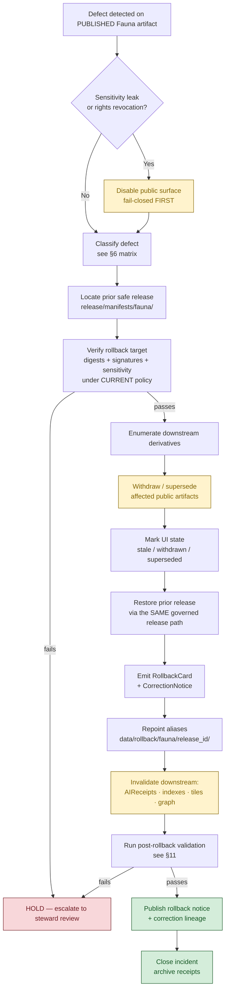

<!-- [KFM_META_BLOCK_V2]
doc_id: kfm://doc/runbooks/fauna/rollback
title: Fauna — Rollback Runbook
type: standard
version: v0.1
status: draft
owners: <Fauna lane steward> + <Release steward> + <Docs steward>
created: 2026-05-13
updated: 2026-05-13
policy_label: public
related:
  - docs/doctrine/lifecycle-law.md
  - docs/doctrine/trust-membrane.md
  - docs/domains/fauna/README.md
  - docs/runbooks/release/RELEASE_RUNBOOK.md
  - docs/runbooks/release/CORRECTION_RUNBOOK.md
  - docs/runbooks/fauna/VALIDATION_RUNBOOK.md
  - release/rollback_cards/README.md
  - policy/domains/fauna/README.md
  - contracts/release/rollback_card.md
  - schemas/contracts/v1/release/rollback_card.schema.json
tags: [kfm, runbook, fauna, rollback, release, governance]
notes:
  - All file paths in this document are PROPOSED until verified against mounted-repo evidence.
  - The runbook describes governed rollback; it is NOT a hidden-file-copy procedure.
[/KFM_META_BLOCK_V2] -->

# Fauna — Rollback Runbook

> Operate a **governed**, evidence-preserving rollback of a Fauna release — restoring a prior safe artifact set through the same release path, never through a hidden file move.

<p>
  
  
  
  
  
  
</p>

| Field | Value |
|---|---|
| **Status** | `draft` |
| **Owners** | `<Fauna lane steward>` · `<Release steward>` · `<Docs steward>` *(placeholders — confirm in PR)* |
| **Required co-signers for execution** | Release authority **distinct from** the affected release's original author when materiality applies *(per §24.6 closure rule)* |
| **Last updated** | 2026-05-13 |
| **Authority basis** | Lifecycle law · trust membrane · correction/rollback model · Fauna sensitivity posture |
| **Trigger class** | Failed release · post-publication defect · sensitivity leak · rights revocation · stale-state escalation |

---

## Quick jump

- [1. Scope and audience](#1-scope-and-audience)
- [2. When to invoke this runbook](#2-when-to-invoke-this-runbook)
- [3. Fauna-specific sensitivity posture](#3-fauna-specific-sensitivity-posture)
- [4. Preflight checks](#4-preflight-checks)
- [5. The rollback flow](#5-the-rollback-flow)
- [6. Defect classification — Fauna decision matrix](#6-defect-classification--fauna-decision-matrix)
- [7. Step-by-step procedure](#7-step-by-step-procedure)
- [8. Public-surface disablement details](#8-public-surface-disablement-details)
- [9. RollbackCard, CorrectionNotice, and lineage artifacts](#9-rollbackcard-correctionnotice-and-lineage-artifacts)
- [10. Stale-state and supersession markers](#10-stale-state-and-supersession-markers)
- [11. Post-rollback validation](#11-post-rollback-validation)
- [12. Rollback drill discipline](#12-rollback-drill-discipline)
- [13. Anti-patterns](#13-anti-patterns)
- [14. Affected files and homes](#14-affected-files-and-homes)
- [15. Verification backlog](#15-verification-backlog)
- [16. FAQ](#16-faq)
- [17. Related docs](#17-related-docs)
- [18. Appendix](#18-appendix)

---

## 1. Scope and audience

This runbook governs **rollback** of a published **Fauna** lane artifact — release manifest, layer, catalog record, EvidenceBundle, Focus Mode AI answer set, or generated derivative — back to a prior safe release.

**In scope**

- Fauna releases that touch `Taxon`, `Occurrence Public`, `Occurrence Restricted`, `RangePolygon`, `SeasonalRange`, `MigrationRoute`, `SensitiveSite`, `MortalityObservation`, `DiseaseObservation`, `Invasive Species Record`, `Conservation Status`, and `Redaction Receipt` objects. *(Object families per the Fauna domain dossier.)*
- Public-safe Fauna map layers, generalized occurrence density grids, range/seasonal-range layers, species pages, and Focus Mode answers grounded in released Fauna EvidenceBundles.
- The Fauna pipeline phases **only at and after PUBLISHED** — rollback restores `PUBLISHED → prior PUBLISHED`. Defects detected at `WORK`, `QUARANTINE`, `PROCESSED`, or `CATALOG / TRIPLET` are *gate failures*, not rollbacks; see [`VALIDATION_RUNBOOK.md`](VALIDATION_RUNBOOK.md).

**Out of scope**

- Habitat suitability surfaces, model cards, or habitat patches — owned by the Habitat lane *(per Fauna boundary)*.
- Flora records *(per Fauna boundary)*.
- Adjacent context layers (hydrology, soil, agriculture, roads, settlements, archaeology, people) — those are governed in their own lanes; Fauna's relation to them runs through governed joins only.
- Schema or contract migrations not bound to a specific Fauna release. *(Use a schema-migration ADR + `migrations/rollback/`.)*

**Audience**

- **Primary:** Fauna lane steward, Release steward, operator-on-call.
- **Secondary:** Reviewers, AI/Focus Mode owners (because Fauna AI answers must be invalidated when their evidence is withdrawn), and downstream derivative owners (Habitat–Fauna joins, indexes, tiles).

> [!IMPORTANT]
> **Doctrine — CONFIRMED.** Correction and rollback are *publication requirements*, not afterthoughts. A released Fauna claim, layer, or answer is only "safely published" if its **correction path and rollback target** are already in place. This runbook codifies the rollback half of that obligation.

[Back to top](#fauna--rollback-runbook)

---

## 2. When to invoke this runbook

Invoke when **any** of the following is true *for a currently-PUBLISHED Fauna artifact*:

| Trigger | Severity floor | Example (illustrative) |
|---|---|---|
| **Sensitivity leak** — exact sensitive-taxon geometry, nest/den/roost/hibernacula/spawning location, or restricted-occurrence row reached a public surface | **Critical — fail-closed; disable immediately** | Public tile reveals exact nest coordinate that should have been generalized through a geoprivacy transform. |
| **Rights revocation / change** | High | Steward source rescinds redistribution permission on an occurrence dataset already in `data/published/layers/fauna/`. |
| **Evidence defect** — `EvidenceRef` no longer resolves to a valid `EvidenceBundle`; uncited claim leaked to a public answer | High | Focus Mode ANSWER cites a withdrawn observation; cite-or-abstain posture is violated. |
| **Geometry defect** — exact-vs-generalized confusion, CRS error, or topology corruption | Medium–High | A released `RangePolygon` was rebuilt against the wrong `GeographyVersion`. |
| **Temporal defect** — `observed`, `valid`, `retrieval`, `release`, or `correction` time conflated; stale claim served as current | Medium | Historical occurrence served without a stale-state badge after source freshness expired. |
| **Policy defect** — `PolicyDecision` for a public surface should have been DENY/RESTRICT/ABSTAIN | High | A sensitive-lane DENY rule was bypassed in the most recent release manifest. |
| **AI answer defect** — `AIReceipt` references invalidated or stale Fauna evidence | Medium | Species-page Focus Mode answer cites an EvidenceBundle whose source admission was reversed. |
| **Catalog defect** — `CatalogMatrix` closure broken (orphan artifact, dangling source) | Medium | Public layer manifest references a missing source descriptor. |
| **Release-infrastructure defect** — `RELEASE_MANIFEST_INVALID` or `ROLLBACK_TARGET_MISSING` reason code surfaced after publication | High | Manifest signed off a candidate that no longer validates. |

> [!CAUTION]
> **Sensitive-lane rule — CONFIRMED.** For Fauna sensitivity leaks (sensitive taxa locations, nests, dens, roosts, hibernacula, spawning, or steward-controlled records), public surfaces **MUST be disabled before** the rollback discussion completes — fail closed first, deliberate after. The doctrine is "DENY by default" for unreviewed exact sensitive Fauna locations.

[Back to top](#fauna--rollback-runbook)

---

## 3. Fauna-specific sensitivity posture

Fauna inherits the project-wide rollback doctrine but adds non-negotiable sensitivity rules. Understanding them keeps a rollback from making exposure *worse* — for example, by "restoring" a prior release that itself contained a redaction defect.

**Sensitive geometry classes (CONFIRMED doctrine, PROPOSED enumeration in policy):**

- Exact nest / den / roost / hibernacula / spawning-site coordinates.
- Exact occurrence coordinates for sensitive taxa per Conservation Status and steward determination.
- Steward-controlled records flagged as restricted in the source registry (e.g., KDWP-style heritage records, NatureServe heritage occurrences, USFWS ECOS-restricted listings).
- Telemetry-derived exact location data from agency monitoring, eDNA / acoustic / GPS-collared programs.

**Doctrine on public exposure:**

- Public Fauna products serve **`Occurrence Public`**, generalized density grids, range / seasonal-range polygons, public-safe popups — not **`Occurrence Restricted`** or exact `SensitiveSite` geometry.
- Geoprivacy transforms (generalization, H3 binning, jitter, withholding) **must emit a `RedactionReceipt`** that accompanies any public-safe derivative.
- A rollback that restores a *prior* release MUST re-verify those rollback-target artifacts under **current** sensitivity policy — sensitivity rules may have tightened since the prior release shipped.

[Back to top](#fauna--rollback-runbook)

---

## 4. Preflight checks

Run these before invoking any rollback step. The preflight is a **closure check**, not a formality.

```text
[ ] Defect class identified (see §6 matrix) and recorded with reason code.
[ ] Affected release_id(s) identified — primary and any chained derivatives.
[ ] Prior safe release_id (rollback target) located in release/manifests/.
[ ] Rollback target digests and signatures verified (RELEASE_MANIFEST_INVALID risk).
[ ] Downstream derivatives enumerated:
      - data/published/layers/fauna/* affected
      - tiles / PMTiles / GeoParquet / COG artifacts affected
      - Evidence Drawer payloads referencing the rolled-back EvidenceBundle
      - Focus Mode AIReceipts that resolve through the affected EvidenceBundle
      - graph / triplet projections that depend on the affected catalog record
      - search / vector indexes that ingested the affected artifact
[ ] Sensitivity re-check on the rollback target under CURRENT policy version.
[ ] Rights re-check on the rollback target under CURRENT source descriptor.
[ ] Review state requirement confirmed (sensitive lane → ReviewRecord required).
[ ] Release authority assigned — distinct from original author for material releases.
[ ] Comms plan drafted: who is notified (stewards, downstream consumers, public).
```

> [!NOTE]
> **Universal closure rule — CONFIRMED.** A governed transition (including rollback) is closed only when (i) the required artifacts exist, (ii) every required artifact *resolves* its dependencies (`EvidenceRef → EvidenceBundle`, `source_id → SourceDescriptor`, `model_id → ModelRunReceipt`), and (iii) the policy gate evaluated and recorded its decision. Missing any of these means the rollback **fails closed** and the current public state is preserved.

[Back to top](#fauna--rollback-runbook)

---

## 5. The rollback flow



> [!NOTE]
> **Diagram status — PROPOSED.** The flow encodes CONFIRMED doctrine (correction/rollback model, finite-outcome posture, fail-closed sensitive lanes). Specific step *names* (e.g., "Repoint aliases") map to PROPOSED implementation artifacts (`data/rollback/<domain>/<release_id>/`) per Directory Rules §9.1 and remain `NEEDS VERIFICATION` against the mounted repo.

[Back to top](#fauna--rollback-runbook)

---

## 6. Defect classification — Fauna decision matrix

The defect class determines both the correction *posture* (how the public claim is treated *during* incident handling) and the rollback *posture* (how the prior release is restored). This table specializes the project-wide correction/rollback model for the Fauna lane.

| Defect class | Fauna example | Correction posture | Rollback posture |
|---|---|---|---|
| **Evidence gap** | `Occurrence Public` cites a withdrawn observation; cited `EvidenceBundle` no longer closes | ABSTAIN or withdraw the unsupported claim | Restore prior evidence-supported release |
| **Rights defect** | Steward source rescinds redistribution permission for occurrence dataset | DENY public use; quarantine source/artifact | Withdraw affected artifacts |
| **Sensitivity leak** | Exact nest coordinate exposed in public tile or popup | Redact/generalize and notify stewards | **Immediate public disablement** before restore — verify target under current policy |
| **Geometry defect** | `RangePolygon` rebuilt against wrong `GeographyVersion`; topology corruption | Rebuild derivative layer + Evidence payload | Restore previous digest-pinned artifact |
| **Temporal defect** | Stale `Occurrence Public` served as current; `valid`/`retrieval`/`release` times conflated | Correct valid/source/retrieval/release time | Mark stale until rebuilt |
| **Policy defect** | Sensitive-lane DENY rule bypassed in latest release | Re-run policy and decision envelope | Disable route/layer if gate failed |
| **AI answer defect** | Focus Mode species-page ANSWER cites a now-invalid Fauna EvidenceBundle | Invalidate `AIReceipt` and Runtime Response Envelope | Remove the answer; preserve the EvidenceBundle for audit |
| **Catalog defect** | `CatalogMatrix` orphan in fauna lane; layer manifest references missing source | Re-emit catalog closure after proof repair | Restore previous catalog state |

> [!TIP]
> When a single incident touches multiple defect classes (common when a sensitivity leak is also a rights defect, for example), **apply the strictest posture** in the affected row — escalate to *fail-closed* and let the milder rollback motions follow.

[Back to top](#fauna--rollback-runbook)

---

## 7. Step-by-step procedure

The steps below are written for execution by a Release steward in coordination with the Fauna lane steward. They assume the preflight (§4) has cleared.

### 7.1 Step 1 — Freeze the trust boundary

1. Acquire a rollback lock for the affected `release_id` in `release/promotion_decisions/` (or its repo equivalent). **PROPOSED** mechanism — verify against mounted repo.
2. Pause **all** Fauna promotion candidates queued for the next release.
3. Notify on-call: Fauna lane steward, Release steward, Policy steward, Focus Mode owner (if affected).

### 7.2 Step 2 — Disable affected public surfaces

This is the irreversible-first step for sensitivity / rights / policy defects. For evidence / geometry / temporal / catalog / AI-answer defects, this step still runs but may be *narrower* (a single layer, a single feature, a single AI answer).

| Surface | Disablement action | Owning system |
|---|---|---|
| `apps/governed-api/` Fauna feature lookup endpoint | Return `DENY` (sensitivity / rights / policy) or `ABSTAIN` (evidence / temporal) with reason code; **never silently fall through** | governed API |
| `apps/governed-api/` Fauna `LayerManifest` resolver | Return `DENY` or `ERROR`; remove the affected `layer_id` from the published registry | governed API + `data/registry/layers/` |
| `apps/explorer-web/` Fauna map layers | Removed by manifest, not by style filter (style-only hiding is an anti-pattern) | explorer-web |
| Focus Mode answers grounded in the affected `EvidenceBundle` | Return `ABSTAIN`; invalidate the AIReceipts; do **not** remove the underlying EvidenceBundle (audit) | governed AI |
| Evidence Drawer payloads | Surface lineage break as the abstain/deny reason rather than hiding it | governed API + Evidence Drawer |
| Tiles / PMTiles / GeoParquet / COG | Remove from `MapReleaseManifest`; emit cache-invalidation record with old/new release ids | release + cache layer |
| Search / vector indexes | Mark affected entries withdrawn; re-emit index after rollback completes | search / index workers |
| Graph / triplet projections | Invalidate affected projections; do not delete history | graph workers |

> [!WARNING]
> **Anti-pattern.** Do **not** hide sensitive geometry with a style filter, a popup tweak, or an opacity change. Sensitive geometry must be transformed *before* publication and proven absent from the artifact. Style-only hiding leaves the bytes in the public artifact.

### 7.3 Step 3 — Verify the rollback target under current policy

The prior release is your candidate target. Re-verify it under **today's** sensitivity, rights, schema, geography, and policy versions. The doctrine is explicit: **rollback is not a hidden file copy**.

```text
[ ] release_id locatable in release/manifests/fauna/
[ ] manifest digests and signatures verify
[ ] every EvidenceRef in the manifest resolves to an EvidenceBundle
[ ] every source_id resolves to a current (non-superseded) SourceDescriptor
[ ] sensitivity policy version applied today still permits the rollback target
[ ] rights status on each source is still admissible
[ ] schema versions referenced are not deprecated past tolerance
[ ] GeographyVersion bindings are still valid (not silently superseded)
[ ] review state (if required for sensitive content) is recordable today
```

If any item fails, **HOLD** and escalate to steward review. A failed target is not a rollback candidate; it is the trigger for a new release.

### 7.4 Step 4 — Restore through the governed release path

```text
1. Build the rollback ReleaseManifest by reference (do not copy bytes blindly).
2. Run the release-decision policy gate (it may DENY even on a rollback).
3. Emit a ReleaseManifest update or supersession that points back to the prior release_id.
4. Repoint published aliases via data/rollback/fauna/<release_id>/.
5. Emit a RollbackCard (§9).
6. Emit a CorrectionNotice referencing the defect class and invalidated derivatives (§9).
7. Emit cache-invalidation records for tiles, styles, glyphs, sprites, and PMTiles.
```

### 7.5 Step 5 — Invalidate downstream derivatives

- **AIReceipts:** any answer whose `evidence_refs[]` overlap the rolled-back bundle is invalidated. Preserve the receipt for audit; emit a successor `ABSTAIN` AIReceipt only when the user re-asks.
- **Indexes:** rebuild the search and vector indexes against the restored release. Mark stale window in the index manifest.
- **Tiles / PMTiles / GeoParquet / COG:** rebuild from the restored canonical state via the same governed publish path.
- **Graph / triplet projections:** rebuild the affected projections.
- **Habitat–Fauna joins (cross-lane):** notify the Habitat lane steward; cross-domain derivatives invalidate when either side rolls back.

### 7.6 Step 6 — Mark UI state explicitly

Public consumers must *see* that something changed:

- `stale` badge — claim's underlying evidence aged past tolerance.
- `superseded` badge — replaced by a newer claim with forward link.
- `withdrawn` badge — claim removed; reason provided.
- `correction posted` indicator — CorrectionNotice link surfaced on the species page / map popup / Evidence Drawer.

> [!IMPORTANT]
> **Stale vs wrong — CONFIRMED.** KFM separates `stale` (evidence aged past tolerance) from `wrong` (substantively incorrect). Both have visible markers and traceable lifecycles. The rollback runbook handles `wrong`. The stale-state markers in §10 handle `stale`.

[Back to top](#fauna--rollback-runbook)

---

## 8. Public-surface disablement details

The trust membrane forbids public clients from reaching `RAW`, `WORK`, `QUARANTINE`, canonical / internal stores, graph internals, vector indexes, source APIs, or direct model runtimes. During rollback, the membrane is the *only* place where disablement happens.

### 8.1 governed API outcomes during rollback

| Surface | Outcome during rollback | Forbidden during rollback |
|---|---|---|
| Fauna feature/detail lookup | `DENY` (rights/sensitivity/policy) · `ABSTAIN` (evidence/temporal) · `ERROR` (infra) | `ANSWER` with rolled-back evidence; silent fall-through |
| Fauna `LayerManifest` resolver | `DENY` or `ERROR` for affected layers | Returning a layer that lacks a current `ReleaseManifest` |
| Evidence Drawer payload | `ABSTAIN` or `DENY` with lineage-break reason | Hiding the lineage break |
| Focus Mode (Fauna) | `ABSTAIN` with cite-or-abstain reason | Uncited authoritative claim; falling back to a generic answer |
| Correction submit | `ACCEPTED` (intake only) or `DENY`/`ERROR` | Treating intake as approval |

### 8.2 What clients see

- Public web UI: layers vanish from the registry; popups reroute to a withdrawn-state Evidence Drawer; banner indicates a correction is in progress.
- Focus Mode: `ABSTAIN` envelope with a stable reason code; no fluent paraphrase that smooths over the abstention.
- API consumers: finite outcome from `{ANSWER, ABSTAIN, DENY, ERROR}`; reason codes from the documented enum.

[Back to top](#fauna--rollback-runbook)

---

## 9. RollbackCard, CorrectionNotice, and lineage artifacts

Three artifacts close the rollback. They are the *durable* record of what happened.

### 9.1 RollbackCard (CONFIRMED contract; PROPOSED schema home `schemas/contracts/v1/release/rollback_card.schema.json`)

Illustrative shape — confirm field names against the schema before relying on this for code:

```json
{
  "release_id": "<release_id_being_rolled_back>",
  "rollback_to": "<prior_safe_release_id>",
  "reason": "<defect_class + short narrative>",
  "reason_code": "SENSITIVITY_LEAK | RIGHTS_UNKNOWN | MISSING_EVIDENCE | ROLLBACK_TARGET_MISSING | ...",
  "invalidates": ["<derivative_id_1>", "<derivative_id_2>", "<aireceipt_id>", "..."],
  "review_ref": "<review_record_id>",
  "time": "<ISO-8601 timestamp>"
}
```

**Home:** `release/rollback_cards/` *(per Directory Rules §9.2)*. Alias-revert receipts on the data plane live under `data/rollback/<domain>/<release_id>/` *(per Directory Rules §9.1; ADR pending on whether these collapse)*.

### 9.2 CorrectionNotice (CONFIRMED contract)

```json
{
  "claim_ref": "<published_claim_id_or_release_id>",
  "prior_release_ref": "<previous_release_id>",
  "change_summary": "<short prose; defect class; what changed; user-visible impact>",
  "invalidates": ["<derivative_id_1>", "..."],
  "review_ref": "<review_record_id>",
  "time": "<ISO-8601 timestamp>"
}
```

**Home:** `release/correction_notices/` *(per Directory Rules §9.2)*.

### 9.3 Lineage that MUST be preserved

- The original `ReleaseManifest` is **not deleted**. It is superseded with a forward link to the rollback target and the RollbackCard.
- The original `EvidenceBundle` is **not deleted**. It is retained for audit; a CorrectionNotice records the defect.
- AIReceipts referencing the invalidated answers are **not deleted**. They are retained with cross-reference to any successor receipt. (AIReceipts are never retroactively superseded — a new answer is a new receipt.)
- `RedactionReceipt`s emitted on the rollback target remain in force.

[Back to top](#fauna--rollback-runbook)

---

## 10. Stale-state and supersession markers

Some incidents resolve to `stale` rather than `wrong`. The stale-state markers below are the *non-rollback* path; they coexist with the rollback path in the same UI surfaces.

| Marker | Trigger | UI signal | Required action |
|---|---|---|---|
| Source freshness expired | `SourceDescriptor` cadence passed without re-admission | Stale-source badge in Evidence Drawer | Re-admit, supersede, or mark dependent claims stale |
| Schema version drift | Object schema upgraded past the published claim's version | Schema-drift badge; show migration ADR | Migrate, re-validate, re-release; or mark stale |
| Geography version drift | `GeographyVersion` replaced; published claim still bound to prior | Geography-version banner with prior-version cite | Rebind to current `GeographyVersion`; re-release; or mark stale |
| Time-scope outside support | Claim's temporal scope falls outside current data window | Time-out-of-support indicator | Mark stale; do not refresh silently |
| Model version superseded | `ModelRunReceipt` references an older model | Model-version badge with new model identity | Re-run; supersede; or mark stale |
| Review aged out | `ReviewRecord` older than review-cycle tolerance for the sensitive lane | Review-aged badge | Trigger steward review; potentially downgrade tier |
| Rights status changed | Rights change in `SourceDescriptor` or rights-holder communication | Rights-changed badge | Re-evaluate tier; potentially downgrade; emit `CorrectionNotice` if necessary |
| Policy version changed | Policy referenced by `PolicyDecision` was superseded | Policy-version badge | Re-run gate; potentially supersede release |

> [!TIP]
> If a stale marker repeatedly fires for the same Fauna source — for example, a steward heritage feed whose cadence slips — that is a *governance* signal: open an entry in `docs/registers/VERIFICATION_BACKLOG.md`, not a rollback.

[Back to top](#fauna--rollback-runbook)

---

## 11. Post-rollback validation

After the rollback completes, run the validation set below before closing the incident. These mirror the Fauna tests-and-validators surface and the project-wide rollback-drill discipline.

| Check | Expectation |
|---|---|
| Schema validation | Restored manifest, EvidenceBundles, and layer manifests pass schema validation. |
| Source-descriptor validation | Every restored source resolves to a current, admissible `SourceDescriptor`. |
| Rights validation | Every restored source's redistribution class is still admissible. |
| Sensitivity validation | No `Occurrence Restricted`, exact `SensitiveSite`, or sensitive-taxon exact geometry appears in any public-safe artifact. |
| Evidence closure | Every `EvidenceRef` in restored artifacts resolves to an `EvidenceBundle`. |
| Temporal logic | `observed` / `valid` / `retrieval` / `release` / `correction` times stay distinct where material. |
| Geometry validity | Topology, CRS, generalization receipts hold. |
| Policy deny tests | Sensitive-lane DENY tests still fail closed. |
| Citation validation | Focus Mode answers grounded on restored evidence pass citation validation; otherwise ABSTAIN. |
| Release-manifest validation | Restored `ReleaseManifest` validates and names a *new* rollback target for itself. |
| Cache invalidation recorded | Old/new release ids and artifact digests captured in the invalidation record. |
| No-network fixtures | Synthetic Fauna fixtures regression-pass against the restored release. |
| Non-regression | Prior lineage tests still pass; downstream cross-lane joins (Habitat–Fauna) recompute. |

A rollback whose restored release lacks its own forward rollback target is **not done**. Every PUBLISHED release names a rollback target — including releases that *are themselves* rollbacks.

[Back to top](#fauna--rollback-runbook)

---

## 12. Rollback drill discipline

> [!IMPORTANT]
> **Doctrine — CONFIRMED.** "Rollback untested is not reliable." Every Fauna release MUST be associated with a `RollbackCard` and a rehearsed drill, not just a written procedure.

The Fauna lane should rehearse rollback at least once per release window (cadence PROPOSED — confirm with Release steward). A drill is a *production-shaped* exercise, run against the synthetic / no-network Fauna fixture set, that:

1. Picks an existing PUBLISHED release.
2. Simulates one defect class from §6.
3. Executes §7 end-to-end on the fixture release path.
4. Confirms public surfaces moved to fail-closed outcomes within budget.
5. Confirms downstream derivative invalidation fires.
6. Confirms a RollbackCard, CorrectionNotice, and cache-invalidation record are emitted and validate.
7. Restores the simulated environment and archives the drill receipt.

Drill receipts live with other receipts. `docs/runbooks/fauna/` is for procedures; drill *records* belong under `data/receipts/` (proposed) or the equivalent fauna-lane receipt path — verify against mounted repo.

[Back to top](#fauna--rollback-runbook)

---

## 13. Anti-patterns

| Anti-pattern | Why it is dangerous | Mitigation |
|---|---|---|
| Hidden file copy | "Restoring" a prior release by `cp`-ing bytes back into `data/published/` bypasses the trust membrane and produces no rollback record. | Always restore through the governed release path; emit a RollbackCard. |
| Style-only hiding of sensitive geometry | The sensitive bytes remain in the public artifact; the leak persists. | Re-publish a generalized derivative; emit a `RedactionReceipt`; remove the offending artifact from the manifest. |
| Silent supersession of evidence | Replacing an `EvidenceBundle` without a `CorrectionNotice` breaks the audit lineage. | Always emit a CorrectionNotice; retain the prior bundle for audit. |
| Rolling back without re-verifying the target under current policy | A prior release may have shipped under a now-deprecated sensitivity rule; restoring it re-creates the leak. | Run §7.3 every time. |
| Treating tiles, popup payloads, or AI text as proof | Tiles and AI text are *carriers*; they don't supersede the EvidenceBundle. | Anchor every claim to its `EvidenceBundle`; abstain when the bundle is invalid. |
| Forgetting AI invalidation | Focus Mode keeps answering with stale citations because AIReceipts weren't invalidated. | Step 7.5 invalidates every AIReceipt whose `evidence_refs[]` overlap the rolled-back bundle. |
| Forgetting cross-lane impact | Habitat–Fauna joins continue to depend on a withdrawn occurrence layer. | Notify the Habitat lane; invalidate cross-lane derivatives. |
| Closing the incident before the rollback target has its own rollback target | The next failure has nowhere to go. | Re-verify that the *restored* release names a valid rollback target in its manifest. |

[Back to top](#fauna--rollback-runbook)

---

## 14. Affected files and homes

> [!NOTE]
> **Directory Rules basis.** The paths below follow Directory Rules §3 (responsibility roots), §9 (data and release), §12 (Domain Placement Law). Each path is **PROPOSED** until verified against mounted-repo evidence. Confirm before action.

| Path / family | Role | Truth label |
|---|---|---|
| `docs/runbooks/fauna/ROLLBACK_RUNBOOK.md` | This document | PROPOSED |
| `docs/runbooks/release/RELEASE_RUNBOOK.md` | Sibling release runbook | PROPOSED |
| `docs/runbooks/release/CORRECTION_RUNBOOK.md` | Sibling correction runbook | PROPOSED |
| `docs/domains/fauna/README.md` | Fauna lane dossier | PROPOSED |
| `release/manifests/<release_id>/` | `ReleaseManifest` artifacts | PROPOSED |
| `release/rollback_cards/<release_id>/` | `RollbackCard` artifacts | PROPOSED |
| `release/correction_notices/<release_id>/` | `CorrectionNotice` artifacts | PROPOSED |
| `release/withdrawal_notices/<release_id>/` | Withdrawal records | PROPOSED |
| `data/rollback/fauna/<release_id>/` | Alias-revert receipts (data plane) | PROPOSED |
| `data/published/layers/fauna/` | Released Fauna public-safe layers | PROPOSED |
| `data/registry/sources/fauna/` | Fauna source descriptors | PROPOSED |
| `data/registry/sensitivity/` | Sensitivity classes & redaction rules | PROPOSED |
| `policy/domains/fauna/` | Fauna policy bundles & sensitivity rules | PROPOSED |
| `policy/sensitivity/` | Cross-domain sensitivity rules | PROPOSED |
| `contracts/release/rollback_card.md` | RollbackCard semantic contract | PROPOSED |
| `schemas/contracts/v1/release/rollback_card.schema.json` | RollbackCard machine schema | PROPOSED (per ADR-0001) |
| `apps/governed-api/` | Trust membrane — emits finite outcomes during rollback | PROPOSED |
| `tests/domains/fauna/` | Fauna lane tests, including rollback-drill replay | PROPOSED |
| `tests/runtime_proof/` | Finite-outcome and abstain proof | PROPOSED |
| `fixtures/domains/fauna/` *or* `tests/fixtures/domains/fauna/` | No-network Fauna fixtures for drills | PROPOSED — single home per Directory Rules §6.6 |

> [!WARNING]
> **Convention question — NEEDS VERIFICATION.** Prior expansion reports propose a *flat* `docs/runbooks/<subsystem>_<TYPE>.md` pattern (e.g., `ui_ROLLBACK.md`, `governed_ai_ROLLBACK.md`). This file uses the *lane-subdirectory* pattern `docs/runbooks/fauna/ROLLBACK_RUNBOOK.md` consistent with Domain Placement Law §12. Both are PROPOSED until mounted-repo evidence or an ADR pins one form. If the flat pattern is canonical, this file's logical successor is `docs/runbooks/fauna_ROLLBACK.md`. A drift entry in `docs/registers/DRIFT_REGISTER.md` is recommended either way.

[Back to top](#fauna--rollback-runbook)

---

## 15. Verification backlog

Items that this runbook can describe doctrinally but cannot confirm without mounted-repo evidence. Each item names the evidence that would settle it.

| Item to verify | Evidence that would settle it | Status |
|---|---|---|
| `docs/runbooks/` convention (flat vs lane-subdirectory) | Mounted repo `docs/runbooks/` listing; ADR | NEEDS VERIFICATION |
| RollbackCard schema field names and casing | `schemas/contracts/v1/release/rollback_card.schema.json` | NEEDS VERIFICATION |
| Reason-code enum for rollback outcomes | `policy/release/` or governed-API contract | NEEDS VERIFICATION |
| Fauna source registry and steward roles | `data/registry/sources/fauna/`; source descriptors | NEEDS VERIFICATION |
| Fauna sensitivity policy text and geoprivacy transform rules | `policy/domains/fauna/`; `policy/sensitivity/` | NEEDS VERIFICATION |
| Public/Restricted occurrence split implementation | Validators in `tools/validators/`; tests in `tests/domains/fauna/` | NEEDS VERIFICATION |
| Cache-invalidation record schema for tiles/PMTiles/glyphs | Renderer / release contracts | NEEDS VERIFICATION |
| Cross-lane invalidation API (Habitat–Fauna) | governed-API surface; test fixtures | NEEDS VERIFICATION |
| Rollback drill cadence | Release steward governance | UNKNOWN |
| Whether `data/rollback/fauna/` and `release/rollback_cards/` coexist or collapse | ADR (per Directory Rules §18 open question) | NEEDS VERIFICATION |

[Back to top](#fauna--rollback-runbook)

---

## 16. FAQ

**Q. Is a rollback the same as a correction?**
No. A *correction* publishes a superseding release with the defect fixed. A *rollback* restores a prior safe release. Many incidents involve both — restore the prior release (rollback) while authoring a corrected next release (correction). Both emit their own records.

**Q. Can a rollback delete the bad release?**
No. The bad release is preserved as superseded. Rollback preserves history; it does not silently rewrite it.

**Q. The defect is in a Focus Mode answer, not in the underlying evidence. Do I still need a release rollback?**
Often no. Invalidate the affected `AIReceipt`s and emit a CorrectionNotice on the *answer set*. The underlying `EvidenceBundle` and `ReleaseManifest` stay put. A release rollback is needed only if the evidence itself is at fault.

**Q. What if the prior release fails the §7.3 re-verification?**
HOLD. Escalate to steward review. The prior release is not a candidate; the path forward is a new corrected release.

**Q. Are cross-lane derivatives (Habitat–Fauna joins) the Fauna runbook's responsibility?**
Fauna *notifies* the Habitat lane and lists affected joins in the RollbackCard `invalidates[]`. The Habitat lane runs its own invalidation for its derivatives.

**Q. Does a rollback affect the Fauna pipeline lanes (RAW / WORK / QUARANTINE / PROCESSED / CATALOG / TRIPLET)?**
No directly — rollback restores `PUBLISHED → prior PUBLISHED`. Upstream phases may run *new* validation/promotion in the wake of the rollback, but the rollback itself does not move bytes between upstream phases.

**Q. Is the runbook itself versioned?**
Yes — see the KFM Meta Block at the top of the file. Material changes update `version` and `updated`.

[Back to top](#fauna--rollback-runbook)

---

## 17. Related docs

- [`docs/doctrine/lifecycle-law.md`](../../doctrine/lifecycle-law.md) — RAW → WORK / QUARANTINE → PROCESSED → CATALOG / TRIPLET → PUBLISHED, and promotion as state transition. *(target PROPOSED)*
- [`docs/doctrine/trust-membrane.md`](../../doctrine/trust-membrane.md) — what the public path is allowed to touch. *(target PROPOSED)*
- [`docs/doctrine/directory-rules.md`](../../doctrine/directory-rules.md) — placement, §9 (data + release), §12 (Domain Placement Law). *(target PROPOSED)*
- [`docs/domains/fauna/README.md`](../../domains/fauna/README.md) — Fauna lane dossier, source families, sensitivity posture. *(target PROPOSED)*
- [`docs/runbooks/release/RELEASE_RUNBOOK.md`](../release/RELEASE_RUNBOOK.md) — sibling: how releases are made. *(target PROPOSED)*
- [`docs/runbooks/release/CORRECTION_RUNBOOK.md`](../release/CORRECTION_RUNBOOK.md) — sibling: how corrections are issued. *(target PROPOSED)*
- [`docs/runbooks/fauna/VALIDATION_RUNBOOK.md`](VALIDATION_RUNBOOK.md) — sibling: how pre-release Fauna validation runs. *(target PROPOSED)*
- [`docs/registers/DRIFT_REGISTER.md`](../../registers/DRIFT_REGISTER.md) — record convention drift here, not in new doctrine. *(target PROPOSED)*
- [`docs/registers/VERIFICATION_BACKLOG.md`](../../registers/VERIFICATION_BACKLOG.md) — open items needing mounted-repo evidence. *(target PROPOSED)*
- [`docs/adr/`](../../adr/) — ADRs that pin file homes, schema homes, and boundary decisions. *(target PROPOSED)*

[Back to top](#fauna--rollback-runbook)

---

## 18. Appendix

<details>
<summary><strong>A. Mapping of project-wide doctrine to Fauna rollback steps</strong></summary>

| Doctrine source (citation) | Doctrine statement | Where it appears in this runbook |
|---|---|---|
| Correction & rollback model | Released claims must have a visible correction path and rollback target before publication. | §1 IMPORTANT callout; §11 final paragraph |
| Universal closure rules | Transition is closed only when artifacts exist, dependencies resolve, and the policy gate evaluated. | §4 preflight; §7.3 re-verification |
| Trust membrane | Public clients touch only governed APIs. | §8 |
| Sensitive-lane fail-closed | Sensitive Fauna lanes default DENY. | §2 CAUTION; §3; §7.2 |
| Stale vs wrong | Stale and wrong are different lifecycles. | §7.6 IMPORTANT; §10 |
| Finite outcomes | Every governed surface returns from `{ANSWER, ABSTAIN, DENY, ERROR}` (plus validator `PASS`/`FAIL` and release `HOLD`). | §8.1 |
| Receipts ↔ phase mapping | RollbackCard and CorrectionNotice are CATALOG and PUBLISHED phase artifacts. | §9 |
| Rollback drill | "Rollback untested is not reliable." | §12 |

</details>

<details>
<summary><strong>B. Rollback reason codes (PROPOSED enumeration — confirm against policy bundle)</strong></summary>

| Reason code | Family | Typical trigger |
|---|---|---|
| `SENSITIVITY_LEAK` | Sensitivity | Exact sensitive-taxon geometry on public surface |
| `RIGHTS_UNKNOWN` | Rights | Source redistribution permission unresolved or revoked |
| `RIGHTS_REVOKED` | Rights | Steward source rescinded permission |
| `MISSING_EVIDENCE` | Evidence | `EvidenceRef` no longer resolves |
| `EVIDENCE_INVALIDATED` | Evidence | EvidenceBundle superseded for cause |
| `SCHEMA_MISMATCH` | Schema | Object validates against deprecated schema |
| `CONTRACT_DRIFT` | Contract | Field semantics changed without ADR |
| `GEOGRAPHY_VERSION_DRIFT` | Geometry | Released claim bound to prior `GeographyVersion` |
| `TEMPORAL_DEFECT` | Temporal | Time fields conflated or out-of-support |
| `POLICY_GATE_BYPASSED` | Policy | DENY rule did not fire when it should have |
| `RELEASE_MANIFEST_INVALID` | Release | Manifest references missing or invalid artifacts |
| `ROLLBACK_TARGET_MISSING` | Release | No safe prior release exists |
| `AI_ANSWER_INVALIDATED` | AI | AIReceipt's evidence refs no longer hold |
| `CATALOG_CLOSURE_BROKEN` | Catalog | Orphan or dangling artifact in CatalogMatrix |
| `ROLE_COLLAPSE` | Source role | Authoritative role downcast into observation, etc. |
| `REVIEW_INSUFFICIENT` | Review | ReviewRecord lacks required reviewer separation |

</details>

<details>
<summary><strong>C. Fauna sensitivity classes (illustrative, not exhaustive)</strong></summary>

Sensitivity classes that Fauna releases must respect under current policy. Confirm against `policy/domains/fauna/` and `policy/sensitivity/` before relying on this list operationally.

- Exact nest, den, roost, hibernacula, and spawning-site coordinates.
- Exact occurrence coordinates for taxa above a conservation-status threshold.
- Steward-restricted heritage occurrences.
- Telemetry-derived exact location data (collar, acoustic, eDNA, camera, transmitter).
- Pre-publication mortality and disease observations whose disclosure could compromise enforcement.
- Locations of active surveys / monitoring programs whose disclosure could compromise the survey.

For each class, the public-safe path is: generalization (H3 / grid / polygon), withholding, or denial — accompanied by a `RedactionReceipt`.

</details>

<details>
<summary><strong>D. Glossary (Fauna-specific terms used here)</strong></summary>

- **Taxon / Taxon Crosswalk** — animal taxonomic identity and cross-source mapping.
- **Occurrence Public / Occurrence Restricted** — the public-safe and steward-controlled occurrence splits.
- **SensitiveSite** — nest / den / roost / hibernacula / spawning / steward-restricted point or polygon.
- **RangePolygon / SeasonalRange / MigrationRoute** — derived spatial-temporal range objects.
- **Conservation Status** — legal or scientific status assignment, with source role distinguishing legal vs scientific.
- **MortalityObservation / DiseaseObservation** — incident-class observations carrying their own sensitivity considerations.
- **InvasiveSpeciesRecord** — observation/management record for invasive taxa.
- **Redaction Receipt** — proof object that a geoprivacy transform was applied.
- **Geoprivacy transform** — the public-safe operation (generalization, jitter, withholding) applied to sensitive geometry.
- **Public-safe derivative** — the released artifact resulting from a geoprivacy transform.

</details>

[Back to top](#fauna--rollback-runbook)

---

**Related docs:** [Lifecycle law](../../doctrine/lifecycle-law.md) · [Trust membrane](../../doctrine/trust-membrane.md) · [Directory rules](../../doctrine/directory-rules.md) · [Fauna lane dossier](../../domains/fauna/README.md) · [Release runbook](../release/RELEASE_RUNBOOK.md) · [Correction runbook](../release/CORRECTION_RUNBOOK.md) *(targets PROPOSED)*

**Last updated:** 2026-05-13 · **Version:** v0.1 · **Doc id:** `kfm://doc/runbooks/fauna/rollback`

[↑ Back to top](#fauna--rollback-runbook)
