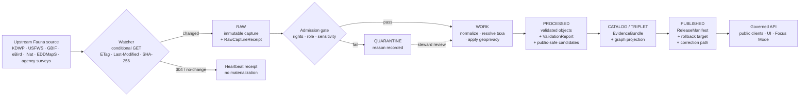
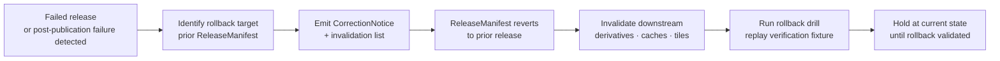

<!-- [KFM_META_BLOCK_V2]
doc_id: kfm://doc/runbook-fauna-source-refresh
title: Fauna — Source Refresh Runbook
type: standard
version: v0.1
status: draft
owners: Docs steward + Fauna lane owner + Release manager
created: 2026-05-13
updated: 2026-05-13
policy_label: public
related:
  - docs/doctrine/directory-rules.md
  - docs/doctrine/lifecycle-law.md
  - docs/doctrine/truth-posture.md
  - docs/doctrine/trust-membrane.md
  - docs/domains/fauna/README.md            # NEEDS VERIFICATION
  - docs/sources/SOURCE_DESCRIPTOR_STANDARD.md  # NEEDS VERIFICATION
  - docs/runbooks/event-driven-ingest.md    # NEEDS VERIFICATION
  - docs/architecture/governed-api.md
  - docs/adr/ADR-0001-schema-home.md
tags: [kfm, runbook, fauna, ingestion, source-refresh, governed-pipeline]
notes:
  - Path uses a fauna/ subfolder; flat-prefix runbook naming (e.g. fauna_SOURCE_REFRESH.md) also appears in expansion-report proposals. PROPOSED placement; reconcile via local docs/runbooks/README.md or ADR.
  - All implementation references (paths, scripts, schemas) remain PROPOSED until verified against mounted repo evidence.
[/KFM_META_BLOCK_V2] -->

# 🦌 Fauna — Source Refresh Runbook

Operational procedure for re-running a Fauna source through the governed lifecycle — from watcher tick to released public-safe surface — without bypassing evidence, rights, sensitivity, review, or rollback controls.

[](#)
[](#)
[](#)
[](#)
[](#)
[](#)
[](#)

| Status | Owners | Last updated |
|---|---|---|
| **Draft** — doctrine surface only; implementation paths PROPOSED | Docs steward · Fauna lane owner · Release manager | 2026-05-13 |

---

## Quick jump

1. [Purpose & scope](#1-purpose--scope)
2. [When to use this runbook](#2-when-to-use-this-runbook)
3. [Preconditions](#3-preconditions)
4. [Pipeline overview](#4-pipeline-overview)
5. [Step 1 — Watcher tick & RAW capture](#5-step-1--watcher-tick--raw-capture)
6. [Step 2 — WORK / QUARANTINE](#6-step-2--work--quarantine)
7. [Step 3 — PROCESSED](#7-step-3--processed)
8. [Step 4 — CATALOG / TRIPLET](#8-step-4--catalog--triplet)
9. [Step 5 — PUBLISHED](#9-step-5--published)
10. [Fauna source families](#10-fauna-source-families)
11. [Sensitivity & geoprivacy gates](#11-sensitivity--geoprivacy-gates)
12. [Gate failure reason codes](#12-gate-failure-reason-codes)
13. [Stale-state markers](#13-stale-state-markers)
14. [Rollback path](#14-rollback-path)
15. [Verification checklist](#15-verification-checklist)
16. [Open questions](#16-open-questions)
17. [Related docs](#17-related-docs)

---

## 1. Purpose & scope

This runbook governs **how a Fauna source is refreshed** — periodic or event-driven re-ingestion of an upstream feed (federal authority, state steward, aggregator, observation network, monitoring program, or context layer) through the KFM lifecycle. It is the procedural counterpart to the Fauna domain dossier and the lifecycle law.

**In scope.**

- A single Fauna source's refresh cycle, end to end.
- The artifacts, receipts, gates, and review states required at each phase.
- The deny-by-default posture for sensitive Fauna content.
- The rollback and correction path when a refresh causes regression.

**Out of scope.**

- Initial onboarding of a new Fauna source. _(See: `docs/sources/SOURCE_DESCRIPTOR_STANDARD.md` — **NEEDS VERIFICATION**.)_
- Cross-domain joins (Fauna × Habitat × Hydrology). Joins inherit the strictest sensitivity tier and run under separate join-policy review.
- Steward review console procedures. _(See: `docs/architecture/review/` — **NEEDS VERIFICATION**.)_
- AI / Focus Mode answering against Fauna evidence. _(See: `docs/architecture/governed-ai/` — **NEEDS VERIFICATION**.)_

> [!IMPORTANT]
> **Doctrine is CONFIRMED; implementation is PROPOSED.** The lifecycle, source-role discipline, sensitivity posture, and gate vocabulary in this runbook are anchored in KFM doctrine. Concrete paths, script names, schema URIs, and CI workflow names referenced below are **PROPOSED** until verified against mounted-repo evidence. Treat any specific path as a placeholder that a reviewer must check.

---

## 2. When to use this runbook

| Trigger | Cadence | Entry point |
|---|---|---|
| **Scheduled poll** — source descriptor declares a refresh cadence (daily, weekly, monthly, source-vintage). | Per descriptor | Step 1 |
| **Event notification** — KFM-controlled object-store event or partner-granted subscription fires. _(See: `docs/runbooks/event-driven-ingest.md` — **NEEDS VERIFICATION**.)_ | On event | Step 1 |
| **Manual re-run** — steward triggers a refresh to re-check a previously quarantined or stale source. | Ad-hoc | Step 1 with `--reason=steward-rerun` |
| **Correction-driven refresh** — a CorrectionNotice references upstream evidence that must be re-fetched and re-validated. | Ad-hoc | Step 1 with `--reason=correction-followup` |
| **Stale-state recovery** — a freshness/version/review marker has expired and the dependent claim must be re-bound or marked stale. | Ad-hoc | Step 2 (re-normalize against current schema/policy) |

This runbook does **not** apply to:

- Manual file drops into `data/raw/` without a SourceDescriptor — those are quarantined on sight.
- First-time activation of a wildlife source — go through onboarding first.
- Emergency takedown — go to [Rollback path](#14-rollback-path) directly.

---

## 3. Preconditions

Before any refresh step runs, **all** of the following must hold. Missing any one fails the refresh closed at admission.

```text
[ ] SourceDescriptor exists for this source_id under data/registry/sources/fauna/   # PROPOSED path
[ ] SourceDescriptor declares: source role, rights status, sensitivity class,
    update cadence, retrieval plan, citation guidance, and current terms
[ ] Source role is one of: authority | observation | context | model
[ ] Rights status is resolved (not "unknown")
[ ] Sensitivity tier is assigned (no taxon escapes classification)
[ ] Schema-home reference points to schemas/contracts/v1/domains/fauna/   # per ADR-0001
[ ] A prior ReleaseManifest exists if this source has ever been published
    (this becomes the rollback target candidate)
[ ] No active policy/rights/sensitivity supersession block on this source
```

> [!CAUTION]
> **Unknown rights, unresolved source role, missing evidence, unresolved sensitivity, or absent release state blocks public promotion.** This is invariant. A refresh may still run to RAW/WORK for steward review, but **must not** advance past PROCESSED without resolution. Quarantine is not a publishable staging area.

---

## 4. Pipeline overview

The Fauna refresh follows the KFM lifecycle invariant. **Promotion between phases is a governed state transition, not a file move.**



**Closure rule (CONFIRMED doctrine).** A transition is closed only when (i) the required artifacts exist, (ii) every reference resolves to its target (`EvidenceRef → EvidenceBundle`, `source_id → SourceDescriptor`, `model_id → ModelRunReceipt`), and (iii) the policy gate evaluated and recorded its decision. Missing any element means the transition fails closed and the prior state is preserved.

[⬆ Back to top](#-fauna--source-refresh-runbook)

---

## 5. Step 1 — Watcher tick & RAW capture

**Goal.** Detect whether the upstream Fauna source has changed and, if it has, capture the new payload immutably with full provenance.

### 5.1 Conditional fetch (CONFIRMED pattern)

The watcher MUST issue a conditional request before downloading bytes. The pattern is uniform across watcher types (`stac`, `gtfs`, `tile`, `file`, `api`):

```text
HEAD upstream_url
  → compare ETag / Last-Modified against the recorded validators
  → 304 (no change)  : emit heartbeat receipt; STOP
  → changed          : GET upstream_url
                       → verify SHA-256 against publisher manifest if available
                       → write bytes to data/raw/fauna/<source_id>/<run_id>/   # PROPOSED path
                       → emit RawCaptureReceipt + RunReceipt
```

> [!TIP]
> **Heartbeats are first-class.** A 304 / no-change response MUST still emit a heartbeat receipt so auditors can see that the system polled and elected not to act. No-change polls **must not** create new STAC/DCAT/PROV entities or trigger cache invalidation downstream.

### 5.2 RunReceipt — required fields

`RunReceipt` is the run-level evidence object. The Master MapLibre reference enumerates the canonical fields; the Fauna refresh emits one per watcher tick.

| Field | Purpose |
|---|---|
| `run_id` | Deterministic ID derived from `spec_hash + inputs_hash`. Retries are idempotent. |
| `source_id` | Resolves to a `SourceDescriptor`. |
| `source_url` | The exact URL fetched (or `null` if 304). |
| `http_validators` | `{ etag, last_modified, status_code, fetched_at }`. Lets auditors replay the conditional request. |
| `spec_hash` | `sha256` over the JCS-canonicalized spec portion of the delta manifest. Same evidence ⇒ same hash. |
| `artifacts` | List of `{ path, sha256, bytes, kind }` for what landed in RAW. |
| `provider` | Provider identity for downstream policy gates. |
| `timestamps` | `source`, `observed`, `retrieval` — kept distinct. |
| `outcome` | `ANSWER` / `ABSTAIN` / `DENY` / `ERROR` (here: typically `ANSWER` for fetched, `ABSTAIN` for 304). |
| `reason_code` | Required on non-`ANSWER` outcomes. |

> [!NOTE]
> **Run ID derivation** is `spec_hash + inputs_hash` so a retried watcher tick appends evidence under the **same** run_id rather than creating a parallel run. The audit ledger stays monotonic.

### 5.3 Admission gate

Before bytes are considered "RAW-admitted," the admission gate evaluates:

```text
admission_gate(SourceDescriptor, RawCaptureReceipt) → ALLOW | RESTRICT | DENY | ABSTAIN | ERROR
  ALLOW    → file enters data/raw/fauna/<source_id>/<run_id>/
  RESTRICT → file enters data/raw/, gated to steward-only downstream
  DENY     → file moves to data/quarantine/fauna/<source_id>/<run_id>/  with reason_code
  ABSTAIN  → file held pending review; runbook stops here
  ERROR    → operational failure; not a release decision
```

**Connectors MUST NOT** publish, mutate canonical truth, or write under `data/processed/`, `data/catalog/`, or `data/published/`. This is the watcher-as-non-publisher invariant.

[⬆ Back to top](#-fauna--source-refresh-runbook)

---

## 6. Step 2 — WORK / QUARANTINE

**Goal.** Normalize schema, geometry, time, identity, evidence, rights, and sensitivity. Hold every failure in a structured way.

### 6.1 Required transforms

| Transform | What it does | Failure ⇒ |
|---|---|---|
| **Schema normalization** | Map upstream fields to the Fauna canonical schema under `schemas/contracts/v1/domains/fauna/` (PROPOSED). | `SCHEMA_MISMATCH` |
| **Geometry validation** | CRS, validity, bounds, geometry type per source role. | Quarantine with reason |
| **Temporal resolution** | Distinguish `source`, `observed`, `valid`, `retrieval` times. Sentinel `null` is acceptable; collapse is not. | `ABSTAIN` downstream if material temporal scope is missing |
| **Taxonomic resolution** | Resolve to canonical Taxon via the project's anchor taxonomy. Record ambiguity. | `ABSTAIN` on ambiguous identity; never silently coerce |
| **Identity assignment** | Compute deterministic ID: `source id + object role + temporal scope + normalized digest`. | Quarantine |
| **Rights & source-role check** | Re-verify against current `SourceDescriptor`. Source role must not be upcast (observation ↛ authority). | `RIGHTS_UNKNOWN` / `ROLE_COLLAPSE` / `ROLE_DOWNCAST_FORBIDDEN` |
| **Sensitivity classification** | Tag every record with its sensitivity tier. | `SENSITIVITY_UNRESOLVED` |
| **Geoprivacy transform (sensitive only)** | Apply the configured public-safe transform; emit a `RedactionReceipt`. | See [§11](#11-sensitivity--geoprivacy-gates) |

### 6.2 Geoprivacy transforms (sensitive Fauna)

For taxa classified sensitive (rare, listed, steward-controlled), the **exact** geometry never leaves WORK. Public-safe candidates are derived from one or more of:

- **Grid generalization.** Snap to square (`ST_SnapToGrid`) or hex (H3) cells of size `cell_m`. Cell size is per-tier and recorded in the `RedactionReceipt`.
- **Seeded deterministic jitter.** PRNG seeded by `spec_hash + occurrence_id` so the same record always receives the same offset. Random-each-render jitter is forbidden — it would be temporally triangulable.
- **Suppression / centroid.** For lowest-density cells where even a coarse grid narrows location, fall back to a county/HUC centroid or full suppression.
- **DP for aggregates only.** Differential privacy is applied to **aggregate** outputs (count heatmaps, richness grids), never to raw points. Epsilon and delta are recorded in receipts.

> [!WARNING]
> **Exact sensitive locations are fail-closed.** Nests, dens, roosts, hibernacula, spawning sites, and steward-controlled records are denied at the public surface unless a documented geoprivacy transform **and** a current review state explicitly allow release. Public exact-occurrence tiles for sensitive taxa are denied.

### 6.3 Quarantine vs. work — the split

```text
WORK         → record normalized cleanly, validators pass, policy allows;
                proceed to PROCESSED.
QUARANTINE   → any transform or gate failed; quarantine reason recorded;
                held for steward triage. NOT a publishable staging area.
```

A quarantined record may re-enter WORK after the underlying issue is fixed (descriptor update, rights resolution, schema migration, geoprivacy profile selection). Re-entry generates a fresh `RunReceipt` linked to the original via `predecessor_run_id`.

[⬆ Back to top](#-fauna--source-refresh-runbook)

---

## 7. Step 3 — PROCESSED

**Goal.** Emit validated normalized Fauna objects, their receipts, and public-safe candidates.

### 7.1 Emission set

| Object | Role at PROCESSED |
|---|---|
| `Taxon`, `Taxon Crosswalk`, `ConservationStatus` | Reference data normalized to canonical taxonomy. |
| `OccurrenceEvidence` (restricted) | Exact geometry, full attributes. Steward-only downstream. |
| `OccurrenceEvidence` (public-safe candidate) | Generalized geometry per the chosen transform. Public path candidate. |
| `RangePolygon`, `SeasonalRange`, `MigrationRoute` | Range artifacts at their published precision. |
| `SensitiveSite`, `NestDenRoostSpawningSite` | Restricted; **never** appear in a public-safe candidate. |
| `MortalityObservation`, `DiseaseObservation`, `InvasiveSpeciesRecord` | Per source role and sensitivity. |
| `AbundanceIndicator`, `RichnessIndicator` | Aggregate derivatives (DP-eligible). |
| `RedactionReceipt` | One per redacted record. |
| `ValidationReport` | Run-level validator outcomes. |
| `EvidenceRef` (per claim) | Stable reference; must later resolve to an `EvidenceBundle`. |

### 7.2 Gate to advance

```text
PROCESSED → CATALOG closure:
  [ ] EvidenceRef exists for every public-safe claim
  [ ] ValidationReport closure: all validators ran; failures triaged
  [ ] Digest closure: every artifact's sha256 is recorded
  [ ] Geoprivacy receipts present for every redacted record
  [ ] Source-role mismatch tests pass (negative fixtures)
  [ ] Citation validation passes for any AI-touched draft notes
```

> [!NOTE]
> **Watcher-as-non-publisher.** The worker that runs this step emits receipts and **candidate** decisions only. It does **not** write to `data/catalog/` or `data/published/`. Promotion to CATALOG is a separate, governed step.

[⬆ Back to top](#-fauna--source-refresh-runbook)

---

## 8. Step 4 — CATALOG / TRIPLET

**Goal.** Bind PROCESSED objects to `EvidenceBundle`s, emit graph/triplet projections, and register release candidates.

### 8.1 Closure requirements

```text
CATALOG closure:
  [ ] Every public-safe candidate resolves EvidenceRef → EvidenceBundle
  [ ] CatalogRecord emitted with source, schema, validation, policy,
      and release metadata
  [ ] Graph/triplet projection built from canonical truth, not from RAW
  [ ] ReviewRecord present if the release tier requires steward review
  [ ] No orphan artifacts (every catalog row has provenance, every
      provenance row has a catalog target)
```

### 8.2 EvidenceBundle — what it carries

An `EvidenceBundle` is the resolved, citable evidence object that any downstream surface (UI Evidence Drawer, Focus Mode answer, public layer) must consume. For Fauna it typically carries:

- `bundle_id`, `spec_hash`, `schema_version`
- `policy_label`, `rights_status`, `sensitivity` (e.g. `public` / `generalize` / `restricted`)
- `source_refs` — list of resolved SourceDescriptor pointers
- `temporal_scope` — keeping `source`, `observed`, `valid`, `retrieval` distinct
- `redaction_receipts[]` — for sensitive records, the public-safe derivation chain
- `review_state` — where required

> [!IMPORTANT]
> **EvidenceBundle outranks generated text.** AI-generated language never becomes evidence. The Fauna Focus Mode answer MUST cite an `EvidenceBundle` or `ABSTAIN`. Uncited authoritative claims fail closed.

[⬆ Back to top](#-fauna--source-refresh-runbook)

---

## 9. Step 5 — PUBLISHED

**Goal.** Serve the refreshed Fauna release through the governed API only.

### 9.1 Promotion requirements

```text
CATALOG → PUBLISHED:
  [ ] ReleaseManifest assembled, listing every released artifact kind
      (pmtiles, stac, geojson, parquet, model, manifest, receipt)
  [ ] Rollback target identified (prior ReleaseManifest)
  [ ] Correction path declared (where corrections will land)
  [ ] Review state present where materiality requires it
  [ ] Policy gate decision recorded
  [ ] Release authority is distinct from the original author where
      materiality applies (separation of duties)
  [ ] Cache invalidation plan recorded (no no-change invalidations)
```

### 9.2 Public exposure rules

| Rule | Why |
|---|---|
| Public clients reach Fauna **only** through `apps/governed-api/`. | Trust membrane — no direct reads from `data/raw|work|quarantine|processed|catalog`. |
| Public Fauna layers expose **public-safe** derivatives only. | Sensitivity invariant — exact sensitive geometry is denied. |
| Each public claim carries an `EvidenceRef`. | Cite-or-abstain posture. |
| Layer manifests declare field allowlists. | Renderer cannot invent truth; sensitive fields stay out of vector tiles. |
| AI Focus Mode reads `PUBLISHED` only. | AI is never root truth and never reads canonical/internal stores. |

### 9.3 PROPOSED governed surfaces

| Surface | DTO / schema | Outcomes | Status |
|---|---|---|---|
| Fauna feature/detail resolver (route TBD) | `FaunaDecisionEnvelope` | `ANSWER` / `ABSTAIN` / `DENY` / `ERROR` | PROPOSED |
| Fauna layer manifest resolver | `LayerManifest` (Fauna layer descriptor) | `ANSWER` / `DENY` / `ERROR` | PROPOSED |
| Fauna Evidence Drawer payload | `EvidenceDrawerPayload` + `EvidenceBundle` projection | `ANSWER` / `ABSTAIN` / `DENY` / `ERROR` | PROPOSED |
| Fauna Focus Mode answer | Runtime Response Envelope + `AIReceipt` | `ANSWER` / `ABSTAIN` / `DENY` / `ERROR` | PROPOSED |

Exact route names, package homes, and DTO field lists remain **UNKNOWN** until verified against mounted-repo evidence.

[⬆ Back to top](#-fauna--source-refresh-runbook)

---

## 10. Fauna source families

The Fauna lane recognizes the following source families. Source role is the primary axis; rights / sensitivity / freshness gates apply to each.

| Source family | Typical role(s) | Rights & sensitivity | Refresh cadence | Status |
|---|---|---|---|---|
| **KDWP-like steward sources** | authority · steward-controlled records | rights & current terms **NEEDS VERIFICATION**; sensitive joins fail closed | Source-vintage / steward-defined | PROPOSED |
| **USFWS ECOS-like federal sources** | authority · regulatory status · critical habitat context | rights & current terms **NEEDS VERIFICATION** | Source-vintage | PROPOSED |
| **NatureServe / heritage-style sources** | authority · conservation status ranking | rights & current terms **NEEDS VERIFICATION**; rank-driven sensitivity tiering | Source-vintage | PROPOSED |
| **GBIF / eBird / iNaturalist / iDigBio / BISON-like aggregators** | observation aggregator | mixed redistribution terms; some restricted-use; sensitive joins fail closed | Daily–monthly per source | PROPOSED |
| **EDDMapS and invasive feeds** | observation · invasive monitoring | rights & current terms **NEEDS VERIFICATION** | Per-source | PROPOSED |
| **Agency monitoring / surveys / eDNA / acoustic / telemetry** | observation · model (when fitted) | telemetry & device feeds need cadence + command boundary | Event-driven or scheduled | PROPOSED |
| **NLCD / NWI / PADUS / SSURGO context layers** | context | downstream support only; never substitute for Fauna truth | Source-vintage | PROPOSED |

> [!CAUTION]
> **Source role cannot be invented or upcast.** An observation aggregator does not become an authority for legal status. A model output does not become an observation. Role collapse and role upcast both fail closed at validation.

<details>
<summary><strong>Per-family refresh notes (PROPOSED operational defaults)</strong></summary>

- **KDWP-like sources.** Run refresh under steward credentials; restricted records remain steward-only; never auto-promote.
- **USFWS ECOS.** Treat listed-species and critical-habitat datasets as `authority` for legal/regulatory status only — not for occurrence claims.
- **NatureServe.** Conservation rank changes drive sensitivity-tier re-evaluation across previously released Fauna claims (potential cascading stale-state).
- **GBIF.** Use the GBIF download API with citation-of-record; record the DOI in `SourceDescriptor`. Apply geoprivacy where the upstream record indicates sensitive taxa.
- **eBird (EBD).** Restricted-use terms limit redistribution. Any KFM release derived from eBird MUST be checked against current EBD terms; an EBD-derivative-release policy is **NEEDS VERIFICATION**.
- **iNaturalist.** Honor the upstream `geoprivacy` field. Do not bypass an upstream "obscured" or "private" classification under any circumstance.
- **EDDMapS / invasive feeds.** Treat as observation; do not promote to authority for regulatory status.
- **Telemetry feeds.** Apply debounce/coalesce windows (5–300 s typical) before materialization; materialize only when `spec_hash` changes.

</details>

[⬆ Back to top](#-fauna--source-refresh-runbook)

---

## 11. Sensitivity & geoprivacy gates

Fauna is one of the highest-sensitivity lanes in KFM. The deny-by-default register is invariant.

| Class | Default outcome | Required controls |
|---|---|---|
| **Rare species — exact taxa occurrence / nest / den / roost / hibernacula / spawning sites** | **DENY** public exact location; generalized public products only | `RedactionReceipt`; steward review where required |
| **Steward-controlled records** | **DENY** public until steward release authorization | `ReviewRecord`; explicit release authority |
| **Sensitive-site geometry** | **DENY** public exact geometry | Generalization profile; verified suppression for low-density cells |
| **Source-rights-limited records** | **DENY** public release until terms resolved | Rights register entry; attribution; no public derivative if barred |
| **Living-person observer identity** (where present in upstream feeds) | **DENY** or restrict per privacy policy | Suppression / aggregation; observer-redaction profile |
| **Sensitive joins** (Fauna × Habitat × Hydrology × People-DNA-Land × Archaeology) | **DENY** until join policy resolved per pair | Cross-lane join policy; steward review |

### Geoprivacy transform — recording the chain

Every public-safe Fauna derivative MUST carry, via its `RedactionReceipt`:

- The profile id (e.g. `fauna-rare-grid-h3@v1`) and its version.
- The transform applied (grid / jitter / suppression / DP aggregate).
- The deterministic seed inputs (where jitter is used).
- The cell size, epsilon, or other parameters.
- A link to the predecessor exact record (steward-only).

> [!WARNING]
> **Jitter alone is not privacy.** Seeded jitter is for display obfuscation, not formal privacy. For rare species, prefer grid generalization or suppression over jitter. If `occurrence_id` is leakable, the seed is guessable — see the open question on seed salting in [§16](#16-open-questions).

[⬆ Back to top](#-fauna--source-refresh-runbook)

---

## 12. Gate failure reason codes

CONFIRMED doctrine, PROPOSED enumeration. Every gate failure MUST attach a reason code. Reason codes drive both auditor narrative and steward triage queues.

| Family | Reason code | Where it fires | Recovery |
|---|---|---|---|
| Missing artifact | `MISSING_RECEIPT` | Normalization / Validation | Re-emit receipt; re-run |
| Missing artifact | `MISSING_EVIDENCE` | Catalog / Release | Resolve `EvidenceRef`; re-bundle |
| Missing artifact | `MISSING_REVIEW` | Catalog / Release | Run required review; supply `ReviewRecord` |
| Schema / contract | `SCHEMA_MISMATCH` | Normalization / Validation | Schema fix or ADR; re-validate |
| Schema / contract | `CONTRACT_DRIFT` | Normalization / Validation | Reconcile contract ↔ schema; re-validate |
| Rights / sensitivity | `RIGHTS_UNKNOWN` | Admission / Validation / Release | Steward review; rights resolution |
| Rights / sensitivity | `SENSITIVITY_UNRESOLVED` | Admission / Validation / Catalog / Release | Tier assignment; transform selection |
| Source role | `ROLE_COLLAPSE` | Validation / Catalog / Release | Restore source-role separation |
| Source role | `ROLE_DOWNCAST_FORBIDDEN` | Validation / Catalog / Release | Refuse upcast; re-classify upstream |
| Review state | `REVIEW_NEEDED` | Catalog / Release | Queue for steward |
| Review state | `REVIEW_INSUFFICIENT` | Catalog / Release | Escalate; supply additional evidence |
| Review state | `REVIEW_REJECTED` | Catalog / Release | Hold at CATALOG; correction path |
| Release infra | `RELEASE_MANIFEST_INVALID` | Release | Manifest fix |
| Release infra | `ROLLBACK_TARGET_MISSING` | Release | Supply rollback target |
| Promotion gate | `invalid_spec_hash` | Release | Re-hash; investigate drift |
| Promotion gate | `unsigned_release_manifest` | Release | Sign before publishing |
| Promotion gate | `missing_run_receipt` | Release | Emit RunReceipt; re-attempt |

The taxonomy of reason codes is intentionally extensible. New codes are added via the drift / verification register, not by silent renaming.

[⬆ Back to top](#-fauna--source-refresh-runbook)

---

## 13. Stale-state markers

KFM separates **stale** from **wrong**. A refresh may resolve a stale-state marker; a correction is required to resolve a wrong claim. The Fauna refresh runbook is concerned chiefly with the markers below.

| Marker | Triggered by | UI signal | Required action |
|---|---|---|---|
| **Source freshness expired** | Cadence in `SourceDescriptor` passed without a new admission | Stale-source badge in Evidence Drawer | Re-admit or supersede; otherwise mark dependent claims stale |
| **Schema version drift** | Object schema upgraded past the published claim's schema version | Schema-drift badge; show migration ADR if any | Migrate, re-validate, re-release; or mark stale |
| **Geography version drift** | `GeographyVersion` replaced; published claim still bound to prior version | Geography-version banner with prior-version cite | Rebind to current version; re-release; or mark stale |
| **Time-scope outside support** | Claim's temporal scope falls outside current data support window | Time-out-of-support indicator | Mark stale; do not refresh silently |
| **Model version superseded** | `ModelRunReceipt` references an older model than current | Model-version badge with new model identity | Re-run; supersede; or mark stale |
| **Review aged out** | `ReviewRecord` older than the review-cycle tolerance for the sensitive lane | Review-aged badge | Trigger steward review; potentially downgrade tier |
| **Rights status changed** | Rights change in `SourceDescriptor` or rights-holder communication | Rights-changed badge | Re-evaluate tier; potentially downgrade; emit `CorrectionNotice` if necessary |
| **Policy version changed** | Policy referenced by `PolicyDecision` was superseded | Policy-version badge | Re-run gate; potentially supersede release |

> [!NOTE]
> A **silent edit** of a published Fauna claim is forbidden. Even staleness gets an announcement.

[⬆ Back to top](#-fauna--source-refresh-runbook)

---

## 14. Rollback path

Rollback is a first-class lifecycle state, not an emergency hack. Every Fauna release MUST be assembled with rollback in mind.



**RollbackCard contents (CONFIRMED doctrine).**

- Pointer to the prior `ReleaseManifest` (the target).
- The list of downstream derivatives (tiles, GeoParquet, graph projections, vector indexes) that must be invalidated.
- The cache-invalidation record (CDN, client cache keys).
- The `CorrectionNotice` if the rollback acknowledges an error in the rolled-back release.
- The replay verification result that proves the prior root hash / manifest restores cleanly.

> [!IMPORTANT]
> **Rollback is tested on every release, not only at failure time.** A release that cannot prove its rollback is not a release. `ROLLBACK_TARGET_MISSING` is a release-gate failure.

[⬆ Back to top](#-fauna--source-refresh-runbook)

---

## 15. Verification checklist

Before declaring a Fauna source refresh complete, work through this checklist. Items marked **NEEDS VERIFICATION** are placeholders for repo-level confirmation.

```text
WATCHER & RAW
[ ] Watcher emitted a RunReceipt (or heartbeat on 304)
[ ] SHA-256 verified where publisher manifest available
[ ] RawCaptureReceipt linked to SourceDescriptor
[ ] No connector wrote outside data/raw/ or data/quarantine/

WORK / QUARANTINE
[ ] Schema, geometry, temporal, taxonomic, rights, sensitivity transforms ran
[ ] Source role neither collapsed nor upcast
[ ] Quarantined records carry reason_code and predecessor link

PROCESSED
[ ] EvidenceRef present for every public-safe claim
[ ] ValidationReport closure achieved
[ ] RedactionReceipt present for every sensitive-derived public-safe record
[ ] No worker wrote to data/catalog/ or data/published/

CATALOG / TRIPLET
[ ] EvidenceBundles assembled; references resolve
[ ] Graph/triplet projection built from canonical truth only
[ ] ReviewRecord present where the tier requires it

PUBLISHED
[ ] ReleaseManifest assembled and signed (per release-signing policy — NEEDS VERIFICATION)
[ ] Rollback target identified and replay verification passed
[ ] Correction path declared
[ ] Cache invalidation plan recorded
[ ] No no-change cache invalidations triggered
[ ] Governed API is the only public surface

CROSS-CUTTING
[ ] Stale-state markers re-evaluated against the refresh
[ ] Fauna-specific tests ran and passed:
    - source-role authority tests
    - taxonomy resolution / ambiguity tests
    - occurrence restricted/public split tests
    - redaction receipt validation
    - tile field allowlist tests
    - Runtime Response Envelope negative cases
[ ] Friday material-change report will pick up the change (NEEDS VERIFICATION)
```

[⬆ Back to top](#-fauna--source-refresh-runbook)

---

## 16. Open questions

The following items are intentionally unresolved in this doc. They block tightening specific gates from PROPOSED to CONFIRMED.

| Item | Why it matters | Resolves via |
|---|---|---|
| Schema home for Fauna under `schemas/contracts/v1/domains/fauna/` | ADR-0001 default applies, but exact files have not been verified | Mounted-repo inspection + ADR if divergent |
| Public-safe geoprivacy profile catalog for Fauna (cell sizes by tier, jitter radii, suppression thresholds) | Drives every redaction at release | `docs/standards/REDACTION_PROFILES.md` (NEEDS VERIFICATION) |
| Seed salting policy for deterministic jitter | If `occurrence_id` is leakable, an unsalted seed is reproducible by third parties | Standards doc + steward decision |
| Cross-lane join policy (Fauna × Habitat × Hydrology × People-DNA-Land × Archaeology) | Joins multiply inference risk | ADR + policy bundle |
| Release-signing & attestation posture (DSSE / cosign / Sigstore / Rekor) | Several proposed artifacts depend on signed manifests | ADR + release runbook |
| Connector cadence & quarantine-recovery policy | Operational doctrine for re-entry from QUARANTINE | ADR + per-connector READMEs |
| Live-connector rights & steward permissions for each Fauna family | Determines whether each source can run live or stays synthetic | Source-by-source rights review |
| Stale-state propagation across Fauna ↔ Habitat ↔ Flora | A NatureServe rank change cascades; propagation rules need to be explicit | ADR + standards doc |
| Friday material-change report integration | Cadence ritual for trust | Reporting workflow (NEEDS VERIFICATION) |
| Path convention for domain runbooks (`docs/runbooks/<domain>/<TOPIC>.md` vs flat `docs/runbooks/<domain>_<TOPIC>.md`) | This file uses the subfolder form; expansion-report proposals use the flat form | Local `docs/runbooks/README.md` or ADR |

[⬆ Back to top](#-fauna--source-refresh-runbook)

---

## 17. Related docs

> Placeholders are intentional where the target file's existence is **NEEDS VERIFICATION**. Each link should be confirmed against repo evidence before this runbook is promoted past `draft`.

- **Doctrine.** [`docs/doctrine/directory-rules.md`](../../doctrine/directory-rules.md) · [`docs/doctrine/lifecycle-law.md`](../../doctrine/lifecycle-law.md) · [`docs/doctrine/truth-posture.md`](../../doctrine/truth-posture.md) · [`docs/doctrine/trust-membrane.md`](../../doctrine/trust-membrane.md)
- **Architecture.** [`docs/architecture/governed-api.md`](../../architecture/governed-api.md) · [`docs/architecture/contract-schema-policy-split.md`](../../architecture/contract-schema-policy-split.md)
- **Domain.** [`docs/domains/fauna/README.md`](../../domains/fauna/README.md) — **NEEDS VERIFICATION**
- **Source onboarding.** [`docs/sources/SOURCE_DESCRIPTOR_STANDARD.md`](../../sources/SOURCE_DESCRIPTOR_STANDARD.md) — **NEEDS VERIFICATION**
- **Event-driven ingest.** [`docs/runbooks/event-driven-ingest.md`](../event-driven-ingest.md) — **NEEDS VERIFICATION**
- **Validation runbook (cross-lane).** `docs/runbooks/<lane>_VALIDATION.md` — **NEEDS VERIFICATION**
- **Rollback runbook (cross-lane).** `docs/runbooks/<lane>_ROLLBACK.md` — **NEEDS VERIFICATION**
- **ADRs.** [`docs/adr/ADR-0001-schema-home.md`](../../adr/ADR-0001-schema-home.md)
- **Registers.** [`docs/registers/VERIFICATION_BACKLOG.md`](../../registers/VERIFICATION_BACKLOG.md) — **NEEDS VERIFICATION** · [`docs/registers/DRIFT_REGISTER.md`](../../registers/DRIFT_REGISTER.md) — **NEEDS VERIFICATION**

---

<sub>Doctrine basis: KFM Domains Atlas v1.1 · KFM Encyclopedia v0.1 · Whole-UI + Governed-AI Expansion · Master MapLibre · Directory Rules · Components Pass 10 · New Ideas (2026-05-08). Implementation references are PROPOSED until verified against mounted-repo evidence.</sub>

<sub>**Last updated:** 2026-05-13 · **Status:** draft · **Owners:** Docs steward · Fauna lane owner · Release manager · [⬆ Back to top](#-fauna--source-refresh-runbook)</sub>
